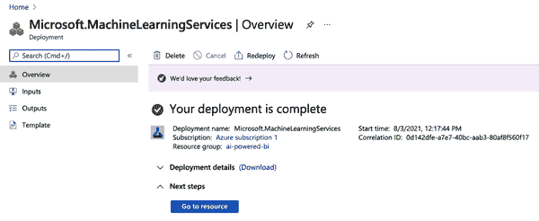

# 第四章：原型

到现在为止，您应该已经具备了足够的理论背景知识，可以开始进行一些 AI 用例的实际操作了。在本章中，您将学习如何借鉴产品管理的原型技术，快速创建并实施 ML 用例，并验证您对可行性和影响的假设。

记住，我们的目标是迅速找出我们的 AI 驱动想法是否创造价值，以及我们是否能够在不浪费太多时间或其他资源的情况下构建解决方案的第一个版本。本章不仅将向您介绍有关原型的理论概念，还将介绍我们将在本书示例中使用的具体工具。

# 什么是原型，为什么它如此重要？

让我们面对现实吧：大多数 ML 项目都会失败。这并不是因为大多数项目资金不足或缺乏人才（尽管这些也是常见问题）。

ML 项目失败的主要原因是围绕它们存在的极大不确定性：需求、解决方案范围、用户接受度、基础设施、法律考虑因素以及最重要的结果质量，这些都非常难以在新倡议开始之前预测。特别是在结果方面，您永远无法真正知道您的数据是否具有足够的信号，直到您经历了数据收集、准备、清洗并构建实际模型的过程。

许多公司在开始他们的第一个 AI/ML 项目时充满了热情。然后他们发现这些项目变成了无底洞。数月的工作和数千美元的花费仅仅是为了得到一个简单的结果：它不起作用。

原型是一种在扩展之前减少风险并评估您的 ML 用例影响力和可行性的方法。通过原型，您的 ML 项目将更快速、更便宜，并且将获得更高的投资回报率。

对于本书而言，*原型*是一个未完成的产品，其简单目的是验证。像 PoC 或最小可行产品（MVP）这样的概念有着相同的目的，但这些概念背后有着不同的背景，并且涉及的不仅仅是验证。验证的概念非常重要，因为如果没有需要验证的内容，你就不需要构建原型。

在 AI 或 ML 项目的背景下，您希望在两个维度上验证您的用例：影响力和可行性。这就是为什么在继续构建某些东西之前，您需要对这些类别有一个大致的了解。

这里有一些在机器学习和人工智能背景下可以验证的示例：

+   您的解决方案是否为用户提供了价值？

+   你的解决方案是否如预期般使用？

+   您的解决方案是否被用户接受？

+   您的数据是否包含足够的信号以构建有用的模型？

+   AI 服务是否能够很好地与您的数据配合，提供足够的价值？

要成为有效的验证工具，机器学习原型必须是端到端的。创建准确的模型是好的。创建有用的模型更好。获取这些信息的唯一途径是让你的机器学习解决方案面向真实用户。你可以建立世界上最好的客户流失预测模型，但如果市场营销和销售人员没有准备好将预测付诸行动，你的项目将是失败的。这就是为什么你需要快速的用户反馈。

当你原型化你的机器学习驱动解决方案时，不要在数据上妥协。不要使用在生产中不可用的数据。不要进行无法扩展的手动清理。你可以修复模型；你可以修复用户界面。但你不能修复数据。把它当作在生产场景中对待的方式。

一个原型通常应该有以下明确定义的范围：

明确的目标

例如，“我们能否建立一个比我们基线 B 在预测*y*时更好的模型，给定一些数据*x*？”

严格的时间框架

例如，“我们将在最多两周内建立我们能建立的最好模型。”

接受标准

例如，“如果发生了反馈 F，我们的原型通过了用户验收测试。”

当涉及技术时，原型应该让你决定在何种技术栈内最好地实现目标。原型为你提供宝贵的洞察潜在问题领域（例如数据质量问题），同时从一开始就吸引业务利益相关者并管理他们的期望。

# 商业智能原型化

几十年来，商业智能系统的典型开发过程是经典的瀑布方法：项目被计划为一个线性过程，从需求收集开始，然后转移到设计，接着是数据工程，测试和部署业务所需的报告或指标。

即使没有人工智能或机器学习，瀑布方法也正在达到其极限。这是因为几个因素共同作用。随着业务要求变得越来越模糊，因为业务本身变得更加复杂。此外，技术也变得更加复杂。10 年前，你可能只需要整合少数几个数据源，而今天，即使是小公司也不得不管理数十个系统。

当你为大规模商业智能计划准备好项目计划时，通常它已经被现实超越了。随着人工智能/机器学习及其相关不确定性，事情不会变得更容易。

要成功推出作为商业智能系统一部分的人工智能驱动解决方案，你必须本质上将你的商业智能系统视为一个数据产品。这意味着承认你不知道你的想法最终是否会按计划进行，最终的解决方案会是什么样子，以及你的用户是否按预期与其互动。产品管理技术，如原型设计，将帮助你减少这些风险，并允许更灵活的开发。但在商业智能领域如何准确应用原型设计呢？

BI 生产系统中的报告通常默认为可靠和可用，其包含的信息是准确的。因此，您的生产系统并不适合在用户之间测试某些东西。我们还有什么其他选择？

通常公司使用测试系统来尝试新功能，然后再将其投入生产。但是，测试系统的问题在于其通常涉及与生产系统相同的技术工作量和挑战。通常会为测试目的复制整个生产环境：测试数据仓库、测试前端 BI 和 ETL 过程的测试区域，因为您希望确保在测试系统上有效的内容也能在生产中运行。

根据我们的定义，原型设计发生在测试之前，如 图 4-1 所示。对于原型设计，您需要从数据摄入、分析服务到用户界面的深度垂直集成，同时保持总体技术复杂性低。

###### 图 4-1\. 软件开发过程中的原型设计

在大多数情况下，特别是在单块 BI 系统中，您的生产和测试堆栈不适合在几天或几周内进行原型设计。为了我们的目的，我们需要更简单和轻量级的东西。

无论您使用哪种技术堆栈，都应确保以下内容：

+   技术堆栈支持 AI 使用案例架构的三个层面（数据、分析和用户界面），以确保数据可用且适合使用，您的模型在您的数据上表现良好，并且用户接受并看到您的解决方案的价值。

+   您的堆栈应该是开放的，并且提供高连接性，以便将来能够集成到测试系统甚至生产系统中。这一方面至关重要，因为如果测试成功，您希望能够顺利从原型阶段过渡到测试阶段。如果您在本地机器上进行原型设计，则将工作流程从计算机转移到远程服务器并期望它能顺利运行将变得非常复杂。像 Docker 这样的工具将帮助您简化过渡，减少与您最初的验证假设无关的技术摩擦。

因此，针对基于 AI 的 BI 使用案例的完美原型平台提供高连接性、许多可用的集成服务和低初投资成本。云平台已被证明相当好地满足了这些要求。

此外，你应该使用一个平台，可以轻松访问第二章中涵盖的各种 AI/ML 服务。如果有数据可用，ML 模型的原型设计最多只需两到四周，有时仅需几天。用于回归/分类任务的 AutoML、用于商品服务（如字符识别）的 AIaaS 以及用于定制深度学习应用程序的预训练模型，而不是从头开始训练它们。

在你的下一个 ML 项目中，为了避免不必要的时间和金钱浪费，建议先建立一个原型。

# 本书的 AI 原型工具包

在本书中，我们将使用 Microsoft Azure 作为原型设计的平台。你可以使用许多其他工具，包括 AWS 或 GCP。这些平台在功能上是可比较的，我们在 Azure 上的操作，基本上也可以在任何其他平台上完成。

我选择 Azure 有以下两个原因：

+   许多企业正在使用 Microsoft 堆栈，并且 Azure 将是他们最熟悉的云平台。

+   Azure 与 Power BI 集成得非常顺畅，Power BI 是许多企业中流行的 BI 工具。

也许你会想，像 Azure 这样一个成熟的云平台如何轻便到足以用于原型设计。主要原因在于，我们并未使用整个 Azure 平台，而仅使用作为“服务”提供的部分，因此我们不必担心底层的技术细节。我们将使用的主要服务包括 Azure Machine Learning Studio、Azure Blob Storage、Azure 计算资源以及一组 Azure 认知服务，这是微软的 AI 即服务提供。

好处在于，虽然我们仍处于原型阶段，但基础架构也能应对生产环境。我们需要更改解决方案的流程、维护、集成和管理，但技术基础将保持一致。我们将在第十一章中详细讨论这一点。

我会尽量不过多依赖仅适用于 Azure 和 Power BI 的功能，但保持足够开放，以便你可以将自己的 AI 模型连接到自己的 BI。此外，大多数 Azure 与 Power BI 的集成需要专业许可证，我不希望给你带来这种麻烦。让我们从 Microsoft Azure 的设置开始。

# 使用 Microsoft Azure

本节简要介绍了 Microsoft Azure，并帮助你激活从第七章开始的使用案例所需的所有工具。虽然你可能暂时不需要所有这些服务，但建议提前设置它们，这样你可以专注于实际使用案例，而不是处理技术上的开销。

## 注册 Microsoft Azure

要在第七章及以后创建和使用 AI 服务，你需要一个 Microsoft Azure 帐户。如果你是平台的新用户，Azure 为我们在本书中涵盖的所有服务提供首次 12 个月的免费访问（截至撰写本文时）。你还将获得用量计费的服务的免费 200 美元信用额。

要探索免费访问并注册，请访问 [*https://azure.microsoft.com/free*](https://azure.microsoft.com/free) 并开始注册流程。

###### 注意

如果你已经有 Azure 帐户，你可以直接跳转到 “创建 Azure 计算资源”。请注意，如果你不是在免费试用期内，可能会收费。如果你不确定，请在继续之前联系你的 Azure 管理员。

要注册，你将被提示创建一个 Microsoft 帐户。我建议你为测试目的创建一个新帐户（并利用免费信用额外奖励！）。如果你有企业帐户，你可以尝试继续使用，但你的公司可能会有限制。因此，最好从头开始，稍作试探，一旦你把一切弄清楚，再继续使用你公司的帐户。

在接下来的页面上，点击“创建一个！”（图 4-2）。

###### 图 4-2\. 创建一个新的 Microsoft 帐户

接下来，输入你的电子邮件地址，然后点击下一步。创建一个密码并继续。确认你不是机器人后，你应该看到 图 4-3 中显示的屏幕。

###### 图 4-3\. Azure 注册提示

你必须通过有效的电话号码确认你的帐户。输入你的信息，点击“给我发短信”或“给我打电话”。输入验证码，然后点击“验证代码”。成功验证后，查看条款并点击下一步。

你就快成功了！最后一个提示需要你提供信用卡信息。为什么？所有主要云平台都是如此。一旦你的免费信用额用完或免费期限到期，你将会被收费使用这些服务。但是对于初学者来说，微软的好处是你不会自动收费。免费期结束时，你将需要选择按使用量计费。

成功注册后，你应该看到 图 4-4 中显示的 Azure 门户屏幕。

###### 图 4-4\. Azure 门户仪表板

欢迎来到 Microsoft Azure！你可以随时访问这个主页，访问 *[portal.azure.com](http://portal.azure.com)*。让我们快速浏览 Azure 门户首页：

导航栏（1）

你可以在左侧打开门户菜单，或者在右上角导航至你的帐户设置。

Azure 服务（2）

这些是为您推荐的服务。对于您来说，它们可能看起来不同，特别是如果您是新注册用户。

创建资源（3）

这将是您最常使用的按钮之一。您可以使用它在 Azure 上创建新的服务资源。

导航（4）

此部分包含工具和其他各种项目，可带您进入各种设置。目前您不需要它们。

当您看到此屏幕时，您的 Microsoft Azure 设置已完成。如果您在设置 Azure 帐户时遇到问题，我建议您查阅以下资源：

+   [Azure 视频](https://oreil.ly/dWMDM)

+   [Azure Lessons 网站](https://oreil.ly/dmaaH)

## 创建 Azure 机器学习工作室工作区

Azure 机器学习工作室将成为我们在 Microsoft Azure 中构建和部署自定义 ML 模型以及管理数据集的工作台。您首先需要创建一个 Azure 机器学习工作区。工作区是您 Azure 帐户中的基本资源，其中包含所有实验、训练和部署的 ML 模型。

工作区资源与您的 Azure 订阅相关联。虽然您可以通过编程方式创建和管理这些服务，但我们将使用 Azure 门户来浏览整个过程。请记住，您在这里使用鼠标和键盘完成的每一步都可以通过自动化脚本来完成。

登录到您用于 Azure 订阅的 Microsoft 帐户，并访问 *[portal.azure.com](http://portal.azure.com)*。点击“创建资源”按钮（图 4-5）。

###### 图 4-5\. 在 Azure 中创建新资源

现在使用搜索栏查找 `**machine**` `**learning**` 并选择它（图 4-6）。

###### 图 4-6\. 搜索 ML 资源

在机器学习部分，点击创建（图 4-7）。

###### 图 4-7\. 创建新的 ML 资源

您需要为新工作区提供一些信息，如 图 4-8 所示：

工作区名称

为工作区选择一个与您创建的其他工作区不同的唯一名称。项目名称通常是工作区名称的良好选择。本示例使用 `auto-ml`。名称必须在所选资源组内是唯一的。

订阅

选择要使用的 Azure 订阅。

资源组

资源组将您 Azure 订阅中的资源捆绑在一起，例如可能与您的部门相关联。我强烈建议您在此阶段创建一个新的资源组，并将您将为本书设置的任何服务分配给此资源组。这将使以后的清理工作变得更加容易。单击“创建新内容”，并为新的资源组命名。此示例使用 `ai-powered-bi`。无论何时在任何地方看到此引用，请用您自己资源组的名称替换它。

位置

选择最接近用户和数据资源的物理位置。在将数据传输至欧盟（EU）等受保护地理区域之外时，请格外小心。大多数服务通常首先在美国地区提供。

输入完所有信息后，请单击“审阅 + 创建”。通过初步验证后，再次单击创建。

###### 图 4-8\. 配置 ML 资源

在 Azure 云中创建您的工作区可能需要几分钟时间。完成过程后，您将看到成功消息，如图 4-9 所示。

###### 图 4-9\. ML 资源创建成功

要查看新的工作区，请单击“转到资源”。这将带您到 ML 资源页面（参见图 4-10）。 

###### 图 4-10\. ML 资源概览

您现在已选择先前创建的工作区。在此验证您的订阅和资源组。如果您希望通过编程方式训练和部署 ML 模型，现在还可以转到您喜欢的代码编辑器，并从那里继续。

但由于我们希望继续无代码旅程，请单击“启动工作室”以在不编写任何代码的情况下训练和部署 ML 模型。这将带您到机器学习工作室的欢迎界面（参见图 4-11）。您还可以直接访问 *[ml.azure.com](http://ml.azure.com)*。

###### 图 4-11\. Azure 机器学习工作室主页

机器学习工作室是一个网络界面，包含多种 ML 工具，适用于各种数据科学场景，适合各种技能水平的数据科学从业者。该工作室支持所有现代网络浏览器（不包括 Internet Explorer）。

欢迎界面分为三个主要区域：

+   左侧是菜单栏，可访问 ML Studio 中的所有服务。

+   顶部是推荐服务，您可以通过单击“创建新内容”直接创建更多服务。

+   底部将显示 ML Studio 内最近启动的服务或资源概览（由于您刚刚设置了帐户，此处应为空）。

## 创建 Azure 计算资源

您已经创建了 Azure 订阅和 Machine Learning Studio 的工作区。到目前为止，您还没有启动任何实际执行任务的服务或资源，可以将这些视为“开销”。

现在即将改变。在接下来的步骤中，您将创建一个*计算资源*。您可以将计算资源想象成一个虚拟机（或一组虚拟机），在这里运行您的作业的实际工作负载。在现代云平台（如 Microsoft Azure）上，可以通过几次点击（或从命令行提示）来创建和删除计算资源，并在几秒钟内进行配置或关闭。您可以选择各种机器设置——从小型便宜的计算机到支持图形处理单元（GPU）的高性能机器。

###### 警告

创建计算资源后，资源在线后，将按照计算资源列表中提到的价格（例如，每小时$0.6）进行计费。如果您仍在使用免费的 Azure 信用额度，则费用将从中扣除。否则，将会直接从您的信用卡中扣款。为了避免不必要的费用，请确保停止或删除任何您不再需要的计算资源。

您将创建一个计算资源，您可以在本书中的所有示例中使用它。在实际操作中，您可能希望为不同的项目设置不同的计算资源，以便更透明地了解哪个项目产生了哪些成本。然而，在我们的原型示例中，一个资源就足够了，您可以轻松跟踪资源是否正在运行，以免耗尽您的免费试用预算。

您可以直接在 Azure ML Studio 中创建计算资源。在左侧导航栏中点击“计算”选项。

然后点击“创建新的计算”，屏幕将显示类似于图 4-12 的界面。要选择机器类型，请选择“从所有选项中选择”单选按钮。

###### 图 4-12\. 创建新的计算实例

您可以在这里看到所有可用的机器类型（图 4-13）。分配的性能越高，通常机器学习培训速度越快。美国东部地区最便宜的资源是一台标准型 DS1_v2 机器，配有一个核心、3.5 GB RAM 和 7 GB 存储空间，大约每小时约 $0.06。

在“按 VM 名称搜索”选项中键入 `**Standard_DS1**` 并选择价格最低的机器，如图 4-13 所示。在这里，您可以选择任何类型的机器；只需确保价格合理，因为目前我们不需要高性能。

###### 图 4-13\. 选择一个标准型 DS11 机器

点击“创建”按钮。这将带您回到计算资源的概述页面。请等待资源创建完成，通常需要两到五分钟。一旦资源配置完成，计算资源将自动启动（见图 4-14）。

###### 图 4-14\. 计算资源正在运行

由于您在第七章之前不需要此资源，请选择该资源并点击“停止”以防止其占用资源。最终，您的计算资源摘要页面应类似于图 4-15。您的计算资源应显示在列表中，但其状态应为已停止。

###### 图 4-15\. 计算资源已停止

## 创建 Azure Blob 存储

我们原型设置的最后一个构建块是存储和上传文件的地方，例如 CSV 表格或图像。这些二进制文件的典型存放位置是 Azure Blob 存储；*blob*代表*二进制大对象*，基本上是几乎所有文件的文件存储，具有几乎无限的扩展能力。我们主要用于从我们的 AI 模型写入输出或为第七章中的用例分期图像文件。

要在 Azure 中创建 blob 存储，请访问*[portal.azure.com](http://portal.azure.com)*并搜索`**storage accounts**`。点击“创建”并在与您的 ML Studio 资源位于同一地区的位置创建新的存储帐户。为此帐户指定一个唯一名称，然后选择标准性能和本地冗余存储，如图 4-16 所示。由于这仅是测试数据，您无需为更高的数据可用性标准支付更多。再次强调，您只会在这里暂时保存数据，并且这些费用将完全被您的免费试用预算覆盖。

###### 图 4-16\. 正在创建存储帐户

部署完成后，点击“转到资源”。您将看到图 4-17 所示的界面。

###### 图 4-17\. Azure 存储帐户概述

点击左侧的“访问密钥”以打开如图 4-18 所示的屏幕。在以编程方式访问存储中的对象时，您将需要这些访问密钥。

###### 图 4-18\. Azure 存储帐户访问密钥

现在您已经有一个存储帐户和用于操作数据的密钥，您需要创建一个*容器*，这类似于一个帮助组织文件的文件夹。点击左侧菜单中的“容器”选项，然后点击屏幕顶部的“+ 容器”，如图 4-19 所示。

###### 图 4-19\. 创建 Azure Blob Storage 容器

创建名为`**tables**`的容器。将访问级别设置为“容器”，这样通过外部工具如 Power BI 稍后访问文件会更加方便。创建另一个名为`**simulation**`的容器，设置相同的配置。

如果涉及敏感或生产数据，当然应选择“私有”，以确保在访问数据之前需要授权。新容器将显示在列表中，并准备好用于托管一些文件。

# 使用 Microsoft Power BI

对于用户层，我们将依赖 Microsoft Power BI 作为工具来显示报告、仪表板以及 AI 模型的结果。Power BI 有两个版本：Power BI Desktop 和 Power BI Service。

Power BI Desktop 目前仅适用于 Windows。这款离线应用安装在您的计算机上，并拥有您可以期待的所有 Power BI 功能。如果您有 Microsoft Office 订阅，Power BI 很可能是其一部分。您可以从[Microsoft Power BI 下载页面](https://oreil.ly/9LpZX)下载 Power BI。

Power BI Service 是 Power BI 的在线版本，可在包括 Mac 在内的所有平台上运行。它目前并不具备桌面版本的所有功能，但定期添加新功能。不能保证本书涵盖的所有内容都能在 Power BI Service 上运行，但如果无法或不想在计算机上安装 Power BI，则可以尝试使用它。您可以从其[入门页面](https://oreil.ly/9SyDY)开始使用 Power BI Service。

如果您以前从未使用过 Power BI，观看微软的 45 分钟[入门课程](https://oreil.ly/ySgML)可能会很有帮助，该课程会高层次地介绍工具的工作原理。

###### 警告

不幸的是，Power BI 并不总是能提供完全可复制的结果。在本书的使用案例中，您可能会注意到您的一些视觉效果和自动建议与本书中的截图不完全一致。不要对此感到过度困惑，总体上的情况应该是相同的，即使在这里和那里出现一些小变化。

如果您不喜欢使用 Power BI，或者想使用自己的 BI 工具，您应该能够在其他任何支持 Python 或 R 脚本执行的 BI 工具中重新创建本案例研究（除了第五章和第六章）。 

要在 Power BI 中运行 Python 或 R 脚本，您需要在计算机上安装其中一种语言，并让 Power BI 指向相应的内核。请检查以下资源，确保 Power BI 与 R 或 Power BI 与 Python 正确设置：

+   [在 Power BI Desktop 中运行 R 脚本](https://oreil.ly/mY33x)。

+   [在 Power BI Desktop 中运行 Python 脚本](https://oreil.ly/Ineut)。

除了干净的 Python 或 R 引擎外，您稍后需要一些用例操作的包。对于 R 来说，这些包如下：

+   *httr*（用于进行 HTTP 请求）

+   *rjson*（用于处理 API 响应）

+   *dplyr*（用于数据准备）

对于 Python 脚本，其等效项如下：

+   *requests*

+   *json*

+   *pandas*

确保这些包已安装到您使用的 Power BI 中的 R 或 Python 引擎中。如果您不知道如何在 R 或 Python 中安装包，请查看以下 YouTube 视频：

+   [“在 R 中安装包”](https://oreil.ly/Z8g56)

+   [“Python 工作坊—安装包”](https://oreil.ly/WT1pF)

# 摘要

希望本章为您在数据产品开发原型的背景下对原型有了坚实的理解，并且为何强烈建议在任何 AI/ML 项目中首先使用原型进行了解释。到目前为止，您应该已经准备好个人的原型工具包，以便在下一章节中处理实际的用例。让我们开始吧！
