# 第五章：AI 动力描述性分析

在本章中，我们将探讨两个用例，展示 AI 如何帮助我们更快地执行描述性分析，并提供一种更直观和无缝互动大数据集的方式，即使是非技术人员也能轻松掌握。我们还将看到现代 BI 工具（例如 Power BI）的自然语言能力如何为我们减少一些单调的任务。

# 使用案例：用自然语言查询数据

业务用户典型的分析思维过程通常从一个简单的问题开始，比如以下之一：

+   上个月我的销售额是多少？

+   今年我们比去年卖得更多了吗？

+   最畅销的产品是什么？

这些问题大多是描述性的。用户首先需要了解现状，然后才能深入分析甚至预测未来事件。

解决这个问题的经典方法是，分析师为特定的业务单位或部门的最常见问题创建一组静态报告。然而，通过静态报告或可视化来预测所有最常见的问题对于业务分析师或 BI 设计师来说是极其困难的。根据你关注的问题和询问的人员，感兴趣的确切领域可能有根本不同。在组织中，这通常会导致与不同利益相关者长时间而详尽地讨论在仪表板中显示哪些图表。

这就是自助 BI 系统通常介入的地方，允许个人创建自己的内容。与事先生成所有重要的仪表板和可视化不同，业务用户可以自行切割和切块数据，并创建他们需要的可视化效果。

然而，自助 BI 系统也存在问题。首先，通过可定制的逐级深入或额外维度不可能激活所有可能的思维路径。一个问题经常导致另一个问题，而在数据模型中预测所有可能的思维路径会导致复杂的数据结构和不直观的报告生成器——只是为了展示一些过去的描述性分析。其次，并非所有业务用户都了解如何正确地切割和切块数据，这导致不正确的仪表板和错误的洞察力。将各种度量和维度汇总到自定义仪表板中，对于未接受过培训的非技术用户来说仍然意味着很多摩擦。

总结一下，BI 系统中的静态和自助式方法都无法回答个人提出的所有可能问题，而个人通常也不能总是自行筛选数据，因为这不是他们的主要任务之一。商业用户想要的是提出问题并得到答案。在这一点上，他们通常会寻求数据分析师的帮助来解决问题。当然，这种方法的可扩展性不强，因为组织通常拥有比数据分析师更多的业务用户。即使您能负担得起拥有大量分析专业知识，您也不希望让分析师忙于重复、易于解决的任务。现在让我们为我们的示例用例场景奠定情景基础。

## 问题陈述

我们正在查看 Power BI 中的销售数据。销售管理人员在认识到积极的收入趋势后，已与 BI 团队接洽，并希望深入了解当前情况。作为 BI 分析师，我们被委托为销售人员提供支持，并帮助他们深入了解其特定关注领域的收入发展情况。在自助式 BI 的同样理念下，我们希望提供“自助式帮助”，并使销售人员能够无缝地与数据集互动，而无需任何技术障碍。

## 解决方案概述

与其让业务用户与数据分析师合作获取简单描述性统计的答案，更高效的方法是让用户通过自然语言提问来查询数据，并自动或几乎不需要人工干预地得到答案。大多数人甚至没有意识到，他们多年来（或者使用像 Google 这样的互联网搜索引擎多长时间以来），一直在接受这种方法的训练。

例如，如果业务用户想要比较某个国家的销售数字与去年的数据，他们可能想发出这样的查询：

+   `**显示我去年和今年在美国的销售情况**`

实际上，由于 AI 驱动的自然语言功能，用户可以做到这一点。背后的原理是，AI 驱动的自然语言模型解释用户输入，尝试将其映射到数据集中的可用数据，并为其提供适当的可视化效果。这一体验应该快速、互动且无摩擦。图 5-1 展示了我们解决方案的概念架构。

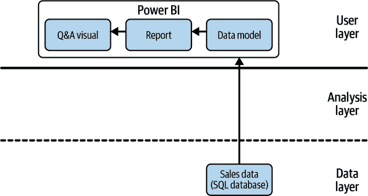

###### 图 5-1\. 自然语言使用案例架构

如您在 Figure 5-1 中所见，我们正在使用 Power BI 作为我们的 BI 工具，并将利用其内置的 AI 能力来解决我们的问题。因此，分析层为空，因为我们没有使用任何外部分析服务。一切都内置于 Power BI 中并在用户层中发生。其他 BI 工具，如 Tableau，提供类似的功能，但细节可能有所不同。无论如何，选择一个适合此任务的良好 BI 前端至关重要，因为如果它没有提供原生支持（或提供此类附加组件），则无法向 BI 软件添加 NLP 能力。

在 Power BI 中，NLP 功能被称为 *Q&A visual*。Q&A visual 允许您用自然语言探索数据，以您自己的话语进行探索。Q&A 是交互式的，甚至可能很有趣。它似乎是我们问题陈述的一个很好的候选者。

用户可以像将任何其他可视化对象拖放到报告中一样，将 Q&A visual 拖放到报告中，以便用户可以对数据执行自定义查询。Q&A visual 还可以作为一个按钮添加到功能区，与报告独立，并集成到仪表板中。它可以与以下数据源一起使用：导入的数据、连接到 Azure Analysis Services 的实时连接，以及通过网关连接到 SQL Server Analysis Services 的 Power BI 数据集。

## Power BI 演示

要按照本示例操作，您首先需要从[书籍网站](https://oreil.ly/jgjFu)下载名为 *Sales & Marketing sample PBIX.pbix* 的文件。该数据集包含来自一个虚构制造公司的各种销售和营销数据。

数据集已经预先填充了一些报告，用于跟踪公司的市场份额、产品量、销售数据和情感分数。在我们的案例研究中，我们假设数据集中的所有制造商都属于同一控股集团，以便我们可以分析总收入作为一个关注指标。因此，我们对原始情景中突出显示的个别制造商的市场份额不太感兴趣。你可以从[Power BI 网站](https://oreil.ly/S6rOE)了解更多有关数据集的信息。

让我们从打开 Power BI Desktop 开始。在 Power BI 的左上部分，选择 文件 → 打开报告 → 浏览报告。然后，从您下载文件的文件夹中选择 *Sales & Marketing sample PBIX.pbix* 文件。您应该能看到该报告文件的介绍界面（见 Figure 5-2）。

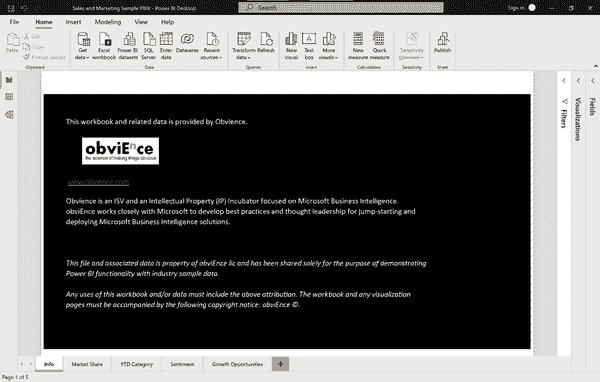

###### 图 5-2\. Power BI 示例报告

现在，我们不会关心预先编写的报告和仪表板。我们的目标是提供销售数据的高级概述，以及使我们的用户能够与我们的数据进行交互查询。

如果这是您第一次使用 Power BI，我建议您花四分钟阅读 Microsoft 文章 [“Tour the Report Editor in Power BI”](https://oreil.ly/2jBnn)。它会使您熟悉报告画布、过滤器、可视化和字段窗格等最基本的术语和概念。

首先，您需要通过点击屏幕底部的加号图标添加一个新的空白页面到报告中。在空白的报告页面上，打开右侧的可视化面板。从可视化面板中选择 Q&A 可视化图标（图 5-3），双击将其添加到画布上。

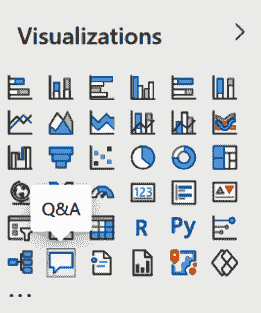

###### 图 5-3\. Q&A 可视化图标

拖动边框，使可视化填满整个报告的宽度。增加高度，以便大致覆盖报告画布的一半。您的报告屏幕现在应该看起来类似于 图 5-4。

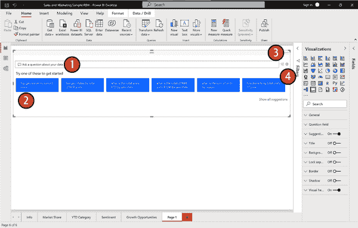

###### 图 5-4\. Q&A 可视化默认屏幕

现在，让我们更详细地探索这个可视化。Q&A 可视化包括四个核心组件：

文本框（1）

这是用户输入其问题或查询的地方，也是他们将看到自动完成和自动建议功能的地方。

推荐问题列表（2）

这个预先填写的列表包含用户可以一键运行的示例问题。

转换图标（3）

这将把 Q&A 工具的输出转换成标准的 Power BI 可视化。

Q&A 齿轮图标（4）

这将打开一个设置菜单，允许设计人员配置底层的自然语言引擎。

让我们尝试这个可视化，选择第一个建议的问题。点击第一个示例表达式：“top geo states by sum of score.”（如果 Power BI 给出了不同的建议，请按照它的指示操作。）

Power BI 将会展示似乎最适合此分析的可视化。在这种情况下，它展示了一个地图可视化，显示了排名前的州（图 5-5）。

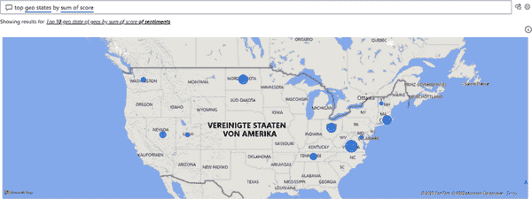

###### 图 5-5\. Q&A 地图输出

我们可以通过在查询中加入这部分来将其更改为几乎任何其他类型的可视化。尝试更改文本框中的文本如下：**`top geo states by sum of score as bar chart`**。这个查询将呈现一个水平条形图，而不是地图（图 5-6）。

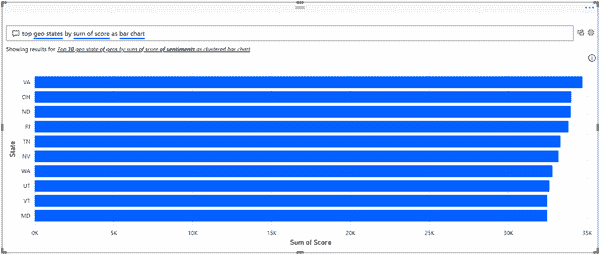

###### 图 5-6\. Q&A 条形图输出

现在，让我们回到文本框，探索用户如何在这里输入问题。Q&A 工具可以回答各种查询，包括但不限于 表 5-1 中列出的内容。

由于我们对收入趋势感兴趣，我们想要创建一个简单的折线图，显示随时间变化的总收入，最好按年份分解。为了实现这个目标，让我们向 Power BI 提出一个简单的查询：**`Show me revenue over time`**。

表 5-1\. Power BI Q&A 可视化示例命令

| 类型 | 示例 |
| --- | --- |
| 提出自然问题 | 哪些销售额最高？ |
| 相对日期过滤 | 过去一年的销售 |
| 按变量筛选 | 美国的销售 |
| 按条件筛选 | 产品类别 A 或类别 B 的销售 |
| 显示特定可视化 | 按产品的销售饼状图 |
| 显示聚合 | 按产品的销售中位数 |
| 排序 | 按国家代码排序的销售前 10 个国家 |
| 比较 | 按日期的总销售与总成本 |
| 时间 | 按时间的销售 |

我们在 图 5-7 中看到的结果并不完全符合预期。输出只是显示了 1999 年的一些日期。这里发生了什么？

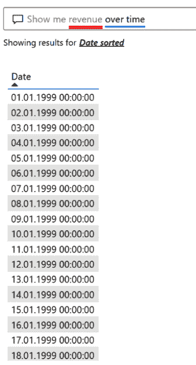

###### 图 5-7\. 显示随时间变化的收入

通过查看文本框，我们可以了解更多信息，Power BI 帮助我们识别查询中的问题短语。下面“revenue”下方的红线表明 Power BI 无法解释这个变量。实际上，这里的下划线遵循一种明显的颜色代码：

+   系统以实线蓝色下划线表示成功将单词与数据模型中的字段或值匹配。

+   橙色下划线表示表达式的匹配信心较低。如果表达式不明确，例如多个字段包含“sales”表达式，则会发生这种情况。

+   红色下划线表示问答工具完全无法将单词与数据模型中的任何内容匹配。

如果单击下划线的单词，您将看到 Power BI 如何解决冲突的建议。对于“revenue”表达式，Power BI 无法将其分配给一个度量单位。让我们更加明确地调整查询如下，“**`Show me sum of revenue over time`**”。

正如您所见，如果依赖默认值，查询必须具体明确。我们稍后会修复这个问题，但现在让我们接受建议并看看会发生什么（图 5-8）。

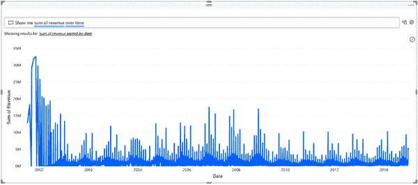

###### 图 5-8\. 显示随时间变化的收入总和

这看起来更符合我们的预期。Power BI 展示了一个折线图，按天列出了随时间变化的总收入。虽然这不错，但我们很难看到大趋势。因此，让我们更加具体地询问，“**`Show me sum of revenue over time by year`**”。

添加`by year`表明我们希望 Power BI 进行年度汇总。因此，Power BI 展示了一个清晰的折线图，我们可以立即看到 2006 年收入飙升，然后随后呈负增长趋势（图 5-9）。自 2010 年以来，趋势似乎再次呈正向。

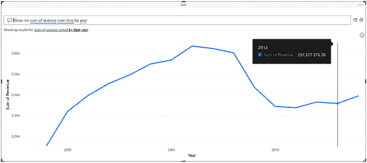

###### 图 5-9\. 显示按年度收入总和随时间变化

假设我们想保留这个可视化图表，为我们的报告消费者提供一个高层概述销售情况。默认情况下，查询结果不会保存或持久化在报告中。因此，如果报告被共享并由另一个用户打开，他们会看到空的 Q&A 可视化图表和最初的建议，就像我们之前所做的一样。

如果您想共享 Q&A 可视化的输出，您必须首先将其转换为静态可视化。要这样做，请点击转换可视化图标，在之前的 图 5-4 中显示。Power BI 将把 Q&A 可视化转换为简单的折线图。

到目前为止，我们已经创建了一个静态的高层可视化图表。现在，我们可以开始添加一个自助服务区域，使业务用户能够使用自定义问题查询数据。

将收入可视化水平调整，以在其下方腾出更多空间。选择 插入 → 文本框，在可视化顶部插入一个标题，标题为 **`自助服务收入分析`**。将此报告工作表从“第 1 页”重命名为 **`按年度总收入`**。

让我们再添加一个可视化图表。从可视化面板中双击 Q&A 可视化，使其出现在按年度总收入线图下方。您的报告现在应该类似于 图 5-10。

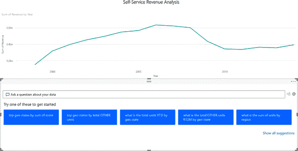

###### 图 5-10\. Q&A 报告布局

要使 Q&A 可视化更有帮助和更直观地用于业务用户，我们还想调整 Q&A 工具内部使用的默认建议以及措辞。单击文本框右侧的 Q&A 齿轮图标以编辑 Q&A 可视化设置。您将看到各种选项。在接下来的几段中，我将为您介绍一些选项，这些选项足以定制 Q&A 可视化，以便业务用户（而不仅仅是数据分析师）可以使用它。

我们从 *字段同义词* 开始，如 图 5-11 所示。在 Q&A 工具中，每个 *字段*（例如，度量、维度或表）都可以具有一个或多个同义词。例如，假设您的数据模型有一个度量单位“销售”，但您希望用户将此指标称为“收入”。在这种情况下，“收入”就成为“销售”的字段同义词。

Power BI 将向您显示数据维度列表，并允许您为用户所使用的各种业务术语为不同字段添加同义词。在此示例中，打开 SalesFact 列表，如 图 5-11 所示。

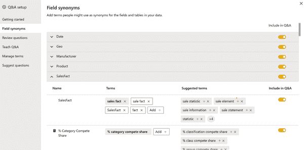

###### 图 5-11\. Q&A 工具中的字段同义词

您将在此列表中看到所有措施，以及同义词的自动建议和一个切换按钮，您可以选择是否将此字段包含在问答小部件中。向下滚动到“总收入”部分。点击“添加”按钮，在此处加入“总收入”作为同义词，如图 5-12 所示。还将“总的收入”，“收入”，“总收入”，“总销售额”和“总销售”添加到同义词中。我们也可以浏览其他字段，但现在让我们结束这个练习。

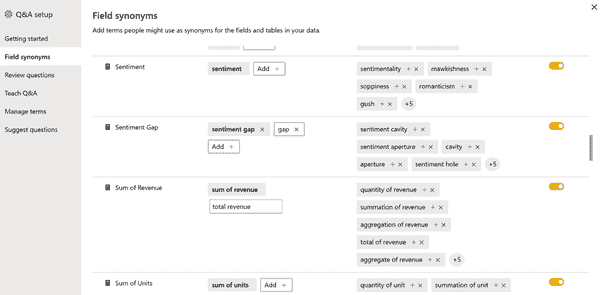

###### 图 5-12\. 问答字段同义词

点击左侧菜单中的“管理术语”，您将看到添加到问答视觉中的所有术语和定义的列表（图 5-13）。这样，您可以轻松跟踪您所做的任何更改，并删除不合适的术语。

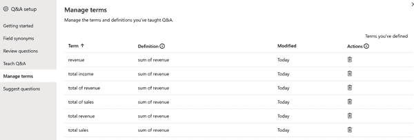

###### 图 5-13\. 管理术语

现在，请转到左侧菜单中的“建议问题”。此部分允许您编辑系统默认向用户建议的问题，您可以在图 5-14 中看到。

让我们从按地区进行收入细分开始。输入 **`显示按地区的收入`**。这将在预览窗口中生成一个图表（图 5-14）。

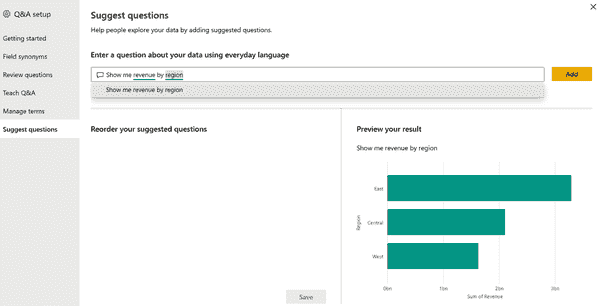

###### 图 5-14\. 建议问题

好的，让我们通过点击“添加”按钮将其添加到我们的建议中。

业务用户通常很擅长通过示例学习。为了让用户更直观地了解如何使用问答工具，让我们对之前的问题添加一个变体。业务用户稍后应该可以舒适地用“产品”等替换“地区”等内容。

添加以下建议：**`显示按年度按地区的收入`**。这将生成三个折线图，引出了比较数据点的概念。因此，让我们添加一个更复杂的建议问题示例，展示业务用户如何比较产品销售表现。让我们添加这个略微复杂的建议问题：**`按年度比较 Maximus UM-01 和 Maximus UM-02 的收入`**。

这产生了一个非常有见地的图表，显示我们 Maximus UM-01 自 2005 年达到峰值以来的收入下降，而新产品 Maximus UM-02 自 2007 年初发布以来似乎在逐渐起飞。到 2012 年，新产品贡献的收入超过了其前身，正如您可以在图 5-15 中看到的那样。

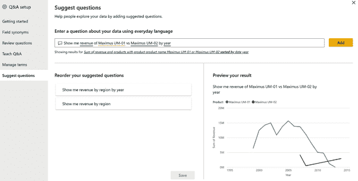

###### 图 5-15\. 问答收入比较

为了组织建议问题列表，您可以将问题拖动到您想要的顺序中。让我们将最简单的查询移动到第一个位置，最复杂的查询移动到最后一个位置。保存建议。关闭问答设置窗口。

再次查看我们的报告，我们可以看到我们刚刚创建的三个建议现在显示在 Q&A 可视化中。业务用户可以通过简单点击建议开始其数据探索，然后根据需要修改查询，例如将“地区”替换为“地理州”。您可以在图 5-16 中看到最终示例。

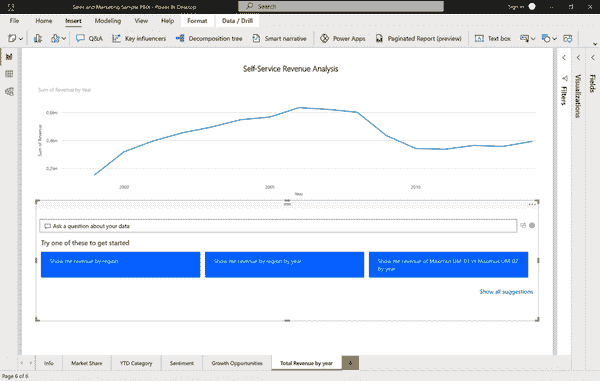

###### 图 5-16\. 带 Q&A 可视化的最终报告

这种基本设置已足以将此报告的早期原型交付给一些β版业务用户。您有机会收集宝贵的反馈意见，看看是否被接受，并发现需要改进的方面。

要访问用户查询数据，请单击文本框右侧的 Q&A 齿轮图标以访问工具设置。在这里，您将找到“查看问题”菜单选项。这将列出过去 28 天提交的所有查询，以便您可以准确查看人们如何使用您的报告以及可能仍然缺少的同义词、建议或字段。这是开始迭代产品并扩展到更多用户的绝佳地点。如果您想分享此报告，您需要 Power BI Pro 或 Premium 许可证。

如果您想详细了解 Q&A 工具及其管理工作的更多信息，您可能会发现来自 Microsoft 文档的以下资源有用：

+   [“优化 Power BI 中 Q&A 的最佳实践”](https://oreil.ly/DMRFN)

+   [“Q&A 工具入门：训练 Power BI Q&A”](https://oreil.ly/anFXF)

+   [“编辑 Power BI Desktop 中的 Q&A 语言模式并添加短语”](https://oreil.ly/pSVXM)

# 使用案例：用自然语言总结数据

业务分析师经常必须编制数据故事，以向业务利益相关者传达见解。尽管他们大部分时间通常花在创建引人注目的视觉上，但与结论进行注释的过程可能会很繁琐和乏味。因此，分析师经常跳过向他们的视觉添加口头评论的步骤，因为图表本身就能说话，不是吗？实际上，许多图表可能会被误解，尤其是在涉及更复杂的可视化时。让我们想象以下情景。

## 问题说明

基于我们在“使用案例：使用自然语言查询数据”中创建的视觉效果，我们现在希望添加标题，以帮助非技术利益相关者解释数据。我们想提供标题以清晰地表达见解，但我们不想花费太多时间手动编写它们。

## 解决方案概述

自然语言处理技术使我们能够利用机器不仅分析和解释人类语言，还能根据定义的输入生成文本。在这个示例中，我们可以使用 AI 技术为给定的图表及其基础数据创建标题或注释。

注释应包括关键要点，指出趋势，并允许根据特定受众编辑语言和格式。它们还是使我们的报告对视觉障碍者更易访问的绝佳方式！图 5-17 展示了高级用例架构。

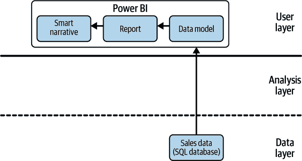

###### 图 5-17\. 智能叙述用例架构

再次强调，此示例仅使用内置的 Power BI 功能。Power BI 中名为 *智能叙述* 的功能适用于设计师和开发人员，无论是在 Power BI Desktop 还是 Power BI Service 中。该功能适用于所有许可类型，不需要 Pro 或 Premium 许可证。我们将探讨如何使用这些自动生成的标题为我们在 “用例：使用自然语言查询数据” 中创建的可视化对象生成数据故事。

## Power BI 演练

打开 *Sales & Marketing sample PBIX.pbix* 文件，从 “用例：使用自然语言查询数据” 中创建一个新的报告页面，并将其命名为 Story。

我们希望创建以下四个可视化对象：

+   按年份收入

+   按州收入

+   按部门收入

+   按年份和部门收入

您可以使用 Q&A 工具快速实现这一点：从可视化面板双击 Q&A 可视化对象，输入前面列表中的查询，然后将其转换为标准可视化对象。对每个收入分解重复此过程。您能看到使用 Power BI 的 AI NLP 功能与传统手动选择可视化对象、映射数据和手动筛选相比创建这些可视化对象有多快吗？

将页面上的可视化对象排列在右侧留有空间的方式。您的页面应类似于 图 5-18。

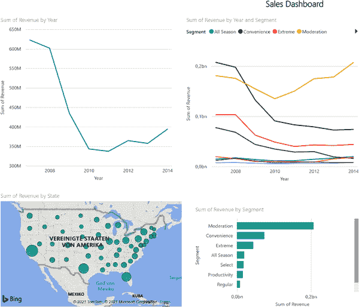

###### 图 5-18\. 销售仪表盘

打开可视化面板。你应该看到“智能叙述”图标（图 5-19）。

###### 注意

如果在可视化面板中看不到“智能叙述”图标，则可能是您正在使用的 Power BI 版本较旧，需要打开智能叙述选项。选择 文件 → 选项和设置 → 选项 → 预览功能，并确保打开智能叙述可视化。

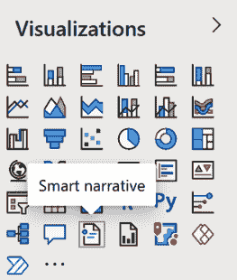

###### 图 5-19\. 智能叙述可视化

双击“智能叙述”图标应在页面右侧添加一个文本框。或者，您可以将可视化对象拖放到页面上您喜欢的位置。此文本框将包含 Power BI 为页面上的所有可视化建议的描述。在我们的情况下，描述将看起来像 图 5-20 中的输出。如果点击文本框，您将看到 Power BI 在此处计算的突出显示值。

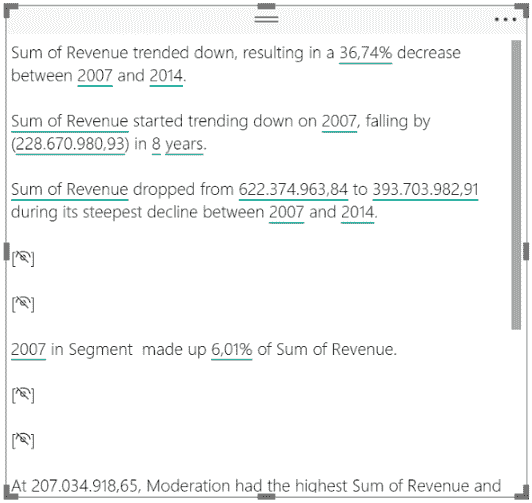

###### 图 5-20\. 智能叙述输出

这里有几个有趣的事情需要注意。在第一行中，您可以看到 Power BI 认识到收入呈下降趋势，并计算了收入时间序列起始和结束的百分比（见图 5-21）。它还建议，产品细分“Moderation”在 2014 年占总收入的 52.59%。当您发现某个陈述不够相关甚至是多余时，您可以简单地从摘要中删除此行。

您还可以详细探索计算出的值，并对其应用格式。例如，单击计算出的收入数字。在上下文菜单中，您可以选择将该值显示为无小数点后的货币形式。

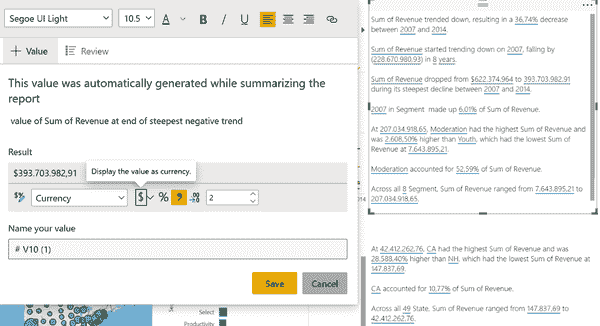

###### 图 5-21\. 智能叙述格式化

格式化自动生成的文本输出将使读者更易理解，整体外观也会更加优雅。然而，当我们查看摘要时，我们意识到有关区域销售细分的信息并未提供。也许这些信息对 Power BI 来说并不重要？要手动添加这些详细信息，请右键单击显示按州销售数据的地图图表，并从上下文菜单中选择总结。Power BI 将添加另一个文本框，显示您仅选择的图表的描述。同样，您可以根据需要删除或修改这些描述。

关于自动生成标题的一个重要说明是它们完全动态，并响应底层图表的变化。为了演示这一点，让我们向我们的仪表板添加一个页面过滤器，仅显示 2010 年之后的数据，如图 5-22 所示。打开字段窗格，然后将“年份”字段拖放到“本页面上的过滤器”选项窗格中。一旦应用过滤器，请注意文本框内容的变化。Power BI 认识到收入趋势现在向上，并相应地更新相关的百分比。

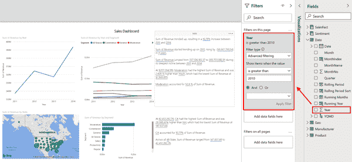

###### 图 5-22\. 智能叙述响应全局过滤和数据变化

仍然缺少的是对仪表板上最重要的图表之一——按细分划分的收入详细说明。您可以清楚地看到，“Moderation”细分是唯一具有相关正向趋势的细分——这应该是智能叙述工具易于识别的内容，对吗？右键单击图表并点击总结。但结果如何？Power BI 只是在智能叙述框中响应一行文本，这非常难以解释。

我们在这里触及了智能叙述功能的边界。在撰写本文时，尚无法总结具有许多类别或潜在趋势的非常复杂的图表。此外，目前不支持重命名动态值或编辑自动生成的动态值，并且无法为包含即时计算（如复杂度量或百分比）的可视化生成摘要。

由于智能叙述功能最初仅于 2021 年发布，我们将看到哪些限制会消失令人兴奋。您可以在[微软资源文档](https://oreil.ly/F75ve)中找到有关智能叙述工具的更多详细信息。

现在，让我们手动为仪表板添加最终结论。在最后一个文本框中添加一行新内容，输入 **`Conclusion: Sales from product segment Moderation were the main reason for the positive revenue trend between 2011 and 2014`**。您的最终销售仪表板现在应该看起来类似于 图 5-23。

尽管智能叙述工具具有比本书更多的自定义和配置选项（例如，通过使用 Q&A 风格的语言查询定义自定义值），我们将保持现状。如果您想了解更多关于智能叙述工具的信息，请查看微软的 YouTube 视频教程 [“如何使用 Power BI 的智能叙述”](https://oreil.ly/Z4UJU)。

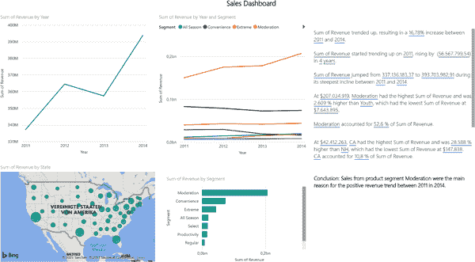

###### 图 5-23\. 带有注释的最终销售仪表板

现在，您可以轻松地将此页面导出为 PDF（文件 → 导出 → 导出为 PDF）或将其发布到 Power BI 服务器。虽然详细讨论 Power BI 中各种共享和发布功能超出了本书的范围，但我建议阅读微软文档 [“在 Power BI 中进行协作和共享的方式”](https://oreil.ly/9z9A3) 以便深入了解此主题的开始。

现在，只需保存报告（文件 → 保存），因为我们将在下一章回到此示例。您可以通过从[本书网站](https://oreil.ly/jgjFu)下载 *Sales & Marketing Sample_AI-Powered.pbix* 来获取包含本章所有练习的完成文件。

# 总结

在本章中，您学习了如何利用 Power BI 中的基于人工智能的自然语言能力，通过 Q&A 工具更快地创建可视化，并为用户提供更好的 BI 体验。您还学习了如何使用 Power BI 中的智能叙述工具自动化可视化的注释过程，并在运行时添加描述。

在下一章中，我们将进一步探索我们的数据，并找出影响收入趋势的因素。我们将使用 AI 驱动的工具来减少我们获得洞察力的时间，并自动检查有趣模式的数据。
