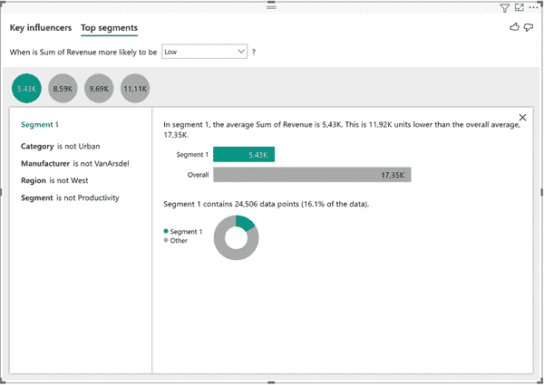

# 第六章：基于 AI 的诊断分析

找出*发生了什么*只有一半有趣，找出*为什么发生了*同样重要。虽然原始数据无法告诉我们事件发生的因果原因，但我们可以分析数据的模式并得出明智的结论。至少，这些模式将指引我们朝着正确的方向前进。在本章中，您将了解人工智能如何帮助您自动地揭示数据中的有趣模式，以便您和您的同事能够集中精力解释和分析这些数据的影响。

# 应用案例：自动化洞察

我们将继续前一章的案例研究：在一个虚构的制造公司中，我们支持销售管理团队进行决策过程中的支持。在第五章中，我们发现销售似乎在经历了急剧下降后正在缓慢复苏。现在我们将深入分析，并专注于理解为什么某些趋势会发展。

## 问题陈述

作为团队的业务分析师，我们希望帮助销售管理团队找出两个观察到的收入趋势的解释：为什么销售数字在 2006 年至 2010 年间急剧下降，以及什么因素解释了 2010 年至 2014 年间的缓慢恢复？顺便说一句，如果这是一个真实的情景，我们可能不会在八年期间进行分析，因为很多事情可能已经发生了变化。如果有帮助的话，可以想象我们是一个销售周期非常长的制造公司。

这个过程通常需要手动处理数据，这需要时间，并受分析师可用性的限制。由于我们没有能力与每个业务用户进行一对一的会话，我们正在寻找以更自动化和交互方式向他们提供洞察的方法。

## 解决方案概述

我们的目标是通过尽可能少的人为干预，自动扫描所有可用信息，在我们的数据集中自动找出模式。为此，我们正在利用基于 AI 的技术以快速和交互方式提供这些洞察。这将允许业务用户在较少或甚至无需专业数据分析师帮助的情况下获得洞察。图 6-1 为您提供了用例架构的概述。

###### 图 6-1. 自动化洞察用例架构

正如前一章的例子一样，这个架构非常直接，因为我们在 Power BI 内完成所有操作。为了提供这种体验，我们特别使用了两个 Power BI 工具：关键影响者和分解树工具。

*关键影响因素可视化*有助于理解影响感兴趣指标的因素，通过展示对所选指标贡献最大的顶级贡献者。它会检查您提供的信息，并通过将其标记为关键影响因素，将最重要的方面置于顶部。

Power BI 的*分解树视觉*允许您以多个维度可视化数据。它会自动聚合数据，并允许您按任何顺序深入到任何维度。AI 会根据您特定的兴趣领域建议下一个最相关的维度。因此，这是一种进行即席调查和根本原因分析的有用工具。

我们将这些技术应用于销售和营销示例 Power BI 报告，以找出驱动收入趋势和从数据中观察到的模式。在企业场景中，这两个工具可以以 Power BI 报告页面的形式提供给业务用户，以便他们可以自行与数据交互。

## Power BI 漫游

如果您继续跟随上一章的用例，可以继续在您的*Sales & Marketing sample PBIX.pbix*文件中工作。如果没有，请随时从[书籍网站](https://oreil.ly/MOYIu)下载*Sales & Marketing Sample_AI-Powered.pbix*。简要回顾一下，这个数据集包含来自制造公司的各种销售和营销数据，并预先填充了市场份额、产品销量、销售数字和情感评分的报告。

在第五章中，我们发现在前一年经历了一次艰难的反弹后，过去四年的总收入慢慢恢复。图 6-2 是我们之前创建的销售仪表板的快照。

###### 图 6-2\. 两个阶段的收入趋势

我们特别关注在收入下降阶段（2006 年至 2010 年，阶段 A）和收入缓慢恢复阶段（2010 年至 2014 年，阶段 B）期间发生了什么，“发生了什么？”这个简单而深刻的问题。 

我们将从审视阶段 A 开始。为了重新创建收入可视化效果，请创建一个新的 Power BI 报告页面，拖放 Q&A 视觉，并输入`**Revenue by year between 2006 and 2010**`。

单击“转换”图标，将 Q&A 视觉转换为标准 Power BI 视觉。图表应该看起来类似于图 6-3。

###### 图 6-3\. 2006 年至 2010 年每年收入

选择此图表并打开右侧的可视化窗格。单击“关键影响力”图标，将折线图转换为关键影响力视觉(图 6-4)。

###### 图 6-4\. “关键影响力”视觉图标

一旦您选择了新的视觉类型，图表将自动更新为与图 6-5 类似的内容。让我们更详细地探索这种视觉输出。

###### 图 6-5\. 关键影响者标准输出

现在，这个输出可能根本不是您期望的，看起来确实有点奇怪。出了什么问题？打开可视化面板，检查关键影响者视觉的属性。这应该看起来像图 6-6。

###### 图 6-6\. 从折线图转换后的关键影响者属性

在可视化属性中，您会找到两个关键字段：“分析”和“按年份”。顾名思义，分析是指您希望探索的度量标准，“按年份”则是指可能影响该度量标准的各种维度。默认情况下，鉴于我们先前的折线图，Power BI 建议用“收入总和”字段解释“按年份”维度，这完全没有任何意义。

让我们通过将“收入总和”字段从“按年份”字段拖到分析字段中来修复这个问题。因此，从右侧的数据字段库中拉取其他维度到“按年份”字段中。从商业角度来看，合理的候选字段可能包括段、城市、州、地区、评分平均值、类别和制造商。我们将排除产品维度，因为缺失的数据点太多。例如，一些产品被其他产品替换，一些产品刚刚推出，而一些产品已经过时。如果我们想要分析产品级别的主要影响因素，我们应该查看单个年份而不是四年期间。

关键影响者工具的更新属性现在应该看起来像图 6-7。

###### 图 6-7\. 关键影响者属性（已编辑）

在关键影响者视觉中，将顶部的下拉菜单从“增加”切换到“减少”，因为我们有兴趣找出导致收入下降的原因。更新后的视觉现在应该类似于图 6-8。

这种视觉直观地比以前的版本更有意义。请注意，这将是您可以为业务用户共享或发布的报告页面，以便他们可以自行与数据交互。让我们深入了解这个视觉，看看它在更详细的层面上是如何工作的。

###### 图 6-8\. 关键影响者工具已编辑

在可视化的左侧，我们可以看到 Power BI 识别出来的在给定指标（在本例中为收入）上作为关键影响因素的变量。我们可以看到，Power BI 确定了维度类别和段的属性 Youth 作为导致收入指标下降的主要关键驱动因素。在右侧，我们展示了所选影响因素的底层数据分布，显示了在所选维度（在本例中为类别维度）中所有类别的收入指标的平均值。您可以按照以下方式阅读右侧的图表：类别 Youth 的平均收入仅为$5,181.98，而除 Youth 以外的所有其他类别的平均收入为$17,349.89。这意味着，当类别是 Youth 时，平均收入比该类别的所有其他值低$12,920。

需要强调的是，在这种情况下，我们不是基于变量的绝对值进行评判，而是基于它们的平均值和观察次数。根据您选择分析的度量标准（无论是分类还是连续），关键影响因素工具将会进行调整。它不会指示平均值，而是会指出如果满足某个值，结果可能是*x*倍更有可能发生。

关键影响因素工具并不总是将类别的最低值视为影响因素。举例来说，在我们的分析中，以“制造商是 Victoria”为影响因素。如果您点击此影响因素，您将会看到图 6-9 中的图表。您可以看到 Victoria 并不是平均收入最低的制造商，而实际上是 Salvus。那么为什么 Salvus 没有被识别为关键影响因素呢？

###### Figure 6-9\. Phase A 的关键影响因素可视化（负收入趋势）

如果我们看一看 Salvus 和 Victoria 在图 6-10 中的头对头比较，这些原因将变得清晰，这只是为了促进我们对关键影响因素工具如何运作的理解。

###### Figure 6-10\. 比较制造商 Salvus 和 Victoria 的销售情况

有三个因素使 Salvus 不符合关键影响因素的条件。首先，该制造商仅在 2009 年引入，因此总数据点较少，与其他制造商相比。其次，Salvus 的绝对收入贡献非常小，可能缺乏总体影响力。最后但同样重要的是，该制造商的实际收入趋势并非负向，而是正向。尽管 Victoria 的收入从 2006 年的 620 万美元下降到 2010 年的 430 万美元，Salvus 在 2009 年至 2010 年间实际上提高了其收入。

有了这些背景信息，合理地认为 Salvus 不是整体收入下降的关键影响者。关键影响者工具使我们能够更轻松地发现这些有趣的模式，而无需手动搜索所有数据。

让我们探索关键影响因素工具的另一个有用特性：细分领域。*细分领域* 可以被认为是数据中结合不同值的组，显示对感兴趣的指标有高影响力。切换到 “Top segments” 并选择顶部下拉菜单中的 “When is Sum of Revenue more likely to be Low”，您应该会看到结果显示为 图 6-11 的屏幕。

###### 图 6-11\. 分析导致负收入趋势的细分领域

您可以看到 Power BI 为我们识别出的四个细分领域。最大的细分领域，由气泡大小表示，拥有 24,506 个观察点（销售产品），平均每笔销售仅为 $5.43K。低表现的细分领域具有最高（但低于总体）平均收入为 $11.11K，包含 9,282 个观察点。

要了解更多关于这里发生了什么的信息，点击 5.43K 气泡。您将看到这个细分领域的详细视图，在这种情况下看起来像 图 6-12。

从这张图表中，我们可以看出这个细分领域占据了几乎所有产品销售的 16%，因此对我们来说具有非常高的相关性。这个细分领域包含了所有类别不是 Urban、制造商不是 VanArsdel、地区不是 West、而且段不是 Productivity 的销售。这个细分领域贡献了最大的数据点组，并且平均收入最低，这使得在解释 Phase A（2006–2010 年）收入下降趋势时，它成为需要重点关注的一个重要细分领域。

要详细了解这意味着什么，让我们比较分析这个 Segment 1 的收入趋势，与从 2006 年到 2010 年的总体收入趋势进行对比（参见 图 6-13）。

###### 图 6-12\. Segment 1 详细信息

###### 图 6-13\. 总体收入趋势和 Segment 1 收入的趋势

虽然整体收入数据集从 $643.28 million 下降了 46.6% 至 $343.13 million，仅 Segment 1 就贡献了损失 $12.3 million，从 2006 年的 $31.10 million 下降至 2010 年的 $18.8 million。这些更专注的细分领域对商业用户来说应该更容易处理，并且能够识别潜在的问题区域，而不是像青年类别这样的更大趋势。

我们可以以类似的方式探索其他部分，但让我们暂时结束对过去收入下降的分析，并转向了解在 2010 年至 2014 年期间恢复期间发生了什么，即 B 阶段。如果您对更多关于关键影响者工具工作方式的特性和描述感兴趣，可以查看微软的[“创建关键影响者可视化”](https://oreil.ly/gxgdN)。

对于阶段 B 的分析，我们将切换到 Power BI 中的分解树功能。分解树是进行根本原因分析的重要工具。您可以将其用作智能下钻，因为 Power BI 根据您想要探索的特定指标自动建议下一个下钻级别。

为了达到这个目的，在您的 Power BI 文件中的空报告页开始。重新创建收入按年份图表，这次的时间段是从 2010 年到 2014 年。如果您使用了 Q&A 工具，请将此图表转换为静态视觉。现在，收入图应该看起来类似于图 6-14。

###### 图 6-14\. 2010 年至 2014 年总收入

选择折线图并将可视化类型更改为“分解树”，如图 6-15 所示。

###### 图 6-15\. “分解树”图标

与使用关键影响者工具类似，我们必须告诉 Power BI 我们要分析哪个变量，以及我们认为哪些维度是解释因素。修改视觉属性，使其看起来像图 6-16 中的样子。

###### 图 6-16\. 分解树属性

分解树视觉化的初始输出将是一个空白画布上我们感兴趣的度量的简单摘要。您可以在图 6-17 中看到这个输出。

###### 图 6-17\. 分解树开始

现在的任务是将此聚合指标分解为较小的块，最好是以捕获树顶部最重要的指标为目标进行拆分。当您单击聚合收入右侧的小+图标时，将弹出一个菜单，供您选择要进行的下一个拆分。

您可以手动选择拆分（例如，基于业务逻辑或您自己的偏好），也可以使用称为*AI 拆分*的功能。我们稍后将回到这个概念，考虑哪些情况可能合理地手动下钻级别。AI 拆分由小灯泡标示，并将根据您是否希望影响顶级指标更高或更小而自动选择下一个最佳下钻级别，如您在图 6-18 中所见。

###### Figure 6-18\. 在分解树中使用 AI 拆分

由于我们有兴趣解释 B 阶段的收入增长，让我们选择一个高值的 AI 拆分。Power BI 会根据类别的条件为你创建第一个拆分，如 Figure 6-19 所示。

###### Figure 6-19\. 分解树中的第一级拆分

如果你将鼠标悬停在与类别拆分相邻的灯泡上，你将看到 Power BI 工具提示，解释树的当前节点。在本例中，第一个拆分告诉你，当类别为 Urban 时，2010 年至 2014 年的收入最高（见 Figure 6-20）。

###### Figure 6-20\. AI 拆分解释

现在您可以深入挖掘，例如查找在 Urban 类别内收入增长的标准是什么。同样，我们可以手动选择下一个深入级别，也可以让 Power BI 为我们找出来，这取决于我们是对高值还是低值感兴趣（见 Figure 6-21）。

###### Figure 6-21\. 第二级 AI 拆分

如果您再次选择“高值”，您将看到下一个拆分将在制造商字段上进行，如 Figure 6-22 所示。

此时，让我们停下来，快速回顾一下为什么我们会按照这个顺序看到这些拆分。为什么数据不先按制造商拆分，然后再按类别拆分呢？至少我们已经看到，制造商 VanArsdel 声称大部分收入。

###### Figure 6-22\. 分解树中的第二级拆分

这是因为 Power BI 中的底层算法是贪婪的。它会选择在拆分带来最大优势的点处的下一个深入类别。为了演示这一现象，让我们对比一下按类别和按制造商划分的收入，如 Figure 6-23 所示。

###### Figure 6-23\. 按制造商和类别划分的收入

您可以清楚地看到，Urban 和 VanArsdel 在其类别中显著突出作为主要的收入驱动因素。然而，更仔细观察，您会注意到 Urban 占大约 85%的收入份额，而 VanArsdel 仅占 53%。这是因为我们有比类别更多的制造商，它们从这一领域的领先关键驱动因素中夺走了大量小份额。这就是为什么 Power BI 首先按类别拆分数据，然后才按制造商拆分的原因。

尽管这种贪婪的方法大多数情况下效果相当不错，但在某些情况下需要小心。在某个分割后检查数据时，你只能分析实际存在于该分割中的数据。例如，首先按类别分割，然后探索城市类别，你将只看到该树枝中实际在城市类别生产产品的制造商。如果数据集中的制造商没有为城市类别生产任何商品，那么该制造商将不会出现在该树枝的后续分割中。

另一方面，这意味着 Power BI 很可能永远不会（或仅在树的最后阶段）建议基于所有观察值均匀分布的字段进行分割。例如，我们可以在数据集的州维度中观察到这一点；最大的收入贡献者（加利福尼亚州）仅占总收入的约 10%，而最小的贡献者占约 4.8%。各州在收入方面几乎是均匀分布的，因此它们不适合 Power BI 根据它们创建分割。如果州对您的业务（或不同的业务用户）起到作用，您可以在第一级手动选择这些分割，或者根据您感兴趣的州添加页面过滤器。

回到我们的分解树示例，我们希望为高值再添加两个 AI 分割。如果您添加了这些分割，您应该会看到一个看起来像图 6-24 的树。

###### 图 6-24。最终的分解树

当您查看这棵树时，您可以立即看到在 2010 年至 2014 年期间，来自东部地区、制造商 VanArsdel 的 Moderation 段的 Urban 类别销售对收入增长的主要贡献者。如果您创建一个具有这些过滤条件的折线图，并将其与整体总收入进行比较，您可以清楚地看到这种情况在图 6-25 中的表现。

仅从这个段落的销售就为我们的总收入增长贡献了超过 2000 万美元，并且相对增长率（+46%）比绝对收入趋势（+15%）增长更强。

通过分解树，业务用户可以轻松与数据交互，并找到他们需要的粒度级别上的相关贡献者。在使用 Power BI 的 AI 功能自动筛选数据后，如果需要，要让数据分析师参与验证他们的结论或在分析过程中提出的问题，这将变得更加容易。

###### 图 6-25。比较总收入和分解树的分支

可以与业务用户共享带有分解树的 Power BI 报告，以便他们可以自行浏览数据。要向组织中的其他用户共享报告，您需要 Power BI 服务器或 Power BI Pro 许可证。

要了解更多关于分解工具的信息，请查看[“在 Power BI 中创建和查看分解树可视化”](https://oreil.ly/ockwx)的 Microsoft 文档。

# 总结

在本章中，我们探讨了 Power BI 中两个强大的 AI 支持功能，帮助商业用户和分析师们通过自动化数据分析过程中的某些部分，减少他们获得见解所需的时间。关键影响因素工具可以用来揭示给定感兴趣指标的主要驱动因素，并识别相关的分段。结合 AI 分割的分解树非常有助于在任何数据维度上进行有针对性的深入钻取，同时保持整体业务指标不变。这使得它成为一种优秀的工具，用于临时数据探索和自助式根本原因分析。

在下一章中，我们将离开过去和现在数据的领域，探讨 AI 如何帮助我们预测未来事件或更好地预测未来结果。我们将从自动化分类任务开始，这有助于我们根据过去的经验对未来的商业事件进行分类。
