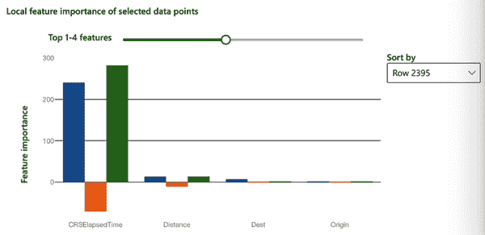
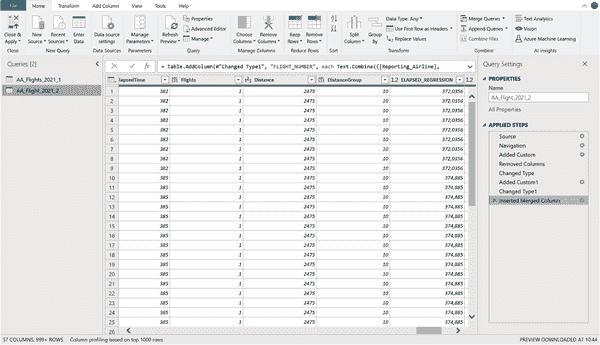
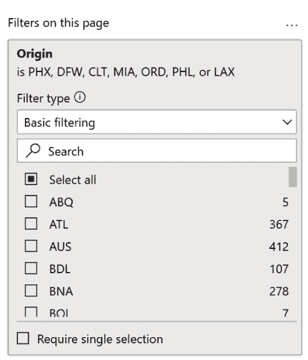
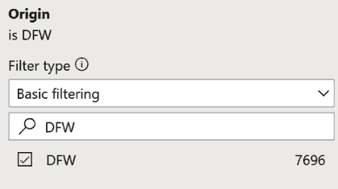

# 第七章：AI 驱动的预测性分析

做好起飞的准备！我们正在进入 AI 驱动的预测性分析领域。我们将通过扮演美国航空公司的 BI 分析师的角色来实现这一点。在本章中，我们将从真实数据集中探讨三个使用案例。首先，我们将尝试将航班分类为准时或不准时。其次，我们希望通过预测实际飞行时间与计划飞行持续时间的对比来检测我们航班时间表中的瓶颈。最后，我们将使用自动异常检测分析机场跟得上飞行时间表的能力。

我们的目标是构建一个 AI 驱动的 BI 解决方案的原型，证明它能够根据使用案例解决特定问题。我们希望评估 AI 模型在我们的数据中的表现，展示出来，并通过展示业务价值（快速构建，快速展示，快速学习）来获得组织内对新方法的支持，正如第四章中所述。为此，我们将首先摆脱设置数据管道、处理 ETL 作业以及将 AI 服务集成到企业数据仓库等事务。但请放心，所有这些事情都是可能的，正如你将在第十一章中学到的那样。

在原型和生产阶段最有可能相同的是我们将构建的 AI 模型。在我们的原型中，我们将使用来自 Microsoft Azure 的企业级 AI 服务，这些服务将应对生产工作负载。稍后唯一会改变的是我们将这些服务集成到我们的整体系统架构的方式。一旦我们能够证明业务价值并为我们的解决方案建立一个坚实的业务案例，我们就能够承担将原型移入生产并在那里“正确”构建的工作。

# 先决条件

要跟随本章中的使用案例，建议您从[书籍网站](https://oreil.ly/X9jmJ)下载以下文件：

数据集

+   *AA_Flights_2021.xlsx*

+   *AA_Flights_2021_01.csv*

用例：自动化分类任务

+   *Arrival_Delay.pbix*

+   *AA_Hourly_Batches_2021-02-07_0800-0859.csv*

+   *azure-ml-inference-arrdel15.R*或

    *azure-ml-inference-arrdel15.py*

用例：改进 KPI 预测

+   *Elapsed_Time.pbix*

+   *azure-ml-inference-elapsedtime.R*或

    *azure-ml-inference-elapsedtime.py*

用例：自动化异常检测

+   *Airports_Anomaly.pbix*

+   *azure-anomaly-detection-airports.R*或

    *azure-anomaly-detection-airports.py*

另外，您将需要一个 Microsoft Azure 账户来训练和托管 AI 模型，如第四章中所示，一些基本的 Python 或 R 知识来从模型获取预测，并且需要一个能够执行 Python 或 R 脚本并将模型预测集成到您的仪表板中的 BI 工具。

尽管我们使用 Microsoft Azure 来训练模型，但类似的功能也大致可在其他云平台提供商（如 GCP 或 AWS）上使用。一旦您对 Azure 的工作方式有所了解，就可以相对轻松快速地在其他平台上运行和运行。

为了构建我们的仪表板，我们将使用 Power BI 以保持与先前使用案例的一致性（以及 Azure 与 Power BI 的良好兼容性）。然而，本书并不局限于 Power BI 用户。因此，我将向您展示如何通过使用像 Python 或 R 这样的流行编程语言，从您的模型中获取推断。您可以将 Python 或 R 代码集成到 Power BI 或任何其他 BI 工具中。或者，您可以直接在数据库上运行预测（批量预测），并在 Tableau 或 Looker 等任何 BI 工具中显示结果。第十章提供了更多详细信息。

# 关于数据集

注意：我们将处理一个真实世界的数据集。此数据集未经过调整或调优用于 ML 练习。因此，请不要期望有令人瞠目结舌的洞察力或漂亮的图表。但是，您将了解到真实场景是什么样子的，从 ML 中可以获得哪些收益，以及如何使用这项技术来击败自己的基线并自动化预测。这个过程可能会有些混乱，但它比您在任何学术练习中找到的更接近现实生活。

此使用案例的公共数据集已通过[美国运输统计局](https://oreil.ly/y7C8W)的 TranStats 服务获得。此数据源保持了有关美国航班详细信息的更新信息。在整个章节中，我们将使用 2021 年 1 月和 2021 年 2 月的航班数据，我已将其作为 Excel 文件通过[书籍的网站](https://oreil.ly/X9jmJ)提供给您以便查阅。该文件包括以下处理步骤以使其匹配我们的案例研究：

+   该数据集已经仅针对美国航空公司的航班进行了筛选。

+   已从数据集中删除了取消的航班。

+   已删除没有任何到达延误信息的航班（< 1%）。

如果您想获取更多数据或探索不同的航空公司，请随时从 TranStats 网站下载原始文件。如果您这样做，请确保在下载数据之前选择 Prezipped File 选项，如图 7-1 所示。


###### 图 7-1\. 航空公司准点表现数据集下载

# 使用案例：自动化分类任务

对于我们的第一个使用案例，我们正在处理一个分类问题，预测给定航班是否会延误到达。即使您不是航空业的专家，您也应该熟悉整体挑战。

## 问题陈述

作为美国航空公司商业智能团队的一员，您被要求构建一个关键业务指标的报告仪表板。该指标是目前在空中并预计延误超过 15 分钟的美国航空公司航班的百分比。这一指标对于质量控制和保持客户满意度以及保持总体航班时间表的重要性不言而喻。

在我们的示例中，假设我们每小时收到一次数据，其中包含过去 60 分钟内起飞的所有航班。这些每小时批次包含航班详情（起点、目的地、航班号等）以及起飞时的航班延误信息。因此，例如，当我们在上午 9:00 到 9:59 之间查看数据批次时，此数据集中将包含在上午 8:00 到 8:59 之间起飞的航班信息。为了简化这个例子，我们暂时忽略时区，假设所有时间戳都以协调世界时（UTC）提供。

延误航班比例这一指标目前通过一个商业智能仪表板报告，如图 7-2 所示。


###### 图 7-2\. 关于延误航班比例的报告仪表板

仪表板显示当前批次计划在给定日的 8:00 a.m. 到 8:59 a.m. 起飞时间段内的航班总数为 107 架。大多数这些航班在下一个数据批次到来之前仍将在空中。

为了估算是否会发生到达延误，我们目前使用起飞延误信息作为一个近似。到目前为止，商业智能团队一直使用变量 DepDel15，该变量指示航班是否在起飞时延误至少 15 分钟，来近似航班是否在到达时也会晚于 15 分钟。

此估算是一个很好的初步尝试，但还远非完美。让我们打开 Excel 工作簿 *AA_Flights_2021.xlsx* 并选择第一个表 AA_Flights_01，如图 7-3 所示，以了解此估算的历史表现。


###### 图 7-3\. 2021 年 1 月的美国航空公司航班数据

表 AA_Flights_01 包含了 2021 年 1 月的所有美国航空公司航班数据，几乎有 38,000 行数据。每一行都是 2021 年 1 月期间发生的一次美国航空公司航班。

由于这是一个历史数据集，我们可以看到实际发生的到达延误情况。例如，我们来看第一行。从约翰·肯尼迪国际机场（JFK）到洛杉矶国际机场（LAX）的 AA1 航班起飞于 2021 年 1 月 1 日。该航班没有 15 分钟或更长时间的延误，因此 DepDelay15 列设置为 0。由于飞机甚至提前降落而没有任何延误，ArrDelay15 列也设置为 0。第一个出发延误超过 15 分钟的航班发生在第 21 行：再次是从 JFK 到 LAX 的 AA1 航班，但这次是在 2021 年 1 月 20 日。DepDelay15 属性为 1，因为出发延误为 75 分钟，正如您可以在图 7-4 中看到的那样。


###### 图 7-4. 出发延误 75 分钟的航班

所以在这种情况下，DepDelay15 属性是一个很好的指标，用于判断航班是否实际上也延误到达。现在，如果我们只依赖于 DepDelay15 信息，我们的预测会有多好呢？转到 Excel 文件的第三个工作表 Confusion_Table，看看混淆矩阵（图 7-5）。


###### 图 7-5. 评估基线分类器

在我们深入细节之前，看看最后两行，即 ArrDel15 True = 10.4%和 False = 89.6%。这一摘要告诉我们，我们正在处理一个*不平衡分类*问题，正如之前在第三章中所解释的那样。只有 10%的航班实际上标记为 ArrDelay15 属性，因此到达延误超过 15 分钟。

为什么这种不平衡对我们很重要呢？因为它影响我们的评估指标。想象一下，如果我们预测所有航班都将准时到达，延误不超过 15 分钟，这将给我们带来惊人的 90%的准确性分数。这种预测有用吗？不。这就是为什么我们必须提出更智能的评估指标。

看看图 7-5 中的混淆矩阵。这显示了我们基线预测（DepDelay15 标签）的表现。如果过去我们使用出发延误启发式，我们会误分类 2,166 个观察结果：1,178 个航班实际上延误了，尽管我们预测它们将准时到达。而 988 个航班实际上准时到达，尽管我们预测会延误。

正如你在第三章学到的，*精确率*是衡量分类器准确性的指标；较高的精确率表示假阳性较少。如果我们能改善这个指标，那么预测为延误的 988 航班实际上准时的情况将会减少。精确率的计算方法是将真正例（TP：2,749）除以真正例加假阳性（FP：988）的总和。

*召回率*衡量分类器的完整性；较高的召回率表示假阴性较少（FN：1,178 航班延误，尽管预测为准时）。召回率的计算方法是将真正例除以真正例加假阴性的总和。

为了将这两个信息压缩成一个更易于跟踪的单一指标，我们将使用*F1 分数*，它是精确率和召回率的调和平均值，计算方法如下：

+   F1 = 2 × （*精确率* × *召回率*）/（*精确率* + *召回率*）= 2TP / （2TP + FP + FN）

正如你在图 7-6 中所看到的，我们基线分类器的 F1 分数为 0.72。


###### 图 7-6\. 基线分类器的 F1 分数

我们的目标是开发出一个新的分类器，能够超过这个 0.72 的 F1 分数基线，这样我们可以更准确地预测航班延误。

## 解决方案概述

为了改善对航班延误预测的准确性，我们将使用一个基于历史数据训练的 AI 分类器。图 7-7 展示了这个用例架构的概念概述。正如你所见，这个用例比之前章节的用例略为复杂。这主要是因为我们现在超越了 Power BI 的能力，并在分析层中添加了更多功能。


###### 图 7-7\. 自动分类用例架构

这个架构中我们有两个数据源。图的左下角是提供的历史航班数据，保存为 CSV 文件。而右下角是我们的 BI 系统（在这种情况下是 Power BI）每小时消费的数据批次。

在这个示例中，我们使用一个 AI 服务，它将从历史航班数据中学习模式，并使用这些信息对新的数据点（每小时航班批次）进行分类，判断这些航班是否可能会延误。

我们可以使用多种方法来解决这些分类问题。由于我们目前不希望引入稀有且昂贵的 AI/ML 专家，所以我们将使用 AutoML 来为我们训练一个 ML 模型。我将演示 Microsoft Azure 机器学习工作室作为 AutoML 平台的工作流程示例，但实际上它可以是任何平台；它们的工作原理都差不多。我们将首先在 Azure ML Studio 上构建和评估模型，然后将其部署为在线 HTTP 端点——所有这些都不需要编写一行代码！

实际的预测将直接从用户层面在 Power BI 中进行。在这里，我们将向在线 API 发送一个预测请求，以便获取新数据，并使用 Power Query 将其集成到我们的数据模型中。对于此部分，我们将依赖于一个处理 API 请求的小型 R 或 Python 脚本。一旦我们在 BI 中获得了预测结果，我们将在 Power BI 报告中呈现结果。

## 使用 Microsoft Azure 进行模型训练演示

访问[Azure ML Studio](https://ml.azure.com)，您已在第四章中进行了设置。由于我们想要通过 AutoML 训练一个 AI 模型，请在自动化 ML 窗格中选择立即开始，并选择“新的自动化 ML 作业”来填充空白行。

*AutoML 作业*是一个过程，从提供数据集到获得验证的 ML 模型结果。我们将逐步完成这个过程。

首先，您需要一些数据。在 Azure 上，数据以数据集的形式组织，这些数据集与您的工作区关联。数据集将确保您的数据格式正确，并可以被 ML 作业消费。如图 7-8 所示，选择“创建”。


###### 图 7-8\. 从本地文件创建数据集

您可以从各种来源导入数据。在这种情况下，我们将上传一个本地文件，所以请继续选择“从本地文件”，如图 7-8 所示。在图 7-9 中显示的“基本信息”表单中，为您的数据集取一个能说明问题的名称，并添加一个描述（如果需要）。在这个例子中，我将数据集命名为`**aa_flights_ontime**`。版本将默认为 1，并且数据集类型将是表格，因为 AutoML 当前仅支持表格数据。


###### 图 7-9\. 添加基本信息

点击“下一步”进入下一部分。您需要提供如图 7-10 所示的信息。您将选择数据存储的位置以及应从何处上传数据。选择在工作区创建期间自动设置的默认数据存储（在此示例中，我的称为*workspaceblobstore*）。这是您将物理上传数据文件以使其可供当前工作区使用的地方。

我们无法在此处上传 Excel 文件。Azure ML Studio 支持 CSV、TSV、Parquet 和 JSON 文件作为表格数据集。这就是为什么我们需要先将 Excel 文件转换为 CSV。为了您的方便，我已经完成了这一步，并创建了名为*AA_Flights_2021_01.csv*的文件，其中包含了 2021 年 1 月的所有航班数据，并且是 Excel 工作簿*AA_Flights_2021.xlsx*的第一个工作表。在屏幕底部点击“下一步”上传文件。


###### 图 7-10\. 选择要上传的文件

文件成功上传后，您应该看到“设置和预览”表单，其中包含一些基于上传文件预填的信息。请仔细检查设置是否与图 7-11 中显示的设置相同，并确保底部的数据预览正确显示前几行。如果一切正常，请点击“下一步”。


###### 图 7-11\. 设置和预览

接下来的表单（图 7-12）将定义数据集的模式。该模式对两个原因至关重要。首先，模式将允许您定义哪些列应由 AutoML 算法考虑。其次，模式将允许您定义各列的数据类型。

这一步骤非常重要，因为您想要使用的列以及它们的数据类型对于 Azure ML Studio 来说非常难以自动猜测。例如，列 DayOfWeek 看起来是数字，但实际上是分类数据：工作日 7 + 1 不是工作日 8，而是工作日 1\. 因此，DayOfWeek 列应被解释为包含字符串值而不是数值。


###### 图 7-12\. 定义模式

数据类型还定义了数据的 AutoML 任务可能性。例如，如果我们将 ArrDel15 变量的数据类型留在 Decimal 上，我们将无法在后续选择分类任务。同样地，如果我们要预测数值，我们必须确保在模式中正确设置它以启用回归任务。AutoML 无法可靠地猜测数据类型，这是我们必须手动定义的内容，提前提供这些信息需要您的专业知识。

在我们的示例中，我们不需要数据集中提供的所有数据。某些值根本不提供有意义的见解，并且只会增加项目的复杂性（例如，Year 具有完全相同的值）。我们不希望在我们的预测中包含一些其他值，因为它在 ML 的上下文中包含*目标泄漏*，这意味着一个特征本身包含了实际目标。例如，ArrivalDelay 确实可以完美地告诉我们 ArrDel15 是否为真。

这里是我们用例所需的所有列的列表。确保仅包括这些变量，并正确设置它们的数据类型，如图 7-12 所示：

+   DayofWeek：String

+   Origin：String

+   Dest：String

+   DepDelay：Dec/Comma

+   DepDelayMinutes：Dec/Comma

+   DepDel15：String

+   DepartureDelayGroups：String

+   DepTimeBlk：String

+   TaxiOut：Dec/Comma

+   ArrDel15：String

+   ArrTimeBlk：String

+   Distance：Dec/Comma

+   DistanceGroup：String

点击“下一步”。在“确认详细信息”页面上，仔细检查您提供的信息，然后点击“创建”完成数据集的创建。您可以从显示的列表中选择您的数据集（如果需要，点击刷新）。

通过点击“下一步”进行处理。您将看到“配置作业”屏幕，如图 7-13 所示，该屏幕允许您指定您的 AutoML 作业应该如何工作。


###### Figure 7-13\. 创建一个新的 AutoML 作业

## 什么是 AutoML 作业？

现在我们已经定义了我们的数据集，我们必须定义哪些计算资源应该用于 AutoML 训练。在 Azure 中，一个特定数据集上的 AutoML 训练称为 *AutoML 作业*。作业组织在实验中。一个 *实验* 包含信息，如您的计算环境的大小，并指定您想要预测的列。

由于我们还没有设置实验，请选择“创建新”单选按钮。输入一个自定义实验名称。在这种情况下，我选择了`**aa-automl-arrdel15**`。将 ArrDel15（String）指定为目标列。最后，我们必须指定用于此训练作业的计算资源。选择“计算实例”作为计算类型，然后选择我们最初在第四章中创建的计算资源。如果计算实例已停止，您需要首先启动它。为此，请从 Azure 机器学习工作室主菜单中选择计算，从列表中选择您的实例，然后单击“启动”。提示：在新标签页中打开计算实例菜单，以免中断 AutoML 作业的设置过程。

###### 注意

在使用 Azure 机器学习时，并没有额外费用，但是你会为底层的 Azure 服务（如 Azure 计算能力或 Azure Blob 存储）付费。虽然更大的计算能力可以提高 AutoML 的速度（从而降低 AutoML 作业的成本），但通常选择更便宜的计算资源并接受稍长的 AutoML 训练时间更加成本效益。在这种使用情况下，即使你多次进行 AutoML 训练，也应该完全由你的免费试用预算覆盖。要了解有关管理 Azure 机器学习的预算、成本和配额的更多信息，我建议参考微软资源[“管理 Azure 机器学习的组织规模预算、成本和配额”](https://oreil.ly/LQo6K)。

现在是指定 AutoML 任务应该执行什么操作的时候了（参见图 7-14）。


###### 图 7-14\. 选择机器学习任务

我们可以在这里选择三种任务类型：

分类

预测分类变量

回归

预测连续数值变量

时间序列预测

针对时间序列数据的回归

在选择“下一步”之前，请单击“查看附加配置设置”。您将看到“附加配置”窗格（参见图 7-15）。


###### 图 7-15\. 机器学习任务的附加配置

我们想要在这里自定义一些选项。首先，我们要更改“主要指标”。默认情况下，这设置为准确度。正如您之前所见，准确度并不适合不平衡分类问题的衡量。我们无法在这里选择“F1 分数”。而是选择“加权精度分数”。这也将考虑召回率，因此会产生更好的 F1 分数。此外，请确保选中“解释最佳模型”。

###### 注意

在 AutoML 过程中选择正确的评估指标是至关重要的一步，可以显著影响结果。与此同时，对于 AutoML 服务来说，很难猜测您需要哪种指标，因为这取决于手头的问题。例如，在临床测试中，您更看重假阳性还是假阴性结果？请随时返回第三章，更加熟悉各种指标，根据需要在多个 AutoML 作业中进行实验。访问 [“评估自动化机器学习实验结果”](https://oreil.ly/hNs4e) 在 Azure ML Studio 中根据不同的指标比较您的 AutoML 作业。

我们想要自定义的另一个设置是“退出标准”。这将告诉我们的 AutoML 算法模型何时“足够好”。如果满足某一标准，则训练作业将停止。通常，您可以采用两种方法。您可以通过时间限制或者通过指标的最小接受标准来结束训练。在这个例子中，选择 1 小时作为最大时间限制。实际上，如果算法无法在训练中获得更大的增益，训练可能会提前结束。

确认附加设置并保存。单击“下一步”和“完成”以启动您的 AutoML 作业。这将初始化您的 AutoML 作业，并将您带到“运行详细信息”屏幕（参见图 7-16）。


###### 图 7-16\. AutoML 作业详细信息

随着实验的进行，此状态会更新。几分钟后，状态应从“未开始”变为“运行”。

第一个模型开始训练可能需要大约 10 分钟左右。Azure 首先进行一些内部设置和检查。其中一个准备工作是名为“数据守则”的服务。点击“数据守则”选项卡以获取更多信息。几分钟后，屏幕应该看起来像图 7-17。如果此区域仍然为空，请稍后再检查并刷新页面。


###### 图 7-17\. 数据守则

在 Azure AutoML 中，*数据守则* 是一系列自动检查，用于增加高质量训练结果的可能性。这些检查包括自动将数据拆分为训练集和验证集，或检查训练列中是否存在缺失值。Azure AutoML 还会检查与当前训练任务相关的一些假设，例如识别标签中的不平衡类，并标记它们作为潜在问题区域。如果你点击“查看附加详细信息”按钮，你将看到类标签的基础分布。

要了解如何解决这个问题，请阅读 Azure 文档 [“识别具有不平衡数据的模型”](https://oreil.ly/dapAa)。除了一些内置功能帮助解决不平衡类的问题，例如添加权重列，建议的一个主要点是选择一个针对类不平衡具有鲁棒性的评估指标。我们之前选择精度而不是准确度作为我们的主要评估指标，这是个好主意。

尽管整个训练过程仍在进行中，但请前往“模型”选项卡。在这里，你将看到所有模型的列表以及自动机器学习算法到目前为止提出的初步评估指标。15 到 20 分钟后，你应该已经看到一个带有相应评估指标的初步模型。请记住，模型从这里只会变得更好。如果自动机器学习算法找到了更好的模型，它将出现在列表的顶部。你可以在这里探索每个模型并进一步查看各自的详细信息。但是自动机器学习的理念是，在训练过程中我们不必过于担心发生了什么。让算法自行处理，喝杯咖啡，大约 30 分钟后再回来查看。

训练完成了吗？如果完成了，你应该看到一个类似于图 7-18 的屏幕，状态显示为已完成。


###### 图 7-18\. 已完成的 AutoML 作业

## 评估 AutoML 输出

现在是时候查看算法找到的最佳模型，并稍微详细地探索一下。点击“模型”选项卡进入模型页面。你应该看到一个类似于图 7-19 的列表。从这个概览中，我们可以看到前五名模型非常接近，最佳模型的精度分数在 0.96340 到 0.96690 之间。

在这种情况下，最佳模型是一个投票集成模型，最终精度得分为 0.96690。实际结果取决于计算资源和所花费的训练时间。如果选择了不同的运行配置，结果可能会有所不同。


###### 图 7-19\. AutoML 模型

###### 注意

您的 AutoML 作业的实际结果可能会略有不同于本书中的结果。虽然 AutoML 过程是确定性的，但由于数据准备过程中的随机过程（例如，用于训练和测试的自动化数据抽样），您可能会看到不同的结果。然而，总体趋势应该是相似的。

由于我们之前在高级配置中勾选了“解释最佳模型”，最佳模型自动显示了“查看解释”链接。稍后我们会回到这一点。但首先，点击算法名称“VotingEnsemble”以查看模型的详细页面（图 7-20）。


###### 图 7-20\. 最佳模型详情

最重要的是，我们要了解这个模型在我们的数据上的表现如何。要了解更多信息，请单击“指标”选项卡。在此部分，启用以下评估指标，并暂时保持所有其他指标禁用状态：

+   average_precision_score_macro

+   average_precision_score_micro

+   average_precision_score_weighted

+   confusion_matrix

+   f1_score_macro

+   f1_score_micro

+   f1_score_weighted

您的屏幕应该看起来与图 7-21 中的屏幕类似。


###### 图 7-21\. 模型指标

在我们深入研究微观、宏观和平均指标意味着什么之前，让我们先看一下模型评估为我们提供的混淆矩阵。这个混淆表格包含的信息与我们问题陈述中的 Excel 表格（图 7-5）完全相同，只是布局有些不同。

这个表格对比了真实数据标签与模型预测标签。例如，对于 3,374 个观测值，实际标签为`0`（到达延误超过 15 分钟），而模型预测值也为`0`。相比之下，有 98 个观测被预测准时到达（预测标签=`0`），但实际上延误超过 15 分钟（实际标签=`1`）。请注意，此表格未包含数据集中的所有观测，而仅包括验证集中的样本数据点。

为了使此屏幕与我们问题集中的 Excel 电子表格更可比较，将左上角的下拉菜单从原始切换到归一化，以显示相应的百分比（图 7-22）。这样可以更轻松地将结果与我们来自图 7-5 的 Excel 表格进行比较。


###### 图 7-22\. 在 Azure 中的归一化混淆矩阵与 Excel 混淆矩阵的对比

让我们来比较该模型与我们的基线模型，后者仅基于飞机起飞后是否延误超过 15 分钟来进行预测。如您所见，我们的模型在预测将延误的航班（`1`）实际上按时抵达的情况下，相较于基线模型取得了显著的进展。AI 模型仅在这些观测中误分类了 0.71%，而我们的基线在该类别中的误差为 2.9%。同样地，对于预测将按时抵达的航班（`0`），实际上抵达延误超过 15 分钟的情况，我们将基线模型的误差从 30.0% 降低到了 24.94%。

让我们看看这对于我们的接受标准，精确率、召回率和 F1-score 意味着什么。基线模型的指标如下：

+   精确率：0.74

+   召回率：0.70

+   F1-score: **0.72**

我们可以手动计算我们的 AI 模型相同的指标：

+   精确率 = TP / (TP + FP) = 295 / (295 + 24) = 0.92

+   召回率 = TP / (TP + FN) = 295 / (295 + 98) = 0.75

+   F1-score: 2TP / (2TP + FP + FN) = 2 × 295 / (2 × 295 + 24 + 98) = **0.83**

如您所见，由于 AutoML 方法的采用，我们成功地将基线预测提高了 11 个百分点。

让我们回到模型指标选项卡中的精确率和 F1-score 指标。为什么我们在这里看到的值要高得多？那是因为我们为我们的分类算法提供了微观、宏观和加权得分：

微观

计算全局指标，通过计算总的真正例、假负例和假正例来实现。

宏观

对每个标签计算指标并找到它们的非加权平均值。这不考虑标签的不平衡性。

加权

计算每个标签的指标并根据它们的支持度（每个标签的真实实例数）进行加权平均。

对于不平衡的分类问题，使用宏观平均值更具信息量，其中少数类与多数类具有相同的权重。

对于二分类问题，宏观 F1-score 简单地是正类和负类的 F1-score 的平均值：

+   *宏观 F1-score* = (*正类的 F1-score* + *负类的 F1-score*) / 2 = (0.83 × 0.98) / 2 = **0.905**

如您所见，这正是 Azure 中宏观 F1-score 评估指标在 图 7-23 中展示的内容。


###### 图 7-23\. F1-score 宏观比较

在比较这些聚合评估指标时要小心。从粒度层面来看（例如，混淆矩阵），可以更好地理解整体情况。

###### 注意

有时候，最好的模型并不适合您的目的。 特别是当评估指标接近时，您可能希望检查前三个模型，并探索详细信息，例如我们之前做过的混淆矩阵。 根据您的偏好，如果更适合解决手头的问题，使用第二或第三优秀的模型可能是有意义的。 也许您会发现一个模型在牺牲一些精度的情况下提供了更好的召回率？

现在我们已经确认我们的模型比非 AI 基线效果更好，让我们明白为什么会这样。 前往我们最佳模型的解释选项卡。 从 Figure 7-24 表格中选择“原始数据”，然后通过点击双箭头来收缩列表窗格。


###### Figure 7-24\. 模型解释

接下来，点击“聚合特征重要性”选项卡。 这应该会显示与 Figure 7-25 类似的屏幕。

此视觉简要显示了影响特定预测结果的最重要的变量（特征）。 正如我们从图表中看到的那样，DepDelay（出发延误）属性显然是远远最重要的影响因素。

但有趣的是，还有三个变量对预测有显著影响。 第一个是 TaxiOut 属性，其重要性几乎与 DepDelay 相当。 这并不奇怪，因为出租车等待时间与出发延误密切相关。 但令人惊讶的是，我们还看到目的地（Dest）和起飞地（Origin）在预测到达延误时起了作用。 根据飞机起飞和计划到达的机场位置，及时到达的概率会增加或减少。 这些特征并不像出发延误和出租车等待时间那样重要，但确实在提高预测精度方面发挥了作用。


###### Figure 7-25\. 聚合特征重要性

在我们的数据集中，有四百多个唯一的出发和到达机场组合，这是 AutoML 可以发挥其优势的领域，因为对于这些组合，手工制定规则会很麻烦，仅仅为了通过一定的百分比提高我们的预测质量。 现在我们已经大致了解为什么 AutoML 模型比我们的基线效果更好，让我们继续前进，为新的、未见过的数据集部署我们的模型。

## 使用 Microsoft Azure 进行模型部署的实例

现在我们已经训练、验证并理解了我们的 ML 模型，是时候部署它了，这样我们就可以用它来预测新数据。 在 Azure ML Studio 中，选择您想要提供的模型，然后点击“部署 → 部署到 Web 服务”。 “部署模型”面板将在右侧弹出（参见 Figure 7-26）。


###### Figure 7-26\. 模型部署

为您的模型部署命名。我建议使用模型目的（预测变量）和您正在使用的算法的组合。在我们的情况下，一个好的模型名称可能是`**arrdel-votingensemble**`。接下来，选择计算类型。在这里，您可以选择 Azure Kubernetes 服务和 Azure 容器实例。这两种资源通常用于实时推断。Kubernetes 服务通常用于需要快速响应时间和自动缩放的大规模生产部署，这与我们的原型要求完全相反。我们满意 Azure 容器服务，用于小型基于 CPU 的工作负载，需要少于 48 GB 的 RAM。确保目前已禁用身份验证，然后点击“部署”。

点击部署后，您应该会看到一个通知，告诉您部署正在进行中（图 7-27）。


###### 图 7-27\. 模型部署中

几分钟后，您应该会看到另一个通知，告诉您部署已完成。从左侧的主菜单中，点击“端点”，然后选择您部署的模型。您应该会看到类似于图 7-28 的屏幕。您的模型部署状态应为正常，并且您应该看到一个 REST 端点 URL。这是整个页面中最重要的参数之一。我们稍后将使用 REST 端点进行预测（推理）。


###### 图 7-28\. 部署的模型端点

恭喜，您的第一个机器学习模型现在已经准备好使用了！但在将此模型集成到我们的 BI 报告之前，让我们通过使用 Azure ML Studio 中的内置测试功能快速测试它。

在部署模型的选项菜单中，选择“测试”。在这里，您可以快速获取一些样本数据点的在线预测结果。您可以使用提供的表单手动输入这些值，或者您可以切换小的 CSV 图标以粘贴表格数据，如图 7-29 所示。


###### 图 7-29\. 使用实时端点测试模型

在您选择的纯文本编辑器中打开*AA_Hourly_Batches_2021-02-07_0800-0859.csv*文件（请勿在 Excel 中打开！）。此文件包含一个小时航班数据的一个批次，我们希望用它来预测预期到达延迟。在文本编辑器中，选择所有内容，然后复制并粘贴到测试页面的文本区域中。点击“测试”按钮，您应该立即在右侧看到结果（图 7-30）。


###### 图 7-30\. 测试模型预测

现在我们的模型已经启动运行，我们将使用 R 或 Python 开始在我们的 BI 仪表板内获取推断。要从我们的 BI 报告中调用在线预测，我们需要运行一个小脚本，该脚本从（在我们的情况下）Power BI 获取数据，将其发送到 HTTP API，检索结果，并将其反馈到报告中。

###### 警告

我们现在离开 Azure ML Studio，并且只会在下一个用例中回到它。为了避免费用，我建议您通过选择 Azure Machine Learning Studio → 计算 → 停止来停止用于 Auto ML 训练的计算资源。

## 使用 Python 或 R 获取模型预测

根据您喜欢的编程语言，您可以继续使用 Python 或 R 来完成本节。我用 R 演示了示例，但同样的步骤也适用于 Python。

访问 Azure ML Studio。选择“端点”并选择您要用于请求推断的模型。在接下来的屏幕上，选择“消耗”，然后从选项卡菜单中选择 R（或 Python）。您将在这里看到两个重要的事项，如图 7-31 所示：您需要使用的公共 REST 端点 URL 以及提交请求的预写脚本。


###### 图 7-31\. 用于模型推断的 R 脚本

如果您只想处理单个观察请求，则预写脚本已经足够好了。如果要处理包含多个数据点的整个表格，则需要以一种使多条记录发送到 API 的方式重写脚本，而不仅仅是一条记录。

在[书籍的网站](https://oreil.ly/X9jmJ)上，您可以找到两个文件，*azure-ml-inference-arrdel15.R*和*azure-ml-inference-arrdel15.py*。这两个脚本共享相同的结构、部分、变量名称和代码逻辑。我将为您演示 R 中的代码示例，但同样适用于 Python 版本。

让我们逐步查看脚本*azure-ml-inference-arrdel15.R*。脚本的第零部分进行了一些设置和日常维护。首先，脚本加载了所有必需的包。在 R 的情况下，这些包括以下内容：

+   *httr*（用于发出 HTTP 请求）

+   *rjson*（用于处理 API 响应）

+   *dplyr*（用于数据准备）

确保您已安装了用于 Power BI 使用的 R 引擎，如第四章中描述的那样。

接下来，您需要自定义两个变量。对于变量`API_URL`，请使用 Azure 门户中“消耗”选项卡中的 REST 端点 URL 替换虚拟 URL。

变量`API_KEY`为空，因为我们在不进行身份验证的情况下部署了我们的模型。如果启用身份验证，您需要在此处包括您的身份验证密钥：

```
# SECTION 0: Setup and Variables ----
# Make sure these packages are installed
library("httr")
library("rjson")
library("dplyr")

API_KEY = ""
API_URL = "http://*xxxxxxxxxxxxxxxxxxx*.eastus2.azurecontainer.io/score"
```

###### 警告

虽然我们在这里将我们的 Azure 凭证以明文形式存储在代码中，但请注意，这通常不是良好的编程实践。我们之所以这样做是为了简化事务。如果您想了解有关处理身份验证机制的最佳实践，请查阅微软资源 [“关于 Azure 密钥保管库”](https://oreil.ly/cD2o6)。

代码的第一部分包含了实际 API 请求的函数，类似于 Azure 中的示例脚本。主要区别在于，您可以将整套记录传递给此函数，而不仅仅是单个观察结果，这极大地加快了整个处理过程。

从代码中可以看出，列名称具有静态引用。因此，如果您已对数据集进行了更改或选择了不同的列进行预测，您也需要在脚本中更新它们：

```
# SECTION 1: API Request Function ----
inference_request <- function(DayOfWeek, 
                              Origin, 
                              Dest, 
                              DepDelay, 
                              DepDelayMinutes, 
                              DepDel15, 
                              DepartureDelayGroups,
                              DepTimeBlk, 
                              TaxiOut, 
                              ArrTimeBlk, 
                              Distance, 
                              DistanceGroup) {

  # Bind columns to dataframe
  request_df <- data.frame(DayOfWeek, 
                           Origin, 
                           Dest, 
                           DepDelay, 
                           DepDelayMinutes, 
                           DepDel15, 
                           DepartureDelayGroups, 
                           DepTimeBlk, 
                           TaxiOut, 
                           ArrTimeBlk, 
                           Distance, 
                           DistanceGroup)

  req = list(
    Inputs = list(
      "data"=apply(request_df,1,as.list)
    ),
    GlobalParameters = list(
      'method' = "predict"
    )
  )
… (Truncated for brevity)
```

第二部分包含了这种情况下的数据处理部分。此脚本稍后将嵌入到 Power Query 工作流中，Power Query 将前一步骤的数据作为名为 `dataset` 的表传递给脚本。正如您从脚本中看到的那样，我们将此源数据分配给一个新变量 `df`，以保持组织结构，并将处理后的数据与原始数据分开：

```
# SECTION 2: Data preprocessing ----
# Fetch data from Power Query workflow
df <- dataset
```

第三部分从给定数据集中提取了我们预测所需的相关列，并实际调用了 API，这是我们托管的模型：

```
# SECTION 3: Get Predictions ----
result <- inference_request(df$DayOfWeek, 
                            df$Origin, 
                            df$Dest, 
                            df$DepDelay, 
                            …)
							(Truncated for brevity)

```

第四部分从 API 中获取结果，并将其格式化为可以添加到我们的原始数据集作为名为 `ArrDel15_Prediction` 的新列的形式：

```
# SECTION 4: Data postprocessing ----
result <- unlist(content(result))
df$ArrDel15_Prediction <- result
```

最后，第五部分以 Power BI 可以继续处理的形式提供输出：

```
# SECTION 5: Format output for Power BI ----
output <- df
```

###### 注意

我们的数据集仅包含略多于 100 个观察结果。如果您需要的预测量比这多得多（10,000+ 行），请考虑限制每个 API 调用的数据点数量，或选择批量预测而不是在线预测。您将在 第十章 中了解更多关于批量预测的信息。

## 使用 Power BI 演示模型推理

现在您知道如何以编程方式从模型中获取预测结果，终于可以在 Power BI 中将您的知识付诸实践了。请注意，尽管我们在这里使用的是 Power BI，但您可以使用任何能够处理 R 或 Python 代码的 BI 工具。

我们的目标是增强对我们在问题说明中看到的仪表板的到达延迟预测（如 图 7-2 所示）。回顾一下：仪表板每小时读取一批航班数据，并显示到达时延迟航班的预期比例。现在，我们将获取这些数据，发送到我们托管的模型中，获取预测结果，并显示聚合分数以供进一步使用和改进决策。

要在 Power BI 中进行操作，请打开 *Arrival_Delay.pbix* 文件。您应该看到 图 7-32 中显示的仪表板。


###### 图 7-32\. Power BI 按时到达报告

要添加我们的 AI 预测，我们必须应用一些数据转换。点击工具栏中的“转换数据”图标以启动 Power Query，如图 7-33 所示。


###### 图 7-33\. 数据转换图标

这将打开 Power Query 编辑器。该工具允许您操作数据，应用计算，执行转换，并执行 Python 和 R 脚本！

从工具栏中选择“转换”选项卡，然后根据您的偏好选择“运行 R 脚本”或“运行 Python 脚本”（参见图 7-34）。在本教程中，我将继续使用 R 的示例。


###### 图 7-34\. Power Query 编辑器

在代码编辑器中，粘贴来自脚本文件（*azure-ml-inference-arrdel15.R*）的代码，如图 7-35 所示。请确保已将代码段 0 中的终端 URL 替换为您模型的 URL。


###### 图 7-35\. 在 Power Query 中运行 R/Python 脚本

点击“确定”，Power BI 将评估脚本。如果您收到有关数据隐私的警告，请选择“忽略此文件的隐私级别检查”。脚本的执行时间会根据发送到 API 终端的行数而有所不同。请记住，我们仍处于原型阶段。在生产环境中，您将在数据库级别应用这些 AI 预测，并且只需从 Power BI 或报告系统中使用它们。详细信息请参阅第十一章。

脚本执行完成后，在 Power Query 中您应该会看到一个提示，其中包含两个表格。选择“输出”表。如果您向右滚动，您将注意到编辑器中的两件事。首先，在右侧的“应用步骤”窗格下添加了另一个步骤。其次，您将看到一个新的列，“ArrDel15_Prediction”，如果您滚动到右侧的话（参见图 7-36）。请务必检查此列的数据类型是否被识别为数字。如果没有，请右键单击列，然后选择“更改类型”→“整数”。


###### 图 7-36\. Power Query 中的预测列

在 Power Query 编辑器中，选择“主页”，然后选择“关闭并应用”。您的数据模型正在更新，并添加了新的附加信息。您可以在更新的模型中看到新的列。每当您希望更新数据或预测时，您需要刷新数据模型，如图 7-37 所示。这将重新加载来自文件或外部源的数据，并重新运行 Power Query 编辑器中的步骤。


###### 图 7-37\. 刷新数据

## 在 Power BI 中构建 AI 强化的仪表板

现在我们已经准备好用新信息填充我们的仪表板了。返回报告，选择 Card 视觉，使用延误航班比例的 Proportion of Delayed Flights。从字段窗格中拖放新的维度 ArrDel15_Prediction 到卡片视觉的值字段，替换旧的度量 DepDel15。右键单击更新后的字段，选择平均值。设置窗格现在应该看起来像 Figure 7-38，度量应该更新为 0.1495。


###### Figure 7-38\. 带有 AI 预测的更新仪表板

继续使用新的 ArrDel15_Predicted 维度替换仪表板中其余视觉的 DepDel15 字段。这包括 Card 视觉上预期到达延迟的过滤值以及航班表上的过滤器。

或者，您可以打开文件*Arrival_Delay_AI-Powered.pbix*，并从那里跟随。您的最终仪表板应该像 Figure 7-39 那样。


###### Figure 7-39\. 带有在线航班延误预测的最终 AI 驱动仪表板

仅从延误航班的计数来看，我们可能直觉地认为我们的基线和 AI 模型的预测并没有太大差异。但不要陷入这个陷阱！仅仅因为 AI 预测总体上会有更多的延误航班，实际上预计会延误的航班是完全不同的。看一下航班表格。在 AI 驱动的仪表板上，我们可以看到标记的航班，并没有 15 分钟的出发延误。例如从 IAH 到 DFW 的 AA2378 航班，从 OKC 到 DFW 的 AA2776 航班，以及从 AUS 到 DFW 的 AA2828 航班，甚至提前起飞。

正如我们从 Figure 7-40 所示的真实数据集中所知，我们可以确认 AA2378 航班和 AA2828 航班确实延误了超过 15 分钟。尽管 AA2776 航班没有到达延误 15 标志，但飞机降落晚了 12 分钟，尽管起飞时间领先 10 分钟。从技术上讲，这里 AI 的预测是错误的，但这绝对是一个不错的猜测。


###### Figure 7-40\. AA2378 和 AA2776 航班在 7/2/21 的实际延误情况

希望您喜欢制作这个仪表板，并了解 AI 如何帮助您对数据集进行更好的预测。跟踪一个基线，并查看 AI 可能如何超越它。

# 使用案例：改进 KPI 预测

对于这个用例，我们将继续之前的情景。我们是美国航空的商业智能团队。这一次，我们不想改善我们的实时报告，而是提前进行规划。

为此，我们需要处理经过时间指标，该指标衡量了给定航班实际起飞时间与实际到达时间之间的差异。经过时间计划得很早，称为计算机预订系统（CRS）经过时间。与之前的用例不同，这不是一个分类变量，而是一个连续的数值变量。

欢迎来到回归问题的世界！让我们通过以下问题陈述进一步了解问题。

## 问题陈述

我们希望识别下个月航班时间表中的瓶颈，并标记那些可能延误的航班，即实际经过时间高于计划经过时间。BI 团队已建立一个仪表板，分析历史数据并展示一个关键绩效指标（KPI），比较了 CRS（计划）经过时间与实际经过时间。您可以在图 7-41 中看到这个仪表板，或者在 Power BI 中使用文件*Elapsed_Time.pbix*自行打开。


###### 图 7-41\. 航班分析仪表板

从仪表板中，我们发现，平均而言，航班需要比计划的时间少 9.30 分钟。这在直觉上是有道理的，因为我们知道航班时间表被优化以最小化延误。同时，我们可以从左侧的散点图中看到，一些航班超过了计划的经过时间。散点图显示了 CRS 经过时间与实际经过时间。每个点代表一个航班。在图的上部暗区域的点需要比原定计划的时间更多。关键问题是，我们能否创建一个模型，在生成航班时间表时标记这些航班？

基于历史数据，分析师们建立了一个简单的回归模型，也显示为仪表板上的趋势线。该模型以计划的 CRS 经过时间为基础，根据历史数据计算实际经过时间的预测。分析师告诉我们，回归模型的标准误差（RMSE）为 14.30，如图 7-42 所示。如果您对这些指标的解释感到困惑，请简要回顾第三章。尽管在文件上模型看起来不错，但它实际上对于预测实际经过时间几乎没什么用处。


###### 图 7-42\. 基准回归模型

在文件*Elapsed_Time.pbix*的“未来时间表”报告中打开（图 7-43）CRS 预计时间与预测经过时间。从这份报告中我们可以看到，应用模型到 2021 年 2 月的航班时间表将标记 114 个航班号，其实际经过时间可能比计划经过时间多五分钟或更多。然而，通过右侧的条形图我们可以看到，计划经过时间与实际预测经过时间之间的最大差异仅微小，比计划多了 6.50 分钟。这是回归模型能够预测到的最大差异。看一下左侧的散点图，它显示了按航班号排序的平均预期延误。你可以看到所有这些航班都接近准时的阈值，这使我们难以确定可能会遇到长时间延误的航班。


###### 图 7-43\. CRS 预计经过时间与预测经过时间基准

建立的回归模型并不能灵活地捕捉由于除计划 CRS 时间以外的变量引起的经过时间的变化。但究竟是哪些影响变量呢？BI 团队进一步进行了分析，并确定了导致预定经过时间与实际经过时间差异增加的关键驱动因素。你可以在图 7-44 中找到这次分析的截图，或者在 Power BI 文件*Elapsed_Time.pbix*的“关键影响因素”报告页面中查看。


###### 图 7-44\. 预测飞行延误的关键影响因素分析

从分析中，我们发现多种因素导致预定时间与实际时间之间的差异。其中包括出发机场、飞行距离、计划飞行持续时间和到达时间段。因此，如果你从奥斯汀乘坐短途航班，预计在上午 9:00 至 9:59 之间降落，你可能不希望安排在抵达后不久的会议。

但作为航空公司，我们如何将这些洞见转化为可操作的信息呢？如何在不反复运行关键影响因素分析的情况下自动标识航班时间表中的关键瓶颈？我们通过解决方案概述来找出答案。

## 解决方案概述

为了识别航班时间表中的瓶颈，我们将在创建时间表时利用所有可用信息，并使用历史数据训练 ML 模型来预测实际经过时间。这些信息包括起始机场、目的地机场、到达和离开时间段等属性。所有这些属性在航班发生之前都是已知的，因此我们不会遇到训练-服务偏差，并且可以提前很好地响应模型输出。

图 7-45 展示了此用例的高层架构。这与我们之前在 “用例：自动化分类任务” 中所做的类似。我们将在历史数据上训练 ML 模型，并使用 Azure ML Studio 部署它，以便我们可以从 Power BI 内部获取在线端点的预测。唯一的主要区别是，这次我们不是训练分类模型，而是回归模型。同样，我们使用 Power BI 发出请求，但我们也可以使用其他 BI 工具。


###### 图 7-45\. 用例架构用于改进 KPI 预测

## 使用 Microsoft Azure 演练模型训练

前往 Azure ML Studio，通过导航至 *[ml.azure.com](http://ml.azure.com)*。从主屏幕选择创建新 → 自动化 ML 作业，如图 7-46 所示。


###### 图 7-46\. 创建新的自动化 ML 作业

选择创建数据集 → 从本地文件。您将看到有关数据集基本信息的表单（见图 7-47）。为您的数据集取一个可以与 AutoML 训练作业相关联的名称。在本示例中，我选择了 `**aa-flights-elapsedtime**`。继续点击下一步。


###### 图 7-47\. 从本地文件创建数据集

点击上传按钮并选择 *AA_Flights_2021_01.csv* 文件。一旦上传完成，屏幕底部应出现下一步按钮。

###### 注意

尽管我们在技术上使用的是与之前用例相同的数据源，但重新将文件作为 Microsoft Azure 中的单独数据集重新上传仍然是一个好主意，以保持组织有序。我们现在使用的训练数据集与第一个用例的训练数据集具有不同的模式。例如，这次我们预测实际经过时间属性。你还可以通过添加新版本在 Azure 中更新数据集的模式，但如果你想重新训练之前的 ArrDel15 分类器，这将会很复杂。一个好的经验法则是：为每个 AutoML 任务保留单独的数据集，这意味着目标列应保持固定。使用模式更新功能和版本控制来添加或删除特征或调整输入数据的数据类型，但不要触及目标列。

继续到“设置和预览”表单。确保文件格式设置为分隔符，分隔符设置为分号，并且编码设置为 UTF-8。你应该看到数据的正确格式预览，如图 7-48 所示。


###### 图 7-48\. 数据集设置和预览

点击下一步进入模式设置。仅包括以下带有其相应数据类型的属性：

+   DayOfWeek: String

+   Origin: String

+   Dest: String

+   DepTimeBlk: String

+   ArrTimeBlk: String

+   CRSElapsedTime: Decimal (Comma)

+   ActualElapsedTime: Decimal (Comma)

+   Distance: Decimal (Comma)

+   DistanceGroup: String

点击下一步，确认细节，你应该看到新数据集出现在可用数据集列表中（图 7-49）。


###### 图 7-49\. 可用数据集列表

选择新数据集并点击下一步。在接下来的屏幕上，我建议创建一个新的实验，以便将分类和回归任务的模型和结果分开保存。选择一个能够很好区分前一个实验的实验名称，例如`**aa-automl-time**`。选择 ActualElapsedTime (Decimal)作为目标列。对于计算资源，你可以使用之前用过的“automl”资源。继续进行下一步。

在接下来的屏幕上，AutoML 将猜测你试图解决一个回归问题，因为你指定了一个连续的数值目标变量。在我们的案例中，这是完全正确的！在完成设置过程之前，通过点击“查看附加配置设置”，打开图 7-50 中显示的高级设置。


###### 图 7-50\. AutoML 的附加配置

在附加配置中，确保“主要指标”设置为“归一化的均方根误差”。这样，我们可以与我们已有的回归模型基线相当好地比较 AutoML 模型。还要再次确认选项“解释最佳模型”已被选中。在“退出标准”下，将训练作业设置为最多 1 小时。实际上，我们可能甚至不需要那么多时间，算法大约在 30 分钟后应该会收敛。确认设置后点击保存，并通过点击完成提交 AutoML 作业。

这个运行可能需要一些时间，所以休息一下，几分钟后再回来。你可以通过选择实验 → aa-automl-time（或者你给它起的任何名字）来检查运行的状态，并检查当前运行的状态。一旦状态变为已完成，运行的详细信息应该类似于图 7-51。


###### 图 7-51\. 已完成的任务详细信息用于过去时间预测

正如你所看到的，在这种情况下，整体运行大约需要 38 分钟，并且生成了一个使用 VotingEnsemble 作为算法的模型——再次是这样！事实上，AutoML 经常会产生 VotingEnsemble 或 Stacked Ensemble 作为最终模型。这两种技术都将众多模型的结果结合起来，这些模型要么为最终结果“投票”，要么“叠加”在一起以得出最终决策（如果你想了解更多，请回顾第三章）。AutoML 算法最终生成集成模型是很常见的。

在我们的情况下，该模型实现了 0.2403 的归一化 RMSE。我们如何将其与我们简单回归模型的 RMSE 基线 14.30 进行比较？

点击 VotingEnsemble 链接，选择指标。取消除 r2-score、残差和 root_mean_squared_error 之外的所有框，如图 7-52 所示。


###### 图 7-52\. 回归评估指标

从指标来看，我们的 AutoML 回归模型的 RMSE 为 12.57。这比简单回归模型要好（因此更好），但实际上并不太多，考虑到我们投入这个问题的计算能力。但正如你从本章的前一个用例中学到的那样，我们应该对聚合质量指标持怀疑态度，并且更详细地查看结果。

回顾一下图 7-52 中的残差直方图。*残差*是回归模型的误差，即实际值与预测值之间的差异。对于我们的简单回归模型，预测值几乎总是低于实际值。在我们这里的 AutoML 场景中，我们可以看到残差集中在 0 值附近，有些预测值略高于实际度量值，而其他预测值则略低于实际度量值。这种变化的类型是一个好迹象，因为我们需要这种变化来识别那些有可能超出计划经过时间的航班。因此，对我们的 AutoML 模型抱有一些信心，并确认至少在理论上它比我们的回归基线更好后，前往“解释”选项卡查找影响我们预测的因素。

在“解释”选项卡中，选择原始特征的第一个列表项。然后从子菜单中选择“聚合特征重要性”选项卡。选择前 5 个特征，您应该看到一个类似于图 7-53 的屏幕。


###### 图 7-53\. 回归模型的聚合特征重要性

在这种情况下，排名前五的特征是 CRSElapsedTime（毫不奇怪，远远超过其他）以及 Distance、Dest、Origin 和 ArrTimeBlk。从逻辑角度来看，这种选择是有意义的。较大的机场比较繁忙，因此延误的可能性更高。此外，ArrTimeBlk 从关键影响因素工具中确认了我们之前观察到的内容。在特定的到达时间，特别是在早晨，机场通常比较繁忙，延误的可能性更高。

在您的情况下，实际结果可能会有所不同，因为在 AutoML 过程中涉及一些随机元素（例如，数据分为训练、测试和验证集的方式）。不幸的是，我们无法在 Azure 中固定这些随机过程的种子，因此无法 100%复现结果。然而，当您自行进行分析时，总体大局应该是相同的。

让我们花一分钟时间更好地理解我们的模型，看看发生了什么。点击“个体特征重要性”选项卡，如图 7-54 所示。在散点图中，点击 y 轴的标题，选择“预测 Y”。对于 x 轴，选择“真实 Y”。这将为所有数据点（航班）及其相应的真实和预测值提供一个概述，针对“Elapsed Time”属性。

这种可视化的绝妙之处在于，我们可以单独选择单个数据点并检查导致个别预测结果的具体特征重要性。从此图中选择三个数据点：

+   一个预测值高于实际值的点

+   一个预测值几乎与实际值匹配的点

+   一个预测值远低于实际值的点

图 7-54 展示了我所选内容的情况。


###### 图 7-54\. 个体特征重要性

为了提供更多背景信息，您也可以打开右侧的菜单窗格，以查看有关数据点更多的细节。例如，第 662 行数据点是从檀香山机场到达达拉斯-沃斯堡的航班，周六晚上起飞，早晨降落，正如您在图 7-55 中所看到的。这个点的预测时间是 454.2 分钟，实际时间是 446 分钟，预测非常准确。


###### 图 7-55\. 数据点特征重要性

同样地，我选择了一个预测值远高于实际值的点（例如第 2395 行，预测 426 分钟，实际 395 分钟），以及一个预测值偏低的点（例如第 1523 行，预测 84 分钟，实际 140 分钟）。

现在，选择了三个点后，向下滚动以查看类似于图 7-56 的图形。



###### 图 7-56\. 所选数据点的本地特征重要性

这张图展示了导致所选数据点个体预测结果的原因。例如，我们可以看到第 1523 行（中间的柱状图）预测值过低时，特征 CRSElapsedTime 实际上被模型所削弱。由于某种原因，模型决定在这种特殊情况下不应过多考虑原计划时间。事实证明，在这种情况下，这是一个错误的决定。相比之下，对于第 662 行（右侧的柱状图），预测值几乎与实际结果相同，预定起飞时间具有很高的影响因素。在这里，模型并未认为其他任何因素对可能导致延误有重要影响。

分析单个预测并理解哪些因素对它们有影响，将帮助您更加自信地应用和解释您的机器学习模型，而不仅仅把它当作一个“黑盒子”接受。这个过程也是调试的一个好工具。在这个例子中，我们可以看到模型基本按照预期工作。

让我们部署这个模型到生产环境，这样我们就可以从中得到一些推断结果。

## 使用 Microsoft Azure 进行模型部署步骤

部署步骤与前一个用例相同，所以我在这里会简要说明一下。选择要部署的模型，然后从菜单栏中点击“部署 → 部署到 Web 服务”，如图 7-57 所示。


###### 图 7-57\. 从 Azure ML Studio 部署模型

在弹出的窗格中，给您的模型取一个名字，比如 `**elapsedtime-votingensemble**`。选择 Azure 容器实例作为计算类型。点击部署。

当您的模型在端点下列出并且状态为健康时（图 7-58），部署完成。选择模型以查看 REST 端点 URL，在接下来的步骤中您将需要这个 URL。


###### 图 7-58\. 部署模型详细信息

随时通过选择导航菜单中的测试来在线测试您的模型。您可以使用消耗选项卡编程地探索如何对您的模型发出请求。让我们继续从我们的在线端点获取一些预测。

## 使用 Python 或 R 获取模型预测

要将数据发送到我们托管的模型端点并获取预测结果，我们将使用与前一个用例（“自动化分类任务”）相同的方法。这意味着您可以在 [书籍网站](https://oreil.ly/X9jmJ) 上找到名为 *azure-ml-inference-elapsedtime.R* 和 *azure-ml-inference-elapsedtime.py* 的两个脚本文件。

您可以继续使用您偏好的编程语言。我将通过 R 代码示例引导您，但所有部分、变量名和整体代码逻辑在 Python 文件中都是相同的。该脚本包含六个服务不同目的的部分。

Section 0 再次包含设置部分，您可以查看所需的软件包并更新您的 API 参数。确保用您之前部署的自定义端点 `API_URL` 替换：

```
# SECTION 0: Setup and Variables ----

# Make sure these packages are installed
library("httr")
library("rjson")
library("dplyr")

API_KEY = ""
API_URL = "http://*xxxxxxxxxxxxxxxxxxxxxx*.eastus2.azurecontainer.io/score"
```

Section 1 再次包含 API 请求函数。与前面的示例相比，主要区别在于我们现在向函数传递了不同的列，因为此端点期望不同的数据。此外，`GlobalParameters` 必须设置为 Azure 端点示例指定的 `0.0`。否则，函数的工作方式完全相同：

```
# SECTION 1: API Request Function ----

inference_request <- function(DayOfWeek, 
                              Origin,
                              Dest,
                              DepTimeBlk,
                              ArrTimeBlk,
                              CRSElapsedTime,
                              Distance,
                              DistanceGroup) {

  # Bind columns to dataframe
  request_df <- data.frame(DayOfWeek,
                           Origin, 
                           Dest, 
                           DepTimeBlk, 
                           ArrTimeBlk, 
                           CRSElapsedTime, 
                           Distance, 
                           DistanceGroup)
… (Truncated for brevity)
```

Section 2 包含预处理步骤的新细节。在以前的用例中，我们只查看了一个小时批处理数据（大约 100 行），而在这种情况下，我们处理了整个月的数据——2021 年 2 月共超过 32,000 行！尽管这可能会因为查询大小而有效，但我们在此处推动了在线推断的极限；此请求的处理时间将接近一分钟。

此外，此数据包含推理 API 的大量冗余信息。请记住，我们在工作日进行了训练。时间表中的某些航班每天都发生，这意味着每周的每一天在数据集中重复了四次或更多次。因此，代码包括一个 `distinct` 语句，根据我们用于 AI 预测的列删除冗余行：

```
# SECTION 2: Data preprocessing ----
# Fetch data from Power Query workflow
df <- dataset

# Create subset of dataframe that holds distinct flight information for prediction
df_inference <- df %>% select(DayOfWeek, 
                              Origin, 
                              Dest, 
                              DepTimeBlk, 
                              ArrTimeBlk, 
                              CRSElapsedTime, 
                              Distance, 
                              DistanceGroup) %>% 
  distinct()
```

`distinct` 操作将我们的数据框架从 32,048 行缩减到仅包含 13,826 行，这些行包含推断所需的唯一信息。这将我们的数据工作量减少了超过 50%！

第三部分最终通过使用缩减的数据集来实际调用 API：

```
# SECTION 3: Get Predictions ----
result <- inference_request(df_inference$DayOfWeek, 
                            df_inference$Origin, 
                            df_inference$Dest, 
                            df_inference$DepTimeBlk, 
                            df_inference$ArrTimeBlk, 
                            df_inference$CRSElapsedTime, 
                            df_inference$Distance, 
                            df_inference$DistanceGroup)
```

然而，最终，我们希望报告所有航班，而不仅仅是发送到我们的模型的不同组合。我们在第四部分中解决了这个问题：

```
# SECTION 4: Data postprocessing ----
result <- unlist(content(result))
df_inference$ELAPSED_TIME_PREDICTED <- result

# Bring results back to original dataframe
df <- df %>% 
  left_join(df_inference, by = c("DayOfWeek", 
                                 "Origin", 
                                 "Dest", 
                                 "DepTimeBlk", 
                                 "ArrTimeBlk", 
                                 "CRSElapsedTime", 
                                 "Distance", 
                                 "DistanceGroup"))
```

在第四部分中，我们将预测结果与原始数据框架进行连接，以便为原始数据集中的每一行获取一个预测结果。因此，数据框架 `df` 包含所有 32,048 个原始观察结果及其相应的预测结果，但我们只发送其中的 13,826 行给我们的模型。这不是很美吗？

第五部分清理环境并提供输出，以供在 Power BI（或任何其他 BI 工具）中进行进一步的下游处理：

```
 # SECTION 5: Format output for Power BI ----
rm(df_inference)
output <- df
```

现在是时候让我们的脚本开始工作，并在我们的 BI 工具中看到我们的模型在操作中的表现！

## 使用 Power BI 演示模型推断步骤

在 Power BI Desktop 中打开 *Elapsed_Time.pbix*。选择左侧导航窗格中的模型图标以打开建模视图。您将在这里看到两个数据源（图 7-59）。


###### 图 7-59\. Power BI 中的数据模型

数据源 *AA_Flights_2021_1* 包含了 2021 年 1 月的所有历史航班。这是我们用来训练模型的数据。我们不需要修改这些数据。第二个数据源 *AA_Flight_Schedule_2021_2* 包含了我们感兴趣的航班时间表数据。对于这个数据模型，我们希望对 Elapsed Time 属性运行预测。

我们将通过应用之前编写的 R 或 Python 脚本，在模型中创建一个新列来实现这一点。打开 Power Query 编辑器，并确保您在左侧选择了 AA_Flight_Schedule_2021_2 表，如 图 7-60 所示。在菜单窗格中，选择“转换”选项卡，然后选择“运行 Python 脚本”或“运行 R 脚本”，具体取决于您的偏好。



###### 图 7-60\. Power Query 编辑器

复制并粘贴来自 R 或 Python 脚本文件的内容，并将其粘贴到 Power BI 中的代码窗口中。双检查脚本中提供的 URL 是否为您健康的 REST 终端之一。还要确保您在 Power BI 使用的代码环境中安装了所有所需的包（*httr*、*rjson* 和 *dplyr* 适用于 R，或 *requests*、*json* 和 *pandas* 适用于 Python），如 第四章 所述。

点击“确定”，Power BI 将运行您的脚本。如果 Power BI 给出警告消息，请选择“忽略此文件的隐私级别检查”。根据您的计算机性能，推理过程可能需要一些时间。请记住，我们在这里为超过 32,000 行数据进行计算。虽然我们减少了发送到 API 的数据量，但仍然超过 13,000 行。如果您想查看计算机在做什么，请打开 Windows 任务管理器，点击“性能”选项卡，看看您的计算机在工作。

过程完成后，您应该看到一个提示，显示脚本生成的两个结果表“df”和“output”。选择“output”表，您将看到右侧的“已应用步骤”下新增了一个步骤，并且您的数据集现在包含一个名为 ELAPSED_TIME_PREDICTED 的额外列，如 图 7-61 所示。


###### 图 7-61\. Power BI 中的 ELAPSED_TIME_PREDICTED 列

在关闭 Power Query 编辑器之前，让我们快速创建一个新列，计算 AI 预测与 CRS 计划时间之间的差异，以便稍后过滤可能延误的航班。

要在 Power Query 中插入新列，请选择“添加列” → “自定义列”，并输入如 图 7-62 所示的自定义列公式。点击“确定”确认。


###### 图 7-62\. 在 Power Query 中添加新的自定义列

要确认这个新列被正确格式化为数值型值，请右键单击列 PREDICTED_DIFF_AI 并选择“更改类型” → “十进制数”。现在选择“文件” → “关闭并应用”以退出 Power Query 编辑器并应用您的转换。Power BI 将相应地更新数据模型，这可能需要几分钟的时间。在这种情况下的等待时间不应该让我们感到困扰，因为这个过程每月的航班时间表只需执行一次。

## 在 Power BI 中构建 AI 驱动的仪表板

数据模型成功更新后，转到 Power BI 的报告页面。我们想要把新的预测应用起来。选择“未来时间表”报告，您可以查看基线回归预测。现在是时候调整它们了。

选择左侧的散点图。替换 y 轴的值。将 ELAPSED_REGRESSION 替换为新的度量 ELAPSED_TIME_PREDICTED。相应地更新页面上的另外两个可视化图表。此外，通过删除 PREDICTED_DIFF 并添加“PREDICTED_DIFF_AI 大于 5”来替换右上角 KPI 可视化图表上的过滤器，以考虑您的 AI 预测。图 7-63 显示了更新后的仪表板。


###### 图 7-63\. 带有 AI 预测的更新仪表板

到目前为止，我们取得了什么成就？

首先，通过应用我们的 AI 模型，我们已将预测需要比计划时间长至少五分钟的航班数量从 114 减少到 34 个观察结果。

其次，如果我们看左侧的散点图，我们可以看到更多的变化；点不像简单回归模型中形成单一直线。

另外，如果我们看右侧的条形图，我们可以看到我们已经确定了两次预测的航班，比计划的时间长了 15 分钟。如果我们将其与之前的回归模型进行比较，那里最大的差异只有大约 6.5 分钟，这是一个显著更大的数值。

让我们看看是否可以稍微调整这份报告，使其更具互动性和可操作性。右键单击“未来时间表”选项卡，然后单击“复制页面”以创建当前报告的副本。将副本从“未来时间表的副本”重命名为`**互动时间表**`。

在“互动时间表”报告中，选择右侧的条形图，并将 DistanceGroup 字段添加到图例中，如 图 7-64 所示。


###### 图 7-64\. 条形图中突出显示的距离组

从这些额外信息中，我们可以看到预测与计划飞行时间之间差异最大的航班是长途航班（距离组 11）。然而，图表上大多数航班是短途航班。

此外，让我们去掉散点图。它提供了模型运行情况的良好概述，但不太互动。选择散点图，并用树状图视觉替换它。按照以下设置调整树状图（见 图 7-65）：

+   将 Origin 和 Dest 字段添加到 Group 中。

+   将字段 PREDICTED_DIFF_AI 放入 Values 中。

+   通过平均值聚合 PREDICTED_DIFF_AI。

+   将这个可视化过滤到“PREDICTED_DIFF_AI 大于 0”。

+   从详细信息中删除任何字段。


###### 图 7-65\. 树状图视觉和设置

结果，您应该看到一个更新的可视化，如 图 7-66 所示。在顶部启用钻取功能。


###### 图 7-66\. 带有钻取功能的树状图

树状图显示了起始机场的情况，其字段大小为该机场航班预测与计划飞行时间之间差异的平均值。每次与这棵树互动时，右侧的条形图都会改变，我们可以进行钻取。例如，单击起始机场檀香山。您会看到树状图和条形图如 图 7-67 所示更新。


###### 图 7-67\. 钻取至檀香山 (航班 AA693 已选择)

通过这次深入分析，我们可以看到有四个航班号，其中两个预测延误超过五分钟。

这为我们提供了一个很好的互动资源，用来定位我们飞行计划中的瓶颈。我们可以清楚地看到，计划从檀香山出发的航班时间安排紧张，并且檀香山到亚利桑那州凤凰城的连接有最高的超时可能性，至少根据我们目前的最佳知识。

同样地，我们可以反向搜索并从条形图中选择一根条形来显示与可能延误的航班号相关的机场，如图 7-68 所示。


###### 图 7-68。按航班号（选择航班 AA301）深入挖掘

虽然模型并不完美，但我们已经改进了我们的基线，也许我们可以考虑更多的标准，使模型更加准确。至少现在我们有一个很好的案例展示，展示如何通过改进我们的时间表提前获益于更好的 AI 模型。

你可以从[书籍网站](https://oreil.ly/X9jmJ)下载最终的 Power BI 文件（*Elapsed_Time_AI-Powered.pbix*）。

# 用例：自动化异常检测

在前面的用例中，您学习了如何利用 AI 来预测分类和数值变量，并如何利用这一技能创造业务价值。在接下来的用例中，我们对于一个值是分类还是数值并不是那么感兴趣，但我们想知道某个值是否异常。为了确定一个值是否异常，算法将考虑这些点作为时间上的一系列事件，也称为*时间序列*。让我们进入我们用例的问题陈述。

## 问题陈述

我们是美国航空公司运营团队的分析师，我们的工作是保持服务水平。这包括观察美国航空公司起飞的机场的情况，特别是那些最常用的机场。2021 年 1 月，起飞超过 1000 次的最重要机场包括达拉斯沃思堡国际机场（DFW）、夏洛特道格拉斯国际机场（CLT）、凤凰城天港国际机场（PHX）、迈阿密国际机场（MIA）、芝加哥奥黑尔国际机场（ORD）、费城国际机场（PHL）和洛杉矶国际机场（LAX）。除其他指标外，我们还必须密切监控这些机场发生的滑行离开时间。

*滑行离开时间*被定义为飞机离开登机门到实际起飞之间的时间。高滑行离开时间是繁忙或过度拥挤的机场的代表，并可能导致意外的航班延误（正如您在前面的用例中看到的）。

虽然出租车滑出时间的自然波动是正常的，并由航班时间表考虑，但是长时间的出租车滑出峰值会导致延误的频繁发生。稳定的出租车滑出时间是保证机场顺利出发流程的重要前提条件。此外，长时间的出租车滑出时间增加了拥堵和过多的温室气体排放。

监控出租车滑出状态并标记给机场操作者不希望的峰值是消除延误和提高资源利用率的有效方法。目前处理此过程的方式是通过 BI 仪表板，显示先前提到的高流量机场每日平均出租车滑出时间的概述。该仪表板显示在图 7-69 中。

我们作为分析师查看此仪表板的主要目标是识别对机场来说异常的高峰，以便将这些问题提升给运营团队进行进一步调查。主要问题是，什么是异常点？

折线图显示了一月份七个机场的平均每日出租车滑出时间。这些机场的一月平均出租车滑出时间用虚线水平线显示。从仪表板可以看出，这些平均值因机场而异。LAX 的平均出租车滑出时间为 15.3 分钟，DFW 几乎为 20 分钟。因此，通常很难判断出租车滑出时间是否异常，而是必须根据各机场情况进行考虑。


###### 图 7-69。出租车滑出基线仪表板

然而，标记所有高于平均值的出租车滑出时间并不实际，因为时间波动太大。相反，团队决定为每个机场设定 90 百分位数阈值，该阈值在图表中由实线水平线表示。该阈值涵盖了特定机场所有出租车滑出时间平均数的 90%。超过此阈值的所有每日出租车滑出平均值将被标记为异常。例如，DFW 在 1 月 4 日和 1 月 10 日的平均出租车滑出时间已被标记。

然而，这种方法确实存在一些限制：

+   90 百分位数标记是静态的，不考虑数据中正在发生的任何趋势。

+   它对极端值非常敏感，这意味着一天的高平均出租车滑出值可以将标准提高到不必要的高度。

+   手动查看这些图表并逐案标记问题事件是单调乏味且耗时的。

团队正在寻求一种更全面的方法来识别这些机场出租车滑出时间的高峰值。

## 解决方案概述

我们的目标是使异常数据点的预测更加动态，更能响应时间轴的整体发展。图 7-70 展示了此用例的整体架构高层次概述。


###### 图 7-70\. 异常检测用例架构

这一次，我们不打算训练自己的 AI 模型。相反，我们将在本书中首次使用现成的 AI 服务。这意味着我们将使用一个在我们想要达到的任务上预先训练过的 AI 模型。这就是为什么我们在这里不需要任何训练过程，而可以直接跳到推理过程。

我们在这里采取的方法是通过 AI 驱动的异常检测，分析一段时间内一系列事件（值）的情况（时间戳）。异常检测将计算预期值的动态上限和下限，并标记所有超出这些边界的值为正（超过上限边界）或负（低于下限边界）的异常。

在这个例子中，我们使用 Azure 认知服务的异常检测器。为此，我们将通过 Azure 门户启用端点，学习如何准备我们的数据，使用 Python 或 R 从这个端点获取预测，并最终在 Power BI 中应用这些预测，以构建增强版的出租车出站异常检测报告。

请注意，异常检测服务可以用于批处理和实时预测。在本例中，*实时预测* 意味着我们直接将我们观察到的任何点发送到 API，并将根据我们先前发送的点来获取此点是否为异常的预测。然而，对于我们的用例，我们采取的是*批处理*方法，这意味着我们一次性上传所有可用数据到 API。

毫不拖延，让我们转向 Azure 门户。

###### 注意

异常检测可以被认为是预测性和诊断性分析的工具，这取决于它如何以及用于何种目的。如果重点更多地放在分析历史数据上，异常检测可以被视为诊断性分析的工具。然而，一旦我们实时分析新数据点时，它就具有更多预测分析工具的特征。

## 在 Microsoft Azure 上启用 AI 服务演示

我们的第一个任务是通过创建资源来在 Azure 中启用认知服务的异常检测器 API。要做到这一点，您可以访问[创建异常检测器](https://oreil.ly/D38ul)页面或手动导航至：访问*[portal.azure.com](http://portal.azure.com)*，搜索`**认知服务**`，在决策部分您将找到“异常检测器”卡片，您可以单击“创建”（图 7-71）。


###### 图 7-71\. 认知服务概述

创建异常检测器表单需要您填写更多细节。选择您的 Azure 订阅，并选择您之前为先前用例创建的同一资源组。此外，您需要指定服务应运行的地理区域。选择您偏好的区域，并为您的服务取一个描述性名称。请注意，此名称在全球范围内必须唯一；将其视为最终端点的子域。

最后，您需要选择定价层。不同的定价层会影响 AI 服务的性能和定价模型。对于我们的目的，免费层应该足够了；它允许每秒 10 次调用和每月 20,000 次交易。参见 图 7-72 以查看填写表单的示例。选择“Review + create”继续。在随后的页面上检查您的设置，并通过单击“Create”确认。


###### 图 7-72\. 在 Azure 中创建异常检测器

服务部署可能需要几分钟时间。完成后，在 Azure 中应该会看到通知和成功消息（图 7-73）。


###### 图 7-73\. 认知服务部署完成

点击“转到资源”导航到新创建的资源。或者，您可以从 Azure 门户主页导航到“认知服务”，从左侧菜单选择“异常检测器”，并从列表中点击端点的名称，如 图 7-74 所示。


###### 图 7-74\. 认知服务列表视图

选择异常检测器资源后，您将收到快速入门指南。如果您希望将端点集成到更多应用程序中，这是一个很好的返回点。我们将需要的最重要页面是左侧菜单中的“Keys and Endpoint”（图 7-75）。


###### 图 7-75\. 认知服务的访问密钥

在此页面上，您将找到三个重要组件。前两个是您的秘密凭据，您需要这些凭据来访问 AI 服务。将它们视为授权您对服务发出请求的密码。就像处理密码一样，您不应将这些密钥明文保存在任何地方，也不应公开分享它们。如果您不小心或故意（如在书中打印它们），请点击“重新生成 Key 1”或“重新生成 Key 2”按钮生成新的密钥对。这将使先前的密钥失效，并为您创建新的密钥。

你可能会问，为什么我们需要两个密钥？把它想象成你家里的客人钥匙。你有一把可以分享和分发给同事进行快速原型设计的备用钥匙，所以当密钥经常重生成时也无妨。第一把钥匙应该安全地集成到你的运行应用中，你不需要频繁更换这把钥匙（很可能，永远不用更换）。

最后，页面上的第三个组件是 API 端点。然而，请注意：这不是你可以用来进行推理请求的完整端点，就像我们在之前的示例中所做的那样。相反，你需要将实际服务的路径、服务版本和服务设置添加到其中。要了解如何构建最终的 REST 端点，你可以参考 [API 文档](https://oreil.ly/iWMNi) 或之前访问的快速入门。

例如   例如，异常批量推理的最终 REST 端点如下所示（将 `*ai-powered-bi-anomaly*` 替换为你自己的服务名称）：

```
https://*ai-powered-bi-anomaly*.cognitiveservices.azure.com/anomalydetector/v1.0/timeseries/entire/detect
```

就是这样。现在我们已经准备好从新设置的 AI 服务开始进行预测请求了。让我们来看看如何在 Python 或 R 中进行，具体取决于你的偏好。

## 使用 Python 或 R 获取模型预测

在[书籍的官方网站](https://oreil.ly/X9jmJ)上，你会找到文件 *azure-anomaly-detection-flights.r* 和 *azure-anomaly-detection-flights.py*。你可以使用其中任何一个来根据你喜欢的编程语言进行跟进。我将在 R 中演示示例，但所有代码段、变量名和中间步骤也会出现在相应的 Python 版本中。

代码的结构类似于你之前在 AutoML 示例中看到的。脚本总共有六个部分，每个部分处理不同的内容。让我们逐个了解它们。

第零部分同样是脚本加载所有必需的包，如 R 中的 *httr*、*rjson* 和 *dplyr*。此外，你需要从 Azure 门户中指定你的自定义 `API_Key` 和 `API_URL`，如前所述。确保用你自己的参数替换 `*xxxxxxxx*` 值。同时，仔细检查 `REGION` 是否已设置为相应的值，如访问密钥下所示：

```
# SECTION 0: Setup and Variables ----
library("httr")
library("rjson")
library("dplyr")

API_KEY = "*xxxxxxxxxxxxxx*"
API_URL = "https://`*xxxxxxxxxxxxxxxxxx*`.cognitiveservices.azure.com/
anomalydetector/v1.0/timeseries/entire/detect"
REGION = 'eastus2'
… (Truncated for brevity)
```

在第零部分中，我们还定义了机场选择的 `MIN_FLIGHTS` 阈值。记住，我们不希望对所有机场进行异常检测，只对最繁忙的机场进行检测，定义为每周起飞航班数量不少于 1000 个的机场。

第一部分包含 `inference_request` 函数。它类似于我们之前使用的请求函数，但包含一些变化。最大的变化是请求主体已按照 Azure 异常检测器 API 的要求进行了不同结构的排列。API 预期一个包含有关时间序列粒度（在我们的情况下是每日）和实际时间序列及其相应时间戳和值的 JSON 对象。该函数接受两个向量（R）或列表（Python）作为输入（时间戳和值）。在函数内部，这两个列表将被格式化为可以被 API 使用的格式。

```
# SECTION 1: API Request Function ----

# Expects a list of columns and gets predictions for each row 
inference_request <- function(timestamp, value, granularity) {

  # Build request dataframe based on timestamp and value
  request_df <- data.frame("timestamp" = timestamp, "value" = value)
  … (Truncated for brevity)
```

第二部分正在处理实际将数据发送到 API 之前所需的数据预处理步骤。首先，我们重新分配变量 `dataset`，这是从 Power Query 工作流中流入的数据的默认占位符。分配不同的变量名称将清楚地显示哪个变量是指向原始源数据（`dataset`），哪个是指向预处理数据（`df`）：

```
# SECTION 2: Data preprocessing ----

# Fetch dataset variable from Power BI and convert Timestamp to string
df <- dataset
```

其次，我们将我们的阈值应用于筛选至少服务于 1,000 次美国航空公司航班的机场：

```
# Get airports where threshold is met
airports <- df %>% 
  group_by(Origin) %>% 
  count() %>%  
  filter(n >= MIN_FLIGHTS) %>% 
  arrange(desc(n))
  … (Truncated for brevity)
```

第三部分处理将函数 `inference_request` 应用于各个机场每日平均出租车离港时间的代码。我们通过在 `for` 循环中运行预处理脚本来处理此操作，该循环迭代通过阈值条件选择的机场列表。所有结果将收集在名为 `df_inference_all` 的数据框中：

```
# SECTION 3: Get Predictions ----
# Loop through all airports in list and calculate average taxi-out time
for (airport in airports$Origin) {

  # Create aggregated dataframe for average TaxiOut per Airport 
  df_inference <- df %>% 
    select(FlightDate, Origin, TaxiOut) %>% 
    filter(Origin == airport) %>% 
    group_by(FlightDate, Origin) %>% 
    summarize(AvgTaxiOut = mean(TaxiOut)) %>% 
    mutate(Timestamp = paste0(FlightDate, "T00:00:00Z"),
           AvgTaxiOut = round(AvgTaxiOut,2)) 

  # Submit request to get anomaly predictions
  result <- inference_request(df_inference$Timestamp, df_inference$AvgTaxiOut, "daily")
  result <- (content(result))

  # Convert result object to dataframe
  results_df <- data.frame(lapply(result, function(x) Reduce(c, x)))

  # Add inference results to inference_df (collects results for all airports)
  df_inference <- bind_cols(df_inference, results_df) %>% 
    select(-Timestamp)

  df_inference_all <- bind_rows(df_inference_all, df_inference)

}
```

最后，在第四部分中，我们将信息与原始数据框架重新联接，以便我们可以在 BI 工具中利用新列，就像之前一样。这个过程由以下代码处理：

```
# SECTION 4: Data postprocessing ----
# Add inference information to original dataframe
df <- df %>% 
  left_join(df_inference_all, by = c("FlightDate", "Origin")) %>% 
  mutate(upperMargins = expectedValues + upperMargins,
         lowerMargins = expectedValues - lowerMargins)
```

最后但并非最不重要的，第五部分返回输出，因此 Power Query 可以使用我们转换后的数据集进行进一步处理：

```
# SECTION 5: Format output for Power BI ----
rm(df_inference, df_inference_all, airports, results_df)
output <- as.data.frame(df)
```

如果代码一开始看起来过于复杂或令人不知所措，请不要担心。如果需要的话，您可以随时回过头一步一步地重新审视它。否则，可以在替换自定义变量的同时，随意复制和粘贴所有内容到第零部分。

## 使用 Power BI 详细说明模型推理

我们的目标是利用异常检测器创建更好的报告和更具操作性的见解。我们希望使整体报告更加准确和交互式，并摆脱手动工作的束缚。

首先，让我们将 AI 插入到我们的数据模型中。在 Power BI Desktop 中打开 *Anomaly_Detection.pbix*，并导航到数据模型。打开 Power Query Editor，如图 7-76 所示。


###### 图 7-76\. Power Query Editor

在我们可以插入 R 或 Python 脚本之前，我们需要包括一个小的预处理步骤。我们的脚本期望以特定格式（YYYY-MM-DD）接收飞行日期。然而，Power BI 将 FlightDate 列从字符串转换为专有的日期时间格式，这在 Python 或 R 中处理起来很困难。但我们不想删除此类型转换，因为它将提供更好的报告体验。因此，我们将手动生成 YYYY-MM-DD 字符串，并使用简单的 Power Query 公式将该字符串存储在单独的列中。从功能区菜单中，选择 添加列 → 自定义列。输入新列名 `**FlightDateTxt**`（注意正确的拼写和大小写！），并包含 图 7-77 中显示的自定义公式。


###### 图 7-77\. Power Query 新自定义列

结果将在预览中看到一个名为 FlightDateTxt 的新列。最后，通过右键单击列名并选择 FlightDate → 更改类型 → 文本，将原始列转换为文本。现在，我们已经准备好集成我们的 R 或 Python 脚本了。

从功能区菜单中，选择 转换，然后根据您的偏好选择“运行 R 脚本”或“运行 Python 脚本”。我将继续使用 R 作为示例，但这些步骤同样适用于 Python。

当脚本编辑器打开时，粘贴 *azure-anomaly-detection-flights.r* 或 *azure-anomaly-detection-flights.py* 中的代码，并替换来自 Azure 门户“密钥和终结点”页面的个人 API 密钥和 URL 的 `*xxxxxxxxx*` 值（见 图 7-78）。


###### 图 7-78\. Power BI 代码编辑器（R 示例）

单击 确定 并等待脚本执行。在提示时选择“为此文件忽略隐私级别检查”。脚本的执行时间取决于您计算机的性能。如果脚本已完成，请选择作为结果出现的“输出”表。

您最终应该在预览表中看到新列 expectedValues、isAnomaly、isPositiveAnomaly 和 upperMargins。如果前几行显示空值，这是可以接受的，因为我们仅对一些机场进行推断而非整个数据集。如果向下滚动，您应该会看到从第 32 行开始出现的结果。

在关闭 Power Query 之前，将列 FlightDate 转换回原始格式（右键单击，选择 FlightDate → 更改类型 → 日期）。您的最终预览和 Power Query 步骤应该如 图 7-79 所示。


###### 图 7-79\. Power Query 中的异常列

选择 文件 → 关闭并应用 以退出 Power Query Editor。返回到数据模型菜单，您应该看到模型中新列的列表。

繁重的工作已经完成。现在，我们可以继续到仪表板，使我们的预测对报告用户可见。

## 在 Power BI 中构建 AI 动力仪表板

在报告部分，通过点击第一个报告页旁边的加号图标来添加另一个报告页。我们不想更新现有的可视化内容，而是想出一个更适合我们拥有信息的方法。

我们的目标是构建一条折线图，不仅显示实际的平均出租车推出时间，还预测时间序列的上限边界。此外，我们希望突出显示超过上限边界的数据点，并将它们标记为异常。最后，我们希望为用户提供一种交互方式，方便地切换机场。

在我们添加任何可视化内容之前，打开筛选器面板并为此报告页面添加页面过滤器，如 图 7-80 所示。记住，我们只想分析所选机场组，因此过滤出这些机场对于所有图表来说很方便。将数据字段 `**Origin**` 添加到“此页面上的筛选器”区域，并选择以下机场：CLT、DFW、LAX、MIA、ORD、PHL 和 PHX。



###### 图 7-80\. 页面过滤选项

让我们继续添加折线图可视化。从可视化面板中双击折线图图标。将折线图拖动到报告页面的大约一半位置。按照如下字段添加到轴和数值区域，如 图 7-81 所示：FlightDate（轴）、TaxiOut、upperMargins（数值）。


###### 图 7-81\. 折线图的字段设置

在 FlightDate 下方，通过点击小 x 图标删除年、季度和月的层次结构，以便只剩下天（图 7-82）。另外，右键点击 TaxiOut 和 upperMargins，并选择平均作为聚合函数，而不是求和。字段标签现在应该显示为“平均出租车推出时间”和“平均上限边界”。


###### 图 7-82\. 带聚合方法的字段设置

你应该看到两条线（图 7-83）。


###### 图 7-83\. 平均出租车推出时间和上限边界的折线图

该图表显示了我们在页面过滤器上指定的机场的平均出租车推出时间和平均上限边界。但是，我们想要逐个分析机场。因此，再次打开筛选器面板，并为此可视化设置一个筛选器，“Origin” 是 “DFW”，如 图 7-84 所示。稍后我们将添加交互性，使用户可以选择他们想要分析的机场。



###### 图 7-84\. 折线视觉上的机场过滤器

现在您已经设置了两个过滤器：页面上的七个机场的一个过滤器，以及视觉上的 DFW 机场的一个过滤器。此外，我们已经在图表上有了两条线：一条线显示每日平均出租车出站时间，另一条线显示预测的上限边界。缺少的是异常值的突出显示。我们快要完成了！

将字段 isPositiveAnomaly 添加到值中作为第三行。右键单击并选择“新建快速测量”。在弹出的窗口中，按照图 7-85 中显示的设置进行设置：选择“计算”选项为“过滤值”，将“基础值”设置为 TaxiOut 的平均值，并将过滤器设置为 isPositiveAnomaly 等于 True。通过单击“确定”来确认设置。如果这里仍然显示 isPositiveAnomaly 的计数，请从值区域中删除它。现在应该看到三个值：TaxiOut 的平均值，upperMargins 的平均值以及 True 的 TaxiOut 的平均值。右键单击 True 的 TaxiOut 的平均值并选择“为此视觉重命名”。将此字段重命名为`**异常**`。同样地，将“upperMargins 的平均值”更改为`**上限边界**`以供此视觉使用。


###### 图 7-85\. 添加快速测量

有了这三个值，我们已经得到了图表所需的所有信息。剩下的只是“仅仅”格式化。所以前往格式设置（图 7-86）。


###### 图 7-86\. 格式化窗格

选择“X 轴”并将类型从连续更改为分类，如图 7-87 所示。


###### 图 7-87\. 更改格式类型

前往“数据颜色”并将上限边界和异常的颜色都更改为红色。

接下来，选择形状并将描边宽度设置为 6\. 从图 7-88 所示的下拉菜单中选择“上限边界”。


###### 图 7-88\. 格式化形状

我们希望给这个上限带上一个不同的样式，以明确这是一个边界，而不是实际的数据值。所以将线条样式设置为点状，然后切换到“步进”模式。接下来，在形状的下拉菜单中选择“异常”，并将描边宽度设置为 0\. 然后滚动到标记并打开它们。从下拉菜单中选择“异常”。将标记形状从圆形切换为正方形，并将标记大小增加到 10，如图 7-89 所示。关闭其他两个系列的标记。


###### 图 7-89\. 标记形状格式

你的折线图应该看起来像图 7-90，我们几乎准备好了！现在唯一缺少的是用户能够选择他们想要检查的机场。我们将使用 Power BI 中的交叉筛选功能，使这个过程对用户更加方便。


###### 图 7-90. 具有异常突出显示的最终线形图

从可视化面板向报告页面添加堆叠条形图，双击即可。确保未选择线形图；否则，它将替换此可视化效果。条形图应自动填充紧挨线形图旁的空白区域。添加"Origin"到轴上，"TaxiOut"到数值上。右键点击"TaxiOut"，选择平均值作为聚合度量。在格式中，选择“Y 轴”，将内部填充增加到 50%。

Power BI 中的交叉过滤功能会导致用户从条形图中选择一条后，同一页上的其他可视化效果会相应过滤。为了允许我们线形图的动态过滤，选择线形图，打开过滤器面板，移除我们为设计图表设置的可视化过滤器“Origin is DFW”。保留页面过滤器不变。

现在，每当我们在右侧选择一个条形图时，左侧将显示具有突出显示异常值的每日平均出租车出场时间；参见图 7-91。


###### 图 7-91. 报告互动性

为了完成我们的报告，让我们在顶部添加一个标题和当前月份，通过从第一个报告页面复制这些元素来实现。图 7-92 展示了我们最终的仪表板效果。您可以在[书的网站](https://oreil.ly/X9jmJ)的*Anomaly-Detection_AI-Powered.pbix*文件中找到最终状态。


###### 图 7-92. 最终 AI 驱动的仪表板

由于我们现在在数据集中具有 isAnomaly 属性，我们可以轻松运行进一步的分析或此指标的自动报告。要详细了解异常检测的工作原理、如何实时运行推断结果以及围绕此 API 的一般最佳实践，我建议阅读 Microsoft 的[“使用异常检测器单变量 API 的最佳实践”](https://oreil.ly/9RHAY)。

通过我们的 AI 驱动方法，我们帮助运营团队更快速地识别异常，而无需遵循固定的规则集。由于 AI 预测，数据模型中现在还可用数据标签 isAnomaly，这允许进一步分析或自动报告此指标，从而通过减少大量手动工作量来支持数据团队。

# 清理资源

考虑停止或删除本章中使用的以下资源，以避免持续收费：

+   停止计算实例。

+   删除回归和分类模型端点。

+   删除 Azure 认知服务异常检测器资源。

我们仍将在其他章节中使用这些资源的一部分。如果您不打算在接下来的章节中进行使用案例，可以一次性删除所有资源。在 Azure 门户中选择“资源组”，选择您创建的资源组，然后选择“删除资源组”。确认资源组名称，然后单击“删除”。

# 概要

恭喜！你刚刚做的事情不亚于应用先进的 AI 工具处理实际数据，并构建可操作的 BI 仪表板进行预测分析。你不仅学会了如何利用数据集中的历史信息预测未来的分类或数值变量，还涉及到了提供自动估算的 AI 服务（在本例中，用于异常检测）。

无论您是 Power BI 还是 Tableau 用户，或者您更喜欢 AWS、Azure 还是 GCP，本章中学到并应用的基本构建块将帮助您快速上手任何这些平台。尝试将所学内容应用于您自己的数据集，以获得更多的实际经验。在下一章中，我们将涉及处方分析的领域，为微观层面的决策提供智能推荐。
