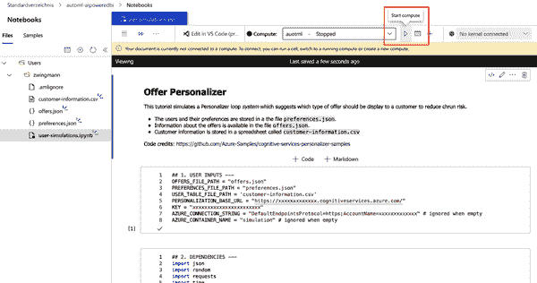

# 第八章：基于 AI 的预测分析

现在，您已经学会如何利用 AI 分析过去的数据并对未来进行预测，现在是讨论推荐行动的时候了！在本章中，您将学习如何通过让算法建议在一系列可能行动中选择最佳选项来支持数据驱动的决策。让我们开始吧！

# 使用案例：下一步最佳行动建议

对于这个使用案例，我们建立在预测模型建议的基础上，并选择特定客户的最佳选项。

## 问题陈述

我们正在一家大型电信提供商的 BI 团队工作。该公司销售各种产品，如月度或年度的有线电视和手机订阅，并且每年有数百万活跃客户。公司面临越来越多的客户流失问题。

团队的数据科学家们成功地构建了一个客户流失模型，预测了单个客户在当前季度末流失的可能性。流失预测已计算为流失分数：100 表示最高的流失概率，0 表示最低的流失概率。虽然流失预测器在识别那些可能取消订阅的客户方面非常准确和有用，但业务仍然在寻找正确的措施来对抗流失。BI 团队已经整合了一个流失预防仪表板，如 图 8-1 所示。

###### 图 8-1\. 基准流失预防仪表板

仪表板在左上角显示了散点图，比较了流失分数与月收入。在右上象限中，是那些月费用高且流失可能性也高的客户，这使得他们成为特别相关的流失预防措施的目标群体。

目前，所有标记为流失的客户都获得相同的留存优惠。平均而言，这一优惠被 31% 的客户接受，这些接受的优惠反映在散点图中的相应点上。这 31% 的接受优惠转化为了 $94,670 的维护收入。销售人员表示他们可以提供其他优惠，但不确定应向客户展示哪种优惠。由于客户群体和优惠类型的多样性，简单的 A/B 测试被证明效果不佳。

分析部门的负责人建议采用数据驱动方法，找出应向各种客户群体展示哪种留存优惠。我们的目标是制定一种至少能超过现有基准线的方法，并支持实时尝试新的优惠类型。

## 解决方案概述

图 8-2 展示了我们用于解决这一问题的使用案例架构。

正如您所见，繁重的工作将在数据层完成。这是因为在分析层我们依赖于现成的 AI 服务来预测最佳的推荐。

###### 图 8-2\. Next Best Offer 使用案例架构

AI 服务采用一种称为 *强化学习* 的方法。通过为不同的客户群体尝试不同的推荐，强化模型最终将找出向哪些客户群体展示哪些推荐。该模型将基于奖励系统进行学习。如果客户接受推荐，模型将获得奖励；如果不接受，则模型将受到惩罚。我们将使用 Microsoft 的 AI 服务 *Azure Personalizer* 运行和维护该模型。

然而，为了使此服务正常运行，我们需要提供用户互动数据。由于在这个示例中我们不希望向客户发送推荐，因此我们将基于包含用户偏好的规则表来模拟用户行为。在现实世界的设置中，我们自然不知道这些用户偏好，必须通过实验来找出它们，但是为了我们的模拟，我们将保留真实数据存储在一个普通的 JSON 文件中。当然，模型将无法访问此文件，需要单独找出这些模式。

在 Azure 笔记本中运行的一个小脚本将利用个性化服务模拟向用户提供推荐，并根据用户的（隐藏）偏好生成奖励。我们的模拟结果将使用 CSV 文件记录，并存储在 Azure Blob Storage 中，以便稍后通过 Power BI 进行进一步分析。

最后，我们将使用 Power BI 监控我们模型的性能，并了解哪些推荐适合哪些用户群体。通过这种方法，我们应该能够看到我们的个性化推荐与基线推荐相比有多大的改进。

## 设置 AI 服务

访问 *[portal.azure.com](http://portal.azure.com)* 进入 Azure 仪表板。在顶部的搜索栏中输入 `**Personalizer**`，选择服务中的 Personalizers。点击“创建”，将您带到创建个性化推荐表单的页面（见 Figure 8-3）。选择您在 第四章 中创建的资源组，并为您的推荐服务取一个名字，例如 `**offer-engine**`。选择 Free F0 定价层。点击“审核 + 创建”。通过最终验证后，确认创建。部署可能需要几分钟完成。

###### 图 8-3\. 创建个性化推荐表单

一旦您的 Personalizer 服务部署完成，请点击“Go to resource”导航至服务页面。让我们前往那里看看发生了什么。在服务首页，您会看到一个快速开始，看起来像 Figure 8-4。

###### 图 8-4\. Personalizer 服务快速开始

这个界面一开始可能有点令人不知所措，但我们在这里不需要做太多事情。首先，在左侧菜单中点击“Configuration”以查看您的模型设置。这是您可以调整模型学习行为的地方。选择这里的时间取决于您处理的数据。通常可以从标准设置开始，并查看模型如何迅速捕捉任何模式。但对于我们的用例，因为我们将模拟用户交互，我们希望保持等待和模型更新周期短。将“奖励等待时间”设置为 10 分钟，将“模型更新频率”设置为 1 分钟，如 Figure 8-5 所示。此外，我们可以将探索百分比降低到 15%，因为我们知道在我们的实验过程中用户偏好不会改变。

###### 图 8-5\. Personalizer 学习配置

不要忘记通过点击顶部的小磁盘图标保存您的更改，并通过刷新页面验证设置是否已应用。

接下来，查看“Learning behavior”选项卡。这是一个实际设置中的实用功能。在这里，您可以调整服务是立即交付预测结果还是运行在 *学徒模式*，这意味着提供基线预测并收集数据，直到此基线可以超越。您可以通过查看微软文档 [“配置 Personalizer 学习行为”](https://oreil.ly/ndze1) 获取有关 Personalizer 服务学习行为的更多信息。对于我们的设置，我们将保持一切不变，并选择“返回最佳操作，实时学习”。

要访问模型并向其发送请求，我们需要独特的模型 URL 和相应的访问密钥。您可以通过在左侧导航窗格中点击“Keys and Endpoint”菜单来找到它们，以访问如下所示的屏幕：Figure 8-6。

###### 图 8-6\. 访问 Personalizer 服务的快捷键和 URL

此屏幕显示了两个重要信息。首先，它为您提供了两个访问密钥，您需要使用它们进行 API 验证，以便允许您进行排名和奖励请求。其次，您会找到访问模型所需的 URL。将此页面保持打开，因为在与模型交互时，我们将需要这些信息。

## 强化学习如何与 Personalizer 服务配合工作

现在我们已经设置了我们的模型并获得了使用它的凭据，现在是时候回顾学习过程实际上是如何发生的，以及模型的工作原理了。Figure 8-7 在概念上展示了这一点。

模型的典型请求同时包含排名和奖励调用。这两者共同被称为*学习循环*：排名函数向用户建议某些内容，并决定模型是否*利用*（根据过去的数据显示最佳行动）或*探索*（选择不同的行动以查看是否可以改善总体推荐结果）。

###### Figure 8-7\. 个性化服务与应用程序的概念流程交互

当服务向用户建议行动后，模型期望得到一个奖励。这可以是一个简单的标志，比如`0`表示“不成功”，或`1`表示“成功”（在我们的案例中，表示是否接受了一项提议），或者可以是一个连续的值，可以代表从新闻文章的滚动深度到股票交易赢利的任何内容。强化学习是一个非常通用的概念，可以应用于系统遵循一组定义好的规则的任何场景。

在 Azure Personalizer 的情况下，服务的工作方式如下，如您在 Figure 8-7 中所见：

1.  关于用户的信息（上下文特征）和可供选择的行动的信息通过 Rank API 发送到 Personalizer 服务。

1.  服务将通过神奇之处并将一个排名响应返回。排名响应通过它们最有可能获得奖励的概率排列的行动列表（如果在利用模式下运行）。

1.  根据用户采取的行动，应用程序计算结果分数并通过奖励 API 发送回服务。模型将接收此反馈，并根据预先定义的学习策略进行更新。

有了这些关于强化学习的新知识，让我们继续获得一些实际操作经验，看看学习循环在实践中是如何工作的，以及我们如何在我们的 BI 中利用这一点。

## 设置 Azure 笔记本

要模拟用户与我们的优惠互动，我们需要在 Power BI 之外运行一些代码。要运行代码，我们将使用 Azure 笔记本。这项服务提供了一种快速执行 Python 或 R 代码的方式，无需在您的计算机上安装任何软件。

要设置 Azure 笔记本，请转到*[ml.azure.com](http://ml.azure.com)*，选择您喜欢的工作区，并导航到笔记本，如 Figure 8-8 所示。

###### Figure 8-8\. Azure 笔记本

选择上传 → 上传文件，如 Figure 8-9 所示。选择以下文件：

+   *user-simulations.ipynb*

+   *customer-information.csv*

+   *preferences.json*

+   *offers.json*

您可以在[书籍网站](https://oreil.ly/aLTWS)上找到所有文件。选择“我信任此文件的内容”选项并点击上传。

###### 图 8-9\. 创建新的 Azure 笔记本

点击 *user-simulations.ipynb* 文件。您应该会在屏幕右侧看到笔记本，左侧则显示所有文件，如图 8-10 所示。

###### 图 8-10\. Azure 笔记本界面

在我们运行代码之前，我们需要为代码实际执行的计算资源进行配置。如果您尚未创建计算资源，请参阅“创建 Azure 计算资源”。如果资源已停止，请为本练习启动资源。否则，请从下拉菜单中选择计算资源，然后点击“启动计算”，如图 8-10 中所示。

一旦计算资源启动并首次连接到此笔记本，您应该会看到一条通知，提示您对 Azure 计算资源进行身份验证。点击身份验证按钮，结果会显示一个绿色徽章（图 8-11）。这一身份验证过程大大简化了从 Azure 笔记本中访问 Azure 资源的流程。

###### 图 8-11\. Azure 笔记本中的身份验证

现在，您可以从右上角选择您想要使用的编程语言。为了跟随代码示例，请选择“Python 3.6 - Azure ML”（或更新版本），如图 8-12 所示。

###### 图 8-12\. 在 Azure 笔记本中切换编程语言

###### 注意

我们将在此代码中使用一些 Azure 包进行身份验证和 Blob 存储，目前这些功能在 R 中还不受支持。虽然仍然可以在 R 中执行此工作流程，但会非常繁重。因此，在这种情况下，我只提供 Python 版本。所有 R 用户，请跟随这里的内容。

## 模拟用户交互

最后让我们模拟一些用户与优惠的交互。为此，我们会做出两个假设。首先，我们定义了一组有限的优惠可能性，具有相当简单的复杂性。其次，我们假设我们知道哪个用户分段接受哪个优惠。有了这些信息，我们可以让我们的模型开始随机向各种客户段推荐优惠，并通过探索捕捉到底层模式。

我们还保持用户细分复杂性相对较低，因为我们不想超过免费层的 50,000 个 API 调用。请记住，我们每个等级和奖励函数都需要一次调用，而典型的强化模型需要几千次迭代才能开始学习有意义的模式。因此，我们将在开始时保持复杂性低，这样我们就可以在较少的学习循环中获得良好的学习结果（并且您可以保持在免费学分范围内）。但是，我们将坚持一个原则：模型不知道哪个客户段偏好哪种优惠类型，它必须自己找出答案。

不要被此示例限制。如果您希望追求更高的目标，可以自由添加关于客户细分或行动特征或新优惠的更多上下文特征。

对于我们的模拟，我们需要四个组件：

+   关于可用优惠类型和优惠属性的信息

+   关于客户的信息（上下文特征）

+   有关客户真实偏好（基本真相）以计算离线奖励

+   一个可以存储互动数据的地方，以便稍后通过 Power BI 进行分析

第一个组件包含在*offers.json*文件中，该文件列出了可用的优惠及其相应的特征。为了公平起见，我们假设所有这些优惠的价值相同，因此没有比其他优惠更划算的优惠。这纯粹是偏好的问题。

第二部分是关于客户的信息（上下文特征）。这些信息包含在*customer-information.csv*文件中。正如前面提到的，我们通过仅考虑“老年人”和“合同”这两个变量来保持复杂性低，但当然，Personalizer 服务可以处理更多的特征。事实上，我们提供的优惠环境特征越多，效果就越好——只要我们有足够的时间和学分来学习。

第三个部分在*preferences.json*中。它包括关于哪个客户段偏好哪种优惠类型的信息。表 8-1 以表格形式显示这些信息。这些是我们模型未知的模式，我们希望模型能够自动学习。

表 8-1\. 带有客户偏好的规则表

| 老年人 | 合同 | 首选优惠 |
| --- | --- | --- |
| 是 | 按月 | 现金折扣（优惠 1） |
| 是 | 一年 | 免费一个月（优惠 2） |
| 是 | 两年 | 免费一个月（优惠 2） |
| 否 | 按月 | 业绩奖励（优惠 3） |
| 否 | 一年 | 业绩奖励（优惠 2） |
| 否 | 两年 | 现金折扣（优惠 1） |

最后，我们需要一个地方来存储仿真结果。为了保持示例简单（并通过 Power BI 保持可访问性），我们将结果保存为普通的 CSV 文件。为了提供更多实际的体验，我们将输出写入 Azure Blob Storage（在第四章中创建），然后从那里加载到 Power BI 中。

## 使用 Python 运行仿真

在 Azure Notebooks 中，仔细看看你面前的代码。我的目标是让你理解这段代码在做什么，即使你对 Python 不熟悉，所以让我们来逐步走过它。

代码由五个部分组成。第一个称为用户输入，您需要自定义一些选项：

`OFFERS_FILE_PATH`

*offers.json* 文件所在的文件路径。

`PREFERENCES_FILE_PATH`

*preferences.json* 文件所在的文件路径。

`USER_TABLE_FILE_PATH`

*user-information.csv* 文件所在的文件路径。

`PERSONALIZATION_BASE_URL`

在 Azure 门户中的 Keys 和 Endpoint 屏幕上显示的终结点。

`KEY`

Azure 门户页面上的访问密钥之一（具体哪个密钥无关紧要）。如果决定重新生成密钥，请确保替换此密钥。

`AZURE_CONNECTION_STRING`

用于授权 blob 存储的 Azure 连接字符串，如果为空将被忽略。

`AZURE_CONTAINER_NAME`

Azure blob 容器的名称，如果为空将被忽略。

如果按照前面展示的方式将文件上传到 Azure Notebooks，可以将文件路径保留原样。

在本节中用你的自定义变量替换 `*xxxxxxxxx*` 值，包括 Personalizer URL、Personalizer 密钥和 Azure 连接字符串。还要确保你创建了一个名为 *simulation* 的存储容器，如第四章中所述。

这个脚本只需要你自定义这些内容。剩下的就是在我们一次性运行整个脚本之前进行阅读和理解。

第二个代码部分叫做 Dependencies，加载了此脚本所需的所有包。所有这些包应该已经预装在我们刚选择的“Python 3.6 - Azure ML”内核中。

第三部分称为 Functions，包含四个主要函数：

`add_event_id`

此函数为每个 rank 调用生成一个唯一的 ID。该 ID 用于标识 rank 和奖励调用信息。此值可以来自业务流程，如 Web 视图 ID 或事务 ID。

`add_action_features`

此函数将所有优惠列表添加到要发送给 rank 请求的 JSON 对象中。

`get_reward_from_preferences`

此函数在调用 Rank API 后被调用，用于比较用户对某个优惠的偏好（基于其资历和合同类型）与 Personalizer 根据这些过滤器为用户提供的建议是否正确。如果推荐正确，则返回 `1` 的奖励；否则为 `0`。

`loop_through_user_table`

此函数包含脚本的主要工作。它将迭代提供的用户表的每一行，从 API 请求个性化优惠，与实际用户偏好进行比较，并计算一个奖励分数，然后将其发送回 Personalizer 服务。所有结果将在名为 `results` 的列表中收集，并在函数完成时返回。

第四部分称为 Execution，将调用这些函数并运行实际的工作流程。

第五部分 Export，将通过保存到名为 *results.csv* 的平面文件持久保存结果。如果提供了 Azure 存储凭据，则结果文件也将上传到 Azure Blob 存储。

再次验证您是否已经在第一个代码部分自定义了所有输入。现在，通过选择“重新启动内核并运行所有单元格”来运行代码，如 图 8-13 所示。

###### 图 8-13\. 运行整个 Azure 笔记本

对整个客户表的迭代大约需要 10 分钟。当进程完成时，您应该会在左侧的文件树上看到新文件 *results.csv* 被创建。这基本上是我们实验的产物（也会是实际场景的日志文件）。如果在输入中指定了 Azure 连接字符串和有效的容器名称，该文件将自动上传到您的 Azure 容器。如果上传失败，请确保您不要重新运行整个脚本，而只需运行处理文件上传的脚本最后一个代码单元。

## 在 Azure 门户中评估模型性能

为了快速了解模型的工作情况，我们可以在 Azure 门户中检查模型的性能。导航至您的 Personalizer 资源，并从左侧菜单中选择 Evaluations。向下滚动，您应该可以看到平均奖励分数，如 图 8-14 所示。

在本示例中，您可以将这个数字解释为模型为客户选择正确优惠的百分比。此时，奖励分数应该还相对较低。

###### 图 8-14\. Personalizer 评估

请记住，我们从一个天真的模型开始，通过几千次实验才找出潜在的模式。个性化服务通常需要成千上万个示例才能在实际场景中表现良好。如果您运行前述的模拟代码两到三次，您应该会看到此数字随之增加。如果不是这种情况，这清楚地表明模型学习行为出现了问题。您可以查看 [Microsoft FAQ](https://oreil.ly/dojWy) 来解决模型学习中的错误。

我们可以通过*离线评估*来提高性能，而无需重新运行整个数据集。这种技术允许您使用现有数据，并通过各种学习策略重新训练模型，找出哪种策略最适合您的数据。让我们试试这个方法，看看是否能比我们迄今为止训练的模型效果更好。从顶部菜单中选择“离线评估”，如图 8-15 所示。

###### 图 8-15\. 创建离线评估

双检查日期范围是否与您运行模拟实验的日期匹配，并将所有其他设置保持不变。单击“确定”以启动离线评估，如图 8-16 所示。

###### 图 8-16\. 离线评估表单

评估过程大约需要几分钟时间。完成后，从列表中选择评估以查看更多详细信息。点击链接“与其他潜在学习设置比较您应用程序的分数”以查看评估指标，如图 8-17 所示。

###### 图 8-17\. 离线评估结果

正如您可以看到的，从离线评估中，我们了解到如果应用 Hyper1 学习设置，我们可以将我们的模型从 0.5363 的平均奖励（作为评估结果）提高到 0.5775。考虑到我们留出 15%用于探索，这更接近理想情况下的 0.85。通过单击旁边的“应用”按钮选择新的学习设置。这将重新训练您的模型，并使用新的学习设置部署它。

您现在可以回到代码中，再次运行模拟以查看模型的改进。但首先，我们希望将我们的 AI 建议整合到我们的 BI 仪表板中。让我们在此使用案例的最后一步中探索这一点。

## Power BI 中的模型推断演示

正如您可能记得的那样，我们的使用案例场景已经提供了一个 BI 仪表板，显示了当前客户流失预测以及标准报价的整体接受率，表明我们客户保留策略的成功。现在我们想做的是将这些信息与我们的个性化服务的绩效见解结合起来，看看我们的举措是否导致更多客户接受报价。

首先，从[书的网站](https://oreil.ly/aLTWS)打开 Power BI 工作簿*Offer_Recommendation.pbix*，然后转到数据模型。您应该在这里看到用于客户流失预测的现有表结构。让我们通过导入模拟过程中创建的结果 CSV 文件，将我们的模型结果添加进去。如果您之前决定将 CSV 文件保存到本地，请选择获取数据 → 导入文本/CSV，并找到本地计算机上的 CSV 文件。

如果决定将文件保存在 Azure Blob 存储中，请选择“获取数据”→“Azure”→“Azure Blob 存储”。提供之前提供的存储帐户名称。在下一步中，粘贴从 Azure 门户获取的访问密钥。确认这些选项后，您应该看到显示所有容器和文件的列表，如 图 8-18 所示。

###### 图 8-18\. 从 Power BI 访问 Azure Blob 存储

选择带有您的模拟数据的容器。但不要加载文件！而是点击“转换数据”按钮。这将允许您使用 Power Query 提取 CSV 文件的实际内容。否则，您将只看到 CSV 的元数据，如文件名、创建日期和大小。

在 Power Query 编辑器中，单击二进制数据链接，如 图 8-19 所示。

###### 图 8-19\. 使用 Power Query 编辑器访问 blob 文件

这将带您进入 CSV 文件的内容；将二进制数据转换为表格数据显示为“应用步骤”面板中的处理步骤（见右侧）（图 8-20）。

###### 图 8-20\. 从 blob 存储导入表格数据

通过从顶部菜单选择“关闭并应用”确认转换。新 CSV 文件的内容将添加到您的数据模型中。Power BI 将基于字段 CustomerID 自动为 Churntable 和模拟数据模型生成关系，如 图 8-21 所示。

###### 图 8-21\. Power BI 中的数据关系

## 在 Power BI 中构建 AI 动力仪表板

转到 BI 报告页面，我们需要做一些修改，以包含我们的新基于 AI 的建议。对报告进行以下更改：

1.  更新散点图视觉：

    +   图例字段：从模拟数据模型中用“奖励”替换“接受报价？”。

    +   更改格式和数据颜色下的颜色方案：将空白设置为灰色，0 设置为红色，1 设置为蓝色。

1.  更新仪表盘表：

    +   将“平均接受报价”替换为“模拟”表中的“奖励”。将“奖励”应用于“平均”计算。

1.  更新防御收入指标视觉：

    +   将奖励 = 1 添加到视觉筛选器中。

    +   从视觉筛选器中删除“接受报价”。

1.  更新树状图表：

    +   在组字段中，将“显示的报价”替换为“预测”。在格式设置窗格中调整数据颜色，以便空白匹配灰色，所有报价匹配蓝色的色调。

最终的仪表板现在应该看起来类似于 图 8-22。

###### 图 8-22\. AI 动力推荐仪表板

让我们简要比较这个仪表板与本章开头的原始仪表板（见图 8-1）。你会注意到两个主要变化。

首先，与我们现有的基准相比，准确率从 0.31 上升到 0.54，提高了 23 个百分点。这意味着通过使用基于 AI 的方法，我们可以说服更多客户接受我们的留存优惠。因此，捍卫的月收入也相应增加到了 154.38K，几乎增加了 6 万美元。

其次，我们可以看到优惠的比例增加了。以前最受欢迎的优惠 1（现金优惠）现在几乎不再发生。大多数客户接受了优惠 3——更高的性能。

我们可以进一步改善这些 KPI 吗？记住，我们之前通过离线评估调整了我们的模型。但我们尚未应用新模型。

返回模拟代码，再次运行而不做任何更改。再过 10 分钟，代码将会处理一次数据集，因此个性化服务可以使用更新的学习设置。你的 Azure Blob Storage 中的*results.csv*文件应该已自动更新。因此，我们在 Power BI 中所需做的一切就是进入数据模型并点击“刷新数据”，如图 8-23 所示。

###### 图 8-23\. 刷新数据

几秒钟后，Power BI 已获取更新的数据。如果我们返回报告，我们可以看到更新的推荐实施情况（见图 8-24）。

###### 图 8-24\. 数据更新后的 AI 驱动仪表板

通过更新的学习设置再次迭代数据集，我们的推荐又提高了 5 个百分点，现在达到了 59%的准确率。捍卫的收入又增加了$17,680。

对于实际场景，想象一下，你不是反复迭代相同的数据集，而是每个季度、月份或者每天都处理新的客户数据，这取决于你的业务。这样，你可以监控你的推荐模型的表现，并决定它是否足够好以投入生产。至少仪表板将为你提供一个坚实的指导，评估基于 AI 的推荐服务的业务价值，与你现有的基准进行对比。

您可以从[书籍网站](https://oreil.ly/aLTWS)下载最终的 Power BI 文件*Offer_Recommendation_AI-Powered.pbix*。

# 清理资源

考虑停止或删除我们在本章中使用的以下资源，以避免任何持续的费用：

+   停止计算实例。

+   删除 Azure Personalizer 服务资源。

+   删除 Azure Blob Storage 中的 CSV 文件。

我们仍将在其他章节中使用这些资源。如果您不打算在接下来的章节中执行这些用例，可以一次性删除所有资源。在您的 Azure 门户中选择“资源组”，选择您创建的资源组，然后选择“删除资源组”。确认资源组名称，然后点击删除。

# 总结

我希望您能从这个用例中看到，我们如何利用 AI 将预测转化为行动，以及如何找出哪些行动适合特定的情境。虽然 Azure Personalizer 只是众多服务中的一个，但基于强化学习的推荐引擎背后的思想和原则是相似的，如果需要，您也会发现学习其他服务非常容易。此外，通过 Azure Blob Storage，您学会了实时监控模型更新并将其无缝集成到您的 BI 中，过程也不会太过复杂。

在下一章中，我们将处理非结构化数据，看看如何利用 AI 分析图像、文档和音频文件的内容，并将其融入我们常规的 BI 工作流程中，与来自业务的现有信息进行整合。
