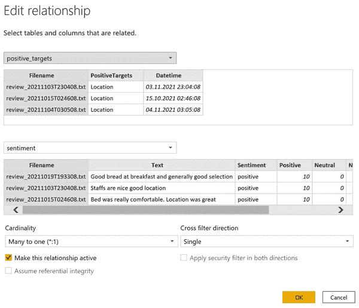
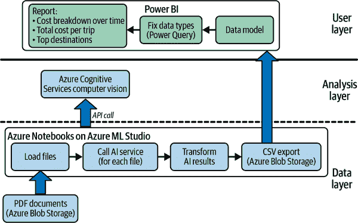
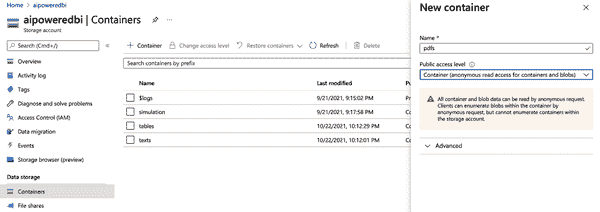
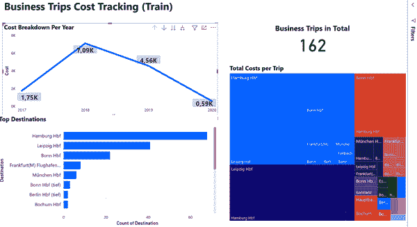

# 第九章：利用 AI 处理非结构化数据

在之前的章节中，我们在处理结构化数据时大量使用了 AI，或者大多数人称之为表格。然而，企业中的许多数据实际上并未存储在干净的表格中，而是以各种格式存在，如 PDF、图像、原始文本、网站和电子邮件。当考虑到这些格式时，组织内可用的大多数数据是非结构化的。借助 AI，我们可以解锁这些宝藏，并从以前未被分析师触及或需要大量手动工作才能从中获得见解的数据中获取洞察。在本章中，我们将探讨 AI 如何帮助我们分析文本、文档和图像文件。

# 使用案例：从文本数据中获取洞察

书面语言是人类收集的最大和最多样化的数据来源之一。企业也不例外。数据的最大创造者是人，无论是在组织内还是外部。顾客成为内容生产者，通过网络和各种渠道分享他们对产品或服务的意见。

在这个使用案例中，我们将部署一个 AI 服务来帮助我们理解这些数据。在具体的问题中，我们将分析用户评论的规模，并通过 BI 仪表板传达关键见解。让我们开始吧！

## 问题陈述

小房间、不友好的员工和可怕的早餐——或者并非如此？一家大型酒店的管理团队因各种客户反馈的多样性而感到紧张。管理层是否真的需要解决问题，还是只是不得不接受零星的投诉，作为经营住宿业务的一部分？运营负责人已聘请您作为外部分析师，以了解客户对酒店的看法以及这一趋势随时间的发展情况。

作为数据来源，公司提供了通过酒店网站和预订平台收集的客户反馈文本文件样本。由于新季即将开始，管理层希望尽快看到结果，速度明显优先于准确性。管理人员希望了解是否存在根本性问题，并有能力在必要时深入了解。

## 解决方案概述

查看图 9-1 中的高层次使用案例架构。


###### 图 9-1 从文本数据中获取洞察的使用案例架构

从对这种架构的第一眼看，您应该立即认识到分析层似乎非常简单。原因是，为了自动分析许多文本文件，我们将使用 NLP AI 服务。正如您之前所见，这种 AI 服务不需要任何训练；相反，我们可以将数据发送到服务，并立即获得响应。

在这种情况下，我们的目标是提取关于存储为文本文件的客户评论中的意见是消极还是积极的信息，这也被称为*情感分析*。此外，我们希望提取关键词，以便我们可以关联到带有积极或消极情绪的词组。展示应以 BI 仪表板的形式呈现，在我们的情况下是 Power BI（用户层）。

此用例中最具挑战性的部分在于数据层。我们需要将数据整理成正确的格式，将其发送到 AI 服务，并以结构化表格的方式检索结果，以便我们的 BI 系统可以处理它们。我们将通过在 Azure Notebooks 上使用 Azure ML Studio 中的脚本构建一个小型数据处理流水线来实现这一目标，该流水线加载文件，调用 AI 服务，转换结果，并导出可以被我们的 BI 系统（Power BI）消费的扁平 CSV 文件。

## 设置 AI 服务

首先，我们需要在我们的 Azure 订阅中激活认知服务文本分析。这一步骤非常简单，类似于我们在其他章节中做过的操作。要激活认知服务文本分析，请转到您的 [Azure 门户](https://portal.azure.com)，并在搜索栏中搜索`**cognitive services**`，如 图 9-2 所示。


###### 图 9-2\. 搜索 Azure 认知服务

从建议列表中选择认知服务，然后转到相应的资源页面。在此页面，您可以为各种数据和用例启用认知服务。向下滚动直到看到语言部分，如 图 9-3 所示。


###### 图 9-3\. 语言认知服务

从这里，您可以通过点击“+ 创建”按钮部署新的语言服务资源。在接下来的表单中，您应该已经非常熟悉了，选择您的 Azure 订阅和资源组，并为您的语言服务命名。此外，请确保选择免费层（F0），该层允许每 30 天进行 5,000 次交易。一次交易是一个文本记录，对应于作为输入提供给语言服务 API 的文档中的 1,000 个字符单位数量——对于我们这里的用例来说，这已经足够了。您可以在 图 9-4 中看到填写好的表单示例。

点击“审核 + 创建”，然后在自动审核流程通过后点击创建。部署将需要几分钟时间，但之后您应该会看到一条通知，提示新资源已准备就绪。


###### 图 9-4\. 创建文本分析服务表单

部署完成后，导航到新资源，可以通过单击通知或者（如果您离开了页面）只需在 Azure 搜索栏中搜索您在表单中提供的资源名称来实现。 在这两种情况下，您应该会看到资源的概述页面（图 9-5）。


###### 图 9-5\. 文本分析概述页面

我们可以在这里做很多事情，但现在我们只想专注于两件事。 首先，我们如何对 API 进行身份验证？ 其次，我们在哪里找到 API 的工作原理（我们需要编写或更好地复制和粘贴的代码）？

要回答第一个问题，您可以在左侧菜单窗格中单击“键和端点”选项。 在这里，您会找到两个密钥，就像在 第八章 中的 Azure Personalizer 示例中一样。 您只需要其中一个来调用 API。 在新标签页中保持此窗口打开，因为我们很快将需要这些资源密钥。

要了解 API 的工作原理，您可以在概述页面的“开发”下探索资源。 这将带您到一个网站，解释了各种情景，您可以在文本分析 API 和您将使用的代码中使用这些情景。 现在可能会有点多，但不要被吓到。 您不需要所有这些信息。 现在，认识到我们稍后在数据准备步骤中编写的大部分代码可以从此文档页面获取，并根据自己的需求进行调整，就足够了。

浏览文本分类的文档时，我们可以发现有关我们新 AI 服务的一些更有用的信息。 转到 [概念 → 数据限制](https://oreil.ly/9j6lt)，您应该会找到一张表（图 9-6）。


###### 图 9-6\. 文本分析请求限制

如果我们查看此表，并定位到情绪分析行，我们可以看到 API 接受每次请求的 10 个文档。 我们可以一次性向 API 发送最多 10 个文本文件，与逐个发送文本文件到 API 相比，这将大大加快我们的推理过程。 我们将在数据处理期间回到这一点。

现在，AI 服务的一切都已经准备就绪。 让我们继续构建我们的迷你数据管道，并对客户反馈数据进行一些推理。

## 设置数据管道

要从原始文本文件到设计精美的 BI 仪表板，我们必须解决一些中间步骤。 在生产环境中，这将被称为我们的*提取，转换，加载*（*ETL*）过程。 对于我们的原型，我们不会将其称为完全成熟的 ETL 过程，但本质上我们正在做同样的事情。 让我们称之为我们的迷你 ETL 作业。

我们将编写一个简短的脚本来处理 ETL 过程的基本部分：

1.  从文件中读取纯文本文件。

1.  将文件内容发送到 AI 服务 API。

1.  收集结果，转换它们，并将它们存储在结构化的数据对象中。

1.  将文件导出为扁平表格，以便我们的 BI 软件可以轻松消费。

对于第一步，我们需要获取文本文件并将它们存储在脚本可以访问的地方。我们将使用 Azure Blob Storage 进行存储。前往[书籍网站](https://oreil.ly/0uHwu)，下载*reviews.zip*文件。在 Azure 门户中，导航到存储，选择您之前设置的存储帐户，并创建一个名为`**texts**`的新容器，如图 9-7 所示。该容器将保存原始输入文本文件。“表”容器应该已经存在于第四章中，并将接收我们的迷你 ETL 过程的表格化输出。


###### 图 9-7\. 在 Azure Blob Storage 中创建新容器

创建“texts”容器后，将所有单独的文本文件上传到这里。不要上传 ZIP 文件，而是其内容。您的容器现在应如图 9-8 所示。


###### 图 9-8\. 带有审查数据的 Azure 存储容器

现在我们的输入数据已准备好供脚本消费。暂时可以将其他“表”容器保持为空。我们将通过下面将要查看的脚本来填充它。

从[书籍网站](https://oreil.ly/0uHwu)下载*ETL_For_Text_Analytics.ipynb*文件。该笔记本包含您执行迷你 ETL 过程所需的所有代码。如果您已经在计算机上安装了本地 IDE，如 Jupyter 笔记本，可以直接使用它。如果没有，我建议使用 Azure 笔记本作为托管 IDE，因为它是 Azure 订阅的一部分。

我将指导您使用 Azure 笔记本的示例，但是当您使用本地 IDE 时，步骤相同。

###### 注意

我们将使用一些 Azure 包进行此代码所需的身份验证和 Blob 存储，这些包目前不支持 R 语言。虽然在 R 中仍然可以执行此工作流程，但会非常耗费资源。因此，在这种情况下，我仅提供 Python 版本。所有使用 R 的用户，请跟随这里。

让我们首先创建一个新的 Azure 笔记本：

1.  前往[Microsoft Azure 机器学习工作室](https://ml.azure.com)，并选择您在整本书中一直使用的工作区。

1.  从左侧菜单中选择笔记本。

1.  单击加号图标，并选择“上传文件”，如图 9-9 所示。

1.  在您的计算机上找到*ETL_For_Text_Analytics.ipynb*，选中“我信任该文件的内容”选项，然后点击上传。


###### 图 9-9\. 将文件上传到笔记本环境中

您应该看到笔记本，如图 9-10 所示。


###### 图 9-10\. ETL 笔记

笔记本将显示在右侧。虽然此文件包含大量代码，但不要被吓到。事实上，您唯一需要修改的是第零部分“Packages and Setup”中第 2、3 和 6 行的访问凭据和 AI 服务端点的自定义参数，就像您在第八章中所做的那样。

作为在让您一次运行整个笔记本和逐行讨论代码之间的中间解决方案，我将通过解释代码部分来为您提供此代码正在执行的高级概述。我建议您跟着执行代码单元格。

此代码分为四个主要部分，大致对应我之前在 ETL 过程中提到的四个步骤：

1.  从 Azure 下载文本文件：我们将从 Azure 下载原始文本文件到运行笔记本的本地计算机。

1.  调用 AI 服务（情感分析）：我们将发送文本文件到 AI 服务并保存结果。

1.  将 AI 结果转换为 CSV：我们将 AI 结果从 JSON 输出转换为平面 CSV 文件，以便我们的 BI 系统能够轻松消化。

1.  将 CSV 上传到 Azure Blob Storage：我们将文件上传回连接到我们的 BI 系统的 Azure Blob Storage 中。

在开始之前，请确保笔记本连接到正在运行的计算资源。如果尚未创建计算资源，请参考“创建 Azure 计算资源”。

如果在计算资源启动后再次要求进行身份验证，请单击显示身份验证按钮。然后，您应该看到成功提示（图 9-11）。


###### 图 9-11\. 身份验证提示

现在，请前往代码的第零部分。这是我们确保所有需要的包都已安装和加载，更重要的是，提供您的个人 Azure 凭据的地方。这是整个笔记本中您需要更改内容的唯一位置。用来自 Text Analytics Cognitive Service 和 Storage 账户的 Azure 门户自定义值替换密钥、端点和 Azure 连接的虚拟字符串。

更新了个人凭证后，通过将光标放在第一个代码单元格内并按 Shift+Enter 来运行第一个代码单元格。此代码的输出应该相对简单。所有包应该已经安装在 Azure 计算资源上，您应该只看到`Requirement already satisfied`的通知，如图 9-12 所示。

###### 注意

虽然我们在代码中以明文存储我们的 Azure 凭据，但请注意，这通常不是良好的编码实践。我们之所以这样做是为了保持示例简单，并且因为笔记本仍然托管在受保护的 Azure 环境中。如果您想了解如何处理身份验证机制的最佳实践，请查阅微软资源 [“关于 Azure Key Vault”](https://oreil.ly/9U6Z7)。


###### 图 9-12\. 包安装的笔记本输出

让我们继续我们的小型 ETL 过程的第一部分：文件下载。第 1 步的第一个代码单元调用了我们在前面设置部分中定义的一个类对象。这段代码基本上是通过使用您的连接字符串来建立与 Azure 存储帐户的连接，并从您提供的 `AZURE_INPUT_CONTAINER` 中下载所有文件。运行此代码单元，大约一分钟后应该会完成，并打印如 图 9-13 所示的输出。


###### 图 9-13\. Blob 下载的笔记本输出

###### 注意

如果您想知道为什么这个下载如此耗时，请放心，有方法可以加快下载过程——例如同时运行多个下载任务。事实上，您甚至可以直接传递 AI 服务的文件 URL，而完全不下载它们。对于我们的原型，慢速下载的方法仍然可以接受。但是如果您进入生产阶段，您可能会考虑更快的替代方案。

接下来，让我们继续我们代码的第二部分，调用 AI 服务。在这一部分，我们将文本发送到 AI 服务进行分析。如前所述，我们一次发送 10 个文本文件（文档）的批次到 API，以便更快地获得结果。运行代码单元。一旦完成，您应该会看到第一个结果，其中包含情感分析的前 10 个结果，如 图 9-14 所示。


###### 图 9-14\. 情感分析的原始笔记本输出

正如您从这个预览输出中所注意到的，结果的结构是嵌套的。AI 服务不仅为每个文本提供情感分数，还为每个分析的文本在词级别上提供了详细的意见分析。这对于数据的解释将会很有用，但不利的一面是，我们需要费些工夫来解开整个对象并将其转换回一些简洁的平面表格。这就是本代码第三部分的内容。让我们继续前进吧！

数据准备代码的第三部分是最详尽的部分。虽然主要的 AI 工作负荷已经完成，但还需要进行一些后处理工作，提取每个文本的情感分数和每个条目中发现的相应意见。

现在，如果你问自己，“我到底该如何编写这段代码？”我有好消息告诉你。大部分这段代码都是从 AI 服务的文档页面借用来的。你还记得 Azure 控制台里的快速入门参考吗？这就是这段代码大部分来自的地方。一旦你理解了一般行为，你所需做的调整就相当简单了。

在这个示例中，我进行了三处调整。首先，我只提取每个文本项的高级情感分数，并将它们保存为扁平表以更好地与 CSV 兼容。这个表或数据框还包含原始文件名、原始文本以及从文本文件名中提取的日期时间列。这将产生一个漂亮的扁平 CSV 输出，我们稍后可以在我们的 BI 中显示。其次，我为文本文档中找到的所有正面和负面词汇或意见分别创建了一个扁平 CSV 文件，同样存储有对原始文件名和提取的日期时间列的引用，以便这些术语可以被链接回其原始上下文，并且也可能按时间进行过滤。如果你感觉幸运，逐行查看代码看看发生了什么。如果没有，也没关系。我们不打算成为软件工程师。无论如何，点击此单元格的运行按钮以查看显示在图 9-15 中的输出。


###### 图 9-15\. 情感分析的格式化笔记本输出

为了方便起见，输出以易读的格式打印了每个文本文档的情感和意见。例如，你可以从图 9-15 看到，尽管有语法错误，“地下室很吵”被 AI 识别为负面情感，而 AI 服务能够识别“房间”和“吵闹”作为这一负面意见的主要驱动因素。这不是挺好吗？

最后，这段代码还创建了我们想要的 CSV 文件。如果你查看左侧的文件资源管理器并点击刷新，你应该会看到三个新的 CSV 文件，就像图 9-16 所示。


###### 图 9-16\. 笔记本环境中的 CSV 输出

要使这些 CSV 文件对我们的 BI 可访问，让我们转到第四部分的代码部分，这部分代码专门用于将这些文件上传到 Azure Blob Storage。与第三部分相比，这将会轻而易举。

执行最后一个代码单元格。眨眼间，你应该会看到显示在图 9-17 中的输出，确认文件已成功上传。


###### 图 9-17\. 已完成上传的笔记本输出

恭喜！您已完成最困难的部分，并成功完成了迷你 ETL 挑战。现在，与每个 ETL 过程一样，此流程是可重复的。每当更新 blob 输入容器中的文本文件，并且文件保持相同结构时，您只需重新运行整个工作流程（一次），输出容器中的 CSV 文件将被替换并覆盖为新结果。

现在让我们暂时离开 ETL 的领域，转向更有趣的部分：在我们的 BI 中可视化和综合我们的结果。

###### 警告

不要忘记在此练习后停止计算资源，以避免任何持续费用！

## 使用 Power BI 进行模型推断演练

要显示我们的结果，我们将再次回到 Power BI。在 Power BI 中创建一个新报告，选择 Azure Blob 存储作为数据源。连接到您的存储账户，然后选择 *Tables* 文件夹旁边的复选框。点击“Transform”。在 Power Query Editor 中，您会找到文件夹中所有 CSV 表格的列表。我们需要逐个处理这三个表格。

选择第一个文件并点击 Binary 链接以查看数据预览，如图 9-18 所示。确保 Datetime 列已正确转换为日期时间格式。点击“关闭并应用”，然后对其他两个 CSV 文件重复这些步骤。


###### 图 9-18\. Power Query 中的情感数据

现在你的数据模型应该列出三个单独的表。然而，我们知道这些表彼此相关，并且我们希望 Power BI 也知道这一点。右键单击任何表格，选择“编辑关系”。在弹出的编辑器中，基于“文件名”列在“positive_targets”和“sentiment”表之间创建关系。基数应该是多对一，如图 9-19 所示。点击“确定”，然后为“negative_targets”表重复此设置。



###### 图 9-19\. Power BI 中的数据关系

此后，您的数据模型中的表格应该已连接，如图 9-20 所示。


###### 图 9-20\. Power BI 中的数据模型

现在我们的数据模型已经完成，是时候继续处理可视化了。

## 在 Power BI 中构建 AI 驱动的仪表板

让我们快速回顾一下情况：管理层想知道是否有什么事情需要他们关注。为了对客户评论进行高层次的概述，我们需要四个要素：

+   随时间发展顾客情感以检查趋势

+   顾客投诉的项目列表（负面目标）

+   顾客喜欢的项目列表（正面目标）

+   回到原始数据以获取更多上下文信息

我们可以通过多种方式传达这些信息。我决定编制一份报告，包含一个显示总体趋势的折线图，两个突显正面和负面目标的树状图，以及一个简单的表格，列出所有客户反馈的纯文本。你可以在图 9-21 中看到最终结果。


###### 图 9-21\. AI 动力情感分析的最终仪表板

试着在 Power BI 中自行重新创建这个仪表板，或者想出你自己的解决方案。或者，你可以从[书籍网站](https://oreil.ly/0uHwu)下载完整的 *User_Reviews_AI-Powered.pbix* 文件，并将其连接到你自己的 Azure Blob Storage。

那么这个仪表板告诉我们什么？首先，我们可以看到正面和负面情感似乎有一个相对稳定的趋势，每天都有起伏。如果我们将可视化数据聚合到月度水平，情况就会变得更加清晰（参见图 9-22）。从月度的角度来看，负面情感似乎大幅增加。如果我们探究原因，我们会发现大多数投诉是关于房间、早餐和 WiFi 的。尽管房间可能在短期内难以修复，但早餐和 WiFi 提供了可以由管理层迅速解决的明确行动项目。


###### 图 9-22\. 每月情感分析

另外，由于我们已经在表格之间创建了关系，Power BI 允许我们筛选特定的数据点。例如，如果我们从折线图中选择一个日期，仪表板的其余部分将相应更新，并仅显示在这一天收集的相关数据，反之亦然。关于房间，客户投诉了什么？只需点击负面目标树状图中的房间，通过探索底部的原始文本来了解客户的说法。这为探索数据集并更多地了解实际客户反馈提供了一个很好的途径。

虽然这个仪表板只触及了文本分析的冰山一角，但希望你已经看到了在大规模文本数据分析中其强大的能力。多亏了 AI 服务，这可以用几行代码完成，并集成到任何 BI 系统中。

# 使用案例：使用 AI 解析文档

你有见过一个不使用表格的企业吗？对于企业来说，表格就像程序员的 API 一样重要。表格有一个很大的优势。它们通常很好地在人类之间交换信息。给定一个特定的表格和一些描述，你应该很快能够弄清楚如何阅读表格或如何填写它。

当表格需要由计算机处理时，常常会出现问题。通常表格仍然以纸质文件或其电子副本形式存在，即 PDF 文件。如果您希望大规模处理它们，往往除了手动查阅并从这些 PDF 中提取数据进行进一步分析之外别无选择。收据也可以看作是一种表格；它们提供了一种易于人类阅读但难以机器解释的重复数据结构。在这个使用案例中，我们将学习如何利用人工智能帮助我们大规模阅读文件并从中提取值，以便在商业智能系统中显示。

## 问题陈述

在我们的下一个场景中，假设我们正在为一家提供咨询服务的中型公司工作。该公司位于德国，销售代表经常出差到潜在客户那里，以准备或完成交易。这些出差大多通过连接德国大城市的高速列车进行，称为 ICE（InterCity Express）。

我们的出差管理部门负责控制总体开支。商务旅行的流程如下：销售代表可以通过火车运营商（德国铁路）的自助门户预订火车票。这些票券使用公司信用卡支付。出差管理团队在每月末监督信用卡账单结算，以便了解出差开支的概况。然而，信用卡对账单除了支出金额和日期外并未提供任何进一步的细节。为了优化出差开支并更好地了解哪些商务旅行造成了最高成本，出差管理团队希望更深入地了解出差情况，包括按流行旅行路线（火车出发地和目的地）进行的细分。

这些信息可以在销售代表每次成功预订后自动通过电子邮件接收的预订收据中找到。图 9-23 展示了这种收据的示例。

特别是，团队对从这份表格中提取以下信息感兴趣：预订日期、出发地、目的地以及票价。出差管理团队希望找到一种自动提取这些信息并理想情况下使用现有的商业智能系统进行报告的方法。他们已经提供了一位销售代表的 162 张收据样本，用于初版原型的开发。


###### 图 9-23\. ICE 列车在线车票

## 解决方案概述

在这种情况下，我们将使用光学字符识别（OCR）从文档中提取信息。现在，这项技术并不新鲜，并且已经存在了一段时间。但是，AI 将帮助我们解决这个问题的至少两个层面。第一层是改进实际的 OCR——即识别单个文本字符并将其转换为可机器读取的形式（纯文本字符串）。第二部分是理解这些字符，找出哪些属于单词或句子，甚至识别更复杂的结构，如表格。

查看图 9-24 以审查此使用案例的整体架构。



###### 图 9-24\. 解析文档的用例架构

要解决这个问题，我们将采用与“使用案例：从文本数据获取洞察”类似的方法：

1.  部署 Microsoft Azure 中的即用即用 AI 服务——在本例中，是计算机视觉的认知服务（分析层）。

1.  将数据加载到分段区域——再次使用 Azure Blob Storage（数据层）。

1.  准备一个小的 ETL 脚本，从分段区域加载数据，应用 AI 服务，并将其转换为平面 CSV（数据层）。

1.  将 CSV 文件上传到一个可以轻松访问和可视化的位置，并与我们的 BI 工具（用户层）一起使用。

开始吧！

## 设置 AI 服务

前往你的[Azure 门户](http://portal.azure.com)，在搜索栏中输入`**认知服务**`。从建议列表中选择“认知服务”，然后进入相应的资源页面。向下滚动至 Vision，你应该看到显示在图 9-25 中的可用服务。


###### 图 9-25\. 计算机视觉的认知服务

从“计算机视觉”框中选择“+ 创建”，你应该会看到设置计算机视觉资源的现在广为人知的表单。再次选择一个资源组，给你的资源命名，并选择免费的 F0 定价层。不要忘记选择底部的复选框，同意使用“负责任的 AI 条款”。

花一分钟时间了解这些术语。它们基本上意味着你不会通过使用 AI 来违反个人权利。请记住，你发送到 API 的每个图像或文档都将由微软拥有和运营的服务处理。因此，特别是当你处理个人数据时，你必须确保已获得同意和权限。对于我们的用例，我们处理的是虚构或公共领域的数据，因此没有风险。然而，在商业环境中，在开始向远程 AI 服务发送关于你的客户或员工的文档之前，请三思。

在完成表单后，点击“审核 + 创建”，并在自动验证通过后点击“创建”。几分钟后，您的服务应该已部署完成，您可以通过点击通知链接或在 Azure 门户中的搜索栏中搜索资源名称来访问它。如果打开资源页面，您应该会看到一个与图 9-26 类似的屏幕。


###### 图 9-26\. 计算机视觉服务概述

快速入门看起来与以前的 AI 服务有些不同，但基本上包含相同的信息：您将找到访问密钥的链接以及一些快速入门的代码示例。目前，您可以导航到“Keys and Endpoint”，在那里您将找到资源的 HTTP 终端和秘密访问密钥。保持此页面打开，因为我们稍后将需要这些密钥。

AI 设置已完成，现在我们继续加载和处理 PDF 文件。

###### 注意

等一下，你可能会说。为什么我们没有使用专用的 Azure 服务“表单识别器”？表单识别器是一项专门针对表单识别和价值提取的计算机视觉服务。该服务更专注，但在开始工作之前需要一定程度的定制训练和设置；它并非即开即用的服务。另一方面，计算机视觉 API 是一个多用途的服务，类似即插即用。它更容易实现，但在任务过于专业化时会受到限制。它在除了表单提取之外的场景中也会很有用。我的建议是首先从通用计算机视觉开始，如有需要再转向更定制或特定的服务。如果你想了解更多关于表单识别器的信息，请参阅[“Azure 表单识别器文档”](https://oreil.ly/XfqAK)。

## 设置数据管道

让我们首先将我们的 PDF 文件上传到 Azure Blob 存储容器中，以便我们可以轻松访问它们。通过搜索栏或查看仪表板中的最近项目，打开新的 Azure 门户窗口并导航到 Azure Blob 存储。导航到“容器”并创建一个名为`**pdfs**`的新容器，如图 9-27 所示。



###### 图 9-27\. 在 Azure Blob 存储中创建新的存储容器

现在，在[书籍网站](https://oreil.ly/0uHwu)下载*pdfs.zip*文件，并在本地计算机上解压缩它。从本地的*pdfs*文件夹下载所有内容到 Azure Blob 存储中的容器。最终，所有 PDF 文件应存储在 Azure Blob 存储的“pdfs”容器中，不包含任何子文件夹或任何 ZIP 文件，如图 9-28 所示。


###### 图 9-28\. Azure Blob 存储中的 PDF 文件

现在文件已准备好进行分析，我们可以继续进行 ETL 过程。与之前的示例一样，我将逐步为您讲解代码，并在 Azure Notebooks 中运行脚本。当然，如果您更喜欢，也可以使用您的本地 IDE。

首先，从[书籍网站](https://oreil.ly/0uHwu)下载*ETL_For_Document_Analysis.ipynb*文件到您的本地计算机。打开[Azure ML Studio](http://ml.azure.com)，选择您的首选工作区，然后点击“开始”。导航到笔记本，并选择“上传文件”，如图 9-9 所示。选择*ETL_For_Document_Analysis.ipynb*文件并将其上传到 Azure Notebooks。上传后，笔记本将显示在屏幕右侧。不要忘记像在之前的用例中一样将您的笔记本连接到计算资源。当一切准备就绪时，您的屏幕应类似于图 9-29。


###### 图 9-29\. 文档分析的 ETL 笔记本

现在我将为您详细讲解代码，并逐节解释发生的情况。请按照这里覆盖的顺序执行代码单元格。

首先是第零部分，包和设置，这里再次是您需要输入自定义的 Azure 连接字符串以及计算机视觉服务的自定义密钥和端点的地方。您的窗口还打开着吗？很好，那么您只需在此处复制并粘贴这两个值即可。在接下来的部分中，代码确保导入了所有所需的包，并定义了一些自定义函数。一旦我们将要使用它们，我将更详细地解释这些函数。现在，通过将光标放在内部并按 Shift+Enter 来运行第一个代码单元格。

第一部分涵盖了从 Azure Blob 存储中下载文件。这个非常简单，与我们在之前的用例中所做的完全相同。也运行这个代码单元格。作为结果，在文件浏览器中您应该看到一个*pdfs*文件夹。如果没有，请点击文件浏览器中的小刷新图标。

第二部分再次很简短。在这里，我们只是调用 AI 服务并从分析中获取原始结果。这里有两个重要的事情需要注意。

您可能会注意到代码中的`time.sleep(6)`命令。我包含了这一行以确保我们不会超过每分钟 20 次请求的免费限制。那么为什么我们等待 6 秒而不仅仅是 3 秒（3 秒 × 20 次请求 = 60 秒）？这是因为在计算机视觉的情况下，我们正在运行一个*异步操作*。

在前一个情感分析示例中，请记住，我们只是将文本发送到 API，并立即收到带有 AI 结果的响应。而在计算机视觉中，操作更复杂，结果可能需要一段时间（如几秒钟）。因此，对于每个文档，我们需要进行两次 API 调用：一次 POST 请求将文档发送到 AI 服务，一次 GET 请求获取结果。如果您仔细查看第零部分下的 `document_analysis` 函数，您将注意到这两个 API 调用。事实上，我们在进行 GET 请求之前每次等待两秒，以增加结果在每次调用时都能及时返回的机会。

如果您升级到付费计划，可以安全地从第 2 步循环中删除 `time.sleep(6)` 行。但我建议在第一个 POST 和 GET 请求之间保持短暂的暂停；否则，您将遇到许多空的（但仍计费）API 调用。考虑到免费计划的限制，对 162 个 PDF 文档的整体分析大约需要 30 分钟。运行代码单元。现在是喝杯咖啡的时间，然后我们开始做一些“脏活”！

迄今为止，调用 AI 服务相当简单。不过，从响应中提取信息可能会很混乱。要理解原因，让我们看看 AI 结果的样子。为此，我们不能只是打印结果对象。结果对象是一个嵌套结构，我们需要解开它。幸运的是，GitHub 的[带有 Python 代码示例的文档](https://oreil.ly/305e3)向我们展示了如何做到这一点。

```
# Inspect the first result
read_result = results[0]
# Print the detected text, line by line
if read_result.status == OperationStatusCodes.succeeded:
   for text_result in read_result.analyze_result.read_results:
       for line in text_result.lines:
           print(line.text)
           print(line.bounding_box)
```

以上代码将产生以下输出（为简洁起见进行了截断）。

```
DB
[0.6349, 0.5273, 1.0222, 0.5165, 1.0222, 0.764, 0.6349, 0.764]
Online-Ticket
[3.0799, 0.5784, 4.6416, 0.5784, 4.6416, 0.7642, 3.0799, 0.7642]
ICE Fahrkarte
[0.5206, 1.1069, 1.4109, 1.1069, 1.4109, 1.2117, 0.5206, 1.2117]
...
Betrag
[0.5614, 3.5237, 0.873, 3.5237, 0.873, 3.6278, 0.5614, 3.6278]
**92,00€**
[1.109, 3.5237, 1.455, 3.5237, 1.455, 3.6197, 1.109, 3.6197]
...
Datum
[0.5621, 3.6571, 0.8733, 3.6571, 0.8733, 3.7384, 0.5621, 3.7384]
**02.02.2018**
...
Halt
[0.5207, 4.6438, 0.7449, 4.6438, 0.7449, 4.7352, 0.5207, 4.7352]
Datum
[2.4111, 4.6438, 2.7826, 4.6438, 2.7826, 4.7352, 2.4111, 4.7352]
Zeit
[2.9165, 4.6429, 3.1326, 4.6429, 3.1326, 4.7352, 2.9165, 4.7352]
Gleis
[3.4701, 4.6429, 3.7657, 4.6429, 3.7657, 4.7358, 3.4701, 4.7358]
Produkte
[4.104, 4.6438, 4.6302, 4.6438, 4.6302, 4.7352, 4.104, 4.7352]
Reservierung
[4.852, 4.6429, 5.6354, 4.6429, 5.6354, 4.7605, 4.852, 4.7605]
**Hamburg Hbf**
[0.5214, 4.8136, 1.2506, 4.8136, 1.2506, 4.932, 0.5214, 4.932]
02.02.
[2.4063, 4.8167, 2.7382, 4.8167, 2.7382, 4.9068, 2.4063, 4.9068]
ab 16:36 5
[2.9179, 4.8148, 3.5288, 4.8148, 3.5288, 4.9068, 2.9179, 4.9068]
ICE 1527
[4.1059, 4.8209, 4.6115, 4.8209, 4.6115, 4.9153, 4.1059, 4.9153]
1 Sitzplatz, Wg. 38, Pl. 12, 1 Fenster,
[4.8551, 4.8209, 6.8913, 4.8209, 6.8913, 4.9404, 4.8551, 4.9404]
**Leipzig Hbf**
[0.5213, 4.9636, 1.1351, 4.9636, 1.1351, 5.082, 0.5213, 5.082]
...
Seite 1 / 1
[7.1081, 11.2414, 7.5931, 11.2414, 7.5931, 11.3253, 7.1081, 11.3253]
```

要理解这一点，让我们将输出与原始文档进行比较，如图 9-30 所示。


###### 图 9-30\. 在线火车票（完整 PDF）

在代码输出和图 9-30 中，我已突出显示了我们感兴趣的文档元素（日期、价格、起始地点、目的地）。

如果我们将 AI 的输出与原始文档进行比较，我们会发现 AI 逐行解析文档。它从左上角的“DB”和“Online-Ticket”开始，到右下角的“Seite 1/1”结束。

每行文本都是结果对象的一个元素，后面的数字是这些行的边界框，指示行在文档中的位置。六个数字对应于 *x* 和 *y* 坐标，如图 9-31 所示，坐标系统从文档的左上角开始，坐标为 (*x* = 0, *y* = 0)。每个坐标列表映射为 [*x*1, *y*1, *x*2, *y*2, *x*3, *y*3, *x*4, *y*4]。


###### 图 9-31\. 计算机视觉服务使用的边界框

要从文档中提取我们想要的信息，我们需要依赖于这样一个假设，即文档按西方阅读顺序解析（从左到右，从上到下）；如果需要，可以为 AI 服务进行调整。

让我们从运行标记为第三部分的 `Part 1` 代码单元格开始获取日期信息。在这个代码单元格中，大部分工作由自定义函数 `get_text_by_keyword(result, "Datum")` 完成。该函数在第零部分中定义，接受一个给定的关键字参数，此处为 `Datum`（德语中的 *日期*），并返回 AI 响应中紧随其后的项目。由于 AI 从左到右解析文本，结果将是我们正在寻找的实际日期。我们进行了一些后处理，以将其转换为更常规的日期格式，就这样。提取具有显著表单标签的表单值是非常简单的。

现在我们转向第二部分，提取起始点和目的地信息。这部分有点棘手，因为信息不在同一行上列出，而是在文档中的不同行上，类似于表格结构。为了使事情更加复杂，如果连接的列车在起点和最终目的地之间运行，则该列表可能会更长。我们如何解决这个问题呢？我们将使用关键词搜索和边界框过滤的组合方法。在运行单元格之前，让我们先看一下。

首先，我们调用函数 `get_text_between_keywords(result, "Halt", "Wichtige Nutzungshinweise:")`，这将给我们提供表格的所有文本元素，这是表格的第一列标题（`Halt`，德语中的 *停止*）和表格之后的第一个文本对象（`Wichtige Nutzungshinweise`，意为 *使用条款*）。该函数将提取表格中的所有文本元素，如图 9-32 所示。


###### 图 9-32\. 包含在 PDF 中的表格数据

然而，我们并不需要所有的文本元素，而只需要第一列的项目。我们该如何获取它们呢？可能有许多方法可以解决这个问题，但我发现最简单的方法是使用相应的边界框来定位这些信息。我们的想法是，从我们刚刚收集的文本片段中，仅提取由虚线框标识的部分，见图 9-33。


###### 图 9-33\. PDF 表格中相关列

那么我们如何获取这个虚线框的坐标呢？我们取第一列标题`Halt`的左下角，并定义它为我们虚线框的左上角。要获取框的宽度，我们取文本`Datum`的左下角的*x*坐标，因为我们知道这将始终是第二列。这将成为我们虚线框的*x*2 值。最后，要获取虚线框的高度，我们在提取的文本区域中搜索最高的*y*3 坐标。这些坐标就是我们绘制矩形所需的一切。

现在我们已经定义了我们的“筛选”框，我们可以保留文本发现，其中边界框位于我们筛选器的范围内。这就是函数`get_text_by_position(result, filter_box)`为我们处理的内容。这个函数将返回一个干净的列表，其中包含所有的列车停靠站点。现在，我们只需取此列表的第一项和最后一项，voilá——我们得到了起始点和目的地值。理解了这里正在发生的事情后，运行第二部分的代码单元。

第三部分再次简单一些。在这种情况下，我们根据文档中关键字`Betrag`（指示价格）来提取价格信息，类似于我们提取日期的方式。唯一的区别是，这次我们不仅提取关键字后面的下一个项，还提取关键字后面的下两个项，正如您在函数`get_text_by_keyword(result, "Betrag", 2)`中看到的那样。为什么会这样呢？简短的答案是，这使我们的脚本更加健壮。我们可以安全地根据`€`符号识别价格信息，并且我们知道它应该很快出现在标签`Betrag`后面，但不一定是第一个项目；它可能是第二个。继续运行这个单元格。

现在数据转换只剩下一步，那就是将我们的结果汇总并将 CSV 表写入。到目前为止，您应该有四个列表对象——`dates`、`prices`、`origins`和`destinations`——它们的长度都相同。在这最后一步中，我们将它们绑定到一个数据框架并将其导出为 CSV 文件。运行此最后一个单元格，然后您应该在左侧的文件资源管理器中快速刷新后看到新文件*public-transportation-costs.csv*。结果表显示在图 9-34 中。


###### 图 9-34\. 提取 PDF 数据的结构化输出

最后，让我们将结果上传到 Azure Blob 存储上名为“tables”的容器中。第四部分中的最后一个代码单元将为您处理此操作。运行此单元格，并为自己鼓掌；大部分工作已经完成。现在我们可以继续并在我们的 BI 中可视化结果。

###### 警告

不要忘记在完成脚本后停止 Azure 计算资源，以避免任何持续的费用！

## 使用 Power BI 模型推断演示

让我们进入有趣的部分。打开你喜欢的 BI 工具，并加载我们刚刚创建的 CSV 文件，以获取更多见解。我将再次用 Power BI 的示例来带你完成这个过程。

在 Power BI 中，创建一个新报表，并选择“获取数据”中的 Azure Blob 存储。提供你的 Azure Blob 存储账户名称，如 图 9-35 所示。


###### 图 9-35\. 从 Azure Blob 存储导入数据

你应该看到你的 Blob 存储文件列表。导航到 *tables* 文件夹并点击“刷新”，如 图 9-36 所示，如果你仍然看不到新文件 *public-transportation-costs.csv*。

选择 *tables* 文件夹的复选框，然后点击“转换数据”以打开 Power Query。点击 CSV 文件 *public-transportation-costs.csv* 名称旁边的二进制链接。


###### 图 9-36\. 在 Power Query 中刷新数据预览

在这里你需要确保两件事情。首先，日期列应正确识别为日期数据类型。其次，确保价格转换为数值。如果 Power BI 没有自动识别正确的数据类型，请右键单击日期列并选择日期，如 图 9-37 所示。


###### 图 9-37\. 在 Power Query 中更改数据类型

如果价格没有显示为数值，请右键单击列并选择“更改类型” → 使用区域设置，如 图 9-38 所示。


###### 图 9-38\. 在 Power Query 中使用区域设置解析小数

将数据类型更改为小数，并设置区域设置为英语（美国），如 图 9-39 所示。


###### 图 9-39\. 使用区域设置更改数据类型

最后，你的表格应类似于 图 9-40。通过单击“关闭并应用”关闭 Power Query。


###### 图 9-40\. 在 Power Query 中转换后的数据集

## 在 Power BI 中构建 AI 助力仪表板

转到报表并创建一些新的可视化内容。我决定用折线图展示每年的总旅行费用，用指标显示总商务旅行次数，用水平条形图展示热门目的地，最后在树状图中显示所有路线（起点和目的地的组合），其中大小等于花费的金额。图 9-41 展示了这些可视化内容。



###### 图 9-41\. AI 助力费用追踪仪表板

使用这些可视化工具，旅行管理团队可以清楚地看到总体成本趋势和绝对出行次数。团队还可以确定哪些路线对整体旅行费用贡献最大。在这个例子中，我们可以看到从汉堡到莱比锡来回的连接占据了旅行费用的最大比例。我们还可以看到大多数出行都始于汉堡，而波恩和法兰克福则是从这个起点出发的第二和第三最受欢迎的目的地。

欢迎您自行重新创建这个仪表板，或者看看是否能找到更好的方式来展示数据。如果您想看到我创建的最终仪表板，可以从[书籍的网站](https://oreil.ly/0uHwu)下载 *Document_Analysis_AI-Powered.pbix*。

# 用例：图像中物体计数

在前面的用例中，我们仅仅触及了计算机视觉的广泛能力。在接下来的场景中，我将向您展示如何进一步利用现有基础设施——即在图像中检测物体。为此，让我们更详细地看一下手头的问题。

## 问题陈述

我们为一个试图改进整体交通管理和交通流量以最小化道路拥堵的交通和道路管理机构工作。一个重要因素是控制高速公路上的限速。为了设定限速，管理机构需要理想情况下对道路上的交通流量进行恒定测量。虽然新建道路配备了相应的测量传感器和技术，但旧道路通常只安装了用于手动交通检查的闭路电视（CCTV）摄像头。

运维团队与我们联系，希望通过现有的摄像头基础设施进行交通计数，并为测试目的提供了样本 CCTV 录像。图 9-42 展示了一个 CCTV 录像的示例。


###### 图 9-42\. CCTV 摄像头录像。来源：[Kaggle](https://oreil.ly/yHY0w)

这个用例的 CCTV 图像是通过 Kaggle 提供的数据集提供的（[高速公路 CCTV 录像图像](https://oreil.ly/yHY0w)）。

## 解决方案概述

为解决手头的问题，我们基于前一个用例中的现有计算机视觉 AI 服务展开工作。由于我们使用了相同的服务，因此整体的用例架构与之前的计算机视觉用例几乎相同，正如您可以在图 9-43 中看到的那样。


###### 图 9-43\. 图像中物体计数的用例架构

现在我们不是进行读取操作，而是调用一个名为“检测对象”的服务。在这种情况下，我们希望动态分析数据。因此，我们不会将数据集加载到 Azure Blob 存储中，而是直接从 Web URL 消耗 CCTV 录像，并将此 Web URL 馈送到 AI 服务中。我们仍然有一个小的 ETL 作业，消耗 HTTP URL，调用 AI 服务，并将输出写入 Azure Blob 存储作为平面 CSV 文件，以便我们可以用 BI 工具消耗它。让我们开始吧！

## 设置 AI 服务

我们正在使用与之前部署的 AI 服务相同的 AI 服务在“用例：使用 AI 解析文档”。如果您还没有完成，请转到前一节，在“设置 AI 服务”下完成列出的步骤，然后返回此处。如果您已经完成了，只需跟着做，不需要再做其他事情。

事实证明，计算机视觉有许多使用案例都在同一个服务下运行。通过刚刚部署的计算机视觉服务，您不仅可以提取文本和检测对象，还可以识别品牌名称、热门地标、标记图像等等。要获取完整指南，请查看 [“计算机视觉文档”](https://oreil.ly/m3UD7) ，这是 Azure 认知服务的一部分。

## 设置数据管道

从[书的网站](https://oreil.ly/0uHwu)下载 *ETL_For_Image_Analysis.ipynb*。与之前一样，将文件打开在本地 IDE 中或上传到 Azure 笔记本中。除了这个文件，您还需要 *image-urls.txt*，它需要位于笔记本文件相同的目录中。

如果您打开 *ETL_For_Image_Analysis.ipynb*，您会发现它看起来与我们之前使用的文件相似，正如您在图 9-44 中所看到的。我将快速为您介绍主要步骤。


###### 图 9-44\. 图像分析的 ETL 笔记本

在第零部分中，更新您的 Azure 凭证。这些与您在先前用例中使用的相同。输入完后，运行第一个代码单元。

在第一部分中，执行代码单元以导入包含图像 URL 的 TXT 文件。确保您从书的存储库下载了该文件，并将其放置在与 *.ipynb* 文件相同的位置。

第二部分调用计算机视觉 AI 服务。与之前的用例相比，对象检测是同步操作，因此我们每张图片只需一次 API 调用，并且可以将等待时间减少到每张图片后的三秒钟，以保持在免费套餐的每分钟 20 张图片的限制内。如果您使用的是付费套餐，可以安全地从脚本中删除`time.sleep(3)`这行。

执行这个代码单元格。在等待结果的同时，现在是注意一些对象检测 AI 服务的限制或前提条件的好时机。这些限制或多或少也适用于其他供应商，不仅限于 Microsoft Azure。正如我们可以在[Azure 文档](https://oreil.ly/dDToz)中看到的那样，以下限制适用：

> 需要注意的是对象检测的限制，以避免或减少假阴性（遗漏的对象）和有限的细节。
> 
> 如果物体很小（小于图像的 5%），通常不会检测到物体。
> 
> 如果物体排列紧密（例如一堆盘子），通常不会检测到物体。
> 
> 对象不会根据品牌或产品名称进行区分（例如商店货架上的不同类型的汽水）。但是，您可以通过使用品牌检测功能从图像中获取品牌信息。

最重要的是我们要考虑第一个要点。我们基本上必须确保感兴趣的对象与整体图像大小相比足够大。如果您仔细注意文本文件中的图像 URL，您会注意到我们并没有将原始镜头传递给 AI 服务，而是在使用内容传递网络（CDN）时即时裁剪这些图像。通过这种方式，我们可以专注于实际对我们有意义的图像部分，并确保潜在的汽车对象覆盖了图像面积的 5%以上。因此，如果您在对象检测 AI 服务中看到效果不佳，请尝试裁剪图像或将其分割为部分。

到目前为止，AI 服务应该已经完成了它的工作，您可以运行下面的代码单元格来打印一个示例结果（图 9-45）。


###### 图 9-45. 一个图像的计算机视觉服务示例输出

正如你所看到的，AI 服务不仅提供检测到的对象名称，还提供更多的上下文，例如对象在图像中的位置和额外的语义信息。接下来让我们进入第三部分，数据转换，我们想要解析这些结果以获取图像中车辆的计数。

这里的方法相当简单。我们调用一个名为`count_objects(result, "Car", 0.7)`的函数，该函数根据两个标准过滤结果的输出：对象属性名称和检测的置信度。我选择了 0.7，这相当于“AI 服务有 70%的把握检测到的对象是一辆车。” 可以自由地尝试不同的值，找出适合你使用情况的最佳值。运行此代码单元格，您将看到一个包含计数的列表。

唯一剩下的任务是将其放入一个漂亮的表格格式中，还包括原始图像文件 URL 以引用数据源和一个使数据排序更容易的索引。执行第三部分的第二个代码单元格，您应该看到类似于图 9-46 的输出。


###### 图 9-46\. 图像分析服务输出的表格数据

最后，在第四部分的最后一个代码单元格中运行，将 CSV 文件上传到我们的 Azure Blob Storage。这就是我们原型 ETL 作业所需做的一切。接下来让我们开始在 BI 中可视化结果！

###### 警告

完成脚本后，请别忘了停止 Azure 计算资源，以避免继续产生费用！

## Model Inference with Power BI Walk-Through

由于我们将 AI 结果存储在扁平化的 CSV 文件中，任何 BI 工具都可以利用这些数据。我将再次展示如何在 Power BI 中使用它——并且会有一个小惊喜！

首先，创建一个新的 Power BI 文件。选择“获取数据”→“Azure Blob Storage”，提供您的存储账户名称，并选择名为“tables”的容器。点击“转换”并点击显示新表名为*traffic_counts.csv*的行上的二进制链接（参见图 9-47）。如果看不到此文件，请在 Power Query 中刷新预览。


###### 图 9-47\. 在 Power Query 中列出的 Azure Blob Storage 文件

在 Power Query Editor 中，我们没什么可做的。只需右键点击索引列名并选择重命名，如图 9-48 所示。将列重命名为`**Index**`。


###### 图 9-48\. 在 Power Query 中重命名列

双重检查表格中是否包含所有三列：索引（数字）、计数（数字）和文件 URL（字符串）。点击“关闭并应用”以确认查询。

在我们开始构建报告之前，让我们包含 Power BI 为我们提供的一个小而强大的功能。点击左侧（数据模型和报告图标之间）的小表格图标，如图 9-49 所示。在这个窗口中，选择 URL 列，并从顶部菜单窗格中选择“列工具”。找到稍微隐藏在顶部菜单中的“数据类别”字段，并将数据类型从文本更改为图像 URL，如图 9-49 所示。


###### 图 9-49\. 在 Power BI 中设置数据类别为图像 URL

## 在 Power BI 中构建 AI 驱动的仪表板

现在，让我们进入报告页面。在此示例中，我仅选择了两个组件：一个用于随时间计数（在我们的案例中是指数）的折线图，以及一个显示计数、指数和图像 URL 的表格。因为我们已将 URL 字段格式化为图像 URL 数据类型，Power BI 将从此 URL 获取图像并显示在我们的仪表板中。这不是很神奇吗？查看图 9-50 看看最终仪表板的效果。


###### 图 9-50\. AI 强化的交通监控仪表板

当然，此表格具有您从 Power BI 可视化中期望的完全互动性。因此，当您选择例如在指数 80 上具有最高流量计数的一个点时，表格将显示此数据点的相关图像，就像图 9-51 中展示的那样。这样，我们还可以通过观察图像中的四辆车确保 AI 检测是正确的。


###### 图 9-51\. 在报告中选择单个数据点

欢迎您按照自己的需求重新创建或修改此仪表板。您可以在[书籍网站](https://oreil.ly/0uHwu)下载 *Traffic-Monitoring_AI-Powered.pbix* 文件的最终版本。

# 清理资源

在本章中，考虑停止或删除我们在此章节中使用的以下资源，以避免任何持续的费用：

+   停止 Azure ML Studio 中的计算资源。

+   删除您部署的 Azure 认知服务。

+   删除 Azure Blob 存储中的所有文件。

我们仍然需要 Azure 资源组用于最终章节的使用案例。如果您不打算继续使用，请一次性删除所有资源。在您的 Azure 门户中选择“资源组”，选择您创建的资源组，然后选择“删除资源组”。确认资源组名称，然后单击“删除”。

# 总结

本章只是触及了 AI 服务能够处理非常规 CSV 或 Excel 格式数据源的表面。希望您尝试了这些 AI 服务后感到愉快，并希望您能从中获取更多灵感，以便在您自己的用例中使用这些工具。

本章总结了可以增强您的 BI 的 AI 服务构建模块。在下一章中，我们将探讨如何结合您学到的内容，构建一个具有多个 AI 服务的完全功能的 BI 仪表板。
