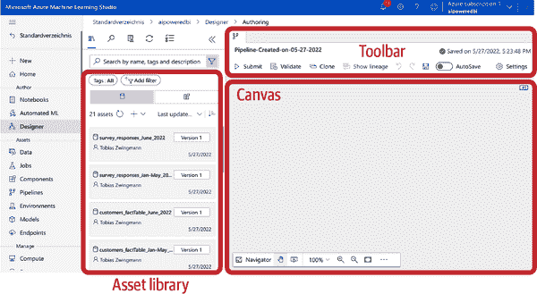
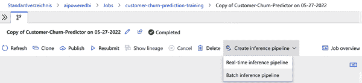
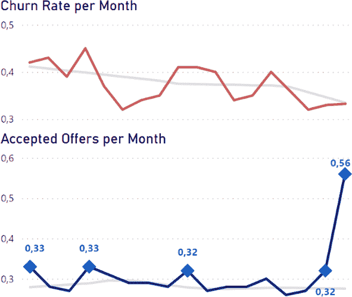

# 第十章：将所有内容结合起来：构建 AI 驱动的客户分析仪表板

你在这本书中走了很长的路（希望如此！）并学到了很多关于如何在分析堆栈的各个层次部署 AI 服务的新知识。在本章中，我将向你展示如何将这些分析和 AI 服务层次结合起来，为 BI 用户提供更好的体验，并通过融合这两种方法来利用 AI 和 BI 的潜力。事实上，你应该看到不同的 AI 服务并不是二选一的决定，它们可以互补。例如，我们可以将非结构化数据（原始文本）转换为结构化数据（情感评分表），以便我们可以用它来进行监督学习（使用情感评分来预测客户流失）。

在本章结束时，你将能够混合和匹配多个 AI 服务，开发更强大的用例。为了将编程工作保持在最低限度，我们将使用 Azure 机器学习设计器作为一个无代码工具来创建高级 ML 工作流，这允许比你在前几章学到的 AutoML 服务更多的定制化。

# 问题陈述

在这种情景下，我们是一个电信服务提供商的数据分析团队的一部分。消费者部门的销售和营销负责人发起了一个项目，进一步研究客户流失的主题。根据企业的定义，客户在取消合同的那一刻即算是流失，无论合同的剩余期限如何（企业提供月租和 24 个月合同）。

企业目前面临以下挑战：

+   流失率被测量，但营销和销售部门尚不能理解它们。流失指标似乎断断续续地上升和下降，员工们在尝试从这些指标中获得任何有意义的见解时遇到了困难。

+   作为抵制流失的有效措施，企业已确定提供反流失策略是一种可行的策略。这些优惠被提供给正在取消合同的客户，以赢回他们或者防止他们完全取消。这些优惠被证明是有效的，但成本高昂。因此，企业希望知道哪些客户最有利于被针对此类反流失优惠，并且最好在发生流失之前预测流失，以确保优惠类型与客户细分的匹配度良好。

+   企业定期对客户进行调查，其中包括大量的开放式文本反馈。通过查看调查数据的样本，调查团队建议文本答案可能为流失建模提供重要信号。

+   企业希望通过浏览数据来达到一定的交互性，以了解在各种客户细分中关于客户流失的情况。

数据分析团队预计能够确定向业务利益相关者呈现请求信息的可行方式——当然，尽快并且在重度预算约束下。

# 解决方案概述

查看图 10-1 中的用例架构。正如您立即看到的那样，这将是我们在本书中构建的最复杂的用例。但别担心，我们基本上是在重用您在前几章学到的概念和技术。

要了解这个架构中发生了什么，让我们从用户层的顶部开始，并找出我们的输出应该实际是什么样子的。我们希望在 Power BI 中有一个交互式仪表板，让我们能够多方面分析客户流失；我们想做以下几件事：

+   了解流失发生的位置，并为用户提供与历史数据交互的无缝体验（描述性分析）。我们将使用 Power BI Q&A 视觉来实现这一目的。

+   理解最近客户流失中哪些波动应标记为“过高”。我们将使用异常检测进行诊断分析。

+   预测未来客户流失，以了解哪些部分的收入面临风险（预测分析）。

+   分析客户评价反馈，以了解我们的流失报告中客户抱怨的内容（非结构化数据）。

###### 图 10-1\. AI 驱动的客户分析用例架构

在我们查看分析层发生了什么之前，让我们跳到底部，检查我们为这个用例准备的数据层。我们的 BI 系统主要由三个数据源提供数据：

+   源文件*Churn_Metrics_2021.csv*包含有关客户流失的汇总历史信息。

+   源文件*Churn_Predictions_June_2022.csv*包含最新的客户数据及其相应的流失预测。

+   源文件*Customer_Dimensions_June_2022.csv*包含关于我们客户的人口统计信息，我们可以用于进一步的探索或钻取。

这些数据通常存储在数据仓库中，但在我们的情况下，我们从 Azure Blob Storage 中获取它们作为 CSV 文件，以保持简单。虽然*Churn_Metrics_2021.csv*和*Customer_Dimensions_June_2022.csv*这些文件已经给出，但我们需要通过分析来创建*Churn_Predictions_June_2022.csv*。

现在，让我们转向分析层。为了我们的目的，我们将在 Azure ML Designer 中使用一个 ML 模型，该模型将在历史数据（结构化和非结构化数据）上进行训练。我们已提供的历史客户事实表涵盖了过去五个月，并已包括由我们内部分析师计算的流失标签。除了流失标签，事实表还包含一个标志，指示客户是否在过去接受了反流失。训练数据还将包括来自*Survey_Responses_Jan-May_2022.csv*中提供的用户调查原始文本的情感信息。

为了理解开放式文本答案的意义，我们将对客户反馈进行情感分析，并查看这些情感标签是否能帮助我们提高预测模型的性能。我们将不再手动处理此工作流程，而是使用作为 Azure 订阅一部分的 Azure ML Designer。ML Designer 是一个无代码 AI 平台，允许我们尽可能少地在 Azure 云中构建和部署托管的 ML 工作流。

# 准备数据集

从[书籍网站](https://oreil.ly/XKoQk)下载以下文件：

*customers_factTable_Jan-May_2022.csv*

关于 2022 年 1 月至 5 月间客户指标和流失标签的信息

*survey_responses_Jan-May_2022.csv*

来自 2022 年 1 月至 5 月期间的样本客户调查的客户反馈

*customers_factTable_June_2022.csv*

2022 年 6 月的当前客户事实数据

*survey_responses_June_2022.csv*

新的 2022 年 6 月调查数据

打开[Microsoft Azure Machine Learning Studio](https://ml.azure.com)，选择您喜欢的工作区，您应该看到您的仪表板（图 10-2）。

###### 图 10-2\. Azure Machine Learning Studio 仪表板

首先，我们将逐个将所有四个 CSV 文件作为数据集（数据资产）上传到 Azure ML Studio，以便稍后通过 ML Designer 访问它们。单击加号图标，选择“数据资产”或从左侧菜单中选择“数据”。

对于每个 CSV 文件，选择创建 → 从本地文件创建。按文件名提供数据集的名称，例如，对于文件*customers_factTable_Jan-May_2022.csv*，名称应为`**customers_factTable_Jan-May_2022**`。跟随表单，上传 CSV 文件，并检查数据预览是否一切正常。所有文件的分隔符应为逗号，编码为 UTF-8。在模式方面，您必须进行一些调整。

请确保客户事实表的模式如下（注意：6 月份的文件中不包含 Churn 和 OfferAccepted 列，因为这代表最新月份，而流失信息尚不可用，这是我们稍后要预测的）：

+   customerID: String

+   tenure: Integer

+   合同：String

+   月度费用：Decimal（小数点）

+   Churn: 字符串

+   不包括：OfferAccepted

+   不包括：Month

对于两个调查文件，请确保列与以下架构匹配：

+   id: 字符串

+   text: 字符串

到最后，您应该在 ML Studio 中看到以下四个数据集：

+   customers_factTable_Jan-May_2022

+   survey_responses_Jan-May_2022

+   customers_factTable_June_2022

+   survey_responses_June_2022

# 分配计算资源

现在我们已经准备好数据，需要确保资源可用以进行实际计算。要添加计算资源，请在 ML Studio 左侧的菜单中选择 Compute，如 Figure 10-3 所示。

###### 图 10-3\. 在 Azure ML Studio 中添加计算资源

在这里，您应该仍然看到您在前几章中使用的计算资源。如果您看到资源，但尚未启动，请选择资源并点击“启动”。如果您还没有任何资源或之前删除了它，请点击“新建”，并创建一个带有默认设置和足够本案例研究的最便宜机器类型（`STANDARD_DS1_V2`）的新计算资源。一旦您至少有一个计算实例正在运行，您可以继续使用 ML Designer。

# 构建 ML 工作流程

从左侧菜单中选择 Designer（Figure 10-4）。ML Designer 将是我们拖放界面，用于构建 ML 管道。我们可以训练自己的模型，也可以进行基本的数据预处理和运行自定义脚本。

###### 图 10-4\. Azure ML Studio 中的 ML Designer

点击“新管道”创建您的第一个管道。现在您应该可以看到 ML Designer 的空白画布（图 10-5）(Figure 10-5)。ML Designer 有三个主要组件：左侧的*库*，您可以在其中切换数据资产和组件；右侧的*画布*用于构建管道；顶部的*工具栏*用于保存、编辑和提交整个管道。

###### 图 10-5\. Azure ML Designer 界面

在我们开始之前，将正在运行的计算实例分配给我们的会话。如果设置窗口没有自动弹出，请单击工具栏中管道名称旁边的齿轮图标访问它。说到管道名称，将管道标题更改为`**Customer-Churn-Predictor**`。

现在我们可以开始填充空白画布了。构建自定义工作流的想法是使用左侧预构建的模块，并将它们组合在画布上。每个模块都可以有输入和输出端口，并提供不同的设置。

从资产库中选择数据集 *customers_factTable_Jan-May_2022*，并将其拖放到画布上，如 Figure 10-6 所示。

###### 图 10-6\. 在画布上添加数据集

管道将从顶部到底部执行。因此，一切将从加载此数据集开始。如果愿意，可以通过右键点击模块并选择“预览数据”来预览数据。在开始时，特别是在熟悉界面时，通过在画布上预览单个模块的输出是一种直观的调试方式。

接下来，让我们对数据进行一些操作。我们的目标是构建一个简单的机器学习管道，根据输入特征预测流失列，类似于第 7 章中的 AutoML 用例。

通过点击相应的图标，从数据资产切换到库中的组件。搜索`**select columns in dataset**`。此模块的目的是去除我们预测不需要的列，例如 Customer ID。将模块拖动到数据集模块下方的画布上。如果它们自动弹出，请暂时关闭设置。将数据集模块的输出端口连接到选择数据集模块，如图 10-7 所示。

###### 图 10-7\. 添加选择数据集模块

在两个模块之间绘制连接允许元数据在我们的流水线中向下流动。这意味着我们的选择数据集模块现在将知道可用的列名。双击画布上的模块再次打开设置。点击“编辑列”并选择按名称选择列，如图 10-8 所示。

###### 图 10-8\. 过滤列

选择除了 CustomerID 列之外的所有列。点击保存进行确认。关闭模块设置窗格以为画布腾出更多空间。

接下来，我们要将数据分成训练集和测试集。在模块搜索栏中搜索`**Split Data**`，并将模块拖动到画布上。在模块设置中，定义以下拆分参数：

+   拆分模式：拆分行

+   第一个输出的行分数：0.75

+   随机拆分：True

+   随机种子：1234（用于可重现性）

+   分层拆分：True

+   分层键列：流失

使用这些设置，我们进行了分层的训练-测试拆分，其中数据的 75%用于训练，25%用于测试。*分层*意味着流失标签的类别分布在训练集和测试集中相同。

关闭设置，并连接选择数据集模块的输出端口到分割数据模块的输入端口。正如你在图 10-9 中所看到的，现在分割数据模块有两个输出，一个用于训练（左）和一个用于测试数据集（右）。

###### 图 10-9\. 添加一个分割数据组件

现在我们可以添加**Train Model**组件。在模块窗格中搜索该组件并将其拖放到画布上。您会发现该模块有两个输入：左侧期望训练算法，右侧期望训练数据集。将**Split Data**模块的左输出节点连接到**Train Model**模块的右输入端口。我们还需要告诉**Train Model**组件我们实际想要预测的列。因此，双击该组件以打开设置，并将 Churn 提供为标签列。

现在该由我们提供实际的训练算法了。与 AutoML 相比，我们必须自己选择训练算法。现在，这不是一本机器学习基础知识的书，但在大多数监督学习场景中，选择像决策森林或提升树等集成方法作为第一个基线，您将会获得相当不错的结果。这些模型尝试将几个弱学习器（例如决策树）结合成一个强学习算法，试图在训练数据集上最小化预测误差。这些模型适用于分类和回归问题，因此它们是非常全面的算法，尽管它们相对复杂。ML Designer 的好处在于您可以轻松尝试不同的、甚至更简单的算法，如线性或逻辑回归，并查看它们在数据集上的表现。

对于我们的练习，从模块窗格中搜索`**Two-Class Boosted Decision Tree**`并将其拖放到画布上。现在，我们可以将所有设置保留为默认值。将决策树模块连接到**Train Model**组件，您的流水线应该看起来像 Figure 10-10。

###### 图 10-10\. 添加决策树和 Train Model 组件

我们快要完成了！只剩下一件事，那就是添加一个组件，根据训练好的模型对实际预测进行评分并计算评估指标。

搜索**Score Model**组件并将其拖放到画布上。将**Train Model**组件的输出端口连接到**Score Model**组件的左输入端口。

然后将**Split Data**组件的右输出端口连接到**Score Model**组件的右输入端口。这将允许我们使用在训练数据集上训练的模型来计算测试数据集的预测值。最后，找到**Evaluate Model**模块，将其拖放到画布上，并将**Score Model**的输出端口连接到**Evaluate Model**组件的左输入端口。您的最终流水线现在应该看起来类似于 Figure 10-11。

###### 图 10-11\. ML Designer 中的第一个端到端工作流

恭喜！您刚刚从头开始构建了您的第一个 ML 流水线。单击提交按钮运行流水线。所有运行将被收集到*实验*中，这是我们从 AutoML 场景中习惯的。我建议为这个流水线创建一个新实验，以保持您的工作组织良好。创建一个新实验并提供一个有意义的名称，如`**customer-churn-prediction-training**`。点击提交并在 Azure ML Studio 在幕后做它的魔法时稍事休息。

要跟踪训练过程，请在屏幕左侧的“已提交作业”下单击“作业详情”。在这里，ML Designer 将指示当前正在运行的步骤以及已完成的步骤。请注意，您刚刚离开了 Designer 并切换到了作业部分，正如您从菜单中看到的那样。虽然 Designer 允许您创建流水线，但作业将允许您监视实际的流水线执行并触发最终部署。整个作业应该需要大约 10 到 15 分钟。

之所以这么长时间是因为 Azure 为每个模块单独启动了进程，这会产生一些开销。好处是，这种界面也适用于非常大的数据集，因为每个模块都独立于其他模块运行。这就是为什么在我们的案例中，与在您的本地笔记本上运行相比，运行 ML Designer 对一些相当小的数据集实际上会花费更长的时间。但数据集越大，您将看到的性能优势就越多。

当过程完成时，您应该在最后一个评估模块上看到完成徽章。在这种情况下，双击模块以查看评估结果。这应该会给您显示在图 10-12 中展示的输出。

###### 图 10-12\. 第一个工作流的评估指标

单击放大图标以腾出更多空间，整个界面应该看起来很熟悉，就像您在前几章中看到的那样。通过我们的初步运行，我们已经达到了 86.6%的准确率和 80.9%的 F1 分数。对于第一次尝试来说，这还不错，但让我们看看是否可以通过将训练数据集与更多数据混合来进一步提高这个度量指标。

到目前为止，我们所做的只是另一个无监督的 ML 工作流，我们本可以很容易地使用第七章中的 AutoML 服务来完成。事实上，如果只是这样的话，我会建议使用 AutoML 服务而不是 Azure ML Studio。然而，我们还没有完成，因为我们仍然希望插入来自非结构化数据（情感评分）的见解，并将它们合并到我们的最终模型中。这个工作流程仅依靠 AutoML 服务是不可能的，因此我们选择 ML Studio 来完成这项任务。

## 将情感数据添加到工作流程中

关闭评估指标并返回到设计界面。这次，我们想要增加对客户反馈的分析，看看这是否有助于改进我们的客户流失预测。我们的方法是在已有的管道旁边建立第二个管道，并将结果馈送到评估模型模块的正确输入端口。这将直接比较两种建模方法。

让我们一步步来解决这个问题。首先，从左侧模块窗格将*customers_factTable_Jan-May_2022*数据集模块拖放到画布上。此外，找到*survey_responses_Jan-May_2022*数据集模块，并将其拖放到另外两个数据集模块旁边。你的画布现在应该看起来像图 10-13。

###### 图 10-13\. 将更多数据源添加到 ML Designer

为了更熟悉调查数据，请右键单击该模块并选择“预览数据”。数据集仅包含两列，即客户 ID 和文本响应，这两个值来自原始客户调查结果。

到目前为止，我们的机器学习模型无法很好地处理原始文本输入作为预测特征。为了使它们更易访问，我们将从调查数据集中读取开放式文本答案，发送到 Azure 认知服务，并获取每个文本的情感值。分类“负面”或“正面”将成为我们分类模型的额外特征。为此，我们将使用在第 9 章中部署的 Azure 认知服务情感分析。

让我们将这个 AI 服务组件带到画布上吧！信不信由你，Azure 认知服务在 ML Designer 中没有预构建的模块可以直接拖放到画布上（至少在撰写本文时是这样）。但我们可以采取的方法是简单地添加一个可以运行 Python 或 R 代码的模块。这正是我们要采取的方法：我们将从调查中获取的响应，通过 Python 或 R 发送到远程 AI 服务 API，并将结果馈送回 ML Designer 管道中。

要开始，请搜索`**执行 Python 脚本**`或`**执行 R 脚本**`，取决于您的偏好。将其拖动到画布上。连接*survey_responses*数据集的输出端口到脚本模块的第一个输入端口。

脚本模块的工作方式是，它期望最多两个数据帧（表格），然后可以在名为`azureml_main`的函数中进行修改。结果将再次作为一个或两个数据帧返回。

底层的 Python 或 R 运行时附带了有限数量的包。要了解更多信息，请查阅微软文档 [“在 Azure 机器学习设计师中运行 Python 代码”](https://oreil.ly/ksZi8) 或 [“执行 R 脚本组件”](https://oreil.ly/YdexI)。现在我们只需将预构建的演示代码替换为我们想要执行的任务的自定义代码。我将使用 Python 来示例说明，但是相同的步骤也适用于 R 脚本。

在文本编辑器中打开来自[书籍网站](https://oreil.ly/XKoQk)的 *ml-designer.py*（*ml-designer.R*）。用您的自定义参数替换密钥和端点，如第九章所示。现在选择所有脚本并复制它。将 Execute Python Script 模块中的所有示例代码替换为剪贴板内容。脚本模块现在应仅包含来自 *ml-designer.py* 文件的代码，而不包括其他内容（见图 10-14）。

###### 图 10-14\. Azure ML 设计师中的 Python 脚本模块

该代码基本上会将 dataframe 作为输入读取并将其整理成 API 服务可以处理的格式。它将返回附有情感预测的原始 dataframe。现在，单击提交以运行新的图形。转到作业并验证一切是否如预期运行。

请注意，我们之前在图的左侧运行的所有步骤不会重新执行，因为我们在这里没有做任何更改。相反，此运行将仅读取新数据集并将其馈送到脚本模块中。几分钟后，您应该会看到脚本成功执行。如果出现错误，请单击脚本模块并查看日志文件。那里的错误消息将帮助您调试，例如，如果您的资源密钥无效或您的免费配额已超过。

当运行完成后，右键点击已提交的训练作业中的脚本模块，选择预览数据 → 结果数据集。如图所示图 10-15，您应该可以看到现在每个客户反馈条目已经获得了情感标签。

###### 图 10-15\. Azure ML 设计师中的情感分析结果

我们的目标是将此信息添加到用于训练客户流失模型的主数据集中。我们需要将此表连接到主表中，而不会丢失主表中的任何记录；请记住，这次调查并不是针对所有客户进行的，而是针对样本进行的。这种数据连接称为*左外连接*；左表是我们的主数据集，右表是我们希望连接其他信息的数据集。返回到设计师并在资产库中搜索 `**Join Data**`，找到相应的组件。

将连接数据模块拖动到画布上。将前一个脚本模块的第一个输出端口连接到连接数据模块的右输入端口。然后将 *customers_factTable_Jan-May_2022* 的输出端口（我们尚未使用的那个）连接到连接数据模块的左输入端口。在画布上双击连接数据模块以打开其设置。我们必须定义将两个数据集合并的关键列。您可以通过点击左右数据集的“编辑列”来编辑关键列。对于左侧数据集，选择列 customerID，对于右侧数据集，选择列 “id”。将连接类型设置为左外连接，并将 “在连接表中保留右侧键列” 设置为 False。您的设置最终应与图 10-16 中的设置相似。

###### 图 10-16\. 从不同来源连接数据

点击提交以运行流水线，验证连接是否按预期工作。您合并后的数据集应该有七列和 3,814 行，您可以右键单击连接数据模块并选择“预览数据”→“运行完成后的结果数据集”来验证。

我们现在基本上必须像之前一样重新创建其余的流水线。我不会详细介绍这些步骤，因为这些都是重复的。简单来说，添加以下模块并应用以下设置：

选择数据集中的列

按规则选择列：包括所有列，除了 “customerID”，包括列名 “sentiment”，并排除列名 “text”。

分割数据

在列 Churn 上进行与之前相同的 0.75 分层样本。

训练模型

标签列是 Churn。

二类增强决策树

保持默认设置。

评分模型

将 Score Model 组件的最后一个输出端口连接到我们之前创建的 Evaluate Model 组件的右输入端口。

最终的流水线显示在图 10-17 中。

###### 图 10-17\. 第二个端到端工作流

点击提交以运行整个图形。如果您认为现在是喝咖啡的时候，那您是对的！整个过程可能需要几分钟。当流程完成后，请回来查看结果。

当运行完成后，让我们检查评估模块，看看是否可以改进模型性能。转到作业并选择您完成的训练作业。右键单击评估模块，选择“预览数据”→“评估结果”。图 10-18 显示了输出。

###### 图 10-18\. 第二工作流的评估指标

从评估指标中，我们可以看到准确率提高了另一个百分点，达到了 87.7%，而 F1 分数增加到了 82.6%。虽然不是突破性的，但考虑到情感标签仅为数据的一小部分提供了这一点，这仍然是一个可靠的性能提升。这意味着情感信息本身对于我们的用例具有非常高的预测能力。因此，最好保留这些信息在我们的数据集中，并在可能的情况下使用它。

如果我们想进一步提高准确率，我们可以尝试在更多数据（行）上进行训练，使用不同的算法，或尝试更多特征（列）以获得更好的结果。对于什么准确率值是足够的，没有通用的规则，因为这取决于您的用例。但一般来说，拥有现有基线（如第 7 章）可以给您一个良好的基准，因为您的 ML 模型应该能够显著超越该基线。否则，所有额外的努力都不值得。

现在，我们的模型训练完成了。恭喜！您刚刚将一个即开即用的 AI 服务与先进的 ML 算法结合起来，自己打造了一个强大的定制 AI 模型！现在是时候让这个模型投入工作，并准备好进行推断了。

在我们继续之前，让我们通过选择左侧的所有部分并删除它们来整理我们的图形。在设计师中，打开你的工作流，并从顶部菜单栏点击克隆以创建图形的副本。

要选择多个模块，请从工具栏中选择选择工具，并选择图左侧所有组件，如图 10-19 所示。右键单击选择内容，然后选择删除。

###### 图 10-19\. 选择画布上的多个组件

最后，通过选择连接 Score Model 模块与 Evaluate Model 模块第一个输入端口之间的现有连接，删除它，并重新连接到第一个输入端口，重新提交训练流水线最后一次；这将很快，因为它仅重新计算最后一个模块的结果。

## 部署推断工作流

现在我们可以将这个图形部署为一个推断流水线。我们只需要进入作业，打开最新的实验，并从顶部菜单中选择“创建推断流水线”，然后选择“批处理推断流水线” (图 10-20)。

###### 图 10-20\. 创建批处理推断流水线

在这种情况下，在线推断管道和批处理推断管道的主要区别在于批处理管道将 Blob 数据集作为输入，而在线管道则通过在线 API 提交数据。

无论如何，训练管道都将被转换为推断管道，我将其重命名为“客户流失预测器批量推断”，如图 10-21 所示。

###### 图 10-21\. 批量推断管道（原始）

训练和推断管道的主要区别在于推断管道不包含任何训练组件。请注意，“提升决策树”模型和“训练模型”模块已被一个名为“MD-客户流失预测器-Train_Model_Trained_model”的新模块替换，如图 10-21 所示。此模块将自动引用我们训练过的模型，以便我们可以用于推断。数据准备管道的其余部分，包括我们的 Python 脚本，将保持不变。

要对新数据运行推断，请分别用*customers_factTable_June_2022*和*survey_responses_June_2022*替换输入数据集。这两个数据集代表了客户的新数据；我们还不知道他们是否会流失。要替换数据集，只需从画布中删除现有数据集，并从资产库中拉取新数据集。您的画布应该看起来像图 10-22。

###### 图 10-22\. 批量推断管道（新数据）

在我们可以进行推断之前，我们仍然需要进行一些小调整。在画布上找到数据集中的“选择列”模块。它仍然包含我们用于训练的“流失”列。但是在推断阶段我们不会有这一列（这就是我们要预测的列！）。因此，请编辑设置并从模块中删除“流失”列。同时保留“customerID”列，因为稍后我们需要用它来将流失预测与客户记录匹配。双重检查，“sentiment”列是否仍然包含在内。

如果您跳到管道的末尾，您仍然会看到“评估模型”模块作为最后一个组件。但是在这个阶段我们不需要这个组件，因为我们没有任何地面真相可供比较。相反，我们希望将得分数据导出到某个位置。为此，请从画布中删除“评估模型”组件，并从资产库中拖动“导出数据”组件到画布上。

在“导出数据”模块设置中，选择 Azure Blob Storage 作为数据存储类型。对于数据存储，点击“新数据存储”并给它取一个名称，比如`**churn_⁠m⁠o⁠d⁠e⁠l⁠_​s⁠c⁠o⁠r⁠i⁠n⁠g**`。对于存储账户，选择您在之前章节中使用的存储账户，并在“Blob container”下选择“tables”。您的设置应该看起来与图 10-23 类似。

###### 图 10-23\. 创建新的数据存储

向下滚动并将您的 Azure 存储帐户资源中的帐户密钥粘贴到此设置窗口中的相应字段。单击“创建”，您应该会发现自己回到导出数据设置中。仔细检查您新创建的数据存储是否已选择，并在路径字段中将输出文件命名为`**churn_predictions_June_2022.csv**`。最后，将文件格式设置为 CSV。 Figure 10-24 显示了导出设置的示例。

###### 图 10-24\. 添加导出数据模块和设置

最后，将评分模型模块连接到导出数据模块。最终管道显示在 Figure 10-25 中。

现在，单击“提交”以运行您的推理管道。为了保持组织良好，创建一个新的实验，比如`**customer-churn-inference**`，将您的推理运行与培训运行分开。推理运行将花费几分钟时间。再次强调，我们在这里使用的是相对较小的数据样本，但这个过程本身在处理非常大的数据集时表现良好，而且时间成本并不成比例增加。

###### 图 10-25\. 最终推理管道

一旦推理运行完成，您应该会在存储容器中的“tables”文件夹中看到名为 *churn_predictions_June_2022.csv* 的新文件（Figure 10-26）。

###### 图 10-26\. Azure Blob Storage 中的表输出

现在是时候转向我们的 BI 了！

# 在 Power BI 中构建 AI 动力仪表板

现在我们已经构建了预测模型，并将非结构化文本转化为易于分析的分类数据，让我们通过构建一个 AI 动力客户仪表板将所有内容整合起来。

请记住，我们的目标是为营销和销售构建一个仪表板，提供客户流失发展的高级概述，如果事情“仍然正常”，以及采取有效对策的情况。该仪表板还应提供进一步的功能，以深入了解定制洞察。与之前的章节不同，我不会详细说明如何构建仪表板的逐步说明，而是专注于此处运作的主要概念和不同组件。

您可以从 [book’s website](https://oreil.ly/XKoQk) 下载 *Customer_Analytics_AI-Powered.pbix* 或自行重新创建。我使用了之前概述的步骤。

###### 注意

想要了解如何构建仪表板的逐步视频教程，请访问 [*https://www.aipoweredbi.com/chapter-10*](https://www.aipoweredbi.com/chapter-10)。

为了构建我们的客户仪表板，我们需要 Figure 10-27 中的数据模型，该模型基于以下四个表：

churn_predictions_June_2022

这个表格包括我们从 ML Designer 获得的得分流失数据集。

customer_dimensions_June_2022

此表还包含有关客户的进一步 BI 数据，例如服务时间、服务和人口统计信息。它与表 churn_predictions_June_2022 具有一对一的关系，基于客户 ID 字段。

Churn_Metrics_2021

一个表格，包括以往几个月每月的聚合流失率和接受优惠率。这些数据可能来自 SQL 数据仓库；在我们这里，它作为一个 CSV 文件存储在 Azure Blob 存储中提供。

Aggregated_metrics_2022

此表由 Power BI 生成，通过获取数据集 churn_metrics_2021 并添加 2022 年 6 月的预测流失率生成。它将获取这个时间序列，并发送至 Azure 异常检测以推断出该指标的期望下限和上限，并设置检测到的异常标志。

###### 图 10-27\. Power BI 中的数据模型

利用这些数据，我们可以生成一个看起来像图 10-28 的仪表板。

###### 图 10-28\. 最终仪表板的组件

让我们分解各个组件。

## 异常检测

在仪表板的左上角，有两个线图显示了每月的流失率和接受优惠率。您可以在图 10-29 中看到仪表板的这一部分。虽然线图本身只代表基本的描述性分析（“发生了什么？”），但我们在这里通过混合另外两种信息来丰富图表。

首先，我们展示了一个浅灰色线来表示根据迄今为止所见数据的相应指标的预期值。其次，我们突出显示显示异常正向高峰点的数据点（无论是流失率过高还是接受优惠率过高）。这些异常由方形数据标记表示。通过这些额外信息，我们可以看到整体的流失趋势似乎是负向的（这是好的！），同时我们并没有真正观察到任何明显的异常值，尽管线看起来相当曲折。对于优惠，我们可以明显观察到上个月高峰被检测为异常，但之前也有一些数据点。因此，整体趋势似乎相当稳定，除了一些异常值。所有这些信息都来自我们直接从 Power BI 调用的异常检测 AI 服务的数据。

###### 图 10-29\. 每月流失率和接受优惠率指标

## 预测分析

仪表板的预测分析部分结合了历史信息和 AI 预测。图 10-30 展示了这一可视化效果。其中包括了当前月份预测的客户流失率，以及这对收入风险的影响。当前月份预测的客户流失率是我们基于 ML Designer 中使用的模型的个别 AI 预测计算出的摘要指标。我们可以将这一指标与目标进行比较，本例中定义为 0.33 的流失率——这个标准可能在当前月份得到满足。

为了使业务用户更易于理解这些信息，我们将此指标与称为“风险收入”的圆环图表结合在一起，总结了本月从标有 `churn flag = 1` 的客户处获得的所有收入。请注意，这一指标相当简单化，因为它没有考虑客户的生命周期价值。如果我们希望，可以添加这些信息，但出于演示的目的，我决定坚持基础内容。核心思想在于，我们可以将 AI 预测与历史或交易型 BI 数据相结合，使预测对业务更加相关。我们将在下一个组件中看到另一个更详细的示例。

###### 图 10-30\. 流失预测 KPI 指标

## AI 驱动的描述性分析

在仪表板的 AI 驱动的描述性分析部分，AI 的工作是最无缝的，但可能也是对用户最直观的。这项分析的 AI 驱动部分包括两个图表，显示在图 10-31 中。上部分是一个问答工具，下部分是一个表格可视化。

首先让我们探索问答工具。此工具将流失评分与 BI 数据结合，允许查询诸如“在 *xyz* 细分中的平均预测流失率是多少？”这样的问题。此可视化可用于针对我们的数据模型运行自然语言查询。由于预测流失结果与数据仓库中的维度 BI 数据之间的关系，用户可以无缝地将 AI 驱动的预测与客户的附加属性相结合。如示例所示，用户可以查询“每种互联网服务的平均流失率”，并看到光纤的流失率比其他互联网服务类别要高得多。我们唯一需要做的设置是在问答工具中定义同义词，以便将“平均流失率”与源数据表中称为“评分标签”的数据字段匹配起来。

###### 图 10-31\. 描述性分析组件

描述性分析组件的下部是一个表格，利用历史 BI 数据和 AI 预测的组合。用户可以通过将流失预测与当前收入结合来计算风险收入。为此，该表格使用了一个名为“收入风险”的新字段，这个字段在 Power BI 中作为快速度量生成，通过将客户的月度收入乘以其个体流失概率来计算。如果我们现在在各种客户类别上累加这些值，我们可以轻松地发现将会损失大量资金的客户细分，使总体流失数字对销售和营销更具操作性。如果我们看一下图 10-31，我们可以清楚地看到，使用光纤互联网服务的月租合同客户且没有多条线路的客户群体，为捍卫收入提供了最大的杠杆效应，每月的收入风险为$8,754。如果营销部门考虑个性化的反流失优惠，这将是一个有趣的类别进一步探索。

## 非结构化数据

最后，在仪表板的非结构化数据区域，结合维度数据，可以提供更多有关情感分数的见解。非结构化数据的情感分析最终成为我们流失预测模型的一部分，但它也可以独立提供更深入的见解。

Treemap 视觉化，显示在图 10-32，将情感标签与我们想要的任何客户维度进行对比——在本例中为合同类型。从这个视觉化中，我们可以看到，尽管大多数客户对他们的调查评论的情感感到满意，但提供负面反馈的大多数客户都是月度计划用户。考虑到这一类客户的高流失可能性，应首先优先处理这一类别中出现的根本问题。

###### 图 10-32\. 情感分析

如果我们把所有内容汇总，并查看仪表板本身（图 10-33），我们可以为市场营销和销售人员提供一个以客户为中心的仪表板，它在幕后使用 AI，并非为了炫耀，而是有一个目标：使数据对业务利益相关者更具操作性和更有意义。

你可以尝试自己操作，通过在计算机上打开配套的 Power BI 文件并与其中的组件互动。您会添加、更改或完全删除哪些信息？

###### 图 10-33\. 最终仪表板

# 清理资源

当您完成了本书中的使用案例后，我建议删除所有使用的资源，以避免在 Microsoft Azure 上产生持续的成本。要一次性删除所有资源，请访问 [Azure 门户](http://portal.azure.com) 并选择“资源组”。选择您为本书创建的资源组，然后选择“删除资源组”。确认资源组名称，然后单击删除。

# 概要

希望本章能够向您展示，在您的商业智能中使用 AI 服务并不是非此即彼的选择。事实上，最大的好处来自于结合多个 AI 服务。但是，不要让技术把您拖入兔子洞，使得商业智能功能因工作中的 AI 组件而过载。请记住，每个添加的 AI 服务都会增加一层技术债务：最终必须有人来管理模型、问答工具、数据集成等。

然而，将各种 AI 服务整合在一起，是验证业务是否从进一步洞察中获益，或明确业务正在寻找的内容的一种很好的方式。通过您灵活的分析堆栈，从访问非结构化数据、到描述性分析，再到规范性分析，都能在同一平台内实现，您将能够找到增加技术复杂性与提供实际业务价值之间的最佳平衡点。

恭喜您成功构建了第一个原型，其中包含不少于四个 AI 服务！接下来呢？如前所述，这只是一个原型，离能够将此仪表板部署到生产环境还有很长的路要走。在下一章中，您将了解更多关于从原型到生产的过程及如何处理随之而来的复杂性。
