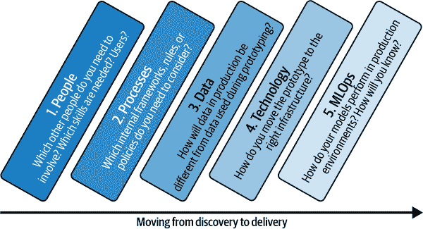
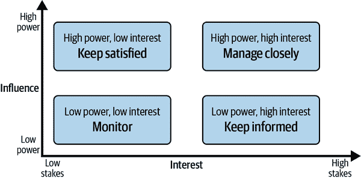

# 第十一章：迈出下一步：从原型到生产

如果您已经走到这一步，并且跟随了示例和案例研究，那么您应该已经掌握了主要 AI/ML 技术及其在各种 BI 场景中的应用的扎实知识。祝贺您！这确实是一个伟大的成就，并使您处于一个极好的位置，可以成功启动自己的 AI 用例。

在本章中，我们最终将讨论一些关键点，即将原型解决方案（这就是我们迄今所做的）推向生产。相反，我们还将讨论为什么将原型推向生产实际上可能不是一个好主意。为了解决这一明显的矛盾，我们需要看两个概念，这两个概念最初是从产品管理中借来的：产品发现和交付。

通过本章的最后，如果您的目标是在整个组织中推出您的 AI 解决方案，您应该对接下来应该采取的步骤有直觉。

# 发现与交付

到目前为止，我们讨论过的实际用例都是原型。你已经完成了产品经理所说的*发现过程*。发现过程是关于验证产品（或用例）的价值、可用性、可行性或可行性的过程。

值得注意的是，大多数原型不太可能在发现阶段存活下来。这就是游戏的本质：你希望快速学习并快速失败。这没问题。到目前为止，您不应该投入太多资源，并且理想情况下，您的待办事项中还有其他想法可以追求。

但是，如果您的原型通过了验证阶段会发生什么？如果它脱颖而出呢？

假设您的早期 BI 测试用户喜欢新功能或模型预测。每个人都对您的新解决方案感到兴奋，有些人甚至可能在公司内传播有关它的消息。如何将您的原型扩展到生产规模？

简单的答案是：您根本不应该扩展它。在我们的原型示例中，我们自己完成了所有工作：我们为计算作业创建了虚拟机，我们管理了存储的访问密钥，甚至为我们的容器设置了安全策略。您可能已经猜到：这不是您在生产场景中应该做的事情。Azure 云平台（以及所有其他平台）在一些培训后看起来非常直观和易于使用。但实际上，它们是超级复杂的景观，需要专业知识来安全有效地管理和控制。否则，您面临数据泄露或资源账单激增的风险，或两者兼而有之。

如果一个原型被证明成功，并通过了影响和可行性测试，那么是时候放手并进入不同阶段了：交付。在企业组织中，交付远不止于创建代码和仪表板的“干净”版本。当您进行交付时，您应该优先考虑以下几个方面：

+   可伸缩性

+   可靠性

+   性能

+   可维护性

此外，原型通常由于在开发阶段未经适当测试而存在多个安全漏洞。因此，你不应立即将原型投入生产，而是应该重新思考这些维度。让我们简要梳理一下这些概念。

*可伸缩性* 指的是使你的解决方案对更多用户可用的技术和非技术挑战。从技术上讲，它关乎多少用户可以同时访问解决方案的上限，这受限于你的基础设施。在非技术层面上，你希望弄清楚流程如何阻碍应用程序的部署。例如，如果每个用户都需要手动设置仪表板，则你的解决方案的最大规模将受到可以分配给它的人数的限制。如果自动部署仪表板或使用专用 BI 服务器，则可以以更大的规模运行解决方案。

*可靠性* 意味着你的解决方案能够如预期般正常工作。当发生故障时，能否轻松修复并且几乎没有停机时间？迟早你将需要回应用户的查询，并通常提供在线帮助。这些问题可以多快解决？

*性能* 是指你的应用程序响应用户请求的速度。随着用户数量的增加，这成为一个重要因素。第一印象至关重要，加载缓慢的应用程序或交互迟钝会阻碍增长。毕竟，你希望用户能尽可能快地完成任务，而不会遇到延迟。

*可维护性* 是指在解决方案上线后进行更改的容易程度。能否无需程序员即可添加或更改功能？你的代码是否有适当的文档，以确保新用户在使用时不会出现意外错误？

你的生产应用程序应从一开始就具备可伸缩性、可靠性、性能和可维护性。实际优先级取决于你的业务需求。如果你希望为许多用户提供解决方案，可伸缩性就非常重要。另一方面，如果企业应用程序仅设计为一定数量的用户，可以降低可伸缩性目标，并在交付项目中记录这一约束。

无论哪种方式，在大多数情况下，你的原型堆栈都不符合这些交付原则，因为你为了速度和开发者的方便而牺牲了它们。这就是为什么你不应该尝试扩展一个原型，而应该逐步正确地重建它。

# AI 产品交付的成功标准

那么，如何从发现阶段成功过渡到交付阶段？在 BI 的 AI 产品背景下开发成功的企业产品，你需要考虑五个维度：人、流程、数据、技术和 MLOps，如图 Figure 11-1 所示。

###### 图 11-1\. 在 BI 环境中 AI 产品交付的成功标准

让我们更详细地讨论五个维度。

## 人员

*人*决定了您的 AI 产品的成功或失败。在发现阶段，您的团队可能不会超过“两块比萨饼”规则，即项目团队的所有成员都可以通过两块大比萨饼饱腹。通常最多不超过 10 人。

一旦您开始以企业场景为目标，情况将会改变。企业 AI 项目本质上是企业软件项目。与两块比萨饼不同，您可能需要订购一个大型自助餐，因为可能会涉及各种人员参与新软件开发项目。这些可能包括但不限于：

+   IT 安全

+   IT 应用管理

+   IT 基础设施管理

+   数据治理办公室

+   各部门的业务领导者

+   文档人员

+   工作委员会

+   律师

###### 注意

在扩展您的 AI 工作时，根据需要请咨询您的 IT 部门或外部专家。您将需要大量的支持，特别是在开始阶段，以避免严重的错误。请记住，在这个阶段，您的原型已经证明了实际结果，您应该有信心与他人讨论它。

您需要包含的各种职能部门非常依赖于公司的组织方式和规模。这些人通常与您需要遵循的流程框架紧密相关。虽然我无法为您列出完整的人员名单，但通常组织利益相关者为一个矩阵是有用的，该矩阵将人们映射到两个广泛维度上：对项目的权力和对工作的兴趣，如图 11-2 所示。

###### 图 11-2\. 利益相关者矩阵

目标是确定每个类别中的利益相关者，以确定与他们沟通的正确策略。这四个利益相关者类别需要四种沟通策略：密切管理、保持满意、保持知情和监控：

密切管理。

这个类别包括对您的项目具有很大权力和高度兴趣的人。这些是您最重要的利益相关者。您需要经常与他们交流，早期识别关注点，并积极参与以确保他们对项目保持一致，并管理他们的期望。

例子：赞助商、高级管理层、董事、项目/产品经理

保持满意。

这些人拥有很大的权力，但对您的项目兴趣不大。他们通常不引人注目，但却很重要，因为他们有权力决定项目是否应继续，这取决于当前的结果或进展。

例子：项目管理、财务规划

保持知情。

在您的项目中具有很大兴趣但权力有限的人需要定期保持信息沟通。这些通常是最终将使用正在构建的内容的人。即使他们的正式权力较小，您也应经常与他们沟通。他们参与程度如此之深，很可能会影响其他（更有权势的）利益相关者。

[终端用户](https://oreil.ly/n6L0Q)、客户

监控

对您的项目兴趣不大但权力也不大的人。这些人可能对您来说不是优先考虑的对象，您也不希望过多打扰他们。然而，他们仍然需要不时监测和通知，即使他们不太可能引起重大问题。

例如：来自其他部门的员工

一旦您开始将人员分类到这些类别中，您应该对项目的复杂性有所感觉，并确定随着您的计划发展，与他们沟通的正确策略。

## 流程

由于 AI 项目本质上是软件项目，因此您需要注意公司中管理软件工件开发过程的框架和流程。根据您的组织，可能会有各种规则，并列出所有这些规则超出了本书的范围。但是，如果您通常不熟悉软件项目处理方式，我将为您提供一些关键术语，以查看它们是否适用于您的组织：

[ISO/IEC](https://oreil.ly/n6L0Q)

ISO/IEC 25000 系列标准也被称为系统和软件质量要求及评估（SQuaRE）。这些标准旨在为评估软件产品的质量提供框架。如果您的组织使用 ISO 认证标准，您的项目可能会受到这些规则的约束，需要相应地设置。

[Scrum](https://www.scrum.org)

Scrum 是一种由公司用于敏捷软件开发的软件开发框架。虽然目标是实现轻量级迭代开发过程，但它带来了相对严格的开销和固定角色（例如产品负责人和 Scrum 主管）。请检查您的组织中是否存在 Scrum，因为这将定义项目结构。

业务流程管理（BPM）

业务流程管理通常用于大型组织中管理关键业务流程及其各自的所有者。BPM 也用于软件开发，您可能需要相应地记录您的项目。

项目管理办公室（PMO）

项目管理办公室是一个内部部门，负责制定和维护公司特定的项目标准。根据您的项目规模和公司运作方式的大小，您至少必须遵守 PMO 规则，并有时甚至定期向该办公室报告。

一旦您的原型有机会进入交付阶段，我强烈建议您联系 IT/DevOps 部门（如果在原型设计期间尚未这样做）以确保您的项目设置符合软件开发项目所需的所有正式要求。

## 数据

现在，您应该对 AI 项目中的数据非常熟悉了。在原型设计阶段，您应该已经能够识别出最大的数据陷阱，如果您成功交付，那么您肯定找到了克服它们的方法。剩下的问题只有以下几个：您所采取的方法在生产环境中是否有效？它们是否安全可靠？它们是否可扩展？还有其他需要考虑的事项吗？

作为 BI 的从业者，您应该对您组织内可以操作的杠杆以及需求或限制有坚实的了解。以下是您应特别关注的一些领域：

数据管道

还记得我们如何在第七章中手动上传 CSV 文件到 Azure ML Studio，并将结果存储在 Azure Blob Storage 中吗？很可能，在生产场景中，这种方法不会奏效，因为有太多东西可能会出错。理想情况下，您应该从数据仓库中提取数据，并按一致的架构存储导出数据，使得生产应用程序可以直接访问它们——这甚至可以是 Azure Blob Storage。

数据清洗和管理

一旦您自动化了数据管道并创建了实际的 ETL 脚本，您需要确保它们既易于维护又可以自动化（您将无法进行手动数据清洗）。根据项目的规模大小，仅这个数据清洗部分就可能成为整个项目的重大障碍。

数据访问

我希望本书中的用例向您展示了在开发过程的各个阶段轻松访问和共享数据的重要性。如果您将所有数据存储在集中式云数据仓库中，访问它将“只是”访问权限的问题，而不是技术障碍。我知道许多公司仍在努力打破其数据孤岛，改善业务单元间的共享。理想情况下，您的原型用例已经清楚地展示了使数据易于访问并通过几个简单的脚本连接应用程序到这些数据源的好处。将数据仓库托管在云中可能存在其缺点，但在快速灵活的开发方面，这绝对是一个巨大的优势。

数据保护

当您进入生产阶段并服务更多用户时，请考虑您的数据是否受到与原型数据不同的其他约束。例如，在原型设计中，您可能使用了来自美国的客户数据，并在 Microsoft Azure 中使用了该数据。在生产环境中，您的用户也可能位于欧盟，如果数据包含个人信息，则需要特殊许可来处理这些数据。将数据存储在欧盟以外对这些用户组也可能很快成为问题。如果您已经建立了数据治理框架，请尽早（最好在原型设计阶段）让您的数据治理团队参与，以便及早识别主要障碍。

## 技术

在 99%的情况下，您用于原型设计的技术堆栈将不会是您在生产中使用的技术堆栈。如果确实如此，恭喜您——您已经理解了数字转型的真正含义。通常不会常见使用相同的基础设施来进行快速原型设计、测试新功能以及扩展生产工作负载。

原因是生产系统被优化为可扩展、可靠、可维护、高性能和安全。正如您所了解的，当进行原型设计时，通常会为了更快速和更灵活的开发而牺牲这些目标。

如果您想要交付一个新的软件应用程序，甚至是现有（BI）系统中的一个单独功能，您应该根据测试环境的要求来指导自己。测试阶段通常会与生产环境相似，并且是交付可用于测试的内容的第一个里程碑。

此时你需要问自己的最重要的问题是，我需要重新创建原型的哪些部分才能将其交付到测试环境，并且哪些部分可以重复使用？

对于这些问题的答案可能处于两个极端之间。首先，您不需要重建任何内容，因为原型堆栈与测试堆栈相同。在这种情况下，您只需要专注于实际改进并确保您构建的内容符合生产环境在可扩展性、可靠性、可维护性、性能和安全性方面的标准。在另一个极端，您基本上需要重建所有内容。

在大多数情况下，您会发现自己处于这两个极端之间，并且需要确定哪些组件可以重复使用。剩下的部分将需要重新构建，并且将决定您的开发团队和预算的规模。您的产品变得越复杂，开发和维护的成本就会越高。

基于我们在本书中探讨的用例，以下是一些我们在原型设计中使用过的组件，您可能甚至可以在生产中重复使用：

模型端点 APIs

我们使用 Azure ML Studio 实施的模型通常满足生产工作负载的所有要求。请查看“MLOps”了解生产中的 ML 模型标准。但基础设施本身将是兼容的。

用户界面和报告

如果您在现有的报告环境中使用 Power BI，您可能可以重用我们在练习中创建的报告布局和仪表板。您将它们交付给用户的方式可能会有所不同（例如使用 Power BI 服务器），但外观和感觉将保持不变，因此您不需要重新创建这些内容。

数据管道

我们在本书中使用 Azure ML Studio 的数据集来训练我们的模型。只要保持架构不变，您应该能够通过从文件或 Azure 中的其他资源导入数据，相当快速地整合新数据。只要您能通过相同的模式将数据管理到数据集中，Azure ML Studio 内的数据准备流程仍然保持不变。

文档

理想情况下，您已经利用原型阶段对整体开发过程做了一些笔记。这可以是非技术文档，回答诸如“您解决了什么问题？”、“您采取了什么方法？”、“您涉及了哪些人？”等问题，以及更多技术文档（数据架构、API 文档、Power BI 数据模型）。您可能可以重用这些组件，或至少将它们作为将原型项目移入交付阶段的起点。

尽量重用尽可能多的内容，并适当重建其余内容。

# MLOps

在生产系统中管理和操作 ML 模型的过程通常被称为*MLOps*。这是将严肃对待数据科学的公司与仅仅雇佣数据科学家“构建预测模型”的公司区分开来的关键。我们在疫情期间已经看到了 MLOps 的重要性：突然间，ML 模型在生产中消耗的数据看起来与训练过程中看到的数据大不相同。这导致了许多行业中的 ML 模型崩溃或表现明显下降。除非您的公司至少有一个基本的 MLOps 流程，否则您可能不会注意到模型性能不佳，直到为时已晚（例如，您的库存已经耗尽，但您的 ML 模型仍然预测您的供应链正常）。

最少需要 MLOps 的充足 API 文档和部署后模型的维护人员。在最佳情况下，MLOps 覆盖了整个 ML 解决方案的生命周期：从数据获取到版本控制、实验、性能监控和端点管理，再到模型废弃。

因此，ML 模型可以被视为一个独立的端到端软件项目，并应相应地进行管理。这就是为什么在 MLOps 中会找到一些与整体解决方案中应用的相同概念的原因。

以下领域是 MLOps 最重要的成功因素之一：

人员

说实话，如果你没有人定期监控模型并负责其维护，那么最好不要实施任何 ML 模型。实施后可能会发生很多事情。最常见的现象是*数据漂移*：模型在生产中看到的数据与训练时看到的数据越来越不同，导致随着时间推移预测变得不太准确和可靠。虽然工具可以帮助自动化这一过程，但最终还是需要人类决定是否需要重新训练新模型以及用于训练的数据。除了模型性能，调试也是一个重要组成部分。如果模型产生错误或其他问题出现，谁应该负责修复这些问题？

自动化

MLOps 的主要目标之一是尽可能自动化整个过程。如果您不能轻松地重现分析或模型训练，您的团队可能无法快速迭代新模型以提供价值。因此，自动化流水线被认为是 MLOps 中最重要的方面之一，特别是如果您在生产中运行超过一两个模型。

可靠性和可重用性

如果您的组织正在扩展 ML 模型的使用，重要的是确立一个可靠的标准流程来创建这些模型，并且每次操作都能轻松验证其正确运行。如果未能做到这一点，创建新模型或对现有模型进行后续更改的成本可能会超过 ML 模型的价值。您还需要确保团队内部发生变化时能够进行平稳过渡，并且新同事能够快速接手。

安全性

重要的是，您的 MLOps 团队理解正在处理的数据及其适用的治理规则。在某些情况下，这些数据包括可能不得离开某些地理区域、可能不对所有个人开放或可能受隐私法规限制使用的敏感用户信息。MLOps 还确保通过适当的身份和访问管理（IAM）规则和技术安排管理所有数据和基础设施资源。

可扩展性

跟上不断增长的 ML 资源占用是 MLOps 的另一个主要关注点。避免这种情况的最佳方法之一是能够根据需要扩展基础设施，无论是在训练期间还是推断期间。一方面，您希望避免通过未提供足够或正确的基础设施来限制 ML 训练进度。另一方面，您不希望为每隔几个月运行一次的 ML 作业保留大型计算机集群。

专用 ML 平台如 Azure ML Studio 将帮助您解决 MLOps 处理的一些问题。但是，最终，您的组织需要一个处理过程和人员框架来管理这些方面。在将自定义 ML 服务移入生产环境之前，请务必考虑这些问题。尽管在这种情况下，这些领域中的一些也适用于 AI 服务，但通常情况下，您通常有一个供应商将负责大部分事务或根据您的需求提供支持。

# 通过交付完整增量来开始

我知道，AI 产品交付的成功标准听起来很多。我不想美化任何事情；交付阶段确实很多！这就是为什么您不应该通过一次大的跃迁从发现阶段跳到交付阶段（或从原型设计跳到生产阶段）。相反，请花时间制定完整增量的交付计划，请求资源，并制定交付的路线图。

您的增量路线图可能如下所示：

1.  组建团队和赞助者。

1.  让利益相关者加入。

1.  获得项目计划批准。

1.  构建数据管道。

1.  构建模型。

1.  集成模型。

1.  构建用户报告。

1.  彻底测试所有内容。

1.  部署到生产系统。

1.  再次根据用户反馈进行迭代。

在转移到下一个阶段之前一定要完成每个增量。交付单一完整的增量将使您保持灵活性，同时还能够在路上庆祝小的胜利。

# 结论

您做到了！希望本书让您对 AI 世界和如何在 BI 中使用它有所了解。在本章中，我们探讨了几个使用案例，让您对 ML 应用程序的许多可能性有所了解。借助本书的帮助，您现在应该已经在开发自己的 AI 驱动的 BI 应用程序的道路上有了良好的进展。

那么，您学到了什么？以下是我们讨论过的一些概念：

+   如何找到具有业务影响的使用案例

+   如何评估 AI 项目的可行性

+   关于 ML 的基本知识

+   如何在产品发现中使用原型设计以及在 AI 原型设计环境中使用哪些工具

+   AI 如何改进 BI 结果的实际应用案例

+   如何进入下一阶段，将您的项目从原型转入生产

我希望本书中的使用案例引起了您对 AI 如何在数据收集、描述性、诊断性、预测性或指导性分析方面改善业务结果的兴趣。如果是这样，请不要止步于此。下一步是利用 AI 技术构建您自己的 BI 应用程序。

世界正在以迅猛的速度变化，但是通过这本书中的信息，你将能够独自航行这个领域。如果你有反馈、问题或关于 AI 驱动的商业智能原型的想法，你可以随时通过[LinkedIn](https://oreil.ly/w3CEG)或[书籍网站](https://oreil.ly/h7fE2)与我联系！祝愿你在未来的 AI 之旅中一切顺利，并希望你能启动许多成功的项目。
