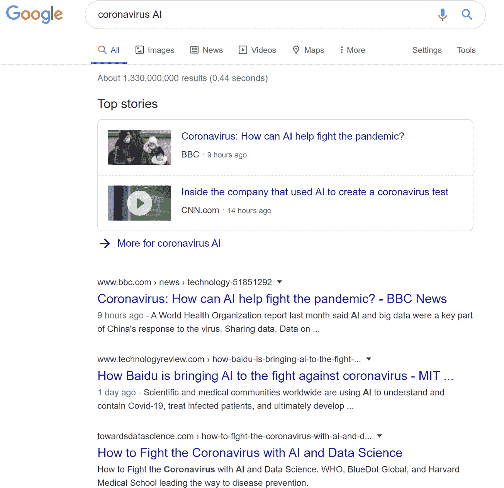
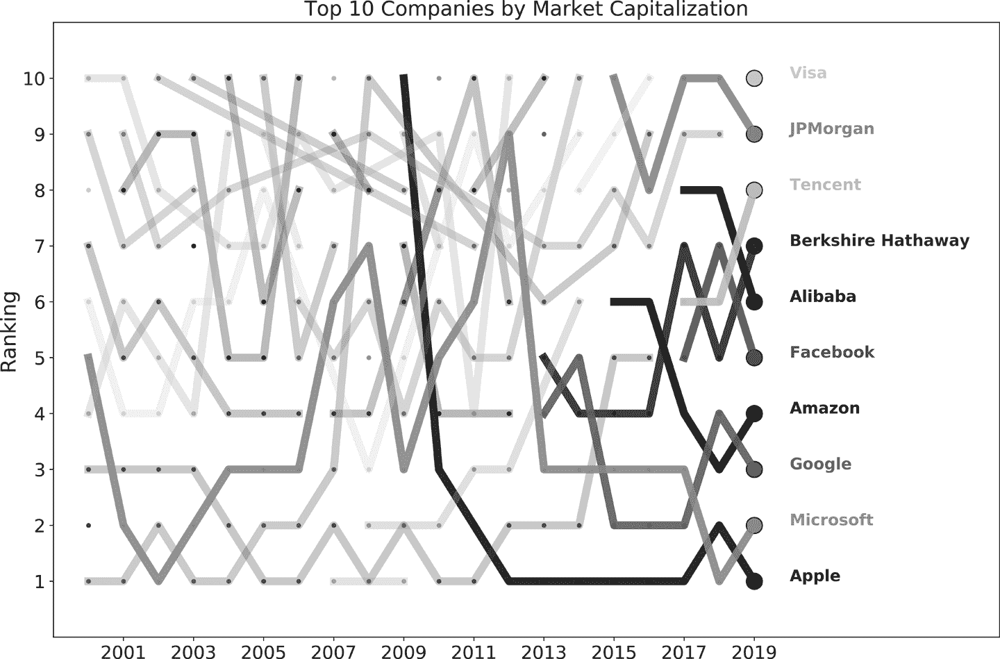
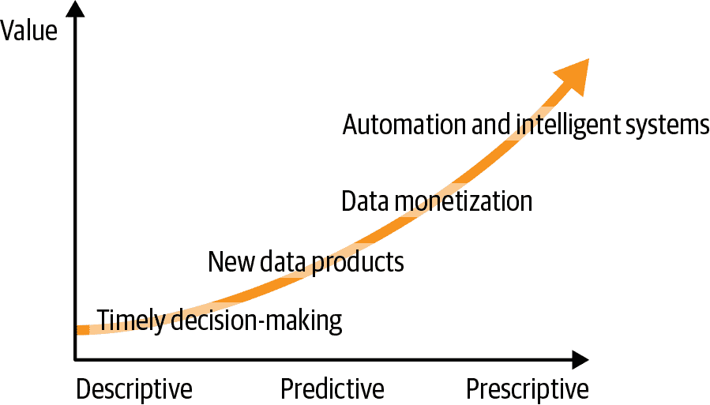

# 第一章：分析思维与 AI 驱动企业

现在是 2020 年 4 月，全球正在经历一场由新冠病毒 SARS-CoV-2 引起的非常严重的全球大流行以及随之而来的疾病（COVID-19），确诊病例数以百万计，死亡人数以十万计。如果你在网上搜索`AI coronavirus`，你会发现一些非常有声望的媒体和学术机构强调人工智能（AI）在抗击这场流行病中可能发挥的作用（图 1-1）。

许多人对这类标题感到不适的原因在于它们给 AI 披上了超级英雄的外衣，这已经变得相当普遍，过度强调了目前 AI 能够实现的界限。

###### 图 1-1 AI 与冠状病毒

# 什么是 AI？

如果我必须按照人们对“AI”术语的理解将世界人民分为四类，我会说有四类人。

在谱系的一端是那些从未听说过这个术语的人。由于 AI 已经成为流行文化的一部分，现在在电影、电视节目、书籍、杂志、脱口秀等方面普遍存在，我猜这个群体相对较小。

大多数人属于第二组，他们认为 AI 更接近从业者所称的*人工通用智能*（AGI）或类似人类的智能。在他们看来，AI 是类似人类的机器，能够完成与人类相同的任务并做出决策。对他们来说，AI 不再是科幻的领域，因为几乎每天都会看到某种形式的媒体报道，介绍 AI 如何改变我们的生活。

第三组人，实际上不喜欢这个术语，更愿意使用没那么性感的机器学习（ML）来描述他们的工作。ML 主要关注使用强大算法和大量数据进行准确预测。有许多这样的算法，但 ML 技术的宠儿是深度学习——即通过深度神经网络进行学习——它几乎是当今该领域所有媒体关注的焦点。

深度学习也涉及使用预测算法，这些算法在解决几年前只有人类能够处理的问题方面表现出了相当强大的能力，特别是在图像识别和自然语言处理领域（例如 Facebook 自动为你的照片中的朋友打标签，或者像 Alexa 这样的虚拟助手在亚马逊上平滑地处理你的购物体验，并控制你家中连接到互联网的灯光和其他设备）。

我不想用技术细节分散你的注意力，所以如果你想了解更多，请参考附录。我想在这里强调的唯一一点是，从业者听到或阅读“AI”时，他们会想到“ML”，在他们看来，这实际上只是*预测算法*。

第四个也是最后一个组别是我称之为“专家”的人，即那些正在进行研究并因此推动 AI 领域进展的极少数个人。如今，大部分资金都被用于推动深度学习领域的边界，但在某些情况下，它们也在进行关于实现 AGI 的其他主题的重要研究。

那么，什么是人工智能（AI）？在本书中，我将 AI 和 ML（机器学习）互换使用，因为这已经成为行业标准，但请记住，除了预测之外，AI 研究领域还涵盖其他主题。

# 为什么当前的人工智能无法兑现其承诺？

AI 的问题从其名称本身开始，因为它不可避免地让我们想到具有类似人类智能的机器。但困难不仅仅来自于一个误称，还来自内部评论，因为一些该领域的知名领袖加强了在短期内将难以实现的期望。2016 年，一位这样的领袖声称，“几乎任何普通人在<1 秒内能做的事情，我们现在都可以通过 AI 自动化”。其他人可能更谨慎，但他们坚定地认为深度神经网络是实现 AGI 的基础构建模块，这为媒体提供了多篇引人注目的头条新闻。

但我岔开了话题：对于本书的目的来说，真正重要的是这种炒作如何影响我们经营业务的方式。我们经常听到首席执行官和其他高级主管说他们正在用 AI 颠覆自己的行业。尽管他们可能并不完全了解这个术语的含义，但在泡沫破裂之前，供应商和顾问们都非常愿意分享这些财富。

炒作很危险，因为对未实现预期的自然反应是削减所有资金和组织焦点。¹ 我在这本书中的目标是要表明，虽然我们可能还远未创造出类似人类智能的东西，但通过当前技术，我们可以通过将 AI 作为输入来显著提升我们企业的决策能力而创造实质性价值。

在此之前，让我们先了解一下我们是如何到达这里的，因为这将有助于展示当前方法的一些困难以及已经可以实现的机会。

# 我们是如何到达这里的？

图 1-2 展示了全球市值排名前十的公司的演变过程。除了伯克希尔·哈撒韦（沃伦·巴菲特的企业集团）、Visa 和 JPMorgan 外，其余公司均属于技术领域，并且均已拥抱数据和人工智能革命。² 表面上看，这似乎意味着如果这对它们有效，那么对任何其他公司也应该有效。但事实真的如此吗？

###### 图 1-2\. 市值前十名排行榜的演变——（2018 年之前离开排行榜的公司未标记）

在这些成功背后，有两个故事最近才汇聚在一起。一个与人工智能的发展有关，另一个与大数据革命有关。

## 数据革命

不久前，技术头条的女王是大数据，几乎没有人谈论人工智能（根据《经济学人》的说法，2017 年[大数据是新石油](https://oreil.ly/yePMT)）。让我们简要地讲述大数据如何崛起并戴上皇冠，以及人工智能近年来出乎意料地夺得了风头。

2004 年，谷歌发表了其著名的[MapReduce 论文](https://oreil.ly/Dkd4x)，使公司能够将大数据块的计算（无法放入单台计算机）分布到不同的机器上进行处理。后来，Yahoo!推出了自己的开源版本，标志着数据革命的开始。

几年来，技术评论员和咨询公司开始声称数据将为企业提供无限的价值创造机会。在开始时，这场革命围绕一个支柱建立起来：拥有更多、多样化和快速可访问的数据。随着炒作的成熟，又增加了两个支柱：预测算法和数据驱动文化。

### 三个 V

第一个支柱涉及现在众所周知的三个 V：*容量*、*多样性*和*速度*。互联网转型为公司提供了越来越多的数据量。据 2018 年的估计，[人类历史上 90%的数据是在过去两年内生成的](https://oreil.ly/aNciU)，类似的计算还有很多。如果我们想要分析这些表面上无限的信息供应，技术必须进行适应。我们不仅需要存储和处理更大量的数据，还需要处理新的非结构化数据类型，如文本、图像、视频和录音，这些数据类型在当时的数据基础设施下不易存储或处理。

创新推出后，咨询师和供应商提出了推广这些新技术的新方法。在大数据时代之前，企业数据仓库被用于存储和分析结构化数据。新时代需要同样新的东西，因此*数据湖*应运而生，承诺为存储和分析大数据提供灵活性和计算能力。

由于“线性可伸缩性”，如果需要完成的工作加倍，我们只需安装两倍的计算能力来满足同样的截止期限。类似地，对于给定的任务，我们可以通过加倍基础设施来将当前时间减半。计算能力可以通过商品硬件轻松添加，由开源软件高效运行，我们可以方便地使用。但数据湖也允许快速访问更多种类的数据源。

一旦我们解决了数据量和种类的问题，速度就成了下一个前沿，我们的目标必须是减少行动和决策的时间。我们现在能够实时或准实时地存储和处理大量非常多样化的数据。如果必要，这三个 V 可以为任何愿意投资技术和专业知识的公司轻松实现。尽管如此，财富尚未在望，所以又加入了两个新支柱——预测和数据驱动文化——以及成功的配方。

### 数据成熟度模型

由于仅仅依靠数据并未创造承诺的价值，我们需要一些额外的指导；这就是成熟度模型的作用，它承诺帮助企业在数据革命所带来的动荡中航行。我将解释其中的一个模型，如 图 1-3 所示。

###### 图 1-3\. 一个可能的数据成熟度模型，展示了价值创造的层次结构

#### 描述性阶段

从左开始，一开始就显而易见的一件事是：拥有更多、更好、及时的数据可以提供对我们业务绩效更精细的视角。我们快速反应的能力肯定会让我们创造一些价值。健康类比可能有助于理解其中的原因。

想象一下，你在身体中安装传感器，通过可穿戴设备或其他即将发明的内部设备提供给你更多、更好和及时的健康数据。由于现在你可能知道你的心率或血压何时超过某些临界水平，你可以采取任何必要的措施使事物恢复正常。同样，你可以追踪你的睡眠模式或血糖水平，并相应地调整你的日常习惯。如果我们反应足够快，这些新的可用数据甚至可能拯救我们的生命。对过去数据的这种描述性分析可能为你的健康提供一些见解，而创造价值的能力在于我们足够快速地反应。

#### 预测阶段

但通常我们反应时已经太迟了。我们能做得更好吗？一种方法是用预测性行动取代反应性。只要预测力足够强大，这一层应该能为我们赢得时间以找到更好的行动，从而创造新的价值机会。

这个新阶段使我们能够开发新的*数据产品*，比如推荐引擎（想想 Netflix），并且还催生了数据变现时代的开始。在线广告业务因此诞生，标志着我们故事中的一个重要转折点。市场营销人员的梦想因数据及其生成的预测的承诺而变为现实，*在正确的时间向正确的人销售合适的产品*。

#### 规定阶段

在价值创造的这个层次结构中，最高的地位由我们自动化和设计智能系统的能力占据。我们现在处于*指导性*层：一旦拥有足够的预测能力，就可以开始找到实现业务目标的*最佳*行动。这是公司从预测到优化的层次，是数据奥林匹斯的宝座，有趣的是，这是大多数成熟模型中最少被探索的步骤。

# 一个未实现期望的故事

在不到 15 年的时间里，我们经历了两次繁荣期——大数据革命后来是当前的人工智能阶段——因此您可能会想知道为什么承诺尚未兑现。

我不是数据成熟度模型的忠实粉丝，但我相信答案就在其中：*大多数公司尚未达到指导性阶段*。大数据一切关注描述性阶段，正如我们所提到的，人工智能主要关注预测。由于过去几年中一切已经为我们铺平了道路，关于我们显然无法前进的原因的问题便迷失在其中。

我确信市场力量是一个重要因素，这意味着一旦炒作开始，市场参与者希望在完全耗尽之前获得利益，然后再转向下一个大事件。由于我们仍处于这个阶段，目前还没有动力继续前进。

但事实也是，要变成指导性的，我们需要获得一套新的分析技能。直至今日，使用当前技术，这个阶段是由人类完成的，因此我们需要培养人类来提出和解决指导性问题。本书旨在让我们更接近这一目标。

# 现代人工智能驱动企业的分析技能

Tom Davenport 的经典著作*Competing on Analytics*（哈佛商业出版社）基本上将分析思维与后来被称为数据驱动的概念等同起来：“通过分析，我们指的是广泛使用数据、统计和量化分析、解释性和预测性模型以及基于事实的管理来驱动决策和行动。” 另一个定义可以在 Albert Rutherford 的*The Analytical Mind*（独立出版）中找到：“分析能力简单地说就是解决问题的能力。这些是能力和技能，使您能够以逻辑和理性的方式处理问题，以期找出最佳解决方案。”

在本书中，我将*分析推理*定义为将业务问题转化为*指导性解决方案*的能力。这种能力既要求数据驱动，也要求能够理性和逻辑地解决问题，因此实际上与前面描述的两种定义是一致的。

要使事情变得实际，我将把商业**问题**等同于商业**决策**。其他仅具信息性且不涉及行动的问题可能对某些公司具有内在价值，但我不会在这里处理它们，因为我的兴趣在于通过分析**决策**创造价值。由于大多数决策是在不知道实际后果的情况下做出的，人工智能将是我们应对这种内在不确定性的武器。请注意，在这种方法下，预测技术是我们决策过程中重要的*输入*，但并非*终点*。预测质量的提高可以产生一级或二级效应，具体取决于我们当前是否已经做出接近最佳选择。

# 主要收获

+   *大多数公司未能通过数据或人工智能以可持续和系统化的方式创造价值*：尽管如此，许多公司已经开始他们自己的努力，只是为了达到失望的墙壁。

+   *今天的人工智能关注的是预测*：人工智能被过度吹捧，不仅因为其误导性的名称，还因为通过更好的预测只能达到有限的成就。如今，人工智能通常指的是深度学习。深度神经网络是高度非线性的预测算法，在图像识别和自然语言处理领域表现出色。

+   *在人工智能出现之前，我们经历了大数据革命*：数据革命先于当前的炒作，也承诺要产生杰出的业务结果。它围绕三个 V——容量、多样性和速度——构建，后来又补充了预测算法和数据驱动文化。

+   *数据和预测本身无法创造可持续的价值*：成熟度模型表明，通过以数据驱动方式做出最佳决策来创造价值。为此，我们需要数据和预测作为我们决策过程中的输入。

+   *我们需要一套新的分析技能才能在这个规定性阶段取得成功*：当前技术阻碍了我们将商业问题转化为规范解决方案的自动化过程。由于人类需要始终参与其中，我们需要提升我们的技能水平，以从数据和人工智能驱动的决策中捕获所有的价值。

# 进一步阅读

2019 年和 2020 年见证了关于通过人工智能能够实现什么极限的非常有趣的辩论。您可以在蒙特利尔的[加里·马库斯和约书亚·本吉奥进行的讨论](https://oreil.ly/MSCrc)中看到这样的辩论。如果您喜欢阅读，加里·马库斯和欧内斯特·戴维斯的*重启人工智能：构建我们能信赖的人工智能*（潘西恩出版社）将提供关于为何许多人对深度学习成为实现 AGI 的方式持批评态度的细节。

在讨论 AI 如何影响企业的主题上，我强烈推荐阅读《预测机器：人工智能的简单经济学》（Harvard Business Press），作者是 Ajay Agrawal、Joshua Gans 和 Avi Goldfarb。这本书由三位经济学家和 AI 战略家撰写，提供了一份远离炒作、务实的现有 AI 现状报告。他们的关键观点是，由于当前的发展，企业内部预测解决方案的成本大幅降低，而质量却在持续提高，为公司转变其商业模式提供了巨大的机会。同样由经济学家撰写，《机器平台群体：驾驭我们的数字未来》（W. W. Norton and Company）由 Andrew McAfee 和 Erik Brynjolfsson 讨论数据、人工智能和数字转型如何影响我们的企业、经济和整个社会。

数据成熟度模型出现在几本书中：你可以查阅 Thomas Davenport 和 Jeane Harris 的《竞争分析》（Harvard Business Press）；Tom Davenport 的《工作中的大数据：揭示神话，发现机会》（Harvard Business Press）；或者 Bill Schmarzo 的《大数据：理解数据如何推动大企业》（Wiley）。

如果你对我们实现强人工智能的探索感兴趣，Nick Bostrom 的《超智能：路径、危险、策略》（Oxford Univeristy Press）详细讨论了智能是什么以及超智能可能如何出现，以及这一发展的危险及其对社会的影响。类似的讨论也可以在 Max Tegmark 的《生命 3.0：在人工智能时代如何成为人类》（Vintage）中找到。

最后，在播客方面，我建议关注 Lex Fridman 的《人工智能》（Artificial Intelligence）。这里有许多与该领域领导者的重要访谈，将为当前事务提供更多背景信息。

¹ AI 领域非常清楚这种风险，因为它经历了至少两次“冬天”，在这些时期几乎完全拒绝资助任何研究人员。

² 数据来自[Wikipedia](https://oreil.ly/p3fdX)，截至 2020 年 3 月检索。在图表中，我仅使用每年最后一个季度的信息。
