# 第二章：分析思维导论

在上一章中，我将*分析思维*定义为将商业问题转化为规范解决方案的能力。从这个定义中，我们可以深入探讨许多内容，而这将是本章的任务。

为了真正理解规范解决方案的力量，我将从精确定义商业决策分析中的三个阶段开始：即我们已经在 第一章 中提到的描述、预测和规范步骤。

由于我们分析工具箱中的一个关键技能是从一开始制定正确的商业问题，我将对这个主题进行初步探讨。剧透警告：我们只关心从事业务决策所需的商业问题。然后，我们将决策分解为杠杆、后果和商业结果。杠杆与后果之间的联系通过*因果关系*进行中介，因此我将花费相当多的时间讨论这个主题。最后，我将讨论不确定性在商业决策中的作用。每一个这些主题都与本书中将要发展的一个技能相关联。

# 什么是杠杆？

在本书的背景下，“杠杆”与“行动”或“决策”是同义词，因此，每当我们说“我们想要拉动某个杠杆以获得商业结果”时，这意味着我们在寻找适当的行动或决策。

# 描述性、预测性和规范性问题

在 第一章 中，我们看到数据成熟度模型通常描绘了一个美好而平稳的道路，从描述阶段开始，经历预测平台，最终达到预测巅峰。但为什么会这样？让我们从理解这些概念开始，然后我们可以讨论评论员和实践者为什么都认为这是数据演进的自然升华过程。

简而言之，*描述性*关注事物的现状，*预测性*关注我们认为事物将会如何，而*规范性*关注事物应该如何。就像《权力的游戏》中泰瑞昂·兰尼斯特在“龙的舞蹈”集中说的：“混淆现实和*应*该的事物很容易，特别是当*现实*对你有利时”（我强调）。泰瑞昂似乎在声称，当事情顺利时，我们往往有混淆描述和规范的倾向，这可能是一种确认偏见的形式。顺便说一句，当结果是负面的时候，我们往往认为这是最坏的可能结果，并将我们的命运归因于某种形式的墨菲定律。

无论如何，正如这次讨论所显示的那样，规范阶段是我们可以排列不同选项以使“最好”或“最差”这样的词有任何意义的地方。由此可见，规范层永远不能逊色于描述层，因为在前者中我们总是可以做出最佳决策。

但是预测呢？首先，它的中间排名至少是有问题的，因为描述与当前状态有关，而处方与*决策质量*有关，预测是使决策成为决策的输入，这可能是最优的或甚至是好的。在所有成熟度模型中，隐含的假设是：当我们对问题中的基本不确定性有更好的预测时，可以改善决策质量；好的预测使我们能够提前计划并主动行动，而不是对过去的反应几乎没有或没有余地。也就是说，这实际上是一种假设，因为预测本身并没有任何固有的东西使其改善我们企业的结果。

## 当预测分析强大时：癌症检测的案例

让我们举一个更好的预测可以产生巨大差异的例子：[癌症检测](https://oreil.ly/00Otb)。肿瘤学家通常使用某种类型的视觉辅助工具，例如 X 光或更先进的 CT 扫描来早期检测不同的病理。在肺癌的情况下，X 光或 CT 扫描描述了患者当前的健康状况。不幸的是，视觉检查除非疾病已经达到晚期，否则是无效的，因此，仅仅依靠描述可能不会提供足够的时间进行积极的反应。AI 已经显示出在通过检查 CT 扫描来[预测肺癌的存在](https://oreil.ly/8ZU6D)方面表现出色，通过识别最终将变成恶性的斑点。但是预测只能带我们走这么远。接着，医生应该推荐适当的治疗方案，使患者完全康复。AI 提供了预测能力，但是人类为患者开具处方。

## 描述性分析：客户流失的案例

让我们运行一个相对典型的描述性分析的用例，大多数公司都曾经处理过：客户流失或流失。我们将看到，如果没有来自我们的业务目标的指导，这种类型的分析可能会使我们陷入僵局。

# 什么是客户流失？

如果您不认识这个术语，客户流失是客户在一段时间内停止使用公司产品或服务的速率。例如，如果您公司的月度流失率为 5%，这意味着在周期开始时从您购买的 100 名客户中有 5 名在月末时不再购买。正如您可能想象的那样，确切的定义因行业而异，关键取决于预期的购买频率（想想信用卡）。

我们关心流失的主要原因是，我们的客户获取成本通常远远大于相应的保留成本，因此，拥有积极的流失控制策略已经成为一个目标本身。

### 描述流失

假设你的老板希望控制流失率。作为第一步，她可能会要求你诊断问题的严重性。在处理数据后，你得出以下两个图表（图 2-1）。左图显示了每日流失率的时间序列。你有信心地陈述两件事：年初相对稳定后，流失率现在正在上升。其次，有明显的季节性模式，周末的流失率低于平均水平。在右侧面板中，你展示了平均收入较高的市镇也具有较高的流失率，这当然令人担忧，因为你最有价值的客户可能会转向其他公司。

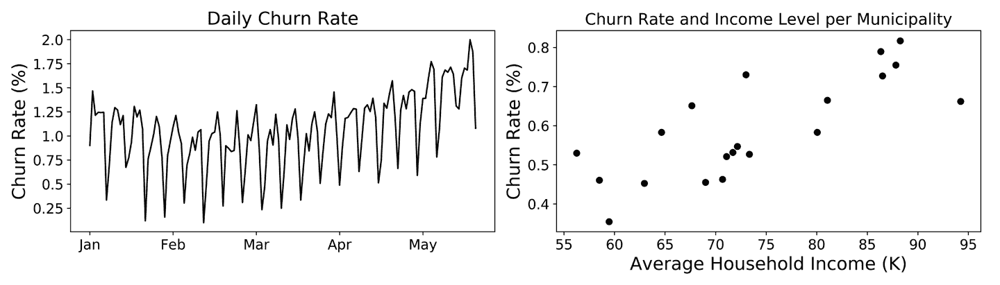

###### 图 2-1\. 我们公司流失率的描述性分析

这是描述性分析可以实现的一个很好的例子，得益于我们在数据中识别模式的卓越能力。在这里，我们迅速识别了趋势的变化（流失正在加速），在散点图中发现了强烈的季节性效应，并且流失率与家庭平均收入呈正相关。

但这也凸显了它的一些缺点。首先，正如你可能听说的那样，*相关并不意味着因果*，这是本章后面将详细讨论的话题。与此相关的是，成功的根本原因分析要求我们能够建立关于因果关系的理论。没有这些理论，我们无法着手提供改善公司情况的替代行动方案。检查数据而不提出合理的解释是让你的分析和数据科学团队浪费宝贵时间的完美配方。

### 预测流失

作为下一步，你的老板可能会要求你在未来*预测*流失。你应该如何操作？这实际上取决于你希望通过这项分析实现什么目标。例如，如果你在金融领域工作，并且对预测未来一个季度的损益表感兴趣，你会很高兴地预测未来的总体流失率。然而，如果你在市场营销部门工作，你可能希望预测哪些客户有可能离开公司，可能因为你可以尝试使用不同的留存活动。

### 提出减少流失的行动方案

最后，假设你的老板要求你推荐减少客户流失率的替代行动方案。这就是处方工具包非常有用的地方，也是做出良好决策影响最大的地方。然后，你可以为客户留存进行成本效益分析，并制定最大化客户生命周期价值（CLV）的规则。

我们将有机会对这个使用案例进行更详细的讨论，但是让我单独指出任何规范性分析的两个特征：与之前两种分析相反，在这里我们积极推荐可以通过激励可能离开的客户留下来来改善我们的立场的行动方案。其次，预测作为决策过程中的输入，帮助我们计算*预期*的节省和成本。人工智能将帮助我们更好地估计这些量，这对于我们提出的决策规则是必要的。但正是这个决策规则创造了价值，而不是预测本身。

本书的一个目标是让我们能够将业务问题转化为规范性解决方案，所以如果现在还不明显，不用担心。我们将有时间逐步进行许多示例。

# 业务问题和 KPIs

书中的一个基础理念是，价值来自于*做决策*。因此，机器学习形式上的预测只是创造价值的一种输入。在本书中，每当我们谈论业务问题时，我们始终牢记的是业务决策。当然，有些业务问题纯粹是信息性的，没有涉及到任何行动。但由于我们的目标是系统地创造价值，我们只会考虑可行的问题。事实上，本书的一个副产品是，我们将学会几乎自动地寻找可行的见解。

这本书建议了一个问题，那就是*为什么*我们必须做出决策。只有通过回答这个问题，我们才能知道如何衡量我们所做选择的适当性。那些在没有任何相关证据面前无法判断的决策将被舍弃。因此，我们必须学会如何选择正确的度量标准来追踪我们的绩效。许多数据科学项目和业务决策失败并非因为使用的逻辑有问题，而是因为度量标准与问题不匹配。

有一整套文献讨论如何选择正确的关键绩效指标（KPIs），我认为在这个话题上我无甚添加。我寻找的两个主要特征是*相关性*和*可度量性*。当一个 KPI 允许我们清晰评估我们的决策结果*与业务目标*相关时，它就具有相关性。请注意，这与业务问题的相关性无关，而是与我们能否评估决策是否奏效以及奏效程度有关。因此，一个好的 KPI 应该是可度量的，而且应该在决策做出时或者稍有延迟时就能测量。延迟测量不仅有机会成本，而且可能更难确定根本原因。

## 用于衡量忠诚计划成功的 KPIs

让我们简要讨论一个例子。假设我们的首席营销官要求我们评估为公司创建一个忠诚计划。由于问题以一个动作开始（即，创建忠诚计划或不创建），因此它立即对我们注册为一个业务问题。我们应该追踪哪些指标？为了回答这个问题，让我们开始*为什么问题的顺序*。

# 为什么问题的顺序

以下示例展示了我称之为*为什么问题的顺序*的技术。它用于确定我们要优化的业务指标。

它通过从您，您的老板或您的同事可能认为您想要实现的目标开始，并质疑关注此目标的原因来运作。向上移动一步并重复。当您对答案满意时，它结束。顺便提一句，回想一下，为了满意，您必须有一个相关且可衡量的关键绩效指标来量化您将关注的业务结果。

我们的*为什么问题*如下所示：

+   创建一个忠诚计划。*为什么？*

+   因为你想奖励忠实的客户。*为什么？*

+   因为你想激励客户与公司保持更长时间。*为什么？*

+   因为你想长期增加你的收入。*为什么？*

当然，问题还可以继续下去。重要的是，对这些问题的最终答案通常会让您清楚地确定对于手头的问题而言哪个 KPI 是相关的，以及可能提供有用的任何中间度量标准；如果它也是可衡量的，那么您已经找到了解决问题的正确指标。

举个例子，考虑第二个问题。为什么任何人都想奖励忠实的客户？他们已经忠实，无需任何外在动机，因此这种策略甚至可能适得其反。但是撇开基本推理，忠诚为什么有意义，你如何衡量奖励的影响？我认为单纯的忠诚并不具有意义：我们更喜欢忠实的客户而不是不太忠诚的客户，因为他们代表未来更稳定的收入流。如果您不信服，请想想那些忠诚但*不赚钱*的客户。您还像以前一样高度评价他们的忠诚吗？如果忠诚本身不是您追求的内容，那么您应该继续进行*为什么问题的顺序*。

仅供讨论，假设您仍然想奖励忠实的客户。我们如何衡量方案是否有效，或者换句话说，什么是这方面的良好关键绩效指标(KPI)？一个常用的方法是直接询问我们的客户，就像在净推荐指数(NPS)中那样。为了计算 NPS，我们先问客户他们有多大可能推荐我们作为一家公司，从 0 到 10 的等级。然后，我们将他们分为*推荐者*(9 到 10)，*批评者*(0 到 6)和*被动者*(7, 8)。个别答案最终通过将批评者的百分比减去推荐者的百分比来聚合到 NPS 中。

光明面是，这是一个相当*直接*的评估：我们只需去问我们的客户他们是否重视这个奖励。事情再也不会更直接了。问题在于，人类会根据动机行事，所以我们通常无法判断答案是否真实，或者是否存在某种潜在动机而他们试图操纵我们的系统。在评估我们决策影响时，这种战略考虑至关重要。

另一种选择是让客户通过他们的行为间接*显示*他们的满意程度，比如最近交易的数量或频率，或者通过相对设计良好的对照组来减少流失率¹。公司总是会进行客户调查，它们应被视为潜在的信息丰富来源。但一个好的实践是始终核实他们的*说*是否得到了他们的行动的支持。

# 决策解剖：简单分解

图 2-2 展示了我们将用来分解和理解业务决策的一般框架。从右边开始，再次强调，我们*始终从业务出发*。如果你的目标不明确或模糊，很可能根本不应该做出决策。公司倾向于行动，因此有时会做出毫无成果的决策。这不仅可能在业务上产生意外的负面后果；还可能影响员工的能量和士气。此外，我们现在理所当然地认为我们的业务目标可以通过相关的关键绩效指标（KPI）来衡量。这并不意味着指标自然而然地出现：正如后面的例子所强调的，我们必须仔细选择我们的指标。

通常情况下，我们不能仅仅通过自己操纵这些业务目标（*记得恩隆？*），所以我们需要采取一些行动或拉动一些杠杆来尝试产生结果。行动本身映射到一系列直接影响我们业务目标的后果。确保：*我们*拉动杠杆，我们的业务目标取决于环境反应时产生的后果。这个环境可以是人类或技术，正如我们后面将看到的那样。

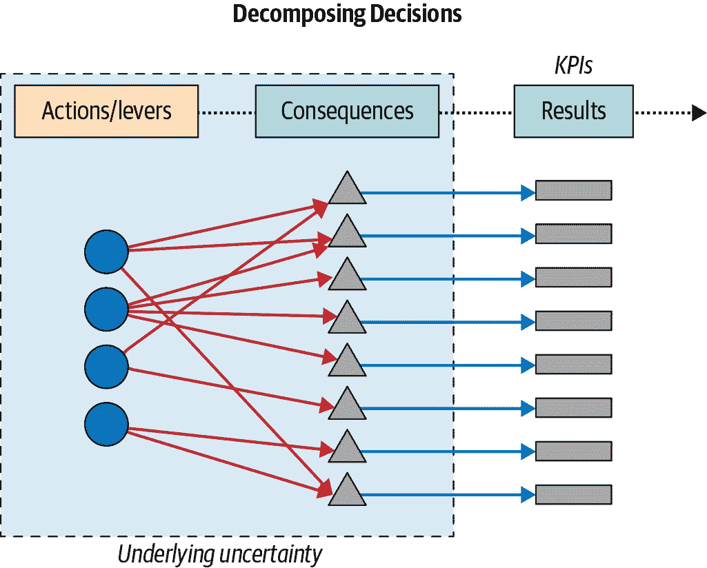

###### 图 2-2\. 分解决策：行动、后果和业务结果

即使映射是直接的（大多数情况下并非如此），它仍然受到不确定性的影响，因为在决策时不可能准确知道后果会是什么。我们将利用人工智能的力量来接受这种潜在的不确定性，从而使我们能够做出更好的决策。但不要误解：*价值来自于决策，预测是使决策更好的输入*。

# 行动、后果和结果的区别

假如你还没有搞清楚后果在分解中的作用，这里举一个例子。假设我们的目标是增加收入。为了达到这个目标，我们决定拉动定价杠杆，给我们的客户提供一些折扣。我们行动的结果是我们的客户增加了对我们品牌的消费，这本身就会带来更高的收入。

+   *行动：*提供折扣

+   *结果：*客户增加对我们产品的需求

+   *结果：*收入增加

总之，在我们的日常生活和商业中，我们一般追求明确的、可以衡量的目标。决策是在竞争的行动中选择以实现这些目标的行动。数据驱动的决策是根据证据采取行动，评估替代行动方案。规范决策是选择为我们产生最佳结果的行动的科学；因此，我们必须能够根据可衡量且相关的关键绩效指标对我们的选择进行排名。

## 一个例子：你为什么买这本书？

接下来的例子应该能说明这种分解对我们所做的*每一个*决策都是如何工作的（图 2-3）。以你购买这本书的选择为例。这是一项你已经做出的行动，但是，当然，你也可以做出其他选择。由于我们总是从业务问题开始，让我想象一下你试图解决什么类型的问题。

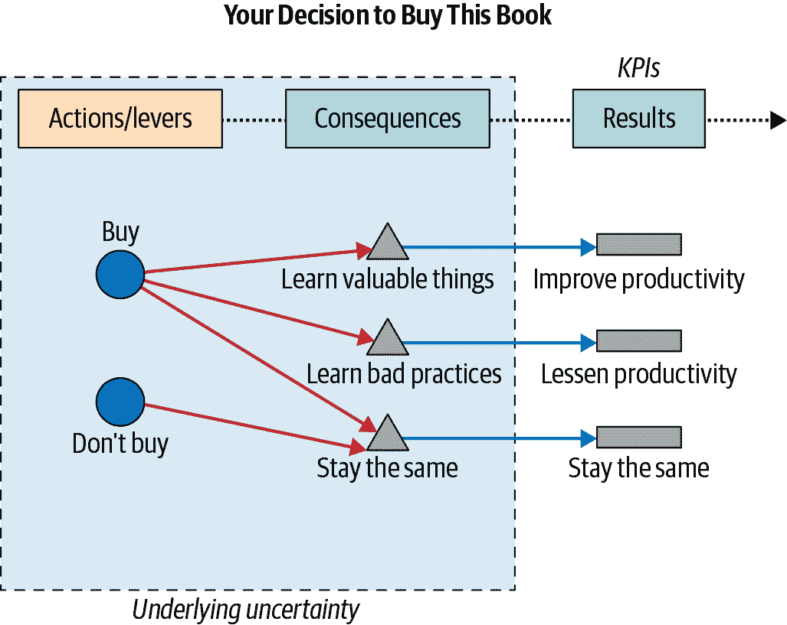

###### 图 2-3. 分解购买本书的决策

我不知道你在购买时解决的目标是什么，但在我的情况下，我会对提升自己的职业发展感兴趣。因此，我将假设你想优化的关键指标是你的工作效率，并且遵循我们关于关键绩效指标的讨论，我将方便地假设这是可以衡量的。

既然你在阅读这本书，我也会简化所有有趣的细节，只考虑两种可能的行动：购买或者不购买。正如图中所示，如果你购买这本书，那么至少会产生三种可能的后果：你学到有价值的东西，你学到不好的实践，或者你什么也学不到。自然地，这些后果都会影响你的工作效率。

如果你不购买这本书，可能会发生许多事情。例如，你可能会突然充满灵感，开始理解你工作的复杂性，从而提高你的工作效率。虽然这是可能的，但我们会诉诸于奥卡姆剃刀原理，并保持你的知识和生产力保持相同的最可能的结果。

# 奥卡姆剃刀原理

当一个问题有很多合理解释时，奥卡姆剃刀原理会倾向于选择最简单的解释。同样，在统计学中，当我们有多个可能解释一个结果的模型时，如果我们应用这个原则，我们会试图使用最简洁的模型。

如果现在这个还不太清楚，不要担心；第五章将完全致力于提高我们的简化技巧。

最后，困难在于在您做出决定时，您真的不知道会发生什么后果。例如，与您的信念相反，可能奥莱利签署了这本书或作者是个错误。不幸的是，只有在您阅读之后才能知道（所以请阅读）。这是这个具体决定的潜在不确定性。

总结一下，注意到如何一个简单的行动帮助我们清晰而逻辑地找出正在解决的问题、一组杠杆、它们的后果以及潜在的不确定性。您可以在做出任何决定时使用这种分解方法。

# 因果关系入门

接下来的章节将深入探讨分解的每个阶段，因此有足够的时间理解这些杠杆的来源及其如何映射到结果。然而，现在停下来并认识到，这种映射是通过*因果*力量介导的。

回到“相关不意味着因果”的说法，不管我们听过多少次，混淆这两个术语仍然非常普遍。我们的大脑进化成为一个强大的模式识别机器，但我们并不那么擅长区分因果和相关关系。²

## 定义相关性和因果关系

严格来说，相关性是两个或多个变量中的任何线性依赖的存在或不存在。不那么正式地说，如果两个变量倾向于“一起运动”，它们就是相关的。

因果关系更难定义，所以让我们采取几乎所有人都遵循的捷径：因果关系是因果关系的一种关系。如果<math alttext="upper X"><mi>X</mi></math>（部分）导致<math alttext="upper Y"><mi>Y</mi></math>，则<math alttext="upper Y"><mi>Y</mi></math>（部分）是<math alttext="upper X"><mi>X</mi></math>的效果。这里使用“部分”修饰词是因为很少有一个因素是关系的唯一来源。

人们也可以用*反事实*来定义因果关系：*如果没有发生<math alttext="upper X"><mi>X</mi></math>，那么是否真的可以观察到<math alttext="upper Y"><mi>Y</mi></math>？* 如果答案是肯定的，那么从<math alttext="upper X"><mi>X</mi></math>到<math alttext="upper Y"><mi>Y</mi></math>存在因果关系的可能性很小。同样，“可能性很小”是重要的修饰词，并与之前的“部分”修饰词有关：存在一些因果关系仅当存在正确的条件组合时才会发生。

像图 2-1 中的散点图非常擅长描绘两个变量之间的相关性，但不幸的是，它不能指导我们理解因果关系。为此，在两个方向上询问反事实问题并使用奥卡姆剃刀选择一组可能的解释是相当标准的做法。

## 估计因果效应的一些困难

评估拉动杠杆<math alttext="upper X long right double arrow upper Y"><mrow><mi>X</mi> <mo>⟹</mo> <mi>Y</mi></mrow></math>对结果<math alttext="upper Y"><mi>Y</mi></math>的因果影响至关重要，因为我们试图设计最优决策。这种类比并非偶然：就像工程师必须了解物理定律才能建造摩天大楼、桥梁、汽车或飞机一样，今天的分析领导者必须在一定程度上理解中介我们自己行动及其后果的因果法则，以做出尽可能最佳的决策。而这是人类必须完成的任务；人工智能将在决策过程中帮助我们，但我们必须首先克服因果障碍。

### 问题 1：我们无法观察到反事实。

正如前面讨论过的，有几个问题使我们对因果效应的识别变得更加困难。第一个问题是我们只能观察事实，所以我们必须想象替代的*反事实*场景。可以说，分析思想家必须发展的最重要技能之一是质疑对经验结果的初步解释，并提出待测试的反事实替代方案。如果我们拉动了不同的杠杆，或者在不同条件下拉动了相同的杠杆，后果会有所不同吗？

让我们暂时停下来讨论这个问题包含的内容。假设我们想要提高电话营销活动中的潜在客户转化率。汤姆，一位在大学上过弗洛伊德精神分析课程的初级分析师，建议说女性呼叫中心代表应该有更高的转化率，于是公司决定让其非常能干的女性代表团队在一天内拨打所有外呼电话。第二天，他们会议审查结果：潜在客户转化率从正常的 5%提高到了令人惊讶的 8.3%。看来弗洛伊德是对的，或者更好的说，汤姆的决定上课终于得到了证明。还是这样吗？

要得到正确答案，我们需要想象一个顾客在一个宇宙中从女代表那里接到一个电话，然后在平行宇宙中从男代表那里接到*完全相同的*电话（图 2-4）。完全相同的顾客、完全相同的时间、完全相同的心情和完全相同的信息；两种情况中的一切都是相同的：我们只改变了语调，从男性变为女性。毋庸置疑，实现这样的反事实在实践中听起来是不可能的。本章后面我们将描述如何通过精心设计的随机实验或 A/B 测试模拟这些不可能的反事实。

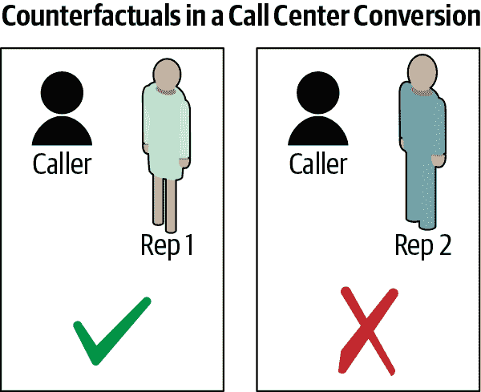

###### 图 2-4. 呼叫中心潜在客户转化率的反事实分析

### 问题 2：异质性

第二个问题是*异质性*。人类天生不同，每个人都是我们遗传和生活经历的产物，形成了独特的世界观和行为方式。我们的任务不仅是估计在我们选择拉动特定杠杆时行为如何变化的因果效应，而且我们还必须注意到不同的顾客会有不同的反应。一个推广我们产品的影响者对你和我会产生不同的影响：我现在可能愿意尝试它，而你可能选择继续忠于你喜欢的品牌。我们如何甚至衡量异质效应呢？

图 2-5 展示了著名的钟形曲线，正态分布，统计迷的宠儿。我在这里使用它来代表我们分析顾客在推广者推荐我们产品时的反应时可能遇到的自然变化。他的一些追随者，比如我，会接受这个暗示并积极反应——表示为超过垂直虚线的右侧动作，所有追随者、追随者的追随者等的平均反应。有些人则完全没有反应，甚至可能产生负面反应——这就是人类行为的美丽之处；我们有时候会得到可能动作和反应的全部范围。分布形状具有重要的含义，在现实中，我们的反应可能不会如此对称；我们可能会有更长的左或右尾部，并且反应可能偏向于正面或负面。这里重要的是人们的反应不同，这使得我们在试图估计因果效应时变得更加困难。

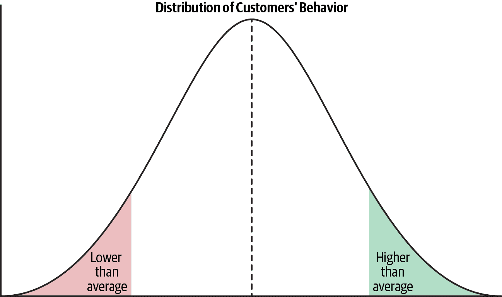

###### 图 2-5\. 正态分布作为思考顾客异质性的一种方式

我们通常处理异质性的方式是通过估计唯一响应来消除它，通常由平均值或均值（在图 2-5 中的垂直线）给出。然而，均值对极端观察非常敏感，因此我们有时可以用中位数代替它，中位数具有 50%的响应低于（左侧）和 50%高于（右侧）的属性；在钟形分布中，均值和中位数方便地是相同的。

### 问题 3: 混杂因素

在寻找因果关系时，通常会像在图 2-6 中绘制散点图一样开始，其中每个标记表示一对<math alttext="left-parenthesis x comma y right-parenthesis"><mrow><mo>(</mo> <mi>x</mi> <mo>,</mo> <mi>y</mi> <mo>)</mo></mrow></math> 观察。

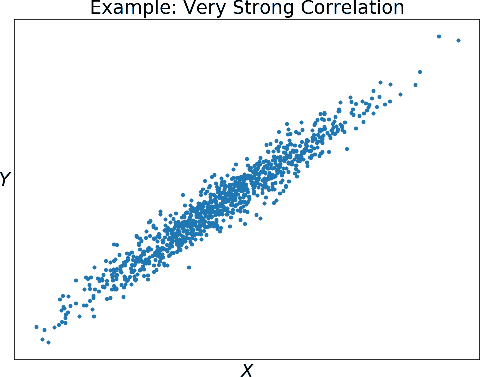

###### 图 2-6\. 两个高度相关变量的模拟

你可能会想断言，在这种情况下，有明确的证据表明<math alttext="upper X"><mi>X</mi></math>导致<math alttext="upper Y"><mi>Y</mi></math>或反之——常见的是将散点图解释为水平轴上的变量与垂直轴上结果之间的关系——但正如 Example 2-1 所示，这种解释是错误的：

##### 示例 2-1。模拟第三个未考虑变量对其他两个相关性的影响

```
# fix a seed for our random number generator and number of observations to simulate
np.random.seed(422019)
nobs = 1000
# our third variable will be standard normal
z = np.random.randn(nobs,1)
# let's say that z --> x and z--> y
# Notice that x and y are not related!
x = 0.5 + 0.4*z + 0.1*np.random.randn(nobs,1)
y = 1.5 + 0.2*z + 0.01*np.random.randn(nobs,1)
```

确实，第三变量<math alttext="z"><mi>z</mi></math>正面影响<math alttext="x"><mi>x</mi></math>和<math alttext="y"><mi>y</mi></math>，产生了这种伪相关性。如果我们能控制这第三变量（也称为*混杂因素*），或许能更好地理解我们感兴趣的两个变量之间的净关系。

考虑 Figure 2-7 中所示的例子。左上角面板绘制了墨西哥 1900 年至 2016 年的全球二氧化碳排放和人均实际国内生产总值（GDP）。右上角面板绘制了 1900 年至 2014 年威尔士和英格兰离婚人数与墨西哥 GDP 的关系。底部面板绘制了这三个时间序列，使得 1900 年的观察值为 100。³

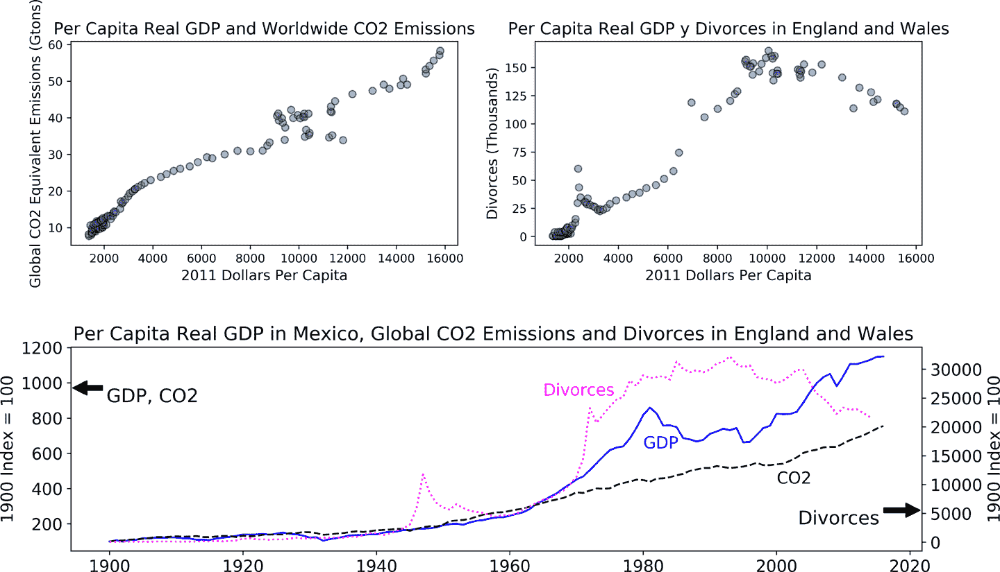

###### 图 2-7。左上角面板绘制了墨西哥 1900 年至 2016 年的全球二氧化碳排放与人均实际国内生产总值（GDP）；右上角面板则用 1900 年至 2014 年威尔士和英格兰离婚人数替代 CO[2]排放；底部绘制了这些变量的时间序列。

如果我们仅检查散点图，我们可能会错误地得出结论，认为全球排放和英国离婚率与墨西哥经济增长有某种因果关系。然而，在这种情况下，第三变量负责这种伪相关性：统计学家和计量经济学家将*时间趋势*称为变量随时间绘制时的自然增长率。底部面板显示了在特定时间段内这些增长率确实非常相似。

一旦我们确认了混杂因素，我们就可以在我们的预测算法中*控制*它（请参见附录）。但找到混杂因素的问题远非简单，因此这项任务必须由我们来完成（因此不容易自动化）。

### 问题 4：选择效应

最后一个问题是选择效应的普遍存在。这通常是因为我们选择要行动的客户群体，或者客户自己选择，或两者兼而有之。因果推断中的一个重要结果是，如果我们希望通过比较两组的平均结果来估计治疗的因果效应，我们需要找到一种方法来消除选择偏差。⁴

# 选择偏差和因果效应

因为选择偏差，当我们仅仅通过处理组和对照组之间平均结果的差异来估算因果效应时，我们可能会低估或高估。以方程的形式陈述：

<math alttext="Observed Difference in Means equals Causal Effect plus Selection Bias"><mrow><mtext>Observed</mtext> <mtext>Difference</mtext> <mtext>in</mtext> <mtext>Means</mtext> <mo>=</mo> <mtext>Causal</mtext> <mtext>Effect</mtext> <mo>+</mo> <mtext>Selection</mtext> <mtext>Bias</mtext></mrow></math>

按照标准做法，像图 2-8 的顶部面板一样绘制平均结果。在这种情况下，对照组的结果比接受我们行动或杠杆的人高出 0.29 单位（假设是数百美元）。这个数字对应于前述方程的左侧。底部面板显示了相应的结果分布。使用平均值计算差异是标准做法，但有必要记住，响应有整个光谱，在某些情况下，两组之间存在明显的重叠：阴影区域显示了两组客户之间难以区分的响应。

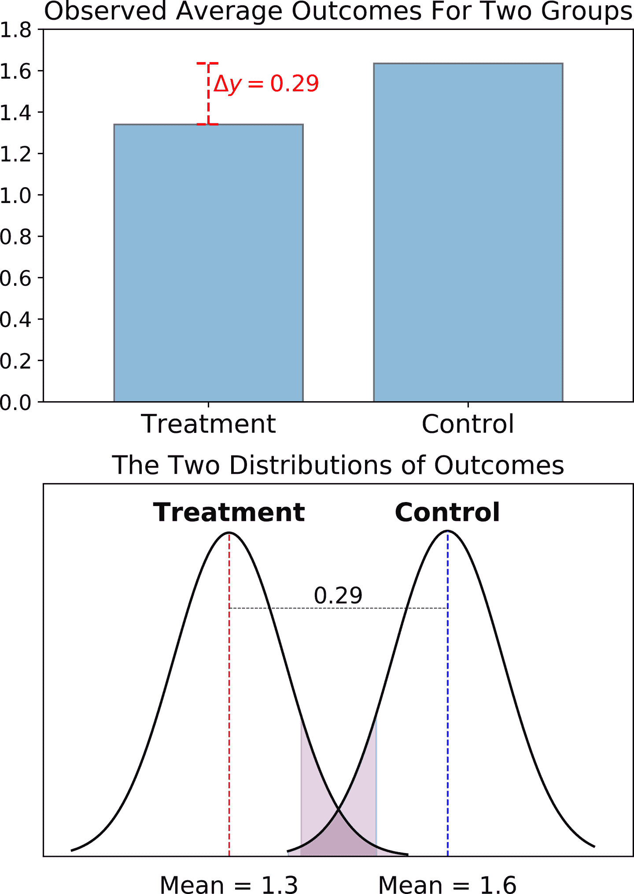

###### 图 2-8\. 顶部面板绘制了处理组和对照组 *平均* 结果的观察差异；底部面板显示了实际的结果分布。

无论如何，观察结果的差异（左侧）对我们来说是不够的，因为我们已经知道它可能被选择效应偏倚了；由于我们的兴趣在于估计因果效应，因此我们必须设计一种方法来消除这种普遍影响。

数理统计学家和计量经济学家，更不用说哲学家和科学家，几个世纪以来一直在思考这个问题。由于不可能精确复制我们每一个客户，有没有一种方法来分配我们的处理方式并规避选择偏差？20 世纪著名的统计学家和科学家罗纳德·A·费舍尔奠定了实验方法的坚实基础，这在实践者中是最普遍的一种估算因果效应的方法。这个思想足够简单，可以不使用技术术语来描述。

### A/B 测试

在行业中，通过运行 A/B 测试来消除选择效应是相当标准的做法，最数据驱动的公司每年运行数千次这样的实验，以找到推动决策的因果估计值。

我将在附录中专门讨论 A/B 测试，所以这里只是对技术进行了非常肤浅的描述。我们的目标是估算拉动杆 <math alttext="upper X"><mi>X</mi></math> 对某些输出指标 <math alttext="upper Y"><mi>Y</mi></math> 的因果效应。比如，我们希望量化价格优惠对我们收入的影响。

我们通过将客户分成两组进行 A/B 测试：A 组作为对照组，使用标准价格。相反，B 组则享受价格折扣。关键是，为了避免选择偏见，我们随机选择我们的组，因此当我们比较组间平均利润时，我们可以确信我们实际上估计了因果效应。我略去了所有有趣的技术细节，所以如果您感兴趣，请参阅附录。

# 不确定性

现在我们已经讨论了分解过程中的每个阶段：从业务出发，我们逆向工程影响我们目标和相应 KPI 的行动或杠杆，通过一些后果来调节。然而，由于决策是在不确定性下进行的，从行动到后果的这种映射在决策时对我们来说是未知的。但是到现在为止，我们已经知道不确定性不是我们的敌人，而且由于 AI 预测能力的进步，我们能够接受它。

但我们为什么会有不确定性？让我们首先讨论这种不确定性并非如何，然后再谈谈它是什么。想象一下抛硬币。我们知道，使用平衡的硬币，正面朝上的机会是 50%，而最终结果无法从一开始就完全预料到。由于我们大部分时间都在玩正反面，这是一个对我们来说非常接近和自然的随机性的例子。

然而，这并不是我们在做决策时所面临的不确定性类型，这对我们来说是个好消息。我们的不确定性并非纯粹的随机性，这使我们能够使用强大的预测算法，结合我们对问题的了解，选择输入变量——也称为特征——来进行预测。对于纯随机性来说，我们能做的最好的事情就是学习或者模拟结果的分布，并推导出一些理论属性，使我们能够做出明智的选择或预测。⁵

我们在做决策时不确定性的四个主要来源是我们需要简化，异质性，复杂和战略性行为，以及由社会互动引起的纯无知现象，每个将依次描述。请注意，作为分析思维者，我们应该始终知道不确定性的根源，但令人惊讶的是，我们经常会被带来的意外所困扰。

## 简化带来的不确定性

我最喜欢的一句话——通常被归因于爱因斯坦的是，“一切应该尽可能简单。但不要过于简化。” 同样地，统计学家乔治·博克斯（George Box）著名地说，“所有的模型都是错的，但有些是有用的。” 模型是简化，是帮助我们理解我们生活在其中的高度复杂世界运作方式的隐喻。

我再次强调，学会简化对现代分析思维者有多么重要。在第五章中，我们将有足够的时间通过一些众所周知的技术来锻炼我们的分析能力，但现在我们应该讨论简化所带来的代价。

作为分析思维者和决策者，我们经常面临一个折衷：是要得到一个足够好的答案，还是要花更多时间来开发问题更真实的图景。我们必须决定我们能接受多少不确定性，以及为了及时解决问题，我们愿意接受多少不确定性。但这种校准需要实践，正如爱因斯坦在第一条引言中简洁地表达的那样。

简化的权力和危险的一个明显例子是地图。图 2-9 显示了伦敦交通局在左侧展示的正式伦敦交通管制（TfL）地铁地图的一部分，右侧展示的是同一区域的更真实版本，也是由[交通管理机构](https://oreil.ly/HONtI)制作的。为了使我们的交通决策快速简便，地图在现实感和易用性之间进行权衡。作为地图的使用者，我们现在面临地理、距离、角度甚至可能的相关场所如公园或博物馆的不确定性。但作为第一近似，我们对这种粒度选择感到满意，因为我们的首要目标是从起点到目的地。我们稍后可以处理问题的其余部分。

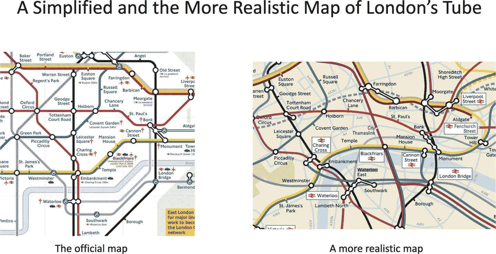

###### 图 2-9。伦敦地铁地图的部分区域——左面板对应官方地铁图，而右面板展示了同一部分的更真实版本。

最后一点让我想到另一个相关问题：一种常见的简化技术是将复杂问题分解为可以独立处理的简单子问题；计算机科学家称之为*分而治之*技术。当每个子问题都产生一定的不确定性时，不能保证聚合后的不确定性变得更易处理（除非我们从一开始就施加了一些简化的假设）。

这个故事的寓意是，我们应该始终记住，简化问题通常会为问题增加额外的不确定性。正如统计学家博克斯所评论的那样，[“……模型的近似性质必须始终牢记在心”](https://oreil.ly/f8ZLH)。

## 来自异质性的不确定性

在做出业务决策时，一个重要的不确定性源于我们的客户以非常不同的方式作出反应。这种广泛的行为、品味和反应可以通过分布的使用来建模，因为这通常是我们处理不确定性的方式（参见图 2-5）。通过这样做，我们可以摆脱关于结果如此多样化的具体细节，只需关注不确定性如何影响我们的最终结果。这种建模方法非常方便，迫使我们了解一些分布的基本属性。

以*均匀分布*为例。虽然它通常用于简化目的，但如果没有理由相信结果会趋向于积累，也可以使用它。举个具体的例子，想象一下在高峰时间等待火车的人如何在站台上分布。如果他们的目标是尽快找到座位并上车，最自然的情况就是他们均匀分布。

我们已经接触过*正态分布*，它在科学界非常普遍。有时出于简化的目的使用它，因为它具有一些非常有利的特性（线性性、可加性），但它在许多情境下也自然而然地出现。例如，我们可以借助一个版本的[中心极限定理](https://oreil.ly/QvhU4)，它表明在某些条件下，数字的平均数或总和的分布最终足够接近于正态分布。

另一个常用的分布是幂律（或重尾）分布，与高斯分布相反，它具有更长的尾部。⁶ 例如，在建模您的影响者的影响力或追随者数量时，我们可能会采用幂律分布，但还有许多其他例子显示这些分布最自然地出现。⁷

图 2-10 显示了从均匀分布、正态分布和幂律分布中绘制一百万次观察结果的结果。

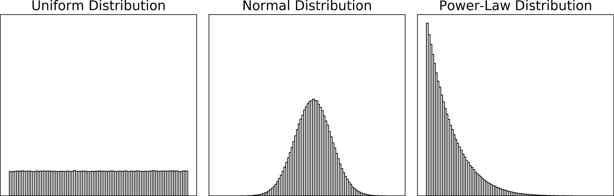

###### 图 2-10\. 绘制一百万次观察结果的直方图，来自均匀分布（左）、正态分布（中）和幂律分布（右）

## 社交互动带来的不确定性

另一个不确定性源于一个简单的事实，即我们是持续互动的社会动物。虽然这种互动已经持续了数十万年，但现代社交网络的互动爆炸使其变得更加显著和普遍。

第一种不确定性来源于我们与客户和员工的战略互动的性质，举两个例子。例如，对于客户保持的优惠，通常情况下客户理解我们的运作和动机，并最终操控我们的系统。同样，补偿方案通常由我们的销售主管操控，导致一些意外的结果，比如在目标已达成或不可能达成时的延迟销售。

但不确定性也可能来自非战略性和非常简单的决策规则。一个深入研究的例子是约翰·康威的生命游戏，它在二维网格中演变，如图 2-11 所示。⁸ 在任何给定时间，每个彩色像素只能与其直接邻居互动，从而产生三种可能的结果：它存活、死亡或繁殖。只有三个简单的互动规则，根据初始条件，你可以得到完全不同的结果，对于任何观察者来说看起来都是随机的。

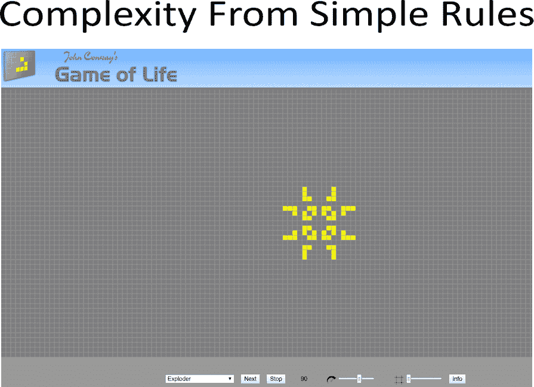

###### 图 2-11\. 约翰·康威的生命游戏：三条简单规则如何使每个细胞或像素与其邻居互动产生了大量集成现象

你可能会想这是否值得你的时间和注意力，或者这只是一种知识上的好奇心。首先，这应该作为一个警示，即即使行为的简单规则也能产生复杂的结果，所以我们确实不需要试图操纵我们系统的复杂消费者。但社会科学家们也一直在使用这些工具来理解人类行为，因此至少在我们进行业务决策时，它们应该是有用的。

## 无知带来的不确定性

最后的不确定性来源是纯粹的无知，因为很多时候当杠杆被拉动时，我们根本不知道会发生什么，也不清楚结果的可能分布。在这种情况下，最初常常假设结果遵循均匀分布或正态分布，后来通过某种形式的实验来改进我们的知识。

公司在组织层面扩展测试的能力可以在中长期内创造丰富的知识库，以创新和创造价值。但总会存在一个权衡：我们可能需要牺牲短期利润来换取中长期的价值和市场领导地位。这就是为什么我们需要我们组织中一种新型的分析决策者。

# 关键点

+   *分析思维* 是将业务问题识别并转化为规范解决方案的能力。

+   *价值是通过做决策创造的*：我们通过做出更好的决策为我们的公司创造价值。预测只是我们决策过程中所需的一个输入。

+   *决策分析阶段*：当我们分析决策时，通常有三个阶段：首先收集、理解和解释事实（描述性阶段）。然后我们可能希望预测感兴趣的结果。最后，我们选择拉动杠杆以获得最佳可能结果（规范性阶段）。

+   *规范性决策*：决策是在竞争性行动中选择以实现特定目标的行为。*数据驱动*的决策是根据证据采取行动来评估替代行动方案。*规范性*决策是选择产生最佳结果行动的科学。

+   *决策的解剖*：我们选择一个行动，可能会产生一个或多个影响我们业务结果的后果。由于通常我们不知道哪个后果会发生，这个选择是在不确定性条件下做出的。行动和后果之间的联系是通过因果关系调节的。

+   *从业务出发*：因为我们的目标是找到最佳行动方案，最好是为正确的问题优化。所以从业务出发。一个副作用是通常会扩大我们可用的杠杆菜单。

+   *和提出正确问题一样重要的是选择用于衡量我们决策影响的指标*：许多数据科学项目失败并非因为逻辑有问题，而是因为我们选择了错误的度量标准来衡量业务问题的影响。好的度量标准应该是相关的和可测量的。

+   *我们需要培养的一个重要技能是能够创建反事实情景*：因为因果关系调节了从行动到后果的映射，我们必须加强想象我们的行动为何导致业务目标的替代理论的能力。

+   *估计因果效应存在几个重要的困难*：选择偏见丛生，因此直接估计杠杆的因果效应通常是不可能的。我们还需要掌握反事实思维的使用以及处理异质效应。

# 进一步阅读

几乎每本关于数据科学或大数据的书都描述了描述性、预测性和规范性分析之间的区别。您可以查阅托马斯·达文波特的经典作品*《竞争分析》*或其续集（哈佛商业出版社），或比尔·施马尔佐的*《大数据：理解数据如何推动大企业》*或其前作和续集（约翰·威立出版社）。

此处使用的决策解剖遵循文献中的规范并且非常标准。我们将在第六章中回到这个话题，我会提供足够的参考文献。

我最喜欢的因果推理书籍包括约书亚·安格里斯特和约恩-斯特芬·皮施克的《几乎无害的计量经济学》（普林斯顿大学出版社）及其最新作品《掌握‘度量’：从因果到效果的路径》（普林斯顿大学出版社）。如果你感兴趣，可以在这里找到观察数据的数学推导，即不是通过设计良好的测试获得的数据的因果效应加选择偏差的平等性。他们还提出了从*观察数据*中识别因果关系的替代方法，即从没有经过良好设计测试的数据中。

从因果推理的一个显著不同方法可以在朱迪亚·珀尔和丹娜·麦肯齐的《因果之书：因果关系的新科学》（Basic Books）中找到。斯科特·坎宁安的《因果推断：混音带》则在这两种方法之间架起了一座重要的桥梁，主要聚焦于第一种文献（因果推断的计量经济学），但也专注于珀尔使用因果图和图表的方法，并在一章和几个段落中进行了探讨。在撰写本文时，这本书可以在[他的网站](https://oreil.ly/4FfDp)上免费下载。

我将在附录中提供许多关于 A/B 测试的参考资料。我对不确定性的讨论遵循了斯科特·E·佩奇的《模型思维者：让数据为你工作所需知道的内容》（Basic Books）中的许多想法。这是开始思考简化和建模的好地方，并提供了许多实际生活中出现的不同分布、复杂行为和网络效应的例子。

¹ 我们将在本章后面谈论设计实验或 A/B 测试。

² 公平地说，即使考虑到这种明显的损害，我们仍然是我们所知道的迄今为止最复杂的因果推理生物，远远超过了机器（因为在撰写本文时，它们完全缺乏这种能力，并且甚至不清楚这种能力何时可能实现或是否可以实现）。

³ 来源：GDP 数据来自[*https://oreil.ly/9J_wb*](https://oreil.ly/9J_wb)。CO[2]排放量来自[*https://oreil.ly/9J3XF*](https://oreil.ly/9J3XF)。离婚率来自[*https://oreil.ly/t_1x-*](https://oreil.ly/t_1x-)。

⁴ 今后我将使用术语“受治疗者”或“接受治疗者”来指代那些接受我们行动或杠杆作用的客户。这种行话在实验统计分析中很常见，最初是从医疗试验分析中借来的。

⁵ 在抛硬币的例子中，例如，在观察结果后，我们可能会将分布建模为伯努利试验，并预测一个理论推导的期望值（试验次数乘以头朝上的概率估计，比如）。

⁶ 正态分布在平均值附近的 2.57 个标准偏差内积累了 99%的可能结果，而在接近 3.3 个标准偏差内积累了 99.9%。

⁷ 在企业中发现的权力法分布的其他例子和应用可参见克劳福德，克里斯托弗·G.等人的文章，“权力法分布在企业家精神中的意义：对理论和研究的影响”，*《企业风险投资期刊》* 30 卷，第 5 期（2015 年 9 月）：696-713。[*https://oreil.ly/pSxTh*](https://oreil.ly/pSxTh)。

⁸ 你可以在[*https://playgameoflife.com*](https://playgameoflife.com)上“玩”这个游戏，并对简单确定性规则生成的丰富多样的结果感到惊叹。详见[*https://oreil.ly/6ruzw*](https://oreil.ly/6ruzw)。
