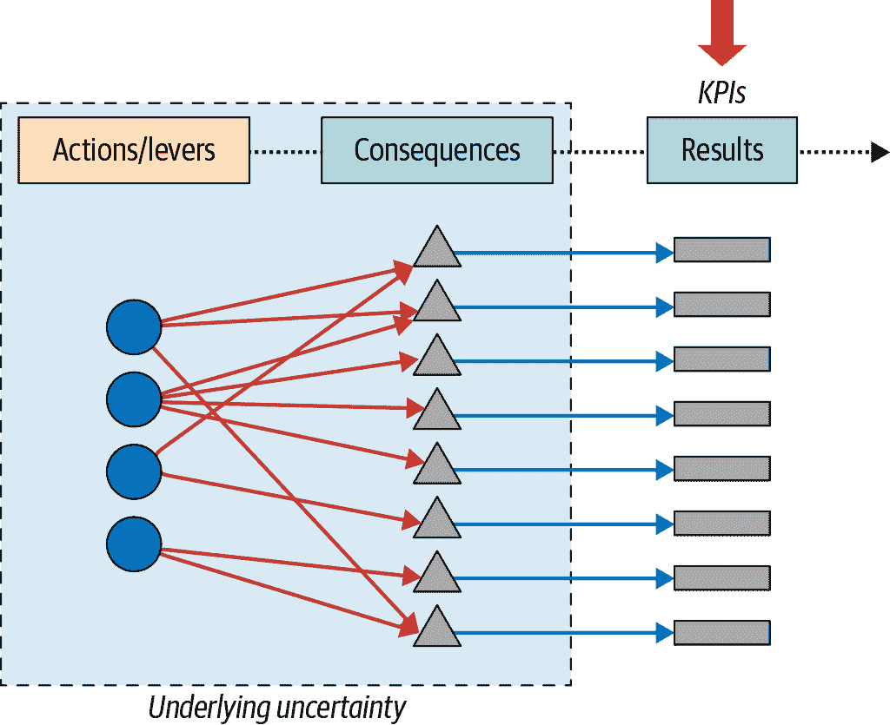
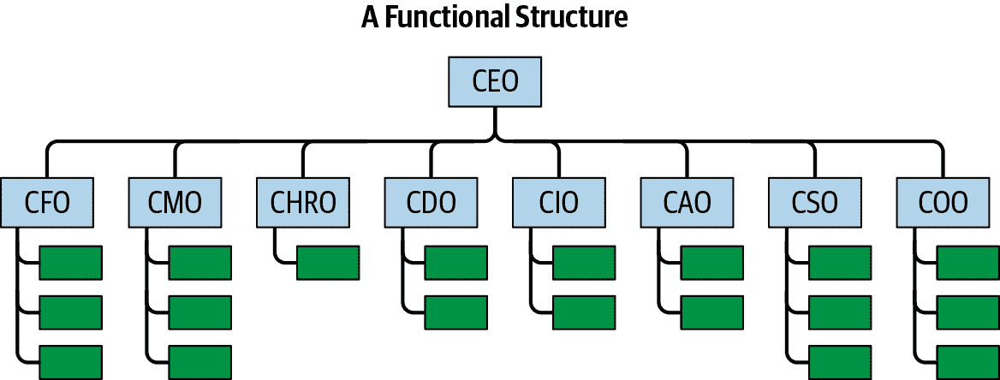
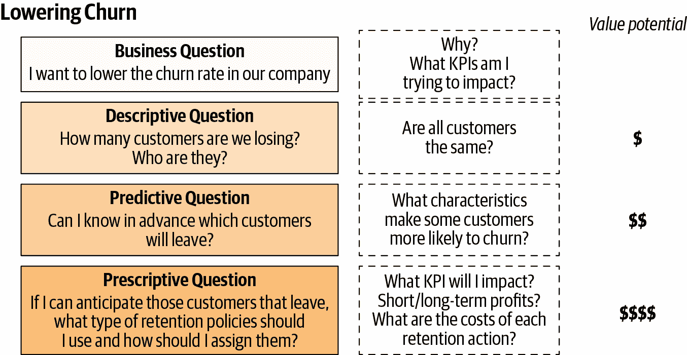
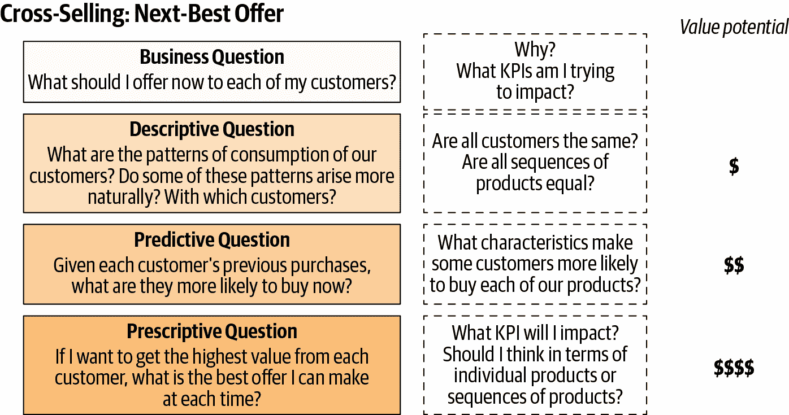
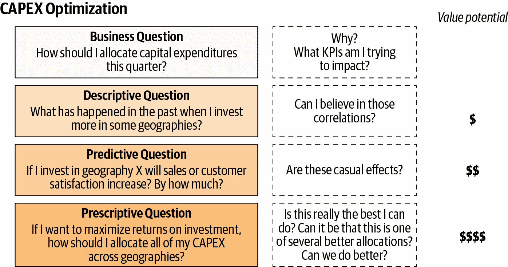
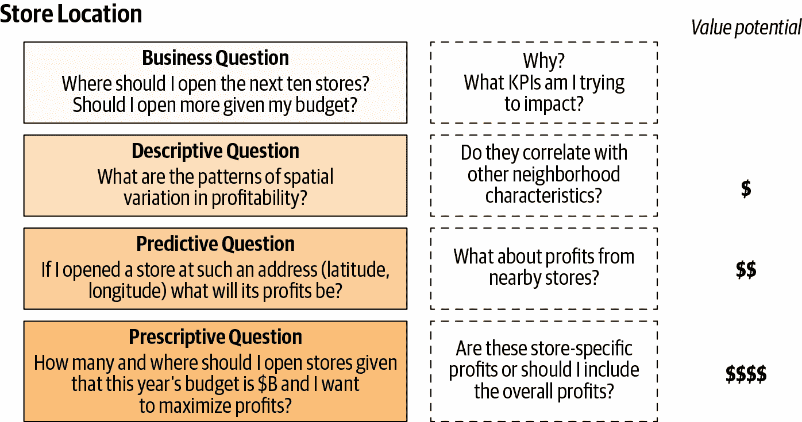
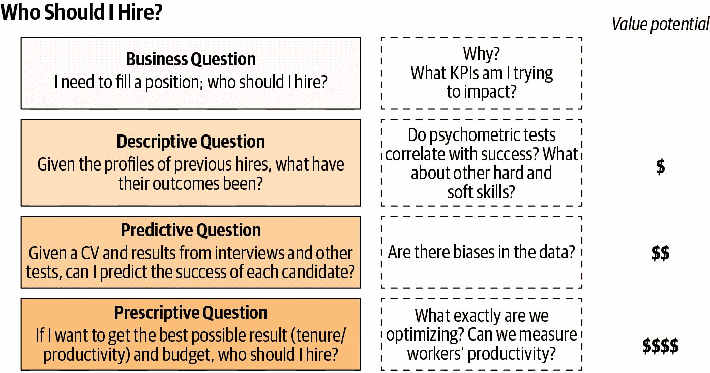
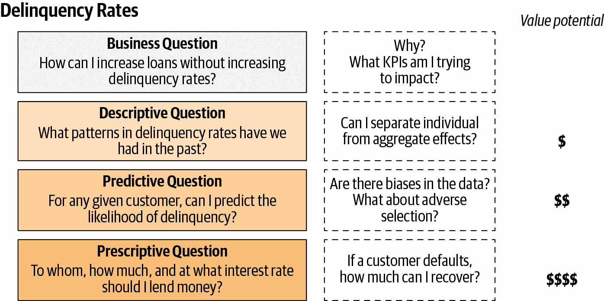
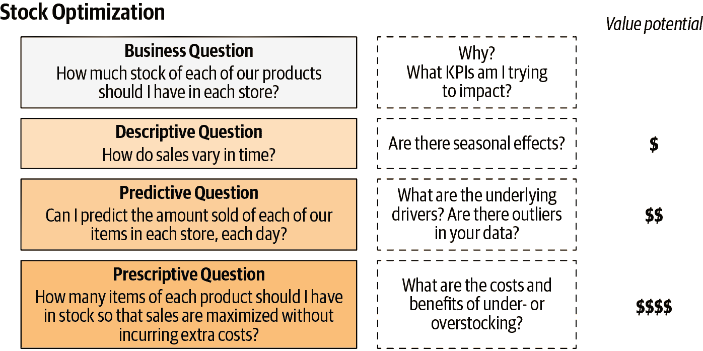
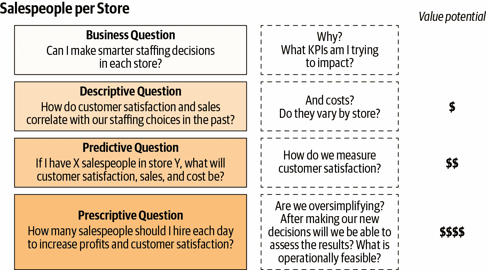

# 第三章：学习提出良好业务问题

第二章 提供了我们将在接下来的章节中开发的一般框架的快速概述。由于我们的最终目标是将业务问题转化为规范解决方案，我们应该开始学习如何提出*正确*的问题。我希望这不会让人感到惊讶，学习构建问题可能会产生与随后采用的技术相当的影响。

我们还介绍了一种非常简单的技术，我发现它非常有用，可以帮助我们了解我们真正想要实现的目标：*为什么*问题的顺序。您从质疑您认为自己正在努力实现的目标开始，然后向上移动一级，或者在确信业务目标实际上正是正确的情况下停止。在我们寻找规范解决方案的过程中，确保我们正在解决正确的目标是至关重要的。在第四章中，这将是一个非常有用的好处，因为这通常会扩大我们可以采取的行动或杠杆的范围。当我们开始质疑一个行动并且过程最终带我们到我们真正想影响的指标时，通常会发生这种情况。然后，几乎自然地，我们会质疑是否有其他行动可以用来影响相同的目标。

在本章中，我们将更深入地探讨提出良好业务问题的一些最佳实践；理解描述性、预测性和规范性问题之间的区别；最后，我们将提供一些来自常见用例的示例。这些示例来自我的经验，来自我与课堂上的学生和同事讨论的其他用例，因为它们在介绍和理解方法时非常有用。但首先，我们应该更好地理解业务问题从哪里来（图 3-1）。

###### 图 3-1。从业务开始

# 从业务目标到业务问题

大多数公司通过明确分隔每个区域的责任和目标来垂直组织（图 3-2）。然而，在过去的几年中，*敏捷*运动帮助许多公司打破了职能孤岛，组织成跨职能团队。结果是每个团队都有非常明确的业务目标和要追求的指标。¹

###### 图 3-2。一个按职能划分的公司示例——从左到右，缩写对应于财务、市场营销、人力资源、数据、信息、分析、销售和运营的首席官员，以及许多其他类似的缩写

对我们来说，这是个好消息，因为我们的自上而下的业务目标通常定义得很明确，而且据说用适当的 KPI 评估起来相对容易。然而，我们的任务是提出必要的业务问题来实现这些目标。一般来说，对于任何业务目标，都可以提出多个业务问题，而每个问题都有不同的行动或杠杆可用。

我们如何制定良好的业务问题？因为对于我们的目的来说，一个业务问题总是*可操作的*，首先需要理解我们想要影响的业务目标以及用于评估结果的度量标准，并至少对我们可以推动的一些候选杠杆有一些想法。如果你没有确定可以采取的任何行动，要么这个问题就不可操作，要么你还没有深思熟虑这个问题。否则，我们就在正确的轨道上了。现在我们需要区分描述性、预测性和规范性问题。

# 描述性、预测性和规范性问题

在他们的文章[“问题是什么？”](https://oreil.ly/xcPM7)中，杰夫·利克（Jeff Leek）和罗杰·彭（Roger Peng）描述了六种可能需要用数据回答的问题类型：描述性、探索性、推断性、预测性、因果性和机械性。数据分析通常反映了我们的分析过程，因此这些问题与本章使用的三重分类：描述性、预测性和规范性，有些相当对应。

在第二章中，我描述了三种类型的分析，所以这里我只会重复一下*描述性*分析通常关注过去，*预测性*关注未来，而*规范性*则找到我们今天可以采取的最佳行动来改变未来。

书写这本书的动机之一是偶然发现大多数人倾向于提出描述性问题，并且很难找到正确的位置来使用预测性和规范性分析。本章后面，我会提供足够的例子来消除您对这些概念仍然可能存在的任何困惑。

# 总是从业务问题出发，逆向思考

在数据世界中，一个首选的流行语是从业者通过找到*可操作的见解*来创造价值。虽然这种说法没有错，但是有可能会花费数小时、数天或数周来寻找百万美元的见解。

在我的职业生涯中的某个时刻，我做了类似的事情：我发现看不太可能发生的不同分布的尾部是相对容易的，并且在这些微段中找到未曾发现的商业机会。由于大多数模型侧重于平均客户（从而忽略了尾部），这是帮助我的雇主赚钱的一个相对直接的方法。这就是低悬果实的定义。然而，有两个问题：它不可扩展，并且是一个高度手动和时间昂贵的过程。

一般来说，更好的做法是始终从业务问题开始，然后向数据后退。这个过程可以带来更快的可操作见解，因为你从一开始就已经着眼于你想要找到的可操作见解！² 本书描述的过程将帮助你收紧和完善分析，希望你不要浪费自己或团队宝贵的时间寻找承诺的可操作见解。

# 进一步分解业务问题

通过*为什么*问题的顺序，我们可以从具体问题逐步转向更一般的问题，以寻找真正想要影响的度量标准。风险在于，这个最终度量标准可能过于一般化而无法实施（最高级别几乎总是像“增加利润”）。然而，我们应该记住，我们自己的业务目标作为自然约束存在，因此在序列中通常存在一个上限。此外，还有一些技术可以让我们做相反的事情，即从分解问题开始，以便找到清晰识别中间目标的正确级别，这些中间目标也是可操作的。

例如，考虑寻找最佳行动以实现出站营销活动的最高转化率的问题。请注意，我已经有意地将问题框定为规定性问题：业务度量标准已经定义良好（转化率），如果我们找到合适的行动，我们可以（原则上）选择最适合我们目的的行动。

转化率具有可以简单分解的特性，因此我们将立即看到更直接可操作的问题。在这种情况下，转化率（CR）是三种不同比率的乘积，每种比率都有不同的操纵杆，可能有不同的责任。³ 从最右边的比率（C）开始，如果在 100 个潜在客户中，你只尝试通过拨打他们的电话号码联系 15 个，这可能意味着你的电话营销团队处于低生产力谷值，你最好与他们的经理交流，找出行动或至少了解发生了什么。

同样地，如果你已经拨通了每一个电话号码，但只能接触到其中的少数（B），你可能需要寻找能够预测最佳联系时间的变量：这现在可能是你公司数据科学家分配的工作。

最后，如果你的销售团队只能将接触到的一小部分人转化为客户（A），可能是预测模型需要改进以生成更高质量的潜在客户，你的报酬计划需要调整，或者你的产品市场适应性尚未达到预期。

注意分解后如何立即找到中间度量标准或问题，以及它们对应的行动，以提高转化率。这个技巧可以轻松应用于大多数转化漏斗。让我们以一个典型的*双边平台*为例。

## 双边平台的示例

两面平台，或者市场，通常试图将一方的用户与另一方的用户匹配起来。例如，Facebook 会将希望投放广告（以增加销量）的公司与社交网络的合适客户（用户）匹配起来。亚马逊尝试将商品的分销商或卖家与合适的买家匹配起来，Uber 将司机与乘客匹配起来，等等。

想象一下你启动自己的约会平台。这里的两个方面是想要找到他们完美匹配的用户。大多数这些约会应用程序允许用户互相沟通。为了简单起见，假设游戏规则只允许每个用户发送一条消息；更一般的情况会使分解更加复杂。

在交换消息之后，如果用户彼此喜欢，他们可以去另一个地方（咖啡店、酒吧或餐厅）。您的数据科学团队希望提高应用程序的匹配效率，该效率通过转化匹配的比例来衡量。为了论证的方便，假设用户始终向应用程序提供反馈，以便我们始终可以知道两个用户是否相遇。⁴

我们有一个包含所有用户、他们的互动（消息 1 和消息 2）以及最终结果（满足或不满足）的数据集。匹配效率（ME）可以分解如下：

在这个方程中，每个术语表示每个事件发生的次数。例如，*Met*表示最终相遇的人数，*Message1*和*Message2*分别表示发送的第一条消息和回复的数量。每个比率应该小于一，因为分子中的数字是分母中事件的子集的计数。这在分解转化漏斗时总是成立的。

注意分解告诉我们的内容：如果我们希望用户进行匹配，我们需要他们交换消息，这可以用三个比率来表示：一旦用户在应用程序上找到显示的某人，他们可以发送第一条消息（消息 1）。这个比率（C）显示算法从用户 1 的角度看是否有效：如果应用程序显示了 10 个高质量的候选人，那么他们将向所有候选人发送消息。⁵ 现在用户 2 可能会回复，也可能不会：如果他们回复了，这可能表明算法对他们也做了一个好的工作（B）。最后，在第二条消息送出后，这两个人要么相遇，要么不相遇（A）。

但并不是一切都取决于算法的准确性。开始对话（Message1）或回复（Message2）的决定还取决于每个用户的注意力，例如由于沟通延迟而导致：约会应用程序是快节奏平台，因此如果任何用户花费过长时间才回复，另一方可能会失去兴趣并继续寻找潜在的约会对象。因此，我们可以制定方法来激励更快的沟通（电子邮件、推送通知或弹出窗口提醒用户有人正在等待回复）。例如，Bumble 就是这样做的：每一方的初始联系必须在前 24 小时内完成，否则匹配就会丢失。

这里的要点是，一些业务问题可以进一步分解以找到正确的行动方案，因此我们可能需要重新考虑干预关键绩效指标以实现我们的目标。我们现在将通过一些现实生活中常见的用例进行介绍。

# 学习提出业务问题：来自常见用例的示例

我们现在将选择一些例子进行讨论，从我看到的标准方式开始提出业务问题，然后提出相应的描述性、预测性和指导性对应方案。请记住，一个好的指导性问题应该总是找到方法来推动某些杠杆，以便在我们选择的业务目标方面取得最佳可能的结果。我将在随后的章节中进一步开发其中一些例子，直至提供我认为是足够好的指导性解决方案为止；我将让你找到改进这一点的方法。现在，请记住，本章的目的只是学习如何翻译业务问题。

## 降低客户流失

在所有公司中，我们需要客户以产生收入。我们首先是*获取*客户，然后我们的一部分工作是尽可能长时间地保持他们的忠诚。客户流失率—即在固定时间内失去的客户数量与同一时期内总客户基数的比率。由于获取成本可能相对于保留成本来说较大，大多数公司都设有专门的部门，其特定目标是尽可能保护其当前客户群体。

大多数公司中的一个标准用例，因此它提供了一个很好的开始应用这些技术的途径（图 3-3）。

###### 图 3-3\. 客户流失案例的不同问题

### 确定业务问题

让我们从大多数公司面临的业务问题开始：我们如何降低客户流失率？这是一个例子，我们从一个行动开始，而不是从业务目标开始，所以我们可以应用一系列*为什么*问题，最有可能我们最终会得出这样一个简单的事实：客户是我们重复收入的主要来源。这看起来很直接，但这个简单的事实带领我们去关注我们想要最大化的主要关键绩效指标：我们想要的不是尽可能降低流失率，而是希望收入高。或者呢？你总是可以放弃一切来留住客户，从而增加你的成本。因此，这也不是我们想要影响的正确指标：它是利润，即收入与保留成本之间的差额。

### 描述性问题

在最具描述性的层面上，我们想要做几件事情。当然，我们首先要问的是我们的流失率是否异常高，以及它过去的发展情况如何。我们可能会从最综合的层面开始，通过查看时间趋势和季节性模式的模式来了解我们当前的健康状况。但数据有能力深入挖掘告诉我们已经离开的客户是*谁*。他们是高价值还是低价值客户？他们与我们的关系有多久了？他们过去是否联系过我们表达他们的不满？他们是否地理位置在特定地区？他们的社会人口特征如年龄和性别是什么？他们的使用或消费模式是什么样的？

我们可以根据我们的数据和时间来进行细化。但你已经理解了我的意思：这只是一个快照，希望到目前为止我已经说服了你，无论它多么高清晰，很难从中获得更多的价值。到目前为止，这主要是信息性的。这种描述性分析的真正价值在于它能够帮助我们在追求我们能做出的最佳决策方面走得更远，以实现我们的最终目标。

### 预测性问题

AI 和机器学习可以帮助我们找到预测问题的答案：我们能预测哪些客户更有可能离开吗？由于我们的描述性分析的丰富性，我们现在希望找到一些解释当前流失率的主要驱动因素。但单靠数据是无法帮助我们走得更远的。最优秀的数据科学家是那些能够*理解*和*假设*为什么客户会离开的人。通过这种方式，他们可以在称为*特征工程*的过程中创建更具体的预测器，这是获得真正强大预测能力的最佳方式。知道在我们的模型中包含什么或不包含什么是构建良好模型的圣杯，甚至比选择越来越强大的可用算法更为重要。

预测阶段提供了多少价值？在图 3-3 中，我认为它的价值高于描述性步骤的价值，但它可能为零，甚至可能是负的，正如在第二章中所讨论的那样。

### 规定性问题

最后，我们来到了规定性问题：如果我们想要从我们的留存活动中最大化利润，我们应该拉动哪些杠杆？但我们是否考虑*短期利润*？客户是否会了解我们的策略并开始操纵我们的留存系统，从而增加长期成本？大多数成熟公司更愿意使用我们在第二章中介绍的客户生命周期价值（CLV），我同意这确实更能反映我们客户的长期净价值。但这种度量选择也带来了一系列困难：引用 Yogi Berra 的话，未来难以预测，更难理解我们行动的长期影响。

我们将在第四章中讨论杠杆，但在这里可以说的是，对于客户留存的情况，我们总是可以以折扣的形式提供一些东西。那么，对于每个客户来说，什么才是合适的折扣？CLV 提供了我们应该合理给出多少的上限，但我们总是希望找到成本最低且保证留存的行动。这使我们更接近杠杆的个性化。

理想的规定性是我们在*正确*的时间为*正确*的客户选择*正确*的行动。*正确的东西*太多了：规定性分析很难，所以大多数时候我们会尝试简化问题。我会在第五章中讨论简化的力量。但至少我们已经按设计方式提出了可能产生最高可实现价值的问题。请记住，本章是关于学习如何提出问题的。在第七章中，我将详细介绍一种解决此用例的可能方案。

## 跨销售：次佳优惠

大多数公司销售多种产品或提供多种服务。经济学家称公司在提供可以从类似生产过程中获益的产品时可能具有的自然优势为*规模经济*。因此，大多数人寻求通过尝试进行跨销售来加深与客户的关系是合乎逻辑的。在咨询行话中，它已被重新标注为现在著名的*次佳优惠*，这已经将我们带入了规定性的领域。尽管如此，我们现在将看到，优化的业务目标并不明显。

###### 图 3-4\. 跨销售案例的不同问题

### 定义业务问题

这里的业务问题很简单（图 3-4）：*我应该现在向我的客户提供什么？* 如果您想知道为什么会想做这样的事情（为什么问题的顺序），答案与客户流失不那么清晰。这里的区别在于交叉销售有两种影响。直接影响是更高的收入和利润的通常渠道。但间接渠道更有趣和复杂：购买更多产品的客户往往更忠诚，从而增加他们保持我们客户的时间。因此，有时我们可能会考虑以折扣价格交叉销售，即使对公司来说某个单独产品的交易是亏损的，因为长期的*整体*利润更高。再次出现的是，CLV 是优化的正确指标。

### 描述性问题

在描述性的领域中，通常探索的问题类型是不同客户消费模式的模式，例如产品的消费模式。具体来说，自然而然地探索不同客户是否更自然地出现某些*产品序列*。例如银行，大多数客户从年轻时期开始，使用比较简单的产品如信用卡。随着时间的推移，随着他们的收入随着工作经验的增加而增加，他们倾向于转向更复杂的信用和投资机会：您可能首先申请抵押贷款，再转向寿险等等。对于序列而言，每个产品购买的顺序都很重要，因此首先查找数据中的这些模式是标准的做法。

### 预测性问题

由于每个客户已经购买了某些东西，询问我们是否可以根据他们迄今为止的消费模式*预测*他们最有可能购买什么是很自然的。然后我们可以主动行动，而不是等待看看他们是否与我们或我们的竞争对手购买。但是，我们应该提供对我们利润最大的产品，即使它极有可能不会被购买吗？回到银行的例子，您可能希望客户申请抵押贷款（因为它的回报很高），但对于大学生和年轻专业人士来说，他们可能不太可能接受这样的提议。这将我们带到下一个最佳报价分析中最有趣的权衡之一：购买可能性与价值增长之间的权衡。这反过来又引出了规定性问题。

### 规定性问题

由于我们可以向每个客户提供多种物品，那么我们应该选择哪一种以捕获最高价值？如前所述，由于我们正在处理序列和时间，正确的度量标准很可能是 CLV。从真正以客户为中心的意义上讲，规定性理想将再次引导我们找到*合适*的产品，为*合适*的客户，以*合适*的价格和*合适*的时间。稍后，我们将看到一种解决这个非常复杂问题的方法。

## CAPEX 优化

汽车，石油和天然气，电信和航空业是资本密集型的行业的示例：为了运营，它们需要将大量资源配置到建设和维护工厂和设备，塔，飞机和任何其他随时间减值的实物资产。这种类型的投资被称为资本支出，或 CAPEX，适用于所有行业，不仅仅是前面提到的四个行业。⁶

任何一家公司的首席财务官和其他高管问题之一是如何分配 CAPEX，比如，跨各功能领域或地理位置（图 3-5）。由于它可能代表公司现金流的大部分，我们甚至有特定的关键绩效指标来衡量其影响，如投资回报率（ROI）或资本雇用回报率（ROCE）。尽管如此，我们总是应该继续质疑为什么我们需要分配 CAPEX 以及我们究竟是在努力实现什么目标：例如，ROI 分子的收入来自哪里？

###### 图 3-5。CAPEX 优化案例的不同问题

在描述性水平上，我们可以从找到不同地理位置的不同 CAPEX 配置和收入之间的相关性开始。这利用了先前投资的变化与我们认为会受到影响的关键指标。另一个可能性是利用时间的变化，绘制聚合系列以寻找 CAPEX 配置和收入之间的任何初步关系线索。如果我们找不到这样的证据，我们可以改变我们的目标，考虑利润的变化，因为 CAPEX 也可能旨在降低成本。

在考虑任何投资时，我们面临的主要问题是*我们不知道*回报将是多少，因此如果我们能够完美地预测它们将是多么好。最佳分配可能只是一个排名的问题：如果我有一美元要投资，并且知道所有候选配置的回报，我会将其放在回报最高的一个上。但我们能信任描述性分析中的相关性吗？我们找到的效果确实是因果关系吗？像往常一样，难点在于找到可靠的因果预测，这就是我们的数据科学家将尝试通过使用他们的机器学习工具包找到的东西。

假定我们已经做到了可靠且准确的预测，那么规定性部分几乎已经为我们完成了：按照它们的回报排名，在不同地理位置上对预算进行分配。稍后我将向您展示一个如何做到这一点的例子，但现在我们唯一需要学习的是提出问题的框架。

## 门店位置

我最喜欢的一个应用案例是在哪里开设店铺，而且既然我们已经讨论了资本支出的优化，我们立即可以看到这只是同一个问题的一个实例。我们有一个预算来增强我们的商业存在，理想情况下，我们只会在能够获得最大可能回报的地方开设店铺（图 3-6）。一个自然的关键绩效指标是店铺利润的净现值（NPV），或者是吗？

仅仅为了展示问题的复杂性，考虑一下开设一个已经非常接近另一个门店的店铺（你是否曾经想过为什么某个具体街区或社区会有这么多星巴克？）。你可能会获得额外的收入和利润，但却会以附近店铺的利润为代价。因此，更可靠的关键绩效指标可能是利润的总体水平，至少在地方（如社区、街道，甚至城市）水平上是这样。

###### 图 3-6\. 在选择开设新店铺的情况下的不同问题

描述性地说，我会首先寻找不同空间位置利润变化模式的规律：我们附近是否有我们自己的门店？竞争对手呢？我们是否有数据来估算不同门店潜在顾客的数量？附近居民的平均收入如何？这是一个住宅区吗？为了找到解释利润变化的规律，我们可能会提出许多问题。

就像资本支出分配一样，如果我们能够完美预测整体利润的净现值（NPV），那么我们几乎可以做到事半功倍：将预算全部分配给按照这个关键绩效指标排名的门店开设。当然，这里假设你有一个有限的预算，并且不会投资于开设有负回报的门店。

## 我应该雇佣谁？

我们可以毫不夸张地说，我们的员工决定了公司是伟大还是不伟大。因此，我们不断做出的最重要决策之一是选择谁来雇佣。人力资源部门在建立健全可靠的招聘流程方面投入了大量精力（图 3-7）。我们在招聘中面临的主要问题是，有些关键绩效指标可能不那么容易测量。例如，考虑到生产力。如果你是销售人员，我们可以通过一定期间内的销售数量清楚地衡量你的个人生产力。但对于许多其他职位来说，衡量生产力甚至是员工对收入的影响都更为困难。

###### 图 3-7\. 在招聘决策案例中的不同问题

假设我们能像我们的销售团队一样可靠地衡量生产力。这是唯一重要的关键绩效指标吗？员工工龄如何？如果一位超级销售员工一个月后就离职，也许你不想雇佣她，因为她的销售业绩可能无法弥补招聘和培训成本。理想情况下，我们希望衡量类似于客户生命周期价值的指标，因此让我们使用类似的术语——员工生命周期价值：即对利润个体贡献的净现值。这样我们就可以包括预期持续时间和财务影响。

让我们想象我们有过去 24 个月所有销售人员的数据集。与客户流失一样，我们的数据集需要包括不同工龄的在职员工以及已离职员工。这种变化使我们能够开始找到模式。最好还包括一些他们的硬性能指标（月销售额）和软性指标，如他们的 360 度调查结果。最后，有些实际招聘时获取的数据也很重要：他们的简历、教育、以往经验、心理测验结果、性别、年龄等等。然后我们可以在数据中寻找相关性，以了解可能预测绩效的变量类型。

预测问题很简单：凭借那些预先收集的信息——在做出招聘决策之前收集到的一切——我们能预测候选人的表现吗？如果可以，这个问题至少是可以解决的，但与此前一样，问题也很复杂。这里的主要问题与所有搜索问题相关（考虑寻找重要他人的问题）：我们应该继续寻找新的候选人吗？这是我们能找到的最佳选择吗？如果我们再多搜索一个月，我们能找到更好的人选吗？稍后我们将讨论*探索-利用*的权衡，这是大多数搜索问题中常见的问题，但现在请注意，我们可以选择要么招聘并得到新员工的最佳表现——这是利用的部分，当然不涉及劳动剥削——或者我们继续探索市场，寻找更好的候选人。

在像这样的问题中使用人工智能时的最后一个警告是，我们的预测算法对数据中的偏见非常敏感，我们的数据科学家应该费心去寻找这些偏见，并试图找到纠正它们的方法。想象一下，你的数据集显示大多数女性销售人员非常有生产力，但一个月后就离职了。你的预测模型可能最终显示，女性的员工生命周期价值显著较低，而你最终可能会雇佣大多数男性候选人。但是为什么女性会这么快地离开呢？难道是我们公司有一个非常歧视女性的经理吗？我们应该先解雇这个人，然后再雇用更多女性。这里的道德是，除非我们尽可能地去除数据中的偏见，否则我们的预测模型将非常不完善：正如数据世界中所说的那样，“垃圾进，垃圾出”。

## 逾期率

许多公司提供为客户购买提供融资的方式，例如，通过大型零售商最常见的店内信用卡。如果我们能把这项工作留给专业公司（银行）就更好了，但很多时候我们自己来资助。业务问题是如何提供贷款而不增加违约率（Figure 3-8）。

###### 图 3-8\. 在贷款决策案例中的不同问题

描述性问题与我们已经讨论过的案例类似，但让我强调两个观点：如果您正确定义了业务问题并将其框定为规定性问题，您应该寻找数据中指导该目标的模式，而不是反过来。此外，我们应该尝试利用问题底层特征的变化来预测我们关心的结果。因此，我会寻找地理和客户之间的变化，并将它们与违约率和违约结果相关联，以建立预测问题：我们能预测客户是否会违约吗？如果他们这样做，我们是否可以通过激进的收款策略回收部分金额？

我们稍后会更详细地讨论伦理问题，但再次强调，提到我们数据中的偏见如何普遍地影响我们想要追求的结果是很重要的。在贷款方面，我们应该小心，不要因为我们过去的贷款方式而伤害到少数群体。

为了设置规定性问题，从我们希望影响的度量开始：不是客户是否违约（他们的违约概率），而是贷款的预期收益减去成本。稍后我们将大量处理预期值，但现在可以说，要对所有规定性问题进行公式化并提供答案，我们需要清楚地了解我们行动的成本和收益。我们的杠杆是什么？我们肯定能确定贷款金额，当然也能决定是否放贷。银行还可以设定和调整利率，但由于监管问题，其他公司可能无法使用这个杠杆。

## 库存或存货优化

大多数公司面临的一个非常普遍的问题是每个店铺的库存应该有多少单位的每种产品。同样地，银行不断决定他们的 ATM 机上应该有多少现金。这次我们从后往前开始，从规定性问题开始讨论（Figure 3-9）。

###### 图 3-9\. 在库存优化案例中的不同问题

要考虑过量或不足某一特定物品的成本与收益。在某个层面上，如果单位不足，我们将阻碍当天的销售，因此成本是减少的收入。不足还可能增加运输和物流成本，这些成本可能足够大，可以包括在我们的分析中。那么过量呢？这些物品的价值可能会降低的概率有一些，不论是由于折旧、管理不善或盗窃的风险，还是因为明天可能会出现新的更好的选择，而旧货物将没有需求。

在规定阶段，我们希望找到合适的每种物品数量，以最小化这些成本的*预期*总和。稍后我将深入探讨如何实现这一目标的细节。问题的基本不确定性是什么？我们将在预测阶段使用 AI 来帮助我们处理它。

首先，我们不知道每种产品将销售多少单位。如果每天我们总是卖出相同数量的产品，比如 100 个单位，至少我们应该始终有这 100 个单位。一个不满意的客户不仅代表当前失去的销售机会，而且可能还有未来的许多机会：他们及其熟人可能不会再回到店里，所以希望他们不是一个有影响力的人！因此，我们应该从预测一个固定时间段内的需求开始。但那个时间段是什么？一天？一周？这取决于所有其他成本：如果与盗窃或折旧等其他风险相比，运输成本便宜，那么明天可以毫无问题地再次进货（例如 ATM 的情况）。否则，您可能需要预测这些事件发生的可能性。再次，我们处于预期价值的领域，这是一个稍后章节将讨论的主题，但正如您所见，优化可能非常困难。

现在我们可以指导描述性分析：销售如何随时间和地理位置变化？是否存在季节效应？盗窃和抢劫又如何？如果您的物品是耐用品（汽车、冰箱、手机、笔记本电脑或类似物品），它们的价值随时间如何下降？您现在可以看到全貌了。

## 店铺人员配置

我们最后的例子涉及到在店铺选择销售人员数量的问题（见图 3-10）。从某种意义上说，这是与库存问题类似的问题：过量或不足人员的成本与收益是什么？

###### 图 3-10。人员配置决策案例的不同问题

如果我们没有足够的人手，我们肯定会有更低的收入：那些等待时间长的顾客会离开商店并从竞争对手购买。或者他们会留下并购买今天，但他们较低的满意度可能会导致更高的顾客流失，影响我们未来的收入。另一方面，过多的员工会产生不必要和可预见的成本。因此，预期利润——销售收入减去人员成本——似乎是一个合理的 KPI 来优化。顾客流失的影响可能太大了，因此让我们从试图找到我们商店中销售人员的合适数量开始，以便在一天内获得可能的最高预期利润。如果我们解决了这个已经困难的问题，我们可以继续优化更长期的版本（回想一下简化的价值）。

我们需要了解哪些信息才能解决这个问题？如果没有潜在的不确定性，我们将如何进行？理想情况下，我希望知道每天在我们的商店中任意时间内来访客户的数量，比如每小时或 30 分钟的时间段。我们将需要预测每个商店的客流量。这将自然地导致根据销售人员规模来确定等待时间。现在我们可能需要决定什么是合理的等待时间，因为没有等待时间的极限可能会太昂贵，特别是在高峰时段我们有很多顾客和低谷时我们似乎有过多的员工的情况下。等待时间今天影响我们的利润。

那么，在数据中我们应该寻找什么呢？需求和人员配置在各个门店之间的变化是我们需要利用的，但我们还应考虑我们想要预测的结果：销售额、利润、等待时间和顾客满意度是立即浮现的四个因素。描述阶段应该设置为搜索这些相关性。

# 关键要点

+   *业务目标通常已经定义*：但我们必须学会提出正确的业务问题以实现这些目标。

+   *始终从业务目标开始并向后移动*：对于您正在计划或已经做出的任何决策，考虑您想要实现的业务目标。然后您可以向后推导，找出可能的杠杆和它们如何产生影响业务的后果。

+   *为什么*问题的序列可以帮助定义您想要实现的正确业务目标：这种自下而上的方法通常有助于确定业务目标并扩大我们可以采取的行动集合。但有时您也可以使用类似于转化率分解的自上而下方法。

+   *描述性、预测性和指导性问题*：描述性问题涉及业务目标的当前状态；预测性问题涉及其未来状态。指导性问题帮助我们选择达到最佳未来场景的正确杠杆。

# 进一步阅读

我在决策背景下，尚未找到任何关于如何提出*好的*商业问题的书籍。这并不意味着我是第一个建议我们如何框定业务问题可以对结果产生重大影响的从业者。几乎所有关于数据科学方法论的书籍至少会提到这个主题。您可以查看第一章的参考资料，或查阅 Foster Provost 和 Tom Fawcett 的*Data Science for Business*（O'Reilly）。

在我看来，文献至少存在两个缺点：大多数数据科学家很少关心解决规定问题，而更愿意专注于提供高质量的预测解决方案。此外，针对业务人员的文献尚未能够提供可以利用 AI 和分析思维解决的决策问题的端到端视图。

这里涵盖的几个用例可能可以在其他地方找到，但我不确定详细程度。您可以搜索咨询公司撰写的白皮书，它们可能提供一些有趣的见解（当然，咨询公司通过开发这些用例赚钱，所以不要期望得到太多细节）。

在双边平台上，我喜欢阅读 Geoffrey G. Parker、Marshall W. Van Alstyne 和 Sangeet Paul Choudary 的*Platform Revolution: How Networked Markets Are Transforming the Economy and How to Make Them Work for You*（W. W. Norton & Company），以及 David S. Evans 和 Richard Schmalensee 的*Matchmakers: The New Economics of Multisided Platforms*（Harvard Business Press）。

机器学习中的伦理问题是一个重要的话题，我将在第 6 和第八章中提供参考资料。

¹ 关于不同的组织结构，请参阅[*https://oreil.ly/T1MzW*](https://oreil.ly/T1MzW)或[*https://oreil.ly/EOa_D*](https://oreil.ly/EOa_D)。

² Google 首席决策科学家 Cassie Kozyrkov 在[“从不以假设开始”](https://oreil.ly/iMeVy)和[“优秀决策者的第一步”](https://oreil.ly/uw7bO)中提出了类似的观点。

³ 万一您没有注意到，我正在用相同的度量单位进行乘除，以保证等式始终保持不变。

⁴ 一些约会应用程序实际上鼓励用户提供这种正式反馈，但有时也有间接的方法来衡量匹配效率。

⁵ 这并不意味着没有不同的策略：用户可以开始仅向显示的顶级候选人发送消息，然后看看结果如何。在这种意义上，您可能希望将分析限制在排除最后比率的分解中。

⁶ 与操作支出（OPEX）相比较，后者包括诸多内容，其中包括支付给员工的工资。

⁷ 请回忆起<math alttext="upper R upper O upper I equals StartFraction Income from Investment hyphen Cost of Investment Over Cost of Investment EndFraction"><mrow><mi>R</mi> <mi>O</mi> <mi>I</mi> <mo>=</mo> <mfrac><mrow><mtext>Income</mtext><mtext>from</mtext><mtext>Investment</mtext><mtext>-</mtext><mtext>Cost</mtext><mtext>of</mtext><mtext>Investment</mtext></mrow> <mrow><mtext>Cost</mtext><mtext>of</mtext><mtext>Investment</mtext></mrow></mfrac></mrow></math>
