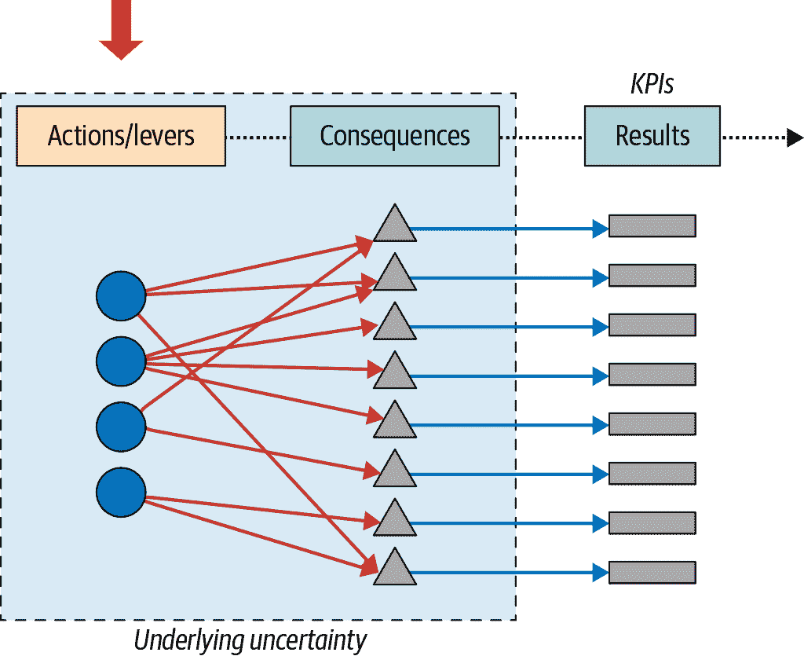
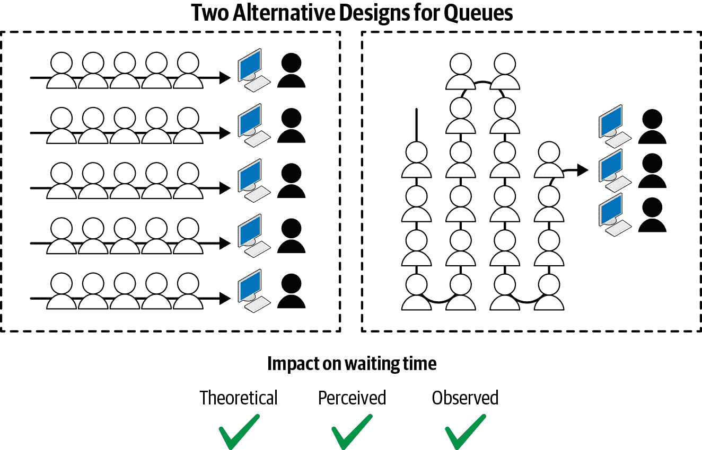
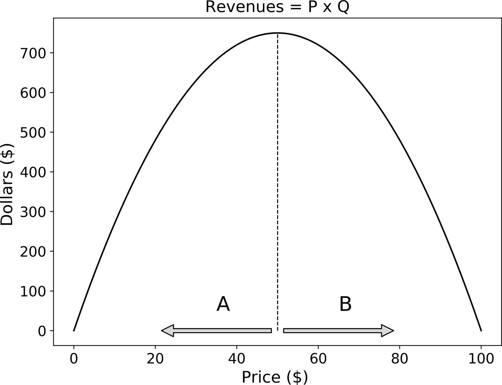
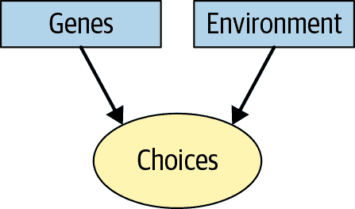
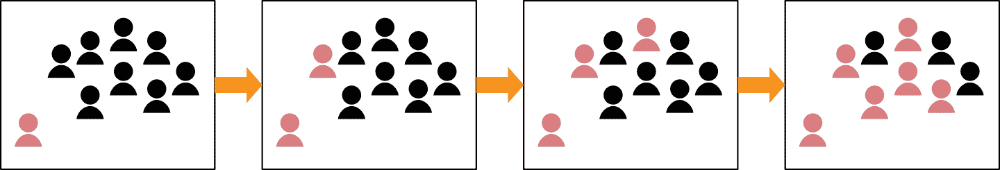
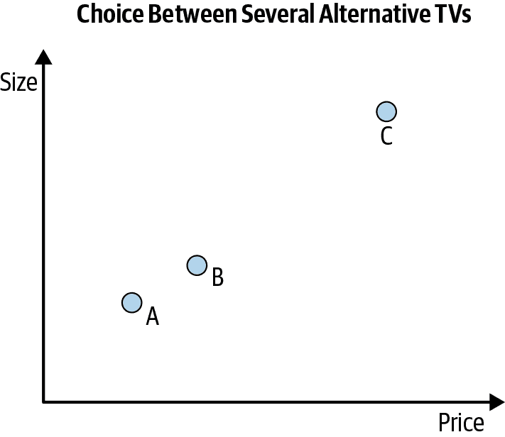
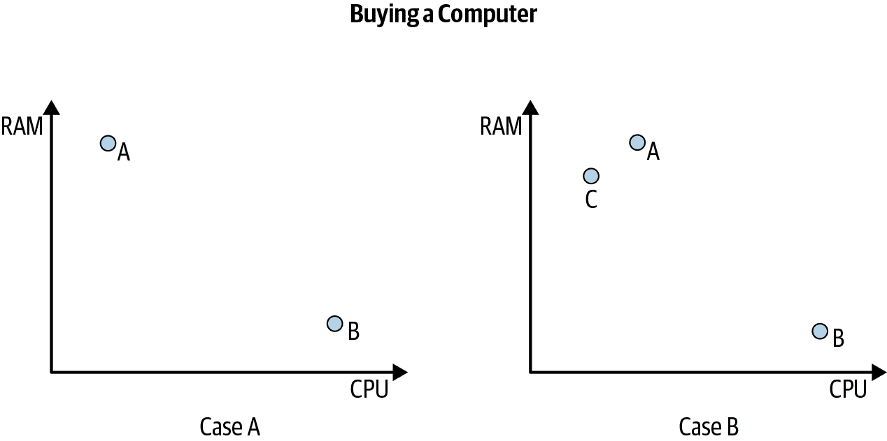
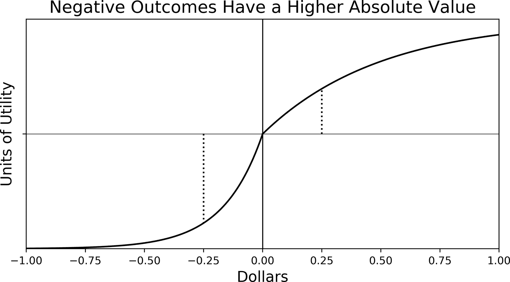

# 第四章：行动、杠杆和决策

第三章是关于学习将业务问题转化为必须始终可行的预设问题的内容。但什么是可行的？甚至更好的问题是，*所有事情*都是可行的吗？我们现在转向这个问题，以寻找让我们更接近预设理想的杠杆。

请注意：要找到杠杆，我们需要*了解我们的业务*。这并不意味着你必须在一个特定行业中度过多年。那可能有所帮助，因为你必须对事物为何有效以及何时无效有强烈直觉。但同样真实的是，许多时候，即使是拥有非专家，甚至是天真的视角，也能帮助我们打破思维定势并扩展我们的选项菜单。

回到我们的分解过程，我们现在将从业务成果所在的右外侧移动到包含我们拉动的杠杆的左外侧（图 4-1）。正如我们已经提到的，这是采用的自然和健康的顺序：我们从业务开始，然后询问如何通过拉动正确的一组杠杆来实现最佳结果。

###### 图 4-1：确认我们想要拉动的杠杆

# 理解什么是可行的

生活和商业制定的艰难真相在于，我们的大多数目标只能间接实现，通过我们采取的行动。例如，我们不能仅仅因为如此说而增加我们的销售额、生产力、客户满意度或减少成本。人为或技术因素（人为或技术）限制了我们实现所有想要完成的事物的能力。

我们的决策对我们的业务目标产生的影响受因果关系规则的调节，通常需要大量实验和领域知识才能理解对我们企业有益的做法和不利之处。

一般来说，我们可以将杠杆分为两类：一类主要依赖物理世界的规则来产生后果，另一类则源自人类行为。正如你所期待的，它们各自都有其复杂性和困难性。物理类型的杠杆依赖于我们对自然法则和技术进步的理解。人类杠杆则依赖于我们对人类行为的理解。

# 物理杠杆

事实证明，词语“杠杆”的最初用法是物理性质的：你拿起一根梁和一个支点，拉下梁，现在你能够移动那些你自己无法举起的物体。尽管如此，物理杠杆已经成为现代经济的一个里程碑：工业革命期间的快速增长，微芯片的发明，以及当前的互联网革命，仅举几例，都在很大程度上依赖于这类杠杆的存在。

例如，亨利·福特的流水线生产极大地改善了汽车的生产。这只需要对生产过程进行全面的重新设计，但一旦你拉动了那个“杠杆”，你就能在更短的时间内生产更多的汽车，随之而来的是生产成本的降低。

工程进步产生了我们可能没有意识到的物理杠杆。例如，在一个小区站点中改变天线的高度或角度可以提高我们日常移动通信中的通话质量或数据传输速度。同样，更好的软件配置可以改善你在云端或本地工作的能力。物理杠杆需要可能会很昂贵的技术专业知识来获取或雇佣，但由于现代经济建立在技术革命之上，至少了解可以达到什么效果可以在我们希望更加高效生产或拥有更满意的客户方面带来极大的帮助。

让我们以设计队列为最后一个例子。图 4-2 展示了两种可能的设计：左侧为多线多服务器，右侧为单线多服务器。¹

这不是深入探讨技术细节的地方，但让我们简单提一下，在某些条件下，可以证明左侧设计的平均等待时间比单线情况长。如果你的工作场所满足这些条件，你的目标是提高一般客户满意度（通过他们在排队等待的时间来衡量），你可以重新设计你的队列，可能会达到你的目标。

###### 图 4-2\. 将队列作为物理杠杆：左侧显示多线多服务器设计；通过转向右侧显示的单线多服务器设计，我们可能会影响等待时间，因此这种变化是我们在想要影响客户满意度时可以使用的一个杠杆。

# 等待行列中的物理和心理杠杆

在图 4-2 中，我还声称，等待时间的*感知*也可能会通过转向右侧的设计而受到积极影响，但这将使我们进入心理学法则作用的领域。我们很快会讨论这个话题，但你可以查阅 Alex Stone 的《为什么等待是一种折磨》获取关于排队心理学的一些证据。

# 人类杠杆

设计和使用物理杠杆一样需要相当的技术专业知识，人类杠杆则需要对人类行为的深入理解。与材料不同，人类有他们自己特定的一套困难。让我们简要讨论其中最重要的几个。

最明显的一点是我们不能强迫他人按我们的意愿行事：我们必须*激励*他们。你不能强迫潜在客户购买你的产品，或者让你的员工工作更多或更加高效：你需要创造条件，使他们出于自身利益而有利于你的目标行事。

此外，我们是*异质和多样化*的存在：即使是共享所有遗传物质的同卵双胞胎也会以不同的方式行事。我们还有*代理能力*：我们有意图，而这些意图因人而异，且在我们的一生中也会变化。

要增加复杂性，我们是*社会性动物*，如果在群体中或独自一人做出选择，我们的行为可能会大不相同。我们还从经验中学习，这是儿童、老年人及其间所有人都共同经历的过程。最后，我们会犯错：我们可能会后悔先前的一些决定，但这些可能不容易预测。

## 为什么我们会表现出这样的行为方式？

我将制定一项宏大的议程，试图将人类行为方式的原因压缩为三类，我相信这些类别涵盖了我们行为背后绝大多数原因。我接受过经济学的训练，因此您可能会看到这一企图中的偏见，但希望其他社会科学家不会对此持不同意见。

我会声称我们大部分的行为都受我们的*偏好*或价值观、我们的*期望*以及我们面临的*限制*驱动。这与经济学家对理性生物的描述完全吻合，但理性与这种表述几乎没有任何关系。²

想想为什么你买了这本书：我猜想你想了解人工智能及如何利用它做出更好的决策，但由于你不确定材料的质量，你信任了一次，并希望能有所收获。尽管如此，你现在也可以做任何其他事情：你可以读其他书籍，无论是技术类的还是非技术类的；看电影；睡觉；或与你的亲人共度时光。你一定珍视阅读这本书（或至少期望如此）。与此同时，你有能力购买这本书并有时间阅读它，这是我们通常面临的最基本的两个限制条件。

这是否可以推广到其他选择？我相信大多数我们所做的选择都可以，如果不是全部。在某种意义上，这种说法几乎是自相矛盾的：问任何人为什么他们刚刚表现出这样的行为，他们很容易就会说“因为我想要这样做”。

现在，偏好至少有两种类型：我们有个体偏好和社会偏好，这种区别使我们能够解释我们在群体中和独处时做出选择的差异。

现在我们将详细讨论每一个限制条件。

## 限制的杠杆

让我们从定价杠杆开始，这可以说是我们采取的最常见行动之一，以实现特定的业务目标，即增加我们的收入。这是我们最喜欢的杠杆之一，因为它直接影响我们的收入——价格（P）乘以销量（Q），或 <math alttext="大写 P 乘以大写 Q"><mrow><mi>P</mi> <mo>×</mo> <mi>Q</mi></mrow></math> 。

有趣的是，收入与价格有一种关系，使得操作杠杆的选择一点也不明显。困难来自经济学家所说的“需求法则”：当我们*提高*价格时，我们的销售通常*减少*。由于销售依赖于我们收取的价格，收入最好被表达为 <math alttext="大写 P 乘以大写 Q 左括号大写 P 右括号"><mrow><mi>P</mi> <mo>×</mo> <mi>Q</mi> <mo>(</mo> <mi>P</mi> <mo>)</mo></mrow></math> ，以明确我们的定价杠杆对收入的两种效应：第一项来自直接效应的正面效应，第二项来自后一项的负面间接效应。总体效果取决于需求对价格变化的敏感性。

图 4-5 展示了我们的定价杠杆与收入之间的一种标准关系。现在应该清楚，如果我们要操作定价杠杆，最好知道我们在垂直线的右边还是左边：在范围 **A** 内，公司将更受益，因为价格上涨会产生*更高*的收入。在范围 **B** 内则相反。尽管数学上如此，但直觉应该是清楚的：如果我们的客户对价格不太敏感，那么价格增加，比如增加一美元，将*不成比例地*减少需求，从而对我们的收入产生整体正面影响。在我们进行价格和收入优化时，这种校准是标准的，这是处方分析最成功的领域之一，将在第 7 章中重新讨论。

###### 图 4-5\. 我们的定价选择如何改变收入

我希望这个例子能让你相信，选择定价杠杆远非显而易见，但在我看来，这是处方分析中最有趣和最成功的案例之一。如果我们考虑提供折扣，最好是需求增长比价格下降*更快*的情况。³ 否则，我们应该寻找其他杠杆。

# 定价杠杆作为限制条件

你可能会想知道我为什么选择将定价杠杆归类为约束条件。顾客通常遵循需求法则——购买与价格之间的负相关关系——的一个重要原因是，通过改变价格，我们影响了他们的预算约束。

有趣的是，这种效应不仅影响我们现有的客户，还影响那些尚未开始购买的潜在客户，因为当前的价格可能过高。

但这总是正确的吗？不管图 4-5 中 B 案例的讨论如何，大多数情况下我们都遵循需求定律，因此大多数人都视其为理所当然。

### 时间限制

不是巧合的是，我们面临的两个主要限制是时间和金钱。我们已经讨论了预算限制，但时间限制呢？公司是否像利用预算限制一样，充分利用时间限制呢？

考虑数字银行。我不知道你怎么看，但我认识的大多数人都讨厌去银行网点，因为那是浪费我们宝贵时间的感觉。提升用户体验最好的案例之一是放宽客户的时间限制，并将一些时间返还给他们，让他们可以投入到其他活动中去。

如果你对银行业的例子不感兴趣，那么请问自己以下问题：如果所需时间减少，你会参与某些活动吗？想象一下，如果将健身房的时间从 60 分钟减少到 30 分钟，你仍能达到相同的效果。所有那些承诺每天只需 10 分钟即可拥有完美腹肌的电视广告都在利用这个杠杆。人们如同看待金钱一样重视他们的时间，因为正如人们所说，“时间就是金钱”。

## 影响我们偏好的杠杆作用

现在我们将考虑一些不同的决定因素，这些因素决定了我们喜欢和价值什么。正如我们将看到的那样，*所有*这些因素都是可以操作的，并且被世界各地的公司不断利用。

### 遗传学

我们的行为有多少是由我们的基因构成决定的，有多少是由我们的社会教养决定的？这场*自然与养育*的辩论在社会和行为科学中是最重要和最具争议的之一，因为在实证上很难分辨它们的相对重要性（见图 4-6）。例如，如果你像你的父母一样喜欢一杯红酒，是因为你的基因吗？或许是因为你在成长过程中看到他们享受红酒，这本身就对你产生了积极但*社会*的影响？

###### 图 4-6. 基因和环境共同塑造我们的偏好和选择

让我们接受最广泛认可的观点，即基因和环境两者都很重要，某些行为很可能在特定基因暴露于特定环境时出现。现在我们可以问自己，我们是否可以利用这些知识来实现我们的商业目标。

起初似乎很明显我们无法改变我们客户的 DNA，但在可预见的将来，随着行为遗传学的进一步进展，我们可能最终会全面理解如何利用特定客户对某些环境的暴露。⁴ 许多商店已经通过改变我们购买时店内存在的香气进行一些非常基本和粗糙的基因利用。但想象一下基因分析的情况：一个人进入商店，我们了解到一些对我们产品有影响的基因标记，并提供完整的感官体验，使他们更有可能购买。

我会把这些留在这里，但请记住，这个话题引发了各种伦理问题。我将有时间在本书的后面讨论其中一些问题。

### 个体和社会学习

我们选择的真相是，很多时候我们并不知道自己想要什么或喜欢什么，这与大多数决策理论家和经济学家提出的理性和一致的选择观点形成了鲜明对比。有些人更倾向于尝试新事物，并探索他们的口味的多样性和差异性。而另一些人则在尝试新事物时有过糟糕的经历，只是坚持他们已经了解并感到舒适的相同饮食习惯。

无论如何，偏好不是固定和一致的事实，而且大多数人至少在某种程度上喜欢尝试新事物，这应该帮助我们找到实现一些业务目标的杠杆。特别是当公司推出新产品时：因为顾客不愿意为他们尚未尝试过的东西付费，公司通常会提供免费样品。这降低了尝试产品的实际和感知成本，并希望顾客下次愿意支付全价。

尽管这适用于个体和社会学习，但在后者的情况下，通过影响力人物有第二个可能的杠杆。在当前数字社交网络的时代，公司通常利用影响者帮助其他人尝试他们的产品，而不需要免费赠送。

### 社会原因：战略效应

想象一下，我们看到像图 4-7 中的行为：这里，一个新来的人带来了一个新的想法或行为。她首先说服了小组的一个成员，后者开始表现出类似的行为。然后是另一个，再然后是几个其他成员。

我们如何利用这种社会效应来实现我们的业务目标？在前一节中，我们勾勒了一个可能的原因——社会学习，并讨论了两个可能的杠杆（价格和有影响力的人物）。

###### 图 4-7\. 社会传染

但也可能是有战略效应可以解释这些动态。想想像 Airbnb、Uber、WhatsApp、Facebook、Google 这样的双边平台，以及像 iOS 或 Windows 这样的操作系统。⁵ 回到图 4-7，想象我们朋友圈中有一个来自欧洲的人告诉我们他们正在使用最新的消息应用。起初，只有她最好的朋友下载它来尝试，并当然是为了和她聊天。但现在另外两个人也尝试了，因为，是的，他们想知道朋友们在谈论什么！加入的人越多，我们加入的动机就越高：这是在双边网络中运作的第一种网络效应。

第二种类型与网络的另一侧有关。想想 Uber：如果更多的司机加入，乘客更容易找到乘车服务，因此现在更多的顾客加入。但更大的需求也使得加入对司机更有利可图：现在你可以看到为什么双边平台会产生这些巨大的正反馈环路。通常将这些称为“战略效应”，因为我们的行为取决于他人的选择，反之亦然。

可以利用这个杠杆来实现我们的业务目标吗？毫无疑问：双边市场中最流行的杠杆之一是通过折扣或降低费用来补贴最*价格敏感*的市场一侧。这将产生我们刚刚描述的两个正反馈环路，并且通过选择最价格敏感的一侧，我们可以降低杠杆的成本。例如，Uber 通过降低乘客的价格来补贴每次行程的价值，而 Google 则免费提供他们的搜索引擎的使用权，但会拍卖广告空间给另一侧。

### 社会原因：一致性和同伴效应

我们经常因为社交网络中的变化而改变行为，仅仅是因为我们想要归属感。这种作为解释人类行为的一种渴望遵从的现象具有其自身的一系列困难，最容易通过影响者的案例来说明。

为什么我们会在 Instagram 上购买 Selena Gomez 或 Cristiano Ronaldo 穿过的泳衣呢？可能是因为我们*学到*只有在他们身上看到后才发现它确实适合我们，而不是出于需要或*归属*的愿望。

注意，一致性可能源于战略效应：同伴和团体压力对我造成了负担，因此我可能会发现按照大家的做法对我最有利。同样的推理也适用于我的朋友和同龄人，形成了有时被称为群体行为的现象。

总之，这种讨论不纯粹是学术性的：它影响并扩大了我们的杠杆组合，特别是在某些人群，如青少年中。在其他人群中可能效果不太明显，或者至少我没有看到可靠的经验证据表明我们应该关注其他群体。

最后，让我们讨论企业文化的案例，这是一个常见的应用场景，其中遵从可能起重要作用。积极的文化将使员工更加快乐和高效，而负面的文化可能导致严重的后果，如盗窃、腐败等。正因为我们认为这很重要，通常是首席执行官和首席人力资源官的任务是找到方法创造和培育有利的企业文化。遵从欲只是新文化产生的原因之一，因此一个策略是找到一些人可以作为企业的影响者。有谁比首席执行官和他们的整个执行委员会更合适呢？

### 架构效应

现在让我们转向行为经济学的领域，系统地研究“非理性”或“不一致”的行为。我们会看到，我们的不一致行为中有很多一致性，这可以用来达到我们的目标。

假设在某些情况下，平均客户在你的产品和竞争对手的产品之间做出选择时，有时会选择你的产品，有时会选择竞争对手的产品。这种选择的不一致性令人担忧，因为它表明你的产品（或竞争对手的产品）本身并没有解释选择的原因，而是决策背景等外部因素可能导致最终结果。

请参考图 4-8，其中展示了三种不同的电视机，分别在尺寸和价格上有所不同。问题在于这些属性之间的竞争：我更喜欢更大的电视，但不幸的是，它的价格也更高，所以我必须在两者之间进行权衡。品牌 A 的屏幕最小，因此也是最便宜的型号。品牌 B 和 A 相差不大（尤其是与 C 相比较时），最后 C 在尺寸上最好，但你需要额外支付一些费用才能购买它。你会选择哪个呢？

###### 图 4-8\. 架构效应：每个圆圈代表不同类型的电视机，根据它们的价格和屏幕大小有所变化。

如果你和大多数人一样，你可能会选择 B。从两个属性的角度来看，这似乎是合理的选择，尤其是考虑到 C 的价格相对较高。市场营销人员长期以来一直在研究这些效应，因此他们通常会通过调整框架来引导我们的选择，以便销售他们想要的产品。让我再次重申刚才的话，以明确这一点：他们希望从一开始就销售替代品 B，并决定拉动“框架杠杆”。他们精心选择他们想展示的两种备选方案，以便我们“自然”选择 B。

现在考虑图 4-9，想象你的目标是购买一台只关心内存（RAM）和处理器速度（CPU）两个属性的新笔记本电脑。案例 A 展示了两个明显在这两个属性之间进行权衡的选择：你可以拥有很多内存但低 CPU（A），或者反之（B）。这种选择方式让我们感到相当不舒服，因为在我们关心的所有属性中没有明确的赢家，而当我们不必做出牺牲时，生活就简单得多。

###### 图 4-9\. 购买电脑：另一种框架效应案例

如果我们能找到一个选择一或另一方案的理由会多好呢？这带我们到 B 案例，这时我们的零售商现在提出了一个明显被笔记本 A 主导的第三个选择（C 的内存和计算能力都较少）。他为什么要这样做呢？替代品 C 充当了一个参照点，帮助我们找到无争议的理由选择 A。

注意，这里的杠杆是*我们如何呈现或框定选择情境*。与其他可能对我们收入产生负面影响的杠杆（比如折扣）相比，这听起来几乎是一种免费提升销售的方式。

### 损失厌恶

我们的最后一个影响客户偏好的杠杆示例被称为*损失厌恶*。顾名思义，这个理念是说，如果我们拥有或不拥有某物，或者更有趣的是，如果选择情境被框定为损失，某物的价值就会发生变化。图 4-10 展示了我们通过效用函数来评估金钱价值的方式。这些函数将我们拥有和关心的事物单位转换为效用或满意度单位，通常用于分析决策（参见第六章）。

水平轴显示我们的净资产（如果为负数，则表示亏损），实线显示我们对每种状态的价值。需要注意的重要一点是，该函数在获利和损失方面是不对称的：额外赚取 25 美分的价值（绝对值上）比失去相同金额的价值要低。损失厌恶真正捕捉到了这个理念：我们的大脑可能天生更敏感于损失而非收益。

这是我们可以用来实现目标的东西吗？到现在为止可能并不奇怪，但是是的，你与顾客沟通的方式可以产生影响。损失厌恶理论建议的是——再次得到大量实验证据的支持——将选择框定为损失可能会产生影响。

###### 图 4-10\. 损失厌恶：赢得 25 美分被认为是相对于失去相同金额的较差选项

假设你想销售你产品的最新版本。如果你相信这个理论的话，你可以尝试 A/B 测试像这两个替代信息中的一个：

替代品 A

“购买我们令人惊叹的新产品！”

替代品 B

“不要错过购买我们新产品的机会！这是一生一次的机会！”

由于 B 方案将通信框架定为损失，相对于 A，我们应该预期它具有更高的转化率。这可能听起来有些疯狂，但由于测试是*相对*廉价的，为什么不试试呢？请记住，我们的目标是在不必打折的情况下卖出更多产品。

## 改变您期望的杠杆

现在我们已经涵盖了偏好和限制。偏好指导我们的选择，而限制迫使我们在竞争的替代方案之间做出选择。那么*期望*又起到什么作用呢？

大多数决策在我们不知道选择结果的情况下进行。你应该与那个人约会还是结婚？你应该买咖啡还是茶？你应该接受那份工作吗？仔细想想，所有这些选择都是在*不确定性*条件下做出的。

我们的大脑是一台强大的模式识别机器，使我们能够多次做出相对准确的预测。但我们是如何做到的呢？我们是否在 DNA 中有概率法则的硬编码？

心理学家和诺贝尔经济学奖得主丹尼尔·卡内曼及其合作者、已故的阿莫斯·特沃斯基（以及他们的许多学生和合作者）的工作告诉我们，我们的大脑简化了许多在一个以不确定性为主导的世界中生存所需的计算。我们采取的两个最重要的快捷方法是可得性启发法和代表性启发法。我们将看到，这些方法可以用来实现我们的商业目标。

### 可得性和代表性启发法

请记住，启发式是用来解决计算上困难的问题（如在不确定情况下做出决策）的快捷方法或近似方法。有时候，粗略但大致准确的解决方案总比没有决策好。这可能就是我们的大脑如何演化成一台强大的模式识别机器的原因。

量化信念需要收集证据，这通常是昂贵的（你可能已经见识过了）。使用可得性启发法，我们通过采用最容易获得的证据并用它来近似可能的情景来简化这一过程。使用代表性启发法，我们使用我们有的任何证据，即使是稀缺的，并加以推断。请注意，这些都是快捷方法：如果我们有更多的时间和资源，我们本可以收集更多和更好的证据来形成我们的信念。

让我们利用这些知识来理解如何提高我们的广告效率。广告的难点在于它不一定会立即产生影响，但它可能会影响我们的品牌意识。如果我们的广告活动成功，当潜在客户真正想购买时，可得性启发法可能会使他偏向于记住我们的品牌。

代表性如何？如果你的第一个产品真的很好，你的客户可能会推广这一信念，使他们更愿意购买第二个产品。或者，考虑公司治理问题：如果你已经建立了不尊重最基本道德标准的声誉，客户可能会推广到你的产品质量。选择启发法则无处不在，因此我们应该利用它们，以及特别小心不要让它们反过来影响我们。

# 重新审视我们的使用案例

最后几页呈现了大量内容。我的目标是指出不同的灵感来源，找到实现业务目标的杠杆。当我们重新访问第三章的使用案例时，这将更加明显。

## 客户流失

作为提醒，我们首先将业务问题设定为规定性问题，现在我们希望开始寻找实现此目标的杠杆。在第三章中，我们得出结论，我们的目标不是最小化客户流失，而是通过保留活动最大化利润。在这种情况下，如果保持客户忠诚对我们的品牌成本太高，也许让一些客户离开是最优的。

我们可以采取哪些行动来实现这一业务目标？想想看：究竟为什么有人会选择成为我们的客户而不是我们竞争对手的客户？让我们回归基本。

客户通常希望从我们公司得到三样东西：足够好的产品质量、合理的价格以及在需要支持时良好的客户服务。此外，他们可能愿意在这些方面做出一定程度的权衡。为了利用这一知识，我们必须转向偏好、限制和期望的领域。

如果长期影响是积极且递增的，我们可能愿意通过价格折扣牺牲短期利润。但这不是我们唯一的杠杆。我们还可以通过创建忠诚计划或突出我们竞争对手产品的一些不利属性来制造切换成本昂贵的感觉。他们知道我们的产品（而不是我们竞争对手的产品）这一事实应该帮助我们设计利用损失厌恶或可用性启发法则的杠杆（回想一下谚语“宁愿知道的魔鬼，也不愿未知的魔鬼”）。

最后值得一提的是，我们之前提到的一些一贯不一致的行为怎么办？大多数经济学家认为这些只会暂时起作用，最终你的客户（或某个竞争对手）会意识到他们被设限了。你可以利用这些短期租金，但如果考虑将其作为业务模型的组成部分，则需小心。

## 交叉销售

在交叉销售中，我们正在寻找每位客户的下一个最佳优惠，以便最大化他们的客户终身价值。在这个意义上，我们的主要杠杆是向每位客户提供或不提供我们的每种产品。请注意，我们可能希望将“不提供”选项作为一个杠杆，因为通过提供不受欢迎的优惠，我们可能会失去客户，从而降低他们的终身价值。

也就是说，您可以将我们描述的某些技术用作二阶杠杆，即用于实现实际的交叉销售。例如，我们沟通和设置优惠时的方式总是可以利用于我们自己。

## 资本支出（CAPEX）优化

尽管已经明确了即时杠杆可供使用（支出或不支出），但映射支出与后果的中介因素远未得到充分理解。

例如，CAPEX 是那些物理杠杆可以发挥重要作用的案例之一（考虑投资于节约成本的技术）。但我们也可以考虑影响我们收入的人为杠杆（投资于使我们的产品更具吸引力的新技术，即使成本更高，直到我们能够实现一定的规模经济）。

这类问题非常广泛，所以必须根据具体情况逐案寻找可操作的杠杆。

## 店铺位置

类似于 CAPEX 优化的问题，我们的即时杠杆是在不同地点开设商店或不开设商店（甚至关闭某些地点），但为何这些行动会影响我们的业务目标却一直不清楚。在这个层面上，我们几乎可以说，我们只是决定开设一个商店，我们的银行账户就开始收集更多利润，这几乎是魔法般的。

最重要的中介杠杆是我们捕捉需求的能力（价格或数量），或者减少成本（这也因地而异）。我们将在后续章节更深入地讨论这些问题。

## 我应该雇佣谁？

请记住，我们的目标是最大化招聘的增量回报。为此，我们必须对员工对我们业务的影响有一个良好的理解，正如我们稍后在第七章中将详细讨论的那样，这并不明显。但是假设我们掌握了这些信息，我们的决定是雇佣或不雇佣，以及以什么成本。同样，我们有一个二元杠杆（雇佣与否），以及一个可以更精细调整的杠杆（工资、福利、情感薪资、工作环境以及招聘者使用的所有其他杠杆）。

## 拖欠率

业务问题是最大化向一个客户出借资源的投资回报率。因此，对于这种情况，三个自然的杠杆是贷款金额的大小（包括零）、时间跨度或到期时间，以及如果法规允许的话利率。此时，我们可以忽略优化所有三者的复杂性：我们必须首先开始了解我们手头可用的杠杆菜单。

但我们可以更有创意地测试行为杠杆。如果我们在信用卡上印上孩子的照片会怎样？这会使我们的客户更有可能及时还款吗？或者谈论沟通策略，我们是否可以通过发送带有快乐表情的短信来*促使*更好的付款行为？再次强调，测试相对便宜：我们只需有一个有效的假设，有打破常规思维的能力，并获得利益相关者的支持，以找到成本较低的杠杆。

## 库存优化

在最基本的层面上，我们希望利用有多少种类的每种物品应该存货。然后，杠杆只是一个数字，可以是正数（我们需要增加存货）、零（当前数量恰到好处）或者甚至是负数（将某些物品移动到其他商店，因为在此位置我们永远无法销售它们）。这并不意味着没有其他可以利用的物理杠杆。例如，想想如何减少我们的首次订单存储和运输成本（考虑亚马逊）。

## 店铺人员

在这个问题上，选择杠杆再次受到物理和运营约束的限制。例如，是否在任何一天的任何一小时内做出特定的人员安排是运营上可行的？每半小时呢？请记住，我们应该在每个商店中拥有合适数量的销售人员以最大化利润或客户满意度。但这取决于我们在任何给定时刻有多少顾客，因此根据粒度不同，我们可能会始终人手不足或人手过剩。

如果我们愿意打破固有思维模式，我们甚至可以考虑通过“优步化”我们的员工来放松这些运营约束：只有在需求足够高的时候才雇佣人员。

# 关键要点

+   *一旦我们定义了业务目标，就必须考虑它是否可操作*：大多数情况下，我们的问题是可以解决的，但我们可能需要打破常规思维。

+   *选择杠杆的问题是因果关系问题*：我们希望做出影响业务目标的决策，因此从杠杆到后果必须存在因果关系。

+   *两种主要的杠杆是物理或人类*：物理杠杆通常利用技术进步来实现。人类杠杆涉及深入理解为什么我们的顾客、员工或者与生产过程有关的任何其他人类会表现出特定的行为。

+   *要理解行动与后果之间的关系，我们必须建立假设*：大多数情况下，我们无需重新发明轮子，因为关于事物运作方式或人类行为的知识已经很丰富。我提供了一个非常快速和不完整的概述，介绍了我认为有助于思考这些问题的一些发现。

+   *假设经常失败，但我们应该拥抱学习过程*：很多时候，我们从因果关系理论开始，只是在测试过程中看到它失败。这没关系，这是过程的一部分。拥抱它，并确保您的团队从这些失败中学习。

# 进一步阅读

物理杠杆是问题特定的，因此我建议您向更专业的同事询问一些阅读建议，这些建议可以帮助您至少获得一些关于可以实现或无法实现的一般知识。

这里讨论的人类杠杆已被社会科学家，包括经济学家、心理学家和社会学家们深入研究过。我建议从微观经济学的入门教材开始，因为我们大部分的商业决策都有一定的经济基础。我个人很喜欢斯坦福商学院的教授大卫·克雷普斯（David Kreps）如何向更广泛的公众解释这些非常技术性的话题。

关于行为经济学的书籍会为您提供一些非理性选择的额外背景知识。我最喜欢的之一是丹·艾瑞利（Dan Ariely）的《可预见的非理性》（Harper Perennial），但您也可以选择丹尼尔·卡尼曼（Daniel Kahneman）的《思考，快与慢》（Farrar, Straus and Giroux）。我强烈推荐艾瑞利的书籍，因为他提供了许多我们可以拉动的杠杆来改善业务的例子，这些杠杆我们从未预料到会起作用。如果您想学会超越常规思维，这就是我推荐的文学类型。

加里·贝克尔（Gary Becker）和凯文·墨菲（Kevin Murphy）的《社会经济学》（Belknap Press）仍然是社会背景下选择的良好参考书，但另一本充满直觉的经典著作是托马斯·舍林（Thomas Schelling）的《微动机与宏观行为》（W. W. Norton & Company）。关于社会网络经济学的高度技术和百科全书式的处理可以在马修·杰克逊（Matthew Jackson）的《社会与经济网络》（Princeton University Press）中找到。

最后，战略行为和博弈论是一个独立的话题。您可以从一本入门教材开始，这本书不太技术化，但提供了很多直觉。阿维纳什·迪克希特（Avinash Dixit）和巴里·纳勒布夫（Barry Nalebuff）的《策略的艺术》（W. W. Norton & Company）或肯·宾莫尔（Ken Binmore）的入门教材，比如《游戏与乐趣》（D. C. Heath & Co.）或《真实博弈》（Oxford University Press），可能会适合您的需求。

¹ 在这种情况下，“服务器”是负责为每个客户提供服务（如收银员）的人或机器，而不是计算机服务器。

² 理性与选择的一致性有关，这与我将完全不使用或声称的内容有关。

³ 除非您希望占据市场份额，这可能会增加长期收入，但这是一个不同的商业目标。在这种情况下，您可能考虑短期内处于亏损状态，但您必须优化您的长期利润的净现值。

⁴ 请参阅卡罗琳·亚伯拉罕（Carolyn Abraham）的文章，《为什么你的 DNA 对营销人员来说是一个金矿》（"Why your DNA is a gold mine for marketers"）在《环球邮报》（The Globe and Mail）中作为一个例子。

⁵ 我们还在第三章中讨论了双边平台。
