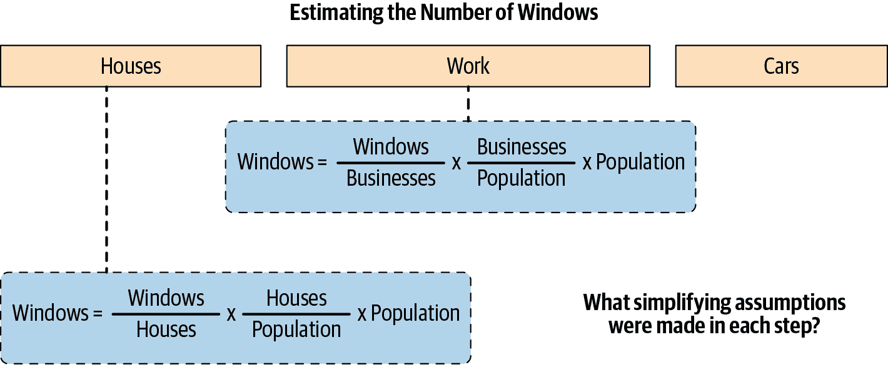
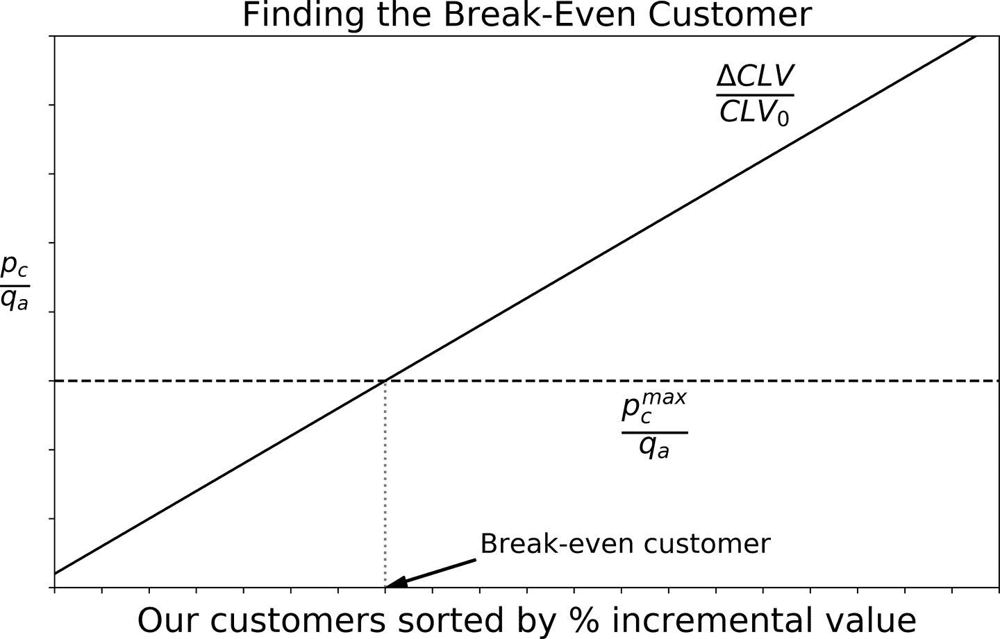

# 第五章：从行动到后果：学习如何简化

我们已经多次提到，通过做出决策，我们可能会对我们的业务目标产生或者未产生我们预期的后果。但我们如何知道会有什么样的预期？我们又是如何决定这一系列行动值得我们花时间去实验呢？在本章中，我们将学习最重要的分析技能之一：简化世界并解决限制性问题的能力。这将希望将我们拉近一步分析启蒙。

重新审视显示在 图 5-1 中的图形，我们现在将把注意力放在通过因果关系介导的行动与后果之间的连接上。这是我们将我们卓越的理论创造能力付诸实践的地方。但由于世界是复杂的，我们最好学会简化。

###### 图 5-1\. 从行动到后果

# 为什么我们需要简化？

想象一下，我们从解决一个新的业务问题的项目开始。遵循 第三章 中的建议，我们通过从问题开始并向后移动来设置问题。我们首先确定一些驱动我们目标的因素，然后提出将我们的杠杆映射到这些后果的理论。

然而，并不罕见的是，对于我们追求的任何特定后果，我们可以拉动许多杠杆。这些杠杆每一个都可能产生大量的后果，因此我们需要简化（参见 图 5-1）。

假设我们想增加我们的收入。在 第四章 中，我们展示了根据我们当前的价格，增加或降低价格可能是合理的。但你也可以每天给你的客户发送一封电子邮件，表达对他们业务的感谢并祝他们有个美好的一天。或者让你的社区经理在公司的 Instagram 账号上发布一些使用你的产品的酷炫人物的照片。或者等到他们在你的客服中心联系你，然后尝试进行一些交叉销售。或者如果你感到非常冒险，你可以在玻利维亚的网页上发布广告，希望你的潜在客户计划下一次去那个美丽国家的旅行。实际上，选择是无限的。世界是复杂的，其中一些可能适用于你的一些客户，而一些则可能不适用。这就是为什么我们需要简化。

## 一级和二级效应

一个很好的实践是开始只考虑 *一级效应*，以便正确获取效应的“符号”或“方向”。此时，我们可能不关心影响结果曲率的 *二级效应*。

但这些效应从哪里来？因为我建议您从一阶效应开始，所以我最好告诉您从哪里找到它们。正如以下侧栏所示，我们需要一个关于后果如何从行动中产生的理论。理论可以是数学形式的（在这里您最终将行动映射到后果），或者更多是基于故事的，您只需假设如果您拉动杠杆<math alttext="x"><mi>x</mi></math>，那么后果<math alttext="y"><mi>y</mi></math>会发生。使用数学编写的理论可以推导出一阶和二阶效应。使用较不正式的理论，您只需在事后评估各种杠杆的排名。

我们面临的复杂性的一部分来自于我们生活在一个高度非线性的世界中。想想我们在收入和价格之间看到的关系（图 4-5）。为什么我们需要从一个倒置的 U 形开始呢？如果我们只是从价格到收入的线性增加函数开始就简单得多（至少我们知道有一个直接且正的一阶价格效应）。

爱因斯坦的释义是，模型应尽可能简单，但不能更简单。这意味着我们应该从适合某些数据或我们对问题的先验知识的最简单理论开始，即使是部分的，然后在必要时进行迭代并创建更复杂的模型。

根据标准成本效益分析，找到停止的一个良好经验法则：当另一个迭代的增量成本超过您预期从中获得的收益时停止。如果您需要投入团队一个月的时间才能推出模型的下一个版本，但这只会对公司的收入产生微小增长，那么您似乎在第一次请求该迭代时就不应该这样做。

# 锻炼我们的分析能力：欢迎费米

恩里科·费米是一位意大利物理学家，曼哈顿计划的成员。他在核物理和原子弹的发展中起了重要作用。在像我这样的非物理学家中，他最出名的是普及一种近似解决非常困难和复杂问题的方法。举个例子，让我们拿一个以他名字命名的问题来说（尽管原因有所不同），所谓的费米悖论：为什么我们在宇宙中找不到生命的证据，而“数字表明”这不是一个低概率事件？好吧，我们需要提出这些“数字”来验证这个声明的表面悖论性质，这就是费米方法帮助我们的地方。¹

费米问题从将一个复杂问题分解为更简单的子问题开始。我们的目的不是得出一个困难的、精确的数字，而是要得到正确的*数量级*：我们可能不关心答案是 115,000 还是 897,000，只要我们知道它在数十万的数量级即可 <math alttext="左括号 10 上标 5 底线 右括号"><mrow><mo>(</mo> <msup><mn>10</mn> <mn>5</mn></msup> <mo>)</mo></mrow></math> .²

我喜欢费米问题，因为它们迫使我们通过要求做简化假设和粗略估计来提供答案，从而锻炼我们的分析能力。让我们看看这在实践中是如何运作的。

## 这个矩形房间的地板能容纳多少个网球？

许多科技公司在面试过程中喜欢问费米问题，让我们从典型的例子开始。假设你站在一个长度（L）和宽度（W）如图 5-2 所示的矩形房间中。这个房间的地板上能容纳多少个网球？整个房间里呢？

###### 图 5-2\. 将费米方法应用于房间地板上的网球问题

首先考虑我们能在图 5-2 左上角的第一行放多少个球。由于我们只关心第一行，我们可以忽略宽度（W），因为它并没有提供太多信息。球的数量可以用<math alttext="n 下标 b 底线 等于 上 L 斜线 上 D"><mrow><msub><mi>n</mi> <mi>b</mi></msub> <mo>=</mo> <mi>L</mi> <mo>/</mo> <mi>D</mi></mrow></math> 近似，或者更好地说，小于或等于该数字的最大整数³：如果房间长 10 米，每个球直径为 25 厘米，那么每行可以放 40 个球。现在整个地板上可以放多少行？用同样的逻辑，我们得出答案应该是<math alttext="n 下标 r 底线 等于 上 W 斜线 上 D"><mrow><msub><mi>n</mi> <mi>r</mi></msub> <mo>=</mo> <mi>W</mi> <mo>/</mo> <mi>D</mi></mrow></math> 。

将这两个数相乘，我们得到整个地板上可以容纳的球的总数由<math alttext="upper N equals n Subscript b Baseline times n Subscript r Baseline equals StartFraction upper L times upper W Over upper D squared EndFraction"><mrow><mi>N</mi> <mo>=</mo> <msub><mi>n</mi> <mi>b</mi></msub> <mo>×</mo> <msub><mi>n</mi> <mi>r</mi></msub> <mo>=</mo> <mfrac><mrow><mi>L</mi><mo>×</mo><mi>W</mi></mrow> <msup><mi>D</mi> <mn>2</mn></msup></mfrac></mrow></math>，或者从下方给出的任何好整数。为了得到一个数值答案，您需要对这些值进行近似。例如，我相信网球的直径在 5 到 9 厘米之间（1.9 到 3.5 英寸），所以让我们取 7 厘米的中点。此外，我的房间大约长 4 米，宽 2 米，所以我应该能够容纳大约 1600 个网球。我们知道这并不完全正确，但我们希望它在合理范围内。近似和简化是费米问题的核心。

但是让我们关注技术本身，看看我们做了什么。我们从一个问题开始，将其分解成两个相对较简单的问题。第一个问题是每一行可以容纳多少个球；第二个问题是在矩形房间中可以容纳多少行的球。如果我们能够解决这些问题，我们就可以解决原始、更难的问题。您可能已经注意到，我们本可以通过相应的区域找到解决方案，但这只是稍微复杂一点（参见图 5-2 中的解释）。如果现在您想知道整个房间内可以容纳的球的数量，您将面临第三个问题，其复杂度与前两个问题相同（可以容纳多少个球的切片）。

另外，需要注意的是球的表面积不是<math alttext="upper D times upper D"><mrow><mi>D</mi> <mo>×</mo> <mi>D</mi></mrow></math>，而是<math alttext="pi r squared"><mrow><mi>π</mi> <msup><mi>r</mi> <mn>2</mn></msup></mrow></math>，其中<math alttext="r"><mi>r</mi></math>和<math alttext="upper D"><mi>D</mi></math>分别是球的半径和直径，而<math alttext="pi"><mi>π</mi></math>则是几乎神话般的数学常数。但由于我们只关心近似值，我们不需要这个精确的公式：我们可以假设每个球都是一个正方形，因为这些正方形的边界与球之间的空间无法使用。⁴

让我们看看简化可以为我们带来什么好处，通过考虑像图 5-3 中的稍微复杂的房间。我们现在如何解决这个问题？一阶近似将一切视为矩形，因此问题本质上是相同的，不同之处在于在公式中不再使用<math alttext="upper L"><mi>L</mi></math>，而是使用<math alttext="upper L plus k"><mrow><mi>L</mi> <mo>+</mo> <mi>k</mi></mrow></math>。线性世界很容易处理。

###### 图 5-3\. 与之前相同的问题，房间的形状略有不同

或许你对这种粗略估计感到不适，那么现在你可以通过将右侧的半圆近似为三角形来提供估算的下界，或者如果你真的愿意，你可以尝试用圆的面积来提供一个更好的近似值。额外的努力真的值得吗？你可以试着玩一些数字，看看是否值得。

我知道这感觉像是一个人为的问题，但请记住，我们只是在进行我们的第一个费米问题练习。

## 你会收多少费用来清洁墨西哥城的每一扇窗户？

第二个问题更具商业特色：你会收多少费用来清洁*每一个*墨西哥城的窗户？如果你从未去过那里，你怎么能提供这样的数字呢？费米在提供类似可居住或类似地球的行星的大概数量时，也没有访问过宇宙的其他地方。这就是费米问题的美妙之处之一。

让我们首先设定问题。我们需要两个数字：墨西哥城的窗户数量以及每个窗户的收费标准。然后我们可以将它们相乘，就完成了。

让我们从我们要收取的每扇窗户的费用估计开始。注意，这本身就是一个难题。我会根据时间不同而有所不同，无论是夜晚、白天还是工作日，我的机会成本都取决于替代品及其价值。但我们将简化并假设事物是恒定的（这是一个线性假设）。

每个窗户我们需要花多少时间？我猜我需要 30 秒来完成一个窗户。我会假设这个时间是恒定的。从经验上来说，我知道这并不正确：一开始我可能非常高效，只需 20 秒就能完成，但接着我开始感到疲倦，速度就开始下降了。请注意，这是一个关于变化*曲率*的二阶效应。在第一次尝试中，我将忽略这些细微差别，只是近似地将平均时间设为每窗户 30 秒。由于一小时有 3,600 秒，这些时间大约相当于 0.008 小时（ <math alttext="10 Superscript negative 3"><msup><mn>10</mn> <mrow><mo>-</mo><mn>3</mn></mrow></msup></math> ）。

那么一个小时的成本是多少？假设去掉所有有趣的细节，我只会说，如果我一年赚 100 美元，那么我的*平均*小时费率应该接近 100 /（52 × 5 × 8），因为一年有大约 52 周，每周 5 个工作日，每天工作 8 小时。请注意我们如何简化事情。

这样说来，我们现在可以估计墨西哥城的窗户数量。让我们考虑*居民*窗户的情况，其他情况留给你去解决（见图 5-4）。

如果我们能估计出每个比率，我们将能够提供一个近似值。但让我们先停下来注意一下我们所做的事情：这是一个方程——一个没有任何歧义的数学真理——我们只是乘以和除以一些数。简化和估算将在我们开始填充每个比率时发挥作用。

例如，普通住宅有多少窗户？假设普通住宅有两个房间，还有一个客厅和一个厨房。你对每户平均 10 个窗户的估算感到满意吗？每个房间大约有 2.5 个窗户，客厅有 3 个，厨房有 2 个（或这些的某种组合）。我确定你见过有更多（或更少）窗户的公寓，但请记住，我们只是粗略估算，我猜想每户大约有 10¹ 个窗户。

现在考虑第二个比率：墨西哥城每人有多少房屋？别担心，我也不知道，但我们假设平均每户有 4 人，对应人均 0.25 户。最后，墨西哥城的人口呢？我知道它是世界上最大的城市之一，所以我猜人口是 2000 万居民（记住我们只关心数量级）。这样一来，我们估计住宅窗户约有 5000 万个（图 5-4）。

###### 图 5-4。墨西哥城有多少窗户？

我们进行了许多粗略估算，因为在费米问题中，我们只关心数量级，所以我们知道我们提供的数字中可能有一个或多个是错误的。好处在于，无论何时，如果我们觉得我们过于简化了一个估算，我们总是可以回头改进它。

我让你考虑这个特定问题的其他细微差别，比如餐馆、汽车和学校有多少窗户。但你可以期待这种方法会类似地工作。重要的是我们学会简化并注意每一步骤中所做的所有假设。

## 用费米问题制定初步商业案例

前一节中的问题很适合锻炼我们的分析能力，因为它们迫使我们进行简化假设和粗略估算，同时对它们保持意识和批判性思考。虽然我当然建议每天进行费米锻炼，但您可能会想知道它是否还有其他用途。我们现在将看到，我们可以使用费米类型的推理来构建准备我们日常工作中的许多业务案例所需的逻辑。

### 支付我们客户的联系信息

许多公司的客户联系信息很糟糕：要么由于人为错误而保存不正确，要么已过时，或者我们的客户一开始就没有提供正确的信息。无论哪种情况，他们的电话号码或电子邮件地址可能不正确或者无法使用。这不仅令人沮丧，而且在财务上也有影响，因为我们大多数的直接营销活动依赖于我们实际能够联系到我们的客户。

您的 CMO 要求您计算我们应该支付客户的正确联系信息的金额。实际上我们不会直接支付他们 —— 虽然我们可以 —— 但我们可以购买一些去巴黎的旅行，然后让他们通过给我们他们的联系信息注册游戏或彩票，我们可以通过向他们发送代码进行验证。您明白我的意思。

让我们思考一下问题的经济学。对我们而言的成本是我们愿意支付给每位客户的费用，我们称之为<math alttext="p Subscript upper M"><msub><mi>p</mi> <mi>M</mi></msub></math>。但是利益是什么？一旦他们给了我们他们的联系信息，我们期望得到什么回报？让我们对转化漏斗做一个粗略的估计。

假设在 100 位注册客户中，<math alttext="q Subscript c"><msub><mi>q</mi> <mi>c</mi></msub></math> 百分比提供了*正确*的信息；我们可以通过立即强制验证将其提升至 100%，但目前我们没有因更广泛而失去任何东西。我们的目标是进行销售，从而增加每位客户对公司的价值。假设有<math alttext="q Subscript a"><msub><mi>q</mi> <mi>a</mi></msub></math> 百分比的被联系者接受了我们的提议。最后，这对我们的业务目标有何影响？我真心希望我们所做的无论如何都能增加他们对公司的价值。我要说，通常我们的活动产生了长期增量价值<math alttext="normal upper Delta upper C upper L upper V"><mrow><mi>Δ</mi> <mi>C</mi> <mi>L</mi> <mi>V</mi></mrow></math> 。

很好。现在，让我们找到一个收支平衡规则，以平衡增量成本和收益。初步估计，我们应该愿意给每位客户提供最多的<math alttext="p Subscript upper M Baseline equals q Subscript c Baseline times q Subscript a Baseline times normal upper Delta upper C upper L upper V"><mrow><msub><mi>p</mi> <mi>M</mi></msub> <mo>=</mo> <msub><mi>q</mi> <mi>c</mi></msub> <mo>×</mo> <msub><mi>q</mi> <mi>a</mi></msub> <mo>×</mo> <mi>Δ</mi> <mi>C</mi> <mi>L</mi> <mi>V</mi></mrow></math> 美元。请注意，如果我们估算出更高的潜在收益——如 CLV 的变化量——我们也可以做出更好的提议。同时请注意，初步估计下，我们可以假设两个相关的概率——联系和接受——并不取决于每位客户的潜在收益；但是这个假设可能过于强烈，我们可能以后需要修订它。你明白了吧；现在我们只需输入一些看似合理的值，就可以给我们的首席营销官一个答复了。

### 过度的联系尝试会增加客户流失的概率。

我们的首席营销官对我们的答复非常满意，因为她确实有预算购买一些去巴黎的旅行并测试活动效果。她现在担心我们在更新客户联系信息方面可能会太成功，导致我们联系他们过于频繁，从而增加流失率。

现在她要求我们找到一个规则，以便决定联系哪些客户。让我们回到增量成本收益分析。由于我们关心流失概率，让我们给它起个名字，比如<math alttext="p Subscript c"><msub><mi>p</mi> <mi>c</mi></msub></math> 。如果一个客户流失，我们会失去她目前的 CLV，假设她离开并再也不从我们这里购买：<math alttext="upper C upper L upper V 0"><mrow><mi>C</mi> <mi>L</mi> <msub><mi>V</mi> <mn>0</mn></msub></mrow></math> 。是的，这看起来像是一个极端的假设，但我们在简化，可以把它看作是一个*最坏情况*。这是负面影响。那正面影响呢？如果她不流失并且接受，我们可以通过<math alttext="CLV Subscript 1 Baseline minus CLV Subscript 0"><mrow><msub><mtext>CLV</mtext> <mn>1</mn></msub> <mo>-</mo> <msub><mtext>CLV</mtext> <mn>0</mn></msub></mrow></math> 增加她的价值；让我们称之为概率<math alttext="q Subscript a"><msub><mi>q</mi> <mi>a</mi></msub></math> 。

基本经济分析表明，如果我们打电话给任何预期成本大于预期收益的客户，这是不好的商业行为。与之前一样，我们可以通过平衡边际成本和边际收益来找到收支平衡的客户。

现在我们有了一个简化但最优的规则来联系我们的客户。我们如何将其付诸实践？首先考虑最简单的情况，我们使用平均流失率和接受率作为我们所有客户的概率估计（因此我们将它们视为所有客户的固定值）。为了找到一个盈亏平衡的客户，我们必须掌握提供的增量价值百分比的客户级估计（ <math alttext="StartFraction normal upper Delta upper C upper L upper V Over upper C upper L upper V 0 EndFraction"><mfrac><mrow><mi>Δ</mi><mi>C</mi><mi>L</mi><mi>V</mi></mrow> <mrow><mi>C</mi><mi>L</mi><msub><mi>V</mi> <mn>0</mn></msub></mrow></mfrac></math> ），并按增加顺序排序我们的客户。然后我们可以通过等号将两边相等来找到我们的盈亏平衡客户（图 5-5）。

###### 图 5-5\. 找到我们的盈亏平衡客户

一旦我们能够解决这个简化的场景，我们应该考虑估计个体概率，以得出一个完全定制的最优性规则。再次注意，我们从解决一个非常简单的表述开始，然后逐步提升复杂度。

### 你应该接受那个初创公司的报价吗？

想象一下，你收到了加入一家有前途的初创公司的邀请。由于他们缺乏流动性并迫切希望快速增加收入，初创公司通常提出低于平均水平的薪资报价，但是用股票或受限股票单位（RSU）来补偿你。基本上，他们希望你用短期流动性（你的工资）来换取中长期回报，这些回报由你对未来价值的期望来决定。

一个困难是 RSU 通常有一个*归属期*，即你必须在公司工作一段最短时间后才能行使或出售这些股票。例如，在美国，将这个归属期设定为四年是相当标准的，所以如果你今天被雇佣，并且*如果*你在四年后仍然在公司工作，假设你实际上能出售它们，那么你将完全拥有你的 RSU 权利。⁵ 对此，公司必须在此期间上市（或被收购）。否则，你将不得不等到这种情况发生，因为简单地说，没有市场来交易这些股票。

基本的经济分析表明，只有在报价优于你目前的状况时才应该接受。注意，其他考虑因素（例如在某个地方工作的声誉或者情感工资）在分析中被简化掉了。但是你真正得到了多少呢？

让我们写下一些数学以更好地理解。称您当前的年薪为<math alttext="w"><mi>w</mi></math>，为了明确权衡，假设他们只提供给您这个数额的一个分数<math alttext="k"><mi>k</mi></math>，比如<math alttext="k w"><mrow><mi>k</mi> <mi>w</mi></mrow></math>。如果您保留当前的工作，您每年将赚取<math alttext="w"><mi>w</mi></math>。相反，如果您接受这个提议，您将知道在一个*不确定*的时间段内每年将获得<math alttext="k w"><mrow><mi>k</mi> <mi>w</mi></mrow></math>，并且如果您能行使您拥有的公司一小部分的权利，您还将获得<math alttext="upper S p Subscript upper S"><mrow><mi>S</mi> <msub><mi>p</mi> <mi>S</mi></msub></mrow></math>价值的 RSUs。他们提出的提议包括<math alttext="upper S"><mi>S</mi></math>股票，每股价值<math alttext="p Subscript upper S"><msub><mi>p</mi> <mi>S</mi></msub></math>美元。

这是一个需要计算净现值的问题。我们无法消除时间，因为等待直到您拥有这些股票并能够变现是有机会成本的。但我们可以提出最简单的 NPV 计算，只涉及两个时期：今天和明天，我们稍后再决定“明天”是什么意思。

留在当前工作的 NPV 为：<math alttext="upper I 0 equals w plus StartFraction w Over left-parenthesis 1 plus r right-parenthesis EndFraction"><mrow><msub><mi>I</mi> <mn>0</mn></msub> <mo>=</mo> <mi>w</mi> <mo>+</mo> <mfrac><mi>w</mi> <mrow><mo>(</mo><mn>1</mn><mo>+</mo><mi>r</mi><mo>)</mo></mrow></mfrac></mrow></math>，其中<math alttext="r"><mi>r</mi></math>是*适当*的折现率。这只是说如果*今天*我们赚取<math alttext="w"><mi>w</mi></math>，同样的工资在*明天*会稍微少一些：<math alttext="StartFraction w Over left-parenthesis 1 plus r right-parenthesis EndFraction"><mfrac><mi>w</mi> <mrow><mo>(</mo><mn>1</mn><mo>+</mo><mi>r</mi><mo>)</mo></mrow></mfrac></math>。另一方面，如果我们接受这个提议，我们*预期*将获得：

<math alttext="upper I 1 equals k w plus StartFraction k w Over 1 plus r EndFraction plus StartFraction upper S p Subscript upper S Baseline Over 1 plus r EndFraction" display="block"><mrow><msub><mi>I</mi> <mn>1</mn></msub> <mo>=</mo> <mi>k</mi> <mi>w</mi> <mo>+</mo> <mfrac><mrow><mi>k</mi><mi>w</mi></mrow> <mrow><mn>1</mn><mo>+</mo><mi>r</mi></mrow></mfrac> <mo>+</mo> <mfrac><mrow><mi>S</mi><msub><mi>p</mi> <mi>S</mi></msub></mrow> <mrow><mn>1</mn><mo>+</mo><mi>r</mi></mrow></mfrac></mrow></math>

在这里，我们明确将“明天”定义为您可以行使 RSUs 的时间。现在我们已经提出了问题，我们的决策规则是：仅当<math alttext="upper I 1 greater-than upper I 0"><mrow><msub><mi>I</mi> <mn>1</mn></msub> <mo>></mo> <msub><mi>I</mi> <mn>0</mn></msub></mrow></math>时接受。

多亏了这个数学公式，我们现在可以进入下一个阶段并插入一些值：您的工资，替代方案，股票单位数<math alttext="upper S"><mi>S</mi></math>，以及当前价格估计<math alttext="p Subscript upper S"><msub><mi>p</mi> <mi>S</mi></msub></math>最好是提议的一部分，但是请再次检查价格，因为目前还没有市场，您可能是直接从您的招聘人员那里得到信息。

要做出决策，我们最终必须为折现率<math alttext="r"><mi>r</mi></math>插入一个值，这取决于你认为公司何时上市的时间跨度（ <math alttext="upper T"><mi>T</mi></math> ）：如果你认为少于四年，那么<math alttext="upper T equals 4"><mrow><mi>T</mi> <mo>=</mo> <mn>4</mn></mrow></math>（请记住限制期）。如果你认为可能需要更长时间，那么<math alttext="upper T greater-than 4"><mrow><mi>T</mi> <mo>></mo> <mn>4</mn></mrow></math> 。⁶ 折现率<math alttext="r"><mi>r</mi></math>和时间跨度<math alttext="upper T"><mi>T</mi></math>之间存在一个良好的关系，这将帮助我们得出一个近似答案。

这里的窍门是建立一个参考年度折现率<math alttext="i"><mi>i</mi></math>并使用复利。通常，最保守的折现率由通货膨胀率确定，因此您可以以此为起点。然后可以得出<math alttext="left-parenthesis 1 plus i right-parenthesis Superscript upper T Baseline equals left-parenthesis 1 plus r right-parenthesis"><mrow><msup><mrow><mo>(</mo><mn>1</mn><mo>+</mo><mi>i</mi><mo>)</mo></mrow> <mi>T</mi></msup> <mo>=</mo> <mrow><mo>(</mo> <mn>1</mn> <mo>+</mo> <mi>r</mi> <mo>)</mo></mrow></mrow></math> ，或者解出我们未知的折现率（作为折现率和时间范围的函数），<math alttext="r left-parenthesis i comma upper T right-parenthesis equals left-parenthesis 1 plus i right-parenthesis Superscript upper T Baseline minus 1"><mrow><mi>r</mi> <mrow><mo>(</mo> <mi>i</mi> <mo>,</mo> <mi>T</mi> <mo>)</mo></mrow> <mo>=</mo> <msup><mrow><mo>(</mo><mn>1</mn><mo>+</mo><mi>i</mi><mo>)</mo></mrow> <mi>T</mi></msup> <mo>-</mo> <mn>1</mn></mrow></math> 。现在我们可以计算所有内容，进行一些敏感性分析，改变其中一些内容，然后决定是否对我们有利。例如，您可以找出您能接受的最低薪水，然后就他们提供的 RSU 数量进行协商。

# 重新审视第三章的例子

让我们重新审视我们的例子，看看我们需要多大程度上简化，以解决每一个规定性问题。

## Customer Churn

客户流失的困难在于，我们有几个替代潜在杠杆，包括价格折扣；与我们的高概率客户更频繁、更友好或更战略的沟通；甚至改进我们的产品，提供更高质量的产品。这些在实践中有效的程度取决于我们对客户购买我们产品原因的理论的有效性。而理论依赖于简化的假设。

以折扣杠杆为例。假设是，如果我们暂时降低价格，我们的客户将会忠实于我们的公司。在这种情况下，我们可以借助需求法则的基本微观经济学，但这不是物理学意义上的法则。

要看到这一点，考虑以下情景。我们按照保留策略建议的方式降低价格，由于对于许多客户来说价格信号质量，一些客户会将此视为质量下降并决定从竞争对手那里购买。当然，我有两个假设：价格对我们的产品起到质量信号的作用，一些客户愿意支付更高的价格以获得他们期望的质量。

因此，我们对同一杠杆（临时折扣）有两种相反结论的竞争理论：在一种情况下，我们降低价格客户留在我们这里。根据第二种情况，客户离开了。你怎么看？

如果你问我，我认为在某些情况下这两种情况都是合理的，我遇到过那些可能是纯粹追求折扣的人，也遇到过愿意为质量支付足够高价格的人。但对我来说，第一序效应——最有可能影响我们*普通客户*的效应——来自第一个理论，而第二个则更多是边际情况（影响分布的尾部）。

当然，这只是纯理论：现在我们需要将其带入实验领域，并进行一些设计良好的 A/B 测试。但至少我们可以从最直接的杠杆开始。

## 交叉销售

如果我们的目标是最大化客户生命周期价值，下一个最佳提议是什么？考虑到最理想的情况，完全个性化：在*正确*时间为*正确*客户提供*正确*产品，并以*正确*的沟通方式和*正确*的价格。这些*正确*都是我们的杠杆：产品、时机、定价和我们客户的选择都是我们可以做出的决策，以实现成功的交叉销售。

但它也表明每一种“正确”都存在于客户中。拿第一个自然杠杆来说：提供“正确”的产品。这个想法是，鉴于客户以前的购买，我们提供另一种适合他们的产品。为什么会这样？事实是，可能并没有一个，至少不在我们的选项菜单上。

另一个替代理论是，鉴于其他杠杆（沟通、时机和定价）的正确组合，*任何*客户都有可能购买*任何*产品。有些人永远不会这样做，无论我们选择哪种杠杆组合，但其他人可能不会那么不屈不挠。由于行为经济学在第四章的讨论，我们知道沟通、定价和时机可能帮助我们以令人满意的方式框定客户的决策。

你可以看到，为了让我们的杠杆起作用，我们已经在每个理论中确认了简化假设。我们没有讨论的一个常见假设是所有顾客都是一样的这个想法。这种假设使我们能够简化差异并专注于我们的*平均*顾客。起初使用这种假设是可以的，但当我们开始测试我们的理论时，证据将清楚地显示顾客表现出非常意想不到的行为。

## **CAPEX 优化**

资本支出（CAPEX）优化的问题是一个从一开始就确定了杠杆（投资分配的地点和方式）的问题，因此我们需要提出一个理论来解释这如何影响我们想要优化的业务目标。这个问题没有通用答案，你应该根据具体情况考虑。

现在我将提出一个在不同情境中可能更或不太适用的可能理论：我将假设 CAPEX 影响我们的收入 <math alttext="upper R equals upper P times upper Q"><mrow><mi>R</mi> <mo>=</mo> <mi>P</mi> <mo>×</mo> <mi>Q</mi></mrow></math> ，限定可能的驱动因素为纯粹的价格效应（ <math alttext="upper P"><mi>P</mi></math> ），纯粹的数量效应（ <math alttext="upper Q"><mi>Q</mi></math> ），或两者兼有。

### **价格效应**

假设通过投资更多，我们的公司能够吸引更愿意付费的顾客。一个可能的情况是，投资目的是改善设施或用户体验。我们可以预期顾客愿意支付的平均票价取决于资本分配的规模 <math alttext="upper R equals upper P left-parenthesis 1 plus g Subscript upper P Baseline left-parenthesis x right-parenthesis right-parenthesis times upper Q"><mrow><mi>R</mi> <mo>=</mo> <mi>P</mi> <mo>(</mo> <mn>1</mn> <mo>+</mo> <msub><mi>g</mi> <mi>P</mi></msub> <mrow><mo>(</mo> <mi>x</mi> <mo>)</mo></mrow> <mo>)</mo> <mo>×</mo> <mi>Q</mi></mrow></math> ，其中 <math alttext="g Subscript upper P Baseline left-parenthesis x right-parenthesis"><mrow><msub><mi>g</mi> <mi>P</mi></msub> <mrow><mo>(</mo> <mi>x</mi> <mo>)</mo></mrow></mrow></math> 在数学上表示我们的这种直接价格效应的理论：这是一个可以根据本期资本存量 <math alttext="x"><mi>x</mi></math> 的增长率，可能是正的也可能是负的。

### **数量效应**

或者，我们可以决定收取相同的价格，但由于我们提供更高质量的产品或体验，我们的销售额增加： <math alttext="upper R equals upper P times upper Q left-parenthesis 1 plus g Subscript upper Q Baseline left-parenthesis x right-parenthesis right-parenthesis"><mrow><mi>R</mi> <mo>=</mo> <mi>P</mi> <mo>×</mo> <mi>Q</mi> <mo>(</mo> <mn>1</mn> <mo>+</mo> <msub><mi>g</mi> <mi>Q</mi></msub> <mrow><mo>(</mo> <mi>x</mi> <mo>)</mo></mrow> <mo>)</mo></mrow></math> 。与之前一样，函数 <math alttext="g Subscript upper Q Baseline left-parenthesis x right-parenthesis"><mrow><msub><mi>g</mi> <mi>Q</mi></msub> <mrow><mo>(</mo> <mi>x</mi> <mo>)</mo></mrow></mrow></math> 是我们的理论，通过销量渠道将资本配置与收入联系起来。

现在我们有两种投资如何影响我们收入的替代理论。毫无疑问，任何一种都可以适用于我们的案例，但也可能没有一种是真实的，所以我们可能需要重新考虑以提出更好的替代方案。例如，我们的投资可能影响的是我们的成本，而不是我们的收入。

注意，我们在理论中还没有具体说明驱动因素，但至少提出了一些合理的故事。在这个层面上，这是最重要的简化假设。一旦我们对如何在这两种情景中建模实际的增长函数做出假设，我们将有另一个强大的简化假设，我们可能希望对其进行批判性思考。

## 店铺位置

对于寻找我们店铺的最佳位置的情况，杠杆在一开始就已经确定，因为我们的问题是决定在哪里开设新店。具体而言，我们的杠杆是选择位置，因此我们需要一种理论来将位置与业务绩效（通过我们的利润来衡量）匹配。

如果我们在需求量大的地方开设门店，我们的收入将会更高是最自然的理论。现在可能会有两种可能的影响：价格效应（通过愿意支付来衡量的更高或更低价值段的定位）和数量效应。成本呢？租金和公共事业费用也会以系统化的方式随地点变化：如果其他企业也像我们一样思考，那么吸引许多潜在客户的地点（例如购物中心）将会有更高的需求。

在这个层次上，主要的简化假设是直接将位置映射到收入和租金或公用事业成本，不考虑任何其他间接影响。例如，如果我们在现有店铺附近开设一个新店，是否会有来自一家店铺到另一家店铺的收入蚕食效应？很可能我们不能安全地假设消除这种影响。效果的时间可能也很重要要考虑。如果我们开设一家商店，需要多长时间才能产生我们理论建议的利润流？如果竞争对手做出反应会怎样？你可以看到，最初似乎是无害假设中有许多隐藏的假设。

## 拖欠率

这个用例是介绍在简化问题时可能面临的通常权衡的好地方。一般来说，我们通过牺牲提供一个不太现实的问题图片来获得可操作性。我们希望通过关注一阶和二阶效应，我们可以解决一个问题，仍然可以以有意义的方式指导我们的业务决策。

在拖欠率的情况下，我们已经提到至少有三个自然的杠杆：贷款规模<math alttext="upper L"><mi>L</mi></math>，利率<math alttext="i"><mi>i</mi></math>，以及贷款的成熟期或长度<math alttext="upper T"><mi>T</mi></math>。

让我们从提出最一般的问题开始。我们的目标是最大化利润，这总是可以表示为收入与成本之间的差异，每个差异可能依赖于我们的每个杠杆。

<math alttext="Profits left-parenthesis upper L comma i comma upper T right-parenthesis equals upper R left-parenthesis upper L comma i comma upper T right-parenthesis minus upper C left-parenthesis upper L comma i comma upper T right-parenthesis" display="block"><mrow><mtext>Profits</mtext> <mo>(</mo> <mi>L</mi> <mo>,</mo> <mi>i</mi> <mo>,</mo> <mi>T</mi> <mo>)</mo> <mo>=</mo> <mi>R</mi> <mo>(</mo> <mi>L</mi> <mo>,</mo> <mi>i</mi> <mo>,</mo> <mi>T</mi> <mo>)</mo> <mo>-</mo> <mi>C</mi> <mo>(</mo> <mi>L</mi> <mo>,</mo> <mi>i</mi> <mo>,</mo> <mi>T</mi> <mo>)</mo></mrow></math>

这是可能的最一般的表述，仍然允许我们对收入和成本两方面的差异效果进行建模。⁷ 请注意，为了得出这个问题的简单陈述，我们简化掉了*所有*情况的细节：无论你是银行、个人还是大型零售商，情况都是一样的。

如果我们有足够多数据，并且这些数据具有相当大的变化，原则上可以使用附录中描述的监督学习算法来解决这个问题。为什么我们需要变化？因为我们对问题没有施加任何结构——有两个未指定的函数——我们需要让数据单独做额外的工作。

但最有可能我们对数据要求过高，因此我们可以进一步简化。假设现在我们只关心价格优化，因此我们可以固定其他两个潜在的杠杆，然后问自己，利率不同如何改变利润：

<math alttext="Profits left-parenthesis i right-parenthesis equals upper R left-parenthesis i right-parenthesis minus upper C left-parenthesis i right-parenthesis" display="block"><mrow><mtext>Profits</mtext> <mo>(</mo> <mi>i</mi> <mo>)</mo> <mo>=</mo> <mi>R</mi> <mo>(</mo> <mi>i</mi> <mo>)</mo> <mo>-</mo> <mi>C</mi> <mo>(</mo> <mi>i</mi> <mo>)</mo></mrow></math>

让我们继续使用数据驱动的解决方案，并假设财务部门已经计算出了贷款级别的利润、收入和成本。然后，我们可以将利润绘制为利率的函数，并获得一个看起来不错的利润函数，例如图 5-6 左侧面板所示，其中每个点对应一个假设的贷款，都是相同规模和到期期限。我还绘制了一条实线，对应于我们通过数据发现的关系。请注意我们的幸运之处：估计的利润函数呈现出一种漂亮的倒 U 形状，这是我们在解决*最大化*问题时真正想要的类型。现在我们可以继续解决优化问题，将利率设定为使利润达到最大值的地方，大约是 10%。

###### 图 5-6。在使用数据驱动方法估计和优化利润时的两种替代场景

然而，由于我们没有对问题施加任何结构，我们很可能会在右侧面板中找到利润函数。风险在于，如果我们使用数值方法，我们可能会错误地得出一个接近 6%的最小值，并将其作为我们的最佳利率。请注意，实际的最佳利率可能甚至大于 18%。

这里的教训是，过度简化可能会导致从商业角度来看毫无意义的结果，并可能伤害公司。在这种情况下，我们做得太过了，现在可能需要重新给问题加上一些结构。最好的方法是利用我们对情况的理解来制定一个更精确的问题。

让我们继续简化贷款的规模和到期时间，假设我们考虑借给客户 100 美元，今天要还，明天就会还清。如果明天完全还清，我们将获得包括本金和利息支付在内的收入。为此，我们需要承担资金成本，假设是更低的、无风险的利率<math alttext="i Subscript s"><msub><mi>i</mi> <mi>s</mi></msub></math>。⁸ 在这种情况下，如果客户还款，我们的利润将是利率差：

<math alttext="Profits left-parenthesis i right-parenthesis equals 100 left-parenthesis 1 plus i right-parenthesis minus 100 left-parenthesis 1 plus i Subscript s Baseline right-parenthesis equals 100 left-parenthesis i minus i Subscript s Baseline right-parenthesis" display="block"><mrow><mtext>Profits</mtext> <mrow><mo>(</mo> <mi>i</mi> <mo>)</mo></mrow> <mo>=</mo> <mn>100</mn> <mrow><mo>(</mo> <mn>1</mn> <mo>+</mo> <mi>i</mi> <mo>)</mo></mrow> <mo>-</mo> <mn>100</mn> <mrow><mo>(</mo> <mn>1</mn> <mo>+</mo> <msub><mi>i</mi> <mi>s</mi></msub> <mo>)</mo></mrow> <mo>=</mo> <mn>100</mn> <mrow><mo>(</mo> <mi>i</mi> <mo>-</mo> <msub><mi>i</mi> <mi>s</mi></msub> <mo>)</mo></mrow></mrow></math>

由于这是一个拖欠使用案例，我们最好允许这种可能性。采取最简单的情况，只有两种可能的结果：借款人完全遵守贷款，概率为 <math alttext="p Subscript p"><msub><mi>p</mi> <mi>p</mi></msub></math> ，或者他违约，并且通过一些昂贵的努力，我们能够恢复一部分 <math alttext="k"><mi>k</mi></math> （成本 <math alttext="c left-parenthesis k right-parenthesis"><mrow><mi>c</mi> <mo>(</mo> <mi>k</mi> <mo>)</mo></mrow></math> 随着比例的增加而增加），概率为 <math alttext="p Subscript s Baseline equals 1 minus p Subscript p"><mrow><msub><mi>p</mi> <mi>s</mi></msub> <mo>=</mo> <mn>1</mn> <mo>-</mo> <msub><mi>p</mi> <mi>p</mi></msub></mrow></math> 。请注意，资金成本在借款人决定是否履行其债务之前就已经确定了。

那么我们的预期利润是：

<math alttext="Profits left-parenthesis i right-parenthesis equals ModifyingBelow p Subscript p Baseline 100 left-parenthesis 1 plus i right-parenthesis plus left-parenthesis 1 minus p Subscript p Baseline right-parenthesis k Baseline 100 left-parenthesis 1 plus i right-parenthesis With bottom-brace Underscript Expected Revenue Endscripts minus ModifyingBelow 100 left-parenthesis 1 plus i Subscript s Baseline right-parenthesis minus left-parenthesis 1 minus p Subscript p Baseline right-parenthesis c left-parenthesis k right-parenthesis With bottom-brace Underscript Expected Cost Endscripts" display="block"><mrow><mtext>Profits</mtext> <mrow><mo>(</mo> <mi>i</mi> <mo>)</mo></mrow> <mo>=</mo> <munder><munder accentunder="true"><mrow><msub><mi>p</mi> <mi>p</mi></msub> <mn>100</mn><mrow><mo>(</mo><mn>1</mn><mo>+</mo><mi>i</mi><mo>)</mo></mrow><mo>+</mo><mrow><mo>(</mo><mn>1</mn><mo>-</mo><msub><mi>p</mi> <mi>p</mi></msub> <mo>)</mo></mrow><mi>k</mi><mn>100</mn><mrow><mo>(</mo><mn>1</mn><mo>+</mo><mi>i</mi><mo>)</mo></mrow></mrow> <mo>︸</mo></munder> <mrow><mtext>Expected</mtext><mtext>Revenue</mtext></mrow></munder> <mo>-</mo> <munder><munder accentunder="true"><mrow><mn>100</mn><mrow><mo>(</mo><mn>1</mn><mo>+</mo><msub><mi>i</mi> <mi>s</mi></msub> <mo>)</mo></mrow><mo>-</mo><mrow><mo>(</mo><mn>1</mn><mo>-</mo><msub><mi>p</mi> <mi>p</mi></msub> <mo>)</mo></mrow><mi>c</mi><mrow><mo>(</mo><mi>k</mi><mo>)</mo></mrow></mrow> <mo>︸</mo></munder> <mrow><mtext>Expected</mtext><mtext>Cost</mtext></mrow></munder></mrow></math>

这最后一个方程给我们带来了一些现实感，但显然还不够，因为我们预期的利润仍然随着利率的**增加**而增加（我们的成本并不取决于我们收取的费用）。我们可以通过让概率与利率成反比或让成本 <math alttext="c left-parenthesis k comma i right-parenthesis"><mrow><mi>c</mi> <mo>(</mo> <mi>k</mi> <mo>,</mo> <mi>i</mi> <mo>)</mo></mrow></math> 随利率**增加**来处理这个问题。这两种假设都能得到我们预期的权衡：更高的利率仍会增加预期收入，但成本也会更高。

在继续之前，请注意额外的结构使我们能够估计我们的预期收入和成本，因此我们的利润：优化现在是可行的。如果你想知道我们的数据如何适应，我们将用它来估计客户违约概率或收款成本函数。

## 库存优化

正如在第三章中讨论的，库存问题的一阶效应由我们每个时间段面临的不确定需求、生产/订购成本、运输成本以及持有或存储成本确定。

这里我只是想展示简化的价值，特别是不同的简化假设如何帮助我们更好地理解问题。让我们首先假设不存在任何不确定性和成本。由于日需求是已知的，我们可以只存储下一天所需的东西（没有运输成本）。但我们也可以为下个月提前购买，因为也没有存储成本。

一旦我们包含这些成本，我们看到需要考虑重要的权衡。如果运输成本相对于存储成本很高，长期过量存货将是最佳选择。或者，您可以考虑每天多次补充库存。您可以看到，我们每次放宽一个假设时，都有几个重要的细微差别，并且通过逐一放宽假设，我们对第一顺序效应有了一些直观感受。

## Store Staffing

在第三章中，我们提到这个问题在精神上与寻找最佳库存的问题类似：通过过度人员配备，我们会承担支付工资而没有额外生产力的成本，而人员不足可能代表失去的销售或降低的顾客满意度，这可能会转化为未来更高的顾客流失和未来收益的损失。

但由于本章是关于理解简化价值的，考虑一个问题，即我们确切知道每小时每家商店将有多少客户到达。然后我们可以首先解决找出顾客的平均等待时间的问题。

*一旦我们解决了这个高度简化的问题，我们可以向前迈进一步，并放松确定性假设*，*但是*对客户进入或退出商店的速率强加强分布假设，允许我们在不确定性下解决问题。

完成这项工作后，我们需要将等待时间映射到顾客满意度，并且我们可能再次希望施加简化的假设。理论上，满意度随等待时间的减少而*增加*，我们可以首先假设是线性的。或者，我们可以将顾客流失的概率与等待时间联系起来，这将直接影响我们的业务目标（我们的利润）。

在这里，我只是想展示我们需要理论来将行动映射到影响我们业务目标的后果，以及简化假设在帮助我们解决特定问题中所起的作用。我将在第七章中展示一种可能的解决方案。

# Key Takeaways

+   *我们通过做出决策来影响我们的业务目标*：作为分析思维者，我们的工作是找到、测试和丰富我们可以拉动以实现业务目标的行动或杠杆的集合。

+   *但是我们的决策只能间接改变我们的表现*：有中介因素——无论是人为还是技术性的——我们需要理解才能有效果。这些因素直接影响业务。

+   *我们的行动与后果之间的联系通过因果关系中介：理解从行动到后果的因果力量至关重要。要有效，我们还必须记住，在因果解释效果时可能会遇到的陷阱*。

+   *作为人类，我们有强大的能力来创造关于事物如何运作的理论*：这种技能是提出我们可以通过 A/B 测试测试的新杠杆的必要条件。

+   *世界是复杂的——我们需要学会简化*：在创建将行动映射到后果的理论时，我们必然需要简化掉每个问题的细微差别。理想情况下，我们应该从集中注意力在第一顺序效应开始，但从一开始就知道哪个是第一顺序效应很难。领域知识是宝贵的，但是提出新理论的能力同样重要。

# 进一步阅读

如果你有兴趣通过解决费米问题来锻炼你的分析能力，Lawrence Weinstein 和 John Adam 的《*Guesstimation: Solving the World’s Problems on the Back of a Cocktail Napkin*》（普林斯顿大学出版社）或 Sanjoy Mahajan 的《*Street-Fighting Mathematics: The Art of Educated Guessing and Opportunistic Problem Solving*》（麻省理工学院出版社）会很有帮助。William Poundstone 的《*Are You Smart Enough to Work at Google?*》（Little, Brown Spark）提供了许多问题的例子，对于达成同样的目标也是很有用的，包括一些费米问题。

据我所知，没有通用的书籍教如何简化。不幸的是，这是一个只能通过研究他人制作的模型并尝试建立自己的模型来发展的技能。Scott Page 的《*The Model Thinker: What You Need to Know to Make Data Work for You*》（基础书籍）可以帮助你理解前者，因为他呈现了社会科学中使用的各种模型。

如果你对库存理论或管理感兴趣，引入运筹学或控制理论（后者适用于不确定性应用）是个不错的选择。Hillier 等人的《*Introduction to Operations Research*》第十九章（麦格劳希尔高等教育出版社）提供了一个关于有无不确定性的库存理论的良好介绍。

¹ 想一想：我们如何甚至近似这个概率？我们需要基本上计算周围宇宙中类似地球的行星的数量。

² 你可以决定这是否对你的问题来说是一个太粗糙的近似，然后相应地进行调整。

³ 我们这样做是因为我们只能拥有整数数量的球，当然了。

⁴ 如果你可以切割球体以填充尽可能多的空间，情况将会不同。那么我们将需要利用额外的空间。

⁵ 我假设你的 RSUs 在你的归属期结束之前定期授予的情况，通常是这样。

⁶ 所以 <math alttext="upper T equals m a x left-brace 4 comma upper T asterisk right-brace"><mrow><mi>T</mi> <mo>=</mo> <mi>m</mi> <mi>a</mi> <mi>x</mi> <mo>{</mo> <mn>4</mn> <mo>,</mo> <mi>T</mi> <mo>*</mo> <mo>}</mo></mrow></math> 其中 <math alttext="upper T asterisk"><mrow><mi>T</mi> <mo>*</mo></mrow></math> 是你预计公司将公开的时间。尝试通过阅读有关公司的新闻来了解情况。

⁷ 我们可以只考虑这个方程式的左边，完全忘记收入和成本。

⁸ 银行以较低的利率借款，通过以更高的利率放贷来获利。即使你的公司不进行*借款*，你也可以将这视为将资金投入任何替代投资机会的机会成本。
