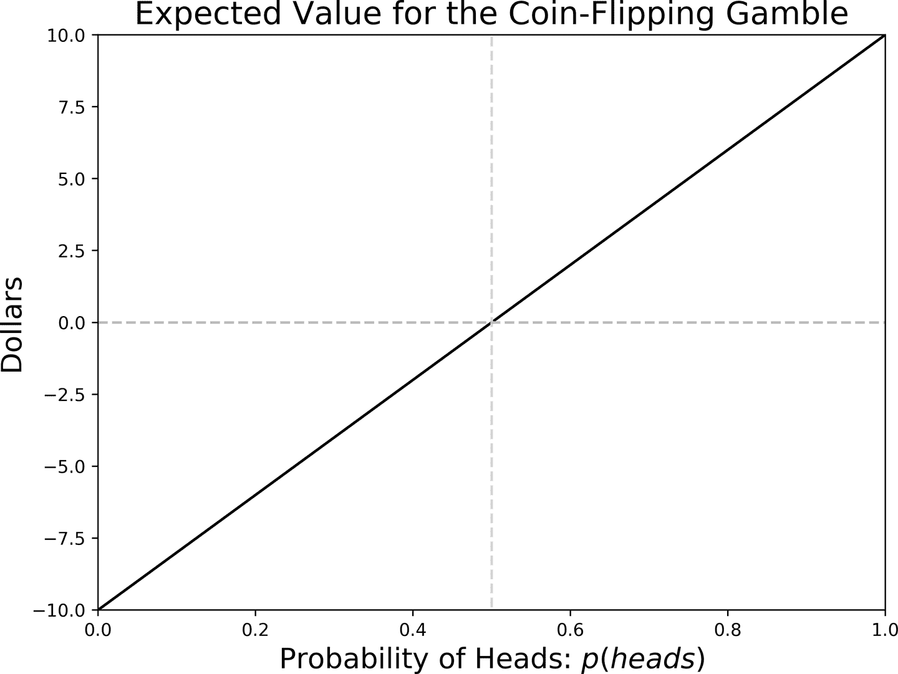
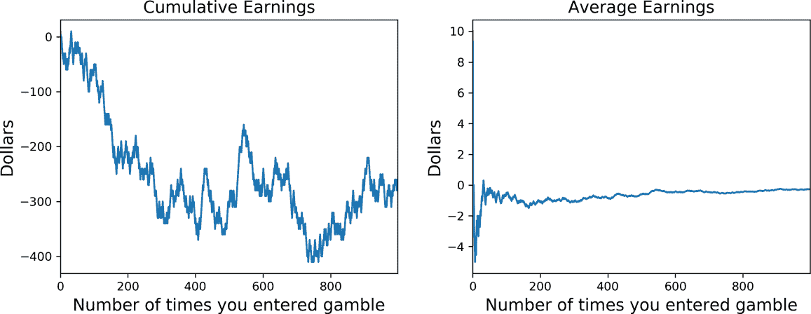

# 第六章：不确定性

本杰明·富兰克林经常被引用说：“在这个世界上，除了死亡和税收，没有任何事情是确定的。”冒着显而易见的风险，我要声明的是，*生活中唯一确定的事情就是不确定性*。正如我们将在本章看到的那样，我们不仅必须掌握简化的艺术，还必须尽力理解不确定性的根源，并在我们对行动结果不确定时如何做出决策（参见图 6-1）。


###### 图 6-1\. 理解潜在的不确定性

本章的主要要点是，为了在不确定性下做出决策，我们将寻求最大化我们业务结果的数学期望。因此，我们必须首先提供足够的概率论背景，以便我们能够在计算期望时感到自信。我还将介绍在不确定性下决策理论的基础知识，并最终将这个工具箱应用到我们的用例中。

# 不确定性从何而来？

在科学中，不确定性或随机性通常与我们对某些现象*原因*的缺乏知识有关。那么不确定性从何而来呢？我们在第二章已经讨论过这个问题，所以让我简要总结一下那里提到的内容。

许多时候，我们不确定的根源实际上反映了我们对行动或我们观察到的任何现象的原因或后果的*无知*。但它也可能是我们需要将世界的复杂性简化掉（对于手头的问题不是首要的）。有时，我们可能对效应的方向或符号（如需求法则）的预测感到非常自信，但我们可能对*异质*群体中不同幅度感到不确定。最后，不确定性可能源于*复杂*行为和社会互动，甚至可能遵循简单的确定性规则。

当然，这份清单并不是详尽无遗的。但是，大多数不确定事件可以归类为这些类别之一。

# 量化不确定性

我们都具备对不确定事件进行定性比较的能力。例如，根据我们的经验和其他一些证据，我们可能能够说明明天下雨的可能性比不下雨的可能性大。但是，我们如何将这种定性比较变为定量比较呢？概率计算专门设计为使我们能够处理和处理不确定性。在这里，我将对概率论进行简要而简化的总结，但如果您对更详细的处理感兴趣，请查看本章末尾的参考资料。

在我们的背景下，我们有兴趣量化不确定后果发生的概率，考虑到我们的行动。现在让我们看一些例子。在客户流失的背景下，我们可以向客户提供保留优惠，但她可能会决定流失或者不流失。在这里，我们真正不确定两件事：即使我们不提供优惠，客户是否可能流失？我们的优惠是否会影响这一事件发生的概率（以及如何影响）？

约会呢？今晚我应该去见那个相亲对象吗？在这种情况下，行动是出门或不出门。这个问题下有许多不确定性，但由于我们有一个特定的目标——比如，认识一个你可以继续约会的特别的人——我们可以简化问题，只考虑按照这个目标来看，约会将会成功的概率。从一开始应该清楚的是，如果我们决定待在家里，那么遇到重要人士的概率为零。

要简化事情，只考虑二元结果的情况，即我们的行动带来的后果要么令人满意，要么不满意。¹ 没有中间地带，这两种选择是互斥的：只能有一个是真实的。用<math alttext="p left-parenthesis upper S right-parenthesis"><mrow><mi>p</mi> <mo>(</mo> <mi>S</mi> <mo>)</mo></mrow></math> 表示在我们的行动下后果为*satisfactory*的概率。有时我们会让概率依赖于我们的行动，并将其表示为<math alttext="p left-parenthesis upper S vertical-bar a right-parenthesis"><mrow><mi>p</mi> <mo>(</mo> <mi>S</mi> <mo>|</mo> <mi>a</mi> <mo>)</mo></mrow></math> ，读作行动<math alttext="a"><mi>a</mi></math> 被采取时结果将成功的概率。以下是概率函数的典型特性：

+   <math alttext="0 less-than-or-equal-to p left-parenthesis upper S right-parenthesis less-than-or-equal-to 1"><mrow><mn>0</mn> <mo>≤</mo> <mi>p</mi> <mo>(</mo> <mi>S</mi> <mo>)</mo> <mo>≤</mo> <mn>1</mn></mrow></math>

    这表明概率是一个介于零和一之间的数字——零表示我们绝对确定事件*不*会发生，而一则表示另一个极端的情况。

+   <math alttext="p left-parenthesis upper S right-parenthesis plus p left-parenthesis not upper S right-parenthesis equals 1"><mrow><mi>p</mi> <mo>(</mo> <mi>S</mi> <mo>)</mo> <mo>+</mo> <mi>p</mi> <mo>(</mo> <mtext>not</mtext> <mi>S</mi> <mo>)</mo> <mo>=</mo> <mn>1</mn></mrow></math>

    由于在二元结果世界中事件是互斥的，这意味着两个概率的总和必须为一。或者，我们可以将失败（不成功）的概率表示为成功的概率的一减。

这两个特性现在对我们来说就足够了，但请注意，更一般的性质涵盖了我们有许多可能结果并且其中一些可能不是互斥的情况。第二个特性被称为加法法则，概率的微积分还配备了一个*乘法*规则，允许我们更新概率估计（贝叶斯定理）等。

## 预期值

假设你参与以下赌博：我将抛硬币，如果正面朝上你*赢得*$10；否则你*损失*$10\. 如果你决定参与，你如何评估这个赌博的价值？正式地说，我们定义了一个*随机变量* <math alttext="upper X"><mi>X</mi></math>，根据不确定的结果可以取两个值：如果是正面，取值为 10；如果是反面，取值为–10。

请注意，随机变量是数学函数，将不确定结果集（例如我们例子中的反面或正面）的每个元素映射到数字（在例子中为–10 和 10）。如果我们有 5 个可能的结果（或 10 个，或无限个），每个都有一个指定的概率，随机变量将为这 5 个（或 10 个，或无限个）结果分配一个数字。此外，由于这是一个数学函数，每个结果必须分配到一个且仅一个数字；然而，可能有几个结果被分配到同一个数字。在极端情况下——恒定函数的情况下——所有结果都被分配到同一个数字。随机变量使我们能够将随机结果转化为数字，这非常方便，因为我们知道如何处理它们。

在我们的赌博案例中，不确定性源于我们不知道硬币是正面还是反面，因此我们的奖品是未知的。我们可以定义我们赌博的*期望值*为奖品的平均值，按概率*加权*：

<math alttext="upper E left-parenthesis prize right-parenthesis equals p left-parenthesis t a i l s right-parenthesis times left-parenthesis negative 10 right-parenthesis plus p left-parenthesis h e a d s right-parenthesis times 10" display="block"><mrow><mi>E</mi> <mo>(</mo> <mtext>prize</mtext> <mo>)</mo> <mo>=</mo> <mi>p</mi> <mo>(</mo> <mi>t</mi> <mi>a</mi> <mi>i</mi> <mi>l</mi> <mi>s</mi> <mo>)</mo> <mo>×</mo> <mo>(</mo> <mo>-</mo> <mn>10</mn> <mo>)</mo> <mo>+</mo> <mi>p</mi> <mo>(</mo> <mi>h</mi> <mi>e</mi> <mi>a</mi> <mi>d</mi> <mi>s</mi> <mo>)</mo> <mo>×</mo> <mn>10</mn></mrow></math>

如果我们的硬币是公平的——每一面都有 50%的概率出现——期望值就是 0.5 × –10 + 0.5 × 10 = 0。图 6-2 展示了不同正面概率的期望值。注意它与概率*线性*变化；这是一个在应用中非常有用的优良特性。当我们确定会正面朝上时，我们期望获得全部$10\. 另一方面，如果硬币总是反面朝上，我们就会确定损失$10。



###### 图 6-2\. 不同正面概率的期望值，我们抛硬币的例子

### 投标州际公路建设合同

让我们再看一个例子。假设你的公司考虑参与新的公开投标，以建造一条州际公路。监管机构决定，任何想参与的公司必须支付固定的参与费用$10K。财务部门估计，如果合同被授予，公司的长期增量利润将为$1 百万。经过深思熟虑，团队的数据科学家估计，赢得合同的概率为 80%。让我们计算如果我们决定参与，*期望利润*是多少：

<math alttext="upper E left-parenthesis profits right-parenthesis equals 0.8 times normal dollar-sign 1 upper M plus 0.2 times normal dollar-sign 0 minus normal dollar-sign 10 upper K equals normal dollar-sign 790 upper K" display="block"><mrow><mi>E</mi> <mo>(</mo> <mtext>profits</mtext> <mo>)</mo> <mo>=</mo> <mn>0</mn> <mo>.</mo> <mn>8</mn> <mo>×</mo> <mi>$</mi> <mtext>1M</mtext> <mo>+</mo> <mn>0</mn> <mo>.</mo> <mn>2</mn> <mo>×</mo> <mi>$</mi> <mn>0</mn> <mo>-</mo> <mi>$</mi> <mtext>10K</mtext> <mo>=</mo> <mi>$</mi> <mtext>790K</mtext></mrow></math>

注意，您支付的进入成本*独立*于公司是否赢得合同，因此不会影响期望值的计算。唯一不确定的量是是否具有或不具有合同的预期增量利润的价值。还要注意，期望值保留了所考虑随机变量的单位。在这种情况下，如果我们参与投标，我们预计将赚取$790K。

### 解释期望值

我们应该如何解释期望值？根据一种观点——*频率学派*，我们可以将一个实验看作是在相同条件下*多次*进行的实验。在抛硬币的例子中，如果您无限次重复赌博，期望值就是您长期收益的（简单）算术平均数：当您赢得时（长期内大约 50%的时间），您的长期收益增加$10，而当您输掉时则减少$10。简单平均值通过将您的总收益除以您进入赌博的次数来获得。

图 6-3 显示了这种赌博的 1,000 次实现示例，使用下面的代码片段获得（例 6-1）。左面板显示了随时间累积的总收益：在这种情况下，玩家从一个输的局面开始，至少在前 1,000 次重复中，他们没有完全恢复。² 右面板显示了平均收益，可以看到它们非常快速地收敛到零美元的期望值。



###### 图 6-3\. 重复抛硬币赌博 1,000 次

##### Example 6-1\. 平均长期收益作为期望值

```
import numpy as np
import pandas as pd
np.random.seed(1005)
# Initialize
N = 1000
total_earnings = pd.DataFrame(index= np.arange(N),columns = ['earnings'])
for i in range(N):
    # Draw from a uniform distribution
    draw = np.random.rand()
    # Heads if p>=0.5
    if draw>=0.5:
        curr_earn = 10
    else:
        curr_earn = -10
    total_earnings.earnings.loc[i] = curr_earn

# compute cumulative and average
total_earnings['cumulative_earnings'] = total_earnings.earnings.cumsum()
total_earnings['trials'] = np.arange(1,N+1)
total_earnings['avg_earnings'] = (total_earnings.cumulative_earnings /
                                  total_earnings.trials)
# ready to plot
fig, ax = plt.subplots(1,2, figsize=(10,4))
total_earnings.cumulative_earnings.plot(ax=ax[0])
ax[0].set_title('Cumulative Earnings', fontsize=14)
ax[1].set_title('Average Earnings', fontsize=14)
ax[0].set_ylabel('Dollars', fontsize=14)
ax[1].set_ylabel('Dollars', fontsize=14)
ax[0].set_xlabel('Number of times you entered gamble', fontsize=14)
ax[1].set_xlabel('Number of times you entered gamble', fontsize=14)
total_earnings.avg_earnings.plot(ax=ax[1])
plt.tight_layout()
```

尽管频率学派的解释如此简单——因为您可以想象概率表示如果您无限次重复赌博时发生的频率——但它可能存在问题。如果我们知道这种赌博只会发生一次，那重复多次是什么意思呢？更糟糕的是，想想公共投标的情况。如果我们如何想象在当前投标的*确切*条件下多次参与呢？贝叶斯学派的支持者认为，有许多情况下，无限重复解释并不自然；他们认为在这些情况下，每个人的概率评估可能不会与长期发生频率完全一致。在这种情况下，主观概率量化了我们每个人可能拥有的不确定性程度，因此可能根本不会完全一致。

# 贝叶斯学派与频率学派的思想

本章提到的两种思想流派是经典或频率学派和贝叶斯学派。20 世纪在它们对概率解释的观点之间进行了非常激烈的辩论。广义上说，经典学派认为概率是长期发生频率，而贝叶斯学派认为概率是对不确定性的主观评估。它被称为*贝叶斯*，因为在他们看来，我们都是从先验主观信念开始，一旦获得新证据，就通过贝叶斯法则进行更新。

# 在没有不确定性的情况下做出决策

在不确定性条件下做出决策很困难，因为我们必须首先掌握概率计算。一个有用的技巧是始终从简单开始，假设消除任何潜在的不确定性：如果我们知道与我们问题相关的所有内容，我们会如何选择？这有助于我们澄清许多事情，首先是我们是否实际上有可以实现我们目标的手段。

首先考虑图 6-4 中的决策。我们希望获得可能的最大收入，我们正在考虑两种替代行动：我们可以打折，这样我们的收入将为 155K 美元，或者我们可以推动我们的在线营销活动，生成 131K 美元。由于我们假设消除了所有不确定性，所有这些数量都是已知的。

我们应该怎么做？在这种情况下，事情很明确，我们决定选择价格折扣。这是因为我们选择了收入作为我们的目标，并且我们希望尽可能产生最大的收入。


###### 图 6-4\. 在确定性下选择一个杠杆

没有不确定性的决策相对来说比较容易解决，但这很可能是我们（希望的）有意选择简化的结果。为了看清楚这一点，考虑图 6-5 中显示的两种情况。我们有两个杠杆（A 和 B）和两个目标：收入和客户满意度。理想世界是左面板中的那种，那里两个目标都一致，我们选择行动 A，因为在考虑的两个指标下，它优于 B。但很多时候，目标看起来更像右面板中的那种，我们需要在一个目标与另一个目标之间进行权衡。


###### 图 6-5\. 具有多个目标的决策

即使在我们对行动与结果之间的映射完全确定的情况下，我们应该如何尝试解决这个问题呢？一种可能性是尝试用相同的标准来衡量一切，比如美元。我们能把客户满意度转化为美元吗？这是另一个需要量化的不确定映射，但如果我们成功了，那么我们就在进行苹果与苹果的比较，我们会得到一个简单的优化维度。

# 在不确定性下做出简单的决策

让我们修改上一节的简单决策问题，现在假设我们的客户可能会接受或不接受我们的价格优惠（见图 6-6）。他们有 80%的概率接受，剩下的 20%的概率拒绝我们的报价。在前一种情况下，我们可以获得额外的 155K 美元的收入，如果他们拒绝我们的报价，我们将一无所获。我们的第二个杠杆仍然与以往一样。我们应该如何处理这个决定？


###### 图 6-6。相同的决策，但现在存在不确定性

让我们计算我们的两个杠杆的预期收入，首先从市场营销活动开始，因为它没有不确定性。在这种情况下，预期收入是我们决定追求此行动时观察到的收入（$131K）。对于价格优惠活动，预期值是 124K 美元的收入，通过计算期望可以轻松看出：

*E*(收入) = 0.8 × 155K 美元 + 0.2 × 0 = 124K 美元

您会选择哪个报价？将不确定的折扣（期望为 124K 美元）与确定的营销活动（131K 美元）进行比较，我们看到后者有更高的收入，决定继续前进。

此时，您可能会认为*无论如何*您都更喜欢确定的行动（营销活动），因为有这个“平庸”的结果总比没有好。在这种情况下，您可能会表现得像一个*风险回避者*——或多或少是一个极端版本，并且因此您更喜欢安全赌注。但让我尝试通过以下问题来挑战这个立场：鉴于这些概率（80-20），是否有任何奖励可以使您接受赌注？

假设我们的数据科学家重新评估了价格优惠活动的收入，为 164K 美元。您可以再次计算期望值（0.8 × 164K 美元 = 131.20K 美元），将其与确定结果进行比较，现在根据这个期望值标准，您应该选择价格优惠杠杆。图 6-7 显示了预期值如何随着该活动不同可能的收入估计而变化。您还有犹豫吗？


###### 图 6-7。价格优惠活动不同结果的预期收入

如果我们的数据科学家现在估计折扣活动的收入为 200K 美元（期望值=160K 美元）？或者 500K 美元（期望值=400K 美元）或 100 万美元（期望值=800K 美元）？我怀疑您仍然不愿进入赌局，但我们将在本章后面进一步讨论这个问题。

预期值允许我们比较不确定的结果，所以当面对不确定的决策时，这将是我们的标准。现在让我们更深入地探讨在面对不确定性时做出决策时的困难。

# 不确定条件下的决策

不确定性的主要困难在于我们在选择行动时无法确定决策结果。正如常说的那样，*一旦我们做出决策，不确定性就会揭示*，在这时我们可能会后悔自己的选择，如果实现不尽人意的话。

图 6-9 显示了在我们面对不确定性时所面临的主要困难及其解决方案。从左上角开始，第 1 面板展示了我们的选择以及我们的杠杆 <math alttext="upper A comma upper B"><mrow><mi>A</mi> <mo>,</mo> <mi>B</mi></mrow></math> 如何映射到不确定的后果（接受/拒绝每个提议）。它们以概率 <math alttext="p Subscript upper A"><msub><mi>p</mi> <mi>A</mi></msub></math> 接受杠杆 <math alttext="upper A"><mi>A</mi></math> ，以概率 <math alttext="p Subscript upper B"><msub><mi>p</mi> <mi>B</mi></msub></math> 接受杠杆 <math alttext="upper B"><mi>B</mi></math> 。这是这个假设情景中的潜在不确定性。


###### 图 6-9\. 不确定性的解剖

第 2 面板显示我们面临的主要问题：我们必须在不确定性得到解决之前做出决策，通常称为*前期*阶段。理想情况下，如果我们能在不确定性解决后看到实际结果，我们可以做出*事后*最优决策，但这并不是在不确定性下做出决策的方式。我们必须面对在不确定性解决之前做出决策这一事实。

第 3 面板展示了我们在不确定性下做出选择的方式：我们通过计算每个替代方案（我们的杠杆）的预期值来评估它们，并选择最大化期望的那个。必须明确的是，这并不保证事后最优性：我们可能会选择最大化预期值的选项，但在不确定性解决后仍然得到次优结果。

为什么会这样？很可能是因为我们对概率没有良好的估计，要么是因为缺乏良好的数据，要么是因为我们没有充分利用我们的机器学习工具包，或者是因为我们没有花足够的时间理解我们潜在不确定性的来源。但*即使我们做了*，有时候我们真的只是运气不好。

## 这是我们能做到的最好吗？

在面对不确定性时，期望值方法已成为标准。但在前期或在不确定性解决之前，这是我们能做到的最好吗？让我们探讨一些替代方案。

假设我们不是选择最大化预期值的杠杆，而是忽视不确定性并始终选择具有最高回报的替代方案。如果你只遇到这种决策一次，有时你会后悔，有时你不会：这实际上取决于概率值和确切实现的情况。

由于再次做出的决策并没有得出结论，假设我们像频率学家一样多次遇到完全相同的赌注。如果你计算两种方法的*累积*收益，你会很高兴地得出结论，即在长期内，最大化预期效用是无条件更好的。

图 6-10 显示了如果我们面临同一决策 100 次，则从这两种决策标准中获得的累积收益。使用示例 6-2 中显示的代码创建了该图：

##### 示例 6-2\. 在长期内，最大化期望值是（次佳）最优的

```
def get_exante_earnings(accepts_a, accepts_b, exante_choice, clv_a, clv_b):
    '''
 Our earnings depend on customers' acceptance of each offer and
 Expected Utility
 1\. If E(A)>E(B): we choose to offer alternative A
 If customer accepts A we make CLV_A otherwise we make 0
 2\. If E(A)<E(B): we offer B
 If customer accepts B we make CLV_B otherwise 0
 '''
    earn_ea = 0
    if accepts_a == True and exante_choice=='a':
        earn_ea = clv_a
    elif accepts_b == True and exante_choice=='b':
        earn_ea = clv_b
    return earn_ea

def get_expost_earnings(accepts_a, accepts_b, clv_a, clv_b):
    '''
 Ex-post is first-best: we choose as if there was no uncertainty
 1\. If customer accepts A and not B -> offer A
 2\. If customer accepts B and not A -> offer B
 3\. If customer accepts both -> offer the best for us
 '''
    earn_ep = 0
    if accepts_a == True and accepts_b ==False :
        earn_ep = clv_a
    elif accepts_a == False and accepts_b ==True :
        earn_ep = clv_b
    elif accepts_a == True and accepts_b ==True :
        earn_ep = np.max(np.array([clv_a, clv_b]))
    return earn_ep

def get_maxvalue_earnings(accepts_a, accepts_b, clv_a, clv_b):
    '''
 Rule: if CLV_A>CLV_B -> offer A (otherwise B)
 Earnings: we only make corresponding CLV if it aggrees with acceptance
 '''
    earn_mv = 0
    if clv_a>=clv_b and accepts_a ==True:
        earn_mv = clv_a
    elif clv_a<=clv_b and accepts_b == True:
        earn_mv = clv_b
    return earn_mv

np.random.seed(7590)
# Customer lifetime values if accepts (otherwise 0)
clv_a = 10
clv_b = 11
# acceptance probability
prob_a = 0.6
prob_b = 0.5
# expected values and optimal choice under expected utility
evalue_a = prob_a*clv_a + (1-prob_a)*0
evalue_b = prob_b*clv_b + (1-prob_b)*0
if evalue_a> evalue_b:
    exante_choice = 'a'
else:
    exante_choice = 'b'
# simulate T choices: earnings initialized to 0
T = 100
total_earnings = pd.DataFrame(index=np.arange(T),
                         columns=['exante','expost','max_prob','max_value'])
for t in range(T):
    # Simulate uncertain choices by our customers
    accepts_a = np.random.rand() <= prob_a
    accepts_b = np.random.rand() <= prob_b
    # Ex-ante Optimal:
    total_earnings.exante.loc[t] = get_exante_earnings(accepts_a, accepts_b,
                     exante_choice, clv_a, clv_b)
    # Ex-post optimal:
    total_earnings.expost.loc[t] = get_expost_earnings(accepts_a, accepts_b,
                     clv_a, clv_b)
    # Always choose max_value
    total_earnings.max_value.loc[t] = get_maxvalue_earnings(accepts_a,
                     accepts_b, clv_a, clv_b)

# ready to plot
fig, ax = plt.subplots(1,2, figsize=(12,4))
total_earnings.expost.cumsum().plot(ax=ax[0],color='k', ls='-',lw=5)
total_earnings.exante.cumsum().plot(ax=ax[0],color='k', ls='--')
ax[0].set_title('Cumulative Realized Earnings', fontsize=16)
total_earnings.max_value.cumsum().plot(ax=ax[0],color='k', ls='dotted')
df_relative_earnings = pd.DataFrame(total_earnings.max_value.cumsum() /
                       total_earnings.exante.cumsum(), columns=['ratio'])
df_relative_earnings.ratio.plot(ax=ax[1],fontsize=16, legend=None, color='k')
ax[1].plot([0,100],[1,1], ls='--', alpha=0.5, color='0.15')
ax[1].set_title('Ratio of Max Value to Ex-Ante', fontsize=16)
ax[1].set_xlabel('Number of times you make the same decision', fontsize=12)
ax[0].set_xlabel('Number of times you make the same decision', fontsize=12)
ax[0].set_ylabel('Dollars',fontsize=12)
ax[1].set_ylabel('Dollars',fontsize=12)
plt.tight_layout()
```

次后决策有时被称为*第一最佳*。这是因为我们实际上是假设消除了任何不确定性，就像我们有一个魔球并知道客户将接受什么一样。因此，这总是一个比较任何其他决策标准的良好基准。我还展示了两种额外标准的模拟收益：最大化期望值（标记为*Ex-ante*）和始终选择具有最高确定收益的替代方案（标记为*Max-Value*，在我们的例子中是选项 B）。


###### 图 6-10\. 在不确定性下评估不同决策标准

左图显示，第一最佳确实是最佳的可能结果。在这个模拟中，选择 B 在短期内由于几个良好的初始实现而优于期望值计算（“Ex-ante”）。但在长期内，这种行为会逆转，如果我们一直使用期望值计算，我们本可以获得更多的收入。答案是，使用这组实现，*我们会后悔没有使用期望值标准*。

右图显示了我们本可以赚取的额外收益的百分比。一开始，选择 B 的几个好的初步实现（具有更高的 CLV）使得 MaxValue 标准优于使用期望值。由于发生的频率在长期内收敛到概率，我们开始看到 Ex-ante 标准开始占主导地位。

注意，如果你的选择仅基于概率——比如，总是选择有更高被接受概率的杠杆——可以提出类似的论点。

## 但这是一个频率学的论点

前面的例子表明，最大化期望值比我们提出的两种替代方案更好：忽略不确定性并选择如果被接受给出最高收入的杠杆，以及忽略收入并选择具有最高接受概率的杠杆。在这两种情况下，长期来看，我们将会对使用这些决策标准感到遗憾。

但我之前提到过，这种频率学解释在许多现实业务场景中可能不合适：在完全相同条件下多次模拟同一决策*不同不确定性的实现*的整个想法是有问题的。

决策理论家们几十年来一直在与这个困境作斗争，答案是所谓的公理化方法。在这种解决方案下，我们不需要假设一个频率主义的理由，而是提出一些行为公理，当满足时保证我们表现得*好像我们最大化了期望值*。在进一步阅读部分中，我将提到一些这种方法的参考文献，但我要说的是，并不是从公理化方法中得出最大化期望值是我们能做到的最好的。然而，公理化方法保证了，最大化期望值是理性的行为。

# 决策制定的规范性和描述性理论

可以将期望值准则视为不确定情况下决策制定的一种理论。当面对涉及不确定结果的决策时，我该*怎么*决定？而我应该*怎么*决定？这是我们已经遇到的两个非常不同的问题：前者*描述*了做什么，后者提供了一个*规范*或推荐最佳行动的建议。

由于在我们日常选择中，大多数人不做期望值计算，这必然意味着期望效用理论——如它所称呼的——并不是我们做决策的准确描述。但是它是一个好的*规范*理论吗？也就是说，如果我们能够做这样的计算，我们会更好吗？正如前一节讨论的那样，在频率主义解释下，答案是肯定的。*如果我们采纳期望效用准则，我们将为我们的公司做出更好的决策*。这就是为什么我们把它包括在我们的分析工具中的原因。

# 在不确定性下做出决策时的一些悖论

假设你面对以下的赌博：你有 0.001 的概率赢得 100 万美元的奖品，否则什么都没有。你愿意为这张彩票支付的最高金额是多少？正如你可能预料的那样（无意冒犯），它就是这个赌博的期望值。

让我们计算任意给定的参与价格（ <math alttext="y"><mi>y</mi></math> ）的*预期利润*：

<math alttext="upper E left-parenthesis profits right-parenthesis equals 0.001 times normal dollar-sign 1 upper M negative y greater-than-or-equal-to 0" display="block"><mrow><mi>E</mi> <mo>(</mo> <mtext>profits</mtext> <mo>)</mo> <mo>=</mo> <mtext>0.001</mtext> <mo>×</mo> <mi>$</mi> <mtext>1M</mtext> <mo>-</mo> <mi>y</mi> <mo>≥</mo> <mn>0</mn></mrow></math>

最后一个不等式表明，我们参与的条件应该是不亏损的预期结果更好。由此可知，我们应该支付的最高价格是在我们打平的情况下找到的：<math alttext="y 上标 M"><msup><mi>y</mi> <mi>M</mi></msup></math> = $1,000。

为了使这个例子更加现实，让我们考虑一下美国的 Mega Millions 彩票，并且假设我们的彩票中奖的概率是 302,575,350 分之一。³ 在撰写本文时，每张彩票的成本为$2\. 在这个价格下，我们应该愿意参与的最低奖池是$605M。⁴

许多人即使根据预期价值准则并不最优也会玩彩票，因此作为描述性决策理论似乎并没有做得很好。

现在想象一下以下彩票：为了参与，你必须支付你所有的储蓄（比如 100 美元）。以<math alttext="1 upper E minus 6"><mrow><mn>1</mn> <mi>E</mi> <mo>-</mo> <mn>6</mn></mrow></math>的概率你赢得你的储蓄的 1000001 倍。其余的概率你什么也不赢（因此你失去了一切）。⁵

<math alttext="upper E left-parenthesis prize right-parenthesis equals 0.000001 times left-parenthesis 1000001 times normal dollar-sign 100 right-parenthesis equals normal dollar-sign 100.0001" display="block"><mrow><mi>E</mi> <mo>(</mo> <mtext>prize</mtext> <mo>)</mo> <mo>=</mo> <mn>0</mn> <mo>.</mo> <mn>000001</mn> <mo>×</mo> <mo>(</mo> <mn>1000001</mn> <mo>×</mo> <mi>$</mi> <mn>100</mn> <mo>)</mo> <mo>=</mo> <mi>$</mi> <mn>100</mn> <mo>.</mo> <mn>0001</mn></mrow></math>

这里选择的概率和奖励是根据预期效用准则，无论你的储蓄多少，参与赌博都*总是更好*。但是你会参与吗？我知道我不会。

这导致了关于不确定性的决策理论中最著名的悖论。

## 圣彼得堡悖论

假设你被提供以下赌博：我将抛一枚公平的硬币——因此正面和反面出现的概率均等——如果第一次正面朝上出现在第 n 次抛掷时，我将给你<math alttext="2 Superscript n"><msup><mn>2</mn> <mi>n</mi></msup></math>美元。由于这是一枚公平的硬币，第一次抛掷出现正面的概率为<math alttext="1 slash 2"><mrow><mn>1</mn> <mo>/</mo> <mn>2</mn></mrow></math>，第二次抛掷的概率为<math alttext="left-parenthesis 1 slash 2 right-parenthesis squared"><msup><mrow><mo>(</mo><mn>1</mn><mo>/</mo><mn>2</mn><mo>)</mo></mrow> <mn>2</mn></msup></math>——在第一次抛掷显示尾部的概率为<math alttext="1 slash 2"><mrow><mn>1</mn> <mo>/</mo> <mn>2</mn></mrow></math>，并且以相同的概率显示第一个正面——因此第一次正面朝上出现在第 n 次抛掷的概率为<math alttext="left-parenthesis 1 slash 2 right-parenthesis Superscript n"><msup><mrow><mo>(</mo><mn>1</mn><mo>/</mo><mn>2</mn><mo>)</mo></mrow> <mi>n</mi></msup></math>。⁶ 让我们计算奖金的期望值：

<math alttext="upper E left-parenthesis prize right-parenthesis equals one-half 2 plus one-fourth 4 plus one-eighth 8 plus ellipsis equals 1 plus 1 plus 1 plus ellipsis" display="block"><mrow><mi>E</mi> <mrow><mo>(</mo> <mtext>prize</mtext> <mo>)</mo></mrow> <mo>=</mo> <mfrac><mn>1</mn> <mn>2</mn></mfrac> <mn>2</mn> <mo>+</mo> <mfrac><mn>1</mn> <mn>4</mn></mfrac> <mn>4</mn> <mo>+</mo> <mfrac><mn>1</mn> <mn>8</mn></mfrac> <mn>8</mn> <mo>+</mo> <mo>⋯</mo> <mo>=</mo> <mn>1</mn> <mo>+</mo> <mn>1</mn> <mo>+</mo> <mn>1</mn> <mo>+</mo> <mo>⋯</mo></mrow></math>

正如你可以看出，概率和奖励被选择得让预期奖金无限增长。这个悖论的产生是因为没有人愿意支付这样的金额参与这个赌注——通常称为*公平价格*。

在 18 世纪，数学家丹尼尔·伯努利提出了一个解决方案：我们不应该按面值估价每个奖品，而是应该使用一个展示每额外一美元对我们价值递减的效用函数。他提出的解决方案是用自然对数（一个很好的凹函数，因此显示出边际效用递减和我们已经学到的风险规避）来估价每个奖品。

图 6-11 显示了两种选择的期望值。正如之前所示，线性情况下的期望效用随抛硬币次数成正比增长。另一方面，对数情况下的期望效用很好地收敛到小于 1.4 utils（效用的测量单位），大约在 15 次实现后达到这一水平。因此，我们应该支付参与不超过 15 轮的赌注。之后的增量价值对我们来说是零。


###### 图 6-11\. 使用对数和线性效用函数的期望值

对于我们来说，这个悖论很重要，因为到目前为止，我们一直按照我们赚的美元面值来评估我们的效用。我们甚至用期望值计算找到了最大值——公平值。这个悖论提醒我们，在使用风险中性效用函数时要小心，因为我们可能会破产。

## 风险厌恶

正如圣彼得堡悖论提醒我们的那样，有时候用凹效用函数来建模我们的选择很重要，因为它们不仅显示出边际效用递减，而且显示出对风险的厌恶偏好。我们之前简要提到过风险厌恶，但在商业应用中为什么重要并不明显，所以让我们重新审视 图 6-6 的例子，但改变概率（图 6-12）。


###### 图 6-12\. 重新审视折扣与营销活动的例子

现在你可以检查一下，冒险决策的期望值是否等于营销活动的确定收入。严格来说，由于两个杠杆的数学期望相同，我们对两者应该是*无差别*的。我们可以随机选择其中一个，始终选择第一个或最后一个，或者使用其他与期望值计算无关的决策标准。我不知道你怎么看，但我对这个建议并不满意：在我的情况下，我总是更喜欢确定的结果，所以这个分析机制实际上推荐这样的行动会让人惊讶。

或许你还记得，到目前为止我们使用的是线性（风险中性）效用函数，将每个美元映射为一单位效用（ <math alttext="u left-parenthesis x right-parenthesis equals x"><mrow><mi>u</mi> <mo>(</mo> <mi>x</mi> <mo>)</mo> <mo>=</mo> <mi>x</mi></mrow></math> ）。但前面的讨论表明，我并不真的是风险中性的；事实上，我会避免参与赌局并选择确定的收入。所以这里是我们谜题的答案：我们应该用一个凹函数来替换我们的风险中性效用函数，这个函数更能捕捉到我们对风险的偏好。为了表达清楚，让我们使用丹尼尔·伯努利提出的方案，将美元映射为对数美元。

对于不确定价格折扣，我们得到：

<math alttext="upper E left-parenthesis Revenue vertical-bar Discount right-parenthesis equals StartFraction 131 Over 155 EndFraction times log left-parenthesis 155 right-parenthesis equals 4.3" display="block"><mrow><mi>E</mi> <mrow><mo>(</mo> <mtext>Revenue|Discount</mtext> <mo>)</mo></mrow> <mo>=</mo> <mfrac><mn>131</mn> <mn>155</mn></mfrac> <mo>×</mo> <mo form="prefix">log</mo> <mrow><mo>(</mo> <mn>155</mn> <mo>)</mo></mrow> <mo>=</mo> <mn>4</mn> <mo>.</mo> <mn>3</mn></mrow></math>

我们已经知道如何计算市场营销活动的预期收益：

<math alttext="upper E left-parenthesis Revenue vertical-bar Mkt period Campaign right-parenthesis equals 1 times log left-parenthesis 131 right-parenthesis equals 4.9" display="block"><mrow><mi>E</mi> <mo>(</mo> <mtext>Revenue|Mkt.Campaign</mtext> <mo>)</mo> <mo>=</mo> <mn>1</mn> <mo>×</mo> <mo form="prefix">log</mo> <mo>(</mo> <mn>131</mn> <mo>)</mo> <mo>=</mo> <mn>4</mn> <mo>.</mo> <mn>9</mn></mrow></math>

现在我们应该继续进行市场营销活动。如果你想知道这是否适用于任何其他凹函数，答案是*是*，因为它很好地遵循了凹性的定义。

因此，好消息是，我们可以继续使用期望效用准则来解决业务问题。坏消息是，我们增加了另一层复杂性，现在可能需要为我们的应用选择一个风险厌恶的效用函数：我们可以得到更清晰的决策，但只是以失去线性的代价。我的建议是从简单开始，假设风险中立（线性世界起步更容易）。一旦你理解了这个更简单的问题，你可以尽力理解你的利益相关者对风险的偏好，如果需要的话进行一些校准。如果你感兴趣，一些常用于模拟风险厌恶的效用函数列在方程 6-1 到 6-3 中。可以用自由参数进行校准。

##### 方程 6-1\. 对数效用函数（无自由参数）

<math alttext="u left-parenthesis x right-parenthesis equals ln left-parenthesis x right-parenthesis" display="block"><mrow><mi>u</mi> <mo>(</mo> <mi>x</mi> <mo>)</mo> <mo>=</mo> <mo form="prefix">ln</mo> <mo>(</mo> <mi>x</mi> <mo>)</mo></mrow></math>

##### 方程 6-2\. 多项式效用函数

<math alttext="u left-parenthesis x right-parenthesis equals x Superscript a Baseline for a element-of left-parenthesis 0 comma 1 right-parenthesis" display="block"><mrow><mi>u</mi> <mrow><mo>(</mo> <mi>x</mi> <mo>)</mo></mrow> <mo>=</mo> <msup><mi>x</mi> <mi>a</mi></msup> <mtext>for</mtext> <mi>a</mi> <mo>∈</mo> <mrow><mo>(</mo> <mn>0</mn> <mo>,</mo> <mn>1</mn> <mo>)</mo></mrow></mrow></math>

##### 方程 6-3\. 指数效用函数：常绝对风险厌恶（CARA）

<math alttext="u left-parenthesis x right-parenthesis equals 1 minus e Superscript minus a x Baseline for a greater-than 0" display="block"><mrow><mi>u</mi> <mrow><mo>(</mo> <mi>x</mi> <mo>)</mo></mrow> <mo>=</mo> <mn>1</mn> <mo>-</mo> <msup><mi>e</mi> <mrow><mo>-</mo><mi>a</mi><mi>x</mi></mrow></msup> <mtext>for</mtext> <mi>a</mi> <mo>></mo> <mn>0</mn></mrow></math>

我们可以结合多项式和对数效用函数的归一化版本，创建经济学家常用的*常相对风险厌恶*函数。风险厌恶系数依赖于效用函数的相对曲率。例如，在指数情况下，<math alttext="a"><mi>a</mi></math> 是绝对风险厌恶的系数。在 方程 6-4 中展示的 CRRA 情况下，<math alttext="rho"><mi>ρ</mi></math> 是相对风险厌恶的系数。如果你对了解这两者之间的区别感兴趣，请参阅进一步阅读部分中列出的参考文献。

##### 方程 6-4\. 常相对风险厌恶（CRRA）

<math alttext="u left-parenthesis x right-parenthesis equals StartFraction x Superscript 1 minus rho Baseline Over 1 minus rho EndFraction for rho not-equals 1 and ln left-parenthesis x right-parenthesis for rho equals 1" display="block"><mrow><mi>u</mi> <mrow><mo>(</mo> <mi>x</mi> <mo>)</mo></mrow> <mo>=</mo> <mfrac><msup><mi>x</mi> <mrow><mn>1</mn><mo>-</mo><mi>ρ</mi></mrow></msup> <mrow><mn>1</mn><mo>-</mo><mi>ρ</mi></mrow></mfrac> <mtext>for</mtext> <mi>ρ</mi> <mo>≠</mo> <mn>1</mn> <mtext>and</mtext> <mo form="prefix">ln</mo> <mrow><mo>(</mo> <mi>x</mi> <mo>)</mo></mrow> <mtext>for</mtext> <mi>ρ</mi> <mo>=</mo> <mn>1</mn></mrow></math>

图 6-13 展示了一些不同参数化情况下的替代方案。正如你所期待的那样，不同的替代方案和参数化方式改变了效用函数的曲率，从而提供了系统建模我们对风险偏好的方式。


###### 图 6-13\. 不同的风险厌恶校准方式

# 把所有这些应用到实践中

我希望到目前为止已经说服了你，期望值准则是一种强大而简单的方法，在不确定性下做出决策。我也希望我能够传达出一些可能会遇到的困难。这种简单性源于数学期望在概率上的线性性质，如果你假设风险中立，还有不确定结果的值。

现在让我们总结一下这个方法：

# 在不确定性下的决策制定

如果我们有两个杠杆（ <math alttext="upper A comma upper B"><mrow><mi>A</mi> <mo>,</mo> <mi>B</mi></mrow></math> ），带有不确定的后果，我们选择最大化所考虑度量的预期值的那一个：

+   当 <math alttext="upper E left-parenthesis x vertical-bar upper A right-parenthesis greater-than-or-equal-to upper E left-parenthesis x vertical-bar upper B right-parenthesis"><mrow><mi>E</mi> <mo>(</mo> <mi>x</mi> <mo>|</mo> <mi>A</mi> <mo>)</mo> <mo>≥</mo> <mi>E</mi> <mo>(</mo> <mi>x</mi> <mo>|</mo> <mi>B</mi> <mo>)</mo></mrow></math> 时选择 <math alttext="upper A"><mi>A</mi></math> 。

+   否则，选择 <math alttext="upper B"><mi>B</mi></math> 。

同样的原则适用于多于两个杠杆的情况。

AI 在这个计算中扮演什么角色？根据面对的问题类型，有两种方法可以采用：

+   您可以直接使用 ML 工具包（监督回归模型）来估计期望值。

+   您可以在期望值计算中估计概率（监督分类模型）。

我在正文中尚未定义这些模型，但请参考附录获取更多信息。我将从描述后一种方法开始。

## 估计概率

预期值依赖于不确定结果的概率和奖励。我们首先将探讨估计概率的方法。

### 估计无条件概率

回到概率的频率主义解释，我们可能希望从估计无条件发生频率开始。我们已经讨论了这种方法的一些问题，但如果有历史数据，这可能是一个开始的简单方式。事实上，即使您不打算使用此方法，通过绘制一些发生频率可以始终获得对数据的一些理解。

图 6-14 展示了这种方法在假设的历史数据中关于留存活动转化率的表现。在这里我们看到，历史上，20% 的客户接受了我们的留存活动。因此，我们可以将此作为基本估计来计算期望值，如果我们想要选择这个杠杆或者我们分析的任何其他杠杆。


###### 图 6-14\. 留存活动转化率的历史数据

其优点在于其简单性：如果我们有数据（这可能是一个大问题），计算频率几乎是立即完成的。然而，有几个缺点。假设我们有数据，因为我们汇总了可能不同的活动及不同样本客户的信息，我们无法控制这些差异。例如，假期活动是否与我们的定期留存优惠相同？客户是否相同？这些问题的答案很可能是否定的。因为我们没有控制这些因素，这些通常被称为*无条件*概率估计。

你可以开始过滤一些活动，或者切分和分析数据以获得类似于图中的不同估计结果，当然，这将有助于你的分析。但如果你想系统地控制观察变量，其他方法可能更为有效。

### 估计条件概率

如附录所述，监督学习中的两大主要方法类别是回归和分类。分类通常用于预测像之前示例中使用的离散类别（客户接受或拒绝提议，流失或保持忠诚等）。将详细内容留给附录，在这些预测中，我们估计这些类别为真的条件概率；这些*条件概率估计*使我们能够摆脱广泛概括，更接近定制领域。

例如，我们可以根据每位客户的任职时间（因为很常见，忠实于我们公司的客户较不可能转换公司，反之亦然），而不是使用聚合流失率。然后可以估计一个依赖于客户任职时间及其他你认为相关的控制变量的分类模型（参见公式 6-5）。

##### 公式 6-5\. 根据你的客户任职时间进行条件概率估计

<math alttext="p left-parenthesis churn vertical-bar tenure in months right-parenthesis equals f left-parenthesis m o n t h s right-parenthesis" display="block"><mrow><mi>p</mi> <mo>(</mo> <mtext>churn|tenure</mtext> <mtext>in</mtext> <mtext>months</mtext> <mo>)</mo> <mo>=</mo> <mi>f</mi> <mo>(</mo> <mi>m</mi> <mi>o</mi> <mi>n</mi> <mi>t</mi> <mi>h</mi> <mi>s</mi> <mo>)</mo></mrow></math>

如果你允许足够的非线性，你可能会得到类似于图 6-15 所示的模式。在这个假设情景中，18 个月忠诚的客户最不可能转换公司，但请注意大约 15%仍然会离开。

同样要注意的是，我没有报告任何关于这个假设拟合函数不确定性的估计。在你自己的工作中这样做是一个好的实践。稍后我会谈一些关于这个问题的内容。


###### 图 6-15\. 流失的假设条件概率估计

重要的是要记住，分类模型允许我们进行条件概率评估。通过对一些可观察变量进行条件约束，我们不仅可以更清晰地了解我们客户样本的异质性，还可以向定制最优决策迈出一步。我们不再把我们样本中的每一个客户都放在同一个袋子里，而是开始定制我们的估计，从而定制我们的决策。

### A/B 测试

在第二章中，我描述了使用观察数据时的一些风险，特别是我提到了当客户自我选择（或被我们选择）时，我们的估计可能显示出显著的偏差。实验方法（A/B 测试）可以帮助我们消除选择效应，提供更好的估计。

搁置一些我稍后将简要涉及的细微差别，将 A/B 测试操作化以获取概率估计是直接的。一旦我们的测试结束，你可以使用已经描述的频率分析或条件分析。

总结测试的利弊，从积极方面来说，我们已经知道它通过消除观察数据中普遍存在的选择偏差来估计因果效应，一旦你知道如何选择样本大小，它也相对容易实施。从消极方面来说，值得一提的是，A/B 测试只允许我们估计我们打算推广到整个宇宙的一部分客户的平均效应，因此如何为个别客户获得个性化的估计并不立即清晰。此外，有时你简单地无法进行 A/B 测试或者成本太高（例如，客户流失实验）。

### 赌徒问题

赌徒问题是一类*序贯决策问题*，在这类问题中，我们必须做出重复选择，并随着时间推移学习基础不确定性的工作方式，无论是通过改进我们的概率估计还是预期值本身。

我不会深入细节，但我只想提一下我们在这些序贯问题中面临的主要权衡。理念很简单：每次你选择拉动一个杠杆，结果会揭示一些关于基础不确定性的信息，比如我们的客户接受的概率。假设你拉动了价格折扣杠杆，并发现你的客户接受率是 80%，使得这个杠杆的预期收入高于竞争对手的一个。因为你只做了一次决策，对于估计的概率仍然存在相当大的不确定性（换句话说，也许你在第一次试验中只是非常幸运）。

现在你面临一个决策：你可以继续拉动或利用折扣杠杆，或者你可以探索未触及的杠杆。我们的业务利益相关者通常会施压我们选择前者（第一个结果非常好），但也许暂时尝试另一个杠杆并获取更好的概率估计可能更好。这就是决策不确定性下的著名*探索-利用*权衡。  

这是一个值得一本专著的迷人主题，所以我现在要停下来，并在章节末提供参考资料。  

## 估计期望值

预期效用假设说，在不确定性下，我们最好选择最大化分析对象数学期望的杠杆。我们可以使用前面部分描述的机器学习工具包，并估计概率，或者我们可以直接估计期望值。概率对于计算期望值非常重要，但根据问题的不同，我们可以跳过这一步，尝试直接估计期望值。  

如果我们希望预测的指标是连续的——比如收入、利润、生命周期价值等，那么我们可以使用*回归*算法。我会把更技术性的材料留在附录中，但是让我提一下，统计学驱动的回归算法通常允许我们估计感兴趣对象的条件数学期望：如果变量是连续的，我们可能会得出必要的估计以做出决策，如果是分类的，结果将是条件概率的估计。  

## 频率学派与贝叶斯方法  

我们已经接触到贝叶斯学派和频率学派（或经典学派）思想的一些差异，从对概率和期望值的替代解释开始。一种表达方式是，贝叶斯解释有一种自下而上的感觉，而频率学派则从自上而下的视角解决问题。  

在经典统计学中，概率是自然界中的客观真理，因此我们可以想象多次重复实验。在这种情况下，事件发生的相对频率*收敛*到相应的概率，就像抛硬币的例子一样。不是巧合的是，极限定理——当我们无限次重复实验时会发生什么——对这种思想流派具有基本价值（想想弱大数定律或强大数定律）。在某种意义上，我们通过在完全相同的条件下重复实验来*揭示*这些概率。  

另一方面，贝叶斯学派从头开始建立他们的理论，从每个单独的评估可能性开始。因此，他们寻找这种无知可以用概率的标准演算法量化的条件（公理），包括贝叶斯定理，从而得到标签。在这里的概率是主观的，因为两个人可能对事件发生的可能性有不同的评估，也不必同意任何长期频率。

我已尽力为这个主题提供了实用的介绍，希望感兴趣的读者可以参考文献，并填补留下的许多细节，如果我试图在几段中深入讨论这个主题，我会对这个主题一无所知。我确实想说，我们需要认真思考不确定性来自何处，以及如何对其建模。

以我们客户的服务期限变化来看流失概率的例子(图 6-15)。数据中的模式是假设的，但在你的业务数据中，你可能会找到类似的情况。但真的有证据表明我们的客户行为像这样吗？

在大多数应用中，当描述这类证据时，我们报告置信区间，并且至少应该这样做。但我想指出的是，在尝试从概率角度解释这些区间（以及 p 值）时，会遇到许多困难。再次，我会做一些粗略的描绘，并在本章末尾指向参考资料。

# 重新审视我们的使用案例

是时候开始分析我们选择的每一个使用案例了。在接下来的内容中，请记住我已经简化掉了许多不感兴趣或者不是每个具体问题的一级不确定性。

## 客户流失

首先考虑做一个单一的保留提议的情况——也就是说，我们现在可以忽略竞争性报价的情况，因为从固有不确定性的角度来看，所有这些情况都可以以同样的方式分析。在这种情况下的潜在不确定性是我们的客户是否流失，可能取决于我们是否提出了报价，如图 6-16 所示。


###### 图 6-16\. 潜在的不确定性：客户流失

让我们深入探讨这里的不确定性源。首先，我们不知道客户是否可能离开。如在第四章中提到的，客户通常喜欢质量、价格（报价）和客户体验，并且通常愿意在这些方面进行权衡，至少在一定程度上。

因此，我们第一个不确定性来源是他们对每个维度的满意度相对于他们的期望。我们也不知道他们如何排名这些维度——也就是说，他们对每个维度的变化有多敏感，以及他们愿意在多大程度上用一个维度替代另一个维度。

为了让你了解我们如何在这里模拟不确定性，让我们简化并且首先考虑只有一个维度的情况，比如质量。想象客户满意度随质量增加是合理的：在数学上，你可以考虑一个依赖于他们对质量感知的效用或满意度函数，<math alttext="u left-parenthesis q right-parenthesis"><mrow><mi>u</mi> <mo>(</mo> <mi>q</mi> <mo>)</mo></mrow></math> ，并且这个函数是增加的。我们还可以包括一些行为经济学文献中的发现（见第四章），并且想象客户相对于他们的期望或者一个参考点，比如 <math alttext="q 0"><msub><mi>q</mi> <mn>0</mn></msub></math> ，来判断感知质量，以至于 <math alttext="u left-parenthesis q minus q 0 right-parenthesis"><mrow><mi>u</mi> <mo>(</mo> <mi>q</mi> <mo>-</mo> <msub><mi>q</mi> <mn>0</mn></msub> <mo>)</mo></mrow></math> 。

现在我们有了一个关于满意度如何随质量变化的理论，并且我们可以继续将其链接到他们是否决定转换公司。在这一点上，假设每个人都有一个阈值水平是方便的，即，我们认为可接受的最低满意水平。在这个未知水平因客户而异的情况下，这是一个由于偏好异质性导致的不确定性的案例。

让我们把所有的要素整合在一起，形成第一个关于客户流失原因的模型：

<math alttext="u left-parenthesis q minus q 0 right-parenthesis equals alpha 0 plus alpha 1 left-parenthesis q minus q 0 right-parenthesis plus epsilon" display="block"><mrow><mi>u</mi> <mrow><mo>(</mo> <mi>q</mi> <mo>-</mo> <msub><mi>q</mi> <mn>0</mn></msub> <mo>)</mo></mrow> <mo>=</mo> <msub><mi>α</mi> <mn>0</mn></msub> <mo>+</mo> <msub><mi>α</mi> <mn>1</mn></msub> <mrow><mo>(</mo> <mi>q</mi> <mo>-</mo> <msub><mi>q</mi> <mn>0</mn></msub> <mo>)</mo></mrow> <mo>+</mo> <mi>ϵ</mi></mrow></math>

在这个简单的行为模型中，客户满意度与质量呈线性增长（我们预期 <math alttext="alpha 1 greater-than-or-equal-to 0"><mrow><msub><mi>α</mi> <mn>1</mn></msub> <mo>≥</mo> <mn>0</mn></mrow></math> ），并且通过包含一个随机项 <math alttext="epsilon"><mi>ϵ</mi></math> 来允许客户之间的差异。注意，这并不是为了数学形式主义本身，而是让我们能够清晰地思考异质性，我们的任务将是做出描述这里分布形状的假设（如果我们认为这是对称的并且尾部不长，可能是正态分布）。

最终，当这个未观察到的（或者在文献中称为潜在的）满意水平低于一个阈值时，客户会流失：

<math alttext="Customer churns if alpha 0 plus alpha 1 left-parenthesis q minus q 0 right-parenthesis plus epsilon Subscript i Baseline less-than k Subscript i Baseline" display="block"><mrow><mtext>Customer</mtext> <mtext>churns</mtext> <mtext>if</mtext> <msub><mi>α</mi> <mn>0</mn></msub> <mo>+</mo> <msub><mi>α</mi> <mn>1</mn></msub> <mrow><mo>(</mo> <mi>q</mi> <mo>-</mo> <msub><mi>q</mi> <mn>0</mn></msub> <mo>)</mo></mrow> <mo>+</mo> <msub><mi>ϵ</mi> <mi>i</mi></msub> <mo><</mo> <msub><mi>k</mi> <mi>i</mi></msub></mrow></math>

由于阈值水平 <math alttext="k Subscript i"><msub><mi>k</mi> <mi>i</mi></msub></math> 也是未观察到的并且因客户而异，我们可能需要将其与异质性的随机来源 <math alttext="epsilon Subscript i"><msub><mi>ϵ</mi> <mi>i</mi></msub></math> 结合起来，并且简单地表示：

<math alttext="Customer churns if alpha 0 plus alpha 1 left-parenthesis q minus q 0 right-parenthesis plus eta Subscript i Baseline less-than 0" display="block"><mrow><mtext>Customer</mtext> <mtext>churns</mtext> <mtext>if</mtext> <msub><mi>α</mi> <mn>0</mn></msub> <mo>+</mo> <msub><mi>α</mi> <mn>1</mn></msub> <mrow><mo>(</mo> <mi>q</mi> <mo>-</mo> <msub><mi>q</mi> <mn>0</mn></msub> <mo>)</mo></mrow> <mo>+</mo> <msub><mi>η</mi> <mi>i</mi></msub> <mo><</mo> <mn>0</mn></mrow></math>

这个简单的行为模型使我们能够从头开始构建一个估计客户流失概率的方法。一旦我们对不确定性来源（<math alttext="eta Subscript i"><msub><mi>η</mi> <mi>i</mi></msub></math>）做出分布假设，我们现在就可以估计概率如下：

<math alttext="upper P r o b left-parenthesis Customer churns right-parenthesis equals upper P r o b left-parenthesis alpha 0 plus alpha 1 left-parenthesis q minus q 0 right-parenthesis plus eta Subscript i Baseline less-than 0 right-parenthesis equals upper F left-parenthesis minus alpha 0 minus alpha 1 left-parenthesis q minus q 0 right-parenthesis right-parenthesis equals 1 minus upper F left-parenthesis alpha 0 plus alpha 1 left-parenthesis q minus q 0 right-parenthesis right-parenthesis" display="block"><mrow><mi>P</mi> <mi>r</mi> <mi>o</mi> <mi>b</mi> <mrow><mo>(</mo> <mtext>Customer</mtext> <mtext>churns</mtext> <mo>)</mo></mrow> <mo>=</mo> <mi>P</mi> <mi>r</mi> <mi>o</mi> <mi>b</mi> <mrow><mo>(</mo> <msub><mi>α</mi> <mn>0</mn></msub> <mo>+</mo> <msub><mi>α</mi> <mn>1</mn></msub> <mrow><mo>(</mo> <mi>q</mi> <mo>-</mo> <msub><mi>q</mi> <mn>0</mn></msub> <mo>)</mo></mrow> <mo>+</mo> <msub><mi>η</mi> <mi>i</mi></msub> <mo><</mo> <mn>0</mn> <mo>)</mo></mrow> <mo>=</mo> <mi>F</mi> <mrow><mo>(</mo> <mo>-</mo> <msub><mi>α</mi> <mn>0</mn></msub> <mo>-</mo> <msub><mi>α</mi> <mn>1</mn></msub> <mrow><mo>(</mo> <mi>q</mi> <mo>-</mo> <msub><mi>q</mi> <mn>0</mn></msub> <mo>)</mo></mrow> <mo>)</mo></mrow> <mo>=</mo> <mn>1</mn> <mo>-</mo> <mi>F</mi> <mrow><mo>(</mo> <msub><mi>α</mi> <mn>0</mn></msub> <mo>+</mo> <msub><mi>α</mi> <mn>1</mn></msub> <mrow><mo>(</mo> <mi>q</mi> <mo>-</mo> <msub><mi>q</mi> <mn>0</mn></msub> <mo>)</mo></mrow> <mo>)</mo></mrow></mrow></math>

其中 <math alttext="upper F left-parenthesis right-parenthesis"><mrow><mi>F</mi> <mo>(</mo> <mo>)</mo></mrow></math> 是我们随机变量 <math alttext="eta Subscript i"><msub><mi>η</mi> <mi>i</mi></msub></math> 的累积分布函数。

如果你想知道的话，这就是应用微观经济学家们估计离散选择模型的方法，这种方法由诺贝尔经济学奖得主丹尼尔·麦克法登及许多其他人推广开来。

在继续之前，让我们讨论几个要点。首先，你可能会想知道是否真的有必要把一切都用数学方式写下来，并对不确定性进行详细说明。答案是，绝大多数从业者并不会费力去形式化一切。我认为这是一个好习惯，因为它迫使你非常深入地思考不确定性的来源以及如何对每一个进行建模，以及所做的简化假设。此外，由于你从基础开始模拟行为和不确定性，这保证了你的估计是*可解释的*。这是我在自己的工作中通常的开始方式，根据时间限制和复杂性的不同，我可能会继续采用更简单的方法。

第二点与使模型更加现实有关：这里我们假设客户只关心质量，但我认为他们也关心（并权衡）价格和客户体验。一旦你理解了每一个维度，并用一个共同的标准——效用或满意度——来衡量一切，你就可以继续将它们结合在一起，得到客户满意度的总体度量。请注意，不同的功能性假设（比如可加性）意味着不同维度之间的替代率不同。

最后，我们又回到了估计概率的问题。如果你认真对待不确定性，你需要为不确定性来源做出分布假设，并据此进行估计。例如，如果你假设正态性，你就会得到一个*probit*模型。如果你假设不确定性遵循 logistic 分布，那 logistic 模型就是合适的，等等。当然，首先你可能会做一些手势，并把一切都放到一个黑匣子里，希望既能理解又有预测能力。但根据我的经验，这种情况很少发生。

## 交叉销售

图 6-17 展示了分析向客户交叉销售不同产品问题的一种方法。对于每种产品（杠杆），我们必须决定是否提供客户可能接受或拒绝的提议。分析更多杠杆的问题更有趣，但在目前的讨论中，我们可以只考虑一个唯一的杠杆，因为这是主要的潜在不确定性所在。我们将在第 7 章 中讨论更一般的问题，所以现在让我们开始意识到不确定性的存在，并考虑如何进行近似。


###### 图 6-17\. 关于交叉销售案例的潜在不确定性

显而易见的是，客户购买他们想要且能够承担的产品，我们并不真正知道这些产品是什么。然而，关于交叉销售的好处在于，我们已经了解到客户的先前购买历史信息，因此我们可以利用这些知识来近似他们接受我们的交叉销售提议的概率。然而，请注意，这仅此一点不足以估计概率：我们需要跨购买和未购买每种产品的客户之间的差异。

总之，我们需要有购买和未购买每种产品的客户样本。我们可以尝试建模这些选择：例如，他们之前还购买了什么？是否有更频繁出现的购买序列，可能是因为产品的相似性或者所创造的价值类型？请记住，我们试图揭示客户的偏好和预算约束，如果我们问对了问题并且知道在哪里寻找答案，数据可能会揭示一些有趣的模式。

在进入下一个用例之前，回顾一下观察数据可能存在的偏见，这些偏见可能会显著影响我们概率估计的质量是件好事。以信用卡提供为例。由于银行历史上拒绝为某些人群提供信用，因为他们没有足够的信息来进行风险评估，大多数我们适配的模型最终将反映出“接受”的低概率。问题在于，对于这些群体，从道德角度来看，风险是创造一个恶性循环，在这些传统上被拒绝进入的少数群体中，我们的机器学习模型估计接受的低概率。从商业角度来看，由于这种偏见，我们可能会系统性地拒绝自己的更高利润。

解决方案呢？在*利用*某个杠杆之前，您可能希望花一些时间*探索*其他潜在的杠杆，即使在短期内成本高昂。例如，您可以考虑进行一些 A/B 测试，以避免观察数据中普遍存在的选择偏见。

## CAPEX 优化

正如我们之前所述的问题，我们试图跨不同的存储桶（例如地理位置）分配投资预算，目标是获得尽可能大的投资回报率。公司通常会使用整个预算，因此这个问题等同于获取尽可能大的增量收入。

这里的基本不确定性在哪里？我们的行动是在每个存储桶中投资多少，我们试图移动的指标是收入。显然有很大的填补空白的工作要做：为什么收入会随着更高的资本分配而增加？因为这种情况在公司和行业之间有所不同，所以无法提供唯一的答案。但是我们可以按照第五章中讨论的方式继续，并设想一个假设场景。假设额外的资本支出用于改善我们的实体或数字店铺。现在更容易理解 CAPEX 可能如何影响收入：可以推测，更好或更大的店铺可以增加销售的数量或票务（否则，你不会直接影响收入）。

一般来说，对于每个存储桶，必须发生类似以下情况：

<math alttext="upper R left-parenthesis x right-parenthesis equals upper P times upper Q times left-parenthesis 1 plus g left-parenthesis x right-parenthesis right-parenthesis" display="block"><mrow><mi>R</mi> <mo>(</mo> <mi>x</mi> <mo>)</mo> <mo>=</mo> <mi>P</mi> <mo>×</mo> <mi>Q</mi> <mo>×</mo> <mo>(</mo> <mn>1</mn> <mo>+</mo> <mi>g</mi> <mo>(</mo> <mi>x</mi> <mo>)</mo> <mo>)</mo></mrow></math>

这里，<math alttext="g left-parenthesis x right-parenthesis"><mrow><mi>g</mi> <mo>(</mo> <mi>x</mi> <mo>)</mo></mrow></math>是依赖于投资大小<math alttext="x"><mi>x</mi></math>的增量因子；也就是说，这是我们可能想要估计的增长率，可能包括价格或票务效果。由于它包括两种效应，并且每种效应都存在潜在不确定性，在继续之前，你可能需要更具体：

<math alttext="upper R left-parenthesis x right-parenthesis equals upper P left-parenthesis 1 plus g Subscript upper P Baseline left-parenthesis x right-parenthesis right-parenthesis times upper Q left-parenthesis 1 plus g Subscript upper Q Baseline left-parenthesis x right-parenthesis right-parenthesis" display="block"><mrow><mi>R</mi> <mrow><mo>(</mo> <mi>x</mi> <mo>)</mo></mrow> <mo>=</mo> <mi>P</mi> <mrow><mo>(</mo> <mn>1</mn> <mo>+</mo> <msub><mi>g</mi> <mi>P</mi></msub> <mrow><mo>(</mo> <mi>x</mi> <mo>)</mo></mrow> <mo>)</mo></mrow> <mo>×</mo> <mi>Q</mi> <mrow><mo>(</mo> <mn>1</mn> <mo>+</mo> <msub><mi>g</mi> <mi>Q</mi></msub> <mrow><mo>(</mo> <mi>x</mi> <mo>)</mo></mrow> <mo>)</mo></mrow></mrow></math>

如果你想知道我们从明确指出两种效应中获得了什么，记住数据本身并不能说明问题；我们需要提出正确的问题，在这种情况下，至少要记住价格和数量效应可能都很显著，这将允许我们分别查看票务和销量数据。

在第二章中，我们展示了即使我们理解所有潜在的增量收入驱动因素，选择效应在观察数据中仍然普遍存在。在这种情况下，使用历史数据可能会偏离我们的估计，因为我们以前的 CAPEX 可能已经分配到表现低于平均水平的存储桶（城市，位置等），所以即使存在正面效应，我们的输出度量可能仍然不如存储桶样本的其余部分。

在 CAPEX 分配的情况下，没有简单的解决方案，A/B 测试可能成本过高。如果是这种情况，可以尝试找到一些合成控制，进行匹配或差异法，或者适合你具体问题的其他方法。

## 门店位置

我们正在尝试决定在哪里开设我们的下一个店铺，目标是获得最大的投资回报率。由于我们的选择是店铺的位置（ <math alttext="l o c"><mrow><mi>l</mi> <mi>o</mi> <mi>c</mi></mrow></math> ），理想情况下，我们希望知道利润如何随不同地点变化， <math alttext="Profits left-parenthesis l o c right-parenthesis"><mrow><mtext>利润</mtext> <mo>(</mo> <mi>l</mi> <mi>o</mi> <mi>c</mi> <mo>)</mo></mrow></math> 。*没有不确定性*，第一选择将是开设利润最大的店铺。

注意我们已经进行了一些相当大的简化，因为当我们开设店铺时，利润并不会从天而降：通常需要一段时间让我们的投资达到盈亏平衡（更不用说达到最大潜力了），而这段时间可能与随地点变化的因素相关联。那么，这些因素是什么呢？

要开始，利润等于收入减去成本，因此： 

<math alttext="Profits left-parenthesis l o c right-parenthesis equals Revenues left-parenthesis l o c right-parenthesis minus Cost left-parenthesis l o c right-parenthesis" display="block"><mrow><mtext>Profits</mtext> <mo>(</mo> <mi>l</mi> <mi>o</mi> <mi>c</mi> <mo>)</mo> <mo>=</mo> <mtext>Revenues</mtext> <mo>(</mo> <mi>l</mi> <mi>o</mi> <mi>c</mi> <mo>)</mo> <mo>-</mo> <mtext>Cost</mtext> <mo>(</mo> <mi>l</mi> <mi>o</mi> <mi>c</mi> <mo>)</mo></mrow></math>

如同之前的使用案例一样，收入取决于我们所收取的价格以及相应价格对应的销量，当然，这些因素会因地点而异。成本可以是固定的（例如租金）或者是可变的（例如劳动力、电费），这些成本在不同地点也会有所不同。

<math alttext="Profits left-parenthesis l o c right-parenthesis equals upper P left-parenthesis l o c right-parenthesis times upper Q left-parenthesis l o c right-parenthesis minus FC left-parenthesis l o c right-parenthesis minus VC left-parenthesis l o c right-parenthesis" display="block"><mrow><mtext>Profits</mtext> <mo>(</mo> <mi>l</mi> <mi>o</mi> <mi>c</mi> <mo>)</mo> <mo>=</mo> <mi>P</mi> <mo>(</mo> <mi>l</mi> <mi>o</mi> <mi>c</mi> <mo>)</mo> <mo>×</mo> <mi>Q</mi> <mo>(</mo> <mi>l</mi> <mi>o</mi> <mi>c</mi> <mo>)</mo> <mo>-</mo> <mtext>FC</mtext> <mo>(</mo> <mi>l</mi> <mi>o</mi> <mi>c</mi> <mo>)</mo> <mo>-</mo> <mtext>VC</mtext> <mo>(</mo> <mi>l</mi> <mi>o</mi> <mi>c</mi> <mo>)</mo></mrow></math>

如果必要，你可以进一步分解成本，但这种聚合水平足以理解基础不确定性及潜在的驱动因素。例如，如果你选择在购物中心开设店铺，其他条件相同的情况下，你的销售量应该会高于非购物中心地点，因为潜在顾客会因供应的多样性而被吸引（购物中心是天然的双边平台或市场）。但即使在购物中心之间，你也会发现不同地点的价格可能会有所不同，这取决于社区的收入水平等许多其他因素。

现在假设你有一个包含过去所有开设店铺历史利润的数据集。这里有两种潜在策略：你可以直接估计预期利润（方程式的左侧）作为随地点变化的因素的函数，或者你可以估计右侧每个组成部分，并将它们插入以获得不同地点的预估利润。这实际上取决于你能够多么精确地单独估计利润驱动因素：如果你可以做到这一点，这种方法将更具解释性，并将迫使你深思问题的基础不确定性和经济基本面。

## 招聘谁

在我们公司面临的最难的问题之一是决定雇佣谁，因为有许多相关的不确定性。我们可以简化掉对当前问题不是第一顺位的不确定性，并考虑以下三个因素：

+   他们会高效吗？

+   他们将与公司保持多长时间？

+   他们将能否与他们的团队和公司的价值观良好匹配？

我们已经讨论了试图回答这些问题时遇到的一些困难。例如，我们是否有硬性的生产力指标，如每月或每季度的销售数量？或者我们依赖于更软性的指标，如经理进行的绩效评估或 360 度问卷调查？根据这些问题的答案，我们对数据的需求可能会更高。

让我们考虑一下销售职位的候选人的情况：这里的优势在于我们的生产力度量是硬性的，因为我们可以直接观察到个体水平的表现。为了考虑前两种不确定性源，我们可以尝试估计每位销售人员在给定任期内的现值，即他们的*员工终身价值*。现在先忽略第三种不确定性。

我们的销售团队的销售业绩分布如此广泛，是为什么呢？如果我们想要近似这种潜在的不确定性，我们需要了解这些因素。可能是一些销售人员拥有更大更好的人际网络，或者他们更好地理解我们的产品，具有更好的沟通技巧，或者天生高度自我激励。我们必须在事前阶段对这些以及任何我们认为重要的其他因素进行评估，即在我们决定是否提出报价之前。此外，通过认真思考，我们可以准备面试，以便获得高信噪比。

虽然说起来容易，但现在我们在估计允许我们预测不同任务或职位的员工终身价值模型方面变得更加精通。与以往一样，由于我们希望给予来自不同群体的候选人平等的机会，我们必须*特别小心*处理我们数据中普遍存在的固有偏见。

在继续之前，让我们简要讨论一下第三种不确定性的情况：我们如何事前评估候选人是否适合？我们应该首先问自己为什么我们关心这个问题，显然这是因为不合适可能会导致表现不佳（这取决于动机，我们的能量水平和动机确实取决于对工作场所、队友、老板等感到满意），或者可能会对团队的生产力产生负面影响。我们可以尝试解决前者，就像我们已经简要讨论过的那样——使用历史数据，希望这些数据中也包括一些心理测验，但后者需要不同的输出度量：我们不仅关心个体表现，还关心团队的*总体*表现。这更难建模，对我们需要的数据的需求更高。为了说明这一点，考虑一下甚至测量相应团队终身价值的问题：团队可以无限期存在，但个体成员可能会改变团队或甚至辞职并转到另一家公司。原则上，我们应该有关于每一次变动的数据，以便我们可以控制团队*内部*的变化。

这里有一个例子，我们知道这种潜在的不确定性很重要，但由于任务的复杂性，我们可能决定简化，并且至少在我们真正对个体绩效估计感到满意之前，我们可能会忽略团队效应。

## 违约率

在最简单的层面上，考虑到贷款，我们希望知道它是否会完全偿还。在下一个层次上，我们可能希望知道这种概率如何随着贷款规模和我们收取的利率变化而变化。然而，请注意，人们违约的原因有很多。可能是因为：

+   客户想付款，但就是无法完成

+   客户有资金但不愿付款

这些都是非常不同的原因，为了进行前置评估，我们需要非常不同的数据：前者假设诚实，并且不确定性来自家庭财务的短期或中期冲击（例如失业、支付延迟、其他意外支出，如医疗和医院费用等），而后者与潜在动机有关。

使用信用评分数据：从未违约过的人将拥有很好的信用历史，因此从这些数据中很难对他们未来家庭财务的概率做出评估。不用说，如果你从未获得过信用，你甚至不会有信用历史，因此会继续被拒绝。可以假定，个人的信用历史可能有助于评估第二种类型的动机，假设这是一个结构性的永久特征：如果你是那种试图占别人便宜并系统地忽视你的义务的人，这将反映在你的信用评分中。但是，很多时候客户不付款是因为他们认为这不公平，考虑到他们所受到的对待或者所接受的服务质量。在这种情况下，信用评分将不会提供足够的信息。

## 库存优化

我们已经提到，库存过剩的成本是在其他地方放弃销售的机会成本，或者因为存放时间超过所需时间而直接产生的折旧成本。库存不足的成本是因为没有足够的库存在特定位置，导致放弃的销售机会。

这一讨论表明我们面临的主要不确定性来源是每个时期的需求量。这足够吗？让我们假设我们知道任何一天会购买多少单位。我们的库存优化问题解决了吗？在这种情况下，一般来说答案是否定的：运输成本是多少？我们的单位会折旧多少？同样，有抢劫的风险吗？请注意，假设掉过一种特定类型的不确定性的技巧允许我们快速识别其他一开始看起来不是第一顺序的因素，但经过进一步考虑现在变得重要了。

# 主要结论

+   *不确定性无处不在*：我们做出的大多数复杂决策都是在不确定条件下完成的。这意味着在做出决定时，我们不能完全确定结果会是什么。由于不确定性无处不在，我们最好接受它。

+   *概率的微积分允许我们量化和处理不确定性*：我们应该熟悉概率的微积分。在其核心，它具有加法和乘法性质：前者允许我们计算一个或多个事件发生的概率。后者允许我们计算多个事件同时发生的概率，并引出著名的贝叶斯定理。

+   *我们需要的第二个工具是期望值*：因为我们经常使用它们，我们必须首先学会计算和操作期望值。随机变量的期望值是它取值的加权平均，其中权重等于相应的概率。这对我们很重要，因为我们通常计算期望效用。

+   *在不确定性下做决策，我们计算期望效用*：效用函数允许我们对决策进行排名。在许多情况下，我们将效用函数视为*恒等函数*，因此随机变量（如利润）的期望效用只是其加权平均，权重是相应的概率。在某些应用中，我们可能希望考虑风险厌恶，因此我们参数化一个凹函数的效用函数。

+   *AI 是我们量化不确定性的工具*：我们可以使用监督回归模型直接估计从拉动一个杠杆中获得的预期效用。或者，我们可以使用分类模型来估计每个不确定后果发生的概率，并将这些估计值插入我们的期望值计算中。

# 进一步阅读

不确定性的研究是概率微积分的研究。有几本介绍概率论的书籍，但 Sheldon Ross 的《概率论初阶》（Pearson）可能是一个很好的开始。更高级别的经典参考书是 William Feller 的《概率论及其应用导论》第一卷（Wiley）。这两本参考书，以及大多数介绍性的概率统计教材，提供了经典或频率主义概率和统计学的阐述。

如果你想深入研究贝叶斯概率论，你可能会发现 Joseph Kadane 的《不确定性原理》（Chapman and Hall/CRC）很有用，在撰写时，可以在[线上](https://oreil.ly/Yw-k_)免费获取。或者，你可以查阅 E.T. Jaynes 的《概率论：科学的逻辑》（剑桥大学出版社）。Dennis V. Lindley 在《皇家统计学会杂志》上发表的“统计哲学”文章，从贝叶斯的角度出发，对基础主题进行了深入的讨论，并详细描述了频率主义和贝叶斯统计之间的差异。有关主观概率的不同公理推导可以在 Peter Fishburn 的文章《主观概率的公理》中找到，该文章发表在《统计科学》上。Morris DeGroot 的《最优统计决策》（Wiley-Interscience）对这一主题有着极好的介绍，以及贝叶斯决策理论的其他高级主题。

在网上有很多关于如何解释经典置信区间和 p 值的精彩讨论。你可以在 Andrew Gelman 的博客上搜索许多这样的参考资料（例如：[*https://oreil.ly/vaIam)*](https://oreil.ly/vaIam))。

轻松一点，David Lindley 的《不确定性》（Anchor）是一本很好的读物，如果你想要理解不确定性在科学中的角色，尤其是量子理论如何挑战了物理科学中所有的先入为主的观念。直到今天，在科学中很难找到任何其他真正的不确定现象。类似地，Peter Bernstein 的《逆天而行：风险的非凡故事》（Wiley）提供了决策在不确定性下的历史记录，你会在本章提到的一些主题中找到许多优秀的参考文献。

关于客观和主观公理决策理论的经典参考文献分别是 von Neumman 和 Morgenstern 的《博弈论与经济行为理论》（普林斯顿大学出版社）或 Leonard Savage 的《统计基础》（Dover）。然而，你不必去阅读这些开创性的作品。David Kreps 的《选择理论笔记》（Routledge）是一个很好的参考书，以及 Luce 和 Raiffa 的《博弈与决策》（Dover）。Ariel Rubinstein 的《微观经济理论讲义》（普林斯顿大学出版社）在注册后也可以在他的网页上免费获取，为这个主题提供了很好的介绍。另见 Ken Binmore 的《理性决策》（普林斯顿大学出版社）。

任何微观经济学教科书都会对预期效用假设、风险厌恶以及许多经济应用进行介绍。与之前相同，我推荐 David Kreps 的《微观经济理论课程》（普林斯顿大学出版社）。

进一步讨论风险厌恶模型的校准可参考 Ted O’Donoghue 和 Jason Somerville 的“在经济学中建模风险厌恶”，该文发表于《经济展望杂志》，但上述提到的 Kadane 的书也有很好的讨论。关于前景理论和损失厌恶，Daniel Kahneman 和 Amos Tversky 的“前景理论：在风险下决策的分析”，发表于《经济计量学》，提供了许多实验例子以及对这里描述的几个悖论的替代解决方案。在同一主题上，您还可以参考 Mark Machina 的“在不确定性下的选择：已解决和未解决的问题”，发表于《经济展望杂志》。

John Myles White 的《网站优化的强盗算法》（O’Reilly）很好地讨论了探索与利用的权衡，以及强盗算法的实用和贴近实际的演示。稍微不同的方向，但同样应用并可下载和使用代码的是 Allen Downey 在《Bayes 的思维》（O’Reilly）中对贝叶斯统计的展示。

在操作层面上，你可能希望超越计算置信区间和 p 值的经典统计工具包。在这种情况下，有必要使用贝叶斯方法。Andrew Gelman 和 Jennifer Hill 的《使用回归和多层次/分层模型进行数据分析》（剑桥大学出版社）是一个很好的入门；此外，还可以参考 Gelman 的《贝叶斯数据分析》（Chapman and Hall/CRC）。Kevin Murphy 的《机器学习：概率观点》（MIT 出版社）深入探讨了为许多常用方法提供贝叶斯基础的艰巨任务。最后，您可能希望在网上搜索关于*概率编程*的材料，这是一个最近赋予贝叶斯方法的标签，可以在规模上使用。

如果你对微基础离散选择模型感兴趣，正如我们在讨论客户流失建模时简要提到的，你可以查阅任何一本微计量经济学教材：Colin Cameron 和 Pravin Trivedi 的《微计量经济学：方法与应用》（剑桥大学出版社）可能是一个不错的选择，但 Kenneth Train 的《具有模拟的离散选择》（剑桥大学出版社）在这个特定主题上更为详细。

观察性研究中的偏差现在已经成为一个成熟的研究领域，甚至有一些初创公司据称帮助企业系统地*去偏差*他们的数据。Cathy O’Neil 的《数学毁灭武器：大数据如何增加不平等并威胁民主》（百 Broadway Books）强调了使用大数据和算法可能放大数据中的偏差并产生深远社会影响的伦理风险。

¹ 在我们的大多数商业示例中，满意的结果将是我们希望发生的结果。

² 这个例子通常被称为一维醉汉随机漫步，我们可以证明我们的赌徒将会*无限次*恢复。

³ 2018 年 10 月，这些是美国赢得 Mega Millions 彩票的几率。参见[CNBC 网站上的这篇文章](https://oreil.ly/VJh4W)。

⁴ 实际上它更高，因为可能会有多名赢家，你必须分割头奖。

⁵ 这个例子摘自 E.T. Jaynes 的书。请参阅章节末的进一步阅读部分。

⁶ 为了确保您能够跟上，关键要注意的是每次投掷都是*独立的*，因此在五次投掷后出现 TTTTH 这样的序列的概率是每次发生的概率的乘积。

⁷ 在实际操作中，我忽略了顾客比较他们当前对我们的满意度与他们期望从其他地方得到的满意度的可能性。即使您试图得到一个包括这种效应的更真实的模型，也很难有数据可以让我们付诸实践。有时简化来自于最纯粹的实用主义意义。
