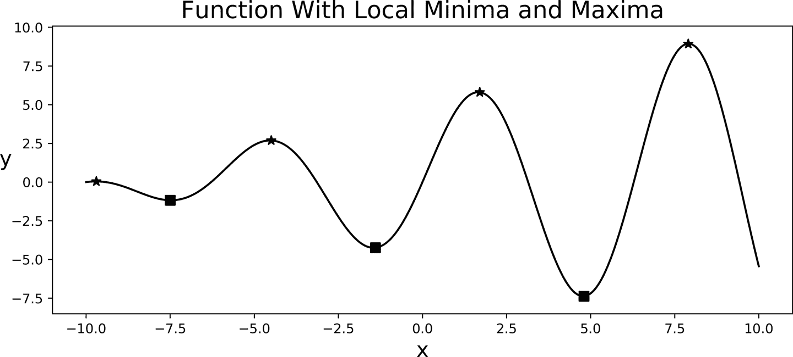

# 第七章：优化

经过这一切工作，我们终于到达了*规定* 阶段，这是我们最终准备做出*最好* 决策的时刻。或者至少这是我们的目标：在开始时，我们可能会做一些简化假设，以更好地理解每个问题，随着我们更加熟悉解决更复杂版本的问题，这些假设可以逐渐放宽。但首先，我们应该复习一些优化理论中会派上用场的概念。


###### 图 7-1 优化

# 什么是优化？

优化是寻找某个预定义目标函数的最小值或最大值。*目标函数* 就是你可以想象的那样：一个将我们的杠杆映射到业务目标的数学函数。由于我们的目标是做出尽可能最好的决策，所以优化理论的一些知识几乎是有帮助的。

有些情况下，我们需要优化的问题相对比较简单。比如找出两个数字中的最大值：比如 5 和 7。我们可以立即看出第二个数字更大，所以如果有关联的杠杆的话，我们会选择第二个。在任何二元决策中，这就是与优化阶段相关的全部内容。

如果数字是*有限* 的，我们可以再次对它们进行排序，很快找到最大值或最小值。这可能需要一些时间，我们可能无法手工完成，但有计算效率高的排序算法。但请记住，足够大但“有限”的数字列表可能在排序上具有计算成本，因此我们可能需要更高效的计算解决方案。

有些问题可能看起来*有限*，但在计算上找到最优解可能仍然很困难。可以说，其中一个最著名的问题是*旅行推销员问题*，在这个问题中，给定几个城市（及它们之间的距离），我们的任务是找到一条经过所有城市并返回初始城市的最短路径。如果只有几个城市，你可以通过枚举所有可能的路线并找到最短的一条来轻松找到解决方案。但是一旦城市数量增加，这类组合问题就会变得计算昂贵。¹ 这是公司在处理分销和物流决策时经常面对的一个常见优化问题，因此它不仅仅是数学上的一个好奇问题。

如果你对数据科学感兴趣，你一直在处理优化问题。大多数，如果不是全部，机器学习算法都在优化某个目标函数，无论是*损失*函数的最小化还是其他中间函数。例如，在监督学习中，我们希望我们的模型尽可能接近数据。因此，我们定义“损失”为模型预测与数据的差异（以某种聚合方式）。很多时候，这个最小化问题本身实际上是一个伪装的*最大化*问题，例如，当损失函数是对数似然函数的负值时，我们从统计角度来看是要*最大化*它。

当我们处理*无限*多个值时，事情变得更加困难。图 7-2 从一个相对简单的例子开始。左侧面板显示了*最小化*一个非常好的凸目标函数的情况。通常会在垂直轴上绘制函数取值，并用<math alttext="y"><mi>y</mi></math>来表示。类似地，在水平轴上绘制我们的决策变量或杠杆（ <math alttext="x"><mi>x</mi></math> ）的值。


###### 图 7-2\. 简单优化问题：最小化和最大化

在这种简化的情况下，我们可以通过视觉检查问题，并注意如果我们想要达到最小值，那么必须是<math alttext="x 等于 0"><mrow><mi>x</mi> <mo>=</mo> <mn>0</mn></mrow></math> 。右侧面板显示了最大化和最小化问题的相关性：如果我们希望找到最大值，我们可以简单地将函数乘以<math alttext="负 1"><mrow><mo>-</mo> <mn>1</mn></mrow></math> 并相应地继续。当决策变量的取值范围足够大或者当我们有超过两个决策变量时，视觉检查就不再可行。

图 7-3 展示了一个函数的例子，它的表现并不好，因为它有许多局部最小值（方块）和最大值（星星）。这里的*局部*指的是你可能认为找到了最优解，但一旦你开始放大视野并看到整个图像，你会意识到函数仍然在减小或增加。我们的理想是找到*全局*最小值或最大值，这样我们可以确信我们真的找到了最好的解决方案。



###### 图 7-3\. 具有局部最小值和最大值的目标函数

在实践中，我们使用计算机来解决像前面图示中的优化问题。有许多算法只能找到局部最小值，因此我们必须再次检查我们是否确实找到了最优解。也有全局优化算法来寻找最佳解决方案，但一般很难校准。

在机器学习中最著名的算法是*梯度下降*，其中一个人根据公式迭代更新当前最佳猜测。

<math alttext="x Subscript t Baseline equals x Subscript t minus 1 Baseline minus gamma normal nabla f left-parenthesis x Subscript t minus 1 Baseline right-parenthesis" display="block"><mrow><msub><mi>x</mi> <mi>t</mi></msub> <mo>=</mo> <msub><mi>x</mi> <mrow><mi>t</mi><mo>-</mo><mn>1</mn></mrow></msub> <mo>-</mo> <mi>γ</mi> <mi>∇</mi> <mi>f</mi> <mrow><mo>(</mo> <msub><mi>x</mi> <mrow><mi>t</mi><mo>-</mo><mn>1</mn></mrow></msub> <mo>)</mo></mrow></mrow></math>

这里 <math alttext="x Subscript t"><msub><mi>x</mi> <mi>t</mi></msub></math> 是我们更新的决策变量的猜测值， <math alttext="x Subscript t minus 1"><msub><mi>x</mi> <mrow><mi>t</mi><mo>-</mo><mn>1</mn></mrow></msub></math> 是前一个猜测值， <math alttext="gamma"><mi>γ</mi></math> 是校准算法在每次迭代中应采取的步长的参数，而 <math alttext="normal nabla f left-parenthesis x right-parenthesis"><mrow><mi>∇</mi> <mi>f</mi> <mo>(</mo> <mi>x</mi> <mo>)</mo></mrow></math> 是我们正在最小化的目标函数的梯度。在只有一个决策变量的情况下，这就是函数的导数，在前一个猜测值处求值。如果你还记得你的微积分 I 课程，你可能还记得如果我们想要找到一个*内部*最大值或最小值，那么在那一点导数为零是必要的（这是一阶条件）。

# 极小化的一阶和二阶条件

在你的微积分课程中，你可能还记得对于可微的目标函数 <math alttext="f left-parenthesis x right-parenthesis"><mrow><mi>f</mi> <mo>(</mo> <mi>x</mi> <mo>)</mo></mrow></math> ，*极小化的一阶条件*（FOC）指出对于 <math alttext="x Superscript asterisk"><msup><mi>x</mi> <mo>*</mo></msup></math> 成为*内部*极小化器，必须满足 <math alttext="f prime left-parenthesis x Superscript asterisk Baseline right-parenthesis equals 0"><mrow><msup><mi>f</mi> <mo>'</mo></msup> <mrow><mo>(</mo> <msup><mi>x</mi> <mo>*</mo></msup> <mo>)</mo></mrow> <mo>=</mo> <mn>0</mn></mrow></math> ；也就是说，导数必须为零。

*二阶条件*（SOC）说明，如果 <math alttext="f double-prime left-parenthesis x Superscript asterisk Baseline right-parenthesis greater-than 0"><mrow><msup><mi>f</mi> <mrow><mo>'</mo><mo>'</mo></mrow></msup> <mrow><mo>(</mo> <msup><mi>x</mi> <mo>*</mo></msup> <mo>)</mo></mrow> <mo>></mo> <mn>0</mn></mrow></math> ，则 <math alttext="x Superscript asterisk"><msup><mi>x</mi> <mo>*</mo></msup></math> 是一个局部极小化器。SOC 描述了极小化器处函数的曲率（应为凸），而 FOC 则说明在内部极小化器处，你不应能增加或减少函数的值。

现在你可以看到为什么梯度下降是有道理的了：首先，如果导数没有消失，那么我们还没有找到一个极小化器（FOC）。一旦导数为零，算法将停止，并且不会进行更新。此外，如果导数不为零，梯度下降告诉我们继续探索的*最佳方向*：如果当前猜测值处的导数为正，并且我们正在寻找*最小值*，那么新的候选猜测值只能比当前猜测值*小*（否则我们的函数将继续增加）。

数值优化算法对额外参数非常敏感，例如梯度下降算法中的步长参数或我们需要初始化算法的初始猜测。

图 7-4 展示了在图 7-2 的二次函数上进行梯度下降的实现。您可以调整参数（初始值和步长），亲自验证对于这个简单问题的最优解可能存在问题。


###### 图 7-4\. 梯度下降的示例：<math alttext="x 0 equals negative 10 comma gamma equals 0.1"><mrow><msub><mi>x</mi> <mn>0</mn></msub> <mo>=</mo> <mo>-</mo> <mn>10</mn> <mo>,</mo> <mi>γ</mi> <mo>=</mo> <mn>0</mn> <mo>.</mo> <mn>1</mn></mrow></math>

此图由 示例 7-1 中显示的代码生成。

##### 示例 7-1\. 梯度下降算法的实现

```
def gradient_descent(prev_guess, step, derivative_f):
    '''
 Given a previous_guess, the step size, and the value of the derivative_f
 this function outputs a new guess
 '''
    new_guess = prev_guess - step*derivative_f
    return new_guess

# use gradient descent to optimize the previous functions
def quadratic_fn(x):
   '''
 Example: y=x²
 '''
    y = np.power(x,2)
    return y

def quadratic_derivative(x):
   '''
 To update we need the value of the derivative of the function
 '''
    dy = 2*x
    return dy

# two parameters we need to initialize
x_init = -10
step=0.2
# other parameters to stop the algorithm
max_iter = 1000
stopping_criterion = 0.0001
curr_diff = 100
counter = 0
while curr_diff>stopping_criterion and counter<max_iter:
    # Update guess
    x_new = gradient_descent(x_init, step, quadratic_derivative(x_init))
    # update difference, initial and counter
    curr_diff = np.abs(x_new-x_init)
    x_init = x_new
    counter +=1

print(x_new)
```

## 数值优化很困难

尽管数值优化算法有所进展，但在实践中执行起来并不简单。我们需要深入了解要优化的函数，检查它是否良好（即只有一个最大值或最小值），尝试多种初始化参数，并且在优化算法的参数（例如梯度下降算法中的步长大小）上要非常小心谨慎。

有时候，我们可能确实想要避免进行数值优化的痛苦，但根据使用情况，这样做的好处可能是巨大的。而有时，正如我们将在稍后的例子中看到的那样，如果我们从优化问题的基本原理出发，可能会找到简单的算法。

## 优化在商业环境中并不新鲜

在数据科学流行之前，公司通常会聘请一些被称为 *决策科学家* 的人。他们可能不是机器学习的专家，但擅长优化目标函数。他们的背景可能是运筹学、经济学、应用数学等，他们解决着非常有趣和有价值的问题，如最优库存、最优路由或价格与收入优化。既然我们已经在 第四章 中提到了这些内容，那么让我们更仔细地看看后者。

## 价格与收入优化

简化一下，收入只是价格（ <math alttext="upper P"><mi>P</mi></math> ）乘以数量（ <math alttext="upper Q"><mi>Q</mi></math> ）：

<math alttext="Revenues equals upper P times upper Q left-parenthesis upper P right-parenthesis" display="block"><mrow><mtext>Revenues</mtext> <mo>=</mo> <mi>P</mi> <mo>×</mo> <mi>Q</mi> <mo>(</mo> <mi>P</mi> <mo>)</mo></mrow></math>

销售量取决于我们所收取的价格——由函数 <math alttext="upper Q left-parenthesis upper P right-parenthesis"><mrow><mi>Q</mi> <mo>(</mo> <mi>P</mi> <mo>)</mo></mrow></math> 表示——得益于需求法则，通常是向下倾斜的，如果我们考虑提高价格，就会产生自然的紧张：第一个项会一对一地增加，而第二个项会随着价格上涨而减少。只要第一个效应占优势，收入就会增加；否则，我们降低价格会更好。理想情况下，价格作为收入的函数将如 图 7-5 所示。然后，将价格设置为优化的$50 将会相对直接。


###### 图 7-5\. 一个良好行为的收入函数

如果我们的目标是优化这个函数，我们需要什么信息？由于我们不想在最优价格的左侧或右侧，我们需要了解需求对价格变化的敏感性；这就是经济学家所称的 *需求价格弹性*。

要明白这一点，我们只需对收入函数进行关于我们的决策变量（价格）的导数。在进行一些代数运算后，您可以找到：

<math alttext="StartFraction normal partial-differential Revenues Over normal partial-differential upper P EndFraction equals upper Q left-parenthesis upper P right-parenthesis plus upper P upper Q prime left-parenthesis upper P right-parenthesis equals upper Q left-parenthesis upper P right-parenthesis times left-parenthesis 1 minus epsilon right-parenthesis" display="block"><mrow><mfrac><mrow><mi>∂</mi><mtext>Revenues</mtext></mrow> <mrow><mi>∂</mi><mi>P</mi></mrow></mfrac> <mo>=</mo> <mi>Q</mi> <mrow><mo>(</mo> <mi>P</mi> <mo>)</mo></mrow> <mo>+</mo> <mi>P</mi> <msup><mi>Q</mi> <mo>'</mo></msup> <mrow><mo>(</mo> <mi>P</mi> <mo>)</mo></mrow> <mo>=</mo> <mi>Q</mi> <mrow><mo>(</mo> <mi>P</mi> <mo>)</mo></mrow> <mo>×</mo> <mrow><mo>(</mo> <mn>1</mn> <mo>-</mo> <mi>ϵ</mi> <mo>)</mo></mrow></mrow></math>

其中，像往常一样，<math alttext="upper Q prime left-parenthesis upper P right-parenthesis"><mrow><msup><mi>Q</mi> <mo>'</mo></msup> <mrow><mo>(</mo> <mi>P</mi> <mo>)</mo></mrow></mrow></math> 表示需求函数对价格的导数，<math alttext="epsilon equals minus upper P StartFraction upper Q prime left-parenthesis upper P right-parenthesis Over upper Q left-parenthesis upper P right-parenthesis EndFraction"><mrow><mi>ϵ</mi> <mo>=</mo> <mo>-</mo> <mi>P</mi> <mfrac><mrow><msup><mi>Q</mi> <mo>'</mo></msup> <mrow><mo>(</mo><mi>P</mi><mo>)</mo></mrow></mrow> <mrow><mi>Q</mi><mo>(</mo><mi>P</mi><mo>)</mo></mrow></mfrac></mrow></math> 对应需求价格弹性（如果需求法则适用，始终为正）。我们可以将其解释为当我们将价格提高 1%时，需求量的百分比变化的绝对值。例如，如果价格弹性为 2，提高价格 1%将 *减少* 需求量 2%。

这个数学背后有一些非常好的直觉：假设你把价格提高 1%。其他条件不变，收入方程中的第一个效应将导致收入增加 1%。然而，由于适用需求法则，我们的销售量将下降，其数量取决于我们客户的价格弹性。如果销售量下降的*少于*1%，我们的收入仍然会增加，因为负面影响不足以完全抵消正面价格上涨的影响。这表明只要需求的价格弹性*小于 1*，我们就可以提高价格并且情况会更好。回到最后一个方程，回想一下导数的符号告诉我们当我们提高价格时我们收入的方向变化：由于需求不能为负，符号取决于弹性是小于还是大于 1：在前一种情况下，我们的收入增加（正号）；否则，我们提高价格会更糟糕。

决策科学家和经济学家（以及一些研究这类问题的数据科学家）在他们旨在设定最优价格时，大部分时间都在估计其产品的需求价格弹性。这不是深入探讨这一企业的困难之地，但我将在章节末提供参考文献。

# 没有不确定性的优化

如前所述，*优化可能非常困难*，但我们可以通过假设消除所有不确定性来简化问题。让我们看一些示例，以了解在进行优化时简化的威力。

## 客户流失

图 7-6 展示了没有不确定性的客户流失情况。在这种理想情况下，我们将了解客户的真实状态：他们可能毫无疑问地离开，他们可能肯定会留下来（暂时来说，未来可能会改变），或者他们可能在考虑改变，但如果我们提供良好的保留优惠，他们会选择留下。由于我们有魔球，我们还知道保留优惠必须有多好（使他们留下的最低要求）。


###### 图 7-6\. 客户流失：没有不确定性的情况

注意，在纯态的情况下（毫无疑问地离开或者绝对留下），我们*不*应该提供保留优惠：在第一种情况下，存在机会成本（时间，我们团队设计策略的努力，而不是针对更好的候选人），我们应该转而针对其他客户。在第二种情况下，我们的客户很可能会接受优惠，并且这对我们有直接成本（例如，如果以价格折扣的形式，这将导致失去的收入），以及与第一种情况类似的机会成本。正如在图 7-6 中所示，这两种情况下，我们总是更好地不提供保留优惠。

中间情况更加有趣：因为我们知道我们需要提出的最低报价（请记住，这里没有不确定性），对于业务案例来说，必须是增量收入至少与我们提供保留报价的成本一样大。有些客户可以通过提供足够小的报价而满足，而对于其他客户来说，我们试图保留他们可能是不赚钱的。

解决没有不确定性的问题有助于我们精确调整杠杆和直觉的选择，还允许我们清楚地识别问题本质的根本不确定性所在。

## **跨销售**

图 7-7 显示了没有不确定性的跨销售案例。在这种情况下，我们有四个杠杆可以操作（现在让我们只考虑我们的杠杆是我们可能提供的不同产品）。我们应该怎么做？

为了凸显问题的主要根本不确定性在哪里，图表已经显示了当我们向每个产品提供时客户将会做出什么选择。产品一、二和四将被接受，每个产品都具有正增量价值。产品三将被拒绝，因此一旦考虑到提供的成本（比如市场支出），回报就变成了负数。


###### 图 7-7\. 跨销售：没有不确定性

如果我们假设客户只购买一个产品，那么*次优报价*是哪个？很快就会发现，我们应该提供第二个产品，因为这个产品能够最大化增量价值。这显然是一个过于简化的例子，但它展示了我们面临的主要权衡：对于将被拒绝的产品，我们有直接成本和未提供*正确*产品的机会成本。对于将被接受的产品，我们是否提供了最大化我们回报的产品？如果没有，那就有一个机会成本（放弃收益），我们的竞争对手将乐意接受。

您可以开始使这个没有不确定性的问题变得更加复杂。如果客户愿意购买多个产品，我们应该将它们一起提供，甚至捆绑销售，从而降低整体组合的价格吗？这取决于情况：如果竞争对手能够以同样的价格提供一个或所有产品，那么我们面临一个机会成本，捆绑销售现在是一个可行的替代选择（如果法规允许）。如果订单的顺序很重要，比如因为产品越来越复杂，那么我们可能决定等待（因为这个限制也适用于我们的竞争对手）。

重要的是要记住，提出一个不太可能被接受的报价是有真实成本的：直接成本如市场支出以及创建和联系潜在客户的成本，还有通常被忽视的真实机会成本。其中一个经常被忽视的是信息过载：我们不断向客户发送电子邮件，一段时间后他们就会系统地忽略它们，从而关闭了一个有价值的销售和沟通渠道。

## **CAPEX 投资**

让我们回到我们的 CAPEX 投资示例，我们需要决定在几个不同领域投资多少。其中一个示例是当我们需要在不同城市投资时，因此在本示例的其余部分中，我们将讨论地理单元。

正如我们在前几章中假设的那样，资本支出对每个城市收入的影响是：

<math alttext="Revenues left-parenthesis x right-parenthesis equals upper P times upper Q times left-parenthesis 1 plus g left-parenthesis x right-parenthesis right-parenthesis" display="block"><mrow><mtext>Revenues</mtext> <mo>(</mo> <mi>x</mi> <mo>)</mo> <mo>=</mo> <mi>P</mi> <mo>×</mo> <mi>Q</mi> <mo>×</mo> <mo>(</mo> <mn>1</mn> <mo>+</mo> <mi>g</mi> <mo>(</mo> <mi>x</mi> <mo>)</mo> <mo>)</mo></mrow></math>

在没有不确定性的情况下，销售增长率 <math alttext="g left-parenthesis x right-parenthesis"><mrow><mi>g</mi> <mo>(</mo> <mi>x</mi> <mo>)</mo></mrow></math> 是由更高投资导致的。我们可以将其视为已知。两种模拟增长率的替代方法如 图 7-8 所示，我使用了通用 logistic 函数来参数化增长，形式如下：

<math alttext="g left-parenthesis x right-parenthesis equals upper A plus StartFraction upper K minus upper A Over left-parenthesis upper C plus upper Q e Superscript minus upper B x Baseline right-parenthesis Superscript 1 slash nu Baseline EndFraction" display="block"><mrow><mi>g</mi> <mrow><mo>(</mo> <mi>x</mi> <mo>)</mo></mrow> <mo>=</mo> <mi>A</mi> <mo>+</mo> <mfrac><mrow><mi>K</mi><mo>-</mo><mi>A</mi></mrow> <msup><mrow><mo>(</mo><mi>C</mi><mo>+</mo><mi>Q</mi><msup><mi>e</mi> <mrow><mo>-</mo><mi>B</mi><mi>x</mi></mrow></msup> <mo>)</mo></mrow> <mrow><mn>1</mn><mo>/</mo><mi>ν</mi></mrow></msup></mfrac></mrow></math>

###### 图 7-8\. 替代增长率

该图由 示例 7-2 中显示的代码生成。

##### 示例 7-2\. 假设的 CAPEX 优化 logistic 增长

```
def logistic_growth(x, A,K,C,D,B,nu):
 '''
 Generalized logistic function
 '''
 return A + (K-A)/(C + D*np.exp(-B*x))**(1/nu)

# generate plot
fig, ax = plt.subplots(figsize=(10,5))
x = np.linspace(-10,10,100)
y1 = logistic_growth(x, A=-2,K=2, C=1, D=1, B=0.3, nu=1)
ax.plot(x,y1, color='k', label='slow')
y2 = logistic_growth(x, A=-2,K=2, C=1, D=1, B=1, nu=1)
ax.plot(x,y2, color='k', label='fast', ls='--')
ax.plot([-10,10],[0,0], color='k', alpha=0.2)
ax.plot([-10,10],[2,2], color='k', alpha=0.2, ls='--')
ax.plot([-10,10],[-2,-2], color='k', alpha=0.2, ls='--')
ax.plot([0,0],[-2.1,2.1], color='k', alpha=0.2, ls='--')
ax.axis([-10,10,-2,2])
ax.set_title('Two Alternative Parametrizations of Growth', fontsize=18)
ax.set_xlabel('Investment in City (x)', fontsize=18)
ax.set_ylabel('Growth Rate $g(x)$', fontsize=18)
ax.legend(loc=2, fontsize=12)
```

使用 logistic 函数来模拟增长有几个优点：首先，增长受到渐近线的限制，在这种情况下是 –2 和 2。有界增长不仅现实（至少在短期内），还将限制总收入，使优化问题变得可行。它也很平滑，因此我们可以无障碍地处处求导数（在这种情况下，我们可以分析地找到导数，这总是加快计算的速度）。如果我们使用计算机来完成找到最佳分配的艰苦工作，这一点至关重要。

此外，我们允许城市的减资效果，因为决策变量可以取负值。考虑在一个城市关闭商店以在另一个城市开设额外商店的情况。这种减资可能对该城市的收入产生广泛影响，而我们的模型允许这种情况发生。重要的是，*在某些地点减资可能是最优的*，而该模型足够通用，可以应对这种情况。

但是在图中还可以看到另一个驱动部分结果的特性。请注意，当我们开始在一个城市投资时，增长率会非常快地加速，但某些时候 *递减收益* 开始产生作用，因此我们每额外花费的一美元效果递减（直到完全消失）。

图中显示了两种不同的参数化方式，即不同速率的递减收益。在第一种情况下（*慢*），城市达到最大潜力增长需要更大的投资。在第二种情况下，增长开始非常快，然后停滞。

根据这些假设，总收入只是所有城市收入的总和。在两个城市的情况下，我们的优化问题变成了：

<math alttext="max Underscript x 1 comma x 2 Endscripts Total Revenues left-parenthesis x 1 comma x 2 right-parenthesis equals upper P 1 upper Q 1 times left-parenthesis 1 plus g 1 left-parenthesis x 1 right-parenthesis right-parenthesis plus upper P 2 upper Q 2 times left-parenthesis 1 plus g 2 left-parenthesis x 2 right-parenthesis right-parenthesis" display="block"><mrow><munder><mo form="prefix" movablelimits="true">max</mo> <mrow><msub><mi>x</mi> <mn>1</mn></msub> <mo>,</mo><msub><mi>x</mi> <mn>2</mn></msub></mrow></munder> <mtext>Total</mtext> <mtext>Revenues</mtext> <mrow><mo>(</mo> <msub><mi>x</mi> <mn>1</mn></msub> <mo>,</mo> <msub><mi>x</mi> <mn>2</mn></msub> <mo>)</mo></mrow> <mo>=</mo> <msub><mi>P</mi> <mn>1</mn></msub> <msub><mi>Q</mi> <mn>1</mn></msub> <mo>×</mo> <mrow><mo>(</mo> <mn>1</mn> <mo>+</mo> <msub><mi>g</mi> <mn>1</mn></msub> <mrow><mo>(</mo> <msub><mi>x</mi> <mn>1</mn></msub> <mo>)</mo></mrow> <mo>)</mo></mrow> <mo>+</mo> <msub><mi>P</mi> <mn>2</mn></msub> <msub><mi>Q</mi> <mn>2</mn></msub> <mo>×</mo> <mrow><mo>(</mo> <mn>1</mn> <mo>+</mo> <msub><mi>g</mi> <mn>2</mn></msub> <mrow><mo>(</mo> <msub><mi>x</mi> <mn>2</mn></msub> <mo>)</mo></mrow> <mo>)</mo></mrow></mrow></math>

依据 <math alttext="x 1 plus x 2 equals CAPEX"><mrow><msub><mi>x</mi> <mn>1</mn></msub> <mo>+</mo> <msub><mi>x</mi> <mn>2</mn></msub> <mo>=</mo> <mtext>CAPEX</mtext></mrow></math>。

请注意，原则上，增长率可能在城市之间有所不同，因此我相应地加以标注。此外，这是一个受限制的优化问题，我们有一个需要在城市间分配的总预算（CAPEX）。在没有进一步（积极性）限制的情况下，我也允许在每个城市进行 *撤资*。

从两个城市开始使我们能够理解优化问题的基本权衡，并且我们还将能够直观地检查我们的目标函数。请注意，由于预算必须用尽，我们可以将这个涉及两个变量的问题转换为仅依赖于某个城市的投资问题，比如 <math alttext="x 1"><msub><mi>x</mi> <mn>1</mn></msub></math>。通过在目标函数中替换 <math alttext="x 2 equals CAPEX minus x 1"><mrow><msub><mi>x</mi> <mn>2</mn></msub> <mo>=</mo> <mtext>CAPEX</mtext> <mo>-</mo> <msub><mi>x</mi> <mn>1</mn></msub></mrow></math> 来实现这一点。

图 7-9 展示了我们的目标函数在对称情况下的形式，即两个城市在大小和购买力上完全相同（因此我们收入方程中的平均票价或价格相同，我也认为初始销售额相同），还有在增长率上也是如此。我绘制了两种不同的增长率参数化，只是像在图 7-8 中那样改变加速的速度。


###### 图 7-9\. 两个城市对称示例的总收入

对称案例是一个很好的起点，因为它允许我们测试我们的直觉（当然也包括我们的代码）。在这里，我把总预算设为 $100，并将总收入作为城市 1 投资的函数来绘制，我们可以用尽总预算或撤回相同的总量（ <math alttext="negative 100 less-than-or-equal-to x 1 less-than-or-equal-to 100 equals CAPEX"><mrow><mo>-</mo> <mn>100</mn> <mo>≤</mo> <msub><mi>x</mi> <mn>1</mn></msub> <mo>≤</mo> <mn>100</mn> <mo>=</mo> <mtext>CAPEX</mtext></mrow></math> ）。

正如图所示，由于两个城市完全相同，我们预期最优分配也应该相同（为什么我们会在一个城市进行过度投资呢？）。在两种情况下，您可以验证确实最优的投资分别是 <math alttext="x 1 asterisk equals x 2 asterisk equals 50"><mrow><msub><mi>x</mi> <mn>1</mn></msub> <mo>*</mo> <mo>=</mo> <msub><mi>x</mi> <mn>2</mn></msub> <mo>*</mo> <mo>=</mo> <mn>50</mn></mrow></math> 。

我们可以使用数值优化，但在这种情况下，经济学足够简单，我们可以构建一个算法，这个算法可以轻松推广到许多城市。其核心思想如下：假设你只有 $1。你可以把它分配给城市 1 或者 2（我们不能拆分它，因为这是我们的核算基本单位）。那么应该把它花在哪里呢？简单的经济直觉表明，它应该用在能够创造更大增量（边际）收入的城市（因为两种情况下的边际成本都相同，均为 $1）。因此我们相应地进行操作，并将其分配给较好的城市。如果增量收入相同，那么就随意分配给第一个城市，比如说城市 1。

现在想象一下，我们的财务总监现在给了我们额外的 $1 来分配。在这里的直觉是一样的：我们应该把它分配给增量收入更高的城市，但请注意，有些事情已经改变了：*我们已经把前一个美元分配给了城市 1*。如果增长率显示递减的边际回报，额外的美元在城市 1 中的增量收入将较低，并且根据实际增长率，这些收入可能大于或小于第二个城市。

伪算法的工作方式如下：我们从每次迭代中获胜的增量回报城市开始分配额外的美元，更新每个城市当前的总投资，并继续，直到我们用尽预算。我喜欢这个算法，不仅因为它很容易推广到许多城市并强制约束得到满足，而且因为它始终贯穿基本的经济推理（通过进行一些小的改变，它还将允许最优的撤资），因此我们可以很容易地向我们的业务利益相关者解释它。以下 Python 片段（示例 7-3）展示了该算法的一个实现：

##### 示例 7-3\. CAPEX 分配问题的迭代解决方案

```
def revenues_in_city(x,**kwargs):
    '''
 Compute revenues as a function of investment (x)
 Note: keyword arguments (**kwargs) allow us to parametrize growth
 (A,K,C,Q,B,nu) and price, sales
 '''
    P,Q,A,K,C,D,B,nu = kwargs['P'],kwargs['Q'],kwargs['A'],kwargs['K'],
                       kwargs['C'],kwargs['D'],kwargs['B'],kwargs['nu']
    revenues = P*Q*(1+logistic_growth(x, A,K,C,D,B,nu))
    return revenues

def find_the_optimum_iteratively(CAPEX, **kwargs):
    '''
 We can assign one dollar to the city with largest incremental
 (marginal) revenue
 '''
    # to allow for asymmetric cases we can include some parameters
    p1,q1 = kwargs['P1'],kwargs['Q1']
    p2,q2 = kwargs['P2'],kwargs['Q2']
    B = kwargs['B']
    # Initialize array to save incremental allocations
    optimal_assignments = np.zeros((CAPEX,2))
    for x in range(CAPEX):
        # compute revenues for both cities if we assigned the marginal dollar
        # 1\. Accumulate previous investments (if any)
        x_init1, x_init2 = np.sum(optimal_assignments[:x,:], axis=0)
        # Test allocations: current allocations plus an additional $1
        x_test1, x_test2 = x_init1+1, x_init2+1
        # Compute Marginal Revenues: rev(x+1)-rev(x)
        marg_rev1_x = (revenues_in_city(x_test1,P=p1, Q=q1, A=A, K=K, C=C,
                          D=D, B=B, nu=nu)-
                          revenues_in_city(x_init1,P=p1, Q=q1, A=A, K=K, C=C,
                          D=D, B=B, nu=nu))
        marg_rev2_x = (revenues_in_city(x_test2,P=p2, Q=q2, A=A, K=K, C=C,
                          D=D, B=B, nu=nu)-
                          revenues_in_city(x_init2,P=p2, Q=q2, A=A, K=K, C=C,
                          D=D, B=B, nu=nu))
        #print('Iteration ={0}, rev1 = {1}, rev2={2}'.format(x,
              # marg_rev1_x, marg_rev2_x))
        # if they are the same, it doesn't matter where you assign it
        if marg_rev1_x==marg_rev2_x:
            optimal_assignments[x,0] = 1
        elif marg_rev1_x>marg_rev2_x:
            optimal_assignments[x,0] = 1
        elif marg_rev1_x<marg_rev2_x:
            optimal_assignments[x,1] = 1
    # when done, we get the full trajectory of investments
    return optimal_assignments
```

图 7-10 显示了我们在两个城市对称案例中投资边际美元的轨迹。注意，在最后，我们已经达到了对称解决方案：两个城市都分配了 $50，正如前面的图表所示的那样应该是的。


###### 图 7-10\. 迭代解决优化问题

一旦我们对在最简单、对称情况下的解决方案感到满意，我们就可以继续处理非对称城市的情况。假设两个城市的购买力相同，但一个城市的规模是另一个的 10 倍（通过销售来代表）。你认为会发生什么？

图 7-11 的左侧面板显示了总收入，其中两个城市除了规模（Q）外，其他一切都相同。我们现在可以看到，最优解对较小的城市（图中的城市 1）不利，因为在投资较大城市的边际收益也较大。有趣的是，我们并未将所有预算都分配给那个城市。这是因为最终边际收益开始发挥作用，而在该城市的每一额外美元对公司的价值都减少。你可以在右侧面板中看到每个迭代中发生的情况：前 $72 被分配给了较大的城市，此时边际收益已完全发挥作用。


###### 图 7-11\. 非对称情况下的总收入和分配（城市 2 的规模是城市 1 的 10 倍）

你可能会想知道，如果第二个城市规模是第一个城市的 10 倍，为什么最优分配并不是 10 倍大？这些是我们的业务利益相关者会问的问题，只有当我们真正理解我们模型的运作方式时，我们才能作出答复。请注意，这个问题暗示了某种线性关系，但我们的增长率完全不是线性的：它们不仅受到限制，而且投资回报递减从一开始就融入了我们的模型中。

在继续之前，请注意这种类型的优化问题在商业环境中非常常见。例如，如果你从事市场营销工作，你可能希望决定在不同渠道之间的最优分配（这就是著名的市场组合建模）。如果我们知道不同渠道的增长率或投资回报率函数，优化解决方案就会沿着相同的线路进行。现在我们需要我们的数据科学家利用他们非凡的机器学习技能为我们估算这些函数。

## 最佳人员配备

尽管在整个过程中一直强调，但在规划阶段选择目标函数是至关重要的，它应该直接与我们的业务目标联系在一起。这在最佳人员配备的情况下会非常明显。

正如名称所示，我们希望找到最佳的员工数量以最大化某些业务目标。抽象来看，我们可以考虑许多这样的目标，例如我们公司的利润。一般观察表明，大多数公司相对于这个最佳水平都倾向于雇用*更多*人员，所以如果我们能够优化我们的工作人员规模，这不是件好事吗？答案当然是肯定的，但事实上这是一个非常困难的问题，因为很难获得精确、可信赖的员工级别生产力测量。如果我们能够做到这一点，我们知道最佳规则会是什么样子：如果员工对我们的收入的影响大于其成本，我们应该雇用额外的员工。

所以让我们提出一个不同的目标，一个相对容易获得个人级别生产力测量的目标。考虑在我们的商店中找到我们应该拥有的收银员的最佳数量的情况。他们的生产力可以通过单位时间内服务的顾客数量来衡量，因此最直接受影响的度量标准是顾客排队等待的时间。稍后我们可能希望通过其对顾客满意度的影响将其与我们的业务绩效联系起来——这本身又影响了流失概率——但现在让我们把它作为我们的目标。

让我们从一个商店开始。图 7-12 展示了排队问题的高层次图像：顾客以每期 <math alttext="lamda"><mi>λ</mi></math> 的速率进入（以每期顾客数计量），每位收银员每期服务 <math alttext="mu"><mi>μ</mi></math> 位顾客，因此如果我们有 <math alttext="n"><mi>n</mi></math> 名收银员，则每期有 <math alttext="n mu"><mrow><mi>n</mi> <mi>μ</mi></mrow></math> 位顾客离开商店。每期的长度由我们定义，并且由操作约束严格限制：我们可能能够解决五分钟的人员配备问题，但通常不可能在如此短的时间窗口内进行更改。

请注意，除了我们员工的规模（我们的决策变量）之外，这些数量通常是不确定的：进入取决于需求，并且通常显示高度季节性模式（例如，高峰时间、午餐休息、周末等），而服务速率则取决于每位收银员的生产力，这不仅在我们的员工中有所变化，而且每位个体在一天内也有所不同。由于我们首先简化所有的不确定性，我们将假设这些是固定且已知的。


###### 图 7-12\. 队列理论：初步概念

和往常一样，在没有不确定性的情况下解决问题之前，我们需要做一些简化的假设：让我们首先假设顾客排成一条线，并且按先来先服务的原则提供服务。这就是我们设计队列的方式。此外，即使队列很长，顾客也不会离开商店（他们有无限的耐心），并且他们都在每个周期的开始时到达，因此如果我们以一个小时为周期，所有周期内的顾客都在零分钟到达。

在继续之前，让我们讨论我们假设的有效性和影响。我们队列的实现细节是我们的选择，没有不确定性它们将不起作用；也就是说，我们可能每个收银员都有一个不同的排队队列，接下来的分析仍然成立。假设顾客是无限耐心的，这是为了数学上的便利：对于等待的顾客来说，计算等待时间更容易。如果他们离开了，不仅队列的长度会改变（以及后面顾客的等待时间），而且由于提前离开而截断时间的顾客会使平均等待时间的计算变得困难。

最后一个假设——顾客在周期开始时到达——将起到重要作用，并且肯定会*高估*我们分析中的等待时间。我之所以这样做，是因为如果每个人的时钟都从同一时间开始（我可以使用通用时钟），那么更容易计算等待时间；否则，我将不得不在顾客进入后为每个顾客分别启动时钟。另一种假设是，他们在整个周期内均匀进入，因此随着时间的推移，顾客的恒定比例进入：前 10 分钟内有 6 个，前 20 分钟内有 12 个，依此类推。当我们看到这个排队模型的一些特性时，我会回到这个假设。

让我们从一个非常简洁的例子开始，其中每个周期表示一个小时。假设入店率为<math alttext="lamda equals 100"><mrow><mi>λ</mi> <mo>=</mo> <mn>100</mn></mrow></math>，因此每小时有 100 名顾客进入商店。此外，每个收银员每小时服务 20 名顾客（<math alttext="mu equals 20"><mrow><mi>μ</mi> <mo>=</mo> <mn>20</mn></mrow></math>），这意味着为每位顾客提供服务需要 3 分钟（这是倒数<math alttext="1 slash mu"><mrow><mn>1</mn> <mo>/</mo> <mi>μ</mi></mrow></math>）。

图 7-13 展示了在考虑拥有 <math alttext="n equals 4 comma 5 comma 6"><mrow><mi>n</mi> <mo>=</mo> <mn>4</mn> <mo>,</mo> <mn>5</mn> <mo>,</mo> <mn>6</mn></mrow></math> 收银员时，队列的几个重要特性。从顶部面板开始，考虑拥有四名收银员的情况。由于一切都是确定性的，我们知道在这 60 分钟批次期间进入的每一个顾客的等待时间，每个顾客用一个圆圈表示。阴影的强度表示他们等待的时间长短。


###### 图 7-13。使用三种不同员工数量选择的队列 (n = 4, 5, 6)：每个圆圈代表一个顾客，其阴影表示他们的等待时间（较浅表示等待时间较短）

注意，排在前四位（从左到右）的顾客将立即被服务，因此他们等待零分钟。每位四名收银员为他们的顾客提供服务时间为 3 分钟，然后下一批四名顾客被服务。接下来的四名顾客总共等待 6 分钟，依此类推，直到这段时间内进入的 100 名顾客被服务。如果我们平均计算所有顾客的等待时间，我们得到他们等待了 36 分钟（竖直虚线），其中五分之一的顾客实际上等待了*至少一个小时*，也就是新的一批 100 名顾客进入店铺的确切时间（竖直实线）。

这最后的结果——由于先前一批无法在这段时间内完全被服务而重叠的批次——在 <math alttext="lamda greater-than n mu"><mrow><mi>λ</mi> <mo>></mo> <mi>n</mi> <mi>μ</mi></mrow></math> 时始终成立，因此队列将继续累积。当 <math alttext="n equals 5"><mrow><mi>n</mi> <mo>=</mo> <mn>5</mn></mrow></math> 时（中间面板），我们可以看到在这段时间内所有 100 名顾客都得到了完全服务，平均等待时间现在是 28 分 30 秒。如果我们包括顾客需要等待的 3 分钟，我们会看到当 <math alttext="lamda equals n mu"><mrow><mi>λ</mi> <mo>=</mo> <mi>n</mi> <mi>μ</mi></mrow></math> 时，正如此处的情况，整个 60 分钟都用来服务所有顾客。在这种情况下，队列不会无限制地累积，系统实际上会达到一个均衡或稳态（当队列继续累积时，等待时间会无限增长）。

底部面板展示了当我们拥有超过达到均衡所需的最少收银员数量时，<math alttext="n equals 6"><mrow><mi>n</mi> <mo>=</mo> <mn>6</mn></mrow></math> 的情况。平均等待时间继续下降（至少 23 分钟），并且与以前一样，所有顾客都在这段时间内得到了服务。顺便提一下，由于多了一名收银员，每个周期现在有一些空闲时间，我们可能希望将其纳入成本效益优化分析中。

总之，当我们的收银员少于队列有限的最小数量时，等待时间是无限的。这是因为当第二批顾客到达图中的顶部面板时，该第二批的前四位顾客已经等待了 15 分钟才能服务，总计，因此你可以看到每一批接踵而来时发生了什么：商店实际上永远不会关闭。

增加从 4 到 5 名收银员，根据等待时间的测量，获得了巨大的边际回报。增加从 5 到 6 名收银员减少了近 5 分钟的等待时间。图 7-14 显示了这种模式，直到 50 名收银员（平均等待时间达到 1.5 分钟）。示例 7-4 展示了代码。我们看到雇佣更多收银员是值得的，或者说它值得吗？


###### 图 7-14\. 随着收银员人数的增加，平均等待时间减少。

##### 示例 7-4\. 计算确定性人员配置问题中的等待时间

```
def compute_waiting_time_deterministic(entry_rate, service_rate, n_cashiers):
    '''
 Given entry_rate, service_rate, n_cashiers
 Simulate waiting time in a deterministic setting
 '''
    # Get a DF to compute average waiting time
    # in the deterministic optimal staffing problem
    n = n_cashiers
    time_per_customer = 1/service_rate
    # save results in a DF:
    # rows: groups of n customers served at a time
    number_of_rows = int(np.ceil(entry_rate/n))
    df_simu = pd.DataFrame(n*np.ones((number_of_rows, 1)), columns=['customers'])
    # check that total customers in line match the entry_rate
    cum_sum = df_simu.customers.cumsum()
    diff = df_simu.customers.sum()-entry_rate
    df_simu.customers.loc[cum_sum>entry_rate] -=diff
    # compute waiting_time per group of n customers served
    df_simu['wait_time'] = df_simu.index*time_per_customer
    # Average will be waited by each group's share
    df_simu['frac_waiting'] = df_simu.customers/entry_rate
    # Share x Waiting Time of each Group
    df_simu['frac_times_time'] = df_simu.frac_waiting*df_simu.wait_time
    # accumulate to find weighted average (last observation will be average
    # waiting time)
    df_simu['cum_avg'] = df_simu.frac_times_time.cumsum()

    return df_simu

results_df = compute_waiting_time_deterministic(entry_rate=100, service_rate=20,
             n_cashiers=5)
avgwt = results_df.cum_avg.iloc[-1]
print('Average Waiting Time (minutes) = {0}'.format(avgwt*60))
```

真正的问题在于，递增的节约是否大于递增的成本。正如图所示，等待时间的递增节约随着收银员数量的增加而*减少*。另一方面，如果每增加一个收银员的成本是恒定的，我们的最大化问题将会表现良好，确保我们可以找到一个最优的员工规模，以最大化利润。

让我们回到假设，即所有顾客都在期初到达的情况。我们已经知道，如果入口是分布的（比如均匀分布），那么我们对某些顾客的等待时间是*高估*的。为了看清楚这一点，想象一下当我们有六名收银员时，最后四位顾客在被服务时（图 7-13 的底部面板），他们等待了 48 分钟，但实际上，假设均匀入场，他们会在最后 10 分钟进入，*那时没有人排队*，所以他们的等待时间实际上是零。

请记住，在没有不确定性的情况下解决问题有助于我们精炼对推动结果的基本力量的直觉，因此我们可以就此结束并继续在不确定性下解决问题。如果你仍然想得到更好的全局图景，你可以采取以下几种方式之一。首先，你可以尝试估算我们估计平均时间的偏差（例如，在均匀性假设下）。但这会否定在没有不确定性的情况下解决问题的目的。其次，你可以尝试将间隔分解为从你的业务角度来看有意义的更小的间隔。当平衡条件成立（ <math alttext="lamda equals n mu"><mrow><mi>λ</mi> <mo>=</mo> <mi>n</mi> <mi>μ</mi></mrow></math> ）时，批处理中的队列与其他批次中的队列是独立的（因为所有客户将在期间内被服务），因此我们可以继续并按照 30 分钟的时间段解决问题。第三，你可以为每位客户实施单独的时钟（就像现实中的商店今天在其排队系统中所做的那样）。

最后，我们需要将等待时间映射到业务绩效上。在没有不确定性的世界中，映射是相对直接的，至少在概念上是如此。等待时间对客户体验来说很重要，不满意的客户将毫不犹豫地从我们的竞争对手那里购买，从而减少我们未来的收入。如果我们手头有这样一条规则，将平均等待时间转化为流失率，我们就可以比较每增加一个收银员的成本与增量节省的收入，从而使优化问题可解。

但这只是一个可能的目标函数。为了突出目标函数的重要性，让我们想象我们不想最大化利润，而是更愿意在*所有店铺之间*实现均匀的客户体验。因为对于任何店铺，我们已经知道平均等待时间如何映射到收银员的数量，我们的优化算法可以从该地区的表现最好者开始，每次一个收银员地重新分配，直至收敛。我们在这里试图最小化的度量是最差表现者与最佳表现者之间的等待时间差异。

## 最佳店铺位置

假设我们考虑开设店铺，考虑到我们的固定年度预算，我们打算耗尽。在没有任何不确定性的情况下，如果我们已经有一组候选位置，用它们的地理坐标表示（ <math alttext="l a t comma l o n"><mrow><mi>l</mi> <mi>a</mi> <mi>t</mi> <mo>,</mo> <mi>l</mi> <mi>o</mi> <mi>n</mi></mrow></math> ），问题就很简单了：我们按未来利润流的顺序降序排列所有位置，包括设置成本，然后要么用完预算，要么在第一个达到收支平衡的店铺处停止 (Figure 7-15)。


###### Figure 7-15\. 优化我们开设新店的位置

这是一个没有不确定性的简单问题，因为我们从一个（有限的）预过滤的候选位置开始。而当我们不预过滤时，更一般的问题则要困难得多，因为可能会有无限多个位置（想象一下您在任何地图上看到的可能坐标数量），但是排序位置的一般原则仍然适用。您可能希望通过将地图划分为矩形网格，并将每个矩形的长期平均利润作为排序的度量来使事情有限化。

# 不确定性优化

如我们在第六章中所见，面对不确定性的最优决策是在最大化我们的期望目标函数时获得的，因此，原则上，“我们所需做的”只是用其期望替换我们的目标函数。有时这相对简单，但有时不是，我们将需要找到解决问题的方法，至少是一个一阶近似。无论如何，建议始终尝试在没有不确定性的情况下理解问题，因为这将准确指出您应该集中注意力的位置（并非所有不确定性都是平等的）。

## 客户流失

在客户流失情况下，我们已经看到了不确定性的根本来源：无需提供任何优惠的情况下客户是留下还是离开，并且我们需要对那些未决定的客户所需的最低优惠进行估算。

用<math alttext="p left-parenthesis x right-parenthesis"><mrow><mi>p</mi> <mo>(</mo> <mi>x</mi> <mo>)</mo></mrow></math>表示给定价值<math alttext="x"><mi>x</mi></math>的优惠时客户流失的概率。我预期流失的概率随着这个价值的增加而减少：在极端情况下，例如，如果我们送出一辆新车，大多数客户会选择留下来（至少在短期内，因为无论他们多么厌恶我们的公司，他们仍然可以从卖车中获利）。<math alttext="1 minus p left-parenthesis 0 right-parenthesis"><mrow><mn>1</mn> <mo>-</mo> <mi>p</mi> <mo>(</mo> <mn>0</mn> <mo>)</mo></mrow></math>对应于那些无需提供激励即会忠诚于公司的客户的纯粹情况，并且对于非常大的<math alttext="x"><mi>x</mi></math> — <math alttext="limit Underscript x right-arrow normal infinity Endscripts p left-parenthesis x right-parenthesis"><mrow><msub><mo form="prefix" movablelimits="true">lim</mo> <mrow><mi>x</mi><mo>→</mo><mi>∞</mi></mrow></msub> <mi>p</mi> <mrow><mo>(</mo> <mi>x</mi> <mo>)</mo></mrow></mrow></math> —我们找到那些无论优惠多大都会离开的客户。

现在，将优惠的值固定为两个可能的值，比如 <math alttext="x equals c"><mrow><mi>x</mi> <mo>=</mo> <mi>c</mi></mrow></math> 或 <math alttext="x equals 0"><mrow><mi>x</mi> <mo>=</mo> <mn>0</mn></mrow></math> 。对于客户 CLV <math alttext="v"><mi>v</mi></math> ，提供优惠的预期回报是：

<math alttext="upper E left-parenthesis return vertical-bar offer equals c right-parenthesis equals left-parenthesis 1 minus p left-parenthesis c right-parenthesis right-parenthesis v minus c" display="block"><mrow><mi>E</mi> <mo>(</mo> <mtext>return</mtext> <mo>|</mo> <mtext>offer</mtext> <mo>=</mo> <mi>c</mi> <mo>)</mo> <mo>=</mo> <mo>(</mo> <mn>1</mn> <mo>-</mo> <mi>p</mi> <mo>(</mo> <mi>c</mi> <mo>)</mo> <mo>)</mo> <mi>v</mi> <mo>-</mo> <mi>c</mi></mrow></math>

我们在预期利润大于不进行优惠的情况下进行优惠：

<math alttext="left-parenthesis 1 minus p left-parenthesis c right-parenthesis right-parenthesis v minus c greater-than-or-equal-to left-parenthesis 1 minus p left-parenthesis 0 right-parenthesis right-parenthesis v left right double arrow v left-parenthesis p left-parenthesis 0 right-parenthesis minus p left-parenthesis c right-parenthesis right-parenthesis greater-than-or-equal-to c" display="block"><mrow><mo>(</mo> <mn>1</mn> <mo>-</mo> <mi>p</mi> <mo>(</mo> <mi>c</mi> <mo>)</mo> <mo>)</mo> <mi>v</mi> <mo>-</mo> <mi>c</mi> <mo>≥</mo> <mo>(</mo> <mn>1</mn> <mo>-</mo> <mi>p</mi> <mo>(</mo> <mn>0</mn> <mo>)</mo> <mo>)</mo> <mi>v</mi> <mo>⇔</mo> <mi>v</mi> <mo>(</mo> <mi>p</mi> <mo>(</mo> <mn>0</mn> <mo>)</mo> <mo>-</mo> <mi>p</mi> <mo>(</mo> <mi>c</mi> <mo>)</mo> <mo>)</mo> <mo>≥</mo> <mi>c</mi></mrow></math>

最右边的条件只是在提醒我们进行优化时的一般规则：只有在预期的增量保存收入超过增量成本时，才进行优惠。

这是一个非常好的不等式，因为它指导我们向哪些客户提供优惠，哪些客户应该放弃。为了实际操作，我们需要我们的数据科学家使用他们的 ML 工具包，并估计流失函数 <math alttext="p left-parenthesis x right-parenthesis"><mrow><mi>p</mi> <mo>(</mo> <mi>x</mi> <mo>)</mo></mrow></math> （我假设我们有客户级别的 CLV 数据）。然后，我们可以找到平衡点客户，使得不等式成为一个方程。

注意，设置和解决规定性问题将我们远离预测状态。大多数公司要求他们的数据科学家估计越来越多的预测流失概率。但正如这一最优条件所显示的，我们应该再进一步：我们需要他们估计在我们提供的优惠大小*给定*的条件下更换公司的条件概率。而这不是一个容易的任务，原因有几个。

第一个问题是由于客户偏好的异质性而存在不确定性。我们可以想象，对于某些客户来说，最低可接受的优惠较小，而对于其他客户来说较大。起初，我们可能会满足于有一个平均估计。

但更重要的是，估计这一概率的问题依然存在。正如我们之前讨论过的，观察数据并不理想。建议在此处进行一些实验：选择两个或三个（或多个）不同价值的优惠，随机分配给您的客户，并估计它们对概率的影响。通过根据一些客户特征（例如年龄、性别、任职时间、交易历史等）进行条件设置，我们可以处理部分异质性，从而在我们追求完全定制化的过程中更进一步。

## 交叉销售

正如我们已经看到的，在其纯粹形式中，假设我们知道我们正在考虑向每位客户销售的每种可能产品的增量价值，我们所需做的只是估计客户接受我们的优惠的概率 <math alttext="upper P r o b left-parenthesis Accept vertical-bar upper X right-parenthesis"><mrow><mi>P</mi> <mi>r</mi> <mi>o</mi> <mi>b</mi> <mo>(</mo> <mtext>Accept</mtext> <mo>|</mo> <mi>X</mi> <mo>)</mo></mrow></math> ，可能通过对某些客户和产品特征 <math alttext="upper X"><mi>X</mi></math> 进行条件设定来实现。

对于每位顾客，我们只需对每个提议的预期价值进行排名，并设计我们的营销活动，以确保我们始终提供*下一个最佳提议*，即最大化预期价值的提议。

这就是构建下一个最佳提议模型所需的“全部”。当然，魔鬼在于细节，准确估计这些概率需要大量实践。

基本经济学告诉我们，如果顾客需要产品（偏好）并且能够购买，他们就会购买。因此，我们希望将价格作为条件（这让我们想到了“价格与收入优化”），并且考虑代表我们顾客偏好的特征。这说起来容易做起来难，但我们需要从某个地方开始，并通过更复杂的模型不断迭代前进。

## 最佳人员配备

正如我们先前所见，最佳人员配备问题中的两个基本参数是入场率和服务率，因此我们需要对它们进行分布假设，这一点并不令人意外。其中一种概率模型是*Erlang C 模型*，其中入场率遵循泊松分布，而退出或服务率遵循指数分布。与没有不确定性的情况类似，也假设顾客具有无限的耐心并排队等候。所有这些假设从经验的角度来看都是有问题的，因此根据您的应用场景，您可能需要求助于更先进的随机模型。

当有<math alttext="n"><mi>n</mi></math>名收银员时，店铺的平均利用率用<math alttext="eta equals lamda slash n mu"><mrow><mi>η</mi> <mo>=</mo> <mi>λ</mi> <mo>/</mo> <mi>n</mi> <mi>μ</mi></mrow></math>表示。根据这些分布假设，可以显示出顾客需要排队等候的概率如下所示：

<math alttext="upper P Subscript upper C Baseline equals StartStartFraction StartFraction left-parenthesis n eta right-parenthesis Superscript n Baseline Over n factorial left-parenthesis 1 minus eta right-parenthesis EndFraction OverOver sigma-summation Underscript i equals 0 Overscript n minus 1 Endscripts StartFraction left-parenthesis n eta right-parenthesis Superscript i Baseline Over i factorial EndFraction plus StartFraction left-parenthesis n eta right-parenthesis Superscript n Baseline Over n factorial left-parenthesis 1 minus eta right-parenthesis EndFraction EndEndFraction" display="block"><mrow><msub><mi>P</mi> <mi>C</mi></msub> <mo>=</mo> <mfrac><mfrac><msup><mrow><mo>(</mo><mi>n</mi><mi>η</mi><mo>)</mo></mrow> <mi>n</mi></msup> <mrow><mi>n</mi><mo>!</mo><mo>(</mo><mn>1</mn><mo>-</mo><mi>η</mi><mo>)</mo></mrow></mfrac> <mrow><msubsup><mo>∑</mo> <mrow><mi>i</mi><mo>=</mo><mn>0</mn></mrow> <mrow><mi>n</mi><mo>-</mo><mn>1</mn></mrow></msubsup> <mfrac><msup><mrow><mo>(</mo><mi>n</mi><mi>η</mi><mo>)</mo></mrow> <mi>i</mi></msup> <mrow><mi>i</mi><mo>!</mo></mrow></mfrac><mo>+</mo><mfrac><msup><mrow><mo>(</mo><mi>n</mi><mi>η</mi><mo>)</mo></mrow> <mi>n</mi></msup> <mrow><mi>n</mi><mo>!</mo><mo>(</mo><mn>1</mn><mo>-</mo><mi>η</mi><mo>)</mo></mrow></mfrac></mrow></mfrac></mrow></math>

然后，我们可以像在没有不确定性的情况下那样计算预期等待时间，或者计算更严格的顾客服务指标，例如*服务等级*（GoS），定义为顾客等待不超过固定的*可接受等待时间*（AWT）的概率：

<math alttext="upper G o upper S equals 1 minus upper P Subscript upper C Baseline e Superscript negative mu asterisk left-parenthesis n minus upper A right-parenthesis asterisk upper A upper W upper T" display="block"><mrow><mi>G</mi> <mi>o</mi> <mi>S</mi> <mo>=</mo> <mn>1</mn> <mo>-</mo> <msub><mi>P</mi> <mi>C</mi></msub> <msup><mi>e</mi> <mrow><mo>-</mo><mi>μ</mi><mo>*</mo><mo>(</mo><mi>n</mi><mo>-</mo><mi>A</mi><mo>)</mo><mo>*</mo><mi>A</mi><mi>W</mi><mi>T</mi></mrow></msup></mrow></math>

也许从这些公式中不容易看出来，但是我们从解决没有不确定性的问题中发展出来的直觉表明，等待的概率随着收银员人数的增加而*减少*，并且 GoS 随着我们的员工规模扩大而*改善*。考虑一个平均每小时接待 100 名顾客的店铺。服务率为每位顾客 3 分钟，我们想找出需要多少名收银员，使服务等级至少达到 80%，并且平均等待时间为 1 分钟。图 7-16 显示了 Erlang C 等待概率和相应的 GoS 随着收银员数量的增加而变化。从右侧面板可以看出，我们需要 7 名收银员才能实现这一服务等级。


###### 图 7-16\. 等待概率和服务等级

有了这些表达式，我们可以制定不同的规范问题。例如，我们可以像 CAPEX 示例中那样继续，并提出找到最大化增量利润的收银员数量的问题：

<math alttext="Profits left-parenthesis n right-parenthesis equals upper P times upper Q times left-parenthesis 1 plus g left-parenthesis upper G o upper S left-parenthesis n comma upper A upper W upper T right-parenthesis right-parenthesis right-parenthesis minus c left-parenthesis n right-parenthesis" display="block"><mrow><mtext>Profits</mtext> <mo>(</mo> <mi>n</mi> <mo>)</mo> <mo>=</mo> <mi>P</mi> <mo>×</mo> <mi>Q</mi> <mo>×</mo> <mo>(</mo> <mn>1</mn> <mo>+</mo> <mi>g</mi> <mo>(</mo> <mi>G</mi> <mi>o</mi> <mi>S</mi> <mo>(</mo> <mi>n</mi> <mo>,</mo> <mi>A</mi> <mi>W</mi> <mi>T</mi> <mo>)</mo> <mo>)</mo> <mo>)</mo> <mo>-</mo> <mi>c</mi> <mo>(</mo> <mi>n</mi> <mo>)</mo></mrow></math>

这里的基本假设是，GoS 影响客户满意度（和流失），从而影响未来的销售和收入。我们可以通过雇佣额外的收银员来减少流失率（增加收入），但前提是我们要承担相应的劳动成本。关键是要注意，在提出这个问题时，我们排除了所有其他成本（租金、电力等），因为这些成本不会随人员决策而改变，至少在第一阶段是这样。

现在，我们需要做的是回顾我们所做的事情：通过对入场和服务率进行强烈的分布假设建模，我们能够从分析上推导出一个 GoS 的表达式，或者说是客户等待固定可接受时间的概率。现在我们需要的是流失概率与 GoS 之间的映射。

在这里，您可以做几件事情。您可以将增长率函数参数化，使其正向依赖于 GoS，并尝试估计或校准相应的参数。这里有些模糊之处，因为我们不再是在最大化*预期*利润（除非一切都是线性的），但如果可以牺牲概率精度并且解决问题的话，也许是可以接受的。

或者，您可以查看客户流失的微观基础，并推导一个直接依赖于 AWT 的函数。例如，我们可以沿着第六章中的路径进行，并说客户在其等待时间达到最大阈值或极限时（即，他们无法再忍受并决定转换公司的点）就会流失。

方便地，我们可以称之为他们自己的*个体级*阈值的*可接受等待时间*。由此可知，客户<math alttext="i"><mi>i</mi></math>的流失概率取决于他们自己的<math alttext="a w t Subscript i"><mrow><mi>a</mi> <mi>w</mi> <msub><mi>t</mi> <mi>i</mi></msub></mrow></math>：

<math alttext="Prob left-parenthesis c h u r n Subscript i Baseline bar a w t Subscript i Baseline right-parenthesis equals Prob left-parenthesis time i waits a w t Subscript i Baseline right-parenthesis equals 1 minus upper G o upper S left-parenthesis n comma a w t Subscript i Baseline right-parenthesis" display="block"><mrow><mtext>Prob</mtext> <mrow><mo>(</mo> <mi>c</mi> <mi>h</mi> <mi>u</mi> <mi>r</mi> <msub><mi>n</mi> <mi>i</mi></msub> <mo>∣</mo> <mi>a</mi> <mi>w</mi> <msub><mi>t</mi> <mi>i</mi></msub> <mo>)</mo></mrow> <mo>=</mo> <mtext>Prob</mtext> <mrow><mo>(</mo> <mtext>time</mtext> <mtext>i</mtext> <mtext>waits</mtext> <mo>></mo> <mi>a</mi> <mi>w</mi> <msub><mi>t</mi> <mi>i</mi></msub> <mo>)</mo></mrow> <mo>=</mo> <mn>1</mn> <mo>-</mo> <mi>G</mi> <mi>o</mi> <mi>S</mi> <mrow><mo>(</mo> <mi>n</mi> <mo>,</mo> <mi>a</mi> <mi>w</mi> <msub><mi>t</mi> <mi>i</mi></msub> <mo>)</mo></mrow></mrow></math>

不幸的是，我们不知道每个客户的**等待时间**<math alttext="a w t Subscript i"><mrow><mi>a</mi> <mi>w</mi> <msub><mi>t</mi> <mi>i</mi></msub></mrow></math>，但我们怀疑存在异质性，因为有些客户可能更耐心，而其他人则会更早退出。重要的是，我们已经根据概率模型找到了销售负增长率与 GoS 之间的映射。然后，我们可以插入合理的 AWT 值，并解决相应的优化问题，可能还要进行敏感性分析。

## 处理不确定性下的优化问题的技巧

最后的例子让我们非常接近以下一般问题。假设我们想要最大化依赖于某随机变量<math alttext="theta"><mi>θ</mi></math>的预期收益：

<math alttext="Max Subscript x Baseline upper E left-parenthesis f left-parenthesis x semicolon theta right-parenthesis right-parenthesis" display="block"><mrow><msub><mtext>Max</mtext> <mi>x</mi></msub> <mi>E</mi> <mrow><mo>(</mo> <mi>f</mi> <mrow><mo>(</mo> <mi>x</mi> <mo>;</mo> <mi>θ</mi> <mo>)</mo></mrow> <mo>)</mo></mrow></mrow></math>

在这里不要迷失在抽象符号中： <math alttext="theta"><mi>θ</mi></math> 是我们的基本不确定性来源（随机变量）， <math alttext="x"><mi>x</mi></math> 是决策变量。例如， <math alttext="theta"><mi>θ</mi></math> 可以是每位顾客的等待时间，而 <math alttext="x"><mi>x</mi></math> 则是我们雇用的收银员数量。

我想强调的是，除非问题相对简单，否则这个目标函数可能是一个复杂的对象：请记住，数学期望既可以是涉及概率的有限项之和，也可以是连续随机变量的积分。

一个技巧是尽可能简化（但不要过于简化）。例如，尝试用二元随机结果解决问题。这就是我们在客户流失示例中所做的：客户要么离开要么留下。使用阈值水平来二元化决策的好处在于，我们可以将一个具有无限异质性的模型转化为将宇宙分为两个阵营的模型：那些高于阈值的和低于阈值的。

另一个技巧是使用*线性*目标函数，因为期望运算符是线性的。让我们再次看一下收入示例：

<math alttext="f left-parenthesis x right-parenthesis equals upper P times upper Q times left-parenthesis 1 plus g left-parenthesis x right-parenthesis right-parenthesis" display="block"><mrow><mi>f</mi> <mo>(</mo> <mi>x</mi> <mo>)</mo> <mo>=</mo> <mi>P</mi> <mo>×</mo> <mi>Q</mi> <mo>×</mo> <mo>(</mo> <mn>1</mn> <mo>+</mo> <mi>g</mi> <mo>(</mo> <mi>x</mi> <mo>)</mo> <mo>)</mo></mrow></math>

如果增长率函数 <math alttext="g left-parenthesis x right-parenthesis"><mrow><mi>g</mi> <mo>(</mo> <mi>x</mi> <mo>)</mo></mrow></math> 在 <math alttext="x"><mi>x</mi></math> 中是线性的，比如 <math alttext="g left-parenthesis x right-parenthesis equals a plus b x"><mrow><mi>g</mi> <mo>(</mo> <mi>x</mi> <mo>)</mo> <mo>=</mo> <mi>a</mi> <mo>+</mo> <mi>b</mi> <mi>x</mi></mrow></math> ，其中 <math alttext="a comma b"><mrow><mi>a</mi> <mo>,</mo> <mi>b</mi></mrow></math> 是常数，我们可以直接插入随机变量 <math alttext="x"><mi>x</mi></math> 的期望值。请注意，如果我们像在 CAPEX 优化示例中使用 logistic 函数，情况就*不会*是这样。

记住的重要一点是，一般情况下*不会*出现 <math alttext="upper E left-parenthesis g left-parenthesis x right-parenthesis right-parenthesis equals g left-parenthesis upper E left-parenthesis x right-parenthesis right-parenthesis"><mrow><mi>E</mi> <mo>(</mo> <mi>g</mi> <mo>(</mo> <mi>x</mi> <mo>)</mo> <mo>)</mo> <mo>=</mo> <mi>g</mi> <mo>(</mo> <mi>E</mi> <mo>(</mo> <mi>x</mi> <mo>)</mo> <mo>)</mo></mrow></math> ，除非函数 <math alttext="g left-parenthesis x right-parenthesis"><mrow><mi>g</mi> <mo>(</mo> <mi>x</mi> <mo>)</mo></mrow></math> 是线性的。我们讨论的技术性问题太多了，所以我只是用警告留在这里。

计算困难积分的最后一个替代方案是进行蒙特卡洛（MC）模拟，我们从选择的分布中抽取许多随机变量，为每次抽取计算目标函数，并对所有这些计算取平均值。*选择的*分布必须与我们决策中的不确定性源匹配。这里的直觉是，函数的样本平均值（跨我们的抽样）很好地近似了期望值。

要了解其工作原理，请考虑图 7-17 中的示例，我们试图解决以下最小化问题：

<math alttext="Min Subscript x Baseline upper E left-parenthesis theta x squared right-parenthesis equals upper E left-parenthesis theta right-parenthesis x squared equals 10 x squared" display="block"><mrow><msub><mtext>Min</mtext> <mi>x</mi></msub> <mi>E</mi> <mrow><mo>(</mo> <mi>θ</mi> <msup><mi>x</mi> <mn>2</mn></msup> <mo>)</mo></mrow> <mo>=</mo> <mi>E</mi> <mrow><mo>(</mo> <mi>θ</mi> <mo>)</mo></mrow> <msup><mi>x</mi> <mn>2</mn></msup> <mo>=</mo> <mn>10</mn> <msup><mi>x</mi> <mn>2</mn></msup></mrow></math>

with <math alttext="theta"><mi>θ</mi></math> 为均值为 10、方差为 36 的正态随机变量（ <math alttext="theta tilde upper N left-parenthesis 10 comma 36 right-parenthesis"><mrow><mi>θ</mi> <mo>∼</mo> <mi>N</mi> <mo>(</mo> <mn>10</mn> <mo>,</mo> <mn>36</mn> <mo>)</mo></mrow></math> ）。在这种情况下，我们的目标函数在随机变量上是线性的，因此*不需要进行模拟*。我在这里的目标是在非常简单的设置中展示其用途，希望你能理解主要思想。

尽管示例的简单性，但请注意，由于随机变量可以改变二阶导数的符号，函数的形状可能会根据实现的情况发生 drastical 的变化。

左侧面板显示了我们的随机变量遵循的分布，并突出显示了对应于我们最小化*凹函数*的概率（约 4.7%）。右侧面板显示了我们目标函数的 100 个实现：在几乎 95%的情况下，我们最终将最小化一个凸函数（最优决策为零），但在剩余的情况下，我们可能会最小化一个凹函数。


###### 图 7-17\. 随机优化的简单案例

简言之，MC 模拟应用于这种优化问题的思想是，在相对标准的假设下，我们对随机变量的期望值的最佳估计是从观察到的<math alttext="upper N"><mi>N</mi></math>个实现中计算得到的样本平均值：

<math alttext="upper E left-parenthesis g left-parenthesis x semicolon theta right-parenthesis right-parenthesis tilde StartFraction 1 Over upper N EndFraction sigma-summation Underscript i equals 1 Overscript upper N Endscripts g left-parenthesis x semicolon theta Subscript i Baseline right-parenthesis" display="block"><mrow><mi>E</mi> <mrow><mo>(</mo> <mi>g</mi> <mrow><mo>(</mo> <mi>x</mi> <mo>;</mo> <mi>θ</mi> <mo>)</mo></mrow> <mo>)</mo></mrow> <mo>∼</mo> <mfrac><mn>1</mn> <mi>N</mi></mfrac> <munderover><mo>∑</mo> <mrow><mi>i</mi><mo>=</mo><mn>1</mn></mrow> <mi>N</mi></munderover> <mi>g</mi> <mrow><mo>(</mo> <mi>x</mi> <mo>;</mo> <msub><mi>θ</mi> <mi>i</mi></msub> <mo>)</mo></mrow></mrow></math>

使用示例 7-5 中的代码，我们从相应的正态分布中进行 100 次抽样，得到以下结果（图 7-18）。虚线是我们真正的目标函数（ <math alttext="10 x squared"><mrow><mn>10</mn> <msup><mi>x</mi> <mn>2</mn></msup></mrow></math> ），实线是我们 MC 模拟的结果。


###### 图 7-18\. 蒙特卡洛模拟的示例

一旦我们有了目标函数，我们就可以像在确定性优化问题中一样继续找到最优解。这有点棘手，因为我们不再有一个函数，只有一组有限的数字。但我们已经知道如何在数值上解决这种优化问题（某种排序的变体），或者如果问题是高维的，我们可以适应一个参数函数到这个模拟数据集上，以便进行优化。

##### 例子 7-5\. 简单的蒙特卡洛模拟

```
def quadratic_stoch(x,epsilon):
    return epsilon*x**2

# Monte Carlo simulation
def get_montecarlo_simulation(objective_func,grid_x, N_draws):
    '''
 For each realization we will have (x_k,objective_func(x_k,realization))
 We then average _across_ realizations
 Inputs:
 objective_function: pointer to a well-defined Python Function that takes
 an array (grid_x) and returns an array of the same size
 grid_x: the grid over our decision variable where we wish to evaluate
 the function
 N_draws: size of our Monte Carlo simulation
 Output:
 An array of length, len(grid_x) of sample averages across draws
 '''
    # get random draws: in this case we know its normal N(10,36)
    draws_from_normal = 10 + 6*np.random.randn(N_draws,1)
    # Initialize matrix to store results
    K = len(grid_x)
    matrix_results = np.zeros((K,N_draws))
    for i,draw in enumerate(draws_from_normal):
        eval_i = objective_func(x=grid_x,epsilon=draw)
        # save in corresponding row
        matrix_results[:,i] = eval_i
    # Find sample average:
    sample_avg =  np.mean(matrix_results,axis=1)
    return sample_avg
```

# 关键要点

+   *处方阶段完全关乎优化*：因为我们希望做出最佳决策，我们需要能够对所有选项进行排名，并选择最优选项。

+   *许多问题是简单的*：当我们只有两个（或仅有少数）杠杆或行动可供选择时，我们只需能够计算期望效用，按递减方式排序它们，并选择排在前面的替代方案。因此，难点在于计算期望和排序。

+   *但一般来说，优化是困难的*：当我们有许多（无限多）可能的行动时，优化变得困难。我们很可能会使用数值方法——如在机器学习中使用的梯度下降算法——来找到解决方案，而这些方法在处理足够简单的问题时仍然很难校准。

+   *始终从解决无不确定性的问题开始*：解决这个更简单的问题将为我们提供有价值的见解和直觉，了解相关的基础不确定性是什么，以及杠杆和目标函数的运作方式。然后我们可以继续尝试解决更一般化的问题。

+   *清晰陈述处方性问题将帮助我们的数据科学家准确理解需要估计或预测的内容*：例如客户流失的情况下，为了解决处方问题，我们可能需要要求我们的数据科学家估计与我们通常要求的内容截然不同的对象。在该例子中，我们不需要估计客户流失的概率，而是需要了解这一概率随保留优惠的大小变化的方式。

# 进一步阅读

在优化理论中有许多优秀的参考资料，例如斯蒂芬·博伊德（Stephen Boyd）和利文·范登伯格（Lieven Vandenberghe）的*凸优化*（剑桥大学出版社），或更简介水平上，Rangarajan Sundaram 的*优化理论初级课程*（剑桥大学出版社）。应用数值优化在 Jan Snyman 和 Daniel Wilke 的*实用数学优化：基础优化理论和基于梯度的算法*（Springer）中有所涵盖，或者在更高级别上，Kenneth Judd 的*经济学中的数值方法*（MIT 出版社）。

我所知道的关于*定价与收入优化*（斯坦福商学院出版社）最好的参考资料是罗伯特·菲利普斯的同名书籍。*定价管理牛津手册*（牛津大学出版社），由厄尔帕·厄泽和罗伯特·菲利普斯编辑，是关于定价主题的一本很好的通用参考书，涵盖从特定行业的具体策略到定价的理论基础的一切。提供良好实际案例的更非正式的参考资料是贾格莫汉·拉朱和奈顿·布利斯的*智能定价：谷歌、普利斯林和领先企业如何利用定价创新实现盈利*（FT 出版社）。

在排队理论中，爱尔朗 C 模型非常标准，所以你可以在任何关于随机过程的书中找到相关参考资料（参见前几章的参考文献）。

最后，在蒙特卡罗模拟方面，你可以查阅克里斯蒂安·罗伯特和乔治·卡塞拉的*蒙特卡罗统计方法*（斯普林格出版社）。关于利用这些方法解决随机优化问题的良好综述文章，同时提供其他参考文献，可以参考提托·奥梅姆-德-梅洛和古津·拜拉克桑的[在线发现](https://oreil.ly/121Rl)。

¹ 如果你读过计算复杂性理论，你会知道它属于 NP-hard 问题的一类。
