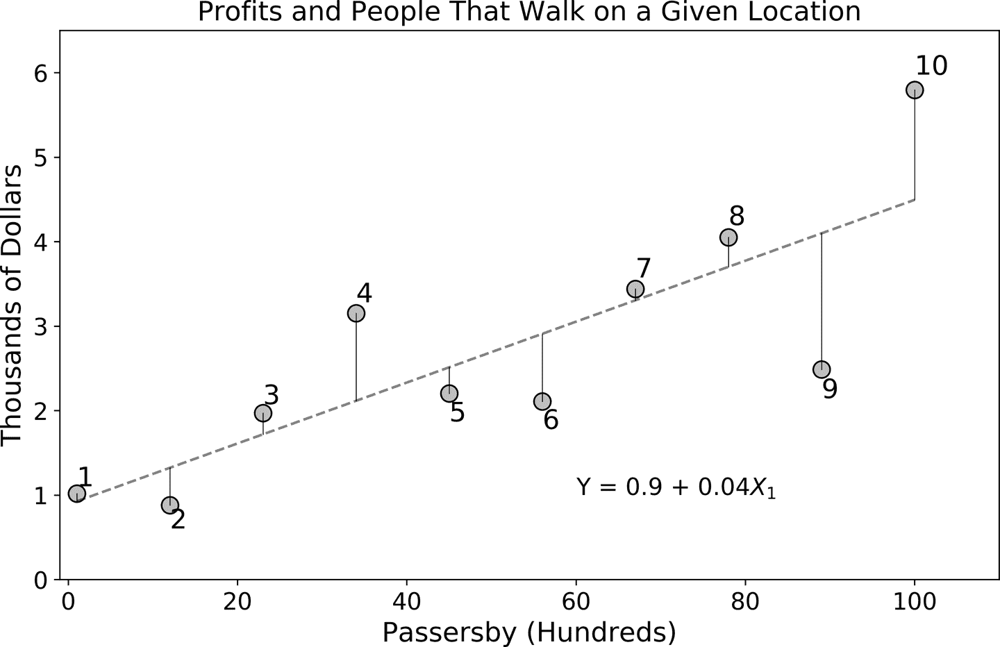
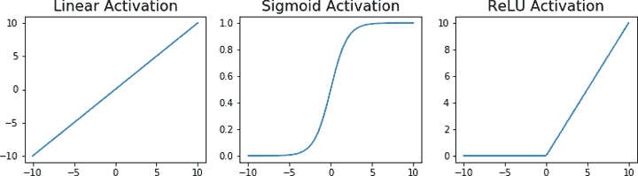

# 附录 A. 机器学习简介

在这个附录中，我简要总结了机器学习的概念，目的是提供一个自包含的指南。我没有试图深入了解各种方法的复杂性，因为本书的主题是学习如何从这些技术中创造价值，而不是学习每一种不同的方法。它将提供一些背景知识，希望能对机器学习的工作原理有一些直观理解。对于感兴趣的读者，我还将介绍 A/B 测试的基础知识。

# 什么是机器学习？

机器学习是一门科学学科，研究机器如何通过数据和算法学习完成某些任务。算法是一种配方或一系列指令，反复应用直至达到精确的目标，并且是用编程语言编写的，使人能够与计算机进行交互。然后这些指令被转换成机器语言，然后进行处理和计算。

# ML 模型的分类法

机器学习算法的任何分类法都从描述*监督*和*无监督*方法开始（图 A-1）。通常情况下，当有人或某物告诉我们任务成功完成时，我们称这种学习为监督学习。例如，如果你正在学习弹奏一种乐器，比如康加鼓，你的老师可能会首先展示给你一个好的掌声音调的例子。你自己尝试后，她会告诉你你的技术和音调是否接近完美音调；我们称这种将尝试与理想情况进行比较的过程为*监督*。


###### 图 A-1\. 学习模型的分类法

## 监督学习

监督学习算法同样如此，人类提供指导，告诉算法世界的情况与其当前猜测的差异。为了实现这一点，我们必须首先对数据进行*标记*。以图像识别为例，我们输入一张图片，算法需要正确识别图片中显示的内容（比如狗）。我们向算法提供足够多带有“狗”标签的狗的图片，以及其他物体（如猫、鼓、大象等）的图片，并标有相应的“猫”、“鼓”和“大象”标签。通过标记，算法能够将最新的预测与现实进行比较，并相应调整。

监督学习的世界相对简单；我们只需要一种生成预测标签的方法，一种与实际标签比较的方法，以及一种随时间改进性能的更新规则。我们通过*损失函数*评估当前猜测的整体质量：当我们的数据完全预测时，它达到最小值，并且随着预测能力变差而增加。正如您可能想象的那样，我们的目标是最小化损失，聪明的更新规则使我们能够持续下降，直到不再可能获得显著改进。¹

## 无监督学习

无监督学习要困难得多，因为没有明确的衡量标准来判断预测的对错。我们的目标是发现数据中一些潜在的模式，这些模式对问题解决同样有信息性。聚类和异常检测是两个例子。

在聚类中，我们的目标是找到相对同质的客户群体，例如，这些不同群体之间也应该有所不同。这在数据驱动的分割中经常使用。²

在无监督异常检测中，算法试图通过观察特征的分布来区分“预期”的和“意外”的。例如，也许我们的高管中有 95%在正常的一天内销售 7 到 13 台电脑；超出这些限制的任何事物都可能被标记为异常。

## 半监督学习

还有一个中间类别未在图 A-1 中显示，有时称为*半监督*学习，在这种算法中，只需少量数据示例即可泛化知识。一些从业者认为，这更接近人类学习的方式，与最先进的需要数千或数百万数据点才能提供可靠预测的监督技术形成鲜明对比。儿童只需少量示例即可学会识别物体。一些研究人员认为，当前人工智能必须克服的主要挑战之一是这种半监督学习问题。³

# 回归和分类

继续我们的学习算法分类，让我们讨论两种最常见的监督学习任务：回归和分类。在回归中，我们的标签采用量化的形式。例如，您可能希望预测客户的年龄或收入水平，或者他们将忠诚于我们公司的时间；所有这些都可以准确表示为数字：您 40 岁的邻居比您 39 岁的兄弟大一岁，比您 47 岁的朋友小七岁。在回归中，*数值具有严格的数值解释*。

相比之下，在分类任务中，目标是预测一个分类标签：你可能想预测客户的性别、他们是否会违约贷款，或者某个特定销售是否存在欺诈行为。请注意，这里的标签是类别，你可以为它们指定任何你想要的名称。在性别分类中，“男性”也可以被标记为“0”，“女性”标记为“1”，但这些显然是数值标签缺乏数值意义：你可以随意交换标签并相应地重新定义一切，而你的学习任务中没有任何改变。没有意义表明其中一个大于另一个或者你不能进行算术计算。

回归可以通过利用数字的有序属性轻松转换为分类问题。业务中一个常见的回归任务是预测特定活动的利润，但有时你可能不需要确切的数值：比如你只想知道你的公司是否会亏钱（负利润）或者不会（零或正利润）。同样，对于广告和市场目的，我们通常需要与行为差异相关联的年龄范围，而不是客户年龄的精确估计。在这两个例子中，我们最终得到了分类问题，而不是最初的回归任务。顺便提一下，在第七章中也提倡使用相同的技巧来将决策二元化，在那里可以采取一系列行动。

注意到，尽管我们可以将任何数字轻松分组成有序的组，但逆转这一过程以恢复原始的数值标签可能是不可行的。我们可能会尝试通过某些统计量（例如类别中的平均值）来近似这些值，但这通常是不建议的。举例来说，考虑你的客户的学历水平，精确测量为受教育年限。想象一下，针对你的业务问题，你只关心预测客户是否完成了大学教育。现在我们可以使用大学阈值将世界分为两部分：客户的学历水平要么高于完成大学教育，要么低于。请注意，如果稍后尝试恢复标签，可能会遇到问题，因为在回归中的严格数值解释可能会被打破。而且，绝对应避免对每个类别进行任意的重新标记（例如对完成大学教育的标记为 1，否则为 0），并在*回归设置*中使用这种方法，因为回归算法会将标签字面上视为数字（而不是象征性地）。

# **做预测**

由于当前的 AI 技术是预测技术，了解预测的产生方式非常有用。为此，让我们从一个相当抽象但足够一般的任务描述开始。我们的目标是预测一个结果<math alttext="y"><mi>y</mi></math>，我们人类推测它依赖于输入（也称为特征）<math alttext="x 1 comma x 2 comma ellipsis comma x Subscript upper K Baseline"><mrow><msub><mi>x</mi> <mn>1</mn></msub> <mo>,</mo> <msub><mi>x</mi> <mn>2</mn></msub> <mo>,</mo> <mo>⋯</mo> <mo>,</mo> <msub><mi>x</mi> <mi>K</mi></msub></mrow></math>。为了得到预测，我们需要将输入转化为结果，数学上可以描述为一个函数<math alttext="y equals f left-parenthesis x 1 comma x 2 comma ellipsis comma x Subscript upper K Baseline right-parenthesis"><mrow><mi>y</mi> <mo>=</mo> <mi>f</mi> <mo>(</mo> <msub><mi>x</mi> <mn>1</mn></msub> <mo>,</mo> <msub><mi>x</mi> <mn>2</mn></msub> <mo>,</mo> <mo>⋯</mo> <mo>,</mo> <msub><mi>x</mi> <mi>K</mi></msub> <mo>)</mo></mrow></math>。例如，我们可能想预测下个季度的业务利润（<math alttext="y"><mi>y</mi></math>），并推测它们依赖于天气的严重程度（<math alttext="x 1"><msub><mi>x</mi> <mn>1</mn></msub></math>）和季度内预计的劳动成本（<math alttext="x 2"><msub><mi>x</mi> <mn>2</mn></msub></math>）。在这种情况下，我们只有两个特征，所以<math alttext="Profits equals f left-parenthesis severity comma labor right-parenthesis"><mrow><mtext>Profits</mtext> <mo>=</mo> <mi>f</mi> <mo>(</mo> <mtext>severity</mtext> <mo>,</mo> <mtext>labor</mtext> <mo>)</mo></mrow></math>。

在这一点上，不清楚这个函数从何而来，但请注意，如果我们有这样一个函数，预测应该相对简单：我们只需将输入的值插入方程式右侧，并输出我们的预测。例如，我们可以评估我们的预测函数，对于 100 英寸降雨和季度劳动成本为$15,000，如<math alttext="f left-parenthesis 100 comma 15000 right-parenthesis"><mrow><mi>f</mi> <mo>(</mo> <mn>100</mn> <mo>,</mo> <mn>15000</mn> <mo>)</mo></mrow></math>。如果我们有一个线性函数<math alttext="2 comma 000 x 1 minus 2 x 2"><mrow><mn>2</mn> <mo>,</mo> <mn>000</mn> <msub><mi>x</mi> <mn>1</mn></msub> <mo>-</mo> <mn>2</mn> <msub><mi>x</mi> <mn>2</mn></msub></mrow></math>，我们插入这些值，得到利润为 2,000 × 100 - 2 × 15,000 = $170K。

## 插件方法的注意事项

这种方法的简易性有两个要注意的地方。首先，为了进行预测，我们必须插入特征的值，所以我们假设我们知道这些值。回到例子中，要预测下一个季度的利润，我们必须知道并插入天气严重程度的值。是哪个季度的天气？当前季度还是下一个季度？我们可能能够测量本季度的降雨量，但如果真正重要的是下一个季度的降雨量，那么我们必须*预测以便预测*。这个故事的寓意是，如果我们关心预测，我们必须仔细选择我们的输入，以避免这种循环依赖。

第二个微妙的问题涉及回归和分类问题的预测。在回归的情况下，插入方法效果很好，因为函数<math alttext="f left-parenthesis right-parenthesis"><mrow><mi>f</mi> <mo>(</mo> <mo>)</mo></mrow></math>将数值特征映射到数值结果。这是我们对数学函数的期望。那么，我们如何定义输出标签的函数，比如“狗”，“猫”或“火车”？在分类中使用的技巧是使用将数值特征映射到概率的函数，即 0 到 1 之间的数字，量化我们对当前示例属于某一类别的信念程度。因此，在分类任务中，我们通常预测*概率分数*，并使用*决策规则*将其转换为类别。

# 使用监督学习作为优化决策的输入

我一直在说 AI 是我们决策过程中的一个基本输入。为了理解这是如何运作的，请回顾第六章，即在不确定性下做出决策时，我们需要将我们要优化的指标的期望值进行比较，并选择生成最大的杠杆。对于两种结果的情况，期望值为：

<math alttext="upper E left-parenthesis x right-parenthesis equals p 1 x 1 plus p 2 x 2" display="block"><mrow><mi>E</mi> <mrow><mo>(</mo> <mi>x</mi> <mo>)</mo></mrow> <mo>=</mo> <msub><mi>p</mi> <mn>1</mn></msub> <msub><mi>x</mi> <mn>1</mn></msub> <mo>+</mo> <msub><mi>p</mi> <mn>2</mn></msub> <msub><mi>x</mi> <mn>2</mn></msub></mrow></math>

分类模型提供概率估计（<math alttext="p 1 comma p 2"><mrow><msub><mi>p</mi> <mn>1</mn></msub> <mo>,</mo> <msub><mi>p</mi> <mn>2</mn></msub></mrow></math>）。或者，有时您可能更愿意直接使用回归，并为每个杠杆估计预期效用。

## 这些函数从哪里来？

现在我们知道如何在手头有一个将输入映射到结果的函数时进行预测，最后一个问题是这些函数是从哪里来的？回到我们的利润例子，利润如何随降雨或劳动力成本的变化而变化？

数据驱动方法使用监督算法来拟合最佳预测函数，而不施加任何其他限制。这是从业者中最常见的方法。相比之下，模型驱动方法从第一原则出发（有时甚至不看数据）并对允许的函数类型施加限制。后一种方法主要被计量经济学家和工业界使用，而在业界中很少见。后一种方法的主要优势在于提供*可解释*的预测，因为理论是从头开始建立的。但预测能力通常也较低。

在机器学习中，解释性与预测能力之间的这种权衡普遍存在，并具有几个重要的后果。首先，当我们使用预测算法分配优惠或做出决策时，并且无法解释为何做出了这个决定时（想象一下类似“我应该雇佣那个人吗？”或“被告有罪还是无罪？”的问题），可能涉及伦理考虑。伦理问题在第八章中有详细讨论。其次，这种透明度的缺乏也可能成为我们业务中广泛采用这些方法的障碍。人类喜欢在做出选择之前理解*为什么*事情会发生。如果数据科学家无法解释*为什么*，他们的业务伙伴可能更愿意继续以传统方式做事，即使预测解决方案更优。

## 做出良好的预测

到目前为止，我希望我已经说服了你，如果我们有一个将输入映射为结果的函数，并且我们知道特征的值，那么做出预测相对简单。但是，我们如何做出*好*的预测呢？毕竟，我可以预测这本书会成为畅销书，但这可能大错特错。

不幸的是，关于做出良好预测的魔法配方并不存在。但是，我们可以遵循一些良好的实践。首先，将函数拟合到我们的数据并不等同于做出良好的预测。事实上，通过记忆实际数据集，我们可以在这些数据上获得完美的预测。做出良好预测的关键在于在收到新数据时能够*泛化*。

数据科学家通常通过随机将数据集分成*训练*和*测试*样本来解决这个问题。他们首先使用他们的算法在训练样本上拟合最佳函数，然后在测试集上评估预测的质量。如果我们过于关注训练集，我们可能会*过拟合*，这是在现实世界中泛化能力差的表现。请注意，在实践中，我们通过保留数据的子集——测试样本来模拟“真实世界”。这种模拟的质量通常很好，除非在我们训练模型和进行预测之间，世界在预测问题上发生了有意义的变化。AI 通常因其在这些*非静态*环境中泛化能力不足而受到批评。我们稍后将遇到一个例子，过拟合会阻碍我们对新数据进行良好外推的能力。

另一个好的实践是确保我们的估计对数据的小变化具有鲁棒性。这有几种不同的方式。例如，在训练阶段可以排除异常观测值，因为某些算法对离群值非常敏感。⁴ 我们也可以使用对这类数据集具有鲁棒性的算法，例如通过对不同模型的预测进行平均或平滑处理。

# 从线性回归到深度学习

自时间开始以来，人类一直在使用不同的预测技术，但深度学习是最先进的技术，也是当前人们谈论 AI 的原因。虽然这里不是深入讨论深度人工神经网络（ANN）的技术细节的地方，但至少对于解密的目的，给出这些算法如何工作的直观解释仍然是有用的。为了这样做，我们最好从最简单的预测算法开始：线性回归。

## 线性回归

在线性回归中，我们将一个定量输出 <math alttext="y"><mi>y</mi></math> 建模为不同输入或特征 <math alttext="x 1 comma x 2 comma ellipsis comma x Subscript upper K Baseline"><mrow><msub><mi>x</mi> <mn>1</mn></msub> <mo>,</mo> <msub><mi>x</mi> <mn>2</mn></msub> <mo>,</mo> <mo>⋯</mo> <mo>,</mo> <msub><mi>x</mi> <mi>K</mi></msub></mrow></math> 的函数，但我们限制自己于线性表示，即： <math alttext="y equals alpha 0 plus alpha 1 x 1 plus alpha 2 x 2 plus ellipsis plus alpha Subscript upper K Baseline x Subscript upper K"><mrow><mi>y</mi> <mo>=</mo> <msub><mi>α</mi> <mn>0</mn></msub> <mo>+</mo> <msub><mi>α</mi> <mn>1</mn></msub> <msub><mi>x</mi> <mn>1</mn></msub> <mo>+</mo> <msub><mi>α</mi> <mn>2</mn></msub> <msub><mi>x</mi> <mn>2</mn></msub> <mo>+</mo> <mo>⋯</mo> <mo>+</mo> <msub><mi>α</mi> <mi>K</mi></msub> <msub><mi>x</mi> <mi>K</mi></msub></mrow></math> 。注意算法选择如何限制我们能够拟合数据的函数类。在这种情况下，学习任务是找到权重或系数 <math alttext="alpha Subscript k"><msub><mi>α</mi> <mi>k</mi></msub></math>，使我们能够很好地逼近我们的数据，并且最重要的是，能够对新数据进行泛化。

想象一下，我们想要开一家新店，但是考虑到不同的位置，我们希望找到能够最大化投资回报率（ROI）的位置。如果我们能够预测各个位置的利润，这将是一项相当容易的任务：在预算范围内，在不同位置中选择预期利润更高的位置开店。

由于利润等于收入减去成本，理想的数据集应包括所有可能位置的这两个量。正如您可以想象的那样，这样的数据集可能难以获得。假设我们能够获得一个数据集，告诉我们在我们城市的任何街道上午 9 点到中午之间经过的人数。作为一个起点，我们可以安全地推测，更多的过路人会带来更高的利润。我们的推理可能是这样的：我们的收入来自于销售，销售本身与进入我们店铺并最终购买东西的人有关。如果没有人经过，我们很难做出销售。另一方面，如果一些人经过，有些人可能会进店并购买。这解决了收入问题，但成本呢？其他店铺经理可能也像我们一样思考，因此我们可能需要竞争租金，从而增加成本。请注意，这个故事只谈论我们认为可能的影响*方向*，而不是实际的*大小*；我们将让算法拟合数据，并检查结果是否与我们的直觉一致。

一个简单的线性模型可以假设利润（<math alttext="y"><mi>y</mi></math>）随过路人数（<math alttext="x 1"><msub><mi>x</mi> <mn>1</mn></msub></math>）的增加而增加，即 <math alttext="y equals alpha 0 plus alpha 1 x 1"><mrow><mi>y</mi> <mo>=</mo> <msub><mi>α</mi> <mn>0</mn></msub> <mo>+</mo> <msub><mi>α</mi> <mn>1</mn></msub> <msub><mi>x</mi> <mn>1</mn></msub></mrow></math> 。请注意，我们人类专家已经决定了三件事：（1）我们想要预测的结果是每家商店的利润；（2）利润仅依赖于每个位置的过路人数，这是一个显著的简化；（3）我们限制自己在一个线性世界中，这是另一个显著的简化。在线性回归中，我们要问：哪些参数 <math alttext="alpha 0 comma alpha 1"><mrow><msub><mi>α</mi> <mn>0</mn></msub> <mo>,</mo> <msub><mi>α</mi> <mn>1</mn></msub></mrow></math> 能使我们的 *预测最准确*？

图 A-2 显示了我们公司目前运营的 10 家假设商店的利润与过路人数的散点图。我们可以立即看到数据中存在明显的趋势，即更高的利润与更多的过路人相关联。


###### A-2\. 10 家假设商店的利润和过路人数

最小二乘法是我们所说的“预测最准确”的最常见解决方案。在这种损失函数下，算法找到能使平均误差最小化的参数，如 图 A-3 所示。这一线性模型下的预测由虚线表示，误差用垂直线表示，可以是正数也可以是负数。例如，对于商店 10，我们的预测几乎比实际数额低了 2K 美元，误差是正数。另一方面，对于商店 2、5、6 和 9，我们的线性模型高估了实际利润与他们的过路人数相比。在图表底部展示了实际的预测方程式。对于这个数据集，算法发现 <math alttext="alpha 0 equals 0.9"><mrow><msub><mi>α</mi> <mn>0</mn></msub> <mo>=</mo> <mn>0</mn> <mo>.</mo> <mn>9</mn></mrow></math> 和 <math alttext="alpha 1 equals 0.04"><mrow><msub><mi>α</mi> <mn>1</mn></msub> <mo>=</mo> <mn>0</mn> <mo>.</mo> <mn>04</mn></mrow></math> 。这是如何发生的细节超出了本书的范围，但我想指出的是，该算法尝试不同的可能值，以减少计算量。一个天真的替代方案是尝试许多不同的随机组合，但由于这个集合非常庞大，我们将需要多年时间才能找到最佳的可能值。⁶



###### A-3\. 线性回归中的预测误差

这个方程不仅仅是对计算它费心的数据科学家的一个智力好奇，它实际上提供了一些将过路人转化为利润的可能机制的解释：每多经过 100 人的地点，“生成”40 美元的利润。我们在第二章中讨论了解释这些结果具有因果关系的风险，但现在重要的是强调，这个数学对象可能具有重要的商业内容，这种内容是使用 AI 创造价值所必需的，因为它使我们能够以非常简单的方式解释我们的结果。正如之前讨论的那样，线性回归处于预测能力与解释性的极端之一，如果理解和可解释性得到足够重视，这是一种常见的算法选择。

回到我们的结果，注意对于某些商店预测非常好，而对于其他商店则相当糟糕：我们的线性模型对 1、3、5、7 和 8 号商店几乎给出了完美的预测，但对于 9 号和 10 号商店则表现不佳。最小二乘解的一个特性是平均误差为零，⁷ 所以正误差和负误差最终会互相抵消。


###### 图 A-4\. 拟合二次方程

### 控制其他变量

线性回归非常适合捕捉数据中发现的一些关系的直觉。在我看来，线性回归中最重要的结果之一被称为[*弗里斯-沃-洛弗尔定理* (FWL)](https://oreil.ly/WHtde)，它指出通过在回归中包含控制变量（在第二章中称为混淆因素）来估计感兴趣变量的净效应。

为了看到这一点的作用，假设您怀疑在先前的回归中的结果可能受到高商业化社区潜在顾客更多的影响，因此您的低利润可能与高竞争社区中的价格效应有关，而不是仅仅与顾客数量有关。这第三个变量可以作为您试图估计的纯量效应的混杂物。

您可以通过将额外变量——附近商业机构数量——包含在您的线性回归中来控制此效应：

<math alttext="y Subscript i Baseline equals alpha 0 plus alpha 1 x Subscript 1 i Baseline plus alpha 2 x Subscript 2 i Baseline plus epsilon Subscript i" display="block"><mrow><msub><mi>y</mi> <mi>i</mi></msub> <mo>=</mo> <msub><mi>α</mi> <mn>0</mn></msub> <mo>+</mo> <msub><mi>α</mi> <mn>1</mn></msub> <msub><mi>x</mi> <mrow><mn>1</mn><mi>i</mi></mrow></msub> <mo>+</mo> <msub><mi>α</mi> <mn>2</mn></msub> <msub><mi>x</mi> <mrow><mn>2</mn><mi>i</mi></mrow></msub> <mo>+</mo> <msub><mi>ϵ</mi> <mi>i</mi></msub></mrow></math>

与以前一样，<math alttext="x Subscript 1 i"><msub><mi>x</mi> <mrow><mn>1</mn><mi>i</mi></mrow></msub></math> 表示每个时间段的过路人数，<math alttext="x Subscript 2 i"><msub><mi>x</mi> <mrow><mn>2</mn><mi>i</mi></mrow></msub></math> 表示附近不同商店的数量，都是店铺 <math alttext="i"><mi>i</mi></math> 的属性。

FWL 定理指出，如果你运行这个回归，通过包括其他控制变量，路人（或邻里商店）的估计系数是净的。你实际上可以通过估计以下三种备选回归来验证得到*完全相同的结果*：

1.  对 <math alttext="y Subscript i"><msub><mi>y</mi> <mi>i</mi></msub></math> 进行回归，包括 <math alttext="x Subscript 2 i"><msub><mi>x</mi> <mrow><mn>2</mn><mi>i</mi></mrow></msub></math>（以及一个常数），并保存残差（称为 <math alttext="eta Subscript i"><msub><mi>η</mi> <mi>i</mi></msub></math>）。

1.  对 <math alttext="x Subscript 1 i"><msub><mi>x</mi> <mrow><mn>1</mn><mi>i</mi></mrow></msub></math> 进行回归，包括 <math alttext="x Subscript 2 i"><msub><mi>x</mi> <mrow><mn>2</mn><mi>i</mi></mrow></msub></math>（以及一个常数），并保存残差（称为 <math alttext="nu Subscript i"><msub><mi>ν</mi> <mi>i</mi></msub></math>）。

1.  最后，对 <math alttext="eta Subscript i"><msub><mi>η</mi> <mi>i</msub></math> 进行回归，包括 <math alttext="nu Subscript i"><msub><mi>ν</mi> <mi>i</msub></math>（以及一个常数）。与更长的回归中估计得到的相同，<math alttext="ModifyingAbove alpha With caret Subscript 2"><msub><mover accent="true"><mi>α</mi> <mo>^</mo></mover> <mn>2</mn></msub></math> 的相应系数完全相同。

请注意，在步骤 1 和 2 中，你正在*清理*感兴趣的变量受混淆变量影响的影响。一旦你有了这些新变量（相应的残差），你可以运行一个简单的双变量回归以获得所需的估计值。该书的 Github 仓库提供了该定理的演示以及一些额外的细节。

非常好的结论是，通过在同一回归中包括控制变量或混杂因素，你可以得到净效应。

### 过度拟合

图 A-5 显示了拟合包括 6 次多项式的线性回归的结果。顶部面板显示这个函数非常适合训练数据，你认为呢？然而，请记住我们希望推广到新数据。底部面板显示了我们的测试数据的预测结果，包括 10 家新商店，这些商店在训练阶段*未*使用。看起来拟合效果并不如测试集上好。要检查是否过度拟合，我们实际上需要绘制训练数据和测试数据的预测误差作为多项式次数的函数。


###### 图 A-5\. 过度拟合的一个案例

图 A-6 描述了在训练和测试数据上的平均预测误差，作为我们允许的线性回归灵活性的函数，即多项式的次数。正如你所看到的，在训练数据中，我们总是做得更好，错误随着更高次数的多项式而持续减少。这总是在训练数据中发生的情况，这也是数据科学家在另一套数据上评估他们预测质量的原因。对于测试数据，有过拟合的证据，出现 3 次或更高次多项式：最低的预测误差是通过 2 次多项式得到的，然后开始增加，显示了较低的泛化能力。


###### 图 A-6\. 训练样本和测试样本的预测误差

## 神经网络

为了介绍神经网络，让我从绘制一个略显奇特的线性回归图开始，仅仅是为了在两种技术之间建立桥梁。图 A-7 显示通过边缘或线条连接的圆形节点；每个连接的强度由权重 <math alttext="alpha 下标 k"><msub><mi>α</mi> <mi>k</mi></msub></math> 给出。这个节点和相应的边被称为网络，它提供了一种可视化输入和输出之间关系的方法： <math alttext="上标 X 1"><msub><mi>X</mi> <mn>1</mn></msub></math> 对输出产生大小为 <math alttext="alpha 1"><msub><mi>α</mi> <mn>1</mn></msub></math> 的影响，对于 <math alttext="上标 X 2"><msub><mi>X</mi> <mn>2</mn></msub></math> 也是如此。在接下来的讨论中，请记住，在线性回归案例中，学习算法找到了最小化预测误差的权重集合，*深度神经网络也是如此*。


###### 图 A-7\. 线性回归示为一个网络

在回归中，由于<math alttext="y equals alpha 0 plus alpha 1 upper X 1 plus alpha 2 upper X 2"><mrow><mi>y</mi> <mo>=</mo> <msub><mi>α</mi> <mn>0</mn></msub> <mo>+</mo> <msub><mi>α</mi> <mn>1</mn></msub> <msub><mi>X</mi> <mn>1</mn></msub> <mo>+</mo> <msub><mi>α</mi> <mn>2</mn></msub> <msub><mi>X</mi> <mn>2</mn></msub></mrow></math>右侧的数量与结果<math alttext="y"><mi>y</mi></math>一一映射。例如，如果<math alttext="alpha 1 equals 1"><mrow><msub><mi>α</mi> <mn>1</mn></msub> <mo>=</mo> <mn>1</mn></mrow></math>，<math alttext="alpha 2 equals 0"><mrow><msub><mi>α</mi> <mn>2</mn></msub> <mo>=</mo> <mn>0</mn></mrow></math>且没有截距或偏置，如果相应的输入值为 2 和 1，由于等式，我们知道<math alttext="y equals 2"><mrow><mi>y</mi> <mo>=</mo> <mn>2</mn></mrow></math>。这是线性性质之一。但是我们可以想象有更一般的情况，比如<math alttext="y equals g left-parenthesis alpha 0 plus alpha 1 upper X 1 plus alpha 2 upper X 2 right-parenthesis"><mrow><mi>y</mi> <mo>=</mo> <mi>g</mi> <mo>(</mo> <msub><mi>α</mi> <mn>0</mn></msub> <mo>+</mo> <msub><mi>α</mi> <mn>1</mn></msub> <msub><mi>X</mi> <mn>1</mn></msub> <mo>+</mo> <msub><mi>α</mi> <mn>2</mn></msub> <msub><mi>X</mi> <mn>2</mn></msub> <mo>)</mo></mrow></math>对于某些函数<math alttext="g left-parenthesis right-parenthesis"><mrow><mi>g</mi> <mo>(</mo> <mo>)</mo></mrow></math>。这很可能使我们摆脱线性回归的领域，但根据问题，它可能更适合数据，并希望对新数据也有更好的泛化能力。⁸

### 激活函数：增加一些额外的非线性效果

*激活*或*传递*函数是这样一类函数，通常用于深度学习（DL）。线性回归中的隐式激活函数当然是线性的（见图 A-8）。但是有几种更有趣的替代方法，已经成为从业者的必备工具。在修正线性单元（ReLU）的情况下，当<math alttext="alpha 0 plus alpha 1 upper X 1 plus alpha 2 upper X 2"><mrow><msub><mi>α</mi> <mn>0</mn></msub> <mo>+</mo> <msub><mi>α</mi> <mn>1</mn></msub> <msub><mi>X</mi> <mn>1</mn></msub> <mo>+</mo> <msub><mi>α</mi> <mn>2</mn></msub> <msub><mi>X</mi> <mn>2</mn></msub></mrow></math>为负或零时，输出为零，对于正值，我们又回到线性回归的世界。请注意，这个函数仅在联合作用为正时被激活，因此得名。更平滑的版本是 S 型激活。激活函数是在预测模型中引入非线性效果的另一种方式。它们最初被引入是为了捕捉我们对大脑中神经元如何激活的理解，但今天我们使用它们是因为它们提高了我们模型的预测能力。



###### 图 A-8\. 不同的转移或激活函数

使用这些工具，我们准备介绍神经网络。神经网络是一组节点和边或节点之间的连接，就像图 A-9 中所示的一样。左侧面板显示了一个仅有两个输入的网络，每个输入影响两个隐藏或中间节点，其强度由相应的参数中介。我们可以决定在每个中间节点中使用非线性激活函数。最后，一旦我们有了每个隐藏单元的强度，我们就可以通过相应的权重和可能的激活函数再次整合对输出的影响。这些节点和边的安排原本设计用来模拟我们大脑的工作方式，节点是通过突触或网络中的边连接的神经元。如今，很少有从业者会字面上理解这种类比。右侧面板显示了一个稍深的网络，具有两个隐藏层，每个层具有不同的宽度或节点数。它是全连接的，因为每个层中的节点都连接到下一个层中的节点，但这并非一定如此。事实上，深度学习中一种控制过拟合的方法是通过系统性地删除一些节点之间的这些边，这种技术被称为*dropout*。

深度人工神经网络（Deep ANNs）正在变得越来越大，非常深的网络具有数百个隐藏层和数十万甚至数百万个神经元。此外，更丰富的架构或组装这些神经元的方法已被证明在解决计算机视觉和自然语言处理中的特定问题中非常宝贵，这在今天是一个活跃的研究领域。


###### 图 A-9\. 深度神经网络的两个示例：左图显示了一个具有一个隐藏层和两个输入的网络，而右图描述了一个具有五个输入和两个隐藏层的网络

### 深度学习的成功

那么，围绕深度学习（DL）的兴奋点在哪里呢？人工神经网络（ANNs）及其各种不同的架构变体，如卷积神经网络（CNNs）等，已被证明在解决那些过去被认为只能由我们人类达到的问题上非常成功。

在图像识别领域，深度卷积神经网络（**CNNs**）已经取得了与人类可比的结果，甚至在图像分类方面超过了我们人类。2012 年，其中一种名为 AlexNet 的神经网络通过赢得 ImageNet 比赛，将分类错误率从 26%降低到 15.3%，展示了深度学习相对于其他方法的强大能力。⁹ 这个错误率随着网络深度的增加而每年逐步减少，现在甚至超过了我们识别和分类多达 1,000 个类别的能力。¹⁰ 深度 CNN 中的每一层都能检测图像中不同抽象级别和细节。例如，第一层可以检测对象的形状或边缘，第二层可以检测线条或条纹等模式，依此类推。

语言是序列数据的一个例子，在这方面，递归神经网络（**RNNs**）产生了深远的影响。序列数据具有发生顺序重要的特性。例如，比较这两个变体：“我让我的房间打扫了”和“我已经打扫了我的房间”。这两个句子使用了完全相同的词汇，但顺序不同，意思略有不同。另一个展示顺序重要性的例子是预测给定相邻词的一个词，这个过程类似于我们在句子中提取上下文的方式。序列数据的一个困难在于算法必须有某种记忆，以记住之前发生了什么以及当前状态是什么。与多层神经网络不同，当使用连续输入时，RNN 访问这种记忆并将其与当前输入结合起来更新预测。这类网络在语音识别、图像字幕生成、机器翻译和问答等问题中显示出了非凡的能力，并且是每一个商业可用虚拟助手背后的技术。由于这些技术，企业正在转变我们与客户互动和沟通的方式。这只是自然语言应用的冰山一角。

深度学习（DL）对另一个领域的深远影响是视频游戏和战略游戏。从 2015 年开始，谷歌的 DeepMind AlphaGo 已经击败了人类职业选手和顶级玩家。这是通过将 DL 算法的预测能力与*强化学习*相结合来实现的。在后者中，当采取某些行动时，一套明确定义的奖励系统起作用。算法的任务是通过与环境互动学习未来能够获得最高奖励的行动，而良好或不良的决策则会产生一系列奖励，从而加强学习过程。到目前为止，我们只能在高度受限的环境中使用这些算法，例如游戏，其中奖励函数相对简单，我们可以轻松生成大量的游戏数据集供算法学习。但研究人员已经开始利用这些技术来改进自动驾驶车辆、机器人和工厂，因此对于深度强化学习来说，未来看起来充满希望。

尽管深度学习（以及更广泛的机器学习）已经并将继续产生深远影响，但它并不是一种类似于人类拥有的通用学习技术。在一些领域中，机器学习与人类相比表现不佳的领域包括识别和学习因果关系、在少有经验的情况下学习（半监督或自监督学习）、常识推理、以及上下文提取，仅举几例。机器学习算法是强大的模式识别技术，应该作为这样的技术来对待。

# A/B 测试初探

之前的章节介绍了一些机器学习的基本概念，重点放在了实践者们最常用的监督学习技术上。在本节中，我们将来看一下 A/B 测试，这是在第二章中介绍的技术。

请回忆我们在这里的目标是模拟反事实，消除选择偏差的普遍影响。这个想法是，虽然我们可能无法得到我们客户的确切副本，但我们仍然可以通过*随机化*来模拟这样一种复制设备，即通过将客户随机分配到两个组：接受治疗的组和不接受治疗的组（对照组）。请注意，选择两个组是为了便于说明，因为该方法适用于超过两种治疗方法的情况。

我们知道每组客户都不同，但通过正确使用随机分配，我们消除了任何选择偏差：我们的客户是随机选择的，而且认为随机选择是无偏的。良好的随机化使我们能够确保治疗组和对照组在平均上*事前不可区分*。为了更准确地说明其工作原理，假设我们知道客户的年龄和性别。*在运行实验之前*，我们会检查治疗组和对照组的性别分布和平均年龄是否相同。如果答案是肯定的，那么我们的随机化是正确的。

### 实际应用中的 A/B 测试

在行业中，随机分配不同治疗方案的过程被称为 A/B 测试。其名称来源于我们希望测试一个替代<math alttext="upper B"><mi>B</mi></math>，与我们通常使用的默认操作<math alttext="upper A"><mi>A</mi></math>相对。与机器学习工具箱中的许多技术不同，A/B 测试可以由任何人执行，即使没有强大的技术背景也可以。然而，我们可能需要确保我们的测试满足一些技术上的统计性质，但这些相对容易理解和实施。过程通常如下所示：

1.  选择一个可操作的假设进行测试：例如，女性呼叫中心代表的转化率比男性代表高。这是一个明确的可以被证伪的假设。

1.  选择一个相关且可衡量的关键绩效指标来量化测试结果；在本例中，我们选择转化率作为我们的结果。如果女性代表的平均转化率*不明显大于*男性的平均转化率，我们无法得出治疗效果显著的结论，因此我们将继续按照业务惯例运营。使用统计显著性的概念来精确定义*大于*的意义是标准做法。

1.  选择将参与测试的客户数量：这是必须仔细选择并将在下文讨论的第一个技术属性。

1.  随机分配客户到两个组，并检查随机化是否产生满足事前不可区分属性的组。

1.  测试完成后，测量平均结果的差异。我们应该注意一个相当技术性的细节，即一个差异是由纯粹的偶然产生还是不（统计显著性）。

如果随机化执行正确，我们已经消除了选择偏差，并且平均结果的差异提供了因果效应的估计。

### 理解功效和大小计算

第三步，选择客户数量，是从业者称之为*功效和大小计算*的内容，不幸的是，我们必须面对关键的权衡。请记住，统计估计的一个普遍特性是，样本量越大，我们对估计的不确定性就越小。我们总是可以估计分配给<math alttext="upper B"><mi>B</mi></math>组的 5、10 或 1,000 名客户的平均结果，但对于后者而言，我们的估计将比前者更为精确。从严格的统计观点来看，我们更倾向于进行大规模的实验或测试。

然而，从业务角度来看，使用大团体进行测试可能并不理想。首先，我们必须尊重分配直到测试结束，因此存在尝试其他潜在更有利可图的处理控制或基础情景的机会成本。因此，业务利益相关者通常希望尽快完成测试。在我们的呼叫中心示例中，女性代表团的转化率可能低于预期，因此在整个工作日内，我们的运作并不理想，这可能对业务（和我们同事的奖金）造成重大影响。我们在开始时无法知道（但是一个设计良好的实验应该包括对此类事件发生的某种分析）。

因为这种权衡，我们通常选择最小的客户数量，满足两个统计属性：实验应具有正确的统计大小和功效，以便我们可以足够自信地得出实验是否成功的结论。这将引导我们进入假阳性和假阴性的话题。

### 假阳性和假阴性

在我们的呼叫中心示例中，假设与我们最初的假设相反，男性和女性代表的转化效率完全相同。在理想情况下，我们将在两种情况之间找不到差异，但在实践中，即使很小，这总是*非零的*。我们如何知道平均结果的差异是由于随机噪声，还是显示了一个真实的，但可能很小的差异呢？这就是统计学进入故事的地方。

当我们错误地得出跨组平均结果存在差异的结论时，就会出现*假阳性*，因此我们因此得出了处理有影响的结论。我们选择测试的*大小*以最小化此类事件的发生概率。

另一方面，可能治疗确实起作用，但我们可能无法足够自信地检测到效果。当实验参与者数量相对较少时，通常会发生这种情况。结果是我们得到了一个*功效不足的*测试。在我们的呼叫中心示例中，我们可能错误地得出结论，即性别之间的代表生产力相同，而实际上一个性别的转化率更高。

# 统计大小和功效

稍微不严格地说，统计检验的*大小*是遇到假阳性的概率。 检验的*功效*是正确找到治疗和对照之间差异的概率。

Figure A-10 的第一个面板显示了一个功效不足的测试情况。 替代物<math alttext="upper B"><mi>B</mi></math>增加了 30 个额外销售，但由于样本量较小，这种差异估计精度不足（由垂直线表示的宽阔且重叠的置信区间可见）。

第二个面板显示了真实差异接近额外 50 个销售的情况，我们能够精确估计平均值及其差异（由于置信区间非常小，它们甚至看起来不像区间）。


###### 图 A-10\. 第一个面板展示了功效不足测试的结果：在治疗组和对照组的平均结果之间存在差异，但每组的样本量都太小，无法准确估计这种效果；第二个面板展示了理想的结果，显示了差异存在并且我们能够正确得出这一结论。

让我们简要讨论在 A/B 测试背景下假阳性和假阴性的成本。 为此，回想一下我们最初想要通过实验实现的目标：我们目前正在拉动一个杠杆，并且想知道替代物是否对影响我们业务的指标更为优越。 因此，存在两种可能的结果：我们要么继续拉动我们的 A 杠杆，要么用 B 替代物代替它。 在假阳性的情况下，结果是做出次优的替代。 类似地，假阴性会误导我们继续拉动 A 杠杆，这也会影响我们的结果。 在这种意义上，两者有点对称（在两种情况下，我们都面临不确定的长期影响），但不少人会不对称地处理它们，通过设置假阳性的概率为 5%或 10%（大小），假阴性的概率为 20%（功效的互补）。

然而，设计和运行实验也存在机会成本，因此我们最好假设最佳情况下替代物有影响。 这就是为什么大多数从业者倾向于确定测试的大小并找到允许我们检测某种最小效果的最小样本量。

示例 A-1 展示了如何使用 Python 计算实验的样本量：

##### 示例 A-1\. 计算 A/B 测试的样本量

```
# Example: calculating the sample size for an A/B test
from scipy import stats
def calculate_sample_size(var_outcome, size, power, MDE):
    '''
 Function to calculate the sample size for an A/B test
 MDE = (t_alpha + t_oneminusbeta)*np.sqrt(var_outcome/(N*P*(1-P)))
 df: degrees of freedom when estimating the variance of the outcome
 (if sample size is large df is also large so I artificially set it at
 1000)
 '''
    df = 1000
    t_alpha = stats.t.ppf(1-size, df)
    t_oneminusbeta = stats.t.ppf(power, df)
    # same number of customers in treatment and control group
    P = 0.5
    # solve for the minimum sample size
    N = ((t_alpha + t_oneminusbeta)**2 * var_outcome)/(MDE**2 * P * (1-P))
    return N

# parameters for example below
var_y = 4500
size = 0.05
power = 0.8
MDE = 10
sample_size_for_experiment = calculate_sample_size(var_y, size, power, MDE)
print('We need at least {0} customers in experiment'.format(
   np.around(sample_size_for_experiment),decimals=0))
```

在实践中，我们首先设定测试的功效和大小，然后选择一个 MDE。 一种思考方法是，这是对我们的结果指标进行的最小变化，从业务角度来看这个实验是值得的。 最后，我们可以从公式中反向工程出我们需要的样本量。

要看到这一实践，假设我们想运行一个 A/B 测试，看看通过价格优惠是否能增加我们的平均客户消费或票数。在这个价格弹性实验中，治疗组将获得新的更低价格，而对照组将继续支付常规价格。由于这些高消费客户，每月支出的方差为$4,500（标准偏差约为$67）。作为基准，我们选择了标准的尺寸和功率值（5% 和 80%）。最后，我们的业务利益相关者说服我们，从他们的角度来看，只有在找到至少 10 美元的最小效应（MDE）（或一个标准偏差的 15%）时，尝试新的替代才有意义。我们运行我们的大小计算器，并发现我们需要至少 1,115 名实验参与者。由于我们的联系率大约为 2%，我们应该向大约 55.2K 名客户发送电子邮件。

# 进一步阅读

有许多关于通用机器学习的书籍。寻找高度技术性材料的读者可以随时查阅 Robert Tibshirani 和 Trevor Hastie 的杰作*Elements of Statistical Learning*（Springer）。他们与 Daniela Witten 和 Gareth James 合著了一本介绍性的关于构建和解释机器学习模型的教科书，内容不那么技术性，但富有直觉：*Introduction to Statistical Learning With Applications in R*（Springer）。Kevin Murphy 的*Machine Learning: A Probabilistic Perspective*（MIT Press）在技术层面上展示了许多方法，并提供了必要的贝叶斯基础。

其他更加实践的书籍，不仅教会你理解，还能使用流行的开源库实施机器学习的有 Matthew Kirk 的*Thoughtful Machine Learning*（O'Reilly）和 Joel Grus 的*Data Science from Scratch*（O'Reilly）。它们都提供了机器学习模型的出色介绍，并深入讨论了一些常用的方法。我还强烈推荐 Foster Provost 和 Tom Fawcett 的*Data Science for Business*（O'Reilly），这本书既面向业务人士又面向从业者：它们在技术和解释之间达到了难以置信的平衡。这最后三本都是机器学习和数据科学领域极力推荐的 O'Reilly 系列书籍之一。

可能可以在 Ian Goodfellow，Yoshua Bengio 和 Aaron Courville 的*Deep Learning*（MIT Press）中找到最详尽和通用的人工神经网络处理方法。我还推荐 Adam Gibson 和 Josh Patterson 的*Deep Learning*（O'Reilly），以及 Francois Chollet 的*Deep Learning With Python*（O'Reilly）。还有一些针对特定主题的高级书籍：Alex Graves 的*Supervised Sequence Labelling with Recurrent Neural Networks（Studies in Computational Intelligence）*（Springer）提供了对 RNN 的深入处理，而 Yoav Goldberg 的*Neural Network Methods in Natural Language Processing（Synthesis Lectures on Human Language Technologies）*（Morgan & Claypool）则是自然语言应用中学习算法的介绍。

两本令人耳目一新的面向公众的当前人工智能技术处理书籍是 Terrence Sejnowski 的*The Deep Learning Revolution*（MIT Press）和 Jerry Kaplan 的*Artificial Intelligence. What Everyone Needs to Know*（Oxford University Press）。前者由革命内部人士编写，虽然高度自我参照，但提供了对上个世纪最后几十年技术发展的丰富时间轴账述，以及神经科学家和认知科学家所知的大脑运作方式如何推动了许多这些发展。后者的问答格式有时可能过于严格，但最终提供了当前方法的易读账述，以及人工智能背后的哲学基础等不太常见的主题。

A/B 测试有许多处理方法，从 Dan Siroker 和 Pete Koomen 的*A/B Testing: The Most Powerful Way to Turn Clicks into Customers*（Wiley）开始，您可以对 A/B 测试的应用有一个很好的理解。Peter Bruce 和 Andrew Bruce 的*Practical Statistics for Data Scientists*（O'Reilly）提供了关于统计基础的易于理解的介绍，包括功效和样本大小计算。Carl Andersen 的*Creating a Data-Driven Organization*（O'Reilly）简要讨论了 A/B 测试中的一些最佳实践，强调其在数据和分析驱动型组织中的作用。Ron Kohavi（曾在微软，现在在 Airbnb）一直在积极推动行业中试验的应用。他最近与 Diane Tang 和 Ya Xu 合著的书籍*Trustworthy Online Controlled Experiments: A Practical Guide to A/B Testing*（剑桥大学出版社）是一个很好的参考资料。部分内容可以在[*https://exp-platform.com*](https://exp-platform.com)和[*https://oreil.ly/1CPRR*](https://oreil.ly/1CPRR)找到。

您可以在 Howard S. Bloom 的*The Core Analytics of Randomized Experiments for Social Research*中找到关于功效计算的材料，[在线获取](https://oreil.ly/zs9gx)。

¹ 机器学习中最常用的更新规则是我们在第七章中展示的*梯度下降*算法。

² 这与以业务为驱动的细分相对，分析师提供明确的业务逻辑来对客户进行分组。例如，一个组可能是男性，年龄在 25 到 35 岁之间，在我们这里的任期超过 24 个月。

³ 这个类别也被称为*自监督*学习。参见[*https://oreil.ly/yky7W*](https://oreil.ly/yky7W)。

⁴ 平均数对异常值非常敏感，与中位数相反。例如，取三个数字<math alttext="left-parenthesis 1 comma 2 comma 3 right-parenthesis"><mrow><mo>(</mo> <mn>1</mn> <mo>,</mo> <mn>2</mn> <mo>,</mo> <mn>3</mn> <mo>)</mo></mrow></math>。简单平均数和中位数都是 2。将数据集改为<math alttext="left-parenthesis 1 comma 2 comma 300 right-parenthesis"><mrow><mo>(</mo> <mn>1</mn> <mo>,</mo> <mn>2</mn> <mo>,</mo> <mn>300</mn> <mo>)</mo></mrow></math>。中位数仍然是 2，但平均数现在是 101。

⁵ 正式来说，它最小化均方误差。这样我们对正误差和负误差对称处理。

⁶ 普通最小二乘法（OLS）实际上有一个封闭形式的解，这意味着在实践中我们不需要迭代直到获得足够好的估计。然而，在使用大数据时，有些情况下会通过*梯度下降*进行迭代改进，依次调整权重，以逼近最优参数集合（第七章）。这通常是在使用 OLS 处理大数据时的情况，其中我们最终将数据分布在多个节点或服务器上。

⁷ 这是每当我们包括常数、截距或偏差时的情况，<math alttext="alpha 0"><msub><mi>α</mi> <mn>0</mn></msub></math>。

⁸ 在某些情况下，我们仍然可以使用线性回归，比如<math alttext="g left-parenthesis z right-parenthesis equals e x p left-parenthesis z right-parenthesis"><mrow><mi>g</mi> <mo>(</mo> <mi>z</mi> <mo>)</mo> <mo>=</mo> <mi>e</mi> <mi>x</mi> <mi>p</mi> <mo>(</mo> <mi>z</mi> <mo>)</mo></mrow></math>。使用对数变换将我们带回线性领域，得到新的变换结果<math alttext="ln left-parenthesis y right-parenthesis"><mrow><mo form="prefix">ln</mo> <mo>(</mo> <mi>y</mi> <mo>)</mo></mrow></math>。

⁹ 这些是前五错误率，意味着我们对每个图像使用前 5 个预测，并检查真实标签是否包含在此列表中。顶部 1 错误率是传统的预测错误率：算法只允许每个图像一个猜测。该数据集上的人类错误率已经被基准测试到约为 3.6%，这意味着在 100 张要分类的图像中，我们的前 5 个预测几乎匹配 96 张。

¹⁰ ImageNet 数据库包含超过 20,000 个类别，但比赛中只使用了 1,000 个。
