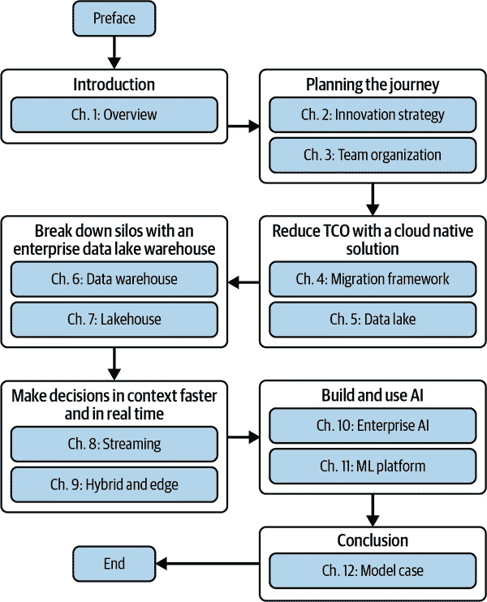

# 前言

什么是数据平台？为什么你需要它？建立数据和机器学习（ML）平台涉及什么？为什么你应该在云上构建你的数据平台？本书从回答这些在处理数据和 ML 项目时常见的问题开始。然后我们提出了我们建议你在业务中建立数据和 ML 能力的战略旅程，向你展示如何执行每个步骤的策略，并将所有概念包装在一个现代化数据改造案例中。

# 为什么你需要云数据平台？

假设你公司的首席技术官（CTO）想要建立一个新的手机友好的电子商务网站。“我们正在失去业务”，他声称，“因为我们的网站没有针对移动设备进行优化，尤其是在亚洲语言上。”

首席执行官（CEO）相信首席技术官（CTO）说当前网站的移动用户体验并不好，但她想知道通过手机访问平台的客户是否构成人口的一个有利可图的部分。她打电话给亚洲运营主管，并问：“通过手机访问我们电子商务网站的客户的收入和利润率是多少？如果我们增加在移动设备上进行购买的人数，我们的总收入将如何在接下来的一年内变化？”

亚洲地区领导者如何回答这个问题？这需要能够关联客户访问（以确定 HTTP 请求的来源）、客户购买（以了解他们购买了什么）和采购信息（以确定这些物品的成本）。这还需要能够预测市场不同部分的增长。区域领导者是否需要联系信息技术（IT）部门，并要求他们从所有这些不同来源汇集必要的信息，并编写一个程序来计算这些统计数据？IT 部门是否有足够的带宽来回答这个问题，并具备进行预测分析的技能？

如果组织拥有一个*数据平台*会好多少？在这种情况下，所有数据都已经被收集和清理，并且可以在整个组织中进行分析和综合。数据分析团队可以简单地运行交互式的特定查询。他们还可以利用内置的人工智能（AI）能力轻松地创建或检索收入和流量模式的预测，并允许基于数据驱动的决策来回应 CTO 投资于新的手机友好网站的请求。

回答 CEO 问题的一个可能方法是采购和部署真实用户监控（RUM）工具。有很多专门的工具可供选择，比如这种单一决策。拥有数据平台使组织能够回答许多这类单一问题，而无需采购和安装这些特定的解决方案。

现代组织越来越希望基于数据做出决策。我们的例子集中在一次性决策上。然而，在许多情况下，组织希望重复地、自动化地做出决策，例如，组织可能希望确定购物车是否有被放弃的危险，并立即向客户显示可以添加到购物车以达到免费运输最低限额的低成本商品选项。这些商品应该吸引个体购物者，因此需要强大的分析和 ML 能力。

为了基于数据做出决策，组织需要一个数据和 ML 平台，简化以下几点：

+   获取数据访问权限

+   运行交互式的即席查询

+   创建报告

+   基于数据做出自动化决策

+   业务服务的个性化

正如你将在本书中看到的，基于云的数据平台降低了所有这些功能的技术门槛：可以从任何地方访问数据，甚至在边缘设备上进行快速的大规模查询，并利用提供许多分析和 AI 能力的服务。然而，能够部署实现所有这些构建块有时可能是一段复杂的旅程。本书的目标是帮助读者更好地理解建立现代云数据平台所需的主要概念、架构模式和工具，以便他们可以更好地监控和控制企业数据，从而做出更有意义和自动化的业务决策。

我们，本书的作者，是具有多年经验的工程师，帮助各行各业的企业在各种地理位置建立数据和 ML 平台。这些企业希望从他们的数据中获取洞察，但通常面临许多挑战，即如何以可以快速分析的形式获取所有所需的数据。因此，他们发现自己不得不构建现代数据和 ML 平台。

# 本书适合谁？

本书适合希望通过使用公共云技术创建数据和 ML 平台来支持业务数据驱动决策的架构师。数据工程师、数据分析师、数据科学家和 ML 工程师将发现本书对于获取系统的概念设计视角是有用的。

数字原生公司已经做了几年了。

早在 2016 年，[Twitter 解释](https://oreil.ly/OwTy4)称，他们的数据平台团队维护着“用于支持和管理多种业务目的的数据生产和消费系统，包括公开报告的指标、推荐、A/B 测试、广告定位等。” 到 2016 年，这涉及维护全球最大的 Hadoop 集群之一。到 2019 年，这一情况正在改变，包括支持使用[云原生数据仓库解决方案](https://oreil.ly/xeud3)。

以 Etsy 为例，他们[说](https://oreil.ly/4vckj)他们的 ML 平台“通过开发和维护 Etsy 的 ML 从业者依赖的技术基础设施来支持 ML 实验”。

Twitter 和 Etsy 都建立了现代化的数据和 ML 平台。这两家公司的平台是不同的，以支持平台需要支持的不同类型的数据、人员和业务用例，但其基本方法是相似的。在本书中，我们将向您展示如何设计一个能够让您业务中的工程师使用的现代化数据和 ML 平台的架构：

+   从各种来源收集数据，例如操作数据库、客户点击流、物联网（IoT）设备、软件即服务（SaaS）应用等。

+   打破组织内不同部门之间的孤立。

+   处理数据时，在加载数据后或正在摄取数据时，需确保数据质量和治理的适当流程。

+   定期或临时分析数据。

+   使用预建的 AI 模型丰富数据。

+   构建 ML 模型进行预测分析。

+   定期或响应触发事件或阈值对数据采取行动。

+   传播洞见并嵌入分析。

如果您在企业中处理数据和 ML 模型，这本书对于引导您在由您的数据或 ML 平台团队构建的平台上进行工作具有架构考虑是一个很好的介绍。因此，如果您是数据工程师、数据分析师、数据科学家或 ML 工程师，您将发现本书有助于获取高层次的系统设计视图。

即使我们主要在 Google Cloud 上有经验，我们努力保持对构建架构的云不可知服务的愿景，引入但不限于来自三大云提供商（即 Amazon Web Services [AWS]、Microsoft Azure 和 Google Cloud）的例子。

# 本书的组织结构

本书分为 12 章，这些章节对应于*通过数据创新的战略步骤*，将在第二章中详细解释。本书最后还展示了一个模型用例场景，展示了组织可能如何进行现代化之旅。

书籍流程的视觉表达见图 P-1。

第一章讨论了组织应该建立数据平台的原因。它还涵盖了数据平台中的方法、技术趋势和核心原则。

在第 2 和 3 章中，我们深入探讨如何规划旅程，识别创新的战略步骤以及如何实现变革。在这里，我们将讨论诸如降低总体拥有成本（TCO）、消除数据孤岛以及如何利用 AI 解锁创新等概念。我们还分析数据生命周期的构建模块，讨论如何设计您的数据团队，并推荐采用计划。在第 Chapter 4 中，我们将这些整合为迁移框架。

###### 图 P-1\. 书籍流程图

在第 5、6 和 7 章中，我们讨论了数据平台的三种常见架构 — 数据湖（第五章）、数据仓库（第六章）和湖仓（第七章）。我们展示了湖仓可以从数据湖或数据仓库逐步发展到这种架构的两种方式，并讨论如何在这两条道路之间进行选择。

在第 8 和 9 章中，我们讨论基本湖仓模式的两种常见扩展。我们展示如何通过引入流模式在上下文中更快地实时做出决策，以及如何通过扩展到边缘来支持混合架构。

第 10 和 11 章涵盖如何在企业环境中构建和使用 AI/ML，以及如何设计架构来设计、构建、提供和编排创新模型。这些章节包括预测性 ML 模型和生成性 ML 模型。

最后，在第 Chapter 12 中，我们将关注模型数据现代化案例旅程，重点介绍如何从传统架构迁移到新架构，解释组织如何选择特定解决方案的过程。

如果您是一名云架构师，负责为您的业务构建数据和 ML 平台，请按顺序阅读本书的所有章节。

如果您是一名数据分析师，负责创建报告、仪表板和嵌入式分析，请阅读第 1、4 至 7 章，并阅读第十章。

如果您是构建数据流水线的数据工程师，请阅读第五章至第九章。浏览剩余章节，并在需要特定类型应用时将其作为参考。

如果您是负责构建机器学习模型的数据科学家，请阅读第七章、第八章、第十章和第十一章。

如果您是对将机器学习模型操作化感兴趣的机器学习工程师，请快速浏览第一章至第九章，并仔细研读第十章和第十一章。

# 本书使用的约定

本书使用以下印刷约定：

*斜体*

表示新术语、网址、电子邮件地址、文件名和文件扩展名。

`等宽字体`

用于程序列表以及段落内引用程序元素（如变量或函数名、数据库、数据类型、环境变量、语句和关键字）。

###### 注意

此元素表示一般提示或提示。

# 致谢

写这样一本书是有回报的，因为你不仅在分享知识，还在分享经验的成果，而这些经验是在与许多人一起战斗中获得的。写这本书让我们想起了所有那些我们有幸与之共事、学习和庆祝的人们。要想不违反保密条款地提到每一个人是不可能的，所以我们只想向数据分析、数据工程和数据科学社区致以最诚挚的感谢。

我们深表感谢我们了不起的技术审稿人员——Sami Akbay，Mike Dahlin，Kevin George，Jonathan Gerhard，Noah Gift，Sanjay Ramchandani，Joseph Reis 和 Vicki Reyzelman——对草稿手稿进行审阅，并为我们提供宝贵的反馈和建议。

O’Reilly 是技术书籍的首选出版商，我们团队的专业素养证明了这一点。Megan Laddusaw 在创建引人入胜的大纲过程中给予了我们指导。Virginia Wilson 和 Melissa Potter 勤奋地管理整个内容的开发。Gregory Hyman 在打造精彩的最终手稿产品过程中给予了我们支持，甚至在所有图表设计中帮助了我们。感谢你们的所有帮助！

*Marco:* 我要感谢我的美丽妻子 Lara Maria Gessica，她是我的指路明灯，在整个旅程中一直给予我极大的支持。还要感谢我的可爱儿子 Walter 和 Nicholas，他们让我的生活每一天都变得美好而令人难以置信。

*Lak:* 非常感谢 Abirami 给予我的 25 年爱与陪伴。抗议现在已经变得有点稀薄了，但我会尽量不让空巢导致更多的写作承诺！

*Firat**:* 我把这本书献给了继续塑造我的生活并使一切成为可能的三位女士。献给我的女儿 Evre，因为她的好奇心和快乐。献给我的妻子 Yontem，因为她的坚韧不拔。以及献给我的母亲 Emine Ayla，因为她对我的信念和自信从未间断。

我们三人将这本书的所有版税捐赠给[Girls Who Code](https://girlswhocode.com)，这个组织的使命是*培养未来的女性工程师人才*。数据在商业的许多方面变得越来越核心，这就使得建设数据的工作力量变得多样化和包容性更为重要。
