# 第一章：现代化您的数据平台：简介概述

数据是一项宝贵的资产，可以帮助您的公司做出更好的决策，发现新的机会并改善运营。2013 年，谷歌进行了一项战略性项目，通过提高经理质量来增加员工保留率。甚至像管理技能这样宽泛的事物也可以以数据驱动的方式进行研究。谷歌通过分析 1 万份绩效评审，识别高绩效经理的共同行为，并创建培训计划，将[管理偏好](https://oreil.ly/MN6eZ)从 83%提高到 88%。亚马逊也进行了一项战略性数据项目，实施了基于客户行为的[推荐系统](https://oreil.ly/URxN_)，该系统在 2017 年驱动了 35%的购买。旧金山勇士篮球队是另一个例子；他们实施了一个[分析程序](https://oreil.ly/dFZRW)，帮助他们在联盟中跻身顶级。所有这些——员工保留、产品推荐、提高胜率——都是通过现代数据分析实现的商业目标。

要成为一家数据驱动型公司，您需要建立一个数据分析、处理和洞察生态系统。这是因为有许多不同类型的应用程序（网站、仪表板、移动应用、机器学习模型、分布式设备等）会生成和消耗数据。您公司内部也有许多不同部门（财务、销售、营销、运营、物流等），它们需要数据驱动的洞察。由于整个公司都是您的客户群体，构建数据平台不仅仅是一个 IT 项目。

本章介绍了数据平台、其需求以及传统数据架构为何不足以满足要求。它还讨论了数据分析和人工智能的技术趋势，以及如何利用公共云构建未来的数据平台。本章概述了本书其余部分详细讨论的核心主题。

# 数据生命周期

数据平台的目的是支持组织从原始数据到见解信息所需的步骤。了解数据生命周期的步骤（收集、存储、处理、可视化、激活）是有帮助的，因为它们几乎可以直接映射到数据架构，从而创建一个统一的分析平台。

## 智慧之旅

数据帮助公司开发更智能的产品，接触更多客户，并增加他们的投资回报率（ROI）。数据还可以用于衡量客户满意度、盈利能力和成本。但是单靠数据本身是不够的。数据是原材料，需要经过一系列阶段才能用于生成洞见和知识。这一系列阶段就是我们所说的*数据生命周期*。文献中有许多不同的定义，但从一般的角度来看，我们可以确定现代数据平台架构中的五个主要阶段：

1\. 收集

数据必须被获取并注入到目标系统中（例如，手动数据输入、批量加载、流式摄取等）。

2\. 存储

数据需要以持久的方式存储，并且能够在将来轻松访问（例如，文件存储系统、数据库）。

3\. 处理/转换

数据必须经过处理以使其对后续步骤有用（例如，清洗、整理、转换）。

4\. 分析/可视化

需要研究数据，通过手动详细描述（例如，查询、切片和切块）或自动处理（例如，使用 ML 应用程序接口进行增强）来推导业务洞见。

5\. 激活

将数据洞见表现在一种形式和位置上，以便做出决策（例如，通知作为特定手动操作的触发器、在满足特定条件时执行自动作业、ML 模型向设备发送反馈）。

每个阶段都与下一个阶段相互关联，类似于水通过一组管道的流动。

## 水管类比

要更好地理解数据生命周期，可以将其视为简化的水管系统。水从水道开始，然后通过一系列管道进行转移和转换，直到到达一组房屋。数据生命周期类似，数据在被收集、存储、处理/转换和分析之前，需经历这些阶段，然后才能用于决策（见图 1-1）。

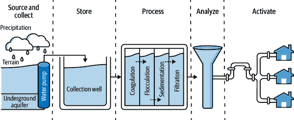

###### 图 1-1\. 水循环，为数据生命周期中的五个步骤提供类比。

你可以看到管道世界与数据世界之间的一些相似之处。管道工程师就像数据工程师，他们设计并建造使数据可用的系统。分析水样本的人就像数据分析师和数据科学家，他们分析数据以找到洞见。当然，这只是一个简化。公司中有许多其他使用数据的角色，如高管、开发人员、业务用户和安全管理员。但是这种类比可以帮助你记住主要的概念。

在经典的数据生命周期中，如图 1-2 所示，数据工程师会在分析存储中收集和存储数据。然后使用各种工具处理存储的数据。如果工具涉及编程，处理通常由数据工程师完成。如果工具是声明性的，处理通常由数据分析师完成。处理后的数据然后由业务用户和数据科学家进行分析。业务用户利用这些洞察力做出决策，例如推出营销活动或发放退款。数据科学家利用数据训练机器学习模型，这些模型可以用于自动化任务或进行预测。

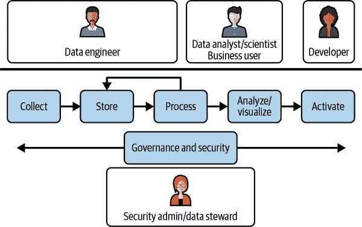

###### 图 1-2\. 简化数据生命周期

现实世界可能与前述现代数据平台架构和角色应如何工作的理想化描述不同。阶段可能会合并（例如存储和处理）或重新排序（例如处理在存储之前，如 ETL [抽取-转换-加载]，而不是存储在处理之前，如 ELT [抽取-加载-转换]）。然而，这些变化有其权衡之处。例如，将存储和处理合并为单个阶段会导致耦合，从而导致资源浪费（如果数据大小增长，您将需要扩展存储和计算）和可扩展性问题（如果您的基础设施无法处理额外负载，您将受阻）。

现在我们已经定义了数据生命周期并总结了数据从原始数据收集到激活的各个阶段的旅程，让我们依次过一遍数据生命周期的五个阶段。

## 收集

设计过程中的第一步是摄取。*摄取*是将数据从源头（可以是任何地方，例如本地、设备、另一个云等）传输到目标系统的过程，在目标系统中可以进一步进行分析。这是考虑大数据的 3V 的第一个机会：

体积

数据的大小是多少？通常在处理大数据时，这意味着数据量是以 TB（terabyte）或 PB（petabyte）为单位。

速度

数据进入的速度是多少？一般来说，这是以 MB/秒（megabyte/second）或 TB/天（terabyte/day）计算的。这通常被称为*吞吐量*。

多样性

数据的格式是什么？表格、扁平文件、图像、声音、文本等等。

确定要收集的数据类型（结构化、半结构化、非结构化）、格式和生成频率（连续或特定间隔）。根据数据的速度和数据平台处理结果的体积和多样性的能力，选择批处理摄取、流式摄取或两者混合。

由于组织的不同部分可能对不同的数据源感兴趣，请设计此阶段尽可能灵活。有几种商业和开源解决方案可供选择，每种解决方案都专门用于前面提到的特定数据类型/方法。您的数据平台将需要全面支持所需的所有数据摄入平台所需的各种数据量、速度和多样性。您可以使用简单的工具定期在文件传输协议（FTP）服务器之间传输文件，或者您可以使用复杂的系统，甚至在地理上分布，实时从物联网设备收集数据。

## 存储

在此步骤中，存储您在上一步中收集的原始数据。您不改变数据，只是存储它。这很重要，因为您可能希望以不同的方式重新处理数据，而您需要原始数据来完成这一操作。

数据有许多不同的形式和大小。存储数据的方式将取决于您的技术和商业需求。一些常见的选项包括对象存储系统、关系数据库管理系统（RDBMS）、数据仓库（DWH）和数据湖。您的选择在某种程度上将受到底层硬件、软件和工件是否能够满足您所需的可扩展性、成本、可用性、耐久性和开放性需求的驱动。

### 可扩展性

*可扩展性*是以一种能够处理增加需求的方式进行增长和管理的能力。实现可扩展性有两种主要方式：

垂直扩展

这涉及向同一节点添加额外的扩展单元，以增加存储系统的容量。

水平扩展

这涉及添加一个或多个附加节点，而不是向单个节点添加新的扩展单元。这种分布式存储类型管理更复杂，但可以实现更好的性能和效率。

极为重要的是，底层系统能够应对现代解决方案所需的体积和速度，这些解决方案必须在数据不断增长且性质从批处理向实时转变的环境中运行：我们生活在一个大多数人持续生成并要求访问信息的世界，他们利用智能设备；组织需要能够为其用户（内部和外部）提供能够对各种请求提供实时响应的解决方案。

### 性能与成本比较

确定您需要管理的不同类型的数据，并根据数据的业务重要性、访问频率以及数据使用者期望的延迟类型创建一个层次结构。

将最重要和最频繁访问的数据（热数据）存储在高性能存储系统中，例如数据仓库的原生存储。将较不重要的数据（冷数据）存储在成本较低的存储系统中，例如云存储（本身有多个层级）。如果需要更高的性能，例如用于交互式使用情景，可以使用缓存技术将热数据的有意义部分加载到易失性存储层。

### 高可用性

*高可用性* 意味着在请求时能够操作并提供对数据的访问。通常通过硬件冗余来应对可能的物理故障/停机。在云中，通过在至少三个*可用区*存储数据来实现。这些区域可能不是物理上分离的（即它们可能位于同一“校园”），但通常会有不同的电源来源等。硬件冗余通常被称为系统的*正常运行时间*，现代系统通常提供四个 9 或更多的运行时间保证。

### 耐久性

*耐久性* 是指在长期存储数据时不会出现数据降解、损坏或直接丢失的能力。通常通过在物理上分离的多个位置存储数据的多个副本来实现。在云中，通过在至少两个*区域*（例如伦敦和法兰克福）存储数据来实现数据冗余。这在面对自然灾害时非常重要：如果底层存储系统具有较高的耐久性（现代系统通常提供 11 个 9），则除非发生灾难性事件，否则所有数据都可以毫无问题地恢复，即使物理上分离的数据中心也可以。

### 开放性

尽可能使用非专有格式，并避免出现锁定情况。理想情况下，应能够使用多种处理引擎查询数据，而无需生成数据副本或将其从一个系统移动到另一个系统。尽管如此，使用具有专有或原生存储格式的系统也是可以接受的，只要它们提供简单的导出功能。

和大多数技术决策一样，开放性是一种权衡，专有技术的投资回报率可能足够高，以至于您愿意承担封闭式技术的代价。毕竟，选择云的一个原因是降低运营成本——在完全托管/无服务器系统中，这些成本优势往往比托管开源系统更高。例如，如果您的数据使用情况需要事务处理，使用类似于 Parquet 的准开放存储格式 Delta Lake 的 Databricks 可能比 Amazon EMR 或 Google Dataproc（分别在 S3 或 Google Cloud Storage [GCS]上存储数据的标准 Parquet）具有更低的运营成本——Databricks 在 Delta Lake 中提供的 ACID（原子性、一致性、隔离性、持久性）事务在 EMR 或 Dataproc 上实现和维护成本昂贵。如果您需要迁移离开 Databricks，可以将数据导出为标准 Parquet 格式。单纯的开放性并不是拒绝更适合的技术的理由。

## 过程/转换

这就是魔力发生的地方：原始数据被转换为进一步分析所需的有用信息。这是数据工程师构建数据管道的阶段，以使数据以有意义的方式对非技术用户可访问。这一阶段包括准备数据进行分析和使用的活动。数据集成涉及将来自多个源的数据合并为单一视图。可能需要进行数据清洗以删除数据中的重复项和错误。更广义上，数据整理、处理和转换是为了将数据组织成标准格式而进行的活动。

有几种框架可供选择，每种框架都有自己的功能，这些功能取决于您在上一步选择的存储方法。总的来说，允许您使用纯 SQL 命令查询和转换数据的引擎（例如 AWS Athena、Google BigQuery、Azure DWH 和 Snowflake）是最高效、成本效益最好，¹ 也是最易于使用的。然而，与基于现代编程语言（通常是 Java、Scala 或 Python）的引擎相比，它们提供的功能有限（例如在 Amazon EMR、Google Cloud Dataproc/Dataflow、Azure HDInsight 和 Databricks 上运行的 Apache Spark、Apache Flink 或 Apache Beam）。基于代码的数据处理引擎不仅可以实现更复杂的批处理和实时转换以及机器学习，还可以利用其他重要功能，例如适当的单元测试和集成测试。

在选择适当的引擎时，另一个考虑因素是组织中通常更普遍的 SQL 技能而不是编程技能。在组织内建立数据文化的程度越高，您就越应该倾向于使用 SQL 进行数据处理。如果处理步骤（如数据清洗或转换）需要领域知识，这尤为重要。

这个阶段可能还会采用*数据虚拟化*解决方案，该解决方案将多个数据源和相关逻辑抽象出来，以便直接提供给最终用户进行分析。我们不会在本书中进一步讨论虚拟化，因为它往往是建立一个完全灵活平台的过渡性解决方案。关于数据虚拟化的更多信息，请参阅 Sandeep Uttamchandani（O'Reilly）的书籍《*The Self-Service Data Roadmap*》第十章。

## 分析/可视化

一旦你到达这个阶段，数据最终开始有了自身的价值——你可以把它视为*信息*。用户可以利用多种工具深入挖掘数据内容，提取有用的见解，识别当前的趋势，并预测新的结果。在这个阶段，可视化工具和技术发挥着重要作用，允许用户以图形方式表示信息和数据（例如图表、图形、地图、热力图等），因为它们提供了一种简单的方式来发现和评估趋势、异常值、模式和行为。

数据的可视化和分析可以由多种类型的用户执行。一方面是对理解业务数据感兴趣并希望利用图形工具执行常见分析（如切片和切块汇总和假设分析）的人。另一方面，可能有更高级的用户（“权力用户”），他们希望利用 SQL 等查询语言执行更精细和定制的分析。此外，可能还有数据科学家，他们可以利用 ML 技术实施从数据中提取有意义见解、发现模式和相关性、改进客户理解和定位，并最终增加企业的收入、增长和市场地位。

## 激活

这一步是最终用户能够基于数据分析和 ML 预测做出决策的阶段，从提取或预测的见解中，现在是采取一些行动的时候了。

可执行的行动可以分为三类：

自动操作

自动化系统可以利用推荐系统的结果向客户提供定制建议。这可以通过增加销售来帮助企业的收入。

SaaS 集成

通过与第三方服务集成来执行操作。例如，一家公司可能实施市场营销活动，试图减少客户流失。他们可以分析数据并实施倾向模型，以识别可能对新商业提议积极响应的客户。然后，客户电子邮件地址列表可以自动发送给营销工具以启动活动。

警报

您可以创建实时监控数据并在满足特定条件时发送个性化消息的应用程序。例如，当商品列表页的流量超过某个阈值时，定价团队可以收到主动通知，从而可以检查商品的定价是否正确。

这三种情况的技术堆栈是不同的。对于自动化操作，“训练”ML 模型通常通过调度端到端的 ML 管道定期进行（这将在第十一章中介绍）。预测本身通过调用部署为 Web 服务的 ML 模型实现，使用像 AWS SageMaker、Google Cloud Vertex AI 或 Azure Machine Learning 这样的工具。SaaS 集成通常在功能特定的工作流工具的背景下进行，这些工具允许人员控制检索信息的方式、信息如何转换以及激活信息的方式。此外，利用大型语言模型（LLMs）及其生成能力（我们将在第十章中深入探讨这些概念）可以通过与核心系统紧密集成来帮助自动化重复任务。通过像 Apache Airflow 这样的编排工具、像 Google Eventarc 这样的事件系统或像 AWS Lambda 这样的无服务器函数实现警报。

在本节中，我们已经看到现代数据平台需要支持的活动。接下来，让我们研究实施分析和 AI 平台的传统方法，以更好地理解技术的发展以及为什么云方法可以产生重大差异。

# 传统方法的局限性

传统上，组织的数据生态系统由用于提供不同数据服务的独立解决方案组成。不幸的是，这种特定任务的数据存储，有时可能会扩展到重要规模，可能会导致组织内部的信息孤岛的创建。结果产生的信息孤岛系统作为独立解决方案运行，而不是以高效的方式协同工作。*信息孤岛数据就是被沉默的数据* ——从中难以提取见解的数据。要扩展和统一企业智能，安全地跨业务部门共享数据至关重要。

如果大多数解决方案都是定制化构建的，那么处理可扩展性、业务连续性和灾难恢复（DR）就会变得困难。如果组织的每个部分选择在不同的环境中构建其解决方案，复杂性就会变得令人不堪重负。在这种情况下，很难确保隐私或审计数据的变更。

其中一个解决方案是开发一个统一的数据平台，更确切地说是一个*云*数据平台（请注意，统一并不一定意味着集中化，稍后将会讨论）。数据平台的目的是允许在一个组织的所有数据上以一致、可扩展和可靠的方式进行*分析和机器学习*。在此过程中，您应尽可能充分利用托管服务，以便组织能够专注于业务需求而不是运营基础设施。基础设施的运维应完全委托给底层的云平台。在本书中，我们将探讨开发统一平台时需要做出的核心决策，以在可扩展和可靠的环境中整合业务单元之间的数据。

## 反模式：通过 ETL 打破孤岛

对于组织来说，很难对其数据拥有统一的视图，因为它们倾向于使用多种解决方案进行管理。组织通常通过使用数据移动工具来解决这个问题。ETL 应用程序允许在不同系统之间转换和传输数据，以创建一个数据的单一真实来源。然而，依赖 ETL 存在问题，在现代平台上有更好的解决方案。

ETL 工具通常被设计用来定期从事务性数据库中提取最新的交易数据，并将其存储在分析存储中，以便仪表板访问。这些数据会被标准化处理。为了能够在不每次都访问源系统的情况下进行分析，每个需要进行分析的数据库表都会创建相应的 ETL 工具（见图 1-3）。

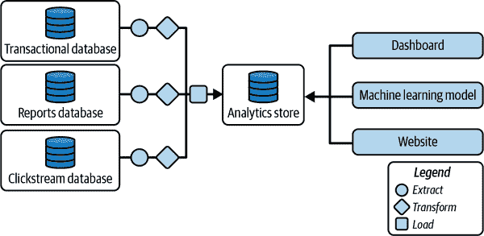

###### 图 1-3\. ETL 工具可以帮助打破数据孤岛

跨组织捕获所有数据的中心分析存储库，根据使用的技术，被称为*DWH*或*数据湖*。这两种方法之间的高级区别基于数据存储在系统内的方式：如果分析存储支持 SQL 并包含经过管理和质量控制的数据，则称为*DWH*。如果支持 Apache 生态系统工具（如 Apache Spark）并包含原始数据，则称为*数据湖*。用于指代介于这两种方法之间的分析存储（如管理的原始数据或未管理的质量控制数据）的术语因组织而异——有些组织称之为数据湖，而其他组织称之为 DWH。正如本书后面将会看到的，这种混淆的词汇不是问题，因为数据湖（第五章）和 DWH（第六章）的方法正在融合为所谓的数据湖仓（第七章）。

依赖数据移动工具尝试构建数据一致视图有一些缺点：

数据质量

ETL 工具通常由数据消费者编写，他们往往不如数据所有者理解数据。这意味着经常提取的数据并不是正确的数据。

延迟

ETL 工具引入延迟。例如，如果 ETL 工具每小时运行一次以提取最近的交易，并且运行需要 15 分钟，那么分析存储中的数据可能会滞后多达 75 分钟。通过流式 ETL 可以解决这个问题，其中事件在发生时即被处理。

瓶颈

ETL 工具通常需要编程技能。因此，组织设立定制数据工程团队来为 ETL 编写代码。随着组织内数据的多样性增加，需要编写的 ETL 工具数量不断增加。数据工程团队成为组织利用数据能力的瓶颈。

维护

系统管理员需要定期运行和排除 ETL 工具的故障。底层基础设施系统需要持续更新以应对增加的计算和存储容量，并保证可靠性。

变更管理

输入表模式的更改需要更改 ETL 工具的提取代码。这要么使得更改难以实现，要么导致 ETL 工具被上游更改破坏。

数据缺失

很可能需要将许多错误升级到数据所有者、ETL 工具的创建者或数据使用者。这增加了维护开销，而且工具停机也是非常频繁的。由于这个原因，数据记录中经常存在较大的空白。

治理

随着 ETL 流程的增加，同样的处理很可能由不同的流程执行，导致同一信息的多源性。随着时间的推移，这些流程通常会分歧以满足不同的需求，导致用于不同决策的数据不一致。

效率和环境影响

支持这些类型转换的基础设施是一个关注点，因为它通常是 24/7 运行，会产生重大成本并增加碳足迹的影响。

在前述列表中的第一个要点（数据质量）经常被忽视，但随着时间推移，它往往是最重要的。通常需要在数据能够“信任”投入生产之前对其进行预处理。来自上游系统的数据通常被认为是原始的，如果没有经过适当的清理和转换，可能会包含噪声或甚至错误信息。例如，电子商务网站日志可能需要在使用之前进行转换，例如从 URL 中提取产品代码或过滤掉机器人生成的虚假交易。数据处理工具必须专门为手头的任务构建。并不存在用于处理质量问题的全局数据质量解决方案或通用框架。

虽然在逐个考虑数据源时这种情况是合理的，但整体收集（参见图 1-4）导致混乱。

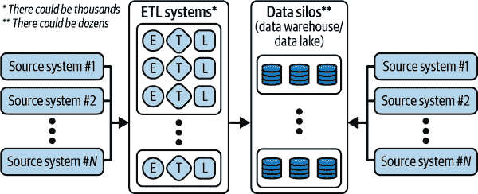

###### 图 1-4\. 数据生态系统与挑战

存储系统的增加，以及为满足不同下游应用程序需求而开发的定制数据管理解决方案的增多，导致分析领导者和首席信息官（CIO）面临以下挑战：

+   他们的 DWH/数据湖无法跟上不断增长的业务需求。

+   越来越多地，数字化倡议（以及与数字原住民的竞争）已经使业务转变为一个大规模数据量涌入系统的业务。

+   为不同的数据科学任务创建单独的数据湖、DWH 和特殊存储的需求最终导致了多个数据孤岛的产生。

+   数据访问需要受限或受限制，由于性能、安全性和治理挑战。

+   续订许可证和支付昂贵的支持资源变得具有挑战性。

显而易见，这种方法无法扩展以满足新的业务需求，不仅因为技术复杂性，还因为这种模型所需的安全性和治理要求。

## 反模式：控制的集中化

为了尝试解决通过专门的数据处理解决方案管理的孤立、分散和分布式数据的问题，一些组织试图将一切集中在由 IT 部门控制的单一的、单块的平台中。如图 1-5 所示，技术解决方案本质上并未改变，而是通过将问题分配给单一组织来使其更易于解决。

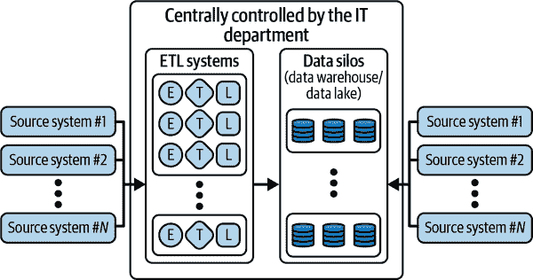

###### 图 1-5\. IT 集中控制数据系统的数据生态系统和挑战

由唯一部门进行的这种集中控制带来了其自身的挑战和权衡。所有业务单位（BU）——IT 本身、数据分析以及业务用户——当 IT 控制所有数据系统时，都会面临困难：

IT

IT 部门面临的挑战是这些数据孤岛涉及的各种技术集合。IT 部门很少具备管理所有这些系统所需的所有技能。数据存储在本地和云中的多个存储系统中，管理数据仓库、数据湖和数据集市成本高昂。如何在不同来源之间定义安全性、治理、审计等问题也并不总是明确。此外，获取数据存在扩展性问题：IT 需要进行的工作量随源系统和目标系统的增加而线性增加，因为这必然会增加所有相关利益相关者/业务用户的数据访问请求。

分析

有效分析过程中的一个主要问题是没有获取到正确的数据。当存在多个系统时，将数据移动到/从一个单块数据系统变得成本高昂，导致不必要的 ETL 任务等等。此外，预先准备和随时可用的数据可能没有最新的来源，或者可能存在其他版本的数据，提供更深入和更广泛的信息，例如拥有更多列或更细粒度记录。由于数据治理和运营问题，不可能让你的分析团队自由发挥，每个人都可以访问所有数据。组织往往最终限制数据访问，以牺牲分析灵活性为代价。

业务

获取业务可信赖的数据和分析结果非常困难。围绕限制向业务提供数据的问题存在着，以确保最高质量。替代方法是为业务用户开放他们所需的所有数据访问权限，即使这意味着牺牲质量。然后，挑战变成了在数据质量和可信数据量之间的平衡。通常情况下，IT 部门没有足够的合格业务代表来推动优先事项和需求。这很快会成为组织内部创新过程的瓶颈。

尽管存在诸多挑战，多个组织多年来采用了这种方法，导致业务用户在获取所需数据以完成任务时延迟，从而产生了挫败和紧张情绪。受挫的业务部门经常通过另一种反模式来应对——即*影子 IT*——整个部门开发和部署有用的解决方案，以规避这些限制，但最终加剧了数据孤岛问题。

有时会采用一种称为*数据布局*的技术方法。这仍然依赖于集中化，但是与物理移动数据不同，数据布局是一个虚拟层，用于提供统一的数据访问。问题在于，这样的标准化可能会给组织范围内的数据访问带来沉重的负担和延迟。然而，数据布局对于试图访问客户专有数据的 SaaS 产品来说是一种可行的方法——集成专家提供必要的从客户架构到 SaaS 工具期望的架构的转换。

## 反模式：数据集市和 Hadoop

围绕着孤立的集中管理系统存在的挑战给 IT 带来了巨大的紧张和开销。为了解决这个问题，一些企业采纳了另外两种反模式：数据集市和无治理数据湖。

在第一种方法中，数据被提取到本地的关系型和分析型数据库中。然而，尽管被称为数据仓库，但实际上这些产品是*数据集市*（企业数据的子集，适用于特定工作负载）由于可扩展性限制。数据集市允许业务用户设计和部署他们自己的业务数据到结构化数据模型中（例如在零售、医疗保健、银行、保险等领域）。这使得他们可以轻松获取有关当前和历史业务的信息（例如上个季度的收入金额、上周播放过你最新发布的游戏的用户数量、你的网站帮助中心花费的时间与过去六个月收到的工单数量之间的相关性等）。多年来，组织一直在使用各种技术（例如 Oracle、Teradata、Vertica）开发数据集市解决方案，并在其上实施多个应用程序。然而，这些本地技术在容量方面严重受限。IT 团队和数据利益相关者面临的挑战包括扩展基础设施（纵向）、寻找关键人才、降低成本，并最终满足提供有价值洞察的增长预期。此外，随着数据量的增长，这些解决方案往往成本高昂，因为你需要获取更多计算能力来处理它。

由于可扩展性和成本问题，基于 Apache Hadoop 生态系统的大数据解决方案被创建。Hadoop 引入了使用低成本通用服务器的分布式数据处理（横向扩展），使得以前只能用高端（和非常昂贵）专用硬件实现的用例成为可能。在 Hadoop 上运行的每个应用程序都设计为容忍节点故障，使其成为一些传统数据仓库工作负载的经济有效替代方案。这导致了一个新概念的发展，称为*数据湖*，它迅速成为数据管理的核心支柱之一，与数据仓库并列。

思路是，尽管核心运营技术部门继续执行例行任务，但所有数据都被导出到一个集中的数据湖中进行分析。这个数据湖的目的是作为分析工作负载和业务用户的中心存储库。数据湖已经从仅仅是原始数据的存储设施发展为能够在大量数据上进行高级分析和数据科学的平台。这使得整个组织能够进行自助式分析，但需要对高级 Hadoop 和工程流程有广泛的工作知识才能访问数据。与企业数据的指数级增长相对应，Hadoop 开源软件（Hadoop OSS）生态系统在数据系统和处理框架（如 HBase、Hive、Spark、Pig、Presto、SparkML 等）方面也有所发展，但这增加了额外的复杂性和维护成本。此外，数据湖变成了一团无政府状态的数据，很少有潜在的数据使用者能够理解。技能差距和数据质量问题的结合意味着企业很难从本地数据湖中获得良好的投资回报率。

现在您已经看到了几个反模式，让我们专注于如何设计一个数据平台，提供对整个生命周期内数据的统一视图。

# 创建统一的分析平台

数据市场和数据湖技术使 IT 能够构建数据平台的第一个迭代版本，以打破数据孤岛，并使组织能够从其所有数据资产中获取洞察。数据平台使数据分析师、数据工程师、数据科学家、业务用户、架构师和安全工程师能够获取更好的实时洞察，并预测他们的业务随时间如何发展。

## 云而非本地部署

DWH 和数据湖是现代数据平台的核心。数据仓库支持结构化数据和 SQL，而数据湖支持原始数据和 Apache 生态系统中的编程框架。

然而，在本地环境中运行数据仓库（DWH）和数据湖也存在一些固有的挑战，如扩展和运营成本。这促使组织重新考虑他们的方法，并开始将云（尤其是公共版本）视为这样一个平台的首选环境。为什么？因为这使得他们能够：

+   通过利用新的定价模型（*按使用付费模型*）来降低成本。

+   通过利用最佳技术加快创新速度

+   使用“突发”方法扩展本地资源规模。

+   通过在多个区域和地区存储数据来规划业务连续性和灾难恢复

+   使用完全托管的服务自动管理灾难恢复

当用户不再受到基础设施容量的限制时，组织可以在全公司范围内民主化数据，并释放洞察力。云支持组织进行现代化改造，因为它通过卸载管理、低价值任务来最小化麻烦和摩擦。云数据平台承诺提供一个环境，您不再需要妥协，可以构建一个全面的数据生态系统，覆盖从数据收集到服务的端到端数据管理和数据处理阶段。您可以使用云数据平台以不牺牲延迟的方式存储大量不同格式的数据。

云数据平台承诺：

+   集中式治理和访问管理

+   增加生产力和降低运营成本

+   组织内部数据共享增加

+   不同角色的扩展访问权限

+   减少访问数据的延迟

在公共云环境中，数据仓库（DWH）和数据湖技术之间的界限变得模糊，因为云基础设施（特别是计算和存储的分离）使得在本地环境中不可能实现的融合成为可能。今天可以将 SQL 应用于存储在数据湖中的数据，并且可以在存储在数据仓库中的数据上运行传统的 Hadoop 技术（例如 Spark）。在本节中，我们将为您介绍此融合如何运作以及如何成为革新组织数据观察方式的基础；在第五章至第七章中，您将获得更多详细信息。

## 数据集市（Data Marts）和数据湖（Data Lakes）的缺点

在过去的 40 年里，IT 部门意识到数据仓库（实际上是数据集市）难以管理，成本高昂。在过去表现良好的传统系统（如本地的 Teradata 和 Netezza 设备）已被证明难以扩展、成本昂贵，并带来了与数据新鲜度相关的一系列挑战。此外，它们不能轻松地提供现代能力，如接入 AI/ML 或实时功能，而不是事后添加该功能。

数据仓库用户通常是嵌入在特定业务单位中的分析师。他们可能对额外的数据集、分析、数据处理和商业智能功能有想法，这些对他们的工作非常有益。然而，在传统公司中，他们经常无法直接访问数据所有者，也无法轻易影响决定数据集和工具的技术决策者。此外，由于他们无法访问原始数据，他们无法测试假设或深入理解底层数据。

数据湖并非像它们看起来那么简单或成本效益。虽然从理论上讲它们可以很容易地扩展，但组织通常面临规划和配置足够存储空间的挑战，特别是如果它们产生高度变化的数据量。此外，为高峰期配置计算能力可能会很昂贵，导致不同业务单位之间竞争稀缺资源。

在场数据湖可能会很脆弱，并且需要耗费时间的维护。那些本可以开发新功能的工程师经常被安排维护数据集群和为业务单位安排任务。对于许多企业来说，总体拥有成本往往比预期的要高。简而言之，数据湖并没有创造价值，许多企业发现投资回报率为负。

对于数据湖来说，治理并不容易解决，特别是当组织的不同部分使用不同的安全模型时。然后，数据湖变得分割和分段，使得跨团队分享数据和模型变得困难。

数据湖的用户通常更接近原始数据源，并且需要使用数据湖工具和能力的编程技能，即使只是用于探索数据。在传统的组织中，这些用户倾向于专注于数据本身，并经常与业务的其他部门保持一定距离。另一方面，业务用户没有从数据湖中获取洞察力所需的编程技能。这种断开意味着业务部门错失了推动其业务目标提高收入、降低成本、降低风险和开发新机会的洞察力。

## 数据仓库（DWH）与数据湖的融合

面对这些权衡，许多公司最终采取了混合方法，其中数据湖被建立用于向数据仓库（DWH）输出一些数据，或者数据仓库旁边设有数据湖用于额外的测试和分析。然而，由于多个团队根据各自的需求构建自己的数据架构，对于中央 IT 团队来说，数据共享和数据的准确性变得更加复杂。

不再有各自目标的独立团队——一个探索业务，另一个了解业务——你可以将这些功能及其数据系统联合起来，创造一个良性循环，在这个循环中，对业务的深入理解推动了探索，而探索则推动了对业务的更深理解。

从这个原则出发，数据行业已经开始转向一个新的方法，即*lakehouse*和*数据网格*，它们之间可以很好地配合，因为它们帮助解决组织内的两个不同挑战：

+   Lakehouse 允许具有不同技能集（数据分析师和数据工程师）的用户使用不同的技术访问数据。

+   数据网格允许企业创建统一的数据平台，而不是将所有数据集中在 IT 中，这样不同的业务单位可以拥有自己的数据，但允许其他业务单位以高效、可扩展的方式访问。

作为附加好处，这种架构组合还带来了更严格的数据治理，这是数据湖通常缺乏的。数据网格赋予人们避免被一个团队成为瓶颈的能力，从而使整个数据堆栈能够实现更高效的、可扩展的方式。它在一种架构中将隔离成较小的组织单元提供了对数据的联邦式访问。

### 湖屋

数据湖屋架构结合了数据湖和数据仓库的关键优势（见图 1-6）。它提供了一种低成本存储格式，可被各种处理引擎访问，例如数据仓库的 SQL 引擎，同时还提供强大的管理和优化功能。

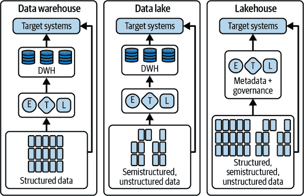

###### 图 1-6\. DWH、数据湖和湖屋模式

Databricks 支持湖屋架构，因为它基于 Spark 的创始，并需要支持非程序员的业务用户。因此，Databricks 中的数据存储在数据湖中，但业务用户可以使用 SQL 访问它。然而，湖屋架构并不局限于 Databricks。

运行在 Google Cloud BigQuery、Snowflake 或 Azure Synapse 等云解决方案中的 DWH，可以创建基于列存储的湖屋架构，这种架构针对 SQL 分析进行了优化：它允许您将 DWH 视为数据湖，同时允许在并行 Hadoop 环境中运行的 Spark 作业利用底层存储系统上存储的数据，而不需要单独的 ETL 过程或存储层。

湖屋模式相对传统方法提供了几个优势：

+   解耦存储和计算，实现：

    +   价格低廉、几乎无限制和无缝扩展的存储

    +   无状态、弹性计算

    +   ACID 兼容的存储操作

    +   逻辑数据库存储模型，而非物理模型

+   数据治理（例如，数据访问限制和模式演变）

+   通过与商业智能工具的本地集成支持数据分析

+   原生支持数据湖方法的典型多版本方法（即铜、银和金）

+   数据存储和管理通过开放格式如 Apache Parquet 和 Iceberg

+   支持结构化或非结构化格式中的不同数据类型

+   流式能力，能够处理数据的实时分析

+   支持多种应用，从商业智能到机器学习不等

然而，数据湖屋是一种技术上的妥协。在云存储中使用标准格式限制了数据仓库多年来完善的存储优化和查询并发性。因此，与本地数据仓库（即需要更多资源并且成本更高）相比，数据湖屋技术支持的 SQL 不那么高效。此外，SQL 支持往往有限，例如地理空间查询、机器学习和数据操作等功能要么不可用要么效率低下。同样，数据仓库提供的 Spark 支持也有限，并且性能不如数据湖供应商提供的本地 Spark 支持。

数据湖屋方法使组织能够实施支持任何工作负载类型的极度多样化数据平台的核心支柱。但是对于在其之上的组织呢？用户如何利用平台的最佳部分来执行他们的任务？在这种情况下，出现了一种新的运营模式，即数据网格。

### 数据网格

数据网格是一种技术、人员和流程的分散化运营模式，用于解决分析中最常见的挑战——在数据所有权必然分布的环境中，对控制集中化的渴望，如图 1-7 所示。从另一个角度来看，数据网格介绍了一种将数据视为自包含产品而不是 ETL 流水线产品的方法。

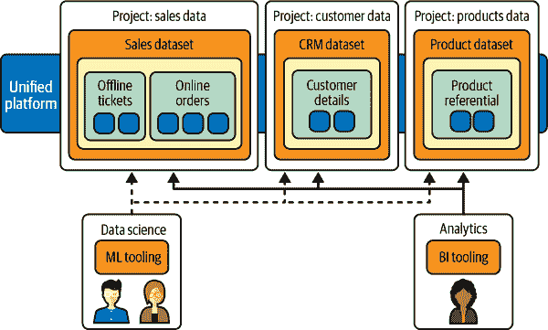

###### 图 1-7\. 数据网格统一了公司内的数据访问，同时保留了分布领域中数据的所有权

在这种方法中，分布式团队拥有数据生产，并通过明确定义的数据模式为内部/外部消费者提供服务。总体而言，数据网格建立在数据仓库和数据湖跨界创新的悠久历史之上，结合了公共云中数据仓库技术的可扩展性、按消费模式付费、自服务 API 以及紧密集成的特点。

通过这种方法，您可以有效地创建按需数据解决方案。数据网格将数据所有权分散到域数据所有者中，每个所有者都负责以标准方式提供其数据作为产品（参见图 1-8）。数据网格还能够促进组织各部分之间的沟通，以在不同位置分发数据集。

在数据网格中，从数据中生成价值的责任被委托给最了解数据的人；换句话说，创建数据或将其引入组织的人必须负责从他们创建的数据中创建可消费的数据资产作为产品。在许多组织中，由于在组织中多次提取和转换数据而没有明确的数据所有权责任，建立“真相的单一来源”或“权威数据来源”是棘手的。在数据网格中，权威数据来源是由源域发布的[数据产品](https://oreil.ly/2WUaq)，并有明确定义的数据所有者和监护人负责该数据。

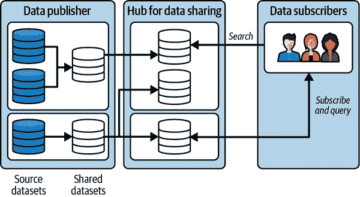

###### 图 1-8\. 数据作为产品

从技术视角（数据湖）和组织视角（数据网格）获得这种统一视图，意味着人们和系统以最适合其需求的方式获取数据。在某些情况下，这种架构必须跨越多个环境，有时产生非常复杂的架构。让我们看看公司如何应对这一挑战。

###### 注意

关于数据网格的更多信息，我们建议您阅读 Zhamak Dehghani 的书籍[*数据网格：规模交付数据驱动价值*](https://oreil.ly/OL7vg)（O’Reilly）。

# 混合云

在设计云数据平台时，可能会发现一个单一环境无法完全管理工作负载。这可能是因为监管限制（例如，您无法将数据移入组织边界之外的环境），或者是因为成本原因（例如，组织对未达到寿命终结的基础设施进行了一些投资），或者是因为您需要的特定技术在云中不可用。在这种情况下，采用混合模式可能是一个可行的方法。混合模式是指应用程序在各种环境的组合中运行的模式。混合模式的最常见例子是将私有计算环境（如现场数据中心）与公共云计算环境结合在一起。在本节中，我们将解释这种方法如何在企业中运作。

## 混合模式的必要原因

混合云方法被广泛采用，因为现今几乎没有一个大型企业完全依赖公共云。在过去几十年中，许多组织已经投入了数百万美元和数千小时在现场基础设施上。几乎所有组织都在运行一些传统架构和业务关键应用程序，它们可能无法迁移至公共云。他们可能还有一些敏感数据，由于监管或组织约束，无法存储在公共云中。

允许工作负载在公共和私有云环境之间过渡提供了更高的灵活性和数据部署的附加选项。有几个原因推动混合（即跨越本地、公共云和边缘的架构）和多云（即跨越多个公共云供应商如 AWS、Microsoft Azure 和 Google Cloud Platform [GCP]等的架构）的采用。

以下是选择混合和/或多云的一些关键业务原因：

数据驻地法规

有些人可能永远不会完全迁移到公共云，可能是因为他们处于金融或医疗保健行业，需要遵循严格的行业法规，规定数据存储的位置。在没有公共云存在和数据驻留要求的国家，工作负载也是如此。

传统投资

一些客户希望保护其像 SAP、Oracle 或 Informatica 等遗留工作负载在本地运行，但希望利用公共云创新技术，例如 Databricks 和 Snowflake。

过渡

大型企业通常需要经过多年的旅程，将其现代化为云原生应用和架构。他们必须在数年间接受混合架构作为中间状态。

云爆发

有些客户主要在本地运营，并且没有迁移到公共云的意愿。然而，由于临时大批作业、繁忙时段的尖峰流量或大规模的机器学习训练作业，他们在满足业务服务级别协议（SLA）方面存在挑战。他们希望利用公共云中可扩展的容量或自定义硬件，并避免在本地基础设施上进行扩展的成本。像 MotherDuck 这样采用“本地优先”计算方法的解决方案正在变得流行。

最优品种

一些组织选择在不同的公共云提供商之间进行不同任务的选择，这是一种有意识的策略，选择最适合其需求的技术。例如，Uber [使用 AWS](https://oreil.ly/ajo8m)来提供其 Web 应用程序，但在其履行平台上 [使用 Google Cloud 上的 Cloud Spanner](https://oreil.ly/gMwLu)。Twitter [在 AWS 上运行其新闻订阅](https://oreil.ly/5R4sy)，但 [在 Google Cloud 上运行其数据平台](https://oreil.ly/ubxTX)。

现在您了解了选择混合解决方案的原因，让我们来看看在使用这种模式时可能会面临的主要挑战；这些挑战是为什么混合应该被视为一种例外的原因，而目标应该是云原生。

## 混合云挑战

企业在实施混合或多云架构时面临几个挑战：

治理

在多个环境中应用一致的治理政策是困难的。例如，本地和公共云之间的合规安全政策通常有不同的处理方式。通常，数据的部分副本分布在本地和云中。想象一下，您的组织正在运行财务报告——如果数据在多个平台上存在多个副本，如何确保使用的数据是最新更新的副本？

访问控制

用户访问控制和策略在本地和公共云环境之间有所不同。云服务提供商为其提供的服务有其自己的用户访问控制（称为*身份和访问管理*，或 IAM），而本地则使用诸如本地目录访问协议（LDAP）或 Kerberos 等技术。如何保持它们同步或在不同环境中拥有单一控制平台？

工作负载互操作性

在跨多个系统时，不可避免地会有需要管理的不一致的运行时环境。

数据迁移

如果本地和云应用程序都需要访问某些数据，则这两个数据集必须同步。在多个系统之间移动数据成本高昂——创建和管理管道有人力成本，可能由于使用的软件而产生许可成本，最后但同样重要的是，它消耗了计算、网络和存储资源。您的组织如何处理来自多个环境的成本？如何连接在各种环境中分散的异构数据？作为连接过程的结果，您最终将在何处复制数据？

技能集

拥有两个云（或本地和云端）意味着团队必须了解并建立两个环境的专业知识。由于公共云是一个快速变化的环境，要提升和维护员工在一个云中的技能已经带来了显著的开销，更不用说两个了。技能集也可能对雇佣系统集成商（SIs）构成挑战——尽管大多数大型 SIs 都有每个主要云平台的实践，但很少有团队了解两个或更多的云平台。随着时间的推移，我们预计将越来越难雇佣愿意学习专有本地技术的人员。

经济学

数据分布在两个环境之间可能带来意想不到的成本：也许您在一个云中有数据，并希望将其提供给另一个云，这将产生数据流出成本。

尽管存在这些挑战，混合设置确实可行。我们将在下一小节中详细探讨如何做到。

## 为什么混合设置可以运作

云服务提供商意识到这些需求和挑战。因此，他们为混合环境提供了一些支持。这些支持可以分为三个方面：

选择

云服务提供商通常会大量贡献开源技术。例如，尽管 Kubernetes 和 TensorFlow 是在 Google 开发的，但它们是开源的，因此在所有主要云中都存在其托管执行环境，并且甚至可以在本地环境中利用它们。

灵活性

类似 Databricks 和 Snowflake 的框架允许您在任何主要公共云平台上运行相同的软件。因此，团队可以学习一组能够在任何地方工作的技能。请注意，多云环境下工作的工具所提供的灵活性并不意味着您已经摆脱了锁定。您将不得不在以下两者之间做出选择：（1）在框架级别锁定和在云级别灵活性（由 Databricks 或 Snowflake 等技术提供）之间；（2）在云级别锁定和在框架级别灵活性（由原生云工具提供）之间。

开放性

即使工具是专有的，由于采纳了开放标准和导入/导出机制，其代码也是以可移植的方式编写的。因此，例如，即使 Redshift 只能在 AWS 上运行，查询也是用标准 SQL 编写的，并且有多种导入和导出机制。这些能力共同使得 Redshift、BigQuery 和 Synapse 成为开放平台。这种开放性允许[像 Teads 这样的用例](https://oreil.ly/avLkH)，数据使用 Kafka 在 AWS 上收集，使用 Google Cloud 上的 Dataflow 和 BigQuery 进行聚合，然后写回 AWS Redshift（参见图 1-9）。

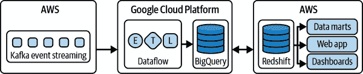

###### 图 1-9\. Teads 的混合分析管道（基于 Alban Perillat-Merceroz 的一篇文章，[发表在 Teads 工程](https://oreil.ly/PyJUv)）

云服务提供商通过重视投资开源项目来承诺选择性、灵活性和开放性，这有助于客户在多个云中使用。因此，多云数据仓库或混合数据处理框架正在成为现实。因此，您可以按照您希望的方式构建混合和多云部署，以更好地生产、发布和管理云软件，而不是供应商强加的方式。

## 边缘计算

另一个混合模式的例子是当你可能希望计算能力跨越常规数据平台的边界，也许是直接与某些连接设备交互。在这种情况下，我们谈论的是*边缘计算*。边缘计算将计算和数据存储靠近生成数据并需要处理数据的系统。边缘计算的目标是提高响应时间并节省带宽。边缘计算可以解锁许多用例，并加速数字转型。它在许多应用领域有广泛的应用，例如安全、机器人技术、预测性维护、智能车辆等。

随着边缘计算的采纳和普及，对于各行各业都存在许多潜在优势：

更快的响应时间

在边缘计算中，数据存储和计算能力被分布并提供在需要做出决策的地点。不需要往返云端将减少延迟，并使响应速度更快。在预防性维护中，这将有助于阻止关键机器操作的故障或危险事件的发生。在活动游戏中，边缘计算可以提供所需的毫秒级响应时间。在欺诈预防和安全场景中，它可以防止隐私泄露和拒绝服务攻击。

断断续续的连接

在石油井、农场水泵、太阳能场或风车等偏远资产存在不可靠的互联网连接性，这可能导致对这些资产的监控变得困难。边缘设备能够在本地存储和处理数据，确保在互联网连接受限的情况下不会丢失数据或操作失败。

安全和合规性

边缘计算可以消除设备与云之间大量的数据传输。可以在本地过滤敏感信息，仅将关键数据模型构建信息传输到云端。例如，使用智能设备时，诸如监听“OK Google”或“Alexa”之类的关键词处理可以在设备本身上进行。潜在的私人数据不需要被收集或发送到云端。这使用户能够构建适当的安全性和合规性框架，对于企业的安全性和审核至关重要。

成本有效的解决方案

在物联网采用中的一个实际关注点是由于网络带宽、数据存储和计算能力而产生的前期成本。边缘计算可以在本地执行大量数据计算，使企业能够决定哪些服务在本地运行，哪些发送到云端，从而降低整体物联网解决方案的最终成本。这就是嵌入式模型以低内存二进制部署的地方，在现代编译语言如 Rust 或 Go 中构建的格式（如开放神经网络交换 ONNX）可以表现出色的地方。

互操作性

边缘设备可以作为传统和现代设备之间通信的联络人。这使得传统工业设备能够连接到现代设备或物联网解决方案，并立即从传统或现代设备中捕获见解的好处。

所有这些概念使架构师在定义他们的数据平台时极为灵活。在第九章中，我们将深入探讨这些概念，看看这种模式如何成为标准。

# 应用人工智能

许多组织因需要采用 AI 技术而被迫设计云数据平台——在设计数据平台时，重要的是确保它能够未来证明其能力以支持 AI 用例。考虑到 AI 对社会的巨大影响以及它在企业环境中的扩散，让我们快速深入地看一下它如何在企业环境中实施。您可以在第十章和第十一章中找到更深入的讨论。

## 机器学习

现在，一种名为*监督式机器学习*的 AI 分支已经取得了巨大成功，以至于术语*AI*更经常被用作这一分支的总称。监督式 ML 通过展示计算机程序许多已知正确答案（称为*标签*）的示例来工作。ML 模型是一个标准算法（即完全相同的代码），具有可调参数，可以“学习”如何从提供的输入到标签。这样一个学习的模型随后被部署来对不知道正确答案的输入做出决策。

与专家系统不同，不需要明确编程 AI 模型的规则来做出决策。因为许多现实世界的领域涉及到专家判断，而专家往往难以表达他们的逻辑，所以让专家简单地标记输入示例比捕捉他们的逻辑要可行得多。

现代象棋算法和医疗诊断工具使用 ML。象棋算法从人类过去玩过的游戏记录中学习[²]，而医疗诊断系统则从专家医生标记的诊断数据中学习。

生成式 AI，这是 AI/ML 的一个分支，最近变得非常强大，不仅能够理解图像和文本，还能生成逼真的图像和文本。除了能够在营销等应用中创建新内容外，生成式 AI 还简化了机器与用户之间的交互。用户能够用自然语言提问并使用英语或其他语言自动化许多操作，而不必了解编程语言。

为了使这些 ML 方法运行，它们需要大量的训练数据和现成的定制硬件。因此，采用 AI 的组织首先建立了一个云数据/ML 平台。

## ML 的用途

有几个关键原因导致了工业界对 ML 的惊人采纳：

数据更容易。

收集标记数据比捕捉逻辑更容易。人类推理的每一部分都有例外情况，随着时间的推移会被编码。让一组眼科医生标记一千张图像比让他们描述如何识别血管出血要容易得多。

重新培训更容易。

当机器学习用于系统，例如向用户推荐物品或运行营销活动时，用户行为迅速适应变化。继续训练模型非常重要。这在机器学习中是可能的，但用代码实现则更为困难。

更好的用户界面。

*深度学习* 这类机器学习已被证明能够被训练，即使是在像图像、视频和自然语言文本这样的非结构化数据上。这些类型的输入通常很难编程。这使得你可以将真实世界的数据作为输入——考虑一下当你可以简单地拍摄支票照片而不必把所有信息都输入到网页表单时，存款支票界面会变得更好多少。

自动化。

机器学习模型理解非结构化数据的能力使得许多业务流程的自动化成为可能。表单可以轻松数字化，仪表盘读数可以更轻松，工厂车间可以更轻松地监控，因为可以自动处理自然语言文本、图像或视频。

成本效益。

机器学习 API 使得机器能够理解和创建文本、图像、音乐和视频，每次调用的成本仅为几分之一美分，而雇佣人类执行同样的任务则成本高出数个数量级。这使得技术在诸如推荐等情境中的应用成为可能，而雇佣个人购物助手则成本过高。

援助。

生成式人工智能可以赋予开发者、营销人员和其他白领工作者更高的生产力。编码助手和工作流合作者能够简化许多公司功能的部分，如发送定制销售邮件。

鉴于这些优势，不足为奇，[*哈佛商业评论*文章](https://oreil.ly/zhK6V)发现，人工智能通常支持三个主要的业务需求：

+   自动化业务流程——通常是自动化后勤行政和财务任务

+   通过数据分析获得洞见

+   与顾客和员工互动

机器学习通过使用数据示例增加了解决问题的可扩展性，而无需为每件事情都编写自定义代码。然后，诸如深度学习之类的机器学习解决方案使得即使在处理像图像、语音、视频和自然语言文本等非结构化信息时也能解决这些问题。

# 为什么选择云来支持人工智能？

设计云数据平台的一个关键动机可能是组织正在快速采用深度学习等人工智能技术。为了使这些方法能够运作，它们需要大量的训练数据。因此，计划构建机器学习模型的组织需要建立一个数据平台，以组织并使数据可供其数据科学团队使用。这些机器学习模型本身非常复杂，训练这些模型需要大量的专用硬件，称为*图形处理单元*（GPUs）。此外，语音转录、机器翻译和视频智能等人工智能技术通常作为云端的 SaaS 软件提供。此外，云平台提供关键的功能，如民主化、更轻松的操作和跟上技术发展的能力。

## 云基础设施

关键是高质量的人工智能需要大量的数据——一篇著名的论文标题为[“深度学习扩展是可预测的，经验性的”](https://oreil.ly/NEoxe)发现，为了在自然语言模型中获得 5%的改进，需要训练两倍于用于获得第一个结果的数据量。最优秀的机器学习模型并非最先进的那些——而是那些在足够高质量数据上训练的模型。原因在于，越来越复杂的模型需要更多的数据，而即使是简单的模型，如果在足够大的数据集上训练，也会提高性能。

要了解现代机器学习模型训练所需的数据量，可以举例说明，图像分类模型通常在[一百万张图片](https://oreil.ly/l3yb2)上进行训练，而主要的语言模型则是在[多个 TB 的数据](https://oreil.ly/vmOWR)上进行训练。

如图 1-10 所示，这种数据量需要大量高效的定制计算——通过加速器如 GPU 和定制的应用特定集成电路（ASICs）称为*张量处理单元*（TPUs）——来利用这些数据并理解它。

许多最近的人工智能进展可以归因于数据规模和计算能力的增加。云中大数据集和推动它的众多计算机之间的协同作用已经实现了机器学习的巨大突破。这些突破包括通过[降低语音识别中的词误差率](https://oreil.ly/zDFuV)30%，超过传统方法的最大进展已达 20 年之久。

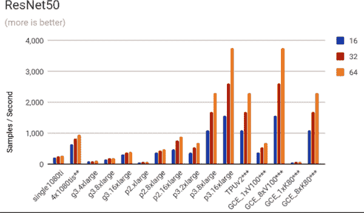

###### 图 1-10\. 随着内存增加、处理器增多以及使用 TPUs 和 GPUs，机器学习性能显著提高（来自[AVP 项目](https://oreil.ly/e18-t)的图表）

## 民主化

设计 ML 模型，特别是在复杂领域如时间序列处理或自然语言处理（NLP）中，需要掌握 ML 理论。使用 PyTorch、Keras 或 TensorFlow 等框架编写 ML 模型训练代码需要掌握 Python 编程和线性代数知识。此外，为 ML 进行数据准备通常需要数据工程专业知识，并且评估 ML 模型需要高级统计学知识。部署 ML 模型并监控它们需要 DevOps 和软件工程知识（通常称为 MLOps）。不用说，每个组织中都很少具备所有这些技能。考虑到这一点，利用 ML 解决业务问题对传统企业来说可能是困难的。

云技术提供了几种选项来使 ML 的使用民主化：

ML API

云服务提供商提供预构建的 ML 模型，可以通过 API 调用。此时，开发人员可以像使用任何其他 Web 服务一样使用 ML 模型。他们所需的只是能够针对表述状态转移（REST）Web 服务进行编程的能力。这些 ML API 的示例包括 Google 翻译、Azure 文本分析和亚马逊 Lex —— 这些 API 可以在不需要任何 NLP 知识的情况下使用。云服务提供商提供文本和图像生成的生成模型作为 API，其中输入只是一个文本提示。

可定制的 ML 模型

一些公共云提供了“AutoML”，这些是端到端的 ML 流水线，可以通过点击鼠标进行训练和部署。AutoML 模型通过“神经架构搜索”来自动进行 ML 模型的架构设计。虽然与人类专家选择有效模型相比，训练时间较长，但 AutoML 系统可以满足那些无法自行设计模型的业务线需求。请注意，并非所有的 AutoML 都相同 —— 有时所谓的 AutoML 只是参数调优。确保您获得的是定制的架构而不仅仅是预构建模型的选择，双重检查是否有多个可以自动化的步骤（例如特征工程、特征提取、特征选择、模型选择、参数调优、问题检查等）。

更简单的 ML

在写作时，一些数据仓库（例如 BigQuery 和 Redshift）提供了使用 SQL 在结构化数据上训练 ML 模型的能力。Redshift 和 BigQuery 支持通过委派给 Vertex AI 和 SageMaker 实现复杂模型。像 DataRobot 和 Dataiku 这样的工具提供了用于训练 ML 模型的点对点界面。与其它方式相比，云平台使生成模型的微调变得更加容易。

ML 解决方案

一些应用程序如此常见，以至于可以购买和部署端到端的机器学习解决方案。Google Cloud 上的产品发现提供了零售商的端到端搜索和排名体验。Amazon Connect 提供了由机器学习驱动的即插即用的联系中心。Azure Knowledge Mining 提供了一种挖掘各种内容类型的方式。此外，像 Quantum Metric 和 C3 AI 这样的公司为多个行业常见的问题提供基于云的解决方案。

机器学习构建块

即使整个机器学习工作流程没有解决方案，部分工作也可以利用构建块。例如，推荐系统需要能够匹配项目和产品。Google Cloud 提供了一种名为*two-tower encoders*的通用匹配算法。虽然没有端到端的后台自动化机器学习模型，但您可以利用表单解析器来帮助更快地实现该工作流程。

这些能力使企业即使没有深入的专业知识也可以采用人工智能，从而使人工智能更广泛地可用。

即使企业具有人工智能的专业知识，这些能力也非常有用，因为您仍然需要决定是购买还是构建机器学习系统。通常情况下，机器学习的机会比解决它们的人员多。因此，允许使用预构建的工具和解决方案来执行非核心功能具有优势。这些即插即用的解决方案可以立即提供大量价值，而无需编写定制应用程序。例如，通过 API 调用将自然语言文本的数据传递给预构建模型以进行文本翻译。这不仅减少了构建应用程序的工作量，还使非机器学习专家能够使用人工智能。在另一端，问题可能需要定制解决方案。例如，零售商经常构建机器学习模型来预测需求，以便知道需要存货的量。这些模型从公司的历史销售数据和内部专家直觉中学习购买模式。

另一种常见模式是使用预构建的即插即用模型进行快速实验，一旦机器学习解决方案证明其价值，数据科学团队可以以定制方式构建它，以获得更高的准确性，并希望在竞争中获得更多差异化优势。

## 实时

ML 基础设施必须与现代数据平台集成，因为实时个性化 ML 才有价值。因此，分析速度变得非常重要，因为数据平台必须能够实时摄取、处理和提供数据，否则就会错失机会。这还要加上行动速度。ML 提供基于客户背景的个性化服务，但必须在客户背景切换之前提供推断——对于大多数商业交易，ML 模型在客户采取行动之前必须提供客户进行选择的选项。为了实现这一点，需要使 ML 模型的结果实时到达行动点。

能够实时向 ML 模型提供数据并在实时获得 ML 预测，这是防范欺诈和发现欺诈的区别。为了防范欺诈，必须实时摄取所有付款和客户信息，运行 ML 预测，并将 ML 模型的结果实时返回到付款网站，以便如果怀疑有欺诈，则可以拒绝付款。

在客户服务和购物车放弃等情况下，实时处理节省了很多钱。在呼叫中心捕捉客户的沮丧，并立即升级情况，是提供有效服务的重要因素——与重新获得失去的客户相比，提供良好的服务成本要高得多。同样，如果购物车有被丢弃的风险，提供例如 5% 折扣或免费运输的诱因，成本可能低于重新吸引客户回到网站所需的大幅促销活动。

在其他情况下，批处理不是一个有效的选择。Google 地图需要实时交通数据和实时导航模型，以允许驾驶员避开交通。

正如您将在 第八章 中看到的，云服务的弹性和自动缩放能力在本地实现起来很困难。因此，实时 ML 最好在云中进行。

## MLOps

公共云中 ML 更好的另一个原因是 ML 的操作化很难。有效和成功的 ML 项目需要操作化数据和代码。观察、编排和执行 ML 生命周期被称为*MLOps*。

在生产中构建、部署和运行 ML 应用程序涉及几个阶段，如 图 1-11 所示。所有这些步骤都需要编排和监控；例如，如果检测到数据漂移，则可能需要自动重新训练模型。必须定期对模型进行重新训练并部署，确保它们可以安全部署。对于传入数据，必须执行数据预处理和验证，确保没有数据质量问题，然后进行特征工程，接着是模型训练，最后进行超参数调整。

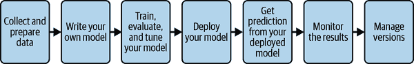

###### 图 1-11\. 一个 ML 工作流程的阶段

除了讨论的监控数据特定方面之外，你还需要对任何运行服务所必需的监控和操作化进行监控。生产应用通常是持续运行的，每天 24 小时/7 天/365 天，新数据定期进入。因此，你需要能够轻松编排和管理这些多阶段 ML 工作流，并可靠地和重复地运行它们的工具。

云 AI 平台如 Google 的 Vertex AI，微软的 Azure 机器学习和亚马逊的 SageMaker 提供整个 ML 工作流程的托管服务。在本地进行这些操作需要你将底层技术拼凑在一起并自行管理集成。

在撰写本书时，MLOps 能力正在以极快的速度添加到各种云平台。这提出了一个相关的观点，即随着 ML 领域的快速变化，将构建和维护 ML 基础设施和工具委托给第三方，专注于与核心业务相关的数据和洞察力会更好。

总之，基于云的数据和 AI 平台可以帮助解决数据孤岛、治理和容量方面的传统挑战，同时使组织能够为 AI 能力变得更加重要的未来做好准备。

# 核心原则

设计数据平台时，设定关键设计原则和希望分配给每个原则的权重可能会有所帮助。很可能需要在这些原则之间做出权衡，拥有所有利益相关者都同意的预先确定的评分卡可以帮助你在不必回到第一原则或被最强烈的需求左右的情况下做出决策。

这里是我们建议的数据分析堆栈的五个关键设计原则，尽管相对权重会因组织而异：

提供无服务器分析，而非基础设施。

设计分析解决方案，避免尽可能地使用搬迁和移移方法。专注于现代无服务器架构，让你的数据科学家（我们广泛使用此术语来指数据工程师、数据分析师和 ML 工程师）专注于分析，远离基础设施考虑。例如，使用自动化数据传输从系统中提取数据，并提供跨任何服务的联邦查询共享数据环境。这消除了维护自定义框架和数据管道的必要性。

嵌入端到端机器学习。

允许您的组织全面实现机器学习的运作。不可能为组织需要的每个机器学习模型构建一个模型，因此请确保您构建的平台能够嵌入民主化的机器学习选择，例如预构建的机器学习模型、机器学习构建块和更易于使用的框架。确保在需要自定义训练时，有权访问强大的加速器和可定制的模型。确保支持 MLOps，以确保部署的机器学习模型不会漂移并且不再适合用途。简化整个堆栈上的机器学习生命周期，以便组织能够更快地从其机器学习倡议中获取价值。

在整个数据生命周期中赋予分析能力。

数据分析平台应提供一套全面的核心数据分析工作负载。确保您的数据平台提供数据存储、数据仓库、流数据分析、数据准备、大数据处理、数据共享与商业化、商业智能（BI）和机器学习。避免购买需要集成和管理的一次性解决方案。更全面地审视分析栈将有助于打破数据孤岛，为应用程序提供实时数据支持，添加只读数据集，并使查询结果对任何人都可访问。

启用开源软件（OSS）技术。

在任何可能的情况下，确保开源技术是您平台的核心。您希望确保您编写的任何代码都使用标准的开源软件标准，如标准 SQL、Apache Spark、TensorFlow 等。通过启用最佳的开源技术，您将能够在数据分析项目中提供灵活性和选择性。

为增长而构建。

确保您构建的数据平台能够适应您的组织预期面临的数据规模、吞吐量和并发用户数。有时，这将涉及选择不同的技术（例如，某些用例使用 SQL，而其他用例使用 NoSQL）。如果这样做，请确保您选择的两种技术能够互操作。利用已被全球最具创新力公司证明和使用的解决方案和框架来运行其关键任务的分析应用程序。

总体而言，这些因素按照我们通常推荐的顺序列出。由于企业选择进行云迁移的两个主要动机是成本和创新，我们建议您优先考虑无服务器架构（以节省成本并解放员工免于例行工作）和端到端机器学习（因其支持的广泛创新）。

在某些情况下，您可能希望优先考虑某些因素。对于初创公司，我们通常建议最重要的因素是无服务器、增长和端到端 ML。全面性和开放性可以为速度而牺牲。高度监管的企业可能会偏向于全面性、开放性和增长，而不是无服务器和 ML（即监管者可能需要在本地进行）。对于数字原生企业，我们建议依次是端到端 ML、无服务器、增长、开放性和全面性。

# 总结

这是关于数据平台现代化的高层介绍。从数据生命周期的定义开始，我们看了数据处理的演变，传统方法的局限性，以及如何在云上创建统一的分析平台。我们还看了如何扩展云数据平台成为混合平台，并支持 AI/ML。本章的关键要点如下：

+   数据生命周期有五个阶段：收集、存储、处理、分析/可视化和激活。这些需要由数据和 ML 平台支持。

+   传统上，组织的数据生态系统由独立的解决方案组成，导致组织内部形成孤立。

+   数据移动工具可以打破数据孤立，但它们带来一些缺点：延迟、数据工程资源瓶颈、维护开销、变更管理和数据间隙。

+   在 IT 内集中控制数据会导致组织挑战。IT 部门缺乏必要的技能，分析团队获取到的数据质量差，业务团队不信任结果。

+   组织需要构建一个云数据平台来获得最佳架构，处理业务单位之间的整合，扩展本地资源，并规划业务连续性。

+   云数据平台利用现代方法，旨在通过重新平台化数据、打破孤立、民主化数据、强化数据治理、实现实时决策并使用位置信息，从描述性分析顺畅过渡到预测性和规范性分析，从而促进数据驱动的创新。

+   所有数据可以从运营系统导出到集中式数据湖进行分析。数据湖作为分析工作负载和业务用户的中央存储库。然而，其缺点是业务用户没有编程对接数据湖的技能。

+   数据仓库是支持 SQL 的集中式分析存储，这是业务用户熟悉的内容。

+   数据湖室建立在这样一个理念基础上，即所有用户，无论其技术技能如何，都可以并且应该能够使用数据。通过提供一个集中的底层框架来使数据可访问，可以在湖室顶部使用不同的工具，以满足每个用户的需求。

+   数据网格引入了一种将数据视为自包含产品的方式。在这种方法中，分布式团队拥有数据的生产，并通过明确定义的数据模式为内部/外部消费者提供服务。

+   混合云环境是满足企业世界现实的实用方法，例如收购、本地法律和延迟要求。

+   公共云提供了管理大型数据集和按需提供 GPU 的方式，使其对所有形式的 ML 都不可或缺，特别是深度学习和生成 AI。此外，云平台还提供了民主化、更容易的操作和跟上最新技术的能力。

+   云数据平台的五个核心原则是优先考虑无服务器分析、端到端 ML、全面性、开放性和增长性。这些相对权重会因组织而异。

现在你知道自己想要达到的目标位置后，在下一章中，我们将讨论达到目标的策略。

¹ 这里的成本不仅包括技术或许可证费用，还包括人力成本，而 SQL 技能往往对组织的成本影响比 Java 或 Python 技能低。

² 最近的 ML 系统，例如[AlphaGo](https://oreil.ly/Garre)，通过观察机器之间玩的游戏来学习：这是一种称为*强化学习*的高级 ML 类型，但大多数工业用途的 ML 属于更简单的监督学习类型。
