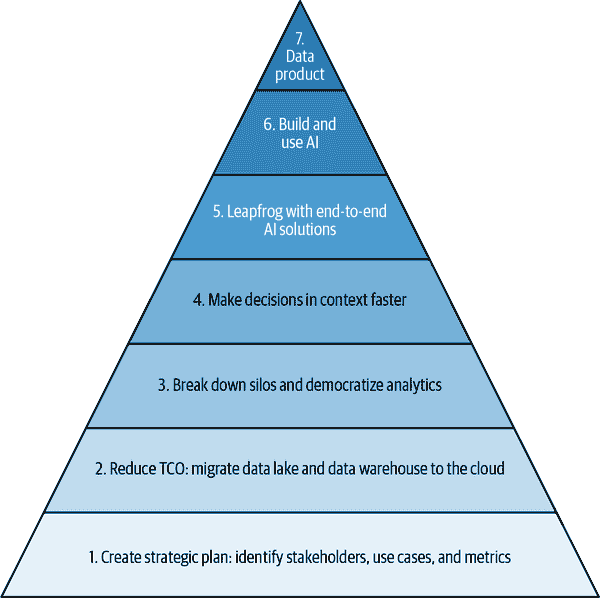

# 第二章：利用数据进行创新的战略步骤

您的领导之所以为您建立数据平台提供资金，很可能是因为他们希望组织进行创新。他们希望组织发现新的运营领域，创造业务运营的更好方式，或向更多客户提供更高质量的产品。这种形式的创新通常是通过更好地理解客户、产品或市场来实现的。无论您的组织是否希望减少用户流失，获取新用户，预测产品的维修周期，还是确定低成本替代品是否受欢迎，任务始于数据收集和分析。需要数据来分析业务的当前状态，识别缺陷或机会，实施改进现状的方式，并衡量这些变化的影响。通常，必须将特定于业务单元的数据与其他数据（既来自整个组织，又来自供应商和市场的数据）结合起来进行分析。在构建数据平台时，重要的是有意识地并将最终的“为什么”（促进创新）牢牢记在心中。

在本章中，您将学习到构建促进创新平台的七个战略步骤，为什么这些步骤至关重要，以及如何利用现代云技术实现这些步骤。将这些步骤看作是一个金字塔（如图 2-1 所示），其中每一步都作为后续步骤的基础。

在本章中，我们将阐明贯穿所有步骤的概念，但将其实施细节推迟到后续章节。例如，虽然我们将在本章描述打破业务隔离的概念，但我们将在第 5、6 和 7 章节中描述分析中心或数据网格方法的架构。

###### 图 2-1 我们建议构建云数据和 AI 平台的七步旅程

# 第一步：战略与规划

要使最后六个步骤成功，首先需要制定战略计划，在这个计划中，您需要确定三个主要组成部分：

目标

在利用数据做出最佳利用时，组织的雄心是什么？深入挖掘并确定超越成本节约的目标至关重要。具体来说，重要的是确定将使用数据做出的决策以及可以通过哪些指标来知道转型是否成功。

利益相关者

谁在组织中有权支持和推动更深层次的转型？确保你汇聚所有这些利益相关者非常重要——根据我们的经验，IT 项目往往资源不足，并且总是面临失败的风险，而业务驱动的项目则拥有长期的高级管理支持和资金支持。业务项目还具有更高的投资回报率。

变革管理过程

如何有效地向整个组织传播并沟通方法，以获得最终用户的支持？

这种战略规划需要定期重新审视。目标是否依然相同？是否有新的利益相关者需要简报？是否在内部积聚不满情绪？

让我们逐个来看这三个组成部分。

## 战略目标

在构建数据和 AI/ML 平台时，你应该对自己的目标有清晰的认识。利益相关者经常会将目标框定为当前平台的限制。例如，如果你当前最痛苦的问题是报告工作量导致连锁性故障，那么目标可能会表述为“我们希望能在三小时内为我们三百万客户创建月度结算单”。然而，在构建平台的目标时，你不希望目标被单一用例所狭隘定义。相反，你希望从对你想要实现的战略目标的清晰视角出发。

根据企业的战略方向设计你的系统。对于为新购买提供信息的期望交付时间是多少？客户数量的预期增长是多少？通过移动设备与通过经纪人到达的客户比例会随时间而改变吗？IT 团队的预期人数是多少？企业是否希望使现场人员能够做出更多决策？你希望发送月度结算单，还是希望根据需求动态生成历史活动报告？我们计划通过这些报告赚钱吗？我们是否会根据这些结果改变业务实践？报告需要提供什么支持我们当前的业务在现场？当前平台无法支持这些需求将自然地从这些战略问题中出现，但这使你能够全面地构建系统需求，而不是被单一用例和旧有思维所束缚。这也有助于你向非技术性高管传达对系统的需求。

如果可能的话，获取未来两到三年这些战略业务目标的数值估计，以帮助您做出成本效益的决策。例如，简单地说“查询应尽可能快速运行”可能会导致建立一个过度工程化和昂贵的系统。相反，如果您知道在峰值时会有 1500 个并发查询，每个查询处理 100 GB 的数据，需要在 10 秒内完成，那么您可以选择能够实现目标而不至于倾家荡产的技术。这也适用于反向情况。知道业务以 60%的年增长率获取客户，可能清楚地了解到点击流数据集可能每天将达到 1 TB 的规模。这将防止您做出短视的决策，需要撤销。

这通常受到您可以预见业务增长的时间范围的限制。它也受现实世界事件的影响。例如，2020 年的 COVID-19 大流行颠覆了许多企业的计划，并加速了向数字和全渠道体验的转变。有时，您可能构建一个必须被废弃并重建的系统，但通过广泛考虑备用方案，可以减少这种情况发生的频率。

尽管细节可能有所不同，但我们发现大多数组织在其数据平台上最终需要实现以下战略目标：

降低运营数据和 AI 平台的成本。

特别是，随着数据集大小的增长，IT 成本呈线性增长可能变得不可持续。

通过加快从新项目中获取价值的时间来增加创新速度。

在新想法上进行实验不应面临数月的延迟，如获取机器、安装软件、获取数据集访问权限等。

民主化数据洞察。

使领域专家和领域内人员能够直接与数据互动并获得洞察。

将预测分析纳入决策制定，而不仅仅是描述性分析。

例如，不仅仅是测量上周使用的材料量，而是根据最近使用的量预测下周所需的材料量。

相对优先级因企业而异（正常情况下应如此）。许多初创企业和数字原住民强调创新速度和灵活性的增长，而许多成熟企业则强调成本优先于灵活性。例如，一家初创企业可能会使用 PB 级数据仓库，即使其数据规模很小，因为它预计每年增长 10 倍。而一家更成熟的企业可能会选择批处理，因为它比流处理更便宜。这些不同的起点会影响可能的创新和增长类型——PB 级数据仓库可以让初创企业基于每笔支付交易实时推荐，而更成熟的企业可能仅在每天发送推荐电子邮件，并且仅针对进行大笔订单的客户。

## 确定利益相关者。

一个坚实的战略定义始于正确的需求收集。要成功做到这一点，识别组织内能够理解需求并有效跨所有不同业务单位合作以减少选择错误方法和解决方案风险的合适人员至关重要。但是，谁才是合适的人呢？

我们是在讨论来自业务方面的人（例如，首席执行官或首席财务官[CFO]），还是依靠 IT 团队（例如，首席信息官[CIO]，首席技术官[CTO]，首席数据官[CDO]等）？嗯，这实际上取决于组织的情况。我们看到了许多不同的方法，但一个共同的主题是：当直接由业务支持时，这种转型旅程通常拥有最高的成功率。为什么？很多时候，IT 组织可能只被授权保持事务运行并每年降低成本。如果您的利益相关者仅来自 IT 部门，他们的激励与如果您的利益相关者包括需要开发新产品、吸引更多客户或从根本上改变业务的 BU 中的人是非常不同的。

通过将新数据平台的定义提升至不仅仅是一个纯粹的 IT 活动，您可以提高转型的可见度，并确保新平台使组织能够解决以前无法解决的许多业务问题（例如实时分析）。

即使在支持该倡议的公司部门内部，也极为关键地需要来自所有参与者的全力支持。但这些人可能非常忙，没有足够的时间和专业知识来投入到这个转型项目中。因此，另一个关键问题是：公司是否拥有足够内部人员（具备正确技能和经验）来支持该倡议？还是需要从公司外部找人来引导项目朝正确方向发展？这不仅仅是技术知识的问题，还涉及领导力和管理，以确保数据平台的设计和实施成功，业务成果积极。

## 变更管理

一旦确定了目标和应该朝向目标努力的人员，接下来您必须为变更管理定义一项策略。组织可以拥有最具野心的目标，由最有影响力的人支持，但如果没有明确的使命来有效地沿链路传递消息，实施项目将非常困难。

当接受像数据驱动转型这样的项目时，我们看到很多公司忽视了转型的*文化方面*，将其仅仅视为一个技术项目。业务用户和一般将利用数据平台的员工，应准备好接受这种变革，而这只能通过适当的流程和正确的技能来实现。

如图 Figure 2-2 所示，变更管理是人、技术和过程的交汇点：

人与技术

对于组织内新资源的全面培训计划至关重要，以使员工能够有效利用这些资源。这可以由公司自行实施（内部交付），也可以由合作伙伴实施（外部交付）。组织越重视提升员工技能，就越能成功地实现其整体业务目标。

人与过程

这始终是领导力的问题。公司内的领导必须推动整体信息传递；当人们受到领导激励时（这也与利益相关者的重要性有关！），采纳程度就会提高。我们看到很多项目因启动方未能提供适当支持而失败。领导必须通过多个内部活动来正确传播信息，帮助员工接受变革。一些常见问题包括：团队结构如何？是否得到高层赞助？云项目的预算、治理和评估如何进行？

过程与技术

这与组织利用云原生服务进行扩展的能力相关。一些常见问题是：组织在多大程度上通过托管和无服务器云服务来抽象基础设施？自动化流程的实施水平以及运行其中的可编程基础设施代码如何？自动化对成功至关重要，因为它不仅减少了人力投入，同时有助于进行低风险且频繁的变更，这是创新的关键要素之一。

成功需要这三个要素紧密协同工作。许多组织通过建立一个名为“卓越中心”（CoE）的专门团队来实现这一点，该团队的目标是在人、过程和技术的和谐方向上设定方向并推动公司发展。我们将在 第十二章 中通过一个具体的例子重新讨论这个概念。

###### 图 2-2. 人、过程和技术共同努力实现成功

# 第二步：通过采用云方法降低总拥有成本

对于大多数企业来说，制定战略后的第一步是定义（*并找到*）预算。将企业的数据仓库和数据湖迁移到云端可以大大节省传统实施成本。让我们看看其中的原因以及如何实现最大的节省。

## 为何云端成本更低

将数据迁移到云端可以通过几个因素节省费用：

减少运营成本

在企业内部，您的公司承担了操作系统的全部成本，并且大部分维护工作是手动完成的。另一方面，云服务提供商（我们称之为超大规模云服务提供商）已经建立了非常高效的方式来管理大型机群。例如，亚马逊通过运行世界上最大且最可靠的网站之一，并且在非常低的利润率业务中提供云基础设施，积累了丰富的经验。同样，谷歌运行了九项服务，这些服务必须非常高效地运行，因为每项服务（如搜索、Gmail 和 YouTube）每天有超过十亿用户免费使用。公共云的用户因云服务操作中内置的高度自动化而受益于低成本。由于大多数活动（如硬件维护、安全检查、软件包更新等）在幕后自动管理，大多数云服务无需维护。

计算和存储的合适规模化

与购买符合预期峰值使用的设备不同，云服务提供商允许根据需求和使用量扩展计算资源。例如，您可以从小规模系统开始，并随着报告数量的增加逐步增加机器数量。这一优势不仅适用于来自云服务提供商（如 Amazon EMR、Google Cloud Dataproc 和 Azure HDInsight）的服务，还适用于在云基础设施上运行的第三方工具，如 Databricks 或 Teradata Vantage。

工作负载的自动扩展

许多云服务（例如 Azure Cosmos DB、AWS Aurora、Google Cloud Composer、Snowflake 和 Actian Avalanche）允许您在高峰时段分配更多机器，在低峰时段减少机器数量。请注意，我们说的是减少机器数量，而不是降至零。尽管在低峰时段完全关闭服务可能很诱人，但请考虑您是否真的希望保留传统的实体模型。希望您公司的网站不会在夜间关闭。您的后端系统也不应如此。在夜间保留处理偶尔紧急请求的能力通常能带来显著的回报。

无服务器工作负载

一些现代云服务（例如 Google Cloud 平台上的 BigQuery，AWS 上的 Athena，Azure Functions）是无服务器的——您只需提交代码，系统会为您执行。将无服务器系统视为一个共享给所有超级承载商客户的自动扩展集群。因此，无服务器系统带来了操作云基础设施的成本优势，全面提升了栈。由于劳动力往往是 IT 预算中最昂贵的项目，无服务器云服务导致了最具成本效益的解决方案。请注意，许多供应商将其自动扩展服务定位为“无服务器”，因此您应验证所涉服务是否真正无服务器——只有在它是多租户的情况下，您才能获得无服务器的成本优势。如果集群属于您，您将需要管理该集群（例如，了解谁在集群上运行什么作业及何时运行），因此您将无法获得无服务器解决方案所带来的劳动力成本优势。

现在您对为何云端成本较低有了更好的理解，让我们来看看如何估算您可能实现的节省金额。

## 节省了多少？

在图 2-3 中，我们展示了我们在一个真实数据湖上进行的概念验证（PoC）的结果。我们首先将工作负载不加修改地移到了云端，然后放在了自动扩展基础设施上，并最终进行了现代化。我们测量了云端成本会是多少。因为这是一个概念验证，系统在这些配置下运行的时间不足以测量运营这些系统的人员成本。

###### 图 2-3\. 操作 100 节点数据湖的月度成本（以 USD 计），不包括运营系统的人员成本

实际节省金额会有所不同，当然，这取决于您平台和工作负载的具体细节。粗略估计，将工作负载不加修改地迁移到云端通常能节省约 10%的成本。添加适当规模调整通常可以额外节省 5%。自动扩展通常能节省 40%，而无服务器方案则额外增加 30%的节省。如果您利用了所有这些节省方式——例如，将在本地使用 Hive 的工作负载改为在云端使用无服务器解决方案——成本节省可能高达 95%。在迁移工作负载到云端之前，分析源工作负载是至关重要的。在某些情况下，纯粹的提升和迁移可能并不划算，因为工作负载是为了利用本地环境的特定硬件功能而开发的。在这些情况下，评估更新代码（如果可能的话）以现代化工作负载，并使其能够利用自动扩展和无服务器功能，变得尤为重要。

## 云服务何时有助于成本节省？

所有这些都加剧了基本的云经济学。忽略定价折扣的影响，同样的成本用于在 10 台机器上运行 10 小时的作业，与在 100 台机器上运行 1 小时的作业或在 1,000 台机器上运行 6 分钟的作业是相同的，或者在多租户集群中为您提供 6 分钟内访问 1,000 个“热”实例的能力是使无服务器如此具有成本效益的原因。当然，这不仅仅是成本问题——今天需要 10 小时才能完成的操作，结果在 6 分钟内就可以得到，这带来的商业价值往往远远超过计算成本的增加。

什么样的工作负载不会从整体迁移到云上受益？从一般的角度来看，任何类型的工作负载都可以成为云环境的潜在目标，以获取前面提到的所有好处。在某些情况下可能会更适合混合方法（例如，在本地环境中的一部分工作负载和其余部分在云中），我们将在第九章深入探讨：让我们考虑一种一致的工作负载（即不需要增长且没有峰值），大规模且非常特定，例如全球范围的数值天气预报模型。在这种情况下，有一部分工作负载需要专用硬件（例如共享内存、高速互联），这消除了云的即时硬件成本优势，以及需要理解天气模型的专业操作人员，并且它几乎每天经历相同的负载。这部分可以保留在本地，同时可以立即从云采纳中受益的其他配套元素（例如数据备份）。

短暂和峰值工作负载往往最能从云迁移中受益，主要通过减少耗费宝贵时间进行资源配置的需求。短暂和峰值工作负载还将从自动缩放和按需支付的云经济学中受益。因此，在基于成本的云迁移优先考虑时，首先考虑短暂和峰值工作负载。

此外，与云计算相关联的员工流失风险也减少了，因为技术栈是众所周知的，企业支持是可用的。另一方面，使用定制数据中心，您的 IT 部门可能会被网络电缆所困扰！

# 步骤 3：打破信息孤岛

一旦您将所有数据迁移到云上，您可以开始考虑如何从中获得更多价值。从数据中获得价值的最佳方法之一是打破数据孤岛。换句话说，避免拥有多个、不连贯的、有时不可见的数据集。我们现在处于图 2-1 金字塔的第三层。

打破数据孤岛涉及在分散化和价值之间取得适当的平衡。分散化是好的，因为数据质量随着数据远离领域专家而降低。因此，您必须让领域专家对数据有控制权。不要将数据集中在 IT 部门。与此同时，请记住，通过组合您在整个组织中甚至合作伙伴共享的数据，您可以获得最大的 AI/ML 价值。打破组织不同部分之间的壁垒至关重要。

如何解决这个难题？如何让组织的不同部分保持对其数据的控制，同时允许任何有权限的人访问数据？我们在接下来的部分探讨如何做到这一点。

## 统一数据访问

不会起作用的方法是让每个团队将其数据放在一个集群上，然后管理对该集群的访问。相反，请将数据集中存储在云上。请注意，集中存储位置并不意味着集中所有权结构。例如，数据可以存储在 Azure Blob Storage 上，但每个部门都可以将“他们的”数据放在“他们的”存储桶中。

访问数据应通过云服务提供商的 IAM 进行管理。避免使用像 LDAP 或 Kerberos 这样的本地认证机制转移到云端的诱惑。如果需要维护混合基础设施，则将本地 Kerberos 角色映射到云 IAM。如果使用需要自己的认证机制的软件（例如 MySQL），请使用认证代理以避免登录机制的扩散。避免使用既不提供 IAM 也不提供 IAM 代理的软件。长期来看，无论软件的近期好处如何，数据和见解锁定都会给您带来很多痛苦。

如果您正在使用多云解决方案，请确保标准化 SaaS 单点登录（SSO）认证机制，如 Okta，然后将 Okta 认证映射到每个云的 IAM。另一种方法是，如果您有一个“主要”云端，可以将该云端的 IAM 与其他云端进行联合：例如，如果 Azure 是您的主要云端，但您希望在 Google Cloud 上执行一些数据工作负载，您可以将 Google Cloud Identity 联合到 Azure Active Directory 上。

确保根据实际用户提出请求进行数据访问审计，而不是通过破坏与个人用户之间联系的服务帐户。由于隐私和政府对数据访问的监管规定持续变得更加严格，请避免使用任何以其自己的云项目运行或以不透明方式读取数据的软件。

这意味着每个部门都会管理和分类他们的数据。例如，他们可以将数据仓库中的某些列标记为包含财务数据。数据治理政策可能规定只有会计部门的人员和副总裁及以上人员才能查看财务数据。这一政策由 IT 部门（而非数据所有者）通过云 IAM 实施。

不要陷入集中控制数据以打破孤立的诱惑中。数据质量与您离开领域专家越远就会降低。您需要确保领域专家创建数据集并拥有桶。这允许本地控制，但通过 Cloud IAM 角色和权限控制对这些数据集的访问。即使数据准确性的责任属于领域团队，使用加密、访问透明度和掩码/动态技术可以帮助确保组织范围的安全性。

## 选择存储

您应该将数据存储在哪里？

在优化了 SQL 分析的位置存储结构化和半结构化数据。Google BigQuery，AWS Redshift，Azure Synapse，Actian Avalanche，Snowflake 等都是不错的选择。这些工具允许您集中数据，仍然由不同团队管理不同数据集，但作为同一大型 DWH 的一部分。

另一种选择是将结构化或半结构化数据存储在像 Parquet 这样的开放格式中，使用像 Apache Iceberg 或 Databricks Delta Lake 这样的分布式表格式，放在 AWS S3 这样的云块存储之上。虽然在 SQL 分析中，将数据存储在这些开放格式中可能会导致性能有所下降（与像 BigQuery 中的本机存储机制 Capacitor 相比），但存储成本较低以及支持非 SQL 分析（如 ML）的灵活性可能会使这成为一种值得的权衡选择。

非结构化数据应存储在优化了从各种计算引擎（如 Spark、Beam、TensorFlow、PyTorch 等）读取的格式和位置。目标是使用标准的云友好格式，如 Parquet、Avro、TensorFlow Records 和 Zarr，并将文件存储在 Google Cloud Storage、Azure Blob Storage 或 AWS S3 上。逗号分隔值（CSV）和 JavaScript 对象表示法（JSON）易于阅读并且相对易于处理，因此也有它们的位置。

###### 注意

如果数据由完全托管的服务持有，请确保您可以直接、实时访问数据，而无需经过其查询接口。例如，在使用 Databricks 时，您可以选择将数据存储为任何云存储上的 Apache Parquet 文件。另一个例子是 BigQuery，它提供了一个 Storage API，可以直接读取列式数据，而不需要经过其查询接口或导出数据。

根据数据类型选择存储层的建议可能会让人感到意外。您应该将“原始”数据存储在数据湖中，将“清洁”数据存储在 DWH 中吗？正如在第一章中提到的，数据湖和 DWH 正在融合，将它们分开处理不再有意义。相反，您需要考虑数据的特性以及您将要在数据上执行的处理类型。如果您的“原始”数据是结构化的，则将位于 Redshift/BigQuery 中，如果是非结构化的，则将驻留在 blob 存储服务中。

通常，每个分析数据集或存储桶都位于单个云区域（或多个区域，例如欧盟或美国）。我们将这样的存储层称为*分布式数据层*，以避免陷入湖库辩论。

鼓励团队广泛访问其数据集（“默认开放”）。数据所有者控制访问权限，并负责对符合组织范围数据治理政策的数据进行分类。专业团队还可以标记数据集（用于隐私等）。数据集的权限由数据所有者管理。提升您的工作人员技能，使他们可以发现和标记数据集，并构建集成管道，持续扩展您的分布式数据层的广度和覆盖范围。

## 语义层

当您建立民主化的数据文化时，可能会出现一个副作用，即可能开始出现分析孤立。同一个变量在组织的不同部分可能会被称为不同的列名。每次计算关键绩效指标（KPI）都是计算错误或不一致的又一机会。因此，鼓励数据分析团队建立语义层¹（以标准化词汇并在其他地方重复使用 KPI 计算）并通过其施加治理 — 见 图 2-4。

###### 图 2-4\. 跨不同领域确保统一 KPI 和定义的全局逻辑语义层

类似 Looker、Informatica、Collibra、AtScale 和 Cube 这样的工具可以帮助定义和标准化语义层。使用这些工具的优势是可以在多云和本地环境之间跨越。因此，您可以在所有环境中标准化数据治理。在云中，通过底层数据仓库执行实际查询，因此在使用这些工具创建仪表板时不会有数据重复。

不要复制数据。提取和复制会增加安全风险，使数据依赖关系难以追踪，并降低分析的及时性。建立轻量级语义层，并将计算带到单一数据源。

###### 注意

无论您将数据存储在何处，都应将计算资源带到数据中。例如，您可以将数据存储在 Azure Blob Storage 中的 Parquet 文件中，并使用 Databricks 或 HDInsight 使用 Spark 处理数据。将计算与存储分开，并根据工作负载进行混合匹配。例如，您的结构化数据可以在 BigQuery 中，但您可以选择使用 BigQuery 中的 SQL 进行处理，云数据流中的 Java/Python Apache Beam，或者在 Cloud Dataproc 上使用 Spark。

还有一个趋势是在不同环境中提供一致的控制面板。例如，Google 的 BigQuery Omni 允许您在 AWS S3 存储桶、Azure Blob 存储和 MySQL 中处理数据，都通过 BigQuery 界面。像 Informatica、Collibra、Looker 等工具为不同云和本地环境中的数据提供了一致的界面。

正如您所见，消除信息孤岛是解锁数据力量的关键步骤，因为它能提升可见性并促进团队更好的协作。现在让我们看看如何进入下一步，以更快的方式利用您手头的大量数据。

# 步骤 4：更快地在上下文中做决策

业务决策的价值随着延迟和距离的增加而降低。例如，假设您能在一分钟或一天内批准贷款。一分钟批准远比一天回转更有价值。同样，如果您能做出考虑到空间上下文的决策（无论是基于用户当前居住地还是当前访问地），那么这种决策比没有空间上下文的决策更有价值。因此，您的平台的一个重要现代化目标应该是能够在不复制数据的情况下进行地理信息系统（GIS）、流媒体和机器学习（ML）。前面部分的原则，即将计算带到数据中，也应适用于 GIS、流媒体和 ML。

## 从批处理到流处理

在我们合作的许多组织中，数据的大小每年增加 30%至 100%不等。由于复利的力量，这意味着在未来五年内需要规划 4 倍至 32 倍的数据增长。

在数据量显著增加的情况下，一个反直觉的方面是，随着数据量的增加，更频繁地处理数据开始变得有意义。例如，假设一个企业基于其网站流量创建每日报告，并且这份报告需要两小时才能生成。如果网站流量增长了 4 倍，那么生成报告将需要八个小时，除非企业将工作机器的数量增加四倍。与此相反，一个使报告更及时的方法是每天四次计算六小时的数据统计，并汇总这些报告以创建每日报告，如图 2-5 所示。这两种方法的计算成本几乎相同，但第二种方法能带来显著的商业利益。延伸这种方法，有一个不断更新的仪表板是合理的——您可以看到最新的 24 小时汇总数据。随着数据量的增加，许多企业进行这种对话，并从批量数据处理转向流数据处理。

###### 图 2-5。扩展处理可以降低延迟、减少峰值和减少计算开销

## 上下文信息

加速决策的另一个关键因素是自动化。随着数据质量的提高，或者企业将焦点转向长尾客户，减少用户体验中的摩擦变得越来越重要。经常使用您产品的专业用户可以容忍比偶尔使用的不那么复杂的用户更多的问题。能够捕捉到沮丧的用户并为他们提供上下文帮助变得重要。

实时、基于位置的可视化越来越成为决策的方式。在许多情况下，这些可视化是内置到用户正在使用的应用程序中的。例如，Shopify 为供应商提供显示其店铺表现的图表和图形。为了以规模做到这一点，这些图形实际上是嵌入到网站中，而不是作为独立的仪表板产品。确保位置信息成为数据模式的一部分是最佳实践，无论是店铺的位置还是交付卡车的位置。因此，如果您的模式包括地址，请确保模式要求地址进行地理编码并以规范形式呈现。在数据集中事后添加干净的地理信息非常困难。

## 成本管理

虽然很少有技术高管会对上述观点提出异议，但流处理被认为在实施、监控和长期维护上成本高昂²。如何在不超出预算的情况下实现实时决策？

首先，不要构建两个系统，一个用于批处理，另一个用于流处理。相反，将批处理视为流处理的特殊情况。像 Apache Flink 和 Apache Beam（甚至是 Spark Structured Streaming）这样的软件工具使这成为可能。其次，不要自定义构建监控、可观察性、延迟到达、扩展等功能。Flink 和 Beam 是开源技术，但要执行它们，应该利用 AWS 上的 Kinesis 数据分析或 GCP 上的 Cloud Dataflow 等全面托管的服务——这是因为管理和故障排除流处理基础设施的技能相当罕见。

另一种方法是将流处理视为批处理的特殊情况（或反之，正如 Flink 的理念所述）。这些做法试图通过尽快处理微小数据块来进行微批处理。当需要非常新鲜的数据，但不一定是实时的时候，这种方法是有效的。这意味着不能等待一小时或一天才运行批处理，但同时也不重要知道过去几秒钟发生了什么。

接下来，将实时数据传送到支持大规模处理的 DWH 或存储层，为读者提供最新信息。换句话说，只要能实时传送数据，所有对数据的分析都将反映最新信息，而无需进一步努力。

现在你已经看到了如何利用最新和与上下文相关的信息，让我们看看如何融入人工智能/机器学习来更好地理解数据。

# 第 5 步：利用封装的人工智能解决方案实现跨越式发展

在 2010 年代技术领域最激动人心的发展之一是深度学习的崛起，这是人工智能的一个分支。人工智能包括那些需要计算机作为决策工具的问题类别。通常情况下，人工智能系统是通过编程让计算机像人类一样思考或行动来构建的。为此，专家的思维过程必须被精确地编码为计算机可以遵循的规则。由于人类经常无法准确解释他们的判断，这样的专家系统很少表现得非常出色。

机器学习是一类人工智能技术，它不再捕捉人类的逻辑，而是向机器学习“模型”展示大量正确的决策，并期望该模型推断如何在未来做出正确的决策。因为收集数据比捕捉逻辑更容易，机器学习能够解决各种问题。然而，数据通常必须是结构化数据，类似于关系数据库中保存的数据。在 2010 年代中期，一组称为深度学习的技术开始占据主导地位。这些技术使用“深度神经网络”，能够理解图像、语音、视频、自然语言文本等非结构化数据。这反过来促成了像谷歌相册（即使用自然语言查询搜索图片的能力）或亚历克斯（即通过自然语言处理进行交互）等技术的发展。在企业中，深度学习还使组织能够从产品目录和用户评价等非结构化数据中提取信息。预建的生成式人工智能解决方案正在逐渐为企业使用情景（如内容创作、客户体验、编程协作伴侣和其他工作流辅助工具）所接受。

由于人工智能变得更加成熟，你不再需要在组织中投入大量工程时间来构建人工智能能力。相反，你可以通过购买或定制许多人工智能解决方案来利用人工智能的好处。这些解决方案可以分为几类：预测分析、数据理解与生成、个性化以及封装的解决方案。

## 预测分析

ML 模型是从正确决策的示例中进行训练的。企业数据仓库通常是这类训练示例的重要来源。例如，假设您从事购买二手车、修复并销售的业务。您希望创建一个系统来估算在拍卖会上购买的车辆维修成本。显然，您的业务历史数据是对您购买和修复车辆的实际维修成本的良好来源。换句话说，您的数据仓库中存在历史数据的正确答案（见图 2-6），可以用来训练 ML 模型。训练好的 ML 模型随后可以用于预测随后拍卖的车辆的维修成本。

###### 图 2-6\. 企业数据仓库是 ML 模型训练示例的来源

如检测欺诈交易或估计机器故障时间、广告点击率、销售商品数量、顾客购买意愿等问题，都属于预测分析问题的例子。这些问题可以通过训练模型，使其基于已捕获的其他因素来预测历史记录中的一个值。

理解影响维修成本的因素，并将组织中与此估算相关的所有数据引入数据仓库，是成功进行预测分析的先决条件。一旦建立了企业数据仓库（DWH），就可以使用大量预先构建的预测解决方案来创建必要的模型。事实上，像 AWS Redshift 和 Google BigQuery 这样的数据仓库提供了在不将数据移出数据仓库的情况下训练自定义 ML 模型的能力，分别通过连接 AWS SageMaker 和 Google Cloud Vertex AI 实现。

## 理解和生成非结构化数据

如从视网膜图像识别眼病、从交通摄像头检测非法左转、从视频中转录文本以及从评论中识别滥用语言等问题，都是利用 ML 模型来解释非结构化数据（图像、视频或自然语言）的例子。

深度学习彻底改变了对非结构化数据的理解，每一代模型的进步都将错误率降低到产品如 Google Home 中的问答、Gmail 中的智能回复以及 Google Photos 中的照片检索极其准确的程度。

与预测分析不同，理解非结构化数据很少需要创建和训练模型。相反，可以直接使用像 Azure Vision API、Google Video Intelligence API 和 AWS Comprehend 这样的预构建模型。使用这些 API 来丰富你的数据。例如，即使没有机器学习知识，开发者也可以使用 Google 的 NLP API 提取评论的情感，并将情感作为额外列添加到你的数据仓库中。

如果这些预构建模型提供的标签不足以满足你的用例怎么办？也许图像识别 API 返回的响应表明图像中有一个螺丝，但你希望 API 返回的是你的目录中的项目编号#BD-342-AC。即使在这种情况下，也不需要从头开始训练模型。像 Google Cloud、Azure、H2O.ai、DataRobot 等提供的 AutoML 模型（即针对某个问题领域（如图像识别）的标准机器学习模型，可以用自定义数据进行训练）只需在自己的数据上进行微调，就可以进行定制，通常只需几十个样本即可。AutoML 模型适用于图像、视频和自然语言。利用它们，可以获得高质量的定制 API，满足你的问题需求。

除了解释非结构化数据外，人工智能技术还有生成数据的能力。称为生成式人工智能（我们将在第十章进一步讨论），它可以用于生成文本、图像、语音、音乐和视频。在这里，也存在预构建的（“基础”）模型，这些模型已经能够解决各种问题（称为*零样本学习*）。这些模型通过云供应商（Azure OpenAI、Vertex AI）和独立供应商（如 OpenAI、Anthropic、Midjourney、Cohere 等）的 API 提供。

在许   在许多企业用例中，将数据和机器学习平台与生成式人工智能模型集成是必要的，以便将模型“嵌入”到现实中。例如，只需通过传入一些示例（称为*少样本学习*）和制作适当的输入（称为*提示*），就可以定制基础生成式人工智能模型的行为。这些示例可以从数据平台获取。像 Hugging Face 和 LangChain 这样的框架提供了开源解决方案，解决诸如基于企业文档的问答等特定问题。这涉及从数据平台通过向量相似度搜索检索适当的文档，然后在机器学习平台上运行链条。有时，这些服务在云上作为完全托管的解决方案（例如，Google 企业搜索）提供。最后，可以针对特定任务（称为*有监督的微调*）对这些基础模型进行微调，云服务提供商通过他们的机器学习平台提供此功能。

## 个性化

机器学习不同于为所有用户提供完全相同的产品，它提供了提供更为个性化体验的机会。例如，客户细分、定位和产品推荐等问题属于个性化范畴。

个性化是由您客户的历史行为驱动的。例如，如果您是零售商，您可以基于其他人的行为（“购买此商品的人还购买了…”）、基于他们自己的购买历史或基于商品相似性向用户推荐产品。所有这些信息都包含在您的企业数据仓库中（或至少可以）。因此，您可以基于存储引擎为推荐引擎提供动力。

Google BigQuery ML 确实有一个推荐模块，Google 的推荐 AI 则基于 BigQuery 数据运行。同样，Azure Machine Learning 中的推荐模块则基于 Azure Synapse 运行。

在本节考虑的所有三类 AI 中，都可以在几小时到几天内快速建立原型。模型已经存在；数据需求并不繁琐，您可以通过一次点击或单个 SQL 查询训练 ML 模型。

## 封装解决方案

除了前面讨论的个别 ML 模型和技术之外，还应该注意解决特定领域问题的封装解决方案。

例如，通过自然语言进行交互的对话 AI 能够准确处理常见的例行问题，如查询营业时间或预订餐厅。对话 AI 现在能够向呼叫中心支持代理人的屏幕推荐答案。这类解决方案可以轻松集成到企业的电话系统中。

例如订单到现金、库存管理、货架出库识别等解决方案，都可以直接集成到您的业务中。毫无疑问，在您阅读此文时，会有更多的封装和即插即用解决方案可用。我们鼓励您通过采纳这些封装解决方案，跨越当前技术堆栈能实现的限制。

# 步骤 6：操作化 AI 驱动的工作流程

您的数据平台战略的最后阶段是超越简单的预测和决策，实现端到端工作流程的自动化。您希望能够以完全自动化和自主的方式解决业务问题。例如，您不仅仅希望预测下一次机器故障的时间；您希望在机器故障之前安排维护。事实上，您希望以最佳方式进行，以降低运营成本，延长机器寿命，并确保维修设施不会不堪重负。要实现所有这些目标，首先必须明确您组织内希望拥有的自动化水平（例如，完全自动化还是仅辅助？），然后需要专注于建立数据文化，为实现您的 AI 愿景铺平道路。最后但同样重要的是，您需要加强数据科学家团队，他们是实现您 AI 愿望的动力源泉。

## 确定自动化和辅助之间的合理平衡

根据我们的经验，许多组织通常以一种临时的方式做出许多决策。如果他们采用数据驱动的方法，并投资于更系统地做出这些数据驱动决策，他们将获得丰厚的回报。

这样的系统自动化是打破信息孤岛、获得数据整合视图并做出建议的一个原因——正如图 2-7 所示，这是数据转型旅程的逻辑终点。随着企业数据成熟度的提升，领导层需要鼓励企业从一个阶段向下一个阶段迈进。

###### 图 2-7\. 企业数据成熟度提升

要实现这种增长的成熟度，高管和员工都需要明确最终目标是什么。是决策的全面自动化吗？是 AI 引导的决策吗？换句话说，人类是否完全不参与？还是他们处于“上级”地位？

例如，考虑谷歌地图生成导航指令与您国家的空中交通管制系统生成导航指令的差异。前者是无人参与的例子。它是完全自动化的。在空中交通管制的情况下，系统提供指导，但最终导航指令是由人类发出的。当然，在两种情况下，人类都会接收并执行导航指令。

自动化与辅助之间的正确平衡通常需要组织进行相当多的实验后才能确定。它因行业和组织而异。相对混合通常是同行业不同企业竞争的方式之一。因此，产品管理通常主导此过程，而非工程。

## 建立数据文化

组织需要建立应用程序和系统来实现最终目标，无论目标是完全自动化还是为专家提供帮助。构建这样的系统将需要组织内树立数据文化。

仅仅建立分析数据平台是不够的。还需要将组织的文化转变为数据驱动的实验成为常态，并且成功的实验得到操作和扩展。

[构建数据文化](https://oreil.ly/yVykJ) 对于释放创新至关重要，因为这将增强组织内的数据素养，传播处理数据所需的知识。仅仅因为您建立了一个能够打破数据孤岛的平台，并不意味着它们会被打破。仅仅因为可以以数据驱动的方式做出决策，并不意味着旧的经验法则会轻易被抛弃。

成功的组织进行转型计划，涉及向其整个创意人才提供数据工具培训（如商业智能仪表板和嵌入式分析）。他们试图改变员工的奖励方式，鼓励承担风险和创业精神。他们试图建立衡量业务重要指标的方法。最后，他们试图为员工提供数据工具，以便他们能够促成变革。

## 建设您的数据科学团队

您的组织需要通过数据平台来实现其数据和人工智能投资的价值，因此需要启用几种角色：数据工程师、数据科学家、机器学习工程师、开发人员和领域专家。除非所有这些群体都在您的数据平台上积极合作，否则无法说您已经建立了一个未来准备好的数据平台。

数据工程师负责数据的摄取、准备和转换。他们使用 ETL 工具将数据落地到数据仓库（DWH）。他们监控数据管道，确保管道正常运行且不会破坏数据源。

数据科学家进行数据分析，帮助决策者了解业务的表现情况，回答假设问题，建模结果，并创建创新模型。在这里，产品管理团队是一个关键的决策者。数据科学团队进行分析，帮助产品经理评估产品路线图上不同项目的投资回报率。例如，农业技术公司的数据科学家可能回答有关不同种子每英亩产量以及它们如何依赖土壤类型的问题。他们可能回答假设问题，例如如果商店的产品组合改变为某种种子比另一种更多，预期利润会是多少。他们还可能建模回答如何提高小型店铺供应能力的问题的答案。最后，数据科学家可能会分解业务策略，例如创建个性化的收获计划，并构建组成模型。

一旦模型创建完成，需要定期运行。ML 工程师将整个工作流封装在 ML 管道中，并确保以可监控的方式执行。模型在弹性（模型是否在运行？是否处理所有请求预测的用户？）和准确性（结果是否正确？）方面进行监控。模型随时间漂移。有时这是因为环境本身发生变化（新类型的害虫开始影响某种类型的种子，因此其产量估计不再有效），有时是因为用户适应了模型（农民开始根据对应种子品种价格变化调整种植大豆而非玉米，从而改变了对某些类型肥料的需求）。ML 工程师寻找这种漂移并用新数据重新训练模型。这被称为 MLOps。

部署的模型可作为 API 提供。开发人员调用模型，并将其结果展示在最终用户使用的应用程序中。

领域专家，也称为业务分析师，利用预测分析来实现数据驱动的决策。数据科学家观察专家们的决策，并寻找加快决策过程的方法，通过打破阻碍数据常规访问的数据孤岛来实现。他们使用打包的 AI 解决方案来丰富数据，从而继续数据驱动创新的循环。

# 第 7 步：数据的产品管理

要最大化从数据中获得的影响力，请应用产品管理原则。³ 几年前，许多高管所说的“将数据视为产品”的意思是，他们希望直接变现他们的数据，例如通过在数据市场上出售。然而，如今这样的市场主要包含由专门整合多来源数据的公司创建的数据（例如零售流量、信用卡收据、产品评论）。很少有公司成功变现其第一方数据。

那么，当今一家典型企业希望将数据视为产品时，这意味着什么？

## 将产品管理原则应用于数据

我们推荐的思考方式是将期望的结果与实现这一结果的过程结合起来。期望的结果是，通过将数据视为产品来最大化组织从数据中获取的影响力，而上述定义中突出的特征（有用性、标准化、治理）在此非常重要。我们对数据产品的看法是广义的——数据集是符合条件的，但数据管道、仪表板、依赖数据的应用程序和 ML 模型也是如此。

期望结果仅在伴随着实现路径时才有价值。要将数据视为产品，在构思和构建数据产品时应用产品管理原则。什么产品管理原则？（1）有产品战略，（2）以客户为中心，（3）进行轻量级产品发现，以及（4）专注于找到市场适配度。我们建议采用 10 种数据实践（参见图 2-8），与这些原则保持一致。

###### 图 2-8\. 产品管理数据

## 1\. 理解并维护企业数据流图

产品经理的一个关键工作是简化。将数据视为产品意味着数据产品团队维护业务中数据流的高级模型，可供发现时轻松传达。您需要在多个粒度级别维护此映射。

假设你有一个电子商务网站。在电子商务网站的最高层次上，它可能是：

+   网络流量

+   产品目录

+   Web 内容

+   订单

+   库存

+   客户调查

在更精细的层次上，Web 流量可能会被分解为会话数据、页面数据等。捕获每个数据集是如何收集的，它是如何处理的，可以访问它的角色是谁，以及如何访问，是否包含个人可识别信息（PII）或其他属性，做了什么质量保证等。还要捕获每个数据集的生产使用案例。随着从更高层次到更低层次的转变，映射开始包括数据平台实施的细节。它开始成为数据目录。

## 2\. 确定关键指标

数据目录只是当前存在的记录。它不包括为何数据重要或数据是否适合特定目的（除非您利用临时标签来做到这一点）。它不告诉您需要改进什么。您的数据产品战略的重要部分是在企业中对关键指标达成一致——您将如何测量它们，以及该指标的目标数字是什么（目标会随时间而变化）。您跟踪的指标宇宙应包括：

业务关键绩效指标（KPIs）

数据需要通过何种业务结果来启用？

SLA

数据的可用性如何？数据质量如何？刷新频率如何？

参与度

公司内部数据的广泛使用频率如何？

满意度

客户对可用数据的满意度如何，以及使用起来有多容易（可能是内部客户）？

对于在前一步介绍的假设电子商务网站，业务结果可能涉及增加客户生命周期价值、增加免费版转化率等。向内部采购人员展示的库存的服务级别协议可能是，其可用性为 99.99%，每小时刷新一次，并维持在下周预测销售额之上。您可能希望库存预测不仅被内部采购使用，还被物流团队使用，并纳入仪表板中。您可能还需要衡量预测的库存量被覆盖的频率。

## 3\. 同意的标准、承诺的路线图和有远见的产品积压清单

数据目录是当前存在内容的记录。度量指标捕获您的目标是什么。但这两者都没有解释接下来的方向。

根据客户反馈、利益相关者意见和市场条件，随着时间推移调整产品愿景非常重要。在此期间，您的利益相关者会要求您提供功能和时间表，并期望您信守承诺。为了处理变更和用户反馈，您需要三样东西：

+   优先级标准是利益相关者事先同意的内容，这有助于在产品路线图上实现透明度和买入。

+   产品路线图本身是通过产品发现过程得出的，以便团队避免在没有信息和原型的情况下同意时间表。

+   您认为重要但尚未在路线图上的事项将被纳入产品积压清单中。通常，产品积压清单包括需要解决的客户问题（而非必须构建的功能）。在许多方面，积压清单（而不是路线图）构成了您较长期的产品愿景。组织积压清单以讲述一个清晰的故事。

路线图需要高度的承诺 —— 您应该能够承诺在路线图上的时间表和功能。实现这一目标的好方法是达成优先级标准的一致意见，进行产品发现，并维护产品积压清单。⁴

请回想一下我们的一个假设数据产品（参见前一步），即下周的库存预测，我们需要就如何衡量预测效果达成一致。是罕见出现缺货？是尽量减少采购和存储物品的成本？是仓库级别的缺货？还是公司级别的？这些构成了优先级标准。如果有人要求您定制易腐产品的库存模型，是否值得？您将首先将其添加到产品积压清单中。然后，您将进行产品发现，以确定此类项目的投资回报率 —— 这将包括例如增加/减少仓库制冷成本等成本。只有在您了解其价值后，才会将其添加到产品路线图中。

## 4\. 为您拥有的客户构建

数据团队往往会陷入技术口号中：他们只提供 API，或者坚持所有人将数据发布到他们的企业数据仓库中，或者期望符合单一词典的规范。

借鉴产品管理的经验，深入了解您的客户是非常重要的。他们在构建什么？一个移动应用程序还是一个月度报告？他们了解什么？SQL 还是 Java？他们使用什么工具？仪表板还是 TensorFlow？他们是否需要在数据变更时接收警报？他们是否需要实时数据的移动平均值？他们是否关心测试覆盖率？

然后，以目标客户可以使用的方式提供数据服务。例如，您可以将数据提供给数据仓库（供数据分析师使用），通过 API 可访问（供开发人员使用），发布到特征存储中（供数据科学家使用），或提供可在仪表板中使用的语义层（供业务用户使用）。

如果我们用作示例的假设性库存预测数据产品将由内部购买者（即业务用户）利用，那么预测结果将需要在用于订购补货的应用程序中提供。因此，预测结果可能需要通过 API 让应用程序开发人员使用。

## 5\. 不要转嫁变更管理的负担

变更和冲突是不可避免的。数据的供应商会改变格式；数据的消费者会有新的需求；数据速度会发生变化；同样的数据可能会通过多个渠道提供；由于成本，您的客户可能会转向其他供应商。这些问题不仅仅是变更团队或数据使用团队的问题。

将数据视为产品的重要部分是确保数据用户不要被困在变更管理责任中。尽可能确保演变模式和服务，以便变更对下游用户是透明的。

当不可避免地发生向后不兼容的变更时，对变更进行版本化，并与相关利益相关者合作，将它们从旧版本的数据移至新版本。这可能涉及创建一个迁移团队，其任务是将企业从一个版本迁移到下一个版本。

变更管理的真理也适用于安全性。确保为个人身份识别信息（PII）和合规性构建保障措施，而不是将这一责任转嫁给您的数据产品的用户。

假设我们的假设性库存预测数据产品定制为包括易腐商品的预测。如果这涉及请求关于所售商品的额外信息，您将需要承担确保所有现有商品的商品目录得到增强的责任。这些数据工程工作是项目范围的一部分，它对项目的投资回报率是否值得进行的评估起到了支持作用。

## 6\. 采访客户，发现他们的数据需求

你如何演变产品积压，优先需求，并添加到路线图中？一个重要的原则是确保你不断与客户交流，并发现他们需要解决的问题所需的数据是什么。当前数据产品的哪些问题他们必须解决？这些问题反馈到你的产品积压中，供你优先解决。

在任何新数据产品概念进入产品路线图之前，重要的是通过潜在的（内部或外部）客户验证产品的需求。按规格构建（“构建它，他们就会来”）非常冒险。更安全的做法是构建已经得到客户验证的想法的实现。

你怎么做到这一点？

## 7\. 大量使用白板和原型

与希望获取数据产品的客户一起用白板设计。这样可以确保你在数据平台上达成的内容能够满足他们在质量、完整性、延迟等方面的需求。在构建任何数据管道或转换之前，先与他们一起讨论数据的潜在用途。

其中一个最好的工具是原型。许多数据用例可以通过构建一个最小可行原型来验证。我们是什么意思？如果销售团队认为构建客户数据平台将有助于他们交叉销售产品，请通过从各个产品的销售管道中提取一组记录，手动匹配，并尝试交叉销售所得客户来验证这一点。

我们建议使用原型，以及与最终产品的潜在用户进行的访谈，来界定问题的范围：

+   需要构建的内容：识别一切，从数据管道到项目成功所需的用户界面

+   业务关键绩效指标方面你可以期待的投资回报率

在编写任何代码之前先做这些。只有当你清楚知道需要构建什么以及预期的投资回报率时，才应将项目添加到你的路线图中。在此之前，请将问题保留在你的积压工作中。

对于我们假设的库存预测数据产品，你将通过验证输入模式及其如何与主要产品用户使用预测，检查冷藏仓库可以容纳多少等来做到这一点。你会在编写任何代码之前做这些，也许通过在电子表格中进行预测，并为各种产品的一整套情景进行游戏化处理。

## 8\. 只构建即将立即使用的内容

优先快速投入生产，而不是构建所有必要的功能。这意味着你应该使用敏捷、迭代的过程，只构建立即需要的数据集、数据管道、分析等。不要专注于开发太多没有重大影响的功能：你投入的努力将不值得。

利用产品待办事项捕捉未来需求。仅在确定将使用这些功能的客户并能在白板/原型会议上给您反馈后构建这些能力。

## 9\. 标准化常见实体和关键绩效指标

为常见实体和关键绩效指标提供规范化、丰富的数据集，这些将在业务中标准化。通常，这些丰富的实体支持大量高回报投资用例（例如客户数据平台、内容管理平台）或用于监管/合规目的（例如计算税收的方法）。

通常，您只会有少数这些标准化的数据集和指标，因为这种丰富需要跨业务单元的大量协作，并减少其发布速度。

## 10\. 在您的数据平台中提供自助服务能力

您需要在符合组织的方式中平衡灵活性和标准化。不要在上述标准化步骤中过度。不要构建每个人都可能需要的中心化数据集。相反，使团队能够自给自足。这是将微服务原则应用于数据的方式。

实现这种平衡的一种方式是提供小型、自包含的数据集，客户可以通过与领域特定的其他数据集联接来进行定制。通常，这被实现为数据网格，每个业务单元负责其发布到共享分析中心的数据集的质量。

# 概要

在本章中，您已经更多了解了组织应该建立的创新数据流程。本章的主要收获如下：

+   通过确定关键业务目标、收集正确的利益相关者，并在整个企业中实施变更管理来创建战略计划。确保您的利益相关者组包括如果采用数据平台将最受益的业务单元。

+   通过迁移到云端来降低总体拥有成本。在这样做时，不要试图复制您在本地环境中做出的技术选择。相反，选择能够自动扩展、分离计算与存储、拥抱无运维操作（NoOps），并且能够支持各种应用程序而无需数据移动的技术。

+   打破数据孤岛，使得整个组织的数据可以被联合起来。确保每个部门都控制其数据并对其质量负责非常重要。然而，所有数据都可以在统一平台上获取，以便实现跨组织访问。

+   通过将数据实时流入数据仓库（DWH）并确保数据访问始终反映最新数据，从而更快地在上下文中做出决策。数据表应在适当的情况下包含上下文元数据，例如位置信息。

+   利用可定制和适应性强的 AI 模型，您无需建立定制的 AI 模型。这些模型有助于预测分析、理解非结构化数据或个性化需求。预测分析和个性化可以从您的数据平台驱动。通过使用预构建的 AI 模型处理，可以将非结构化数据添加到您的数据平台中。

+   扩展至自动化整个工作流程，而非仅限于一次性机器学习模型。这一步骤通常由产品管理团队主导，并且这里的分析常常为产品路线图提供信息。

+   通过雇佣和配置由数据工程师、数据科学家、机器学习工程师、开发人员和业务分析师组成的团队，建立创新文化。

+   使用产品管理原则制定您的数据产品战略：以客户为中心，通过白板绘制和原型设计发现产品，并在标准化与灵活性之间找到合适的平衡点。

在本章中，我们讨论了构建创新数据组织的策略。在下一章中，我们将专注于设计数据分析平台时需要考虑的一个关键方面：现有员工目前具备或将需要掌握的技能。

¹ 提供一种抽象层，为理解数据提供一种统一的方式。它将复杂信息转换为熟悉的业务术语，例如产品、客户或收入，以提供组织内数据的统一和整合视图。

² 请注意，从批处理转换到流处理未必更加昂贵。事实上，长远来看，这可能会为您节省开支，因为您无需通过多次批处理运行多次重新处理相同的数据。您可以选择实时处理。

³ 本节基于 LinkedIn 文章[“如何将数据视为产品”](https://oreil.ly/VvwDi)，该文章由本书的一位作者撰写。

⁴ 请注意，产品路线图是一个动态的文件，根据市场和业务需求可能会有所变化。
