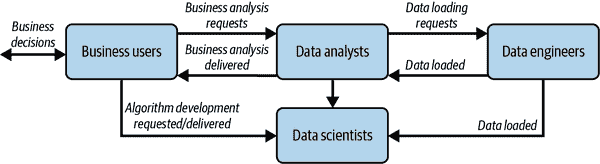
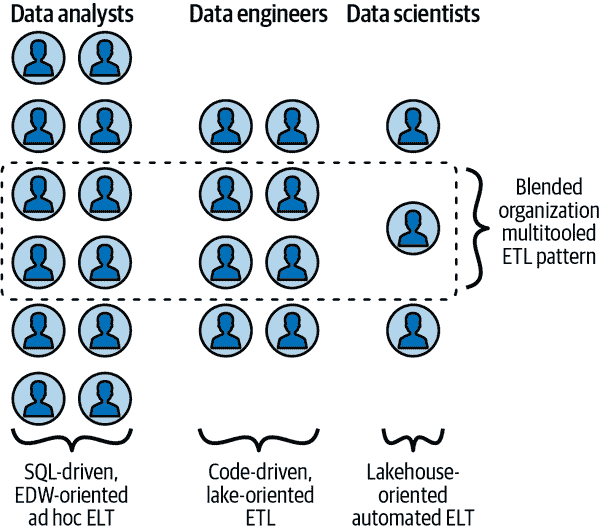
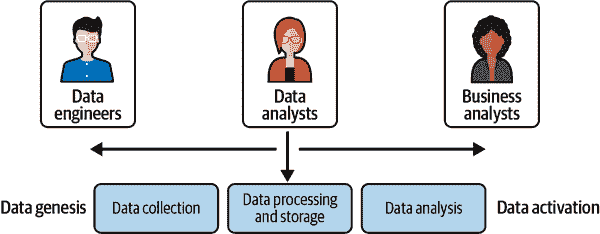
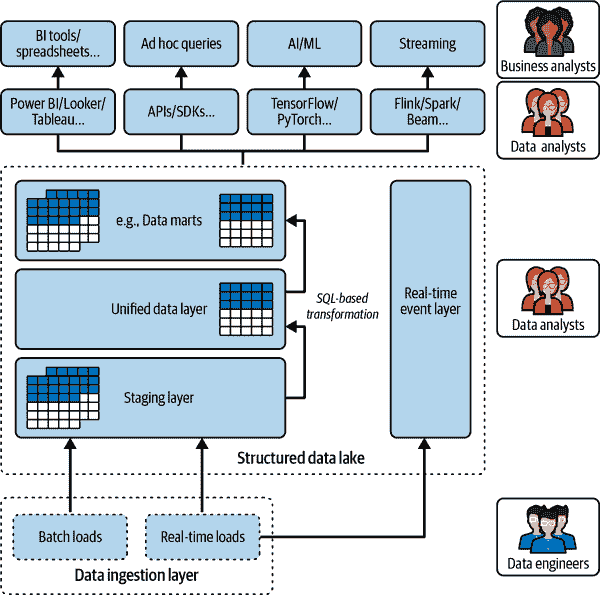
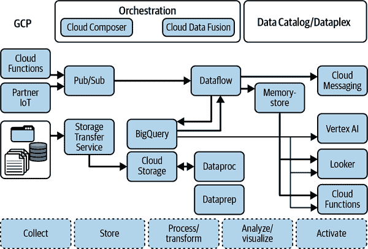
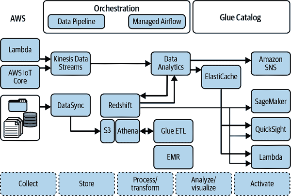
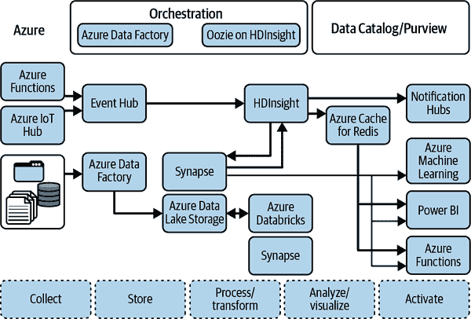
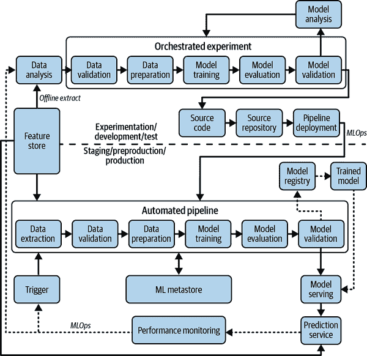

# 第三章：设计您的数据团队

在设计数据平台时，有几个技术方面需要考虑：性能、成本、运营开销、运营卓越、整合新的分析和机器学习方法等。然而，如果不解决公司文化——新技术需要员工愿意改变他们的心智模型和工作方式——这些技术方面将会被忽视。另一个要牢记的关键方面是现有员工目前拥有的技能以及他们需要掌握的技能。在某些情况下，学习新技能并改变工作方式的员工最终可能会进入不同于数据平台建立前所处角色的新角色。

在本章中，我们探讨了组织如何规划和编排这些关于心智模型、工作流、技术技能和角色的变革。每个组织都是独特的，因此构建数据平台将涉及为每个部门和员工制定细致的计划。在本章中，我们描述了这样一个细致计划在不同类型的组织中可能是什么样子。

# 数据处理组织的分类

组织可以通过采用基于其人才的不同策略来取得成功。没有普遍适用的“最佳”方法。一个具有强大防守的体育团队应该发挥其优势，专注于防守，而不是试图复制拥有技术攻击手的球队的进攻。同样，如果您的组织拥有强大的数据分析团队，它应该专注于其人员，而不是试图转变为一个充满数据工程师的组织。

根据您的员工技能和使用案例的复杂性，决定您的组织的最佳策略。您是否需要一小部分高能力（并且昂贵）的数据工程师？或者应该利用大量已经存在的数据分析师团队来丰富和转换可以采取行动的数据？这些工作者需要多少领域知识？培训当前工作人员以执行更高价值的工作是否现实？还是应该投资于生成式 AI 或无代码工具，并使这些基础性技术对更大规模的工作人员可用？

技术方法的最佳选择在组织内部也会有所不同——工作人员的构成在销售团队和工厂生产线之间会有所不同。因此，细致计划包括为每个业务单元详细说明最佳的技术方法。从技术上讲，该计划还将在基于标准 ETL（需要 ETL 工具的硬技能）和基于 ELT（需要更普遍 SQL 技能）的方法之间进行选择。

请考虑如图 3-1 所示的传统人物价值链。您可以看到组织中的每个数据用户都拥有一小部分专业技能。如果一个组织希望扩展其数据分析团队的范围，它还必须扩展其数据工程和数据科学团队的规模，以确保有足够的人拥有正确的技术技能来支持数据分析师。

###### 图 3-1\. 数据处理：传统人物价值链

公共云提供的新范式为数据处理、数据分析和算法开发打开了新的可能性。云技术使得现在能够采用新的工作方式——分析师可以执行以前由数据工程师管理的批处理或实时数据处理任务，并尝试使用现成的数据科学解决方案。此外，每个人物的潜在范围——他们的技能和职责——也有所增加。随着数据技术变得更加易于访问，数据工作者能够承担新任务并在没有传统人物价值链瓶颈的情况下处理数据价值链。这导致角色技能的融合，使得现有团队更容易扩展到额外的责任。数据分析师专注于使用 ELT 方法和 SQL 代码解决问题，而数据工程师/数据科学家更倾向于 ETL 方法和通用代码（如 Python、Java、Scala 等），二者之间的区别变得不那么明显。混合方法（如图 3-2 所示）变得更为普遍，因为它们可以充分利用 ETL 和 ELT 模式的优势。今天我们看到的大多数组织都属于这种混合模型，尽管角色的平衡和数据处理的 ETL 或 ELT 方式的比例因组织类型而异。

###### 图 3-2\. 数据处理：人物框架

简单来说，数据工作者现在能够更高效地利用他们手头的数据。这是因为技术更易于获取，也因为数据工作者能够将他们的技能与其他数据专业人士的技能相结合。这导致了一种更有效率和有效的数据处理方式。

组织可以广泛分类为三种类型：*数据分析驱动*、*数据工程驱动*和*数据科学驱动*。在接下来的几节中，我们将讨论为每种类型建立数据处理组织的理想方式。事实上，公司将包括不同的部门或业务单位，这些部门或单位属于这些类别，因此它们将发现自己应用所有这些策略。一些团队将结合多种角色，因此转型将涉及混合方法。在考虑您的数据团队中将成为不同类型用户时，请记住您在第二章学到的内容：“为了最大化从数据中获得的影响，请应用产品管理原则。”您应始终使用产品管理原则来制定您的数据产品战略，以客户为中心，通过白板绘图和原型制作发现产品，并在标准化与灵活性之间找到合适的平衡。

# 数据分析驱动的组织

数据分析驱动的组织是一种数据分析师在决策制定中扮演核心角色的组织。需要注意的是，一个组织是否以分析为驱动力不是非黑即白的问题，而是一系列重叠特征的谱系：

成熟的行业

这些组织是知名的、成熟的企业，拥有已经建立（可能是过时的）系统。它们所处的行业通常是成熟且稳定的。主要工作涉及对各种产品或情况进行人工分析。典型的以数据分析驱动为例的组织包括零售商的商品销售部门（例如沃尔玛）和大型银行的商业贷款处理部门（例如摩根大通）。

企业数据仓库（EDW）和批量 ETL

在技术术语上，中央信息枢纽是一种随时间建立起来的企业数据仓库，具有高度的技术债务和遗留技术。在数据仓库内部的数据转换通过诸如夜间批处理等定期 ETL 过程来完成。这种批处理过程增加了数据服务的延迟。

商业智能

组织中的大多数数据专业人员习惯于通过在集中式数据仓库运行 SQL 查询来回答业务问题，使用 BI 工具创建报告和仪表板，并使用电子表格访问类似的数据。因此，内部人才库最熟悉 SQL、BI 工具和电子表格。

注意，即使在零售和金融等成熟行业中，新兴的数字化组织（电子商务和金融科技）可能会寻求捕捉增长最快的数字领域和潜力最大的客户群体。这些数字原住民可能与成熟的参与者（例如 Etsy 与沃尔玛；Paytm 与摩根大通）有不同的工作人员构成；我们不会将数字原住民归类为成熟的参与者。

现在，你对我们所说的以分析驱动的组织有了更清晰的认识，让我们讨论转型的主要杠杆。

## 视野

要在以分析驱动的组织中民主化使用云数据平台，分析师应能够通过熟悉的界面（如电子表格、SQL 和 BI 工具）进行高级分析。这意味着提供易于使用的工具，将数据带入目标系统，并无缝连接到分析和可视化工具。

这曾经是传统数据仓库的常见做法。使用 SQL 对数据进行丰富化、转换和清洗，使用 ETL 工具来编排流程。同样，物化视图和用户定义函数可以用来在现代数据仓库中丰富、转换和清洗数据。

然而，这假设分析师已经可以访问所有数据源。创建复杂的摄取管道曾经是昂贵且经常令人费力的。因此，由于资源和成本限制，数据管道在数据仓库之外进行管理。

这在新的云数据仓库中已不再适用。摄取的角色现在仅仅是将数据接近云端，转换和处理部分移回到云端数据仓库。这导致数据被暂存到存储桶或消息系统中，然后再被摄取到云端数据仓库中。

所有这些不仅可以减少使数据可用所需的时间，还可以释放数据分析师专注于使用他们习惯的工具和界面寻找数据洞察。因此，在新世界中，应该使用 ELT 取代 ETL 工具——数据分析师可以使用 SQL 编排工具如 dbt 或 Dataform 来串联 SQL 语句执行 ELT。直接从源或暂存区摄取数据允许分析师利用他们关键的 SQL 技能，并提高他们接收数据的及时性。他们不需要等待被淹没的数据工程团队实施 ETL 管道。

总之，扩展云数据平台的最佳方式是为分析师提供易于使用的工具（如 dbt）和界面（如 Excel 或 Tableau），他们可以轻松掌握。这将使他们能够进行高级分析，而不必等待数据工程团队实施复杂的 ETL 管道。

一旦数据在云端数据仓库中可用，就是开始分析的时候了。过去，许多数据分析是通过电子表格完成的，但电子表格往往难以处理新世界中需要分析的大量数据。尽管 Google Sheets 和 Excel 具有连接实时到数据仓库的能力，但仍显得有些笨拙。我们建议分析师可以访问现代 BI 工具来创建可处理大数据集的可视化和报告（例如 Power BI、Tableau 或 Looker）。

## 人物角色

分析驱动型组织中数据部门的主要角色包括数据分析师、业务分析师和数据工程师。

### 数据分析师

*数据分析师*接收、理解并完成来自业务的请求，并理解相关数据。数据分析师旨在满足组织的信息需求。他们负责数据的逻辑设计和维护。他们的一些任务可能包括创建表的布局和设计以满足业务流程，以及重新组织和转换数据源。此外，他们还负责生成有效传达业务请求的趋势、模式或预测的报告和洞察。

要建立面向分析驱动型组织的任务，有必要以两种方式扩展数据分析师社区的经验和技能集。首先，促进数据分析师学习业务的趋势至关重要。数据分析师需要深入了解业务领域。其次，数据分析师需要获取分析和描述数据的技术技能，无论数据的容量或大小如何，使用 SQL 和 BI 工具现在都是可能的。数据分析师的技能扩展到业务和大数据领域在图 3-3 中有所体现。

###### 图 3-3\. 数据分析师领域扩展，用于数据驱动策略的开发

### 业务分析师

*业务分析师*是使用数据来执行分析洞察的领域专家。

云数据仓库（Cloud-based DWHs）和无服务器技术已将业务分析师的责任扩展到传统上领域专家的范围之外。这是因为分析师现在可以专注于通过分析数据为业务增加价值，而不是浪费时间在行政和技术管理任务上。此外，可以存储在数据仓库中的数据的数量和类型不再是限制因素，因此分析师现在可以更深入地挖掘业务，寻找洞察。

数据仓库既可以作为数据的登陆区域，也可以作为结构化和半结构化数据的记录系统。这意味着业务分析师可以在一个地方获取所有需要分析的数据。总体而言，云数据仓库和无服务器技术使得业务分析师能够更加高效，并为业务增加更多的价值。

尽管业务分析师可以进行无代码和低代码的机器学习模型，但他们在涉及机器学习或自然语言文本的更复杂工作流程中可能会遇到困难。他们也没有实施复杂的数据科学算法（例如排名或推荐）的技能。因此，如果您的激活需求更复杂，仍然需要一个数据科学团队。

### 数据工程师

*数据工程师* 专注于下游数据管道和数据转换的最初阶段，如加载和集成新来源。他们还管理数据治理和数据质量流程。

在一个以分析为驱动的组织中，数据工程师的人数将会很少，因为数据分析团队基本上可以自给自足，能够构建简单的数据管道和机器学习模型。分析驱动的组织采用 ELT 而非传统的 ETL 的概念。主要区别在于，常见的数据处理任务在数据加载到数据仓库后处理。ELT 大量使用 SQL 逻辑来增强、清洗、规范化、精炼和整合数据，使其准备好进行分析。这种方法有几个好处：缩短行动时间，数据立即加载，并可同时提供给多个用户使用。因此，这样的组织的变更管理策略必须关注 SQL、视图、函数、调度等方面。

即使在一个以分析为驱动的组织中，数据工程团队通常控制从源系统提取数据的过程。虽然可以通过使用基于 SQL 的工具来简化这一过程，使数据分析师能够完成部分工作，但你仍然需要一个强大的数据工程团队。还有一些批处理作业仍然需要创建数据管道，更适合使用 ETL。例如，将数据从主机到数据仓库需要额外的处理步骤：需要映射数据类型，需要转换 COBOL 书籍等等。

此外，对于实时分析等用例，数据工程团队将配置流数据源，如 Pub/Sub 或 Kafka 主题或 Kinesis 数据流。处理通用任务的方式仍然相同——可以将它们编写为通用的 ETL 管道，然后由分析师重新配置。例如，从各种源数据集应用数据质量验证检查到目标环境将遵循数据工程师设置的模板。

## 技术框架

一个以分析为驱动的组织的高级参考架构有三个基本原则：

SQL 作为标准

技术应根据当前的组织文化进行定制。无论数据处理流程中的位置如何，都应优先考虑提供 SQL 接口的组件。

从 EDW/数据湖到结构化数据湖

信息系统基础设施及其数据应该集成，以扩展对新的和多样化数据源的分析处理的可能性。这可能涉及将传统的数据仓库与数据湖合并，以消除数据孤岛（有关 lakehouse 架构的更多信息，请参见第七章）。

先读后模式（Schema-on-read）

由于存储成本低廉，您的组织在数据接收前不再需要强加严格的数据结构规则。从写入模式的模式转变为读取模式的模式允许实时访问数据。数据可以保留其原始形式，然后转换为最有用的模式。此外，数据平台可以管理保持这些副本同步的过程（例如，使用物化视图、变更数据捕获等）。因此，请放心保留多份相同数据资产的副本。

结合这些原则，我们可以定义一个高层架构，类似于图 3-4 所示的架构。此信息架构满足上述三个原则，并支持几种关键的数据分析模式：

+   “传统”的 BI 工作负载，例如创建仪表板或报告

+   一种临时分析接口，允许通过 SQL（ELT）管理数据流水线。

+   使用 ML 技术启用数据科学用例

+   将数据实时流入 DWH 并处理实时事件

###### 图 3-4\. 用于分析驱动型组织的高层信息架构

前两种模式与传统的 SQL 数据仓库世界非常相似，但后两种则以 SQL 抽象的形式提供了更先进的分析模式创新。在 ML 领域，Redshift ML 或 BigQuery ML 允许数据分析师在 DWH 中存储的数据上执行 ML 模型，使用标准 SQL 查询。诸如 Dataflow 和 KSQL 之类的 SQL 流扩展使得能够聚合数据流，与无边界、实时源（如 Pub/Sub 或 Kafka）一起。这项技术使得即使无需投资于新的概要文件和/或角色，也能实现许多可能性。

在为分析驱动型组织选择 ELT 和 ETL 时，数据准备和转换是关键考虑因素。尽可能使用 ELT，因为它允许使用 SQL 在结构化数据湖中进行数据转换。此方法提供了与广泛的数据集成套件相同的功能，但无需牺牲数据质量或操作监控。像 dbt 这样的产品为数据建模和构建数据工作流程带来了软件工程方法；dbt 有效地允许构建类似于代码构建的 ETL 工作流程的 ELT 工作流程，但是使用 SQL 而不是系统程序员。这使得数据分析师（不是系统程序员）能够进行可靠和复杂的数据转换。

简单来说，对于分析驱动型组织，ELT 比 ETL 更好，因为它允许更灵活和控制数据转换。此外，dbt 为数据建模和构建数据工作流程提供了软件工程方法，有助于提高数据转换的可靠性和复杂性。

# 数据工程驱动的组织

以工程为驱动的组织专注于数据集成。有些公司（例如金融科技领域的 Plaid）的业务就是为整个行业构建集成管道。更常见的情况是这是一个大型企业的一部分。例如，投资公司可能有一个团队，负责从大量供应商那里发现、重新格式化和摄取财务（例如股票市场、公司的 SEC 报告等）和替代（例如信用卡消费、电子收据、零售店客流等）数据。

## 视野

当您的数据转换需求复杂时，您需要数据工程师在公司的数据战略中扮演核心角色，以确保能够经济有效地构建可靠的系统。数据工程师处于数据所有者和数据消费者之间的交叉点。

业务数据所有者是业务团队的指定联系点，了解业务并为数据架构提供数据。数据消费者专注于从架构中的不同数据中提取洞察力。在这里，您通常会找到数据科学团队、数据分析师、BI 团队等。这些团队有时会将来自不同业务单位的数据合并，并生成成果物（机器学习模型、交互式仪表板、报告等）。在部署时，他们需要数据工程团队的帮助，以确保数据一致和可信任。

数据工程师有以下职责：

+   在建立分析系统和操作系统之间的集成时，传输数据并丰富数据（例如实时使用案例）。

+   从业务单位和外部供应商那里解析和转换杂乱的数据，使其成为有意义且干净的数据，并记录元数据。

+   应用数据运营（DataOps），即将业务的功能知识与应用于数据生命周期的软件工程方法相结合。这包括监控和维护数据源。

+   部署机器学习模型和其他数据科学成果来分析或消费数据。

构建复杂的数据工程管道是昂贵的，但可以增强能力：

Enrichment

数据工程师创建流程，从不同来源收集数据并将其组合以创建更有价值的数据集。这些数据随后可以用于做出更好的决策。

训练数据集

机器学习模型的质量很大程度上取决于用于训练这些模型的数据。通过从多个来源获取数据并统一到准备用于训练机器学习模型的数据集中，数据工程师可以提高数据科学团队的生产力。

非结构化数据

当机器学习模型需要使用非结构化数据（例如评论文本或图像）时，会面临特殊挑战。这类数据通常不像传统的数据仓库使用的严格模式那样遵循严格的模式。此外，它需要清除个人身份信息（例如聊天记录中的电话号码）和不适合工作的内容（特别是图像），并进行转换（例如使用嵌入）。

Productionization

数据工程工作也需要将临时数据科学工作进行产品化，并从中获取价值。没有数据工程支持，数据科学家将被困在实验和针对特定用例制作的应用程序中，这些应用程序很少能够进行产品化或泛化。

实时分析

异常检测和欺诈预防等应用需要立即响应。在这些用例中，数据消费者需要在数据即时到达时进行处理。他们必须在低延迟下执行。这种实时分析需要在目标数据仓库之外进行转换。

前面提到的所有内容通常需要定制应用程序或最先进的工具。实际上，很少有组织的工程能力能够达到真正的工程组织水平。许多组织处于我们所说的混合组织中（见图 3-2）。

## 人物角色

数据工程师开发和优化所有需要获取数据以及执行相关分析并生成报告的过程。

### 知识

数据工程角色需要对数据库和编程语言有深入理解，同时具备跨部门工作所需的某些业务技能。无论他们所在的组织规模如何，数据工程师都需要具备某些标准技能才能成功。最有价值的知识包括：

数据仓库和数据湖解决方案

Cloudera 数据平台、Oracle Exadata、Amazon RedShift、Azure Synapse、Google BigQuery、Snowflake、Databricks、Hadoop 生态系统等，数据工程师可以处理海量数据。

数据库系统

像 SQL 和 NoSQL 这样的数据库系统。他们应该知道如何在和操作关系数据库管理系统以进行信息存储和检索。

ETL 工具

传统工具如 Informatica 和 Ab Initio，以及现代框架如 Apache Beam、Spark 和 Kafka。

编程语言

Python、Java、Scala。

数据结构与算法

数据结构与算法允许组织和存储数据以便于访问和操作，这对数据工程师来说是一项至关重要的技能。

自动化与脚本编写

数据工程师应该能够编写脚本来自动化重复的任务，因为他们必须处理如此庞大的数据量（例如，bash、PowerShell、HashiCorp Terraform、Ansible 等）。

容器技术

将数据项目移至生产的事实标准。在本地机器上开发的项目可以“发布”到分级和生产集群（通常）而无需问题。数据管道和 ML 模型可复制，并可以在任何地方以相同的方式运行。

编排平台

由于需要集成的解决方案和工具的激增，像 Apache Airflow 这样的编排工具已成为必需品。

认证衡量数据工程师的知识和熟练程度，与供应商和/或行业标准进行比较，确认个人具备必要的专业知识，能够为企业的数据战略做出贡献。例如，AWS 认证数据分析师、Cloudera 认证专业（CCP）数据工程师、Google 专业数据工程师和 Microsoft 认证：Azure 数据工程师助理。

### 职责

数据工程师负责确保由不同业务部门生成和需要的数据被摄入到架构中。这项工作需要两种不同的技能：功能知识和数据工程/软件开发技能。这种技能组合通常被称为*DataOps*（它源自过去几十年内开发的 DevOps 方法论，但应用于数据工程实践中）。

数据工程师还有另一个责任。他们必须帮助部署由数据消费者生成的产品。通常，数据消费者没有深厚的技术技能和知识来单独负责其产品的部署。这对高度复杂的数据科学团队同样适用。因此，数据工程师必须掌握其他技能，如机器学习和业务智能平台知识。让我们澄清这一点：我们不指望数据工程师成为机器学习工程师。机器学习工程是将数据科学家开发的机器学习模型部署到实时生产系统的过程。另一方面，数据工程师建立的基础设施是供他人处理数据使用的，比如数据存储和数据传输。数据工程师需要理解机器学习，以确保传递给模型的第一层数据（输入）是正确的。在推断路径中，当数据工程技能如规模化和高可用性真正需要发挥作用时，他们也将成为关键。

通过负责解析和转换来自各业务部门的混乱数据，或者实时摄入，数据工程师让数据消费者能够专注于创造价值。数据科学家和其他类型的数据消费者不需要关注数据编码、大文件、传统系统和复杂的消息队列配置以进行流处理。将这种知识集中在高技能的数据工程团队中的好处是显而易见的，尽管其他团队（业务部门和消费者）也可能有他们的数据工程师作为与其他团队交互的接口。最近，我们甚至看到创建了由业务单元成员（数据产品负责人）、数据工程师、数据科学家和其他角色组成的小组。这有效地创建了完整团队，拥有从传入数据到影响业务的数据驱动决策的全权负责权。

## 技术框架

数据工程团队已经需要广泛的技能。不要让他们的工作变得更加困难，期望他们还能维护运行数据管道的基础设施。数据工程师应该专注于如何清理、转换、增强和准备数据，而不是关注他们的解决方案可能需要多少内存或多少核心。

### 参考架构

摄取层由 Kinesis、Event Hubs 或 Pub/Sub 处理实时数据，而 S3、Azure 数据湖或 Cloud Storage 处理批量数据（参见图 3-5、3-6 和 3-7）。它不需要任何预分配的基础设施。所有这些解决方案都可以用于各种情况，因为它们可以自动扩展以满足输入工作负载的需求。

###### 图 3-5\. Google Cloud 上的示例数据工程驱动架构

###### 图 3-6\. AWS 上的示例数据工程驱动架构

###### 图 3-7\. Azure 上的示例数据工程驱动架构

一旦数据被收集，我们提议的架构遵循传统的提取、转换和加载（ETL）三步流程。对于某些类型的文件，也可以采用直接加载到 Redshift、Synapse 或 BigQuery（使用 ELT 方法）的方式。

在转换层，我们主要推荐 Apache Beam 作为数据处理组件，因为其批处理和流处理的统一模型。Apache Beam 的执行器包括 GCP 上的 Cloud Dataflow，以及其他超大规模服务商上任何托管的 Flink 或 Spark 实现。

在这种架构中，Dataflow 的替代方案是使用基于 Spark 的解决方案，如 Amazon EMR、Databricks、Azure HDInsight 或 Google Dataproc。然而，这些解决方案并非无服务器，运行闲置的 Spark 集群是一笔主要成本。话虽如此，也有提供作为 AWS SageMaker/Glue 的一部分和 GCP 无服务器 Spark 服务的无服务器 Spark 替代方案。主要用例是那些已经在 Spark 或 Hadoop 中拥有大量代码的团队。这些 Spark 解决方案使得直接通向云的路径成为可能，而无需审查所有这些管道。

另一个数据处理的选择是使用无代码环境来创建数据管道，例如由 AWS Glue、Azure Data Factory 或 GCP Data Fusion 提供的拖放界面。传统的 ETL 工具如 Informatica、Ab Initio 和 Talend 也在云中以无服务器模式运行，底层使用 Kubernetes 集群。其中一些工具使用 Hadoop/Spark 解决方案或类似的专有计算引擎，因此我们之前提到的所有内容也适用于 ETL 工具的情况。如果您的团队希望创建数据管道而无需编写任何代码，图形化 ETL 工具是正确的选择。

### 参考架构的优点

Figures 3-5，3-6，和 3-7 中呈现的参考架构基于对无服务器 NoOps 技术和流式管道的偏好。

通过使用无服务器技术，您可以将数据工程团队的维护负担减少，并为执行复杂和/或大型作业提供必要的灵活性和可扩展性。例如，在零售商的黑色星期五期间规划交通高峰时，可伸缩性是至关重要的。使用无服务器解决方案允许零售商查看他们在一天中的表现。他们不再需要担心处理白天产生的大量数据所需的资源。

参考架构使数据工程团队有可能为数据管道编写完全自定义的代码。这可能是因为解析要求可能很复杂，没有现成的解决方案可能适用。在流式处理中，团队可能希望以低延迟实施复杂的业务逻辑。但是，团队应通过创建可重用库和使用 Dataflow 模板等技术来尝试重用代码。这既带来了两者的最佳（重用和重写），同时节省了宝贵的时间，可以用于高影响代码而不是常见的 I/O 任务。

呈现的参考架构还具有另一个重要特征：将现有的批处理管道转换为流式处理的可能性。

# 数据科学驱动的组织

数据科学驱动的组织是一种最大化从可用数据中获得价值以创造可持续竞争优势的实体。为此，组织依赖于通常（但并非总是！）采用 ML 的自动化算法。与依赖一次性报告和分析的分析驱动型组织不同，科学驱动型组织试图以自动化的方式做出决策。例如，一个以数据分析驱动的银行会让数据分析师评估每个商业贷款机会，建立投资案例，并由高管签署。另一方面，一个数据科学驱动的金融科技公司将建立一个贷款批准系统，该系统使用某种自动化算法来对大多数贷款做出决策。

## 愿景

数据科学驱动的组织是从其数据中提取最大价值，并利用 ML 和分析获得可持续竞争优势的组织。在构建这样的数据科学团队时，应遵循一些原则：

适应性

平台必须具有足够的灵活性，以适应所有类型的用户。例如，虽然一些数据科学家/分析师更倾向于创建自己的模型，但其他人可能更喜欢使用无代码解决方案或在 SQL 中进行分析。这还包括提供各种机器学习和数据科学工具，如 TensorFlow、R、PyTorch、Beam 或 Spark。平台还应该足够开放，以在多云和本地环境中运行，同时在可能时支持开源技术，以避免锁定效应。最后，资源永远不应成为瓶颈，因为平台必须能够快速扩展以满足组织的需求。

标准化

标准化通过使代码和技术成果更易于共享来提高平台的效率。这提升了团队之间的沟通，增强了他们的表现和创造力。标准化还使数据科学和机器学习团队能够以模块化的方式工作，这对于高效的开发至关重要。通过使用标准连接器连接到源/目标系统可以实现标准化。这避免了在机器学习和数据科学工作流中常见的“技术债务”问题。

责任

数据科学和机器学习用例通常涉及敏感主题，如欺诈检测、医学影像或风险计算。因此，数据科学和机器学习平台必须帮助尽可能使这些工作流程透明、可解释和安全。开放性与运营卓越性息息相关。在数据科学和机器学习工作流程的所有阶段收集和监控元数据对于创建允许您提出诸如以下问题的“纸迹”至关重要：

+   用于训练模型的数据是哪些？

+   使用了哪些超参数？

+   模型在生产中的表现如何？

+   在上个时期内是否发生了任何形式的数据漂移或模型偏移？

此外，以科学为驱动的组织必须对其模型有深入的理解。虽然传统统计方法的这个问题较少，但机器学习模型（如深度神经网络）则更加不透明。平台必须提供简单的工具来分析这些模型，以便放心使用。最后，成熟的数据科学平台必须提供所有安全措施，以保护数据和成果，并在粒度级别管理资源使用。

商业影响

根据[麦肯锡](https://oreil.ly/O_MZs)，许多数据科学项目未能超越试点或概念验证阶段。因此，更重要的是预期或衡量新举措的商业影响，并选择回报率，而不是追求最新的时髦解决方案。因此，关键是确定何时购买、构建或定制机器学习模型，并将它们连接到单一集成堆栈中。例如，在数月的开发后，通过调用 API 使用现成的解决方案而不是构建模型，将帮助您实现更高的回报率并展示更大的价值。

激活

将分析嵌入到最终用户使用的工具中以操作化模型的能力对于实现向广泛用户群提供服务的扩展至关重要。能够将小批量数据发送到服务中，并在响应中返回预测结果的能力，使得具有较少数据科学专业知识的开发人员也能使用模型。此外，促进边缘推理和灵活 API 的自动化过程的无缝部署和监控非常重要。这使您能够在私有和公共云基础设施、本地数据中心和边缘设备上分布人工智能。

建立以科学驱动为基础的组织面临着几个社会技术挑战。通常，组织的基础设施不够灵活，无法应对快速变化的技术环境。平台还需要提供足够的标准化，以促进团队之间的沟通，并建立技术上的“共通语言”。这一点对于允许团队之间的模块化工作流程和建立运营卓越至关重要。此外，安全地监控复杂的数据科学和机器学习工作流通常过于不透明。

基于技术开放性高度可适应的技术平台构建以科学驱动的组织至关重要。因此，关键是要使广泛的角色得到启用，并以灵活和无服务器的方式提供技术资源。是购买还是构建解决方案是实现组织投资回报率的主要驱动因素之一，这将定义任何 AI 解决方案可能产生的业务影响。同时，启用广泛的用户能够激活更多用例。最后，平台需要提供工具和资源，使数据科学和机器学习工作流程开放、解释性和安全，以提供最大形式的问责制。

## 人物角色

数据科学驱动的组织中的团队由具有不同技能和经验的各种人员组成。然而，大多数团队包括四个核心角色：数据工程师、ML 工程师、数据科学家和分析师。需要注意的是，这些角色并不总是清晰定义的，并且在某种程度上可能存在重叠。有效的组织结构将允许协作和充分利用所有团队成员的技能：

数据工程师

数据工程师负责开发数据流水线，确保数据符合所有质量标准。这包括从多个来源清理、合并和丰富数据，将其转化为可用于下游分析的信息。

ML 工程师

ML 工程师负责创建和监督完整的 ML 模型。虽然 ML 工程师是四个角色中最稀缺的，但一旦组织打算在生产中运行关键业务工作流程，他们就变得至关重要。

数据科学家

数据科学家是数据与 ML 工程师之间的桥梁。他们与业务利益相关者一起，将业务需求转化为可测试的假设，确保从 ML 工作负载中获取价值，并创建报告以展示数据的价值。

数据分析师

数据分析师提供业务洞见，并确保实施企业正在寻求的基于数据驱动的解决方案。他们回答临时问题，并提供分析历史和最新数据的定期报告。

公司是否应该建立集中化或分散化的数据科学团队存在各种争论。还有混合模型，例如数据科学家嵌入到中央组织的联邦组织。因此，更重要的是专注于如何使用前面描述的原则解决这些社会技术挑战。

## 技术框架

我们强烈建议您在公共云提供商的 ML 流水线基础设施上进行标准化（例如，在 Google Cloud 上的 Vertex AI、AWS 上的 SageMaker 或 Azure 上的 Azure Machine Learning），而不是将单次培训和部署解决方案拼凑在一起。参考架构（见图 3-8）包括一个 ML 流水线，用于自动化实验和训练。训练过的模型被部署在一个通过容器化重复许多训练步骤的流水线中。当特征过于昂贵或需要在服务器端注入时，请使用特征存储。将模型部署到端点。

###### 图 3-8\. 使用公共云中提供的 ML 流水线产品使数据科学实验可重复且部署健壮

# 摘要

在本章中，您已经看到了设计数据团队的不同方式，以确保其在您所在的组织中取得成功。最佳方法是找到合适的技能和经验组合，这将补充您现有的团队，并帮助您实现业务目标。主要收获如下：

+   云技术促进了新的工作方式的实现。任何给定角色的潜在作用范围已经扩大。数据工作者现在能够更有效地利用他们手头的数据。

+   无论您的组织主要由数据分析师、数据工程师还是数据科学家组成，都可以构建数据文化。然而，通向数据文化的路径以及每种组织类型所需的技术是不同的。

+   确定哪种组织分类适合您，然后开始建立与之支持相关的愿景、具备相关技能的人物角色以及技术框架。

+   数据平台应该做什么的愿景也各不相同。在分析驱动型组织中，它应该民主化数据访问。在工程驱动型组织中，它关乎以成本效益的方式确保可靠性。在科学驱动型组织中，它应该通过业务影响力提供竞争优势。

+   分析驱动型组织应专注于 SQL 技能，工程驱动型组织应专注于 ETL 和 DataOps 能力，而科学驱动型组织则应专注于 MLOps 和 AI 能力。

+   分析驱动型组织的推荐架构是数据仓库（或建立在数据仓库基础上的湖仓）；对于工程驱动型组织来说，是数据湖（或建立在数据湖基础上的湖仓）；对于科学驱动型组织来说，是与湖仓连接的 ML 流水线架构。这些内容将在第五章至第七章详细讨论。

接下来的章节将为您提供一个通用的技术迁移框架，您可以应用它从传统环境迁移到现代化的云架构。
