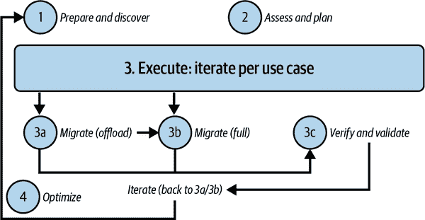
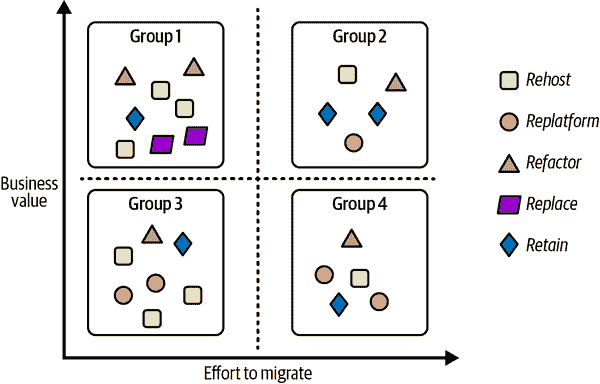
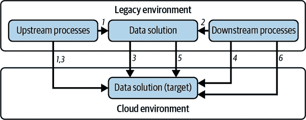

# 第四章：迁移框架

除非您在一家初创公司，否则很少会从零开始构建数据平台。相反，您将通过从遗留系统迁移事物来搭建一个新的数据平台。在本章中，让我们来审视迁移的过程——当您启程进入新数据平台时应该做的一切。我们将首先提出一个概念模型和可能的框架，您在现代化数据平台时应该遵循它们。然后，我们将审查组织如何估算解决方案的总体成本。我们将讨论如何确保在迁移过程中即使数据安全和数据治理也能就位。最后，我们将讨论模式、数据和管道迁移。您还将了解有关区域容量、网络和数据传输约束的选项。

# 现代化数据工作流程

在开始制定迁移计划之前，您应该全面了解为何进行迁移以及迁移到何处的愿景。

## 全面视角

数据现代化转型应该从整体考虑。从鸟瞰的角度来看，我们可以确定三个主要支柱：

业务成果

专注于您正在现代化的工作流程，并确定这些工作流程驱动的业务成果。这对于确定差距和机会所在至关重要。在做出任何技术决策之前，限制迁移到与领导层确定的业务目标一致的用例（通常在两到三年的时间范围内）。

利益相关者

确定可能会访问数据的人员或角色（其中一些团队可能尚不存在）。您在数据现代化中的目标是使数据访问民主化。因此，这些团队需要掌握数据读写能力，并熟练使用现代化最终状态技术所期望的任何工具（如 SQL、Python、仪表盘）。

技术

您必须根据业务策略和团队能力定义、实施和部署数据架构、建模、存储、安全、集成、可操作性、文档、参考数据、质量和治理。

确保您将迁移视为纯 IT 或数据科学项目，而不是技术方面仅仅是更大组织变革的一个子集。

## 现代化工作流程

当您考虑现代化程序时，您的注意力自然会转向您使用的工具所带来的痛苦。您决定要升级您的数据库，并使其在全球范围内保持一致和可扩展性，因此您将其现代化为 Spanner 或 CockroachDB。您决定要升级您的流处理引擎，并使其更具弹性和更易于运行，因此您选择 Flink 或 Dataflow。您决定不再调整数据仓库集群和查询，因此您将其现代化为 BigQuery 或 Snowflake。

这些都是很好的进步。每当可能时，您确实应该升级到更易于使用、更易于运行、更具可扩展性和更具韧性的工具。然而，如果您只进行类似于类似工具的更换，您最终只会得到渐进性的改进，而不会得到转型性的变化。

为了避免这个陷阱，在开始数据现代化之旅时，强迫自己思考工作流程，而不是技术。什么是现代化数据工作流？考虑最终用户想要完成的整体任务。也许他们想要识别高价值客户。也许他们想要运行市场营销活动。也许他们想要识别欺诈。现在，考虑整个工作流程以及如何尽可能便宜简单地实现它。

接下来，从头开始考虑工作流程。识别高价值客户的方法是根据交易历史记录为每个用户计算总购买量。找出如何通过您现代化的工具集实现这样的工作流程。在这样做时，大量依赖自动化：

自动化数据摄入

不要编写定制的 ELT 流水线。使用诸如 Datastream 或 Fivetran 之类的现成 ELT 工具将数据导入 DWH（数据仓库）中更为简便。在飞行中进行转换并捕获常见转换结果，要比为每个可能的下游任务编写 ETL 流水线容易得多。此外，许多 SaaS 系统将自动导出至 S3、Snowflake、BigQuery 等。

默认流式处理

将数据存入既结合批处理又结合流式存储的系统中，以便所有 SQL 查询反映最新数据（受某些延迟影响）。同样，任何分析都应寻找能够使用同一框架处理流式和批处理的数据处理工具。在我们的例子中，生命周期价值计算可以是一个 SQL 查询。为了重复使用，将其制作成一个材料化视图。这样，所有计算都是自动的，并且数据始终是最新的。

默认自动缩放

任何期望您预先指定机器数量、仓库大小等的系统，都将要求您专注于系统而非要完成的工作。您希望自动缩放，以便能够专注于工作流程而不是工具。

查询重写、合并阶段等

您希望能够专注于要完成的工作，并将其分解为可理解的步骤。您不希望调整查询、重写查询、合并转换等。让内置于数据堆栈中的现代优化器处理这些事务。

评估

您不希望为评估 ML 模型性能编写定制的数据处理流水线。您只需能够指定采样率和评估查询，并得到关于特征漂移、数据漂移和模型漂移的通知即可。所有这些功能应内置于部署的端点中。

重新训练

如果您遇到模型漂移，您应该在十次中有九次重新训练模型。这也应该是自动化的。现代机器学习流水线将提供可调用的钩子，您可以直接将其绑定到自动化评估流水线，以便您也可以自动化重新训练。

持续培训

模型漂移并不是您可能需要重新训练的唯一原因。当您拥有更多数据时，可能需要重新训练。也许是当新数据落入存储桶时，或者当您有代码提交时。同样，这可以自动化。

一旦您确定需要一个完全自动化的数据工作流程，您将看到一个相当模板化的设置，包括连接器、数据仓库和机器学习流水线。所有这些都可以是无服务器的，因此您基本上只需要进行配置，而不需要进行集群管理。

当然，您将会编写一些具体的代码片段：

+   在 SQL 中的数据准备

+   在 TensorFlow 或 PyTorch 等框架中的机器学习模型

+   连续评估的评估查询

我们可以看出，每个工作流程都能简化设置，这就解释了集成数据和人工智能平台的重要性。

## 转换工作流本身

您可以通过使用现代数据堆栈使工作流程本身更加高效和自动化。但在这样做之前，您应该问自己一个关键问题：“这个工作流程是否需要由数据工程师预先计算？”

因为这就是您构建数据管道时所做的事情——您正在预先计算。这只是一种优化，不过如此。

在许多情况下，如果您能使工作流程成为自助式和临时的，您就不必依赖数据工程资源来构建它。因为自动化程度很高，您可以提供运行任何聚合（不仅仅是生命周期价值）的能力，应用于完整的历史交易记录。将生命周期价值计算移到声明性语义层，用户可以在其中添加自己的计算。这就是例如 Looker 这样的工具允许您做的事情。一旦您这样做了，您就能获得整个组织中一致的关键绩效指标和授权用户构建常见措施库的好处。现在创建新指标的能力在业务团队，也就是其本应所在之处。

# 一个四步迁移框架

您可以对建立数据平台过程中可能遇到的许多情况应用标准化方法。这种方法在很大程度上独立于数据平台的规模和深度——我们既用于小公司现代化数据仓库的工作，也用于为跨国企业开发全新的数据架构。

这种方法基于所示的四个主要步骤图 4-1。

1\. 准备和发现。

所有利益相关者应进行初步分析，以确定需要迁移的工作负载清单和当前的痛点（例如，无法扩展、处理引擎无法更新、不需要的依赖关系等）。

2\. 评估和计划。

评估前阶段收集的信息，定义成功的关键指标，并计划每个组件的迁移。

3\. 执行。

对于每个确定的用例，决定是停用、完全迁移（数据、模式、下游和上游应用程序），还是卸载它（通过将下游应用程序迁移到不同的源）。之后，测试和验证任何已进行的迁移。

4\. 优化。

一旦流程开始，可以通过持续迭代来扩展和改进它。首次现代化步骤可以仅关注核心能力。

###### 图 4-1\. 四步迁移框架

让我们依次详细介绍每个步骤。

## 准备和发现

第一步是准备和发现。这涉及定义迁移范围并收集与将迁移的工作负载/用例相关的所有信息。它包括分析来自企业多个利益相关者的广泛输入，如业务、财务和 IT。请这些利益相关者：

+   列出所有相关于迁移的用例和工作负载，并附有它们的优先级。确保包括合规要求、延迟敏感性和其他相关信息。

+   解释他们可以通过新系统获得的预期好处（例如，查询性能、处理能力、流式处理能力等）。

+   建议市场上可满足业务需求的解决方案。

+   进行初步的总体成本分析，以估算迁移的价值。

+   确定培训和招聘需求，以建立一个能力强大的工作人员。

您可以使用问卷调查从应用程序所有者、数据所有者和选定的最终用户收集这些见解。

## 评估和计划

第二步是评估收集到的数据，并计划完成实现确定目标所需的所有活动。这涉及：

1\. 当前状态的评估

通过收集和分析服务器配置、日志、作业活动、数据流映射、数据量、查询和集群来分析每个应用程序、工作流或工具的当前技术印记。随着遗留印记的增加，这项活动可能变得非常耗时且容易出错。因此，寻找可以自动化整个过程的工具（例如 SnowConvert、CompilerWorks、AWS 模式转换工具、Azure 数据库迁移服务、Datametica Raven 等）。这些工具可以提供工作负载分解、依赖关系映射、复杂性分析、资源利用分析、容量分析、SLA 分析、端到端数据血统以及各种优化建议。

2\. 工作负载分类

利用“准备和发现”阶段问卷收集的信息，结合评估阶段的深入洞察，对所有已识别的工作负载选择并分类为以下选项之一：

退役

工作负载最初将保留在本地环境中，并最终将被废除。

保留

工作负载将保留在本地环境中，由于技术约束（例如，它运行在专用硬件上）或出于业务原因。这可能是暂时的，直到工作负载可以重构，或者可能移动到协作设施，其中数据中心需要关闭且服务无法迁移。

迁移

工作负载将迁移到云环境中，利用其基础设施即服务（IaaS）能力。这通常被称为“搬迁和升级”。

重建

工作负载（或其中一部分）将部分更改以提高其性能或减少成本，然后迁移到 IaaS；这通常被称为“迁移和改进”。在进行搬迁和升级体验后进行优化，通常从容器化开始。

重构

工作负载（或其中一部分）将迁移到一个或多个云完全托管的平台即服务（PaaS）解决方案（例如，BigQuery、Redshift、Synapse）。

替换

工作负载将完全被第三方现成的或 SaaS 解决方案替代。

重建

使用云完全托管解决方案完全重新架构工作负载，并从头开始重新实施。这是重新思考应用程序并计划如何利用云原生服务的地方。

3\. 工作负载集群化

将不会退役/重建的工作负载分组集群，根据它们的相对商业价值和迁移所需的努力。这将有助于在迁移过程中确定一种优先顺序。例如：

+   *第一组*：高商业价值，迁移成本低（优先级 0 - 快速胜利）

+   *第二组*：高商业价值，迁移成本高（优先级 1）

+   *第三组*：低商业价值，迁移成本低（优先级 2）

+   *第四组*：低商业价值，迁移成本高（优先级 3）

在 Figure 4-2 中，您可以看到一个集群化示例，在此示例中，工作负载根据描述的优先级标准分组。在每个组中，工作负载可能采用不同的迁移方法。

###### 图 4-2\. 工作负载分类和集群化示例

在整个过程中，我们建议您遵循以下实践：

使过程可衡量。

确保利益相关者已经达成一致，并能够使用一些业务关键绩效指标来评估现代化的结果。

从最小可行产品（MVP）或概念验证（PoC）开始。

将大型任务细分为较小的任务，并确保为即将进行的任何工作存在标准模板。如果没有，请进行概念验证，并将其用作以后的模板。寻找可以快速获得成功的项目（优先级为 0 的工作负载），不仅可以作为其他转换的示例，还可以向领导展示此类现代化可能带来的影响。

估算完成所有活动所需的总时间。

创建一个全面的项目计划（如有必要，与供应商或顾问合作），以定义工作负载转换所需的时间、成本和人力资源。

在里程碑上过度沟通。

确保利益相关者了解计划的时间长短及其关键组成部分。确保通过已完成的云项目传递价值，并在整个过程中建立信心，使组织中的人们可以实际开始使用。尝试识别里程碑，并发送临时通信，总结已完成的工作的详细信息。

现在，您对准备进行下一次迁移所需完成的任务有了很好的了解，让我们看看您应该如何去做。

## 执行

对于每个工作负载，您现在有一个计划。具体来说，您知道将要迁移什么（整个工作负载还是部分工作负载）、将其迁移到何处（IaaS、PaaS 或 SaaS）、如何进行迁移（重新托管、重新平台化、重建等）、如何衡量成功、要遵循哪些模板、需要多少时间以及将要在何处通信里程碑。为了将计划变成现实，我们建议您设置一个着陆区，迁移到该区域，并验证迁移的任务。

### 着陆区

首先，您必须构建所谓的*着陆区*——所有工作负载将驻留的目标环境。这项活动可以根据您当前的配置复杂程度而有所不同，但至少您需要：

+   定义目标项目及相关组织（例如，Google Cloud 组织结构）。

+   设置新的身份管理解决方案或与旧有或第三方解决方案集成（例如 Azure Active Directory 或 Okta）。

+   配置授权（例如 AWS IAM）和审计系统（例如 Azure 安全日志记录和审计）

+   定义和设置网络拓扑及相关配置

一旦着陆区准备就绪，就是您开始迁移的时候了。

### 迁移

通常建议将迁移分为多个阶段或迭代，除非您需要迁移的工作负载数量非常少。这样可以让您在迁移一部分工作负载时积累经验和信心，并处理挑战和错误。

对于每个工作负载，您可能需要考虑：

模式和数据迁移

根据使用情况，您可能需要转换数据模型或仅简单地转移数据。

查询转译

在某些情况下，您可能需要将来自源系统的查询转换为目标系统的查询。如果目标系统不支持所有扩展功能，则可能需要重构查询。您可以利用工具如 Datametica Raven 或生成式人工智能来减少手动工作量。

数据管道迁移

数据管道是准备数据进行分析的数据工作负载的核心部分。我们将在“模式、管道和数据迁移”中看到处理此类迁移的可能方法。

业务应用程序迁移

一旦迁移数据完成，您需要迁移能使用户与数据交互的应用程序。

性能调优

如果迁移后的工作负载表现不如预期，您需要进行故障排除并修复。可能目标解决方案未正确配置，您定义的数据模型无法充分利用目标平台的所有功能，或者在转译过程中存在问题。

使用像 Ansible 或 Terraform 这样的基础架构即代码工具是非常重要的，因为它们可以尽可能自动化部署基础架构管理工作，加快每个迭代的测试和执行。

### 验证

一旦工作负载迁移完成，您需要仔细检查是否一切都顺利完成。验证您的工作负载性能、运行成本、访问数据时间等是否与您确定的关键绩效指标一致。验证您获取的所有结果是否符合您的期望（例如，查询结果与传统环境中的相同）。一旦确信结果符合您的需求，就可以开始处理第二个用例，然后是第三个，直到所有内容都迁移完毕。如有可能，后续迭代可以并行进行，以加快整体过程。

在每个工作负载结束时，记录可能出现的问题及完成所有活动所需的时间以及相关的经验教训，以便在后续工作负载中改进流程是个明智的做法。

## 优化

框架的最后一步是优化。在这里，你不会专注于每个单独迁移的组件的性能。相反，你将把新系统作为一个整体来考虑，并确定引入潜在新用例的可能性，使其更加灵活和强大。你应该反思从迁移中得到了什么（例如，无限扩展性、增强安全性、增加可见性等），以及你可能会采取的下一步措施（例如，将数据收集的边界扩展到边缘、与供应商建立更好的协同关系、开始对正确的数据进行货币化等）。你可以从“准备和发现”步骤收集到的信息开始，弄清你在理想旅程中的位置，并考虑额外的下一步措施。这是一个永无止境的故事，因为创新像业务一样永不停歇，它将帮助组织越来越好地理解和利用他们的数据。

现在你已经通过利用四步迁移框架更好地理解了如何进行迁移的方法，让我们深入了解如何估算解决方案的总成本。

# 估算解决方案的总成本

刚才你看到了一个通用的迁移框架，可以帮助组织定义必须执行以现代化数据平台的一组活动。首席技术官（CTO）、首席执行官（CEO）或首席财务官（CFO）可能会问的第一个问题是：“我们需要为此预算多少总成本？”在本节中，我们将审视组织通常如何应对这一挑战，以及他们如何组织他们的工作以从供应商和第三方供应商那里获取报价。永远记住，这不仅仅是技术成本的问题——始终需要考虑到人员和流程成本。

## 现有基础设施的审计

正如你所见，一切都始于对现有环境的评估。如果你对当前的现状没有清晰的认识，那么你在正确评估下一代现代数据平台的定价时肯定会遇到挑战。这项活动可以通过以下三种方式之一来执行：

内部 IT/基础设施团队手动执行

许多组织维护配置管理数据库（CMDB），它可以是文件或标准数据库，包含组织内使用的所有硬件和软件组件的关键信息。它是当前组织内运行情况的一种快照，以及相关的基础设施，甚至突出显示了组件之间的关系。CMDB 可以更好地理解所有应用程序的运行成本，并帮助关闭不必要或冗余的资源。

内部 IT/基础设施团队自动执行

目标与前一点描述的完全相同，但旨在利用能够自动收集信息的软件（与硬件相关的数据，运行在服务器上的应用程序，系统之间的关系等）。这些类型的工具（例如，StratoZone，Cloudamize，CloudPhysics 等）通常会生成与最常见的目标云超大规模供应商（例如 AWS，Google Cloud 和 Azure）相关的建议，例如机器的大小和优化选项（例如，系统每天应运行多少小时来执行其任务）。

利用第三方参与者

咨询公司和云供应商拥有经验丰富的人员和自动化工具来执行生成 CMDB 和详细报告的所有活动，这是我们建议的，如果您的组织通常将 IT 项目外包给咨询公司。

## 信息/提议和报价请求

虽然这可能是您要做的唯一迁移，因此您必须边做边学，但咨询公司专业从事此类工作，通常在处理迁移项目时效率更高。当然，请验证分配给您的团队是否具有必要的经验。一些 SI 甚至可能会执行评估并提供成本估算作为未来机会的投资。

在现代化过程中确定最佳合作伙伴或供应商可能是一项艰巨的任务。有许多变量需要考虑（知识、能力、成本、经验），如果不以严格的方式执行，可能会变得非常复杂。这就是为什么组织通常利用三种问卷从潜在的 SI（系统集成商）那里收集信息的原因：

信息请求（RFI）

用于收集供应商/潜在合作伙伴解决方案和服务详细信息的问卷。它有一个*教育*目的。

提案请求（RFP）

用于收集供应商/合作伙伴如何利用其产品和服务来解决特定组织问题的详细信息的问卷（在本例中是现代数据平台的实施）。它用于*比较*结果。

报价请求（RFQ）

用于基于特定要求收集不同供应商/潜在合作伙伴定价详细信息的问卷。它用于量化和标准化定价，以便未来进行比较。

您的组织可能有关于如何执行此操作的政策和模板。请与您的法律或采购部门联系。否则，请询问供应商展示他们通常使用的内容。

一旦您从所有供应商/潜在合作伙伴那里收到了所有响应，您应该获得所有信息以选择最佳前进路径。在某些情况下，特别是在解决的问题可能非常模糊时（例如，即使在一天中的单个时间段内也可能有多个峰值的实时分析），甚至对于供应商/潜在合作伙伴来说，提供关于成本的清晰细节也是具有挑战性的。这就是为什么有时供应商会要求进行概念验证或最小可行产品，以更好地理解解决方案在实际使用情况下的工作方式，并促进最终定价的定义。

## 概念验证/最小可行产品

设计和开发新数据平台可能具有挑战性，因为大多数组织希望利用数据平台迁移的机会，不仅仅是简单的迁移——他们想添加在旧世界中不可用的新功能和能力。因为这对他们来说是新的，组织（因此供应商）可能无法完全理解最终行为，尤其是平台将产生的最终成本。

为了应对这一挑战，组织通常会要求选择的供应商或潜在合作伙伴实施最终解决方案的初始模型（或带有限功能的实际工作解决方案）作为分析 RFP 响应后的第一步。这个模型允许利益相关者体验最终解决方案的行为，以便确定是否需要任何范围的变更。这个模型也使成本估算变得更容易，尽管需要注意的是，我们总是在谈论估算，而不是具体的定价。在采用云模型时，尤其是想要利用弹性的情况下，几乎不可能有清晰和最终定义的定价。云的弹性是云的主要优势之一，只有在生产中才能体验到。

有三种方法来处理模型的想法：

概念验证

构建解决方案的一小部分，以验证可行性、集成性、可用性和潜在弱点。这有助于估算最终价格。目标不是触及平台的每个单一功能，而是验证可能需要重新设计的事物。例如，在处理流式管道时，随机变化要处理的数据量是一个很好的实践。这将让您看到系统如何扩展，并为估算最终生产成本提供更好的数据。

最小可行产品

MVP 的目标是开发一个带有非常明确定义的边界的产品，所有功能都已实施并像真实完整的产品一样运行，可以部署在生产环境中（例如，在新的数据仓库上实施的数据市场，并连接到新的商业智能工具，以解决非常特定的用例）。 MVP 的主要优势在于能够快速从真实用户那里获得反馈，这有助于团队改进产品并进行更好的估算。

混合

最初，团队将开发一个具有更广泛边界但深度有限的一般 PoC（例如，端到端数据管道，用于收集用于训练图像分类 ML 算法所需的数据），然后根据第一次结果和成本评估，重点将转移到开发 MVP，可以视为实施完整解决方案的第一步。

现在您知道如何估算成本了，让我们深入探讨迁移的第一部分——设置安全性和数据治理。

# 设置安全性和数据治理

即使数据的所有权和控制权移交给业务部门，安全性和治理在大多数组织中仍然是一个集中关注的问题。这是因为需要在角色定义、数据安全和活动日志记录的方式上保持一致性。在缺乏这种一致性的情况下，要遵守《被遗忘权》等法规是非常困难的，其中客户可以要求删除与他们相关的所有记录。

在本节中，我们将讨论这种集中式数据治理框架中需要具备的能力，然后讨论中心团队需要维护的工件以及它们如何在数据生命周期内组合在一起。

## 框架

存在三个风险因素，安全和治理试图解决：

未经授权的数据访问

在公共云基础设施中存储数据时，有必要防止对敏感数据的未经授权访问，无论是公司机密信息还是法律保护的个人身份信息（PII）。

法规合规

诸如《通用数据保护条例》（GDPR）和法律实体标识符（LEI）等法律限制了数据分析的位置、类型和方法。

可见性

了解组织中存在哪些类型的数据，目前谁在使用这些数据以及他们如何使用这些数据可能是向向您的组织供应数据的人员要求的。这需要最新的数据和一个功能性的目录。

鉴于这些风险因素，有必要建立一个全面的数据治理框架，以解决数据的全生命周期：数据摄取、编目、存储、保留、共享、归档、备份、恢复、防丢失和删除。这样的框架需要具备以下能力：

数据谱系

组织需要能够识别数据资产，并记录已应用的转换以创建每个数据资产。

数据分类

我们需要能够对敏感数据进行分析和分类，以确定每个数据资产或其部分需要适用哪些治理政策和程序。

数据目录

我们需要维护一个包含结构化元数据、血统和分类信息，并支持搜索和发现的数据目录。

数据质量管理

需要有一个过程来记录、监测和报告数据质量，以便为分析提供可信的数据。

访问管理

通常情况下，这将与云 IAM 一起工作，以定义角色、指定访问权限和管理访问密钥。

审计

组织及其他机构授权的个人，例如监管机构，需要能够监测、审计和跟踪符合法律或行业惯例所需的粒度级别的活动。

数据保护

需要能够加密数据、对数据进行遮蔽或永久删除数据。

要实施数据治理，您需要建立一个框架，使这些活动能够进行。例如，Google Cloud 上的 Dataplex 和 Azure 上的 Purview 提供统一的数据治理解决方案，用于管理数据资产，无论数据存储在单一云、混合云还是多云中。Collibra 和 Informatica 是云不可知的解决方案，提供记录血统、数据分类等功能。

根据我们的经验，任何这些工具都可以使用，但数据治理的重要工作不在于工具本身，而在于其操作化。建立运营模型——数据治理的流程和程序是至关重要的，还需要设立一个委员会，负责监督各业务团队遵守这些流程。该委员会还需要负责开发分类体系和本体论，以确保组织内部的一致性。理想情况下，您的组织应参与并符合行业标准组织的要求。最好的组织还应定期进行教育和培训，以确保遵循数据治理实践。

现在我们已经讨论了中央数据治理框架需要具备的能力，让我们列举中央团队需要维护的文档。

## 文档

为了向组织提供上述能力，中央数据治理团队需要维护以下文档：

企业词典

这可以是从简单的纸质文档到自动化（和强制执行）某些策略的工具。企业字典是组织使用的信息类型的存储库。例如，与各种医疗程序相关联的代码或者必须收集的任何财务交易信息都是企业字典的一部分。中央团队可以提供验证服务，以确保符合这些条件。许多读者熟悉的一个简单示例是美国邮政服务提供的地址验证和标准化 API。这些 API 通常被企业用来确保组织内任何数据库中存储的任何地址都是标准化的形式。

数据类

企业字典中的各种信息类型可以分组为数据类，并可以以一致的方式定义与每个数据类相关的政策。例如，与客户地址相关的数据政策可能是邮政编码对一类员工可见，但更精细的信息仅对积极处理该客户问题单的客服人员可见。

策略手册

策略手册列出了组织中使用的数据类，每个数据类如何处理，数据保留多长时间，可以存储在哪里，访问数据的方式需要如何控制等。

使用案例策略

通常，围绕数据类的政策取决于使用案例。举个简单例子，客户的地址可能会被送货部门用来履行客户订单，但不会被销售部门使用。使用案例可能更加微妙：例如，客户的地址可能被用来确定离某个特定店铺有驾驶距离的客户数量，但不用于确定某个特定客户是否在驾驶距离内的目的。

数据目录

这是一个管理结构化元数据、血统、数据质量等的工具。数据目录作为一个高效的搜索和发现工具。

除了上述列出的与数据相关的工件之外，中央组织还需要维护单点登录（SSO）能力，以在整个组织中提供独特的认证机制。因为许多自动化服务和 API 是通过密钥访问的，这些密钥不应以明文形式存储，因此密钥管理服务通常也是中央团队的额外责任。

作为现代化之旅的一部分，同样重要的是开始使用这些工件并将其放置在适当位置，以便将数据迁移到云端时，它们成为强大数据治理框架的一部分。不要推迟数据治理直到云迁移之后 — 这样做的组织往往很快失去对数据的控制。

现在让我们看看在数据生命周期内框架能力和工件如何联系在一起。

## 数据生命周期的治理

数据治理涉及在数据生命周期内整合人员、流程和技术。

数据生命周期包括以下阶段：

1\. 数据创建

这是创建/捕获数据的阶段。在此阶段，应确保还捕获了元数据。例如，捕获图像时，还重要记录照片的时间和位置。类似地，捕获点击流时，重要注意用户的会话 ID、所在页面、页面布局（如果是根据用户个性化的），等等。

2\. 数据处理

在捕获数据时，通常需要清理、增强并加载到数据仓库（DWH）中。重要的是将这些步骤作为数据血统的一部分进行捕获。除了血统，还需要记录数据的质量属性。

3\. 数据存储

通常将数据和元数据存储在持久化存储中，如 blob 存储（S3、GCS 等）、数据库（Postgres、Aurora、AlloyDB 等）、文档数据库（DynamoDB、Spanner、Cosmos DB 等）或数据仓库（BigQuery、Redshift、Snowflake 等）。在这一点上，您需要确定行和列的安全要求，以及在保存之前是否需要加密任何字段。这是数据保护在数据治理团队思想中的核心阶段。

4\. 数据目录

您需要在转换的各个阶段将持久化数据输入企业数据目录，并启用发现 API 进行搜索。必须记录数据及其用途。

5\. 数据存档

您可以从生产环境中移除较旧的数据。如果是这样，请记得更新目录。您必须注意是否法律要求进行此类归档。理想情况下，应根据适用于整个数据类别的政策自动化归档方法。

6\. 数据销毁

您可以删除所有已超过法定保留期的数据。这也需要包含在企业的政策手册中。

您必须为每个阶段创建数据治理政策。

人们将执行这些阶段，这些人需要具有特定的访问权限。同一个人在数据生命周期的不同部分可能有不同的责任和关注点，因此以“角色”而非“角色”思考会更有帮助：

法务

确保数据使用符合合同要求和政府/行业法规

数据监护人

数据的所有者，为特定数据项设定策略

数据治理者

设定数据类别政策，并确定特定数据项属于哪个类别

隐私专员

确保用例不会泄露个人身份信息

数据使用者

通常是数据分析师或数据科学家，他们使用数据来做出业务决策。

现在我们已经看到了可能的迁移和安全治理框架，让我们深入了解如何开始执行迁移。

# Schema, Pipeline, and Data Migration

在本节中，我们将更详细地讨论可以用于模式和管道迁移的模式，以及在数据传输时需要面对的挑战。

## 模式迁移

当开始将旧的应用程序迁移到新的目标系统时，可能需要演变您的模式，以利用目标系统提供的所有功能。首先将模型原样迁移到目标系统，连接上游（供给系统的数据源和管道）和下游（用于处理、查询和可视化数据的脚本、过程和业务应用程序）进程，然后利用目标环境的处理引擎执行所有更改，是一种最佳实践。这种方法将有助于确保您的解决方案在新环境中运行，最小化停机风险，并允许您在第二阶段进行更改。

在这里，通常可以应用*外观模式*——一种设计方法，用于向下游进程展示一组视图，这些视图掩盖了底层表格，隐藏了最终所需变更的复杂性。这些视图可以描述一个新的模式，有助于利用临时目标系统的特性，而不会打断上游和下游进程，这些进程由此抽象层“保护”着。如果不能采用这种方法，那么在将数据摄入到新系统之前，必须对数据进行转换和转换。这些活动通常由迁移范围内的数据转换管道执行。

## 管道迁移

在从旧系统迁移到云端时，有两种不同的策略可以遵循：

您正在卸载工作负载。

在这种情况下，您保留了供给源系统的上游数据管道，并将数据的增量副本放入目标系统。最后，您更新下游进程以从目标系统读取数据。然后，您可以继续卸载下一个工作负载，直到达到结束。完成后，您可以开始完全迁移数据管道。

您正在完全迁移工作负载。

在这种情况下，您必须将所有内容迁移到新系统中（与数据管道一起），然后停用相应的旧表。

需要迁移的工作负载数据。它可以来自各种数据源，并且可能需要特定的转换或连接才能使其可用。通常有四种不同的数据管道模式：

ETL

所有转换活动以及数据收集和数据摄入将由一个临时系统执行，该系统配备了适当的基础设施和适当的编程语言（该工具可以使接口与可用的标准编程语言编程化，无论如何）。

ELT

与 ETL 类似，但需注意的是所有转换将由处理引擎执行，数据将在其中摄取（正如我们在前几章中所见，处理现代云解决方案时，这是首选方法）。

提取和加载（EL）

这是最简单的情况，其中数据已经准备好，并且不需要任何进一步的转换。

变更数据捕获（CDC）

这是用于跟踪源系统中数据更改并在目标系统中反映这些更改的模式。通常与 ETL 解决方案一起使用，因为它在向下游过程进行任何更改之前存储原始记录。

正如您在前一节中看到的，您可以为不同的工作负载迁移识别不同的方法。同样的方法可以应用于数据管道：

淘汰

数据管道解决方案不再使用，因为它适用于旧的用例或已被新的用例取代。

保留

数据管道解决方案仍留在传统系统中，因为可能很快就可以淘汰，因此着手进行迁移项目在财务上不可行。还可能存在一些法规要求，禁止在公司边界之外移动数据。

重新托管

数据管道解决方案被提升并迁移到云环境中，利用 IaaS 范式。在这种情况下，除了在连接级别引入临时网络配置（通常是虚拟专用网络，或 VPN）外，您没有引入任何大的修改，这可能需要设置以便在云环境和本地环境之间进行通信。如果上游过程在企业边界之外（例如，第三方提供商，其他云环境等），可能不需要 VPN，因为可以利用其他技术（例如经过身份验证的 REST API）以安全方式建立通信。在继续之前，有必要与云供应商验证底层系统中是否存在任何技术限制，以防止解决方案的正确执行，并仔细检查可能的许可限制。

重新平台化

在这种情况下，部分数据管道解决方案在迁移之前进行转换，以便从云的功能中获益，例如 PaaS 数据库或容器化技术。在“重新托管”描述中突出显示的连接方面的考虑仍然有效。

重构

管道解决方案将迁移到一个或多个云完全托管的平台即服务解决方案（例如，Amazon EMR，Azure HDInsight，Google Cloud Dataproc，Databricks）。在采用这种方法时，最佳实践是重新采用您用于整个迁移过程的相同迭代方法：

+   准备并发现作业，并根据复杂性进行可能的组织。

+   计划并评估可能需要迁移的最小可行产品（MVP）。

+   执行迁移并根据您定义的关键绩效指标（KPI）评估结果。

+   与所有其他作业一起迭代直到结束。

请注意，在前述“重新主机化”描述中突出显示的连接方面的考虑仍然有效。

替换

管道解决方案将完全替换为第三方现成或软件即服务解决方案（例如，Fivetran，Xplenty，Informatica 等）。请注意，在“重新主机化”部分突出显示的连接方面的考虑仍然有效。

重建

管道解决方案完全重新设计，采用云完全托管的解决方案（例如 AWS Glue，Azure Data Factory，Google Cloud Dataflow）。请注意，在“重新主机化”部分突出显示的连接方面的考虑仍然有效。

在迁移阶段，特别是在与目标系统集成时，您可能会发现您的数据管道解决方案与目标云解决方案并不完全兼容。您可能需要一个通常称为*接收器*的连接器，以便在数据管道解决方案（例如 ETL 系统）与目标环境之间进行通信。如果该解决方案的接收器不存在，您可以在进程的下一个步骤中生成一个文件作为输出，并在随后的步骤中摄取数据。这种方法会给过程引入额外的复杂性，但在紧急情况下（等待供应商提供连接器时），它是一种可行的临时解决方案。

## 数据迁移

现在您已经准备好新的架构和管道，可以开始迁移所有数据。您应该考虑如何处理数据传输的问题。您可能希望将所有本地数据迁移到云中，即使是古老的尘封磁带（也许有一天某人会要求这些数据）。您可能面临一个现实，即一个周末的单个 FTP 连接并不足以完成您的任务。

### 计划

数据传输需要计划。您需要识别并涉及：

技术所有者

能够提供访问您执行迁移所需资源（例如存储、IT、网络等）的人员。

批准者

能够为您提供所有必要批准以获取数据访问权限并开始迁移的人员（例如数据所有者、法律顾问、安全管理员等）。

交付

迁移团队。如果可能，他们可以是组织内部的人员，或者是属于第三方系统集成商的人员。

然后，您需要收集尽可能多的信息，全面了解您需要完成的工作、顺序（例如，也许您的迁移团队需要被允许访问包含您想要迁移的数据的特定网络存储区域），以及可能遇到的阻碍因素。以下是您在继续之前应该能够回答的问题示例（并非穷尽）：

+   您需要迁移的数据集是什么？

+   组织内部数据位于何处？

+   您被允许移动的数据集是什么？

+   是否有任何特定的法规要求您必须遵守？

+   数据将落在何处（例如，对象存储与数据仓库存储）？

+   目的地区域是哪里（例如，欧洲、中东和非洲、英国、美国等）？

+   在传输之前是否需要执行任何转换？

+   您希望应用的数据访问策略是什么？

+   这是一次性的传输，还是需要定期移动数据？

+   数据传输的可用资源是什么？

+   分配的预算是多少？

+   您是否有足够的带宽来完成传输，并且足够长的时间？

+   您是否需要利用离线解决方案（例如，Amazon Snowball、Azure Data Box、Google Transfer Appliance）？

+   完成整个数据迁移所需的时间是多少？

一旦了解了您正在迁移的数据属性，您需要考虑影响迁移可靠性和性能的两个关键因素：容量和网络。

### 区域容量和云网络

处理云数据迁移时，通常需要仔细考虑两个因素：区域容量和与云的网络连接质量。

云环境并非无限扩展的。实际情况是，硬件需要由云供应商在区域位置购买、准备和配置。一旦确定了目标架构和处理数据平台所需的资源，您还应向选定的超大规模云服务提供商提交一个容量区域计划，以确保数据平台具备满足使用量和未来增长需求的所有所需硬件。他们通常希望了解要迁移的数据量以及在云中生成的数据量，您需要处理数据的计算量，以及与其他系统互动的次数。所有这些组成部分将作为输入提供给您的超大规模云服务提供商，以确保底层基础设施从第一天起即可为所有工作负载提供服务。如果出现缺货情况（如果您的使用情况涉及 GPU，则常见），您可能需要选择同一服务，但在另一个区域（如果没有合规性/技术影响）或利用其他计算类型服务（例如，IaaS 与 PaaS 相比）。

网络，即使如今被视为商品，也在每个云基础设施中发挥着重要作用：如果网络速度慢或无法访问，您的组织的部分可能完全与其业务数据断开连接（即使利用了本地环境）。在设计云平台时，您需要考虑的第一个问题是：我的组织如何连接到云？我将利用哪个合作伙伴来建立连接？我正在利用标准互联网连接（可能在其上设置 VPN），还是我想为额外的专用连接付费以确保更好的可靠性？所有这些话题通常在 RFI/RFP 问卷中讨论，但它们也应该是您与您选择设计和实施平台的供应商/合作伙伴之一的第一个研讨会的一部分。

有三种主要的连接到云的方式：

公共互联网连接

利用公共互联网网络。在这种情况下，组织通常利用公共互联网协议上的 VPN 来保护其数据并确保足够的可靠性水平。性能严格依赖于组织接近所选云超级扩展商的最近出现点的能力。

合作伙伴互联

这是组织可能为其生产工作负载利用的典型连接之一，特别是当它们需要具有高吞吐量的保证性能时。此连接是组织与选定合作伙伴之间的连接，然后由后者负责与选定的超级扩展商的连接。利用电信服务提供商的普及性，组织可以建立高性能连接，并以合理的价格提供。

直接互连

这是可能的最佳连接方式，其中组织直接（物理上）与云服务提供商的网络相连。（只要两方都在同一物理位置上有路由器，这就是可能的。）可靠性、吞吐量和整体性能都是最佳的，而定价可以直接与选择的虚拟化平台供应商讨论。

欲了解如何配置这三种连接选项的详细信息，请参阅[Azure](https://oreil.ly/x34sr)，[AWS](https://oreil.ly/fNZOg)和[Google Cloud](https://oreil.ly/j4V7J)的文档。

通常，在 PoC/MVP 阶段，会选择公共互联网连接选项，因为它设置速度更快。在生产环境中，合作伙伴互联是最常见的，特别是当组织希望利用多云方法时。

### 传输选项

要选择将数据传输到云的方式，请考虑以下因素：

成本

考虑以下数据传输中涉及的潜在成本：

网络

在进行数据传输之前，您可能需要增强您的连接性。也许您的带宽不足以支持迁移，您需要与供应商协商添加额外的线路。

云提供商

将数据上传到云提供商通常是免费的，但如果您不仅从您的本地环境，而且从另一个超大规模供应商导出数据，则可能会收取*出站费用*（通常每导出 1GB 收费）以及可能的读取费用。

产品

您可能需要购买或租用存储设备以加快数据传输速度。

人员

进行迁移的团队。

时间

了解需要传输的数据量和您可用的带宽非常重要。一旦您知道了这些，您将能够确定传输数据所需的时间。例如，如果您需要传输 200 TB 的数据，并且您只有 10 Gbps 的带宽可用，那么您将需要大约两天的时间来完成传输。¹ 这假设带宽完全可用于数据传输，但这可能并非总是如此。如果在分析过程中发现需要更多带宽，您可能需要与您的互联网服务提供商（ISP）合作请求增加带宽，或者确定哪个时间段可以使用此带宽。现在可能也是与您的云供应商合作实施直连的合适时机。这可以防止您的数据通过公共互联网传输，并且可以为大数据传输提供更一致的吞吐量（例如，AWS Direct Connect，Azure ExpressRoute，Google Cloud Direct Interconnect）。

离线与在线传输

在某些情况下，在线传输因为时间太长而不可行。在这种情况下，选择使用存储硬件的离线过程。云供应商提供这种类型的服务（例如，Amazon Snowball 数据传输，Azure Data Box，Google Transfer Appliance），特别适用于从数百 TB 到 PB 规模的数据传输。您可以从云供应商那里订购一个物理设备，将其连接到您的网络。然后，您将复制数据，默认情况下将进行加密，并请求运送到最近的供应商设施。一旦送达，数据将被复制到云中的适当服务中（例如，AWS S3，Azure Blob Storage，Google Cloud Storage），并准备好供使用。

可用工具

一旦您解决了所有网络动态，您应该决定如何处理数据上传。根据您可能希望针对的系统（例如，blob 存储、DWH 解决方案、数据库、第三方应用程序等），您通常有以下选择：

命令行工具

工具（例如 AWS CLI、Azure Cloud Shell 或 Google Cloud SDK），可让您与云提供商的所有服务进行交互。您可以自动化和编排上传数据到所需目标的所有过程。根据最终工具的不同，您可能需要通过中间系统传递数据，然后才能将数据上传到最终目标（例如，首先通过 Blob 存储，然后才将数据输入到 DWH），但由于各种工具的灵活性，您应该能够轻松实现工作流程，例如利用 bash 或 PowerShell 脚本。

REST API

这将允许您集成服务与您可能想要开发的任何应用程序，例如您已经实施和利用的内部迁移工具或者您可能想为特定目的开发的全新应用程序。

物理解决方案

如前所述的离线与在线传输的描述中讨论的离线迁移工具。

第三方商业现成解决方案（COTS）

这些工具可能提供更多功能，如网络限速、自定义高级数据传输协议、高级编排和管理功能以及数据完整性检查。

## 迁移阶段

您的迁移将包括六个阶段（参见图 4-3）：

1.  修改上游流程，将当前遗留数据解决方案的数据提供给目标环境。

1.  修改从遗留环境读取的下游流程，改为从目标环境读取。

1.  历史数据大量迁移到目标环境。此时，上游流程也已迁移到写入目标环境。

1.  下游流程现已连接到目标环境。

1.  可以在遗留环境和目标环境之间保持数据同步，利用 CDC 管道直到旧环境完全淘汰。

1.  下游流程完全运作，利用目标环境。

###### 图 4-3\. 数据迁移策略

有一些最终检查需要执行，以确保不会遇到瓶颈或数据传输问题：

执行功能测试。

您需要执行测试来验证您的整个数据迁移是否正常工作。理想情况下，在执行您的 MVP 期间执行此测试，选择大量数据，充分利用可能在整个迁移过程中想要使用的所有工具。此步骤的主要目标是验证您可以正确操作数据传输，同时发现潜在的项目阻碍问题，例如无法使用工具（例如，您的员工没有接受培训或者您没有系统集成商的充分支持）或网络问题（例如，网络路由）。

执行性能测试。

您需要验证您当前的基础架构是否能够处理规模化的迁移。为此，您应该识别一大部分数据样本（通常在 3%到 5%之间）进行迁移，以确认您的迁移基础设施和解决方案根据迁移需求正确扩展，并且没有出现特定的瓶颈（例如，源存储系统缓慢）。

执行数据完整性检查。

在数据迁移过程中可能遇到的最关键问题之一是，由于错误而将迁移至目标系统的数据删除，或者数据损坏且无法使用。有一些方法可以保护你的数据免受此类风险的影响：

+   在目标地点启用版本控制和备份，以限制意外删除的损害。

+   在删除源数据之前，请验证您的数据。

如果您正在利用标准工具执行迁移（例如，CLI 或 REST API），则必须自行管理所有这些活动。但是，如果您采用了像 Signiant Media Shuttle 或 IBM Aspera on Cloud 这样的第三方应用程序，则很可能已经默认实施了多种检查。 （我们建议在选择解决方案之前仔细阅读应用表中提供的功能。）

# 摘要

在本章中，您已经看到了数据现代化之旅的实际方法，并审查了适用于任何迁移的一般技术迁移框架，从传统环境到现代云架构。主要收获如下：

+   焦点是现代化你的数据工作流程，而不仅仅是升级单个工具。选择合适的工具来完成合适的工作将有助于降低成本，充分利用你的工具，并提高效率。

+   可能的数据迁移框架可以分为四个步骤：准备与发现，评估与计划，执行和优化。

+   准备与发现是一个关键步骤，您在其中专注于定义迁移的边界，然后收集与已确定需要迁移的各种工作负载/用例相关的所有信息。

+   评估与计划是您定义和计划完成已确定目标所需的所有活动的步骤（例如，对需迁移的工作负载进行分类和聚类，定义关键绩效指标，定义可能的 MVP 以及制定与相关里程碑相关的迁移计划）。

+   执行是迭代进行迁移的步骤，每次迭代都改进整体过程。

+   优化是考虑整个新系统，并识别引入潜在新用例以使其更加灵活和强大的步骤。

+   理解当前足迹及最终解决方案的总成本是一个复杂的步骤，可能涉及多个参与者。组织通常利用 RFI、RFP 和 RFQ 从供应商/潜在合作伙伴获取更多信息。

+   治理和安全始终是大多数组织的中心关注点。这是因为需要在角色定义方式、数据安全和活动日志记录方面保持一致性。

+   迁移框架必须符合一个非常明确定义的治理框架，这在数据整个生命周期中至关重要。

+   在迁移数据架构时，利用类似外观模式的模式可能会有助于更轻松地采纳目标解决方案的特性。

+   在使用云解决方案时，连接性和确保区域容量至关重要。网络配置、带宽可用性、成本、人员、工具、性能和数据完整性是必须为每个工作负载明确的主要要点。

到目前为止的四章中，您已经了解了为何构建数据平台，达成目标的策略，如何提升员工技能，以及如何进行迁移。在接下来的几章中，我们将深入探讨架构细节，首先是如何设计现代数据湖。

¹ 在网上有几种免费的服务可帮助您进行此估算工作，例如 [Calculator.net 的带宽计算器](https://oreil.ly/wL8OC)。
