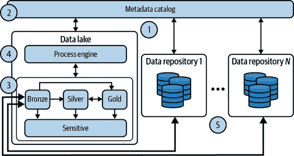

# 第五章：架构设计数据湖

数据湖是数据平台的一部分，从整个组织中捕获原始、未经管理的数据，并支持 Apache 生态系统中的计算工具。在本章中，我们将详细讨论这个概念，这在设计现代数据平台时非常重要。云计算可以为其上可实现的各种用例提供支持，这一点将贯穿本章始终。

我们将从为何希望存储仅支持基本计算的原始、未经管理数据开始进行回顾。然后，我们讨论云中的架构设计和实施细节。尽管最初数据湖仅用于基本数据处理，现在可以通过 API 和连接器与其他解决方案集成，仅使用数据湖就可以民主化数据访问和报告——因为数据湖中的数据可以更适合特定目的。最后，我们将从鸟瞰视角看待通过利用数据科学笔记本在组织内加速分析和实验的一种非常普遍的方法。

# 数据湖与云——完美的结合

数据帮助组织更快做出更好的决策。它是一切应用程序和安全性的中心，更多的数据意味着需要更多的处理能力，而云解决方案可以提供这种能力。

## 本地数据湖的挑战

组织需要一个地方来存储各种类型的数据，包括非结构化数据（图片、视频、文本、日志、二进制文件、网页内容）。这是企业采用数据湖的主要原因。最初，企业认为数据湖只是纯粹的原始存储。

业务部门希望从 IT 部门存储的数据中提取洞察和价值，而不仅仅是存储数据。多亏了 Hadoop 生态系统的演进，数据湖使得能够进行大数据分析的组织能够超越存储卸载的概念。数据湖带来了先进的分析和机器学习能力。在 2010 年代，Hadoop 及相关技术推动了数据湖的大规模采用。

然而，公司在获取数据湖成效方面面临着挑战，因为在总拥有成本（TCO）、可伸缩性、治理和敏捷性等方面存在缺陷。管理本地数据湖的资源利用率和总体成本可能变得难以管理。资源密集型的数据和分析处理经常导致未能达到服务级别协议。数据治理和安全问题可能引发合规性问题。由于资源配置所需的时间，分析实验速度变慢。

据估计，到 2025 年，[80% 的组织数据将为非结构化数据](https://oreil.ly/KxCbZ)，本地环境已不再能够以可承受的价格提供充足的环境。如您在第二章中所见，云解决方案使组织能够首先降低 TCO，然后构建创新平台，因为公司内部的人员可以专注于业务价值而不是硬件管理。

## 云数据湖的好处

云计算范式对数据湖非常有益，因为：

+   不必将所有数据存储在昂贵的、始终开启的 Hadoop 分布式文件系统（HDFS）集群中。对象存储解决方案（例如 AWS S3、Azure Blob 存储或 Google Cloud Storage）是完全托管的、无限可扩展的，成本仅为传统方案的一小部分。

+   Hadoop 集群不仅提供存储能力，还能够在短时间内按需创建处理计算能力（几分钟或几秒钟），由于无需始终开启，这带来了立即的成本节约。这些 Hadoop 集群可以直接从对象存储读取/写入数据，尽管这种数据访问速度比读取/写入 HDFS 要慢，但通过使用临时集群带来的成本节约可能使整体折衷更为合理。

+   超大规模云服务提供商通常提供利用更便宜的虚拟机（称为*竞价实例*或*抢先实例*）作为工作节点的能力。这些虚拟机的缺点是它们可能随时被系统驱逐（通常提前 30 到 60 秒通知），但由于底层的 Hadoop 技术具有工作节点故障容忍性，因此可以轻松地用新的替换。这种方法带来了额外的成本节约。

+   现在，超大规模云服务提供商上提供的大多数 Hadoop 服务都是完全托管的，并以平台即服务（PaaS）模式提供（尽管您可以通过纯 IaaS 服务构建自己的 Hadoop 集群）。PaaS 意味着您无需自行管理所有需要的主节点和工作节点的虚拟机，而是可以专注于构建处理流程以从数据中提取价值。

+   本地的 Hadoop 集群往往在组织内部产生数据孤岛，因为 HDFS 池并未设计为易于数据共享。云计算中，存储（例如，任意 HDFS 集群中可注入的对象存储中的数据）和计算（例如，按需创建的虚拟机）能够有效分离，使组织在处理数据治理挑战时拥有更大的灵活性。

云计算是数据湖的理想栖息地，因为它解决了所有本地数据湖的挑战：总体成本拥有（TCO）、可伸缩性、弹性和一致的数据治理。

市场强烈投资于数据湖，特别是基于云的数据湖。亚马逊 EMR、Azure 数据湖和谷歌云 Dataproc 可在超大规模计算机上使用。Databricks（开源 Spark 引擎的开发者，是所有主要 Hadoop 分发的一部分）构建了一个完整的多云数据平台，不仅提供存储和计算，还提供处理整个数据生命周期所需的全部功能。

接下来，让我们看看云上数据湖的设计与实施细节。

# 设计与实施

数据湖的设计取决于是否需要流处理，如何进行数据治理，使用哪些 Hadoop 功能，以及构建在哪个超大规模计算机上。让我们一一讨论这些问题。

## 批处理和流处理

在分析数据工作负载时，首要问题是要回答要处理的数据的年龄：它是存储已久的数据，还是刚刚到达系统的数据？根据答案，选择数据处理的两种主要方法之一：批处理和流处理。批处理在过去 20 年中一直是主流方法，但随着云计算的出现，流处理在近年来日益流行。流处理更适合实时处理大量数据，而批处理更适合离线处理大量数据。

无论是批处理还是流处理，在数据湖中有四个存储区域：

原始/落地/青铜

数据从源系统直接收集和摄取。

暂存/开发/银

更高级用户（如数据工程师、数据科学家）处理数据，为最终用户准备数据。

生产/黄金

用于生产系统使用的最终数据存储位置。

敏感（可选）

敏感数据所在之处。它连接到所有其他阶段，并促进数据访问治理，以确保符合公司和政府规定。

2014 年，提出了两种新的架构，以允许规模化的批处理和流处理：Lambda（由 Nathan Marz 提出）和 Kappa（由 Jay Kreps 提出）。Lambda 架构（见图 5-1）使用独立的技术堆栈，用于*批处理层*（涵盖所有（历史）事实）和用于实时数据的*速度层*。

###### 图 5-1\. Lambda 架构

新数据进入系统后，同时存储在持久数据集（*批处理层*）和易失缓存（*速度层*）。第一个随后被索引，并可供*批处理视图*的服务层使用，而第二个通过速度层提供*实时视图*。这两个数据集（持久和易失）可以并行或不交叉查询以回答所需问题。这种架构通常部署在 Hadoop 环境中，其中可以利用 HDFS 作为批处理层，而像 Spark、Storm 或 Beam 这样的技术可以用于速度层。例如，Hive 最终可以成为服务层实现的解决方案。

在 Kappa 架构（显示在 图 5-2 中），您可以使用单一技术堆栈（例如，Beam/Spark）同时进行实时和批处理。核心是流式架构。首先，事件流平台存储传入数据。从那里，流处理引擎实时处理数据，使数据可用于实时视图。在此阶段，数据可以持久化到数据库，以便在需要时执行批量分析并利用相同的技术堆栈。

###### 图 5-2\. Kappa 架构

## 数据目录

数据分散在多个站点，包括数据库、数据仓库、文件系统和 Blob 存储。此外，数据可能存储在数据湖的不同区域：原始、暂存、生产或敏感。这使得数据科学家难以找到所需的数据，业务用户难以访问最新数据。我们需要一个解决方案来使所有这些数据源可发现和可访问。

数据目录是描述组织数据集所有元数据的存储库，将帮助数据科学家、数据工程师、业务分析师及其他用户找到通向所需数据集的路径。在 图 5-3 中，您可以看到一个可能的高级架构，描述了数据目录如何连接数据湖和数据平台的其他解决方案。

###### 图 5-3\. 数据目录支持数据处理

如果数据分布在多个数据存储库中（其中一个是数据湖），但处理引擎和用于分析工作负载的 Gold 存储库位于数据湖内，请确保数据目录是全面的，并且数据没有重复。确保元数据包含有关数据集级别的信息（例如，主数据或副本）。

在将主数据集引入和转换到数据湖时，可能需要在计算后进行同步。在 图 5-3 中，您可以看到这种与数据处理的数据目录高级集成：

1.  元数据目录的履行。

1.  搜索所需的数据资产。

1.  如果数据资产尚未存储在数据湖中，则将其复制到 Bronze 存储区域。

1.  在复制的数据资产上执行所需的转换。

1.  根据需要更新原始数据资产。

数据目录可以帮助理清组织可能拥有的各种数据集，因为它可以帮助找到重复的、未使用的或类似的数据集，并根据需要删除、废弃或合并它们。数据目录可以帮助组织专注于对它们最相关的数据，并避免使用资源来存储和处理无用的数据，这可能会带来成本节约。

当数据在组织内共享时，拥有关联的数据合约是有益的。数据合约通常是捕获数据生产者和消费者之间协议的 JSON/YAML 文件，涵盖数据的模式、摄取/发布频率、所有权以及数据访问级别，包括匿名化和数据屏蔽。

## Hadoop 景观

Hadoop 仍然是数据湖在本地和云上的事实标准。数据湖的概念始于 MapReduce 和 Hadoop 技术（参见 “反模式：数据集市与 Hadoop”）。Hadoop 的流行已经持续了 15 年，为数据摄取、存储、处理和可视化创建了丰富的项目生态系统。这导致像 IBM 和 Cloudera 这样的公司开发了商业发行版。Databricks 提供了多云 Hadoop 能力。在 Table 5-1 中，我们列出了框架中一些常用工具按用例划分。

在 Table 5-1 中列出的解决方案可以部署在本地环境中，但也可以通过 IaaS 方法轻松部署在云中。超大规模云计算服务商将这些热门产品转化为完全托管的解决方案，以减轻用户在供应和基础设施管理方面的负担，增加固有的可伸缩性和弹性，并降低成本。 Table 5-1 还概述了云中提供的最流行解决方案，以促进流行的本地 Hadoop 技术的云迁移和采用。

Table 5-1\. Hadoop 环境下的解决方案

| 用例 | 本地部署、Databricks | AWS | Azure | Google Cloud Platform |
| --- | --- | --- | --- | --- |
| 工作流 | Airflow, Oozie | Data Pipeline, Airflow on EC2, EMR | HDInsight, Data Factory | Cloud Composer, Cloud Dataproc |
| 流式摄取 | Apache Kafka, MapR Streams | Kinesis, Kinesis Data Streams, Managed Kafka | Event Hubs | Cloud Pub/Sub, Confluent Apache Kafka |
| 流计算 | Beam, Storm | Beam on Flink, Kinesis Data Streams | Beam on HDInsight, Stream Analytics | Cloud Dataflow |
| SQL | Drill, Hive, Impala | Athena, Redshift | Synapse, HDInsight | BigQuery |
| NoSQL | HBase, Cassandra | DynamoDB | Cosmos DB | Cloud Bigtable |
| 文件系统 | HDFS, Iceberg, Delta Lake | EMR | HDInsight, 数据湖存储 | 云 Dataproc |
| 安全性 | Sentry, Ranger, Knox | AWS IAM | Azure IAM | 云 IAM, Dataplex |
| 批量计算 | Spark | EMR | HDInsight, Databricks | 云 Dataproc, 无服务器 Spark |

在我们审查三大主要云服务提供商的数据湖参考架构时，请参阅表格。

## 云数据湖参考架构

在本节中，我们将审查在公共云中利用三大主要超级扩展者的服务实施数据湖的一些参考架构。与任何云架构一样，没有 *一刀切* 的设计。始终会有几种不同的选择可供选择，可能适合您特定的需求。

### 亚马逊网络服务

AWS 的托管 Hadoop 服务是 Amazon Elastic MapReduce (EMR)。然而，这仅提供分析数据处理。AWS 建议我们更全面地考虑数据湖，并考虑使用 Amazon Athena 或 Amazon Redshift 更好地进行结构化数据的分析。此外，原始数据可能尚未存在于云存储 (Amazon S3) 中，需要进行摄入。因此，在 AWS 上实现数据湖的推荐方式是利用 AWS Lake Formation。这是一个完全托管的服务，可以实现数据收集、数据清洗/处理和数据移动的自动化，以便为分析和机器学习工作负载提供数据。它配备了一个权限服务，扩展了 AWS IAM 的能力，并允许更好地进行数据治理和安全管理（例如，细粒度策略、列级和行级访问控制等）。查看图 5-4 中的架构，我们可以识别以下主要组件：

+   数据源，本例中为 Amazon S3、关系数据库和 NoSQL 数据库

+   存储区域位于 Amazon S3 存储桶之上

+   由 AWS Lake Formation 协调的数据目录、数据治理、安全性和流程引擎

+   分析服务，例如 Amazon Athena、Amazon RedShift 和 Amazon EMR，以提供对数据的访问

###### 图 5-4\. AWS 数据湖架构

此架构适用于管理结构化、半结构化和非结构化数据的任何用例。一旦数据准备和转换完成，即使对于数据湖之外的解决方案（如 Databricks 或 Snowflake），也可以通过 AWS S3 服务的广泛性轻松提供数据，后者可能与平台上的任何其他服务连接。

### 微软 Azure

在 Azure 平台上，有几种实现数据湖的方法，因为有不同的解决方案可以帮助设计可能的目标架构。通常情况下，我们会看到图 5-5，在此架构中，我们可以识别以下主要组件：

Azure 数据湖存储 Gen2 (ADLSG2)

针对大量数据进行优化的对象存储，与 HDFS 完全兼容，并且通常由用户实现数据湖的所有数据区域

Azure Data Factory

无服务器解决方案，用于摄取、转换和操作数据

Azure Purview

提供治理的解决方案，用于在数据范围内查找、分类、定义和执行策略和标准

Azure Synapse Analytics

用于针对存储在 ADLSG2 中的数据发出 SQL 查询的分析服务

Databricks

基于 Spark 处理引擎的完整分析和 ML 解决方案

Power BI

业务智能（BI）报告和可视化工具

###### 图 5-5\. Azure 数据湖架构

需要注意的是，Azure Databricks 可以与 Azure HDInsight 互换使用。两者的主要区别在于，Databricks 是基于 Apache Spark 的分析平台，经过优化以适配 Microsoft Azure 云服务平台，而 HDInsight 是一个托管的完整 Apache Hadoop 分发版（即不仅限于 Spark 工具，但对 Azure 的适配程度较低）。如果您想使用标准的 Hadoop 生态系统解决方案，应选择 HDInsight；而如果您倾向于利用基于 Spark 的完整分析和 ML 解决方案，应选择 Databricks。

###### 注意

尽管 Databricks 可在所有主要云提供商上使用，但其与 Azure 的本地紧密集成使其独特之处在于，它可以被视为一种第一方服务，而不是第三方服务。

### Google Cloud Platform

在 Google Cloud Platform（见图 5-6），各个无服务器和完全托管的组件通过 API 相互通信。我们可以识别出以下主要组件：

Data Fusion

一种用于批处理和流处理数据摄取和转换的解决方案

Pub/Sub

用于集成从 Data Fusion 输入的输入和由 Dataproc 交付的 Hadoop 集群的消息中间件

Dataproc

提供按需 Apache Hadoop 集群，提供 HDFS、Spark 和非 Spark 能力

云存储

实现数据区域的对象存储解决方案

Bigtable 和 BigQuery

分析和实时数据处理引擎

Looker/Looker Studio

BI 和可视化解决方案

Dataplex

一个统一的界面，用于处理数据治理、数据目录和安全性

Composer

基于 Apache Airflow 的数据工作流编排服务，使用户能够编写、调度和监控管道

###### 图 5-6\. Google Cloud Platform 数据湖架构

根据您的使用案例，Hadoop 或 HDFS 集群可能并不总是最合适的选择。将数据存储在云存储中使您能够根据手头工作选择合适的工具，而不是仅限于 HDFS 集群上可用的工具和计算资源。例如，许多临时 Hive SQL 查询可以轻松迁移到 BigQuery，后者可以使用其本地存储或直接从云存储读取/查询。类似地，流式应用程序可能更适合于 Apache Beam 流水线，这些可以在 Dataflow 上运行，Dataflow 是一个完全托管的流式分析服务，通过自动缩放和批处理大大减少了延迟、处理时间和成本。

###### 注

在选择云供应商时，您还应考虑其提供的本地数据集。例如，在市场营销或广告领域，利用这些数据集实施业务解决方案可能会产生非常大的影响。一些数据集的例子包括 AWS 上的开放数据、Google Cloud 的公共数据集和 Azure 的开放数据集。如果您在 Google 上进行广告投放或在亚马逊上销售产品，这些公司不同部门之间及其各自云平台之间的现成集成可能特别有帮助。

现在您已经熟悉了云数据湖的参考架构，让我们深入探讨如何通过第三方解决方案扩展数据湖。

# 集成数据湖：真正的超能力

数据湖技术因其能够处理任何类型的数据而变得流行，从结构化的表格格式到文本或图像等非结构化文件。这使得许多以前不可能的用例得以实现，例如通过对发票进行文本分析来分析供应商、识别电影场景中的演员，或实现实时仪表盘以监控电子商务网站上的销售情况。数据湖的超能力在于它能够将数据与无限数量的处理引擎连接起来，从而激活您可能有的任何用例。

## 扩展湖的 API

在数据湖中，数据摄取过程始于原始数据被导入到登陆区。数据摄取后，必须进行处理（可能涉及多次传递），然后才能进行可视化和激活。每个步骤可能涉及数据湖本身或云中托管的各种引擎，或者在某些情况下是本地第三方产品。

为了使位于混合环境中的不同系统能够通信和交换数据，可以使用 API。API 是允许两个或更多系统通过共享的协议（例如 HTTPS 和 gRPC）进行通信的软件组件。大多数现代应用程序使用 API 来集成服务和交换数据。即使存在特定连接器，它们通常也是构建在 API 之上的。您可以将 API 视为数据可以从一个系统流向另一个系统的高速公路。用于保护数据流量的安全措施是收费站，速率限制则是速度限制。由于这些高速公路，数据可以在多个系统之间流动，并且可以由任何类型的处理引擎处理，从标准 ETL 到现代 ML 框架如 TensorFlow 或 PyTorch。

组织可以通过 API 将其数据湖演化到所需的外部服务。API 还可用于监视、配置、调整、自动化，当然还包括访问和查询湖本身。

## 使用 Apache Iceberg、Apache Hudi 和 Delta Lake 推动数据湖的演进

将数据湖与其他技术集成的主要目标是扩展其能力，超越 Hadoop 框架提供的开箱即用功能。在考虑标准的 Hadoop 堆栈时，通常有一个缺失的元素，这通常由其他技术（例如在线事务处理[OLTP]数据库）处理：ACID 事务管理。Apache Iceberg、Apache Hudi 和 Delta Lake 是构建在 HDFS 之上的开源存储层，专门解决了这一关键方面。虽然它们各自具有一系列不同的功能（例如，Apache Iceberg 支持比 Apache Hudi 和 Delta Lake 更多的文件格式），但也有一些共同的元素：

+   符合 ACID 标准，确保用户查询的信息一致性

+   克服 HDFS 在文件大小方面的固有限制——使用这种方法，即使是小文件也可以完美运作

+   记录对数据所做的每一次更改，确保在必要时进行完整审计，并支持时间旅行查询

+   处理批处理和流式输入和处理没有差别

+   与 Spark 引擎完全兼容

+   基于 Parquet 格式的存储，能够实现高水平的压缩

+   支持流处理

+   能够将对象存储视为数据库

+   在行和列级别应用治理

这些存储解决方案可以启用通常由其他技术处理的几个用例（例如数据仓库，我们将在第六章中详细研究），主要是因为能够防止数据损坏、以非常快的模式执行查询并频繁更新数据。这些新的启用存储的事务特性非常特定，发挥着至关重要的作用——这些特性与 GDPR 和加利福尼亚消费者隐私法案（CCPA）相关。根据这些法规，组织被迫具备根据特定请求清除特定用户相关个人信息的能力。在标准 HDFS 环境中执行此操作可能是耗时且资源消耗大的，因为必须识别、摄入、过滤和写入新文件，并删除原始文件中与请求的个人数据相关的所有文件。这些新的 HDFS 扩展简化了这些操作，使其易于快速执行，更重要的是，可靠性高。

这些开源项目已被社区广泛采用，并且社区正在大力投资它们的开发。例如，Netflix 广泛使用 Apache Iceberg，而 Uber 的数据平台则由 Apache Hudi 驱动。尽管 Delta Lake 是 Linux 基金会的项目，但其主要贡献者是 Databricks，这是开发和商业化了整个基于供应商专有版本的 Spark 和 Delta Lake 的大数据工作负载处理套件的 Spark 引擎背后的公司。

除了 ACID 之外，还有两个功能正在改变用户在数据湖中处理数据的方式：

分区演化

这是更新文件（即表格）上的分区定义的能力。分区是允许文件系统将文件内容分割为多个块的信息，以避免在检索信息时完成全面扫描（例如，提取 2022 年第一季度的销售数据时，您应该能够仅查询属于该年度第一季度的数据，而不是查询整个数据集然后过滤掉您不需要的数据）。考虑到文件中分区的定义可能因业务需求（例如，我们想要收集洞察力的设备的工作时间）而演变，因此具有能够以透明且快速的方式处理这些变化的文件系统至关重要。从逻辑角度来看，HDFS（通过 Hive）可以实现这一点，但所需的计算工作使其实际上难以实现。请注意，在撰写本文时，此功能仅由 Apache Iceberg 提供。

模式演化

就像分区一样，模式可能需要随时间更新。您可能希望在表中添加、删除或更新列，而文件系统应能够在不重新转换数据（即无需 ELT/ETL 方法）的情况下大规模执行此操作。请注意，尽管在撰写本文时，只有 Apache Iceberg 完全支持此功能，但所有解决方案都能够在利用 Apache Spark 作为引擎时处理模式演化。

现在您已经看到如何扩展数据湖的能力并丰富可以用它们解决的广泛用例集，让我们看看如何实际与数据湖进行交互。

## 使用笔记本进行交互式分析

处理数据时最重要的一点是能够以非常简单且快速的方式交互式地访问数据并执行分析。在利用数据湖时，数据工程师、数据科学家和业务用户可以利用大量服务（如 Spark、Pig、Hive、Presto 等）处理数据。在几个社区中，尤其是在数据科学家中，一种大受欢迎的解决方案被认为是组织在数据分析中可以利用的最佳瑞士军刀：Jupyter Notebook。

Jupyter Notebook 是一个开源应用程序，用于编写包含文本、待执行代码、绘图和图表的*实时文档*。它可以被视为一个实时书籍，在您使用类似 Markdown 的标记语言编写文本的同时，还有执行一些数据操作（例如查询、转换等）的代码，并最终绘制一些结果，生成图表或表格。

从架构角度来看，您可以将 Jupyter Notebook 视为在数据湖顶层运行的三个不同组件，如图 5-7 左侧所示。HDFS 是存储，内核是处理引擎，而 Jupyter 是利用处理引擎访问数据，并通过浏览器为用户提供笔记本内容编写和执行的服务器的界面。有几种内核可供利用（例如机器学习常用的 PyTorch），但数据工程中最常见的选择是 Spark，可以通过 Python 编程语言编写的 PySpark 访问（如图 5-7 右侧所示）。

###### 图 5-7. Jupyter 通用笔记本架构和基于 Spark 的内核

一旦正确配置，您可以立即在笔记本中直接编写文本和代码，并与数据集进行交互，就像在利用 Spark 命令行界面时那样。您可以使用笔记本开发和与组织内的其他人员共享代码，执行快速测试和分析，或快速可视化数据以获取额外的洞察。需要强调的是结果不是 *静态* 的，因为它们是 *活动* 文档：这意味着如果底层数据集发生变化或代码段变更，当与笔记本共享的人重新执行笔记本时，结果将不同。分析完成后，通常有两条不同的路径可供选择：

+   与其他数据科学家、数据工程师、开发人员或任何希望贡献的人分享笔记本的源代码（Jupyter Notebook 生成 *.ipynb* 文件）。他们可以在其环境中加载文件并重新运行代码（当然需要具备对底层存储系统及通过 API 集成的任何其他解决方案的正确访问权限）。

+   通过生成 HTML 页面或 PDF 文档使结果静态化，可以与更广泛的用户群共享。

笔记本已经成为互动数据分析、测试和实验的事实标准解决方案，这是因为它们极其灵活，无论是在可以利用的编程语言（多亏了众多可用的内核），还是在可以进行的活动方面（例如，您可以从数据湖中的数据生成图表，或者在将复杂的机器学习算法应用于数据的小子集之前进行训练）。

我们与几家组织合作时看到的情况是，*笔记本方法* 是推动 *数据民主化之旅* 的第一步（我们将在下一节讨论），因为它允许技术上更有能力的人立即和标准化地访问数据，促进协作方式。虽然数据科学家是笔记本使用的先驱，但数据工程师和分析工程师也在继续采用它们。我们甚至看到一些公司开发了自定义库，以便包含在 *笔记本模板* 中，旨在促进与多种其他解决方案（现成或自定义开发的）的集成，将标准化提升到另一个层次，并减少最终用户（甚至是痛苦的）学习曲线。由于容器技术的存在，这种标准化甚至已经扩展到计算层面：每当公司内的用户启动笔记本时，实际上是在后台启动一个具有适当数量计算资源和一组工具的容器，这些工具立即可供其用于数据分析。

云超大规模供应商正在提供一些解决方案的托管版本，如 AWS SageMaker、Azure ML Studio 和 Google Cloud Vertex AI Workbench，这些解决方案可以帮助消除与基础架构管理相关的头疼问题，因为它们是完全托管的。

现在你更好地理解了如何利用 Jupyter Notebook 扩展数据湖，我们将把注意力转向帮助你理解组织内部如何处理从数据摄入到数据可视化报告的数据，从完全的 IT 模式转向更为民主的方法。

# 数据处理和报告民主化

数据为组织提供的最大价值在于它使决策者和普通用户能够做出知情决策。为此，任何授权的个人都应能够访问和使用数据，而无需临时专业知识和专长。即使从技术角度来看实现数据访问的民主化在公司内是可能的，但仅专注于技术是不够的。组织还需要实施数据目录和治理操作。拥有描述正确数据集的良好元数据将使用户能够找到他们所需的正确信息，并激活正确的数据处理和报告。在本节中，我们将探讨关键技术，帮助组织从完全由 IT 驱动的方法转向更为*民主化*的方法，建设云数据湖。

## 在数据中建立信任

当这本书的一位作者几年前为一家重要的零售客户担任顾问时，他努力开发解决方案，自动从销售数据库中提取数据以生成报告，供业务用户利用。每当决策者有以下问题时，他都需要随时可用：

+   你从哪里获取这些数据的？

+   你是如何转换这些数据的？

+   在生成报告之前，你进行了哪些操作？

一旦他被分配到另一个客户那里，组织的 IT 团队接管了整个端到端的过程。虽然他们可以修复错误并监控报告生成，但他们无法说服决策者数据和报告是可信的，因为他们没有足够的知识水平来回答这些问题。

这种信任显然是一个瓶颈，通过使最终用户能够自主地挖掘数据并从摄入到最终报告的值进行审计，这个瓶颈可以消除。过去这种方法可能是不现实的，但现在人们更加*数字化经验丰富*，有助于转变这种方法。

如图 5-8 所示，从左边代表的旧世界向右边代表的新世界，责任和所有权的明显转变。尽管大部分工作过去由 IT 部门完成，但如今最终用户手中拥有能够处理从数据编目到数据可视化的大部分活动的工具，具备很高的自治权。

###### 图 5-8\. 数据访问方法（集中管理 versus 民主数据访问）

工具如 Atlan、Collibra、Informatica、AWS Glue、Azure Purview 和 Google Dataplex 正在使元数据收集过程变得更加简单和快速。一方面，已经构建了大量自动化功能，以实现自动化数据爬取，特别是通过与多个数据库和存储引擎集成（例如 AWS Redshift 和 Athena、Azure Synapse、Google BigQuery、Snowflake 等），另一方面，通过使用丰富且易于使用的用户界面促进数据录入活动，让业务人员能够执行大部分工作。

向上走一步，我们发现即使是数据处理、准备、清洗和整理步骤，这些步骤通常是专为专业用户（即数据工程师）设计的，现在也可以直接由最终用户处理。当然，数据处理的一部分仍然可能需要数据工程师/数据科学家利用像 Spark 这样的先进流程引擎来完成。对于需要主题专家（SMEs）参与的活动，开发和提供的工具如 Talend Data Preparation 或 Trifacta Dataprep 旨在支持非数据工程师/数据科学家用户：探索、转换和过滤只是可以实现的几个活动，利用非常直观的界面将处理委托给底层引擎（例如 Beam），该引擎可以对大型数据集应用所有变更。这种方法甚至强调了访问基础数据的事实，这些数据位于 HDFS 集群上或直接存储在像 AWS S3、Azure Data Lake 或 Google Cloud Storage 这样的对象存储上，可以通过多种不同的工具实现，这些工具提供了广泛的功能和控制。这意味着不同类型的用户可以利用不同类型的工具处理数据。例如，数据工程师可以利用 Spark 开发其数据转换管道；数据科学家可以使用 scikit-learn、TensorFlow 或 PyTorch 实施机器学习算法；业务分析师可以使用 Hive 或 PrestoSQL 使用 SQL 查询执行假设分析。

最后一步是数据可视化/报告，通常是企业用户自行执行的最简单步骤。在这里，有许多解决方案可以利用（例如，Microsoft Power BI、Looker、Tableau 和 Qlik，仅举几例），这些解决方案为用户提供了所需的灵活性。用户在这个阶段往往自然而然地独立进行，因为这些工具在某种程度上与他们在 Excel 中所熟悉的方法相似，所以用户不需要很陡的学习曲线即可精通。数据可视化、商业智能和假设情景分析是企业用户通常可以轻松执行的分析工作。

即使原始数据始终由 IT 部门管理，但在与第三方服务集成的某些情况下，企业用户可以自主将数据摄入数据湖。因此，对数据内容的信任以及不同业务单位摄入的数据集的质量和正确性的相关需求正在增长。管理数据资产以确保企业用户可以访问高质量、一致且易于访问的数据的过程，即“管理”，正在成为解决这一问题的关键因素的组合。

+   及时识别具有正确信息的关键利益相关者。

+   保护数据免受任何内部和外部的外泄，重点放在人员方面。

+   与公司内外的其他人合作，解锁数据的价值。

在许多公司中我们所看到的是，管理并不一定是人们被分配的角色，而更多是由于他们与工具的互动以及他们提供给内部社区的信息质量而获得的头衔。事实上，有几种工具（例如 Informatica Data Catalog）允许用户像亚马逊上的买家评价卖家一样评价数据管理者。

现在，您已经看到了将组织引向更现代和民主方法的各种选择，让我们讨论这个过程中仍然主要由 IT 团队掌控的部分：数据摄入。

## 数据摄入仍然是 IT 事务

在数据湖中，最关键和重要的步骤之一是数据摄取过程。如果规划不当，数据湖可能会变成“数据沼泽”，积累大量未被使用的数据。这通常发生在组织倾向于将各种原始数据加载到数据湖中，即使他们并没有完全理解为什么要加载这些数据，或者如何利用这些数据。这种方法会导致大量未被使用的*数据堆积*，这些数据大部分时间都不会被使用。但即使未被使用的数据仍然留在湖中，并占用本应为其他活动所空闲的空间。陈旧的数据也往往存在缺失和不一致性，并在最终被使用时引发难以解决的错误。因此，在摄取过程中遵循以下最佳实践非常重要，您可以在摄取过程中利用这些实践：

文件格式

有几种文件格式可以利用，各有优缺点。如果主要目标是可读性，则 CSV、JSON 和 XML 是最常见的格式。如果性能是最重要的目标，则 Avro、Parquet 或优化行列（ORC）更为合适：

+   当需要强大的 I/O 和低延迟操作时（例如基于事件的源、流式仪表盘），Avro（基于行的格式）表现更好。

+   Parquet 和 ORC（基于列的格式）更适合查询使用情况。

文件大小

通常在 Hadoop 世界中，*越大越好*。文件通常具有数十 GB 的大小，当处理非常小的文件（例如 IoT 使用场景）时，利用流引擎（如 Apache Beam 或 Spark Streaming）将数据合并为少量大文件是一个好主意。

数据压缩

数据压缩对于节省空间非常重要，特别是在每天可能摄取 PB 级数据的数据湖中。此外，为了保证性能，选择一个能够在运行时快速压缩/解压数据的压缩算法至关重要，从而节省大量空间。标准的 ZIP 压缩算法通常不适合此类应用，我们看到组织倾向于利用由 Google 开发的 Snappy，这是一个开源算法，提供与数据湖需求对齐的性能。

目录结构

这是一个非常重要的话题，因为根据用例和要利用的处理引擎，你的目录结构可能会有很大变化。举个例子，通过 HBase 处理的物联网用例：假设你正在全球各地的设备中收集数据，并且想要从特定位置的设备生成的消息中提取特定日期的信息。一个好的目录结构示例可能是*/country/city/device_id/year/month/day/hours/minute/second*。如果用例是批处理操作，将输入数据放入名为 IN 的文件夹中，并将输出数据放入名为 OUT 的文件夹中可能会很有用（当然，必须用最佳前缀标识以避免误解和数据重复）。

根据数据的性质（批处理与流处理）和数据的目标（如 AWS S3、Azure Data Lake Storage、Google Cloud Storage），可以利用多种解决方案：用户可以使用脚本（例如 PowerShell 或 bash）加载数据，也可以使用 API 或本地连接器直接将数据摄入。用户可以将数据直接流入平台（如 AWS Kinesis、Azure Event Hub 或 Google Pub/Sub），或者将其作为原始文件上传到 HDFS 以供将来处理。IT 部门通常管理这些活动，因为它们可能涉及大量自动化以及需要专门技能的集成/数据处理。然而，像 Fivetran 这样的解决方案正在简化用户配置数据摄入到云端的方式。对于这样的解决方案，甚至较少技术技能的人（例如业务用户）也可能加载数据到数据湖中，扩展我们之前讨论过的民主化概念。

现在你已经了解了如何使数据访问民主化，让我们从高层次来看看数据湖如何促进机器学习算法的训练和预测。你将在第十一章中了解更多相关内容。

# 数据湖中的机器学习

正如我们之前讨论过的，数据湖可以存储任何类型的数据以其原始格式存在，这与数据仓库不同，数据仓库中的数据需要结构化或半结构化。特别是，可以存储非结构化数据（图片、视频、自然语言等）以其典型格式（JPEG、MPEG、PDF 等）存储。这使得将各种类型的数据引入数据湖变得非常方便，然后可以用于开发、训练和预测机器学习算法，特别是基于深度学习的算法（参见“应用 AI”）。

## 基于原始数据的训练

您将使用的典型 ML 框架取决于数据的类型。对于结构化数据，可以利用类似 Spark、XGBoost 和 LightGBM 的库。这些框架可以直接读取和处理 CSV 文件中的数据，而这些文件可以原样存储在数据湖中。对于非结构化数据，最常用的 ML 框架是 TensorFlow 和 PyTorch。这些框架可以以其原生形式读取大多数图像和视频格式，而原始数据也将以这种形式存储。因此，在 图 5-9 中，我们详细介绍了 ML 模型训练步骤时，准备的数据可以与收集和存储的数据完全相同，标签可以作为数据的一部分——可以是 CSV 文件中的一列，也可以基于图像/视频的组织方式（例如，所有螺丝图像可以存储在名为 *screws* 的文件夹中）。这使得在数据湖上训练 ML 模型变得非常简单。

###### 图 5-9\. ML 模型训练步骤

然而，还需要考虑一些效率问题——直接读取 JPEG 或 MPEG 文件将导致 ML 训练程序受到 I/O 限制。因此，数据通常会被提取并以 TensorFlow Records 等格式存储在数据湖中。这些格式优化了从云存储中读取时的吞吐量，有助于最大化 GPU 利用率。GPU 制造商还提供了能力，可以直接从云存储读取常见格式，如 Apache Arrow，到 GPU 内存中，从而加速 ML 过程。

## 在数据湖中进行预测

因为 ML 框架直接支持原始格式数据的读取，因此在原始数据上调用模型也非常简单。例如，在 图 5-10 中，我们展示了在 AWS 上的图像分类工作流程。请注意图像原封不动地被摄入到云存储桶中，并且 ML 模型在上传的图像上被调用。类似的功能也在 GCP 和 Azure 中提供，我们将在 第十一章 中更详细地讨论。

###### 图 5-10\. 在 AWS 上上传到数据湖中的图像进行的 ML 推断

如果选择数据湖作为主要平台，还应考虑使用开源项目 MLflow 来实现端到端的 ML 工作流程。数据存储在数据湖中，通常使用 Spark 进行分布式训练，尽管也存在与 TensorFlow 和 PyTorch 的集成。除了训练和部署外，MLflow 还支持高级功能，如模型注册表和特征存储。在 ML 框架中直接处理原始数据的能力是数据湖的一个引人注目的优势之一。

# 总结

在本章中，您更详细地了解了真实数据湖的概念，挑战以及可以采用的模式，使其成为组织数据平台的核心支柱。关键点如下：

+   数据在每个组织中发挥关键作用，以帮助在短时间内做出健壮的决策，可能是实时的。

+   数据湖比数据仓库更灵活，因为它允许用户处理任何类型的数据（即结构化、半结构化甚至非结构化数据），并利用来自开源生态系统的各种解决方案和工具。

+   组织在旧的本地环境中管理数据湖时遇到了困难。云环境是组织存储数据、降低 TCO 并专注于业务价值而非硬件管理的良好解决方案。

+   云采用的主要优势包括：（1）通过节省存储和计算成本来降低 TCO；（2）通过利用超大规模的扩展性来获得可扩展性；（3）采用快速失败的方法，通过利用底层平台的弹性加快实验速度；以及（4）通过平台上一致的数据治理方法从多个产品中获益，以符合安全性和控制要求。

+   在数据湖中有描述组织数据集的所有元数据存储库，这将帮助数据科学家、数据工程师、业务分析师以及任何可能需要利用数据找到所需数据集路径的用户。

+   数据湖实现了批处理和流处理操作，并促进了 Lambda/Kappa 模式的实施。

+   市场正在大力投资于数据湖，特别是基于云的数据湖。因此，可以通过利用 API 或与第三方解决方案集成来扩展数据湖。

+   一个常见的集成是在 HDFS 顶部采用 Iceberg 或 Delta Lake，使存储符合 ACID，并启用其他类型的用例（主要是那些要求数据强一致性的用例）。

+   Jupyter Notebook 是在组织内实现数据分析、实验和基于测试方法的最常见途径。

+   数据湖促进了组织内数据民主化的访问，因为大部分活动可以基于自助服务进行。

+   因为数据在数据湖中以原生格式存储，并且因为 ML 框架支持读取这些格式，所以数据湖可以在没有任何特殊钩子的情况下促进 ML。

在接下来的章节中，我们将探讨数据湖的替代方案，即数据仓库。
