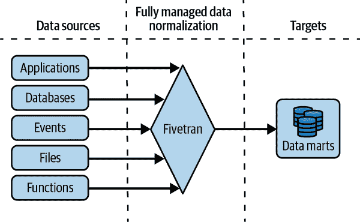

# 第六章：通过企业数据仓库进行创新

在第三章中，您了解到选择作为云数据平台中心组件的数据湖或数据仓库的选择取决于您的组织是以工程/科学为先（选择数据湖）还是以分析为先（选择数据仓库）。在第五章中，我们专注于将数据湖作为数据平台设计的中心要素的概念。在本章中，您将学习如何使用现代数据仓库作为中心要素来解决成本、民主化、灵活性和治理等问题。

我们将从快速回顾构建数据平台所解决的问题开始，并讨论使云数据仓库成为一个吸引人解决方案的技术趋势。然后我们将深入探讨现代数据仓库架构的外观以及如何有效地使用它来启用数据分析师和数据科学家。

# 现代数据平台

每当你开始一个大型技术项目时，你应该首先问自己，你试图实现什么业务目标，你当前的技术挑战是什么，你想利用什么技术趋势。在本节中，我们将重点帮助您理解在构建现代数据平台时如何解决这些问题，以及企业数据仓库方法如何引导您的数据平台设计。这些概念在前几章中已经被提及，但在这里重新框架它们是有用的，因为它将帮助您将现代数据仓库的设计与架构解决的问题联系起来。

## 组织目标

在我们的客户访谈中，CTO 们反复提到这些组织目标是非常重要的：

无信息孤岛

数据必须在整个企业中激活，因为业务的一个部分的用户需要访问其他部门创建的数据。例如，确定如何设计明年产品的产品经理可能需要访问由零售运营团队创建和管理的交易数据。

民主化

数据平台必须支持领域专家和其他非技术用户，他们可以直接访问数据，而无需通过技术中介，但应该能够依赖数据的质量和一致性。

可发现性

数据平台必须支持数据工程师和其他需要在不同处理阶段访问数据的技术用户。例如，如果我们有一个数据集，其中原始的传入交易已经被对账，数据科学家需要能够获取对账后的数据集。如果他们找不到它，他们将重建一个对账例程。因此，应该能够发现所有这些“中间”数据集，以确保处理步骤不会在整个组织中重复。

管理

数据集应该由了解其内容的团队控制。例如，财务数据应该由财务部门控制，而不是由 IT 部门控制。

单一数据源

数据应该在原地读取。尽量减少数据的复制和提取。

安全性和合规性

IT 部门应作为数据的经纪人，确保只有具有正确权限的人可以访问数据。必须实施符合法规要求的所有合规性检查（例如 GDPR、CCPA、格拉姆-利奇-布莱利法案）。确保实施将数据分类为敏感/受限数据与开放或行业特定数据的解决方案。

使用便捷性

让报告更容易，因为有数百分析师在创建支持各种功能的报告。

数据科学

提高数据科学团队的生产力，因为这些角色往往成本高且难以招聘。

敏捷性

让决策者更快地获得洞见。

虽然这些目标的相对顺序在组织之间有所不同，但我们与每个组织交谈时所有这些目标都以某种方式存在。因此，现代数据平台应该使 CTO 们能够实现这些目标。

## 技术挑战

CTO 们在组织内部已经部署的技术中实现这些目标有什么阻碍？CTO 们往往会提到以下技术挑战：

规模和规模

组织收集的数据量随时间急剧增加，并预计将继续增加。他们当前的系统无法扩展，并且无法在业务的速度和成本约束内保持，导致妥协，如对进入的数据进行抽样或大量优先考虑新数据项目。

复杂的数据和使用案例

越来越多的数据是非结构化数据——图片、视频和自然语言文本。他们当前管理结构化和非结构化数据的系统没有交集。然而，在推荐等使用案例中，使用结构化数据（例如产品目录详细信息）和非结构化数据（例如目录图片、用户评论）的需求越来越多。

集成

随着时间的推移，我们看到技术领域出现了许多新的数据源和数据接收端，组织应该和希望利用这些数据。例如，他们希望在 Salesforce 中管理销售信息，在 Adobe 中管理广告活动，在 Google Analytics 中管理网站流量。需要同时分析和决策所有这些数据。

实时性

大部分新数据是实时收集的，能够在数据到达时处理并做出决策具有竞争优势。然而，组织缺乏无缝支持流式处理的数据平台。

当然，这些只是传统大数据挑战的更细化版本：数据量、数据和系统的多样性以及数据的速度。

## 技术趋势和工具

为了帮助组织实现这些业务和技术目标，云架构师可以利用前面章节中描述的趋势和工具。为方便起见，我们在此处对它们进行了总结：

计算与存储分离

公共云提供者允许您在 Blob 存储上存储数据，并从临时计算资源中访问它。这些计算资源包括 Google BigQuery、AWS Redshift、Snowflake、Amazon EMR、Google Dataproc、Cloud Dataflow 或 Databricks 等软件，这些软件是定制或适应了这种计算与数据处理分离的优势，并将数据处理分布到多个工作节点上。它们涵盖结构化和非结构化数据。

多租户

云计算资源被设计成允许多个租户使用。因此，组织无需为每个部门创建单独的集群或存储阵列。因此，两个不同的部门可以将它们的数据存储在单个数据仓库中，并从它们各自支付的计算资源中访问对方的数据，每个团队可以在共享的常用数据集上启动自己的分析。类似地，组织可以利用自己的计算资源访问多个组织的数据，并对联合数据集进行分析。与传统的 Hadoop 集群不同，不需要在数据的同一位置运行计算工作负载。

认证与授权分离

云 IAM 解决方案可以确保中央 IT 团队安全管理身份，同时数据所有者控制访问权限。实际上，通过提供对组的访问权限，允许访问组织管理成员资格，而数据所有者仅管理指定团队的业务逻辑以提供访问权限。

分析中心

无服务器数据仓库（以及我们在前一章节中看到的数据湖）允许架构师在组织边界之外打破数据孤岛。数据所有者支付存储费用，而数据使用者支付查询费用。此外，数据所有者决定哪些组有权限访问，而组的成员资格可以由数据使用者管理。因此，合作伙伴和供应商可以共享数据，而无需担心查询成本或组成员资格。

多云语义层

诸如 Informatica 或 Looker 的工具使得可以创建跨超大规模云（如 AWS、GCP 或 Azure）、多云数据平台（如 Snowflake 或 Databricks）以及本地环境的语义层。语义层可以即时重写查询，提供一致和连贯的数据字典。（请注意，语义层将在本章后面更详细地介绍。）

一致的管理界面

数据布局解决方案在公共云上提供一致的管理体验，无论数据存储在数据仓库还是数据湖格式（如 Blob 存储上的 Parquet 文件）中。

跨云控制面板

诸如 BigQuery Omni 这样的工具提供了一个一致的控制面板和查询层，无论您的组织使用哪个超大规模云平台（AWS、GCP 或 Azure）存储数据。这些工具在确保可以不受特定数据集存储在哪个超大规模云存储中影响时非常有用。但这也增加了对 GCP 控制面板的依赖性。

多云平台

Snowflake、Confluent 和 Databricks 提供了在任何超大规模云上运行相同软件的能力。然而，与上述不同的是，不同云上的运行时仍然是独立的。这些工具在确保能够从一个超大规模云平台迁移到另一个平台时非常有用。但这也增加了对单一软件供应商的依赖性。

数据湖与数据仓库的融合

使用联合查询和外部查询可以在数据仓库（DWH）中运行 Spark 作业，并在数据湖中运行 SQL 查询。我们将在下一章节中详细讨论这个主题。

内置机器学习

企业数据仓库如 AWS Redshift 和 Google BigQuery 提供了在不移出数据的情况下训练和运行机器学习的能力。Spark 拥有 ML 库（Spark MLlib），而像 TensorFlow 这样的 ML 框架也受到 Hadoop 系统的支持。因此，可以在数据平台上执行机器学习，而不必将数据提取到单独的 ML 平台。

流式摄取

工具如 Kafka、AWS Kinesis、Azure Event Hub 和 Google Cloud Pub/Sub 支持实时将数据落入超大规模云数据平台。AWS Lambda、Azure Functions、Google Cloud Run 和 Google Cloud Dataflow 等工具还支持在数据到达时进行数据转换，以进行质量控制、聚合或语义修正后再写出。

流式分析

数据仓库支持流式 SQL，因此只要数据实时落入数据仓库，查询就反映最新数据。

变更数据捕获

工具如 Qlik、AWS 数据库迁移服务 和 Google Datastream 提供捕获操作关系数据库（如运行在 AWS 关系数据库服务 [RDS] 上的 Postgres 或运行在 Google Cloud SQL 上的 MySQL）变更并实时流式传输到数据仓库的能力。

嵌入式分析

可以使用现代可视化工具如 Power BI 将分析嵌入到最终用户使用的工具（手机或网站）中——不需要让最终用户操作仪表板。

*中心集线架构* 提供了实现 CTO 所期望目标并利用上述技术能力的可靠方法。

# 中心集线架构

在设计以现代云数据平台为中心的 DWH 时，集线器和辐式架构是理想的架构。在这种架构中，DWH 充当了收集业务分析所需所有数据的*集线器*。*辐*是定制应用程序、仪表盘、ML 模型、推荐系统等，通过标准接口（即 API）与 DWH 交互。工具如 Sigma Computing、SourceTable 和 Connected Sheets 甚至提供了一种电子表格界面，模拟在 DWH 顶部运行的 Excel。所有这些辐可以直接从 DWH 访问数据，而无需复制。

我们建议这种方法适用于没有遗留技术需要适应的初创公司，希望进行全面重建以实现全面转型的组织，甚至是大型企业，因为它具有可扩展性、灵活性和弹性。

它具有可扩展性，因为新的（现代的）DWH 可以轻松集成新的数据源和用例到现有的基础设施，而无需重新配置整个系统。它灵活，因为可以根据企业的特定需求定制整体架构（例如启用流式处理）。而且它具有弹性，因为它可以承受比其他架构更多的故障。

现代云原生企业 DWH 形成集线器和辐式架构的集线器，辐是数据提供者和数据消费者，如图 6-1 所示。请在阅读以下段落时参考图表的组成部分。


###### 图 6-1\. 集线器和辐式架构；现代企业 DWH 形成集线器

一个以分析为先的数据和 ML 能力包括将原始数据加载到企业数据仓库（*企业数据仓库*），然后根据需要进行转换以支持各种需求。由于计算和存储分离，数据只有一个唯一的副本。不同的计算工作负载，如查询（*查询 API*）、报告/交互式仪表板（*商业智能报告工具*）和 ML（*数据科学和 ML 工具*），都可以在这些数据之上进行操作，这些数据位于数据仓库中。由于可以利用 SQL 进行所有转换，您可以使用视图和物化视图来进行详细说明，从而使 ETL 管道变得不必要。这些视图可以调用外部函数，因此可以使用 ML API 和模型丰富数据仓库中的数据。在某些情况下，甚至可以仅使用 SQL 语法训练 ML 模型，并且可以通过简单的 SQL 命令调度复杂的批处理管道。现代数据仓库支持直接摄取（*加载 API*）甚至流数据（*流式 API*），因此您必须在需要对数据进行低延迟、窗口聚合分析时利用流式管道。始终记住评估您解决方案的最终成本，并将其与您将获得的收益进行比较。有时一个策略（批处理）可能比另一个策略（流处理）更好，反之亦然。

轮毂和辐条结构背后的关键思想是尽可能高效地将所有数据落入企业数据仓库。当数据来自 SaaS 软件（例如 Salesforce）时，您可以通过计划的自动导出机制加载它。而当数据来自像 PostgreSQL 这样的*运营数据库*时，您可以通过 CDC 工具实时地将其落入数据仓库。同时，*实时数据源*预期在发生新事件时向数据仓库发布新数据。某些数据源是联邦的（*联邦数据集*），这意味着您可以动态查询并将它们视为数据仓库的一部分。现在所有企业数据都逻辑上属于数据仓库，数据科学和报告工具可以对数据进行操作（*存储 API/查询 API*）。

如果你没有需要迁移的预先存在的 ETL 管道，或者需要支持的预先存在的最终用户的工具选择，那么轮毂和辐条结构就是简单、强大、快速和经济高效的选择。在 Google Cloud 上的一个示例展示了这种架构，如 图 6-2 所示。其他超大规模云服务提供商提供更多选项（例如 AWS 上的 Athena、Redshift、Snowflake）；我们将在 第 7 章 中涵盖这些变化。


###### 图 6-2\. 在 Google Cloud 上展现的轮毂和辐条结构

在其完全自动化的形式中，集线器和轮辐对于没有强大工程技能的企业以及进行影子 IT 的小部门是一个很好的选择，因为在数据摄入时几乎没有代码需要维护。此外，您只需具备 SQL 知识就可以完成数据科学和报告活动。

要注意的是，使分析优先的数据仓库（DWH）具备这些能力都是最近的发展。计算和存储的分离是公共云带来的：之前，大数据范式主要由需要将数据分片到本地存储的 MapReduce 主导。分析工作负载要求构建业务特定的数据集市。由于性能限制，需要在将数据加载到这些数据集市之前进行转换（即 ETL）。存储过程是数据仓库，而不是外部函数，它们本身依赖于自动缩放、无状态微服务的发展。机器学习部署需要打包和分发库，而不是无状态机器学习 API。机器学习工作流基于自包含的训练代码，而不是由容器化组件构成的机器学习流水线。流处理涉及单独的代码库，而不是统一的批处理和流处理。

现在您已经了解了集线器和轮辐架构的基本概念，请深入了解其主要组成部分：摄入、业务智能、转换和机器学习。

## 数据摄入

集线器和轮辐架构中的一个集轮辐（围绕企业 DWH 的盒子在图 6-1 中）对应于将数据（或摄入）导入 DWH 的各种方式。有三种摄入机制：预构建连接器、实时数据捕获和联合查询。我们将在本节分别讨论每一种。

### 预构建连接器

当利用流行的 SaaS 平台时，将数据着陆到 DWH 可能非常简单，因为它们提供可以通过几次点击自动摄入数据的连接器。每个云原生 DWH（Google BigQuery、AWS Redshift、Snowflake、Azure Synapse 等）通常支持 Salesforce、Google 营销平台和 Marketo 等 SaaS 软件。如果您使用的软件不受您选择的 DWH 支持，请查看软件供应商是否提供连接器以将数据导入所需的 DWH——例如，Firebase（一种移动应用平台）可以直接将移动应用程序的崩溃报告导出到 BigQuery 进行分析（“崩溃分析”）。

您可以设置这些 SaaS 服务，将数据推送到通用的数据仓库（例如，Salesforce 将自动将数据推送到 Snowflake），或者使用 BigQuery 数据传输服务将这些数据集导入到数据仓库。这通常被称为*零 ETL*——正如无服务器并不意味着没有服务器，只是服务器由他人管理一样，零 ETL 意味着 ETL 过程由您的 SaaS 供应商或您的 DWH 供应商管理。

第三种选择是使用像 Fivetran 这样的第三方连接器提供商。它们预构建的连接器提供了一种即插即用的能力，可以整合来自营销、产品、销售、财务等应用的数据（见图 6-3）。



###### 图 6-3\. 像 Fivetran 这样的第三方供应商可以自动处理从各种来源到云数据仓库（如 BigQuery、Redshift 或 Snowflake）的数据着陆

在云提供商的传输服务、支持云连接器的软件供应商以及第三方连接器提供商之间，你可以购买（而不是构建）定期从你的 SaaS 系统导出数据并将其加载到企业数据仓库的能力。

### 实时数据

如果你希望你的数据仓库能够反映数据发生变化的情况，你需要利用一组被称为 CDC 工具的小型工具集。操作数据库（Oracle、MySQL、Postgres）通常是支持的一部分，企业资源计划（ERP）工具如 SAP 也是如此。确保这些工具使用数据仓库的流式 API 以近乎实时的方式加载数据。在 Google Cloud 上，Datastream 是推荐的 CDC 工具，在 AWS 上则是数据库迁移服务（DMS）。

如果你有实时数据源，比如点击流数据或来自物联网设备的数据，请寻找一种能够在事件发生时即时发布事件的能力，使用数据仓库的流式 API。由于流式 API 可以通过 HTTPS 访问，你只需一种方法来在每次事件发生时调用一个 HTTPS 服务。

如果你的物联网设备供应商不支持推送通知，那么寻找一种将事件发布到消息队列的方法是一个好办法（例如使用消息队列遥测传输或 MQTT），并使用流处理器（GCP 上的 Dataflow、AWS 上的 Kinesis）将这些事件写入数据仓库（见图 6-4）。


###### 图 6-4\. 将来自物联网设备的实时数据着陆到数据仓库

### 联合数据

你甚至可能无需将数据着陆到数据仓库中来使用它。现代云数据仓库能够对标准格式的数据集（如 Avro、CSV、Parquet 和 JSONL）运行查询，而无需将数据移动到数据仓库中。这些被称为*federated*查询，通常要求数据格式是自描述的，或者模式是预先指定的。例如，让 Google BigQuery 对 Avro 文件执行 federated 查询，一个自描述的格式，需要三个步骤：

1.  使用`bq mkdef --source_format=AVRO gs://filename`创建表定义文件，并根据需要编辑默认设置。例如，你可能会将 Avro 格式中的整数字段更改为处理为实数字段。

1.  使用生成的表定义文件使用`bq mk --external_table_definition mydataset.mytablename`创建 BigQuery 数据集。

1.  使用 SQL 正常查询数据集。

注意数据保留在云存储中以 Avro 格式。这是使其成为联合查询的原因。如果数据格式不是自描述的，则`mkdef`命令允许您指定模式。

甚至可以结合这些步骤，并应用*按读模式读取*，使得模式定义仅在查询持续期间有效。例如，要使 Azure Synapse 查询 Azure 数据湖中的 Parquet 文件，可以如下查询：

```
SELECT ... FROM
  OPENROWSET(
     BULK 'https://....dfs.core.windows.net/mydata/*.parquet',
     FORMAT='PARQUET'
  ) AS Tbl
```

在联合查询的情况下，查询引擎是数据仓库。也可以使用外部查询引擎（如 PostgreSQL 关系数据库）执行查询。这些查询称为*外部*查询（参见图 6-5）。例如，要让 Amazon Redshift 查询 Postgres 数据库，按以下三个步骤操作：

1.  确保您的 RDS PostgreSQL 实例可以接受来自 Amazon Redshift 集群的连接。为此，您需要设置物理网络，并确保为 Redshift 集群分配了在 PostgreSQL 实例中授权的 IAM 角色。

1.  在 Redshift 中，使用`CREATE EXTERNAL SCHEMA FROM POSTGRES`创建外部模式，传入数据库、模式、主机、IAM 和秘密信息。

1.  正常查询模式下查询架构。


###### 图 6-5。联合查询与外部查询方法示例，这两种方法在 AWS 和 GCP 中都可用。

在所有这些情况下，需要注意的关键是数据保持在原地并从那里查询 - 不会加载到数据仓库中。因为数据保持在原地时（不能进行分区、聚集等），优化机会更有限，联合和外部查询往往比本地查询更慢。

鉴于联合查询和外部查询较慢，为什么要使用它们？为什么不简单地将数据加载到数据仓库并将数据仓库视为事实源？有一些情况下避免数据移动可能是有利的：

+   在某些情况下，数据仓库内部的存储比外部存储更昂贵。对于很少查询的数据，保持在联合数据源中可能更具成本效益。当需要最佳性能时，请使用数据仓库解决方案提供的本地存储系统。如果灵活性更为重要，则尝试利用联合数据源。

+   如果关系数据库中的数据经常更新，将关系数据库视为黄金源可能是有利的。从操作数据库到数据仓库的 CDC 可能会引入不可接受的延迟。

+   数据可能由工作负载（例如 Spark）创建或需要。因此，可能需要维护 Parquet 文件。使用联合/外部查询限制了数据的移动。当您已经有一个数据湖时，这是最常见的用例。

+   数据可能属于与查询它的组织不同的组织。联合查询巧妙地解决了这个问题。然而，如果您使用的是完全无服务器的 DWH，如 Google BigQuery，并非基于集群，那么甚至可以直接访问合作伙伴和供应商的原生存储。

最后一种情况是我们推荐使用完全无服务器的 DWH 的原因之一，它不期望您将数据移动到集群，创建数据提取或向数据提供特定应用（而不是特定用户）的访问权限。

现在，您对数据摄取的可用选项有了更好的了解，让我们深入探讨如何通过查看我们可以在 BI 方面开发的各种能力，使数据发挥作用。

## 商业智能

数据分析师需要能够快速从数据中获得洞见。他们用于此目的的工具需要支持自助服务，支持临时分析，并对使用的数据提供一定程度的信任（*业务和智能报告工具*在轮毂与辐条结构中）。它需要提供多种能力：SQL 分析、数据可视化、嵌入式分析和语义层，我们将在本节中涵盖所有这些内容。

### SQL 分析

正如前几节所强调的，SQL 是查询 DWH 时的主要语言。SQL 是组织内数据分析师和业务分析师的*通用语言*。这些分析师通常会对 DWH 执行临时查询，以帮助回答出现的问题（例如，“罗马尼亚在最近的热浪期间卖了多少升冰淇淋？”）。但在许多情况下，这些问题变得常规化，用户会利用诸如 Power BI 或 Looker 等的临时工具将其操作化为报告的形式。

这些报告工具，通常称为 BI 工具，旨在通过连接到 DWH（*业务和智能报告工具*在图 6-1 中的轮毂与辐条结构）提供对组织整个数据资产的视图，以便分析师可以做出数据驱动的决策。

考虑到不实际期望分析师在需要时收集、清洗和加载某些数据，数据需要已经存在。这就是为什么以中央企业 DWH 为中心的轮毂与辐条模型如此受欢迎的原因。

但是，你应确保 BI 工具具备云端就绪，并能处理大量快速到达的数据。早期的 BI 工具会要求将数据提取到在线分析处理（OLAP）立方体中以提升性能（参见图 6-6）。这种方法不可取，因为它会导致陈旧的导出数据的增加或者为支持各种用例而维护庞大的 OLAP 立方体带来巨大的负担。你希望 BI 工具能够透明地将查询委托给 DWH 并检索结果。这是充分利用 DWH 规模和其流式接口及时性的最佳方式。企业 DWH 中的 SQL 引擎已经升级到能够处理多个并行查询或在内存中维护大量数据的水平，这使得组织能够摆脱 OLAP 方法。


###### 图 6-6\. 确保 BI 工具将所有查询推送到企业 DWH，而不是在 OLAP 立方体上执行（数据库/DWH 的提取）

### 可视化

你的 SQL 查询将生成表格。然而，仅凭原始表格往往难以获得理解和洞察力。因此，你通常会将结果绘制为图形、图表或地图。将 SQL 查询结果可视化通常是洞察力的来源。

在探索性数据分析中，可视化是临时的。然而，可视化必须通过常见的图表元素帮助解答常见问题。这是像 Tableau、Looker、Power BI 和 Looker Studio 这样的仪表板工具的职责所在。

优秀的仪表板考虑受众并讲述故事。它们既可以作为当前状态的高级概览，也可以作为进一步互动分析的起点。它们使用适当的图表形式显示上下文相关的重要指标。

### 嵌入式分析

如果你希望与少数内部人员分享分析结果，则通过传统的仪表板工具进行可视化已足够。这些用户将欣赏仪表板提供的丰富控制和互动性。但如果你是一个手工艺品市场或电信运营商，并且希望每位艺术家或每个亭子都能访问其店铺性能的近实时图表，会怎样呢？

当你为成千上万的用户提供定制报告时，你不希望为最终用户提供一个功能丰富的仪表板界面，这会使支持和维护变得困难。相反，你需要的是一个轻量级的图形可视化层，可以嵌入到用户已经在使用的工具中。通常将分析嵌入到艺术家访问以列出销售物品或亭子运营访问以订购新物品的网站或移动应用程序中是很常见的。

提供其商店表现的一致性、实时指标可以显著增强艺术家和经营者在您的市场中赚钱的能力。还可以更好地连接工作流程——例如，使用分析工具，卖家可能能够轻松地更改经常缺货商品的价格。提供预测产品需求等 ML 功能还可能为市场带来新的收入流。

### 语义层

自助分析和一致性之间存在紧张关系。在您的公司中，赋予每位业务分析师快速创建仪表板的能力非常重要，而不必等待中央 IT 团队。同时，保持仪表板计算方式的一致性至关重要（例如，所有仪表板中的运输成本必须采用相同的计算方式）。尽管业务分析师能够自行构建复杂的仪表板至关重要，但尽可能地重用现有的可视化也很重要。提供一致性和重用的传统方法是将计算和基础功能集中在 IT 部门内。然而，在数据驱动环境中，这种中央化的 IT 中心化解决方案通常过于脆弱和过慢，无法满足业务用户的需求。

像 Looker 或 MicroStrategy 这样的现代 BI 工具提供*语义层*（参见第二章），帮助解决这种紧张关系。语义层是一个额外的层，允许您使用常见的业务术语，促进最终用户自主访问数据；它通过表创建者采用的命名方式与业务用户采用的名称之间的解耦来工作。Looker 称其为语义模型层的 LookML 是基于 SQL 的数据语言（参见示例 6-1）。它为数据管理员提供了创建可重用维度或度量的能力，业务分析师可以重用和扩展这些定义。这些定义在数据字典中可供轻松发现和管理。

##### 示例 6-1\. 语义层由指标和维度的集中定义组成；Looker 的这个示例显示了一个指标（总体健康评分）。

```
dimension: overall_health_score {
    view_label: "Daily Account Health Scores"
    description: "Weighted average of Usage, User, Support and CSAT Scores"
    Type: number
    Sql: (${usage_score}*2+${user_score}*2+${support_score}+${csat_score})/6 ;;
    Value_format_name: decimal_1
}
```

这些语义层本身作为 BI 数据源进行功能。例如，Tableau 可以连接到 Looker 的语义层，而不是直接连接到数据仓库。

尽管业务用户通常不会直接看到或与类似 LookML 的工具进行交互，他们可以构建使用定义的维度和指标的仪表板。这有助于促进重用，使每个分析师无需为每个使用的维度或指标从基础表列定义。集中定义指标还能减少人为错误的可能性，并提供更新定义的单一点。这种集中定义存在于文本文件中，便于版本控制。

您已经看到如何借助 BI 工具深入数据，并通过语义层使业务用户自行管理数据。有时这种方法还不够，您需要在将数据摄入数据仓库之前准备数据。在接下来的部分，我们将专注于这个主题。

## 转换

假设您从 ERP 系统将原始数据加载到数据仓库中。如果 ERP 是 SAP，列名很可能是德语，并反映应用状态，而不是我们认为有用以保持的数据。我们不希望所有用户每次需要数据时都必须将数据转换为可用形式。那么转换应该在哪里进行呢？

一种选项是在 BI 工具的语义层中定义列转换的方式，如前一节所讨论的。然而，这限制了定义为维度和度量，并且从非 BI 工具访问这些定义将会很困难。

更好的方法是在 SQL 中定义转换并创建视图、表格或物化视图。在本节中，我们将看一下数据仓库内处理转换的常见选项。这也是轮式结构的另一个优点：当数据转换在数据仓库中实现时，其结果立即对所有需要它们的用例可用。

第三种方法是利用超大规模应用开发平台。使用事件机制（Eventarc、EventBridge、Event Grid）在创建新表分区时启动无服务器函数（Lambda、Cloud Functions）。然后，函数可以转换并通过调用其 API 将修改后的数据“推送”到后端系统，从而启动业务操作（如发货通知）。这被称为*反向 ETL*，因为数据流的方向远离数据仓库。

### 带视图的 ELT

与 ETL 不同，可以将数据加载到数据仓库中并在通过视图读取时即时转换（见示例 6-2）。因为视图在数据加载到数据仓库后即时进行转换（在加载之前不进行转换），这通常称为提取-加载-转换（ELT）工作流的常见方式。

##### 示例 6-2\. 在 Azure Synapse Analytics 中的此示例中，SQL 代码通过连接两个表格创建视图。

```
CREATE VIEW view1
AS
SELECT fis.CustomerKey, fis.ProductKey, fis.OrderDateKey,
    fis.SalesTerritoryKey, dst.SalesTerritoryRegion
FROM FactInternetSales AS fis
LEFT OUTER JOIN DimSalesTerritory AS dst
ON (fis.SalesTerritoryKey=dst.SalesTerritoryKey);
```

而不是查询原始表格，用户查询视图。创建视图的 SQL 可以选择特定列，对列应用操作（如掩码），并连接多个表格。因此，ELT 为业务用户提供了一致且受控的原始数据视图。因为最终查询在进一步聚合或选择之前运行*视图查询*，所以所有查询都基于数据仓库中存在的数据反映最新信息。

然而，视图可能在计算资源、时间和/或金钱方面变得非常昂贵。例如，考虑到在 例子 6-2 中显示的视图，该视图将销售订单表与销售地域表进行连接。该视图会查询企业整个生命周期内所有地域的所有销售订单。即使分析人员只对特定年份或地区感兴趣（在这种情况下，过滤掉不相关的数据再执行连接操作是非常有意义的）。

### 计划查询

如果表格的更新频率较低，则周期性地将数据提取到表格中可能会更加高效。例如，在 Google BigQuery 中，如 例子 6-3 所述，我们指定目标表、查询频率和查询内容。

##### 例 6-3\. 在这个 Google BigQuery 的示例中，从订单表中提取原始数据并进行聚合，然后将聚合结果存储在目标表中，每 24 小时执行一次

```
bq query ...
    --destination_table=Orders_elt.lifetime_value \
    --schedule='every 24 hours' \
    --replace=true \
    'SELECT
 customer_id,
 COUNT(*) AS num_purchases,
 SUM(total_amount) AS lifetime_value
 FROM Orders.all_orders
 GROUP BY customer_id'
```

在示例中，原始表每 24 小时只查询一次。虽然与目标表格相关的存储成本会增加，但存储成本通常比计算成本便宜几个数量级。因此，创建目标表的成本是相当可控的。

计划查询的关键优势在于分析人员查询的是目标表而不是原始数据。因此，分析人员的查询相对较为廉价。

计划查询的缺点是返回给分析人员的结果可能落后于最多 24 小时。可以通过更频繁地运行计划查询来减少查询落后的程度。当然，如果调度查询的频率越高，成本优势就越容易消失。计划查询的另一个缺点是，如果生成的目标表从未被查询过，那么这些查询可能会造成浪费。

### 材料化视图

很明显，在第一次请求视图时，将原始数据提取到目标表中是平衡过时数据与成本的最有效方法。随后的查询可以很快，因为可以直接从目标表中检索数据，无需再进行提取操作。与此同时，系统需要监控底层表，并在原始表更改时重新提取数据。可以通过向目标表添加新的原始数据行来使系统更加高效，而不是重新查询整个表格。

尽管你可以构建一个数据工程管道来处理所有这些问题，现代化的云数据仓库（DWHs）支持开箱即用的全面管理的物化视图。在这些系统中创建物化视图类似于创建实时视图（见示例 6-4），你可以像查询任何其他视图一样查询它。数据仓库负责确保查询返回最新数据。数据仓库供应商会为管理物化视图收取一些费用。

##### 示例 6-4\. 在 Snowflake 中创建自动数据更新的物化视图

```
create materialized view vulnerable_pipes
(segment_id, installation_year, rated_pressure)
as
select segment_id, installation_year, rated_pressure
from pipeline_segments
where material = "cast iron" and installation_year < "1980"::date;
```

但要小心——某些数据仓库系统（例如，撰写时的 Amazon Redshift）并不会自动为您管理物化视图；你需要设置一个调度或触发器来`REFRESH`物化视图。从这个意义上说，他们所谓的物化视图实际上只是一个表的提取。

Google BigQuery、Snowflake、Databricks 和 Azure Synapse 会透明地维护物化视图内容。视图内容会随着数据添加到底层表中而自动更新。

### 安全性和血统

数据治理的最佳实践是确保组织跟踪从数据摄取到使用的所有数据转换过程。

一个需要考虑的重要方面是与资源标识相关的问题（例如，整个数据集或表中的某些字段），这些资源必须被视为敏感，并且需要通过设计进行保护。不仅仅是防止公司内应视为机密的信息的访问，还需要在正确管理数据方面做好准备，以符合某些情况下变得越来越严格的政府法规（例如，欧洲的 GDPR，美国的健康保险可携带性和责任法案或 HIPAA 等）。需要注意的是，在谈论安全性和合规性时，你的关注点不应仅限于谁访问了什么（这可以通过细粒度的访问控制列表[ACL]策略管理方法和数据加密/伪装技术通常解决）；它还应该关注：

+   数据的起源

+   在其消费之前应用的不同转换

+   当前物理数据位置（例如，德国的数据湖或英国的数据仓库）

*数据血统*追踪这种元数据的方式有助于确保使用准确、完整和可信任的数据来支持业务决策。查看数据血统在需要保证数据位置的情况下也是有帮助的（例如，德国的电信元数据）：如果你能追踪数据在其生命周期中的*位置*，那么你可以采取自动化措施，防止未达到最低要求的人员访问、使用和移动这些信息。

正如您所见，元数据在帮助公司组织其数据并管理其访问方面发挥着核心作用。它也对评估所收集数据的*质量*（如准确性、完整性、一致性和新鲜度）至关重要：低质量的数据可能导致错误的业务决策和潜在的安全问题。有几种技术和相关工具可以支持数据质量活动，但最常见的是：

标准化

将来自不同来源的数据放入一致的格式中的过程（例如，修正大小写不一致、字符、错误字段中的数据格式等）

去重

识别重复记录（利用相似度分数），然后删除重复值的过程。

匹配

查找数据集之间的相似性或链接，以发现潜在的依赖关系的过程

分析和监控

识别一系列数据值（例如，最小值、最大值、均值），揭示可能暗示需要数据修复或模式演变的异常和异常值的过程

如果您使用云供应商的原生托管服务，在进行数据转换时，工具通常会管理并携带元数据。因此，例如在 Google Cloud 上使用 Data Fusion、视图、物化视图等，Data Catalog 会得到更新并保持血统。如果您使用 Dataflow 构建转换管道，则应更新 Data Catalog。类似地，在 AWS 上，爬虫会自动更新 Data Catalog，但如果您实施自己的转换，则需要调用 Glue API 将其添加到目录中。

您已经看到了 DWH（我们架构中的*中心*）如何驱动数据转换，使其可以供您希望实现的所有用例使用，并同时跟踪您需要维护的所有元数据，以保持强大的所有加工的血统。现在让我们看看如何设计组织结构来匹配枢纽和辐条架构。

## 组织结构

在许多组织中，商业分析师比工程师多得多。通常，这个比例是 100:1。枢纽和辐条架构非常适合希望构建主要服务于商业分析师的数据和机器学习平台的组织。因为枢纽和辐条架构假定商业分析师能够编写临时 SQL 查询和构建仪表板，可能需要进行一些培训。

在以分析师为先导的系统中，中心数据工程团队负责（见图 6-7 中的填充形状）：

+   将来自各种来源的原始数据着陆到 DWH 中。许多源可以配置为直接发布到现代 DWH。

+   确保数据治理，包括语义层和个人身份信息（PII）的保护。

+   跨业务单元的工作负载（例如激活），涉及跨业务单元的数据（例如身份解析），或需要专业工程技能（例如 ML）。

+   常见的工件存储库，例如数据目录，源代码存储库，秘密存储，特征存储和模型注册表。

业务单元负责（参见图 6-7 中的未填充形状）：

+   将来自特定业务源的数据引入 DWH

+   将原始数据转换为可供下游分析使用的形式

+   用业务特定工件填充治理目录和工件注册表

+   报告，特定分析和用于业务决策的仪表板


###### 图 6-7. 中央数据工程团队负责填充的形状，而业务单元负责未填充的形状

图 6-7 显示 Google Analytics，Finance 和 Salesforce 作为数据源的示例。在我们的例子中，Google Analytics 数据可能需要跨多个业务单元使用，因此由中央数据工程团队摄入。Finance 和 Salesforce 数据仅需要特定的业务单元使用，因此由该业务单元摄入。

每个业务单元都管理其自己的部署。将数据引入业务团队使用的 DWH 是中央团队的责任。这通常意味着中央团队使用的软件需要在不同云之间可移植，并且由管道生成的数据格式是可移植的格式。因此，Apache Spark 和 Parquet 是构建 ETL 管道的常见选择。

如果两个业务单元选择使用相同的 DWH 技术，那么这两个业务单元之间的数据共享变得更简单，因此在可能的情况下，我们建议整个组织使用相同的 DWH 技术（BigQuery，Snowflake，Redshift 等）。但是，在通过收购进行业务增长的公司中，这并不总是可行的。根据我们的经验，最好为您的 DWH 使用单一的云技术，以充分利用其在所有部门中的能力，即使您采用多云战略也是如此。我们曾与利用两种甚至更多技术的组织合作过，他们在维护所有系统之间的一致性方面付出的努力并不值得其带来的好处。

在本节中，您已经了解了如何通过实施轮毂和辐条架构来现代化您的数据平台，将您的 DWH 置于中心位置。您已经了解到多个辐条可以围绕中心轮毂——您的现代 DWH——旋转，以实现您想要实现的任何用例，无论是批处理还是流处理，都可以利用纯 SQL 语言，并符合数据治理要求。在下一节中，我们将讨论 DWH 如何使数据科学家能够开展他们的活动。

# DWH 以支持数据科学家

数据分析师通过对数据进行即席分析创建报告，并通过 BI 将报告操作化，支持数据驱动决策。数据科学家旨在使用统计学、机器学习和人工智能自动化和扩展数据驱动决策。现代云 DWH 需要从数据科学家和数据科学工具中获得什么？正如您在 Figure 6-1 中所看到的那样，他们需要以各种方式与 DWH 交互，执行查询或仅仅获取低级别数据访问。在本节中，我们将看看他们可以利用的最常见的工具，以实现这一目标。

如前一章所示，数据科学家需要进行实验，尝试不同形式的自动化，并了解这些自动化在历史数据的各个切片上的工作方式。正如我们之前看到的那样，数据科学家主要使用的开发工具是*笔记本*。因此，他们需要有效地访问 DWH 中的数据。这不仅限于通过 DWH 的查询界面进行探索性数据分析，还包括通过 DWH 的存储界面进行操作化（请参考 Figure 6-1）。确保您的云 DWH 支持这两种机制非常重要。让我们看看这些机制是如何运作的。

## 查询界面

在自动化决策之前，数据科学家需要进行大量的探索性数据分析和实验。这需要以交互方式进行。因此，需要一种快速的方法从笔记本中调用 SQL 查询。

Jupyter 魔法（例如在 Figure 6-8 中单元格中的`%%bigquery`行）提供了一种从笔记本中调用 SQL 查询的方法，无需样板代码。结果作为本地 Python 对象返回，称为 DataFrame，可以使用数据分析函数库 pandas 进行操作。


###### 图 6-8. 从笔记本中，您可以调用 DWH 上的 SQL 查询，无需样板代码，并将结果返回为易于处理的对象；在此示例中，我们正在调用 BigQuery

需要注意的是，这是在不创建数据的内存提取的情况下完成的。云 DWH 以分布式方式执行 SQL 查询。笔记本服务器无需运行在与 DWH 相同的计算基础设施上。

使用 DWH 后端进行大规模数据处理，并结合笔记本前端的编程和可视化能力，对于数据科学家来说是强大且必要的。

## 存储 API

尽管笔记本-DWH 连接的交互能力对于探索和实验很重要，但对于自动化而言，数据访问速度至关重要。ML 框架应该能够绕过查询 API，直接访问 DWH 的存储层。存储访问应支持从多个后台线程并行读取，因为常见情况是在 ML 加速器（GPU 或 TPU）对前一批数据进行大量计算时读取下一批数据。

因此，不再使用查询 API，而是使用 ML 框架支持的存储 API 从 DWH 高效并行地读取数据。使用 Spark 和 TensorFlow 从 Google BigQuery 读取数据的存储 API 的示例见示例 6-5。

##### 示例 6-5\. 直接使用 Spark（顶部）或 TensorFlow（底部）从 Google BigQuery 读取数据，而无需经过查询层。

```
df = spark.read \
  .format("bigquery") \
  .load("bigquery-public-data.samples.shakespeare")
def read_bigquery():
  tensorflow_io_bigquery_client = BigQueryClient()
  read_session = tensorflow_io_bigquery_client.read_session(
      "projects/" + PROJECT_ID,
      "bigquery-public-data", "samples", "shakespeare",
      ...,
      requested_streams=2)

  dataset = read_session.parallel_read_rows()
  transformed_ds = dataset.map(transform_row)
  return transformed_ds
```

查询接口和存储 API 是数据科学家用来访问 DWH 中数据以进行分析的两种方法。现在有一个新趋势需要考虑——在 DWH 中直接实现、训练和使用 ML 算法，而无需提取数据。在下一节中，我们将看看它是如何工作的。

## 不移动数据的 ML

在撰写本文时，一些现代化的云 DWH（如 BigQuery 和 Redshift）还支持在 DWH 中训练 ML 模型，而无需首先提取数据。它们通过在 SQL 中训练简单模型，并通过 Vertex AI 和 SageMaker 分别委托任务来训练更复杂的模型。让我们看看如何直接从您的 DWH 中利用训练和服务（称为 *激活*）您的 ML 算法。

### 训练 ML 模型

假设您想要训练一个 ML 模型，以预测用户是否会流失，给定账户的特征和账户上的费用：可以利用历史数据完成所有操作，如示例 6-6 所示。训练的模型类型可以非常复杂。

##### 示例 6-6\. 在 AWS RedShift 中开发和训练分类 ML 模型，利用您已有的 DWH 中的历史数据。

```
CREATE MODEL customer_churn_auto_model FROM (SELECT state,
             account_length,
             area_code,
             total_charge/account_length AS average_daily_spend,
             cust_serv_calls/account_length AS average_daily_cases,
             churn
      FROM customer_activity
      WHERE  record_date < '2020-01-01'
     )
TARGET churn FUNCTION ml_fn_customer_churn_auto
IAM_ROLE 'arn:aws:iam::XXXXXXXXXXXX:role/Redshift-ML'SETTINGS (
  S3_BUCKET 'your-bucket'
);
```

您可以使用访客实际购买的历史数据训练推荐系统，如示例 6-7 所示。

##### 示例 6-7\. 在 Google BigQuery 中开发和训练推荐 ML 模型，利用您已有的 DWH 中的历史数据

```
CREATE OR REPLACE MODEL bqml_tutorial.my_implicit_mf_model
OPTIONS
 (model_type='matrix_factorization',
  feedback_type='implicit',
  user_col='visitorId',
  item_col='contentId',
  rating_col='rating',
  l2_reg=30,
  num_factors=15) AS
SELECT
 visitorId,
 contentId,
 0.3 * (1 + (session_duration - 57937) / 57937) AS rating
FROM bqml_tutorial.analytics_session_data
```

示例 6-8 展示了使用仅两条 SQL 语句编写的异常检测系统。

##### 示例 6-8\. 在 BigQuery 中用 SQL 开发的异常检测模型

```
CREATE OR REPLACE MODEL ch09eu.bicycle_daily_trips
OPTIONS(
    model_type='arima_plus',
    TIME_SERIES_DATA_COL='num_trips',
    TIME_SERIES_TIMESTAMP_COL='start_date',
    DECOMPOSE_TIME_SERIES=TRUE
)
AS (
    SELECT
        EXTRACT(date from start_date) AS start_date,
        COUNT(*) AS num_trips
    FROM `bigquery-public-data.london_bicycles.cycle_hire`
    GROUP BY start_date
);

SELECT *
FROM ML.DETECT_ANOMALIES(
    MODEL ch09eu.bicycle_daily_trips,
    STRUCT (0.95 AS anomaly_prob_threshold))
ORDER BY anomaly_probability DESC
```

仅使用 SQL 就能进行 ML，而不必设置数据移动，使得更多组织能够进行预测分析。这使得 ML 民主化，因为利用典型的 BI 工具的数据分析师现在可以实现预测。这也极大地提高了生产力—如果仅需两行 SQL 就能识别异常活动，那么组织更有可能实现这一目标，而不是依赖熟练掌握 TensorFlow 或 PyTorch 的数据科学家进行为期六个月的项目。

### ML 训练和服务

ML 训练不是现代 DWH 支持的唯一 ML 活动。它们还支持以下能力：

+   将训练好的 ML 模型导出为标准 ML 格式，以在其他地方部署

+   将 ML 训练整合到 DWH 中作为更大 ML 工作流的一部分

+   作为外部函数调用 ML 模型

+   直接将 ML 模型加载到 DWH 中，以分布式方式有效调用 ML 预测

让我们一起看看这四种活动，它们为何如此重要，以及现代 DWH 如何支持它们。

### 导出训练好的 ML 模型

在 DWH 中训练的 ML 模型可以使用 `ML.PREDICT` 批处理模式直接调用历史数据。然而，对于需要实时结果的现代应用来说（例如基于连接用户的电子商务应用，需要决定在页面中显示哪些广告），这样的能力是不够的。必须能够在线调用模型—也就是作为同步请求的一部分，用于单个输入或少量输入。

您可以通过允许模型部署到 SageMaker 端点来在 Redshift 中完成此操作，并在 Google Cloud 中以 SavedModel 格式导出模型。从那里，您可以将其部署到支持此标准 ML 格式的任何环境。当然，支持 Vertex AI 端点，但也支持 SageMaker、Kubeflow Pipelines、iOS 和 Android 手机以及 Coral Edge TPUs。Vertex AI 和 SageMaker 支持部署为微服务，通常用于包括网站在内的服务器应用程序。部署到管道支持流数据处理、自动交易和监控等用例。部署到 iOS 和 Android 支持移动电话，部署到 Edge TPU 支持自定义设备，例如汽车和亭子的仪表板。

### 在 ML 流水线中使用您的训练模型

很少有数据科学家的实验仅涉及训练一个 ML 模型。通常，一个实验包括一些数据准备、训练多个 ML 模型、测试和评估、选择最佳模型、创建模型的新版本、在一小部分流量上设置 A/B 测试以及监控结果。这些操作中只有少数在数据仓库中完成。因此，数据仓库中完成的步骤必须是较大 ML 工作流的一部分。

ML 实验及其工作流程都被记录在 ML 管道中。这些管道包含多个容器化步骤，其中少数步骤会涉及数据仓库（DWH）。因此，数据准备、模型训练、模型评估等在成为 ML 管道的一部分时，必须作为容器调用。

管道框架提供了方便的函数来在云数据仓库上调用操作。例如，要从 Kubeflow Pipelines 中作为容器化操作调用 BigQuery，可以使用 BigQuery 运算符。

### 调用外部 ML 模型

当今，ML 是处理非结构化数据（例如图像、视频和自然语言文本）的常见方法。在许多情况下，已存在许多种类非结构化内容和用例的预训练 ML 模型——例如，可以使用预训练 ML 模型来检测某些评论文本是否含有有毒言论。您无需训练自己的有毒言论检测模型。因此，如果您的数据集包含非结构化数据，能够调用 ML 模型对其进行处理非常重要。

在 Snowflake 中，例如，可以使用 `EXTERNAL FUNCTION` 调用 Google Cloud 的 Translate API。您可以通过通过网关创建 API 集成，然后按照示例 Example 6-9 配置 Snowflake 来实现这一点。

##### 示例 6-9\. Snowflake 第三方 API 集成示例

```
create or replace api integration external_api_integration
    api_provider = google_api_gateway
    google_audience = '<google_audience_claim>'
    api_allowed_prefixes = ('<your-google-cloud-api-gateway-base-url>')
    enabled = true;
create or replace external function translate_en_french(input string)
    returns variant
    api_integration = external_api_integration
as 'https://<your-google-cloud-api-gateway-base-url>/<path-suffix>’;
```

鉴于此，可以在 `SELECT` 语句中对列调用 Translate API 是可能的：

```
SELECT msg, translate_en_french(msg) FROM ...
```

### 加载预训练的 ML 模型

使用外部函数调用 ML 模型可能效率低，因为计算没有充分利用数据仓库的分布式特性。更好的方法是加载已训练的 ML 模型，并在其自身的计算环境中让数据仓库调用模型。

在 BigQuery 中，您可以通过首先加载 TensorFlow 模型，然后在 `SELECT` 语句中使用 `ML.PREDICT` 来调用它，如 Example 6-10 所示。

##### 示例 6-10\. 在 BigQuery 中加载存储在 Google Cloud Storage 中的 TensorFlow 模型并预测结果

```
CREATE OR REPLACE MODEL
  example_dataset.imported_tf_model
OPTIONS
  (MODEL_TYPE='TENSORFLOW',
    MODEL_PATH='gs://cloud-training-demos/txtclass/export/exporter/1549825580/*')
SELECT *
FROM ML.PREDICT(
  MODEL tensorflow_sample.imported_tf_model,
  (SELECT title AS input FROM `bigquery-public-data.hacker_news.stories`))
```

因为 `ML.PREDICT` 不需要数据仓库从已部署的模型服务中进行外部调用，通常速度更快。它也更安全，因为模型已加载且无法被篡改。

# 总结

在本章中，我们专注于描述数据仓库如何成为现代数据平台的核心，分析如何利用中枢和辐射架构来实现数据分析和机器学习的培训和激活。主要收获如下：

+   现代数据平台需要支持更快地将洞察力提供给决策者。

+   对于没有遗留技术需要适应的组织来说，中枢和辐射架构是理想的架构。所有数据以尽可能自动化的方式落入企业数据仓库。

+   可以使用预构建的连接器摄取大量 SaaS 软件的数据。

+   使用 CDC 工具可以使数据仓库反映在 OLTP 数据库或 ERP 系统中所做的更改。

+   可以联合数据源，如 blob 存储，确保某些数据无需移到数据仓库。

+   可以在支持 SQL 的关系数据库上运行外部查询。

+   为了支持业务分析，投资于一个将操作推送到数据库而不是依赖提取 OLAP 立方体的 SQL 工具。

+   当您有数千到数百万客户时，更可扩展的方式是提供一个轻量级的图形可视化层，可以嵌入用户已经使用的工具内。

+   建立语义层来捕获关键绩效指标、度量和维度，促进一致性和重复利用。

+   视图提供了一种使落入数据仓库的原始数据更易用的方法。定期查询以将视图内容提取到表格可能更具成本效益。物化视图集成了两者的优点。

+   数据治理和安全性变得更加重要，因为数据爆炸，架构变得更加复杂，访问和利用数据的用户数量增加，立法者正在引入更严格的规则来处理数据。

+   数据科学家需要能够从笔记本交互式地访问数据仓库，运行无样板代码的查询，并直接从仓库存储中批量访问数据。

+   能够在不移动任何数据的情况下进行机器学习，并使生成的机器学习模型在多个环境中可用，有助于推动业务各个部分的 AI 使用。

+   组织上，一些数据工程和治理功能是集中管理的，但不同的业务部门以不同方式转换数据，只在需要时才进行。

在下一章中，我们将讨论数据湖和数据仓库世界的融合，并看看现代平台如何利用两种范式的优势，为最终用户提供最大的灵活性和性能。
