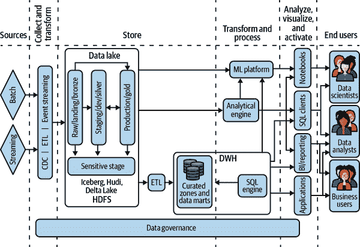
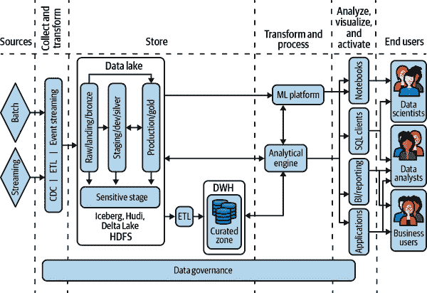
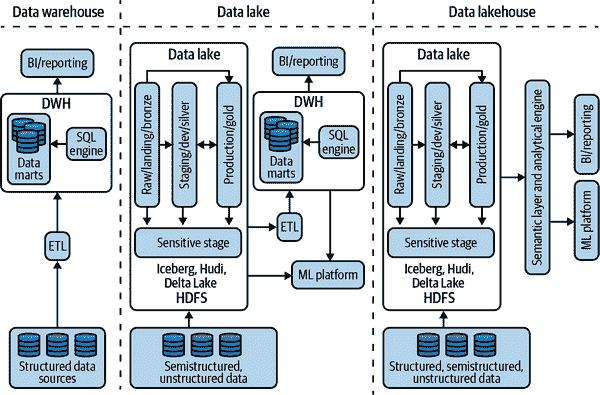
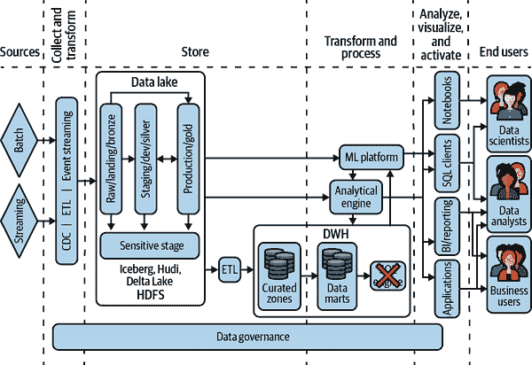
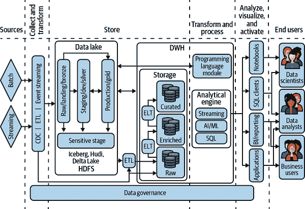
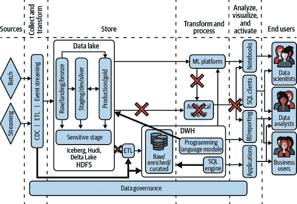

# 第七章：走向湖仓

正如你现在所知，组织在设计其数据平台时可以采取两种主要方法：遵循数据湖或数据仓库范式。这两种方法各有利弊，但问题是：是否可能使这两种技术共存以实现收敛架构？在本章中，我们将探讨这个主题，从这个想法的简要动机开始，然后分析收敛架构的两个广泛变体——即所谓的*湖仓架构*——并帮助您决定如何在它们之间做出选择。

湖仓（Lakehouse）概念因其在规模化处理结构化、半结构化和非结构化数据方面的灵活性和可扩展性而日益流行。湖仓可以以一种治理的方式处理整个结构化和非结构化数据的生命周期，结合了前两章中学到的数据湖和数据仓库方法的优点。本章末尾，我们将描述如何向湖仓架构演进。

# 需要独特架构

数据湖和数据仓库（Data Warehouse, DWH）应运而生，以满足不同用户的需求。一个同时拥有这两种类型用户的组织面临一个不那么吸引人的选择。

## 用户角色

正如您在之前的章节中所学到的，数据湖和数据仓库之间一些关键差异与能够摄取的数据类型及将未处理（原始）数据落入通用位置的能力有关。因此，这两种范式的典型用户是不同的。

传统的数据仓库用户是商业智能（BI）分析师，更接近业务，专注于从数据中提取洞察。数据通常由 ETL 工具根据数据分析师的要求准备。这些用户通常使用数据来回答问题。他们通常精通 SQL。

数据湖的用户除了分析师外，还包括数据工程师和数据科学家。他们更接近原始数据，拥有探索和挖掘数据的工具和能力。他们不仅仅是将数据转换为业务可访问的形式（即可传输到数据仓库的数据），还会对数据进行实验，并用于训练机器学习模型和进行人工智能处理。这些用户不仅仅在数据中找到答案，还能找到对业务相关的问题，并准备数据使其对其他用户有用。他们通常精通 Python、Java 或 Scala 等编程语言。

## 反模式：断开的系统

由于这些不同的需求，我们经常看到不同的 IT 部门或团队管理数据仓库和数据湖。然而，这种分裂式方法有一个机会成本：组织将资源花费在运营方面，而不是专注于业务洞察。因此，他们无法将资源分配到专注于关键业务驱动因素或允许他们获得竞争优势的挑战上。

另外，维护两个分离的系统，它们都有提供从数据中获取可操作洞见的相同最终目标，可能会导致数据质量和一致性问题。从一个系统转换数据以便与另一个系统中的数据一起使用所需的额外努力可能完全阻止最终用户。这也可能导致整个企业存在*数据水坑*，即存储在个人机器上的数据集，既造成安全风险又浪费数据效率。

## 反模式：重复数据

为什么不简单地通过平台团队同步连接这两个系统？你可能最终会得到如 Figue 7-1 所示的架构，数据湖和数据仓库共存，以支持自助式分析和 ML 环境。

请注意，在此架构中，由平台集中管理的数据就是驻留在数据湖中的数据。所有其他数据（例如数据仓库、BI/报告工具、笔记本等）可以被视为原始数据的重复/转换版本，一方面有助于提高性能和便于分析（例如物化视图），但正如前几章所见，这也会带来许多缺点，因为它导致数据孤立现象。

###### 图 7-1\. 数据湖与数据仓库共存

让我们来看看数据旅程的主要构建模块：

1.  来自各种来源的数据（批处理和/或流式）被*收集*并*转换/整理/准备*（甚至实时处理），以便*存储*在数据湖中，数据会经过不同的阶段（铜、银和金）。从一开始，数据就会经历安全性、数据质量和数据治理检查。

1.  现在数据可以通过分析引擎解决方案（例如 Spark）进行*处理*，与 SQL 客户端、批量报告和笔记本交互。

1.  同时，数据可以并行转换并纳入数据仓库中的业务特定段，即数据集市，以处理 BI 工作负载。维护数据集市是一项复杂且昂贵的活动，因为它需要大量的 ETL 工程，并且保持所有必要的数据更新是具有挑战性的。而且，这必须是一个持续不断的过程。此外，所有数据治理活动必须在数据仓库中重复执行。

1.  数据仓库驱动 BI 工具和 SQL 客户端，但有时无法提供最终用户要求的充分性能水平，因此人们倾向于下载数据，创建本地副本并进行处理。

1.  ML 解决方案（例如 scikit-learn、TensorFlow、Keras），通常通过笔记本处理，可以利用来自数据湖的数据，同时可以与数据仓库和分析引擎连接。

这样的架构通常包括一系列缺点：

数据的扩散

数据以各种形式存在，甚至可能在平台边界之外（即本地笔记本电脑），这可能会引起*安全合规风险*，*数据新鲜度问题*或*数据版本问题*。

时间到市场放缓

组织可能需要花费多达两周的时间来实施对管理报告的较小更改，因为他们必须首先请求数据工程师修改 ETL 以访问完成任务所需的数据。

数据大小的限制

用户可能无法访问他们进行分析所需的所有数据，因为例如，数据仓库中的数据集市可能仅包含由于性能需求而不全面的信息子集。

基础设施和运营成本

由于需要实施的 ETL 的复杂性，这些可能会增加。

拥有重复/转换的数据是不良实践，您应该尽可能将其最小化。理想情况下，您将消除重复数据和自管理数据，以便将所有数据置于平台管理模式中，所有参与者均可进行分析（即在图 7-1 中所示的架构图的右侧）。

到此时，您可能会问自己为什么组织要利用这种架构。这个原因非常明显：因为直到 2018 年，这是为了给许多不同的用户提供满足其需求的所有解决方案的唯一途径。

技术不断发展，特别是得益于云的出现，已经开发出新的解决方案，以提供更好的数据处理可能性。让我们看看如何改进这种组合架构。

# 融合架构

到此时，显而易见，数据湖与数据仓库的完全融合可以帮助最终用户充分利用其平台，从而充分利用其数据。但是，这种最终状态的架构是什么，以及达到这种状态的路径是什么？

## 两种形式

汇合湖架构的关键因素在于数据仓库（DWH）和数据湖共享共同存储。两种不同的计算引擎——SQL 引擎（用于数据仓库用例）和分布式编程引擎（用于数据湖用例）——读取和处理数据而无需移动数据。

此共同存储可以采用两种形式之一：

+   数据存储在云存储中以开源格式（Parquet，Avro 等），您可以利用 Spark 来处理它。同时，您可以使用 Spark SQL 提供交互式查询功能（Databricks 解决方案）。此外，数据仓库技术（例如 BigQuery，Athena，DuckDB，Snowflake 等）可以支持您直接在数据集上运行 SQL，无需任何数据复制或移动。您可以结合使用开源格式和 Delta Lake 或 Apache Iceberg 这样的技术来提升底层性能。

+   或者，通用存储可以是高度优化的 DWH 格式（例如 BigQuery、Snowflake 等内置格式），在这些 DWH 上，您当然可以原生地利用 SQL。此外，这些 DWH 支持直接在原生数据上使用诸如 Spark 之类的计算引擎。

这两者都是妥协。支持其他类型的工作负载并不意味着其性能相等。在 SQL 工作负载上，数据湖比数据仓库更慢/更昂贵。而在 Spark 和 ML 工作负载上，数据仓库比数据湖更慢/更昂贵。

### 根据用户技能选择

我们建议根据主要用户类型进行选择。在云存储上运行 SQL 引擎（第一种选择）会失去许多使 DWH 互动并适合即席查询的优化。运行 SQL 的数据湖（第二种选择）会失去使数据湖如此灵活的无模式数据处理能力。因此，请根据要很好地支持的用户类型和工作负载以及要以折衷方式支持的用户类型选择混合架构的形式。

在非常高的层面上，第一种选择适合熟练的程序员用户。如果你的大多数用户是那些在代码中进行大量数据处理（例如编写 ETL 管道和训练 ML 模型）的程序员，那么建立一个以数据湖（即云存储）为存储的湖屋是最好的选择。数据湖的主要优势在于它允许程序员进行灵活的数据处理。第二种选择适合希望与数据交互以从中获取洞察的用户。如果你的大多数用户是分析师而不是程序员，也就是说他们可以编写 SQL 或使用类似 Tableau、Power BI 或 Looker 这样的仪表板工具来生成 SQL，那么建立一个以 DWH 作为存储的湖屋是最好的选择。数据仓库的主要优势在于它允许商业用户进行自助式、即席查询。

### 完成评估标准

到目前为止，我们只是初步尝试确定您组织的正确方法。其他因素包括要摄入的数据量、是否需要流处理、数据中有多少是结构化或半结构化的，以及您是否在需要严格数据治理的受监管行业工作。

您应该列出在第五章和第六章讨论的数据湖和 DWH 方法的所有特性，并制作一个评估矩阵，为每个元素分配从 0 到 5 的分数（0 表示不重要，5 表示必须）。这将帮助您更全面地理解您的需求，并为您的湖屋方案做出正确选择。

现在，您对实施湖屋的不同选择有了更好的理解，让我们更近距离地了解这两个选项，以更好地理解它们在幕后的工作原理。

## 云存储上的湖仓

计算与存储的分离为数据湖与 DWH 的融合提供了理想的环境。云服务提供商能够通过将计算带到存储中为交互式查询启用分布式应用程序。这允许云服务提供商独立地为组织的作业分配存储和计算资源，这在本地环境中很难做到，因为机器需要提前数月采购。数据量和分析所需的计算能够从热池的计算集群动态扩展。当存储与计算解耦时，您可以将其用于许多不同的用例。曾经作为结构化数据文件型数据湖的同一存储现在可以作为 DWH 的存储和数据。这种关键的融合使您可以仅存储一次数据，利用视图为每个特定用例准备数据。

让我们来看看这种架构的基础要素，如何达到这个目标，以及为什么这是一种能够为未来需求做好准备的东西。

### 参考架构

我们利用云存储（如 AWS S3、Google Cloud Storage 或 Azure Blob Storage）同时为 Spark 集群使用的数据和为 BI 报告服务的 DWH。这使得数据湖团队花费多年完善的 Spark 代码可以在连接到始终可用存储的短暂计算集群上运行。它允许计算移到数据上，而不是数据必须在本地磁盘之间进行洗牌（如使用 HDFS 时）。云存储的高吞吐量提升了速度和性能。Databricks 和超大规模云服务提供商都提供 Spark 集群作为托管服务，进一步抽象化了基础设施的管理要求。

数据湖与 DWH（见图 7-2）的融合是为了简化和统一数据的摄取与存储，并利用适合特定问题的正确计算框架。对于结构化和半结构化数据，使用 CDC 工具将所有数据流入表格，用户可以使用简单的 SQL 转换数据，并构建逻辑视图以按照业务用例查询信息。由于视图在这种模式中被广泛利用，可以进行列消除、分区和逻辑以优化查询速度，同时保持流入表格的数据的历史分类帐。

###### 图 7-2\. 数据湖仓库参考架构 — 云存储方法

相反，通过批处理管道摄取的数据可以使用类似的方法，所有数据都写入表格，并使用 SQL 创建具有每条记录最新版本的视图。与流数据类似，原始表中维护历史账本，允许数据科学家使用所有数据构建和测试 ML 模型。在这种架构中，用户可以利用定期查询或基于事件的 Lambda 架构进行数据摄入。

与 图 7-1 中具有两个不同引擎（即分析引擎和内部 DWH SQL 引擎）的架构相比，图 7-2 中的参考架构具有单一的分析引擎，可以访问数据湖和数据仓库数据。这一点很重要，因为它可以实现更流畅高效的数据分析过程。

数据湖仓库解决方案，如 Dremio 和 Databricks，主要目标是在数据湖存储上直接支持高性能数据处理、分析和商业智能。它们通常提供语义层，允许您抽象底层数据，并向分析引擎提供数据视图，实现快速查询处理，无需实现数据集市。

项目的 *生产/黄金* 层（参见 第 5 章）可以是经过管理和专门构建的业务驱动视图或物化表格。底层逻辑和存储为终端用户和应用程序提供访问，允许您在 Hadoop、Spark、分析和 ML 上使用融合数据平台。

现在，数据存储在数据仓库（DWH）内部还是自由浮动的云存储桶中已不再重要。在幕后，它是相似的分布式存储架构，但数据结构不同。例如，数据湖将数据从 HDFS 移动到集群外的同一对象存储中。这与云环境数据仓库（EDW）作为存储系统骨干的使用方式相同。因此，数据可以在一个地方轻松访问和管理，同时由数据湖和数据仓库架构管理。因此，组织现在可以应用数据湖内数据和数据仓库访问的治理规则。由此，您不仅可以通过将数据放入中央存储库来打破信息孤岛，还可以通过使处理和查询引擎能够移动到数据所在的任何位置来实现。如 图 7-3 所述。这导致了数据仓库和数据湖的融合，使它们能够使用相同的元数据存储和治理，并使数据工程师、数据科学家和数据分析师能够共同协作，而不是在信息孤岛系统中。

数据工程师、数据科学家甚至业务用户都能够在可能拥有的任何数据类型上执行自服务查询，利用一个单一的访问点。甚至在开发方面，工作也将更容易，因为只需与一个系统互动，而不是众多不同的工具。这种方法的另一个优点是通过消除自我管理数据副本来加强安全和治理的集中化。

###### 图 7-3\. DWH、数据湖和基于存储的数据湖仓库方法

### 迁移

从图 7-1 中的架构到图 7-2 中的架构是一个迭代过程，保留了数据湖但迁移了数据仓库。首先引入一个连接到数据湖存储的单一分析引擎，来处理所有数据处理工作，如图 7-4 所示。然后，通过各种子步骤逐步迁移 DWH SQL 引擎，遵循第四章中描述的过程。

由于这个过程可能需要多次重复，因此首先要识别一个快速获胜的用例（如第四章中所述），这可以展示新解决方案的好处，以在组织内部形成共识。从那里开始，将可能继续扩展新解决方案的足迹，直到它成为整个平台的“事实上的”分析引擎。一个非常好的开始通常是交互式查询的数据探索世界：用户可以通过新引擎与数据湖和 DWH 跨越各种数据进行数据分析交互。他们可以直接使用新工具进行查询，也可以通过与 BI 和报告解决方案集成来执行查询。一旦变革的好处变得具体化，旧的 DWH 引擎就可以逐步停用以节省成本、减少复杂性，并且限制因离线数据加工而需下载数据的需求，因为根据组织的数据治理规则，用户现在将有权访问公司的所有数据。当然，新的工作负载应该只通过利用新的分析引擎来实现。

###### 图 7-4\. 数据湖仓库之旅——中央分析引擎

### 未来证明

一旦完全部署，与数据湖和数据仓库（*仅限策划的数据*）中的数据集的交互将是双向的：这意味着分析引擎能够直接在通常以开放格式如 Apache Parquet 或 Apache Avro 存储数据的底层存储系统上读取和写入。这是一个巨大的好处，因为底层技术可以被视为跨不同类型存储系统的一致和共同媒介。分析引擎将足够灵活，可以采用类似数据湖模式的按需模式读取（schema-on-read）或像基于 SQL 的更结构化的方法。采用湖仓架构时的另一个重要好处是易于流式数据采纳。

正如你将在下一章看到的，对数据的实时访问对于各种类型的业务越来越重要，而你能够将流数据像处理标准存储数据一样对待，这无疑能带来额外的价值。事实上，在这种架构中，流数据管道能够实时读写数据，知道底层技术（例如 Apache Iceberg、Apache Hudi 或 Delta Lake，请参考“Apache Iceberg、Apache Hudi 和 Delta Lake 的数据湖演变”）能确保完整的 ACID 事务，在系统内带来一致性，并且始终处理最新和最新的数据。你可以在 EMR、Dataproc 等平台上以专有（例如 Databricks）或开源方式使用这些技术。选择哪种适合你的组织的最终决定取决于你。要考虑的关键因素是灵活性、维护和支持。

## SQL-First Lakehouse

SQL-First 湖仓解决方案的主要目标是在数据仓库存储上直接使用 Spark 实现高性能分析和 BI，同时支持灵活的数据处理。这种架构的优势在于业务用户可以进行编排和机器学习。

让我们来检视这种架构的基本要素，如何实现它，以及为什么将来它对你会有益。

### 参考架构

当将数据仓库作为数据湖使用时，需要确保数据仓库解决方案不仅能处理表格上的标准 SQL 查询，还能与基于 Spark 的环境、ML 功能和流处理功能进行本地集成。像 BigQuery、Athena、Synapse 和 Snowflake 这样的现代数据仓库在不同程度上支持这些功能，这些功能在您阅读本文时肯定已经得到了改进。在图 7-5 中，您可以看到一个参考架构，其中数据仓库充当平台的中央分析引擎点。从图中可以看出，数据从原始来源（以各种形式和速度）流经数据湖和本地数据仓库存储。从这里，您可以识别出四个主要的存储区域：

+   数据湖存储与前一节中所见相同

+   数据仓库存储分为三个维度：

    原始

    来自各种来源（批处理或流处理）的原始数据。

    增强的

    具有第一层转换的原始数据

    精心策划的

    准备进行最终转换的增强数据

Spark（ETL）或 SQL（ELT）可以执行所有的转换。

###### 图 7-5\. 数据湖仓库—SQL 优先方法

在构建数据湖仓库的这种方法中，使用 SQL 是处理和转换数据的首选方法。SQL 优先方法利用数据仓库的高度优化的交互式查询能力来降低成本，并将数据驱动的决策扩展给业务用户。

当您需要处理更高级的数据处理时，您可能可以利用像 Spark 这样的结构化编程语言。特别是在处理 ML 算法时，无论是结构化数据（例如提升树回归/分类）还是非结构化数据（例如 NLP），这一点尤为明显。这是因为这些操作在 SQL 中实现起来不够灵活（虽然不灵活，但并非不可能：BigQuery 和 Redshift SQL 在撰写本文时已经具备了一些 ML 功能，其他数据仓库很快也会支持）。利用 Spark 还可以避免重新编写可能已在 Spark 中编写的遗留数据处理作业。

现代数据仓库解决方案具备直接从其引擎执行 Python、Spark 甚至无服务器函数的能力，而且最重要的是，无需将数据移动或复制到数据存储之外。例如，BigQuery 通过提供在 Spark 中编写存储过程、在即席 Serverless Spark 环境中执行这些过程，并在 SQL 语句中调用它们的能力来实现这一点。Snowflake 提供 Snowpark，一个内置的 Python 引擎，能够运行 Spark（及其他编程语言）。Athena 通过使用 Parquet 等标准格式文件在管理的 Hadoop 环境（如 EMR）中操作，从而实现了这一点。此外，数据湖技术（如 Databricks）通过优化的批量 API（如 BigQuery Storage API）直接读取和写入本地仓库存储。

数据湖仓库范式的关键优势之一是，它促使供应商（以及整个行业）开发越来越强大的数据仓库，使多种复杂解决方案对广泛用户群体变得易于使用。这在机器学习领域尤为明显。业务用户可以利用标准 SQL 代码训练和部署机器学习模型，并可以利用开源解决方案（如 dbt）轻松自动化和生产化数据准备。如今，很常见看到例如能够独立预测客户需求并实现高精度的商业分析师，以便有效进行库存管理或根据历史数据预测最佳价格。

尽管 SQL 对机器学习的支持很棒，但与 ML 技术相关的大多数任务都掌握在更倾向于利用他们更熟悉的 Python 框架的数据工程师和数据科学家手中。特别是在处理非结构化数据上开发深度学习模型时，您需要利用开源语言处理海量数据集，以训练必须提供给最终用户的模型。这就是为什么各种数据源之间的本地集成发挥着关键作用：利用 Spark 支持的能力是给用户提供高自由度的范式的一个关键特性。

随着机器学习模型开发的普及，平台还必须处理另一类运营：机器学习运维（MLOps）。在 MLOps 中，用户希望通过与软件开发相同的方法（即 DevOps）来跟踪数据版本、数据血缘（特别是出于审计目的）和模型更新。诸如 Databricks MLflow、Google Vertex AI 或 Amazon SageMaker 等解决方案与现代数据仓库天然连接，使最终用户在处理机器学习模型生命周期时有统一的体验。

### 迁移

与基于云存储的湖仓库方法类似，向 SQL 优先的湖仓库转型是一个迭代过程，需要多个步骤才能完全投入运行，如图 7-6 所示。第一步是直接将数据摄入到 DWH 中：数据源不仅要直接连接到数据湖，尤其是要连接到三种 DWH 存储（即原始、丰富和策划）。一旦数据完全被批处理和流式处理摄入到中央数据存储库中，就是时候剔除外部分析引擎，将 DWH 的 SQL 引擎提升为主要引擎。在这里，关键是注意如何将数据湖的工作负载转移到 DWH 中，利用内置的编程语言模块（如 Python 或 Spark 引擎/连接器）直接在原生存储格式上操作。最后一个迭代过程中，初始时仍在 DWH 外部处理的 ML 工作负载将被内部化处理。

###### 图 7-6\. 走向数据湖仓库——以 SQL 为先的方法

在迁移的各个阶段中，遵循 SQL 优先的方法，组织将发现大量数据管道需要用 SQL 编写。

在这种架构中，通过 SQL 实现数据处理更为高效（尽管 Spark 中的 ETL 仍然是一种可能性）。这通常需要组织内一种新的技能类型，称为*分析工程*。您可能很容易在组织内找到具备分析工程技能的员工（参考“数据分析驱动组织”），因为 SQL 是一种广泛使用的语言（比 Spark 或其他编程语言更为广泛），可以迅速学习。事实上，这是民主化的一个优点，因为采用这种范式将使大量员工更容易访问数据。

数据分析工程师将负责大部分数据丰富和策划工作，并且他们能够运用他们的领域知识，只需具备 SQL 技能。不同类型的数据集（原始数据、丰富数据和策划数据）可能会被不同类型的用户使用。总体而言，大多数最终用户、分析团队和应用程序将利用策划数据，而数据工程师和数据科学家可能更倾向于访问原始数据或数据湖和丰富数据。

在这种情况下，重要的是注意到流式处理和机器学习能力包含在分析引擎中：这意味着它们对每个人都是本地可用的，即使是那些在使用 TensorFlow、PyTorch、Keras 或 scikit-learn 编写代码方面不那么高级的人也是如此。这是在促进数据民主化和工具访问方面取得的重大成就，使得组织内的员工能够更多地利用他们的数据。最后，需要注意的是数据治理以联邦和横向的方式进行处理，创建了一个统一和集中的管理、监控和治理数据的场所，使其能够被多种用户和工具访问。

### 未来保障

一旦迁移完成，并且组织已经根据图 7-6 中的架构进行了开发，大部分交互将基于 SQL。在 SQL 困难或可用现成库的用例中，可以利用其他编程语言，使非 SQL 选项更具吸引力。

采用 SQL 优先湖仓架构的好处非常大，因为它提供了一个统一的数据存储位置，并通过一个广泛使用的标准编程语言（SQL）——由许多商业用户使用的工具支持——来民主化访问数据。与基于云存储的数据湖仓相比，其主要优势在于能够让更广泛的用户接近数据并允许他们创建创新解决方案（即机器学习）——能够使用数据的人越多（以受控的方式），你的组织就会看到更多创新。

## 融合的好处

如果你是创业公司或者幸运地进行绿地开发，根据你的使用案例和技能集，可以选择纯数据湖或纯数据仓库（见第三章）。对于其他所有人，我们建议采用湖仓架构。无论你选择湖仓存储还是 SQL 优先湖仓，选择湖仓架构都带来以下好处：

上市时间

你可以直接摄取和使用数据，无论是来自批处理还是实时数据源。不再使用复杂的 ETL 管道处理数据，数据直接“分阶段”存储在消息总线或对象存储中，然后在融合的数据仓库/数据湖中进行转换，使用户能够在收到数据时立即行动。

减少风险

你可以继续利用现有的工具和应用程序而无需重写它们。这降低了变更带来的风险和成本。

预测分析

从传统的数据集市和数据挖掘的观点转向使用新鲜数据进行实时决策，增加了业务价值。这只有因为围绕数据仓库的治理和严格要求已经降低，减少了进入门槛，才变得可能。

数据共享

收敛环境现在是所有用户类型（即数据分析师、数据工程师和数据科学家）的一站式购物平台。他们可以在需要时访问同一管理环境，获取不同数据阶段的访问权限。同时，不同角色可以通过不同层次访问相同数据，这由平台范围内的访问权限管理。这不仅增加了数据治理，还简化了数据生态系统中的访问管理和审计。

ACID 事务

在典型的数据仓库中，保持数据完整性，多个用户读写数据时看到的是一致的数据副本。虽然 ACID 是大多数数据库的关键特性，但传统上在基于传统 HDFS 的数据湖中提供相同的保证相当困难。有诸如 Delta Lake 和 Apache Iceberg 之类的方案试图保持 ACID 语义（参见“Apache Iceberg、Apache Hudi 和 Delta Lake 的数据湖演进”）。它们存储事务日志，旨在跟踪对数据源的所有提交。

多模态数据支持

半结构化和结构化数据是数据仓库和数据湖的关键区别。半结构化数据具有一些组织属性，如语义标签或元数据，使其更容易组织，但数据仍不符合严格的模式。在收敛的世界中，通过扩展的半结构化数据支持可以容纳这些数据。另一方面，对于非结构化的用例，仍然需要数据湖，除了边缘情况。

统一环境

传统上，不同的工具和环境通常由 ETL 协调管理数据捕获、摄入、存储、处理和服务。此外，如 Spark、Storm、Beam 等处理框架提供内置 ETL 模板，使组织能够构建 ETL 管道。然而，通过功能强大的云数据仓库和集成云工具，现在可以通过单一环境处理所有这些管道。ELT 执行大部分传统 ETL 任务，如数据清理、去重、连接和增强。这在 DWH 中的数据湖实施的不同阶段变得可能。此外，借助核心数据仓库的支持，您可以通过统一环境访问存储过程、脚本和物化视图等概念。

架构和治理

实际上，业务需求和挑战随时间而演变。因此，相关数据会随之改变和累积，无论是通过适应新数据还是引入新维度。随着数据的变化，应用数据质量规则变得更具挑战性，并需要模式强制执行和演进。此外，随着新数据源的添加，PII 数据治理变得更加重要。组织需要一个数据治理解决方案，能够全面了解其数据环境。此外，对于不同目的和角色，识别和掩码 PII 数据至关重要。

流处理分析

实时分析能够实现即时响应，存在特定的用例需要运行极低延迟的异常检测应用程序。换言之，业务需求要求在数据即时到达时立即采取行动。处理此类数据或应用程序需要在数据仓库之外完成转换。

拥有一个管理单一系统简化了企业数据基础设施，并允许用户更高效地工作。

# 总结

在本章中，我们专注于描述如何在一种全新的混合架构——湖屋中混合数据湖和数据仓库技术。我们介绍了两种最常见的架构以及如何实现这一目标。主要收获如下：

+   在设计其数据平台时，组织通常遵循两种主要方法：数据湖或数据仓库范式。

+   这两种方法各有利弊，但有一个新的选择：湖屋形式的融合，使您能够兼顾两者的优点。

+   在选择湖屋时，有两种可能的方法。根据开发人员的主要技能集选择其中一种。

+   一种湖屋的方法是将数据湖和数据仓库合并，使用云存储中的相同数据。Spark 作业将从云中读取，而不再使用 HDFS。使用基于 Spark 的 SQL 引擎。随着时间的推移，这将导致数据仓库引擎的停用。

+   第二个湖屋选项是将数据湖工作负载移至数据仓库，并使用内置的 Python 引擎或 Spark 连接器直接操作原生存储格式。

+   湖屋方法有几个好处：缩短上市时间，轻松实施预测分析并打破孤立和 ETL 管道，模式和治理以及流处理分析仅是其中几个。

目前，我们已经涵盖了主干数据平台架构（数据湖、数据仓库和数据湖屋）。在接下来的两章中，您将学习如何将流处理和边缘/混合要求纳入此架构。
