# 第八章：流式架构

在本章中，您将了解到为什么行业趋势不可逆转地从批处理向流处理发展。我们将讨论不同的流式架构及其选择方式。我们还将深入探讨两种架构——微批处理和流水线——以及如何在这两种架构中支持实时的即席查询。最后，有时进行流处理的原因是在特定事件发生时自动采取某些行动，我们将讨论如何设计这样的自动化系统。

# 流处理的价值

从数字原住民到传统公司，涵盖多个行业的企业意识到做出更快决策的价值日益增加。例如，考虑企业 A，需要三天才能批准车辆贷款。另一方面，企业 B 可以在几分钟内批准或拒绝贷款。这种增加的便利性将使企业 B 具有竞争优势。

比更快的决策更好的是能够在*上下文中*做出决策。能够在事件进行时做出决策（见图 8-1）比稍后几分钟做出决策更有价值。例如，如果您能够在持卡人使用欺诈信用卡进行支付时检测到并拒绝该交易，您就可以避免昂贵的追索流程。

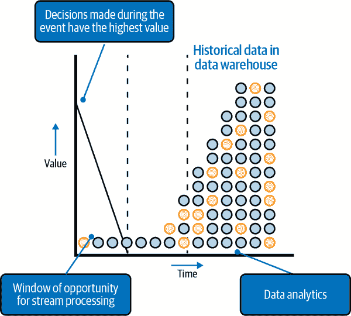

###### 图 8-1\. 决策的价值随时间的推移而下降；流处理允许组织实时做出决策。

## 行业应用案例

无论是欺诈检测、交易结算、智能设备还是在线游戏，一个接一个的行业已经开始采用流处理。

在医疗保健领域，我们看到流处理被用于实时患者监测，在摔倒或自伤时发出警报，利用物联网医疗设备提供个性化护理，以及优化医院的药品和供应品库存。

在金融服务领域，我们看到流处理被用于检测和防止欺诈、预测和分析风险、识别违反合规法规的交易，并向客户提供个性化的优惠。

在零售领域，我们看到流处理被用于个性化营销网站，提供跨多个渠道（网站、移动应用、实体店）的实时库存信息，处理订单履行问题，动态定价，产品推荐以及全渠道客户可见性。

在媒体和娱乐业中，我们看到流媒体被用于生成个性化内容，传递定向广告，减少客户流失，以及防止订阅者欺诈行为。在电信行业中，我们看到类似的用例围绕客户流失和订阅者欺诈。此外，流媒体还用于提高网络可靠性和优化网络容量规划。

## 流使用案例

将流视为对无界数据集进行数据处理。技术上，流处理的挑战是双重的。一是数据集是无限的，永远不会完成。因此，所有聚合（例如极值）只能在时间窗口内定义。另一个挑战是数据在运动中并且存储在临时存储中。这使得应用传统编程技术和概念（如文件句柄）来读取和处理数据变得困难。由于这种复杂性，将流使用案例分为四种复杂度和价值递增的类别有巨大好处：

1\. 流摄入

当您只关心跟上数据流并将其落入持久存储时。

2\. 实时仪表板

当您希望在数据到达时可视化数据时非常有用。您可能还对数据的时间窗口聚合的统计数据和图表感兴趣。

3\. 流分析

当您希望在数据到达时对数据进行计算时。通常情况下，这是为了向人工操作员报警超过阈值或异常模式。

4\. 持续智能

自动化流分析，以便无需任何人工干预即可采取行动。

在接下来的章节中，我们将查看每个使用案例的架构。您将看到架构非常模块化，您可以建立简单的系统，并在需要时添加复杂性。不必建立最终、最复杂的自主系统来从流处理中获得价值。但是，这假设您在像 Apache Beam 这样的框架中进行数据处理，这将允许您无缝地从批处理转换为流处理。尽管 Beam 由 Google 创建为其托管的 Cloud Dataflow 服务的 API，但 Apache Flink 和 Apache Spark 都支持 Beam。因此，您可以在其他超级托管商上使用托管的 Flink 和 Spark 实现来运行 Beam 管道。

这些类别相互构建，因此第一个类别对所有四种用例都至关重要。为了更快地做出决策，您需要几乎实时地摄入数据，即事件发生时。这称为*流摄入*，我们将在下面详细介绍。

# 流摄入

流摄入可以通过两种方式进行：

+   您可以聚合事件并仅将聚合数据（例如小时平均值）写入持久存储。这称为*流式 ETL*，因为聚合是转换（ETL 中的*T*），位于抽取和加载到持久存储之间。

+   或者，您可以直接将数据摄入（加载）到数据湖或数据仓库，并期望客户在分析时转换数据。这称为*流式 ELT*。

让我们在以下小节中详细看看这两种方法。

## 流式 ETL

如果您的目标是向业务提供更及时的数据，则流式摄入就足够了。首先，您需要关注数据在云中摄入的位置，因为这非常重要。您需要将数据存储在可以访问以进行处理或查询的位置。对于查询，确保结果反映最新数据非常重要。

因此，要实现实时洞察的目标，数据摄入必须发生在允许实时摄入和查询的系统中。现代数据仓库（例如 Google BigQuery、AWS Redshift 和 Snowflake）具有此功能。因此，通常情况下，您会进行流式 ETL 进入这样的数据仓库，如 图 8-2 中所述。

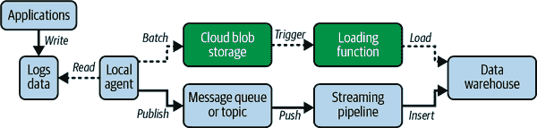

###### 图 8-2\. 日志数据的流式 ETL 有两种选项：微批处理（用虚线表示）或流水线（用实线表示）

因此，流式 ETL 的目标通常是将数据落入数据仓库。多个应用程序写入的日志数据由本地代理读取，负责使日志数据在实时监控和查询中可用。您可以通过重新定义数据类型和使用适当的本地代理，将相同的架构应用于其他类型的实时数据，无论是来自物联网设备还是在线游戏。

本地代理可以通过以下两种方式之一实现实时查询数据的可用性（见 图 8-2）：

微批处理

例如，过去五分钟的数据被写入到云存储的文件中。云存储中出现新文件会触发加载功能（如 Google Cloud Functions、Google Cloud Run、AWS Lambda、Azure Functions 等）。该功能可以处理数据，然后将文件加载到最终目标中。微批处理涉及一些延迟。

流水线

本地代理可以针对每个日志事件发布一个事件到消息队列（例如 Kafka）或主题（例如 Cloud Pub/Sub）。这些事件被推送到流水线（例如 AWS Glue 或 Google Cloud Dataflow），处理这些事件并将其插入到最终目标中。这使得事件可以立即用于查询。

加载函数或流水线的角色是处理数据，使其对下游用户和应用程序更加可用。通常，您会利用数据处理来：

+   将事件数据转换为数据仓库表格所需的模式

+   过滤事件记录，仅保留业务部门操作数据仓库的特定数据

+   插值或以其他方式填充事件中的缺失值（例如，您将使用最近有效的值）

+   连接跨时间的事件（例如，您将利用身份解析方法将事件连接成用户会话，甚至跨会话连接）

+   将事件聚合成更易消费的块，例如，编写时间平均值（例如，过去一分钟的总页面访问次数，而不是每次页面访问）或每个会话值（例如，一个记录指出会话中单击的按钮，而不是单独的按钮单击事件）

+   用其他来源丰富数据（例如，货币转换）

+   掩码、加密或以其他方式保护敏感字段

如果不需要执行上述任何活动，并且加载功能只是一个简单的穿越，请考虑在下一节中是否可以使用流式 ELT 方法。

在利用微批处理方法时，了解延迟来源是很有帮助的。在我们的例子中，加载到 DWH 的数据可能会有五分钟的延迟。但这通常不是大问题。如果 5 分钟的延迟是不可接受的，您可以降低到 30 秒。真正的问题是 DWH 加载作业排队，因此它们可能不会立即发生。检查您的 DWH 的 SLA，了解可能的延迟是什么。通常，这种加载延迟是使微批处理在许多用例中不可接受的原因。但是，如果批次包含例如每日数据，并且加载的小时延迟是可接受的，则这是一个有效的架构。

微批处理方法通常比流水线方法便宜。一些 DWH（特别是 Google BigQuery）具有加载数据免费的定价层。即使在像 Snowflake 这样既收费加载又收费插入的 DWH 中，插入的费用更高且需要更高的层级。此外，只有在函数运行时才需支付加载的计算成本。特别是如果您每天只加载一次数据，则微批处理的计算成本可能非常低。AWS Glue 和 Cloud Dataflow 的自动缩放在微批处理频率增加时也能够缩小差距。

我们已经介绍了前面提到的两种方法中的第一种。现在让我们继续讨论第二种：流式 ELT。

## 流式 ELT

以前学习的流式 ETL 方法假设你可以预测数据消费者需要进行哪种清理、聚合或增强操作。毕竟，在将原始数据写入 DWH 之前，你正在转换原始数据。这可能是一个有损的操作。随着数据消费者数量的增加，以及不可能预测不同消费者需要的转换类型，许多组织将他们的数据流水线从流式 ETL 转换为流式 ELT。如果转换需要业务特定的知识，并且最好由业务用户而不是程序员执行，流式 ELT 也比流式 ETL 更合适。

在流式 ELT 中（见图 8-3），本地代理直接加载或插入原始数据到 DWH 中。数据的消费者可以应用他们需要的任何转换。在某些情况下，你可以提供数据的逻辑或实现视图，以便于数据消费者使用。

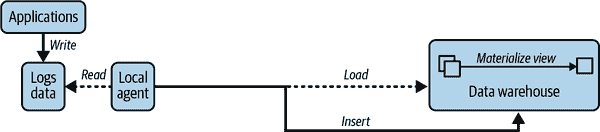

###### 图 8-3。流式 ELT 也可以作为微批次（虚线）或事件发生时（实线）来执行。

流式 ELT 的一个显著缺点是写入 DWH 的数据量可能很大——在许多 ELT 流水线中，转换步骤显著减少数据量，并仅向 DWH 写入聚合数据。因此，流式 ETL 与 ELT 的选择非常依赖于基于业务价值和云成本的决策。

令人费解的是，数据量越大，流式 ELT 的成本竞争优势越明显。随着数据量的增加，更频繁地处理数据变得更有意义。要了解原因，想象一下，一个企业根据其网站流量创建每日报告，需要两小时。现在假设网站流量增长了四倍。现在报告需要八小时才能创建完毕。如何回到两小时？幸运的是，这些问题都是可并行化的。因此，将作业扩展到四倍的机器数量。如果考虑一种使报告更及时的方法呢？

+   每天四次计算六小时数据的统计信息。

+   将这六个小时报告汇总成每日报告。

+   现在你可以每天四次更新你的“每日”报告了。

+   报告中的数据现在只有六小时的历史了。

当然，这就是微批处理的概念。这两种方法的计算成本几乎相同。然而，第二种方法降低了延迟，增加了频率，分散了负载，并更好地处理了突发情况。此外，组织得到了更及时、不陈旧的报告，这几乎没有额外成本，但能为业务带来巨大的好处。数据量越大，从每六小时报告到每小时更新，再到分钟级更新，甚至实时更新，就越合理。一旦需要向多个消费者提供几乎实时的更新，流式 ELT 就成为一个非常有吸引力的选择。

## 流式插入

在图 8-2 和 8-3 中，我们假设需要一个本地代理来查看可用数据，并将数据加载或插入到持久存储中。其实，并不一定需要这个中介——如果 DWH 提供了流式 API，云原生应用可以绕过本地代理，使用云客户端库自行进行插入操作（见图 8-4）。

###### 图 8-4\. 在云原生应用中进行流式 ELT 可利用客户端库直接插入数据。

例如，在 BigQuery 中，流式插入涉及使用 REST API 调用，并可以在 Python 中完成。Snowpipe Streaming 在 Snowflake 中提供了这种功能，但在 Redshift 中，您必须使用 Kinesis 中的传递转换步骤。

一些消息系统（例如 Google Pub/Sub）还提供特定的订阅类型，可以将事件加载到数据仓库中，以便应用程序可以简单地将事件发布到消息主题或队列，并使事件实时显示在数据仓库中。

## 边缘设备（IoT）的流式传输

在 图 8-2 中，我们假设流式 ETL 中的事件将从自定义本地代理发布到诸如 Kafka 等通用消息队列。

在物联网（IoT）的情况下，云服务提供商通常有更具针对性的解决方案（见 图 8-5）。Azure 提供了 IoT Devkit 用于边缘软件和 IoT Hub 用于远程云组件。在 AWS 上，本地代理将使用预构建的 AWS IoT Greengrass 组件，远程队列将由 AWS IoT Core 管理。在 Google 云平台上，边缘组件可能包括 Coral 设备和 TensorFlow Lite 软件，而远程云组件可能是 Clearblade IoT Core。

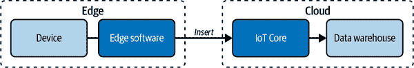

###### 图 8-5\. 用于从 IoT 设备边缘流式传输数据时，利用 IoT 特定功能。

您可以使用提供的边缘软件开发工具包（SDK）和设备进行本地处理、数据管理、ML 推理等。利用提供的远程云组件，您可以激活定制功能，如设备管理，并且可以透明地处理网络不稳定、设备重新启动等情况。

无论云服务提供商如何，边缘 SDK 都将支持标准协议，如 MQTT，以及专有协议。选择标准协议可确保您能够在不同云上部署软件，尤其是在边缘设备的情况下，通常需要支持其他云的设备或处理软件，因为涉及合作和收购。例如，在 AWS 上使用 Greengrass 时，可能考虑使用 MQTT 代理 Moquette 以确保可移植性。

## 流式汇聚

在 8-2 和 8-3 图中，我们假设需要将流数据导入数据仓库以支持交互式查询。但并非总是如此。有两个例外情况：非结构化数据和高吞吐流。

如果您正在流式传输视频，则可以忽略上述所有内容并使用专为视频设计的框架。在边缘上，您的视频摄像机将支持实时流传输协议，如实时流传输协议（RTSP）或 WebRTC。使用这些协议将实时视频传送到云端。在 Google Cloud 上，Cloud Video Intelligence 将从实时流传输协议转换为可解码的视频流，并将流写入云存储文件中。在 AWS 上，Kinesis Video Streams 与 AWS SageMaker 提供类似的集成，并将 ML 推断结果发布到 Kinesis Data Streams。类似地，Azure Video Indexer 允许您从视频中提取洞察信息。

DWH 是持久存储和交互式即席查询的通用解决方案。但是，DWH 对于高吞吐量和/或低延迟的情况并不是一个好的选择。DWH 支持的典型吞吐量约为每秒 1GB，并且典型的延迟约为几秒钟。如果您希望每秒流传输数 TB 数据或希望毫秒级延迟，则 DWH 不是一个好的选择。而是使用 Google Cloud 上的 Cloud Bigtable 或 AWS 上的 DynamoDB。当然，这些都是 NoSQL 数据库，因此您正在权衡 SQL 的便利性与实时摄取和查询的权衡。相反，如果您的规模或性能需求未达到这些水平，则不要选择 Bigtable 或 DynamoDB：SQL 解决方案将在基础设施和所需技能方面更加经济实惠。

如果立即查询不是问题，或者您的架构纯粹是数据湖而不是数据湖仓（参见第七章），则也可以将流式数据流式传输到云 Blob 存储文件中。例如，Apache Beam 可用于将非结构化或半结构化数据存储在 Google Cloud Storage 上。在这样做时，重要的是决定如何分片文件——流处理框架将在文件达到一定大小后自动分片文件，但这些基本上是基于时间戳的（因为记录正在流出），这可能不适合您的需求。

# 实时仪表盘

无论您是存储聚合数据还是将实时数据着陆到数据仓库（DWH），您可能希望为决策者提供在数据进入时可视化数据的能力。您可以通过*实时仪表盘*来实现这一点。

## 实时查询

仪表板工具定期查询 DWH 以确定着陆的事件，并更新其图形。此架构要求仪表板将查询推送到云 DWH（参见图 8-6）。换句话说，所有查询都是“实时的”，并反映 DWH 中的最新数据。

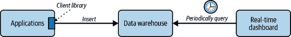

###### 图 8-6. 仪表板定期使用 SQL 查询 DWH

早期的方法如数据立方体和数据集市——它们涉及将用于图形的 DWH 数据的子集或聚合物化——已不再必要。尽管像 Tableau 这样的仪表板工具具有创建和维护提取的功能，但最好直接查询 DWH live——现代云 DWH 可以处理。

如果您的数据仓库提供了面向仪表板的便利或性能特性（例如将数据集缓存在内存中、查询的时间限定缓存、优化以在数据未更改时返回先前的查询结果等），您应该启用它们。例如，在 Google BigQuery 中，启用 BI 引擎。在 AWS Redshift 中，使用密集计算节点，因为这些节点专为仪表板所需的较重计算而设计。

## 物化一些视图

最好不在仪表板工具中使用复杂的 SQL 查询代码。创建检索所需数据的视图，并通过用户定义的 SQL 函数在视图之间重用查询逻辑。

如果您发现某些视图经常被访问，请将视图转换为物化视图（参见图 8-7）。这样做可以在不增加额外治理负担的情况下提供仪表板维护的数据库提取的性能优势。

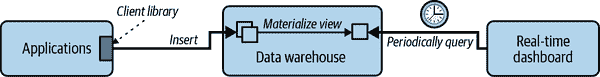

###### 图 8-7\. 为频繁请求的提取使用物化视图

但是不要过火：引用 Knuth 的话，过早优化仍然是许多问题的根源。最小化使用物化视图，并允许大多数查询实时进行。物化视图会增加存储成本，如果特定提取很少显示，则会增加许多不必要的开支。

# 流分析

在实施仪表板时，您可能需要超越仅仅显示数据。您可能需要显示基于自动提取的见解和预测的对决策者有用的警报。这被称为*流分析*。您可以通过事件基础或基于时间的时间表计算分析来确定是否需要警报。实时处理事件比较好，为此，您需要一个流水线。如果选择基于时间表进行处理，微批处理就足够了。

流分析在以下情况下很有用：

时间序列分析

用于跟踪资产、预测事件影响和进行预测性维护

点击流分析

用于实时提供优惠、创建动态网站和优化客户旅程

异常检测

用于预测设备故障、防止欺诈和监控系统健康

我们将在本节中分别讨论这些情况。这些情况的架构可以作为其他流式分析用例的模板，你可以像时间序列分析那样写入两个主题和仪表板，使用点击流分析中的回填管道，或使用异常检测中的多个时间窗口。

## 时间序列分析

流式分析最常见的应用是周期性验证数据值或计算基于时间的平均值。

例如，假设一个物理资产（如交付车辆）将其位置流式传输到云端，我们希望分析资产的位置，并在以下情况下发出警报：

+   该资产移动出某个预定的地理区域。

+   该资产的速度超过了它所在位置的某个预定限值。

此用例的架构如图 8-8 所示。

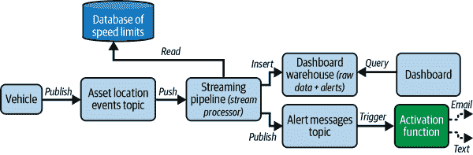

###### 图 8-8. 时间序列分析架构

你可以通过 ETL 管道实时将位置数据加载到 DWH 中，该管道从事件流（Kafka，Pub/Sub 等）中推送新的位置信息。流式处理管道（使用 AWS Glue、Google Cloud Dataflow、Apache Flink 等技术实现）处理实时流，验证位置，并将警报写入一个特殊主题。然后，当有新的事件到达此主题时，会触发一个激活函数，负责通过电子邮件、短信等方式将警报发送给相关方。

流处理器能够对传入的事件流应用时间窗口，计算平均速度等统计数据。它还能够从数据库中获取静态值（如特定位置的限速）。因此，它还能够进行第二次计算并对其发出警报。

编写   编写警报消息时，最佳实践是将其写入警报主题和 EDW。为了让用户控制他们收到的警报，最好不要让流式处理管道直接发送电子邮件或短信。这样的职责分离还允许你建立仪表板，展示这些警报的频率，并允许用户探索这些警报，进而识别模式。

## 点击流分析

点击流由访问者在应用或网站内执行的事件序列（如按钮点击、页面浏览等）组成。为了收集这些数据，组织在其网站上安装了仪器，以便用户活动触发 Web 动作，进而最终进入 DWH。随着大量业务转移到在线，组织能够基于点击流洞察客户行为。

虽然可以为此类工具编写自定义 JavaScript 代码进行仪表化，并在自定义流式处理管道中收集和处理数据，但更常见的是使用预构建工具，如 Google Marketing Platform 或 Salesforce Marketing Cloud。Google Marketing Platform 包括 Google Tag Manager（用于仪表化您的网站）和 Google Analytics（收集此信息并提供一种将点击流数据导出到 Google BigQuery 的方式，从那里可以将其转移到任何其他 DWH）。您可以使用像 Fivetran 这样的公司的连接器，类似地将数据从 Salesforce Marketing Cloud 导出到所需的 DWH。还需检查您的 SaaS 软件是否提供将其内部数据与 DWH 同步的功能。例如，Salesforce 为 Snowflake 和 BigQuery 提供了这样的功能。

一旦数据位于 DWH 中，您可以使用 SQL 进行分析。点击流数据用于 A/B 测试、跟踪商品流行度变化和识别销售摩擦。您可以通过适当编写的 SQL 完成所有这些任务。但是，处理代码将处理以下情况：

+   用户从一个设备开始，然后在另一个设备上完成交易。自动会话跟踪可能不会捕获这种情况，除非客户在两台设备上都登录。总体而言，用户识别是一个挑战，因为只有少数用户会登录。其他机制（如 Cookie、设备 ID、IP 地址等）经常失败，并且如果有更多数据，可以进行改进。通过跨所有渠道使用所有可用数据将可能是同一用户的数据集合起来，称为*身份拼接*。存储包含一组唯一用户 ID 和相应属性的湖畔被称为*客户数据平台*（CDP）。

+   隐私合规性通常要求适当对收集的数据进行匿名化处理，并以不能识别个体行动的方式聚合用户数据。经常需要从用户填写的文本字段中删除信息。

+   自动代理（如蜘蛛搜索机器人）和寻找安全漏洞的恶意行为的活动。

这种处理在 SQL 中很难完成。因此，即使使用像 Segment 或 Bloomreach 这样的预构建 CDP，也通常需要构建后处理的“补充”管道来处理组织内特有的情况（见图 8-9）。这种流式处理管道可能能更好地完成身份拼接、隐私聚合和机器人检测等任务，超过预构建工具提供的更为通用的代码。同时，该管道可能会根据组织内的其他数据源（如关于客户、产品、价格、库存水平等的信息）来丰富点击流。正是这些补充后处理的数据，可以用于进一步的分析。

如果您使用点击流数据来构建个性化或推荐系统，则在客户访问网站时也必须采取行动。这将属于我们稍后在本章中讨论的连续智能用例。

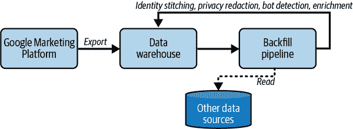

###### 图 8-9\. 使用回填管道来丰富点击流数据，改进身份拼接、隐私削减和机器人检测

## 异常检测

异常检测涉及在数据到达时识别异常模式。在任何“正常”行为的数据丰富的情况下，但很难编写关于异常活动具体规则的情况下（因为恶意行为者不断改变攻击机制或环境易受变化），异常检测非常有用。异常检测用于检测定价错误的商品（某种商品的人气突然上升），过载设备，在线游戏中的机器人活动，安全威胁等。

许多组织使用基于签名的模式作为识别病毒和其他网络安全威胁的主要技术。在基于签名的模式中，系统利用过去检测到的病毒的存储库来对抗新的威胁。然而，使用这种技术很难检测到新的攻击，因为没有可用的模式或签名。当使用异常检测时，通常会对过去三天内的传入数据进行聚类（见图 8-10）。任何远离现有聚类的事件都被认为是可疑的。这允许环境进行适应（因为聚类仅在最近三天的数据上进行），并且允许您识别异常模式，只要它们不是已经过于普遍。

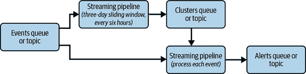

###### 图 8-10\. 异常检测涉及两个流式管道：一个用于计算滑动窗口内的聚类，另一个用于将传入事件与这些聚类进行比较

## 弹性流式处理

当摄取和处理流数据时，您会收到格式不正确的数据或者您不知道如何处理的意外数据值。

在批处理中，通常会简单地抛出异常，然后期望程序员找到逻辑错误，修复它，并重新运行批处理作业。然而，在流处理中，管道需要继续运行。同时，您也不希望简单地忽略错误。

因此，每个流式分析作业设置一个死信队列来存储无法处理的事件非常关键。您可以定期检查这些死信队列并（与批处理作业一样）修复逻辑错误。

一旦修复了逻辑错误，就必须在当前运行的流式处理流水线上更新，而不会丢失任何数据。像 Cloud Dataflow 这样的工具提供了在原地*更新*运行中的流水线或*排空*事件队列并无缝转移处理到新流水线的能力。

更新正在运行的流水线会保留正在进行的数据，并在新流水线内恢复处理。为此，它重用旧流水线的持久存储来更新流水线。因此，两个流式处理流水线必须满足某些兼容性要求。如果处于保持兼容性的情况下，应该遵循这种方法，因为可以实现一次精确处理语义。事件将被精确处理一次（即旧的或新的），并且聚合将是准确的。

如果流水线不兼容（也许是因为修复了 bug 改变了步骤之间传输的数据），下一个最佳方法是在启动新流水线之前排空现有流水线。现有作业停止从其输入源拉取数据，并完成所有正在进行和缓冲数据的处理，导致触发器发射开放窗口的内容，并将新事件发送到新的流水线。排空流水线对于确保至少一次处理语义至关重要——虽然不及一次精确处理好，但比简单取消运行中的流水线和丢弃数据要好。

# 通过 ML 实现持续智能

不需要有人在环路中进行决策。随着数据量的增长，通常会转向*人类在环上*的系统。在这种情况下，根据实时洞察、警报和预测自动执行操作。人类监督员可以覆盖否则会自动应用的操作，但系统设计为在没有任何人类干预的情况下自动运行。这被称为*持续智能*。

要使系统能够自动运行，您需要自动化以下操作：

+   在历史数据上训练 ML 模型，并根据需要在随后的数据上重新训练模型。

+   在事件到来时调用经过训练的 ML 模型。这称为*推断*。

+   根据 ML 模型的预测采取行动。

让我们看看每个步骤的一些考虑事项。

## 在流数据上训练模型

ML 模型是根据历史数据训练的。应该在多少数据上训练模型？这取决于手头的问题。一般的建议是，只在与投入生产后可能遇到的数据类似的数据上训练模型。此外，几年前的数据通常来自完全不同的背景，可能捕捉到今天不相关的趋势和关系。

因此，在对流数据进行 ML 模型训练时，您不太可能对整个历史存档进行训练。相反，您感兴趣的是在最近的数据上进行训练，“最近”是指具有与即将接收到的数据相同特征的数据。在这种情况下，“最近”可以是过去三天（如我们异常检测示例中显示的情况，见图 8-10）或在稳定环境中过去三年的数据。

### 窗口化训练

如果您经常进行训练，并且训练数据包含相对较小的时间段，您可以像在图 8-11 中一样使用滑动窗口流水线。在仅基于历史需求周期进行需求预测等时间序列外推时，这是非常常见的。

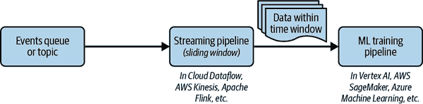

###### 图 8-11\. 在滑动时间窗口内训练事件

您需要的是：

+   使用流水线创建在时间窗口内的数据集。

+   在 Google Cloud Vertex AI、AWS SageMaker、Azure Machine Learning 等平台上的自动化训练流水线，以从何处获取训练数据为参数化。（训练流水线还将模型部署到端点，正如我们将在“流式 ML 推断”中讨论的那样。）

注意，“流水线”一词在这里指的是不同的内容。流式处理管道涉及处理动态数据，而训练管道包括 ML 操作（数据预处理、模型训练、模型评估、模型部署等）。我们将在第十一章详细讨论 ML 流水线。

### 定时训练

对于模型将有效一段较长时间（大约几天到几周）的情况，您可以使用定时作业启动训练，如图 8-12 中所述。训练作业将从 DWH 或其他持久存储中检索过去一个月的数据，例如。

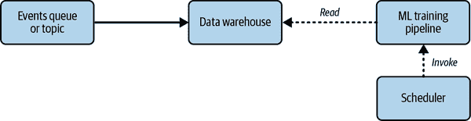

###### 图 8-12\. 定时训练

您可以使用 Google Cloud Scheduler 在 Google Cloud 上安排 Vertex AI ML 训练流水线。在 AWS 上，调度 SageMaker 流水线是 AWS EventBridge 支持的目标之一。在 Azure 上，Azure Machine Learning 流水线支持调度触发器（作为流水线设置），因此不需要外部调度程序来调用它们。

我们强烈建议不要让模型在流水线中保持超过几周而不更改。如果您相信模型将继续有效，请通过持续评估模型并在必要时重新训练来验证您的直觉。我们将在下一节讨论这个问题。

### 持续评估和重新训练

最复杂的情况是在确定模型不再适合目的之前使用模型。要确定模型在性能上是否*漂移*，你需要使用*持续评估*。例如，如果你有一个用于预测用户是否购买物品的模型，你可以在几天后验证用户是否购买了相关物品。然后，基于两周前的预测进行每周一次的模型评估，并且现在可以获取真实答案。当评估指标低于预设阈值时，可以重新训练模型（参见图 8-13）。

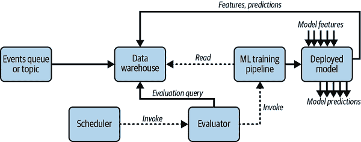

###### 图 8-13\. 自动启动重新训练的持续评估

你还可以扩展持续评估方法来检测*特征漂移*——如果任何输入到机器学习模型的分布发生变化（例如，如果重复购买次数占所有购买的 10%，现在增加到 20%），你可能希望重新训练模型。

截至目前，仅有 Vertex AI 支持设置持续评估查询和在部署模型上检测特征漂移。要在 Vertex AI 中设置这一功能，你需要定义一个评估查询，并启用部署模型将特征样本及相应预测写入数据仓库的能力。定期运行评估查询，并使用得到的指标来决定是否需要触发流水线。

请查阅你的云服务提供商文档，确认当前是否支持这一场景。如果支持，其机制可能会有些类似。如果不支持，你将需要按照自定义方式构建相应的流水线和能力。

## 流式机器学习推断

通常情况下，当事件发生时，你会调用训练过的机器学习模型，并获取这些事件的机器学习预测结果。

可以将模型对象加载到流式处理流水线中，并调用模型的预测签名。这通常是调用机器学习预测的最高效方式。但是，它在小型模型和项目之外并不具备可扩展性。

例如，机器学习预测可能需要非 Python 代码和在没有 GPU 的硬件上运行的程序（例如，考虑一个工业机器，需要自动识别装配线上物品是否有缺陷，或者一个需要拒绝有毒评论的 Web 服务器）。为处理这些情况，通常会将模型部署到一个端点，以便作为微服务调用。然后通过向其发送 HTTP 请求来调用模型，并将输入传递给机器学习模型。

ML 推断如果一次调用一个事件是不高效的。因为现代 ML 框架基于矩阵运算，如果你传入一小批事件进行推断，效率会高得多。这就是在图 8-14 中所示的内容。

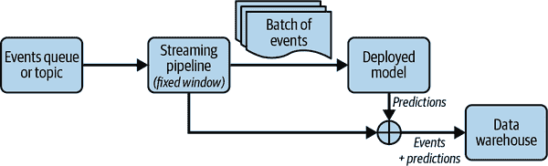

###### 图 8-14\. 流推断通常涉及积累一批事件并将它们发送到部署的模型进行推断

## 自动化操作

如果只需要人类用户查看 ML 模型的预测并做出决策，将预测落到 DWH 中就足够了，如图 8-15 所示。但是，如果需要系统根据 ML 模型的预测自动执行某些操作怎么办？你可以使用 ML 模型来执行需要自动化的任务，比如自动向可能放弃购物车的人发放优惠券，或者创建一个更换即将损坏零件的工单。你可以通过 Lambda、Fargate、Google Cloud Functions、Google Cloud Run 或 Azure Functions 以无服务器方式调用这些操作。为了支持这一点，你需要将满足告警条件的一部分增强事件写入一个地方，从中触发云函数（参见图 8-15）。

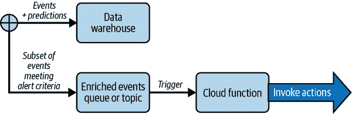

###### 图 8-15\. 支持自动化操作—这张图是图 8-14 的延续

我们已经看过许多流式使用案例和场景，以及如何使用云原生技术进行架构设计和实施。根据你的需求，为自己的流式解决方案构建架构。例如，如果你将在流数据上进行 ML，可以选择图 8-11、图 8-12 和图 8-13 中的训练架构之一，并将其与图 8-14 或图 8-15 的推断架构结合起来。如果仅进行分析，不要复杂化架构—看看是否可以通过图 8-8 解决，并仅在必要时添加后填充架构（图 8-9）。

# 总结

本章重点介绍了云原生流式架构，你了解到它们高度模块化，可以从小处开始，仅在必要时添加功能。主要要点如下：

+   在许多行业中，能够在事件进行时做出决策比稍后几分钟做出决策更有价值。

+   流媒体架构非常模块化，您可以设计简单的系统，并在需要时逐步增加复杂性。

+   如果目标是为业务提供更及时的数据，流式数据摄取已经足够了。

+   微批处理通常比流水线成本更低，但是流水线可以使事件立即可用于查询，而微批处理则会存在延迟（大于分块频率）。

+   随着数据消费者数量的增加，以及不可能预测不同消费者所需转换类型的情况，许多组织将数据管道从流式 ETL 切换到流式 ELT。

+   如果数据仓库提供流媒体 API，云原生应用程序可以去除本地代理，并使用云客户端库来进行插入。

+   对于从物联网设备边缘流式传输数据，利用物联网特定功能，如边缘 SDK 和边缘硬件设备。

+   数据仓库在高吞吐量和/或低延迟情况下并不是一个好的解决方案。在这种情况下，应使用诸如 Cloud Bigtable 或 DynamoDB 等 NoSQL 分析存储。

+   使您的仪表板工具将查询推送到云数据仓库，创建可重用视图，并将一些视图实体化以优化性能/成本。

+   在时间序列分析中，将警报写入警报主题和数据仓库，以支持自主操作和人工探索。

+   使用预建工具进行点击流分析，但补充一个回填管道来丰富点击流数据，并改进身份拼接、隐私保护和机器人检测。

+   异常检测涉及两个流媒体管道：一个用于长时间段内的计算聚类，另一个用于比较传入事件与最近的聚类并触发警报。

+   为了保证流媒体的弹性，确保更新正在运行的管道。如果无法更新，要排空它们。不要简单地取消正在运行的生产管道。

+   如果您正在进行频繁的训练，并且训练数据由相对较小的时间段组成，请使用滑动窗口流水线向机器学习训练管道提供训练数据。

+   对于模型将有效数天到数周的情况，可以使用定时作业来启动训练。

+   要确定部署的模型在性能上是否出现漂移，您需要进行持续评估。

+   因为现代机器学习框架基于矩阵运算，如果向推断传入小批量事件，则效率更高。

+   要支持自主操作，您需要将满足警报条件的增强事件子集（事件 + 预测）写入一个主题，触发云函数。

在接下来的章节中，您将看到关于分布式架构方法和技术的概述，重点是边缘计算，这是一种可以减少延迟、增强安全性并降低成本的模式。
