# 第九章：使用混合和边缘扩展数据平台

到目前为止，在本书中，我们已经讨论了如何利用公共云的能力来规划、设计和实施数据平台。然而，有许多情况下单一公共云将不足够，因为数据在产生、处理或存储时有时候需要位于其他位置——这可以是本地、多个超大规模云提供商，或连接的智能设备如智能手机或传感器。在这些情况下，需要解决一个新的挑战：如何提供平台的整体视图，以便用户可以有效地混合和联接分布在不同位置的数据？在本章中，您将学习处理这类分布式架构时，组织可以采取的方法、技术和架构模式。

此外，还有其他一些情况需要使您的数据在部分连接或断开的模式环境中工作。在本章中，您将学习如何利用一种新的方法——称为*边缘计算*，可以将部分存储和计算资源从云中移出，靠近产生或使用数据的主体。

# 为什么要多云？

作为数据领导者，您的组织希望您不断寻找方法来提高业务成果，同时尽量减少技术成本。在数据平台方面，您被期望通过采用市场上最佳的解决方案或至少最适合业务需求的解决方案来管理整个数据生命周期。

## 单一云更简单且具有成本效益

将整个软件架构整合到单一云提供商上在多方面都非常有吸引力：

简单性

当使用单一云提供商时，所得到的技术堆栈要简单得多，更加流畅。在云内部服务通常是本地集成的。例如，在 Google Cloud 上，DWH 工具（BigQuery）可以直接从托管的关系数据库（Cloud SQL）读取数据，无需数据移动。在 AWS 上的 Redshift 和 Aurora 之间以及在 Azure SQL Data Warehouse 和 Azure SQL Database 之间（通过 Azure Synapse Link）也有类似的零 ETL 集成。

学习曲线

当您只有一个云时，员工在组织内部移动变得更加容易。新员工的入职变得更加简单，员工使用在组织其他部分构建的工具也变得更加容易。

成本

使用单一的云提供商使得从安全到合同都更加简单。仅在 IT 和法律服务上的成本节省就足以使单一云成为最佳选择。由于云提供商根据使用量提供折扣，通过将所有技术支出整合在一个提供商处，可以获得更大的折扣。

出于这些原因，我们建议中小型企业选择一个单一的云提供商，并使用该超大规模提供商提供的完全托管服务设计其架构。

## 多云是不可避免的

我们发现许多组织可能希望使用单一云，但最终却在混合或多云环境中结束。为什么呢？

收购

即使您的组织最初只使用一个云，您可能会收购一家在另一个云上运行其整个技术堆栈的公司。现在，您成为了一个多云的商店。这是最常见的情况，因为重新平台化的成本可能非常高，并且可能不值得为业务带来拖累。

最佳云

在不同超大规模供应商上可用的功能存在差异。如果您真的喜欢 BigQuery 或 DynamoDB 或 Azure OpenAI，并认为它们是最优秀的，并围绕这些能力构建了您的应用程序，那么您将希望该应用程序在 Google Cloud、AWS 或 Azure 上运行，即使其余的技术基础设施位于其他地方。使用最佳/最熟悉工具可获得的生产力差异，仅需信用卡即可启动影子 IT 倡议的能力，以及不愿重写正在运行的内容，意味着许多组织慢慢进化成为事实上的多云系统。

支持客户

如果您正在构建在客户环境中运行的软件，您将需要支持所有主要的云，因为您将有客户使用三个云。这就是为什么例如 SAP 或 Teradata 可以在 AWS、Azure 和 Google Cloud 上使用的原因。

面对这些必然性时，重要的是要认识到没有理由成为阻碍。不再需要绑定在一个单一供应商上，并围绕单一技术构建整个数据堆栈。与传统的本地技术相比，云技术要开放得多，企业现在可以创建依赖于多个互联环境的复杂架构，这些环境运行着来自多个供应商的各种解决方案或完全开源软件（例如，有些公司将其主站点部署在一个云提供商上，而灾难恢复站点部署在另一个云提供商上，以减少对单一超大规模供应商的依赖风险）。当然，这种自由程度带来了不同的成本（在技术和人员方面），这需要额外的治理和管理。例如，如果您正在使用多个虚拟化技术，您将需要处理可能需要不同技能的不同平台，并且您还将有更多的合同需要管理，这将增加管理负担。然而，正如稍后将看到的那样，由于它可以提供的优势，这种方法正在变得越来越受欢迎。

## 多云可能是战略性的

在与大型企业的 IT 高管交谈中，我们经常听到他们正在进行包括多云战略在内的数字转型之旅。已有多个大型组织采用多云方法，例如，苹果为其 iCloud 服务[利用了三大公共超大规模云服务商](https://oreil.ly/ZLo-B)；Twitter（在最近的收购之前）[使用 Google Cloud 平台](https://oreil.ly/IEtIt)进行其数据平台的支持，但是为其新闻提供了[AWS 的动力支持](https://oreil.ly/uNvmL)；或者汇丰银行，将工作负载分担在 Google Cloud 和 AWS 之间，并[将一些传统服务迁移到 Azure](https://oreil.ly/SSjc2)。

当正确执行时，多云可以通过在不同环境中部署的最佳解决方案相结合，为业务增加价值。实际上，这是一个全新的互联服务生态系统的开发，成为公司所有解决方案的着陆区。

采用多云环境的主要驱动因素是什么？最重要的是：

担心被锁定

这是组织面临的最大关注之一，因为他们不希望陷入单一提供商的“专制”之下。这不是技术问题（因为无论是对云还是对多云软件供应商，都无法摆脱锁定），而更多是一种业务战略问题。

退出策略

在出现失败情况（甚至可能是合同违约）时离开服务提供商的能力。

利用

管理层可能希望通过维持两个或更多的云服务提供商来保留与超大规模云服务供应商的谈判筹码。

商业

可能您的组织使用微软的企业软件，在亚马逊上销售，并在谷歌上进行广告宣传。可能存在一个更大的商业需求，在多个公共云上留下印记。

法规要求

也许某个提供商在特定地区提供的服务不合适，或者在该地区提供的服务集不够充足（例如，灾难恢复）。

可持续性

公司希望选择最佳的可持续云，因为这对满足未来环境、社会和公司治理战略的趋势至关重要。

创新

采用解决方案，没有成本、商业方面或功能方面的障碍。

知识

提供一个无障碍的环境，让员工能够成功，并且人们可以利用他们在职业生涯中已经获得的技能或者获得新技能是至关重要的。

可移植性

超大规模云服务商专有的解决方案在运行位置方面往往受限，而在多云上运行的开源解决方案通常也可以在本地和边缘设备上使用。

现在，您对于为您的业务考虑多云战略的原因有了更好的理解，让我们来看看一些可以用来实现这一战略的架构模式。

# 多云架构模式

多云架构可以使用不同的模式来连接数据，并允许用户与所有需要分析的解决方案进行交互。在本节中，您将了解与这些范式一起工作时可能遇到的最常见模式。

## 单一视图

最大的挑战之一是开发解决方案，使得能够跨多个由不同供应商管理的各种位置的数据孤岛进行数据分析。为了实现这一目标，利用那些从本质上讲是*云无关*的开放式解决方案，并且能够在需要时与多个不同的数据源连接和混合数据是至关重要的。在这里可以利用主要有两种不同的方法：

+   基于 BI 工具的方法，如图 9-1

+   基于处理引擎的方法，如图 9-2

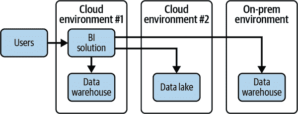

###### 图 9-1\. 利用 BI 解决方案的单一视图

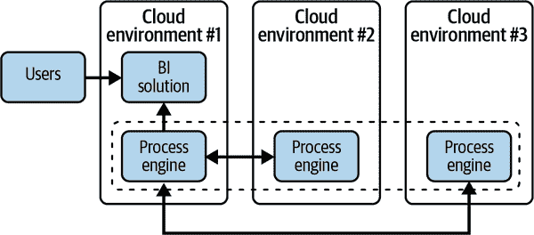

###### 图 9-2\. 利用分布式处理引擎解决方案的单一视图

在第一种方法中，您委托 BI 工具（例如 Looker 或 Power BI）连接多个稀疏数据源、检索相关信息、远程执行查询并最终聚合结果的任务。在第二种方法中，您将处理引擎（例如 PrestoSQL、BigQuery Omni）与位于不同环境中的各种数据源连接起来。在这种情况下可能存在两种不同的方法：

+   利用跨多个超大规模环境的分布式环境（例如，BigQuery Omni），为最终用户提供与解决方案交互的单一视图

+   利用连接器（例如 Java 数据库连接[JDBC]）来跨多个系统查询和混合数据

## 一次编写，多处运行

获得云选择性的常见方法是使用可以直接在不同超大规模平台上运行的软件。有几种可能的方法来实现这种模式：

管理的开源软件

您可以使用 Apache Airflow（一种开源工具）来进行工作流编排，但通过使用 Amazon Managed Workflows for Apache Airflow（MWAA）、Google Cloud 的 Cloud Composer 或 Azure 的 Azure Data Factory 来避免管理的开销。这样，开发人员编写的代码可以在各种云上进行移植，同时仍能获得托管服务的好处，除了初始设置中的一些小差异。在不同超大规模上使用开源与不同托管服务的模式，例如 Presto、Spark、PyTorch 和 TensorFlow，在许多其他情况下同样适用。

多云产品

工具如 Snowflake、Confluent Kafka 和 Databricks 在主要超级云平台上提供完全托管的服务。因此，可以将由 Snowflake SQL、Snowpark 等组成的 Snowflake 工作负载在 AWS 上运行，并且几乎原封不动地在 Azure 或 GCP 上运行。需要注意的是，不同超级云平台上软件版本的可用性通常会有一些滞后。

多个跑步者

Google Cloud 将用于编写 Cloud Dataflow 流水线的软件 API 开源为 Apache Beam。因为 Apache Flink 和 Apache Spark 现在提供 Apache Beam 的运行器实现，所以可以在托管的 Flink 服务（如 Amazon Kinesis Data Analytics）上几乎不经过大量更改地运行 Apache Beam 流水线。

IaaS 的开源软件抽象层

不是通过 Azure OpenAI 或 Google Cloud Vertex AI 提供的提示 API 调用 LLM，而是选择通过 LangChain 访问模型，LangChain 提供一致的接口。这样可以在不同的 LLM 提供商之间保持软件工作负载的可移植性（尽管您需要验证相关提示是否可以互换使用）。

IaaS 上的开源软件

诸如 Dask、Modin、RAPIDS 等的开源软件可以在从超级云平台租用的虚拟机或集群上运行。除非您具有管理 IaaS 上软件成本效益高的使用规模，否则应尽量避免这种情况。

## 从本地突发到云端

这是一种旨在支持在本地拥有大型数据湖并希望扩展到云端但尚未完全迁移的组织的模式。混合工作负载可以帮助解决他们的直接痛点，并作为未来迁移的铺路石，展示采用和使用云技术是多么简单。

采用云方法开始的最简单方式是将本地 Hadoop 工作负载突发。对于在硬件和与 Hadoop 相关的堆栈上都有重大投资且受容量限制的组织来说，突发非常适合。突发的主要应用场景包括大型一次性作业，例如需要大型集群处理数据的月度报告。突发在那些可以针对上传到 blob 存储服务（例如 AWS S3、Google Cloud Storage、Azure Blob Storage）的数据运行多个作业，并且处理所用数据可以进行增量更新的情况下效果非常好。这种解决方案的主要优势之一是，同样的 Spark 或 Hive 作业既可以在本地运行，也可以在 PaaS 集群（例如 Amazon EMR、Google Cloud Dataproc、Azure HDInsight）上运行。这与重视开源解决方案并且偏好不绑定供应商的组织非常契合。重要的是，这里所有的数据湖中数据摄入的上游流程保持不变。所有这些显著降低了重新执行和重新测试现有流程的风险，并缩短了首次部署时间。

它实际上是如何工作的？这种方法使用 Hadoop 的分布式复制工具，也称为*DistCp*，从您的本地 HDFS 移动数据到目标云 Blob 存储。数据传输完成后，会创建一个 PaaS 集群，可以在该集群上运行 Spark 作业。作业完成后，集群被销毁，作业结果被保存，如果不计划运行其他作业，则可以销毁 Blob 存储桶。可以利用像 Airflow 这样的开源解决方案来协调突发工作负载，该解决方案可以在本地和云端工作（例如，通过 Google Cloud Composer 也可以在 PaaS 模式下使用），如图 9-3 所示。

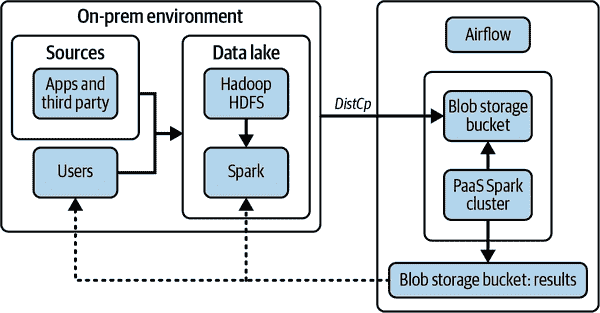

###### 图 9-3. 在本地 Hadoop 工作负载中突发

这种模式涵盖的其他用例包括：

+   组织测试版本升级的能力。在云中启动特定 Spark 版本的 PaaS 集群并验证作业在部分本地数据上是否正常工作，通常比完全迁移更少风险和成本高昂。

+   实验和测试新技术（例如直接在 Spark 作业中集成第三方服务）。

突发是我们在多个组织中多次看到的常见模式；让我们看看如何扩展它。

## 从本地到云端的直通

这种模式可以视为前一个模式的补充。在前一个场景中，我们展示了如何使用 Hadoop 原生工具 DistCp 将部分本地数据湖移动到云 Blob 存储桶。一旦数据到位，组织可以利用其他处理引擎的工具（如 AWS Redshift、Google BigQuery、Azure Synapse）来处理数据，如图 9-4 中描述。

利用云处理引擎可以启用多个工作负载：

+   处理 ORC、Parquet 或 Avro 文件，包括 Hive 分区数据，利用联合查询。

+   将本地数据与云中数据联接：一个很好的例子是将组织的事务数据（位于本地）与从营销工具（如 Adobe 或 Google Analytics）加载的数据联接。

+   基于本地数据构建模型，利用 AI/ML 工具。

+   在本地数据上运行规模化的批量预测。

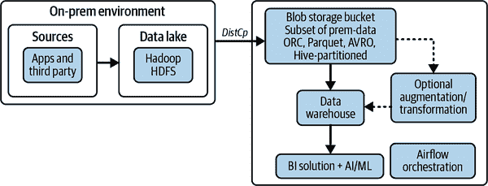

###### 图 9-4. Hadoop 通过启用云中的过程数据

使用这种方法，重要的是注意一些关键点：

+   与完全迁移相比，无需更改任何供给或使用本地数据湖的系统。

+   除了 Hadoop 工具外，还可以通过云处理引擎进行数据分析。

+   数据一旦传输到云存储桶中，通过选择的处理引擎访问联合数据时无需额外延迟或处理。

+   将相同的数据传输到云存储桶，可以由在本地运行的相同 Spark 作业进行处理。

+   像 Informatica、Talend、TIBCO 或 MuleSoft 这样的集成平台即服务（iPaaS）解决方案可以用来促进数据源的集成并保持同步。

## 流式数据集成

组织之间存在数据库和应用程序之间的障碍，无论是在本地还是在云端。处理过程是批处理的，因此不支持企业需要的快速运营决策。服务通常是自我管理的、遗留的，不适合云环境，并且运行和维护成本高昂。这导致了昂贵、缓慢和碎片化的系统架构。

*变更流*是将数据更改作为它们发生的移动，从（通常是数据库）源到目标的过程。由 CDC 支持，变更流已成为关键的数据架构构建块。全球公司正在要求 CDC 提供跨不同数据源的复制能力，并为实时分析和业务运营提供实时流式数据源。

那么 CDC 是什么呢？CDC 是一种数据集成方法，使组织能够更快地集成和分析数据，同时使用更少的系统资源。它是一种从数据源中仅拉取最新更改（更新、插入或删除）的方法，通常通过读取数据源保留的变更日志来实现。CDC 对于将新数据加载到操作数据存储和数据仓库时减少对源系统影响非常有效，它消除了批量加载更新和不便的批处理窗口的需要，通过使增量加载或实时流式数据更改进入数据目标成为可能。CDC 可以在许多从数据实时变化中获取价值的使用案例中使用；按照常见程度排序，最常见的使用案例如下：

分析

通过集成 CDC 以将数据加载到数据仓库中，组织可以例如获取源数据的最新物化视图。组织可以使用这些持续更新的数据来构建最新的仪表板，用于监视系统并获取关于业务状态的最新洞察，如图 9-5 所述。在数据新鲜度对业务影响和收集处理成本之间必须权衡考虑。

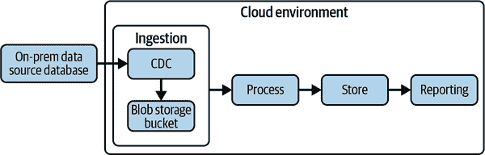

###### 图 9-5. 启用分析的 CDC 架构

数据库复制和同步场景

通过集成 CDC 来将数据加载到 SQL 数据库，组织可以在这些数据库中获得其源数据的最新材料化视图。组织可以在目标数据库中使用这些持续更新的数据，以实现从源到目标的低停机时间数据库迁移，或者用于多/混合云配置，其中源和目标位于不同的托管环境中，正如您可以在图 9-6 中看到的。

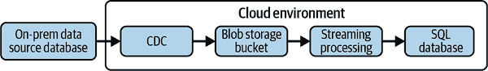

###### 图 9-6\. 用于实现数据库复制和同步的 CDC 架构

事件驱动架构

现代基于微服务的架构依赖于数据的中心化数据中心，这些数据中心持续不断地从整个组织中更新事件以实现事件驱动。通过持续写入到云 blob 存储等目的地，组织可以构建基于消费来自这些目的地的事件数据的事件驱动架构，如图 9-7 所述。

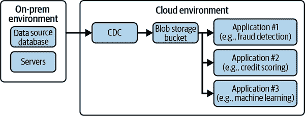

###### 图 9-7\. 用于实现事件驱动架构的 CDC 架构

现在，您对允许构建多云数据能力的可能模式有了更好的理解，让我们看看如何采纳全面的多云战略。

# 采纳多云

采纳多云范式是战略的一部分，应该随后转化为 IT 架构。

## 框架

要将多云战略转化为多云 IT 架构，企业架构师利用像 TOGAF（开放组织架构框架）这样的常见框架来识别业务需求，定义支持过程所需的数据以及应用程序如何处理这些数据（架构开发模型[ADM]过程），如图 9-8 所示。完成后，可以确定技术需求，为整合架构带来视野，而多云范式为组织提供了高度的灵活性和自由度。

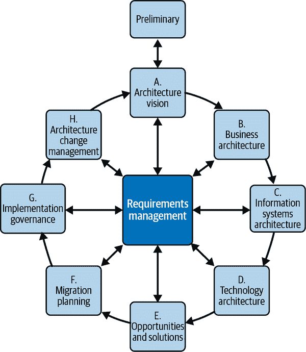

###### 图 9-8\. 根据[TOGAF 框架](https://oreil.ly/nWTYa)的 ADM 周期

能够访问广泛的服务当然是一个机会，但是重要的是要小心管理，以避免失去焦点。识别能够帮助您按照战略和组织规则实现业务目标的服务至关重要，特别是在合规方面。随着组织越来越多地将 IT 功能重新(内)部署以拥有其软件和解决方案的所有权和控制权，这一点尤为重要。

让我们以金融服务行业为例。我们可以看到，大量投资已经用于转变传统环境（主要基于主机解决方案）成为现代化解决方案，特别是在数据方面。诈骗检测系统基于实时分析，了解客户流程依靠先进的 ML 算法工作，反洗钱需要处理大量数据。如果仅依赖于单一提供商，则很难获得这种特定的解决方案/工作负载；因此，组织正在考虑采用多云方法以获取最佳解决方案以满足其需求。

## 时间尺度

确定采用多云的时间尺度非常重要。具体来说：

+   一些组织*可能永远不会完全迁移到公共云*，可能是因为它们属于金融或医疗行业，需要遵守严格的行业规定以及数据存储方式。对于它们来说，“数据驻留”非常重要。有些企业可能希望保护其类似 SAP、Oracle 或 Informatica 的本地工作负载，但同时也希望利用公共云创新技术，如全面管理的数据仓库。

+   其他大型企业则致力于他们多年的*与本地公共云现代化*之旅：他们将不得不在多年内采用多云架构作为最终状态。

+   最后，有些组织*尚未准备好迁移到公共云*，但由于临时大批处理作业的挑战，*无法满足业务 SLA*：他们希望利用公共云的可扩展能力，并避免增加本地基础设施的成本。

在前述概念的基础上，如何形成多云架构？让我们深入探讨。

## 定义目标多云架构

您可以采用与之前章节讨论的相同方法（处理单个（公共或私有）云供应商时），但您需要（1）为每个涉及的供应商重复该方法，并且（2）在总体目标架构的背景下执行此操作。

以下步骤将帮助您定义和采纳目标云架构：

1\. 制定您的策略。

在采用多云战略之前，您需要清楚地了解自己的目标。这些目标可能与业务、战略或技术相关。一旦确定了您的目标，您需要识别推动您采用多云战略的驱动因素。这些驱动因素可能是成本、功能缺失、开放性或法规合规性。例如，如果您采用多云策略是为了利用优势，您可能会将最易迁移的工作负载（例如 Hadoop 或 Kafka）放在次要云上。一旦您清楚了解了您的目标和驱动因素，您就可以继续您多云旅程中的下一步骤。

2\. 发展团队。

谈到云时，所需的技能可能非常丰富。身份、安全性、网络、编程等只是云工程师应该掌握的一些主题。处理多云架构时，这套技能变得更加庞大，因为即使这些主题在高层面上是可以互换的，但工程师们必须具备深入和特定平台相关的知识。通常情况下，你需要建立一个云卓越中心，如“第 1 步：战略与规划”所述，以便将所有所需技能聚集在一个“单一的帽子”下，成为整个项目的参考基础。

3\. 评估。

要识别候选目标解决方案，有必要更好地了解当前的运作情况。这部分至关重要，因为它完全可以改变接下来步骤的方法。你是否将执行搬迁和转移以维护组织已有的解决方案，还是最好采取基于重新平台化/重新开发的方法来充分利用云提供商的优势？通常，在此步骤中有一些工具可以简化发现，收集多种数据片段，这些数据可以用来定义迁移计划。使用云原生工具过渡到完全无服务器架构往往是最佳解决方案，但在短期内使用你手头拥有的资源可能并不可行。

4\. 设计架构。

一旦业务目标明确，你有足够的知识使一切成为现实，开始将需求转化为技术架构。定义组件如何相互通信，如何交换信息，以及如何共同执行定义的任务。架构师的目标是确定最佳解决方案，为最终用户提供更大的灵活性，保证最高水平的安全性和性能，同时关注整体成本。

5\. 准备迁移计划。

一旦你收集到关于从哪里开始和要去哪里的所有信息，你必须确定如何到达目的地：模式、时间表、所需工作量和里程碑。了解不同活动/环境之间的关系以及可能的依赖关系也很重要。

6\. 构建着陆区。

一切始于着陆区的定义（如在第四章中所读到的），这是工作负载将被部署的基础环境*：*身份和访问管理、网络连接、安全性、监控和成本管理只是这个阶段需要考虑的一些元素。这个阶段对于准备接收根据上一步定义的模型传输数据的目标环境至关重要。

7\. 迁移和转换。

基于前面步骤中定义的所有内容，现在是将解决方案迁移到新架构的时候了。在这最后一步中，我们将把我们的应用程序转移到新的环境中，应用新的服务，或者完全重建应用程序以利用原生服务。

现在您对如何处理多云架构有了更好的理解，让我们深入探讨另一种混合范式：边缘计算。

# 为什么要进行边缘计算？

*边缘计算* 简而言之是促进数据处理在数据生成的地方执行的架构模式，即使它是在架构的边缘。

边缘计算是云计算范式的补充。云计算使组织能够通过集中化方法获得无限可扩展的计算和存储资源的访问权，而边缘计算旨在应对不同的挑战。边缘计算帮助组织处理需要在原地处理数据（或者需要非常低延迟）的工作负载，或者当与网络断开连接时需要继续运行的活动。云计算更倾向于将业务推向全球规模，而边缘计算更专注于将能力带到决策点附近（例如工厂、销售点等）。

## 带宽、延迟和不稳定的连接

来自工厂部署的设备的数据已经允许制造公司分析其仪器的使用情况，并预测维护的需求并限制潜在的损害。电信公司已能更好地了解其网络的拥塞情况，并采取适当措施以减轻可能出现的问题。

问题是您无法在云上进行此类分析。为什么？

想象自己是一个制造公司的首席信息官。首席执行官要求您找到一种加快目前手动进行的生产装配线产品质量检查的方法。您的团队已开发了基于机器学习的图像识别解决方案，以将装配线上的物品与完美产品进行比较，快速识别缺陷。您决定进行的概念验证证明了该解决方案的强大性能—它以自动方式识别了 98%的缺陷，现在您准备投入生产。您该如何做到这一点？最佳操作方法是什么？概念验证过程非常简单：

+   收集代表完美物品的图片

+   收集代表带损坏/瑕疵物品的图片

+   为每张图片分配特定标签（良好物品、有缺陷物品）

+   开发和训练图像识别模型以识别两类物体的聚类

+   部署模型并通过 API 使其可用

+   对装配线上每个物品执行以下步骤：

    +   用相机拍摄物品的照片。

    +   将图片作为 API 调用开发模型的输入负载上传到云环境中。

    +   根据模型输出，决定是否继续（*物品良好*）或停止流程（*有缺陷物品*）。

这种方法对于测试目的很好，但有些注意事项使得在生产场景中部署它不切实际：

带宽

系统需要拍摄高分辨率的照片才能有效；每张需要上传到云端的照片都很大。考虑到每天需要检查的每个装配线上的物品数量，需要传输的数据量非常庞大，这需要大量带宽。

延迟

要有效和可扩展，您需要在拍摄照片后几毫秒内获得结果（物品良好与有缺陷物品）。即使有高速连接，要使其快速到足以跟上装配线仍然很困难。

脱机

工厂通常位于偏远地区，维持稳定网络连接很困难。因此，即使脱机，这些解决方案也至关重要。

所有这些注意事项都与单点故障相关联：需要与云环境连接的需求。但如果能够将更多智能带到物理设备/传感器附近，并使其能够在几乎无感知的延迟甚至脱机情况下运行和做出智能决策，那会是非常有益的。边缘计算的目标正是这样做的：将一部分存储和计算资源从云端带到生成/使用数据的主体附近。

## 应用案例

存在多种情况下，集中式云环境无法工作而边缘部署可以带来好处。以下是一些例子，这并不是详尽的清单，但它应该让您了解到可能性：

自动光学检测

使用深度学习模型进行图像分析的应用案例，以识别与期望状态不符的情况，例如自动检查装配线上物品的质量或加快检查车辆部件磨损水平的解决方案。

提高安全性

使用摄像头和其他传感器监控特定位置（如工厂、工作场所或危险场所）以确保人员安全的应用场景。这可能包括热成像摄像头用于识别危险场所或靠近危险机械的人员，或者传感器检测是否有人摔倒需要帮助。

农业

使用传感器监测植物的健康、生长和吸收的营养水平。收集的数据可以实时分析，以验证是否缺少或超过某些营养物质。

医疗保健

分析实时患者数据以提取更多洞察，例如磁共振图像、超声波、葡萄糖监测器、健康工具和其他传感器。

内容传送网络（CDN）

为了改善浏览体验，通过互联网传输数据的内容提供商（例如，音乐、视频流、网页等）通常会在边缘缓存信息，以减少检索时的延迟。选择缓存什么可以通过实时算法大大改进。

沉浸式互动

实时   实时、快速的反馈对于提高 VR 头显（例如增强现实、游戏等）沉浸式体验的真实性非常重要。

智慧城市

旨在使城市更加智能，避免能源和资源浪费的应用，例如由传感器实现的自动照明系统，这些传感器监控和控制单个灯光或一组灯光，以最大化效率同时保持安全。

交通管理系统

借助摄像头和传感器，可以实时调整交通信号灯或管理交通车道的开闭，以避免拥堵。当自动驾驶汽车变得更加普遍时，这一案例的重要性将进一步增加。

你现在熟悉了可能采用此模式的用例；现在让我们专注于你可能获得的好处。

## 好处

边缘计算的作用是扩展集中式基础设施，将更多的计算能力带到架构的边界附近。这使得连接（或断开连接）设备能够执行需要非常低延迟和本地计算的任务（例如，机器学习推断）。这种模式解决了一些基础设施挑战，如带宽限制和网络拥塞。其他好处包括以下几点：

可靠性

大多数物联网架构包含在像办公室或家里这样不完全连接的环境中不存在的元素。有相当常见的情况，在这种情况下，几乎不可能保持与世界的恒定可靠连接，且延迟低且稳定。想一想那些电信公司没有投资高速有线连接的农村工业场所，或者在海中使用旧式连接（2G/3G）的风力涡轮机，或者需要在决策时使用微秒级延迟的自动驾驶汽车（如果你的车需要刹车以避免事故，你肯定不希望等待来自云端的响应）。所有这些用例，要有效，都需要能够本地存储和处理数据，并且能够在临时连接中断时处理，而不会影响其功能的设备。

法律/合规

在某些行业（例如金融服务和保险）中特定国家有严格的规定，关于存储、处理和披露数据（想想 GDPR 规定）。能够本地转换和使用数据，并可能将修改后的版本（例如，去标识化、加密等）发送回云端，将提高组织采用现代架构的能力，同时保持合规。

安全

数据外泄、分布式拒绝服务（DDoS）攻击防护和数据保护是一些场景，边缘计算可以显著降低风险，因为设备可以完全脱机工作，甚至可以通过加固网关强制与外部世界连接，从而实施额外的数据保护层，例如临时加密。

现在让我们将注意力转向处理边缘计算范式时可能遇到的挑战。

## 挑战

除了这种新模式可以为组织带来的好处外，还有一些缺点需要解决，例如：

计算和存储能力的限制

部署在边缘的设备通常具有有限的硬件，可以非常好地执行定义的操作（例如收集温度数据的传感器等）。因此，设备往往是超专业化的，不适合进行通用任务。即使设备能够执行一些通用任务，例如本地运行机器学习模型，但安装的设备配置版本可能没有必要的功能。

设备管理/远程控制

正如我们之前所概述的，由于连接性或严格的访问政策，云与这些设备之间的连接可能会很棘手。您可能需要物理访问每个设备来检查状态，最终可能需要应用所需的更新/补丁。如果某些位置环境恶劣或设备部署在无法访问的位置，则可能并不简单。

备份和恢复

由于这些设备大部分时间可能处于离线状态，您可能需要实施额外的本地物理基础设施（例如智能网关加网络区域存储）来进行备份和恢复，这会增加总体成本。

如果您的使用情况中存在任何这些挑战，您需要评估它们是否是阻碍因素，或者是否存在有效的解决方案来缓解这些问题。

# 边缘计算架构模式

与云计算类似，在定义边缘计算架构时有清晰的策略非常重要：可能存在所有设备由中央（可能是由云应用程序）集中管理的情况，而也可能存在节点完全断开连接或部分连接仅通过本地网络（用于彼此或与本地网关通信）的其他情况。

从广义上讲，边缘计算架构可以分为两种类型：一种是设备智能化，另一种是在边缘添加智能网关。无论是智能设备还是智能网关，机器学习的激活方式都类似。我们来看看这两种模式。

## 智能设备

智能设备是实施边缘计算架构的一种直接（尽管昂贵）方式。在我们的示例场景中，用于生产必须通过质量检查的物品的机器都需要具备执行 ML 算法的硬件，能够识别图片中的缺陷。负责执行逻辑的设备可以简单地称为“节点”，它们的硬件可以根据它们需要解决的用例而异：它们可以配备通用 CPU 或专用硬件来执行特定任务。

配备能够直接执行复杂逻辑的非平凡硬件的智能设备（例如树莓派、珊瑚传感器等），如图 9-9 所示，提供了极大的灵活性，但需要大量的管理工作（例如软件更新、安全补丁等）和增加的硬件成本。

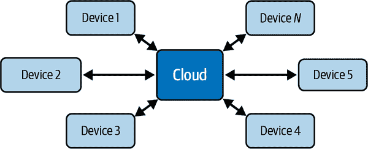

###### 图 9-9\. 带智能设备的边缘架构

## 智能网关

通过电线或无线连接到智能网关的“愚蠢”设备/传感器，可以代表它们执行逻辑，如图 9-10 所示，是处理同一地点（例如工厂内）大量传感器的首选方法，因为它可以减少管理（一个单一的智能设备代替*n*个）及相关成本。然而，这也在架构中引入了一些安全挑战，因为它可能成为单点故障（SPOF）。

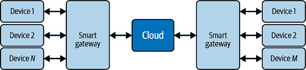

###### 图 9-10\. 带智能网关的边缘架构

## ML 激活

我们之前讨论过一个 PoC 场景，在这个场景中，机器与云环境完全连接，持续地发送和接收数据，以便决定如何处理流水线上的物品（*接受或拒绝*）。那么您已经看到，使这种架构能够在生产中部署的唯一方法是扩展它，使设备能够在边缘直接执行该逻辑。

在边缘设备上执行的代码可能因情况而异，但可以概括为一个 ML 模型，用于处理一些输入（*在本例中是图片*），以获得所需的输出（*在我们的例子中是对物品的最终决策*）。在前几章中，讨论现代数据云架构时，您已经看到云的主要好处之一是其能够大规模收集和处理数据，使开发人员能够轻松实现最先进的 ML 算法。

让我们来看看开发 ML 算法过程的不同步骤（见图 9-11）以及为此，让我们利用之前的例子：

1\. 数据收集

一切都始于作为处理输入数据的数据。在我们的场景中，我们需要开发一个能够从图片开始识别物品信息和特征的模型，因此拥有大量良好项目和带有缺陷项目的图片访问权限非常重要。（请注意，你可以创建任意数量的状态，但为简单起见，我们将仅考虑两个状态：良好项目和通用缺陷项目。）

2\. 数据分析

前一步骤收集的数据需要进行精炼（例如清洗、转换、丰富）以便利用。在这个具体的例子中，我们需要验证所有拍摄的质量（例如焦点、对齐、噪声等），然后针对每张图片，我们需要应用一个标签，指示图片中报告的内容，以生成两个分离的集合：良好项目和带有缺陷的项目。

3\. ML 模型开发、训练和测试

是时候开发算法了；有很多工具和技术可供使用（例如 scikit-learn、TensorFlow、PyTorch），甚至有自动化解决方案可使生活更轻松（例如在特征工程、模型选择和参数调优中提供支持）。在我们的例子中，我们可以使用迁移学习技术开发一个深度学习模型来识别图片。

4\. ML 模型部署

模型已准备好用于预测。它可以作为 API 服务部署在云端或直接部署在边缘节点。

5\. 反馈数据收集

为了提高模型质量，可以收集来自边缘的数据，然后重新开始交互式过程，旨在使预测结果更好。在我们的案例中，边缘节点将返回（例如批处理过程）预测结果和分析过的图片。

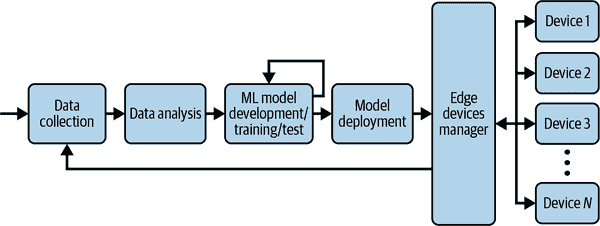

###### 图 9-11\. 边缘规模上的 ML 开发/部署

很明显，这些 ML 建模步骤对边缘架构施加了一定的要求：

1.  数据收集需要能够长时间存储收集的图片，以便可以更换硬盘并将其移至网络连接更好的地方，并将数据上传到云端。

1.  数据分析可以在云端进行。

1.  ML 模型开发也可以在云端进行。然而，测试需要能够在云端模拟边缘环境。

1.  部署要求在开发 ML 模型时考虑边缘硬件的特性。将 ML 模型部署到边缘可能需要升级硬件组件，以包括如 Google Coral Edge TPU 或 NVIDIA Jetson Nano 的 ML 推断芯片。

1.  反馈数据收集要求实施一个应用程序，以跟踪人工操作员在 ML 算法建议的决策上覆盖的情况。

现在您对边缘计算范式的理论有了更多了解，让我们看看您如何采用它。

# 采用边缘计算

让我们看看采用这种范 paradigm 可以为模范组织带来更大的可见性和更高的效率。

## 初始背景

MagiCan 是一家专门生产饮料罐头的（虚构）制造公司，为世界上最具标志性的品牌提供服务。该公司在全球各地设有多个生产工厂，每个工厂都有多台机器全年无休地运行。该公司的战略一直是在城市外地区建厂，并且在某些地点，当地电信公司提供了基于旧无线技术（例如，3G 运营商）的互联网连接。

公司的核心价值之一是“高质量产品是必须的，无论付出多大努力”，并且一直投入大量资金确保端到端生产周期的质量（例如，维护机械设备和对生产物品进行质量检查）。

MagiCan 发现需要处理的几个问题：多台机器存在过多故障，导致多个生产点多次停工；产品存在缺陷，导致罚款；难以全面查看生产厂的状态。因此，董事会决定启动一个新项目，改善其收集和处理工厂数据的方式，以解决所有这些问题。

## 项目

该组织已经利用云计算解决方案处理多个工作负载（例如，DWH、网站、SAP 等），并决定扩展当前架构，投资于直接连接到其机械设备的设备：目标不仅是直接从工厂收集数据，实时查看机器运行情况，还允许用户操作某些参数/组件（例如，执行器、装配线等），以修复问题或校正不准确之处，提高生产过程的整体质量。

该组织在物联网项目专业的第三方合作伙伴的帮助下，定义了一个三步旅程：

1.  *通过开发所需架构*从工厂收集数据并构建近实时监控系统来提高整体系统的可观察性。

1.  *开发自动化*以调整执行器的功能。

1.  *通过开发预测模型优化*机械设备的维护。

让我们深入探讨这次旅程的三个步骤。

### 提高整体系统的可观察性

考虑到 MagiCan 在全球多个地点设有工厂，并且大部分工厂无法与云世界稳定连接，因此无法基于流式模式开发实时架构。公司决定将问题分为两个不同的部分：

+   *本地架构*（在工厂级别），所有机器实时连接，并且所有信息可以立即被中央但本地的应用程序看到

+   *集中式架构* 利用云系统，从工厂收集的信息每天多次以批处理方式处理

目标是在每个工厂开发一种标准的监控机器的方法，并在工厂脱机时保持数据可用。中央云脑必须收集来自不同工厂的所有数据，然后让数据科学家能够研究这些数据，以便能够提取更多的见解，并利用云的力量，如图 9-12 所示。

在每个工厂，部署了带传感器的设备到各种机器上，以收集来自不同执行器（如速度、转速、温度等）的数据。这些设备通过智能网关与本地连接，能够实时收集所有数据，并通过自定义开发的可视化工具提供用户一种对工厂状态进行连续快照的方式。每隔 *x* 分钟，数据被压缩并发送到云端进行进一步分析，然后与其他工厂的数据聚合。如果网络出现问题，批处理将排队，并在下一批次中发送数据以提升。

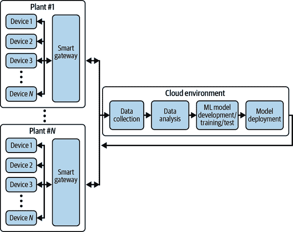

###### 图 9-12\. 高级物联网平台架构

### 开发自动化流程

一旦云端收集到来自所有工厂的数据，就是开始有些有趣的时候了！可用的大量信息使团队能够获得关于多个方面的可见性，例如：

+   工人如何与机器互动

+   油罐上执行器配置与缺陷之间的相关性

+   由于机械问题导致的平均无活动时间

+   在使用特定原材料时的理想机器配置

考虑到设备与云之间通过智能网关的双向连接，可以发送反馈并使机器接收到更新信息以调整它们的操作方式。公司开发了一个几乎实时的过程，用于处理来自工厂的所有数据，了解与理想目标操作模式的差异，并发送更新配置以立即调整执行器行为。通过这种集中管理的流程，可以根据它们正在运行的当前情况为机器提供定制配置。

### 优化维护

最后一步是解决一个相当难以处理的问题：机器的维护。在获得机器运行的统一概览之前，维护是通过两种不同的方式进行的：

通过计划的干预进行计划维护

根据机器型号、历史记录和操作方式，定期检查机器。

通过临时干预进行的非计划维护

由于某些事件，如组件损坏或操作人员错误导致的故障，机器被有目的地检查。

考虑到维护操作可能使机器停机数小时甚至数天，尽量减少非计划停机时间非常重要。利用来自工厂的数据（在初始投入使用后几个月后才可能进行分析，因为需要足够的历史数据量），开发了预测机器学习模型算法，用于计算机器故障的概率：当百分比超过一定阈值时，会向工厂经理发送警报，他必须决定如何处理（即，安排一次非计划维护操作或等待下一次计划维护操作）。

## 最终成果和下一步计划

整个端到端项目花费超过一年时间才完成，但最重要部分的第一版发布（即在各个工厂统一视图开发）相对较快地实现了（不到六个月）。由于这种分布式架构，公司能够提高在工厂和公司级别的可观察性，利用了一种通用、标准化和统一的流程。同时，它能够提高整个生产链的效率。MagiCan 现在正在专注于一个全新的项目，旨在降低质量检查的成本，在过程中尽可能自动化。与本节开头介绍的类似，该组织希望扩展已经建立的架构，实施一个能够自动识别装配线上缺陷的流程：为实现这一目标，将利用具有基于机器学习模型逻辑执行能力的新摄像设备。其目标是将目前执行质量检查的大部分人力资源重新分配到其他活动中去。

# 概要

本章为您提供了如何处理混合和多云架构的高层次理解，当单一云服务提供商无法满足所有业务分析需求时。它向您介绍了处理这类架构时需要考虑的各种因素，以及一些常见的实施模式。最后，它向您介绍了边缘计算及其使用方式。主要收获如下：

+   将整个软件架构统一在单一云服务提供商上非常具有吸引力，因为整体架构简单，学习和采用容易，而且总体成本低廉。

+   小型和中型企业应选择单一的云服务提供商，并利用该超大规模提供商提供的完全托管服务设计其架构。

+   由于收购或希望使用在某个云上可用的服务的愿望，多云架构可能变得不可避免。

+   当组织担心被锁定、需要实施退出策略、有严格的监管要求或希望增加工作负载可移植性、创新、知识和可持续性水平时，必须考虑多云战略。

+   采用多云战略是一个旅程，需要明确定义要遵循的战略，并扩展团队的技能。

+   处理多云架构时，可以利用各种架构模式，如开发单一玻璃窗口、在本地工作负载中突破 Hadoop、使用 Hadoop 直通以在云中进行数据处理以及改变流以实现数据集成。

+   边缘计算是一种旨在将部分存储和计算资源从云端带到生成/使用数据的主体附近的范式。

+   带宽限制、网络拥塞、可靠性、法律合规性和安全性只是边缘计算范式可能带来的一些好处。

+   边缘计算的主要挑战包括计算和存储能力的限制、管理/远程控制以及备份和恢复。

+   利用这种边缘计算范式的主要用例包括自动光学检测、改进的安全性、农业、医疗保健、内容分发网络（CDN）、沉浸式互动、智能城市和交通管理系统。

+   在选择边缘架构时，智能设备比使用智能网关更简单但更昂贵。在任何情况下，ML 激活都涉及添加诸如设备存储和 ML 推理芯片等能力。

下一章中，您将学习在人工智能和机器学习中应该做出的关于架构和框架的高层次决策。
