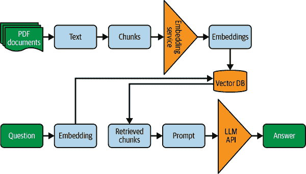
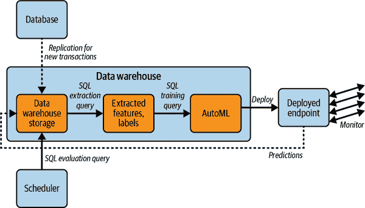

# 第十章：AI 应用架构

在本章中，您将了解在构建 AI 和 ML 应用程序时应该做出的架构和框架的高级决策。我们首先考虑 AI/ML 擅长解决哪些问题以及如何负责地开发和部署 AI。一旦您确定 ML 适合解决某个问题，您将不得不继续决定您采取的企业方法：您是购买、适应还是构建？我们看看每种情况的例子以及如果选择采用这些方法时的考虑因素。如果您正在构建，有几种架构选择，选择取决于正在解决的问题类型。

本章涵盖了应用层面上 AI 架构的考虑因素和决策标准。数据科学家和 ML 工程师将在第十一章中讨论开发和部署这些应用程序的平台。不要跳过这一章直接进入下一章的技术细节——作为云架构师，您需要为每个应用团队提供建议，以便在您的平台上为其构建的每个应用选择正确的购买、适应或构建以及 AI 架构的选择。

###### 注意

本章和接下来的一章的目的是向您展示如何使用云技术架构 ML 平台。就像我们在数据仓库章节中没有涵盖 SQL 一样，在这些章节中我们也不涵盖 TensorFlow。如果您希望学习如何进行 ML，我们诚挚推荐 Aurélien Géron（O'Reilly）的书籍[*Hands-on Machine Learning with Scikit-Learn, Keras, and TensorFlow: Concepts, Tools, and Techniques to Build Intelligent Systems*](https://oreil.ly/62m5z)。

# 这是一个 AI/ML 问题吗？

要了解机器学习可以解决哪些问题，让我们从我们在第一章中简要提到的一些基础知识开始。我们将从一些定义开始，然后考虑 ML 作为解决方案通常适合的问题类型。

## AI 的子领域

AI 是通过让计算机像人类一样思考和行动来解决问题的研究领域。在 AI 的历史上，曾经尝试过几种方法。一种方法是编写明确告诉计算机在每种可能情况下该做什么的代码。即使今天，许多机器人设备如制造机器人和家用吸尘器仍然是这样工作的。问题在于编写这些规则很困难。另一种方法是采访或观察专家，并使用他们的行为来编写规则。像批准病人参与实验性药物试验的 AI 模型就是这样工作的。但是即使是专家也不能告诉你他们为什么这样做。人类决策背后有很多直觉，而且一个人越是专家，他们跳过的中间步骤就越多。这些方法的困难导致了所谓的“AI 冬季”，即 AI 陷入停滞的时期（大致在 1985 年至 2014 年之间）。

ML 是 AI 的一个子领域（参见图 10-1），它使用数据而不是定制逻辑来解决 AI 问题。当您无法表达逻辑或者逻辑编码为计算机程序过于困难时，ML 就显得尤为有用。例如，ML 系统不是捕捉钉子和螺钉之间所有的区别，而是向它展示数百个钉子并告诉它它们是钉子，展示数百个螺钉并告诉它它们是螺钉。然后 ML 模型通过调整一个内部非常通用的数学函数来学会如何区分它们。ML 已有数十年历史，但直到大约 2014 年之前，它只能处理可以存储在数据库中的结构化数据。

*深度学习*是机器学习的一个子领域，在 2010 年代末开始受到广泛关注。它使用高度复杂的函数（这些函数在图形表示中增加了“深度”，因此得名）。深度学习已成功应用于理解语音、图像、视频和自然语言等非结构化数据。深度学习是为什么您在过去几年看到智能音箱（Google Assistant、Alexa、Siri 等）、图像搜索（Google Photos）、自动翻译和即时视频精彩片段（在体育节目中）如此流行的原因。深度学习非常强大，但在创建 ML 模型时需要大量的数据。


###### 图 10-1\. AI、ML、深度学习和生成 AI 之间的关系

## 生成 AI

传统上，ML 涉及解决分类和回归问题。现在，有一种越来越强大的第三种 AI 形式：*生成 AI*。生成 AI 是一种深度学习，早在 2020 年代初就引起了人们的关注。在这里，模型的输出可以是文本、图像、音乐、视频等。例如，像 ChatGPT 这样的 LLM 通过向模型展示大量的自然语言文本来训练，使其能够根据前文预测最有可能的下一个词语。LLM 用于生成一组初始词语，然后根据这些初始词语和提示以可能的方式完成序列。类似地，图像生成模型被训练以预测像素值，语音模型可以生成音频频率和振幅值。生成 AI 最初的应用是在句子完成（例如 Gmail 中的智能写作）和代码完成（例如 Tabnine、GitHub Copilot）方面，但现在，越来越复杂的产品使用生成 AI 来生成销售、营销等领域的邮件和文章的初稿。

### 它是如何工作的

ChatGPT、Bard、LLaMa 等都是被训练用于以多种风格和不同目的生成文本的 LLM，同时保持高精度和详细程度。在最基本的层面上，这类 ML 模型已经被训练能够完成句子。想象一下，您开始写如下内容：

> 我们正在漂浮

模型将提出一些进行句子进展的方式。例如：

> ... 在河流上 [80%]
> 
> ... 在空间中 [15%]

语言模型已经展示了大量的出版例子——演讲、文章、书籍、评论等——使其能够理解哪些词语最有可能跟随其他词语。

但是，如果您将包含“火箭”或“夏季”等词语的先前短语传递给模型，那么后续出现的词语的相对概率将会改变。基于广泛的训练数据集，模型似乎能够适应上下文，并生成看似准确、详细和一致的响应。在其训练阶段，语言模型已经学会了哪些词语或短语需要特别关注。此外，在 LLM 的训练过程中，还使用人类反馈，以便它更倾向于人类最喜欢的词语延续。

像 GPT-4（ChatGPT 背后）和 PaLM（Bard 背后）这样的基础 LLM，是为涉及常见语言问题的通用任务而训练的，包括文本分类、问答、文档摘要和跨行业的文本生成。这些模型提供了一种互动方式来总结大量的知识和信息。这可以是多模态的，即以不同的非结构化格式，如文本、图像，甚至视频。即使只有少量特定领域的训练数据，这些模型也能取得令人满意的结果。

细调 LLM 超越了全球知识的范围，专注于特定的任务和领域。例如，专注于医疗保健的 LLM，如 Med-PaLM，经过特定的标记数据集训练，以适应在医疗保健领域内执行特定任务的模型。这些标记的数据集对于训练模型准确识别医疗实体、撰写医疗护理说明书以及执行其他与医疗保健相关的任务至关重要。

### 优势和局限性

此技术仍处于起步阶段，并带来了许多承诺，但也需要考虑到几个限制，特别是在企业规模上的采用。让我们看一下需要考虑的最重要因素。

### LLM 是否记忆或概括？

尽管 LLM 看起来似乎能够处理任何类型的上下文，因为它们已经在包含数十亿参数的大规模数据集上进行了训练，但它们实际上不能存储地球上所有可用的数字信息。因为它们无法记住所有可能的单词序列在上下文中的位置，所以它们会在可能的单词和上下文之间进行插值。然后在可比较的上下文中选择类似的延续。

这是否意味着 LLM 能够超越其训练文本进行概括？有争议。模型可能生成与给定上下文一致的文本，但这并不一定意味着它真正理解了真实世界。需要进行更多研究来确定像这样的模型是否能够真正超越它们训练的文本范围。

然而，这个领域正在快速变化。在撰写时，可以使 LLM 利用外部数据集和服务来“基于”LLM 或告诉它推理。毫无疑问，LLM 的能力将继续变得更好。

### LLM 幻觉

当前 LLM 最显著的限制之一是它们可以“幻觉”，这意味着它们可能生成在语法上正确但逻辑不合或不真实的文本。在这种情况下，我们称该模型显然产生了幻觉。

这是必须仔细解决的重要约束条件。考虑到大多数读者会快速浏览他们阅读的某些部分，可能并非所有人都能够识别出文本中存在幻觉的情况。在撰写时，需要考虑到检查准确性所需的人工工作量，这是计划采用这项技术时需要考虑的事项之一。

### 需要人类反馈

为了减少产生无意义文本的数量，通常在培训面向消费者的 LLM 时通常会添加额外步骤。这称为通过人类反馈进行的*强化学习*（RLHF），涉及训练模型根据人类评级选择生成的文本文档之间。

此外，人类帮助训练模型创建特定格式的文档（例如电子邮件、博客文章、项目符号等），并引导模型远离有害文本。

### 弱点

现在您了解了 LLM 的训练方式，显然它们会有一定的局限性：

+   如果任何输入源错误，那个错误的延续将成为可能的延续集的一部分。因此，LLM 可能会复制错误信息和/或过时的概念。

+   该模型在数字格式发布的大量文本存在的领域中表现更佳。因此，在编码和政治等领域，LLM 将更为出色，但在人类学等领域则较差。

+   难以标记不寻常的数字和名称（LLM 使用子词标记）。因此，您应始终仔细检查 LLM 生成的事实信息，如数字、文章作者等。

+   像所有 ML 模型一样，LLM 不应在期望确定性结果的情况下使用。

在构建依赖生成式人工智能的应用程序时，牢记这些限制是很重要的。

### 使用案例

这些限制并不意味着 LLM 没有用处。我们已经看到它们的各种良好应用：

领域特定助手

LLM 是根据您组织的数据进行训练的，以回答需要您的员工阅读大量文档的特定问题。例如，LLM 可以回答有关内部规定的问题。这可以节省员工的时间并提高效率。

代码片段

生成模型可以编写代码片段或审查现有代码（如自动对等编程员），以加快开发或文档编写的速度。但是，生成的代码可能不会按您的意愿执行，因此您应该逐步测试和编辑生成的代码。

文档摘要

LLM 可以帮助总结长文档，以提取相关信息（例如财务数据的资产负债表）。这也可以是提高工作流效率的一部分。

内容生成

大规模内容生成（例如个性化营销或销售）是由生成式人工智能解锁的。

一些 LLM 的生产使用案例包括 Gmail 的智能撰写、Jasper AI 的营销文案生成、Salesforce 的个性化销售电子邮件编写能力以及 GitHub Copilot 的代码生成能力。我们看到许多组织正在利用生成式人工智能为员工提供更好的访问私有知识库的途径，通过自然语言问答机器人。另一个广泛和成功的使用案例涉及使用图像生成算法来提高市场广告的差异化水平。然而，不要低估在创建这类产品时遇到的困难，其中生成的文本或图像解决了人类的痛点，准确无误，并符合人类标准。

## 适合机器学习的问题

您可以用机器学习解决什么样的问题？在许多这些条件同时存在时，ML 最具有说服力的应用案例发生：

重复决策

您有一个简单的“大脑”任务，必须重复执行多次，以至于人类执行起来非常昂贵或不可能。如果您是一家医疗保险公司，每天收到数千份报销请求，让人类查看报销请求并确定是否需要进行该程序非常昂贵。如果您能让计算机识别可疑的索赔，那将为您节省大量资金。相反，对于罕见的决策自动化并没有太多的商业利益。然而，数据科学家却常常陷入试图将 ML 应用于每年仅需解决几次的问题的情况中，这令人惊讶。

标记数据

当您能通过展示正确决策示例来教授 ML 系统时，ML 就会起作用。聚类数据并寻找异常值的异常检测是一个例外。然而，绝大多数 ML 问题需要您提供具有正确答案的示例。

容错使用案例

因为没有哪个 ML 算法是完美的，所以您不应在错误对生命或财产有致命影响的情况下使用 ML。您必须考虑 ML 系统出错的后果，并愿意承担后果。在错误影响重大的情况下，常见的做法是让人类参与决策过程或设立止损条款。

难以表达的逻辑

一些逻辑越难以表达，ML 在处理它时就越好。请注意，编写如何计算多边形面积的逻辑是相当容易的。这不是 ML 擅长的问题类型。当捕捉逻辑容易时，应使用传统编程方法。将 ML 保留给人类难以掌握的情况（例如，从照片中计算房间面积）。

非结构化数据

对于处理结构化数据，传统规则通常效果很好，但对于非结构化数据，则需要 ML。如果您收到一个 HTTP 响应，其中包含用户在网站上点击的按钮信息，并且您想知道他们是否购买了某个商品，那么检查购买按钮是否是他们点击的按钮之一就很简单。另一方面，如果他们在表单中输入了一些评论文本，并且您希望知道评论是否提到了运输问题，则需要处理非结构化数据（评论文本）。

现在您更好地掌握了 ML 是什么以及何时使用它，让我们来看看采用它的最佳方式。

# 购买、适应还是构建？

一旦确定您需要某些 AI 能力，问题就转向是否可以购买现成的解决方案或者是否必须自定义构建。AI 云架构师越来越需要选择在哪些领域购买现成的解决方案更为合适，以及在哪些领域可以构建更好、更具差异化的能力。这个决定可能还受限于优先考虑稀缺的数据科学家资源的需求。

让我们看看决策过程以及某些场景和能力，其中一个或另一个方法更好。

## 数据考虑

一般来说，机器学习模型的质量会随着用于训练它的数据量和质量的提高而提高。数据规模的增加推动了机器学习性能和准确性的显著改善。此外，机器学习系统需要针对新情况进行重新训练。例如，如果你有一个推荐系统用于费用类别，并且你想为酒店住宿提供推荐，那么你不能使用同样的推荐模型。你必须在第二种情况下训练它，即在出差目的地被其他员工选择的酒店上进行训练。因此，即使模型代码可能相同，你也必须为新情况使用新数据重新训练模型。

综合考虑这两个概念（当你拥有更多数据时，你会得到一个更好的机器学习模型；而一个机器学习模型通常需要为新情况重新训练），你会得到一个策略，可以告诉你是买还是自建：

+   确定可购买模型是否解决了*与你想解决的同样问题*。它是否已经在相同的输入和类似的标签上进行了训练？假设你想进行产品搜索，而模型已经在目录图片上进行了训练。但你想基于用户手机拍摄的产品照片进行产品搜索。那么在目录图片上训练的模型将无法处理你的手机照片，你将不得不建立一个新模型。但假设你正在考虑一个供应商的翻译模型，该模型是在欧洲议会的演讲中进行训练的。如果你想翻译类似的演讲，该模型会很好地工作，因为它使用了相同类型的数据。

+   供应商是否拥有比你更多的数据？如果供应商在欧洲议会的演讲上训练了他们的模型，但你比他们拥有更多的演讲数据，那么你应该自建。如果他们拥有更多的数据，那么购买他们的模型就合适。

简而言之，如果供应商有一个解决你想解决问题的解决方案，并且他们有更多/更好的数据，那么你应该购买它。如果没有，那就自建。越来越多的选择是：调整一个预构建模型。让我们分别看看这三种情况中的架构和其他考虑因素。

## 何时购买

当一个可信的服务提供商提供适合你的问题的即插即用服务或 API 时，你应该认真评估购买该服务。它几乎总是比你可以自己构建的东西更便宜和更易维护——请记住，一个流行的服务可以在数百用户中分摊其开发预算，而你必须自己支付所有改进的费用。

此外，应用市场的存在意味着该能力对你的业务不是核心。另外，你的团队可以做一些比实施可购买的东西更具独特性和差异性的事情。

当其他云或可信第三方提供了替代方案时，您可以对自己的工作负载进行评估，并选择最适合的解决方案。购买 ML 能力是一个您无需担心使用哪个云的地方——在许多情况下，这些只是 API，无论您的应用程序在哪个云上运行，都可以调用它们。例如，您可以在 AWS 上运行您的网站，但它可能会调用 Google 的 Translate API 来处理评论文本。

您可以购买 AI 能力的三个抽象级别：

SaaS

一些 AI 能力通过即插即用的 API 提供。例如，来自 Google Cloud 的 Retail Search 是一个即插即用的服务，任何企业都可以使用它来提供其电子商务网站内的 ML 支持搜索。Amazon Connect 是一个即插即用的服务，提供联系中心能力。Azure 的计算机视觉 API 可以通过发送图像来调用，并获取图像中包含的信息。所有这些都是通过 API 直接用于与您的应用程序集成的服务示例。这些模型经过多种数据集的训练，可能比您可以自行组合的任何东西更准确和更强大。

基础构件

有时，可以购买的能力并不构成完整的业务用例。尽管如此，您可能希望将该 AI 能力作为应用程序中的基础构件使用。例如，您可以在 NLP 管道中使用 Google DocAI 的实体提取或表单解析功能。在将这些图像导入系统之前，Azure 计算机视觉可以用于预扫描图像中的成人内容。Amazon Rekognition 可用于识别入职系统中的人员。

企业应用程序

有时，能力过于定制化，无法作为 SaaS 购买，也太复杂而无法作为基础构件提供。在这种情况下，您仍然可能购买组合产品和服务的能力。供应商在您的行业中实施该能力的经验，并可以重复使用其较早的工作来为您构建能力。可重用代码与现场代码的相对比例因供应商和用例而异。例如，C3 AI 将根据您的第一方数据构建反洗钱解决方案，但利用其在其他金融公司构建类似解决方案的经验。

此类能力的来源不仅限于主要的云提供商。Google Cloud、AWS 和 Azure 的市场都有来自各种供应商的广泛选择的 SaaS 能力。系统集成商（如 Accenture 和 Wipro）和 AI 应用提供商（如[C3 AI](https://oreil.ly/SHnU8)、SpringML 和 Brightloom）提供 AI 解决方案，以改善客户参与、定价、数字营销、收入智能、产量优化等方面。

## 您可以购买什么？

一个正在采用人工智能的公司的云架构师必须熟悉供应商选择和供应商管理。了解像 TensorFlow 这样的 ML 框架和像 SageMaker 和 Vertex AI 这样的 MLOps 平台的知识是不够的。

随着基于人工智能的初创公司的爆炸性增长以及全球和地区系统集成商增加 AI 实践，可以购买而不是构建的能力数量继续大幅扩展。我们在本节写的任何内容几个月后都将过时，因此我们将以大致的概述进行讨论，并鼓励您进行研究、要求演示，并做出明智的决定。通过选择合适的供应商，您可以节省数月的努力，并显著降低失败风险。

这里是一些 2023 年初存在的能力：

更好的客户服务

有许多 AI 解决方案可以改善客户服务链的每一个步骤，从自动处理电话、创建聊天记录到提高呼叫中心代理效率和获取产品见解。这些解决方案通常是全渠道的，可以支持语音、聊天和电子邮件。还存在生成式 AI 解决方案，可以搜索您的文档存档并为用户查询提供答案。

工作流辅助

编码助手可以提高软件工程的生产力。工作流合作者可以简化许多企业功能，如审查法律合同和处理发票。

提升营销支出

数字用户活动提供了大量信号，数字营销的影响是可衡量的。这导致了许多围绕隐私安全营销分析、品牌测量、相似受众和提高活动表现的 AI 解决方案。

编写销售和市场营销内容

存在生成式 AI 解决方案来制作广告活动并帮助撰写文案。它们还可以使用替代数据集和第一方数据来为 RFP、个性化发票、销售电子邮件等提供响应。

推荐

产品和下一步行动建议已经广泛存在，这些能力作为行业特定的、易于部署的解决方案提供。

公开可用或可收集的数据

基于公开可用或可收集的数据（如社交媒体帖子、天气、网络图像、股市交易等）的能力通常可供购买。

零售

从货架管理到全渠道营销归因、需求预测和价格优化，各种能力都可以购买。

制造业

虽然设备可能各不相同，但预防/预测性维护、产量优化和质量控制等能力可供选择，并可定制。

供应链管理

从阅读海关表单到库存管理和司机路线管理等许多能力都可以购买。

医疗保健

许多阶段的制药研究，检测许多疾病和医疗条件以及医疗提供者设施的最佳利用具有相应的能力。

媒体和娱乐

许多能力，如在冰球比赛中跟踪冰球，估计高得分足球比赛的可能性，创建图像缩略图和视频亮点等，已经可用。

后勤运营

许多后勤操作可以通过自动化工作来改进。从保险申请处理到分类发票，无所不在的机器人流程自动化（RPA）解决方案。生成 AI 解决方案存在，可以使用第一方数据自动填写表单并通过 API 调用后端代理。

金融服务

多种能力，如客户互动的个性化，嵌入式金融解决方案，风险价值和“假设”分析，以及实时欺诈分析，都是可用的。

我们避免命名上述能力的示例提供者，因为在您阅读本文时，肯定会有更多选项。无论如何，在决定构建之前，请查明现成解决方案在解决您问题方面的效果如何。您可能会感到惊讶。

## 适应工作原理

训练最先进的图像分类模型（SOTA）需要超过 1000 万张图像。您感兴趣的用例可能没有这样大规模的数据集。

解决方案是采用在与您的类似的适当大规模数据集上训练的 SOTA 模型（通常称为*预训练模型*或*基础模型*），然后调整该 SOTA 模型以适应您的数据。您的数据可以仅为 10 张图像，包括正面和负面示例，尽管您拥有的（高质量）数据越多，模型的表现就越好。

适应是在购买和构建之间的中间选择。您既可以享受供应商的大数据集带来的好处，又可以根据自己的数据进行定制。

有两种方法可以进行这种适应：

迁移学习

这保留了原始模型的 99%以上，并调整了剩余的权重以适应您的数据。具体来说，它保留了模型中的 99%，该模型已经学会如何从数据中提取信息，然后训练剩余的 1%的模型，该模型操作提取的信息来得出结果。

微调

这保留了整个原始模型，并调整了整个模型以适应您的数据，但保持了权重更新的幅度足够小，以便原始学习的信息不会完全丢失。与直接修改权重不同，一些“低秩”生成 AI 微调方法会训练一个辅助模型，该模型调整基础模型的权重。

您可以在 [TensorFlow Hub](https://oreil.ly/GRfl5), [PyTorch Hub](https://oreil.ly/wAxQj), 和 [Hugging Face](https://oreil.ly/zJbVe) 等网站上找到预训练模型，这些模型通常是用于构建像图像分类、光学字符识别和语音转文本等功能的开源模型。使用自己的数据来进行模型的微调或迁移学习。

预训练的核心 LLM（如 OpenAI GPT 和 PaLM）是为解决跨行业常见语言问题而训练的。可以对这些模型进行微调以执行特定任务，例如创建医疗程序检查单。然而，在生成式 AI 的情况下，要向模型教授新信息，需要在该行业数据上重新训练（而不仅仅是适应）模型。标记的行业特定数据集对于训练模型以准确识别医疗实体或分类医疗文本至关重要。

超大规模机器学习平台提供完全托管的体验，以适应预训练模型。例如，AutoML Translate 提供了一种方法，可以使用自己的短语对自适应谷歌翻译 API，例如行业特定语言。生成的模型可以执行谷歌翻译 API 所能做的所有翻译，同时了解您添加的行业特定术语。其他超大规模云提供商也提供类似的选项。

因此，完整的决策标准变成了：如果供应商的解决方案在同一问题上进行了训练，并且可以访问比您更多的数据，则购买供应商的解决方案。然后，考虑如果您有自己的独特数据，是否可以调整（从供应商那里学习迁移或微调）供应商的解决方案，以便执行定制任务。与将外部创建的工件整合到软件中的任何情况一样，您必须确保供应商符合您的法律要求。

您可以从云服务提供商和合作伙伴购买、适应或构建的事例总结在 Table 10-1 中。即使在撰写时这已经是一个不完整的列表，阅读时无疑会增长。在 Table 10-1 中包含技术（例如 Azure ML 计算机视觉或 AWS Lex）并不意味着对其他云中类似服务（例如 AWS Rekognition、GCP Vision API、Azure ML NLP、GCP DocAI 等）的认可。

Table 10-1\. 可以购买、适应或构建的示例云能力

| 策略 | 示例 ML 能力 | 原因 |
| --- | --- | --- |
| 购买 SaaS |

+   Amazon Forecast

+   Amazon Connect

+   Azure ML 计算机视觉

+   GCP 零售搜索

+   GCP 翻译 API

+   Google 企业搜索

| 可以轻松集成的即插即用服务或 API。这些模型是在多样化数据集上训练的，可能比您可以组合的任何东西都要好。 |
| --- |
| 购买构建块 |

+   AWS Lex

+   Amazon Polly

+   AWS 上的 Hugging Face

+   Azure OpenAI GPT

+   GCP DocAI 表单解析器

+   GCP NLP 实体提取

| 用作您的 ML 应用程序的构建块。为非核心业务功能重新发明轮子是不必要的吗？此外，您很少会有足够的数据来训练更好的模型。 |
| --- |
| 购买企业应用程序 |

+   AWS 预防性维护

+   Azure 价格优化

+   GCP 联系中心 AI

+   GCP 推荐 AI

+   GCP Med-PaLM

+   C3 AI 收益优化

+   Symphony Retail

| 结合产品和服务来部署和配置应用程序，以满足您组织的需求。 |
| --- |
| 适应 |

+   AWS 快速入门

+   Azure OpenAI Studio

+   GCP AutoML 视觉

+   GCP AutoML 视频智能

+   Vertex AI 微调 PaLM

| 在自己的任务上微调 AI 模型。在您拥有非常大的数据集之前，这些模型很可能优于仅基于您数据构建的定制模型。 |
| --- |
| 构建 |

+   AWS SageMaker

+   Azure 机器学习

+   GCP Vertex AI

+   GCP Dialogflow

| 管理框架用于构建端到端的 ML 模型。这在 Chapter 11 中有详细介绍。 |
| --- |

Table 10-1 中的策略专为不同技术技能集定制。前三种方法需要系统集成能力，而最后两种则需要数据科学家。

接下来，让我们看看一旦确定您需要的 AI 能力必须由您的团队构建时需要考虑的事项。

# AI 架构

总的来说，目前有七种成功的 AI 应用类型：

理解非结构化数据

例如，您可能有一张设备的照片，并希望 ML 模型能够识别型号编号。理解图像、视频、语音和自然语言文本的内容属于这类应用的范畴。

生成非结构化数据

您可能在诉讼中接收一组文件作为“发现”，并可能需要总结收到的信息。或者您可能希望基于客户的最后五次购买创建个性化广告，将它们编织成一个故事。现在可以使用 AI 生成文本、图像、音乐和视频。

预测结果

例如，您了解购物车中物品的信息以及购物者的购买历史，希望确定购物车是否可能在没有发生购买的情况下被放弃。预测事件的发生可能性或程度属于这类应用的范畴。

预测数值

例如，您可能希望预测特定类别的商品在未来一周内在特定商店的销售数量。预测未来时间点的库存水平等时间变化数量属于这一类。预测结果与预测值的区别并不总是清晰的。在预测结果中，其他属性是事件发生的主要决定因素。在预测中，时间变化的模式是最重要的因素。有些问题您可能需要尝试两种方法。

异常检测

在许多情况下，目标是识别不寻常的事件或行为。例如，在游戏场景中，可以使用异常检测来识别作弊事件。

个性化

您可能希望基于用户和其他用户（像这个用户）过去喜欢的内容来推荐产品或制定体验。

自动化

这就是您采用机器学习来替代部分或全部目前效率低下的流程的地方。

在本节中，我们将分别讨论这些问题的经典架构和技术选择。所有这些架构都将建立在下一章讨论的平台之上。

## 理解非结构化数据

深度学习理解图像、视频、语音和自然语言文本内容的能力随着时间的推移而不断提高。

就在几年前，语音识别模型的能力远远落后于人类。现在，虽然不完美，语音转文本模型常用于对上传的视频和现场演讲进行字幕。所有其他类型的非结构化数据也看到了同样的改进。

深度学习不需要传统机器学习方法通常需要的特征工程步骤。因此，您可以以非常通用的方式构建深度学习系统。用于区分螺钉和钉子的 ML 模型架构也将适用于需要区分骨折骨头和完整骨头的情况。请注意，我们说的是相同的*架构*，而不是相同的*模型*。这是因为第一个示例中的模型将训练于螺钉和钉子的图像，而第二个示例中的模型将训练于断裂和完整骨头的图像。虽然架构相同，但权重会不同。

研究界已经为图像、视频、语音和文本分析中的标准问题开发并发布了模型架构。与在购买人工智能部分讨论的预构建模型不同，这些模型未经过大型数据集的训练，或者即使经过了训练，它们所训练的数据集特征与您的数据有很大不同——您将需要使用自己的数据从头开始训练这些模型。

因此，在涉及非结构化数据的问题时，通常不必设计自己的模型架构。只需选择一个最先进或接近最先进的模型，并在您的数据上进行训练。所有主要的云服务提供商都提供了便捷的机制来实现这一点。它们通常从存储在 AWS S3、Google Cloud Storage 或 Azure Blob Storage 中的非结构化数据开始。然后使用无代码或低代码服务，如 Vertex AI AutoML 来训练和部署模型（参见 图 10-2）。


###### 图 10-2\. 对于非结构化数据，使用无代码、端到端的机器学习服务，如 Google Cloud Vertex AI 中的 AutoML 或 AWS SageMaker

最困难的事情可能是为训练数据的 AutoML 模型提供*标签*—标签是正确答案。这可能涉及人工标注。您可以使用类似于 Amazon Mechanical Turk、SageMaker Ground Truth 或第三方提供的等效服务的众包计算服务，以避免自己进行标注的单调工作。

## 生成非结构化数据

生成式人工智能是一种可以创建新内容（如文本、图像、音乐和视频）的人工智能类型。它通过学习现有数据的结构（例如哪些英语单词倾向于跟随其他英语单词）然后利用这些统计知识生成逼真的新内容。在本书出版时（2023 年 10 月），生成式人工智能的架构正在快速发展中。毫无疑问，在您阅读本书时，选择会更加广泛和/或更加精简。

在撰写本文时，大多数生成式 AI 的用例涉及通过接受文本提示作为输入的 API 调用预训练模型。这被称为*零样本学习*。例如，通过向像 Azure OpenAI 上的 DALL-E、GCP 上的 Imagen、AWS SageMaker Jumpstart 上的 Stable Diffusion 或 Midjourney 提供文本提示，可以生成图像。同样地，您可以通过向 Vertex AI 上的 PaLM、Azure OpenAI 上的 GPT-4、AWS Bedrock 上的 Cohere 等发送自然语言请求，要求生成一篇新文章的大纲。通过不同的超大规模计算提供商（GitHub Copilot 在 Azure 上，Codey 在 Google Cloud 上，CodeWhisperer 在 AWS 上）以及像 Tabnine 和 Replit 这样的独立开发者支持，可以根据生成的代码的自然语言描述进行代码补全和代码生成。制定提示语的语言很重要，这导致*提示工程*成为一个实验和开发框架。在混合架构中，使用由 Perplexity AI 和 Ryax 等初创公司提供的托管 LLM。使用微服务架构来构建采用零样本学习的产品，LLM 是其中之一。虽然提示工程对于原型设计很有帮助，但模型的版本更改可能导致现有提示失败。[大多数从业者通过在其控制下微调模型以用于生产用例来防范这种情况](https://oreil.ly/sJtXI)。

可以在公共云平台上使用它们的平台来对 LLM 进行微调。通常情况下，这是为了指导调优（教 LLM 新任务），以便 LLM 可以回应它目前不知道如何处理或处理得不太好的提示，或者防止断裂变化。微调是通过使用监督的参数高效方法（如 PEFT 或 SFT）对 LLM 进行几个 epochs 的训练来完成的，例如 Quantized Low-Rank Adaptation（QLoRA）。您可以通过它们提供的服务对专有模型进行微调，例如 OpenAI GPT-4 和 Google Cloud PaLM，以及在 PaaS ML 平台（如 SageMaker、Databricks 和 Vertex AI）上对开放性 LLM（如 Falcon、Dolly 和 Llama 2）进行微调。¹ 开源模型中心（如 Hugging Face）越来越受欢迎，作为抽象出必要代码的一种方式。部署微调的 LLM 作为 ML 平台上的 API，就像您处理任何其他 ML 模型一样。

调节指令可以教会模型新的任务，但不能教会新的知识（在撰写本文时，这需要从头开始重新训练模型，使用新数据）。为了便宜地教导 LLM 学习新知识，通常会利用一些模式，这些模式利用 LLM 在少量示例（*few-shot learning*）中解决新任务的能力，利用嵌入到提示中的信息（*retrieval-augmented generation*），或者生成结构化数据以供传递到外部 API（*agents*）。例如，要回答问题，会将问题或其假设答案的嵌入搜索到文档块的向量数据库中，以找到相关文档，并要求 LLM 总结这些文档块来回答提出的问题（参见 图 10-3）。开源抽象层（如 LangChain）正变得流行，用来实现这些模式。在这样的设计中，每个链条步骤都是 ML 管道中的一个容器。容器化的 ML 管道将在下一章讨论。



###### 图 10-3\. 检索增强生成架构，用于使用 LLM 回答问题的模式

## 预测结果

将作为预测结果的历史数据通常存在于日志数据和交易数据库中。例如，如果您想预测购物车是否会被放弃，您必须获取所有网站活动的历史记录—这些信息通常存在于日志数据中。您可能选择包括商品价格、优惠信息以及客户是否实际支付商品等信息。虽然这些数据的一部分或全部也可能从网站日志中检索，但从数据库中查询可能更为简单。因此，在这种情况下，历史数据也包含标签（参见 图 10-4）。


###### 图 10-4\. 预测结果模型通常涉及训练模型，根据 DWH 中其他列的值预测其中一列的值

因此，该架构（参见图 10-5）涉及使用复制机制和连接器将所有必要的数据引入数据仓库。然后可以直接在数据仓库上训练回归或分类 ML 模型——Amazon Redshift 和 Google BigQuery 都支持直接从 SQL 训练模型，并将更复杂的模型推迟到 SageMaker 和 Vertex AI 的底层。一旦训练完成，模型可以导出并部署到两个云上的托管预测服务中。通常，所有预测结果或至少其中一部分将存储回数据仓库，以支持持续评估和漂移检测。



###### 图 10-5\. 建模、部署和监控结果预测模型的架构

只要有足够的新数据或者连续评估确定模型或其特征已漂移，就会重新启动训练。此评估通过将预测与事后获得的真实值进行比较来进行。例如，可以将预测的购物车是否被放弃与一天后实际放弃的购物车进行比较。评估查询定期通过调度程序执行。

## 预测数值

大多数 ML 模型进行推理——它们基于其他因素“预测”未观察到的值。例如，ML 模型可能根据交易金额和信用卡使用地点等因素预测交易是否欺诈。关键在于输入因素不包括要预测的事物（欺诈）的过去值（见图 10-6）。

相反，在预测问题中，ML 模型的输入之一是要预测的事物的先前值。例如，如果您试图预测未来 3 天将销售的三明治数量，则其中一个输入可能是过去 28 天中每天销售的三明治数量。


###### 图 10-6\. 推理与时间序列预测

请注意，在本质上，预测问题要求您反馈过去预测的实际情况。这种实时反馈循环使得数据工程架构变得更加复杂。一个方法如图 10-7 所示。在这里，训练是在数据仓库中的历史数据上进行的，使用 SQL 中的窗口收集数据。这些查询将数据分区为包含当前行和一定数量前导行的段：

```
WINDOW fourweek_window AS
    (PARTITION BY store_id, sandwich_id
    ORDER BY purchase_date ASC ROWS 27 PRECEDING)
```


###### 图 10-7\. 具有分离批处理和流处理管道的时间序列分析架构

然而，在实时情况下，时间窗口需要在流式处理管道中进行。流处理管道提取过去 28 天的数据并将其发送到预测模型进行预测。它还负责保持数据仓库的更新，以便下一次训练运行基于最新的数据。这种方法的问题在于需要维护两个数据管道：一个基于历史数据进行训练的批处理管道和一个基于实时数据进行预测的流处理管道。

更好的方法是使用数据管道框架（如 Apache Beam），它提供了在批处理和流处理数据集上执行相同代码的方式。这限制了由于训练与预测时的不同预处理步骤导致的训练服务偏差。这样的架构如 图 10-8 所示。


###### 图 10-8\. 使用数据管道技术（例如支持批处理和流处理的 Apache Beam）的架构

## 异常检测

在时变数据的异常检测中，有两个时间窗口。较长的时间窗口（比如一个月）内的数据被聚类。然后，较短时间窗口内的数据与这些聚类进行比较。如果较短时间窗口内的数据与较大数据（即新数据与聚类之间的距离较大）不同，则会标记异常。

此处的架构与 图 10-8 中描绘的预测情况类似，只是需要维护两个时间窗口。确保所选择的流处理管道基础设施（如 Cloud Dataflow、AWS Kinesis、Apache Flink 或 Confluent Kafka）能够满足您需要的时间窗口长度要求。

在个体事件的异常检测中，原则是相同的，只是第二个（较短时间）窗口由单个事件或用户会话组成。因此，过去一个月内的事件被聚合以学习正常事件的模式。从分布中的离群值被视为异常。例如，如果目标是识别多人游戏中的机器人，将收集和聚合玩家的典型行为（移动间隔时间、重复移动的可能性、后续移动涉及不同手的可能性等）。任何明显偏离整体分布的玩家都会被标记。

## 个性化

机器学习最常见的用途之一是根据个体的需求定制体验（如游戏）、产品（如音乐播放列表）、服务（如垃圾邮件过滤器）或通讯（如销售外呼）。在尊重用户隐私的前提下进行此类操作需要对数据保密性和安全性做一些基本保证，包括信息是否会从一个用户泄露到另一个用户。

这种定制需要了解不仅特定个体的偏好，还有像进行个性化的用户一样的个体的偏好（例如，营销漏斗中下一步最佳行动）。定制还将尝试突出显示与该个体过去喜欢或积极反应的项目类似的项目。因此，个体的人口统计信息（表现为客户细分，例如“单身，20 多岁，城市，非订阅者”）和项目的特征（例如价格，发布日期等）是个性化机器学习模型的关键特征（见图 10-9）。给定一个人-项目对，个性化模型计算个体对该项目的兴趣程度得分。从候选项目列表开始（例如所有符合用户搜索查询的项目或所有正在进行的促销活动），个性化模型因此能够按照捕捉用户偏好的方式对项目进行排名。

一个好的个性化模型还需要处理*冷启动*问题——如果有一个新用户，仍然需要为他们提供一个合理的体验；如果有一个新项目，仍然需要模型向某些客户推荐该项目。冷启动问题通常作为预处理步骤处理，寻找历史不足的用户或项目，并为他们提供一个合理的体验（例如，推荐最流行的项目而不是不太流行的项目）。


###### 图 10-9\. 仅涉及少量潜在选择的个性化架构；部署的模型是一个包括处理冷启动和修剪最近购买的流水线的一部分。

个性化模型通常需要对推荐结果进行一些后处理。例如，如果用户刚在您的视频流服务中观看了《肖申克的救赎》，您可能不希望再次推荐同一部电影。后处理包括这类规则，用于修剪自动生成的推荐列表。

图 10-9 所示的架构与结果预测（在图 10-5 中描述）的架构相同，只是需要额外的预处理和后处理过滤器。因此，该模型被部署为一个流水线。预处理步骤要求使用统计模型（例如，最流行的项目）来创建一个可以在冷启动情况下使用的模型。后处理步骤要求过滤掉最近的购买，并且需要连接到实时事务数据库。

在图 10-9 中的架构在候选项数量过大时会崩溃。例如，当您访问 YouTube 首页时，会呈现一组推荐视频。该列表的候选空间是整个 YouTube 目录。在您访问网页时对整个目录进行排名是不可行的。因此，当候选列表较大时，架构包括一个批处理管道，为每个用户预先计算出较小的候选推荐列表。此批处理管道运行的频率可能根据用户的活跃程度而变化，并且这些预计算的候选项可以通过流行话题进行补充，以确保体验不会过时。这在图 10-10 中有所体现。


###### 图 10-10\. 当候选总空间较大时，通过预定的批处理管道预先计算出较小的候选列表。

现在让我们来看看最后一种 AI 应用类型：自动化。

## 自动化

与个性化类似，后台流程的自动化需要多个模型以及前后处理过滤器。每个模型都必须基于自己的数据进行训练，并且部署的管道是作为有向无环图（DAG）调用的 ML 模型。

ML 模型本身可能并非全部从头开始训练。构建块模型（如表单解析器、翻译工具等）是这些自动化模型管道的常见组件。

通常，在自动化管道中，模型对高置信度预测的决策是自动执行的，但也考虑到人类监督，如图 10-11 所示。例如，会将一小部分高置信度预测发送给人类专家进行持续验证。这被称为*人在循环中*。此外，涉及昂贵、低置信度或难以逆转的决策也需要人类批准。这被称为*人在环中*。这两者都非常重要。

任何模型的高价值预测结果都会被传递到 ML 管道的下一步骤。如果任何模型的低置信度预测结果，输入会被发送到队列进行人工处理。自动化管道的一个关键组成部分是标记——必须捕获和处理这些低置信度预测的人类决策作为标签。一旦标记，这些数据就会添加到训练数据中，并用于后续的重新训练。


###### 图 10-11\. 自动化管道由多个 ML 模型链式连接而成。

根据其类型（例如 AutoML、预建 API 或定制模型），机器学习模型将被训练和部署。模型集成到管道中，并在诸如 Kubeflow Pipelines 等系统中进行编排，这些系统在公共云中存在托管服务。队列可以是任何分布式任务队列：AWS Simple Queue Service、Google Cloud Pub/Sub 等。训练数据将存储在云对象存储或数据仓库中，具体取决于数据是结构化的还是非结构化的。

# 负责任的 AI

由于机器学习是如此强大的工具，您必须小心不要滥用它。请意识到您的组织和政府的政策和法规。例如，考虑这样一个用例：您希望减少人们等待电梯的时间。因此，您想自动识别走进大厦大堂的人，并利用您对他们的办公室楼层的了解。这样，您可以最优化地引导个人进入电梯，以最小化停止次数。在许多司法管辖区中，这种用例可能违反隐私法规，因为拍摄和追踪人员可能是被禁止的。

由于机器学习模型永远不完美，您在决策完全自动化且无人干预的情况下使用机器学习时必须小心。著名的 Zillow 在建立过多库存后不得不 [关闭其自动购房模型](https://oreil.ly/atiBv) ——房屋被低估的人不会卖给 Zillow，但被高估的人会急于出售。

###### 注意

欲深入了解这些概念，请参考 [*负责任的机器学习*](https://oreil.ly/wJ34A)，作者为 Patrick Hall、Navdeep Gill 和 Benjamin Cox（O’Reilly）。

## AI 原则

您的组织可能已经为 AI 的使用和不使用设立了原则。例如，这些是 [Microsoft 的 AI 原则](https://oreil.ly/XuW7E)。

公平性

AI 系统应该公平对待所有人。

可靠性和安全性

AI 系统应该可靠且安全运行。

隐私和安全

AI 系统应该安全并尊重隐私。

包容性

AI 系统应该赋予每个人力量并与人们互动。

透明度

AI 系统应该易于理解。

责任

人们应对 AI 系统负责。

Microsoft 的负责任 AI 工具箱是一组集成工具和功能，旨在支持开发人员负责任地使用 AI。该公司还帮助创建了一个名为 [ToxiGen](https://oreil.ly/MedGc) 的数据集，以帮助机器学习从业者检测针对多个少数群体的毒性。

另一个例子是 [Google 的 AI 原则](https://oreil.ly/6moeJ)，它们如何推动或限制 Google 在其产品中使用 AI：

社会效益

例如，谷歌地图利用 AI 建议最环保的路线。谷歌估计，环保路线有潜力每年减少超过一百万吨碳排放，这显然是社会的一个好处。

避免创建或加强偏见。

2021 年 2 月，谷歌云的视觉 API [停止附加性别标签](https://oreil.ly/RSNwL)如“男性”或“女性”。问题在于自动识别性别会导致创造或延续偏见的用例。

为安全而建造和测试。

Waymo，谷歌的自动驾驶汽车项目，[在向公众开放其完全自动驾驶的乘车服务时分享了其安全框架](https://oreil.ly/_qK3U)。

对人们负责。

例如，即使谷歌 Nest 学习恒温器可以学习用户的日常活动并自动创建温度时间表，用户也可以关闭自动调度功能。

结合隐私设计原则。

为了减少谷歌助手在设备误听用户说“Hey Google”时的误触发，设备上的模型被调整到与该设备的用户相适应。然而，这使用了联邦学习，这是一种增强隐私的技术，可以在不将用户原始数据发送到谷歌服务器的情况下工作。

维护高科学卓越标准。

谷歌在知名科学会议上发表了许多作品，例如[Neu⁠r­IPS](https://nips.cc)。通过使在机器学习领域工作的工程师在同行评议的期刊上发表成果成为其角色的关键部分，谷歌促进了高科学标准。

应该提供符合这些原则的用途。

谷歌将 AI 技术作为开源（例如 TensorFlow、BERT 等）和通过谷歌云（Vertex AI、Retail Search 等）提供。

如果技术可能会造成整体伤害，则不要设计或部署 AI。

例如，如果其主要目的是作为伤害人员的武器、进行监视或违反人权的 AI，则不要设计或部署。例如，2020 年，谷歌云 CEO 表示，公司已从美国海关和边境保护局获得确认，其技术[不会用于边境的移民执法](https://oreil.ly/s9wlB)。

虽然谷歌或微软的原则可能不适合贵公司的使命和目标（例如，如果您在国防行业工作，则最后一个原则肯定不适用），在着手新的 AI 项目之前，请与您的 AI 治理委员会核实，并检查最近的法规变化，因为它们经常更新。

## 机器学习公平性

您还必须谨慎使用训练 ML 模型的历史数据，这些模型做出会影响人们的不可逆决策，因为 ML 模型会吸收历史数据中固有的偏见。例如，考虑到是否负责使用基于以前监禁时长历史数据的 ML 模型，来推荐今天犯罪被判者的监禁时长。如果现实生活中的检察官和法官倾向于对少数族裔持有偏见，[ML 模型会吸收到这种偏见](https://oreil.ly/VxVdt) — 即使种族并不是 ML 模型的显式输入，也可以基于被判人所在地或其被指控的犯罪而隐含地捕捉到。这并不是一个容易解决的问题 — 您可以考虑的几乎所有公平措施（不使用受保护属性，实现分类平等，或者独立于受保护属性的校准结果）[都可能存在问题](https://oreil.ly/TmD41)。

云 ML 框架中有多种工具可用于帮助诊断 ML 公平性问题。例如，可以进行切片评估，进行假设测试，并持续监控模型在受保护标准上的表现。

## 可解释性

经常，利益相关者（最终用户、监管者）会拒绝采纳 ML 模型，除非他们能够得到模型作出推荐的原因的某些指示。很少有医生会接受一个仅仅告诉是否有骨折的自动化 X 光模型，而没有任何其他解释。很少有监管者会接受银行保证其在贷款批准中不会歧视，除非银行能够解释其贷款决策背后的理由。解释性对于向非专业人士解释模型工作原理及其固有风险，并建立社会对自动驾驶汽车等技术的接受度也很重要。这在组织培训中也是如此，因为公司内的每个人，从营销到销售再到数据团队，都必须理解模型如何根据可用数据做出推荐。

云 ML 框架提供了可解释 AI（XAI）工具，可以帮助您理解 ML 模型如何做出决策。这并不是对 AI 模型的完整逐步分解，如果尝试追溯深度学习算法中使用的数百万参数几乎是不可能的。相反，XAI 旨在提供关于模型工作方式的洞见，使人类专家能够理解做出决策的逻辑。

成功应用时，XAI 提供三个重要好处：

增强对 ML 模型的信任

可解释性工具（XAI）可以用来提供清晰易懂的解释，说明了模型输出的推理过程。假设您正在使用深度学习模型来分析医学图像，如 X 光片；您可以使用 XAI 生成显著性地图，突出显示用于进行诊断的像素。

提供了一种解决机器学习问题的方法

AI 的可解释性还可以帮助您调试模型并排查模型运行情况。What-If 工具允许您更改模型输入的一个变量，并查看在那种情况下模型会做出什么样的预测。

识别公平性问题

例如，您可能有一个模型用于识别汽车何时进行非法左转。解释可能会建议，与其集中于汽车非法左转，模型更可能是在寻找是否有坑洞。这种影响可能是由一个包含大量在道路维护不良地区拍摄的图像的倾斜数据集引起的，甚至是真实的偏见，即在城市中的资金不足地区可能更有可能被处以罚款。

云 ML 框架在开发过程中提供 XAI 支持，作为笔记本开发体验的一部分。例如，What-If 工具已集成到 Vertex AI Workbench 中。它们还为部署的模型提供 XAI 支持，以便模型预测可以附带解释。显著性地图已集成到 Vertex AI Predictions 中。由于 Google 的 What-If 工具是开源的，因此它也可以从其他云上的笔记本中使用。Azure 机器学习和 AWS SageMaker 与 Vertex AI Predictions 一样，提供了解释预测的支持。

# 摘要

本章为您提供了一个关于如何有效地将 AI 和 ML 应用到您的数据平台边界中的最相关事项的概述。关键要点如下：

+   AI 是通过使计算机像人类一样思考和行动来解决问题的研究领域。

+   机器学习是使用数据而不是定制逻辑解决 AI 问题的 AI 的一个子领域。

+   深度学习是机器学习的一个子领域，成功应用于理解语音、图像、视频和自然语言等非结构化数据。

+   生成式 AI 可以用来创建非结构化数据。

+   生成模型可以用来生成文本、图像、音乐和视频。它们通常作为 API 被调用，接受文本提示作为输入。

+   可以对大型模型进行微调，使它们执行它们原本未经训练的任务。这通常是以 QLoRA 等方法进行的参数高效方式。

+   可以使用检索增强生成和少样本学习等模式来让生成模型学习新信息。

+   ML 最引人注目的用例通常出现在以下情况中：重复决策、标记数据、容错使用案例、难以表达的逻辑和非结构化数据。

+   如果供应商有一个解决您想解决的问题的解决方案，并且他们拥有更多的数据，那么您应该购买它。如果没有，就自己构建。第三个选择是根据您的数据调整解决方案。

+   您可以购买 AI 能力的三个抽象级别：SaaS、构建块和企业应用程序。购买 SaaS 以获取易于集成的即插即用服务或 API。购买构建块，例如用于 ML 应用程序的表单解析器。企业应用程序可以配置以满足您组织的需求。

+   通过迁移学习或微调来适应预建的 ML 模型。在您达到非常大的数据集之前，这些方法可能会胜过仅基于您的数据构建的自定义模型。

+   使用 AWS SageMaker、GCP Vertex AI 和 Azure Machine Learning 构建端到端 ML 模型。这将在接下来的章节中进行介绍。

+   处理涉及非结构化数据的问题时，通常不需要设计自己的模型架构。可以使用无代码或低代码服务，例如 Vertex AI AutoML 来训练和部署模型。

+   在预测结果时，使用 SQL 在您的 DWH 内训练 ML 模型。在 DWH 内执行批量预测。对于在线预测，将训练过的模型部署到托管的 ML 服务中。

+   解决预测问题的最佳方法是使用数据管道框架，例如 Apache Beam，在批处理和流数据集上执行相同代码的方法。

+   异常检测的架构与预测案例类似，但需要维护两个时间窗口。

+   在个性化方面，部署的模型是管道的一部分，该管道还包括处理冷启动和修剪最近购买的操作。当候选者的总体空间很大时，将使用定期批处理管道预先计算较小的候选者列表。

+   自动化管道由许多串联的 ML 模型组成。通常包括一个人在循环中验证一部分预测结果，一个人在循环中对低置信度预测结果做出决策，并且有一种方法来捕获人类决策以进行后续重新训练。

+   因为 ML 是如此强大的工具，我们必须小心不要滥用它。在启动新的 AI 项目之前，请与您的 AI 治理委员会或法律顾问核实。

+   切片评估、假设测试和对受保护标准进行模型性能的持续监控是追踪 ML 公平性的方式。

+   云 ML 框架提供 XAI 工具，提供有关模型工作原理的洞察，以便人类专家能够理解决策背后的逻辑。

在下一章中，您将学习如何支持自定义 ML 模型的开发和部署。我们将涵盖各种开发阶段和支持这种活动的框架。

¹ [研究人员](https://oreil.ly/m178J)指出，这些 LLM（大语言模型）[并非真正开源](https://oreil.ly/4BrtJ)。但它们允许您在商业应用中进行精细调整和部署，没有太多限制。
