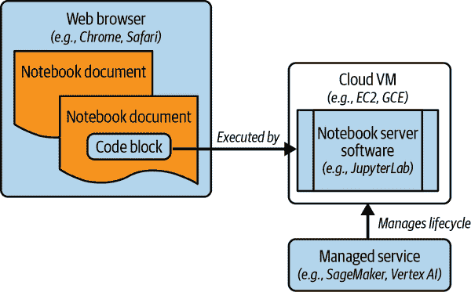

# 第十一章：设计一个 ML 平台

在上一章中，我们讨论了 ML 应用程序的整体架构，并且在许多情况下，您将使用预先构建的 ML 模型。在某些情况下，您的团队将不得不开发 ML 模型，这是 ML 应用程序的核心。

在本章中，您将深入探讨开发和部署此类*定制* ML 模型。您将查看 ML 模型开发的各个阶段和支持此类开发的框架。在模型创建后，您需要通过查看可以帮助您实现这一过渡的工具和产品来自动化训练过程。最后，您需要监控已部署到端点的训练模型的行为，以查看它们在进行推断时是否存在漂移。

在前几章中，我们讨论了数据平台各部分所能提供的 ML 能力。具体来说，你的 ML 平台的数据存储可以在数据湖中（第五章）或 DWH 中（第六章），训练会在适合该存储的计算资源上进行，推断可以从流水线中调用（第八章）或部署到边缘上（第九章）。在本章中，我们将总结所有这些讨论，并考虑这些 ML 能力的具体内容。

# ML 活动

如果你正在构建一个支持自定义 ML 模型开发的 ML 平台，你需要支持哪些活动呢？我们经常看到架构师直接跳到 ML 框架（“我们需要支持 XGBoost 和 PyTorch，因为这是我的数据科学家使用的”），而没有考虑数据科学家和 ML 工程师在平台上需要做的许多活动。

典型情况下，ML 平台必须支持图 11-1 中的活动。

###### 图 11-1：ML 平台需要支持的活动

你需要清洁和处理原始数据，使其更适合 ML，并使得最终训练出来的模型更加准确。数据准备需要进行探索性数据分析来检查数据，绘制其分布，并研究其细微差别。然后，ML 模型会在数据的一个子集上进行训练，并使用另一个子集进行评估。基于此，数据科学家将对数据准备或建模步骤进行更改。这个过程是迭代的，通常涉及大量的实验。

模型训练完成后，您需要对其进行测试数据评估，检查其符合性和性能，然后将其部署到一个端点。ML 模型的客户端随后可以向端点发送预测请求。

经过训练的模型不会永远保持合适。环境通常会发生变化，随着时间的推移，模型开始变得不太准确。因此，您必须自动化模型训练和部署步骤，以确保您的模型始终保持最新和准确。

此外，您必须仔细而持续地监控模型（以确保它处理传入的预测请求），评估它（以确保预测保持准确，特征没有漂移），并在检测到新的训练数据、新代码或模型漂移时重新训练它。

让我们看看如何设计一个 ML 平台来支持所有这些活动。

# 开发 ML 模型

开发 ML 模型涉及迭代开发，包括：

+   为 ML 准备数据

+   编写 ML 模型代码

+   在准备好的数据上运行 ML 模型代码

为了支持这些步骤，您的数据科学家需要一个 ML 开发环境。

## 标记环境

要开发自定义 ML 模型，您需要拥有将用于*训练*模型的数据。假设所需数据已被收集并存储在 DWH 或数据湖中。

在监督学习的情况下，训练数据需要有标签或正确答案。在某些情况下，这些标签可能自然存在于数据中，而在其他情况下，您需要使用人工专家来标记数据。通常情况下，这些工具是外包的，而不是由数据科学团队自己完成，但值得询问的是，ML 平台是否需要支持标签应用程序。

## 开发环境

由于 ML 开发过程如此迭代，数据科学家在能够编写代码、运行代码、查看结果、立即更改代码并重新运行代码的环境中最具生产力。数据科学家需要能够在小片段中执行其代码，而不需要重新运行整个程序。代码及其输出存储在一个称为笔记本的文档中，正如我们在“使用笔记本进行交互式分析”中预期的那样。笔记本将由 Web 浏览器呈现，这是用户访问笔记本的方式。笔记本中的代码由称为笔记本服务器的软件执行（请参见图 11-2）。笔记本服务器软件安装在云 VM 上，并通过托管笔记本服务（如 SageMaker、Databricks、Vertex AI Workbench 或 Azure Machine Learning）来管理其生命周期。

###### 图 11-2\. 笔记本电脑的高级架构

正如您在之前章节中已经了解到的，Jupyter Notebook 已经成为数据科学开发的事实标准，因为它支持这种交互式工作流程。在所有主要的云提供商上都存在运行 Jupyter Notebook 服务器的托管服务。这些服务通常预安装必要的统计和 ML 软件框架，并提供在启用 GPU 的机器上进行数学计算加速的能力。

笔记本服务也作为云无关数据框架的一部分提供，例如 Databricks，几乎在所有主要云上的工作方式相同。Google Colab 提供免费的托管笔记本，但这些笔记本有时间和硬件限制。这些限制在专业版 Colab 中也有所解除。最后，还有领域特定的托管笔记本，如 Terra.bio——这些笔记本添加了生物学特定的库和可视化功能到通用笔记本中。

随着基于生成 AI 的编程助手工具（例如 Replit、GitHub Copilot 和 Google Codey）被整合到 Colab 和 Jupyter 等笔记本服务中，事情可能会发生显著变化。在撰写本文时，很难预测未来会发生什么，但 AI 助理很可能大大简化和简化软件开发。

## 用户环境

典型的方法是笔记本由用户管理。本质上，您将 Jupyter 运行的 VM 视为数据科学家的工作站。没有其他人能够登录到该工作站。数据科学家将大部分工作时间花费在其中。笔记本文件存放在版本控制下，版本控制系统（例如 GitLab 或 GitHub）提供项目的协作一致的团队视图。

用户管理的笔记本实例让数据科学家以可审计的简单方式访问云数据和 ML 服务。

当数据科学家需要存储数据时，必须以所有合作者都可以访问的方式存储数据。数据不像传统工作站中的本地数据，而是存储在数据仓库（DWH）或对象存储中，并且根据需要动态读取。在某些情况下，将数据副本下载到足够大的本地磁盘可能会有所帮助。

在许多情况下，数据科学家处理机密数据或包含隐私敏感信息的数据。因此，通常将托管的笔记本服务和数据源放置在较高的信任边界内，例如虚拟专用云（VPC），如图 11-3 所示。这样的架构有助于减少数据科学家数据外泄的风险，保护笔记本实例免受外部网络流量的影响，并限制访问托管笔记本服务器的虚拟机。

###### 图 11-3\. 使用更高的信任边界来包括笔记本服务器、数据密钥和训练数据。

确保在为数据科学家提供访问权限时使用细粒度访问控制，例如列级/行级安全性。数据所有者应确保数据科学家尽可能访问经过编辑或标记化的数据集。将加密边界应用于所有数据集，并通过云密钥管理服务管理这些密钥。这确保在读取任何数据之前需要加密密钥，并且密钥管理团队与数据所有者保持分离。

数据科学家在处理非结构化数据训练深度学习模型时需要带 GPU 的虚拟机。如果为每位数据科学家提供独立的托管笔记本实例，成本可能会成为一个问题。作为第一步，确保设置托管服务的功能，以便在虚拟机未被使用一段时间后自动暂停或停止。

对于大型团队（超过 50 名数据科学家），停止空闲实例可能不足以进行充分的成本优化。您希望多个用户共享相同的硬件，以便跨这些用户分摊计算能力。在这种情况下，架构涉及在 Kubernetes 集群上运行笔记本服务器，而不是在虚拟机上（JupyterHub 支持此功能），然后从同一集群向多个用户提供笔记本。由于这种架构是多租户的，使安全考虑变得更加困难。请考虑成本节约是否值得增加的安全风险。

## 数据准备

许多机器学习项目的第一步是从源系统（通常是 DWH 或关系数据库）中提取数据，预处理/清理数据，并将其转换为优化用于机器学习训练的格式（如 TensorFlow Records）。生成的机器学习数据存储在对象存储服务中，以便从笔记本轻松访问。

例如，许多图像分类模型架构要求所有图像具有相同的尺寸。在数据准备步骤中，可以执行裁剪或调整图像大小以符合所需尺寸。类似地，在文本模型中，输入文本单词和句子必须转换为数值表示。通常通过将大型模型（例如 BERT、GPT-3）应用于单词或句子来获得一批数字。

此时，数据科学家视觉检查数据至关重要。Jupyter 环境中包含常见的绘图库。如果有工具可以让数据科学家更轻松地完成这项工作（例如，视频渲染软件或特定领域的框架和库），请确保在 Jupyter 虚拟机上安装它们。

在视觉检查期间，数据科学家将发现需要校正或丢弃数据的情况。可以对数据集进行这些更改并创建新数据集，也可以将这些更改添加到读取数据的软件中。如果这些数据在预测期间提供，则更常见的是在软件中进行清理，因为这样可以提供一种一致的处理方式。

接下来，通常会将数据分成子集。一个子集用于训练，另一个子集用于确保模型不过拟合。有时，还会保留第三个子集进行最终评估。

数据科学家可以通过多种方式从源系统读取数据，过滤掉不良值，转换数据，并将其分成子集。在数据仓库（DWH）中使用 SQL 进行数据准备通常是处理结构化数据的便捷选择。然而，在 SQL 中进行统计处理存在一定的局限性。因此，数据处理通常会使用 pandas——虽然 pandas 适用于小数据集，但处理大量数据时，您需要像 Dask、Apache Spark 或 Apache Beam 这样的框架。因此，需要在高信任边界内使用云管理服务来运行 Dask、Spark 或 Beam。

所有这些活动都应与业务协调进行，以清晰了解组织的目标，并确保在准备阶段保留正确的信息。

## 训练 ML 模型

数据科学家将在 Jupyter 笔记本中编写模型代码，使用诸如 scikit-learn、XGBoost、Keras/TensorFlow 或 PyTorch 等框架。然后，他们将多次执行模型代码，通过训练数据集确定模型的最优权重。

### 编写 ML 代码

代码通常会以小批量读取训练数据，并通过训练循环来调整权重。读取数据的数据管道可能会进行数据增强，例如翻转图像以人工增加数据集的大小。模型架构将与读取的输入及其转换方式紧密相关。数据科学家通常会尝试许多选项来表示数据，许多类型的模型以及许多优化方法。¹

模型代码是迭代开发的，因此与云端的低延迟连接和快速周转时间能力至关重要。在不必重新运行整个训练程序的情况下尝试对代码进行小的更改非常重要。编写代码通常*不*是使用托管训练服务的时候——在此阶段，数据科学家使用本地环境中的笔记本。

在大型数据集上进行交互式开发会导致不必要的延迟。为了加快开发速度，提供一个可以下载到笔记本虚拟机的大型数据集样本可能会很有用。在涉及涉及隐私敏感数据的情况下，样本可能必须由模拟/合成数据组成。

一旦代码开发完毕，数据科学家通常希望在整个数据集上运行训练作业。他们是否可以在笔记本中这样做取决于数据集的大小以及笔记本服务器的 VM 的功能。

### 小规模工作

对于小数据集和简单模型，训练运行时间可以在一小时内完成，可以在笔记本本身提供运行训练作业的能力。

托管笔记本服务提供给数据科学家改变笔记本运行的机器类型的能力，使其更加强大—这可以通过切换到附有 GPU 或 TPU 的机器来完成。这将为在中等规模数据集上训练模型提供必要的计算能力。

对于更大的数据集和/或复杂模型或者训练运行时间超过一小时的情况，最好使用托管训练服务。可以将笔记本提交到像 SageMaker 或 Vertex AI 这样的托管训练服务，使笔记本完全执行，并在几个小时后收到更新的笔记本。

### 分布式训练

对于非常大的数据集，简单地升级到更强大的计算机是不够的。您将不得不在一组以特殊方式相互通信的机器上运行训练作业的集群中运行训练作业。基本上，每个训练示例的批次被分布在集群中的机器上，每个机器对其批次的子集进行数学计算，并使用中间计算来确定匹配的实际结果。TensorFlow 和 PyTorch 等框架支持分布式训练，但必须以特定方式设置集群。

要在笔记本中获取代码的分布式训练，需要在适当配置的集群上运行笔记本服务器（例如，在 Kubeflow 集群上的 JupyterHub）。除非这是您创建的用户环境，否则这种更改并不迅速。

更好的选择是跳到讨论的自动化步骤“自动化”并使用托管训练框架。

### 无代码机器学习

定制模型并不总是需要在 TensorFlow、PyTorch 等中进行编码。存在低代码和无代码选项。例如，可以使用云控制台或创建和部署 AutoML 模型。Dataiku 和 DataRobot 等工具提供了完全的点对点方式来训练和部署模型。

无代码 ML 模型的能力继续变得越来越好。对于非结构化数据（图像、视频、文本），很难找到比现有的 AutoML 选项更好的解决方案。对于图像，您可以使用 AutoML 进行分类、分割，甚至根据文本提示生成图像。对于文本，您可以使用它来解析表单、提取实体、检测情感、总结文档和回答问题。

在所有这些情况下，您可以将 AutoML 生成的模型视为可以像由数据科学团队编写的模型一样部署的自定义模型。

# 部署 ML 模型

如第十章所讨论的，批量预测用于定期评分大量数据，而在线预测用于近实时数据评分。

如果只进行批量预测，可以直接使用来自大规模数据处理框架（如 Spark、Beam 和 Flink）的训练模型文件。您无需部署该模型。某些数据仓库（如 BigQuery）允许您在 Cloud Storage 上提供训练好的 TensorFlow 模型进行批量预测。

要将模型用于在线预测，您需要将其部署为服务环境中的微服务。主要的云 ML 框架（Vertex AI、SageMaker、Azure Machine Learning）具有类似的概念，并支持在线预测的类似功能。

## 部署到端点

客户通过与其关联的 URL 访问端点（见图 11-4）。客户端发送带有 JSON 负载的 HTTP POST 请求，其中包含预测方法的输入。端点包含多个模型对象，其中它分割流量。在图 11-4 中，80%的流量流向模型 1，10%流向模型 2，其余流向模型 3。该模型是一个引用在各种框架（TensorFlow、PyTorch、XGBoost 等）中构建的 ML 模型的对象。每个框架都有预构建的容器映像。在 TensorFlow 的情况下，容器映像寻找 SavedModel 文件，这是 Keras/TensorFlow 2.0 模型默认导出的格式。

###### 图 11-4\. 将训练好的模型部署到端点

端点由一个自动扩展服务支持，可以处理流量的变化。然而，选择足够大的机器以支持几个同时的请求是机器学习工程师的责任，可以通过测量来实现计算的加速。运行具有加速器（如 GPU 或可编程门阵列[FPGA]）的机器上的端点可以加快计算速度。如果使用大型模型（如文本模型），可能需要确保机器有足够的内存。由于自动扩展可能会引入不可接受的延迟，因为新机器可能需要一些时间上线，因此确保有一个有一定数量最小机器的热池可能会有所帮助。

## 评估模型

将多个模型部署到一个端点的原因是为了让机器学习工程师能够控制向它们的流量分配。这是因为机器学习平台需要允许对模型进行 A/B 测试，以便机器学习工程师可以决定是否用新开发的模型替换当前的生产模型。

机器学习托管服务提供了监控资源使用情况的能力，确保部署的模型能够跟得上输入请求。可以将输入的样本及其对应的预测发送到数据仓库，并用来比较不同模型版本的性能。

## 混合和多云

由于数据传输成本高昂，还增加了治理和安全考虑因素，通常会选择在大部分历史数据存储的云端训练机器学习模型。另一方面，为了最小化网络延迟，需要将模型部署到应用程序运行的云端（或边缘）。在图 11-5 中，您可以看到在一个云端（存储您的数据的地方）进行训练，然后在另一个云端（运行您的应用程序的地方）部署的示例。为了进行这样的混合训练和部署，使用标准模型格式（如 TensorFlow SavedModel、ONNX 或*.bst*文件）和容器。

###### 图 11-5\. 可以在一个云上训练机器学习模型并在另一个云上部署它们

在构建机器学习平台时，能够脱离云端运行推断是一个重要的考虑因素。选择那些不依赖专有实现的框架。

## 训练-服务偏差

机器学习中的主要挑战之一是*训练-服务偏差*。当机器学习模型在预处理数据上训练时，需要对传入的预测请求执行相同的步骤。这是因为需要向模型提供与其训练数据具有相同特征的数据。如果不这样做，训练和服务之间会存在偏差，模型的预测结果将不会很好。

有三种方法可以确保在训练期间进行的预处理在预测期间按原样重复进行：将预处理代码放入模型内部、使用转换函数或使用特征存储。让我们逐一讨论它们。

### 在模型内部

最简单的选择是，如图 11-6 所示，将预处理步骤整合到模型函数中。例如，在 Keras 中可以通过 Lambda 层进行预处理。这样，在保存模型时，预处理步骤将自动成为模型的一部分。

###### 图 11-6\. 将预处理代码整合到模型函数中

这种方法的优点在于简单性。不需要额外的基础设施。预处理代码与模型一起传递。因此，如果需要在边缘或其他云中部署模型，无需特别操作。SavedModel 格式包含所有必要的信息。

该方法的缺点是，预处理步骤将在每次对训练数据集进行迭代时被浪费地重复执行。计算量越大，这种重复执行的成本就越高。

另一个缺点是，数据科学家必须在与 ML 模型相同的框架中实现预处理代码。因此，例如，如果使用 PyTorch 编写模型，则预处理也必须使用 PyTorch。如果预处理代码使用自定义库，这可能会变得困难。

### 转换函数

正如您所理解的，将预处理代码放在模型函数内部的主要缺点是，代码需要在模型训练过程的每次迭代中用于转换原始数据，并且必须使用与训练代码相同的语言。

如果您捕获预处理步骤并将其应用于原始数据，则可以优化此过程。然后，可以在预处理数据上进行模型训练，从而更加高效。当然，您必须确保从训练和预测代码中调用该函数（参见图 11-7）。或者，您可以捕获预处理步骤并将其封装到容器中，在输入和模型之间插入该容器。虽然这会增加效率，但也会增加复杂性——您必须确保将转换函数保存为与模型关联的工件，并知道要调用哪个转换函数。

###### 图 11-7\. 将预处理代码封装到转换函数中，该函数应用于原始数据集和预测请求

TensorFlow Extended（TFX）等框架提供了转换功能以简化所涉及的簿记工作。一些基于 SQL 的机器学习框架（如 BigQuery ML）也支持`TRANSFORM`子句。Vertex AI 支持特征转换引擎。

如果额外的基础设施和簿记开销值得的话，你应该优先使用转换函数而不是将转换代码放入模型中。如果特征计算开销大的话，这种情况就是如此。

### 特征存储

将预处理代码放在模型函数内部或封装在转换函数（或 SQL 子句或容器）中对于绝大多数特征来说足够了。

当你很快学到时，有两种情况这些不足以满足，你会需要一个*特征存储*（见图 11-8），一个用于存储和提供机器学习特征的仓库。特征存储本质上是一个键-值存储，其中键由实体（例如，`hotel_id`）和时间戳组成，值由该实体的属性组成（例如，价格，预订数量，过去一小时内到达酒店列表的网站访客数量等），作为该时间戳的属性。所有主要的机器学习框架（AWS SageMaker，Vertex AI，Databricks 等）都配备了特征存储。

###### 图 11-8\. 特征存储是一个提供某个时间点上实体值的中央存储库

第一种情况是，如果客户端请求预测时不知道特征值，而必须在服务器上计算，那么你将需要一个特征存储。如果请求预测的客户端不知道特征值，那么你需要一种机制将特征值注入到传入的预测请求中。特征存储发挥了这种作用。例如，动态定价模型的一个特征可能是过去一小时内项目列表的网站访问者数量。请求酒店价格的客户端（考虑一个移动应用程序）不会知道这个特征。这些信息必须通过点击流数据上的流式处理管道在服务器上计算，并插入到特征存储中。

第二种情况是为了防止数据的不必要复制。例如，考虑一个计算开销大且用于多个机器学习模型的特征。与其使用转换函数并将转换后的特征存储在多个机器学习训练数据集中，将其存储在集中式存储库中要更有效和可维护得多。

在任一情况下都不要过度行事。例如，如果模型的所有特征都需要在服务器端计算方式相同（例如，它们从关系数据库检索或由流水线计算），将检索代码放在转换函数或容器中是完全可以接受的。同样，重复一些特征处理几次而不是通过特征存储复杂化您的 ML 平台也是可以接受的。

### 特征存储的典型用途

特征存储的最重要用例是当情况 #1 和 #2 都适用时。例如，考虑您需要一个“时间点查找”，以获取训练数据来训练模型。诸如过去一小时网站访问者数量或司机过去一小时内的行程数等特征，被多个模型使用。但它们相对直接，因为它们由流水线计算，并且它们的实时值可以成为数据仓库的一部分。这些相对简单，不总是需要特征存储。

现在考虑一种备选特征类型，许多模型使用它，并且持续改进，如图 11-9 所示——例如，也许您在音乐流媒体服务中有歌曲、艺术家和用户的嵌入。有一个团队每天更新用户和歌曲的嵌入。每次消费这一特征的模型被重新训练时 — 高商业价值的用例需要定期重新训练 — 训练代码将需要获取与训练标签和最新版本嵌入算法对齐的此特征的值。这必须在所有标签中高效且轻松地完成。而且这必须在模型使用的数十甚至数百个特征之间完成。特征存储使得对难以计算且频繁改进的特征进行周期性模型重新训练尤为有用。

###### 图 11-9\. 特征存储尤其适用于难以计算且频繁更新的特征，因为模型将必须根据“时间点”嵌入进行训练。

### 决策图

此处讨论的考虑因素总结在 图 11-10 中。这不是一个决策树来决定您的组织是否需要一个特征存储 — 可能只有少数特征需要。这是一个决策树，用来决定是否对您正在构建或操作的特定特征/模型使用特征存储。

所有三个主要的云 ML 框架（AWS SageMaker、Vertex AI、Azure Machine Learning）都配备了特征存储。Databricks 和 Tecton.ai 提供了与云无关的特征存储。

###### 图 11-10\. 选择不同的预处理选项

# 自动化

正如你到目前为止理解的那样，可以使用云控制台部署自定义模型。可以使用笔记本开发和部署 TensorFlow 或 PyTorch 模型到 AWS/GCP/Azure。但这些方法都不适用于数百个模型和大型团队。

## 自动化训练和部署

例如，通过 Web 控制台创建 AutoML 模型后，您将获得一个可以监控的端点，并且可以设置持续评估。如果发现模型漂移，自动在新数据上重新训练会很困难——您不希望在凌晨 2 点起床使用用户界面来训练模型。最好能够仅使用代码训练和部署模型。对于您的团队来说，代码更容易自动化。

将在 Jupyter 笔记本中训练的 TensorFlow 模型部署为 SavedModel 到 Vertex AI 或 SageMaker 也会遇到相同的问题。重新训练将会很困难，因为运维团队必须在这些笨重且非最小化的操作和监控调度之上设置所有的运维工作。

对于重新训练，最好的方式是从数据集创建到训练再到部署的整个过程都由代码驱动。将模型代码与运维代码清晰分离，并用“普通”的 Python 表达，而不是笔记本，非常重要。

为了做到这一点，数据科学家团队在笔记本中开发的代码必须转移到常规文件中，并进行少量参数化：

+   数据将根据托管机器学习服务的合同规定从对象存储服务位置读取。例如，在 Google Cloud 中是 `AIP_TRAIN⁠ING​_DATA_URI`，在 AWS 中是 `InputDataConfig`，在 Azure Machine Learning 中是 `Run` 上下文。

+   模型创建代码被提取为普通的 Python 文件。

+   模型输出（在 SavedModel、ONNX、*.bst*等格式中）将保存到由托管机器学习服务的合同规定的对象存储服务位置。

现在让我们专注于如何编排所有训练模型所需的步骤。

## 使用管道进行编排

仅仅将数据科学家准备的 Jupyter Notebook 步骤转换为可执行脚本是不够的。需要在适当的基础设施上“编排”这些步骤：

+   使用 Spark、Beam、SQL 等准备数据集。

+   提交一个训练作业到托管的机器学习服务。

+   如果模型表现比先前训练的模型更好，则将训练好的模型部署到端点。

+   监控模型性能并进行实时数据的 A/B 测试以评估模型。

就编排而言，大体上有四种选择：托管管道、Airflow、Kubeflow 和 TFX。

### 托管管道

如果您正在为完整的开发和部署工作流程使用单一云，使用提供的 ML 工作流编排机制。在该云上使用托管服务执行的每个任务将具有相应的运算符，并且这些作业将理解依赖关系跟踪。例如，Vertex AI 提供 Vertex AI Pipelines，这是一个完全托管的服务，允许您根据需要重新训练模型。Azure Machine Learning 具有本地的设计器，提供相同的功能。

所有托管的管道提供编程 SDK，提供便捷的自动化能力。在 Databricks 的情况下，这个管道 SDK 是由 MLflow 提供的，它是一个在 Spark 上运行但提供 TensorFlow、PyTorch 和其他 ML 库和框架集成的开源框架。

### Airflow

如果您已经在使用 Airflow 进行数据管道的调度和编排，将其扩展到机器学习的使用将允许您拥有一个简单、一致的系统。缺点是 Airflow 没有定制的 ML 运算符，因此您将发现自己使用通用的 Python 或 bash 运算符，这些运算符反过来调用云 SDK。Airflow 是开源的，您可以使用托管服务来运行 Airflow——如 Google Cloud Composer、Amazon Managed Workflows for Airflow 和 Astronomer.io，它是云不可知的。

### Kubeflow 管道

每个步骤都可以容器化，并在 Kubernetes 上编排容器。Kubeflow 已经为流行的 ML 框架、ML 指标等提供了操作符。Kubeflow 也是开源的，您可以在公共云上使用托管的 Kubernetes 服务（如 Google Kubernetes Engine、Amazon Elastic Kubernetes Service 或 Azure Kubernetes Service）来运行 Kubeflow。还有像 Iguazio 这样的云不可知的托管 Kubeflow 提供者。

### TensorFlow Extended

如果您正在使用 TensorFlow 生态系统，TFX 提供了便捷的 Python 函数用于常见操作，如模型验证、评估等。这提供了一种规范、易于使用的编排方法，避免了构建和维护运算符或容器的需要。TFX 是一个开源软件包，可以在托管管道、Airflow 和 Kubeflow 上运行。

TFX 是一个集成的 ML 平台，用于开发和部署生产 ML 系统。它专为可扩展、高性能的 ML 任务设计。TFX 的关键库包括预构建的 Python 库如下：

TensorFlow 数据验证（TFDV）

用于检测数据中的异常

TensorFlow 转换（TFT）

用于数据预处理和特征工程

Keras

用于构建和训练 ML 模型

TensorFlow 模型分析（TFMA）

用于 ML 模型评估和分析

TensorFlow 服务（TFServing）

用于在端点上提供 ML 模型

这些库使用开源 Apache Beam 和 TensorFlow 来实现它们的任务。任务可以在本地 Kubeflow 或 Airflow 集群上运行，也可以提交作业到托管服务，如 Dataflow 和 Vertex AI。

## 持续评估和训练

ML 工作流程中的每一步都会产生输出工件，您需要以系统化的方式组织这些工件。

### 工件

用户笔记本、管道源代码、数据处理函数和模型源代码需要存储在源代码仓库中。

数据科学家进行的每一个实验都需要进行跟踪：参数、指标、使用的数据集以及创建的模型。所有的机器学习编排框架都提供这一能力。

模型训练作业、随后训练的模型文件以及部署的模型都在托管的 ML 服务中进行跟踪（如 Azure 机器学习、Vertex AI 或 SageMaker）。

用于开发、训练和部署的环境被容器化，并在容器注册表中进行跟踪。这对于可重现性是至关重要的。

### 依赖跟踪

ML 管道中的步骤应该进行依赖跟踪，只有当其中一个依赖发生变化时才启动任务。例如，除非原始数据发生了变化，否则不应该导致重新创建训练数据的管道调用。这是预构建的操作器和托管的 ML 管道提供的功能，但自定义操作器和管道可能没有。

一旦将训练和预测代码自动化到 ML 管道中并系统地捕获了工件，就可以设置持续集成/持续部署（CI/CD）管道。在 ML 上下文中，这涉及持续评估和持续重新训练。

### 持续评估

要设置持续评估，您需要配置预测端点以将输入和相应预测的样本存储到数据仓库（DWH）。如果需要，可以定期运行一个标记作业，以便人工验证已进行的预测。定期的评估查询将比较人工标签与已进行的预测，以监控模型性能随时间变化的漂移。在 TFX 中，Model Analysis 组件会自动处理这一过程。

定期的评估查询还需要检查模型特征的分布，并监控其漂移。在 TFX 中，Data Validation 组件会自动处理这些。Vertex AI 中托管的预测服务也为所有模型类型提供了偏斜和漂移检测的开箱即用功能。

### 持续重新训练

每当评估查询识别出偏斜或漂移时，应该发出警报，以便人员审查需要进行的变更类型。其他类型的变更可以触发立即的重新训练。

每当代码更改被检入时，可能需要启动模型训练流水线。可以通过 GitHub/GitLab Actions 来处理。

最后，每当接收到足够大量的新数据时，模型训练流水线将需要启动。可以通过触发云对象存储中新文件的 Lambda 或 Cloud Function 来处理，并让函数调用流水线端点。

# 选择 ML 框架

在第十章中，您主要关注了预构建的 ML 模型以及如何在此类基础能力之上构建 ML 应用程序。您还研究了创建 ML 模型的低代码和无代码方式。在本章中，您研究了定制的 ML 模型。

作为云架构师，您应根据将构建 ML 应用程序的人员的技能选择 ML 平台中可用的工具。如果 ML 模型由数据科学家构建，您需要使他们能够使用基于代码的 ML 框架（如 Keras/TensorFlow 或 PyTorch），并使用 SageMaker、Vertex AI、Databricks 等来操作它。如果模型由领域专家开发，为他们提供一个低代码 ML 框架，如 BigQuery ML 或 AI Builder。虽然数据科学家可能不满意预构建模型（及相应的灵活性不足），但 BigQuery ML 提供的易用性和数据整理能力将非常适合领域专家。领域内的从业者将需要一个无代码 ML 框架，例如 DataRobot 或 Dataiku 来创建 ML 模型。

## 团队技能

同一 ML 问题的答案将因组织而异。例如，考虑使用 ML 进行定价优化的情况。团队将根据他们的技能选择方法：

+   数据科学家团队将选择构建动态定价模型。他们可能会从受控变异定价方法开始，并逐步引入需求冲击等因素。关键是这是一个使用复杂方法的复杂、专业团队。他们需要使用代码完成这些工作。

+   一个领域专家团队可能会选择构建分层定价模型。例如，产品经理可以使用历史数据来制定不同层次的定价，并根据市场细分特征调整新市场段的定价。这涉及到分析或回归模型，在 SQL 中非常可行。

+   一个非技术从业者团队确定最佳价格。例如，你可以让店长根据历史数据和他们认为重要的因素来定价他们店铺的产品。这需要一个无代码框架（例如，[DataRobot 定价保险](https://oreil.ly/kML83)）。

正确答案取决于您的业务及您的领导期望从上述各种方法中获得的 ROI。

## 任务考虑

模型训练需要数据科学技能（统计、Python、笔记本），部署需要 ML 工程师技能集（软件工程、云基础设施、运维），而调用模型可以由任何开发者完成。然而，重要的是要认识到 ML 工作流程不仅仅是模型训练和部署。端到端的 ML 工作流程包括：（1）训练、（2）部署、（3）评估、（4）调用、（5）监控、（6）实验、（7）解释、（8）故障排除，以及（9）审计。作为云架构师，你需要确定公司内谁将负责每个 ML 问题的任务。这些其他步骤很少由工程师执行（确实，如果只有工程师能够执行这些任务，则是一个警告信号）。

例如，由数据科学家创建的模型可能需要作为销售人员在 Salesforce 内运行报告的一部分，并由销售经理审核。如果数据科学家在 Spark 中构建这样的模型，将其产品化为笔记本，并将其部署为 API，销售经理如何进行审计呢？现在你需要一个软件工程团队来构建定制应用程序（可能利用 Streamlit 框架或类似的工具）来启用 ML 工作流程的这一部分。这是时间、金钱和精力的严重浪费。这是一个云架构师可以通过将模型部署到支持仪表板的 DWH 中避免的问题。

## 用户中心化

这听起来很明显，但我们看到很多组织都犯了这个错误，值得指出：试图在 ML 框架上进行标准化，而忽视需要执行任务的人的技能集的组织将会失败。因为你的组织内技能集是不同的，你的组织内将会有不同的 ML 框架和工具。

确保选择开放、互操作的工具，以免陷入信息孤岛。选择能够解决不同复杂性水平的解决方案也是有帮助的——这样一来，供应商负责处理互操作性问题。

# 摘要

在本章中，我们介绍了如何为开发和部署定制 ML 模型的 ML 平台进行架构设计。主要收获如下：

+   一个 ML 平台需要支持模型开发、部署、编排以及持续评估和重新训练。

+   在编写代码和进行探索性数据分析时，数据科学家在笔记本环境中最具生产力。

+   所有主要的云服务提供商都为 Jupyter Notebook 提供托管的笔记本服务器。

+   在处理机密或私密数据时，将笔记本服务器、输入数据和加密密钥放置在更高信任边界内，将减少数据外泄的风险。

+   可以使用 pandas 对小数据集进行数据准备。对于较大的数据集，使用 Dask、Spark 或 Beam 进行数据准备的扩展。

+   模型代码的编写通常是通过数据集的小样本完成的。对于私人或机密数据，提供一个可下载到笔记本 VM 的样本。

+   在笔记本中的模型代码可以通过将机器类型更改为带有 GPU 的类型来在小数据集上执行。对于大数据集，使用笔记本执行器服务在托管训练服务中执行笔记本。后一选项也适用于大规模数据集上的分布式训练。

+   部署模型到由能够在 GPU 上运行的自动扩展服务支持的端点。

+   通过对部署到端点的模型进行 A/B 测试来评估模型。

+   通过使用标准模型格式和框架或容器来支持混合和多云场景。

+   为了防止训练 - 服务偏差，将预处理代码封装在模型内部或在转换函数中。或者，使用特征存储。

+   对于重新训练，最好从数据集创建到训练再到部署的整个过程都由代码驱动。

+   有四种编排选项：托管管道，Airflow，Kubeflow 和 TFX。如果您使用单一云，则使用托管管道；如果需要与数据管道保持一致性，则使用 Airflow；如果所有步骤都是容器化的，则使用 Kubeflow；如果您在 TensorFlow 生态系统内并希望使用易于使用的预设系统，则使用 TFX。

+   应备份诸如笔记本、管道源代码等工件，以便能够重现错误。

+   通过配置预测端点将输入和对应预测的样本存储到数据仓库来实现连续评估。

+   连续重新训练是由新代码、新数据或检测到的漂移触发的。

+   确保基于将构建机器学习应用程序的用户的技能集来选择 ML 框架。

+   将这些任务分开考虑：(1) 训练，(2) 部署，(3) 评估，(4) 调用，(5) 监控，(6) 实验，(7) 解释，(8) 故障排除 和 (9) 审计。然后，询问在贵公司谁将为每个机器学习问题执行这些任务。

在下一章中，您将通过一个模型案例的描述学习如何应用您到目前为止学到的原则。您将了解将老式数据平台转变为现代化和云原生的含义。

¹ 这里的参考是指正则化、学习率调度、优化器等。
