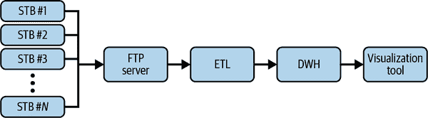

# 第十二章：数据平台现代化：一个典型案例

在前几章中，我们探讨了如何利用云来构建能够处理大规模数据的现代数据平台，帮助您的组织消除数据孤岛，使更多员工能够访问数据，更轻松地从数据中获取见解，并加速 AI/ML 的采纳。这些能力共同促进了从数据中提取价值的过程。在本章的最后，我们将应用这些原则到一个典型案例中，以解释将老式数据平台转变为现代云原生平台的含义。请注意，该典型案例纯属虚构，旨在帮助深化讨论。

# 新时代的新技术

YouNetwork 是一家重要的视频广播公司，为整个欧洲 1500 万以上的客户提供服务。在其 30 多年的运营过程中，YouNetwork 在几次技术变革周期中航行，从 20 世纪 90 年代初的卫星广播先驱采用到最近的互联网协议电视(IPTV)协议实施。采用 IPTV 使 YouNetwork 能够推出一个提供实时节目和视频点播(VOD)的服务，利用与互联网连接的定制机顶盒(STB)。

在此期间，该组织通过每年扩展其视频目录（例如电视节目、电影、体育赛事等），成功地根据客户需求调整其产品。令人印象深刻的是，它还成功地实现了多样化的组合，增加了新的服务（例如在线游戏、互联网连接等），以支持和促进其全新 IPTV 服务的采用。

换句话说，YouNetwork 是一家在其核心业务（内容）创新并成功整合新技术以扩展市场的成功企业。新服务产生的数据激增以及基于实时数据缺乏敏捷性的问题，促使公司思考其技术堆栈的未来。主要驱动因素包括：（1）随着数据量增加，服务的可扩展性，（2）迅速实施并投入生产新的基于分析的解决方案的必要性，以及（3）需要向越来越期望个性化的客户提供更加量身定制的内容流。

## 变革的需求

在上一财年初，董事会安排了一次会议，讨论业务战略，其中讨论的主要话题之一是技术栈需要变革的问题。传统上，当 YouNetwork 投资技术时，通常是在自己的数据中心构建能力。然而，随着可扩展性问题日益严重，这变得越来越难以实现。董事会最大的担忧是，每一项旨在实施像定制客户信息收集、用户喜欢看到的下一个内容的预测以及实时欺诈检测系统等创新解决方案的开发都变得困难，并最终无法及时实施。

议事板讨论突显了对彻底变革的需求。从技术角度来看，特别是在数据方面，YouNetwork 在其历史上经历了两次主要的数字化转型：

COTS 时代

在这个时期，公司投入了大量资金购买来自单一供应商的硬件和软件，并且所有这些设备协同工作，执行各种活动（例如 DWH/数据仓库/立方体分析）。

OSS 时代

公司试图区分硬件和软件，采用了更开放源码的方法（主要是 Hadoop），能够处理新的用例，如非结构化数据管理和时间序列分析。

董事会认识到公司现在需要进行第三次重大的演进性转型，决定采取一条新的道路，利用近年来最具颠覆性的技术之一：公共云。

由于公司内没有人拥有足够的经验来推动这样的转型，首要决定是成立一个技术“SWAT”团队（由内部领导和来自顶级咨询公司的承包商组成），旨在搜索市场上所有可能的解决方案，并准备一个扎实的业务计划，以现代化 YouNetwork 当前的数据平台。

## 这不仅仅是技术问题。

SWAT 团队组织了一系列与主要云供应商的一对一会议，以更好地了解如何将数据平台架构转型为现代化堆栈。即使在第一次互动后，显然，向云的转型不仅仅是技术上的旅程，还需要 YouNetworkers 在使用数据方面进行全面的组织转型。

SWAT 团队发现，有必要将云策略与整体组织战略对齐，考虑业务如何在技术更新的背景下发展。例如，对基于互联网的技术和协议的深度投资要求相应地投资于可扩展的数据平台，以应对新系统将产生的实时 TB 级数据。这样的可扩展数据平台将支持提取可操作信息，并使 YouNetwork 能够提高服务质量（QoS）并更好地了解用户。而 QoS 的改善将改变可提供的节目组合，并且更好地了解用户将促使个性化，从而改变正在制作的节目。这意味着内容采购团队现在成为数据平台转型的利益相关者。

另一个关键成果是需要来自高层的赞助，但在这种情况下，该计划最初由董事会生成，KPI 和来自 C 级管理层的支持已经成为现实。然而，公司内部需要将这种赞助从上到下传递，这种组织内的倡导最佳途径是通过建立一个名为“云卓越中心”（CCoE）的专门团队。考虑到组织的初期遗留足迹，清晰地确定能够推动这样一种转型的人员并不容易。YouNetwork 采用了混合方法，从 SWAT 团队开始，内部和外部个人合作建立了 CCoE：

内部资源

产品、架构和工程领域的三位人士分别带来了关于现有工作和问题的内部知识和专业知识。由于他们对云端开放并倾向于推动公司变革，YouNetwork 选择了那些已经在进行一些“非官方”研究和实验，利用云服务的人员。

外部资源

第三方高级顾问团队带来了帮助定义整体战略、采纳以及相关治理的专业知识和经验。他们在需要时充当领导和顾问的角色，主要目标是在初期阶段提供秩序、方法和支持，尤其是因为内部团队在云知识方面缺乏的情况下。¹ 随着时间的推移，随着内部团队变得越来越有能力，这个团队中的人数逐渐减少。

最初的成就主要是战略性的，专注于找到一个扎实的回答：“我们如何引导公司进入新的篇章？”正如你将在本章中看到的，关键任务是仔细分析、比较和评判云供应商提出的建议，以选择最符合组织需求的最佳方案。

如图 12-1 所示，CCoE 确定了策略并明确了在四个阶段中应遵循的过程：

治理

确定和实施标准，以指导新创建的数据平台的使用，衡量其成功，管理相关支出，并追求效率。

迁移管理

推动和控制工作负载在云中的迁移。

运行环境的操作化

控制已迁移到云中的工作负载的云团队运营

培训和支持

作为工程、产品和运营团队的主题专家，促进云在新项目中的进一步采纳，同时赋予业务理解和利用组织新创建的云能力的能力，特别是通过大规模培训会议（即变更管理）

在新数据平台开发完成后，内部人员全力推动了 CCoE。CCoE 也在扩展——增加了诸如安全、站点可靠性工程师（SREs）、数据工程师、数据科学家、云操作、技术支持工程师等全新角色——在公司业务单位内部成立新团队，以执行每个流程。今天，YouNetwork 的 CCoE 由 10 名成员组成。

###### 图 12-1. CCoE 的角色

需要注意的是，CCoE 的责任之一是考虑公司未来可能面临的组织变化（参见“步骤 3：打破信息孤岛”）。为了帮助团队顺利过渡到新世界，请遵循团队的建议。

# 旅程的开始

正如前面所强调的，在了解采用复杂转型和现代化旅程所需的挑战和努力后，YouNetwork 首先必须确定可能的目标架构，然后定义如何使其成为现实，考虑到其本地/遗留基础设施。基于与云供应商的初步讨论，CCoE 准备了一些文件，描述了当前环境的高层次图像和预见的目标架构。

## 当前环境

如前所述，数据平台的技术足迹需要进化，公司决定向各个云供应商发布 RFP（实际上是一个招标，供应产品和服务的报价），以获得可能的目标架构及相关程序的报价。

当遗留系统最初设计如图 12-2 所述时，施加了一些标准化：所有遗留架构的源系统都必须生成文件（例如，CSV、JSON、Parquet 等），以上传到 FTP 服务器。从那里，一个 COTS ETL 解决方案读取和转换数据，以便根据 Hadoop/Spark 技术摄取到 DWH 和数据湖中。Hadoop 集群与 DWH 之间的通信通过一个特定的连接器实现。数据分析师和决策者主要使用 Excel 和其他基于商业解决方案的 BI 工具进行所有活动和分析。

###### 图 12-2\. 本地数据平台架构

每个当前工作负载的配置信息被添加为 RFP 的附件，以帮助云供应商从技术和经济的角度确定最终解决方案的规模：

+   环境数量（通常为三个：开发、测试和生产）

+   节点数量

+   每个节点的核心数

+   CPU 平均利用率（例如，92%）

+   CPU 利用率峰值（例如，100%）

+   每个节点的内存大小

+   内存平均利用率（例如，92%）

+   内存利用率峰值（例如，100%）

+   每个节点的存储大小，备份存储和总存储

+   HDFS 复制因子（例如，3）

+   操作系统类型和版本（例如，Windows Server 2008/Linux CentOS 7）

+   节点的正常运行时间（例如，24/7/365 或每月 160 小时）

+   每天生成的数据量（例如，约 350 GB）

+   数据保留策略（平均 730 天）

类似于那样的遗留解决方案，硬件接近寿命末期，软件超过支持结束，维护难度大，尤其是在 DWH 方面的许可成本正在激增。此外，由于无法采用流式模式，架构非常受限。需要更新 Hadoop 集群的硬件（系统接近崩溃，新的作业可能在排队几天后才能执行）和软件（Hadoop 发行版已过时）。

系统位于两个物理分离的数据中心：主站点和故障转移站点。它们配置为主动/主动，这意味着在两个设施中都有足够的基础设施来运行业务，并在灾难情况下减少系统退化（即整个数据中心的故障），从而提高可靠性。DWH 数据实现了实时同步，达到接近零的恢复点目标（RPO）。数据湖数据使用 DistCp 工具多次每天对齐，目标 RPO 为六小时。在灾难情况下，可以将流量从一个数据中心路由到另一个数据中心，最小化停机时间，实现接近零的恢复时间目标（RTO）。

## 目标环境

在 RFP 文档中，CCoE 团队概述了 YouNetwork 新云环境的期望最终状态。从总体上看，目标是拥有一个单一系统（即数据湖仓库），作为整个公司的唯一真相点。所有用户应能够根据其访问权限访问数据并进行自我报告。该想法是尽可能减少用于此类活动的工具数量，并向开源软件过渡。在可能的情况下，ETL 部分必须采用 ELT 方法进行现代化。采用开源软件的目标是尽可能终止 COTS 许可证。团队选择了以 SQL 为先的数据湖仓库（见第七章）方法，因为尽管 Hadoop 是传统架构的重要支柱，但熟悉 SQL 的人数多于能够使用 Spark 的用户数。意图是同时（1）重视组织已完成的将所有源数据登陆到数据湖的工作，以及（2）帮助减少约束，促进更民主的数据访问方法。

由于当前架构显示出弹性和成本优化的限制，组织想要实现的是提供无限可扩展性并依赖现代技术（如瞬时集群）来优化资源使用和成本的云解决方案。此外，未结构化数据所在的 Hadoop 集群大小也必须减小，因为大多数活动应由 DWH 直接执行。

另一个关键元素是实时处理数据的能力：过去，批处理方法足以进行请求的分析，但是为了为客户提供即时和定制的反馈，推动公司转向流式使用案例。此外，考虑到需要管理和控制的任务数量众多，显然需要一个工作流管理平台层，帮助使用“配置即代码”的方法编排所有数据任务。架构的每个组件都必须通过细粒度控制策略进行保护，并通过解决方案进行管理，允许用户完全了解发生的情况。

最后，该平台必须通过启用和扩展 ML 的采用来成为创新的摇篮，以改善客户体验，降低成本，增加收入，并通过为客户提供更有价值的服务获得竞争优势。这导致了所期望的目标架构，如图 12-3 所示。

###### 图 12-3. 构想中的高级云数据平台架构

根据我们的经验，选择成功的供应商和选择不佳的供应商之间的区别在于您的业务目标与供应商的产品之间的对齐。 YouNetwork 特别注意确保这一点正确。 YouNetwork 向供应商解释了为什么要投入精力转移到云端的原因。正如在开头强调的那样，YouNetwork 技术栈改造背后有三个主要动机：

+   组织希望*扩大其市场份额*，增加访问服务的用户数量，直接影响平台的可扩展性：更多用户、更多访问和更多资源用于服务系统，可能会出现不可预测的模式。

+   公司希望*提供更具吸引力的服务*，这意味着采用快速失败的方法进行大量实验和 A/B 测试。

+   YouNetwork 希望*发展忠诚度*，为用户提供更加量身定制的内容，通过对其硬件设备的 QoS 进行更精细的控制，同时提供更加稳健的服务。

YouNetwork 明确表达了希望在 RFP 响应中看到其目标反映的期望，并且事实上，公司要求开发一个 PoC 来展示现代数据平台的价值。

## PoC 使用案例

YouNetwork 决定向云供应商提出一个特定的场景，这个场景在本地环境中造成了很大的困扰，特别是在两个主要动机中：完成任务所需的空间和获得最终结果所需的时间。 公司每 15 分钟从其客户 STB 收集数据，以分析 QoS 并生成其设备网络状态的热图。 每个 STB 生成一个包含其状态快照的文件，然后连接到 FTP 服务器上传内容。 从那里，ETL 批处理作业处理 FTP 服务器中的所有数据，汇总所有文件并提取相关信息以上传到 DWH。 然后，SQL 作业处理数据并将结果物化为一个表，这是一个仪表板的基础，用于显示 STB 的状态，如图 12-4 所示。

###### 图 12-4. PoC 本地使用案例架构

这种架构的主要缺点如下：

无法扩展

有超过 1500 万设备可能每 15 分钟发送信息，但后端无法处理如此大量的多个连接，因此实际上，并非每台设备每 15 分钟发送数据，而是仅选中一些设备以轮询的方式发送数据。

请求空间的大小

每个单独的文件本身并不是很大（大约 1 MB），但考虑到生成频率，存储在 DWH 中的数据量是无法管理的，这意味着 YouNetwork 只能在线维护很短的历史数据（仅生成 100+ TB 的数据，包含 1 亿多行，只有七天）。

访问数据的时间

由于 DWH 已经在处理多个用例时已经处于压力之下，执行用于可视化工具的表的材料化查询所需的时间大约是 55 分钟。

###### 注意

选择 PoC 用例非常重要。请注意，YouNetwork 选择了一个如果成功，将为构建云原生数据平台提供理由的用例。您也应选择一个比典型用例更难、对业务影响显著，并能揭示云相对于现状改进的相对优势的用例。不应选择一次性或主要是操作性质的用例，特别是当大多数评估人员都在 IT 部门时。PoC 不应该是摄入一个随机文件并对其进行查询（一次性用例，没有业务影响），或者履行“被遗忘权”请求（操作性质）。因此，在选择 PoC 用例时，请走出去与业务用户交流！

# 云供应商提出的 RFP 响应

为了更好地理解如何实现其目标，YouNetwork 决定准备一份详细的投标文件，与提交特定提案的所有云供应商分享。尽管价值主张基于不同的差异化因素，但提出的高层架构非常相似。接下来的章节将讨论云供应商响应的关键组成部分，概述了他们提出的现代化旅程计划。在这样一个规模的组织中进行这样的项目通常是一个典型的流程。然而，请注意，其他组织可能采用不同的方法，可能更或者更少正式。请专注于各个部分的内容，而不是整个过程的结构。

## 目标环境

每个云供应商的提案都遵循图 12-5 中描绘的架构（您在第 7 章中看到的那个），并利用突出的 PoC 用例来解释它。

###### 图 12-5\. 提议的云数据平台架构

架构的主要组成部分包括以下内容：

数据源

机顶盒将数据发送到后端。它们可以实时和/或批处理发送数据：

实时

设备通常每 *x* 秒发送其状态信息，通常以 JSON 格式。

批处理

设备同时发送多条消息或者单条消息包含多条消息，可能是在重新启动或更新操作之后。

数据摄入

这是从 STB 接收消息并负责数据收集和存储的组件。对于实时消息，它使用了一个能够处理每秒数百万条消息的发布/订阅无服务器解决方案。数据随后被推送到基于对象存储解决方案的原始落地区（铜区）的数据湖中，这种解决方案天生具有无限可扩展性。这将成为实时和批处理消息的家园，后续管道将处理这些消息。

转换

在这个阶段，系统处理 JSON 数据以提取相关信息（并丰富内部数据以进行治理），例如带宽、延迟、抖动或丢包，并将其存储在数据湖的生产区以及 DWH 中的专用表中。

分析

现在是分析收集的数据的时候，以确定是否存在问题或情况是否受控。用户可以通过纯 SQL 查询阅读信息，以验证设备状态或分析某些参数随时间的演变。但他们也可以进行更复杂的分析，例如特定 STB 集和相关用户的计划政策变更效果，或者验证特定视频压缩级别与特定内容前使用时间的相关性。

商业智能和 AI/ML

分析师现在可以开发一些实时可视化仪表板，例如热图，轻松识别 STB 的使用情况，或者实时监控流媒体视频的数据包延迟或压缩级别。由于底层基础设施能够同时处理多个数据集上的多个分析而不会降低整体性能，因此可以大规模进行这些分析。有了大量的新旧数据可用，数据科学家可以通过实施 ML 算法来预测 STB 何时会发生故障，建议客户需要新设备，或者更好地自动触发程序来为他们寄送新设备。

数据消费者

它们可以是用户或其他系统。消费者可以利用原始数据或从分析或商业智能和 AI/ML 系统的外推中进行策划后的数据。在这种特定场景中，大部分数据消费者是基于某些处理结果（例如对抖动级别的分析）的自动解决方案，可以自动触发一些程序以改善服务质量，例如带宽塑形或流量管控。

与前述部分相对应，还有水平服务：

编排

解决方案通过一个 DAG 来协调所有数据处理任务，该 DAG 定义了各种作业的所有依赖关系，处理故障、重试和回填。

目录和隐私

数据目录操作（例如，元数据管理、数据血统等）和防止数据外泄/泄露、保护敏感信息内容（例如信用卡号）的解决方案。

IAM/操作/日志和监控

控制“谁访问什么”并记录数据旅程的每一步（例如，加载事件数量、数据摄入的维度、执行特定查询的用户等），具备监控和控制整个数据平台健康状况的能力的解决方案。

持续集成和持续交付

源代码、脚本、配置和基础设施版本控制的解决方案；自动构建、测试和部署；以及从生产环境中设置、隔离和分离的环境。

在开发方面，云供应商决定选择公司所希望的高度灵活性水平：

IaaS

最佳的管理控制水平，但需承担管理负担；符合 COTS 和 OSS 标准。组织必须完全管理整个基础设施，并处理像打补丁、更新发布、维护等活动。这里我们谈论的是基于 VM 部署选定解决方案的配置，YouNetwork 必须执行。

PaaS

让组织专注于开发适当的解决方案，而不是管理基础设施，根据应用程序需求自动扩展的解决方案。例如 AWS Lambda、Azure Functions、Google Cloud Functions、AWS Redshift、Azure Synapse 或 Google BigQuery。

SaaS

用户可以直接利用的解决方案。它们可以在任何地方部署（云端或本地），但对于在线访问服务的用户来说完全透明。例如 Salesforce、Looker 和 Palantir。

需要注意的是，从 RFP 中并不是非常清楚 YouNetwork 的首选战略是什么：其过去的专业经验是处理 VM 和服务器，因此 IaaS 方法是最容易应对的，但要实现设想中的转型水平，云提供商推动更多的是 PaaS 和 SaaS 方法，完全解放组织不再维护基础设施，而是将所有用户聚焦于为公司创造价值。为了避免组织做双重翻转，供应商之一提出了一个混合方法，关键组件基于 PaaS 技术（例如 DWH、数据湖），但其他组件（例如调度器）部署在 IaaS 上以简化采用过程。

需要注意的是，RFP 并不总是对组织希望实现的要求或将用于评估它们的 KPI 100%清晰。有一个专门的部分，供应商可以在正式提交响应之前向相关利益相关者提出详细问题，这是标准做法。有时这些问题对所有参与者公开，有时则不公开，这取决于组织制定的规则。

## 迁移方法

RFP 的另一个关键部分旨在回答一个简单的问题：“我们如何到达那里？” 从本地环境迁移到一个超出传统数据中心范围的现代化环境，一开始可能看起来令人生畏。这就是为什么您需要清楚地理解实施这种转型所需的方法和不同阶段。除了建议的最初发现和规划阶段，该阶段是回顾了第四章中描述的内容，所有供应商的提议都集中在一个基于四个不同阶段的多步骤方法上，具有相关的重点和目的：

基础开发

架构的基础必须同时构建 IaaS 和 PaaS/SaaS 解决方案

快速获胜迁移

迁移特定的工作负载，这些工作负载可以很容易地在新环境中找到适合的位置，从而启用下游应用程序（例如，从 STB 获取 JSON 数据的数据收集器）

迁移实现

完成所有工作负载背后的数据迁移（例如，历史 STB 数据）

现代化

引入新功能（例如，流媒体和 AI/ML 能力），并重新设计/重新实施老式工作负载以利用云原生功能（例如，采用更 SQL 优先的数据湖和数据仓库湖屋方法）

让我们深入研究云供应商提出的所有步骤。

### 基础开发

这一步是 YouNetwork 必须在云中为所有未来工作负载开发基础的步骤。它指的是云环境的基线和结构配置。您可以将其视为启用遗留工作负载迁移和新工作负载实施所需的最低配置，并且通常包括使平台成为工作负载理想场所的所有水平服务。

供应商的提议旨在针对以下被确定为 YouNetwork 采纳的关键因素：

身份管理

您必须以安全可靠的方式处理用户和服务的认证：

+   *云身份服务* 初步与当前本地解决方案集成（在这种情况下是 Microsoft Active Directory），随后完全采用在云环境中完全管理的解决方案，并自然弃用旧解决方案

+   *认证选项*（例如用户/密码或单点登录）及相关安全性（例如双因素认证），以允许 YouNetwork 用户摒弃 VPN 方法，并采用现代零信任安全方法，以实现安全、快速和便捷的远程工作。

+   *审计*活动用于跟踪和监控平台内每个单一身份执行的所有活动（例如用户登录），以便符合合规性和控制目的。

访问管理

您必须确保只有经授权的身份才能访问选定资源，并拥有正确的权限集：

+   IAM 解决方案可大规模处理所有身份的权限。

+   组织策略用于定义应在组织级别应用的所有规则（例如审计团队可以以只读模式访问所有云资源）。

安全性

您必须定义策略和操作以保护新环境，考虑到与云技术相关的共享责任（即云环境的安全由云供应商处理，而在云环境中的安全则由最终用户管理）。

网络

您定义云环境中所有新组件的通信方式，以及它们如何最终与外部和本地资源交互。

可见性

您描述了如何获取与运行工作负载相关的实时信息的访问方式（例如日志记录、监控、错误报告、计费消耗和预算等）。

所有供应商的基础性提案预计在一个*N*个月的期间内，YouNetwork、云服务供应商的专业服务组织（PSO）团队以及第三方系统集成商将共同深入研究前述主题，为第一个工作负载部署（即来自 STB 的 JSON 数据的数据收集器）做准备。

现在是反思 CCoE 角色及如何规划其扩展的时候了。初始阶段，CCoE 只是公司内特定业务单位（即产品、工程和架构）中工作的一小群人。然而，目标是将其扩展到多个其他领域（例如安全、运营、培训等），并使云知识贯穿整个组织。对于 YouNetwork 的提案实际上是让 PSO 和系统集成商与 CCoE 合作，在基础设施设置期间定义最佳实践、蓝图和监控活动。这使得组织可以第一手体验在云环境中利用的方法，并理解如何加固和扩展 CCoE 团队。

###### 注意

请不要忘记，您的最终目标是使 CCoE 非常成功，以至于项目完成时可以解散它，因为组织内所有相关职能都将掌握和利用云环境的知识和工具扩展它们。

### 快速胜利迁移

这是 YouNetwork 可以开始特定遗留工作负载的初始迁移阶段（请参阅第四章中提到的快速胜利解决方案），这些工作负载在评估和规划阶段已经被识别出来。正如您之前所阅读的，已经确定的用例当然是来自 STB 的数据收集器，这使技术用户能够更好地了解设备足迹的状态。数据是以批处理模式收集的，STB 将数据上传到 FTP 服务器，然后通过 ETL 管道摄取到 DWH 中。目标是利用这个快速胜利展示第一步现代化：使系统能够从多个 STB 收集指标，利用完全无服务器的管道。为此，使用 FTP 服务器进行文件收集将完全被弃用，改用发布/订阅消息方法，这是迈向未来全面流式应用的第一步。一旦数据被摄取到数据湖中，可以通过分析引擎直接查询数据，并通过仪表板可视化结果。与此用例相关的整个数据流程可以在两个系统（即本地和云端）上并行运行²，在并行一段时间后，工作负载可以从遗留系统完全停用。您必须了解，这种初始过渡需要一组非平凡的手动活动，不仅因为它是第一个真正的迁移活动，而且因为现在是开始开发所有需要实施自动化的工件（例如基础设施即代码模板、通用查询转译器、数据验证管道等）的良好时机，这些工件将在后续迁移阶段中被利用。

### 迁移履行。

第一批快速胜利的成功迁移完成是设定整个项目成功轨迹的一个非常重要的里程碑，你应该非常关注它。利用完全迁移的解决方案进入新的云环境，您可以向业务展示即时的好处，如可伸缩性、弹性、改进的可观察性和减少的数据访问时间。这样的展示对于建立对下一步的信心非常重要，即遗留平台的完全迁移。考虑到 YouNetwork 想要快速放弃其本地数据中心，这个阶段专注于*迁移速度*（特别是数据迁移），因此建议采用主要的重新托管策略，并在可能的情况下采用重新平台化的细微差别。这使得组织能够：

定义各种迁移活动的标准。

每种工作负载的迁移蓝图定义，这些工作负载都是迁移范围的一部分（例如，自定义应用程序、数据库等）。

自动化迁移活动。

数据提取、压缩、去重、传输、摄取和转换、任务编排、监控和验证。

提议除了 DWH 外，已包含在快速胜利战略中，通常保留原始技术堆栈，引入一些本地云功能以提高解决方案的可用性。所有转型步骤都推迟到最后一步：

+   FTP 服务器（不再用于来自 STB 的数据，而是用于视频内容、图像等其他类型的数据）。

    +   定时的虚拟机只在预期数据以文件形式进入的特定时间段运行。

    +   与云原生网络附加存储（NAS）系统解决方案集成，用于存储临时数据。

    +   集成与云原生 blob 存储解决方案，用于备份原始数据副本。

+   ETL

    +   以现状迁移 COTS 解决方案。

+   Hadoop 环境

    +   以现状迁移 Hadoop 发行版。

    +   与云原生 blob 存储解决方案集成，以减少 HDFS 文件系统的大小。

需要注意的是，迁移后，工作负载将自动受益于在云基础设施阶段实施的所有横向解决方案（即网络、安全、可见性等）。在迁移过程中，当然还有一个重要的主题需要考虑，即*数据迁移*，可以通过各种技术处理；在这种情况下，数据迁移需要采用双腿方法：

热数据

直接执行迁移，利用本地数据中心与云环境之间的高速连接。

冷数据

在第二个时机执行迁移，利用物理传输设备：

+   将物理设备连接至本地环境。

+   下载冷数据。

+   将物理设备转移到连接到目标云数据中心的位置，并使用超高速连接。

+   将数据上传至云环境，验证内容（例如 CRC32C 校验和）。

+   清空物理设备的内容。

现在让我们看一下如何现代化架构。

### 现代化。

在此阶段，您应该考虑如何增强迁移后的工作负载，扩展当前功能，并实施新功能。流媒体能力、实时分析和机器学习自动从数据中提取价值只是需要执行的几个活动。前一步骤的目标是尽快迁移工作负载，采用更多的 IaaS 导向方法；现在的目标是改变思维模式，开始利用完全托管的解决方案——减轻基础设施管理的负担，让用户专注于他们的业务解决方案，这才是真正重要的事情。第一件事是扩展初步工作负载分析，以发现：

+   最佳方法是添加在本地环境中不可行的新功能。

+   将过时的工作负载重新设计以利用 PaaS 和无服务器解决方案的最佳方法

在现代化旅程中，你不应低估的一个要素是平台的每个组件都必须通过 API 可访问：这是转型的核心元素，因为它使得内部和外部资源之间的集成、架构的未来重组以及组件之间的实时互操作成为可能。当你审视迁移的元素时，你可以为每个层次识别主要的转型：

数据摄取

这是你应该重新设计的第一个组件，不仅因为要摆脱 FTP 服务器方法（*速度慢、不可扩展、不安全*），而且因为批处理范式对像 YouNetwork 这样以流媒体技术为基础的公司来说已经不够用了。它必须建立一个能够在规模上处理数据收集（即从多个源并行处理）并实时处理的层，利用消息队列/事件范式（例如类似 Kafka 的解决方案）。这些解决方案与数据源的集成通常由第三方合作伙伴、内部定制开发或利用云厂商的原生解决方案（例如 AWS Glue、Azure Data Factory 或 Google Data Fusion）完成。数据必须存储在一个无限扩展的 Blob 存储中，可能以原始格式存储，在此处数据可以在进行转换之前临时存储，或者可以保持几个月甚至几年不变——例如，完全受保护和认证的存储区域，以供审计目的使用。

数据转换

在这里应该遵循的方法是扩展基于 ETL 的常规技术，其中所有逻辑都驻留在转换工具中，采用可以利用分析层引擎的 ELT 方法。原始的 COTS 解决方案在前一步中已按原样迁移，但现在是改变方法的时候了，开始实施一个开源解决方案，它可以减少供应商锁定并为批处理和流处理提供统一的方法。这将避免需要学习和管理两种不同的模型来处理转换（Apache Beam 是这方面的一个有趣例子）。该层必须能够处理大量数据、高级别并行处理，并可能处理来自生产系统的实时数据。

数据分析

数据湖和 DWH 正在一个单一环境中汇聚，用户可以利用他们需要的引擎（例如 SQL、Spark）来分析数据，正如您在第七章中所读到的那样。在这里，VMs 的概念完全从方程中移除，而是采用无服务器和完全托管的解决方案（例如 AWS Redshift 和 EMR、Azure Synapse 或 Google BigQuery 和 Dataproc）来领先于满足所需的可扩展性。在与其他存储形式（例如 Blob 存储、DWH 存储等）更好地集成的情况下，HDFS 模型可以被超越，从而使不同资源的使用能力更强（即系统不需要像 HDFS 范式那样始终运行）。显然，甚至所有的保留和备份政策都需要根据用户需求进行重新审视。

BI 和 AI/ML

除了迁移工具向更现代的 BI 解决方案（例如 Tableau、Power BI、Looker 等）的演进外，您应该利用以实现最高现代化水平的组件当然是 AI/ML。这种技术在使用本地化 YouNetwork 架构难以扩展，是实施一系列功能的核心，将提升组织服务的采用率，例如：

个性化推荐

通过分析客户的观看历史和偏好来增加参与度和满意度

内容优化

为了确定在制作或获取新内容时的投资领域，识别兴趣集群。

预测性维护

监控服务的健康状态，减少停机时间并提高客户的整体服务质量

受众分析

分析观看模式和人口统计信息，更好地了解客户并为他们提供更贴心的服务和定价策略

欺诈检测

检测欺诈活动，如多用户共享帐户或使用盗窃的信用卡购买服务

现在您对云供应商所做出的响应有了更好的理解，让我们看看 YouNetwork 如何评估它们。

# RFP 评估过程

在对不同 RFP 响应进行详细分析和评估后，考虑到不仅是技术愿景和战略，还有商业数字（显然超出本书范围，但在最终决策中起着至关重要的作用），YouNetwork 团队选择了少数云供应商继续进行评估的最后一步，即构建 PoC。目标是了解采用特定云解决方案的便捷性和有效性。

## PoC 的范围

公司决定利用 RFP 中描述的特定场景来评估和验证各个云供应商的能力。云供应商必须实现一个模型来展示他们处理描述的用例在规模上的能力。

YouNetwork 定义了三个特定的 KPI 来评估 PoC 的结果：

20M 台设备

收集来自扩展 STB 群体的数据

两周（最好一个月）的时间窗口

扩展存储的历史数据大小

少于五分钟

准备建立表格

提交 PoC 的时间是两周。

YouNetwork 向云供应商提供了：

+   由 STB 生成的示例数据文件

+   从示例文件中提取和转换所需数据的指导方针

+   DWH 表的模型

+   定义需要从中提取并可视化为报告的主要信息

现在让我们来看看 PoC 的执行方式。

## PoC 的执行

选定的超大规模系统集成商利用此机会与其首选的系统集成商合作展示了一个非常普通的模型，云供应商与第三方公司合作，可以带来深厚的架构和产品专业知识，以及能够扩展的能力：*一个真正可扩展的现代化团队在行动*。两位参与者对标书的方法非常相似，并且基于以下支柱：

+   设计和配置通过 API 可访问的 Blob 存储，STB 可以上传其文件。

+   使用 Java 或类似语言实现一个定制应用程序，模仿多个基础 STB 的行为，目标非常基础：

    +   基于 YouNetwork 提供的示例生成随机数据。

    +   尝试连接到后端发送数据。

    +   发送数据。

    +   在收到数据已正确传递的确认后销毁自身。

+   并行启动多个 VM，运行 STB 仿真器的多个实例。

+   开发批量 ETL 无服务器流水线，以规模化读取和转换所有数据，并将其注入到 DWH 中。

+   实现仪表板，直接从 DWH 查询数据。

现在让我们来看看在云供应商之一实施后每个 KPI 的结果：

20M 台设备：✅

如何可能实现这一点？这是一个巨大的数字！是的，确实如此，但对于云来说，这是一个相当常见的用例：处理突发性需求！让我们想象一个初始状态，您在 VM 环境中运行您的仿真器（例如 AWS EC2、Azure 虚拟机、Google Compute Engine）：仿真器只需模拟生成一些随机数据的 STB 的行为，将数据实现为文件，然后上传到 Blob 存储。假设仿真器可以并行模拟多个 STB；为了快速达到您的目标数字，您只需部署其他 VM，并为每个实例运行另一个仿真器。按照这种方法，您可以轻松地达到（甚至超过）您的目标。数据可以并行上传到 Blob 存储，这是一个本质上可以扩展的无服务器解决方案（例如 AWS S3、Azure Blob Storage、Google Cloud Storage）：这里没有空间问题，因为它可以被认为是无限的。

两周的窗口期：✅

再次？是的！如前所述，可用存储空间可以被认为是无限的，对于 DWH 的存储也是如此，所以这里没有问题。从成本的角度来看，云存储的价格足够低廉，扩展窗口不会造成预算问题。

少于五分钟将数据实现：✅

这意味着什么？这意味着您可以直接从摄入表中查询数据，而不需要将其实现为新表，并且仍然能够获得超快速的响应。这可以通过无服务器解决方案（例如 AWS Redshift、Azure Synapse、Google BigQuery）实现，它们（由于存储与计算的分离）可以轻松提升其分析引擎以加快查询执行（有趣的事实是：当 YouNetwork 董事会亲眼看到从 DWH 运行的查询渲染仪表板所需的时间以及处理超过 100 TB 数据时，首席数据官说，“这是一个 Flash 动画”，顾问回答说，“这会花更长时间”）。

现在让我们看看 YouNetwork 的最终决定是什么。

## 最终决定

YouNetwork 对通过 PoC 执行所取得的结果印象深刻，因为它能够体验到整体现代化价值的一部分。在最终决策关于现代化旅程分配的问题时，以下是考虑的要素：

解决方案的技术强度

不仅仅是在可伸缩性和弹性方面，还涉及可用性、灾难恢复选项、备份解决方案等。

视野和路线图

我们现在的位置以及未来的发展方向，尤其是创新方面。

团队和组织

能够完成迁移项目。

合作伙伴关系

主要但不限于系统集成商（甚至软件供应商）。

培训计划

必须为员工拥有坚实的培训计划。

总体定价

现代化很酷，但必须在财务上可持续。

现在呢？选择的云提供商是谁（只有一个？），系统集成商是谁（只有一个？），迁移整个基础设施花了多少个月？这些并不是重要的事情，因为每家公司在做决策时都有自己的正确方式（并且会根据上述因素进行权衡）：真正重要的是，YouNetwork 现在拥有一个数据架构，使其能够更有信心地朝未来迈进。它已经在其 IPTV 和 VOD 系统中实施了几个新的用例，涵盖了安全（例如，在其在线电子商务网站中新的欺诈检测系统）、用户体验（例如，电影中演员的实时识别，通过语音交互实时搜索节目）、以及运营（例如，通过异常检测进行实时 QoS 分析）。毫无疑问，还将推出更多创新的数据产品。

# 结论

我们编写本书，旨在指导希望通过使用公共云技术创建数据和机器学习平台来支持业务数据驱动决策的架构师。我们的目标是帮助您更好地理解建立现代云数据平台所需的主要概念、架构模式和可用工具。

在本书中，我们讨论了基于云的数据平台如何降低获取数据、运行交互式查询、创建报告、进行自动决策和个性化业务服务的技术障碍。一个设计良好的数据和机器学习平台使得可以从任何地方访问数据，在边缘设备上进行快速的大规模查询，并利用提供多种分析和人工智能能力的服务。

当您企业中的每个利益相关者都能访问他们所需的数据时，他们可以更好地做出决策并更有效地解决问题。使数据的使用变得简单和广泛将为您带来竞争优势，帮助您做出更好的决策，改进您的产品和服务，并促进业务增长。民主化数据存在许多挑战——除了构建数据和机器学习平台的技术方面外，您还需要确保每个人都具备访问和使用数据所需的技能和工具，并创建保护隐私和安全的政策。然而，正如本书所示，这些挑战并非不可克服。

民主化数据的好处远远超过挑战。

# 总结

在这一章中，我们将之前章节学到的原则应用到一个典型案例中。您已经看到了从传统环境迁移到现代云原生数据平台所需的步骤。主要收获如下：

+   当组织意识到他们当前的数据平台与他们当前和未来的业务发展计划不兼容时，就是开始进行现代化旅程的时候了。

+   第一步是成立一个专门的 SWAT 团队，负责确定可能的解决方案。

+   SWAT 团队可以迅速成为 CCoE 的首次实验，需要与主要云供应商进行初步讨论，了解可能的发展路径。

+   对组织的利益相关者来说，必须清楚现代化项目不仅仅是技术问题，还涵盖整个组织，包括其人员。

+   当组织决定踏上这一旅程时，一切都始于对当前足迹的分析，并确定可能的目标架构。这通常由 CCoE 团队执行。

+   通常，组织会发布 RFP 以全方位了解跳入云端意味着什么。

+   通常邀请顶级云供应商，并且他们通常基于四个步骤共享一个共同的愿景：*云基础设施的开发*，*快速成功的迁移*，*迁移的履行* 和 *现代化*。

+   发布招标的公司分析了不同的提案，并将最终名单缩减为两家供应商。

+   一旦组织的 CCoE 完成了初步分析阶段，并在本地环境中确定了问题，顶级供应商候选人将实施 PoC 以展示云在改善特定用例中的力量。

+   最终，组织决定选择一个特定（单一或多个）的云供应商，并实施新平台，通过一系列用例扩展其当前的足迹，以提高服务的整体质量和用户体验。

感谢您的阅读。我们希望您在本书中学到的内容能够对您在公共云上建立企业数据平台或在企业数据平台上构建数据驱动产品时有所裨益。

¹ 实际数字很难确定，因为有几位顾问轮换进入和退出项目，并且每位顾问都是兼职，同时为多个客户工作。最初，外部顾问的数量在 5 到 10 人之间，后来变为 2 到 3 人。

² 需要注意的是，为了实现这一点，必须向所有 STB 设备发送专门的固件更新。
