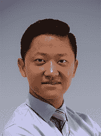
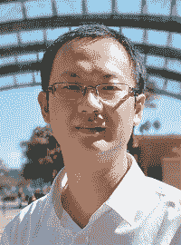

# 前置内容

## 前言

自动机器学习（AutoML）的目标是使机器学习（ML）对每个人可访问，包括医生、土木工程师、材料科学家和小企业主，以及统计学家和计算机科学家。这个长期愿景与微软 Office 的愿景非常相似——使普通用户能够轻松创建文档和准备报告——以及智能手机中的相机，方便在任何时间、任何地点拍照。尽管机器学习社区已经投入了大量研发努力来追求这一目标，但通过与领域专家和数据科学家的合作，我们确定，揭示 AutoML 背后的魔法，包括基本概念、算法和工具，有着很高的需求。

首先，我们想分享几个让我们走到这一步的步骤。（好吧，如果你想的话，现在可以跳到我们的主要内容，但嘿，谁不喜欢一个好故事呢？）

我们在多年前就开始了数据科学和机器学习的旅程，并从那时起一直在从头研究和发展机器学习算法和系统。在早期，我们像许多人一样，被复杂的方程式、不稳定的结果和难以理解的超参数组合所折磨。后来，越来越多的先进算法被开发出来，开源实现也变得可用。不幸的是，训练一个有效的机器学习/深度学习模型仍然非常像炼金术，成为一名有能力的炼金术士需要多年的训练……是的，我们是有证书的炼金术士。

这些年来，我们遇到了许多想要尝试被称为机器学习的神奇工具的领域专家，因为它在许多任务上的卓越性能（或者简单地说，因为每个人都谈论它）。不出所料，它在许多数据集上表现良好，并改进了传统的基于规则或启发式的方法。在与许多具有相似任务的人反复合作（分类、聚类和预测）之后，我们不仅厌倦了应用 ML 工具，而且强烈地感觉到我们可以为所有人民主化 ML。AutoML，从这里开始！

自那以后，我们一直在进行一个名为“数据驱动模型发现”（D3M）的项目，该项目由 DARPA 支持，并启动了开源项目 AutoKeras。我们很高兴看到许多人对我们开发的软件感兴趣，他们为我们开发的工具提供了大量的积极和尖锐的反馈。同时，我们有幸结识并与其他在类似问题上工作的杰出研究人员和工程师合作。一切都在正确的方向上发展！

随着我们与越来越多的数据科学家和机器学习工程师合作，我们的愿景也在不断演变。最初，我们只想帮助人们通过几行代码快速利用机器学习，但随着我们面临越来越多的下游任务和问题，我们逐渐意识到，要实现这一目标还有很长的路要走。最紧迫的是，许多从业者都在开发自己的 AutoML 系统，这些系统能够很好地解决他们自己的内部小规模问题，例如自动异常检测、自动推荐系统和自动特征工程。我们的目标随后变成了让机器学习对每个人来说都触手可及。哎呀！这似乎和我们的原始计划一样！为了更好地实现这一目标，我们决定花大量时间撰写这本书，帮助您更好地使用和轻松开发 AutoML 工具。

我们希望您喜欢这本书，并期待您的反馈！

## 致谢

我们想感谢所有在我们撰写这本书期间帮助我们的人，没有他们这本书是不可能完成的。名单上的第一人是 François Chollet。他不仅为我们书籍的内容提供了宝贵的指导和反馈，还对 KerasTuner 和 AutoKeras 的设计和实现做出了重大贡献，使得这些库的使用变得如此愉快。我们还非常感激他在 Keras 上的出色工作，这为超参数调整和 AutoML 工作奠定了坚实的基础。

感谢所有为 KerasTuner 和 AutoKeras 开源项目做出贡献的开源贡献者，他们提供了宝贵的反馈，甚至代码贡献，使这些开源库变得如此易于使用。尽管我们没有全部见过你们，但你们的代码成为了这个庞大生态系统不可或缺的一部分，帮助了成千上万（甚至可能是数百万）的人。

我们衷心感谢德克萨斯 A&M 大学 DATA 实验室的同事们，在撰写这本书的过程中给予了我们帮助。我们特别感谢 Yi-Wei Chen，他帮助我们撰写了第九章的示例，使这本书更加完善。

致所有审稿人：Alain Couniot、Amaresh Rajasekharan、Andrei Paleyes、David Cronkite、Dewayne Cushman、Didier Garcia、Dimitris Polychronopoulos、Dipkumar Patel、Gaurav Kumar Leekha、Harsh Raval、Howard Bandy、Ignacio Ruiz、Ioannis Atsonios、Lucian Mircea Sasu、Manish Jain、Marco Carnini、Nick Vazquez、Omar El Malak、Pablo Roccatagliata、Richard Tobias、Richard Vaughan、Romit Singhai、Satej Kumar Sahu、Sean Settle、Sergio Govoni、Sheik Uduman Ali M、Shreesha Jagadeesh、Stanley Anozie、Steve D Sussman、Thomas Joseph Heiman、Venkatesh Rajagopal、Viton Vitanis、Vivek Krishnan、Walter Alexander Mata López、Xiangbo Mao 和 Zachery Beyel，您们细致的审稿和建议给了我们继续完善这本书的动力。

最后，没有 Manning Publications 的杰出人士，这本书是无法完成的。我们特别感谢我们的编辑 Toni Arritola 和 Rachel Head，他们提供了宝贵的评论，并在修订我们的稿件上勤奋工作。他们使本书易于阅读，并教会了我们如何写一本好书。我们还要感谢生产团队中的 Paul Wells、Andy Marinkovich 和 Keri Hales，以及我们的技术校对员 Karsten Strøbaek 和 Ninoslav Čerkez。没有你们，这本书是无法写成的。

## 关于本书

《自动机器学习实战》旨在帮助您学习 AutoML 的基本概念，并采用 AutoML 技术来解决机器学习任务，在实践中改进机器学习流程，借助如 AutoKeras 和 KerasTuner 等高级 AutoML 工具包。本书从关注 AutoML 的元素及其与机器学习的联系开始，然后逐渐引导您了解与 AutoML 问题合作的无形方面——从那些需要最少机器学习经验的问题到那些允许最灵活定制的那些。

### 适合阅读本书的人群

本书旨在为希望学习 AutoML 基础知识并采用 AutoML 技术的学生、教师、实践者和研究人员提供系统性的指导。我们的意图是避免繁重的数学公式和符号，而是从用户和开发者的角度，通过具体的用法示例和代码设计片段来介绍 AutoML 概念和技术。

### 本书组织结构：路线图

本书分为三个主要部分，共涵盖九个章节。第一部分介绍了机器学习的核心概念和一些流行模型，以帮助读者理解基本机器学习构建块，并获取学习 AutoML 的知识。对于那些没有太多经验解决机器学习问题的人来说，务必阅读本书的这一部分，以便为学习 AutoML 做好准备。

+   第一章介绍了自动机器学习的定义、核心思想和概念。

+   第二章通过几个具体的机器学习问题解决实例，帮助您理解机器学习构建块，并获取学习 AutoML 的知识。

+   第三章介绍了深度学习的基本构建块，并作为通往更好地理解本书第二部分介绍的生成和调整深度学习方法的 AutoML 方法的垫脚石。

第二部分解释了如何采用 AutoML 来解决机器学习问题，并在实践中改进机器学习解决方案。

+   第四章教您如何使用 AutoML 为监督学习问题创建一个端到端的深度学习解决方案。

+   第五章讨论了如何根据您的需求自定义 AutoML 搜索空间，并自动发现针对不同类型任务的某些深度学习解决方案。

+   第六章深入探讨了 AutoML 搜索空间的定制。分层设计为你调整无监督学习模型和优化算法提供了更大的灵活性。

第三部分从搜索方法和加速策略的角度探讨了某些高级 AutoML 设计和配置。

+   第七章讨论了如何实现一个顺序搜索方法来探索 AutoML 搜索空间。

+   第八章介绍了各种技术，以有限的计算资源加速搜索过程。

+   第九章回顾了我们所涵盖的核心概念，并为你提供了一份资源列表和策略，以扩展你的 AutoML 视野并保持与最新技术的同步。

### 关于代码

本书包含许多源代码示例，既有编号列表，也有与普通文本混排。在这两种情况下，源代码都使用固定宽度字体格式化，如这样，以将其与普通文本区分开来。有时代码也会加粗，以突出显示与章节中先前步骤相比有所改变的代码，例如当新功能添加到现有代码行时。

在许多情况下，原始源代码已被重新格式化；我们添加了换行并重新调整了缩进，以适应书中的可用页面空间。在极少数情况下，即使这样也不够，列表中还包括了行续行标记（➥）。此外，当代码在文本中描述时，源代码中的注释通常也会从列表中删除。代码注释伴随着许多列表，突出显示重要概念。

你可以从本书的 liveBook（在线）版本中获取可执行的代码片段，网址为[`livebook.manning.com/book/automated-machine-learning-in-action`](https://livebook.manning.com/book/automated-machine-learning-in-action)。本书中示例的完整代码可以从 Manning 网站下载，网址为[`mng.bz/y48p`](http://mng.bz/y48p)。

随着本书中使用的技术和开源库的持续发展和演变，本书中的源代码示例可能会在未来发生变化。请参考我们的 GitHub 仓库([`mng.bz/M2ZQ`](http://mng.bz/M2ZQ))，作为代码示例的最新真实来源。

### liveBook 讨论论坛

购买 *Automated Machine Learning in Action* 包括免费访问 liveBook，Manning 的在线阅读平台。使用 liveBook 的独家讨论功能，您可以在全球范围内或针对特定章节或段落附加评论。为自己做笔记、提问和回答技术问题以及从作者和其他用户那里获得帮助都非常简单。要访问论坛，请访问 [`livebook.manning.com/book/automated-machine-learning-in-action/discussion`](https://livebook.manning.com/book/automated-machine-learning-in-action/discussion)。您还可以在 [`livebook.manning.com/discussion`](https://livebook.manning.com/discussion) 上了解更多关于 Manning 论坛和行为准则的信息。

Manning 对读者的承诺是提供一个场所，让读者之间以及读者与作者之间可以进行有意义的对话。这不是对作者参与特定数量承诺的承诺，作者对论坛的贡献仍然是自愿的（且未付费）。我们建议您尝试向作者提出一些挑战性的问题，以免他们的兴趣转移！只要本书有售，论坛和以前讨论的存档将从出版社的网站提供访问。

### 其他在线资源

查看以下资源，以获得关于本书涵盖主题的额外帮助：

+   GitHub 页面 ([`mng.bz/aDEj`](http://mng.bz/aDEj)) 提供了一个提交有关我们书籍的问题或提供评论的绝佳场所。

+   AutoKeras 的 GitHub 讨论区 ([`mng.bz/g4ve`](http://mng.bz/g4ve)) 同样是一个提问和帮助他人的绝佳场所。帮助他人是学习的好方法！

## 关于作者

宋庆泉博士是领英 AI 基金团队的一名机器学习和相关性工程师。他在德克萨斯 A&M 大学获得了计算机科学博士学位。他的研究兴趣包括自动化机器学习、动态数据分析、张量分解，以及它们在推荐系统和社交网络中的应用。他是 AutoKeras 的作者之一。他的论文已在 KDD、NeurIPS、数据发现知识交易（TKDD）等主要数据挖掘和机器学习场所发表。

金海峰博士是谷歌 Keras 团队的一名软件工程师。他是 AutoKeras 的创造者，也是 KerasTuner 项目的负责人。他还是 Keras 和 TensorFlow 的贡献者。他在德克萨斯 A&M 大学获得了计算机科学博士学位。他的研究兴趣集中在机器学习和 AutoML。

夏“本”胡博士是莱斯大学计算机科学系的副教授。胡博士在包括 NeurIPS、ICLR、KDD、WWW、IJCAI 和 AAAI 在内的几个主要学术场合发表了 100 多篇论文。他团队开发的开源软件包 AutoKeras 已成为 GitHub 上使用最广泛的自动深度学习系统（拥有超过 8,000 颗星和 1,000 次分支）。此外，他在深度协同过滤、异常检测和知识图谱方面的工作分别被纳入 TensorFlow 软件包、苹果生产系统和必应生产系统。他的论文在 WWW、WSDM 和 ICDM 等场合获得了数个最佳论文（候选人）奖项。他是 NSF 职业生涯奖和 ACM SIGKDD 新星奖的获得者。他的工作被引用超过 10,000 次，h 指数为 43。他是 2020 年 WSDM 会议的共同大会主席。

## 关于封面插图

《自动机器学习实战》的封面图是“阿拉贡人”，或称来自阿拉贡的人，取自雅克·格拉塞·德·圣索沃尔所著的书籍，该书于 1797 年出版。每一幅插图都是手工精心绘制和着色的。

在那些日子里，人们通过他们的服饰就能轻易地识别出他们居住的地方以及他们的职业或社会地位。曼宁通过基于几个世纪前丰富多样的地域文化的书封面来庆祝当今计算机行业的创新精神和主动性，这些文化通过如这一系列图片被重新带回生活。
