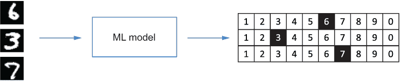
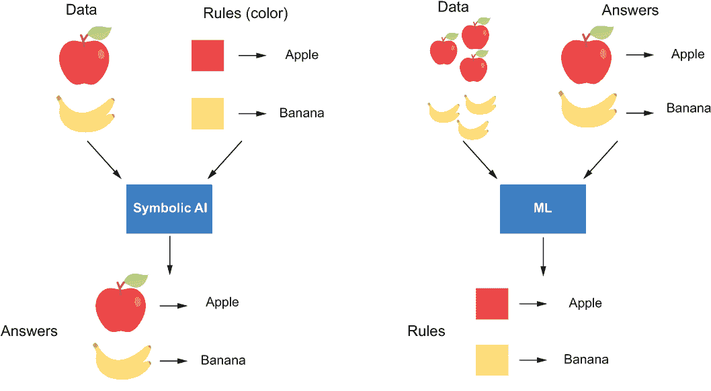
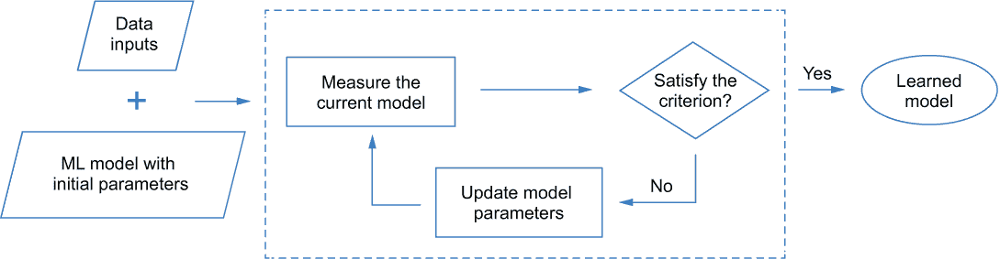
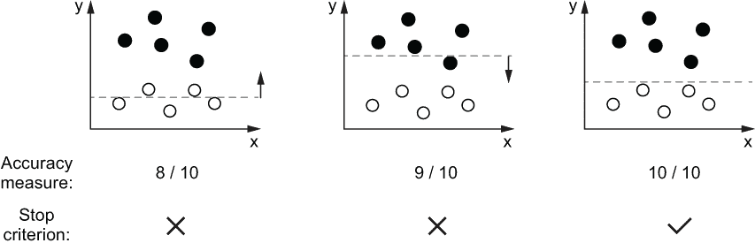
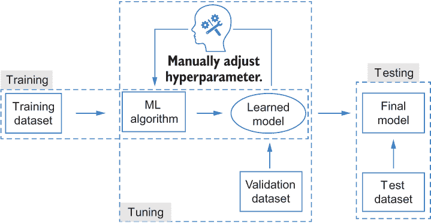
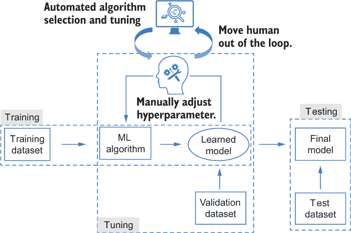
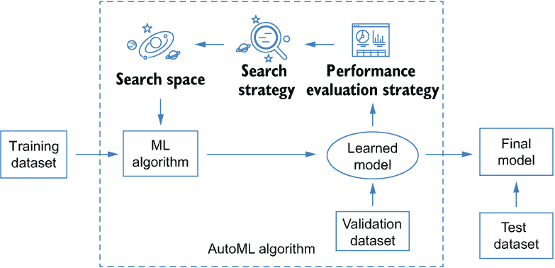
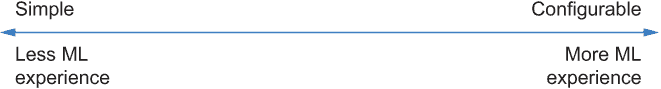

# 1 从机器学习到自动化机器学习

本章涵盖

+   定义并介绍机器学习的基本概念

+   描述自动化机器学习的动机和高级概念

*人工智能*（AI），它渗透到日常生活的许多方面，近年来已被广泛研究。它试图通过允许计算设备像人类一样感知环境来自动化任务。作为人工智能的一个分支，*机器学习*（ML）使计算机能够通过自我探索数据来执行任务。它允许计算机学习，因此它可以完成我们不知道如何命令它去做的事情。但是，入门的门槛很高：学习涉及的技术和积累应用所需的经验的成本意味着没有太多专业知识的从业者难以使用机器学习。将机器学习技术从象牙塔中取出并使其对更多人可及，正成为研究和工业界的关键焦点。为此，*自动化机器学习*（AutoML）已成为一个主流的研究领域。其目标是模拟人类专家如何解决机器学习问题，并自动发现给定问题的最佳机器学习解决方案，从而让没有丰富经验的从业者能够访问现成的机器学习技术。除了对新手有益外，AutoML 还将减轻专家和数据科学家设计和配置机器学习模型的负担。作为一个前沿话题，它对大多数人来说都是新的，其当前的能力常常被大众媒体夸大。为了让你对 AutoML 有一个大致的了解，本章提供了一些背景知识，介绍了基本概念，并指导你了解其研究价值和实际效益。让我们从一个玩具示例开始。

## 1.1 自动化机器学习的一瞥

假设你想要设计一个机器学习模型来识别图像中的手写数字。该机器学习模型将图像作为输入，并输出每个图像中相应的数字（见图 1.1）。



图 1.1 使用机器学习模型识别手写数字

如果您不熟悉机器学习，让我们用一个具有 Python 风格的程序示例来说明我们通常如何在实践中实现这个目标。我们以一个从类中实例化的机器学习模型作为对象，如列表 1.1 所示。这个类对应于我们希望在模型中使用的特定类型的机器学习算法（一系列过程）。¹ 要实例化一个模型，除了选择要使用的算法类之外，我们还需要向算法提供一些历史数据和参数（arg1 和 arg2）。这里使用的历史数据包括手写数字的图像，其标签（对应的数字）已经已知。这有助于机器（或机器学习算法）进行学习过程——即学习如何识别图像中的数字，类似于如何训练一个孩子从图片中识别物体。（您将在后面的章节中看到这个过程的细节。）这里的参数用于控制算法，指导它如何进行这个过程。生成的机器学习模型将能够使用下一个列表中的第二行代码预测以前未见过的图像中的数字（见图 1.1）。

列表 1.1 简化的机器学习过程

```
ml_model = MachineLearningAlgorithm1(
    arg1=..., arg2=..., data=historical_images)                     ❶
digits=[model.predict_image_digit(image) for image in new_images]   ❷
```

❶ 创建机器学习模型

❷ 使用机器学习模型进行预测

如您从代码中看到的，除了我们可能需要自己准备的数据集之外，我们还需要根据我们的先验知识提供以下两个东西来处理任务：

+   要使用的机器学习算法（或方法）；即 MachineLearningAlgorithm1

+   算法的参数

在实践中，选择算法和配置其参数可能很困难。让我们以算法选择为例。作为一个初学者，典型的方法是收集一些学习资料，探索一些相关任务的代码，并确定一组您可能能够用于当前任务的机器学习算法。然后，您可以在您的历史数据上逐一尝试它们（正如我们在列表 1.1 中所做的那样），并根据它们在识别图像中的数字时的性能选择最佳的一个。这个重复的过程将在下一个代码示例中总结。

列表 1.2 选择机器学习算法的简单方法

```
ml_algorithm_pool = [
    MachineLearningAlgorithm1,                  ❶
    MachineLearningAlgorithm2,                  ❶
    ...,                                        ❶
    MachineLearningAlgorithmN,                  ❶
]
for ml_algorithm in ml_algorithm_pool:          ❷
    model = ml_algorithm(                       ❸
        arg1=..., arg2=...,                     ❸
        data=historical_images)                 ❸
    result = evaluate(model)                    ❸
    push result into the result_pool
    push model into the model_pool
best_ml_model = pick_the_best(result_pool,
                              ml_model_pool)    ❹
return best_ml_model
```

❶ 要测试的机器学习算法池

❷ 遍历所有候选的机器学习算法

❸ 根据每个机器学习算法实例化和评估机器学习模型

❹ 根据性能选择最佳机器学习模型

这个过程看起来直观，但如果您没有太多的机器学习知识或经验，可能需要花费数小时或数天。原因有以下几点。首先，收集一组可行的机器学习算法可能具有挑战性。您可能需要探索文献，识别最先进的算法，并学习如何实现它们。其次，可行的机器学习算法数量可能非常大。逐一尝试可能不是一个好的选择，甚至可能成为障碍。第三，每个算法都有自己的参数。正确配置它们需要专业知识、经验和甚至一些运气。

是否有更好的方法来做这件事？是否有可能让机器自动为你完成？如果你面临过类似的问题，并希望以更节省劳动力的方式采用机器学习（ML），AutoML 可能就是你要找的工具。简单来说，AutoML 模仿了前面伪代码中描述的手动过程。它试图自动化选择和配置机器学习算法的重复和繁琐的过程，并可能让你访问许多高级算法，即使你不知道它们的存在。以下两行伪代码说明了如何使用 AutoML 算法生成机器学习解决方案：

```
automl_model = AutoMLAlgorithm()
best_ml_model = automl_model.generate_model(data=historical_images)
```

从 AutoML 算法创建一个 AutoML 模型对象意味着你甚至不需要提供要测试的机器学习算法池，你只需将数据输入其中，就可以生成所需的模型。

但你如何选择一个 AutoML 算法？它将选择哪些机器学习算法？它是如何评估它们并选择一个模型的？在继续之前，我将给你一些关于机器学习的背景知识，这样你就能更好地理解 AutoML 自动化的内容以及如何在实践中使用它来节省时间和精力。这里的重点将放在你需要了解的内容上，以便学习和使用 AutoML。如果你想了解更多关于这些算法的信息，我建议参考其他机器学习书籍，例如 Peter Harrington 的《机器学习实战》（Manning, 2012）和 François Chollet 的《Python 深度学习》（2nd ed.，Manning, 2021）。对于已经熟悉机器学习基础知识的读者，下一节将作为一个复习，确保我们对一些术语有共同的理解，并为以下对 AutoML 的介绍提供更好的动机。

## 1.2 开始学习机器学习

本节简要介绍了机器学习——它是什么，机器学习算法中的关键组件，以及如何根据选定的算法和数据输入创建机器学习模型。学习这些基础知识对于理解下一节中介绍的 AutoML 概念至关重要。

### 1.2.1 什么是机器学习？

在机器学习出现之前，人工智能研究中的主导范式是**符号 AI**，计算机只能根据人类明确输入的预定义规则处理数据。机器学习的出现通过使知识能够从数据中隐式学习而革命性地改变了编程范式。例如，假设你希望机器能够自动识别苹果和香蕉的图像。在符号 AI 中，你需要向 AI 方法提供与推理过程相关的人类可读规则，可能指定颜色和形状等特征。相比之下，机器学习算法接受一系列图像及其相应的标签（“香蕉”或“苹果”），并输出学习到的规则，这些规则可以用来预测未标记的图像（见图 1.2）。



图 1.2 符号 AI 和机器学习的比较

机器学习的基本目标是*自动化*和*泛化*。自动化意味着 ML 算法在提供的数据上训练，以自动从数据中提取规则（或模式）。它模仿人类思维，并允许机器通过与提供给它的历史数据进行交互来提高自身，这我们称之为*训练*或*学习*。这些规则随后被用来在新数据上执行重复的预测，而不需要人为干预。例如，在图 1.2 中，ML 算法与提供的苹果和香蕉图像进行交互，并在训练过程中提取一个颜色规则，使其能够通过训练过程识别它们。这些规则可以帮助机器在没有人类监督的情况下对新图像进行分类，这我们称之为对*新数据*的*泛化*。泛化的能力是评估 ML 算法好坏的重要标准。在这种情况下，假设一个黄色苹果的图像被输入到 ML 算法中——颜色规则将无法使其正确判断它是苹果还是香蕉。一个学习并应用形状特征进行预测的 ML 算法可能会提供更好的预测。

### 1.2.2 机器学习过程

ML 算法通过接触具有已知输出的示例来学习规则。这些规则预期能够使它将输入转换为有意义的输出，例如将手写数字的图像转换为相应的数字。因此，学习的目标也可以被视为使*数据转换*成为可能。学习过程通常需要以下两个组件：

+   *数据输入*——要输入到 ML 算法中的目标任务的实例数据，例如，在图像识别问题中（见图 1.2），一组苹果和香蕉图像及其相应的标签

+   *学习算法*——一种基于数据输入推导模型的数学过程，它包含以下四个要素：

    +   一个具有从数据中学习的一组*参数*的 ML 模型

    +   一种测量模型性能（如预测准确度）的*测量*方法，使用当前参数

    +   一种更新模型的方法，我们称之为*优化方法*

    +   一个*停止标准*，以确定学习过程何时应该停止

在模型参数初始化后，² 学习算法可以通过根据测量结果迭代地修改参数来更新模型，直到达到停止标准。这个测量结果被称为训练阶段的*损失函数*（或*目标函数*），它衡量模型预测与真实目标之间的差异。这个过程如图 1.3 所示。



图 1.3 训练 ML 模型的过程

让我们通过一个例子来帮助你更好地理解学习过程。想象一下，我们有一组在二维空间中的数据点（见图 1.4）。每个点要么是黑色，要么是白色。我们希望构建一个机器学习模型，每当有一个新的点到来时，可以根据点的位置判断这个点是黑色还是白色。实现这个目标的一个直接方法是根据手头的数据点在二维空间中绘制一条水平线，将其分割成两部分。这条线可以被视为一个机器学习模型。其参数是水平位置，可以通过提供的数据点进行更新和学习。结合图 1.3 中介绍的学习过程，所需组件可以总结如下：

+   数据输入是一组由它们在二维空间中的位置描述的黑白点。

+   学习算法由以下四个选定的组件组成：

    +   *机器学习模型*——一条可以表示为 *y = a* 的水平线，其中 *a* 是可以通过算法更新的参数。

    +   *准确度测量*——根据模型正确标记的点所占的百分比。

    +   *优化方法*——通过一定的距离上下移动线。这个距离可以与每次迭代的测量值相关。它将一直移动，直到满足停止标准。

    +   *停止标准*——当测量值为 100%时停止，这意味着所有手头的点都根据当前线被正确标记。



图 1.4 学习过程的一个示例：学习一条水平线来分割黑白点

在图 1.4 所示的例子中，学习算法经过两次迭代就达到了期望的线，这条线正确地分割了所有输入点。但在实际应用中，这个标准可能并不总是满足。它取决于输入数据的分布、选定的模型类型以及模型是如何被测量和更新的。我们通常需要选择不同的组件并尝试不同的组合来调整学习过程，以获得预期的机器学习解决方案。此外，即使学习到的模型能够正确标记所有训练输入，也不能保证它在未见过的数据上表现良好。换句话说，模型泛化能力可能不佳（我们将在下一节中进一步讨论这个问题）。仔细选择组件和调整学习过程非常重要。

### 1.2.3 超参数调整

我们如何选择合适的组件来调整学习过程，以便我们能够推导出预期的模型？为了回答这个问题，我们需要介绍一个称为 *超参数* 的概念，并阐明这些参数与我们之前讨论的参数之间的关系如下：

+   *参数*是机器学习算法在学习过程中可以更新的变量。它们用于捕捉数据中的规则。例如，水平线的位置是我们之前示例（图 1.4）中唯一的参数，用于帮助分类点。它通过优化方法在训练过程中进行调整，以捕捉分割不同颜色点的位置规则。通过调整参数，我们可以得到一个可以准确预测给定输入数据输出的机器学习模型。

+   *超参数*也是参数，但它们是在学习过程开始之前我们为算法预先定义的，并且在学习过程中它们的值保持固定。这些包括测量、优化方法、学习速度、停止标准等等。一个机器学习算法通常有多个超参数。它们的不同组合对学习过程有不同的影响，从而产生具有不同性能的机器学习模型。我们也可以将算法类型（或机器学习模型类型）视为超参数，因为我们自己选择它，并且在学习过程中它是固定的。

为机器学习算法选择最佳超参数组合的过程称为*超参数调整*，通常通过迭代过程来完成。在每次迭代中，我们选择一组超参数来使用，以便使用训练数据集学习一个机器学习模型。图 1.5 中的机器学习算法块表示图 1.3 中描述的学习过程。通过在称为*验证集*的单独数据集上评估每个学习到的模型，然后我们可以选择最好的一个作为最终模型。我们可以使用另一个称为*测试集*的数据集来评估该模型的泛化能力，这标志着整个机器学习工作流程的结束。



图 1.5 经典机器学习工作流程

通常，在机器学习工作流程中，我们将有三个数据集。每个数据集与其他两个都不同，如下所述：

+   训练集在学习过程中用于使用固定的超参数组合训练模型。

+   验证集在调整过程中用于评估训练模型以选择最佳超参数。

+   测试集在调整过程之后用于最终测试。它只在最终模型选定后使用一次，不应用于训练或调整机器学习算法。

训练集和测试集的理解相对简单。我们想要有一个额外的验证数据集的原因是避免在调整阶段将算法暴露于所有训练数据中——这增强了最终模型对未见数据的泛化能力。如果我们没有验证集，调整阶段选出的最佳模型将是专注于从训练数据中提取任何细微特征以不断增加训练准确率，而不关心任何未见数据集的模型。这种情况很可能会导致最终测试集（包含不同的数据）表现不佳。当模型在测试集（或验证集）上的表现不如训练集时，这被称为*过拟合*。这是机器学习中一个众所周知的问题，通常发生在模型的学习能力太强且训练数据集规模有限的情况下。例如，假设你想要根据前三个数字作为训练数据来预测一个数列的第四个数：*a*[1] = 1, *a*[2] = 2, *a*[3] = 3, *a*[4] = ? (*a*[4]在这里是验证集；*a*[5]及以后的是测试集。)如果正确的解是*a*[4] = 4，一个简单的模型*a[i]* = *i*会给出正确答案。如果你使用三次多项式来拟合这个数列，一个完美的训练数据解将是*a[i]* = *i*³ - 6*i*² + 12*i* - 6，这将预测*a*[4]为 10。验证过程使得模型在评估期间能够更好地反映其泛化能力，从而选择出更好的模型。

注意：过拟合是机器学习中研究的重要问题之一。除了在调整过程中进行验证之外，我们还有许多其他方法来解决这个问题，例如增加数据集、在训练过程中向模型添加正则化以约束其学习能力，等等。我们在这里不会深入探讨这个问题。要了解更多关于这个主题的信息，请参阅 Chollet 的《用 Python 进行深度学习》。

### 1.2.4 应用机器学习的障碍

在这个阶段，你应该对机器学习（ML）是什么以及它是如何进行的有一个基本的了解。尽管你可以利用许多成熟的机器学习工具包，但在实践中你仍然可能会遇到困难。本节描述了其中的一些挑战——目的不是让你望而却步，而是为随后描述的自动化机器学习（AutoML）技术提供背景。你可能会遇到的障碍包括以下内容：

+   *学习机器学习技术的成本*——我们已经介绍了基础知识，但在将机器学习应用于实际问题时，还需要更多的知识。例如，你需要考虑如何将你的问题表述为机器学习问题，你可以为你的问题使用哪些机器学习算法以及它们是如何工作的，如何清理和预处理数据以符合输入机器学习算法的预期格式，应该选择哪些评估标准用于模型训练和超参数调整，等等。所有这些问题都需要提前回答，这样做可能需要大量的时间投入。

+   *实施复杂性*—即使拥有必要的知识和经验，在选定机器学习算法后实施工作流程也是一个复杂任务。随着更高级算法的采用，实施和调试所需的时间将会增加。

+   *理论与实践之间的差距*—学习过程可能难以解释，性能高度依赖于数据。此外，机器学习中使用的数据集通常复杂且噪声大，难以解释、清理和控制。这意味着调整过程通常比分析过程更经验性。即使是机器学习专家有时也无法达到预期的结果。

这些困难在很大程度上阻碍了机器学习向经验有限的人的普及，并相应地增加了机器学习专家的负担。这促使机器学习研究人员和实践者寻求降低障碍、规避不必要的程序、减轻手动算法设计和调整负担的解决方案——AutoML。

## 1.3 AutoML：自动化的自动化

AutoML 的目标是让机器模仿人类如何设计、调整和应用机器学习算法，以便我们更容易地采用机器学习（见图 1.6）。因为机器学习的一个关键特性是自动化，所以 AutoML 可以被视为自动化的自动化。



图 1.6 AutoML 的主要目标：将人类从机器学习算法设计和调整的循环中解放出来

为了帮助您理解 AutoML 是如何工作的，让我们首先回顾其关键组件。

### 1.3.1 AutoML 的三个关键组件

这里是对第 1.1 节中引入的伪代码的回顾：

```
ml_algorithm_pool = [
    MachineLearningAlgorithm1,
    MachineLearningAlgorithm2,
    ...,
    MachineLearningAlgorithmN,
]
for ml_algorithm in ml_algorithm_pool:
    model = ml_algorithm(arg1=..., arg2=..., data=historical_images)
    result = evaluate(model)
    push result into the result_pool
    push model into the model_pool
best_ml_model = pick_the_best(result_pool, ml_model_pool)
return best_ml_model
```

这段伪代码可以被视为一个简单的自动化机器学习（AutoML）算法，它接受一组机器学习算法作为输入，逐一评估它们，并输出从最佳算法中学习到的模型。每个 AutoML 算法都包含以下三个核心组件（见图 1.7）：

+   *搜索空间*—一组超参数，以及从中选择的每个超参数的范围。每个超参数的范围可以根据用户的需求和知识来定义。例如，搜索空间可以是一个机器学习算法的集合，如伪代码所示。在这种情况下，我们将机器学习算法的类型视为需要选择的超参数。搜索空间也可以是特定机器学习算法的超参数，例如机器学习模型的结构。搜索空间的设计高度依赖于任务，因为我们可能需要为不同的任务采用不同的机器学习算法。它也非常个性化且具有针对性，取决于用户的兴趣、专业知识和经验水平。在定义一个大的搜索空间带来的便利性和花费在识别一个好的模型（或在一个有限的时间内可以达到的模型性能）之间的权衡总是存在的。对于初学者来说，定义一个足够通用以适用于任何任务或情况的广泛搜索空间可能会很有吸引力，例如包含所有机器学习算法的搜索空间——但所涉及的时间和计算成本使得这成为一个较差的解决方案。我们将在本书的第二部分更详细地讨论这些考虑因素，其中你将学习如何根据额外的要求在不同的场景中自定义你的搜索空间。

+   *搜索策略*—从搜索空间中选择最佳超参数集的策略。由于 AutoML 通常是一个迭代试错的过程，该策略通常按顺序选择搜索空间中的超参数并评估其性能。它可能遍历搜索空间中的所有超参数（如伪代码所示），或者根据迄今为止已评估的超参数调整搜索策略，以提高后续试验的效率。一个更好的搜索策略可以帮助你在相同的时间内实现更好的机器学习解决方案。它还可能通过减少搜索时间和计算成本，允许你使用更大的搜索空间。本书的第三部分将介绍如何采用、比较和实现不同的搜索算法。

+   *性能评估策略*—评估由所选超参数实例化的特定机器学习算法性能的方法。评估标准通常与手动调优中使用的相同，例如从所选机器学习算法中学习到的模型的验证性能。在本书中，我们讨论了在采用 AutoML 解决不同类型的机器学习任务时采用的不同评估策略。



图 1.7 AutoML 过程

为了促进 AutoML 算法的采用，AutoML 工具包通常将这三个组件打包在一起，并提供一些具有默认搜索空间和搜索算法的通用应用程序编程接口（API），这样您就不必担心自己选择它们。对于最终用户来说，在最简单的情况下，您要获得最终模型所需做的只是提供数据，如这里所示——您甚至不需要将数据分成训练集和验证集：

```
automl_model = AutoMLAlgorithm()
best_ml_model = automl_model.generate_model(data=...)
```

但由于不同用户可能有不同的用例和机器学习专业知识水平，他们可能需要设计自己的搜索空间、评估策略，甚至搜索策略。因此，现有的 AutoML 系统通常也提供具有可配置参数的 API，以便您可以根据需要自定义不同的组件。从最简单的到最可配置的（图 1.8），提供了广泛的选择。



图 1.8 AutoML API 的范围

可用的 API 范围允许您选择最适合您用例的一个。本书将教会您如何在一个高级 AutoML 工具包*AutoKeras*中为不同的 AutoML 应用选择正确的 API。您还将学习如何借助 KerasTuner 创建自己的 AutoML 算法。

### 1.3.2 我们能否实现完全自动化？

AutoML 领域已经发展了三十年，有行业和开源社区的参与。已经看到了许多成功的实施和有希望的发展，如这里所述：

+   许多公司内部工具和开源平台已被开发出来，以帮助进行机器学习模型的超参数调整和模型选择（例如 Google Vizier、Facebook Ax 等）。

+   在许多 Kaggle 数据科学竞赛中，观察到执行接近人类水平的 AutoML 解决方案。

+   已经开发了大量的开源机器学习包，用于改进超参数调整和机器学习管道创建，例如 Auto-sklearn、AutoKeras 等。

+   商业 AutoML 产品正在帮助许多公司，无论大小，在生产中采用机器学习。例如，迪士尼成功使用了 Google Cloud AutoML 为其在线商店开发机器学习解决方案，而没有雇佣一支机器学习工程师团队（[`blog.google/products/google-cloud/cloud-automl-making-ai-accessible-every-business/`](https://blog.google/products/google-cloud/cloud-automl-making-ai-accessible-every-business/))。

+   计算机科学以外的领域的学者，如医学、神经生物学和经济学，也在利用 AutoML 的力量。他们现在可以将新的机器学习解决方案应用于特定领域的问题，如医学图像分割³、基因组研究⁴和动物识别与保护⁵，而无需经历机器学习和编程的漫长学习曲线。

我们仍在探索 AutoML 的全部功能，以民主化机器学习技术，使不同领域更多的人能够访问。尽管到目前为止已经看到了许多 AutoML 的成功应用，但我们仍然有许多挑战和限制需要进一步探索和解决，包括以下内容：

+   *构建 AutoML 系统的难度*——与构建机器学习系统相比，从头开始构建 AutoML 系统是一个更复杂且涉及更多的过程。

+   *收集和清理数据的自动化*——AutoML 仍然需要人们来收集、清理和标记数据。在实践中，这些过程通常比机器学习算法的设计更复杂，至少到目前为止，它们不能通过 AutoML 自动化。为了使 AutoML 今天能够工作，它必须被赋予一个明确的任务和目标，并使用高质量的数据库。

+   *选择和调整 AutoML 算法的成本*——“没有免费午餐”定理告诉我们，没有一种万能的 AutoML 算法可以适用于任何超参数调整问题。你在选择和调整机器学习算法上节省的努力可能会被分摊，甚至可能被选择和调整 AutoML 算法所需付出的努力所超过。

+   *资源成本*——从时间和计算资源的角度来看，AutoML 是一个相对昂贵的流程。现有的 AutoML 系统通常需要尝试比人类专家更多的超参数才能达到可比的结果。

+   *人机交互的成本*——解释 AutoML 的解决方案和调整过程可能并不容易。随着这些系统变得更加复杂，人类参与调整过程和理解最终模型是如何实现的将变得越来越困难。

AutoML 仍处于发展的早期阶段，其持续进步将严重依赖于来自不同领域的学者、开发者和实践者的参与。尽管你有一天可能会为这一努力做出贡献，但本书的目标更为谦逊。它主要针对那些在机器学习方面专业知识有限，或者有一定经验但希望节省在创建机器学习解决方案上所花费的努力的从业者。本书将教你如何用不超过五行代码自动解决机器学习问题。它将逐步介绍更复杂的 AutoML 解决方案，适用于更复杂的情况和数据类型，例如图像、文本等。为了帮助你入门，在下一章中，我们将更深入地探讨机器学习的根本原理，并探索机器学习项目的端到端流程。这将有助于你在后续章节中更好地理解和利用 AutoML 技术。

## 摘要

+   机器学习是指计算机通过自动与数据交互来修改其处理过程的能力，而不需要被明确编程。

+   机器学习过程可以描述为一个迭代算法过程，根据数据输入和某些测量来调整机器学习模型的参数。当模型能够提供预期的输出，或者达到用户定义的某些特定标准时，这个过程停止。

+   调整机器学习算法中的超参数允许你调整学习过程，并选择适合当前机器学习问题的组件。

+   AutoML 旨在从设计和应用机器学习模型的经验中学习，并自动化调整过程，从而减轻数据科学家的负担，并使没有丰富经验的专业人士能够使用现成的机器学习技术。

+   一个 AutoML 算法由三个关键组件组成：搜索空间、搜索策略和评估策略。不同的 AutoML 系统提供不同级别的 API，这些 API 要么为你配置这些组件，要么允许你根据你的用例自定义它们。

+   AutoML 包含许多未解决的问题，阻碍了它达到最高的期望。实现真正的自动机器学习将是困难的。我们应该保持乐观，但也要注意避免夸大 AutoML 当前的能力。

* * *

(1.) 许多知名的机器学习包提供了对应于机器学习算法的这些类，例如 scikit-learn。

(2.) 参数值可能随机初始化，或者按照某种策略分配，例如使用预热启动，在这种情况下，你从一些由类似模型学习到的现有参数开始。

(3.) 汪宇，等，“NAS-Unet：用于医学图像分割的神经架构搜索”，*IEEE Access* 7 (2019): 44247-44257。

(4.) 刘登辉，等，“AutoGenome：基因组研究的 AutoML 工具”，bioRxiv (2019): 842526。

(5.) 刘尧，罗泽，等，“基于 AutoML 的保护区物种识别”，*计算机系统与应用* 28 (2019): 147-153。
