# 2 机器学习项目的端到端管道

本章涵盖

+   熟悉进行机器学习项目的端到端管道

+   为机器学习模型准备数据（数据收集和预处理）

+   生成和选择特征以增强机器学习算法的性能

+   构建线性回归和决策树模型

+   使用网格搜索微调机器学习模型

现在第一章已经设定了场景，是时候熟悉机器学习（ML）和自动化机器学习（AutoML）的基本概念了。因为自动化机器学习建立在机器学习的基础上，学习机器学习的基本原理将帮助你更好地理解和利用自动化机器学习技术。这在设计自动化机器学习算法中的搜索空间时尤为重要，这决定了要使用的机器学习组件及其超参数的范围。在本章中，我们将通过一个具体的例子来解决问题。这将帮助你更深入地理解构建机器学习管道的整体过程，尤其是如果你在机器学习项目中经验不足的话。你还将学习一种调整机器学习模型超参数的简单方法。这可以被视为自动化机器学习最简单的应用之一，展示了它如何帮助你找到更好的机器学习解决方案。本书的第二部分将介绍更高级的自动化机器学习任务和解决方案。

注意：本节及后续章节中包含的所有代码片段均以 Python 编写，以 Jupyter 笔记本的形式呈现。它们都是由 Jupyter Notebook（[`jupyter.org`](https://jupyter.org)）生成的，这是一个开源的 Web 应用程序，提供交互式代码设计、数据处理和可视化、叙述文本等功能。它在机器学习和数据科学社区中非常受欢迎。如果你不熟悉环境设置或没有足够的硬件资源，你还可以在 Google Colaboratory（[`colab.research.google.com/`](http://colab.research.google.com/)）中运行代码，这是一个免费的 Jupyter 笔记本环境，任何人都可以在其中运行机器学习实验。有关在 Google Colaboratory（简称 Colab）中设置环境的详细说明请参阅附录 A。笔记本可在[`github.com/datamllab/automl-in-action-notebooks`](https://github.com/datamllab/automl-in-action-notebooks)找到。

## 2.1 端到端管道概述

*机器学习管道*是一系列用于执行机器学习项目的步骤。这些步骤依次为：

+   *问题界定和数据收集*——将问题界定为机器学习问题并收集所需的数据。

+   *数据预处理和特征工程*—将数据处理成适合输入到机器学习算法的格式。选择或生成与目标输出相关的特征，以提高算法的性能。这一步骤通常通过首先探索数据集来了解其特征来完成。操作应适应你考虑的具体机器学习算法。

+   *机器学习算法选择*—根据你对问题的先验知识和经验，选择适合你想要测试的任务的机器学习算法。

+   *模型训练和评估*—将选定的机器学习算法（或算法）应用于训练数据，以训练机器学习模型，并在验证数据集上评估其性能。

+   *超参数调整*—通过迭代调整模型的超参数来尝试实现更好的性能。

+   *服务部署和模型监控*—部署最终的机器学习解决方案，并监控其性能，以便你可以持续维护和改进管道。

如你所见，机器学习项目是一个人机交互的过程。从问题定义和数据处理开始，管道涉及多个数据处理步骤，这些步骤通常异步发生（见图 2.1）。本书的其余部分将重点关注服务部署和监控之前的步骤。要了解更多关于部署和提供模型的信息，请参考杰夫·史密斯（Manning，2018 年）的《机器学习系统》或道格·哈奇顿和理查德·尼科尔（Manning，2019 年）的《商业机器学习》等参考资料。

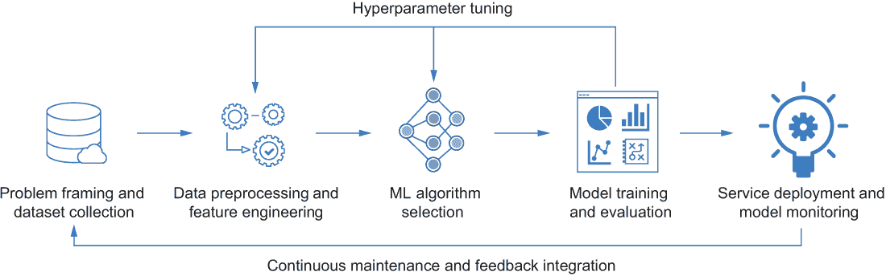

图 2.1 全端机器学习项目管道

让我们开始解决一个实际问题，以便你熟悉管道中的每个组件。我们在这里探索的问题是预测一个住宅区的平均房价，给定房屋的特征，如位置和房间数量。我们使用的数据是 R.凯利·佩斯和罗纳德·巴里 1997 年文章“稀疏空间自回归”中提到的加利福尼亚住房数据集，该数据集是通过 1990 年的人口普查收集的。这是一个在许多实际机器学习书籍中作为入门问题使用的代表性问题，因为数据规模小，数据准备简单。

注意选择合适的问题进行工作是困难的。这取决于多个因素，例如您的业务需求和研究目标。在真正投入问题之前，问问自己你期望实现哪些解决方案，以及它们将如何惠及你的下游应用，以及是否已有工作已经满足了这一需求。这将帮助你决定这个问题是否值得投资。

## 2.2 定义问题和组装数据集

在任何机器学习项目中，你需要做的第一件事是定义问题和收集相应的数据。定义问题需要你指定机器学习模型的输入和输出。在加利福尼亚住宅问题中，输入是描述住宅区块的特征集合。

在这个数据集中，一个住宅区块是一群平均有 1,425 人居住在地理上紧凑区域的人群。特征包括住宅区块中每栋房子的平均房间数、区块中心的纬度和经度等。输出应该是区块的平均房价。我们试图训练一个机器学习模型，给定已知中位数的住宅区块，并基于其特征预测未知房价。返回的预测值也被称为模型的*目标*（或*注释*）。通常，任何旨在根据现有注释示例学习数据输入和目标之间关系的问题都被称为*监督学习*问题。这是机器学习研究最广泛的分支，也是本书余下的主要关注点。

我们可以根据目标值的类型进一步将监督学习问题分类为不同的类别。例如，任何具有连续目标值的监督学习问题都可以归类为*回归*问题。因为价格是一个连续变量，所以预测加利福尼亚房价本质上是一个回归问题。如果监督学习问题中的目标值是有限类别的离散值，我们称该问题为*分类*问题。你可以在附录 B 中找到一些分类问题的例子，我们也会在下一章中探讨它们。

在定义问题之后，下一步是收集数据。因为加利福尼亚住宅数据集是使用最广泛的机器学习数据集之一，你可以通过流行的机器学习库 scikit-learn 轻松访问它。然而，需要注意的是，在现实生活中，发现和获取数据集是一项非同寻常的活动，可能需要额外的技能，例如对*结构化查询语言*（SQL）的了解，这超出了本书的范围。（有关更多信息，请参阅 Jeff Smith 的书籍《机器学习系统》）。以下代码将加载我们问题的数据集。

列表 2.1 加载加利福尼亚住宅数据集

```
from sklearn.datasets import fetch_california_housing   ❶

house_dataset = fetch_california_housing()              ❷
```

❶ 从 scikit-learn 库导入数据集加载函数

❷ 加载加利福尼亚住宅数据集

原始数据是一个包含数据点的字典，这些数据点以实例-特征矩阵的格式进行格式化。每个数据点都是一个由矩阵中的一行特征描述的住宅区块。它们的标签以向量的格式进行格式化。该字典还包含特征名称和描述，这些描述说明了特征的含义和数据集的创建信息，如下所示：

```
>>> house_dataset.keys()
dict_keys(['data', 'target', 'feature_names', 'DESCR'])
```

在加载原始数据集之后，我们提取数据点和将它们转换为 *DataFrame*，这是 pandas 库的基本结构。pandas 是 Python 中进行数据分析和操作的有力工具。如图 2.2 所示，目标以 *Series* 对象的格式表示；它是一个带有标签“MedPrice”的向量，代表该住宅区的中位房价（以百万美元为单位）。

列表 2.2 提取数据样本和目标

```
import pandas as pd                                                         ❶
data = pd.DataFrame(house_dataset.data, columns=house_dataset.feature_names)❷

target = pd.Series(house_dataset.target, name = 'MedPrice')                 ❸
```

❶ 导入 pandas 包

❷ 将带有其名称的特征提取到 DataFrame 中

❸ 将目标提取为名为 "MedPrice" 的 Series 对象

让我们打印出数据的前五个样本（如图 2.2 所示）。第一行表示特征名称，详细信息可以在 [`scikit-learn.org/ stable/datasets.html`](https://scikit-learn.org/stable/datasets.html) 找到。例如，“AveRooms”特征表示一个住宅区内的平均房间数。我们也可以以同样的方式检查目标数据的值，如下所示：

```
>>> data.head(5)
```

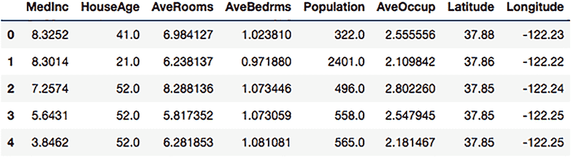

图 2.2 加利福尼亚住房数据集的前五个样本的特征

在进行数据预处理步骤之前，我们首先进行数据拆分，以分离训练数据和测试集。正如你在上一章所学，这样做的主要目的是避免在用于进行分析和训练模型的数据上测试你的模型。拆分数据到训练集和测试集的代码如下所示。

列表 2.3 将数据拆分为训练集和测试集

```
from sklearn.model_selection import train_test_split    ❶

X_train, X_test, y_train, y_test = train_test_split(
    data, target,
    test_size=0.2,
    random_state=42)                                    ❷
```

❶ 从 scikit-learn 导入数据拆分函数

❷ 随机将 20% 的数据拆分为测试集

我们将 20% 的数据随机拆分为测试集。现在让我们快速检查拆分情况。查看完整数据集，你会发现它包含 20,640 个数据点。每个住宅区的特征数量为八个。训练集包含 16,512 个样本，测试集包含 4,128 个样本，如以下代码片段所示：

```
>>> (data.shape, target.shape), (X_train.shape, y_train.shape), (X_test.shape, y_test.shape)
(((20640, 8), (20640,)), ((16512, 8), (16512,)), ((4128, 8), (4128,)))
```

在你得到最终的机器学习解决方案之前，不要触碰测试集中的目标数据。否则，包括数据准备和模型训练在内的所有分析可能会过度拟合测试数据，导致最终解决方案在部署时在未见过的数据上表现不佳。在数据预处理和特征工程中，将测试集中的特征与训练特征相结合是可行的，正如我们将在以下章节中所做的那样。当数据集大小较小时，聚合特征信息可能很有帮助。

## 2.3 数据预处理

我们下一步要做的是进行一些预处理，将数据转换成适合输入到机器学习算法的格式。这个过程通常涉及基于先前的假设或对数据的疑问进行的某些*探索性数据分析*（EDA）。EDA 可以帮助我们熟悉数据集，并对其有更深入的了解，以便更好地准备数据。常见的问题包括以下内容：

+   每个特征中的值的数据类型是什么？它们是字符串或其他可以在管道后续步骤中使用的对象，还是需要转换？

+   每个特征有多少个不同的值？它们是数值、分类值还是其他类型？

+   每个特征的尺度及基本统计信息是什么？通过可视化值的分布或它们之间的相关性，我们能获得一些洞察吗？

+   数据中是否存在缺失值？如果是，我们需要移除它们还是填充它们？

在实践中，不同的数据通常需要根据其格式和特征、我们关注的问题、选定的机器学习模型等因素定制数据预处理技术。这通常是一个启发式、经验的过程，导致提出了各种临时操作。

在这个例子中，我们将使用前面提到的四个问题作为初步数据预处理的依据。更多示例可以在附录 B 中找到。我们首先关注的问题是特征值的类型。在这个例子中，所有特征及其目标都是浮点值，可以直接输入到机器学习算法中，无需进一步操作，如下所示：

```
>>> data.dtypes
MedInc        float64
HouseAge      float64
AveRooms      float64
AveBedrms     float64
Population    float64
AveOccup      float64
Latitude      float64
Longitude     float64
dtype: object

>>> target.dtypes
dtype('float64')
```

我们关注的第二点是特征中不同值的数量。计算不同值可以帮助我们区分特征类型，以便我们可以设计定制的策略来处理它们。这也有助于我们移除任何冗余特征。例如，如果所有数据样本的特征值都相同，那么这个特征就不能为预测提供任何有用的信息。也有可能每个数据点的特征值都是唯一的，但我们确信这些值对分类没有帮助。这通常是数据点的 ID 特征的情况，如果它只表示数据样本的顺序。在列表 2.4 中，我们可以看到在这个数据集中，没有特征值对所有点都是相同的，也没有特征值是每个数据点都唯一的。尽管其中一些特征具有大量不同的值，例如“MedInc”、“AveRooms”和“AveBedrms”，因为这些是数值特征，其值对于比较住宅区和预测价格是有用的，所以我们不应该移除它们。

列表 2.4 检查每个特征中唯一值的数量

```
>>> data.nunique()
MedInc        12928
HouseAge         52
AveRooms      19392
AveBedrms     14233
Population     3888
AveOccup      18841
Latitude        862
Longitude       844
dtype: int64
```

我们可以进一步显示一些特征的基本统计信息以获得更多见解（如图 2.3 所示）。例如，一个住宅区的平均人口为 1,425，但在这个数据集中人口最密集的住宅区有超过 35,000 居民，而人口最稀疏的住宅区仅有 3 人。

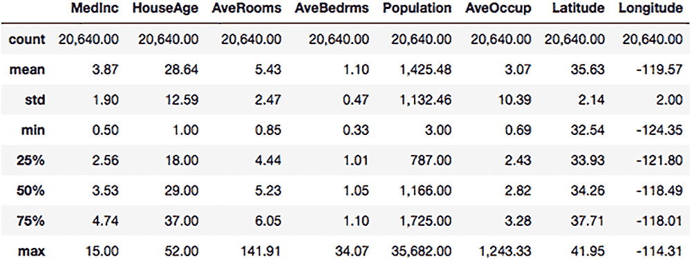

图 2.3 加利福尼亚住宅数据特征统计

在现实世界的应用中，数据中的缺失值是一个关键挑战。这个问题可能在数据收集或传输过程中引入，也可能由损坏、未能正确加载数据等原因引起。如果处理不当，缺失值可能会影响机器学习解决方案的性能，甚至导致程序崩溃。用替代值替换数据中的缺失和无效值的过程称为*插补*。

下面的列表检查我们的训练和测试数据集中是否存在缺失值。

列表 2.5 检查训练和测试集中的缺失值

```
train_data = X_train.copy()                             ❶

train_data['MedPrice'] = y_train                        ❷

print(f'-- check for missing values in training data -- {training_data.isnull().any()}')                   ❸

print(f'-- check for missing values in training data -- {Xtest.isnull().any()}')                           ❹
```

❶ 将训练数据复制以避免就地更改

❷ 通过添加一个名为'MedPrice'的目标列将特征和目标合并

❸ 检查训练集是否存在缺失值

❹ 检查测试集是否存在缺失值

下面的结果显示数据集中没有缺失值，因此我们可以继续我们的分析，无需进一步考虑这个问题（你将在第三章中看到一个处理缺失值的例子）：

```
-- check for missing values in training data --
MedInc        False
HouseAge      False
AveRooms      False
AveBedrms     False
Population    False
AveOccup      False
Latitude      False
Longitude     False
MedPrice      False
dtype: bool

-- check for missing values in test data --
MedInc        False
HouseAge      False
AveRooms      False
AveBedrms     False
Population    False
AveOccup      False
Latitude      False
Longitude     False
dtype: bool
```

为了简单起见，我们在这里不会进行任何额外的数据预处理。你通常会想采取一些其他常见步骤，例如检查*异常值*，这些是可能影响机器学习模型训练的远离中心的点，如果它们存在于你的数据中，则应将其移除。此外，现实世界的数据集通常不如本例中使用的格式好。附录 B 提供了处理不同数据类型的预处理技术示例；如果你不熟悉这个主题，我建议你在继续下一章之前先浏览那些示例。接下来，我们将继续进行特征工程步骤，这通常与数据预处理同时进行。

## 2.4 特征工程

与数据预处理不同，数据预处理侧重于将原始数据转换为有用的或高效的格式，特征工程旨在生成和选择一组良好的特征以提升机器学习算法的性能。它通常依赖于特定的领域知识，并迭代进行以下两个步骤：

+   *特征生成*旨在通过转换现有特征来生成新特征。这可以在单个特征上完成，例如，通过将分类特征替换为每个类别的频率计数来获得可测量的数值特征，或者可以在多个特征上完成。例如，通过计算不同职业的男性和女性员工的数量，我们可能得到一个更有助于分析不同行业招聘公平性的特征。

+   *特征选择*旨在选择现有特征中最有用的子集，以提高机器学习算法的效率和准确性。

特征选择和生成通常以迭代方式进行，利用某些度量（如生成的特征与目标之间的相关性）的即时反馈，或者基于在评估数据集上训练的机器学习模型的性能的延迟反馈。

在列表 2.6 中，我们通过使用*皮尔逊相关系数*来测量每个特征与目标之间的相关性，进行简单的特征选择。皮尔逊相关系数衡量两个变量（特征和目标）之间的线性相关性。其值范围从-1 到 1，其中-1 和 1 分别表示完美的负线性关系和完美的正线性关系。系数为 0 表示不存在关系。

列表 2.6 绘制皮尔逊相关系数矩阵

```
import matplotlib.pyplot as plt                       ❶
import seaborn as sns                                 ❷
%matplotlib inline                                    ❸

plt.figure(figsize=(30,10))                           ❹

correlation_matrix = train_data.corr().round(2)       ❺
sns.heatmap(data=correlation_matrix, square= True,
            annot=True, cmap='Blues')                 ❻
```

❶ 导入用于通用绘图配置的库

❷ 导入 seaborn 库以绘制热图

❸ 在 Jupyter 笔记本中美化图形显示

❹ 设置图形大小

❺ 计算皮尔逊相关系数矩阵

❻ 绘制所有特征与目标之间的相关性图

我们将关注矩阵的最后一行（见图 2.4），它显示了目标房价与每个特征之间的成对相关性。然后我们将讨论我们选择的两个特征。

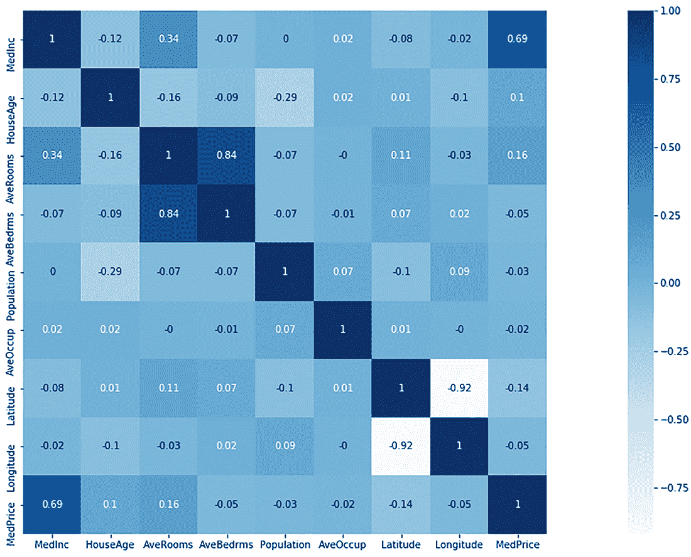

图 2.4 所有特征与目标之间的皮尔逊相关系数矩阵

基于系数矩阵和以下假设，我们选择前两个相关性最高的特征：

+   *MedInc*—这个特征表示一个街区内房屋的中等收入，它与目标值显示出高度的正线性相关性。这与直觉相符，即收入较高的人更有可能住在房价较高的街区（正相关）。

+   *AveRooms*—这个特征表示每个街区房屋的平均房间数。房间数较多的房屋更有可能价格更高（正相关）。

为了简化，这里我们只选择两个特征作为示例。特征选择在列表 2.7 中实现。也可以通过选择计算出的皮尔逊相关系数的阈值（例如 0.5）来自动化特征选择，而不是基于视觉检查。要选择多少个特征是一个需要我们仔细决定的超参数。我们可以尝试不同的特征组合来训练我们的机器学习模型，并通过试错法选择最佳的一个。

列表 2.7 特征选择

```
selected_feature_set = ['MedInc', 'AveRooms',]        ❶
sub_train_data = train_data[
    selected_feature_set + ['MedPrice']]              ❷

X_train = sub_train_data.drop(['MedPrice'], axis=1)   ❸
X_test = X_test[selected_feature_set]                 ❹
```

❶ 选定的特征集

❷ 提取新的训练特征

❸ 在 X_train 中删除目标并仅保留训练特征

❹ 为测试数据选择相同的特征集

在选择了两个特征之后，我们可以绘制散点图来显示它们之间的成对相关性以及与目标的相关性。它们的分布可以通过以下代码使用直方图来共同展示：

```
sns.pairplot(sub_train_data, height=3.5, plot_kws={'alpha': 0.4})
```

散点图显示“MedInc”特征与目标“MedPrice”之间存在强烈的正相关。由于特征和异常值之间的比例差异，“AveRooms”特征与“MedPrice”之间的相关性相对不那么明显（见图 2.5）。

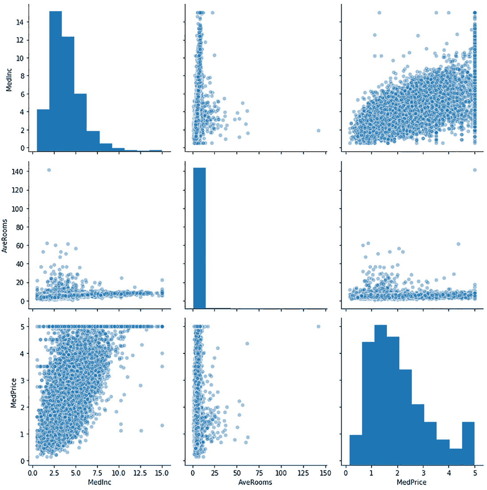

图 2.5 选定特征与目标之间的成对关系

使用皮尔逊相关系数来选择特征很容易，但在实践中可能并不总是有效。它忽略了特征与目标之间的非线性关系，以及特征之间的相关性。此外，对于值不是序数的分类特征，特征与目标之间的相关性可能没有意义。随着越来越多的特征工程技术的提出，决定如何选择最佳方法已经成为一个痛点。这引出了 AutoML 中的一个重要话题——自动特征选择和转换，但我们将在本书的第二部分讨论这个问题，现在我们继续解决当前的问题。

现在我们已经准备好了训练数据并选择了特征，我们就可以选择用于使用预处理数据训练机器学习模型的算法了。（在实践中，你还可以在数据预处理和特征工程步骤之前选择机器学习算法，以追求更定制化的数据准备过程。）

## 2.5 机器学习算法选择

记住，对于每个机器学习算法，我们都有四个核心组件需要选择：要训练的机器学习模型、衡量模型效力的指标、基于该指标更新模型参数的优化方法，以及终止更新过程的停止标准。因为我们的主要焦点不是优化，所以我们只会简要地讨论每个选定模型的优化方法和停止标准。

对于这个例子，我们将使用两个简单、经典的模型。第一个是*线性回归模型*，第二个是*决策树模型*。我们将首先回顾线性回归模型背后的核心思想以及创建、训练和评估它的过程。我们将使用整个训练集来训练模型，并在测试集上评估它，而不会进一步将训练数据分成训练集和验证集进行超参数调整。我们将在介绍决策树模型后讨论超参数调整步骤。

### 2.5.1 构建线性回归模型

线性回归是监督机器学习中最简单的模型之一，可能是你首先了解的机器学习模型。它试图通过计算数据点的特征加权和来预测目标值：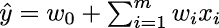，其中*m*是特征的数量。在当前示例中*m*为 2，因为我们只选择了两个特征：“MedInc”和“AveRooms”。*w[i]*是从数据中学习到的参数（或*权重*），其中*w*[0]被称为*截距*，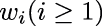被称为特征*x[i]*的*系数*。参数基于训练数据学习，以捕捉特征和目标之间的线性关系。使用 scikit-learn 构建线性回归模型的代码如下：

```
from sklearn.linear_model import LinearRegression

linear_regressor = LinearRegression()
```

为了学习权重，我们需要选择一个优化方法和一个指标来衡量它们的性能。*均方误差*（MSE）是回归问题中广泛使用的损失函数和评估指标——它衡量模型预测与目标之间的平均平方差异。在训练阶段，我们将使用 MSE 作为损失函数来学习模型，在测试阶段，我们将使用评估指标来衡量模型在测试集上的预测能力。为了帮助您理解其计算方式，提供了一个代码示例在列表 2.8 中。在训练阶段，true_target_values 是训练数据集中所有目标值（房屋的实际价格）的列表，predictions 是模型预测的所有房价。

列表 2.8 计算 MSE

```
def mean_squared_error(predictions, true_target_values):
    mse = 0                                                              ❶
    for prediction, target_value in zip(predictions, true_target_values):
        mse += (prediction - target_value) ** 2                          ❷
    mse /= len(predictions)                                              ❸
    return mse
```

❶ 将总和初始化为零

❷ 求平方误差之和

❸ 计算平方误差之和

图 2.6 是线性回归模型单变量（或特征）的简单示意图。学习过程旨在找到最佳斜率和截距，以最小化平方误差的平均值，这由数据点和回归线之间的虚线表示。

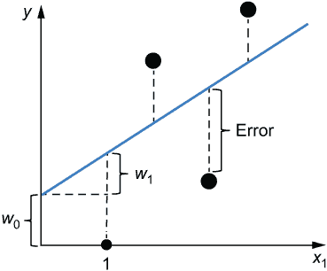

图 2.6 线性回归单特征示意图

在 scikit-learn 的帮助下，我们可以通过调用 fit 函数并输入训练数据来轻松优化权重。默认情况下，MSE（均方误差）用作损失函数，如下所示：

```
linear_regressor.fit(X_train, y_train)
```

我们可以使用以下代码打印出学习到的权重。

列表 2.9 显示学习到的参数

```
>>> coeffcients = pd.DataFrame(
>>> coefficients = pd.DataFrame(
...    linear_regression.conf_,
...    X_train.coluns,
...    columns=['Coefficient'])                                  ❶

>>> print(f'Intercept: {linear_regressor.intercept_:.2f}\n')     ❷
>>> print(coeffcients)                                           ❸

Learned intercept: 0.60

--The coefficient value learned by the linear regression model--
       Coefficient
MedInc           0.44
AveRooms        -0.04
```

❶ 将系数值转换为 DataFrame

❷ 打印截距值

❸ 打印系数

学习到的系数表明，“MedInc”特征和目标确实存在正线性相关性。而“AveRooms”特征具有负相关性，这与我们的预期相反。这可能是以下两个可能因素之一：

+   训练数据中的异常值（一些高价住宅区房间较少）正在影响训练过程。

+   我们选择的两个特征是正线性相关的。这是因为它们共享一些对预测目标有用的共同信息。由于“MedInc”已经覆盖了“AveRooms”提供的一些信息，因此“AveRooms”的影响减小，导致轻微的负相关性。

理想情况下，线性回归的良好特征集应彼此之间只有弱相关性，但与目标变量高度相关。在这个阶段，我们可以通过迭代进行特征选择和模型训练，尝试不同的特征组合，并选择一个良好的组合。我将把这个过程留给你作为练习尝试，我们将直接进入测试阶段。测试集上学习模型的均方误差（MSE）可以通过以下代码计算和打印。

列表 2.10 测试线性回归模型

```
>>> from sklearn.metrics import mean_squared_error       ❶
>>> y_pred_test = linear_regressor.predict(X_test)       ❷
>>> print(f'Test MSE: {mean_squared_error(y_test, y_pred_test):.2f}')

Test MSE: 0.70
```

❶ 导入评估指标

❷ 预测测试数据的目标值

测试 MSE 为 0.70，这意味着平均而言，模型预测与测试数据真实目标之间的平方差为 0.70。MSE 的值越低越好；理想情况下，你希望这个值尽可能接近 0。接下来，我们将尝试决策树模型，并比较两种模型的性能。

### 2.5.2 构建决策树模型

决策树的关键思想是根据一系列（通常是二元的）条件将数据分割成不同的组，如图 2.7 所示。决策树中的每个非叶节点都是一个条件，它将每个数据样本放置在子节点之一中。每个叶节点有一个特定的值作为预测。每个数据样本将从树的根（顶部）导航到叶节点之一，为我们提供该样本的预测。例如，假设我们有一所房子，其 MedInc=5，AveRooms=3。我们将从根节点开始，通过 No 路径和 Yes 路径，直到我们达到一个值为$260,000 的叶节点，这是这所房子的预测价格。

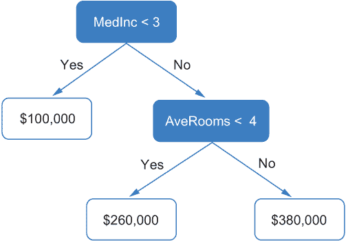

图 2.7 使用决策树模型预测值

树的分割和每个叶子节点中的预测都是基于训练数据学习的。构建决策树的典型过程如列表 2.11 所示。树是递归构建的。在每次递归中，我们找到当前节点数据集的最佳分割。在每个分割节点中，节点给出的预测值等于落入此节点的所有训练样本的平均值。最佳分割定义为最小化两个子节点中所有样本预测值与目标值之间均方误差的分割。当满足退出条件时，递归将停止。我们可以有多种方式来定义这个条件。例如，我们可以预先定义树的最大深度，当达到这个深度时，递归停止。我们也可以基于算法的停止标准。例如，我们可以将递归的退出条件定义为“如果落入当前节点的训练样本数量少于五个，则停止。”

列表 2.11 构建决策树模型

```
decision_tree_root = construct_subtree(training_data)

def construct_subtree(data):
    if exit_condition(data):
        return LeafNode(get_predicted_value(data))       ❶
    condition = get_split_condition(data)                ❷
    node = Node(condition)                               ❸
    left_data, right_data = condition.split_data(data)   ❹
    node.left = construct_subtree(left_data)             ❺
    node.right = construct_subtree(right_data)           ❻
    return node
```

❶ 如果满足退出条件，则计算预测值

❷ 从数据中获取最佳分割条件

❸ 创建一个新的节点，包含条件

❹ 根据条件将数据分成两部分

❺ 递归构建左子树

❻ 递归构建右子树

使用 scikit-learn 构建决策树很容易。训练和测试的代码如列表 2.12 所示。max_depth 参数是一个超参数，在训练过程中约束树模型的深度。它将在达到此最大深度或当前节点包含少于两个样本（默认停止标准）时停止增长。

列表 2.12 使用 scikit-learn 构建决策树模型

```
from sklearn.tree import DecisionTreeRegressor

tree_regressor = DecisionTreeRegressor(max_depth=3,
                                       random_state=42)   ❶
tree_regressor.fit(X_train, y_train)

y_pred_train = tree_regressor.predict(X_train)
y_pred_test = tree_regressor.predict(X_test)
```

❶ 创建决策树回归器

让我们打印出训练集和测试集的 MSE 结果，如下所示。它们之间的差异表明存在少量过拟合：

```
>>> print(f'Train MSE: {mean_squared_error(y_train, y_pred_train):.2f}')

>>> print(f'Test MSE: {mean_squared_error(y_test, y_pred_test):.2f}')

Train MSE: 0.68
Test MSE: 0.71
```

与线性回归模型相比，当前的决策树模型在测试集上的表现略差。但值得注意的是，我们不应仅基于这些测试结果选择模型。正确的模型选择和超参数调整方法是通过验证过程在单独的验证集上尝试不同的模型。我们在这里直接评估测试集的原因是为了让您熟悉训练和测试过程。我们还可以使用以下代码可视化学习到的树模型，以获得更直观的理解。

列表 2.13 可视化决策树

```
from sklearn.externals.six import StringIO
import sklearn.tree as tree
import pydotplus

from IPython.display import Image
dot_data = StringIO()
tree.export_graphviz(tree_regressor,
                     out_file=dot_data,
                     class_names=['MedPrice'],            ❶
                     feature_names=selected_feature_set,
                     filled=True,                         ❷
                     rounded=True)                        ❸
graph = pydotplus.graph_from_dot_data(dot_data.getvalue())
Image(graph.create_png())
```

❶ 目标名称

❷ 是否用颜色填充方框

❸ 是否圆化方框的角

学习到的树是一个深度为三的平衡二叉树，如图 2.8 所示。除了叶节点外，它们没有分裂条件，每个节点传达四个信息：分裂条件，它决定了样本应该根据哪个特征落入哪个子节点；落入当前节点的训练样本数量；它们的目标值的平均值；以及落入当前节点的所有样本的均方误差（MSE）。每个节点的 MSE 是基于真实目标和树给出的预测计算的，即目标的平均值。

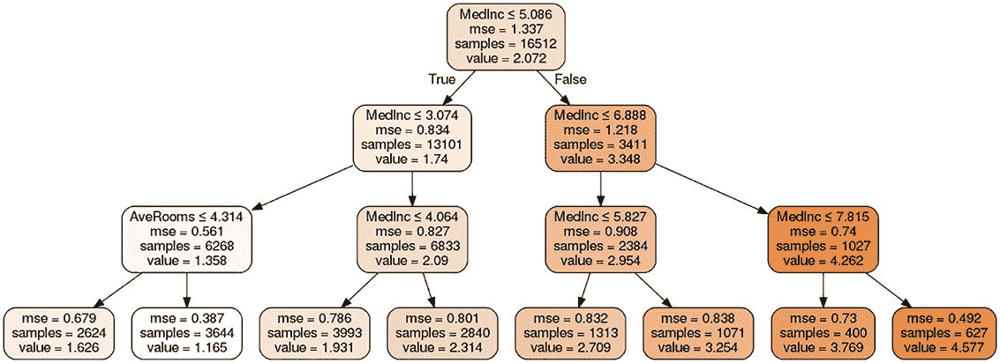

图 2.8 学习到的决策树可视化

我们现在已经创建了两个机器学习模型，并且知道在测试数据集上，决策树模型的表现略逊于回归模型。现在的问题是，在不接触测试集的情况下，我们是否能够改进决策树模型，使其在最终测试中比我们的线性回归模型表现更好。这引入了机器学习流程中的一个重要步骤：超参数调整和模型选择。

## 2.6 精调机器学习模型：网格搜索简介

在开始之前就知道机器学习算法的最佳超参数，例如决策树模型的 max_depth，通常是不可能的。因此，超参数调整是一个非常关键的步骤——它允许你选择最佳组件来构建你的机器学习算法，并提高你创建的算法的性能。调整通常是一个试错的过程。你预先定义一组候选的超参数组合，并通过将它们应用于训练数据，使用验证过程并评估结果来选择最佳组合。为了帮助你更好地理解调整过程，让我们尝试通过调整其 max_depth 超参数来改进决策树模型。

我们首先应该做的是构建一个验证集，这样我们就可以根据不同模型的验证性能进行比较。始终记住，在超参数调整过程中，你不应该接触测试集。模型只应在调整完成后一次接触这些数据。有许多方法可以将训练数据分割并进行模型验证。在这里我们将使用*交叉验证*；这是一种广泛用于模型验证的技术，尤其是在数据集大小较小时。交叉验证平均了多轮模型训练和评估的结果。在每一轮中，数据集被随机分割成两个互补的子集（训练集和验证集）。在不同的轮次中，每个数据点都有平等的机会被分配到训练集或验证集中。交叉验证的主要方法分为以下两组：

+   使用*穷尽性*交叉验证方法，你将在所有可能的方式上训练和评估模型，以组成你将数据分成的两个集合。例如，假设你决定使用数据集的 80%进行训练，20%进行验证。在这种情况下，你需要穷尽这两组数据点中所有可能的组合，并平均所有这些分区上模型的训练和测试结果。穷尽性交叉验证的一个代表性例子是*留一法交叉验证*，其中每个例子都是一个单独的测试集，而所有其余的则形成相应的训练集。给定*N*个样本，你将会有*N*个分区，用于*N*次训练和评估你的候选模型。

+   使用*非穷尽性*交叉验证方法，正如其名所示，你不必穷尽每个分区所有可能的情况。两个代表性的例子是*留出法*和*k 折交叉验证*。留出法简单地将原始训练数据随机分为两组。一组是新训练集，另一组是验证集。人们通常将这种方法视为简单的验证而不是交叉验证，因为它通常只涉及一次运行，并且个体数据点既不用于训练也不用于验证。*k 折交叉验证*将原始训练数据分为*k*个等分的子集。每个子集依次用作验证集，其余的则是当时相应的训练集（见图 2.9）。给定*N*个样本，*N*折交叉验证等同于留一法交叉验证。

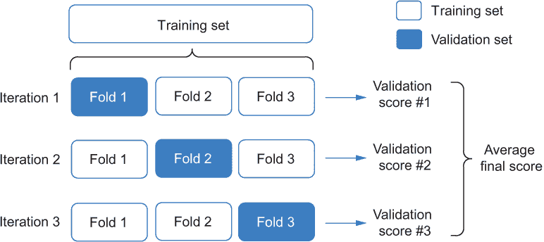

图 2.9 三折交叉验证

让我们尝试使用五折交叉验证来调整 max_depth 超参数。在列表 2.14 中，我们使用 scikit-learn 库中的 KFold 交叉验证器生成交叉验证集，并遍历 max_depth 超参数的所有候选值来生成树模型并进行交叉验证。这种搜索策略被称为*网格搜索*，它是寻找最佳超参数的最简单的 AutoML 方法之一。主要思想是遍历候选超参数集中值的所有组合，并根据评估结果选择最佳组合。因为我们只有一个候选超参数需要调整，所以它变成了对所有可能值进行简单循环的过程。

列表 2.14 生成交叉验证集，调整 max_depth

```
import numpy as np
from sklearn.model_selection import KFold

kf = KFold(n_splits = 5)                          ❶

cv_sets = []
for train_index, test_index in kf.split(X_train):
    cv_sets.append((X_train.iloc[train_index],
                    y_train.iloc[train_index],
                    X_train.iloc[test_index],
                    y_train.iloc[test_index]))

max_depths = list(range(1, 11))                   ❷

for max_depth in max_depths:
    cv_results = []
    regressor = DecisionTreeRegressor(max_depth=max_depth, random_state=42)

    for x_tr, y_tr, x_te, y_te in cv_sets:        ❸
        regressor.fit(x_tr, y_tr)
        cv_results.append(mean_squared_error(regressor.predict(x_te) , y_te))
    print(f'Tree depth: {max_depth}, Avg. MSE: {np.mean(cv_results)}')
```

❶ 创建一个五折交叉验证对象用于数据分区

❷ 为 max_depth 超参数构建候选值列表

❸ 遍历所有交叉验证集并平均验证结果

从以下评估结果中，我们可以观察到 max_depth=6 给出了最低的均方误差（MSE），如下所示：

```
Tree depth: 1, Avg. MSE: 0.9167053334390705
Tree depth: 2, Avg. MSE: 0.7383634845663015
Tree depth: 3, Avg. MSE: 0.68854467373395
Tree depth: 4, Avg. MSE: 0.6388802215441052
Tree depth: 5, Avg. MSE: 0.6229559075742178
Tree depth: 6, Avg. MSE: 0.6181574550660847
Tree depth: 7, Avg. MSE: 0.6315191091236836
Tree depth: 8, Avg. MSE: 0.6531981343523263
Tree depth: 9, Avg. MSE: 0.6782896327438639
Tree depth: 10, Avg. MSE: 0.7025407934796457
```

我们可以使用相同的技巧来选择其他超参数的值，甚至模型类型。例如，我们可以使用相同的验证集对线性回归和决策树模型进行交叉验证，并选择交叉验证结果更好的一个。

有时候你可能需要调整更多的超参数，这使得使用简单的 for 循环来完成这项任务变得困难。scikit-learn 提供了一个内置的类，称为 GridSearchCV，这使得这项任务更加方便。你提供它超参数的搜索空间作为一个字典，你想要调整的模型，以及一个评分函数来衡量模型的性能。例如，在这个问题中，搜索空间是一个只有一个键的字典，即 max_depth，其值是一个包含其候选值的列表。评分函数可以通过 make_scorer 函数从性能指标转换而来。例如，我们可以将 MSE 转换为如列表 2.15 所示的评分函数。需要注意的是，scikit-learn 中的 GridSearchCV 默认假设更高的分数更好。因为我们想要找到具有最小 MSE 的模型，所以在定义网格搜索的评分函数时，我们应该在 make_scorer 函数中将 greater_is_better 设置为 False。

列表 2.15 对 max_depth 超参数的网格搜索

```
from sklearn.model_selection import GridSearchCV
from sklearn.metrics import make_scorer

regressor = DecisionTreeRegressor(random_state=42)    ❶

hps = {'max_depth':list(range(1, 11))}                ❷

scoring_fnc = make_scorer(mean_squared_error,
                          greater_is_better=False)    ❸

grid_search = GridSearchCV(estimator=regressor, param_grid=hps,
                           scoring=scoring_fnc,
                           cv=5)                      ❹

grid_search = grid_search.fit(X_train, y_train)       ❺
```

❶ 构建决策树回归器

❷ 创建一个字典作为超参数 max_depth 的搜索空间

❸ 定义评分函数

❹ 创建具有五折交叉验证的网格搜索交叉验证对象

❺ 将网格搜索对象拟合到训练数据以找到最佳模型

我们可以使用以下代码检索交叉验证结果，并绘制 MSE 与 max_depth 的关系。

列表 2.16 绘制网格搜索交叉验证结果

```
cvres = grid_search.cv_results_                             ❶
for mean_score, params in zip(cvres['mean_test_score'], cvres['params']):
    print(-mean_score, params)

plt.plot(hps['max_depth'], -cvres['mean_test_score'])       ❷
plt.title('MSE change with hyperparameter tree max depth')  ❷
plt.xlabel('max_depth')                                     ❷
plt.ylabel('MSE')                                           ❷
plt.show()
```

❶ 获取交叉验证结果

❷ 通过增加 max_depth 绘制 MSE 曲线

在图 2.10 中，我们可以看到 MSE 随着 max_depth 的增加先下降后上升。这是因为随着树深度的增加，模型获得了更多的灵活性，更好地能够细化分区。这将有助于模型更好地拟合训练数据，但最终它将开始过拟合。在我们的例子中，这发生在 max_depth>6 时。模型在 max_depth=6 时达到最佳性能。

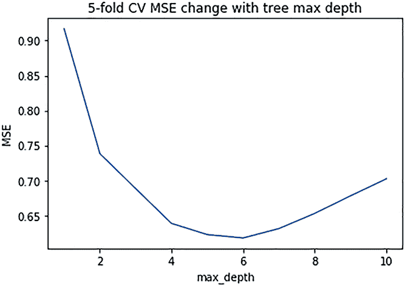

图 2.10 随 max_depth 增加的五折交叉验证结果的变异

你可能会想知道交叉验证是否能够准确地反映模型在未见示例上的泛化能力。我们可以通过绘制具有不同 max_depth 值的 10 个模型的交叉验证 MSE 曲线和测试 MSE 曲线来验证这一点，如下所示：

```
>>> test_results = []
>>> for max_depth in hps['max_depth']:
...    tmp_results = []
...    regressor = DecisionTreeRegressor(max_depth=max_depth,
...                                      random_state=42)
...    regressor.fit(X_train, y_train)
...    test_results.append(mean_squared_error(
...                        regressor.predict(X_test) , y_test))
...    print(f'Tree depth: {max_depth}, Test MSE: {test_results[-1]}')

>>> plt.plot(hps['max_depth'], -cvres['mean_test_score'])
>>> plt.plot(hps['max_depth'], test_results)
>>> plt.title('Comparison of the changing curve of the CV results 
➥and real test results')
>>> plt.legend(['CV', 'Test'])
>>> plt.xlabel('max_depth')
>>> plt.ylabel('MSE')
>>> plt.show()

Tree depth: 1, Test MSE: 0.9441349708215667
Tree depth: 2, Test MSE: 0.7542635096031615
Tree depth: 3, Test MSE: 0.7063353387614023
Tree depth: 4, Test MSE: 0.6624543803195595
Tree depth: 5, Test MSE: 0.6455716785858321
Tree depth: 6, Test MSE: 0.6422136569733781
Tree depth: 7, Test MSE: 0.6423777285754818
Tree depth: 8, Test MSE: 0.6528185531960586
Tree depth: 9, Test MSE: 0.6751884166016034
Tree depth: 10, Test MSE: 0.7124031319320459
```

根据测试均方误差（MSE）值和图 2.11，我们可以观察到验证结果完美地选择了对应最佳测试结果的 max_depth，并且两条曲线大致对齐。请注意，这样做只是为了说明交叉验证的有效性——在实际应用中，你绝不应该使用测试曲线来选择模型！

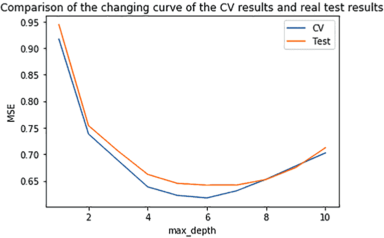

图 2.11 随着 max_depth 增加的交叉验证结果曲线和测试结果曲线的比较

到目前为止，我们一直使用加利福尼亚房价预测问题来展示在部署机器学习解决方案之前机器学习管道中的通用步骤。我们使用的数据是以表格格式结构化的，行代表实例，列表示它们的特征。这类数据通常被称为*表格数据*或*结构化数据*。除了表格数据外，你可能在不同的机器学习应用中遇到许多其他类型的数据，这些数据需要通过在机器学习管道中选择定制组件来处理。附录 B 提供了三个更多示例，展示了如何处理图像、文本和表格数据以进行分类任务。所有这些都使用了经典的数据准备方法和机器学习模型。如果你不熟悉这些问题，我建议你在继续下一章之前先看看它们。这些示例还展示了如何使用 scikit-learn 中的网格搜索方法在机器学习管道中联合调整多个超参数。本书的第二部分将讨论更高级的超参数调整选项。

## 摘要

+   在机器学习项目中，首要任务是将问题表述为机器学习问题，并组装用于的数据库集。

+   探索和准备数据集非常重要。从数据中提取有用的模式可以提高最终机器学习解决方案的性能。

+   在选择机器学习模型的过程中，应该尝试不同的模型并评估它们的相对性能。

+   使用适合你模型的正确超参数对于机器学习解决方案的最终性能至关重要。网格搜索是一种简单的自动化机器学习（AutoML）方法，可用于超参数调整和模型选择。
