# 3 深度学习概述

本章涵盖

+   深度学习模型构建和训练的基本原理

+   使用多层感知器对表格数据进行回归

+   使用多层感知器和卷积神经网络对图像数据进行分类

+   使用循环神经网络对文本数据进行分类

深度学习，作为机器学习的一个子领域，已经成为人工智能社区乃至更广泛的领域的热门话题。它推动了众多领域中的应用，并且与许多早期介绍的传统模型相比，取得了优越的性能。本章将介绍深度学习的基本构建块，并展示如何将三种流行的模型类型应用于解决不同数据类型上的监督学习任务。本章还将作为垫脚石，帮助您更好地理解书中第二部分介绍的用于生成和调整深度学习方法的 AutoML 方法。

## 3.1 什么是深度学习？

“深度学习”中的“深度”指的是依次添加的*层*，如图 3.1 所示。堆叠在一起的层数称为深度学习模型的*深度*。例如，图 3.1 中模型的深度是四层。您可以将层视为一系列操作，用于转换特征，例如用矩阵乘以特征。层共同训练以执行为我们进行的转换，而不是我们逐个执行。我们将每个层的输出称为原始输入的*表示*（或*嵌入*）。例如，图 3.1 左侧的猫图像是模型的输入。图像的像素值可以被视为图像的原始表示。模型的第 1 层将图像作为输入并输出五个不同的图像，这些是原始图像的转换表示。最后，第 4 层的输出是一个向量，表示预测的图像标签是“猫”。

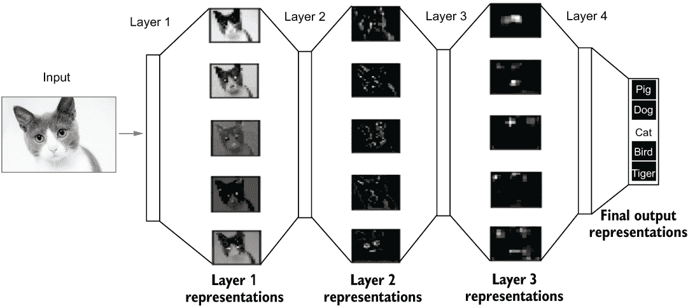

图 3.1 用于动物分类的深度学习模型

深度学习模型通常统称为*神经网络*，因为它们主要基于*人工神经网络*（ANNs），这是一种从大脑的生物结构中得到启发而松散构建的模型。

在实践中应用深度学习遵循第二章中介绍的相同的机器学习流程。但以下两个特性将深度学习模型与之前介绍的模型区分开来：

+   模型结构减少了特征工程的工作量，例如在图像中进行主成分分析（PCA）以降低维度。通过层学习到的特征变换可以产生类似的效果，您将看到。

+   深度模型比“较浅”的模型（如前几章中介绍的传统的模型，例如决策树和线性回归模型）或最多两层神经网络的模型引入了更多的学习参数和需要调整的超参数。

深度学习模型在广泛的问题上表现出高性能，尤其是在大量数据的问题上。本章将通过带有代码示例的三个典型深度学习应用来指导你理解这些区别以及如何在实践中应用深度学习。在我们进入示例之前，让我们快速了解一下你将使用的实现深度学习的工具。

## 3.2 TensorFlow 和 Keras

TensorFlow 是一个开源的机器学习平台。它拥有一个全面、灵活的工具和库生态系统，研究人员和开发者可以使用它来构建和部署机器学习驱动的应用程序。TensorFlow 实现了一套全面的数学运算，可以在不同的硬件上运行，包括 CPU、GPU 和 *张量处理单元*（TPU）用于深度模型训练。训练可以扩展到多台机器上的多个 GPU，并且训练好的模型可以在各种环境中部署，如网页和嵌入式系统。

注意，TPU 是专门为 *张量* 计算设计的专用硬件。GPU 和 TPU 在深度学习中被广泛使用，以促进模型训练和推理速度。

*张量* 是深度学习中应用最广泛的数据类型，是一个 *n* 维数组。张量是向量和矩阵的推广，可以具有超过两个维度：向量是一维张量，矩阵是二维张量。在实践中，一个 RGB 图像可以被视为一个三维张量（颜色通道 × 高度 × 宽度），而视频可以被视为一个四维张量，额外的维度是时间（或帧）维度。

*Keras* 是一个 Python 库，它通过封装 TensorFlow 的功能，提供了一套更简单的 API 来构建和训练机器学习模型。它极大地减少了构建深度学习算法所需的工作量，并且得到了社区的广泛认可。Keras 最初作为一个独立的 Python 包出现，但后来已被集成到 TensorFlow 包中，作为一个高级 API，便于深度学习模型的定制、扩展和部署。从现在开始，我们将主要使用 TensorFlow 中的 Keras API 来实现所有的深度学习工作流程。

## 3.3 使用多层感知器进行加利福尼亚房价预测

我们将要解决的第一个问题是我们在第二章中研究过的问题：加利福尼亚房价预测问题。这是一个回归问题，目标是根据八个特征（例如，该区域房屋的平均房间数）预测一个住宅区的平均房价。我们将遵循创建机器学习管道的典型流程来进行分析，但我会跳过重复的部分，并在深度学习的背景下强调不同的部分。

### 3.3.1 组装和准备数据

我们遵循之前使用 scikit-learn 库收集数据并为其深度学习模型准备数据的过程。第一步是加载加利福尼亚住房数据集，并将 20% 的数据分割出来用于测试，如下面的列表所示。

列表 3.1 加载和分割加利福尼亚住房数据集

```
from sklearn.datasets import fetch_california_housing

house_dataset = fetch_california_housing()    ❶

from sklearn.model_selection import train_test_split
train_data, test_data, train_targets, test_targets = train_test_split(
    data, target,
    test_size=0.2,
    random_state=42)                          ❷
```

❶ 加载数据集

❷ 将 20% 的数据分割出来用于测试

正如我们之前看到的，训练集和测试集中的特征矩阵的形状分别是 (16512, 8) 和 (4128, 8)，如下所示：

```
>>> train_data.shape, test_data.shape
((16512, 8), (4128, 8))
```

因为所有数据集的特征都是数值特征，没有缺失值，正如我们在第 2.3 节所学，数据已经适合输入到神经网络中。然而，不同的特征有不同的尺度。这在实践中可能是一个问题，会导致训练过程变得非常缓慢。在最坏的情况下，训练可能不会*收敛*，这意味着优化损失或网络的权重没有稳定在最优值周围的误差范围内。通常，当权重收敛时，神经网络的训练会停止。否则，我们考虑训练失败，产生的模型通常无法很好地工作。为了处理不同的特征尺度，*特征归一化*是一个好主意。我们通过从特征均值中减去并除以它们的标准差来实现这一点，如下面的列表所示。

列表 3.2 在训练和测试数据上执行特征归一化

```
def norm(x, mean, std):                            ❶
    return (x - mean) / std

mean = train_data.mean(axis=0)                     ❷
std = train_data.std(axis=0)                       ❷

normed_train_data = norm(train_data, mean, std)    ❸
normed_test_data = norm(test_data, mean, std)      ❸
```

❶ 定义一个函数来进行特征归一化

❷ 计算每个特征的均值和标准差

❸ 归一化训练和测试数据

注意，我们使用为训练数据计算的均值和标准差来归一化测试数据，以下两个原因：

+   我们假设训练和测试数据遵循相同的分布。

+   测试数据可能没有足够多的实例来计算可靠的均值和标准差值。

在这个例子中，这种归一化将是唯一进行的特征工程。它也可以用浅层模型来完成，但我们没有在第二章中这样做，因为线性回归和决策树模型的优化算法不会从它那里获得太多好处。要了解更多信息，请参阅 Joel Grus 的 *Data Science from Scratch*，第 2 版（O'Reilly，2019）。

我们现在准备好创建深度学习算法。

### 3.3.2 构建多层感知器

为了实现深度学习算法，让我们首先在 TensorFlow 中导入 Keras，如下所示：

```
from tensorflow import keras
```

作为快速回顾，构建机器学习算法需要你指定四个组件：模型类型、用于衡量当前模型质量的度量、用于更新模型权重的优化方法以及用于终止更新过程的停止标准。我们将从第一个组件开始，并实例化一个三层神经网络。我们使用以下代码构建网络，网络结构如图 3.2 所示。

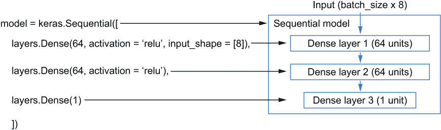

图 3.2 三层网络

列表 3.3 创建一个三层神经网络

```
from tensorflow import keras
from tensorflow.keras import layers

model = keras.Sequential([
    layers.Dense(64, activation='relu', input_shape=[8]),
    layers.Dense(64, activation='relu'),
    layers.Dense(1)
])                     ❶
```

❶ 使用 Keras API 创建一个多层感知器模型

这三层都是同一类型，被称为 *全连接* 或 *密集层*。前两层，离输入更近，也被称为 *隐藏层*。最后一层，用于生成预测的房价，被称为 *输出层*。密集层的输入和输出都是张量 (*n* 维数组)。keras.Sequential 表示我们选择的模型是一个由多个层顺序堆叠构建的 Keras 模型。由多个密集层组成的顺序模型被称为 *多层感知器* (MLP)。

为了更好地理解代码，让我们深入探究一下密集层是如何工作的。密集层可以表示为 *输出* = *激活函数*(*点积*(*输入*, *权重矩阵*) + *偏置*)。它由以下三个操作组成：

+   *张量-矩阵点积*—这是矩阵-矩阵乘法的推广。张量-矩阵点积会将输入张量与一个矩阵（通常称为 *核矩阵*）相乘，将其转换为一个新张量，其最后一个维度与原始张量不同。在定义层时，我们应该明确定义这个最后一个维度的形状，或者这个层的 *单元数*。例如，在这个问题中，每个输入的住房块实例是一个包含八个元素的 一维向量。第一个密集层有 64 个单元。它将创建一个 8×64 的权重矩阵（可以学习），将每个输入向量转换为一个长度为 64 的新向量（张量）。如果每个输入样本是一个大小为 3×10×10 的三维张量，通过使用相同的代码定义密集层，我们将创建一个 20×64 的权重矩阵，将输入张量转换为一个 3×10×64 的张量。具体的计算是以矩阵-矩阵乘法的方式进行，这意味着输入将被分成多个矩阵，并与权重矩阵相乘。我们使用一个玩具示例在图 3.3 中说明计算过程。

+   *偏置加法操作*—在执行点积之后，我们向每个实例添加一个偏置权重。偏置权重是一个与点积后实例表示形状相同的张量。例如，在这个问题中，第一个密集层将创建一个形状为 64 的可学习偏置向量。

+   *激活操作*——选定的激活函数定义了一个激活操作。因为神经网络的原始概念是受神经生物学启发的，所以每一层输出的表示（张量）中的每个元素被称为一个*神经元*。引入激活函数是为了近似细胞外场对神经元的影响。从神经网络的视角来看，我们通常选择激活函数作为应用于每个神经元的非线性映射函数，以在每个层定义的转换中引入非线性。如果我们使用线性激活，堆叠多个线性层将导致一个仅包含线性变换的约束表示空间。因此，产生的神经网络将不会是一个通用逼近变换。一些常用的激活函数包括 ReLU（修正线性单元）、sigmoid 和 tanh（双曲正切）。它们的形状如图 3.4 所示。

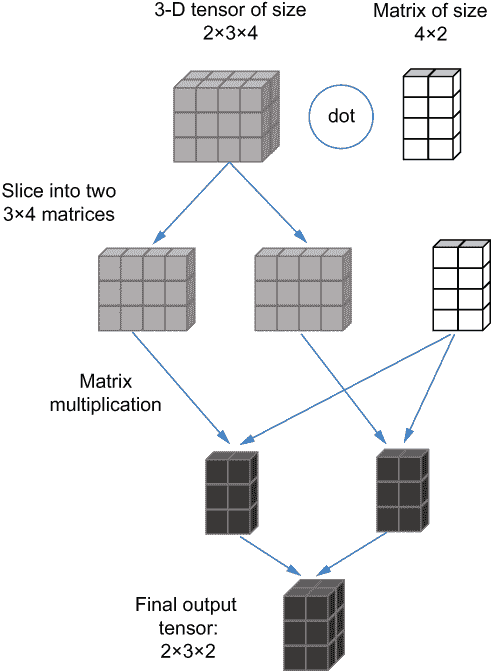

图 3.3 张量点积：一个三维张量乘以一个二维矩阵

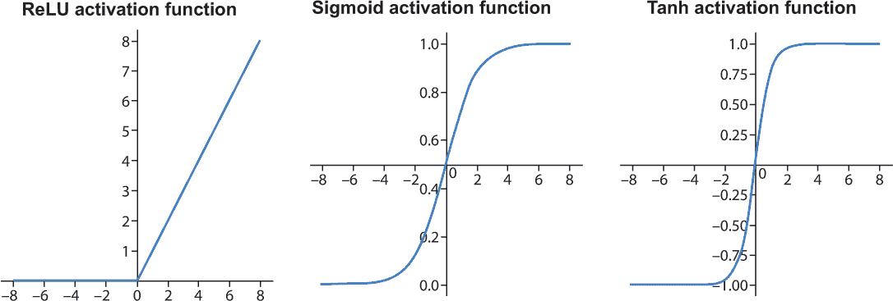

图 3.4 三种常见的激活函数：从左到右，ReLU、sigmoid 和 tanh

当实例化一个密集层时，你需要指定其输出形状（单元数）。如果是第一层，你还需要提供输入形状。对于其余的层，这不需要，因为它们的输入形状可以从前一层输出中自动确定。

当将 MLP 模型应用于数据集时，我们可以一次输入一个数据点，或者一次提供一批实例。在任何时候输入到网络中的数据点数量称为*批次大小*。在将数据输入到网络之前，不需要指定模型。通过神经网络传递输入以实现输出的流程称为*前向传递*。现在让我们尝试创建的模型，从训练数据中切片一个包含五个数据点的示例批次，并执行如下一代码列表所示的前向传递。

列表 3.4 使用示例数据批次尝试模型

```
>>> example_batch = normed_train_data[:5]           ❶
>>> example_result = model.predict(example_batch)   ❷
>>> example_result
array([[-0.06166808],
       [-0.12472008],
       [-0.01898661],
       [-0.1598819 ],
       [ 0.17510001]], dtype=float32)
```

❶ 切片前五个归一化数据点

❷ 将数据批次输入模型进行预测

由于我们没有训练网络中的权重，预测是基于每层的随机初始化权重计算的。Keras API 提供了一种方便的方法，可以使用 summary 函数可视化定义的模型中每层的输出形状和权重，如下所示：

```
>>> model.summary()
Model: "sequential"
_________________________________________________________________
Layer (type)                Output Shape              Param #
=================================================================
dense (Dense)               (None, 64)                576
_________________________________________________________________
dense_1 (Dense)             (None, 64)                4160
_________________________________________________________________
dense_2 (Dense)             (None, 1)                 65
=================================================================
Total params: 4,801
Trainable params: 4,801
Nontrainable params: 0
_________________________________________________________________
```

模型可以接受任何大小的数据批次。每个层的输出形状的第一个维度是 None，因为我们没有预先定义每个批次中的数据点数量。模型将在数据被输入后识别每个批次中的数据点数量。参数包括张量-矩阵点积中的权重矩阵和偏置向量。例如，第一层有 8 * 64 + 64 = 576 个参数。再次强调，这些参数在训练之前都是随机初始化的，因此它们不能将特征转换为正确的预测。但是，检查权重和输出形状的练习可以帮助我们调试模型结构。现在让我们开始训练网络并测试其性能。

### 3.3.3 训练和测试神经网络

训练网络需要一套完整的深度学习算法，并选择以下三个剩余组件：

+   *优化器*—用于更新神经网络权重的优化方法。

+   *损失函数*—一个用于衡量神经网络性能并在训练过程中指导优化器的函数。它通常衡量真实值和预测值之间的差异。例如，均方误差（在第 2.5 节中介绍）是回归任务的可接受损失函数。在训练过程中，优化器将尝试更新权重以实现最小损失。

+   *指标*—在训练和测试过程中要监控的统计数据，例如分类任务的准确率。这些数据不会影响训练过程，但将被计算并记录在训练集和验证集上。这些值用作辅助信息，以分析和调整设计的算法。

深度学习中常用的优化器是什么，它是如何工作的？

训练神经网络最广泛使用的优化方法被称为*随机梯度下降*（SGD）。以下图示说明了原始的 SGD 优化器是如何工作的。在这个图中，*y*轴是神经网络的损失值，*x*轴表示要更新的网络权重。为了说明目的，我们这里只考虑一个权重。应用 SGD 的目标是更新这个权重，以找到曲线中的*全局最优*点，其*y*值对应于损失函数的最小值。这个目标可能并不总是能达到，这取决于超参数和网络复杂性。我们可能最终识别出一个次优点，如图中的*局部最优*点。


随机梯度下降在 1-D 损失曲线（一个可学习参数）下的示意图

在每次迭代中，SGD 使用训练数据的一个子集通过求损失函数的导数来计算参数的梯度。然后通过将梯度加到权重上来更新权重。通常，梯度不是直接加到权重上，而是乘以一个称为*学习率*的值，这是一个控制更新速率的超参数。此过程的伪代码如下所示。

列表 3.5 随机梯度下降的伪代码

```
for i in range(num_iterations):
    gradients = calculate_gradients(loss, data_subset)
    weights = weights - gradients * learning_rate
```

图中的每个箭头表示在迭代中权重的变化方向。其长度是梯度*学习率的值。如果权重从*t*[0]开始，它最终会到达*t*[2]，这是一个局部最优。然而，从*t'*[0]初始化的权重在右侧达到了全局最优。正如这个例子所示，初始化值和选择的学习率可以导致不同的优化结果。像 RMSprop 和 Adam 这样的原始 SGD 优化器的变体试图提高优化效果和效率，这就是为什么你会在我们的代码实现中看到它们被引入。

在这个例子中，我们只有一个权重需要更新。但是，由于神经网络通常具有多层，每层有多个权重，计算梯度可能会变得非常复杂。计算所有权重梯度的最常见方法称为*反向传播*。它将层视为一系列组合函数（张量运算）的链，并应用链式法则来计算每层中权重的梯度。后续层的梯度可以用来计算前一层梯度，从而使它们最终从神经网络的最后一层反向传递到第一层。

使用以下一行代码可以设置深度学习算法的损失函数、优化器和指标：

```
model.compile(loss='mse', optimizer='rmsprop', metrics=['mae', 'mse'])
```

编译方法配置模型以进行训练。我们使用均方误差（MSE）作为损失函数来衡量神经网络在训练过程中的性能，正如我们在第二章中为线性回归模型所做的那样。选择的优化器是 RMSprop，它是 SGD 的一种变体。我们应用两个指标，平均绝对误差（MAE）和 MSE，来评估模型。我们还可以自定义优化器的配置，例如学习率，如下所示：

```
optimizer = tf.keras.optimizers.RMSprop(0.01)
model.compile(loss='mse', optimizer=optimizer, metrics=['mae', 'mse'])
```

在为训练准备网络后，我们可以使用 fit 方法如下向其提供数据：

```
model.fit(normed_train_data,
          train_targets,
          epochs=300,
          batch_size=1024,
          verbose=1)
```

训练过程将根据预定义的停止标准终止，例如训练的*epochs*数量。因为输入被分成批次（这里每个批次 1,024 个），在这种情况下，一个 epoch 意味着将所有批次输入神经网络并更新其权重一次。例如，如果我们有 100 个训练示例，批大小为 1，那么一个 epoch 等于模型更新的 100 次迭代。

回顾第一章中介绍的机器学习的一般学习过程，训练神经网络的对应工作流程如图 3.5 所示。给定一批输入数据，损失函数将通过将当前网络的预测与目标进行比较来衡量当前网络的预测准确性。优化器将根据损失函数的反馈来更新网络中每一层的权重。

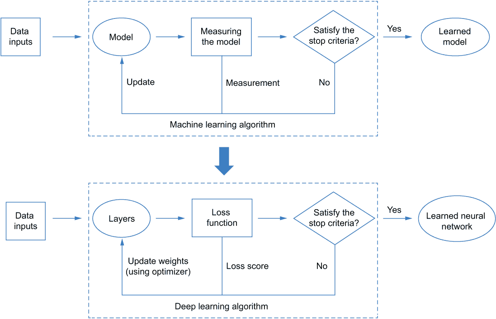

图 3.5 训练神经网络的流程（从通用机器学习训练流程转换而来）

为了测试训练好的网络，我们可以调用 evaluate 函数。我们的模型经过 300 轮训练后，在测试集上达到 MSE 0.34，如下代码片段所示：

```
>>> loss, mae, mse = model.evaluate(normed_test_data, test_targets, verbose=0)
>>> mse
0.34268078
```

我们已经成功训练并测试了我们的第一个深度学习模型。下一步是调整超参数，看看我们是否可以提高其性能。

### 3.3.4 调整训练轮数

调整深度学习算法对于提高其性能至关重要，但这个过程通常既耗时又昂贵，因为深度神经网络包含许多超参数（层数、层类型、单元数等）。学习过程通常被视为一个黑盒，现有文献中很少发现理论保证。在这里，我们以使用留出验证集调整训练轮数（epochs）的简单例子为例。更复杂的超参数调整，如层数和层中单元数，将在后续章节中介绍，使用高级的 AutoML 工具。

如列表 3.6 所示，我们将 20% 的数据分割出来作为验证集，并使用留出交叉验证来确定训练轮数（epochs）。我们训练神经网络以高轮数进行，将训练历史保存到 pandas DataFrame 中，并按轮数绘制训练和验证集的 MSE 曲线。

列表 3.6 使用留出交叉验证验证 MLP 模型

```
def build_model():                                          ❶
    model = keras.Sequential([
        layers.Dense(64, activation='relu',
                     input_shape=[normed_train_data.shape[1]]),
        layers.Dense(64, activation='relu'),
        layers.Dense(1)
    ])
    model.compile(loss='mse', optimizer='rmsprop', metrics=['mae', 'mse'])
    return model

model = build_model()                                       ❷

EPOCHS=500
history = model.fit(normed_train_data, train_targets,
                    validation_split=0.2,
                    epochs=EPOCHS, batch_size=1024,
                    verbose=1)                              ❸

import pandas as pd
hist = pd.DataFrame(history.history)                        ❹

hist['epoch'] = history.epoch                               ❺

import matplotlib.pyplot as plt                             ❻
plt.plot(hist['epoch'], hist['mse'], label='train mse')     ❻
plt.plot(hist['epoch'], hist['val_mse'], label='val mse')   ❻
plt.xlabel('Epochs')                                        ❻
plt.ylabel('MSE')                                           ❻
plt.title('Training and Validation MSE by Epoch')           ❻
plt.legend()                                                ❻
plt.show()                                                  ❻
```

❶ 创建一个函数来帮助反复构建新的编译模型

❷ 创建一个新的编译模型

❸ 在训练过程中留出 20% 的数据用于验证

❹ 将历史数据检索到 DataFrame 中——history.history 是一个字典，包含每个轮次在训练和验证集上的损失、平均绝对误差（MAE）和 MSE 结果。

❺ 为绘图目的向 DataFrame 添加一个轮数列

❻ 绘制训练和验证 MSE 曲线

训练和验证均方误差（MSE）曲线显示在图 3.6 中。

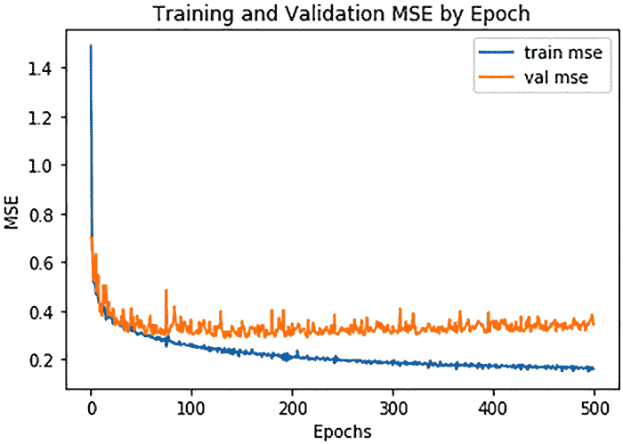

图 3.6 按轮数显示的训练和验证 MSE

由于尺度变化和轮次间的波动，这些曲线的解释并不容易，尤其是在轮数较多的情况下。使用列表 3.7 中的代码，我们可以将 *y*-轴限制在 0.5 以下，以便放大并使用高斯平滑来平滑训练和验证曲线（参见 Shapiro 和 Stockman 的 *Computer Vision*，Prentice Hall，2001，第 137、150 页）。

列表 3.7 平滑准确率曲线

```
import numpy as np
def smooth_curve(values, std=5):      ❶
    width = std * 4
    x = np.linspace(-width, width, 2 * width + 1)
    kernel = np.exp(-(x / 5) ** 2)

    values = np.array(values)
    weights = np.ones_like(values)

    smoothed_values = np.convolve(values, kernel, mode='same')
    smoothed_weights = np.convolve(weights, kernel, mode='same')
    return smoothed_values / smoothed_weights
plt.plot(hist['epoch'], smooth_curve(hist['mse']), label = 'train mse')
plt.plot(hist['epoch'], smooth_curve(hist['val_mse']), label = 'val mse')
plt.xlabel('Epochs')
plt.ylabel('MSE')
plt.ylim((0, 0.5))
plt.title('Training and Validation MSE by Epoch (smoothed)')
plt.legend()
plt.show()
```

❶ 使用高斯平滑函数对一系列值进行平滑处理

调整后的图示如图 3.7 所示。它显示在 500 个轮次期间，训练 MSE 持续下降。相比之下，验证 MSE 在约 150 个轮次后显示出增加的波动趋势。这意味着网络在约 150 个轮次后倾向于过拟合训练数据。

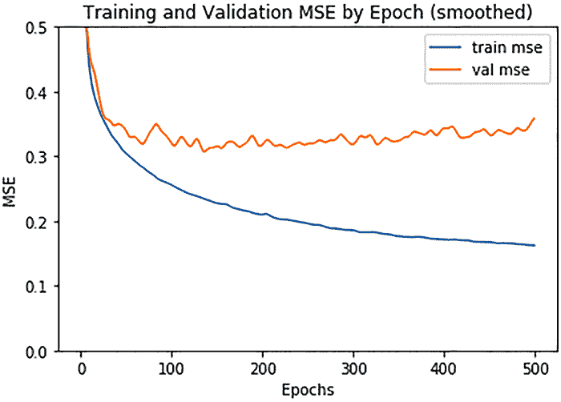

图 3.7 每个轮次的训练和验证 MSE（平滑），y 轴限制在 0.5 以下

在选择了最佳轮数后，我们现在可以在完整的数据集（训练集和验证集）上重新训练模型并进行测试，如下面的代码列表所示。

列表 3.8 在完整训练集上重新训练最终模型

```
model = build_model()
model.fit(normed_train_data, train_targets, epochs=150, batch_size=1024, verbose=1)
```

测试集的最终均方误差（MSE）为 0.31，这比我们用训练了 300 个轮次的模型所达到的结果要好，如下所示：

```
>>> loss, mae, mse = model.evaluate(normed_test_data, test_targets, verbose=0)
>>> mse
0.30648965
```

在这个例子中，我们只训练了模型一次以选择最佳的轮数。调整其他超参数可能需要一些尝试和错误。例如，你可以使用网格搜索方法来调整网络的深度——即构建多个具有不同层数的 MLP，并在相同的训练和验证集分割上尝试它们，以选择最佳的网络深度。我们将在本书的第二部分介绍更方便的实现方法。

我们现在已经构建了我们第一个深度神经网络，一个 MLP，来解决表格数据回归问题。在接下来的两个部分中，你将了解另外两种深度学习模型，你可以使用它们分别解决图像数据和文本数据的分类问题。

## 3.4 使用卷积神经网络对手写数字进行分类

在本节中，我们将探讨一种新的模型，即*卷积神经网络*（CNN），它是计算机视觉应用中占主导地位的深度学习模型。我们将通过手写数字分类来解释其工作原理，并构建一个 MLP 网络进行比较。

### 3.4.1 组装和准备数据集

让我们先收集数据集并做一些准备工作。在第一章中，我们使用了 scikit-learn 附带的数据集，其中包含 1797 张 8×8 像素的手写数字图像。在这个例子中，我们将使用一个类似但更大的数据集，称为*MNIST*，它通常用作深度学习的入门套件。它包含由国家标准与技术研究院（NIST）收集的 60,000 张训练图像和 10,000 张测试图像。每个图像的大小为 28×28，并标记为 0 到 9 的数字。该数据集可以使用 Keras API 组装，如下面的列表所示。

列表 3.9 使用 TensorFlow Keras API 加载 MNIST 数据集

```
from tensorflow.keras.datasets import mnist

(train_images, train_labels), (test_images, test_labels) =  
➥mnist.load_data()
```

加载的数据已经分为训练集和测试集。图像和标签以 NumPy 数组的形式存在。让我们在下一个列表中查看训练和测试数据。

列表 3.10 探索训练和测试数据的形状

```
>>> train_images.shape, test_images.shape
((60000, 28, 28), (10000, 28, 28))
>>> len(train_labels), len(test_labels)
(60000, 10000)
>>> train_labels, test_labels
(array([5, 0, 4, ..., 5, 6, 8], dtype=uint8),
 array([7, 2, 1, ..., 4, 5, 6], dtype=uint8))
```

我们也可以使用以下代码可视化一个样本图像。

列表 3.11 可视化训练图像

```
import matplotlib.pyplot as plt

plt.figure()
plt.imshow(train_images[0])
plt.colorbar()
plt.title('Label is {label}'.format(label=train_labels[0]))
plt.show()
```

在图 3.8 中，我们可以看到图像中每个像素的值范围从 0 到 255，图像的标签是 5。

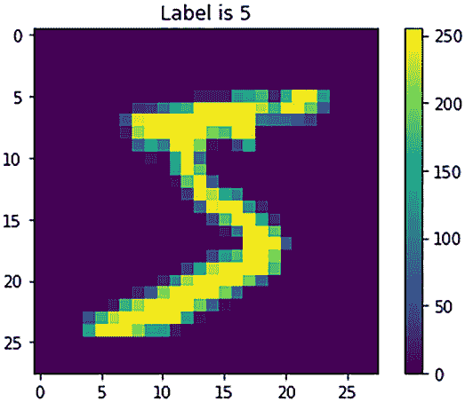

图 3.8 MNIST 中的一个训练样本

与我们在上一个问题中进行的归一化类似，我们可以通过调整像素值的范围到 0 到 1 之间来归一化图像。在列表 3.12 中，我们使用了一种称为*最小-最大缩放*的归一化方法。这种方法通过将像素值除以最大可能值（255）和最小可能值（0）之间的差值来缩放像素值。我们在这里和上一个例子中使用归一化方法在深度学习中相当常见，以提高学习算法的有效性。

列表 3.12 缩放图像

```
train_images = train_images / 255.0
test_images = test_images / 255.0
```

在准备数据之后，我们可以开始构建网络。在我们创建第一个 CNN 之前，让我们构建一个 MLP，我们可以将其用作基准模型进行比较。

### 3.4.2 使用 MLP 解决问题

我们知道 MLP 模型由多个密集（全连接）层组成，其中每一层的点积应用于输入张量的最后一个轴和核矩阵。为了确保第一层使用图像的所有特征来计算点积，我们可以首先使用 Keras 的 Flatten 层将每个 28×28 的图像转换为 1×784 的向量。我们将它与两个 Dense 层堆叠以创建一个联合管道。图 3.9 提供了 Flatten 层的视觉说明。

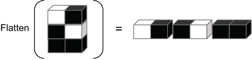

图 3.9 使用 Keras Flatten 层将 2-D 图像重塑为 1-D 向量

构建 MLP 的代码如下所示。

列表 3.13 为 MNIST 手写数字分类构建 MLP

```
from tensorflow import keras
from tensorflow.keras import layers

mlp_model = keras.Sequential([
    keras.layers.Flatten(input_shape=train_images.shape[1:]),
    keras.layers.Dense(128, activation='relu'),
    keras.layers.Dense(10),
    keras.layers.Softmax()
])
```

展平层接受图像的形状作为输入，并且没有需要学习的权重。通过比较这个 MLP 与我们之前构建的回归任务中的 MLP，你可能已经注意到了以下主要区别：

+   在先前的模型中，我们将输出层的单元数设置为 1，以输出预测的房价。在这个多类分类问题中，最后一个密集层的单元数是 10，以与分类目的的类别数（0-9）相匹配。最后一个密集层输出的 10 个值称为*logits*。

+   我们在最后一个密集层中不应用激活函数，而是在最后添加一个名为 Softmax 层的层，该层应用 *softmax 函数* 将 10 个 logits 转换为输入属于每个类的概率，以执行最终预测。图像将被分配给具有最高转换概率的类别。softmax 函数可以表示为 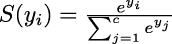，其中 *c* 是类别的数量。*y[i]* 表示 logits。Softmax 层没有需要学习的参数，其输入和输出的形状相同。Softmax 层也可以被视为最后一个密集层的激活函数，这允许我们更简洁地编写模型规范，如下所示。

列表 3.14 具有 softmax 激活输出密集层的相同 MLP 结构

```
mlp_model = keras.Sequential([
    keras.layers.Flatten(input_shape=train_images.shape[1:]),
    keras.layers.Dense(128, activation='relu'),
    keras.layers.Dense(10, activation='softmax')
])
```

我们现在可以通过指定损失函数、优化器和一些要检索的评估指标来编译用于训练的模型，如下所示。

列表 3.15 编译 MLP 模型

```
mlp_model.compile(optimizer='adam',
                  loss=tf.keras.losses.SparseCategoricalCrossentropy(),
                  metrics=['accuracy'])
```

我们使用分类准确率作为评估指标。选择 adam 优化器，它是 sgd 优化器的一种变体。adam 和 rmsprop 都是常用的优化方案，你可以尝试不同的方案，根据其性能选择最合适的一个。损失函数是一种交叉熵损失，它衡量两个离散概率分布之间的距离。在这里，它衡量的是属于每个 10 个类别的图像预测概率与真实概率之间的差异。真实概率将为图像的正确标签为 1，其他所有标签为 0。请注意，我们在列表 3.15 中使用 SparseCategoricalCrossentropy，它要求输入标签为整数（本例中的 0-9）。如果你想使用真实标签的 *one-hot* 表示——例如，标签 2 的表示为[0, 1, 0, 0, 0, 0, 0, 0, 0, 0]——你应该使用 tf.keras.losses.CategoricalCrossentropy。

让我们拟合网络并检查其性能。在这里，我们以 64 张图像每个训练批次输入网络的方式训练网络五个周期（周期数和批量大小可以调整）：

```
>>> mlp_model.fit(train_images, train_labels,
...     epochs=5, batch_size=64, verbose=0)
>>> test_loss, test_acc = mlp_model.evaluate(
...     test_images, test_labels, verbose=0)
>>> test_acc
0.9757
```

测试准确率为 97.57%，这意味着 MLP 网络能够正确分类大约 98 张中的 100 张图像，这还不错。

### 3.4.3 使用 CNN 解决问题

在本节中，我们介绍一个卷积神经网络（CNN）模型来解决该问题。CNN 的核心思想是提取一些局部模式，例如图像中的边缘、弧线和纹理，并逐层将这些模式逐渐浓缩成更复杂的模式，例如 *弧线、边缘* → *轮胎* 和 *车灯* → *汽车*。

为了实现这个目标，除了密集层之外，一个简单的 CNN 通常还包含两种其他类型的层：*卷积层*和*池化层*。让我们首先构建 CNN，然后通过查看它们输入和输出张量的形状来检查这两个层。创建简单 CNN 的代码如下。

列表 3.16 构建简单的 CNN 模型

```
def build_cnn():
    model = keras.Sequential([
        keras.layers.Conv2D(32, (3, 3), activation='relu',
                            input_shape=(28, 28, 1)),
        keras.layers.MaxPooling2D((2, 2)),
        keras.layers.Conv2D(64, (3, 3), activation='relu'),
        keras.layers.MaxPooling2D((2, 2)),
        keras.layers.Conv2D(64, (3, 3), activation='relu'),
        keras.layers.Flatten(),
        keras.layers.Dense(64, activation='relu'),
        keras.layers.Dense(10, activation='softmax')
    ])                                                        ❶

    model.compile(optimizer='adam',
        loss=tf.keras.losses.SparseCategoricalCrossentropy(),
        metrics=['accuracy'])                                 ❷
    return model

cnn_model = build_cnn()
```

❶ 构建 CNN 模型结构

❷ 编译模型以进行训练

在 Flatten 层之后，网络结构与简单的 MLP 相同，除了单元数量不同。前五个层由三个卷积层和两个池化层交替组成。它们都是二维层，旨在提取图像的空间特征。在介绍具体操作之前，让我们在这里显示每个层的输入和输出形状：

```
>>> cnn_model.summary()
Model: "sequential_1"
_________________________________________________________________
Layer (type)                 Output Shape              Param #
=================================================================
conv2d (Conv2D)              (None, 26, 26, 32)        320
_________________________________________________________________
max_pooling2d (MaxPooling2D) (None, 13, 13, 32)        0
_________________________________________________________________
conv2d_1 (Conv2D)            (None, 11, 11, 64)        18496
_________________________________________________________________
max_pooling2d_1 (MaxPooling2 (None, 5, 5, 64)          0
_________________________________________________________________
conv2d_2 (Conv2D)            (None, 3, 3, 64)          36928
_________________________________________________________________
flatten_1 (Flatten)          (None, 576)               0
_________________________________________________________________
dense_2 (Dense)              (None, 64)                36928
_________________________________________________________________
dense_3 (Dense)              (None, 10)                650
=================================================================
Total params: 93,322
Trainable params: 93,322
Nontrainable params: 0
_________________________________________________________________
```

无论第一个批量大小维度如何，卷积层都接受三个维度的输入（高度、宽度、通道）并输出一个三维张量，我们通常称之为*特征图*。前两个维度是空间维度，表示图像的大小（MNIST 图像为 28×28）。最后一个维度表示特征图中的通道数。对于原始输入图像，通道维度是颜色通道的数量。例如，RGB 图像有三个通道：红色、蓝色和绿色。像 MNIST 数据集中的图像这样的灰度图像只有一个通道。

卷积层是如何工作的

在实例化卷积层时，我们需要指定两个主要参数。第一个是滤波器（或核）的数量，它决定了输出特征图中的通道数（最后一个维度的尺寸）。第二个参数是每个滤波器的大小。*滤波器*是一个可训练的张量，它试图在输入特征图中发现某种模式。它扫描输入特征图，并输出一个矩阵，指示目标特征出现在输入中的位置。通过聚合不同滤波器的输出矩阵，我们得到卷积层的输出特征图。输出特征图中的每个通道都是由一个独特的滤波器生成的。以列表 3.16 中的第一个卷积层为例，我们将其通道数设置为 32，每个滤波器的大小为 3×3×1。每个滤波器将生成一个 26×26 的矩阵（我稍后会解释原因）。因为我们有 32 个滤波器，所以它们将生成 32 个 26×26 的矩阵，这些矩阵共同构成了形状为（26, 26, 32）的输出特征图。卷积层中的可训练权重数量等于滤波器中元素数量的总和加上通道数（偏置向量的长度）。例如，在第一个卷积层中，有 3 * 3 * 32 + 32 = 320 个参数需要学习。

现在我们来看一个三维滤波器如何将一个三维输入特征图转换成另一个三维特征图，以及如何计算输出特征图的形状。我们将使用一个 4×4×1 的输入特征图和大小为 3×3 的滤波器作为例子（见图 3.10）。滤波器会逐步遍历特征图。我们还可以指定步长，称为*步长*。在这里，我们假设步长为 1，这意味着一个 3×3×1 的滤波器必须水平或垂直移动两步才能通过 4×4×1 特征图。在每一步中，它将覆盖与自身大小相同的输入特征图区域并执行卷积操作（这就是卷积层名称的由来）。

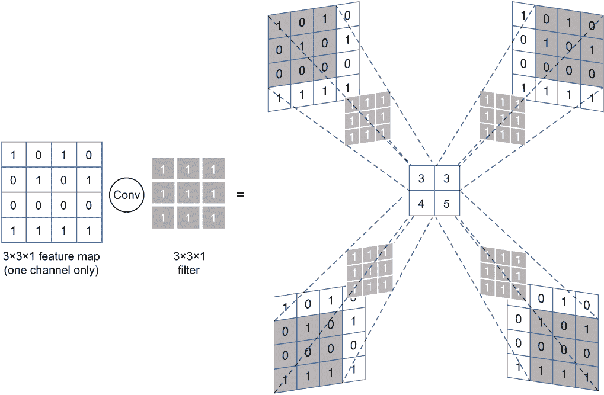

图 3.10 4×4×1 特征图与 3×3×1 滤波器进行步长为 1 的卷积操作，生成 2×2×1 特征图

从数学上讲，在每一步中，它首先在覆盖的特征图和滤波器之间进行逐元素乘法。这将产生一个与滤波器大小相同的三个维度的张量。然后，它将张量中的所有元素加起来得到一个单一值。通过遍历输入特征图，我们将得到一个矩阵（或者如果我们考虑通道轴，则是一个三维张量）。这个矩阵的大小由滤波器大小和步长共同决定。通常，输出特征图的大小等于步长可以采取的有效步数的数量。例如，在图 3.11 中，我们将得到一个 2×2 的矩阵，因为步长可以在高度和宽度维度上采取两个有效的步数。同样，在 MNIST 示例中，每个 3×3 滤波器可以在每个维度上移动 26 步，将 28×28 的图像转换成 26×26 的特征图。

如果我们在定义 Conv2D 层时将步长设置为(2,2)，则每个滤波器将沿着每个维度移动两步。假设我们将滤波器大小定义为(3, 3)并有一个 4×4 的输入特征图。滤波器在垂直和水平方向上无法移动两步，边界上的一些像素无法覆盖并考虑，如图 3.11 所示。如果我们将步长设置为(1, 1)，滤波器将能够沿着每个维度移动两步。然而，边界上的像素在较少的步数中被考虑，这被称为*边界效应*。

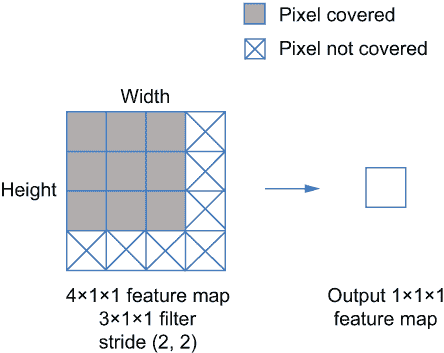

图 3.11 无填充的卷积

为了帮助过滤器实现特征图的全覆盖，我们可以通过在其边缘添加零来扩展输入特征的范围。这种*填充*将根据需要添加行和列，以确保像素被同等考虑（在卷积层和池化层中）。例如，如图 3.12 所示，在每个边缘添加一列或一行允许 3×3 的过滤器在步长为(1, 1)时保持 4×4 输入特征图的形状。填充特征图中的每个像素在卷积操作中将被考虑相同数量的步骤。

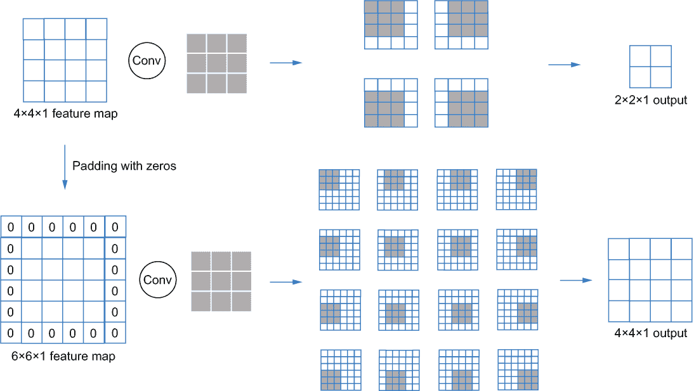

图 3.12 比较了带零填充和不带零填充的输入特征图的输出维度

池化层的工作原理

现在让我们来谈谈池化。图 3.13 展示了池化层是如何工作的。这类层用于在空间维度上减小特征图的大小，以达到以下两个目的：

+   为了降低计算复杂度和后续层（尤其是权重大小与输入大小相对应的全连接层）中需要学习的参数数量。

+   在减小特征图尺寸的同时，保持尺度、旋转和平移不变性。在图 3.13 中，图像的每个小块在通过池化层后不会进行缩放或旋转。它们被聚合成一个粗略的图像，保持了原始图像的意义。

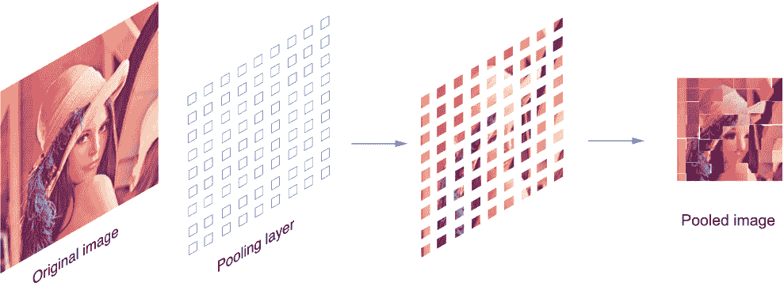

图 3.13 池化可以在一定程度上保持图像属性的不变性。

池化层执行与卷积层类似的操作，但没有用于学习的任何过滤器（核）。卷积操作被替换为特定的硬编码操作，例如我们在第一个 CNN 中定义的 MaxPooling2D 层中的最大操作。当实例化一个池化层时，我们需要指定我们想要使用哪种类型，例如我们例子中的 MaxPooling2D，并定义一个池化大小（类似于核大小）以识别应用池化操作的特征图区域。池化层的步长必须与池化大小相同，这意味着每个维度的池化大小应该是该维度大小的因子。如果不是，则必须在之前应用填充操作；这是通过在用 Keras API 实例化池化层时指定 padding='valid'参数来完成的。

应用池化层会将输入特征图划分为与用户指定的池化大小相同的多个块。在每个块中，它将应用池化操作。例如，MaxPooling2D 层将选择特征图每个块中的最大值（见图 3.14）。

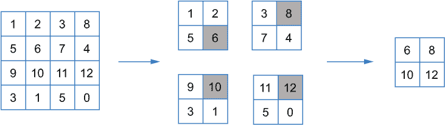

图 3.14 在 4×4 特征图上应用池化大小为(2, 2)的最大池化

实际上，池化层通常与卷积层或密集层交替使用，以逐步减小特征图的大小。

训练和测试 CNN

在将 MNIST 数据输入我们的 CNN 之前，我们需要为原始图像添加一个额外的通道维度，如图所示：

```
>>> train_images_4d = train_images[..., tf.newaxis]
>>> test_images_4d = test_images[..., tf.newaxis]
>>> train_images_4d.shape, test_images_4d.shape
((60000, 28, 28, 1), (10000, 28, 28, 1))
```

编译和训练 CNN 模型与 MLP 没有不同。通过检查性能，如图所示，我们可以看到简单的 CNN 模型达到了 99.02%的准确率，将错误率降低了 40%以上：

```
>>> cnn_model.fit(train_images_4d, train_labels,
...               epochs=5, batch_size=64, verbose=1)
>>> test_loss, test_acc = cnn_model.evaluate(
...     test_images_4d, test_labels, verbose=0)
>>> test_acc
0.9902
```

此外，尽管 CNN 的层数比我们设计的 MLP 多，但由于池化层减少了特征图的大小，总参数数量比 MLP 少。

同样，我们可以通过调整超参数（如滤波器大小、步长大小、池化大小、卷积和池化层的数量和组合、学习率、优化器等）来调整 CNN 模型。这里有很多选项，但您应该能够通过编写一个简单的循环函数，尝试不同的超参数值，并使用交叉验证比较它们的性能来手动调整它们。我将在本书的第二部分介绍 AutoML 方法，以帮助您更方便地完成这项工作。

## 3.5 使用循环神经网络进行 IMDB 评论分类

在本章的最后一个例子中，我将向您展示如何使用经典的用于序列数据的深度学习模型——**循环神经网络**（RNN）来解决文本分类问题。我们将使用的数据集是 IMDB 电影评论数据集。目标是预测用户撰写的评论是正面还是负面。

### 3.5.1 准备数据

与 MNIST 数据集类似，IMDB 数据集也可以使用 Keras 加载，如下所示。

列表 3.17 加载 IMDB 数据

```
from tensorflow.keras.datasets import imdb

max_words = 10000          ❶

(train_data, train_labels), (test_data, test_labels) = imdb.load_data(
    num_words=max_words)   ❶
```

❶ 加载数据并仅保留出现频率最高的 num_words 个单词

此代码将评论加载到 train_data 和 test_data 中，并将标签（正面或负面）加载到 train_labels 和 test_labels 中。数据集已经通过标记化从原始文本评论转换为整数列表。标记化过程首先将每个评论分割成单词列表，然后根据单词-整数映射字典为每个单词分配一个整数。这些整数没有特殊含义，但为可以输入网络的单词提供了数值表示。标签是表示每个评论是正面还是负面的布尔值。让我们检查以下数据：

```
>>> train_data.shape
(25000,)
>>> train_labels.shape
(25000,)
>>> train_data[0]
[1, 14, 22, 16, 43, 530, 973, 1622, 1385, 65, 458, 4468, 66, 3941, 4,
➥ 173, 36, 256, 5, 25, 100, 43, 838, 112, 50, 670, 2, 9, 35, ...]
>>> len(train_data[0])
218
>>> len(train_data[1])
189
>>> train_labels[:2]
[1 0]
```

由于评论可能具有不同的长度，如这个输出所示，我们将序列填充到相同的长度以将其格式化为矩阵。填充操作如图 3.15 所示。我们首先选择一个最大长度（max_len），所有序列都将转换为这个长度。如果序列短于 max_len，我们在末尾添加零；如果它更长，我们截断多余的长度。

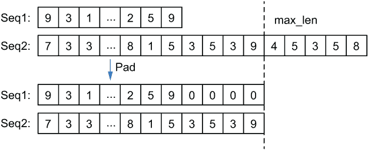

图 3.15 展示了如何将序列填充到相同的长度。

在这个例子中，我们选择最大长度为 100，并使用 Keras 实现，如列表 3.18 所示。

列表 3.18 截断和填充数据以达到相同的长度

```
from tensorflow.keras.preprocessing import sequence

max_len = 100

train_data = sequence.pad_sequences(train_data, maxlen=max_len)
test_data = sequence.pad_sequences(test_data, maxlen=max_len)
```

返回的填充训练数据被分组成一个矩阵，其形状为(25000, 100)，如下所示：

```
>>> train_data.shape
(25000, 100)
```

矩阵中的每个整数只是单词的数值表示，因此它们对网络学习没有具体含义。为了向网络提供有意义的输入，我们使用一种称为*词嵌入*的技术为每个单词创建一个可学习的向量，我们称之为*嵌入向量*。该方法将为每个单词随机初始化一个嵌入向量。这些向量作为网络的输入，并与网络的权重一起学习。词嵌入提供了一种将人类语言映射到几何空间的方法，当有足够的训练数据时非常强大。如果您没有大量数据集，可以使用为其他数据集学习到的嵌入向量（*预训练*词嵌入）作为初始化，以帮助算法更好地、更快地学习特定任务的嵌入。 

因为嵌入向量是可学习的参数，所以词嵌入方法被封装为 Keras 中的一个层，命名为 Embedding。它可以与 RNN 一起堆叠。我们可以通过创建一个 Keras 顺序模型并添加一个嵌入层作为第一层来实现整个流程，如下所示。

列表 3.19 向模型添加嵌入层

```
from tensorflow.keras.layers import Embedding
from tensorflow.keras import Sequential

max_words = 10000
embedding_dim = 32

model = Sequential()                             ❶
model.add(Embedding(max_words, embedding_dim))   ❷
```

❶ 创建一个 Keras 顺序模型对象

❷ 在顺序模型中添加嵌入层

max_words 参数定义了词汇表大小，或输入数据中可能包含的最大单词数量。这里的嵌入维度（32）表示每个词嵌入向量的长度。嵌入层的输出张量形状为(batch_size, max_len, embedding_dim)，其中 max_len 是我们之前使用的填充序列的长度。现在，每个评论序列都是一个由一组词嵌入向量组成的矩阵。

### 3.5.2 构建 RNN

在嵌入层之后，我们构建一个用于分类的 RNN。RNN 处理序列输入，这些输入格式化为向量。它一次取一个嵌入向量以及一个 *状态向量*，为下一步使用生成一个新的状态向量（见图 3.16）。你可以把状态向量看作 RNN 的记忆：它提取并记住序列中前面的单词的信息，以考虑同一序列中单词之间的序列相关性。实际上，图中的每个 RNN 单元都是包含由某些可学习权重矩阵定义的特定转换的相同单元的副本。在第一步中，RNN 没有前面的单词可以记住。它以第一个词嵌入向量和初始状态（通常是空的零向量）作为输入。第一步的输出是第二步要输入的状态。对于其余的步骤，RNN 将前一步的输出和当前输入作为输入，输出下一步的状态。对于最后一步，输出状态是我们将用于分类的最终输出。

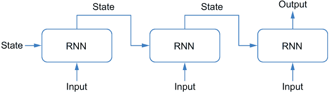

图 3.16 基本循环神经网络架构

我们可以使用以下列表中的 Python 代码来说明这个过程。返回的状态是 RNN 的最终输出。

列表 3.20 RNN 的伪代码

```
state = [0] * 32                       ❶
for i in range(100):                   ❷
    state = rnn(embedding[i], state)   ❷
return state
```

❶ 设置循环状态的数量

❷ 递归生成新的状态

有时，我们可能还需要收集如图 3.17 所示的每个步骤的输出。我们可以收集不仅最后一个状态向量作为输出，还可以收集所有状态向量。因为现在的输出是一个向量序列，我们可以通过堆叠多个 RNN 层来使 RNN 深度化，并使用一个层的输出作为下一层的输入。值得注意的是，每个输出向量的维度不必与输入向量的维度相同。

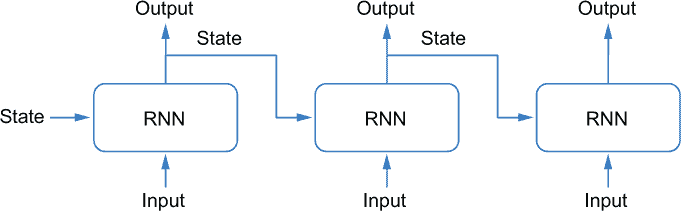

图 3.17 具有多个向量输出的循环神经网络

我们还可以将多个 RNN 链堆叠成一个多层 RNN 模型（见图 3.18）。每个 RNN 层的输出状态将被收集作为后续层的输入。

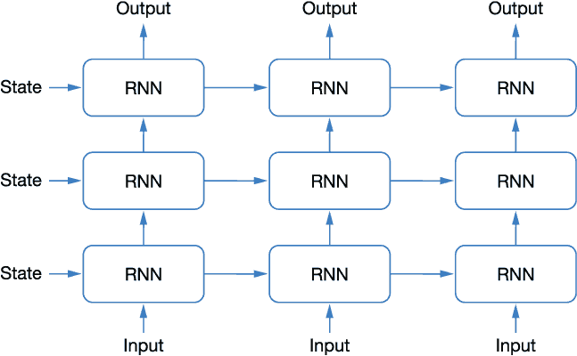

图 3.18 多层循环神经网络具有多个向量输出

为了实现 RNN，我们可以使用 Keras 中的 SimpleRNN 类。在列表 3.21 中，我们堆叠了四个 RNN 层来形成一个多层 RNN。每个 SimpleRNN 创建一个 RNN 链（而不是单个 RNN 单元）。前三个 RNN 层中的输出状态被收集作为后续层的输入。第四个 RNN 层的输出状态被输入到密集层进行最终分类。

列表 3.21 创建 RNN 模型

```
from tensorflow.keras.layers import SimpleRNN
from tensorflow.keras.layers import Dense

model.add(SimpleRNN(units=embedding_dim,
                    return_sequences=True))  ❶
model.add(SimpleRNN(units=embedding_dim,
                    return_sequences=True))  ❶
model.add(SimpleRNN(units=embedding_dim,
                    return_sequences=True))  ❶
model.add(SimpleRNN(units=embedding_dim))    ❶
model.add(Dense(1, activation='sigmoid'))    ❷
```

❶ 堆叠四个 RNN 层

❷ 添加一个密集层以生成最终的分类概率

单元参数定义了每个输出向量（或状态向量）的长度，这与输入向量的长度相同。`return_sequences` 参数控制是否收集 RNN 的所有输出向量或仅收集最终输出。默认设置为 False。最后一层是一个具有 sigmoid 激活函数的密集层，将长度为 32 的状态向量映射到单个值（单元），表示评论属于正面类别的概率。

### 3.5.3 训练和验证 RNN

我们可以使用与 MNIST 示例类似的过程来编译和训练模型。我们选择二元交叉熵作为损失函数，如下一列表所示，它是二元分类交叉熵损失的特殊情况。

列表 3.22 添加分类层

```
model.compile(optimizer='adam', metrics=['acc'], loss='binary_crossentropy')
model.fit(train_data,
          train_labels,
          epochs=2,
          batch_size=128)
```

为了说明目的，我们仅用 128 个批次的规模训练了两个时期。训练好的 RNN 模型可以像这样在测试集上进行评估：

```
>>> model.evaluate(test_data, test_labels)
782/782 [==============================] - 28s 35ms/step - 
➥ loss: 0.3684 - acc: 0.8402
[0.36835795640945435, 0.8402000069618225]
```

再次，我们将跳过 RNN 的调整，并将这部分内容留到本书的下一部分，借助 AutoML 工具包来完成。

## 摘要

+   深度学习模型由多个层堆叠而成，用于提炼输入数据并生成层次化的表示。它们可以通过迭代过程联合训练，通过正向传递数据，确定输出中的损失（错误），并通过反向传播使用选定的优化方法更新每层的参数。

+   TensorFlow 和 Keras 帮助我们轻松实现深度学习模型。你现在应该能够实现三种经典的深度学习模型，包括用于表格数据分类的多层感知器（MLPs）、用于图像分类的卷积神经网络（CNNs）和用于文本分类的循环神经网络（RNNs）。

+   编译和训练深度学习模型需要指定损失函数、优化器、检索指标和停止标准（例如训练的时期数）。

+   深度学习模型通常比经典机器学习模型需要更少的数据预处理和特征工程。然而，这些算法通常有多个超参数需要调整，例如层数、层类型、每层的具体配置以及优化方法中的超参数。
