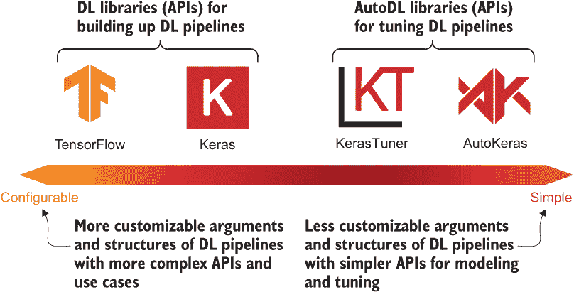
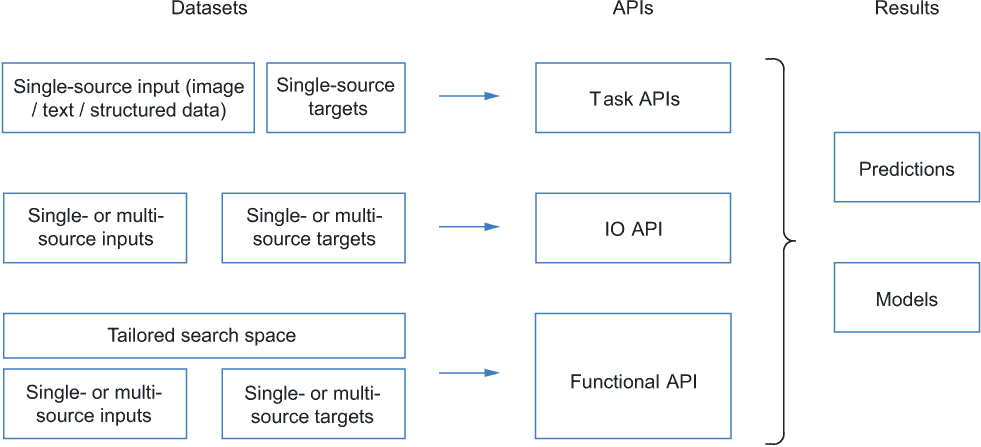
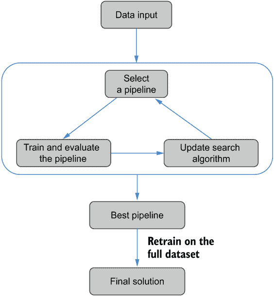
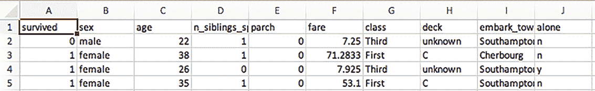
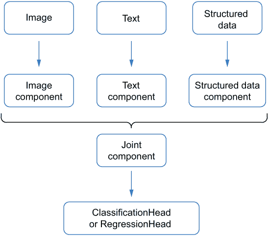
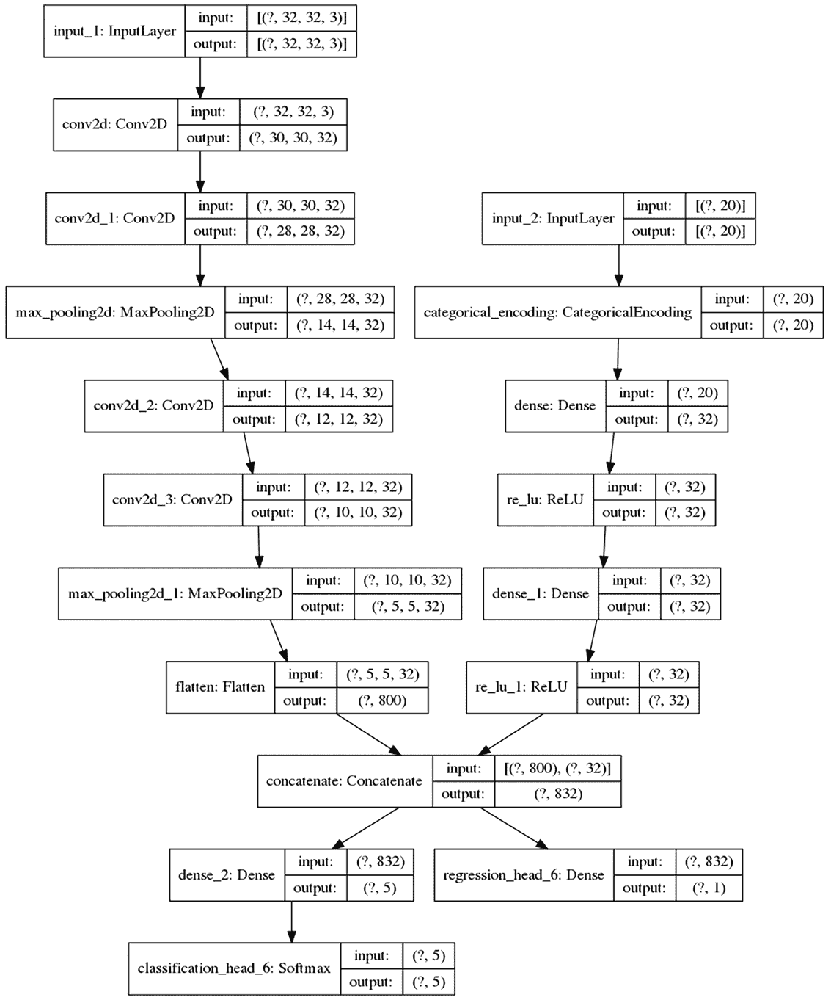

# 4 自动生成端到端 ML 解决方案

本章节涵盖了

+   AutoKeras 简介

+   自动分类和回归

+   使用 AutoML 解决多输入和多输出问题

本章节首先教您如何创建一个端到端的深度学习解决方案，而无需选择或调整任何深度学习算法。这可以通过尽可能少的五行代码实现，这比第三章中介绍实现深度学习管道的过程要简单得多。然后，您将学习如何使用 AutoML 在图像、文本和表格数据上执行分类和回归，正如我们在前面的章节中所做的那样。我们还将探索几个更复杂的场景，包括具有多种类型输入的任务，例如图像和文本，以及具有多个目标的任务，例如回归响应和分类标签的联合预测。

## 4.1 准备 AutoML 工具包：AutoKeras

在开始解决实际问题之前，让我们首先探索我们的主要 AutoML 工具——AutoKeras。AutoKeras 是一个专注于自动生成深度学习解决方案的 Python 库。要安装 AutoKeras，您可以在命令行中简单地运行 pip install autokeras，或者在 Jupyter 笔记本中运行!pip install autokeras。关于包安装的更详细讨论见附录 A。

AutoKeras 建立在 TensorFlow 后端([`tensorflow.org`](https://tensorflow.org))、TensorFlow Keras API([`keras.io`](https://keras.io))和 KerasTuner 库([`keras.io/keras_tuner/`](https://keras.io/keras_tuner/))之上。这四个组件展示了深度学习软件的完整范围。从用户的角度来看，如图 4.1 所示，TensorFlow 是最可配置的，但也是最复杂的；AutoKeras 位于光谱的另一端，是最简单的。右侧的组件是基于左侧的组件开发的，它们提供了更高级和封装的自动化，但可定制性较低。



图 4.1 Keras 生态系统

注意，“更多可配置性”在这里意味着用户可以在 API 中指定更多参数，这为自定义 ML 管道和 AutoML 算法（主要是搜索空间）提供了更大的灵活性。具有更多 ML 专业知识的用户可以使用像 TensorFlow 和 Keras API 这样的底层库来实现更个性化的解决方案，以满足他们的需求。这些库允许用户逐层自定义他们的深度学习模型。另一方面，那些对 ML 了解较少，希望在建模和调整上节省一些精力，并且不介意牺牲一些灵活性的用户，可能希望使用像 KerasTuner 和 AutoKeras 这样的高级库。

在本书中，我们将重点关注使用 AutoKeras 解决深度学习问题，并在第七章简要介绍 KerasTuner。与 AutoKeras 相比，KerasTuner 可以应用于更广泛的机器学习问题（超出深度学习的范围），并且在搜索空间设计和搜索算法选择方面更加灵活。相应地，它需要更多关于要调整的机器学习流水线和 AutoML 算法的知识。如果您对探索传统深度学习和 TensorFlow 和 Keras 的底层功能感兴趣，François Chollet 的书籍《Python 深度学习》（第 2 版，Manning，2021 年）提供了更详细的介绍。

AutoKeras 定位为 Keras 生态系统中最顶层的库。它提供了最高级别的自动化。如图 4.2 所示，它提供了以下三个级别的 API——即一组任务 API、输入/输出（IO）API 和功能 API——以覆盖在现实世界应用中应用 AutoML 的不同场景：

+   任务 API 帮助您为针对目标机器学习任务生成端到端的深度学习解决方案，例如图像分类。这些是 AutoKeras 中最直接的 API，因为它们允许您通过仅一步操作（输入数据）来实现所需的机器学习解决方案。在 AutoKeras 的最新版本中，六个不同的任务 API 支持六个不同的任务，包括图像、文本和结构化数据的分类和回归。

+   现实世界的问题可能有多个输入或输出。例如，我们可以使用视觉和声学信息来检测视频中的动作。我们可能还希望预测多个输出，例如使用客户的消费记录来预测他们的购物兴趣和收入水平。为了解决这些任务，我们可以使用 AutoKeras 的 IO API。您将在第 4.4 节中看到两个示例。

+   功能 API 主要面向希望根据自身需求定制搜索空间的进阶用户。它类似于我们在第三章中使用的 TensorFlow Keras 功能 API，允许我们通过连接一些 AutoKeras 构建块来构建深度学习流水线。一个构建块通常代表由多个 Keras 层（如 CNN）组成的特定深度学习模型，这意味着我们不需要逐层指定这些模型。每个块的超参数搜索空间也是为我们设计和设置的，这样我们就可以专注于我们关心的超参数，而无需担心其他方面。



图 4.2 AutoKeras API 的不同级别

本章将重点关注任务 API 和 IO API。这两个 API 都允许您在不自定义搜索空间的情况下生成端到端解决方案。功能 API 将在下一章讨论。

## 4.2 自动化图像分类

理想情况下，给定一个机器学习问题和相应的数据，我们期望 AutoML 算法能够在最小的人力或配置下提供令人满意的机器学习解决方案。在本节中，我们以 MNIST 数据集的图像分类问题为例，介绍如何仅通过以下两个步骤实现这一目标：

+   选择适合当前问题的 AutoKeras 任务 API。

+   将数据输入到所选 API 中。

你将能够创建图像分类器，而无需创建任何深度学习模型或接触 AutoML 算法。在下一节中，我们将讨论更多与不同任务和数据类型相关联的示例。

### 4.2.1 使用五行代码解决问题

记住，我们在上一章中通过构建 TensorFlow 及其 Keras API 的 CNN 来解决图像分类问题。以下五个步骤是深度学习工作流程的一部分：

1.  使用 TensorFlow 加载数据集和测试数据集。

1.  通过归一化预处理图像。

1.  构建神经网络。

1.  编译和训练神经网络。

1.  在测试数据上评估流水线。

实现此过程需要选择深度学习算法中的每个组件。您需要定义整个流水线的超参数，并逐层构建网络。即使有这个过程，也不总是容易获得期望的结果，因为没有保证您会在第一次尝试时设置所有超参数都合适。在实现阶段，在单独的验证集上调整超参数需要额外的努力，并且是一个试错过程。借助 AutoML，您可以一次解决所有问题。让我们使用 AutoKeras 自动生成一个用于分类 MNIST 数字的深度学习模型。整个问题可以用尽可能少的五行代码来解决，如下所示。

列表 4.1 使用 AutoKeras 任务 API 的多类图像分类

```
from tensorflow.keras.datasets import mnist

(x_train, y_train), (x_test, y_test) =
➥ mnist.load_data()                                ❶
import autokeras as ak

clf = ak.ImageClassifier(max_trials=2)             ❷

clf.fit(x_train, y_train, epochs=3, verbose=2)     ❸
```

❶ 加载数据

❷ 初始化 AutoKeras ImageClassifier

❸ 将训练数据输入到 ImageClassifier 中

在加载数据集之后，您要获取最终解决方案的唯一事情就是初始化 API 并将训练数据输入到初始化的 ImageClassifier 对象中。拟合是一个迭代过程，使用以下三个步骤：

1.  根据 AutoML 搜索算法从搜索空间中选择一个深度学习流水线（由预处理方法、CNN 模型和用 Keras 实现的训练算法组成）。对于每个机器学习任务，AutoKeras 在其相应的任务 API 中集成了一个定制的搜索空间和特定于任务的搜索算法。在使用 API 时，您无需指定它们。在本例中，因为我们正在处理图像分类问题，所以 AutoKeras 中的 ImageClassifier 将自动用一系列由不同的图像预处理方法和 CNN 组成的深度学习流水线填充搜索空间。

1.  训练选定的管道并评估它以获取其分类准确率。默认情况下，20% 的训练数据将被分割为验证集。验证损失或准确率将用于比较所有选定管道的性能。

1.  更新 AutoML 搜索算法。一些 AutoML 算法可以从先前探索的管道的性能中学习，以使它们的后续探索更加高效。这一步可能不是必需的，因为一些 AutoML 算法，如网格搜索，不需要更新。

这个迭代过程模仿了手动调整，但去除了人为因素，让 AutoML 算法来完成选择。调整迭代的次数由你想要进行的试验次数决定——即你想要 AutoML 算法在搜索空间中探索多少个管道。在初始化 ImageClassifier 时，你可以在 max_trials 参数中设置这个值。所有试验完成后，迄今为止找到的最佳管道将再次使用完整的训练数据集进行训练，以实现最终解决方案（见图 4.3）。



图 4.3 AutoKeras 任务 API 的 AutoML 流程

调用 ImageClassifier 的 fit() 方法与调用 Keras 模型的 fit() 方法相同。所有用于拟合单个 Keras 模型的参数都可以无缝地应用于此处，以控制每个选定管道的训练过程，例如训练轮数。所有试验和最佳管道的模型权重都将保存到磁盘上，以便于后续评估和使用。

最终解决方案的评估也与评估 Keras 模型类似。拟合完成后，我们可以通过调用 evaluate() 方法来测试最佳管道。它将首先使用最佳管道中包含的预处理方法对测试图像进行预处理，然后将处理后的数据输入到模型中。如以下代码示例所示，本例中最佳管道的评估准确率为 98.74%，考虑到我们只进行了两次试验（探索了两个管道），这个结果还不错：

```
>>> test_loss, test_acc = clf.evaluate(x_test, y_test, verbose=0)
>>> print('Test accuracy: ', test_acc)
Test accuracy:  0.9873999953269958
```

你也可以通过调用 predict() 函数来获取测试图像的预测标签，如下所示：

```
>>> predicted_y = clf.predict(x_test)
>>> print(predicted_y)
[[7]
 [2]
 [1]
 ...
 [4]
 [5]
 [6]]
```

找到的最佳管道可以导出为 Keras 模型。本例中实现的最佳模型可以如下导出并打印出来：

```
>>> best_model = clf.export_model()
>>> best_model.summary()

Model: 'model'
_________________________________________________________________
Layer (type)                 Output Shape              Param #
=================================================================
input_1 (InputLayer)         [(None, 28, 28, 1)]       0
_________________________________________________________________
normalization (Normalization (None, 28, 28, 1)         3
_________________________________________________________________
conv2d (Conv2D)              (None, 26, 26, 32)        320
_________________________________________________________________
conv2d_1 (Conv2D)            (None, 24, 24, 64)        18496
_________________________________________________________________
max_pooling2d (MaxPooling2D) (None, 12, 12, 64)        0
_________________________________________________________________
dropout (Dropout)            (None, 12, 12, 64)        0
_________________________________________________________________
flatten (Flatten)            (None, 9216)              0
_________________________________________________________________
dropout_1 (Dropout)          (None, 9216)              0
_________________________________________________________________
dense (Dense)                (None, 10)                92170
_________________________________________________________________
classification_head_1 (Softm (None, 10)                0
=================================================================
Total params: 110,989
Trainable params: 110,986
Nontrainable params: 3
_________________________________________________________________
```

模型在输入层之后堆叠了一个归一化层、两个卷积层和一个池化层。*dropout* 层用于在每个训练迭代（数据批次）期间随机将部分输入张量元素设置为 0，从而有效地将它们排除在考虑之外。它仅在训练过程中应用，以帮助克服网络的过拟合问题。

为什么 dropout 层可以减轻过拟合

dropout 层可以在以下三个原因下减轻训练神经网络时的过拟合：

+   它减少了神经元之间相关性的复杂性。在训练过程中，dropout 层会屏蔽一些神经元；只有未屏蔽的神经元在每次前向传递和反向传播迭代中才会被交互和更新。

+   它平均了子网络的效果。在某种程度上，dropout 可以被视为一种集成策略，在训练过程中平均从整个网络随机选择的多个子网络的预测。

+   它在训练过程中引入了额外的随机性，这有助于网络层适应不同的输入条件。这将提高其在测试期间对未见案例的泛化能力。

要了解 dropout 层的详细信息，请参阅 François Chollet 的书籍《使用 Python 进行深度学习》，第 2 版（Manning，2021 年）。

导出的 Keras 模型可以通过提供保存的路径保存到磁盘，并用于进一步的使用。如前所述，导出的模型不包含预处理输入图像的开头重塑层。在使用加载的模型进行预测之前，我们需要首先将输入图像扩展为 3-D 图像，如下面的列表所示。

列表 4.2 保存和加载最佳模型

```
from tensorflow.keras.models import load_model

best_model.save('model_autokeras')             ❶

loaded_model = load_model('model_autokeras')   ❷

predicted_y = loaded_model.predict(
    tf.expand_dims(x_test, -1))                ❸
```

❶ 在 model_autokeras 文件夹中保存模型

❷ 加载模型

❸ 使用加载的模型进行预测

正如这个示例所示，与使用 TensorFlow Keras API 创建的传统深度学习解决方案相比，使用 AutoML 和 AutoKeras 任务 API 可以让我们在数据准备、算法配置和知识获取上花费更少的精力来处理机器学习任务。为了总结这个示例并进一步展示 AutoML 的灵活性，让我们看看一些额外的用例。

### 4.2.2 处理不同的数据格式

在实践中，我们可能拥有不同格式的数据。AutoML 应该能够自动适应并处理不同的格式，而无需额外的手动预处理。以下是一些示例：

+   图像可能或可能没有明确指定的通道维度。我们期望 AutoML API 可以直接处理这两种情况，而（正如我们在上一章中看到的）为了将 MNIST 图像输入到 Keras 模型中，我们需要手动为每个图像添加一个额外的通道维度，以在通道维度不存在时转换它们的形状。

+   图像的标签可以是字符串、整数，甚至可以准备成 one-hot 编码格式（0 和 1 的向量）。

+   图像和标签的数据结构可能因用于加载数据集的包而异。它们可能格式化为 NumPy 数组 (np.ndarray)、pandas DataFrame (pd.DataFrame) 或 TensorFlow Datasets (tf.data.Dataset)。

为了减轻数据准备的压力，AutoML 库通常提供处理不同数据格式的灵活性。例如，所有刚刚描述的案例都可以由 ImageClassifier 处理。测试留给读者作为练习。

### 4.2.3 配置调优过程

除了数据格式，您可能还想通过指定您希望用作验证集的数据量、您希望收集用于探索管道的评估指标、您希望如何比较管道（例如，通过比较验证集上的准确率或损失）等方式来配置搜索过程。

列表 4.3 提供了一个示例。训练管道的损失函数定义为类别交叉熵损失。选定的评估指标是准确率。搜索目标设置为验证准确率，因此最佳管道将是验证集上分类准确率最高的管道。最后，我们预留出 15%的训练数据用于调整过程的验证集。

列表 4.3 定制调整过程的配置

```
from tensorflow.keras.datasets import mnist
(x_train, y_train), (x_test, y_test) = mnist.load_data()

import autokeras as ak

clf = ak.ImageClassifier(max_trials=2,

                         loss='categorical_crossentropy',  ❶

                         metrics=['accuracy'],             ❷

                         objective='val_accuracy')         ❸

clf.fit(x_train, y_train,
        validation_split=0.15,                             ❹
        epochs=3, verbose=2)
```

❶ 使用类别交叉熵损失进行分类

❷ 使用准确率作为评估指标

❸ 将验证准确率设置为调整目标

❹ 将 15%的数据分出用于验证

我们可能希望使用自定义评估指标而不是默认指标来比较管道的性能。例如，我们可以创建自己的指标函数，并将其作为 AutoML 过程中的评估目标封装。由于我们正在调整使用 TensorFlow Keras 构建的深度学习模型，因此目标指标的创建应遵循 Keras 指标函数的创建，该函数接受真实响应（分类问题中的标签）和一批数据点的模型预测作为输入，并输出指标值，如下所示。

列表 4.4 创建定制的 Keras 评估指标函数

```
def my_metric(y_true, y_pred):
    correct_labels = tf.cast(y_true == y_pred, tf.float32)   ❶
    return tf.reduce_mean(correct_labels, axis=-1)           ❷
```

❶ 将模型预测与真实标签进行比较

❷ 计算此批次数据中的预测准确率

注意，可以为 ImageClassifier 添加多个指标，这些指标将在评估期间全部计算。然而，对于 ImageClassifier，仅设置一个目标——用于选择最佳模型的指标。对于其他任务 API 也是如此。

要在 AutoML 过程中将自定义的指标作为指标和目标，我们首先应该将函数作为其中一个指标传递，这样它就会在评估过程中为每个选定的管道计算。然后我们可以将其封装为一个搜索目标，该目标由搜索算法用于比较管道的性能。封装目标需要 KerasTuner 库中的 Objective 类（见列表 4.5）。实例化一个目标需要提供两个参数。第一个参数指定用作搜索目标的指标名称（本例中的 val_my_metric）。因为我们想将管道的验证准确率作为目标，所以我们应该在函数（或指标）名称中添加一个 val_ 前缀。第二个参数（方向）指示指标的大值（direction='max'）或小值（direction='min'）更好。在本例中，我们想找到一个最大化自定义准确率的管道，因此我们将方向设置为'max'。

列表 4.5 将自定义指标传递给 AutoML 过程

```
import keras_tuner

clf = ak.ImageClassifier(
    seed=42,
    max_trials=2,
    loss='categorical_crossentropy',
    objective=keras_tuner.Objective(
        'val_my_metric', direction='max'),   ❶
    metrics=[my_metric],                     ❷
)

clf.fit(x_train, y_train,
        validation_split=0.15,
        epochs=3)
```

❶ 将自定义指标函数封装在 KerasTuner Objective 中，并将其传递给 AutoKeras

❷ 将自定义指标作为其中一个指标包含在内

值得指出的是，任务 API 没有直接提供用于选择搜索算法和配置搜索空间的参数，因为它们的目的是简化整个机器学习（ML）工作流程，尽可能减轻你的负担。让我们看看使用 AutoKeras 任务 API 的更多示例。在本章的最后部分，你将学习一个更通用的 AutoML 解决方案，用于处理具有多个输入和输出的任务。

## 4.3 四个监督学习问题的端到端 AutoML 解决方案

在本节中，我们将使用 AutoML，借助不同的 AutoKeras 任务 API，为四个更多的监督机器学习（ML）问题生成端到端解决方案。我们将解决的问题如下：

+   使用 20 个新闻组数据集进行文本分类

+   使用泰坦尼克号数据集进行结构化数据分类

+   使用加利福尼亚住房数据集进行结构化数据回归

+   使用合成数据集进行多标签图像分类

我们已经在上一章中用传统的机器学习（ML）方法解决了前三个问题；在这里，我们用 AutoML 重新处理这些问题，以便让你熟悉 AutoKeras 的任务 API 的使用。

在进入问题之前，让我们快速回顾一下传统机器学习（ML）方法和 AutoML 方法之间的区别。传统的机器学习（ML）方法为每个问题创建一个模型。因此，你必须指定模型的详细信息。AutoML 方法搜索不同类型的模型，这样你就不必指定所有细节，但将模型的一部分留给搜索。这种差异导致 AutoML 的 API 与传统方法不同。AutoML API 更简洁，因为它们将详细配置留给搜索。

最后一个问题是一个更复杂的图像分类场景，其中每个图像都与多个标签相关（例如，包含猫和狗的图像）。您可能不知道如何使用传统的机器学习来解决它，但借助 AutoML 和 AutoKeras 任务 API 的帮助，您只需要在 ImageClassifier 中更改一个参数，所有事情都会一次性完成。

### 4.3.1 使用 20 个新闻组数据集进行文本分类

第一个例子是使用 scikit-learn 库获取的 20 个新闻组数据集进行文本分类的问题。目标是根据文档的主题将其分类到 20 个新闻组之一。如果您不熟悉文本分类的基本机器学习过程，我们建议您查看附录 B。我们在那里提供了有关文本数据预处理和两种概率分类模型的更多详细信息。这里我们使用 AutoML 来处理 AutoKeras 中的 TextClassifier 任务 API 的问题。

我们首先使用 scikit-learn 内置的数据加载器 fetch_20newsgroups 下载数据。它已经被分为训练集和测试集，以便于使用。如下所示，我们只加载了 20 个新闻组类别中的两个（rec.autos 和 rec.motorcycles），以使搜索过程更快。

列表 4.6 加载 20 个新闻组数据集

```
import numpy as np
from sklearn.datasets import fetch_20newsgroups
categories = ['rec.autos', 'rec.motorcycles']

news_train = fetch_20newsgroups(subset='train',
                                shuffle=True,
                                random_state=42,
                                categories=categories)       ❶
news_test = fetch_20newsgroups(subset='test',
                               shuffle=True,
                               random_state=42,
                               categories=categories)        ❶

doc_train, label_train = \
    np.array(news_train.data), np.array(news_train.target)   ❷
doc_test, label_test =  \
    np.array(news_test.data), np.array(news_test.target)     ❷
```

❶ 加载训练和测试数据集

❷ 将数据集格式化为 NumPy 数组

让我们探索训练和测试数据集。每个文档都已格式化为如这里所示的术语字符串：

```
>>> print('The number of documents for training: {}.'.format(len(doc_train)))
>>> print('The number of documents for testing: {}.'.format(len(doc_test)))
>>> type(doc_train[0]), doc_train[0]

The number of documents for training: 1192.
The number of documents for testing: 794.

(numpy.str_,
 'From: gregl@zimmer.CSUFresno.EDU (Greg Lewis)\nSubject: Re:
➥ WARNING.....(please read)...\nKeywords: BRICK, TRUCK, DANGER\
➥ nNntp-Posting-Host: zimmer.csufresno.edu\nOrganization: CSU 
➥ Fresno\nLines: 33\n\nIn article <1qh336INNfl5@CS.UTK.EDU>
➥ larose@austin.cs.utk.edu (Brian LaRose) writes:\n>This just a 
➥ warning to EVERYBODY on the net.  Watch out for\n>folks standing
➥ NEXT to the road or on overpasses. They can\n>cause
➥ SERIOUS HARM to you and your car. \n>\n>(just a cliff-notes version
➥ of my story follows)\n>\n>10pm last night, I was
➥ travelling on the interstate here in\n>knoxville, I was taking an
➥ offramp exit to another interstate\n>and my wife suddenly
➥ screamed and something LARGE hit the side\n>of my truck.  We slowed
➥ down, but after looking back to see the\n>vandals standing 
➥ there, we drove on to the police station.\n>\n>She did get a 
➥ good look at the guy and saw him 'cock his arm' with\n>something
➥ the size of a cinderblock, BUT I never saw him.
➥ We are \n>VERY lucky the truck sits up high on the road; if it
➥ would have hit\n>her window, it would have killed her. 
➥ \n>\n>The police are looking for the guy, but in all likelyhood he is
➥ gone. \nStuff deleted...\n\nI am sorry to report that in
➥ Southern California it was a sick sport\nfor a while to drop concrete 
➥ blocks from the overpasses onto the\nfreeway. Several persons
➥ were killed when said blocks came through\ntheir
➥ windshields. Many overpass bridges are now fenced, and they\nhave
➥ made it illegal to loiter on such bridges (as if that
➥ would stop\nsuch people). Yet many bridges are NOT fenced.
➥ I always look up at a\nbridge while I still have time to take
➥ evasive action even though this\n*sport* has not reached us
➥ here in Fresno.\n_______________________________________________________
➥ ____________\nGreg_Lewis@csufresno.edu\nPhotojournalism sequence,
➥ Department of Journalism\nCSU Fresno, Fresno, CA 93740\n')
```

在加载数据后，我们可以直接将这些原始文档输入 API，而无需任何进一步的前处理，例如将文档转换为数值向量。在列表 4.7 中，我们设置了要搜索和比较的管道数量为三个。我们没有指定每个管道的训练轮数。TextClassifier API 将默认为每个管道训练，最多 1,000 轮，并在验证损失在连续 10 轮中没有改善时停止训练，以最小化训练时间并避免过拟合。

列表 4.7 使用 AutoKeras 任务 API 进行文本分类

```
import autokeras as ak

clf = ak.TextClassifier(max_trials=3)       ❶

clf.fit(doc_train, label_train, verbose=2)  ❷
```

❶ 初始化 AutoKeras TextClassifier

❷ 将训练数据输入 TextClassifier

在三次试验中找到的最佳管道在最终的测试集上实现了 96.1%的准确率，如下所示：

```
>>> test_loss, test_acc = clf.evaluate(doc_test, label_test, verbose=0)
>>> print('Test accuracy: ', test_acc)
 0.9609571695327759
```

我们可以通过将文档输入 predict()函数来获取预测标签，并通过调用 export_model()方法导出最佳模型。由于这个过程与前面的例子相同，这里不再重复。

### 4.3.2 使用泰坦尼克号数据集进行结构化数据分类

在本例中，我们将使用泰坦尼克号数据集来自动生成一个针对结构化数据分类任务的机器学习解决方案。该数据集包含分类特征，或字符串类型，以及数值特征。一些特征也存在缺失值，因此在它们输入神经网络之前需要额外的预处理。数据集的更多细节以及预处理它的经典方法在附录 B 中介绍。当使用 AutoML 解决分类问题时，正如我们在这里所做的那样，您无需担心这些手动预处理步骤。

结构化数据通常以表格格式保存并存储在 CSV 文件中。您也可以将这些原始 CSV 文件作为输入提供，而无需将它们加载到 NumPy 数组或 pandas DataFrame 中。

我们使用一个真实的结构化数据集，即泰坦尼克号数据集。数据集的特征是泰坦尼克号乘客的档案。预测目标是乘客是否在事故中幸存。

我们可以使用图 4.8 所示的代码下载数据集。我们有两个文件需要下载——训练数据和测试数据。我们使用 tf.keras.utils 中的 get_file(...) 函数，该函数从 URL 下载 CSV 文件。第一个参数是用于保存文件的本地文件名。第二个参数是下载文件的 URL。该函数返回文件在本地保存的位置的路径。

列表 4.8 下载泰坦尼克号数据集

```
import tensorflow as tf

TRAIN_DATA_URL = 'https:/ /storage.googleapis.com/tf-datasets/titanic/train.csv'
TEST_DATA_URL = 'https:/ /storage.googleapis.com/tf-datasets/titanic/eval.csv'

train_file_path = tf.keras.utils.get_file('train.csv',
                                          TRAIN_DATA_URL)
test_file_path = tf.keras.utils.get_file('eval.csv',
                                         TEST_DATA_URL)
```

训练 CSV 文件的前五行如图 4.4 所示。第一行给出了目标响应（survived）和九个特征的名称。接下来的四行表示四位乘客及其相应的特征。缺失值被标记为“unknown”，例如第一位乘客的甲板特征。训练集中共有 627 名乘客。测试 CSV 文件具有相同的格式，包含 264 名乘客的数据。



图 4.4 泰坦尼克号训练 CSV 文件的前五行

为了解决结构化数据分类问题，我们可以使用 AutoKeras 中的 StructuredDataClassifier API。我们使用训练 CSV 文件的路径来拟合一个初始化的 StructuredDataClassifier 对象。它将自动加载数据并进行预处理。目标标签列（survived）的名称应作为参数提供，如以下列表所示。

列表 4.9 使用 AutoKeras 任务 API 进行结构化数据分类

```
import autokeras as ak

clf = ak.StructuredDataClassifier(max_trials=10)
clf.fit(x=train_file_path,   ❶
        y='survived',        ❷
        verbose=2)
```

❶ 训练 CSV 文件的路径

❷ 目标标签列的名称

StructuredDataClassifier 将从训练 CSV 文件的标题中加载每个特征的名称，并自动推断特征类型（分类或数值）。您也可以在初始化 StructuredDataClassifier 时显式指定它们，如以下列表所示。

列表 4.10 向 AutoKeras API 提供特征信息

```
clf = ak.StructuredDataClassifier(
    column_names=[                        ❶
        'sex',
        'age',
        'n_siblings_spouses',
        'parch',
        'fare',
        'class',
        'deck',
        'embark_town',
        'alone'],
    column_types={'sex': 'categorical',   ❷
                  'fare': 'numerical'},
    max_trials=10,
)
clf.fit(x=train_file_path,
        y='survived',
        verbose=2)
```

❶ 指定特征名称

❷ 指定两个特征的数据类型

要使用最佳发现的管道进行预测，我们可以将测试 CSV 文件的路径传递给 predict()方法。测试文件中应提供从训练文件中采用的所有特征列。同样，我们可以通过提供测试 CSV 文件的路径来使用 evaluate()方法评估最佳管道，如以下所示。

列表 4.11 使用 AutoKeras 测试结构化数据分类器

```
>>> predicted_y = clf.predict(test_file_path)        ❶
>>> print(predicted_y[:5])

[[0]
 [0]
 [1]
 [0]
 [0]]

>>> test_loss, test_acc = clf.evaluate(test_file_path,
...                                    'survived',
...                                    verbose=0)    ❷
>>> print('Test accuracy: ', test_acc)

Test accuracy:  0.780303
```

❶ 从 CSV 文件获取测试数据的预测

❷ 评估分类器

我们现在已经使用 AutoKeras 的任务 API 解决了三种不同类型数据的分类任务。接下来，我们将探讨一个回归问题。

### 4.3.3 使用加利福尼亚住房数据集进行结构化数据回归

在这个例子中，我们将使用 AutoML 来解决结构化数据回归问题。与结构化数据分类问题相比，唯一的区别在于在 AutoKeras 中选择任务 API。我们首先从 scikit-learn 获取数据集，并将 20%的数据分割出来作为测试集，如下一列表所示。

列表 4.12 加载和分割加利福尼亚住房数据集

```
from sklearn.datasets import fetch_california_housing
house_dataset = fetch_california_housing()                                  ❶

import pandas as pd
data = pd.DataFrame(house_dataset.data, columns=house_dataset.feature_names)❷
target = pd.Series(house_dataset.target, name = 'MEDV')

from sklearn.model_selection import train_test_split
train_data, test_data, train_targets, test_targets = \
    train_test_split(data, target,
                     test_size=0.2,
                     random_state=42)                                       ❸
```

❶ 获取数据集

❷ 将特征打包到 pandas DataFrame 中

❸ 分割 20%的数据用于测试

然后我们使用 AutoKeras 的 StructuredDataRegressor API 来执行回归任务，如列表 4.13 所示。在这里我们使用更大的批量大小（1024）以提高每个管道的训练速度。在 10 次试验中发现的最佳管道的最终测试 MSE 为 0.31。与第三章中使用传统机器学习方法得到的结果 0.34 相比，AutoML 的结果显著更好。

注意：此代码示例可能需要很长时间才能运行。

列表 4.13 使用 AutoKeras 任务 API 进行结构化数据回归

```
>>> import autokeras as ak

>>> regressor = ak.StructuredDataRegressor(max_trials=10)   ❶

>>> regressor.fit(x=train_data, y=train_targets,
...               batch_size=1024, verbose=2)               ❶

>>> test_loss, test_mse = regressor.evaluate(
...     test_data, test_targets, verbose=0)                 ❷

>>> print('Test MSE: ', test_mse)

Test MSE:  0.31036660075187683
```

❶ 使用训练数据拟合 API

❷ 测试最终的回归器

除了 StructuredDataRegressor 之外，AutoKeras 还提供了 ImageRegressor 和 TextRegressor API，分别用于图像和文本数据的回归任务。它们的使用方式相同，这允许您从这个例子中推断其他情况。

### 4.3.4 多标签图像分类

我们的最后一个例子是一个*多标签分类*问题。我们已经探讨了多类分类的一些例子，例如在 MNIST 数据集中对手写数字进行分类以及将新闻组分配到相关主题。在这些情况下，每个实例只能属于一个类别，这意味着所有类别都是互斥的。但在现实世界中，一个样本可能具有多个标签。例如，一个场景的图像可能包含山脉和河流，而一篇新闻文档可能涉及政治和经济主题。在多标签分类中，一个样本可以与多个标签相关联，这通过一组布尔变量（实例是否属于标签）来指示。目标是分配样本到所有可能的标签。

这可能看起来不是多类分类的简单扩展。但借助 AutoML 的帮助，特别是 AutoKeras 中的任务 API，您不必自己学习、选择和实现定制的管道。您只需更改一个参数，就可以一次性解决问题。我们将使用图像分类 API（ImageClassifier）作为示例，并使用 scikit-learn 库构建一个合成多标签图像分类数据集。在下一条列表中，我们创建了 100 个样本，每个样本有 64 个特征。总共有三个类别。每个样本应属于至少一个类别，最多三个类别。每个样本的平均标签数设置为两个（n_labels=2）。

列表 4.14 使用 AutoKeras 创建合成多标签图像分类数据集

```
from sklearn.datasets import make_multilabel_classification

X, Y = make_multilabel_classification(n_samples=100,
                                      n_features=64,
                                      n_classes=3,
                                      n_labels=2,
                                      allow_unlabeled=False,
                                      random_state=1)         ❶

X = X.reshape((100, 8, 8))                                    ❷

x_train, x_test, y_train, y_test = \
            X[:80], X[80:], Y[:80], Y[80:]                    ❸
```

❶ 创建合成数据集

❷ 将特征格式化为 100 个 8×8 的合成图像

❸ 将 20%的数据分割为测试集

接下来，我们使用 ImageClassifier，但这次我们将参数 multi_label 设置为 True，如列表 4.15 所示。类似的方法可以用来检索预测结果和测试准确率。

列表 4.15 使用 AutoKeras 任务 API 进行多标签分类

```
>>> clf = ak.ImageClassifier(max_trials=10, multi_label=True)
>>> clf.fit(x_train, y_train, epochs=3, verbose=2)              ❶
>>> test_loss, test_acc = clf.evaluate(x_test,
                                       y_test,
                                       verbose=0)               ❷

>>> predicted_y = clf.predict(x_test)                           ❸
>>> print(f'The prediction shape is : {predicted_y.shape}')
>>> print(f'The predicted labels of the first five instances are:\n 
    {predicted_y[:5, :]}')

The prediction shape is: (20, 3)
```

❶ 调整 AutoML 算法

❷ 测试最终模型

❸ 获取预测标签

如前述代码所示，每个实例的预测是一个向量，其长度与类别的数量相同。向量中的值只能是 1 或 0，表示实例是否属于相应的类别。它与 one-hot 编码向量类似，但向量中有多个 1。因此，它被称为*多-hot 编码*。

您还可以使用带有 multi_label 参数的 StructuredDataClassifier 和 TextClassifier。

对于回归问题，如果实例的目标响应是一个向量而不是单个值，您不必显式更改任何参数；API 将自动推断数据中是否存在单个或多个回归响应。

您现在已经看到了如何使用 AutoKeras 的任务 API 来处理不同数据类型的分类和回归问题。它们对 ML 知识有限的用户非常友好，并且便于推导端到端的深度学习解决方案。但这种方法有以下两个局限性：

+   您无法使用提供的参数更改搜索空间和搜索算法。您以一定的灵活性、可定制性和可扩展性为代价换取便利性。

+   当数据集大小或试验次数很大时，运行时间可能会非常慢。

缓解这些问题并适应更复杂的情况需要您对想要使用的机器学习模型和 AutoML 算法有更深入的了解。您将在下一章学习如何设计自己的搜索空间，而定制搜索算法和加速 AutoML 过程的话题将在本书的第三部分讨论。但在我们到达那里之前，让我们先处理两个比之前的例子稍微复杂一点的情况。它们不需要您了解想要使用的模型，但确实需要更多对搜索空间的定制。下一节的目标是介绍一个更通用的解决方案，它可以适应不同的数据类型和监督学习任务，而无需在 AutoKeras 的不同 API 之间切换。

## 4.4 处理具有多个输入或输出的任务

一个机器学习任务可能涉及从不同资源收集的多个输入，我们称之为不同的数据*模态*。例如，图像可以与标签和其他文本描述相关联，视频可以包含对分类有用的视觉和声学信息（以及元数据）。多个输入可以增强信息资源。它们可以相互受益和补偿，以帮助训练更好的机器学习模型。这种方法被称为*多输入学习*或*多模态学习*。同样，我们可能希望有多个输出对应于我们同时解决的不同任务（回归或分类）。这被称为*多输出学习*或*多任务学习*。

本节将探讨我们如何使用 AutoKeras IO API 来处理具有多个输入或输出的任务。与针对不同特定数据类型和任务的多个变体的任务 API 不同，IO API 提供了一个相当通用的解决方案——只有一个 API 类，名为 AutoModel——但需要额外的配置来指定输入和输出的类型。实际上，所有任务 API 的类都继承自 AutoModel 类，因此您可以使用 IO API 来解决所有之前的任务。在这里，我们将探索关注三个场景的示例：多类分类、多输入学习和多输出学习。

### 4.4.1 使用 AutoKeras IO API 进行自动图像分类

我们将首先使用 IO API 来处理使用 MNIST 数据集的简单图像分类任务。目标是介绍 IO API 的基本配置，以便我们可以检查更高级的场景。

我们像往常一样使用 TensorFlow 加载数据，并构建一个 AutoModel 对象来解决问题（参见列表 4.16）。使用 IO API（AutoModel）与图像分类任务 API（ImageClassifier）之间的主要区别在于初始化。当使用任务 API 时，因为每个 API 都是针对特定问题（分类或回归）和数据类型（图像、文本或结构化数据）定制的，所以我们除了指定搜索空间中要探索的试验（管道）数量之外，不需要指定任何内容。然而，IO API 可以泛化到所有类型的数据和任务，因此我们需要在初始化时提供有关数据类型和任务类型的信息，以便它可以选择适当的损失函数、指标、搜索空间和搜索目标。在本例中，我们的输入是图像，任务是分类任务。因此，当初始化 AutoModel 时，我们向其 inputs 参数提供 ak.ImageInput()，这是 AutoKeras 用于图像数据的占位符，并将它的 outputs 参数设置为 ak.ClassificationHead()，表示任务是分类任务。我们还指定了每个管道的训练损失函数和评估指标。如果这是一个多标签分类任务，我们将 multi_label 参数设置为 True。

注意：此代码示例可能需要很长时间才能运行。

列表 4.16 使用 AutoKeras IO API 进行 MNIST 图像分类

```
from tensorflow.keras.datasets import mnist
(x_train, y_train), (x_test, y_test) = mnist.load_data()

io_model = ak.AutoModel(
    inputs = ak.ImageInput(),                          ❶
    outputs = ak.ClassificationHead(
        loss='categorical_crossentropy',
        metrics=['accuracy']),
        multi_label=False),                            ❷
    objective='val_loss',                              ❸
    tuner='random',                                    ❹
    max_trials=3)
io_model.fit(x_train, y_train, epochs=10, verbose=2)   ❺
```

❶ 指定输入数据类型

❷ 指定任务类型和训练配置

❸ 选择搜索目标

❹ 选择搜索算法

❺ 使用准备好的数据拟合模型

为了控制搜索过程，我们可以设置用于比较不同管道性能的搜索目标（在本例中为验证损失）。与任务 API 一样，你可以创建自定义评估指标和目标来比较管道的性能并选择最佳候选者（此处不再赘述）。IO API 还提供了一个名为 tuner 的额外参数，你可以在初始化时设置。*tuner*定义了一个搜索算法，用于探索和选择搜索空间中的不同管道。例如，本例中使用的'random' tuner 随机选择搜索空间中的管道：它通过为每个超参数随机选择一个值来构建每个试验的管道。tuner 还控制每个构建的管道的训练和评估过程，以便搜索过程可以顺利地进行。AutoKeras 提供了与当前 AutoML 领域中几种最流行的搜索算法相对应的 tuner。你将在第七章中了解更多关于 tuner 的信息。

我们可以使用与任务 API 相同的方式使用 IO API 的其他方法，如下面的列表所示。只要你知道如何使用其中一个任务 API，就应该能够使用它们。

列表 4.17 使用 IO API 进行导出、测试和评估

```
best_model = io_model.export_model()                ❶

predicted_y = io_model.predict(x_test)              ❷

test_loss, test_acc = io_model.evaluate(x_test,
                                        y_test,
                                        verbose=0)  ❸
```

❶ 导出 AutoKeras 找到的最佳模型

❷ 在测试数据上做出预测

❸ 评估模型的性能

这个示例展示了如何使用 IO API 进行多类图像分类任务，但很容易从中推断出其他用例。例如，如果数据类型是结构化数据或文本数据，可以将 ak.ImageInput()更改为 ak.StructuredDataInput()或 ak.TextInput()。如果任务是回归任务，可以将 ak.ClassificationHead()更改为 ak.RegressionHead()，并且损失和度量也可以相应地更改。接下来，我们将探讨一个更复杂的情况。

### 4.4.2 自动多输入学习

在传统机器学习中处理多个输入的典型流程结构如图 4.5 所示。流程首先对每个输入源应用数据特定的操作，例如对图像进行归一化和卷积层，对文本进行数值嵌入等。然后它将所有处理后的数据合并以生成分类或回归输出。这种结构也可以用于搜索空间中的所有流程以进行 AutoML，我们可以利用 AutoKeras 的 IO API 来指定输入和输出头。



图 4.5 多输入学习流程结构

在列表 4.18 中，我们创建了一个包含图像和结构化数据的合成多输入分类数据集。图像是三维的，形状为（32, 32, 3）。每个三维图像都与结构化数据中的一行向量相关联，该向量表示其属性（图像的合成描述）。目标标签有五个类别，我们将 20%的数据作为验证集分割出来。

列表 4.18 创建合成多输入分类数据集

```
import numpy as np
num_instances = 100

image_data = np.random.rand(num_instances, 32, 32, 3).astype(np.float32) ❶
image_train, image_test = image_data[:80], image_data[80:]               ❶

structured_data = np.random.rand(
    num_instances, 20). astype(np.float32)                               ❷
structured_train = structured_data[:80]
structured_test = structured_data[80:]                                   ❷

classification_target = np.random.randint(
    5, size=num_instances)                                               ❸
target_train, target_test = classification_target[:80],
    classification_target[80:]                                           ❸
```

❶ 生成图像数据

❷ 生成结构化数据

❸ 生成五个类别的分类标签

配置 IO API 以适应多个输入相当直观——我们只需要在初始化 AutoModel 对象时输入一个占位符列表，如列表 4.19 所示。这些占位符可以具有相同的类型，例如两个结构化数据占位符，或者不同的类型。它们的数量与输入（模态）的数量相匹配。在拟合和评估阶段，我们需要按照相应的占位符顺序提供数据。

列表 4.19 使用 AutoKeras IO API 执行多输入分类

```
import autokeras as ak

multi_input_clf = ak.AutoModel(
    inputs=[ak.ImageInput(), ak.StructuredDataInput()],   ❶
    outputs=ak.ClassificationHead(),
    max_trials=3,
)

multi_input_clf.fit(
    [image_train, structured_train],                      ❷
    target_train,
    epochs=10,
)

test_loss, test_acc = multi_input_clf.evaluate(           ❸
    [image_test, structured_test],
    target_test,
)
```

❶ 定义多个输入

❷ 将多个输入馈送到 AutoModel

❸ 使用测试集评估找到的最佳流程

训练过程和搜索算法的配置与上一个示例相同。

### 4.4.3 自动多输出学习

我们还可以使用 IO API 来处理多个输出。这种情况通常发生在我们想要联合处理多个任务时，例如预测一个人的年龄和性别。多输出学习（或多任务学习）的常见管道结构如图 4.6 所示。我们在这里使用不同的头来表示不同的输出目标，但头也可以具有相同的类型。例如，如果我们把具有 *N* 个标签的多标签分类视为 *N* 个二进制分类任务的组合，我们可以形成一个具有 *N* 个 ClassificationHeads 的多输出学习问题。数据输入也可以包含多个输入，如前一个示例中讨论的那样。


图 4.6 多输出学习管道结构

在列表 4.20 中，我们生成一个包含多个输入和多个输出的合成数据集，作为具有多个输入的多任务学习的通用示例。输入包括图像和结构化数据，输出涵盖分类和回归响应。当初始化 AutoModel 时，我们输入一个与提供的数据类型相对应的输入占位符列表，以及一个与不同输出目标相对应的头列表。完整的实现如下所示。

列表 4.20 使用 AutoKeras IO API 的多输出学习

```
import numpy as np
import autokeras as ak

num_instances = 100

image_data = np.random.rand(                                 ❶
    num_instances, 32, 32, 3). astype(np.float32)            ❶
image_train, image_test = image_data[:80], image_data[80:]
structured_data = np.random.rand(                            ❶
    num_instances, 20). astype(np.float32)                   ❶
structured_train, structured_test = 
    structured_data[:80], structured_data[80:]

classification_target = np.random.randint(
    5, size=num_instances)                                   ❷
clf_target_train, clf_target_test =                          ❷
    classification_target[:80], classification_target[80:]   ❷
regression_target = np.random.rand(                          ❷
    num_instances, 1). astype(np.float32)                    ❷
reg_target_train, reg_target_test =                          ❷
    regression_target[:80], regression_target[80:]           ❷

multi_output_learner = ak.AutoModel(
    inputs=[ak.ImageInput(), ak.StructuredDataInput()],
    outputs=[ak.ClassificationHead(), ak.RegressionHead()],  ❸
    max_trials=3,
)
multi_output_learner.fit(
    [image_train, structured_train],
    [clf_target_train, reg_target_train],
    epochs=10,
    verbose=2
)
```

❶ 生成两个输入源

❷ 生成两个目标响应

❸ 指定多个输出目标

让我们显示最佳模型，看看它的样子，如下所示。

列表 4.21 显示最佳模型

```
best_model = multi_modal_clf.export_model()
tf.keras.utils.plot_model(best_model, show_shapes=True, expand_nested=True)
```

在图 4.7 中，我们可以看到模型具有连接两个输入源并从上到下生成两个输出目标的交叉结构。图像输入由 CNN 分支处理，MLP 分支处理结构化数据输入。我们使用分类编码层将结构化数据中的分类特征转换为数值向量，以供 MLP 使用。对于每个实例，两个分支的输出表示分别是长度为 800 和 32 的两个向量。它们被连接起来生成分类和回归预测。



图 4.7 最佳搜索的多任务模型

如这三个示例所示，与任务 API（以定制性换取便利性）不同，IO API 提供了在搜索空间中定义管道输入和输出的灵活性。它还允许选择搜索算法。然而，到目前为止，我们对搜索空间或如何定制它知之甚少。我们将在下一章探讨搜索空间设计的话题。

到目前为止，我们已经学习了如何使用 AutoKeras 通过 AutoML 技术解决问题。然而，AutoKeras 确实存在一些局限性。首先，自动根据推理时间和模型大小选择模型比较困难，这对于机器学习模型的最终部署可能很重要。其次，AutoKeras 的另一个局限性，也是 AutoML 的局限性，是它无法考虑任何关于数据集内容的知识。例如，它无法理解 Titanic 数据集中每一列的含义。因此，它可能无法设计出比那些对问题有更深入理解的专家更好的模型。第三，AutoKeras 更多的是为用户提供简洁且易于学习的 API，并生成性能良好的模型，而不是生成击败所有最先进解决方案的最佳模型。

## 摘要

+   AutoML 允许您通过直接输入数据集来创建针对不同机器学习任务的端到端 ML 解决方案。您可以使用 AutoKeras 的任务 API 在 Python 中实现这一点。

+   要将 AutoML 应用于 AutoKeras 的不同任务，您需要明确当前任务的数据类型和学习范式，例如多类或多标签分类，以便您可以选择相应的任务 API 和设置。

+   使用 AutoKeras 的 IO API，您可以处理具有多个输入和数据类型的任务。您还可以定义不同的头部，以生成多任务学习中的多个输出。

+   搜索空间通常针对不同的任务进行定制。AutoKeras 为每个任务提供默认的搜索空间，以节省您在搜索空间设计上的精力。为了针对个性化用例自定义搜索空间，您需要使用将在下一章中介绍的函数式 API。
