# 5 通过创建 AutoML 管道来定制搜索空间

本章节涵盖

+   理解 AutoML 管道

+   定制序列和图结构化的 AutoML 管道

+   使用定制 AutoML 管道进行自动超参数调整和模型选择

+   定制 AutoML 管道中的 AutoML 块

在第四章中，我们使用 AutoKeras 解决了各种问题，而没有自定义搜索空间。为了回顾，在 AutoML 中，搜索空间是一组具有特定超参数值的模型池，这些模型可能由调优算法构建和选择。在实践中，你可能想使用特定的 ML 算法或数据预处理方法来解决问题，例如使用 MLP 进行回归任务。设计和调整特定的 ML 组件需要定制搜索空间，仅调整相关的超参数，同时固定其他一些参数。

本章节介绍了如何根据您的需求定制搜索空间，并自动发现针对不同类型任务的某些深度学习解决方案。限制搜索空间还可以减少您的搜索时间，让您在更少的尝试中实现更好的结果。您将学习如何通过创建序列和图结构化的 AutoML 管道来定制搜索空间。我将向您展示如何使用 AutoKeras 功能 API 实现 AutoML 管道，以及如何使用 AutoKeras 内置的块进行自动超参数调整和模型选择。您还将学习当现有的块不能满足您的需求时，如何自定义自己的构建块。

## 5.1 使用序列 AutoML 管道

一个 ML 管道由一系列 ML 组件组成，例如数据预处理方法、用于执行 ML 任务的 ML 算法等。序列 AutoML 管道表征了序列 ML 管道的搜索空间。它由一系列*块*组成，每个块代表一个或多个 ML 组件，以及它们的超参数搜索空间。通过在每个块中选择一个组件并固定其超参数，AutoML 管道将实例化一个 ML 管道，并在数据集上进行训练和评估。一个从序列 AutoML 管道创建的搜索空间中选择深度学习管道的示例如图 5.1 所示。

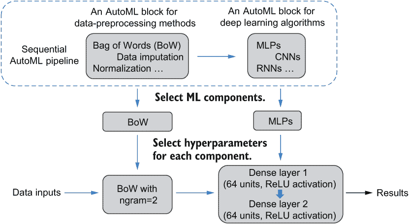

图 5.1 使用序列 AutoML 管道实例化深度学习管道

这可以被视为一个双层搜索空间，因为在每次迭代中，搜索算法首先选择要使用的模型类型和预处理方法，然后选择它们适当的超参数。如果我们只在管道中有一个关注的模型和一种处理方法，我们只需要执行一步选择适当的超参数。因此，我们可以将我们在实践中主要针对的 AutoML 问题分为以下两类：

+   *自动化超参数调整（一般定义）*—模型类型和预处理方法是固定的。我们只想调整管道中每个指定 ML 组件的超参数。在这种情况下，AutoML 管道中的 AutoML 模块将每个只包含一个 ML 模型或预处理方法。搜索空间将只包括每个固定组件的相关超参数。例如，假设我们想应用 MLP 来解决回归问题，并想调整模型超参数，如层数和单元数。在这种情况下，我们可以通过创建只包含 MLP 的 AutoML 算法模块来限制搜索空间。搜索空间将是 MLP 模型中可行的层数和单元数。

+   *自动化管道搜索*—在某些情况下，我们可能事先不知道应该采用哪种模型或数据准备方法。我们希望搜索不仅包括合适的模型和预处理方法，还包括它们的超参数。在这种情况下，一个或多个 AutoML 模块将包含多个组件。例如，我们可能想要探索 CNN 和 MLP 模型，看看哪一个更适合我们的任务，并为每个模型找到最佳的超参数。为此，我们可以为每个模型架构包含模块。预处理方法可以是固定的，也可以与模型一起选择和调整。

另一类 AutoML 问题，特别是对于服务浅层模型非常有用，是*自动化特征工程*。它的目的是自动发现基于某些特征选择标准（如第二章中介绍的皮尔逊相关系数）的有信息和判别性特征，以学习 ML 模型。自动化特征工程通常涉及一个迭代特征生成和特征选择过程，类似于手动特征工程的方式。由于深度学习算法具有在无需大量特征工程操作的情况下提取和学习的天然才能，因此让我们首先关注本章中深度学习算法及其数据准备方法的调整，然后在第六章中简要介绍自动化特征工程和浅层模型的调整。

在接下来的两节中，我们将探讨如何使用 AutoKeras 功能 API 创建一个顺序 AutoML 管道，以解决深度学习环境中的自动化超参数调整和自动化管道搜索。之后，我们将介绍将顺序 AutoML 管道扩展到更通用的图结构管道。除了使用 AutoKeras 的内置 AutoML 模块之外，你还将学习如何在本章的最后部分自定义自己的模块。

注意：AutoML 任务的分类可能比我们这里描述的更复杂，并且可能被分类为不同的类别。最广泛使用的分类方法包括自动数据预处理、自动特征工程、自动模型选择和自动超参数调整。

在这本书中，我们考虑了自动超参数调整的更广义定义，其中我们将机器学习模型类型和数据预处理方法视为特殊超参数。这将统一自动数据预处理、自动模型选择和自动超参数调整为一个类别：自动超参数调整，正如我们在前面的章节中所描述的。当然，我们也可以有自动管道调整，以调整整个机器学习工作流程，正如我们之前所介绍的。特别是，一些工作还明确地将选择和调整深度学习算法的子领域作为*自动深度学习*，考虑到设计神经网络架构的复杂性（或者我们称之为*神经架构搜索*）。

## 5.2 创建用于自动超参数调整的顺序 AutoML 管道

在本节中，我将向您展示如何创建一个 AutoML 管道以进行自动超参数调整。使用 AutoKeras 功能 API 创建 AutoML 管道与第三章中介绍的用 Keras 功能 API 构建神经网络非常相似。唯一的区别是 Keras 层被 AutoKeras 的内置 AutoML 块所取代。每个块包含一个或多个深度学习模型（或预处理方法）以及它们超参数的默认搜索空间。您还可以修改每个超参数的搜索空间。为了构建网络，我们通过按顺序连接它们的输入和输出堆叠多个 Keras 层。相应地，为了形成一个顺序 AutoML 管道，我们选择 AutoKeras 块并逐个连接它们，如图 5.2 所示。

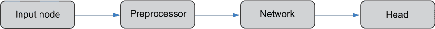

图 5.2 使用 AutoKeras 功能 API 创建的顺序 AutoML 管道

管道应该从一个表示数据类型（如图像或文本）的输入占位符开始，并以一个对应于我们想要解决的问题的任务（如分类或回归）的输出头结束。两个中间块是表征预处理方法和深度学习模型搜索空间的 AutoML 块。让我们更详细地看看管道中的组件（块），如下所述：

+   *输入节点*是管道张量输入的占位符，例如图像输入（ImageInput）、文本输入（TextInput）或结构化数据输入（StructuredDataInput）（如第四章所述）。您还可以使用 AutoKeras 中的 Input 类定义一个通用的张量输入。输入节点接受多种格式的数据，如 NumPy 数组、pandas DataFrame 和 TensorFlow 数据集。它还将自动执行某些预处理操作，例如，如果图像没有通道维度，则扩展图像的维度。输入节点没有可以设置或调整的超参数。

+   *预处理块*定义了在输入上执行额外的预处理操作（即如果如前所述，某些操作已经由输入节点执行），例如图像归一化、文本嵌入等。根据操作，我们可能有一些超参数需要调整，例如，如果执行文本嵌入，则用于将文本文档转换为它们的向量表示的词汇表的最大大小。在这个块中，没有通过反向传播训练的权重。

+   *网络块*是 AutoKeras 中最重要的一种 AutoML 块。每个块代表一组具有相同结构的神经网络模型。例如，在本节中您将看到的 ConvBlock，包含一组卷积神经网络（CNNs）。每个 CNN 由卷积层和池化层组成。层数和类型被视为超参数。您可以选择一个或多个网络块来创建基于当前任务的管道，并根据您的需求指定其超参数的搜索空间。与预处理块不同，在指定网络块中的超参数后，将通过网络反向传播训练权重。

+   *输出头*是一个用于生成最终输出的特定任务组件，例如在第四章讨论 IO API 时引入的分类头（ClassificationHead）和回归头（RegressionHead）。它将每个实例的表示重塑为向量，并应用密集层将其转换为目标输出的大小。例如，如果头是分类头且问题是多类分类问题，那么从密集层输出的每个实例将是一个长度为 10 的向量，对应于十个标签。每个头还指定了损失函数和度量标准，以帮助编译从搜索空间中选择的每个深度学习管道进行训练。

在本节的其余部分，我们将通过使用顺序 AutoML 管道，逐步介绍两个超参数调整示例。这些示例还将介绍 AutoKeras 中可以用于创建 AutoML 管道的几个内置 AutoML 块。

### 5.2.1 调整结构化数据回归的 MLP

我们的首要任务是调整一个多层感知器（MLP）的网络结构，以解决结构化数据的回归问题。在第三章中，我们通过使用 Keras 创建了一个 MLP 来解决加利福尼亚房价预测问题。我们在训练过程中通过观察训练集和验证集的均方误差（MSE）曲线来调整训练的轮数。在这里，我们将使用自动机器学习（AutoML）来调整 MLP 的结构超参数：层数和每层的单元数。一个直观的方法是创建多个具有不同层数和单元数的 MLP，对它们进行训练，并根据验证集的 MSE 选择最佳的一个。这个过程可以通过创建一个顺序的 AutoML 管道来完成，而不需要手动创建和探索多个 MLP。

要创建 AutoML 管道，我们可以利用 AutoKeras 的两个内置 AutoML 模块，如下所示：

+   归一化是一个预处理块，它通过减去特征的平均值并除以它们的标准差来执行特征归一化。我们在第三章中使用这个操作来归一化加利福尼亚房价数据的特征。这个块有助于预处理 MLP 的数据。它不包含任何需要调整的超参数。

+   DenseBlock 是一个网络块，它形成了一个具有 MLP 结构的模型搜索空间。与最简单的 MLP 不同，它只堆叠了具有特定激活函数的密集层，DenseBlock 中的每个“层”（或*单元*）是三个 Keras 层的组合：一个密集层、一个 dropout 层以帮助减轻过拟合问题，以及一个*批归一化层*，该层将一批实例的输入张量归一化到均值为 0 和标准差为 1。批归一化层被添加在一个没有激活函数的密集层和一个 ReLU 激活层之间。是否使用批归一化层是一个需要调整的超参数。dropout 层被添加在最后（如图 5.3 所示）。密集层的数量、每个密集层的单元数以及 dropout 率（范围从 0 到 1）也是在这个块中需要调整的超参数，除非它们被固定。层数的默认选择范围在 1 到 3 之间，单元数的默认选择列表为[16, 32, 64, 128, 256, 512, 1024]。

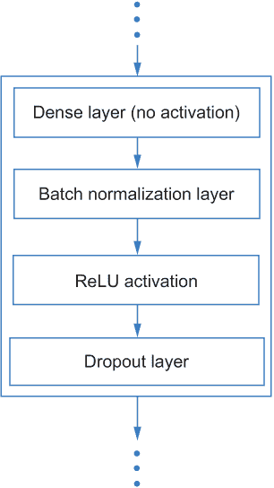

图 5.3 DenseBlock 中的一个单元

如列表 5.1 所示，我们将两个块堆叠起来形成一个结构化数据回归管道，其结构如图 5.2 所示。我们将使用此管道来寻找加利福尼亚房价预测问题的良好 MLP 结构。输出头被定义为 RegressionHead，它通过对其输入应用线性变换来生成最终预测。默认情况下，输出头中在最终线性变换之前存在一个 dropout 层。我们通过将 dropout 率固定为 0 来简化它。我们还通过将 use_batchnorm 参数设置为 False 来移除批归一化层。除了 DenseBlock 中的两个超参数（层数和单元数）之外，搜索空间还包含两个优化算法的超参数，即算法的类型和学习率。通过将它们与 MLP 结构联合调整，我们可以为不同的管道实现更精确的性能，这使得我们更容易比较和选择它们。最后一行将试验次数设置为 10，这意味着我们从搜索空间中选择总共 10 个不同的管道，并从中选择最佳的一个。

列表 5.1 使用 MLP 为结构化数据回归创建 AutoML 管道

```
input_node = ak.StructuredDataInput()                       ❶
output_node = ak.Normalization()(input_node)                ❷
output_node = ak.DenseBlock(use_batchnorm=False,
                            dropout=0.0)(output_node)       ❸
output_node = ak.RegressionHead(dropout=0.0)(output_node)   ❹
auto_model = ak.AutoModel(inputs=input_node,
                          outputs=output_node,
                          max_trials=10)                    ❺
```

❶ 为结构化数据创建输入占位符

❷ 在输入节点上方堆叠一个归一化预处理块

❸ 添加用于调整 MLP 结构的 AutoML 块

❹ 在管道末尾添加回归输出头

❺ 形成 AutoML 管道并定义搜索试验次数

现在我们使用 scikit-learn 加载数据，并通过将其输入到其中（如列表 5.2 所示）来进行搜索过程。批大小和训练的最大轮数分别固定为 1,024 和 150，以帮助减少搜索时间。一般来说，较大的批大小和较少的轮数将减少训练网络所需的时间。这是一种在 AutoML 工作中加速搜索速度的朴素方法——不能保证每个探索的管道都能在 150 个轮次内收敛——但我们假设这已经足够长，可以给出它们性能的指示，并允许我们区分它们。在第八章中还将介绍更多加速速度的方法，即使不利用每个管道的评估性能。

列表 5.2 调整 MLP 以进行结构化数据回归

```
import pandas as pd
from sklearn.datasets import fetch_california_housing
from sklearn.model_selection import train_test_split

house_dataset = fetch_california_housing()                            ❶

data = pd.DataFrame(house_dataset.data,
                    columns=house_dataset.feature_names)              ❶
target = pd.Series(house_dataset.target, name='MEDV')                 ❶

train_data, test_data, train_targets, test_targets = 
➥ train_test_split(data, target, test_size=0.2, random_state=42)     ❶

auto_model.fit(train_data, train_targets,
               batch_size=1024, epochs=150)                           ❷
```

❶ 加载数据集，将其打包到 pandas DataFrame 中，并分割出 20% 用于测试

❷ 使用数据拟合 AutoML 管道

如列表 5.3 所示，最佳 MLP 的最终测试 MSE 为 0.28——优于我们在第三章中设计的模型（MSE = 0.31）。我们可以使用 results_summary() 方法显示 MLP 的超参数；它有两个层，分别有 32 和 512 个单元。其在搜索过程中的验证 MSE 为 0.29。

列表 5.3 评估最佳深度学习管道

```
>>> test_loss, test_acc = auto_model.evaluate(test_data,
...                                           test_targets,
...                                           verbose=0)    ❶
>>> print('Test accuracy: ', test_acc)
Test accuracy:  0.2801434397697449
>>> auto_model.tuner.results_summary(num_trials=1)          ❷
Results summary
Results in ./auto_model
Showing 1 best trials
Objective(name='val_loss', direction='min')
Trial summary
Hyperparameters:
dense_block_1/num_layers: 2
dense_block_1/units_0: 32
dense_block_1/dropout: 0.0
dense_block_1/units_1: 512
regression_head_1/dropout: 0.0
optimizer: adam
learning_rate: 0.001
Score: 0.2891707420349121
>>> best_model = auto_model.export_model()                  ❸
>>> tf.keras.utils.plot_model(best_model,
...                           show_shapes=True,
...                           expand_nested=True)           ❹
```

❶ 评估最佳 MLP

❷ 总结搜索过程中的最佳试验

❸ 导出最佳 MLP

❹ 可视化最佳 MLP

由于导出的最佳模型是一个 Keras 模型，你可以像这里所示一样轻松地保存和加载你的最佳模型：

```
from tensorflow import keras
best_model.save('saved_model')
best_model = keras.models.load_model('saved_model')
```

我们导出最佳 MLP 并可视化其结构，如图 5.4 所示。它的每一层都可以与顺序 AutoML 管道中的相应组件相关联。例如，具有 ReLU 激活的两个密集层是从 DenseBlock 中定义的搜索空间中选择的。

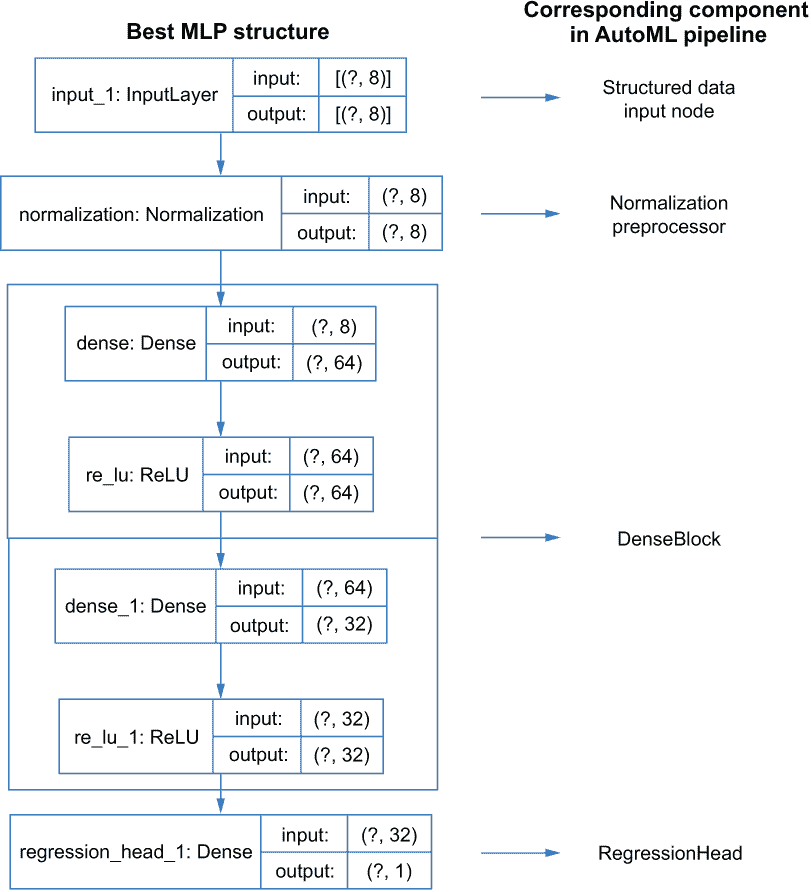

图 5.4 最佳发现的 MLP 结构和 AutoML 管道中的相应组件

由于我们使用默认的层数搜索空间([1, 2, 3])和 DenseBlock 中的单元数([16, 32, 64, 128, 256, 512, 1024])，因此不同的 MLP 结构总数为 7 + 7² + 7³ = 399。与我们所进行的 10 次试验相比，这是一个相当大的搜索空间，这意味着我们可能没有测试到许多可能性。如果我们考虑优化算法（默认有三种选择）和学习率（默认有六种选择），搜索空间将更大。并且通过扩展，通过仅测试 10 个选项，我们相对不太可能从所有可能性中找到最好的一个。为了帮助约束搜索空间，我们可以手动固定一些超参数或限制它们的范围。例如，我们可以借鉴过去调整 MLP 的经验来约束层数和单元数。以下是一些我们可以基于我们的更改的假设：

+   由于本例中的数据集较小，具有较少层的 MLP 应该有足够的容量来学习数据并避免过拟合。

+   具有三角形或菱形结构的 MLP 通常比具有矩形结构的 MLP 表现更好。以三层 MLP 为例，具有三角形结构的 MLP 中的单元可以是[32, 64, 128]或[128, 64, 32]。具有菱形和矩形结构的两个 MLP 分别可以有单元[32, 64, 32]和[32, 32, 32]。这些三种类型的结构的示意图如图 5.5 所示。

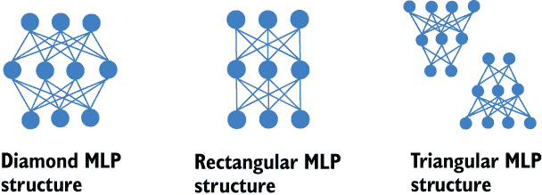

图 5.5 三种 MLP 结构

在这个例子中，我们可以将层数固定为两层，并将两个层的单元数限制为分别从[128, 256, 512, 1024]和[16, 32, 64]中选择。这将有助于形成一个倒三角形 MLP 结构的搜索空间。可以通过连接两个 DenseBlock 并定义每层的单元选择来实现这些约束，如列表 5.4 所示。KerasTuner 提供了一个超参数模块（简称 hp）来帮助创建连续和离散超参数的搜索空间。例如，由于单元数是一个离散超参数，我们可以使用模块中的 hyperparameters.Choice 类来指定该超参数的可能值的列表。你将在第六章中看到这个类在设计和自己的 AutoML 块时的更多用途。

列表 5.4 调整 MLP 的搜索空间

```
>>> from keras_tuner.engine import hyperparameters as hp

>>> input_node = ak.StructuredDataInput()
>>> output_node = ak.Normalization()(input_node)
>>> output_node = ak.DenseBlock(
...     num_layers=1, num_units=hp.Choice('num_units', 512, 1024]),     ❶
...     use_batchnorm=False,
...     dropout=0.0)(output_node)
>>> output_node = ak.DenseBlock(
...     num_layers=1, num_units=hp.Choice('num_units', [16, 32, 64]),   ❶
...     use_batchnorm=False,
...     dropout=0.0)(output_node)
>>> output_node = ak.RegressionHead()(output_node)
>>> auto_model = ak.AutoModel(inputs=input_node, outputs=output_node,
...                           max_trials=10, overwrite=True, seed=42)

>>> auto_model.fit(train_data, train_targets, batch_size=1024, epochs=150)

>>> test_loss, test_acc = auto_model.evaluate(
...     test_data, test_targets, verbose=0)
>>> print('Test accuracy: ', test_acc)
Test accuracy:  0.2712092995643616
```

❶ 在密集层中自定义单元超参数的搜索空间

新的搜索空间只有 12 种不同的 MLP 结构。我们使用类似的方法来搜索、检索和评估最佳的 MLP；这次，在 10 次试验中发现的最佳 MLP 在测试中达到了 0.27 的均方误差，这优于在更大搜索空间中发现的先前 MLP。 

注意：搜索空间的构建在 AutoML 的成功中起着至关重要的作用。一个好的搜索空间可以帮助你在更短的时间内发现一个有希望的管道。设计一个好的搜索空间甚至可能比设计一个好的搜索算法更重要，因为它提供了廉价的约束以加速搜索过程。然而，这通常需要先验知识以及对模型以及耦合的搜索算法的理解，这与 AutoML 的最终目标（节省人力）相悖。如果你没有先验知识可以依赖，你可以从一个大的搜索空间开始，并通过试错法逐渐减小其大小。这个想法也激励了一些高级 AutoML 算法，这些算法旨在逐步调整搜索空间或将其缩小到一个更精细的区域。我们将在第七章介绍一些代表性的例子。

现在你已经看到了如何调整 MLPs 以适应结构化数据回归任务，让我们看看另一个例子：调整 CNN 以适应图像分类任务。

### 5.2.2 调整 CNN 以进行图像分类

在这个例子中，我们将使用序列 AutoML 管道调整 CNN，以使用 MNIST 数据集解决图像分类问题。在第三章中，我们创建了一个 CNN，并展示了它在这一任务上的性能优于 MLP 网络。但我们没有探讨如何设置和调整 CNN 中的超参数，例如卷积层中的过滤器数量。现在，让我们构建一个 AutoML 管道来改进 CNN 结构，以实现更好的分类精度。

我们在 AutoKeras 中使用 ConvBlock 调整 CNN 的三个主要超参数：过滤器的数量、卷积层的数量以及卷积层的核大小。ConvBlock 按顺序堆叠多个*卷积块*（或*卷积单元*）。每个卷积块按顺序堆叠多个卷积层、一个最大池化层和一个 dropout 层（见图 5.6）。

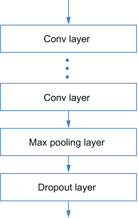

图 5.6 ConvBlock 中每个卷积块的结构

所有的卷积块都有相同数量的卷积层，但每一层可以包含不同数量的过滤器。ConvBlock 的搜索空间具有以下七个超参数：

+   *卷积块的数量*

+   *每个块中的卷积层数量*——这在所有卷积块中都是相同的。

+   *卷积层的类型*——每个卷积层可以是两种类型之一：它可以是一个常规的 2-D 卷积层，如第三章中介绍的那样，或者是一个*可分离卷积层*，它比常规卷积层包含更少的权重，但可能实现相当的性能。在下一节讨论 XceptionBlock 时，将提供关于此层类型的更详细解释。

+   *卷积层中的滤波器数量*——每个块的每个层的滤波器数量可能不同。

+   *卷积层的核大小*——最大池化层的核大小设置为核大小减一。一旦在试验中为 ConvBlock 选择核大小，它将应用于该 ConvBlock 中所有单元的所有池化层和卷积层。

+   *是否在每个单元中应用最大池化层*——一旦为试验选择，它将应用于 ConvBlock 中的每个单元。

+   *是否在每个单元中应用 dropout 层*——一旦为试验选择，它将应用于 ConvBlock 中的每个单元。

为了使这个例子简单，我们将通过将块的数量固定为两个来限制搜索空间，如列表 5.5 所示。我们不应用 dropout 层或使用可分离卷积层。要调整的超参数包括块中的层数、核大小以及每层的滤波器数量。默认情况下，它们分别从列表[1, 2]、[3, 5, 7]和[16, 32, 64, 128, 256, 512]中选择。不考虑优化器和学习率，在这个搜索空间中有 5,292 种不同的 CNN 结构。

注意：此代码示例可能需要很长时间才能运行。

列表 5.5 使用 AutoKeras 功能 API 进行 MNIST 分类

```
>>> import autokeras as ak
>>> from tensorflow.keras.datasets import mnist

>>> (x_train, y_train), (x_test, y_test) = 
➥ mnist.load_data()                                                      ❶

>>> input_node = ak.ImageInput()                                          ❷
>>> output_node = ak.Normalization()(input_node)                          ❸
>>> output_node = ak.ConvBlock(
...     num_blocks=2,
...     max_pooling=True,
...     separable=False,
...     dropout=0.0)(output_node)                                         ❹
>>> output_node = ak.ClassificationHead(dropout=0.0)(output_node)         ❺

>>> auto_model = ak.AutoModel(
...     inputs=input_node,
...     outputs=output_node,
...     max_trials=10,
...     overwrite=True,
...     seed=42)                                                          ❻

>>> auto_model.fit(x_train, y_train, epochs=3)                            ❼
>>> test_loss, test_acc = auto_model.evaluate(x_test, y_test, verbose=0)  ❽
>>> print('Test accuracy: ', test_acc)
Test accuracy:  0.9937999844551086

>>> best_model = auto_model.export_model()                                ❾
>>> best_model.summary()                                                  ❾
Model: 'functional_1'
_________________________________________________________________
Layer (type)                 Output Shape              Param #
=================================================================
input_1 (InputLayer)         [(None, 28, 28)]          0
_________________________________________________________________
cast_to_float32 (CastToFloat (None, 28, 28)            0
_________________________________________________________________
expand_last_dim (ExpandLastD (None, 28, 28, 1)         0
_________________________________________________________________
normalization (Normalization (None, 28, 28, 1)         3
_________________________________________________________________
conv2d (Conv2D)              (None, 24, 24, 128)       3328
_________________________________________________________________
conv2d_1 (Conv2D)            (None, 20, 20, 16)        51216
_________________________________________________________________
max_pooling2d (MaxPooling2D) (None, 5, 5, 16)          0
_________________________________________________________________
conv2d_2 (Conv2D)            (None, 5, 5, 16)          6416
_________________________________________________________________
conv2d_3 (Conv2D)            (None, 5, 5, 512)         205312
_________________________________________________________________
max_pooling2d_1 (MaxPooling2 (None, 2, 2, 512)         0
_________________________________________________________________
flatten (Flatten)            (None, 2048)              0
_________________________________________________________________
dense (Dense)                (None, 10)                20490
_________________________________________________________________
classification_head_1 (Softm (None, 10)                0
=================================================================
Total params: 286,765
Trainable params: 286,762
Nontrainable params: 3
_________________________________________________________________
```

❶ 加载 MNIST 数据

❷ 创建输入节点

❸ 添加一个归一化预处理块

❹ 将 ConvBlock 堆叠以创建 CNN 的搜索空间

❺ 使用分类头最终确定管道

❻ 将管道封装为 AutoModel

❼ 通过将训练数据拟合到管道来执行搜索过程

❽ 在测试集上评估最佳卷积神经网络

❾ 导出最佳卷积神经网络并打印其结构

最佳卷积神经网络在测试集上实现了 99.38%的准确率，这降低了我们在第三章中手动设计的 CNN 的错误率超过 30%。然而，网络的尺寸更大，主要是由于滤波器数量众多。为了发现更小的架构，我们可以限制搜索空间中的层数和滤波器数量。有可能找到具有与这里构建的 CNN 相当性能的更小架构；我将把这个作为练习留给你尝试。

## 5.3 使用超块进行自动管道搜索

在本节中，我们将讨论 AutoML 应用中经常遇到的另一个场景：选择在深度学习管道中使用最佳类型的组件（模型或预处理程序）。这比上一节中仅调整特定类型模型的超参数更为复杂，因为不同的模型和预处理程序可能包含不同的操作和独特的超参数。它要求我们共同选择预处理程序和模型的组合及其耦合的超参数。例如，在图像分类中，除了我们之前使用的原始 CNN 之外，还提出了许多高级模型，如 ResNet、Xception 等。即使你已经听说过这些模型，你可能也不知道它们是如何工作的，它们最适合哪些任务，或者如何调整它们。你还需要决定合适的预处理方法，例如选择是否使用归一化。在这里，我们将通过一些图像分类示例来展示如何自动选择模型和预处理方法。

### 5.3.1 图像分类的自动模型选择

第三章中介绍的 CNN 模型，它递归地堆叠卷积和池化层，是最简单的 CNN 架构，通常称为*普通 CNN*。现有工作提出了多种高级变体，试图提高 CNN 的运行性能和准确性。其中最强大的两种是 ResNet（残差网络）¹和 Xception²架构。由于没有模型在所有情况下都表现最佳，因此根据任务和手头的数据集选择模型及其超参数非常重要。我们将首先查看这两个模型及其超参数的调整方法，然后我会向你展示如何使用 AutoML 管道进行联合模型选择和超参数调整。

ResNet

在 ResNet 中，多个小的神经网络块（或细胞）被堆叠在一起以构建一个完整的神经网络。其块结构类似于 AutoKeras 的 ConvBlock 中的卷积块，但增加了一种特殊连接，称为*跳跃连接*，它以逐元素的方式将块的输入张量添加到其输出张量中（见图 5.7）。确保有效的跳跃连接，细胞的输入和输出大小应该相同。加法的结果将作为下一个细胞的输入张量。这对于构建更深的网络是有帮助的，因为它避免了*梯度消失*的问题，在反向传播过程中，由于使用链式法则计算复合层变换的导数，第一层的权重更新梯度变得越来越小。这些“消失”的梯度无法更新早期层的权重，这阻碍了更深网络的形成。你可以在 Chollet 的《Python 深度学习》一书中了解更多相关信息。

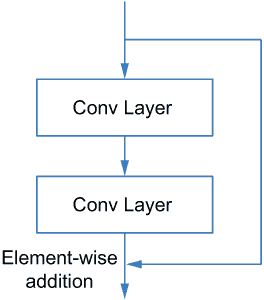

图 5.7 ResNet 的子结构

我们可以创建具有不同细胞结构或不同数量细胞的多种 ResNet。一些传统架构包括 ResNet-18 和 ResNet-50，其中名称中的数字表示从所有堆叠细胞中累积的总层数。为了实现 ResNet 并调整其结构，我们可以使用 AutoKeras 内置的 ResNetBlock 构建一个顺序 AutoML 流程，如下所示。ResNetBlock 包含经典 ResNet 结构的搜索空间，这些结构是预定义的，并包含在 Keras API 中 ([`keras.io/api/applications/resnet/`](https://keras.io/api/applications/resnet/))。

列表 5.6 创建用于图像分类的 ResNet AutoML 流程

```
input_node = ak.ImageInput()
output_node = ak.Normalization()(input_node)
output_node = ak.ResNetBlock()(output_node)
output_node = ak.ClassificationHead()(output_node)
```

Xception

Xception 是一种使用可分离卷积层来提高网络性能的 CNN 架构。正如在前面关于 ConvBlock 的简短讨论中提到的，可分离卷积层比常规卷积层包含更少的权重，但在许多任务上能够实现可比的性能。它使用来自两个可分离层的权重生成常规卷积层的滤波器（权重），然后像标准卷积层一样使用其生成的滤波器。以下列表显示了这是如何工作的。我们使用一个 3×3 大小的 2-D 平方权重矩阵和一个长度为 16 的向量，通过张量积生成一个 3×3×16 大小的常规 3-D 卷积滤波器。

列表 5.7 使用可分离卷积层生成权重

```
import numpy as np
kernel_size = 3
num_filters = 16

sep_conv_weight_1 = np.random.rand(kernel_size,
                                   kernel_size)                 ❶

sep_conv_weight_2 = np.random.rand(num_filters)                 ❷

sep_conv_filters = np.zeros(shape=(kernel_size,
                                   kernel_size,
                                   num_filters))                ❸

for i in range(kernel_size):
    for j in range(kernel_size):
        for k in range(num_filters):
            sep_conv_filters[i][j][k] = sep_conv_weight_1[i][j] 
➥ * sep_conv_weight_2[k]                                        ❹
```

❶ 初始化一个变量来表示我们要带来的内容。

❷ 可分离卷积层的权重向量

❸ 使用卷积层的权重初始化一个数组

❹ 使用张量积计算卷积层的权重

如图 5.8 所示，Xception 使用两种类型的神经网络细胞。它们与 ResNet 细胞相似，但具有可分离卷积层。第一种类型的细胞使用一个核大小等于 1 的卷积层来处理输入，然后再将其添加到可分离卷积层的输出中。

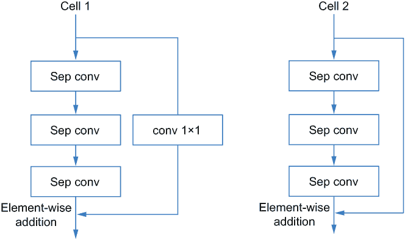

图 5.8 两种类型的 Xception 细胞

原始的 Xception 架构如图 5.9 所示。它包含开头的常规卷积层，中间的不同类型细胞，以及末尾的一些可分离卷积层。通过堆叠不同数量的细胞或选择不同的超参数，如层的滤波器数量或核大小，可以生成 Xception 架构的不同变体。

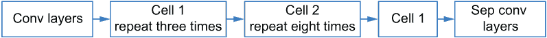

图 5.9 Xception 架构

我们可以使用 AutoKeras 中的 XceptionBlock 来帮助构建一个 AutoML 管道，以搜索一个好的 Xception 结构，如下一列表所示。它涵盖了 Chollet 描述的原版 Xception 架构([`arxiv.org/abs/1610.02357`](https://arxiv.org/abs/1610.02357))以及 TensorFlow Keras API 中包含的许多变体([`keras.io/api/applications/xception/`](https://keras.io/api/applications/xception/))。

列表 5.8 创建用于图像分类的 Xception AutoML 管道

```
input_node = ak.ImageInput()
output_node = ak.Normalization()(input_node)
output_node = ak.XceptionBlock()(output_node)
output_node = ak.ClassificationHead()(output_node)
```

除了 ResNet 和 Xception 之外，还有许多其他基于普通 CNN 的流行变体。我建议您根据自己的兴趣探索可用的模型。对于实际应用，您可以直接应用 AutoML 管道，以节省学习它们的工作原理和调整它们所花费的努力。

图像分类的联合模型选择和超参数调整

“没有免费午餐”定理³告诉我们，没有任何一个模型在任何情况下都是最佳选择。“我应该为我的任务使用哪种机器学习模型？”是一个常见的问题。因为我们知道如何设计一个 AutoML 管道来调整特定类型的模型，例如一个普通的卷积神经网络（CNN），一个直接的选择是逐一调整不同类型的模型，为每个模型找到最佳的超参数集，并从中选择表现最好的一个。这是一个可行的解决方案，但它并不优雅，因为它需要我们创建多个 AutoML 管道。我们期望能够创建一个单一的 AutoML 管道，一步解决问题。这要求 AutoML 管道涵盖所有相关的模型类型以及它们独特的超参数。在每次搜索尝试中，搜索算法可以先选择一个模型，然后选择其超参数来生成一个管道。我们可以使用 AutoKeras 中的 ImageBlock 来实现这样的 AutoML 管道（见图 5.10），它是一种“超块”，将几个低级 AutoML 块组合在一起：ConvBlock、ResNetBlock 和 XceptionBlock。您可以使用 block_type 超参数来选择要使用的块类型，或者如果未指定，它将自动调整。它还包括归一化和图像增强预处理块（我们将在下一节中更多地讨论预处理方法）。

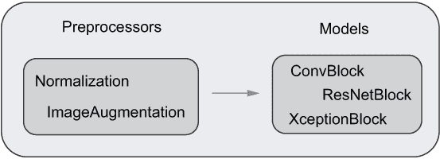

图 5.10 AutoKeras 中的 ImageBlock

搜索空间中的模型数量相当大，因为它包括了所有包含的块类型。通常需要许多搜索试验才能找到一个好的模型。此外，一些模型，如 ResNet-152，比我们之前设计的 vanilla CNN 大得多。这些模型可能需要更多的训练 epoch 来达到良好的准确率，并确保公平的比较和选择。这两个因素都导致了更长的搜索过程。此外，大模型的大小在搜索过程中会导致内存消耗增加，这可能会阻止我们使用大型数据集或批次大小（为了减少搜索成本）。这些都是 AutoML 研究和应用中的关键障碍。我们在这里不会深入探讨这些问题，而是将使用少量搜索试验和训练 epoch 作为一种变通方法来帮助您了解模型选择过程。我们将在第八章中更多地讨论如何加速搜索过程并减少内存消耗。

在列表 5.9 中，我们实现了一个 AutoML 管道，用于选择一个合适的模型（vanilla CNN、ResNet 或 Xception）用于在 MNIST 数据集上进行图像分类。我们进行了 10 次试验。每个模型使用 32 个批次的默认大小（AutoKeras 的默认批次大小）进行训练，共三个 epoch。如果批次大小过大，AutoKeras 会自动将其减小以避免内存溢出。

列表 5.9 使用 ImageBlock 选择图像分类模型

```
>>> import timeit
>>> import autokeras as ak

>>> input_node = ak.ImageInput()
>>> output_node = ak.ImageBlock(
...     normalize=True,                                  ❶
...     augment=False,                                   ❶
...     )(input_node)
>>> output_node = ak.ClassificationHead(dropout=0.0)(output_node)
>>> auto_model = ak.AutoModel(
...     inputs=input_node,
...     outputs=output_node,
...     max_trials=10,
...     overwrite=True,
...     seed=42)

>>> start_time = timeit.default_timer()                  ❷
>>> auto_model.fit(x_train, y_train, epochs=3,
...                batch_size=32)                        ❷
>>> stop_time = timeit.default_timer()                   ❷
>>> print(f'total time: {round(stop_time - start_time, 2)} seconds.')
Total time: 4008.61 seconds.

>>> auto_model.tuner.results_summary(num_trials=1)       ❸
Results summary
Results in ./auto_model
Showing 1 best trials
Objective(name='val_loss', direction='min')
Trial summary
Hyperparameters:
image_block_1/block_type: xception
classification_head_1/spatial_reduction_1/reduction_type: global_avg
optimizer: adam
learning_rate: 0.001
image_block_1/xception_block_1/pretrained: False
image_block_1/xception_block_1/imagenet_size: False
Score: 0.06062331795692444
>>> test_loss, test_acc = auto_model.evaluate(x_test,
...     y_test,
...     verbose=0)                                       ❹
>>> print('Accuracy: {accuracy}%'.format(accuracy=round(test_acc*100,2)))
Accuracy: 98.57%
```

❶ 修复包含在 ImageBlock 中的两个预处理块

❷ 执行搜索并标记总时间

❸ 总结最佳找到的管道

❹ 评估最佳模型

从搜索结果中我们可以看到，在一个单独的 GPU（NVIDIA 2080 Titan）上完成 10 次试验需要超过一个小时，这非常长。最佳模型是一个 Xception 模型，但其性能并不如我们之前使用相同数量的搜索试验和相同的模型训练设置找到的带有 ConvBlock 的 vanilla CNN。这表明，虽然扩大搜索空间可以让我们从不同的模型中进行选择，但它可能需要更多的资源，例如使用更多试验的更多搜索时间或更多计算资源，来找到一个好的架构。尽管它可以节省调优的努力，但 AutoML 的便利性和其成本之间的权衡绝不能被忽视，并且仍然是 AutoML 领域的一个活跃的研究领域。

### 5.3.2 自动选择图像预处理方法

除了模型选择之外，我们还可能想要选择合适的数据预处理方法，以更好地为我们的模型准备数据并提高它们的性能。例如，在深度学习应用中，处理小型数据集是一种常见情况。从不足的训练数据中学习可能会引入过拟合的高风险，尤其是在我们有一个较大的模型时，导致模型对新数据泛化不良。这个问题可以通过以下两种主要方法来缓解：

+   在模型或学习算法方面，我们可以使用一种称为**正则化**的技术。我们已经看到了一些例子，例如使用 dropout 层，通过减少层数或神经元数量来限制模型大小，以及使用更少的训练轮次。

+   在数据方面，我们可能能够收集更多数据或使用**数据增强**方法来调整现有数据集中的实例，以生成新的实例。数据增强为 ML 模型提供了更大的实例池来学习，这可以提高它们的性能。例如，对于图像数据集，每个图像在传递到神经网络之前可能会水平翻转或旋转一定角度。我们可以使用许多此类操作来调整图像，并且我们可以随机对不同的图像应用不同的操作以实现更多样化的训练数据。在不同的轮次中，我们也可以对同一图像应用不同的操作。在图 5.11 中，你可以看到以这种方式生成的某些图像。第一幅是原始图像，其他九幅图像都是使用数据增强技术生成的。正如你所见，内容始终相同，但大小、位置等已经发生了变化。


图 5.11 图像增强

由于许多正则化技术都与模型结构的选择相关，因此在前几节中介绍的 AutoML 方法已经能够发现其中的一些，以减轻过拟合的问题。实际上，将 AutoML 管道扩展以调整和选择合适的数据增强方法也很简单——即使用 AutoML 模块来选择和评估各种数据增强方法。ImageBlock 还允许我们在多种数据预处理方法中进行选择，例如决定是否使用归一化和/或数据增强方法来准备数据。

让我们用一个图像分类示例来说明如何自动选择 ResNet 模型的预处理方法。我们决定是否使用数据增强和归一化方法。我们在 5.10 列表中使用的数据集是 CIFAR-10 数据集的一个子集，包含 60,000 张 32×32×3 大小的 RGB 图像。训练集中的 50,000 张图像属于 10 个类别，例如“鸟”、“猫”、“狗”等（每个类别 5,000 张图像）。为了简化问题，我们将只使用两个类别的图像，“飞机”和“汽车”。子采样数据集的前九张图像在图 5.12 中进行了可视化。

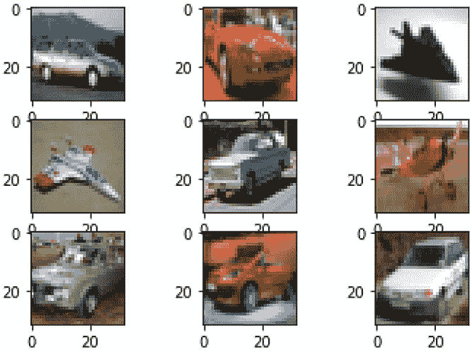

图 5.12 CIFAR-10 数据集中“飞机”和“汽车”类的前九张图像

列表 5.10 加载和可视化 CIFAR-10 数据集的子集

```
>>> from tensorflow.keras.datasets import cifar10
>>> (x_train, y_train), (x_test, y_test) = 
➥ cifar10.load_data()                                      ❶

>>> airplane_automobile_indices_train = \                   ❷
...     (y_train[:, 0]==0) | (y_train[:, 0]==1)             ❷
>>> airplane_automobile_indices_test = \                    ❷
...     (y_test[:, 0]==0) | (y_test[:, 0]==1)               ❷
>>> x_train = x_train[airplane_automobile_indices_train]    ❷
>>> y_train = y_train[airplane_automobile_indices_train]    ❷
>>> x_test = x_test[airplane_automobile_indices_test]       ❷
>>> y_test = y_test[airplane_automobile_indices_test]       ❷
>>> print('Training image shape:', x_train.shape)
>>> print('Training label shape:', y_train.shape)
>>> print('First five training labels:', y_train[:5])
Training image shape: (10000, 32, 32, 3)
Training label shape: (10000, 1)
First five training labels: [[1]
 [1]
 [0]
 [0]
 [1]]

>>> from matplotlib import pyplot as plt
>>> for i in range(9):                                      ❸
...     plt.subplot(330 + 1 + i)                            ❸
...     plt.imshow(x_train[i])                              ❸
>>> plt.show()                                              ❸
```

❶ 加载 CIFAR-10 数据集

❷ 选择属于“飞机”和“汽车”类别的图像

❸ 绘制前九张图像

让我们首先创建一个 AutoML 管道来选择 ResNet 模型的数据增强方法。该管道的结构与我们在上一节中为调整单个 ResNet 模型所构建的顺序 AutoML 管道相同。唯一的区别是我们将一个 ImageAugmentation AutoML 模块添加到归一化预处理模块和网络模块之间，如列表 5.11 所示。AutoKeras 中的 ImageAugmentation 模块没有通过反向传播更新的参数，但它包含多个可以与管道中的其他超参数一起联合选择的图像变换操作。我们固定 ResNet 的类型以缩小搜索空间。'v2'在这里表示版本 2 的搜索空间，包括三种 ResNet 结构。⁴ 增强方法将与结构和其他超参数（如优化方法和学习率）一起选择。

注意：此代码示例可能需要很长时间才能运行。

列表 5.11 选择 ResNet 模型的图像预处理方法

```
input_node = ak.ImageInput()
output_node = ak.Normalization()(input_node)
output_node = ak.ImageAugmentation()(output_node)
output_node = ak.ResNetBlock(version='v2')(output_node)
output_node = ak.ClassificationHead(dropout=0.0)(output_node)
auto_model = ak.AutoModel(
    inputs=input_node,
    outputs=output_node,
    overwrite=True,
    max_trials=10)
auto_model.fit(x_train, y_train, epochs=10)
```

如前所述，AutoKeras 中的图像超模块（ImageBlock）也包含预处理方法，因此我们可以用它来选择数据增强方法。如果我们设置 normalize 参数为 None，它还可以决定是否使用归一化，如下面的列表所示。将 normalize 设置为 True（或 False）将确定我们想要使用（或不想使用）归一化方法。

注意：此代码示例可能需要很长时间才能运行。

列表 5.12 选择 ResNet 模型的增强和归一化方法

```
input_node = ak.ImageInput()
output_node = ak.ImageBlock(

    normalize=None,           ❶
    augment=None,             ❶

    block_type='resnet',      ❷
    )(input_node)
output_node = ak.ClassificationHead(dropout=0.0)(output_node)
auto_model = ak.AutoModel(
    inputs=input_node,
    outputs=output_node,
    overwrite=True,
    max_trials=10)
auto_model.fit(x_train, y_train, epochs=10)
```

❶ 不指定是否要使用归一化和数据增强方法；让它们自动搜索

❷ 只搜索 ResNet 架构

因为搜索和模型评估过程与前面介绍的所有示例相同，所以我们在此不再重复。

你现在知道了如何使用 AutoML 管道对一个单一类型的模型进行超参数调整，以及如何使用 ImageBlock 进行模型选择。尽管我们以图像分类任务为例，但这个过程可以推广到文本和结构化数据用例。例如，为了联合选择文本或结构化数据分类或回归任务中的模型和预处理程序，你可以在 AutoKeras 中使用 TextBlock 或 StructuredDataBlock 来创建 AutoML 管道，并将输入节点从 ImageInput 更改为 TextInput 或 StructuredDataInput。TextBlock 和 StructuredDataBlock 都涵盖了相应数据类型的某些代表性模型和预处理程序。有关这些和其他 AutoML 块更详细的信息，请参阅[`autokeras.com/tutorial/overview/`](https://autokeras.com/tutorial/overview/)。对于实际应用，你可以选择与你想调整或选择的神经网络类型相关的选项，并使用超参数的默认搜索空间来创建你的 AutoML 管道，或者根据你的需求自定义超参数。在下一节中，我们将转向一个稍微复杂一些的用例：设计超出仅仅顺序堆叠块的图结构化 AutoML 管道。

## 5.4 设计图结构化的 AutoML 管道

在许多应用中，我们的需求超出了顺序深度学习模型（顺序堆叠层）。例如，对于多输入和多输出分类问题，我们可能需要为不同的输入使用不同的层和预处理组件，并创建不同的头部来生成不同的输出。我们可能需要在将图像输入到 ResNet 模型之前使用归一化方法对图像进行预处理，并在将具有分类特征的结构化数据输入到 MLPs 之前将其编码为数值。然后我们可以合并来自模型的输出以生成针对不同目标的输出。在其他情况下，我们可能希望利用多个深度学习模型的组合力量，例如使用 ResNet 和 Xception 网络一起进行图像分类。不同的模型可以从数据中学习不同的特征表示，并且结合这些表示可能会增强它们的预测能力。在这些场景中调整模型需要超出顺序管道到*图结构化* *管道*，其中每个块可以从多个块接收输入（见图 5.13）。该管道是一个*有向无环图*（DAG），其中的节点是上一节中引入的 AutoML 块。它们的顺序表示块之间的输入/输出连接，这也表示了数据流。


图 5.13 图结构化的 AutoML 管道

在本节中，我们将简要介绍如何通过创建图结构管道来调整具有多个输入和输出的模型。我们想要调整的模型具有交叉结构，如图 5.13 左侧所示。我们将首先创建一个与第四章中使用的类似的合成数据集，其中包含合成图像和结构化数据。我们有两个目标：一个分类目标和回归响应。创建数据集的代码在列表 5.13 中给出。我们生成了 1,000 个合成实例，其中 800 个用于训练和验证，200 个保留用于测试。每个实例包含一个大小为 32×32×3 的图像和三个分类特征。输出包括一个分类标签（五个类别之一）和一个回归响应。

列表 5.13 创建具有多个输入和输出的合成数据集

```
>>> import numpy as np

>>> num_instances = 1000

>>> image_data = np.random.rand(num_instances, 32, 32, 3).astype(np.float32)❶
>>> image_train, image_test = image_data[:800], 
➥ image_data[800:]                                                         ❶

>>> structured_data = np.random.choice(
...     ['a', 'b', 'c', 'd', 'e'], size=(num_instances, 3))                 ❷
>>> structured_train, structured_test = 
➥ structured_data[:800], structured_data[800:]                             ❷

>>> classification_target = np.random.randint( 
...     5, size=num_instances)                                              ❸
>>> clf_target_train, clf_target_test = 
➥ classification_target[:800], classification_target[800:]                 ❸

>>> regression_target = np.random.rand(
...     num_instances, 1).astype(np.float32)                                ❹
>>> reg_target_train, reg_target_test = 
➥ regression_target[:800], regression_target[800:]                         ❹

>>> structured_train[:5]                                                    ❺
array([['b', 'b', 'e'],
       ['e', 'e', 'b'],
       ['c', 'c', 'c'],
       ['c', 'b', 'd'],
       ['c', 'c', 'a']], dtype='<U1')
```

❶ 生成图像数据

❷ 生成具有三个分类特征的结构化数据

❸ 为五个类别生成分类标签

❹ 生成回归目标

❺ 显示前五个实例的分类特征

管道的创建应遵循图中节点的拓扑顺序，这意味着我们应该遵循数据流——我们首先创建管道前端的 AutoML 块，以便它们的输出可以输入到后续出现的块中。你可以想象一个数据实例如何从输入到输出，以便逐个设置 AutoML 管道的块。图 5.13 左侧所示创建 AutoML 管道的代码在列表 5.14 中给出。在堆叠 AutoML 块以处理每种类型的数据后，两个分支的输出通过一个合并块组合起来以生成两个响应。如果它们的维度相同，该块将逐元素添加两个输出。否则，它将输入张量重塑为向量，然后进行连接。如果在初始化期间未指定，则将在搜索过程中调整要使用的特定合并操作。

列表 5.14 使用图结构 AutoML 管道调整模型

```
import autokeras as ak

input_node1 = ak.ImageInput()                        ❶
branch1 = ak.Normalization()(input_node1)            ❶
branch1 = ak.ConvBlock()(branch1)                    ❶

input_node2 = ak.StructuredDataInput()               ❷
branch2 = ak.CategoricalToNumerical()(input_node2)   ❷
branch2 = ak.DenseBlock()(branch2)                   ❷

merge_node = ak.Merge()([branch1, branch2])          ❸
output_node1 = ak.ClassificationHead()(merge_node)   ❸
output_node2 = ak.RegressionHead()(merge_node)       ❸

auto_model = ak.AutoModel(
    inputs=[input_node1, input_node2],
    outputs=[output_node1, output_node2],
    max_trials=3,
    overwrite=True,
    seed=42)                                         ❹

auto_model.fit(
    [image_train, structured_train],
    [clf_target_train, reg_target_train],
    epochs=3,
)                                                    ❺

best_model = auto_model.export_model()               ❻
tf.keras.utils.plot_model( 
    best_model,show_shapes=True, expand_nested=True) ❻
```

❶ 在图像分支中堆叠两个块

❷ 在结构化数据分支中堆叠两个块

❸ 合并两个块

❹ 生成具有多个输入和输出的图结构 AutoML 管道

❺ 将数据输入到 AutoML 管道中

❻ 绘制最佳模型

在三次试验中找到的最佳架构在图 5.14 中进行了可视化。我已经将发现的深度网络中的每个组件与 AutoML 管道中的相应元素进行了注释。它们的超参数被选用来形成 AutoML 块的搜索空间。例如，使用两个密集层来处理结构化数据，并且有两个卷积单元，每个单元包含两个卷积层和一个最大池化层来编码图像。

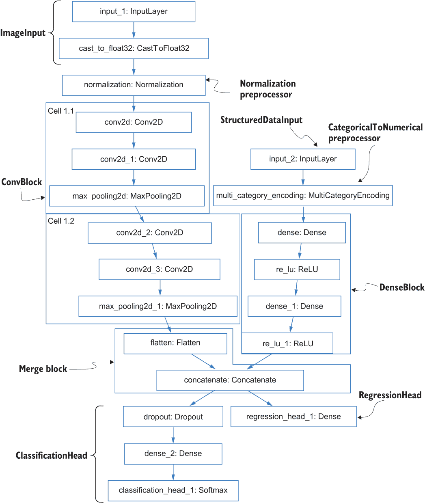

图 5.14 为具有多个输入和输出的任务识别的最佳模型

我们可以创建更复杂的图结构流水线来调整更复杂的架构，并且我们可以使用超块来帮助我们选择不同的模型。

虽然使用 AutoKeras 内置的块来创建这些流水线很方便，但你可能会发现它们并不能涵盖你了解的所有模型，或者无法支持你想要调整的所有超参数。这引发了一个问题：我们是否可以创建自己的 AutoML 块来选择和调整我们关心的神经网络或预处理方法？最后一节的目标是介绍如何自定义自己的 AutoML 块来构建 AutoML 流水线。

## 5.5 设计自定义 AutoML 块

使用 AutoKeras 的内置块可能并不总是能满足你的超参数调整和模型选择需求。可能存在数百甚至数千个神经网络超出了这些块定义的搜索空间范围。例如，假设你想调整你自己创建的或从文献中找到的用于图像分类的 CNN（卷积神经网络）。它不包含任何内置 AutoKeras 块的搜索空间中，包括 ConvBlock、ResNetBlock 等。你需要一个新的 AutoML 块，其搜索空间由与这个新的 CNN 模型具有相同结构但具有不同超参数（如不同数量的单元或层）的模型组成。有了这个新的 AutoML 块，你可以调整新神经网络的超参数，并将其与其他由现有 AutoKeras 块覆盖的模型进行比较。

本节将指导你如何创建自己的 AutoML 块来进行超参数调整和模型选择。我们将首先创建一个自定义块来调整 MLP（多层感知器）而无需使用内置的 MLP 块（DenseBlock）。然后我们将探讨如何自定义超块来进行模型选择。本节的目标不是教你如何设计高级神经网络，而是展示一种创建搜索空间（AutoML 块）的一般方法，这样你就可以在已知如何使用 TensorFlow 和 Keras 创建它们的情况下，从不同类型的神经网络中进行调整和选择。

### 5.5.1 使用自定义 MLP 块调整 MLP

在 5.2 节中，我们使用内置的 AutoKeras 块（DenseBlock）为回归任务选择了一个好的 MLP 结构。本节将向你展示如何自己实现一个 MLP 块以实现相同的目标。这将使你熟悉创建定义深度学习模型搜索空间的 AutoML 块的基本操作，并且可以推广到创建用于调整更复杂架构的 AutoML 块。

自定义用于调整单元数量的块

第三章向您展示了如何使用 TensorFlow 和 Keras 创建一个 MLP。我们从指定输入形状的输入节点开始。然后我们创建多个密集层并将它们按顺序逐层堆叠。最后，这些层被组合成一个 MLP 模型，通过 tensorflow.keras.Model 类（或我们之前使用的 tensorflow.keras.Sequential 类）进行训练和测试。列表 5.15 创建了一个三层 MLP，其两个隐藏层各有 32 个单元。我们忽略了模型编译的部分，只实现了模型结构的创建。调用 build 函数将返回一个具有此处定义结构的 MLP 模型。

列表 5.15 Keras 中的 MLP 实现

```
from tensorflow import keras
from tensorflow.keras import layers

def build_mlp():
    input_node = keras.Input(shape=(20,))                                  ❶

    output_node = layers.Dense(units=32, activation='relu')(input_node)    ❷
    output_node = layers.Dense(units=32, activation='relu')(output_node)   ❷
    output_node = layers.Dense(units=1, activation='sigmoid')(output_node) ❸

    model = keras.Model(input_node, output_node)                           ❹
    return model

mlp_model = build_mlp()
```

❶ 定义网络的输入维度

❷ 堆叠两个具有 32 个单元和 ReLU 激活的隐藏密集层

❸ 添加一个具有 sigmoid 激活的密集分类层

❹ 将层组合成一个 Keras 模型

假设我们想要调整两个隐藏层中的单元数。单元超参数应该是一个整数，因此为了创建一个有限的搜索空间，我们将假设其值为 32 的倍数且小于 512。这给我们提供了一个以下值的搜索空间：[32, 64, ..., 512]。为了创建一个定义此搜索空间的 AutoML 块，我们需要做三件事。首先，在列表 5.16 中，我们创建了一个扩展基本 AutoKeras Block 类的类（ak.Block）。我们将使用它来调整我们的 MLP，因此我们将它命名为 MlpBlock。扩展基本 Block 类确保我们可以使用定制的块通过将其与其他 AutoKeras 组件连接起来来创建一个 AutoML 管道。它包含一个要重写的 build()函数，这可以帮助我们在搜索过程中定义搜索空间并实例化 MLP 模型。

列表 5.16 调整具有两个隐藏层的 MLP 的单元数

```
import autokeras as ak              ❶

class MlpBlock(ak.Block):           ❷

    def build(self, ...):           ❸
        raise NotImplementedError
```

❶ 导入 autokeras 包以自定义 AutoML 块

❷ 开始实现一个扩展基本 AutoKeras Block 类的类

❸ 需要实现的函数

接下来，我们实现 build 函数。这是 AutoML 块的核心部分。它有两个作用：定义我们想要调整的超参数的搜索空间，并在搜索过程中每次被搜索算法调用时构建一个 MLP。实现它非常类似于编写一个构建 MLP 模型的函数（参见列表 5.15），但有以下主要变化：

+   因为这个 AutoML 块将与其他块连接起来形成一个 AutoML 管道，所以它应该接受一个或多个先前块的输出作为其输入，并输出一个张量，可以作为输入馈送到其他块，而不是一个完整的 Keras 模型进行训练和评估。

+   由于使用 AutoML 块来定义相关超参数的搜索空间，因此我们应该为每个想要调整的超参数定义一个搜索空间。这些超参数不会预先分配固定值，例如列表 5.15 中的 units=32，而是在每个搜索试验中动态地从搜索空间（由搜索算法）中分配一个值。

为了反映第一个变化，在列表 5.17 中，我们移除了 Keras 输入初始化器（keras.Input()）并直接将前一个 AutoML 块的输出节点（或张量）列表馈送到 build()函数。由于输入可以是张量列表，我们使用展平操作（tf.nest.flatten()）将它们组合成一个可以直接馈送到密集层的单个张量。我们只留下块中的两个隐藏层进行调整，并返回输出而不添加分类层或将其包装到 Keras 模型中。

列表 5.17 使用相同数量的单元调整两个隐藏层

```
import autokeras as ak
import tensorflow as tf
from tensorflow.keras import layers

class MlpBlock(ak.Block):                               ❶

  def build(self, hp, inputs):                          ❷

    input_node = tf.nest.flatten(inputs)[0]             ❸

    units = hp.Int(name='units', min_value=32,
                   max_value=512, step=32)              ❹

    output_node = layers.Dense(
        units=units, activation='relu')(input_node)     ❺
    output_node = layers.Dense(
        units=units, activation='relu')(output_node)    ❺

    return output_node                                  ❻
```

❶ 实现一个扩展 Block 类的类

❷ 覆盖构建函数

❸ 从输入中获取输入节点，这些输入可能是一个节点列表或单个节点

❹ 声明单元数量为一个整型超参数

❺ 两个层使用相同数量的单元

❻ build 函数的返回值应该是输出节点。

为了定义单元超参数的搜索空间并动态地为其分配值，我们使用 KerasTuner 中的一个模块，即 keras_tuner.engine.hyperparameters。它包含用于创建不同类型超参数（整数、浮点、布尔）的搜索空间的不同类，以及一个名为 HyperParameters（简称 hp）的容器，它包含有关所有相关超参数搜索空间的信息。hp 容器具有对应于不同搜索空间创建类的不同方法。例如，hp.Choice 方法对应于我们在第五章中使用的 keras_tuner.engine.hyperparameters.Choice 类。在这里，我们使用 hp.Int 为单元超参数定义一个整数值的搜索空间（参见列表 5.17 中的第四个注释）。它创建了一个值列表（[32, 64, ..., 512]），类似于 hp.Choice 方法，但更方便：您不需要逐个列出搜索空间中的每个值，但可以定义一个*步长值*来自动生成它们（本例中为 32，因为值是 32 的倍数）。max_value 和 min_value 参数限制了搜索空间的范围。name 参数为搜索空间中的超参数提供了一个参考。

在列表 5.18 中，我们假设两个隐藏层具有相同数量的单元。我们也可以分别调整每个隐藏层中的单元数量，如下面的列表所示。在这种情况下，我们为每个超参数分配不同的名称并将它们分配给相应的层。

列表 5.18 分别调整两个隐藏层中的单元数量

```
import autokeras as ak
import tensorflow as tf
from tensorflow.keras import layers

class MlpBlock(ak.Block):
  def build(self, hp, inputs):
    input_node = tf.nest.flatten(inputs)[0]
    units_1 = hp.Int(name='units_1', min_value=32,
                     max_value=512, step=32)          ❶
    units_2 = hp.Int(name='units_2', min_value=32,
                     max_value=512, step=32)          ❶
    output_node = layers.Dense(units=units_1,
        activation='relu')(input_node)                ❷
    output_node = layers.Dense(units=units_2,
        activation='relu')(output_node)               ❷
    return output_node
```

❶ 为每一层的单元数创建单独的搜索空间

❷ 将单元分配给相应的层

我们不在 build()函数中创建 hp 容器，而是将其作为输入传递给 build()函数。容器是所有 AutoML 块的全球容器。它扮演以下两个角色：

+   *搜索空间容器*—hp 容器包含每个 AutoML 块中创建的所有超参数搜索空间的信息。因此，一旦完整的 AutoML 管道被创建，它将包含整个管道的完整搜索空间细节。

+   *当前超参数值容器*—在搜索过程中，在每次试验中，容器将跟踪搜索算法提供的超参数值，并根据它们的名称将它们分配给每个块中相应的超参数。在这个例子中，hp 容器将提供由搜索算法选择的固定单元值，以帮助我们构建 MlpBlock 中的两个隐藏层。

虽然看起来我们在 build()函数中为每个超参数（如 units=hp.Int(...))分配了一个搜索空间，但在搜索过程中，该函数总是会创建具有固定超参数值的层。这些值默认设置或由搜索算法选择。这意味着当调用 hp.Int()方法时，它总是会返回一个固定值，搜索空间的定义保存在 hp 容器中。这也说明了为什么超参数的名称应该不同：这样容器在保存它们的搜索空间时可以区分它们，并在每次试验构建模型时将正确的值分配给它们。

为调整不同类型的超参数定制一个块

在上一个示例中，我们调整了一个整型超参数，但在 MLP 中可能存在许多不同类型的超参数。例如，是否应该使用 dropout 层（如第四章所述，有助于避免过拟合）可以被视为具有布尔（真/假）值的超参数。dropout 层中的 dropout 率是一个浮点值。调整不同类型超参数的关键点是选择正确的搜索空间创建方法。我们在表 5.1 中列出了几个示例。直观上，创建搜索空间的方法与超参数的值类型相符合。请记住，尽管 hp 容器方法，如 hp.Choice()和 hp.Int()定义了一个搜索空间，但它们总是会返回一个值。

表 5.1 MLP 模式中的不同超参数类型

| 超参数 | 类型 | 搜索空间示例 | 搜索空间创建方法 |
| --- | --- | --- | --- |
| 层中的单元数量 | 整数 | [10, 30, 100, 200] / [10, 20, 30, 40] | hp.Choice, hp.Int |
| 层数数量 | 整数 | [1, 2, 3, 4] | hp.Choice, hp.Int |
| 是否使用 dropout 层 | 布尔 | [True, False] | hp.Boolean |
| Dropout 率 | 浮点数 | 介于 0.1 和 0.2 之间的任何实数值 | hp.Float |

调整单个超参数很简单。但如果我们想同时搜索层数以及每层的单元数呢？这两个超参数相互依赖，因为层数决定了如果我们假设隐藏层可以有不同数量的单元，我们想要调整多少个“单元”超参数。我们可以使用 hp.Choice() 方法创建层数的搜索空间，如列表 5.19 所示。返回值将决定 MlpBlock 中将有多少层，并可用于 for 循环以帮助创建层并设置每层单元数的搜索空间。请注意，我们为每层的单元超参数使用不同的名称，以便在搜索算法中区分它们。

列表 5.19 选择层数和每层的单元数

```
import autokeras as ak
import tensorflow as tf
from tensorflow.keras import layers

class MlpBlock(ak.Block):
    def build(self, hp, inputs):
        output_node = tf.nest.flatten(inputs)[0]
        for i in range(hp.Choice('num_layers', [1, 2, 3])):    ❶
            output_node = layers.Dense(units=hp.Int(
                'units_' + str(i),                             ❷
                min_value=32,
                max_value=512,
                step=32),
            activation='relu')(output_node)
    return output_node
```

❶ 将层数定义为超参数

❷ 动态地为每一层生成一个新的超参数，同时确保超参数名称不重复

我们可以通过添加更多超参数来完善我们的 MlpBlock，如列表 5.20 所示。例如，是否使用 dropout 层在实践中值得探索。因为它是一个真或假的选项，我们可以使用 hp.Boolean() 来调整这个超参数。如前所述，我们还可以调整 dropout 率，这决定了在训练过程中要忽略的神经元百分比。这是一个浮点值，因此我们将使用 hp.Float() 来调整这个超参数。

列表 5.20 调整更多类型的超参数

```
import autokeras as ak
import tensorflow as tf
from tensorflow.keras import layers

class MlpBlock(ak.Block):
    def build(self, hp, inputs):
        output_node = tf.nest.flatten(inputs)[0]
        for i in range(hp.Choice('num_layers', [1, 2, 3])):
            output_node = layers.Dense(units=hp.Int('units_' + str(i),
                min_value=32,
                max_value=512,
                step=32),
            activation='relu')(output_node)
        if hp.Boolean('dropout'):                   ❶
            output_node = layers.Dropout(rate=hp.Float('dropout_rate',
                min_value=0,
                max_value=1))                       ❷
    return output_node
```

❶ 使用 hp.Boolean 来决定是否使用 dropout 层

❷ 使用 hp.Float 来决定 dropout 率

当使用 hp.Float() 时，请注意，我们没有像在 hp.Int() 中那样指定 step 参数。搜索算法将在连续范围内选择一个浮点值。

使用自定义块创建 AutoML 流程

现在你已经知道如何编写一个神经网络块来定义一个自定义的搜索空间。下一步是将它与其他组件（输入节点、输出头部和其他块）连接起来，以创建一个完整的 AutoML 流程来调整相关的超参数。

在连接之前确保块不包含实现错误，你可以编写一个简单的测试来查看它是否正确构建，如下一列表所示。输入可以是一个单一的 Keras 输入节点或节点列表。为了测试目的，创建了一个 hp 容器。你还可以在 build() 函数中插入一些打印语句（或断言）以打印出（或断言）一些中间输出，以便更好地测试块。

列表 5.21 测试神经网络块

```
import keras_tuner as kt
hp = kt.HyperParameters()
inputs = tf.keras.Input(shape=(20,))
MlpBlock().build(hp, inputs)
```

如果块的 build() 函数运行顺利且没有错误，我们可以像使用 AutoKeras 中第四章介绍的任何内置块一样使用这个块。让我们用它来调整一个用于结构化数据回归任务的 MLP，并使用合成数据集。在下面的列表中，我们首先随机生成一个包含 20 个特征、100 个训练实例和 100 个测试实例的表格数据集。然后，我们将 MlpBlock 与输入节点和输出回归头连接起来，创建一个完整的 AutoML 管道，并初始化 AutoModel 以在训练数据集上执行搜索过程。

列表 5.22 使用自定义块构建和拟合模型

```
>>> import numpy as np                                  ❶
>>> x_train = np.random.rand(100, 20)                   ❶
>>> y_train = np.random.rand(100, 1)                    ❶
>>> x_test = np.random.rand(100, 20)                    ❶

>>> input_node = ak.StructuredDataInput()
>>> output_node = MlpBlock()(input_node)                ❷
>>> output_node = ak.RegressionHead()(output_node)      ❸
>>> auto_model = ak.AutoModel(input_node, output_node,
...     max_trials=3, overwrite=True)
>>> auto_model.fit(x_train, y_train, epochs=1)
```

❶ 生成用于回归的合成结构化数据

❷ 将输入节点传递给自定义块

❸ 将自定义块的输出节点传递给回归头

我们还可以打印出创建的 AutoML 管道的搜索空间，如列表 5.23 所示。正如你所见，它包含七个超参数。其中四个是我们设计在 MlpBlock 中的：层数、单元数、是否使用 dropout 层以及 dropout 率（mlp_block_1/dropout_rate）。其余三个是回归头中的 dropout 率、优化算法以及优化算法的学习率。

列表 5.23 打印搜索空间的摘要

```
>>> auto_model.tuner.search_space_summary()
Search space summary
Default search space size: 7
mlp_block_1/num_layers (Choice)
{'default': 1, 'conditions': [], 'values': [1, 2, 3], 'ordered': True}
mlp_block_1/units_0 (Int)
{'default': None, 'conditions': [], 'min_value': 32, 
➥ 'max_value': 512, 'step': 32, 'sampling': None}
mlp_block_1/dropout (Boolean)
{'default': False, 'conditions': []}
regression_head_1/dropout (Choice)
{'default': 0, 'conditions': [], 'values': [0.0, 0.25, 0.5], 
➥ 'ordered': True}
optimizer (Choice)
{'default': 'adam', 'conditions': [], 'values': ['adam', 'sgd',
➥ 'adam_weight_decay'], 'ordered': False}
learning_rate (Choice)
{'default': 0.001, 'conditions': [], 'values': [0.1, 0.01, 0.001, 
➥ 0.0001, 2e-05, 1e-05], 'ordered': True}
mlp_block_1/dropout_rate (Float)
{'default': 0.0, 'conditions': [], 'min_value': 0.0, 'max_value': 1.0, 
➥ 'step': None, 'sampling': None}
```

设计 MLP 块的过程可以推广到设计用于调整任何可以直接用 Keras 层构建的神经网络架构的 AutoML 块。如果你满足以下两个条件，你可能想要创建一个自定义块来调整你的架构：

+   AutoKeras 中没有内置的块可以直接用来构建你的 AutoML 管道。

+   你知道如何通过堆叠 Keras 层来创建网络架构。

### 5.5.2 设计用于模型选择的超块

除了调整单个模型的超参数之外，你可能还想要实现一个用于模型选择的 AutoML 块。在本节中，你将学习如何实现自己的超块，就像我们在第四章中用于在不同模型之间进行选择的那样。因为不同的模型也可能有不同的超参数，这实际上是一个联合超参数调整和模型选择任务，需要分层搜索空间来展示每个模型及其独特超参数之间的关系。我们将首先查看一个简单的模型选择案例，其中每个模型都没有需要调整的超参数，然后学习如何处理联合超参数调整和模型选择。

在不同的 DenseNet 模型之间进行选择

*DenseNet* 是一种广泛使用的卷积神经网络（CNN）。它通过堆叠多个 DenseNet 单元来构建一个完整的神经网络。DenseNet 的基本单元如图 5.15 所示。在该单元中，每个卷积层的输入是同一单元内所有先前卷积层的输出张量以及单元的输入张量的拼接。张量在其最后一个维度上进行拼接。例如，一个形状为 (32, 32, 3) 的张量和一个形状为 (32, 32, 16) 的张量可以拼接成 (32, 32, 19)。可以通过应用额外的池化层来减少结果张量前两个维度的大小。堆叠不同数量的单元或不同的单元结构（例如，每个单元中卷积层的数量不同或卷积层中的过滤器数量不同）可以产生不同的 DenseNet 版本。有关 DenseNet 的更多详细信息，请参阅 Ferlitsch 的著作 *深度学习设计模式*。

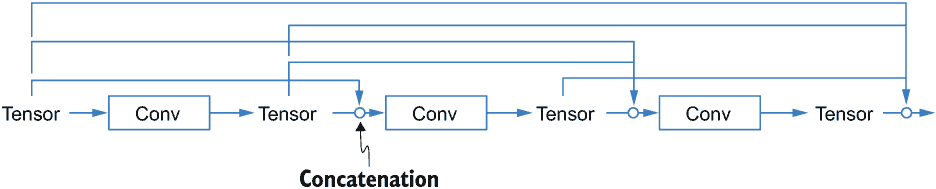

图 5.15 DenseNet 单元

由于 DenseNets 在图像相关应用中非常流行，因此有几个代表性的在 Keras Applications 中实现，这是一个 TensorFlow Keras 模块，它收集了各种广泛使用的深度学习模型。它包含实例化三种 DenseNet 版本（DenseNet121、DenseNet169 和 DenseNet201）的函数，这些版本是通过堆叠不同数量的 DenseNet 单元（每个单元包含两个卷积层）创建的。名称中的数字表示最终模型包含的层数。我们可以直接调用这些函数来使用这些模型，而无需自己逐层实现。例如，要创建一个 DenseNet121，我们可以调用函数 tf.keras.applications.DenseNet121，如图 5.24 列所示。该函数返回一个 Keras 模型。我们可以传递一个 NumPy 数组给它以查看其输出形状，或者直接调用 model.summary() 来查看模型的详细信息。例如，该模型可以接受 100 个形状为 32×32×3 的合成图像。输出是一个形状为 (100, 1, 1, 1024) 的张量（见 5.24 列）。如果我们想使网络不包含分类头，而只包含神经网络的卷积层，我们可以在参数中使用 include_top=False。默认情况下，网络层的权重使用在大数据集上预训练的权重初始化，以提高在当前数据集上的训练速度和准确性。

列表 5.24 使用 Keras Applications 中的函数构建 DenseNet 模型

```
import tensorflow as tf
import numpy as np

model = tf.keras.applications.DenseNet121(           ❶
    include_top=False,                               ❷
    weights=None)                                    ❸
print(model(np.random.rand(100, 32, 32, 3)).shape)   ❹
```

❶ 创建 DenseNet 模型的函数

❷ 此参数表示只使用网络的卷积部分，而不使用分类头。

❸ 此参数表示不使用任何预训练权重。

❹ 将合成输入馈送到创建的 DenseNet121 模型，并打印输出形状

考虑到 Keras Applications 中可用的 DenseNet 的不同版本，你可能想知道如何确定哪个版本最适合当前任务。你可以通过使用 hp.Choice() 函数实现一个自定义的 AutoML 块来选择最佳模型。在列表 5.25 中，我们实现了一个 DenseNetBlock 来在 DenseNet 模型的三个版本之间进行选择。请注意，我们不应直接将 Keras Applications 中的模型传递给 hp.Choice() 函数，因为它们是不可序列化的；我们应该始终在传递给 Choice() 的列表中使用 Python 的基本数据类型，如字符串、布尔值和数值类型。因此，我们在这里使用字符串来表示 DenseNet 模型的三个版本，并使用 if 语句来判断选择并创建模型。将输入张量输入到创建的模型中，将产生一个输出张量，该张量可以被输入到其他 AutoML 块或分类/回归头部。

列表 5.25 实现一个 DenseNet 块

```
import autokeras as ak
import tensorflow as tf

class DenseNet(ak.Block):
    def build(self, hp, inputs):
        version = hp.Choice(
            'version', ['DenseNet121', 'DenseNet169', 'DenseNet201'])   ❶
        if version == 'DenseNet121':
            dense_net_func = tf.keras.applications.DenseNet121
        elif version == 'DenseNet169':
            dense_net_func = tf.keras.applications.DenseNet169
        elif version == 'DenseNet201':
            dense_net_func = tf.keras.applications.DenseNet201
    return dense_net_func(include_top=False,
        weights=None)(inputs)                                           ❷
```

❶ 使用字符串作为模型选择的超参数值，因为函数不可序列化

❷ 获取模型并使用输入张量调用它

由于 Keras Applications 中包含的架构是固定的，我们无法直接调整它们的超参数（例如，调整 DenseNet121 的细胞结构）。但是，假设除了选择最佳模型架构之外，我们还想调整细胞结构。在这种情况下，我们将需要自己定义每个 DenseNet 模型，一层一层地定义，并指定相关超参数的搜索空间，就像我们对 MlpBlock 所做的那样。创建多个 AutoML 块是可行的，每个块定义一种 DenseNet 模型的搜索空间。在这种情况下，我们可以创建一个超块来在不同的 AutoML 块之间进行选择，并在所选块中调整超参数。下一节将展示如何创建一个超块来进行联合模型选择和超参数调整，利用现有的 AutoML 块。

在 DenseNet 和 ResNet 之间进行选择

我们创建了一个 DenseNetBlock 来在不同的 DenseNet 架构中进行搜索。我们还知道在 AutoKeras 中内置了一些块，可以用于图像分类，例如我们在 5.3 节中用于调整 ResNet 的 ResNetBlock。假设我们想要选择最佳模型，在 DenseNet 和 ResNet 架构之间进行选择。如列表 5.26 所示，我们可以利用这些现有块创建一个超块来在两种模型类型之间进行选择，类似于我们创建一个正常的 AutoML 块。每个块的名字可以作为字符串输入到 hp.Choice 函数中，以定义模型选择的搜索空间。然而，因为超块也是一个 AutoML 块，它不应该直接返回一个选定的 AutoML 块，而应该返回由 Keras 层处理过的输出张量，这些张量可以用于其他 AutoML 块。这要求我们调用每个选定的 AutoML 块的 build()函数来返回其输出。换句话说，我们的超块（SelectionBlock）应该在构建搜索空间时将创建其他块的方法作为子例程调用。这也帮助 hp 容器在搜索过程中收集每个块中定义的所有搜索空间。

列表 5.26 创建模型选择块

```
class SelectionBlock(ak.Block):
    def build(self, hp, inputs):
        if hp.Choice('model_type', 
➥                ['densenet', 'resnet']) == 'densenet':    ❶
            outputs = DenseNetBlock().build(hp, inputs)
        else:
            outputs = ak.ResNetBlock().build(hp, inputs)
        return outputs
```

❶ 定义用于模型选择的 model_type 超参数

这里使用的 model_type 超参数被称为*条件超参数*，这意味着在子例程中选择的超参数取决于我们选择哪个模型。例如，当 SelectionBlock 中的 model_type 超参数的值为'densenet'时，才会选择 DenseNetBlock 中的超参数。

条件超参数的一个问题是它们可能会对调整算法造成问题。如果我们没有明确地告诉调整算法有关条件超参数，它会导致搜索错误事物的冗余，并可能影响搜索性能。例如，当 model_type 的值为'reset'时，调整算法可能想要找到一个 DenseNet 版本的优化值，即使改变 DenseNet 版本也不会影响模型。为了声明这种超参数之间的关联，我们使用 hp.conditional_scope()方法通知调整算法依赖关系。任何在条件作用域下定义的超参数将在条件满足时才被视为活动状态。例如，在列表 5.27 中，hp.conditional_scope('model_type', ['densenet'])设置了条件，即 model_type 超参数的值应该是'densenet'以激活作用域。

列表 5.27 创建具有条件作用域的模型选择块

```
class SelectionBlock(ak.Block):
    def build(self, hp, inputs):
        if hp.Choice('model_type', ['densenet', 'resnet']) == 'densenet':
            with hp.conditional_scope('model_type', ['densenet']):        ❶
                outputs = DenseNetBlock().build(hp, inputs)               ❷
        else:
            with hp.conditional_scope('model_type', ['resnet']):
                outputs = ak.ResNetBlock().build(hp, inputs)
        return outputs
```

❶ 仅当模型超参数的值为'densenet'时激活作用域

❷ DenseNet 的 build 函数中的所有超参数都处于此作用域之下。

现在我们已经创建了我们的超块，我们可以构建一个完整的 AutoML 流水线，用于联合模型选择和超参数调整。在列表 5.28 中，我们将一个 ImageInput 节点传递给我们的 SelectionBlock，并通过与 ClassificationHead 连接来选择 CIFAR-10 数据集上图像分类任务搜索空间中的最佳模型。我们还可以通过调用 search_space_summary()函数打印一个摘要来查看整个搜索空间。

列表 5.28 构建模型和进行搜索

```
input_node = ak.ImageInput()
output_node = SelectionBlock()(input_node)
output_node = ak.ClassificationHead()(output_node)
auto_model = ak.AutoModel(input_node, output_node,
                          max_trials=5, overwrite=True)

from tensorflow.keras.datasets import cifar10

(x_train, y_train), (x_test, y_test) = cifar10.load_data()
auto_model.fit(x_train[:100], y_train[:100], epochs=1)       ❶

auto_model.tuner.search_space_summary()                       ❷
```

❶ 将 epoch 数设置为 1 以加快演示速度

❷ 打印出创建的 AutoML 流水线的搜索空间

现在你已经知道了如何创建自己的自定义 AutoML 块和超块，用于调整分类和回归任务上的深度学习模型，在下一章中，我们将转换方向，探讨在不连接一系列这些块的情况下定义搜索空间。这将为你提供一种更灵活的方式来设计适用于更广泛 AutoML 任务的搜索空间，例如调整无监督学习模型，调整优化算法或损失函数，以及联合选择深度学习和浅层模型。

## 摘要

+   AutoML 流水线可以被视为 ML 流水线的搜索空间。你可以通过堆叠四个组件来使用 AutoKeras 功能 API 创建流水线：输入节点、预处理块、网络块和输出头。

+   AutoKeras 包含多个内置的预处理块和网络块。每个预处理块代表一种特定的预处理方法及其超参数的搜索空间。每个网络块代表一种特定的模型类型，例如 MLP 或 CNN，以及模型超参数的默认搜索空间，例如 MLP 中的层数和单元数。你可以使用这些块来构建 AutoML 流水线，并通过自定义它们的搜索空间来调整相关的超参数，同时固定其他参数。

+   超块是一种 AutoML 块，它允许在多种模型和预处理方法之间进行选择。AutoKeras 包含三个超块，用于图像、文本和结构化数据，以帮助你创建用于联合模型选择和超参数调整的 AutoML 流水线。

+   AutoML 流水线可以从顺序结构泛化到图结构，以调整具有多个输入和输出的模型或包含预处理方法或模型集成（ensemble）的流水线。你可以遵循数据流，使用 AutoKeras 功能 API 创建流水线，依次设置每个 AutoML 块，基于它们在图中的出现顺序。

+   你可以创建一个包含你自己的模型搜索空间的自定义 AutoML 块，并将其与 AutoKeras 中的内置块连接起来。你还可以在 AutoML 块中设置一个条件搜索空间以进行模型选择。

* * *

(1.) 请参阅 Kaiming He 等人撰写的“用于图像识别的深度残差学习”，可在[`arxiv.org/pdf/1512.03385.pdf`](https://arxiv.org/pdf/1512.03385.pdf)找到。

(2.) 请参阅 François Chollet 撰写的“Xception: 基于深度学习的深度可分离卷积”，可在[`arxiv.org/pdf/1610.02357.pdf`](https://arxiv.org/pdf/1610.02357.pdf)找到。

(3.) 由 David Wolpert 在“学习算法之间缺乏先验区分”一文中描述，可在[`mng.bz/xvde`](http://mng.bz/xvde)找到。

(4.) 请参阅 Kaiming He 等人撰写的“深度残差网络中的恒等映射”，可在[`arxiv.org/abs/1603.05027`](https://arxiv.org/abs/1603.05027)找到。
