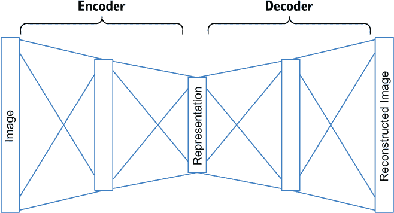
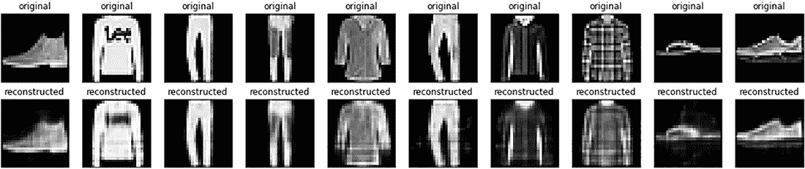
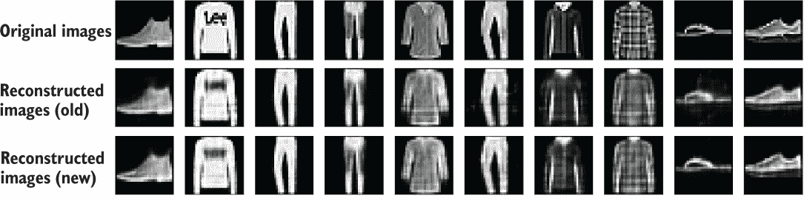
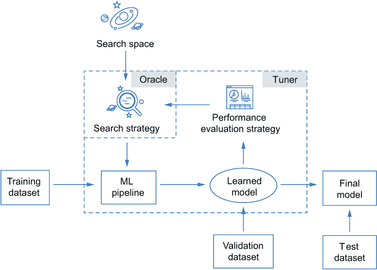
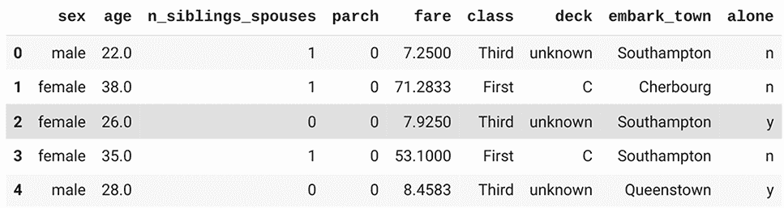
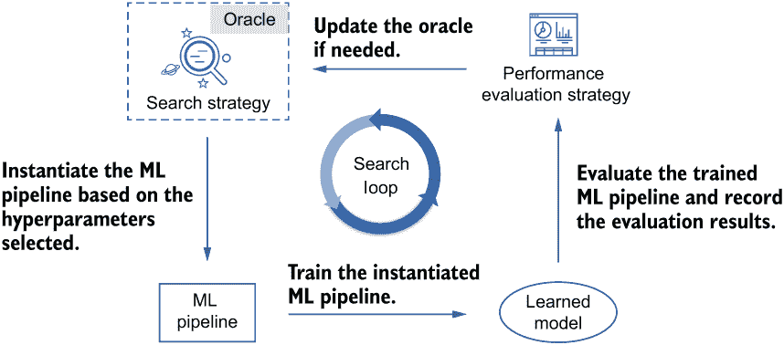

# 6 使用完全自定义的搜索空间进行 AutoML

本章涵盖

+   在不连接 AutoML 块的情况下自定义整个 AutoML 搜索空间

+   调整自动编码器模型以进行无监督学习任务

+   使用预处理管道调整浅层模型

+   通过自定义调整器控制 AutoML 过程

+   在深度学习和浅层模型之间进行联合调整和选择

+   超参数调整超出 Keras 和 scikit-learn 模型

本章介绍了在不连接 AutoML 块的情况下以分层方式自定义整个 AutoML 搜索空间，这为你设计调整无监督学习模型和优化算法的搜索空间提供了更大的灵活性。我们介绍了如何使用预处理管道调整浅层模型，包括特征工程步骤。你还将学习如何控制模型训练和评估过程，以进行深度学习模型和浅层模型的联合调整和选择。这允许你使用不同 ML 库实现的不同训练和评估程序来调整模型。

## 6.1 以分层方式自定义搜索空间

在第五章中，你学习了如何通过指定搜索空间使用 AutoML 块进行超参数调整和模型选择。你还知道如果内置块不符合你的需求，如何创建自己的 AutoML 块。然而，你可能遇到一些难以通过连接 AutoML 块解决的场景，或者这种方法根本不是最佳选择，例如以下情况：

+   *调整超出分类和回归任务的模型*——尽管这些可能是机器学习中最广泛研究的问题，但你可能会遇到这些领域之外的任务。它们甚至可能不是监督学习任务，其中存在预先存在的响应供你学习。

+   *自定义优化算法的搜索空间（例如，调整学习率或批量大小）和损失函数*

除了这些场景之外，如果你需要自定义管道中的所有块，可能觉得通过连接 AutoML 块来创建 AutoML 管道是多余的。为什么不直接在一个 build()函数中创建管道，就像你使用 TensorFlow Keras 实现神经网络一样，而不是进行两步操作（将它们包装成不同的 AutoKeras AutoML 块并将它们连接起来）？

在本节中，您将了解如何以分层的方式完全自定义搜索空间，而无需连接 AutoML 块。这种方法可能需要更多的代码，但它为定制超出监督学习之外的调整任务的搜索空间提供了额外的灵活性。如果您没有合适的内置 AutoML 块可以使用，这种方法还可以减少创建和连接多个自定义块以定义搜索空间的负担。为了实现这一点，我们将使用 KerasTuner，这是一个最初为选择和调整 TensorFlow Keras 模型以及更多内容而提出的 AutoML 库。我们在前两章中使用了它的超参数模块来定制部分搜索空间，在这里我们将使用它从头开始构建搜索空间。我们将从一个用于回归任务的 MLP 模型开始调整，这涉及到使用自定义搜索空间调整优化算法和数据预处理方法。然后我们将使用 KerasTuner 来调整用于无监督学习任务的自动编码器模型。

### 6.1.1 使用 KerasTuner 调整 MLP 的回归

让我们先解决调整 MLP 用于回归的问题。我们将首先调整隐藏层中的单元数量，并逐步在搜索空间中添加更多超参数。

使用 KerasTuner 调整 MLP 模型的搜索空间与使用 Keras 构建一个 MLP 模型几乎相同。我们需要一个 build() 函数，它可以生成一个 MLP 模型并定义我们关心的超参数的搜索空间，例如单元数量。您已经看到如何在自定义 AutoML 块时使用 hp 容器来定义搜索空间，这里的流程是相同的。然而，由于我们在这个案例中的目的不是创建一个 AutoML 块并将其与其他块连接起来以形成搜索空间，我们应该在一个 build() 函数中创建深度学习管道的每个组件。换句话说，除了网络架构之外，我们还需要创建输入节点，设置输出回归层，选择优化算法，并编译模型以进行训练。列表 6.1 展示了如何使用 KerasTuner 实现调整单元数量的 build() 函数。除了使用 hp 容器来定义单元超参数的搜索空间之外，其余部分与构建用于回归的 Keras 模型相同，这是您在第三章中学到的。

列表 6.1 使用 KerasTuner 实现调整 MLP 单元的搜索空间

```
import tensorflow as tf
from tensorflow import keras
from tensorflow.keras import layers

def build_model(hp):                                         ❶
    input_node = keras.Input(shape=(20,))
    units = hp.Int('units', min_value=32,
                    max_value=512, step=32)                  ❷
    output_node = layers.Dense(units=units, activation='relu')(input_node)
    output_node = layers.Dense(units=units, activation='relu')(output_node)
    output_node = layers.Dense(units=1, activation='sigmoid')(output_node)
    model = keras.Model(input_node, output_node)

    optimizer = tf.keras.optimizers.Adam(learning_rate=1e-3)
    model.compile(                                           ❸
        optimizer=optimizer,
        loss='mse',
        metrics=['mae'])
    return model                                             ❹
```

❶ 创建一个 build 函数，其输入是一个 hp 容器实例

❷ 定义两个隐藏层中单元数量的搜索空间

❸ 使用 Adam 优化算法和 MSE 损失编译模型，并计算模型的 MAE 指标

❹ 返回的模型是一个 Keras 模型。

在定义搜索空间之后，我们仍然需要一个搜索方法来帮助执行搜索过程。回顾第五章的内容，在创建 AutoML 管道时，我们将模块封装在 AutoModel 对象中，然后设置其 tuner 参数（或使用默认值，'greedy'）来选择一个搜索方法进行调优。在这里，因为我们没有 AutoModel 对象，所以我们直接从 KerasTuner 中选择一个 *tuner* 来完成这个任务。一个调优器不仅指定了搜索方法，还帮助安排每个搜索试验中选定模型的训练和评估，以确保顺序搜索过程可以顺利执行。我们将在本章后面更详细地讨论这一点。调优器的名称与我们要使用的搜索方法相匹配。例如，我们可以通过选择 RandomSearch 调优器来使用随机搜索方法，如列表 6.2 所示。

在初始化过程中，我们向其提供搜索空间（build() 函数），并设置在搜索过程中想要探索的模型数量（max_trial=5）。objective 参数指定了我们要用于比较模型和优化搜索方法的指标（或损失函数）（对于随机搜索方法，没有需要优化的内容）。在这个例子中，在每个试验中，随机调优器将基于随机选择的单元值构建一个模型，训练该模型并评估它。它将根据我们设定的目标返回最佳模型，即验证集的平均绝对误差（MAE）（由 val_ 前缀表示）。如果没有指定验证集，它将随机从训练集中分割出来。我们可以通过设置 executions_per_trial 参数来指定每个模型想要训练和评估的次数，以减少评估过程中的随机性。

列表 6.2 初始化调优器

```
from keras_tuner import RandomSearch

tuner = RandomSearch(              ❶
    build_model,                   ❷
    objective='val_mae',           ❸
    max_trials=5,                  ❹
    executions_per_trial=3,        ❺
    directory='my_dir',            ❻
    project_name='helloworld')     ❼
```

❶ 初始化随机搜索调优器

❷ 传递 build_model 函数

❸ 在选择模型时设置优化目标

❹ 尝试的不同超参数值集的总数

❺ 一个超参数值集的运行次数

❻ 保存结果的目录

❼ 项目名称

在我们开始搜索过程之前，让我们使用 summarize_search_space() 方法打印搜索空间的摘要，以确保调优器已按预期接收它。

列表 6.3 打印搜索空间摘要

```
>>> tuner.search_space_summary()     ❶

Search space summary
Default search space size: 1
units (Int)
{'default': None, 'conditions': [], 'min_value': 32, 'max_value': 
➥ 512, 'step': 32, 'sampling': None}
```

❶ 打印搜索空间摘要

我们可以看到创建的搜索空间包含一个超参数（units）。它是一个整数，应该从 32 到 512 的范围内选择，步长为 32。

现在，让我们创建一个合成回归数据集，并调用调优器的 search() 方法来启动搜索过程。搜索结果在列表 6.4 中显示。search() 函数的参数控制每个模型的训练和评估，对应于 Keras 模型 fit() 方法支持的参数（tf.keras.Model.fit()）。例如，在这种情况下，每个选定的 MLP 将训练一个 epoch。

列表 6.4 运行搜索

```
>>> import numpy as np                          ❶
>>> x_train = np.random.rand(100, 20)           ❶
>>> y_train = np.random.rand(100, 1)            ❶
>>> x_val = np.random.rand(20, 20)              ❶
>>> y_val = np.random.rand(20, 1)               ❶

>> tuner.search(x_train, y_train, epochs=1,
...     validation_data=(x_val, y_val))         ❷

Trial 5 Complete [00h 00m 02s]
val_mae: 0.2220905969540278

Best val_mae So Far: 0.2120091120402018
Total elapsed time: 00h 00m 11s
INFO:tensorflow:Oracle triggered exit
```

❶ 随机创建一个具有每个实例 20 个特征的合成回归数据集

❷ 运行搜索，这可能需要一段时间

我们可以使用 results_summary()函数打印五个最佳模型及其评估结果，如下一列表所示。这里的最佳模型在每个密集层中有 218 个单元。在搜索过程中，它在验证集上的 MAE 为 0.212。

列表 6.5 打印五个最佳模型及其每个模型的 MAE

```
>> tuner.results_summary(5)

Results summary
Results in my_dir/helloworld
Showing 10 best trials
Objective(name='val_mae', direction='min')
Trial summary
Hyperparameters:
units: 288
Score: 0.2120091120402018
Trial summary
Hyperparameters:
units: 128
Score: 0.2220905969540278
Trial summary
Hyperparameters:
units: 320
Score: 0.22237977385520935
Trial summary
Hyperparameters:
units: 256
Score: 0.22893168032169342
Trial summary
Hyperparameters:
units: 192
Score: 0.23000877102216086
```

在搜索之后，我们可能想要导出最佳模型以保存它供将来使用。如列表 6.6 所示，这样做很简单。导出的模型是一个 Keras 模型，我们可以通过调用 summary()函数来打印其架构。

列表 6.6 总结和导出模型

```
from tensorflow import keras
best_models = tuner.get_best_models(num_models=2)  ❶
best_model = best_models[0]                        ❷
best_model.save('path_to_best_model')              ❸
best_model = keras.models.load_model(
    'path_to_best_model')                          ❹
print(best_model.predict(x_val))                   ❺
best_model.summary()                                ❻
```

❶ 指定函数应返回两个模型的列表

❷ 从返回的列表中获取最佳模型

❸ 将模型保存到磁盘

❹ 从磁盘加载模型

❺ 使用模型进行预测

❻ 打印模型架构的摘要

联合调整优化函数

在 build()函数中自定义整个流程的一个好处是我们可以调整优化函数。因为我们需要自己编译网络以确保它可以被训练，我们可以完全控制使用哪种优化方法，以及其超参数，例如学习率。例如，我们可以通过 hp.Choice()方法从深度学习中广泛使用的两个优化器中选择，Adam 和 Adadelta。所选优化方法的学习率可以在 1e-5 和 0.1 之间采样。而且因为实际上我们经常在对数尺度上选择学习率，例如 0.1 或 0.01，我们可以将采样参数设置为'log'，以将等概率分配给每个数量级范围，如下一代码列表所示。

列表 6.7 联合调整单元和优化方法

```
def build_model(hp):
    input_node = keras.Input(shape=(20,))
    units = hp.Int('units', min_value=32, max_value=512, step=32)
    output_node = layers.Dense(units=units, activation='relu')(input_node)
    output_node = layers.Dense(units=units, activation='relu')(output_node)
    output_node = layers.Dense(units=1, activation='sigmoid')(output_node)
    model = keras.Model(input_node, output_node)
    optimizer_name = hp.Choice('optimizer', ['adam', 'adadelta'])
    learning_rate = hp.Float('learning_rate', min_value=1e-5, max_value=0.1,
                             sampling='log')         ❶
    if optimizer_name == 'adam':
        optimizer = tf.keras.optimizers.Adam(learning_rate=learning_rate)
    else:
        optimizer = tf.keras.optimizers.Adadelta(learning_rate=learning_rate)
    model.compile(
        optimizer=optimizer,                         ❷
        loss='mse',                                  ❸
        metrics=['mae'])                             ❹
    return model                                     ❺

tuner = RandomSearch(
    build_model,
    objective='val_mae',
    max_trials=5,
    executions_per_trial=3,
    directory='my_dir',
    project_name='helloworld')
```

❶ 在对数尺度上进行均匀随机采样

❷ 定义优化器的搜索空间

❸ 编译模型以设置损失

❹ 我们使用的指标是 MAE。

❺ 函数应返回一个 Keras 模型。

搜索过程与之前的示例相同，这里不再重复。不出所料，我们可以以相同的方式调整损失函数，因此我们不会进一步详细说明。

调整模型训练过程

除了模型构建过程之外，在模型训练过程中，你可能还需要调整一些超参数。例如，你可能想要调整数据的批量大小以及是否对数据进行洗牌。你可以在 Keras 模型的 model.fit()方法的参数中指定这些。然而，在之前的代码示例中，我们只为构建和编译模型定义了搜索空间，而不是为训练模型定义。

要调整模型训练过程，我们可以使用 HyperModel 类，它提供了一种面向对象的方式来定义搜索空间。你可以覆盖 HyperModel.build(hp)，这与前面展示的 build_model() 函数相同。你需要覆盖 HyperModel.fit() 来调整模型训练。在方法参数中，你可以访问 hp，我们刚刚构建的模型，以及传递给 Tuner.search() 的所有 **kwargs。它应该返回训练历史，这是 model.fit() 的返回值。接下来的列表是一个定义搜索空间以调整是否打乱数据集以及调整批次大小，除了其他超参数的示例。

列表 6.8 调整模型训练过程

```
import keras_tuner as kt

class Regressor(kt.HyperModel):

    def build(self, hp):
        input_node = keras.Input(shape=(20,))
        units = hp.Int('units', min_value=32, max_value=512, step=32)
        output_node = layers.Dense(units=units, activation='relu')(input_node)
        output_node = layers.Dense(units=units, activation='relu')(output_node)
        output_node = layers.Dense(units=1, activation='sigmoid')(output_node)
        model = keras.Model(input_node, output_node)
        optimizer_name = hp.Choice('optimizer', ['adam', 'adadelta'])
        learning_rate = hp.Float('learning_rate', min_value=1e-5, max_value=0.1,
                                 sampling='log')
        if optimizer_name == 'adam':
            optimizer = tf.keras.optimizers.Adam(learning_rate=learning_rate)
        else:
            optimizer = tf.keras.optimizers.Adadelta(learning_rate=learning_rate)
        model.compile(
            optimizer=optimizer,
            loss='mse',
            metrics=['mae'])
        return model
    def fit(self, hp, model, **kwargs):         ❶
        return model.fit(                       ❷
            batch_size=hp.Int('batch_size'),    ❸
            shuffle=hp.Boolean('shuffle'),      ❹
            **kwargs)

tuner = RandomSearch(
    build_model,
    objective='val_mae',
    max_trials=5,
    executions_per_trial=3,
    directory='my_dir',
    project_name='helloworld')
```

❶ 调整模型训练

❷ 返回 model.fit() 的返回值

❸ 调整批次大小

❹ 调整是否打乱数据集

注意，我们没有在 fit() 中调整训练轮数（模型将在最佳轮次保存，以目标值为准，这里是指 'val_mae'）。

到目前为止，我们已经学习了如何在模型构建、编译和拟合过程中定义和调整超参数。

调整数据预处理方法

有时你可能想在工作流程中包含一些预处理步骤——例如，在将特征输入神经网络之前对特征进行归一化。在本节中，我们首先将看到如何轻松地将预处理步骤包含到你的模型中。然后，我们将看到如何调整涉及这些步骤的超参数。

与你在第三章中学到的创建归一化函数的方式不同，你可以使用 Keras 预处理层来完成这个任务。例如，你可以在密集层之前堆叠一个归一化层，如列表 6.9 所示。请注意，这里的预处理层有特殊处理：你需要在整个数据集上调用一个层适配函数（layer.adapt()）。神经网络是在数据批次上训练和评估的，但预处理方法通常需要从整个数据集中获取一些统计信息，例如特征的均值和方差，以预处理批次。调用适配函数将帮助预处理层收集这些统计信息。

列表 6.9 使用 Keras 归一化预处理层

```
from tensorflow.keras.layers.experimental.preprocessing import Normalization

layer = Normalization(input_shape=(20,))     ❶
layer.adapt(x_train)                         ❷

model = tf.keras.Sequential([layer, tf.keras.layers.Dense(1)])
model.compile(optimizer='adam', loss='mse')
model.fit(x_train, y_train)
```

❶ 初始化归一化层

❷ 将归一化层适配到数据以获取均值和方差

我们有多种使用预处理层的方式。在之前的例子中，我们将其放入 Sequential 模型中。你也可以将其作为一个独立的步骤使用。你可以用它来预处理 NumPy 数组。对于 NumPy 数组，你只需调用层即可获取处理后的数据，如下面的代码示例所示：

```
normalized_x_train = layer(x_train)
```

然而，你的数据可能并不总是以 NumPy 数组的格式存在。它可能是 tf.data.Dataset 的格式，这是一种更通用的格式。它可以由一个小 NumPy 数组或甚至是从本地或远程存储流式传输的大数据集创建。下面的代码示例展示了如何将 NumPy 数组转换为 tf.data.Dataset，并使用我们通过调用 Dataset.map(layer)创建的层进行归一化。

列表 6.10 归一化 tf.data.Dataset

```
dataset_x_train = tf.data.Dataset.from_tensor_slices(x_train).batch(32)
normalized_dataset = dataset_x_train.map(layer)
```

现在我们已经学习了如何使用预处理层进行数据预处理。让我们看看我们是否可以有一个布尔超参数来调整是否使用这个归一化步骤。

由于数据预处理需要访问数据集，我们将在 HyperModel.fit()中调整这一步，该函数具有从 Tuner.search()传递的参数中的数据集，如下所示。这次，我们不会将这些有用的参数留在**kwargs 中，而是会明确地将 x 和 y 放入方法签名中。

列表 6.11 在搜索空间中使用预处理层

```
from keras_tuner import HyperModel

class Regressor(HyperModel):

    def build(self, hp):
          model = tf.keras.Sequential()
          model.add(tf.keras.layers.Dense(1))
          model.compile(optimizer='adam', loss='mse')
          return model

      def fit(self, hp, model, x, y, **kwargs):
          if hp.Boolean('normalize'):                   ❶
              layer = Normalization(input_shape=(20,))
              layer.adapt(x)
              x = layer(x)                              ❷
          return model.fit(x=x, y=y, **kwargs)
```

❶ 指定是否使用归一化层

❷ 用归一化后的数据替换 x

在实现搜索空间后，我们可以将其输入到一个调优器中，就像我们对 build_model()函数所做的那样，以搜索一个好的模型，如下所示。

列表 6.12 在具有预处理层的空间中进行搜索

```
tuner = RandomSearch(hypermodel,
                     objective='val_loss', max_trials=2)       ❶
tuner.search(x_train, y_train, validation_data=(x_val, y_val))
```

❶ 将类实例传递给调优器

在完成这个示例后，你可能想知道为什么，因为层状搜索空间设计可以解决块状搜索空间设计可以解决的问题，甚至具有更多的灵活性，我们可能还想通过连接 AutoML 块来构建 AutoML 管道。原因是，与层状搜索空间设计相比，使用 AutoKeras 的内置块可以使搜索空间创建不那么费力（特别是如果你不擅长以层状方式创建搜索空间）。实现难度和灵活性之间的权衡将决定哪种搜索空间创建方法最适合你和你手头的任务。

### 6.1.2 调整自动编码器模型以进行无监督学习

我们迄今为止所做的一切示例都是监督学习任务，但机器学习应用并不全是关于预测预存在的响应。与监督学习相反，一种称为*无监督学习*的机器学习范式旨在在没有人类监督或参与的情况下，在特征中找到隐藏或未检测到的模式。一个典型的无监督学习任务是*降维*。目标是学习数据实例的压缩表示（例如，具有少量元素的向量），以去除数据中的噪声或不重要信息。

*自动编码器*是一种经典的神经网络类型，用于降维。它通常应用于图像，以学习每个图像的低维向量表示。自动编码器的架构如图 6.1 所示。



图 6.1 自动编码器的架构

如您所见，自动编码器的输入和输出都是图像。网络由两部分组成，即 *编码器* 和 *解码器*。编码器用于将图像压缩到低维向量表示，而解码器则试图根据编码向量重建原始图像。编码器和解码器通常具有不对称的结构。它们都可以使用经典网络，例如 MLP 或 CNN。例如，如果每个输入实例是一个长度为 64 的向量，一个简单的编码器可以是一个单层 MLP，每个密集层有 32 个单元。解码器也可以是一个单层 MLP，密集层有 64 个单元，以解码每个输入到原始大小。

在这个任务中，因为我们没有预先存在的响应来指导学习过程，所以我们使用原始图像本身作为响应。在训练过程中，重建图像与原始图像之间的差异将是损失指标，以帮助更新网络的权重。我们可以使用回归损失函数，如均方误差（MSE）来衡量差异。

在回归任务中，均方误差（MSE）衡量预测值和真实值之间的差异。在这个图像重建任务中，预测值是重建的图像，而真实值是原始图像。如果神经网络能够成功重建图像，这意味着图像的所有重要信息都存储在向量表示中。

学习到的向量表示有许多潜在用途：例如，它们可以用来可视化图像在 2-D 或 3-D 空间中的分布，或者我们可以使用它们来重建图像，以从原始版本中去除噪声。

使用 Keras 实现自动编码器

让我们通过一个例子来展示自动编码器是如何工作的。然后我们将探讨如何创建搜索空间来调整它。在这里，我们将要完成的工作是学习一个能够将图像压缩到低维向量并随后重建图像的自动编码器。

我们将使用一个名为 Fashion MNIST 的基准深度学习数据集，该数据集包含训练数据集中的 60,000 张图像和测试数据集中的 10,000 张图像。所有图像都是灰度的，大小为 28×28，图像内容都是服装。我们可以通过 Keras 数据集 API 加载数据，并将图像的像素值归一化到 0 到 1 的范围，以便于网络优化，如下面的列表所示。

列表 6.13 加载 Fashion MNIST 数据

```
from tensorflow.keras.datasets import fashion_mnist

(x_train, _), (x_test, _) = fashion_mnist.load_data()

x_train = x_train.astype('float32') / 255\.   ❶
x_test = x_test.astype('float32') / 255\.     ❶
```

❶ 将图像中的值归一化到 [0, 1] 范围内

你应该已经知道如何单独实现编码器和解码器，因为它们都是常规网络（CNN 或 MLP）。问题是如何将两个网络组合起来并编译以进行训练和预测。实现此类复合模型的一种常见方法是重写 tf.keras.Model 类。当我们子类化 Model 类时，我们应该在 __init__() 函数中定义所有自动编码器层，以便在初始化自动编码器实例时创建它们。下一步是实现名为 call 的函数中的正向传播。这个函数将接受一批输入图像并输出重构的图像。我们通常希望单独调用编码器以提取它提供的表示，因此单独实现编码器和解码器网络的前向传播是一个好主意。这也是我们为什么要通过子类化 Model 类来实现自动编码器，而不是将层分组在 tf.keras.Model 或 tf.keras.Sequential 对象中的原因。

列表 6.14 展示了我们在本例中使用的自动编码器的实现。编码器和解码器网络都是单层 MLP 网络，其单元数量由可自定义的超参数 latent_dim 指定。latent_dim 超参数还表示编码表示向量的长度。在正向传播过程中，每个图像将被展平成一个长度为 784 的向量，然后编码成一个长度为 latent_dim 的表示向量。解码器网络将表示解码为一个大小为 784 的向量，并将图像重塑为原始大小（28×28）。

列表 6.14 通过子类化 Keras Model 类实现自动编码器

```
import tensorflow as tf
from tensorflow.keras.models import Model
from tensorflow.keras import layers, losses

class AutoencoderModel(Model):                                       ❶
    def __init__(self, latent_dim):                                  ❷
        super().__init__()
        self.latent_dim = latent_dim
        self.encoder_layer = layers.Dense(latent_dim,
                                          activation='relu')         ❸
        self.decoder_layer = layers.Dense(784, activation='sigmoid')

    def encode(self, encoder_input):
        encoder_output = layers.Flatten()(encoder_input)             ❹
        encoder_output = self.encoder_layer(encoder_output)          ❺
        return encoder_output

    def decode(self, decoder_input):
        decoder_output = decoder_input
        decoder_output = self.decoder_layer(decoder_output)          ❻
        decoder_output = layers.Reshape
➥ (28, 28))(decoder_output)                                         ❼
        return decoder_output

    def call(self, x):
        return self.decode(self.encode(x))                           ❽
```

❶ 重写 Model 类

❷ 初始化器应创建所有层实例。

❸ 编码层应输出表示向量。

❹ 将 28×28 图像展平成一个长度为 784 的向量。

❺ 使用全连接层对图像进行编码

❻ 使用全连接层解码表示向量

❷ 将图像重塑回 28×28

❽ call 函数定义了神经网络应首先编码输入，然后解码它。

接下来，我们将创建一个自动编码器模型，将图像编码为长度为 64 的向量。模型编译、训练和拟合过程与 MLP 的回归相同。唯一的区别是我们使用图像作为特征和响应，如这里所示。

列表 6.15 使用 Fashion MNIST 对自动编码器模型进行拟合

```
tf.random.set_seed(5)                               ❶
np.random.seed(5)                                   ❷
autoencoder = AutoencoderModel(64)                  ❸
autoencoder.compile(optimizer='adam', loss='mse')   ❹
autoencoder.fit(x_train, x_train,
                epochs=10,
                shuffle=True,
                validation_data=(x_test, x_test))   ❹

autoencoder.evaluate(x_test, x_test)                ❺
```

❶ 设置 TensorFlow 随机种子

❷ 设置 NumPy 随机种子

❸ 创建自动编码器

❹ 编译和拟合自动编码器——图像既作为特征也作为目标响应。

❺ 在测试图像上评估自动编码器

自动编码器训练完成后，我们可以通过调用我们实现的 encode() 函数来使用它将图像编码为向量。如以下列表所示，测试图像的编码向量长度为 64，正如预期的那样。

列表 6.16 使用自动编码器编码图像

```
>>> autoencoder.encode(x_test[:1])
<tf.Tensor: shape=(1, 64), dtype=float32, numpy=
array([[3.931118  , 1.0182608 , 6.5596466 , 2.8951719 , 1.5840771 ,
        2.3559608 , 2.0955124 , 4.485343  , 1.34939   , 3.600976  ,
        3.5480025 , 1.0803885 , 3.5926101 , 2.34089   , 0\.        ,
        1.3521026 , 1.5423647 , 3.7132359 , 2.2019305 , 1.3938735 ,
        0.9601332 , 2.3903034 , 1.4392244 , 2.155833  , 4.196291  ,
        3.8109841 , 3.2413573 , 1.1022317 , 2.7478027 , 0\.        ,
        6.3407483 , 2.5890563 , 1.905628  , 0.61499554, 1.7429417 ,
        0.59232974, 2.5122235 , 1.4705787 , 1.5797877 , 2.3179786 ,
        0.19336838, 1.6040547 , 1.8269951 , 2.1929228 , 3.5982947 ,
        2.1040354 , 3.4453387 , 3.405629  , 3.6934092 , 2.5358922 ,
        2.8133378 , 4.46262   , 2.0303524 , 3.7909238 , 2.4032137 ,
        2.2115898 , 2.5821419 , 1.4490023 , 2.3869803 , 0\.        ,
        3.246771  , 1.1970178 , 0.5150778 , 0.7152041 ]], dtype=float32)>
```

我们还可以使用以下代码可视化原始和重建的图像。

列表 6.17 可视化重建的图像

```
import matplotlib.pyplot as plt

def show_images(model, images):
    encoded_imgs = model.encode(images).numpy()        ❶
    decoded_imgs = model.decode(encoded_imgs).numpy()  ❶

    n = 10                                             ❷
    plt.figure(figsize=(20, 4))                        ❷
    for i in range(n):
        ax = plt.subplot(2, n, i + 1)                  ❸
        plt.imshow(images[i])                          ❸
        plt.title('original')                          ❸
        plt.gray()
        ax.get_xaxis().set_visible(False)
        ax.get_yaxis().set_visible(False)

        ax = plt.subplot(2, n, i + 1 + n)              ❹
        plt.imshow(decoded_imgs[i])                    ❹
        plt.title('reconstructed')                     ❹
        plt.gray()
        ax.get_xaxis().set_visible(False)
        ax.get_yaxis().set_visible(False)
    plt.show()

show_images(autoencoder, x_test)
```

❶ 获取编码和解码的测试图像——我们也可以调用 call 函数使其成为一个单步过程。

❷ 控制显示图像的数量和大小

❸ 在第一行显示前 10 个原始图像

❹ 在第二行显示前 10 个重建图像

如图 6.2 所示，重建的图像与原始图像非常接近，除了某些轻微的模糊和一些缺失的细节（例如，衬衫上的图案看起来模糊）。这意味着 64 维度的表示几乎保留了我们需要重建原始图像的所有信息。我们可以使用这个自动编码器来压缩大型图像数据集以节省内存。



图 6.2 自动编码器重建的图像

下一步是创建一个搜索空间，在 KerasTuner 的帮助下微调自动编码器。

## 6.2 调整自动编码器模型

你已经知道如何通过创建一个模型构建函数以分层方式定义 MLP 的搜索空间。因为自动编码器模型是在类中创建的，并且层是在类的 __init__() 函数中初始化的，所以我们可以直接在初始化时设置这些层的搜索空间。为了创建搜索空间，我们将 hp 容器的一个实例传递给 __init__() 函数。它的方法可以用来定义搜索空间。例如，我们可以使用 hp.Int() 来定义编码器（或解码器）中层的数量选择空间，并使用 hp.Choice() 来调整每层中的单元数量，如以下列表所示。因为在我们创建自动编码器之前层的数量是不确定的，所以在实现编码和解码网络的正向传递时，我们应该遍历所有层。

列表 6.18 建立一个类来定义自动编码器模型的搜索空间

```
import keras_tuner
from tensorflow import keras
from keras_tuner import RandomSearch

class AutoencoderBlock(keras.Model):
    def __init__(self, latent_dim, hp):                    ❶
        super().__init__()
        self.latent_dim = latent_dim
        self.encoder_layers = []                           ❷
        for i in range(hp.Int('encoder_layers',            ❸
                              min_value=0,
                              max_value=2,
                              step=1,
                              default=0)):
        self.encoder_layers.append(
            layers.Dense(units=hp.Choice(
                'encoder_layers_{i}'.format(i=i),          ❹
                [64, 128, 256]),
                activation='relu'))
        self.encoder_layers.append(layers.Dense(latent_dim, activation='relu'))
        self.decoder_layers = []                           ❺
        for i in range(hp.Int('decoder_layers',            ❻
                              min_value=0,
                              max_value=2,
                              step=1,
                              default=0)):
        self.decoder_layers.append(
            layers.Dense(units=hp.Choice(
                'decoder_layers_{i}'.format(i=i),          ❼
                [64, 128, 256]),
                activation='relu'))
        self.decoder_layers.append(layers.Dense(784, activation='sigmoid'))

    def encode(self, encoder_input):
        encoder_output = layers.Flatten()(encoder_input)
        for layer in self.encoder_layers:                  ❽
            encoder_output = layer(encoder_output)
        return encoder_output

    def decode(self, decoder_input):
        decoder_output = decoder_input
        for layer in self.decoder_layers:                  ❾
            decoder_output = layer(decoder_output)
        decoder_output = layers.Reshape((28, 28))(decoder_output)
        return decoder_output

    def call(self, x):
        return self.decode(self.encode(x))
```

❶ 将 hp 添加到初始化器的参数中

❷ 编码层的列表

❸ 使用 hp 来决定编码层的数量

❹ 使用 hp 来选择每个编码层的单元数量

❺ 解码层的列表

❻ 使用 hp 来决定解码层的数量

❼ 使用 hp 来选择每个解码层的单元数量

❽ 通过编码层进行正向循环

❾ 通过解码层进行正向循环

为了遵循实现 Keras 模型的最佳实践，我们再次应该在 __init__() 函数中初始化所有层，并在 call() 函数中使用它们。使用 hp 容器，我们可以获取构建模型所需的所有超参数的值并将它们记录下来。

下一步遵循 KerasTuner 的正常使用方法。在列表 6.19 中，我们创建了一个 build_model()函数来返回我们定义的自动编码器模型，并将其输入到一个初始化的调优器中，以继续搜索过程。值得注意的是，自动编码器的初始化需要一个额外的输入（一个 hp 容器实例）。我们还可以与相同的 hp 容器一起调整优化函数，就像我们在 MLP 示例中所做的那样。

列表 6.19 运行自动编码器的搜索

```
def build_model(hp):
    latent_dim = 20
    autoencoder = AutoencoderBlock(latent_dim, hp)      ❶
    autoencoder.compile(optimizer='adam', loss='mse')   ❷
    return autoencoder                                  ❸

tuner = RandomSearch(
    build_model,
    objective='val_loss',
    max_trials=10,
    overwrite=True,                                     ❹
    directory='my_dir',                                 ❺
    project_name='helloworld')

tuner.search(x_train, x_train,
             epochs=10,
             validation_data=(x_test, x_test))          ❻
```

❶ 初始化模型并传入 hp 实例

❷ 编译模型

❸ 返回模型

❹ 在开始之前清除工作目录以移除任何先前结果

❺ 工作目录

❻ 验证数据是评估模型所必需的。

调优器执行 10 次试验，每次训练一个自动编码器 10 个 epoch。我们可以选择最佳模型，并使用以下代码可视化前 10 个重建图像。

列表 6.20 评估结果

```
autoencoder = tuner.get_best_models(num_models=1)[0]
tuner.results_summary(1)
autoencoder.evaluate(x_test, x_test)

show_images(autoencoder, x_test)
```

通过调整自动编码器中的超参数，我们已经使一些重建图像在视觉上更加清晰，例如第九张图片中显示的翻转（见图 6.3）。



图 6.3 调优后的自动编码器重建图像

## 6.3 使用不同搜索方法调整浅层模型

在第二章中，你学习了如何使用网格搜索调整传统（或浅层）机器学习模型。附录 B 还涵盖了在机器学习管道中调整多个组件的几个更复杂的示例。所有这些示例都利用了 scikit-learn 库中内置的调优器（GridSearchCV）。现在你已经看到了 KerasTuner 在选择和调整深度学习模型方面的强大功能，你可能想知道是否也可以使用 KerasTuner 调整浅层模型。与使用 GridSearchCV 相比，使用 KerasTuner 进行此操作有以下两个关键优势：

+   它为你提供了一个更直接的方式来执行模型选择，无需分别调整每个模型并手动比较。借助由超参数类定义的条件范围，你可以以与深度学习模型相同的方式选择不同的浅层模型。我们将在下一个示例中介绍如何做到这一点。

+   它为你提供了更多可供选择的搜索方法。KerasTuner 包含几种高级搜索方法。选择不同的方法可能会导致不同的调优结果，正如你将在下一个示例中看到的那样。

实际上，从深度学习模型和浅层模型池中选择也是可行的。然而，由于深度学习模型通常以与浅层模型不同的方式创建和训练（部分原因是由于各种库在实现上的差异，考虑到它们不同的模型架构），在搜索过程中对它们的训练和评估需要不同的处理。您将在下一节中学习如何创建自己的调谐器，并使用个性化的训练和评估策略来适应更广泛的搜索空间。现在，我们将从一个示例开始，展示我们如何在不同浅层模型之间进行选择。

### 6.3.1 选择和调整浅层模型

在本节中，我们将处理一个图像分类问题，使用 scikit-learn 库附带的手写数字数据集。该数据集包含 1797 个 0 到 9 的手写数字的 8×8 灰度图像。我们可以使用 scikit-learn 库中的内置函数 load_digits()加载该数据集，并将其 20%的数据分割出来作为测试集，如下所示。

列表 6.21 加载数字数据

```
from sklearn.datasets import load_digits
from sklearn.model_selection import train_test_split

digits = load_digits()                                    ❶

images, labels = digits.images, digits.target             ❷

X = images.reshape((n_samples, -1))                       ❸

X_train, X_test, y_train, y_test = train_test_split(
    X, labels, test_size=0.2, shuffle=False)              ❹
```

❶ 加载数字数据集

❷ 分别存储图像及其相应的目标数字

❸ 将图像重塑为向量

❹ 将 20%的数据分割出来作为最终的测试集

在附录 B 中，我们介绍了如何创建一个 SVM 模型来分类图像，并使用网格搜索调整其超参数。您还可以尝试一些不同的浅层分类模型，如决策树，并从中选择最佳模型。类似于在第 6.1.2 节中介绍的深度学习模型的选择，您可以使用 KerasTuner 通过为模型类型设置条件超参数来在不同浅层模型之间进行选择。在列表 6.22 中，我们创建了一个搜索空间，用于在 SVM 和随机森林（如果您不熟悉随机森林模型，请参阅附录 B）之间进行选择。模型选择是通过一个名为'model_type'的超参数来完成的。在搜索过程的每次试验中，通过选择特定的'model_type'，例如 svm，将搜索空间缩小到所选模型的条件范围，并创建相应的模型。模型选择可以与每个模型的超参数调整一起进行。

列表 6.22 创建浅层模型选择的搜索空间

```
from sklearn.svm import SVC
from sklearn.ensemble import RandomForestClassifier
from keras_tuner.engine import hyperparameters as hp

def build_model(hp):
    model_type = hp.Choice('model_type',
                           ['svm', 'random_forest'])     ❶
    if model_type == 'svm':
        with hp.conditional_scope('model_type', 'svm'):  ❷
            model = SVC(
                C=hp.Float('C', 1e-3, 10, sampling='linear', default=1), 
                kernel=hp.Choice('kernel_type',
                                 ['linear', 'rbf'], 
                                 default='linear'), 
                random_state=42)
    elif model_type == 'random_forest':
        with hp.conditional_scope('model_type',
                                  'random_forest'):      ❸
            model =  RandomForestClassifier(
                n_estimators=hp.Int('n_estimators', 10, 200, step=10),
                max_depth=hp.Int('max_depth', 3, 10))
    else:
        raise ValueError('Unrecognized model_type')
    return model
```

❶ 选择分类器类型

❷ 如果选择，调整 SVM 分类器

❸ 如果选择，调整随机森林分类器

正如我们在上一节中所做的那样，我们使用随机搜索进行模型选择和超参数调优。然而，这里的一个重要区别是，我们并没有直接使用 RandomSearch 类，而是使用了一个名为 SklearnTuner 的特定调优器类，该类专门用于调优 scikit-learn 模型。原因是 KerasTuner 中的调优器在搜索过程中控制实例化模型的训练和评估。由于 scikit-learn 模型的训练和测试方式与使用 TensorFlow Keras 实现的深度学习模型不同，我们可以使用不同的调优器来适应模型训练中的差异。我们将在下一节中介绍如何构建一个通用的调优器，它能够处理这两种情况。

尽管模型训练和评估存在差异，但选择超参数的方法适用于所有情况。在 KerasTuner 中，这被称为*Oracle*。它将决定在每个试验中尝试的超参数，并在需要时将先前选择超参数的评估结果作为其更新的输入（见图 6.4）。由于调优器仅触及超参数和评估结果，不同模型（深度或浅层）的评估过程差异不会影响它。



图 6.4 KerasTuner 中调优器及其 Oracle 的结构

要使用随机搜索方法来调优使用 scikit-learn 库创建的模型，我们可以创建一个 SklearnTuner，并将其 Oracle（搜索方法）设置为 RandomSearch（参见列表 6.23）。我们可以设置在搜索过程中想要执行的最大试验次数，并使用 kt.Objective 设置搜索方法的目标准则，该准则用于比较不同的模型。我们在这里使用的评分目标代表每个模型的评估准确度分数。max 参数意味着分数越大，模型越好。如果目标是 MSE，我们将使用'min'，因为在那种情况下，分数越小越好。调优器的评估策略由 scikit-learn 中的 KFold 模块定义，设置为三折评估。

列表 6.23 使用随机搜索选择和调优 scikit-learn 模型

```
from sklearn.model_selection import KFold
import sklearn.pipeline

random_tuner = kt.tuners.SklearnTuner(            ❶
    oracle=kt.oracles.RandomSearch(               ❷
        objective=kt.Objective('score', 'max'),
        max_trials=30,
        seed=42),

    hypermodel=build_model,                       ❸
    cv=KFold(3, shuffle=True, random_state=42),   ❹
    overwrite=True,                               ❺
    project_name='random_tuner')                  ❻

random_tuner.search(X_train, y_train)             ❼
```

❶ 创建一个用于调优 scikit-learn 模型的调优器

❷ 选择随机搜索方法并指定其参数

❸ 将搜索空间传递给调优器

❹ 使用三折交叉验证评估每个模型

❺ 如果存在，则覆盖先前的项目

❻ 将此调优项目命名为 'random_tuner'

❼ 通过向调优器提供训练数据来执行搜索过程

现在，让我们获取最佳发现的模型，并在测试数据上对其进行评估，如下所示。

列表 6.24 查看使用随机搜索的结果

```
>>> random_tuner.results_summary(1)                                       ❶
Results summary
Results in ./random_tuner
Showing 1 best trials
Objective(name='score', direction='max')
Trial summary
Hyperparameters:
model_type: svm
C: 2.242630562998417
kernel_type: rbf
Score: 0.9693806541405707

>>> from sklearn.metrics import accuracy_score
>>> best_model = random_tuner.get_best_models(1)[0]                       ❷
>>> best_model.fit(X_train, y_train)                                      ❸
>>> y_pred_test = best_model.predict(X_test)                              ❹
>>> test_acc = accuracy_score(y_test, y_pred_test)                        ❹
>>> print(f'Prediction accuracy on test set: {test_acc * 100:.2f}. %')    ❹

Prediction accuracy on test set: 95.83 %
```

❶ 显示随机搜索结果

❷ 获取最佳模型

❸ 在整个训练数据集上重新训练最佳模型

❹ 评估最佳发现的模型

在 30 次试验中找到的最佳模型是一个使用 RBF 核和正则化参数*C* = 2.24 的 SVM 模型。通过在全部训练集上重新训练最佳模型，我们达到了最终的测试准确率 95.83%。

### 6.3.2 调整浅层模型管道

您可能在管道中有多组件，并希望联合选择和调整它们。例如，假设您想创建一个包含两个组件的管道：一个用于降低图像维度的 PCA 组件和一个用于分类预处理图像的 SVM 分类器。这可以通过堆叠组件形成顺序的 scikit-learn 管道来完成（参见附录 B）。然后您可以选择一个模型，同时调整管道中的其他组件，如下列 6.25 所示。

列表 6.25 选择和调整 scikit-learn 管道

```
from keras_tuner.engine import hyperparameters as hp
from sklearn.decomposition import PCA
from sklearn.svm import SVC
from sklearn.ensemble import RandomForestClassifier
from sklearn.pipeline import Pipeline

def build_pipeline(hp):

    n_components=hp.Choice('n_components', [2, 5, 10], default=5)  ❶
    pca = PCA(n_components=n_components)                           ❶

    model_type = hp.Choice('model_type',
                           ['svm', 'random_forest'])               ❷
    if model_type == 'svm':
        with hp.conditional_scope('model_type', 'svm'):
            model = SVC(
                C=hp.Float('C', 1e-3, 10, sampling='linear', default=1),
                kernel=hp.Choice('kernel_type', 
                                 ['linear', 'rbf'], 
                                 default='linear'),
                random_state=42)
    elif model_type == 'random_forest':
        with hp.conditional_scope('model_type', 'random_forest'):
            model = RandomForestClassifier(
                n_estimators=hp.Int('n_estimators', 10, 200, step=10),
                max_depth=hp.Int('max_depth', 3, 10))
    else:
        raise ValueError('Unrecognized model_type')

    pipeline = Pipeline([                                          ❸
        ('pca', pca),
        ('clf', model)
    ])

    return pipeline

tuner = kt.tuners.SklearnTuner(                                    ❹
        oracle=kt.oracles.RandomSearch(
            objective=kt.Objective('score', 'max'),
            max_trials=30),
        hypermodel=build_pipeline,
        overwrite=True)

tuner.search(X_train, y_train)                                     ❹
```

❶ 选择 PCA 的超参数

❷ 选择模型类型

❸ 使用选定的超参数实例化 scikit-learn 管道

❹ 使用随机搜索方法进行搜索

我们以与列表 6.24 相同的方式评估管道并检索最佳管道，因此我们在此不再详细说明。

### 6.3.3 尝试不同的搜索方法

如本节开头所述，使用 KerasTuner 进行调优的一个关键好处是，它使您能够轻松地在（或实现）不同的搜索方法之间切换。这可以通过更改到您偏好的 oracle 来实现。例如，我们可以将随机搜索方法更改为一些更高级的方法，例如*贝叶斯优化方法*，如下面的列表所示。如果您对这个方法不熟悉，现在不用担心；我们将在第七章中更多地讨论它。

列表 6.26 使用贝叶斯优化调整 scikit-learn 模型

```
bo_tuner = kt.tuners.SklearnTuner(
    oracle=kt.oracles.BayesianOptimization(     ❶
        objective=kt.Objective('score', 'max'),
        max_trials=30,
        seed=42),
    hypermodel=build_model,
    cv=KFold(3, shuffle=True, random_state=42),
    overwrite=True,
    project_name='bo_tuner')

bo_tuner.search(X_train, y_train)               ❷
```

❶ 将 oracle 设置为 BayesianOptimization

❷ 使用贝叶斯优化方法进行搜索

不同的搜索方法通常适合不同的搜索空间。例如，贝叶斯优化方法通常更适合搜索具有连续值的超参数。在实践中，您可以尝试不同的方法，并选择最佳发现的模型。

### 6.3.4 自动特征工程

在本节中，我们将介绍如何进行自动特征工程。在介绍自动特征工程之前，我们首先将了解什么是特征工程。它是机器学习中的一个重要步骤，可能会提高模型的表现，并且对于结构化数据特别有效。

例如，我们可能有一个结构化数据集，它是一个包含多个列作为特征和一列作为预测目标的表格。在直接将这些特征输入到机器学习模型之前，我们可以进行特征工程，这包括*特征生成*和*特征选择*。我们可以根据现有的特征列创建更多的特征列，这被称为特征生成。我们也可以删除一些无用的特征，这被称为特征选择。

为了展示特征工程是如何工作的，我们再次使用第四章中使用的泰坦尼克号数据集。数据集的特征是泰坦尼克号乘客的档案，预测目标是乘客是否在事故中幸存。使用以下代码下载数据集。

列表 6.27 下载泰坦尼克号数据集

```
import tensorflow as tf

TRAIN_DATA_URL = 'https:/ /storage.googleapis.com/tf-datasets/titanic/train.csv'
TEST_DATA_URL = 'https:/ /storage.googleapis.com/tf-datasets/titanic/eval.csv'
train_file_path = tf.keras.utils.get_file(
    'train.csv', TRAIN_DATA_URL)
test_file_path = tf.keras.utils.get_file(
    'eval.csv', TEST_DATA_URL)
```

下载 CSV 文件后，我们可以使用 read_csv()函数将它们加载到 pandas DataFrame 中，如下所示。我们将从 DataFrame 中弹出目标列以单独使用。

列表 6.28 使用 Pandas 加载下载的 CSV 文件

```
import pandas as pd

x_train = pd.read_csv(train_file_path)   ❶
y_train = x_train.pop('survived')        ❷
y_train = pd.DataFrame(y_train)          ❸

x_test = pd.read_csv(test_file_path)
y_test = x_test.pop('survived')

x_train.head()                           ❹
```

❶ 将 CSV 文件加载到 pandas DataFrame 中

❷ 弹出目标列作为 y_train

❸ 将弹出的列从 Series 转换为 DataFrame

❹ 打印数据的前几行

训练数据的打印内容如图 6.5 所示。



图 6.5 泰坦尼克号数据集的前几行

如您所见，一些特征是分类的，而其他特征是数值的。我们需要将它们放入不同的组，并为它们使用不同的编码方法。

我们将年龄和乘客支付的船票费用设置为数值数据。我们将用它们的中位数替换缺失值或 NaN 值。然后，我们将它们归一化到 0 到 1 的范围内。

我们将兄弟姐妹和配偶的数量以及乘客的等级作为分类特征。因为它们没有很多不同的类别，我们将使用独热编码来编码它们。独热编码通常不用于具有太多不同值的分类特征，因为这会在编码后创建太多的列。

其余的特征，如乘客的性别和是否在甲板上，也是分类特征，但我们将对它们使用序数编码，将不同的字符串值编码为不同的整数值。

对于这两种类型的分类特征，在编码之前，我们还需要用常数值替换缺失值。我们只是为了方便使用“None”字符串。

在这里，我们使用 sklearn.pipeline.Pipeline 为每种类型的列构建一个用于这些转换的管道，其代码如下所示。

列表 6.29 构建用于清理和编码列的管道

```
from sklearn.preprocessing import OrdinalEncoder, OneHotEncoder, StandardScaler
from sklearn.impute import SimpleImputer
from sklearn.pipeline import Pipeline

numerical_columns = ['age', 'fare']                            ❶
one_hot_columns = ['n_siblings_spouses', 'class']              ❶
int_columns = [                                                ❶
    'sex', 'parch', 'deck', 'embark_town', 'alone']            ❶

numerical_transformer = Pipeline(steps=[                       ❷
    ('imputer', SimpleImputer(strategy='median')),             ❸
    ('normalizer', StandardScaler())                           ❹
])

one_hot_transformer = Pipeline(steps=[                         ❺
    ('imputer', SimpleImputer(
        strategy='constant', fill_value='None')),              ❻
    ('one_hot_encoder', OneHotEncoder(
        handle_unknown='ignore'))                              ❼
])

int_transformer = Pipeline(steps=[                             ❽
    ('imputer', SimpleImputer(
        strategy='constant', fill_value='None')),              ❾
    ('label_encoder', OrdinalEncoder(
        handle_unknown='use_encoded_value', unknown_value=-1)) ❿
])
```

❶ 不同类型列的名称列表

❷ 数字列的管道

❸ 用中位数替换缺失值

❹ 将值缩放到 0 到 1 的范围内

❺ 独热编码列的管道

❻ 用'None'替换缺失值

❼ 对列进行独热编码。使用 handle_unknow='ignore'时，在推理过程中如果遇到任何未知值，它不会引发错误，其编码将为全零。

❽ 原序编码列的管道

❾ 用'None'替换缺失值

❿ 将值编码为整数。对于未知值，它将使用-1。

到目前为止，我们已经完成了数据的清理。在这些管道之后，所有列都是数值型的，无论是浮点数还是整数。下一步是特征生成。

我们将要介绍的第一种特征生成技术是组合不同的分类列。你可以将其视为简单地连接两个选定分类列的字符串。连接的字符串是新列的值。这种技术可能有助于机器学习模型发现两个选定列之间的某些相关性。

例如，对于列表 6.30 中显示的表格，表格的第一列只包含 A 和 B 的值，而表格的第二列只包含 0 和 1 的值。使用前面描述的技术生成的新列将包含四个不同的值：A0、A1、B0、B1。我们可以使用序数编码器将它们编码为 0、1、2、3。

列表 6.30 通过组合现有列生成新列

```
A  1  A1  1
A  0  A0  0
A  1  A1  1
B  0  B0  2
B  1  B1  3
B  1  B1  3
```

我们将此技术实现为一个 SklearnTransformer，它可以作为管道的一部分，如列表 6.31 所示。fit() 函数应该从训练数据中学习特征生成的信息。我们的 fit() 函数生成新列并拟合 OrdinalEncoder。transform() 函数应该转换数据并返回转换后的数据。我们的 transform() 函数生成新列并用 OrdinalEncoder 进行编码。

列表 6.31 将分类特征组合以生成新特征

```
from sklearn.base import BaseEstimator, TransformerMixin

class CategoricalCombination(
    BaseEstimator, TransformerMixin):                              ❶
    def __init__(self, name_a, name_b):                            ❷
        self.name_a = name_a
        self.name_b = name_b
        self.encoder = OrdinalEncoder(
            handle_unknown='use_encoded_value', unknown_value=-1)  ❸

    def fit(self, x, y=None, **kwargs):
        temp_column = x[self.name_a].astype(str) +
            x[self.name_b].astype(str)                             ❹
        self.encoder.fit(temp_column.to_frame())                   ❺
        return self

    def transform(self, x, **kwargs):
        temp_column = x[self.name_a].astype(str) + 
            x[self.name_b].astype(str)                             ❻
        temp_column = self.encoder.transform(
            temp_column.to_frame())                                ❼
        return temp_column
```

按要求扩展两个类以实现 SklearnTransformer

初始化器接受两个列名。

准备一个 OrdinalEncoder 对新生成的特征进行编码

将列连接起来构建新列

使用新列拟合编码器

将列连接起来构建新列

使用编码器对新的列进行编码

使用这个 CategoricalCombination，我们现在可以轻松地生成一个新列，该列结合了两个现有列的分类数据，如列表 6.32 所示。

列表 6.32 使用 CategoricalCombination 生成新特征

```
>>> temp_data = pd.DataFrame({
...     '1': ['A', 'A', 'A', 'B', 'B', 'B'],
...     '2': [1, 0, 1, 0, 1, 1]
... })
>>> print(temp_data.head(6))                         ❶
   1  2
0  A  1
1  A  0
2  A  1
3  B  0
4  B  1
5  B  1
>>> transformer = CategoricalCombination('1', '2')   ❷
>>> print(transformer.fit_transform(temp_data))      ❸
[[1.]
 [0.]
 [1.]
 [2.]
 [3.]
 [3.]]
```

打印原始列

初始化转换器

打印新生成的列

如输出所示，我们使用的数据和新生成列中的值与之前示例中使用的相同。

生成新特征的下一个技术是使用数值特征和分类特征来生成一个新的数值特征。例如，给定列表 6.33 中的表格，我们首先需要将数据行分成不同的组。在这个例子中，数据被分成了三个组：(A 1, A 1)，(B 1, B 0)，和 (C 1, C -1)。同一组中的行在第一列具有相同的值。其次，我们需要计算不同组中数值的平均值。在这个例子中，我们将得到三个值：组 A 的值为 1，组 B 的值为 0.5，组 C 的值为 0。最后一步是生成一个与分类列相同的新列，并用相应的平均值替换分类值。这就像使用平均值作为分类值的编码。A 被替换为 0.5，B 被替换为 0.5，C 被替换为 0。你也可以将其视为使用数值特征来编码分类特征。

列表 6.33 使用数值和分类列生成新列

```
A  1  1
A  1  1
B  1  0.5
B  0  0.5
C  1  0
C -1  0
```

为了实现这一技术，我们实现了一个新的 SklearnTransformer，如列表 6.34 所示。初始化器也接受两个列名，分别是分类列和数值列的列名。在 fit() 函数中，我们根据不同的分类值计算不同组的平均值。在 transform() 函数中，我们需要用数值列替换分类值并返回该值。

列表 6.34 使用数值和分类特征生成新特征

```
class MeanEncoder(BaseEstimator, TransformerMixin):                             ❶
    def __init__(
        self, categorical_name, numerical_name):                                ❷
        self.categorical_name = categorical_name
        self.numerical_name = numerical_name
        self.means = None

    def fit(self, x, y=None, **kwargs):
        self.mean = x.groupby(self.categorical_name)[self.numerical_name].mean()❸
        return self

    def transform(self, x, **kwargs):
        return x[self.categorical_name].map(
          self.mean).to_frame()                                                 ❹
```

❶ 扩展了 Transformer 所需的类

❷ 初始化器接受两个列名。

❸ fit 函数根据分类列中的值对行进行分组，并计算每个组中数值的平均值。

❹ 将分类值替换为平均值

MeanEncoder 实现，我们可以进行另一个快速测试以查看它是否按预期工作，如下面的列表所示。我们使用的数据与列表 6.33 中的示例相同。

列表 6.35 使用数值和分类特征生成新特征

```
>>> temp_data = pd.DataFrame({                        ❶
...     'a': ['A', 'A', 'B', 'B', 'C', 'C'],
...     'b': [1, 1, 1, 0, 1, -1]
... })
>>> print(temp_data.head(6))
   a  b
0  A  1
1  A  1
2  B  1
3  B  0
4  C  1
5  C -1
>>> encoder = MeanEncoder('a', 'b')                   ❷
>>> print(encoder.fit_transform(temp_data).head(6))   ❸
     a
0  1.0
1  1.0
2  0.5
3  0.5
4  0.0
5  0.0
```

❶ 准备一些示例数据

❷ 初始化 MeanEncoder

❸ 转换数据

如打印结果所示，新生成的列与之前示例中预期的相同。

现在我们已经拥有了所有需要的特征工程模块。我们需要将它们组合成一个单一的管道，包括特征编码管道和用于特征生成的转换器。我们将使用 SklearnColumnTransformer，它仅用于在输入机器学习模型之前转换特征。代码在下一个代码列表中显示。ColumnTransformer 接受一个参数，即转换器的列表，为三个元组的列表，一个字符串作为步骤的名称，一个 Transformer 或 Pipeline 实例，以及一个列表，包含将被转换器使用的列名。

列表 6.36 将特征编码和生成合并到管道中

```
from sklearn.compose import ColumnTransformer

column_transformer = ColumnTransformer(transformers=[
  ('numerical', numerical_transformer, numerical_columns),  ❶
  ('one_hot', one_hot_transformer, one_hot_columns),        ❶
  ('int', int_transformer, int_columns),                    ❶
  ('categorical_combination', CategoricalCombination(
      'sex', 'class'), ['sex', 'class']),                   ❷
  ('mean', MeanEncoder(
      'embark_town', 'age'), ['embark_town', 'age'])        ❸
])
```

❶ 不同类型列的预处理步骤

❷ 将两个分类列合并以生成新列

❸ 使用年龄列计算平均值以对登船城镇列进行编码

到目前为止，我们已经完成了特征生成部分。下一步是特征选择。特征选择通常使用一些指标来评估每个特征，选择对任务最有用的特征，并丢弃其余的列。用于特征选择的典型指标称为*互信息*，它是信息理论中的一个重要概念。它衡量两个变量之间的依赖性。每个特征可以看作是一个变量，相应列中的值可以看作是该变量的样本。如果目标列高度依赖于一个特征，这两个列之间的互信息就会很高，这意味着它是一个很好的保留列。如果两个变量相互独立，互信息就会接近于零。

我们使用 sklearn.feature_selection.SelectKBest 来实现这个特征选择步骤，它可以帮助我们根据给定的指标选择 k 个最佳特征。例如，为了选择与目标列具有最高互信息的八个顶级特征，我们可以使用 SelectKBest(mutual_info_classif, k=8)。它也可以是管道步骤之一。

在所有这些特征预处理、特征生成和特征选择步骤准备就绪后，我们构建了一个完整的端到端管道，如列表 6.37 所示，它使用支持向量机作为最终分类模型，该模型是通过 sklearn.svm.SVC 实现的。

列表 6.37 构建整体管道

```
from sklearn.svm import SVC
from sklearn.feature_selection import SelectKBest
from sklearn.feature_selection import mutual_info_classif

pipeline = Pipeline(steps=[                                          ❶
    ('preprocessing', column_transformer),                           ❷
    ('feature_selection', SelectKBest(mutual_info_classif, k=8)),    ❸
    ('model', SVC()),                                                ❹
])
pipeline.fit(x_train, y_train)                                        ❺
```

❶ 初始化最终的端到端管道

❷ 预处理和特征生成转换器

❸ 选择与目标列具有最高互信息的八个顶级特征的特征选择步骤

❹ 支持向量机分类模型

❺ 使用训练数据拟合模型

使用训练数据训练的管道，我们可以使用以下代码使用测试数据对其进行评估。

列表 6.38 使用测试数据评估管道

```
from sklearn.metrics import accuracy_score

y_pred = pipeline.predict(x_test)                     ❶
print('Accuracy: ', accuracy_score(y_test, y_pred))   ❷
```

❶ 预测测试数据的目标

❷ 打印准确度分数

它显示准确度分数为 0.74。

我们已经展示了一个特征工程示例。在这个过程中，我们可以执行许多不同的部分，例如，我们选择的组合分类列，我们选择的编码数值和分类列，或者在特征选择过程中要保留的列数。如果我们将这些决策定义为超参数，调整这些超参数的过程将是自动化特征工程的过程。

我们可以以下方式定义超参数。首先，我们生成两个分类列的所有可能组合以及数值列和分类列的所有可能组合。代码如下所示。

列表 6.39 生成所有可能的列组合

```
import numpy as np

mean_column_pairs = []                                                     ❶
for int_col in int_columns:                                                ❷
    for num_col in numerical_columns:                                      ❸
        mean_column_pairs.append((int_col, num_col))                       ❹

cat_column_pairs = []                                                      ❺
for index1 in range(len(int_columns)):                                     ❻
    for index2 in range(index1 + 1, len(int_columns)):                     ❼
        cat_column_pairs.append((int_columns[index1], int_columns[index2]))❽

mean_column_pairs = np.array(mean_column_pairs)
cat_column_pairs = np.array(cat_column_pairs)
```

❶ 所有可能的数值和分类列对的列表

❷ 遍历有序编码的分类列

❸ 遍历数值列

❹ 将分类和数值列对添加到列表中

❺ 所有可能的分类列对的列表

❻ 遍历所有有序编码的分类列

❽ 遍历剩余的有序编码分类列

❽ 将分类列对添加到列表中

其次，我们将为每一对使用布尔超参数来控制是否使用这两个列生成新特征。定义这些超参数的代码看起来如下所示。

列表 6.40 使用每个对的布尔超参数

```
transformers = []
for index, (col1, col2) in enumerate(cat_column_pairs):   ❶
    if not hp.Boolean('combine_{i}'.format(i=index)):     ❷
        continue
    col1 = str(col1)
    col2 = str(col2)
    transformers.append((                                 ❸
        col1 + col2,                                      ❸
        CategoricalCombination(col1, col2),               ❸
        [col1, col2]))                                    ❸
```

❶ 枚举所有对及其索引

❷ 使用布尔超参数控制每个对是否生成新特征

❸ 将三个转换器元组添加到列表中，该列表将被 ColumnTransformer 使用

现在我们准备将所有这些组合在一起以构建整个搜索空间。代码在列表 6.41 中展示。首先，正如前面展示的特征工程示例中，我们构建三个管道以预处理和编码三种类型的特征。其次，正如列表 6.40 中所示，我们为每个分类特征的每一对定义布尔超参数以生成新特征。我们也为每个数值和分类特征对做同样的事情。最后，我们定义一个用于保留列数的超参数。然后，我们将所有这些步骤放入一个单独的整体管道中并返回它。

列表 6.41 自动特征工程的搜索空间

```
import keras_tuner as kt

def build_model(hp):
    numerical_transformer = Pipeline(steps=[                 ❶
        ('imputer', SimpleImputer(strategy='median')),
        ('normalizer', StandardScaler())
    ])

    one_hot_transformer = Pipeline(steps=[                   ❷
        ('imputer', SimpleImputer(strategy='constant', fill_value='None')),
        ('one_hot_encoder', OneHotEncoder(handle_unknown='ignore'))
    ])

    int_transformer = Pipeline(steps=[                       ❸
        ('imputer', SimpleImputer(strategy='constant', fill_value='None')),
        ('label_encoder', OrdinalEncoder(
            handle_unknown='use_encoded_value', unknown_value=-1))
    ])

    transformers = [                                         ❹
        ('numerical', numerical_transformer, numerical_columns),
        ('one_hot', one_hot_transformer, one_hot_columns),
        ('int', int_transformer, int_columns),
    ]
    for index, (col1, col2) in enumerate(
        cat_column_pairs):                                   ❺
        if not hp.Boolean('combine_{i}'.format(i=index)):    ❺
            continue                                         ❺
        col1 = str(col1)                                     ❺
        col2 = str(col2)                                     ❺
        transformers.append((                                ❺
            col1 + col2,                                     ❺
            CategoricalCombination(col1, col2),              ❺
            [col1, col2]))                                   ❺

    for index, (col1, col2) in enumerate(
        mean_column_pairs):                                  ❻
        if not hp.Boolean('mean_{i}'.format(i=index)):       ❻
          continue                                           ❻
        col1 = str(col1)                                     ❻
        col2 = str(col2)                                     ❻
        transformers.append((                                ❻
            col1 + col2,                                     ❻
            MeanEncoder(col1, col2),                         ❻
            [col1, col2]))                                   ❻
    print(transformers)                                      ❻
    pipeline = Pipeline(steps=[                              ❼
        ('preprocessing', ColumnTransformer(
            transformers=transformers)),                     ❽
        ('impute', SimpleImputer(strategy='median')),        ❾
        ('model_selection', SelectKBest(                     ❿
            mutual_info_classif,                             ⓫
            k=hp.Int('best_k',                               ⓬
                     5,                                      ⓭
                     13 + len(transformers) - 3))),          ⓮
        ('model', SVC()),
    ])

    return pipeline
```

❶ 数值特征的预处理管道

❷ 对要独热编码的分类特征进行预处理的管道

❸ 对要有序编码的分类特征进行预处理的管道

❹ 将预处理管道放入列表中，稍后由 ColumnTransformer 使用

❺ 枚举分类特征对以定义布尔超参数以生成新特征

❻ 枚举分类和数值特征对以定义布尔超参数以生成新特征

❻ 初始化整体管道

❽ 将 ColumnTransformer 作为管道的第一步初始化以预处理数据和生成新特征

❾ 再次填充数据以避免在特征生成过程中出现任何缺失值

❽ 初始化特征选择器以选择前 k 个特征

⓫ 使用互信息作为特征选择的度量

⓬ 定义 k 值的超参数

⓭ 至少选择五个特征

⓮ 选择最多所有特征（预处理和编码后的 13 个特征加上新生成的特征，这与变换器列表中的变换器数量相同，除了三个预处理管道）

为了确保搜索空间能够正确构建模型，我们可以在列表 6.42 中使用以下代码作为快速单元测试。

列表 6.42 搜索空间的快速单元测试

```
build_model(kt.HyperParameters()).fit(x_train, y_train)
```

最后，我们可以开始搜索最佳模型，如下所示。

列表 6.43 搜索最佳自动特征工程模型

```
from sklearn import metrics
import sklearn

tuner = kt.SklearnTuner(
    kt.oracles.RandomSearchOracle(                         ❶
        objective=kt.Objective('score', 'max'),
        max_trials=10,
    ),
    build_model,
    scoring=metrics.make_scorer(metrics.accuracy_score),   ❷
    overwrite=True,
)
tuner.search(x_train, y_train)
```

❶ 使用随机搜索算法进行搜索

❷ 使用准确率作为指标

通过自动特征工程，我们实现了更好的准确率得分，达到了 0.81。

## 6.4 通过自定义调优器控制 AutoML 过程

在本节中，让我们深入了解调优器对象，并学习如何自定义它以控制 AutoML 过程并启用使用不同库实现的模型的调优。控制 AutoML 过程意味着控制 AutoML 的几个步骤的循环：在每个试验中根据搜索方法（占卜者）选择的超参数实例化 ML 管道，训练和评估管道的性能，记录评估结果，并在需要时提供结果以更新占卜者（见图 6.6）。您在前几节中已经看到了两种类型的调优器，对应于不同模型的调优：用于调优深度学习模型（特别是使用 TensorFlow Keras 实现）的随机搜索调优器，以及用于调优使用 scikit-learn 库实现的浅层模型的 SklearnTuner，其中您可以选择不同的搜索方法。我们选择不同调优器的主要原因是因为深度学习和浅层模型的训练和评估实现上的差异。这对于进行 AutoML 来说是一个相当实际的问题，因为很难找到一个包含您可能想要使用的所有可能 ML 模型的包。尽管 KerasTuner 通过使用 hp 容器定义 build()函数提供了一种自定义搜索空间的通用方法，但训练、评估、保存和加载这些模型可能仍然需要不同的处理。这可以通过定义自己的调优器来解决。



图 6.6 AutoML 过程中的搜索循环

在本节的剩余部分，我们将介绍如何分别自定义调优器以调优 scikit-learn 模型和 TensorFlow Keras 模型，以便您熟悉基本调优器设计。在两个示例之后，您将学习如何设计一个调优器以联合选择和调优深度学习和浅层模型。您还将通过一个额外的示例学习如何调优模型，该模型是一个使用 LightGBM 库实现的*梯度提升决策树*（GBDT）模型。

### 6.4.1 创建用于调优 scikit-learn 模型的调优器

让我们先学习如何设计一个用于调整使用 scikit-learn 库实现的浅层模型的调谐器。我们将处理在 6.2.1 节中使用的数字分类问题，并将使用相同的代码来创建搜索空间、执行模型选择和调谐。唯一的区别是我们自定义我们的调谐器，而不是使用内置的 scikit-learn 模型调谐器（kt.tuners.SklearnTuner）。我们命名的调谐器 ShallowTuner 应该扩展 KerasTuner 中的调谐器类（Tuner）。

覆盖 Tuner 类让我们完全控制搜索空间、模型构建、训练、保存和评估过程。在进入实际示例之前，我们先来看一个基本示例，以了解其工作原理。在列表 6.44 中，我们尝试通过将 x 定义为超参数来找到使 y=x*x+1 最小的 x 的值。是的，通过子类化 Tuner 或 Tuner 的任何子类，如 RandomSearch，你可以将 KerasTuner 作为黑盒优化工具用于任何事物。为此，我们只需要覆盖 Tuner.run_trial()，定义超参数，并返回目标函数值。默认情况下，返回的值将被最小化。Tuner.run_trial() 只是一次运行实验并返回评估结果。

列表 6.44 一个用于子类化 Tuner 的基本示例

```
import keras_tuner as kt

class MyTuner(kt.RandomSearch):                    ❶
    def run_trial(self, trial, *args, **kwargs):
        hp = trial.hyperparameters                 ❷
        x = hp.Float('x', -1.0, 1.0)
        return x * x + 1

tuner = MyTuner(max_trials=20)
tuner.search()
tuner.results_summary()
```

❶ 扩展 RandomSearch 类

❷ 从试验中获取超参数对象

在这个示例中，我们没有使用超模型。我们也没有指定一个目标。这些都是在 Tuner.run_trial() 中使用的。如果你不使用它们，就没有必要指定它们。对于 Tuner.run_trial() 的返回值，它支持不同的格式。更常见的是使用字典，我们将在下一个示例中展示。

然而，当我们实现 ShallowTuner 时，我们需要覆盖更多函数，因为我们希望在搜索过程中保存模型，并在搜索结束后加载最佳模型。一般来说，为了自定义调谐器，需要实现以下五个函数：

+   *初始化函数* (`__init__()`) — 通过提供搜索方法（占位符）和定义的模型构建函数或类（超模型），我们在前面的章节中学习到的，来初始化调谐器，以表征搜索空间并在每个试验中构建模型。占位符和超模型将被保存为调谐器的属性（self.oracle 和 self.hypermodel）。

+   *搜索函数* (`search()`) — 当被调用时，启动整个迭代式 AutoML 搜索过程。在每次搜索迭代中，它将首先初始化一个名为 trial 的对象，该对象存储当前试验中的所有元信息，例如搜索方法选择的超参数和当前试验的状态，以帮助跟踪试验是否已开始或完成。然后搜索函数将调用下一个介绍的核心函数以追求搜索过程。

+   *核心函数* (`run_trial()`) — 实现我们在图 6.6 中描述的单个搜索循环。

+   *保存功能*（save_model()）—保存生成的模型。

+   *加载功能*（load_model()）—在搜索过程完成后，如果需要重新训练，则加载模型。

我们 ShallowTuner 的代码显示在列表 6.45 中。初始化函数和搜索函数在此可以忽略，因为它们仅调用从 Tuner 扩展的相应函数，并且没有任何专门的操作。

列表 6.45 定制用于调整 scikit-learn 模型的 tuner

```
import os
import pickle
import tensorflow as tf
import keras_tuner as kt

class ShallowTuner(kt.Tuner):
    def __init__(self, oracle, hypermodel, **kwargs):
        super(ShallowTuner, self).__init__(
            oracle=oracle, hypermodel=hypermodel, **kwargs)   ❶

    def search(self, X, y, validation_data):
        return super(ShallowTuner, self).search(
            X, y, validation_data)                            ❷
    def run_trial(self, trial, X, y, validation_data):
        model = self.hypermodel.build(trial.hyperparameters)  ❸
        model.fit(X, y)                                       ❸
        X_val, y_val = validation_data                        ❸
        eval_score = model.score(X_val, y_val)                ❸
        self.save_model(trial.trial_id, model)                ❹
        return {'score': eval_score}                          ❺

    def save_model(self, trial_id, model):                    ❻
        fname = os.path.join(self.get_trial_dir(trial_id), 'model.pickle')
        with tf.io.gfile.GFile(fname, 'wb') as f:
            pickle.dump(model, f)

    def load_model(self, trial):                              ❼
        fname = os.path.join(
            self.get_trial_dir(trial.trial_id), 'model.pickle')
        with tf.io.gfile.GFile(fname, 'rb') as f:
            return pickle.load(f)
```

❶ 初始化 tuner

❷ 执行 AutoML 搜索过程

❸ 在当前试验中构建、训练和评估模型

❹ 将模型保存到磁盘

❺ 返回评估结果

❻ 使用 pickle 包的模型保存函数

❽ 使用 pickle 包的模型加载函数

由于 AutoML 过程是一个循环过程，自定义 tuner 中的核心函数（run_trial()）在搜索函数（在基于 Tuner 的实现中）中被反复调用。其输入包含用于训练和评估在它中实例化的模型的训练和评估数据（X 为训练特征，y 为训练响应，validation_data 为测试数据）。一个 trial 对象包含当前试验中占卜者返回的所有超参数以及一些帮助总结结果的元数据，例如随机生成的此试验的 ID（trial.trial_id）。

深入研究 run_trial()函数，我们可以看到它首先基于由占卜者选择的超参数构建模型。trial.hyperparameters 是一个超参数容器，有助于创建当前模型。然后，模型被训练和评估。model.score()函数采用 scikit-learn 模型的默认评估标准。您也可以在此处实现自己的评估方法，例如交叉验证。在这种情况下，验证数据也可以从参数中移除，因为交叉验证将自动将部分训练数据（X 和 y）作为验证数据分割。评估结果（以度量名称为键的字典）返回以更新占卜者。

通过调用 save_model()函数将模型保存到磁盘，以便将来使用。此过程严格遵循图 6.6 中描述的搜索循环。为了帮助保存和加载搜索过程中发现的模型，我们还需要实现 save_model()和 load_model()函数。在 run_trial()函数中调用的 save_model()函数以试验的唯一 ID 和训练的 scikit-learn 模型作为输入，并使用 pickle 包保存模型。load_model()函数在搜索过程完成后使用。它有助于从磁盘检索最佳模型。它以包含此试验的所有元信息（如试验 ID、超参数、模型准确度）的试验对象作为输入，并返回在相应试验中选择的训练模型。

我们遵循第 6.2.1 节中介绍的相同过程来加载数据和创建搜索空间。值得注意的是，我们在训练数据上进行了额外的拆分以获得验证数据集，因为我们的自定义调谐器需要验证数据的输入。我们没有为内置的 scikit-learn 调谐器这样做，因为它在 run_trial()函数中实现了交叉验证来评估每个选定的模型。这里的搜索空间仍然是用于 SVM 模型和随机森林模型的联合模型选择和超参数调整。执行此 AutoML 任务的代码如下所示。

列表 6.46 调整 scikit-learn 模型以进行数字分类

```
from sklearn.datasets import load_digits
from sklearn.model_selection import train_test_split

digits = load_digits()                                          ❶

images, labels = digits.images, digits.target                   ❶

X = images.reshape((n_samples, -1))                             ❶

X_train, X_test, y_train, y_test = train_test_split(
    X, labels, test_size=0.2, shuffle=False)                    ❷

X_train, X_val, y_train, y_val = train_test_split(
    X_train, y_train, test_size=0.2, shuffle=False)             ❷

from sklearn.svm import SVC
from sklearn.ensemble import RandomForestClassifier
from keras_tuner.engine import hyperparameters as hp

def build_model(hp):                                            ❸
    model_type = hp.Choice('model_type', ['svm', 'random_forest'])
    if model_type == 'svm':
        with hp.conditional_scope('model_type', 'svm'):
            model = SVC(
                C=hp.Float('C', 1e-3, 10, sampling='linear', default=1),
                kernel=hp.Choice('kernel_type', 
                                 ['linear', 'rbf'], 
                                 default='linear'),
                random_state=42)
    elif model_type == 'random_forest':
        with hp.conditional_scope('model_type', 'random_forest'):
            model =  RandomForestClassifier(
                n_estimators=hp.Int('n_estimators', 10, 200, step=10),
                max_depth=hp.Int('max_depth', 3, 10))
    else:
        raise ValueError('Unrecognized model_type')
    return model

my_sklearn_tuner = ShallowTuner(                               ❹
    oracle=kt.oracles.RandomSearch(
        objective=kt.Objective('score', 'max'),
        max_trials=10,
        seed=42),
    hypermodel=build_model,
    overwrite=True,
    project_name='my_sklearn_tuner')

my_sklearn_tuner.search(
    X_train, y_train, validation_data=(X_val, y_val))          ❺
```

❶ 加载数字数据集

❷ 将数据集分为训练集、验证集和测试集

❸ 为模型选择和超参数调整创建搜索空间

❹ 初始化自定义调谐器

❺ 通过提供训练集和验证集来执行搜索过程

您还可以使用自定义调谐器来调整 scikit-learn 管道，就像我们在第 6.2.2 节中所做的那样。我们在这里不会进一步详细说明，将其留作您的练习。

### 6.4.2 创建用于调整 Keras 模型的调谐器

在第二个示例中，让我们创建一个自定义调谐器来调整使用 TensorFlow Keras 实现的深度学习模型。我们使用了一个内置的调谐器来调整 Keras 模型：随机搜索调谐器，它是硬编码的随机搜索方法（oracle 是随机搜索 oracle，不可更改）。现在我们创建一个可以选择不同搜索方法的自定义调谐器。遵循我们在上一个示例中执行的相同步骤，我们通过扩展基本调谐器类创建了一个名为 DeepTuner 的调谐器。正如我们之前提到的，如果初始化函数和搜索函数与基本调谐器相比没有任何专门的操作，我们可以忽略它们。因此，我们在这里只为 DeepTuner 实现了三个函数：run_trial()、save_model()和 load_model()函数。

与前一个示例相比，主要区别在于我们在 run_trial()函数中如何评估模型以及如何保存和加载这些 Keras 模型（参见列表 6.47）。聚焦到 run_trial()函数，我们仍然可以通过调用超模型的 build()函数来构建 Keras 模型，就像我们在前一个示例中所做的那样。然后我们调用实例化 Keras 模型的 fit()函数来训练它。值得注意的是，训练深度学习模型可能需要额外的超参数，如批大小和 epoch 数量，以帮助控制优化算法。我们可以通过**fit_kwargs 参数传递这些超参数（正如我们将在调用调优器的 search()函数时看到的那样）。或者，为了更自动化，可以使用超参数容器设置其搜索空间（就像我们在列表 6.47 中对 batch_size 所做的那样）以与其他超参数一起调整。模型训练完成后，我们可以使用验证数据对其进行评估，并使用评估结果来更新算子。具体来说，你可能想知道当我们有多个评估指标时如何更新算子。例如，默认情况下，Keras 的 evaluate()函数将返回评估损失值和分类准确率（在这个例子中，假设我们已经创建了一个用于分类数字的模型搜索空间）。解决这个问题的直接方法是将所有指标保存在一个字典中，其中指标名称作为键，并将所有这些指标都提供给算子。在初始化调优器时，我们可以通知调优器我们想要使用哪个特定指标来比较模型并更新算子。由于 TensorFlow Keras 提供了保存和加载模型的方法，我们可以采用这些方法来实现 save_model()和 load_model()函数。

列表 6.47 为调整 Keras 模型自定义调优器

```
class DeepTuner(kt.Tuner):

    def run_trial(self, trial, X, y, validation_data, **fit_kwargs):
        model = self.hypermodel.build(trial.hyperparameters)

        model.fit(X, y, batch_size=trial.hyperparameters.Choice(
            'batch_size', [16, 32]), **fit_kwargs)                 ❶

        X_val, y_val = validation_data
        eval_scores = model.evaluate(X_val, y_val)
        self.save_model(trial.trial_id, model)
        return {name: value for name, value in zip(
            model.metrics_names,
            eval_scores)}                                          ❷

    def save_model(self, trial_id, model, step=0):
        fname = os.path.join(self.get_trial_dir(trial_id), 'model')
        model.save(fname)

    def load_model(self, trial):
        fname = os.path.join(self.get_trial_dir(
            trial.trial_id), 'model')
        model = tf.keras.models.load_model(fname)
        return model
```

❶ 使用可调整的批大小训练模型

❷ 返回评估结果

接下来，我们使用自定义调优器来调整用于数字分类的 MLP。如列表 6.48 所示，我们在 build_model()函数中创建一个 MLP 的搜索空间，并使用它来初始化一个 DeepTuner 对象。正如我们所见，我们自行选择了一个算子，这是随机搜索调优器无法做到的。目标被指定为分类准确率，这将是比较模型和用于在 run_trial()函数中更新算子的指标。通过调用搜索函数，我们可以执行搜索过程。从搜索函数传递到 run_trial()函数（通过**fit_kwargs）的 epoch 数量将用于控制每个选定的 MLP 的训练 epoch 数。

列表 6.48 使用自定义调优器对数字分类的 MLP 进行调优

```
import keras_tuner as kt

def build_model(hp):                                             ❶
    model = tf.keras.Sequential()
    model.add(tf.keras.Input(shape=(64,)))
    for i in range(hp.Int('num_layers', min_value=1, max_value=4)):
        model.add(tf.keras.layers.Dense(hp.Int(
            'units_{i}'.format(i=i), min_value=32, max_value=128, step=32), 
                activation='relu'))
    model.add(tf.keras.layers.Dense(10, activation='softmax'))
    model.compile(loss='sparse_categorical_crossentropy', 
        metrics=['accuracy'])
    return model
my_keras_tuner = DeepTuner(
    oracle=kt.oracles.RandomSearch(
        objective=kt.Objective('accuracy', 'max'),               ❷
        max_trials=10,
        seed=42),
    hypermodel=build_model,
    overwrite=True,
    project_name='my_keras_tuner')

my_keras_tuner.search(
    X_train, y_train, validation_data=(X_val, y_val), epochs=10) ❸
```

❶ 为调整 MLP 创建搜索空间

❷ 使用分类准确率作为模型比较和算子更新的目标

❸ 执行搜索过程

从两个调优器设计的例子中，我们可以发现，只要我们知道如何训练、评估、保存和加载任何机器学习库实现的模型，我们就应该能够编写一个调优器来控制、选择和调整这些模型。通过定制调优器，我们可以完全控制自动化机器学习过程，并允许更广泛的搜索空间，例如调整批量大小和调整来自不同库的模型。在接下来的两个例子中，我们将进一步展示调优器设计在扩大不同库中调整模型搜索空间方面的好处。

### 6.4.3 深度学习和浅层模型之间的联合调整和选择

尽管深度学习模型最近在许多机器学习任务中已经显示出其突出地位，但它们并不是普遍最优的解决方案。在许多情况下，我们事先不知道使用深度学习模型是否会优于浅层模型，尤其是在数据集较小的情况下。你可能会在某一点上遇到这种情况。下一个例子将展示如何在浅层模型和深度学习模型之间进行联合模型选择和调整。我们将前两个例子中使用的搜索空间合并为一个统一的搜索空间。该搜索空间包含三种类型的模型结构——支持向量机（SVM）、随机森林和多层感知器（MLP），每种都有其指定的超参数空间。为了进一步阐明搜索空间层次结构，我们为每种类型模型下的超参数设置了条件范围，如下所示。

列表 6.49 创建既深又浅的模型搜索空间

```
from sklearn.svm import SVC
from sklearn.ensemble import RandomForestClassifier

def build_model(hp):
    model_type = hp.Choice('model_type', ['svm', 'random_forest', 'mlp'], 
        default='mlp')                                                    ❶
    if model_type == 'svm':
        with hp.conditional_scope('model_type', 'svm'):                   ❷
            model = SVC(
                C=hp.Float('C', 1e-3, 10, sampling='linear', default=1),
                kernel=hp.Choice('kernel_type', ['linear', 'rbf'], 
                   default='linear'),
                    random_state=42)
    elif model_type == 'random_forest':
        with hp.conditional_scope('model_type', 'random_forest'):         ❷
            model = RandomForestClassifier(
                n_estimators=hp.Int('n_estimators', 10, 200, step=10),
                max_depth=hp.Int('max_depth', 3, 10))
    elif model_type == 'mlp':
        with hp.conditional_scope('model_type', 'mlp'):                   ❷
            model = tf.keras.Sequential()
            model.add(tf.keras.Input(shape=(64,)))
            for i in range(hp.Int('num_layers', min_value=1, max_value=4)):
                model.add(tf.keras.layers.Dense(hp.Int(
                    f'units_{i}', min_value=32, max_value=128, 
                        step=32), activation='relu'))
            model.add(tf.keras.layers.Dense(10, activation='softmax'))
            model.compile(
                loss='sparse_categorical_crossentropy', metrics=['accuracy'])
    else:
        raise ValueError('Unrecognized model_type')
    return model
```

❶ 选择是否使用浅层模型或 MLP

❷ 为每种类型的模型设置条件超参数范围

现在是创建调优器的时候了。遵循前两个例子，一个可行的方法是将两个调优器合并为一个。因为深度学习模型和浅层模型的创建方式相同（通过在每个试验中调用带有超参数的 build()函数），我们可以设置一个模型判别器来判断在每个试验中创建的模型是浅层模型还是深度模型。每当得到深度学习模型（Keras 模型）时，我们就在 DeepTuner 中进行训练、评估和保存。相反，如果创建的是浅层模型（scikit-learn），我们将遵循 ShallowTuner 中实现的步骤。我们在列表 6.50 中实现了调优器。

如你所见，run_trial()、save_model() 和 load_model() 函数都可以决定模型是否为 Keras 模型。为确保预言机对不同模型进行相同类型的评估，我们仅保留深度学习模型的分类准确率。这里的一个棘手点是，不同的模型以不同的方式保存和加载。在训练期间，我们可以直接使用基于模型类型的定制保存方法保存一个模型。然而，在加载模型时，我们没有模型来预先选择相应的加载方法。为了解决这个问题，我们在初始化函数（trial_id_to_type）中预先定义了一个属性来记录每个试验的模型类型。它是一个将试验 ID 映射到相应模型类型（Keras 或 scikit-learn）的字典，因此当加载模型时，我们可以根据试验 ID 选择相应的加载方法。

列表 6.50 自定义调优器以调优深度和浅层模型

```
import pickle
import os
import tensorflow as tf
import keras_tuner as kt

class ShallowDeepTuner(kt.Tuner):
    def __init__(self, *args, **kwargs):
        super().__init__(*args, **kwargs)
        self.trial_id_to_type = {}                                    ❶

    def run_trial(
        self, trial, x, y, validation_data, epochs=None, **fit_kwargs):
            model = self.hypermodel.build(trial.hyperparameters)
            x_val, y_val = validation_data
            if isinstance(model, tf.keras.Model):                     ❷
                model.fit(
                    x, y, validation_data=validation_data,
                    batch_size=trial.hyperparameters.Choice(
                        'batch_size', [16, 32]),
                        epochs=epochs,
                        **fit_kwargs)
                accuracy = {name: value for name, value in zip(
                    model.metrics_names,
                    model.evaluate(x_val, y_val))}['accuracy']        ❸
                self.trial_id_to_type[trial.trial_id] = 'keras'       ❹
            else:
                model = self.hypermodel.build(trial.hyperparameters)
                model.fit(x, y)
                accuracy = model.score(x_val, y_val)
                self.trial_id_to_type[trial.trial_id] = 'sklearn'     ❹
            self.save_model(trial.trial_id, model)
            return {'accuracy': accuracy}

    def save_model(self, trial_id, model):
        fname = os.path.join(self.get_trial_dir(trial_id), 'model')
        if isinstance(model, tf.keras.Model):
            model.save(fname)
        else:
            with tf.io.gfile.GFile(fname, 'wb') as f:
                pickle.dump(model, f)

    def load_model(self, trial):
        fname = os.path.join(self.get_trial_dir(trial.trial_id), 'model')
        if self.trial_id_to_type[trial.trial_id] == 'keras':          ❺
            model = tf.keras.models.load_model(fname)
        else:
            with tf.io.gfile.GFile(fname, 'rb') as f:
                model = pickle.load(f)
        return model
```

❶ 为每个试验添加一个属性以记录所选模型的类型

❷ 检查模型训练的模型类型

❸ 仅检索 Keras 模型的准确率

❹ 记录模型类型

❺ 检查模型加载的模型类型

剩下的工作就是实例化调优器，并使用它来探索深度和浅层模型的混合搜索空间（参见列表 6.51）。我们在这里选择随机搜索方法，并将比较模型的目标设置为准确率，这与我们在调优器的 run_trial() 函数中指定的目标一致。我们进行 30 次试验，迄今为止探索的最佳模型是一个 SVM 分类器。

列表 6.51 使用自定义调优器探索混合搜索空间

```
>>> random_tuner = ShallowDeepTuner(
...     oracle=kt.oracles.RandomSearch(
...         objective=kt.Objective('accuracy', 'max'),   ❶
...         max_trials=30,
...         seed=42),
...     hypermodel=build_model,
...     overwrite=True,
...     project_name='random_tuner')

>>> random_tuner.search(
...     x_train, y_train, validation_data=(x_val, y_val), epochs=10)

>>> best_model = random_tuner.get_best_models(1)[0]      ❷
>>> print(type(best_model))

<class 'sklearn.svm._classes.SVC'>
```

❶ 将目标设置为分类准确率

❷ 检索最佳模型

在最后一个示例中，我们将对未使用 TensorFlow Keras 和 scikit-learn API 实现的模型进行调优。这可以帮助你将所学的 AutoML 技术推广到更广泛的模型和库中，这些模型和库可能是你在实践中想要使用的。

### 6.4.4 超参数调优超出 Keras 和 scikit-learn 模型

例如，我们使用 LightGBM 库（[`lightgbm.readthedocs.io/en/latest/`](https://lightgbm.readthedocs.io/en/latest/)），这是一个基于树的梯度提升框架。它包含几个代表性的基于树的机器学习算法，如 GBDT 算法和随机森林算法，你可能之前已经见过（更多关于这些算法的细节请见附录 B）。学习如何调整这些算法需要我们事先了解如何应用它们。具体来说，你需要知道如何实例化算法并使用它来训练模型。你还应该知道如何评估学习到的模型、保存它，并在需要时将其加载回来进行预测。在这里，我们针对加利福尼亚房价预测任务进行工作，并使用 GBDT 算法（通过 boosting_type 参数指定）训练了一个回归模型，如列表 6.52 所示。该算法将按顺序创建并添加决策树到最终的 GBDT 模型中。我们训练了一个包含最多 10 棵树和每棵树 31 个叶子的 GBDT 模型。这里的学习率是当新树添加到集成模型中时对预测校正的加权因子。这里的最佳迭代次数表示达到最佳性能的集成模型中的树的数量。我们建议您查阅官方网站以获取此库的详细使用信息：[`mng.bz/q2jJ`](http://mng.bz/q2jJ)。我们评估了训练好的模型，保存了它，并重新加载以检查模型是否正确保存。

列表 6.52 在 LightGBM 库中应用 GBDT 模型进行回归

```
import pandas as pd
from sklearn.datasets import fetch_california_housing
house_dataset = fetch_california_housing()
data = pd.DataFrame(house_dataset.data, columns=house_dataset.feature_names)
target = pd.Series(house_dataset.target, name = 'MEDV')

from sklearn.model_selection import train_test_split
X_train, X_test, y_train, y_test = train_test_split(
    data, target, test_size=0.2, random_state=42)
X_train, X_val, y_train, y_val = train_test_split(
    X_train, y_train, test_size=0.2, shuffle=False)

!pip install lightgbm -q                                     ❶
import lightgbm as lgb                                       ❶
from sklearn.metrics import mean_squared_error

gbdt_model = lgb.LGBMRegressor(
    boosting_type='gbdt',
    num_leaves=31,
    learning_rate=0.05,
    n_estimators=10
)                                                            ❷

validation_data = (X_val, y_val)
gbdt_model.fit(X_train, y_train,
        eval_set=[validation_data],
        eval_metric='mse',
        early_stopping_rounds=5)                             ❷

y_pred_gbdt = gbdt_model.predict(
    X_test, num_iteration=gbdt_model.best_iteration_)        ❸ 
test_mse_1 = mean_squared_error(y_test, y_pred_gbdt)         ❸
print('The GBDT prediction MSE on test set: {}'.format(test_mse_1))

fname = 'gbdt_model.txt'                                     ❹
gbdt_model.booster_.save_model(                              ❹
    fname, num_iteration=gbdt_model.best_iteration_)         ❹
gbdt_model_2 = lgb.Booster(model_file=fname)                 ❹
gbdt_model_2.predict(X_test)                                 ❹
test_mse_2 = mean_squared_error(y_test, y_pred_gbdt)         ❹
print('The reloaded GBDT prediction MSE on test set: {}'.format(test_mse_2))
```

❶ 安装并导入 LightGBM 包

❷ 创建并拟合 GBDT 模型

❸ 评估学习到的 GBDT 模型

❹ 保存、加载和重新评估模型

如下所示，GBDT 模型的均方误差（MSE）约为 0.75，模型保存和加载方法能够成功地将学习到的模型保存到 .txt 文件中：

```
>>> The GBDT prediction MSE on test set: 0.7514642734431766
>>> The reloaded GBDT prediction MSE on test set: 0.7514642734431766
```

在列表 6.53 中，我们尝试使用之前章节中学到的 AutoML 技术调整 LightGBM 中实现的 GBDT 算法。假设我们想要调整最大树的数量、每棵树的最大叶子数以及 GBDT 算法的学习率。因为我们知道如何实例化单个 GBDT 回归器，我们可以利用 hp 容器并在模型构建函数中指定这些相关超参数的搜索空间，就像我们为调整 scikit-learn 和 Keras 模型所做的那样。

列表 6.53 为选择和调整 LightGBM 模型创建搜索空间

```
def build_model(hp):
    model = lgb.LGBMRegressor(
        boosting_type='gbdt',
        num_leaves=hp.Choice('num_leaves', [15, 31, 63], default=31),   ❶
        learning_rate=hp.Float(                                         ❶
            'learning_rate', 1e-3, 10, sampling='log', default=1),      ❶
        n_estimators=hp.Int('n_estimators', 10, 200, step=10)           ❶
    )

    return model
```

❶ 描述相关超参数的搜索空间

按照前例中介绍的自定义调谐器的方法，我们创建了一个 LightGBMTuner，它扩展了 KerasTuner 的基本调谐器，并实现了执行搜索试验、保存训练模型和从磁盘加载模型这三个核心功能。从列表 6.54 中的代码可以看出，除了包括使用所选超参数构建模型和或 acle 更新在内的几个 AutoML 步骤外，结合这三个功能的代码与我们在 LightGBM 中实现单个 GBDT 算法以进行回归任务的代码相同。

列表 6.54 自定义用于调整 LightGBM 模型的调谐器

```
import os
import pickle
import tensorflow as tf
import keras_tuner as kt
import lightgbm as lgb
from sklearn.metrics import mean_squared_error

class LightGBMTuner(kt.Tuner):

    def run_trial(self, trial, X, y, validation_data):
        model = self.hypermodel.build(
            trial.hyperparameters)                                        ❶
        model.fit(
            X_train, y_train,
            eval_set=[validation_data],
            eval_metric='mse',
            early_stopping_rounds=5)                                      ❶
        X_val, y_val = validation_data
        y_pred = model.predict(X_val, num_iteration=model.best_iteration_)❷
        eval_mse = mean_squared_error(y_val, y_pred)                      ❷
        self.save_model(trial.trial_id, model)                            ❸
        return {'mse': eval_mse}                                          ❹
    def save_model(self, trial_id, model, step=0):
        fname = os.path.join(self.get_trial_dir(trial_id), 'model.txt')
        model.booster_.save_model(fname, num_iteration=model.best_iteration_)

    def load_model(self, trial):
        fname = os.path.join(self.get_trial_dir(trial.trial_id), 'model.txt')
        model = lgb.Booster(model_file=fname)
        return model
```

❶ 构建并拟合一个 GBDT 模型

❷ 评估学习到的 GBDT 模型

❸ 返回模型评估的均方误差 (MSE)

❹ 将学习到的 GBDT 模型保存到磁盘

我们使用创建的模型构建函数和自定义调谐器来调整使用 LightGBM 库实现的 GBDT 算法中的三个超参数。通过进行 10 次试验来探索搜索空间，与初始模型相比，最佳发现的模型的测试 MSE 大幅降低，这证明了我们的调整策略的有效性（见列表 6.55）。最佳模型的超参数可以通过调用从基本调谐器继承的 result_summary() 函数打印出来。

列表 6.55 执行超参数调整并评估最佳模型

```
>>> my_lightgbm_tuner = LightGBMTuner(
...     oracle=kt.oracles.RandomSearch(
...         objective=kt.Objective('mse', 'min'),
...         max_trials=10,
...         seed=42),
...     hypermodel=build_model,
...     overwrite=True,
...     project_name='my_lightgbm_tuner')
>>> my_lightgbm_tuner.search(X_train, y_train, validation_data=(X_val, y_val))

>>> from sklearn.metrics import mean_squared_error
>>> best_model = my_lightgbm_tuner.get_best_models(1)[0]
>>> y_pred_test = best_model.predict(X_test)
>>> test_mse = mean_squared_error(y_test, y_pred_test)
>>> print('The prediction MSE on test set: {}'.format(test_mse))

The prediction MSE on test set: 0.20391543433512713

>>> my_lightgbm_tuner.results_summary(1)    ❶
Results summary
Results in ./my_lightgbm_tuner
Showing 1 best trials
Objective(name='mse', direction='min')
Trial summary
Hyperparameters:
num_leaves: 31
learning_rate: 0.09504947970741313
n_estimators: 190
Score: 0.2202899505068673
```

❶ 打印最佳试验的超参数和评估信息

您现在已经学会了如何设计调谐器以扩展搜索空间到使用不同库实现的更广泛模型范围。在结束本章之前，我们想指出几个注意事项。

注意

+   采用 KerasTuner 需要知道模型的实现方式。如果您想为不使用 Keras 或 scikit-learn 库实现的模型自定义调谐器，您还必须知道如何训练、评估、保存和加载模型。

+   我们将 build_model() 函数中的模型实例化部分和调谐器中的模型训练部分分开。这种分离是可行的，因为得到了 Keras 和 scikit-learn API 的支持。然而，某些库可能不允许模型实例化和训练的分离。换句话说，您必须在一句话中用超参数实例化模型，并用训练数据拟合模型，例如 LightGBM 的默认训练 API ([`mng.bz/7Wve`](http://mng.bz/7Wve))。为了适应这种情况，一种简单的方法是使用 build_model() 函数返回超参数，而不是创建模型，并在调谐器的 run_trial() 函数中同时使用这些超参数实例化模型，利用覆盖您想要调整的模型的库的 API 进行模型训练。

+   KerasTuner 要求我们定义调优器中每个所选模型的性能评估。一些 AutoML 工具包在调优器外部定义模型训练和评估（目标）函数，并在搜索过程中将其输入到调优器中，例如 Ray Tune ([`docs.ray.io/en/latest/tune/index.html`](https://docs.ray.io/en/latest/tune/index.html)) 或 Hyperopt ([`github.com/hyperopt/hyperopt`](https://github.com/hyperopt/hyperopt))。它们的通用 API 与 KerasTuner 实现相当相似，你可以从它们的官方网站了解更多详细信息。

+   尽管我们通常需要为使用不同库实现的模型设计定制的调优器，但算子通常是通用的，可以在不同的调优器中使用，因为算子的输入和输出总是从 hp 容器中提取的超参数的数值表示。我们将在下一章中介绍更多细节。

## 摘要

+   为了在调优和选择深度学习模型时获得额外的搜索空间设计灵活性，你可以通过分层的方式在一个`build()`函数中创建整个搜索空间。这种模型构建方式类似于创建 Keras 模型，除了你应该将相关超参数更改为可行值的空间。

+   你可以使用与深度学习模型相同的方式，在 KerasTuner 中为浅层模型创建搜索空间。可以通过创建 scikit-learn 管道来联合选择和调优多个预处理方法和浅层模型。

+   调优器包含一个搜索方法，并在搜索过程中组织所选管道的训练和评估。可以通过更改 KerasTuner 中的算子来选择不同的搜索方法。

+   对于具有不同训练和评估策略或使用不同库实现的模型，你可能需要选择一个具有合适训练和评估策略的调优器，或者自定义自己的调优器。

+   定制调优器的典型情况需要你指定三个函数：一个`run_trial()`函数用于处理单个 AutoML 循环（包括模型实例化、训练、评估、保存以及算子更新），一个模型保存函数和一个模型加载函数。
