# 7 自定义 AutoML 的搜索方法

本章涵盖

+   理解顺序搜索方法

+   自定义随机搜索方法

+   为基于模型的搜索方法向量化超参数

+   理解和实现贝叶斯优化搜索方法

+   理解和实现进化搜索方法

在本章中，我们将探讨如何自定义顺序搜索方法以迭代探索超参数搜索空间并发现更好的超参数。您将学习如何实现不同的顺序搜索方法，以在每个试验中选择搜索空间中的管道。这些搜索方法分为以下两类：

+   *历史无关*的顺序搜索方法在搜索过程中不能更新。例如，我们在第二章中讨论的网格搜索遍历候选超参数集中所有可能值的组合，在第六章中，我们使用随机搜索方法从搜索空间中随机选择超参数组合。这些是两种最典型的历史无关方法。一些其他高级随机搜索方法利用历史记录，例如使用 Sobol 序列的准随机搜索方法([`mng.bz/6Z7A`](http://mng.bz/6Z7A))，但在这里我们将仅考虑经典的均匀随机搜索方法。

+   *历史依赖*的顺序搜索方法，例如贝叶斯优化，能够通过利用先前结果来提高搜索的有效性。

## 7.1 顺序搜索方法

在第六章中，您学习了如何自定义调谐器以控制 AutoML 搜索循环（见图 7.1）。机器学习管道是通过迭代调用算子（搜索方法）生成的。从机器学习管道中学习的模型被评估，并将结果反馈给算子以更新它，以便它能更好地探索搜索空间。因为算子以顺序方式生成机器学习管道，所以我们称它为*顺序搜索方法*。它通常包括以下两个步骤：

+   *超参数采样*——从搜索空间中采样超参数以创建机器学习管道。

+   *算子更新*（可选）——更新搜索方法，利用现有模型和评估的历史记录。目标是增加在搜索空间中识别更好的机器学习管道的速度。这一步骤在不同搜索方法中有所不同，并且仅在历史依赖方法中发生。例如，网格搜索和随机搜索不考虑历史记录，因此在这些方法中，算子不需要在搜索过程中更新。

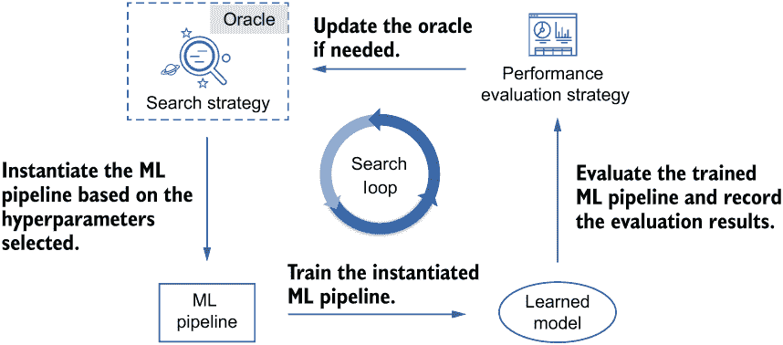

图 7.1 使用顺序搜索方法时的单个搜索循环

如前所述，如果 oracle 可以利用历史评估来更新自身并指导其从搜索空间中采样新的超参数，我们可以将顺序搜索方法分为两类：依赖于历史的方法和独立于历史的方法。根据更新的方式，依赖于历史的方法可以进一步分为以下两个主要类别：

+   *启发式方法*—通常受到生物行为的启发。一个典型的例子是*进化方法*，它通过模拟动物种群在代际间的进化来生成新的样本。我们将在本章的最后部分介绍如何创建一个进化搜索方法。

+   *基于模型的方法*—利用某些机器学习模型，如决策树模型，来预测搜索空间中哪些超参数是好的选择。使用先前超参数集的历史评估作为训练数据来训练机器学习模型。一个代表性的方法是我们在上一章中使用的贝叶斯优化方法。你将在第 7.3 节中学习如何实现这种方法。

这些方法可能是现有文献中最广泛使用的顺序搜索方法。然而，我们将从一种与历史无关的方法开始：随机搜索。我们将继续使用第六章中使用的加利福尼亚房价预测问题的 LightGBM 模型调优示例。代码将主要关注 oracle。加载数据和 tuner 类的实现代码保持不变，此处不再重复。完整的代码可以在本书的 GitHub 仓库中找到：[`mng.bz/oaep`](http://mng.bz/oaep)。

## 7.2 使用随机搜索方法入门

在本节中，我们将介绍如何使用 KerasTuner 创建随机搜索方法来探索搜索空间并找到更好的超参数。随机搜索方法是 AutoML 中进行超参数调整的最简单和最传统的方法之一。标准的随机搜索方法随机探索搜索空间中的超参数组合。这种方法在大多数情况下已被经验证明比网格搜索方法更强大。

为什么随机搜索通常比网格搜索更好？

我们将通过一个例子来描述这一点。更多细节可以在 James Bergstra 和 Yoshua Bengio 的论文“Random Search for Hyper-Parameter Optimization”中找到（[www.jmlr.org/papers/v13/bergstra12a.html](http://www.jmlr.org/papers/v13/bergstra12a.html)）。假设我们有两个连续的超参数，*x*和*y*，形成一个二维搜索空间。假设模型性能是一个与这些超参数相关的函数。更具体地说，它是由两个函数的加法函数组成的，每个函数都依赖于一个超参数：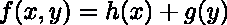。

不同的超参数对最终模型性能的影响不同，因此有些超参数的影响会比其他超参数小。假设超参数*y*相对于*x*具有边际效应，表示为 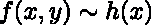。在空间的两个边界（左侧和上方）上，我们提供了两个函数曲线，形成每个超参数及其函数的一维子空间。每个函数曲线的高度也可以理解为指示超参数对最终模型评估的重要性。如果我们使用网格搜索方法通过九次试验来探索搜索空间，它将搜索空间划分为桶，并采样一个网格点（见图 a），这给出了空间的均匀覆盖。在这种情况下，尽管超参数的重要性不同，但网格搜索为每个超参数的子空间提供了相等的覆盖，而随机搜索则提供了对超参数*y*（重要的超参数）子空间更彻底的覆盖，如图 b 所示。

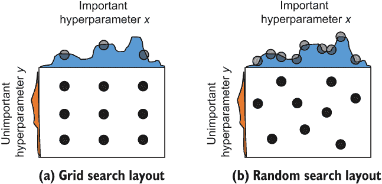

网格搜索与随机搜索的比较

KerasTuner 中的搜索方法实现为一个可以被调用的 Oracle 对象。在实现 Oracle 之前，我们需要理解 Oracle 函数与调优器函数之间的（参考逻辑）关系。

在搜索过程中调用的主要函数如列表 7.1 所示。调优器的 search()函数将在循环中调用两个主要函数。第一个，create_trial()，是 Oracle 的一个函数。它创建一个包含 Oracle 在当前试验中选择的超参数的试验对象，并将试验的状态设置为 RUNNING，意味着试验正在执行。超参数的采样是在一个名为 populate_space()的私有方法中完成的，这是我们需要实现的 Oracle 的主要函数。如果搜索方法是历史依赖的，我们将在采样之前根据评估结果更新它。试验对象创建后，它将携带超参数到调优器的主函数 run_trial()，正如我们在第六章所学，该函数用于实例化、训练、评估和保存当前试验中的 ML 模型。

列表 7.1 调优器函数与 Oracle 函数之间的参考逻辑

```
search (tuner)
    |-- create_trial (oracle)
        |-- populate_space (oracle)
    |-- run_trial (tuner)
        |-- instantiate, fit, evaluate model
        |-- save_model (tuner)
        |-- return the evaluation results
```

由于 KerasTuner 已经帮助我们封装了基 Oracle 类中的一些函数（例如 create_trial 函数），我们可以扩展基类并仅实现一个核心函数——populate_space()（该函数执行超参数采样并更新 Oracle）。

注意奥拉类包含一个 update_trial()函数，该函数使用 Tuner.run_trial()返回的值来更新奥拉。然而，不需要使用此函数来更新搜索方法。如果搜索方法需要根据历史评估进行更新，我们可以在进行超参数采样之前使用 populate_space()函数来处理这个问题。您将在 7.3 节中学习如何实现依赖历史的搜索方法。

由于随机搜索方法是历史无关的，populate_space()函数需要做的只是均匀随机采样超参数。我们使用基 Tuner 类的私有实用方法 _random_values 从搜索空间中生成随机样本。populate_space()函数的输出应该是一个包含试验状态和本次试验采样超参数值的字典。如果搜索空间为空或所有超参数都已固定，我们应该将试验状态设置为 STOPPED 以结束此试验。

列表 7.2 展示了如何实现随机搜索奥拉。尽管这可以忽略不计，但我们在这里包含初始化函数以供参考。您可以使用一些超参数来帮助控制搜索算法，例如随机种子，因此您可以添加这些超参数的属性。值得注意的是，搜索方法中的超参数不包含在搜索空间中，我们需要自己调整这些参数。它们被认为是*超超参数*，即用于控制超参数调整过程的超参数。我们将在接下来的章节中看到一些示例。

列表 7.2 随机搜索奥拉

```
class RandomSearchOracle(Oracle):

    def __init__(self, *args, **kwargs):                    ❶
        super().__init__(*args, **kwargs)

    def populate_space(self, trial_id):
        values = self._random_values()                      ❷
        if values is None:                                  ❸
            return {'status': <4> trial_lib.TrialStatus.STOPPED,
                    'values': None}
        return {'status': trial_lib.TrialStatus.RUNNING,    ❹
                'values': values}
```

❶ 奥拉（Oracle）的初始化函数

❷ 从搜索空间中随机采样的超参数值

❸ 检查采样到的超参数值是否有效

❹ 返回选定的超参数值和正确的试验状态

列表 7.3 展示了如何将随机搜索奥拉应用于调整使用 LightGBM 库实现的梯度提升决策树（GBDT）模型，以解决加利福尼亚房价预测任务。GBDT 模型按顺序构建多个树，并将每个新构建的树定位以解决先前树集成中的错误分类或弱预测。如果您不熟悉此模型，更多细节可以在附录 B 中找到。加载数据集和实现调整器的代码与上一章相同，因此我们不再展示。在这里，我们调整了 GBDT 模型的三个超参数：每棵树中的叶子数、树的数量（n_estimators）和学习率。经过 100 次搜索后，最佳发现的模型在测试集上实现了 0.2204 的均方误差（MSE）。

列表 7.3 使用自定义的随机搜索奥拉调整 GBDT 模型

```
def build_model(hp):
    model = lgb.LGBMRegressor(
        boosting_type='gbdt',
        num_leaves=hp.Int('num_leaves', 5, 50, step=1),
        learning_rate=hp.Float(
            'learning_rate', 1e-3, 1, sampling='log', default=0.01),
        n_estimators=hp.Int('n_estimators', 5, 50, step=1)
    )

    return model

>>> random_tuner = LightGBMTuner(
...     oracle=RandomSearchOracle(                         ❶
...         objective=kt.Objective('mse', 'min'),
...         max_trials=100,
...         seed=42),
...     hypermodel=build_model,
...     overwrite=True,
...     project_name='random_tuner')

>>> random_tuner.search(X_train, y_train, validation_data=(X_val, y_val))

>>> from sklearn.metrics import mean_squared_error         ❷
>>> best_model = random_tuner.get_best_models(1)[0]        ❷
>>> y_pred_test = best_model.predict(X_test)               ❷
>>> test_mse = mean_squared_error(y_test, y_pred_test)     ❷
>>> print(f'The prediction MSE on test set: {test_mse} ')

The prediction MSE on test set: 0.22039670222190072
```

❶ 为调整器提供自定义的随机搜索奥拉

❷ 检索并评估最佳发现的模型

为了展示搜索过程的样子，我们提取了所有搜索模型的评估性能，并按顺序绘制它们。模型按照试验完成的顺序记录在 oracle 的 end_order 属性中，在我们的例子中是 random_tuner.oracle.end_order。试验的完成顺序与开始顺序相同，因为我们在这个案例中没有进行并行试验。绘制搜索曲线的代码显示在列表 7.4 中。

列表 7.4 绘制搜索过程

```
import matplotlib.pyplot as plt

def plot_curve(x, y, xlabel, ylabel, title):
    plt.plot(x, y)
    plt.xlabel(xlabel)
    plt.ylabel(ylabel)
    plt.title(title)
    plt.show()

mse = [random_tuner.oracle.get_trial(trial_id).score for trial_id
➥ in random_tuner.oracle.end_order]
ids = list(range(len(mse)))
plot_curve(ids, mse, 'Trials in finishing order', 
    'Validation MSE', 'Searched results')
```

在图 7.2 中，我们可以看到在随机搜索过程中发现的模型评估结果波动很大。因为随机搜索不能考虑历史评估，所以后来发现的模型没有从先前结果中受益，并且不一定比早期的模型更好。

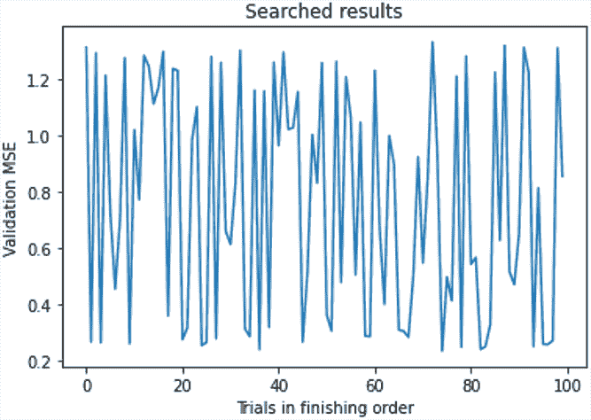

图 7.2 随机搜索过程中的模型评估结果

在下一节中，我们将介绍一种依赖于历史评估的顺序搜索方法，该方法可以利用历史评估来提高搜索效率。

## 7.3 自定义贝叶斯优化搜索方法

在本节中，我们介绍了一种基于模型的顺序搜索方法，称为*贝叶斯优化*。它被设计用来优化*黑盒函数*，这些函数没有解析形式的解。在 AutoML 的背景下，这种情况很常见，因为要优化的函数是模型评估性能。黑盒函数通常评估成本很高，这使得通过暴力随机采样和评估来找到全局最优解变得不切实际。由于模型训练和评估的成本，可能无法进行多次超参数搜索试验。贝叶斯优化方法解决这一挑战的关键思想与以下两个函数相关：

+   我们训练一个称为*代理函数*（或*代理模型*）的函数来近似模型评估性能。从统计学的角度来看，这个代理函数是一个概率模型，它近似目标函数。我们根据我们对目标函数外观的信念（例如，稍后我们将使用高斯过程先验，这是最常用的先验）自行估计其先验分布。代理模型使用 ML 模型的历史评估进行训练，作为一种更便宜的方式来获取先前未见过的模型性能，尽管是近似的。这个过程与解决回归任务非常相似，其中每个模型都是一个实例。超参数是实例的特征，模型性能是目标。理论上，如果代理模型足够好，我们就不必对 ML 模型进行真实的训练和评估。但由于我们只有有限的学习数据（模型评估），在 AutoML 问题中这通常在实际上是不可能的。

+   一旦我们有了代理模型，我们就可以采样一个新的超参数组合来创建一个用于评估的模型。为了进行采样，我们需要基于代理函数设计另一个函数，称为*获取函数*。此函数指定了比较 ML 模型（由超参数确定）的标准，以便我们可以选择最有希望的模型进行训练和评估。

如您所见，这两个函数对应于序列 AutoML 流程中的两个步骤。在更新步骤中，我们根据历史评估训练代理模型。在采样步骤中，我们使用获取函数来采样下一个要评估的模型。迭代这两个步骤将为我们提供额外的历史样本，以帮助训练一个更准确的代理模型。在本节的剩余部分，我们将提供一种贝叶斯优化搜索方法的逐步实现。在这个过程中，您将学习以下内容：

+   如何向量化超参数以训练代理模型

+   你应该选择哪种代理模型

+   如何初始化训练初始代理模型的流程

+   如何设计一个获取函数并根据它采样要评估的超参数

### 7.3.1 向量化超参数

由于贝叶斯优化搜索方法，就像其他基于模型的搜索方法一样，是根据访问过的样本来训练模型的，一个自然的问题是如何将超参数转换为模型可接受的特征。最常见的方法是将每个试验中选择的超参数编码为一个数值向量，表示在本试验中选择的 ML 管道的特征。将应用逆转换将采样步骤中选择的向量解码为原始超参数，以实例化 ML 管道。

让我们先实现一个用于向量化超参数的函数。我们将将其作为 Oracle 类的私有方法实现，命名为 _vectorize_trials。关键思想是逐个提取所有超参数并将它们连接成一个向量。在搜索过程中，所有试验都保存在 Oracle 类的名为 self.trials 的字典属性中。值和键分别代表试验对象及其唯一 ID。超参数保存在试验对象的属性中（trial.hyperparameters）。这是一个超参数容器，它包含试验中选定的超参数以及整个搜索空间结构。我们可以使用 trial.hyperparameters.values 检索每个试验中选定的超参数并将其放入字典中。然后，将试验中选定的超参数转换为向量就变成了将字典的值转换为向量的问题。如果我们的所有超参数值最初都是数值型的，例如学习率、单元数量和层数，我们可以直接逐个连接它们。然而，您需要注意以下问题：

+   *处理具有固定值的超参数*—因为这些超参数不会影响模型之间的比较，我们可以明确地删除它们，这样搜索方法就不会考虑它们。这可以减轻搜索方法的负担并避免在搜索方法的更新中引入额外的噪声。

+   *处理不活跃的条件超参数*—某些条件超参数可能不会在每次试验中被选中。例如，假设我们有一个名为'model_type'的超参数，用于在 MLP 和 CNN 之间进行选择。如果试验中选定的模型是 MLP，则 CNN 的超参数（如滤波器数量）将不会被选中和使用。这会导致转换后的向量长度不同，因此两个向量中相同位置的元素可能不对应于同一超参数。解决这个问题的简单方法是在向量中使用任何不活跃（未选中）的超参数的默认值。超参数容器提供了一个名为 is_active()的方法来检查超参数是否已被选中。如果超参数是活跃的，您可以附加其选中的值；如果不是，则提取保存在 hyperparameters.default 中的默认值并替换附加。

+   *处理不同尺度的超参数*——超参数通常在不同的尺度上。例如，学习率通常小于 1，GBDT 模型中的树的数量可能大于 100。为了归一化超参数，我们可以使用累积概率将它们转换为 0 到 1 之间的值。图 7.3 显示了将离散搜索空间和连续搜索空间转换为相应的累积分布的两个示例。对于连续搜索空间，我们直接将其映射到 0 和 1 的区间。如果超参数在对数尺度上采样，将应用对数变换。对于离散搜索空间，我们假设每个值是均匀分布的，概率单位将根据空间中的值选择数量进行等分。我们使用每个概率桶中的中心值来表示每个值选择。

+   *处理模型类型等分类超参数*——为了将分类超参数转换为数值特征，我们可以使用列表中特征的索引。例如，如果我们有四个要选择的模型[MLP, CNN, RNN, GBDT]，列表可以转换为[0, 1, 2, 3]，其中模型分别用 0, 1, 2, 3 表示。然后，该向量进一步根据将离散搜索空间转换为累积概率的机制归一化到 0 和 1。 

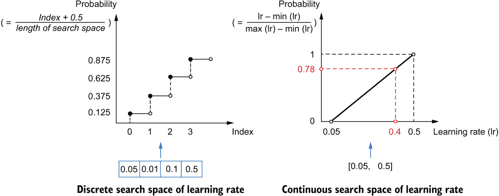

图 7.3 基于累积概率归一化超参数值

列表 7.5 中的代码描述了向量化过程的细节。我们遍历所有现有的试验，将所有超参数转换为特征向量，并将对应模型的评估分数转换为一个响应向量。对于每个试验，我们忽略固定的超参数，遍历其余部分。如果一个超参数被检测为活动状态（在当前试验选择的管道中使用），我们将直接使用搜索方法选择的值。否则，使用默认值填充向量，使其与其他向量长度相同。为了归一化目的，向量中的值进一步替换为累积概率。如果一个试验完成，评估结果将附加到响应向量 y 中。因为对于某些指标，较小的值更好（例如 MSE），而对于其他指标，较大的值更好（例如分类准确率），我们将它们统一，使得所有情况下较大的值更好，通过将第一种类型指标的值乘以-1。

列表 7.5 将超参数编码为向量的私有方法

```
from keras_tuner.engine import hyperparameters as hp_module

class BayesianOptimizationOracle(oracle_module.Oracle):
    def _vectorize_trials(self):
        x, y = [], []
        for trial in self.trials.values():                              ❶
            trial_hps = trial.hyperparameters
            vector = []
            nonfixed_hp_space = [hp for hp in self.hyperparameters.space
                if not isinstance(hp, hp_module.Fixed)]                 ❷
            for hp in nonfixed_hp_space:
                if trial_hps.is_active(hp):                             ❸
                    trial_value = trial_hps.values[hp.name]
                else:
                    trial_value = hp.default                            ❹
                prob = hp_module.value_to_cumulative_prob(trial_value, hp)
                vector.append(prob)

            if trial.status == 'COMPLETED':
                score = trial.score
                if self.objective.direction == 'min':
                    score = -1 * score                                  ❺
            else:
                continue

            x.append(vector)
            y.append(score)

        x = np.array(x)
        y = np.array(y)
        return x, y
```

❶ 遍历所有试验

❷ 记录未固定的超参数

❸ 检测当前试验中是否选择了超参数

❹ 为未使用的超参数使用默认值

❺ 统一评估分数，使得较大的值始终更好

一旦我们得到了基于获取函数（稍后介绍）采样的向量格式的新的超参数集，我们需要将向量作为值输入到超参数容器中。逆变换过程简单，涉及以下步骤：

1.  将向量中的累积概率转换为每个超参数的真实值。

1.  将每个超参数的值输入到超参数容器中。

通过遍历搜索空间中的所有超参数，我们按照这两个步骤依次转换向量中的每个值。对于每个固定的超参数，默认值（以下列表中的 hp.value）被放入容器中。所有值都保存在超参数容器的字典（hps.values）中，并返回以帮助创建下一个试验。逆变换函数的实现介绍在列表 7.6 中。我们将在 populate_ 空间()函数中使用它来帮助转换由获取函数选择的向量。

列表 7.6 将向量解码为超参数的私有方法

```
class BayesianOptimizationOracle(oracle_module.Oracle):
    def _vector_to_values(self, vector):
        hps = hp_module.HyperParameters()        ❶
        vector_index = 0
        for hp in self.hyperparameters.space:
            hps.merge([hp])                      ❷
            if isinstance(hp, hp_module.Fixed):
                value = hp.value                 ❸
            else:
                prob = vector[vector_index]
                vector_index += 1
                value = hp_module.
➥ cumulative_prob_to_value(prob, hp)            ❹

            if hps.is_active(hp):
                hps.values[hp.name] = value      ❺
        return hps.values
```

❶ 创建一个空的超参数容器

❷ 将超参数合并到容器中

❸ 如果超参数被固定，则使用默认值

❹ 将累积概率转换回超参数值

❺ 将超参数的原始值放入容器中

超参数的编码应与搜索方法中采用的代理模型相匹配。在下一阶段，我们将使用高斯过程作为我们的代理模型，它接受向量输入，因此我们在这里采用向量表示。

注意：研究社区中的一些近期工作将超参数表示为树或图，其中树或图中的每个节点代表一个超参数，其叶子表示其条件超参数。这些结构擅长表示超参数之间的条件层次结构，我们可以使用一些基于树或图的先进搜索方法来直接遍历树或图以采样新的超参数组合。你可以在 Yi-Wei Chen 等人撰写的调查论文“自动机器学习技术”（ACM SIGKDD Explorations Newsletter, 2020）中找到更多内容。

### 7.3.2 基于历史模型评估更新代理函数

在 AutoML 的背景下，在给它任何数据之前，代理函数仅仅是一个先验，表示我们对真实超参数评估函数外观的主观信念。例如，一个常见的选择是高斯过程先验，如图 7.4(a)所示，它可以理解为由无限多个高斯随机变量组成的分布函数，描述了搜索空间中所有模型的评估性能。高斯过程由所有高斯变量的均值函数和协方差函数完全指定。中间的曲线是均值函数，表示所有高斯随机变量的平均值，我们可以用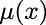表示。*x*表示 AutoML 中的向量化超参数（在这里，我们只有一个超参数用于说明目的）。灰色范围表示高斯变量的标准差（STD），可以用表示。在这种情况下，每个纵向截面代表一个高斯分布。平均值近似于给定所选超参数*x*的 ML 管道的评估性能。方差（或 STD）表示近似的不确定性。因为变量之间存在相关性，为了完全描述高斯过程，我们需要定义一个协方差函数，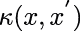（通常称为*核函数*），来模拟任意两个高斯变量之间的协方差，具体来说，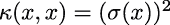。变量之间的协方差对于帮助预测给定未见过的超参数的分布非常重要。例如，如果所有变量都是独立的，这意味着在给定其超参数的任何两个 ML 管道的性能中不存在条件相关性。

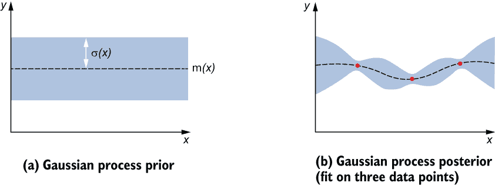

图 7.4 高斯过程代理模型的更新

在这种情况下，我们有的噪声是白噪声（对应于高斯过程中的*白核*）。衡量 ML 管道性能的唯一方法是对它们进行逐个评估，并通过对每个模型进行多次评估来估计每个模型的噪声。这通常不是我们想要的，因为我们期望减少模型评估的数量，而在实践中通常不是这样，因为相似的超参数设置往往会生成性能更接近的 ML 管道。随着收集越来越多的数据（评估模型），预测的均值函数将穿过新的点，不确定性（STD）将降低，如图 7.4(b)所示。

核函数的选择取决于我们对目标函数平滑度的假设。它是一个超超参数，不包括在搜索空间中，应手动选择或调整。常见的核函数选择是 *Matérn 核函数*。它有一个参数  用于设置函数的平滑度程度。我们通常将  设置为 0.5、1.5 或 2.5，分别对应于我们假设函数应该是一、二或三次可微的。当  接近无穷大时，Matérn 核函数就接近一个称为 *平方指数核函数*（也称为 *径向基函数核*，您可能在前一章的 SVM 模型中记得），这反映了目标函数是无限可微的。还有一些用于建模周期函数的核函数，例如 *Exp-Sine-Squared 核函数*。您可以在 Carl Edward Rasmussen 和 Christopher K. I. Williams 所著的《机器学习中的高斯过程》（MIT Press，2006 年）一书中了解更多关于不同核函数的信息。

要实现用于贝叶斯优化的高斯过程模型，我们可以使用 scikit-learn 库中的 gaussian_process 模块。在初始化预言者时，我们可以使用 Matérn 核函数创建一个高斯过程模型。alpha 参数用于指定在模型评估过程中引入的随机噪声量。我们通常将其设置为一个小数，并且根据经验，这足以并且对考虑环境噪声来说是好的。我们在 populate_space() 函数中实现了高斯过程模型的初始训练和顺序更新。一旦我们有了每一轮中搜索的新模型的评估，高斯过程模型就会更新。最初，我们随机采样几个模型进行评估，然后对高斯过程模型进行初始训练。如果未在 num_initial_points 属性中提供，则随机样本的数量定义为 2，以确保核函数可以实际应用。（根据经验，搜索空间中超参数数量的平方根是初始化高斯过程模型时使用的随机点的良好数量。）

一旦我们有了足够的随机样本，我们将超参数和评估向量化，并通过调用 fit() 函数来拟合高斯过程模型，如列表 7.7 所示。后来，在顺序搜索过程中，每当评估新的模型时，我们都会基于所有完成的试验重新拟合模型。在这里，我们只描述高斯过程模型的更新，而不展示基于获取函数的采样过程。您将在下一步中看到 populate_space() 函数的完整实现。

列表 7.7 在预言者中创建和更新高斯过程模型

```
from sklearn import exceptions
from sklearn import gaussian_process

class BayesianOptimizationOracle(oracle_module.Oracle):
    def __init__(self,
                 objective,
                 max_trials,
                 num_initial_points=None,
                 seed=None,
                 hyperparameters=None,
                 *args, **kwargs):
        super(BayesianOptimizationOracle, self).__init__(
            objective=objective,
            max_trials=max_trials,
            hyperparameters=hyperparameters,
            seed=seed,
            *args, **kwargs)
        self.num_initial_points = num_initial_points 
➥ or 2                                                            ❶
        self.seed = seed or random.randint(1, 1e4)
        self.gpr = self._make_gpr()                                ❷

    def _make_gpr(self):
        return gaussian_process.GaussianProcessRegressor(
            kernel=gaussian_process.kernels.Matern(nu=2.5),
            alpha=1e-4,
            normalize_y=True,
            random_state=self.seed)

    def populate_space(self, trial_id):

        if self._num_completed_trials() < self.num_initial_points:
            return self._random_populate_space()                   ❸

        x, y = self._vectorize_trials()                            ❹
        try:
            self.gpr.fit(x, y)                                     ❺
        except exceptions.ConvergenceWarning:
            raise e
```

❶ 如果未指定，则使用 2 作为初始随机点的数量

❷ 初始化高斯过程模型

❸ 对初始化高斯过程模型进行随机采样

❹ 向量化所有试验

❺ 根据完成的试验拟合高斯过程模型

拟合 *n* 个数据点的复杂度会是 *O*(*n*³)，这相当耗时。这是高斯过程在基于模型的搜索方法中的主要缺点。不同的方法使用其他代理模型，例如基于树的模型（例如，随机森林）和神经网络，来克服这一点。您可以从 Frank Hutter、Lars Kotthoff 和 Joaquin Vanschoren 合著的《自动机器学习：方法、系统、挑战》（Springer Nature，2019 年）一书中了解更多关于用于自动机器学习中的贝叶斯优化的代理模型。

### 7.3.3 设计获取函数

一旦我们有了代理模型，我们需要一个获取函数来帮助采样下一个机器学习管道以进行评估，并创建一个封闭的顺序搜索循环。让我们首先介绍获取函数的设计标准，然后讨论如何根据该函数采样一个点。

获取函数的设计标准

一个好的获取函数应该衡量一个点对于采样的吸引力。吸引力是两个方面的权衡：*利用*和*探索*。利用意味着我们希望发现代理模型预测为好的点。这将考虑到我们已经探索过的有希望的领域，但缺乏探索未知领域的能力。例如，在图 7.5 中，假设我们的真实目标函数曲线是 *f*(*x*)，并且给定五个点，我们通过三个点拟合了一个高斯过程，其均值函数为 。超参数 *x[a]* 附近的区域比点 *x[b]* 附近的区域探索得更多，导致 *x[b]* 附近的 STD 比 *x[a]* 附近的 STD 大得多。如果我们只考虑预测的均值函数，充分利用利用能力，*x[a]* 比较好于 *x[b]*。然而，*x[a]* 在目标函数上比 *x[b]* 差。这需要一个获取函数来平衡利用（均值）和探索（方差）。

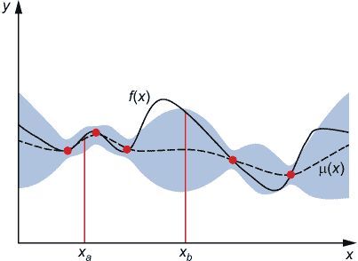

图 7.5 更新高斯过程代理模型

现在我们来看三种常用的获取函数及其实现。

上置信界

假设 *y* 的较大值更好，*上置信界* (UCB) 通过将均值和 STD 函数相加以简单直接地平衡利用和探索： 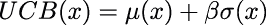，其中 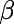 是用户指定的用于平衡两个术语之间权衡的正参数。如图 7.6 所示，曲线 *g*(*x*) 是当 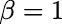 时的 UCB 获取函数。如果较小的值更可取，我们可以使用 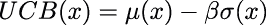。

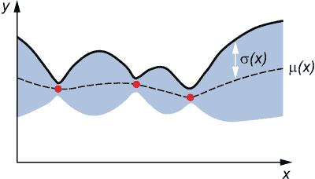

图 7.6 上置信界

实现该函数的示例代码如下所示。在这里，self.gpr 表示拟合的高斯过程回归器，*x*表示 ML 管道的超参数向量。

列表 7.8 计算上置信界

```
def upper_confidence_bound(x):
    x = x.reshape(1, -1)
    mu, sigma = self.gpr.predict(x, return_std=True)
    return mu + self.beta * sigma
```

改善概率

*改善概率*（PI）衡量一个样本实现比迄今为止找到的最佳样本更好的性能的概率。如图 7.7 所示，给定最佳点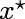和相应的目标值，点*x*实现比更好的性能的概率等于由和定义的高斯分布的阴影区域。我们可以借助正态分布的累积分布函数来计算这个概率。


图 7.7 改进概率

PI 的代码实现如列表 7.9 所示。如果我们假设不存在环境噪声，我们可以直接使用评估目标，或者我们可以设置一个噪声值（当使用 scikit-learn 创建回归器时 alpha 不等于 0）并使用基于噪声的高斯过程回归器给出的预测值选择最佳点。PI 的一个问题是它倾向于查询接近我们已评估的点，尤其是最佳点，导致对已探索区域的利用度高，探索能力低。

列表 7.9 计算改进概率

```
def _probability_of_improvement(x):
    x_history, _ = self._vectorize_trials()              ❶
    y_pred = self.gpr.predict(
        x_history, return_std=False)                     ❷
    y_best = max(yhat)   
    mu, sigma = self.gpr.predict(x, return_std=True)     ❸
    z = (mu - y_best) / (sigma+1E-9)                     ❹
    prob = norm.cdf(z)                                   ❹
    return prob
```

❶ 向量化所有试验

❷ 计算迄今为止找到的最佳代理分数

❸ 通过代理函数计算均值和标准差

❹ 计算改进概率

期望改进

*期望改进*（EI）通过使用改进幅度的量来加权计算改进概率，从而缓解了 PI 的问题（见图 7.8）。这相当于计算到目前为止找到的最优值的期望改进：。

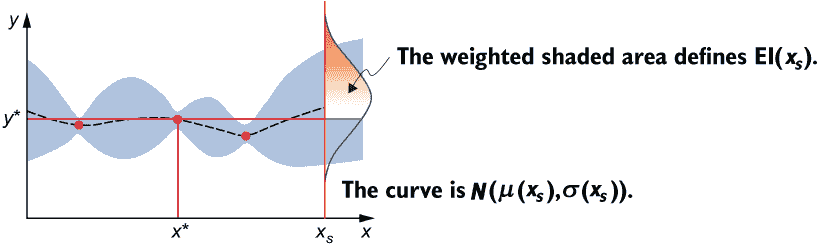

图 7.8 某点的期望改进

列表 7.10 提供了一个显式方程，用于利用正态分布的概率密度函数（norm.pdf）和累积分布函数（norm.pdf）来计算 EI。该方程的详细推导可以在 Donald R. Jones、Matthias Schonlau 和 William J. Welch 的论文“Efficient Global Optimization of Expensive Black-Box Functions”中找到（[`mng.bz/5KlO`](http://mng.bz/5KlO)）。

列表 7.10 计算期望改进

```
def _expected_improvement(x):
    x_history, _ = self._vectorize_trials()
    y_pred = self.gpr.predict(x_history, return_std=False)
    y_best = max(yhat)
    mu, sigma = self.gpr.predict(x, return_std=True)
    z = (mu - y_best) / (sigma+1E-9)
    ei = (mu - y_best) * norm.cdf(z) + sigma * norm.pdf(z)
    return ei
```

为了增强 PI 和 EI 的探索能力，我们还可以将一个正参数添加到最优目标值中：(07-08-EQ15)。参数  的值越大，探索量就越大。在实践中，UCB 和 EI 是现有 AutoML 库中最常用的获取函数类型。UCB 在平衡探索和利用方面相对更直接。

### 7.3.4 通过获取函数采样新的超参数

现在你已经知道了如何创建一个获取函数，现在是时候利用这个函数来采样下一个试验中评估的超参数值。目标是找到使获取函数达到最大值的超参数向量。这是一个约束优化问题，因为每个超参数都被定义的搜索空间所限制。一种用于最小化有边界约束的函数的流行优化方法是 *L-BFGS-B 算法*。

注意：BFGS 是一种优化算法，它从一个初始向量开始，根据逆海森矩阵的估计迭代地将其优化到局部最优。我们可以使用不同的初始化向量多次优化以获得更好的局部最优。L-BFGS 通过近似优化它，以便在优化过程中使用的内存量可以限制。L-BFGS-B 进一步扩展了算法以处理搜索空间的边界框约束。更多细节可以在 D. C. Liu 和 J. Nocedal 的文章中找到，“关于大规模优化的有限内存方法”，*Mathematical Programming* 45, no. 3 (1989): 503-528 (doi:10.1007/BF01589116)。

该方法使用 scipy Python 工具包中的 optimize 模块实现，如列表 7.11 所示。我们首先实现一个名为 get_hp_bounds() 的函数来收集超参数的边界。因为我们已经根据累积概率对超参数进行了归一化，所以边界被设置为每个超参数的 0 到 1。我们在 x_seeds 中均匀生成 50 个不同的初始化向量，并使用 50 个不同的初始化向量优化获取函数 50 次。优化是在连续向量空间中进行的，并且可以使用 Oracle 基类中定义的 self._vector_to_values 函数将最优向量转换回原始超参数值。

列表 7.11 基于 UCB 获取函数的样本

```
from scipy import optimize as scipy_optimize

class BayesianOptimizationOracle(oracle_module.Oracle):
    def __init__(self,
                 objective,
                 max_trials,
                 beta=2.6,
                 num_initial_points=None,
                 seed=None,
                 hyperparameters=None,
                 *args, **kwargs):
        super(BayesianOptimizationOracle, self).__init__(
            objective=objective,
            max_trials=max_trials,
            hyperparameters=hyperparameters,
            seed=seed,
            *args, **kwargs)

        self.num_initial_points = num_initial_points or 2
        self.beta = beta
        self.seed = seed or random.randint(1, 1e4)
        self._random_state = np.random.RandomState(self.seed)
        self.gpr = self._make_gpr()

    def _make_gpr(self):
        return gaussian_process.GaussianProcessRegressor(
            kernel=gaussian_process.kernels.Matern(nu=2.5),
            alpha=1e-4,
            normalize_y=True,
            random_state=self.seed)
    def _get_hp_bounds(self):
        nonfixed_hp_space = [hp for hp in self.hyperparameters.space
            if not isinstance(hp, hp_module.Fixed)]
        bounds = []
        for hp in nonfixed_hp_space:
            bounds.append([0, 1])                                                 ❶
        return np.array(bounds)

    def populate_space(self, trial_id):

        if self._num_completed_trials() < self.num_initial_points:
            return self._random_populate_space()                                  ❷

        x, y = self._vectorize_trials()
        try:
            self.gpr.fit(x, y)
        except exceptions.ConvergenceWarning:
            raise e
        def _upper_confidence_bound(x):
            x = x.reshape(1, -1)
            mu, sigma = self.gpr.predict(x, return_std=True)
            return -1 * (mu + self.beta * sigma)                                  ❸

        optimal_val = float('inf')
        optimal_x = None
        num_restarts = 50                                                         ❹
        bounds = self._get_hp_bounds()
        x_seeds = self._random_state.uniform(bounds[:, 0], bounds[:, 1],
                                             size=(num_restarts, bounds.shape[0]))❹
        for x_try in x_seeds:
            result = scipy_optimize.minimize(_upper_confidence_bound,
                                             x0=x_try,
                                             bounds=bounds,
                                             method='L-BFGS-B')                   ❺
            if result.fun[0] < optimal_val:
                optimal_val = result.fun[0]
                optimal_x = result.x

        values = self._vector_to_values(optimal_x)                                ❻
        return {'status': trial_lib.TrialStatus.RUNNING,
                'values': values}
```

❶ 添加超参数的归一化边界

❷ 对训练初始高斯过程回归器的随机搜索

❸ 为了最小化的目的，UCB 得分的符号被反转。

❹ 在边界内均匀生成 50 个随机向量

❺ 最小化反转的获取函数

❻ 将最优向量映射到原始超参数值

通过结合向量化函数、采样函数和创建高斯过程回归器的函数，我们可以创建一个完整的贝叶斯优化算子，用于执行 AutoML 任务。接下来，我们将使用它来调整房价预测任务的 GBDT 模型。

### 7.3.5 使用贝叶斯优化方法调整 GBDT 模型

我们以与随机搜索部分相同的方式加载数据并分割数据，并使用定制的调整器来调整 GBDT 模型。唯一的区别是我们将随机搜索算子更改为贝叶斯优化算子，如下所示。最佳模型在最终测试集上的均方误差（MSE）为 0.2202。

列表 7.12 基于 UCB 获取函数的采样

```
>>> bo_tuner = LightGBMTuner(
...     oracle=BayesianOptimizationOracle(
...         objective=kt.Objective('mse', 'min'),
...         max_trials=100,
...         seed=42),              ❶
...     hypermodel=build_model,
...     overwrite=True,
...     project_name='bo_tuner')

>>> bo_tuner.search(X_train, y_train, validation_data=(X_val, y_val))

>>> from sklearn.metrics import mean_squared_error
>>> best_model = bo_tuner.get_best_models(1)[0]
>>> y_pred_test = best_model.predict(X_test)
>>> test_mse = mean_squared_error(y_test, y_pred_test)
>>> print('The prediction MSE on test set: {}'.format(test_mse))

The prediction MSE on test set: 0.2181461078854755
```

❶ 使用定制的贝叶斯优化搜索算子

让我们比较贝叶斯优化搜索与随机搜索的结果，以更好地理解这两种方法。我们按顺序提取了在搜索过程中发现的全部模型的评估性能。图 7.9(a)直接显示了在验证集上评估的发现模型的均方误差（MSE）。与随机搜索方法不同，贝叶斯优化搜索的模型性能随着搜索过程的继续而逐渐稳定。这是因为贝叶斯优化考虑了历史信息，并可以利用利用性进行搜索，因此后来发现的模型可能比早期发现的模型具有相当甚至更好的性能。图 7.9(b)显示了随着搜索过程的进行，迄今为止找到的最佳模型的性能。我们可以看到，随机搜索在开始时表现略好，但在后期变得较差。这是因为随机搜索在开始时比贝叶斯优化搜索能更好地探索搜索空间，但随着收集的历史数据量增加，这些信息可以被利用来改善搜索过程。

尽管在这个例子中贝叶斯优化方法优于随机搜索，但在实际应用中并不总是如此，尤其是在搜索空间较小且存在大量分类和条件超参数的情况下。我们应该根据搜索空间的大小、搜索迭代次数以及时间和资源限制（如你所经历的，纯贝叶斯优化方法运行速度远慢于随机搜索）来选择和调整不同的搜索方法。如果没有指定具体限制，贝叶斯优化搜索是一个不错的起点。

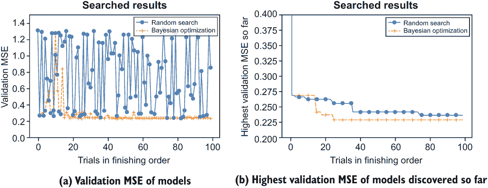

图 7.9 比较贝叶斯优化和随机搜索的结果

除了增加的复杂性之外，当应用贝叶斯优化时，你可能会遇到另一个问题，即局部最优问题。尽管我们在优化采样获取函数时尝试探索多个初始化点，但如果基于历史样本的代理模型拟合不佳，或者获取函数过于偏向于利用，那么仍然很可能会总是从局部区域采样。这样做会导致对局部区域的集中利用，而忽略探索其他区域，如果评估性能表面不是凸的。除了增加获取函数的探索偏好，例如通过减少 UCB 获取函数中的参数，我们还有以下两个常用的技巧来防止贝叶斯优化收敛到局部最优：

+   多次进行贝叶斯优化搜索，并使用不同的随机种子来采样不同的随机点以拟合初始代理模型。

+   以动态方式结合贝叶斯优化和随机搜索：在贝叶斯优化搜索的每几次迭代（比如说，五次）之后进行一次随机搜索迭代，交替进行两种方法。

此外，如果搜索迭代次数较多，并且你有时间，那么对每个发现的模型使用交叉验证而不是简单地在一个固定的验证集上评估每个模型，这是一个好习惯。这有助于防止搜索方法在验证集上过度拟合，并且对于任何搜索算法通常都是实际有用的。

### 7.3.6 恢复搜索过程和恢复搜索方法

由于 AutoML 过程通常相当长，并且可能会意外中断，我们可以添加两个辅助函数来帮助恢复搜索过程并恢复预言者（参见列表 7.13）。KerasTuner 的基本 Oracle 类提供了两个可以扩展的函数，用于记忆和重新加载历史试验和元数据以恢复预言者。首先，我们可以扩展 get_state()函数，该函数在搜索过程中记忆预言者历史试验的状态和参数。此函数将在每个搜索循环中被调用以保存试验和预言者的当前状态。为了实现它，我们首先需要调用基类的 get_state()函数以获取当前试验的状态字典，然后使用搜索方法的唯一超参数更新它。例如，我们可以在状态对象中保存随机种子、随机初始化试验的数量以及 UCB 获取函数中的利用-探索权衡参数。其次，为了重新加载预言者的状态，我们可以扩展 set_state()函数。该函数将访问从磁盘重新加载的先前状态，并检索有关所有历史试验和预言者参数的信息。例如，在贝叶斯优化预言者中，我们可以调用 set_state()函数来检索所有模型评估信息，并使用加载的状态字典逐个恢复预言者的属性。

列表 7.13 恢复预言者

```
class BayesianOptimizationOracle(oracle_module.Oracle):

    def get_state(self):
        state = super().get_state()
        state.update({
            'num_initial_points': self.num_initial_points,
            'beta': self.beta,
            'seed': self.seed,
        })                                            ❶
        return state

    def set_state(self, state):
        super().set_state(state)                      ❷
        self.num_initial_points = state[
➥ 'num_initial_points']                              ❸
        self.beta = state['beta']                     ❸
        self.seed = state['seed']                     ❸
        self._random_state = np.random.RandomState(   ❸
            self.seed)                                ❸
        self.gpr = self._make_gpr()                   ❸
```

❶ 在状态中保存特定于预言者的配置

❷ 重新加载历史状态

❸ 恢复贝叶斯优化预言者

在恢复搜索过程时，我们可以使用想要从中恢复的项目名称初始化 tuner，并以前述方式进行搜索。唯一的区别是在初始化期间将 overwrite 参数设置为 False，这样 tuner 将自动恢复与工作目录中现有项目（以下列表中的 bo_tuner）具有相同名称的搜索过程。我们已实现的 set_state()函数将随后被调用以帮助恢复预言者。

列表 7.14 恢复预言者

```
bo_tuner = LightGBMTuner(
    oracle=BayesianOptimizationOracle(
        objective=kt.Objective('mse', 'min'),
        max_trials=100,
        seed=42),
    hypermodel=build_model,
    overwrite=False,           ❶
    project_name='bo_tuner')   ❷

bo_tuner.search(X_train, y_train, validation_data=(X_val, y_val))
```

❶ 如果已存在，则不会覆盖命名项目

❷ 提供要恢复和/或保存搜索过程的项目名称

下一个部分将介绍另一种常用的基于历史的方法，它不需要选择代理模型或获取函数。

## 7.4 自定义进化搜索方法

*进化搜索方法*是一种受生物行为启发的启发式搜索方法。在 AutoML 中已被广泛使用的一种最流行的方法是基于*种群*的进化搜索方法，它通过以下四个步骤模拟生物种群的发展：

1.  *初始种群生成*—随机生成一组初始机器学习管道并评估它们以形成初始种群。在开始之前，我们应该预先定义种群的大小。

1.  *父代选择*—选择最适应的管道，称为父代，用于繁殖新的子管道（后代）以在下一个试验中进行评估。

1.  *交叉和变异*—这些操作可以根据父代繁殖新的后代。*交叉*意味着我们交换两个父代管道的一些超参数以形成两个新的管道。*变异*意味着我们随机改变父代或从交叉操作生成的后代的一些超参数以引入一些变异。此操作模仿遗传变异中的“染色体中的调整”，以增强搜索过程中的探索能力。交叉和变异操作不必都执行。我们可以只用其中一个来生成新的后代。例如，我们不必结合两个管道，我们可以在每个试验中从种群中选择一个父代机器学习管道，并对其一个或多个超参数进行变异，以生成下一个要评估的管道。

1.  *生存者选择（种群再生）*—在新的后代被评估后，此步骤通过用新的后代替换最不适应的管道来重新创建一组新的机器学习管道种群。

步骤 2 到 4 在搜索过程中迭代执行，以纳入新的评估，如图 7.10 所示。

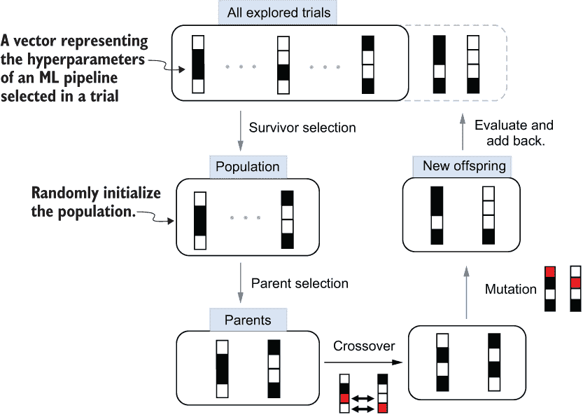

图 7.10 基于人群的进化搜索生命周期

### 7.4.1 进化搜索方法中的选择策略

虽然交叉和变异步骤决定了我们如何从现有管道中创建新的后代，但在设计良好的进化方法中，两个选择步骤中选择的策略（父代选择和生存者选择）可能更为重要。选择步骤应在搜索过程中平衡利用和探索。这里的利用代表我们希望多么强烈地选择具有良好评估性能的管道作为父代。探索意味着引入更多的随机性来尝试未探索的区域，而不是仅仅关注最适应的管道。利用和探索之间的权衡也被称为进化方法文献中*选择强度*和*选择多样性*之间的平衡。让我们看看三种流行的选择方法。

比例选择

在 *比例选择*（或 *轮盘赌选择*）中，我们根据概率分布选择一个个体。选择个体的概率与其适应度成正比。例如，如果我们想选择一个用于分类的机器学习管道，我们可以使用准确度来衡量每个管道的适应度。管道的准确度越高，我们应该分配给它的概率就越大。一个管道 *i* 可以以概率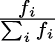被选为父代，其中 *f[i]* 表示管道 *i* 的非负准确度，分母是种群中所有管道准确度的总和。在幸存者选择步骤中，我们可以使用迄今为止探索的所有管道的准确度总和，并采样多个个体（无重复）来形成下一次搜索循环的种群。尽管这是一个流行的方法，但它存在一些问题。值得注意的是，存在过早收敛的风险，因为如果某些管道的准确度远高于其他管道，它们倾向于被反复选择。

排名选择

*排名选择* 采用与比例选择相似的战略，但使用管道的适应度排名来计算概率。例如，假设我们在种群中有三个管道，其准确度排名为 1、2 和 3。我们可以分别赋予它们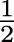、和的概率，从它们中选择一个父代。概率的设计平衡了选择强度和多样性。这里的例子是一个线性排名选择策略，其中概率与个体的排名成正比。我们也可以使用非线性概率来增强利用或探索。例如，通过给排名更高的管道分配更高的比例概率，我们在选择过程中更倾向于利用而不是探索。

排名选择通常比比例选择表现更好，因为它通过将所有个体映射到统一尺度来避免比例选择中的尺度问题。例如，如果所有管道的准确度得分都很接近，排名选择仍然可以根据它们的排名来区分它们。此外，如果一个管道比其他所有管道都好，无论它的适应度相对于其他管道如何，它被选为父代或幸存者的概率不会改变。与比例搜索相比，这牺牲了一些选择强度，但在一般情况下提供了更稳健的选择强度和多样性平衡。

比赛选择

*锦标赛选择* 是一个两步选择过程。它首先随机选择一定数量的候选人，然后从他们中挑选出最佳者作为父代进行交叉和变异。如果我们给排名最后的 *k* 个个体分配 0 概率，其中 *k* 是锦标赛选择中用于比较的候选个体数量，那么它可以转换为一个特殊的排序选择类型。其余个体分配的概率为 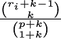，其中 *r[i]* 表示管道 *i* 在管道中的排名，*p* 是种群大小，而  是二项式系数 (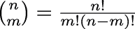)。通过增加锦标赛选择中的候选人数，我们可以增加选择强度（利用）并减少选择多样性（探索），因为只有候选者中的最佳者将被选为父代。考虑两种额外情况，如果候选大小 (*k*) 为 1，则相当于从种群中随机选择一个个体。如果候选大小等于种群大小，选择强度达到最大，因此种群中的最佳个体将被选为父代。

除了模型评估性能外，我们还可以根据我们对最优模型的期望在选择过程中指定其他目标。例如，我们可以创建一个函数来考虑管道的准确性和复杂度度量（如每秒浮点运算次数，或 FLOPS），并使用函数值来为每个管道分配一个概率。对于那些对更多细节和其他选择策略感兴趣的人，请参阅 Dan Simon 所著的《进化优化算法》（Wiley，2013 年）。

### 7.4.2 老化进化搜索方法

在本节中，我们将实现一种名为 *老化进化搜索* 的进化搜索方法，该方法由 Google Brain 的研究人员在“Regularized Evolution for Image Classifier Architecture Search”（[`arxiv.org/abs/1802.01548`](https://arxiv.org/abs/1802.01548)）中提出。它最初是为了搜索最佳神经网络架构而提出的，但可以推广到各种 AutoML 任务。该方法使用锦标赛选择来选择父代管道进行繁殖，并使用启发式老化选择策略进行幸存者选择。管道的“年龄”（或试验）意味着搜索过程中的迭代次数。当试验出生（开始）时，我们将其定义为 0。当有 *N* 个更多试验被选择并执行后，年龄变为 *N*。结合基于种群的进化搜索方法的四个核心步骤，我们详细阐述老化进化搜索方法如下：

1.  *初始种群生成*—随机采样一组机器学习管道并评估它们以形成初始种群。

1.  *父代选择*——在每次搜索迭代中，根据锦标赛选择方法从种群中选择一个父代。

1.  *变异*——随机选择父代的一个超参数，并将其值随机改变为另一个不同的值。如果生成的后代之前已经被探索过，我们将将其视为碰撞，并将重试变异步骤，直到选择一个有效的后代或达到最大碰撞次数。我们使用哈希字符串来表示试验中的超参数，以检查后代是否已经被探索过。

1.  *幸存者选择*——在生成新的后代之后，我们保留最新的采样试验作为新种群。例如，假设我们的种群大小是 100。当试验 101 完成时，种群中的第一个（最旧的）试验将被移除，新的（最年轻的）试验将被添加进去。这就是为什么这种方法被称为*老化*进化方法。选择最新的试验作为幸存者应该增强利用能力，因为我们假设旧的试验将比最新的试验表现得更差。

该过程在图 7.11 中进行了可视化。我们可以看到，这种方法没有使用交叉操作；仅使用变异操作来生成新的后代。

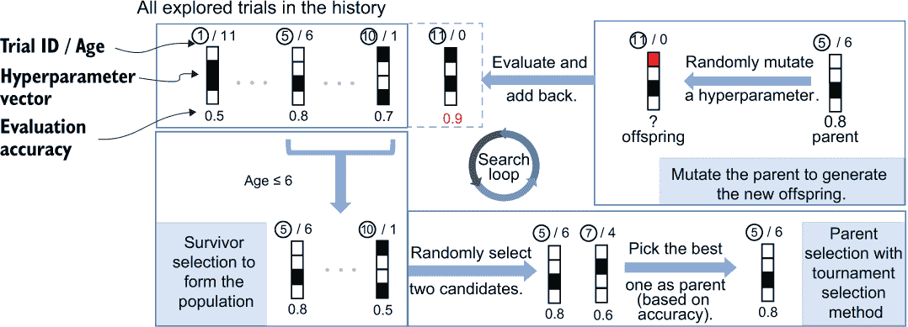

图 7.11 老化进化搜索生命周期

我们需要预先定义两个主要的超超参数来控制算法：锦标赛选择策略中的种群大小和候选大小。它们有助于平衡探索和利用。如果我们使用较大的种群大小，更多的旧试验将作为幸存者被保留，并可能被选为父代以繁殖后代。这将增加探索能力，因为旧试验通常比新试验差，种群中的多样性也会增加。如果我们选择较大的候选大小，选择强度将增加，正如我们之前提到的，这增加了该方法利用能力。

列表 7.15 展示了老化进化算子的实现方式。我们创建一个列表来保存种群试验的 ID。随机初始化试验的数量应该大于种群大小，以便种群列表能够被填满。看看核心函数，populate_space()。一开始，试验是随机抽取来形成种群的。种群创建后，在每次搜索循环中，我们根据试验的结束顺序进行生存选择，以维持固定的种群大小。然后我们通过随机选择一组候选者并进行锦标赛选择，从中挑选出最佳者作为父代（best_candidate_trial）。我们使用 _mutate 函数变异父代试验的随机选择的超参数，并将后代的超参数值以及后代试验的状态返回并放入一个字典中。状态设置为 RUNNING，意味着试验准备就绪，可以进行评估。

列表 7.15 进化搜索算子

```
import random
import numpy as np
from keras_tuner.engine import hyperparameters as hp_module
from keras_tuner.engine import oracle as oracle_module
from keras_tuner.engine import trial as trial_lib

class EvolutionaryOracle(oracle_module.Oracle):
    def __init__(self,
                 objective,
                 max_trials,
                 num_initial_points=None,
                 population_size=20,
                 candidate_size=5,
                 seed=None,
                 hyperparameters=None,
                 *args, **kwargs):
        super().__init__(
            objective=objective,
            max_trials=max_trials,
            hyperparameters=hyperparameters,
            seed=seed,
            *args, **kwargs)
        self.population_size = population_size
        self.candidate_size = candidate_size
        self.num_initial_points = num_initial_points or self.population_size
        self.num_initial_points = max(self.num_initial_points, population_size)❶
        self.population_trial_ids = []                                         ❷
        self.seed = seed or random.randint(1, 1e4)
        self._seed_state = self.seed
        self._max_collisions = 100

    def _random_populate_space(self):
        values = self._random_values()
        if values is None:
            return {'status': trial_lib.TrialStatus.STOPPED,
                    'values': None}
        return {'status': trial_lib.TrialStatus.RUNNING,
                'values': values}

    def _num_completed_trials(self):
        return len([t for t in self.trials.values() if t.status == 'COMPLETED'])

    def populate_space(self, trial_id):

        if self._num_completed_trials() 
➥ < self.num_initial_points:                                                  ❸
            return self._random_populate_space()

        self.population_trial_ids = self.end_order[
➥ -self.population_size:]                                                     ❹

        candidate_indices = np.random.choice(                                  ❺
            self.population_size, self.candidate_size, replace=False
        )
        self.candidate_indices = candidate_indices
        candidate_trial_ids = list(
            map(self.population_trial_ids.__getitem__, candidate_indices)
        )

        candidate_scores = [self.trials[trial_id].score 
➥ for trial_id in candidate_trial_ids]                                        ❻
        best_candidate_trial_id =
➥ candidate_trial_ids[np.argmin(candidate_scores)]
        best_candidate_trial = self.trials[best_candidate_trial_id]

        values = self._mutate(best_candidate_trial)                            ❼

        if values is None:                                                     ❽
            return {'status': trial_lib.TrialStatus.STOPPED, 'values': None}

        return {'status': trial_lib.TrialStatus.RUNNING,
                'values': values}
```

❶ 确保随机初始化试验能够填满种群

❷ 一个列表用于保存种群试验的 ID

❸ 随机选择用于初始化种群的个体

❹ 基于试验年龄的生存选择

❺ 从种群中选择候选试验

❻ 根据性能获取最佳父代候选者

❼ 变异父代随机选择的超参数

❽ 如果后代无效（已经评估过）则停止试验

现在我们来看如何实现变异操作。

### 7.4.3 实现简单的变异操作

理想情况下，只要超参数没有被固定，我们就可以将其变异为其他值。然而，如果选定的超参数是一个条件超参数，改变它可能会影响其他超参数。例如，如果我们选择了模型类型超参数进行变异，并且其值从 MLP 变为决策树，原本不活跃的树深度超参数将变为活跃，我们需要为其分配一个特定的值（见图 7.12）。因此，我们需要检查变异超参数是否为条件超参数。如果是，我们需要为其*后代超参数*（图中由子节点表示的超参数）随机分配值。

因此，我们首先收集父试验（best_trial）中的非固定和活动超参数，并从中随机选择一个超参数进行变异。然后我们创建一个名为 hps 的超参数容器实例，用于保存新后代的超参数值。通过遍历搜索空间中的所有超参数，我们逐一生成它们的值并将它们输入到容器中。请注意，我们需要遍历搜索空间中的所有活动超参数，而不仅仅是处理父试验中的活动超参数，因为某些非活动超参数在条件超参数变异的情况下可能会变为活动状态（参见图 7.12）。

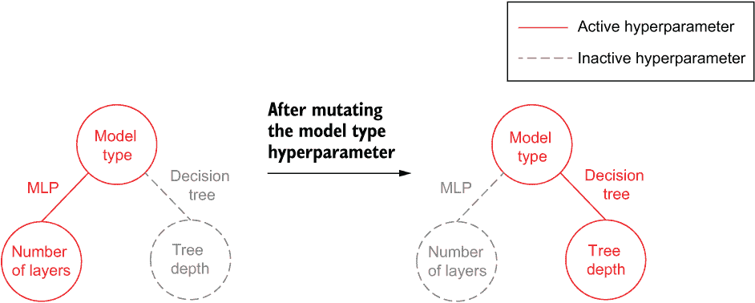

图 7.12 由于变异，一个非活动超参数可能变为活动状态

对于在父试验中活动但不是所选变异超参数的任何超参数，我们将它的原始值分配给它并继续变异操作。对于所选变异超参数，我们随机选择一个新的值。假设所选变异超参数是一个条件超参数。在其值变异后，其子代超参数，在后代中变为活动状态，也将被随机选择值分配。子代超参数是否活动由 hps.is_active(hp) 语句确定，如列表 7.16 所示。新后代生成后，我们通过从基 Oracle 类继承的哈希函数 (_compute_values_hash) 检查它是否已经被评估过。如果后代与之前的试验冲突，我们重复变异过程。我们继续这样做，直到生成一个有效的后代或达到最大冲突次数。最终后代的哈希值被收集到一个 Python 集合（self._tried_so_far）中，用于检查未来的试验。

列表 7.16 在父试验中变异超参数

```
def _mutate(self, best_trial):

        best_hps = best_trial.hyperparameters               ❶

        nonfixed_active_hps = [hp for hp in self.hyperparameters.space
            if not isinstance(hp, hp_module.Fixed) and 
➥ best_hps.is_active(hp)]                                  ❷

        hp_to_mutate = np.random.choice(
            nonfixed_active_hps, 1)[0]                      ❸

        collisions = 0
        while True:
            hps = hp_module.HyperParameters()

            for hp in self.hyperparameters.space:           ❹
                hps.merge([hp])

                if hps.is_active(hp):

                    if best_hps.is_active(hp.name) and hp.name != 
➥ hp_to_mutate.name:                                       ❺
                        hps.values[hp.name] = best_hps.values[hp.name]
                        continue
                    hps.values[hp.name] = 
➥ hp.random_sample(self._seed_state)                       ❻
                    self._seed_state += 1
            values = hps.values

            values_hash = self._compute_values_hash(
                values)                                     ❼
            if values_hash in self._tried_so_far:           ❽
                collisions += 1
                if collisions <= self._max_collisions:
                    continue
                return None
            self._tried_so_far.add(values_hash)
            break
        return values
```

❶ 从最佳试验中提取超参数

❷ 收集非固定和活动超参数

❸ 随机选择一个超参数进行变异

❹ 遍历搜索空间中的所有活动超参数

❺ 检查当前超参数是否需要变异

❻ 执行随机变异

❼ 为新后代生成哈希字符串

❽ 检查后代是否已经被评估

以下两点值得注意：

+   判断一个超参数是否是条件超参数的后代，利用了 KerasTuner 的一个特性：后代超参数将始终出现在条件超参数之后（self.hyperparameters.space）。实际上，超参数搜索空间可以被视为一个图，其中每个节点代表一个超参数，而链接表示它们在机器学习管道中的出现顺序或它们的条件相关性。KerasTuner 使用图的拓扑顺序将超参数搜索空间保存在一个列表中。

+   为了确保算法了解超参数之间的条件相关性，并在突变时检测条件超参数的后代是否活跃，我们需要在搜索空间中显式定义条件作用域，如第五章所述。以下列表展示了合成搜索空间的说明性定义，其中 conditional_choice 是一个条件超参数，其后代超参数是 child1_choice 和 child2_choice。在搜索过程中，其两个子代中的一个将根据其值而活跃。

列表 7.17 一个条件搜索空间

```
def build_model(hp):
    hp.Choice('conditional_choice', [1, 2, 3], default=2)
    with hp.conditional_scope(
        'conditional_choice', [1, 3]):                  ❶
        child1 = hp.Choice('child1_choice', [4, 5, 6])
    with hp.conditional_scope(
        'conditional_choice', 2):                       ❶
        child2 = hp.Choice('child2_choice', [7, 8, 9])
```

❶ 超参数的条件作用域

将先前学习的突变函数与采样函数相结合，我们完成了 Oracle 的核心实现。我们还可以添加帮助保存和恢复 Oracle 的函数。用于控制 Oracle 的超超参数保存在状态字典中，当在 set_state() 函数中恢复 Oracle 时，应将这些超超参数与种群列表一起重新初始化，如以下列表所示。

列表 7.18 帮助恢复进化搜索 Oracle

```
class EvolutionaryOracle(oracle_module.Oracle):

    def get_state(self):
        state = super(EvolutionaryOracle, self).get_state()
        state.update({
            'num_initial_points': self.num_initial_points,
            'population_size': self.population_size,                      ❶
            'candidate_size': self.candidate_size,                        ❶
        })
        return state

    def set_state(self, state):
        super(EvolutionaryOracle, self).set_state(state)
        self.num_initial_points = state['num_initial_points']
        self.population_size = state['population_size']
        self.candidate_size = state['candidate_size']
        self.population_trial_ids = self.end_order[-self.population_size:]❷
```

❶ 保存种群大小和候选大小

❷ 在 Oracle 恢复期间重新初始化种群列表

最后，让我们在之前章节中使用的相同回归任务（加利福尼亚房价预测）上评估老化进化搜索方法，并将其与随机搜索和贝叶斯优化搜索方法进行比较。

### 7.4.4 评估老化进化搜索方法

为了评估老化进化搜索方法，我们进行了 100 次试验，并将种群大小和候选大小分别设置为 20 和 5。这两个超参数通常基于你对搜索空间的感觉和经验调优结果主观设置。通常，如果搜索空间很大，我们使用较大的种群大小来累积足够的多样化试验以培育后代。大约 100 的种群大小应该足够处理大多数情况。在这里，我们使用了保守的选择（20），因为搜索空间中只包含三个超参数。使用种群大小的一半或四分之一作为候选大小，如我们在这里所做的那样，通常在经验上提供良好的性能。

在接下来的代码列表中，我们只列出调用不同搜索方法的代码。数据加载、搜索空间创建和调谐器定制的其余实现与之前使用的方法相同，可在 Jupyter 笔记本中找到，网址为 [`github.com/datamllab/automl-in-action-notebooks`](https://github.com/datamllab/automl-in-action-notebooks)。

列表 7.19 调用不同的搜索方法

```
evo_tuner_p20c5 = LightGBMTuner(
    oracle=EvolutionaryOracle(
        objective=kt.Objective('mse', 'min'),
        max_trials=100,
        population_size=20,
        candidate_size=5,
        seed=42),                        ❶
    hypermodel=build_model,
    overwrite=True,
    project_name='evo_tuner_p20c5')

evo_tuner_p20c5.search(X_train, y_train, validation_data=(X_val, y_val))

random_tuner = LightGBMTuner(
    oracle=kt.oracles.RandomSearch(
        objective=kt.Objective('mse', 'min'),
        max_trials=100,
        seed=42),                        ❷
    hypermodel=build_model,
    overwrite=True,
    project_name='random_tuner')

random_tuner.search(X_train, y_train, validation_data=(X_val, y_val))

bo_tuner = LightGBMTuner(
    oracle=kt.oracles.BayesianOptimization(
        objective=kt.Objective('mse', 'min'),
        max_trials=100,
        seed=42),                        ❸
    hypermodel=build_model,
    overwrite=True,
    project_name='bo_tuner')

bo_tuner.search(X_train, y_train, validation_data=(X_val, y_val))
```

❶ 使用老化进化方法进行搜索

❷ 使用 KerasTuner 内置的随机搜索方法

❸ 使用 KerasTuner 内置的贝叶斯优化搜索方法

图 7.13 展示了随着搜索过程的进行，三种方法各自找到的最佳模型的评估性能。我们可以看到，在三种方法中，贝叶斯优化方法表现最好。尽管进化方法在搜索过程中实现了更多的改进步骤，但与随机搜索相比，它的区分度较小。每一步的改进都很小，因为我们让突变在每个阶段只发生在单个超参数上，并且改进一直持续到搜索过程的后期。这意味着选择强度（利用能力）可以在早期阶段得到改善。

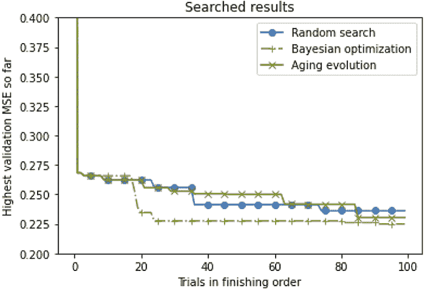

图 7.13 比较三种搜索方法的搜索结果

现在让我们将候选者数量增加到 20（这是一个极端的选择，因为我们的种群大小也是 20）以增强利用能力，看看会发生什么。在图 7.14 中，我们可以看到在早期阶段有更多的改进，这证实了通过增加候选者数量可以在开始时增强选择强度（利用能力）。尽管在这个例子中，最终结果改进不大（如果我们尝试进一步的试验，结果甚至可能比使用较小候选者数量获得的结果更差，因为缺乏探索能力），但这表明如果我们只考虑 100 次试验，较大的候选者数量可以帮助我们以更少的试验次数达到可比的结果。在实际应用中，你可以根据自己的容忍度和可用时间调整这些大小。如果你不介意花更多的时间更彻底地探索搜索空间，你可以选择较小的候选者数量（以及较大的种群大小）。如果你期望在较少的试验中实现一个适度的好模型，你可以使用较大的候选者数量（以及较小的种群大小）。

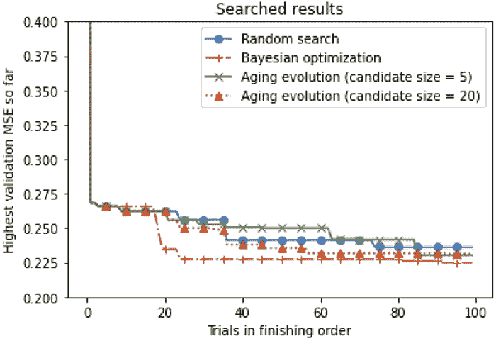

图 7.14 不同搜索方法的比较

在这个例子中，贝叶斯优化在所有搜索算法中表现最佳。这是因为我们试图调整的超参数要么是连续超参数，要么具有序数值。通常，如果我们的搜索空间主要由具有连续或序数值的超参数主导，我们更倾向于使用贝叶斯优化算法。如果超参数大多是分类的或者存在许多条件超参数，进化方法将是一个不错的选择。对于探索连续超参数，随机变异不是一个好的选择。一些可行的改进方案包括对某些超参数（如学习率）使用对数尺度，或者通过添加代理模型来结合进化方法和基于模型的方法，以帮助引导变异——也就是说，多次随机变异并基于代理模型选择最佳试验作为后代。当想要探索的试验数量与搜索空间大小相比太少时，随机搜索方法可以提供一个强大的基线。这在涉及设计和调整深度神经网络（神经架构搜索）的任务中是一个常见情况。

## 摘要

+   顺序搜索方法迭代地从搜索空间中采样和评估超参数。它通常包括两个步骤：超参数采样和一个可选的更新步骤，以纳入历史评估。

+   历史依赖性搜索方法可以利用评估过的超参数来更好地从搜索空间中进行采样。启发式方法和基于模型的方法是历史依赖性方法的两大类。

+   贝叶斯优化方法是 AutoML 中最广泛使用的基于模型的方法。它使用代理模型来近似模型评估性能，并使用获取函数在从搜索空间中采样新超参数时平衡探索和利用。最常用的代理模型是高斯过程模型，一些流行的获取函数包括上置信界（UCB）、改进概率和期望改进。

+   进化方法是一种启发式搜索方法，通过模拟动物种群在新一代中的进化来生成新的样本。它包括四个步骤：初始种群生成、父代选择、交叉和变异以及幸存者选择。老化进化搜索方法是一种流行的进化搜索方法，最初是为神经架构搜索提出的。它利用现有试验的年龄进行幸存者选择，并使用锦标赛选择进行父代选择。
