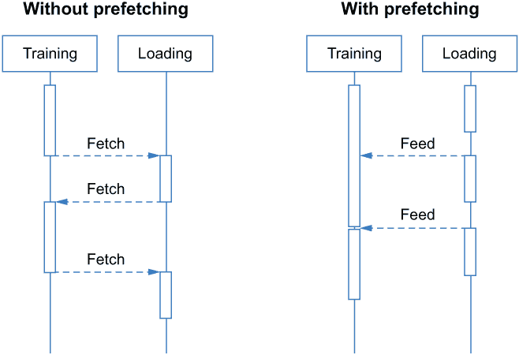
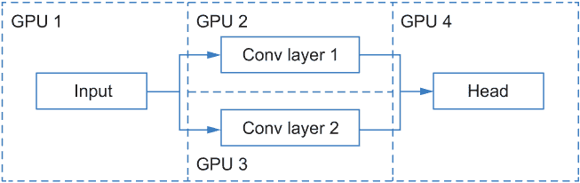
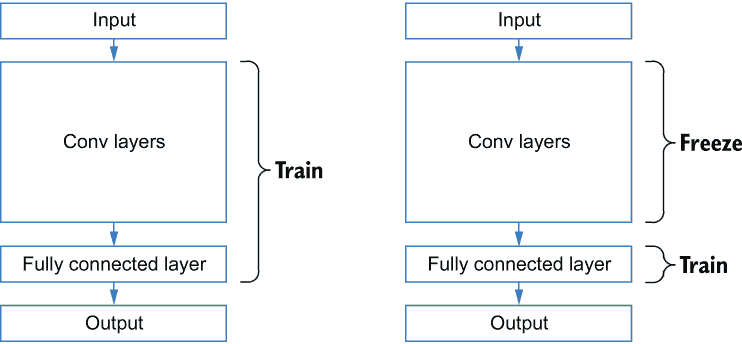

# 8 扩展 AutoML

本章涵盖

+   分批将大型数据集加载到内存中

+   使用多个 GPU 加速搜索和训练

+   使用 Hyperband 高效调度模型训练，以充分利用可用的计算资源

+   使用预训练模型和 warm-start 加速搜索过程

本章介绍了各种大规模训练技术——例如，使用大型数据集在多个 GPU 上训练大型模型。对于一次性无法全部装入内存的大型数据集，我们将向您展示如何在训练过程中分批加载它们。我们还将介绍不同的并行化策略，以将训练和搜索过程分布到多个 GPU 上。此外，我们还将向您展示一些策略，利用高级搜索算法和搜索空间，在有限的计算资源下加速搜索过程。

## 8.1 处理大规模数据集

深度学习强大背后的一个重要因素是大量数据的可用性，用于训练模型。通常，数据集越大、越多样化，训练的模型性能越好。本书早期示例中使用的所有数据集都足够小，可以装入进行训练的机器的主内存中。然而，您可能没有——或者不需要——足够的内存来存储整个数据集。如果您使用 GPU，数据集将被分割成小批次，这些批次将分批加载到 GPU 中。这意味着您只需要 GPU 内存中的一个槽位来存储单个数据批次，当您加载新批次时，它将被覆盖。

因此，如果您想使用一个不适合您所使用机器主内存的大型数据集，而不是一次性尝试加载整个数据集，您可以一次加载一个或多个批次，覆盖之前的批次。然后，这些批次可以在训练过程中像往常一样加载到 GPU 内存中。

总结来说，我们有两种加载数据的方式。在两种情况下，GPU 都保留一个缓冲区，用于存储将被机器学习模型消耗的数据批次。在第一种情况下，我们将整个数据集加载到主内存中，然后分批将数据加载到 GPU 的内存中。在第二种情况下，主内存也用作缓冲区，从硬盘上分批加载数据，整个数据集都存储在硬盘中。两种加载数据方式的比较如图 8.1 所示。


图 8.1 不同加载数据的方式

在本节中，我们将向您展示如何使用第二种选项来加载不适合主内存的大型数据集，以搜索一个好的模型。首先，我们将介绍加载图像和文本分类数据，这可以通过 AutoKeras 中现有的数据加载 API 轻松完成。然后，我们将向您展示如何分批从磁盘加载任何数据集。

### 8.1.1 加载图像分类数据集

AutoKeras 中有一个方便的函数可以帮助您从磁盘加载图像分类数据。在这里，我们将使用 MNIST 数据集作为示例。要下载和提取数据集，您需要运行下一个代码示例中的命令。您可以直接在 Python 笔记本中运行它们，或者在您的本地 Linux 或 Unix 命令行终端中运行它们，无需使用 ! 符号。首先，我们使用 wget 命令下载 MNIST 数据集的压缩文件，该文件将给定的 URL 中的文件存储到当前目录中。然后，我们使用 tar 命令从压缩文件中提取文件。xzf 是提取文件最常用的配置，其中 x 表示提取，z 表示通过 gzip 过滤存档内容，f 表示从文件中读取内容：

```
!wget https:/ /github.com/datamllab/automl-in-action-notebooks/raw/master/data/mnist.tar.gz
!tar xzf mnist.tar.gz
```

提取后，我们可以看到图像根据它们的类别分组到不同的文件夹中。训练和测试目录各包含 10 个子目录，命名为 0 到 9，这些是图像的标签，如下所示：

```
train/
├─0/
│ ├─1.png
│ └─21.png
│   ...
├─1/
├─2/
└─3/
  ...
test/
├─0/
└─1/
  ...
```

我们现在可以使用内置的 AutoKeras 函数 image_dataset_from_directory() 来加载图像数据集。此函数返回一个包含数据的 tf.data.Dataset 对象。函数的第一个参数是数据目录的路径，在我们的例子中是 'test' 或 'train'。使用 image_size 指定图像大小为一个包含两个整数的元组，(高度，宽度)，并使用 batch_size 指定数据集的批次大小。这些是函数的必需参数。

调用此函数会生成一个包含图像和标签的元组批次的批次。每个元组的第一个元素是形状 (batch_size, image_height, image_width, number_of_channels)。我们使用 color_mode 参数设置通道数，它可以是 'grayscale'、'rgb' 或 'rgba' 之一。相应的通道数是 1、3 和 4；MNIST 数据集由灰度图像组成，因此通道数为 1。

元组的第二个元素是标签。标签是字符串，与测试或训练目录中的目录名相同。在我们的例子中，它们是从 '0' 到 '9' 的数字。image_dataset_from_directory() 函数还接受一个 shuffle 参数，默认值为 True，这意味着它将不同目录中的不同类别的图像进行洗牌。要设置洗牌的随机种子，您可以使用 seed 参数。

我们首先加载测试数据，如下所示列表。这不需要分割数据，这意味着它比加载训练数据更容易。我们还将打印出有关加载的第一批数据的规格——这是加载数据集时的一种有用的调试方法。

列表 8.1 从磁盘加载测试数据

```
import os
import autokeras as ak

batch_size = 32
img_height = 28
img_width = 28

parent_dir = 'data'
test_data = ak.image_dataset_from_directory(
    os.path.join(parent_dir, 'test'),          ❶
    seed=123,
    color_mode='grayscale',
    image_size=(img_height, img_width),
    batch_size=batch_size,

for images, labels in test_data.take(1):       ❷
    print(images.shape, images.dtype)
    print(labels.shape, labels.dtype))
```

❶ 测试数据集的路径

❷ 返回只包含第一批数据的新数据集

如输出所示，这列出了具有 10 个不同类别标签的 10,000 张图像。加载的一批图像的形状为 (32, 28, 28, 1)，类型为 float32。相应的标签形状为 (32,), 类型为字符串，如下所示：

```
Found 10000 files belonging to 10 classes.
(32, 28, 28, 1) <dtype: 'float32'>
(32,) <dtype: 'string'>
```

数据集已成功从磁盘加载到 tf.data.Dataset 对象中。然而，它不能直接用于 AutoML，因为我们至少需要两个 tf.data.Dataset 对象分别用于训练和验证。因此，我们需要一种有效的方法将数据集分割成不同的子集。

### 8.1.2 加载数据集的分割

我们有多种方法可以分割数据集。列表 8.2 展示了一种简单但效率低下的解决方案：它加载了整个训练数据集，并使用 take() 和 skip() 函数进行分割。如果你调用 dataset.take(*n*)，它将返回一个包含前 *n* 批次的数据集。如果你调用 dataset.skip(*n*)，它将返回一个包含第一 *n* 批次之后的所有批次的集合。

列表 8.2 加载和分割训练数据

```
all_train_data = ak.image_dataset_from_directory(
    os.path.join(parent_dir, 'train'),
    seed=123,
    color_mode='grayscale',
    image_size=(img_height, img_width),
    batch_size=batch_size,
)
train_data = all_train_data.take(int(60000 / batch_size * 0.8))
validation_data = all_train_data.skip(int(60000 / batch_size * 0.8))
```

这效率低下是因为 skip() 函数必须遍历前 *n* 批次，才能开始迭代。我们提出了一种更有效的解决方案，如列表 8.3 所示。在这里，我们两次调用 image_dataset_from_directory() 函数，分别获取训练集和验证集。在每次调用中，除了两个新的参数 validation_split 和 subset，控制数据集的分割外，其他一切保持与加载测试集时相同。validation_split 参数指定要包含在验证集中的批次百分比，应在 0 和 1 之间。其余的批次将包含在训练集中。subset 参数应该是 'training' 或 'validation'，以指示函数应返回哪个集合。值得注意的是，seed 参数必须手动设置，以确保在两次函数调用中，数据的分割方式没有差异。

列表 8.3 从磁盘加载训练和验证数据

```
train_data = ak.image_dataset_from_directory(           ❶
    os.path.join(parent_dir, 'train'),                  ❷
    validation_split=0.2,
    subset='training',
    seed=123,
    color_mode='grayscale',
    image_size=(img_height, img_width),
    batch_size=batch_size,
)

validation_data = ak.image_dataset_from_directory(      ❸
    os.path.join(parent_dir, 'train'),                  ❹
    validation_split=0.2,
    subset='validation',
    seed=123,
    color_mode='grayscale',
    image_size=(img_height, img_width),
    batch_size=batch_size,
```

❶ 加载训练分割

❷ 训练数据目录的路径

❸ 加载验证分割

❹ 训练数据目录的路径

我们已经完成了数据加载指定部分：所有数据都被封装成 tf.data.Dataset 格式。接下来，我们将探讨一种可以进一步提高加载后数据集使用效率的简单技术，称为 *预取*。

使用预取提高数据加载效率

由于读取效率低下，从磁盘加载数据可能需要一些时间。如果没有预取，程序只有在内存中的所有批次都被机器学习模型使用完毕后，才会开始从磁盘加载下一批数据到内存中。然后，模型训练或推理过程将暂停，等待下一批数据加载。显然，这种方法效率不高。

预取会在训练或推理并行进行的同时，提前从磁盘加载额外的数据批次到内存中，因此这个过程不会被暂停。两种方法之间的区别在图 8.2 的序列图中展示。涉及两个任务，即训练和加载。从上到下的线条显示了执行过程中某一时刻正在运行的任务。正如你所见，没有预取时，加载和训练任务永远不会同时运行；训练过程需要等待加载过程完成。另一方面，使用预取，它们可以并行运行以节省时间，从而使程序运行得更高效。



图 8.2 预取序列图

要为 tf.data.Dataset 启用预取功能，你可以调用其成员函数 prefetch()。唯一必需的参数是你希望它预取到内存中的批次数：例如，调用 dataset.prefetch(5) 会预先将五个批次加载到内存中。如果你不确定预取多少批次是理想的，可以使用 dataset.prefetch(tf.data.AUTOTUNE)，这将自动为你调整这个数字。

使用预取进行训练、验证和测试的代码在列表 8.4 中展示。在这里，我们为训练集和验证集预取五个批次，并自动调整测试数据的批次数。

列表 8.4 使用预取提高加载效率

```
import tensorflow as tf

train_data = train_data.prefetch(5)
validation_data = validation_data.prefetch(5)
test_data = test_data.prefetch(tf.data.AUTOTUNE)
```

现在，让我们尝试使用这些数据训练一个简单的图像分类模型。代码将在下一列表中展示。正如你所见，与使用能够一次性加载到内存中的较小数据集没有区别：我们直接将训练集和验证集传递给 fit() 函数。

列表 8.5 从磁盘加载数据拟合图像分类器

```
clf = ak.ImageClassifier(overwrite=True, max_trials=1)
clf.fit(train_data, epochs=1, validation_data=validation_data)
print(clf.evaluate(test_data))
```

你现在知道如何从磁盘加载大型图像数据集。然而，我们可能会遇到其他类型的大型数据集，例如文本数据集，在许多情况下这些数据集也太大，无法放入主内存。接下来，我们将探讨如何从磁盘加载大型文本数据集。

### 8.1.3 加载文本分类数据集

加载大型文本分类数据集与加载大型图像分类数据集没有太大区别。同样，你可以使用 AutoKeras 中的一个内置函数 text_dataset_from_directory()；在用法上唯一的区别是参数。

text_dataset_from_directory() 函数没有 image_size 和 color_mode 参数，因为它们仅与图像数据相关。相反，它接受一个名为 max_length 的新参数，这是每个文本实例中要保留的字符串的最大字符数。如果你没有指定 max_length，字符串将在被输入到模型之前保留其原始长度。

让我们以 IMDb 电影评论数据集为例，展示如何从磁盘加载文本数据。首先，我们使用以下命令下载原始文本文件。这两个命令将数据集作为压缩文件下载，并将文件提取到当前目录中。与下载图像数据集一样，我们可以在 notebook 中直接运行这些命令，或者在没有!符号的情况下在 Linux 或 Unix 终端本地运行它们：

```
!wget https:/ /github.com/datamllab/automl-in-action-notebooks/raw/master/data/imdb.tar.gz
!tar xzf imdb.tar.gz
```

提取后，您将得到一个名为 imdb 的目录，其中包含以下内容。如您所见，评论被分为训练集和测试集，每个集都按评论的两个类别组织，即正面和负面：

```
train/
├─pos/
│ ├─0_9.txt
│ └─10000_8.txt
│   ...
└─neg/
test/
├─pos/
└─neg/
```

接下来，我们可以以加载图像数据相同的方式加载文本数据。我们使用 text_dataset_from_directory()从 train 目录加载数据，并将其分为训练集和验证集。我们还使用预取功能来加快迭代过程，max_length=1000 限制加载字符串的最大长度。任何超过 1,000 个字符限制的字符将被丢弃。如下所示，在加载测试数据时，我们可以省略几个参数，因为它们仅对训练数据重要。

列表 8.6 从磁盘加载训练、验证和测试数据

```
train_data = ak.text_dataset_from_directory(        ❶
    'imdb/train',
    validation_split=0.2,
    subset='training',
    seed=123,
    max_length=1000,
    batch_size=32,
).prefetch(1000)

validation_data = ak.text_dataset_from_directory(   ❷
    'imdb/train',
    validation_split=0.2,
    subset='validation',
    seed=123,
    max_length=1000,
    batch_size=32,
).prefetch(1000)

test_data = ak.text_dataset_from_directory(         ❸
    'imdb/test',
    max_length=1000,
).prefetch(1000)
```

❶ 加载训练集

❷ 加载验证集

❸ 加载测试集

在加载数据后，我们现在可以使用一个简单的文本分类器来测试加载数据是否按预期工作，如下所示。

列表 8.7 从磁盘加载数据拟合文本分类器

```
clf = ak.TextClassifier(overwrite=True, max_trials=1)
clf.fit(train_data, epochs=2, validation_data=validation_data)
print(clf.evaluate(test_data))
```

到目前为止，我们已经向您展示了如何使用 AutoKeras 的内置函数从磁盘加载图像和文本分类数据，以及如何使用预取功能加快数据集的迭代速度。然而，我们需要一种更通用的方式来加载任何类型的数据集，而不仅仅是图像和文本。

### 8.1.4 一般处理大型数据集

在本节中，我们将介绍一种使用 tf.data.Dataset 的内部机制来加载太大而无法放入主内存的任意数据集的方法。我们将继续使用此格式来加载数据集以解决内存问题。然而，为了在数据类型上提供更多灵活性，我们将使用*Python 生成器*来遍历数据，并将生成器转换为 tf.data.Dataset。

首先，什么是 Python 生成器？从概念上讲，它是一个数据序列的迭代器。为了实现目的，它是一个使用 yield 提供要迭代的数据的 Python 函数。您可以使用 for 循环遍历该函数以获取所有数据，如下所示。在这里，我们定义了一个名为 generator()的 Python 生成器。它只是一个 Python 函数，它调用 yield 来提供数据列表中的所有元素。

列表 8.8 Python 生成器示例

```
data = [5, 8, 9, 3, 6]

def generator():         ❶
    for i in data:
        yield i

for x in generator():    ❷
    print(x)
```

❶ 定义生成器

❷ 使用 for 循环遍历生成器并打印其元素

生成器的输出，如下所示，是列表 8.8 中的数据列表元素：

```
5
8
9
3
6
```

tf.data.Dataset 类有一个名为 from_generator 的函数，它使用 Python 生成器构建一个新的实例。要使用它，我们只需提供生成器函数并使用 output_types 参数指定数据类型。让我们尝试将我们刚刚构建的 Python 生成器转换为 tf.data.Dataset 实例。代码将在下一个列表中展示。输出将与上一个示例相同。

列表 8.9 将 Python 生成器转换为 tf.data.Dataset

```
dataset = tf.data.Dataset.from_generator(
    generator,                             ❶
    output_types=tf.int32)                 ❷
for x in dataset:
    print(x.numpy())
```

❶ 指定生成器函数

❷ 指定输出类型为整数

现在您已经了解了 Python 生成器是什么以及如何使用它来构建 tf.data.Dataset 实例，让我们尝试使用这种方法加载一个真实的数据集。

使用 Python 生成器加载数据集

现在我们将使用以下步骤使用 Python 生成器加载 IMDb 数据集：

1.  将所有文件路径和标签加载到 NumPy 数组中。对数组进行洗牌以混合来自不同目录的数据。

1.  从洗牌后的 NumPy 数组构建一个生成器，通过读取文件的正文内容将文件路径转换为实际文本数据。

1.  从生成器创建 tf.data.Dataset 实例。

在第一步中，我们遍历不同类别的所有文件（目录）。我们创建两个元素的元组：文件的路径和文件的标签。文件路径是后来在训练期间加载其内容所需的，标签信息由包含文件的目录指示，因此我们需要在遍历目录的过程中记录此信息。

然而，因为我们按目录逐个迭代所有文件，所以同一目录（即具有相同类标签）的所有文件在数组中相邻。因此，在使用文件进行训练之前，我们需要对它们进行洗牌以混合来自不同类别的数据。

我们首先创建一个 NumPy 数组而不是直接创建生成器来迭代文件的原因是，一旦文件路径和标签被加载到内存中，进行洗牌和分割就更容易了。此外，文件路径在内存中不会占用太多空间。

执行此过程的代码如下所示。load_data() 函数加载、洗牌并返回作为 NumPy 数组的数据。

列表 8.10 加载 IMDb 数据集文件名

```
import numpy as np

path = os.path.join(parent_dir, 'train')

def load_data(path):
    data = []
    for class_label in ['pos', 'neg']:                          ❶
        for file_name in os.listdir(
            os.path.join(path, class_label)):                   ❷
            data.append((os.path.join(
                path, class_label, file_name), class_label))    ❸
    data = np.array(data)
    np.random.shuffle(data)                                     ❹
    return data

all_train_np = load_data(os.path.join(parent_dir, 'train'))     ❺
```

❶ 枚举类标签

❷ 遍历每个类别的所有文件名

❸ 创建 (文件路径，类标签) 的元组

❹ 洗牌数据

❺ 加载训练数据

使用这个 NumPy 数组，我们可以创建一个迭代器，将数组中的每个元素转换为实际的文本数据。我们不是直接实现生成器，而是实现了一个名为 get_generator(data)的函数来返回一个生成器，因为我们可能需要为训练、验证和测试集使用不同的生成器。通过 get_generator(data)，我们可以将相应的 NumPy 数组传递给函数，以动态地为该 NumPy 数组创建生成器。然后，我们可以创建生成器函数作为内部函数，并将此函数作为返回值返回。

在生成器函数中，我们将使用 for 循环遍历文件路径，读取每个文件的内容，并一起产生文本和标签。这样，生成器将生成实际文本数据，并带有标签，以便用于训练。get_generator()的代码如下所示。data_generator()函数将作为生成器函数返回。

列表 8.11：使用 Python 生成器加载 IMDb 数据集

```
def get_generator(data):
    def data_generator():                      ❶
        for file_path, class_label in data:    ❷
            text_file = open(file_path, 'r')   ❸
            text = text_file.read()            ❸
            text_file.close()
            yield text, class_label            ❹
    return data_generator                      ❺
```

❶ 生成器函数

❷ 遍历 NumPy 数组

❸ 使用文件路径读取文件内容

❹ 产生文本和类别标签

❺ 返回生成器函数

下一步是创建一个 tf.data.Dataset 实例。为了方便分割数据，让我们编写一个函数，np_to_dataset()，将 NumPy 数组转换为 tf.data.Dataset。这个函数将调用 get_generator()函数来获取生成器函数，并使用 tf.data.Dataset.from_generator()来获取 tf.data.Dataset 实例。

我们将 NumPy 数组分割两次，并调用 np_to_dataset()函数，分别用于训练集和验证集。这些包含 20,000 和 5,000 个实例。

在创建数据集时需要注意几个问题。在 from_generator()函数中，我们需要指定 output_types。因为文本和标签都是字符串类型，所以我们可以直接指定类型为 tf.string。

使用 AutoKeras 的数据集需要具有具体的形状。因此，我们使用 output_shapes 参数指定数据集的形状。此参数的值需要是 tf.TensorShape 的实例。我们可以通过将其初始化器传递形状列表来轻松创建它。

创建的数据集不能直接使用，因为其中的每个实例都是一个形状为(2,)的张量。然而，AutoKeras 使用的数据集应该是两个张量的元组，(x, y)。因此，我们需要调用数据集的 map()函数来更改其格式。

map()函数接受一个 lambda 函数作为其参数，该函数接受旧实例作为参数并返回新实例。然后我们可以返回原始张量的第一和第二维度作为一个包含两个元素的元组。这些步骤的代码如下。

列表 8.12：从生成器创建数据集

```
def np_to_dataset(data_np):                               ❶
    return tf.data.Dataset.from_generator(
        get_generator(data_np),                           ❷
        output_types=tf.string,
        output_shapes=tf.TensorShape([2]),
    ).map(                                                ❸
        lambda x: (x[0], x[1])
    ).batch(32).prefetch(5)                               ❹

train_data = np_to_dataset(all_train_np[:20000])          ❺
validation_data = np_to_dataset(all_train_np[20000:])     ❻
```

❶ 将 NumPy 数组转换为 tf.data.Dataset 的功能

❷ 数组的生成器函数

❸ 将数据从张量转换为元组

❹ 为数据集进行批量和集合预取

❺ 加载训练集

❻ 加载验证集

将所有这些过程实现为函数后，我们可以以相同的方式加载测试集，如下面的代码示例所示。

列表 8.13 使用 Python 生成器加载 IMDb 数据集的测试集

```
test_np = load_data(os.path.join(parent_dir, 'test'))
test_data = np_to_dataset(test_np)
```

在准备好训练集、验证集和测试集，并以 tf.data.Dataset 格式存储后，我们可以使用 AutoKeras 文本分类器来测试它是否按预期运行，如下所示。

列表 8.14 使用 Python 生成器拟合文本分类器

```
clf = ak.TextClassifier(overwrite=True, max_trials=1)
clf.fit(train_data, epochs=2, validation_data=validation_data)
print(clf.evaluate(test_data))
```

本例的主要目的是展示如何使用 Python 生成器构建数据集。现在你知道如何使用这种方法将任何格式的数据集加载到 tf.data.Dataset 中，这大大提高了你加载大型数据集的灵活性。

此外，这种方法不仅限于从磁盘加载数据：如果你的数据来自通过网络从远程机器获取或通过一些 Python 代码动态生成，你也可以使用 Python 生成器将其包装成数据集。

## 8.2 多 GPU 并行化

为了扩展机器学习和 AutoML 以支持大型模型和大型数据集，我们可以在多个 GPU 和多台机器上并行运行我们的程序。并行化通常用于加速训练和推理（*数据并行*）或加载一个非常大的模型，该模型无法适应单个 GPU 的内存（*模型并行*）。它有时也用于加速超参数调整过程（*并行调整*）。图 8.3 展示了这三种不同类型的并行化以及数据集和模型在每个情况下的内存分配差异。

此图显示了三种策略在三个 GPU 上的样子。在左侧是数据并行方法，它加速了大型数据集的训练过程。每个 GPU 都有相同模型的副本，但处理不同的数据批次。不同 GPU 上的权重更新定期同步。

图中中间部分是模型并行策略的示例，该策略主要用于无法包含在单个 GPU 内存中的大型模型或加速可以并行化的推理过程的模型。它将模型分解成多个部分，并将它们分配到不同的 GPU 上。在图 8.3 中，第一个 GPU 持有模型的前两层和训练数据。第二和第三个 GPU 持有其余的层和层的中间输出。在推理过程中，模型的一些部分可能并行运行以节省时间。


图 8.3 三种并行化类型

用于加速 AutoML 进程的并行调优策略如图所示。采用这种方法，具有不同超参数设置的模型被放置在不同的 GPU 上，并使用相同的训练数据集来训练它们。因此，超参数调优过程是并行运行的。

让我们更详细地看看这些策略。

### 8.2.1 数据并行

使用 TensorFlow，数据并行是通过 tf.distribute.Strategy 管理的，其子类，如 tf.distribute.MirroredStrategy，实现了不同的并行策略。你可以直接使用这些子类与 AutoKeras 和 KerasTuner 一起使用。

在 AutoKeras 中，AutoModel 类和所有任务 API 类（如 ImageClassifier 和 TextClassifier）的初始化器中都有一个名为 distribution_strategy 的参数。你可以传递一个 tf.distribute.MirroredStrategy（或其其他子类）的实例，以便在搜索过程中使用数据并行进行所有模型训练过程。下一个列表展示了使用 MNIST 数据集的示例。代码将在程序可见的所有 GPU 上以分布式方式运行。

列表 8.15 使用 AutoKeras 的数据并行

```
import tensorflow as tf
from tensorflow.keras.datasets import mnist
import autokeras as ak

(x_train, y_train), (x_test, y_test) = mnist.load_data()
clf = ak.ImageClassifier(
    overwrite=True,
    max_trials=1,
    distribution_strategy=tf.distribute.MirroredStrategy())   ❶
clf.fit(x_train, y_train, epochs=1)
```

❶ 用于训练的数据并行

对于 KerasTuner，所有调优器，即 Tuner 类的子类（BayesianOptimization、Hyperband 和 RandomSearch），它们的初始化器中也有这个 distribution_strategy 参数，并且其工作方式与 AutoKeras 相同。你可以传递一个 TensorFlow 分布式策略的实例，如 tf.distribute.MirroredStrategy，到该参数。模型将使用分布式策略进行训练。

AutoKeras 在底层使用这个 KerasTuner 功能。以下列表展示了使用 KerasTuner 进行数据并行的简单示例。在这里，我们为 MNIST 数据集设计了一个非常基本的搜索空间。

列表 8.16 使用 KerasTuner 的数据并行

```
import keras_tuner as kt

def build_model(hp):
    model = tf.keras.Sequential()
    model.add(tf.keras.layers.Flatten())
    model.add(tf.keras.layers.Dense(
        units=hp.Int('units', min_value=32, max_value=512, step=32),
        activation='relu'))
    model.add(tf.keras.layers.Dense(10, activation='softmax'))
    model.compile(optimizer='adam', loss='sparse_categorical_crossentropy')
    return model

tuner = kt.RandomSearch(
    build_model,
    objective='val_loss',
    max_trials=1,
    directory='my_dir',
    distribution_strategy=tf.distribute.
➥ MirroredStrategy(),                      ❶
    project_name='helloworld')

tuner.search(x_train, y_train,
             epochs=1,
             validation_data=(x_test, y_test))
```

❶ 用于训练的数据并行

程序可以使用所有可用的 GPU 来分割数据并聚合梯度以更新模型。除了数据并行之外，让我们看看其他类型的分布式策略如何帮助加速训练过程。

### 8.2.2 模型并行

如前所述，模型并行主要用于处理大型模型。对于太大而无法容纳在一个 GPU 内存中的模型，它提供了一种通过将模型拆分成多个部分并将它们分布到可用的处理单元上来确保所有计算仍然在 GPU 上高效完成的方法。它还允许你在推理期间将一些计算卸载到不同的 GPU 上以并行运行。

一个典型的例子是具有多个分支的模型。中间输出是两个独立层的输入，它们彼此之间没有任何依赖。图 8.4 展示了这样一个案例的例子。图中显示了总共四个 GPU：GPU 2 上的两个卷积层，GPU 3 可以在推理时并行运行，因为它们的输入不依赖于彼此的输出。



图 8.4 多个 GPU 上的多分支模型

另一个不那么常见的例子是将一层分割成多个部分以并行运行。例如，在一个卷积层中，每个滤波器独立工作。因此，它们可以被分割到多个 GPU 上运行。然后可以将输出汇总以形成整个卷积层的输出张量。

目前，流行的开源深度学习框架并没有很好地将模型并行性封装到简单的 API 中。在大多数情况下，模型足够小，可以适应单个 GPU 的内存。要实现具有模型并行的模型，需要学习如何使用 Mesh TensorFlow，本书不会详细介绍这一点。如果您感兴趣，可以在 GitHub 上查看 Mesh TensorFlow：[`github.com/tensorflow/mesh`](https://github.com/tensorflow/mesh)。

### 8.2.3 并行调优

并行调优意味着在不同的设备上训练具有不同超参数的模型。例如，假设您在一台机器上拥有四个 GPU，并且您想在搜索空间中尝试八组不同的超参数。如果您并行运行四个模型，您只需要训练两个模型的时间来完成搜索。

特别地，并行调优还要求调优算法能够异步接收评估结果。如果不并行运行，调优算法将开始训练一个模型，并在开始训练另一个模型之前等待评估结果。然而，当并行运行时，搜索算法需要在收到任何评估结果之前开始训练多个模型，并且评估结果可能不会按照训练过程启动的顺序接收。搜索算法将在有可用设备时随时生成一个新模型进行训练。

让我们看看如何使用 KerasTuner 运行并行调优。它为此实现了一个*首席/工人*模型：在任何给定时间，只有一个首席进程正在运行，但存在多个工人进程。首席进程运行搜索算法。它管理工人以启动训练过程，并从他们那里收集评估结果。

在并行调优时遇到的一个问题是模型存储的位置。在不并行运行的情况下，搜索到的模型及其训练好的权重被保存在磁盘上，这样我们可以在搜索后加载最佳模型。在并行运行时，为了保存模型以便稍后加载，我们需要所有工作进程和主进程共享存储。如果我们在一台机器上使用多个 GPU，这不是问题，因为它们使用相同的存储。如果我们使用多台机器上的多个 GPU，我们可以将共享存储挂载到机器上或使用所有机器都可以访问的网络存储，例如 Google Cloud Storage 存储桶。

并行调优中主进程和工作进程的通信模式如图 8.5 所示。实线是控制流。主节点将不同的超参数集发送到不同的工作进程，这些工作进程使用给定的超参数构建和训练模型。完成后，工作进程将评估结果发送回主节点。图中的虚线是数据流。训练好的模型和结果被写入集中式存储，所有工作进程和主进程都可以访问。当用户调用主进程加载最佳模型时，主进程应从集中式存储中加载模型。训练和验证数据也应存储在所有工作进程都可以访问的集中式存储中。


图 8.5 并行调优的通信模式

现在，让我们看看如何在 KerasTuner 中启动这个并行训练。要启动主进程和工作进程，我们运行相同的 Python 脚本。KerasTuner 将使用环境变量来定义当前进程应该是主进程还是工作进程。KERASTUNER_TUNER_ID 环境变量用于指定不同进程的 ID。你可以将其设置为 'chief' 以指定主进程，对于工作进程则设置为 'tuner0'、'tuner1' 等等。

我们需要设置两个额外的环境变量，以便工作进程找到主进程的地址，从而可以报告评估结果：KERASTUNER_ORACLE_IP 和 KERASTUNER_ORACLE_PORT。这些指定了主服务运行在上的 IP 地址和端口号；它们需要为主进程和工作进程都设置。

总结来说，在运行脚本（run_tuning.py，我们很快就会看到）之前，我们需要设置三个环境变量。这里，我们提供了两个 shell 脚本以启动主进程和工作进程。首先，我们需要启动主进程。以下列表显示了指定环境变量并启动进程的命令。你可以打开一个终端来运行这些命令；终端将挂起并等待工作进程启动。

列表 8.17 启动主进程

```
export KERASTUNER_TUNER_ID='chief'         ❶
export KERASTUNER_ORACLE_IP='127.0.0.1'    ❷
export KERASTUNER_ORACLE_PORT='8000'       ❸
python run_tuning.py                       ❹
```

❶ 标记进程为主进程

❷ 主进程的 IP 地址

❸ 主进程的端口号

❹ 启动主进程

现在，打开另一个终端来启动工作者进程。你可以使用以下列表中的脚本完成此操作。它与前面的脚本非常相似；唯一的区别是 KERASTUNER_TUNER_ID，用于指定它作为工作者。

列表 8.18 启动工作者进程

```
export KERASTUNER_TUNER_ID='tuner0'        ❶
export KERASTUNER_ORACLE_IP='127.0.0.1'    ❷
export KERASTUNER_ORACLE_PORT='8000'       ❸
python run_tuning.py                       ❹
```

❶ 将进程标记为工作者

❷ 主控的 IP 地址

❸ 主控的端口

❹ 启动工作者进程

一旦启动工作者进程，调优就开始了。要启动其他工作者进程，使用相同的命令，但为每个指定不同的 KERASTUNER_TUNER_ID：例如，'tuner1'、'tuner2'等等。

run_tuning.py 中的 Python 代码启动进程。让我们看看这个脚本中有什么。以下列表展示了简单的 KerasTuner 示例。除了目录参数外，不需要任何特定配置，该参数必须指向所有工作者和主管都可以访问的目录。

列表 8.19 使用 KerasTuner 进行并行调优

```
import tensorflow as tf
from tensorflow.keras.datasets import mnist
import autokeras as ak
import keras_tuner as kt

(x_train, y_train), (x_test, y_test) = mnist.load_data()

def build_model(hp):
    model = tf.keras.Sequential()
    model.add(tf.keras.layers.Flatten())
    model.add(tf.keras.layers.Dense(
        units=hp.Int('units', min_value=32, max_value=512, step=32),
        activation='relu'))
    model.add(tf.keras.layers.Dense(10, activation='softmax'))
    model.compile(optimizer='adam', loss='sparse_categorical_crossentropy')
    return model

tuner = kt.RandomSearch(
    build_model,
    objective='val_loss',
    max_trials=1,
    directory='result_dir',      ❶
    project_name='helloworld')

tuner.search(x_train, y_train,
             epochs=1,
             validation_data=(x_test, y_test))
```

❶ 可供所有工作者和主管访问的目录

到目前为止，我们一直在讨论如何通过在更多 GPU 上运行来加速调优。然而，我们还有其他策略可以在算法层面上加速调优。

## 8.3 搜索加速策略

在本节中，我们将介绍一些用于搜索过程的加速策略。首先，我们将介绍一种名为*Hyperband*的模型调度技术。给定一定量的计算资源，这项技术可以将它们分配给训练不同模型的不同程度。而不是完全训练每个模型，它通过在早期阶段终止一些不太有前途的模型来节省时间。

接下来，我们将探讨如何使用预训练权重的模型来加速训练过程。最后，我们将介绍 AutoML 中广泛使用的一种技术，即使用一些好的模型*预热启动*搜索空间。这为调优器提供了一些指导，使其需要做更少的探索来找到一个相对性能较好的模型。

### 8.3.1 使用 Hyperband 进行模型调度

Hyperband¹是 AutoML 中广泛使用的模型调度算法。Hyperband 的核心思想不是试图模拟模型性能与超参数之间的关系，而是专注于搜索空间中更有前途的模型，而不是完全训练所有可能的模型，从而节省计算资源和时间。

这里有一个具体的例子。假设我们有四个不同的超参数集要尝试，每个集都将实例化为一个深度学习模型，并且每个模型都需要训练 40 个 epoch。我们首先训练这四个模型 20 个 epoch，然后丢弃在这个阶段表现最差的两个模型。现在我们剩下两个好的模型。然后我们再训练这些模型 20 个 epoch，使它们完全训练，并选择最好的一个。因此，我们节省了训练两个不太好的模型额外 20 个 epoch 所需的时间和资源。

要理解使用 Hyperband 的过程，我们首先需要了解其子过程，称为*连续减半*。连续减半涉及两个交替步骤的循环：第一步是通过删除不那么有希望的模型来减少剩余模型的数量，第二步是进一步训练剩余模型。您需要向连续减半算法提供以下四个参数：

+   models—所有待训练模型的列表。

+   max_epochs—完全训练一个模型所需的总 epoch 数。

+   start_epochs—第一轮中训练所有模型所需的 epoch 数。

+   factor—衡量我们希望多快减少模型数量并增加剩余模型的训练 epoch 数的指标；默认值为 3。例如，当 factor=3 时，每次循环通过，我们将剩余模型的数量减少到当前数量的三分之一，并将剩余模型进一步训练到已训练 epoch 数的三倍。

此过程会重复进行，直到所有剩余的模型都完全训练完毕。它将返回最佳模型及其验证损失。

在算法开始时，我们得到一个模型列表。我们将它们保存在 remaining_models 中，并在每一轮中删除一些模型。我们使用 n_models 记录初始的总模型数。我们使用 trained_epochs 记录剩余模型已训练的 epoch 数，这将在每一轮进一步训练中更新。target_epochs 代表当前轮次需要达到的目标 epoch 数，这也在每一轮结束时更新。我们在字典 eval_results 中记录评估结果，其键是模型，值是每个模型的验证损失。

初始化这些变量后，我们就可以开始外循环了，该循环会重复进行，直到所有剩余模型都完全训练完毕——换句话说，直到 trained_epochs 等于或大于 max_epochs。循环中的第一步是内循环，用于训练和评估 remaining_models 中的所有模型，并将结果记录在 eval_results 中。

然后我们丢弃表现最差的模型，通过指定的因子减少剩余模型的数量。在每一轮结束时，我们更新跟踪 epoch 的变量。

一旦外循环完成（当模型完全训练完毕时），我们可以获取最佳模型并返回该模型及其验证损失。以下列表展示了连续减半过程的伪代码。

列表 8.20 连续减半伪代码

```
import copy

def successive_halving(models, max_epochs, start_epochs, factor=3):
    remaining_models = copy.copy(models)
    n_models = len(models)
    trained_epochs = 0
    target_epochs = start_epochs
    eval_results = {}
    i = 0                                               ❶
    while trained_epochs < max_epochs:                  ❷
        for model in remaining_models:                  ❸
            model.fit(x_train, y_train,
                      epochs=target_epochs - trained_epochs)
            eval_results[model] = model.evaluate(x_val, y_val)
        remaining_models = sorted(remaining_models, key=lambda x:
➥ eval_results[x])[int(n_models / pow(factor, i))]     ❹
        trained_epochs = target_epochs                  ❺
        target_epochs = trained_epochs * factor         ❺
        i += 1                                          ❺
    best_model = min(remaining_models, key=lambda x: eval_results[x])
    return best_model, eval_results[best_model]
```

❶ 轮次计数器

❷ 外循环（继续进行，直到剩余模型完全训练）

❸ 内循环

❹ 减少模型数量

❺ 更新下一轮的变量

为了使连续减半有效，我们需要选择合适的模型探索数量和合适的 epoch 数来开始训练。如果我们开始时模型不足，算法的探索性将不足。如果我们开始时模型过多，算法在早期阶段将丢弃大量模型而未加以利用。因此，Hyperband 提出了一种方法来避免在连续减半过程中指定固定的模型数量。

为了避免这些问题，Hyperband 多次运行连续减半过程以平衡探索和利用，尝试不同的因子值。

要运行 Hyperband，我们需要指定两个参数，max_epochs 和 factor，它们与传递给连续减半算法的参数相同。

Hyperband 多次运行连续减半算法。每次迭代被称为一个 *括号*。我们使用 s_max 来指定要运行的括号数量，其值接近 log(max_epochs, factor)。

为了直观地理解在括号中生成多少模型，在第一个括号中，生成的模型数量等于 max_epochs。之后，在每个括号中，初始模型数量是前一次调用中数量的 1/factor（实际上，在实现中，模型数量大约是 pow(factor, s)，但在后面的括号中调整为更大的数字）。Hyperband 还可以防止括号中模型过少；例如，括号不会从只有一个模型开始。不同的括号不共享传递给它们的模型，而是在每个括号的开始时随机生成新的模型。括号的 start_epochs 值将严格增加 factor 倍每次括号。

现在你已经理解了所有必要的参数，让我们看看 Hyperband 的伪代码，如下所示。

列表 8.21 Hyperband 伪代码

```
import math

def hyperband(max_epochs, factor=3):
    best_model = None
    best_model_loss = math.inf
    s_max = int(math.log(max_epochs, factor))                                     ❶
    for s in (s_max, -1, -1):                                                     ❷
        models = generate_models(math.ceil(pow(factor, s) * (s_max + 1) / (s + 1)))❸
        start_epochs = max_epochs / pow(factor, s)
        model, loss = successive_halving(models, max_epochs, start_epochs, factor)❹
        if loss < best_model_loss:                                                ❺
            best_model_loss = loss                                                ❺
            best_model = model                                                    ❺
    return model
```

❶ 指定括号的数目

❷ 遍历括号

❸ 生成新的模型

❹ 调用 successive_halving

❺ 更新最佳模型

为了更好地理解代码，让我们通过一个具体的例子来讲解。如果我们让 max_epochs 为 81，让 factor 为 3，s 将从 4 迭代到 0。括号中的模型数量将是 [81, 34, 15, 8, 5]。这大约是 pow(factor, s)，但随着 pow(factor, s) 的减小，它被调整为更大的数字。

Hyperband 已经在 KerasTuner 中实现，作为其中一个调优器，名为 Hyperband，你可以直接使用。你可以在单个 GPU 或多个 GPU 上使用它进行并行调优。你可以在 Hyperband 类的初始化器中指定 factor 和 max_epochs。此外，你可以通过 hyperband_iterations 指定括号的数目，这对应于列表 8.21 中的 s_max 参数，以控制搜索的时间。以下列表显示了一个示例。

列表 8.22 使用 KerasTuner 运行 Hyperband

```
import tensorflow as tf
from tensorflow.keras.datasets import mnist
import autokeras as ak
import keras_tuner as kt

(x_train, y_train), (x_test, y_test) = mnist.load_data()

def build_model(hp):
    model = tf.keras.Sequential()
    model.add(tf.keras.layers.Flatten())
    model.add(tf.keras.layers.Dense(
        units=hp.Int('units', min_value=32, max_value=512, step=32),
        activation='relu'))
    model.add(tf.keras.layers.Dense(10, activation='softmax'))
    model.compile(optimizer='adam', loss='sparse_categorical_crossentropy')
    return model

tuner = kt.Hyperband(
    build_model,
    objective='val_loss',
    max_epochs=10,                 ❶
    factor=3,                      ❷
    hyperband_iterations=2,        ❸
    directory='result_dir',
    project_name='helloworld')

tuner.search(x_train, y_train,
             epochs=1,
             validation_data=(x_test, y_test))
```

❶ 指定最大 epoch 数为 10

❷ 指定减半剩余模型数量的因子为 3

❸ 指定括号的数量为 2

代码只是 KerasTuner 的正常用法，但使用了不同的调优类。

### 8.3.2 在搜索空间中使用预训练权重以实现更快的收敛

训练一个深度学习模型通常需要很长时间。我们可以使用*预训练权重*来加速训练过程，这使得模型能在更少的迭代次数中收敛。

注意：预训练权重是指已经训练好的模型的权重。

在某些情况下，你可能发现你的数据集不够大，无法训练出一个泛化良好的好模型。预训练权重也可以帮助这种情况：你可以下载并使用使用其他（更大、更全面）数据集训练的权重模型。模型学习到的特征应该可以泛化到新的数据集。当使用预训练权重时，你需要进一步使用你的数据集训练预训练模型。这个过程通常被称为一种迁移学习。

我们可以使用两种方式使用预训练权重。第一种方法相对简单：直接使用新数据集训练模型。通常，更小的学习率是首选的，因为较大的学习率可能会非常快地改变原始权重。第二种方法是冻结模型的大部分部分，只训练输出层。

例如，假设我们正在使用一个具有预训练权重的卷积神经网络进行分类任务。输出层是一个具有与类别数量相同神经元数量的全连接层。我们可以只保留模型的卷积部分，并丢弃任何全连接层。然后，我们将使用新初始化的权重添加的全连接层附加到卷积层上，并开始以冻结卷积层的方式训练模型，这样我们只更新模型中添加的全连接层（见图 8.6）。如果模型是不同类型的神经网络，它通常仍然可以分成特征学习部分（卷积层、循环层和变换器）和头部（通常是全连接层）。因此，我们仍然可以应用相同的方法来使用预训练权重。



图 8.6 使用预训练权重的两种方法

除了上面提到的两种方法，你还可以更灵活地选择冻结模型的哪一部分，保留哪一部分，以及向模型中添加多少层。例如，你可以冻结一些卷积层，而将其他层保持未冻结状态。你也可以保留一个或多个全连接层，并向模型中添加多个层。

使用预训练权重的一个要求是，训练数据和用于创建预训练模型的数据库必须是同一类型。例如，如果您的数据集由英语句子组成，预训练模型也需要是一个在英语句子上训练的自然语言模型。如果您的数据集由中文字符组成，使用此类模型的预训练权重获得的表现提升可能并不显著，甚至可能产生负面影响。

AutoKeras 已经在搜索空间中使用了一些预训练权重。对于一些与图像或文本相关的块，初始化器中有一个名为 pretrained 的布尔超参数，您可以使用它来指定是否为模型使用预训练权重。对于图像数据，这些包括 ResNetBlock、XceptionBlock 和 EfficientNetBlock，它们使用 ImageNet 数据集进行预训练。对于文本数据，BertBlock 使用来自维基百科的文本进行预训练。

要在 AutoKeras 中使用预训练权重，我们可以直接使用 AutoModel 将这些块连接起来形成一个搜索空间，如下所示列表。这是一个使用 CIFAR-10 数据集用预训练的 ResNet 进行图像分类的简单示例。在代码中，我们指定 ResNetBlock 的预训练参数为 True，以便它只搜索带有预训练权重的 ResNet 模型。

列表 8.23 在 AutoKeras 中使用预训练的 ResNets 进行图像分类

```
import tensorflow as tf
import autokeras as ak

(x_train, y_train), (x_test, y_test) = tf.keras.datasets.cifar10.load_data()
input_node = ak.ImageInput()
output_node = ak.Normalization()(input_node)
output_node = ak.ImageAugmentation()(output_node)
output_node = ak.ResNetBlock(pretrained=True)(output_node)    ❶
output_node = ak.ClassificationHead()(output_node)
model = ak.AutoModel(
    inputs=input_node, outputs=output_node, max_trials=2, overwrite=True)
model.fit(x_train, y_train, epochs=10)
model.evaluate(x_test, y_test)
```

❶ 为块使用预训练权重

要使用具有预训练权重的模型构建自己的搜索空间，您可以使用 Keras Applications，它包含了一组可用的预训练模型。它们可以在 tf.keras.applications 下导入；例如，您可以从 tf.keras.applications.ResNet50 导入一个 ResNet 模型。有关模型完整列表，请参阅 [`keras.io/api/applications/`](https://keras.io/api/applications/)。

要初始化预训练模型对象，您通常需要指定两个参数，include_top 和 weights。include_top 是一个布尔参数，指定是否包含预训练模型的分类头。weights 可以是 'imagenet' 或 None，指定是否使用 ImageNet 预训练权重或随机初始化的权重。以下是一个使用 ResNet 的示例列表。在这里，我们创建了一个不带全连接层的 ResNet，并使用 ImageNet 预训练权重。

列表 8.24 Keras 应用示例

```
import tensorflow as tf
resnet = tf.keras.applications.ResNet50(
    include_top=False,
    weights='imagenet')
```

您可以使用 Keras Applications 与 KerasTuner 一起构建预训练模型的搜索空间。例如，在这里我们构建了一个包含两个超参数的搜索空间：第一个超参数表示是否使用预训练权重，第二个表示是否冻结模型。

列表 8.25 使用 KerasTuner 预训练 ResNet

```
import tensorflow as tf
import keras_tuner as kt

def build_model(hp):
    if hp.Boolean('pretrained'):                      ❶
        weights = 'imagenet'
    else:
        weights = None
    resnet = tf.keras.applications.ResNet50(
        include_top=False,                            ❷
        weights=weights)                              ❸
    if hp.Boolean('freeze'):                          ❹
        resnet.trainable = False
    input_node = tf.keras.Input(shape=(32, 32, 3))    ❺
    output_node = resnet(input_node)
    output_node = tf.keras.layers.Dense(10, activation='softmax')(output_node)
    model = tf.keras.Model(inputs=input_node, outputs=output_node)
    model.compile(loss='sparse_categorical_crossentropy')
    return model

(x_train, y_train), (x_test, y_test) = tf.keras.datasets.cifar10.load_data()

tuner = kt.RandomSearch(
    build_model,
    objective='val_loss',
    max_trials=4,
    overwrite=True,
    directory='result_dir',
    project_name='pretrained')

tuner.search(x_train, y_train,
             epochs=1,
             validation_data=(x_test, y_test))
```

❶ 指示是否使用预训练权重的超参数

❷ 不包括分类头

❸ 指定是否使用 ImageNet 预训练权重或随机权重

❹ 冻结模型的超参数

❺ 构建并返回 Keras 模型

构建这样的搜索空间以确定是否使用预训练权重以及是否冻结模型，可以帮助你选择最佳解决方案。使用预训练权重和预训练模型通常是一种加速训练并使你的模型在有限的训练数据下具有良好的泛化能力的好方法。然而，只有通过实验，你才能知道预训练权重是否适合你的问题和数据集。

### 8.3.3 预热搜索空间

在 AutoML 和超参数调整中，如果没有预热启动，搜索算法对搜索空间没有任何先验知识。它不知道不同超参数的含义，也不知道哪些模型可能表现良好或不好。因此，它必须逐渐、逐个样本地探索一个庞大且未知的搜索空间，这并不非常高效。

*预热搜索空间*意味着我们在搜索开始之前手动挑选一些好的模型和超参数供搜索算法评估。这是一种将人类对不同模型性能的知识注入搜索过程的好方法。否则，搜索算法可能会在找到好的模型之前，花费大量时间在不好的模型和不好的超参数组合上，而这些好的模型数量远少于不好的模型！

使用预热启动，搜索算法可以通过利用启动模型，在有限的计算资源下快速找到一个好的模型。基于这个想法，我们可以使用贪婪策略来搜索空间。我们首先评估启动模型。然后选择最佳模型，并随机稍微修改其超参数值，以产生下一个要评估的模型。

这种贪婪策略已经在 AutoKeras 中实现，作为贪婪调优器。一些特定任务的调优器，如 ImageClassifierTuner 和 TextClassifierTuner，是贪婪调优器的子类。当使用任务 API，如 ImageClassifier 和 TextClassifier 时，这些是默认的调优器。它们提供了一系列预定义的超参数值，在探索搜索空间之前先尝试。因此，当你在 AutoKeras 中运行这些任务时，这些调优器比没有预热启动的调优器更有效率。

## 摘要

+   当训练数据集太大而无法放入主内存时，我们可以分批将数据集加载到内存中进行训练和预测。

+   数据并行通过在不同设备上保持模型同步副本并分割数据集以并行训练来加速模型训练。

+   模型并行将大模型分割，将不同的层放在不同的设备上，并允许它们并行运行（使用相同的数据）。这也可以加速训练。

+   并行调优涉及在不同设备上并行运行具有不同超参数设置的模型，以加快调优过程。

+   Hyperband 可以通过将有限的资源分配给没有前途的模型，并使用节省下来的资源为更有前途的模型提供支持，从而加速搜索过程。

+   使用在大数据集上学习到的预训练权重可以允许在新的数据集上更快地收敛，并在新数据集较小时使模型更好地泛化。

+   对搜索空间进行预热启动，给调优器提供了一个更好的空间概览，从而加快搜索过程。

* * *

(1.) 李丽沙，等，“Hyperband: 一种基于 Bandit 的新的超参数优化方法”，*《机器学习研究杂志》* 18，第 1 期（2017 年）：6765-6816。
