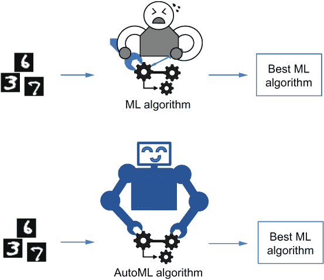
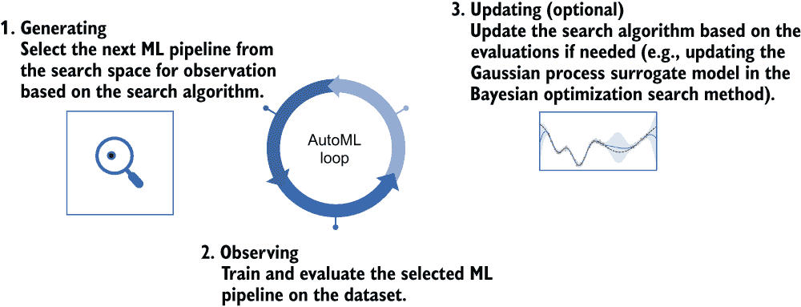
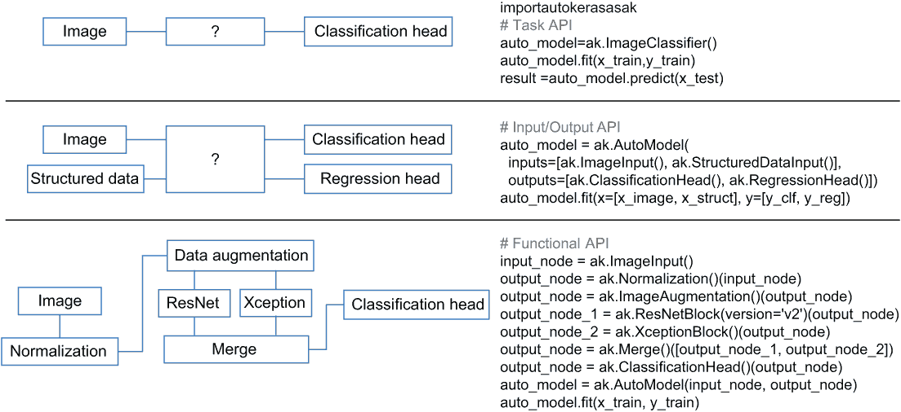
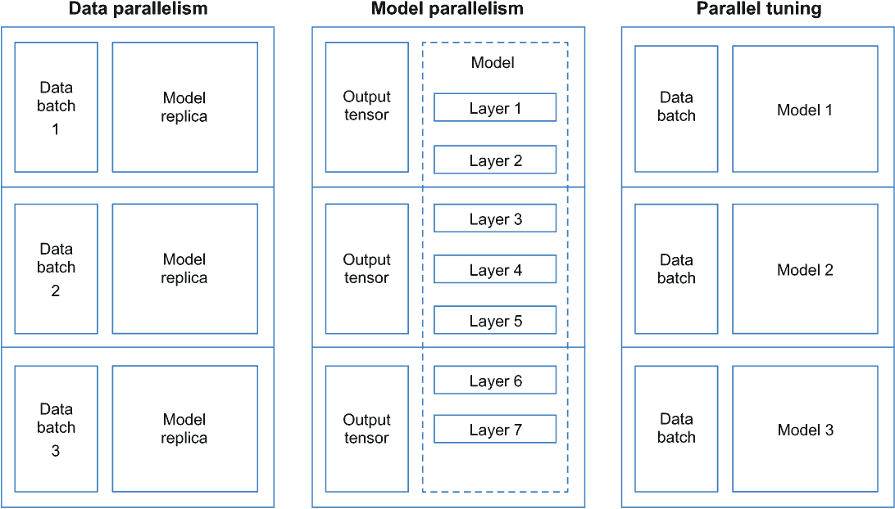

# 9 总结

本章涵盖

+   本书的重要要点

+   AutoML 的开源工具包和商业平台

+   AutoML 的挑战和未来

+   学习更多和在该领域工作的资源

我们几乎到达了本书的结尾。最后一章回顾了我们所涵盖的核心概念，同时旨在拓宽你的视野。我们将从快速回顾你应该从本书中汲取的内容开始。接下来，我们将概述一些流行的 AutoML 工具（包括开源和商业），这些工具位于 Keras 生态系统之外。了解当前 AutoML 社区中的其他标志性工具包将使你能够在阅读本书后根据你的兴趣进一步探索。最后，我们提供了一些关于 AutoML 领域的核心挑战和未来演变的推测性思考，这对于那些想要深入研究该领域基本研究的人来说将特别有趣。理解 AutoML 是一段旅程，完成本书只是第一步。在本章末尾，我们将为你提供一份关于学习更多 AutoML 和了解该领域最新发展的资源和方法简短列表。

## 9.1 复习关键概念

本节简要总结了本书的关键要点，以刷新你对所学内容的记忆。

### 9.1.1 AutoML 流程及其关键组件

AutoML 允许机器模仿人类设计、调整和应用机器学习算法的方式，以便我们更容易地采用机器学习。它旨在在给定机器学习问题时自动发现最佳机器学习解决方案，从而释放数据科学家手动调整的负担，并使没有丰富经验的专业人士能够访问现成的机器学习技术（见图 9.1）。



图 9.1 机器学习与 AutoML 对比

AutoML 的过程是迭代的，通常包括三个步骤（见图 9.2）：

1.  根据搜索策略从搜索空间中选择一个机器学习流程进行观察。搜索空间定义了我们想要调整的超参数集合以及每个超参数的取值范围。搜索策略探索搜索空间，并在每次迭代中选择一组超参数以实例化一个待评估的完整机器学习流程。

1.  在训练数据集上训练所选的机器学习流程，并检索其在验证集上评估的性能。

1.  如果搜索策略能够利用历史评估来加速发现更好流程的过程，则更新搜索策略。



图 9.2 经典顺序 AutoML 流程的搜索循环

因此，AutoML 的三个核心组件是搜索空间、搜索策略以及用于评估和比较所选管道的验证过程。搜索空间是需要你最多实现工作的部分，而其他两个的实现通常是内置模块，你可以从 AutoML 工具包中选择。

### 9.1.2 机器学习管道

正如我们在第二章中描述的，典型的机器学习工作流程可以总结如下：

+   *问题定义和数据收集*—定义问题的目标，例如你想要预测哪些类型的事物或从数据中提取哪些类型的模式。指定问题所属的范式，例如监督学习、无监督学习等。确定一种可靠地衡量最终模型成功的方法，例如在图像分类问题中的预测准确率。在许多情况下，你可能需要特定领域的指标。收集数据以帮助训练和评估你的模型。

+   *数据预处理和特征工程*—将数据处理成适合输入到机器学习算法的格式。移除冗余特征，并在需要的情况下选择或生成有用的特征，以帮助提高算法的性能。考虑你将如何评估你的模型，并将数据分割成训练集、验证集和测试集，以帮助后续的评估过程。

+   *机器学习算法选择*—根据你的经验和问题先验知识选择合适的机器学习算法。你可能想要迭代尝试不同的机器学习算法，并在将其应用于最终测试集和部署之前选择最佳的一个。

+   *模型训练和评估*—应用机器学习算法训练机器学习模型，并根据你预定义的度量在验证数据集上评估它。

+   *超参数调整*—通过迭代调整其超参数来改进管道以实现更好的性能。为了避免过拟合，确保不要使用测试集来选择机器学习算法和调整超参数。

+   *服务部署和模型监控*—部署最终的机器学习解决方案，并监控其性能以持续维护和改进管道。

### 9.1.3 AutoML 的分类

与机器学习工作流程相呼应，我们可以将 AutoML 分为以下三个类别：

+   *自动特征工程*通常遵循特征生成和选择的迭代过程。它的目的是自动发现信息丰富且具有区分度的特征，以便根据预定义的选择标准学习最佳的机器学习模型。

+   *自动超参数调整*旨在为机器学习管道中的一个或多个组件选择最优的超参数。通常，可调整的超参数可以包括机器学习管道中的任何超参数，例如模型类型、不同的数据预处理方法、优化算法的超参数等。

+   *自动流水线搜索*旨在根据我们告诉 AutoML 系统执行的任务（如分类或回归）和输入数据，生成整个机器学习（ML）流水线。

在深度学习的背景下，我们通常关注上述最后两个，但自动特征工程也非常重要（特别是对于提高浅层模型的性能和学习速度）。

### 9.1.4 AutoML 的应用

AutoML 已被应用于设计调整机器学习（ML）流水线的各种机器学习任务。在不同情况下应用 AutoML 的主要差异在于搜索空间的设计和评估策略。搜索空间应包括所有适用于当前任务的机器学习流水线，例如用于图像分类的卷积神经网络（CNNs）、用于时间序列数据的循环神经网络（RNNs）等。为您的机器学习任务设计合适的搜索空间需要对该任务特定的机器学习模型有初步的了解，这种知识可以帮助缩小搜索范围以获得更好的搜索结果。评估策略应根据应用进行调整，以便它能提供有用的度量来比较机器学习流水线。例如，在分类任务中，我们可以使用分类准确率作为度量，在推荐任务中，我们可以使用曲线下面积（AUC）或归一化折现累积增益（NDCG）等。搜索方法通常无需修改即可适用。文献中研究的一些代表性 AutoML 应用包括以下内容：

+   *自动目标检测*—目标检测是计算机视觉中的一个经典任务，旨在在图像和视频中检测特定类别的对象（如人类、家具或汽车）。自动目标检测试图生成多级目标特征的更好融合和更好的检测机器学习模型结构，以提高目标检测性能。

+   *自动语义分割*—语义分割系统有两个基本组件：多尺度上下文模块和神经网络架构。分割任务对空间分辨率变化敏感。因此，AutoML 可以用来搜索每个层具有适当空间分辨率的不同结构。

+   *自动生成对抗网络*—生成对抗网络的核心有两个组成部分：生成网络和判别网络。AutoML 可以用来搜索生成器和判别器的最佳网络结构。

+   *自动网络压缩*—自动化机器学习（AutoML）可以搜索网络参数的最佳组合，包括层稀疏性、通道数量和位宽，以压缩神经网络，而不会降低准确度或延迟。

+   *自动图神经网络*——AutoML 可以在节点分类任务中搜索适合图神经网络的图卷积组件，例如隐藏维度的数量、注意力头的数量以及各种类型的注意力、聚合和组合函数。

+   *自动损失函数搜索*——机器学习中使用的最常见损失函数是交叉熵和 RMSE。除了这些之外，AutoML 还可以考虑不同计算机视觉任务中损失函数的类内/类间距离以及样本的难度水平。

+   *自动激活函数搜索*——激活函数在深度神经网络中起着至关重要的作用。除了选择最佳现有激活函数外，AutoML 还可以搜索一组二进制和一元数学函数，以设计预定义函数结构的新激活函数。

+   *自动点击率*（CTR）*预测*——CTR 预测是推荐系统中的一个重要任务。AutoML 可以设计有效的神经网络架构来捕捉显式和隐式特征交互，以实现更好的 CTR 预测。

其他任务包括计算机视觉领域的自动行人重识别、自动超分辨率和自动视频任务；自然语言处理领域的自动翻译、自动语言建模和自动关键词检测；以及一些特定于模型/算法/学习范式和任务无关的应用，例如自动无监督学习、自动强化学习、自动联邦学习等等。一般来说，AutoML 的可能应用领域与机器学习（ML）的可能性空间相吻合。无论你可以在哪里应用机器学习，你都可以应用 AutoML 来生成机器学习管道，或者通过更改其组件或调整其超参数来改进管道。

### 9.1.5 使用 AutoKeras 的自动深度学习

深度学习是机器学习的一个子领域，已成为人工智能社区乃至更广泛的领域的热门话题。它在广泛的应用空间中展现出有希望的性能和可能性。自动深度学习的目标是自动设计和调整深度学习管道。在最受欢迎的开源深度学习库 AutoKeras 的支持下，我们能够根据我们的需求和不同的 AutoKeras API 在以下场景中进行自动深度学习：

+   AutoKeras 的任务 API 可以帮助我们用尽可能少的代码行（如三行）生成针对目标机器学习任务（如图像分类）的端到端深度学习解决方案。这些是最直接的 AutoKeras API，因为它们允许我们在单步中实现所需的机器学习解决方案——即输入数据——而无需我们自己知道如何实现深度学习模型。在 AutoKeras 的最新版本中，有六个不同的任务 API 支持六个不同的任务，包括图像、文本和结构化数据的分类和回归。在开始之前，你应该清楚地知道根据你想要解决的机器学习问题选择哪个 API，并将原始数据准备成 AutoKeras 可接受的格式之一。

+   AutoKeras 的输入/输出（I/O）API 是处理多模态和多任务学习问题的更通用解决方案。它接受不同类型和数量的输入和输出，并在初始化时要求你明确指定它们的格式。

+   功能 API 是 AutoKeras 最复杂的 API，专为希望根据需求定制搜索空间的先进用户设计。它类似于 TensorFlow Keras 功能 API，要求你通过连接一些 AutoKeras 构建块来实现 AutoML 管道。每个块代表由多个 Keras 层组成的特定深度学习模型（或数据预处理方法），例如 CNN，以及模型的超参数搜索空间。你还可以在每个构建块（或你自己的 AutoML 块）中指定搜索空间，并将它们与内置块连接起来，以选择和调整你自己的个性化深度神经网络。

图 9.3 展示了这些 API 各自的使用示例。



图 9.3 展示了使用 AutoKeras API 进行自动深度学习的示例。

AutoKeras 支持你对于监督学习问题（如分类和回归）的自动深度学习解决方案的需求，其内置块也节省了你创建搜索空间的努力。然而，如果你需要的内置块都不满足你的需求，或者你有一个复杂的 AutoML 应用程序，需要调整损失函数、选择浅层模型、为无监督学习问题设计模型等，我们建议你使用 Keras 生态系统中的其他 AutoML 工具包：KerasTuner。

### 9.1.6 使用 KerasTuner 进行完全个性化的 AutoML

KerasTuner 是一个用于选择和调整深度学习和浅层机器学习模型的库。除了 AutoKeras 可以解决的任务外，它还处理以下三个 AutoKeras 难以处理或引入额外负担的场景：

+   搜索空间中的管道有不同的训练和评估策略，例如使用 scikit-learn 实现的浅层模型和使用 TensorFlow Keras 实现的深度学习模型。

+   你需要执行除了监督学习任务之外的任务。

+   在 AutoKeras 中没有内置的 AutoML 块适合使用。

如第六章所述，使用 KerasTuner 调整模型需要实现一个模型构建函数（或扩展 HyperModel 的类）来表征搜索空间，并初始化一个指定搜索方法的调节器对象，如下所示。

列表 9.1 使用随机搜索调整 KerasTuner 的 MLP 模型

```
import tensorflow as tf
from tensorflow import keras
from tensorflow.keras import layers
from keras_tuner import RandomSearch

def build_model(hp):                               ❶
    input_node = keras.Input(shape=(20,))
    units = hp.Int('units', min_value=32, max_value=512, step=32)
    output_node = layers.Dense(units=units, activation='relu')(input_node)
    output_node = layers.Dense(units=1, activation='sigmoid')(output_node)
    model = keras.Model(input_node, output_node)

    optimizer = tf.keras.optimizers.Adam(learning_rate=1e-3)
    model.compile(
        optimizer=optimizer,
        loss='mse',
        metrics=['mae'])
    return model

tuner = RandomSearch(                              ❷
    build_model,
    objective='val_mae',
    max_trials=5,
    executions_per_trial=3,
    directory='my_dir',
    project_name='helloworld')
```

❶ 创建模型构建函数，并指定搜索空间

❷ 定义随机搜索调节器

调节器包含一个搜索方法，并在搜索过程中组织所选管道的训练和评估。由于 KerasTuner 是为调整深度学习模型而设计的，因此内置的调节器（除 SklearnTuner 外）都是专门用于调整深度学习管道的。每个调节器都封装了深度学习管道的训练和评估过程，其名称表示特定的搜索方法：例如，RandomSearch 是一个采用随机搜索方法调整深度学习模型的调节器。

我们可以通过使用 SklearnTuner 以与深度学习模型相同的方式创建用于调整使用 scikit-learn 库实现的浅层模型的搜索空间，SklearnTuner 封装了 scikit-learn 模型或管道的训练和评估过程。在 KerasTuner 中，搜索方法被称为 oracle。因此，我们可以通过更改调节器中的 oracle 来选择不同的搜索方法。我们还可以自定义调节器来调整使用其他库（超出 Keras 和 scikit-learn）实现的模型。以下列出了自定义调节器的伪代码；它需要实现一个 run_trial()函数来执行当前试验，以及两个用于保存和加载评估模型的辅助函数。

列表 9.2 自定义调节器的模板

```
import tensorflow as tf
import keras_tuner as kt

class CustomTuner(kt.engine.base_tuner.BaseTuner):       ❶

    def run_trial(self, trial, data):                    ❷
        ...

    def save_model(self, trial_id, model, step=0):       ❸
        ...

    def load_model(self, trial):                         ❹
        ...
        return model

my_custom_tuner = CustomTuner(
    oracle=kt.oracles.RandomSearch(
        objective=...,
        max_trials=...,
        seed=...),
    hypermodel=build_model,
    overwrite=True,
    project_name='my_custom_tuner')
>>> my_custom_tuner.search(data)
```

❶ 构建和拟合 GBDT 模型

❷ 构建、训练、评估和保存当前试验中选定的模型，并在需要时更新 oracle

❸ 将模型保存到磁盘

❹ 模型加载函数

除了通过更改 oracle 来选择我们自定义调节器的不同搜索方法外，我们还可以通过自定义 oracle 类来实现自己的搜索技术，如下一节所示。

### 9.1.7 实现搜索技术

现有的 AutoML 搜索方法可以根据它们是否能够考虑历史搜索结果来提高性能，分为历史无关或历史相关。

随机搜索和网格搜索是两种代表性的不依赖历史信息的方法。启发式方法，如进化方法和基于模型的方法，如贝叶斯优化方法，是两种最广泛使用的依赖历史信息的方法。进化方法模拟了生物种群的发展。它随机初始化一个试验种群，并从种群中随机选择几个父代试验，根据超参数的变异和交叉操作生成后代。在评估新的后代试验后，根据某些选择策略（如排名选择）更新种群。贝叶斯优化采用一个代理模型，该模型使用历史评估的机器学习管道作为近似未见模型性能的更便宜的方法。一个获取函数将利用代理模型的近似来帮助采样下一个可用的试验。

设计一个依赖历史信息的搜索方法需要平衡利用和探索。*利用*意味着我们想要利用过去的经验，根据当前表现最佳的超参数的邻近性来选择下一个超参数，因为我们对这些点有信心。*探索*意味着我们想要探索搜索空间中更多未开发的区域，以避免陷入局部最优并错过全局最优。

实现一个依赖历史信息的搜索方法需要实现两个步骤：超参数采样和算法更新。搜索方法的采样和更新在 populate_space()函数中实现，如下所示。

列表 9.3 定制算子的模板（搜索方法）

```
class CustomOracle(Oracle):

    def __init__(self, *args, **kwargs):
        super().__init__(*args, **kwargs)
        ...                                 ❶

    def populate_space(self, trial_id):
        values = ...                        ❷
        ...                                 ❸
        if values is None:
            return {'status': trial_lib.TrialStatus.STOPPED,
                    'values': None}
        return {'status': trial_lib.TrialStatus.RUNNING,
                'values': values}
```

❶ 可以在这里放置搜索方法的额外初始化步骤

❷ 在当前试验中采样超参数值

❸ 基于搜索历史更新搜索方法

注意：在研究社区中，一些最近的研究进展集中在*强化学习*和*基于梯度的方法*上，尤其是在自动深度学习的领域。我们将在本章末尾提供一些有用的学习材料的参考文献，以便在阅读本书之后，您可以进行一些进一步的探索，以跟上这些进展。

### 9.1.8 扩展 AutoML 过程

在实践中应用 AutoML 的最大挑战是数据可扩展性以及时间和空间复杂性。解决这些挑战的一种典型方法是通过采用并行化技术。正如我们在第八章中讨论的，存在以下三种类型的并行化策略（见图 9.4）：

+   *数据并行性*使得通过利用多台机器（或 CPU/GPU/TPU）来处理大型数据集成为可能。这种方法允许你在不同的机器上使用不同的数据批次训练相同模型的多个副本，并定期同步这些机器以更新模型权重。

+   *模型并行性*主要用于无法包含在单个 GPU 内存中的大型模型，或者用于加速推理过程可以并行化的模型。它将模型分解成不同的部分，并将它们分配到不同的 GPU 上，以便整个模型可以适应可用的内存。在推理过程中，模型的一些部分可能并行运行以节省时间。

+   *并行调优*用于加速 AutoML 过程。采用这种方法，你将具有不同超参数设置的模型放在不同的 GPU 上，并使用相同的训练数据集来训练它们，因此超参数调优过程是并行运行的。



图 9.4 三种并行类型

除了利用更多的硬件资源外，我们还可以通过以下方式从算法的角度加速搜索过程：

+   *使用基于保真度的技术*——我们可以使用低保真度估计来大致比较不同机器学习管道的性能。一些典型的方法包括早期停止、对训练和评估搜索过程中发现的模型的数据进行子采样，以及直接采用高级调度方法，如 Hyperband。

+   *使用预训练权重和模型*——我们可以使用预训练的权重并将它们（部分）共享到发现的机器学习模型中，以加速这些模型的训练。这在自动深度学习中特别有用。

+   *预热搜索空间*——我们可以在搜索开始之前手动挑选一些好的模型和超参数来评估，并将一些人类先验知识注入到搜索算法中，让搜索算法基于这些信息进行构建。

## 9.2 AutoML 工具和平台

工具和平台的发展推动了 AutoML 领域的发展。我们在此介绍其中的一些。尽管不同工具的环境配置相当不同，其中一些还提供了 GUI 以实现更好的可视化和更简单的人机交互，但它们的 API 通常与 AutoKeras 和 KerasTuner 的 API 非常相似。它们都是围绕 AutoML 的三个组件构建的：搜索空间、搜索算法和评估标准。在前面章节的背景下，你应该能够通过探索它们的仓库和教程，无需陡峭的学习曲线就能适应这些工具。

### 9.2.1 开源 AutoML 工具

可用的开源 AutoML 工具包可以根据其核心焦点分为几个类别。以下是一些：

+   自动特征工程工具

+   自动超参数调整、模型选择和端到端自动化管道搜索工具

+   自动深度学习工具

让我们看看一些代表性的例子。

FeatureTools 可能是当时最受欢迎的开源 Python 库，用于自动特征工程。它将特征工程操作抽象为原语，并将它们应用于从关系数据集和时间数据集中生成特征。

大多数现有的 AutoML 项目都集中在超参数调整或生成端到端机器学习管道。这个领域最早的项目之一是 Auto-WEKA，它建立在名为 Weka（Waikato Environment for Knowledge Analysis）的数据分析包之上。它通过贝叶斯优化方法进行超参数调整并生成机器学习管道，主要用于监督学习任务。另一个基于 scikit-learn 库构建的项目，名为 Auto-Sklearn，在许多 AutoML 竞赛中展示了有希望的性能。它也使用贝叶斯优化方法搜索并发现集成模型以提升性能。Auto-Sklearn 的最新版本有一个简洁的 API，类似于 AutoKeras 的任务 API，如下所示。其他一些流行的库包括 TPOT、Hyperopt、Microsoft NNI 以及 H2O AutoML 工具包的开源版本。

列表 9.4 比较 Auto-Sklearn 和 AutoKeras 任务 API

```
from autosklearn.classification import AutoSklearnClassifier
automl = AutoSklearnClassifier()                              ❶
automl.fit(X_train, y_train)
predictions = automl.predict(X_test)

clf = ak.StructuredDataClassifier()                           ❷
clf.fit(x_train, y_train, epochs=10)
predicted_y = clf.predict(x_test)
```

❶ 初始化 Auto-Sklearn 的自动分类学习器

❷ 初始化 AutoKeras 的自动分类学习器

近年来，大部分开发工作都集中在自动深度学习上。除了 AutoKeras 之外，亚马逊的研究人员还提出了一个名为 AutoGluon 的包，它建立在 Gluon 深度学习 API 之上。它针对 MXNet 和 PyTorch 用户，旨在在 AWS 云基础设施上易于使用。其他库，如 Auto-PyTorch，也提供了与 AutoKeras 类似 API 的神经架构搜索功能。

除了这里提到的工具之外，许多其他工具也提供了 AutoML 组件。例如，一个著名的机器学习分布式执行框架 Ray 有一个名为 Ray Tune 的模块，它收集了一系列开源 AutoML 搜索算法，并利用 Ray 框架实现分布式调整。Ludwig 工具箱允许您在不编写任何代码的情况下训练和评估深度学习模型，它还包括一个用于超参数调整和模型选择的 AutoML 模块。这些工具的总结见表 9.1。

表 9.1 选定的开源 AutoML 工具

| 核心任务 | 框架 | URL |
| --- | --- | --- |
| 自动特征工程 | FeatureTools | [`www.featuretools.com`](https://www.featuretools.com) |
| 自动超参数调整或管道搜索 | Hyperopt | [`hyperopt.github.io/hyperopt/`](http://hyperopt.github.io/hyperopt/) |
|  | Auto-WEKA | [`www.cs.ubc.ca/labs/beta/Projects/autoweka/`](https://www.cs.ubc.ca/labs/beta/Projects/autoweka/) |
|  | Auto-Sklearn | [`automl.github.io/auto-sklearn/master/`](https://automl.github.io/auto-sklearn/master/) |
|  | Ray Tune | [`docs.ray.io/en/master/tune/index.html`](https://docs.ray.io/en/master/tune/index.html) |
|  | KerasTuner | [`keras.io/keras_tuner/`](https://keras.io/keras_tuner/) |
|  | TPOT | [`epistasislab.github.io/tpot/`](http://epistasislab.github.io/tpot/) |
|  | 微软 NNI | [`nni.readthedocs.io`](https://nni.readthedocs.io) |
|  | H2O AutoML 工具包 | [`www.h2o.ai/products/h2o-automl/`](https://www.h2o.ai/products/h2o-automl/) |
|  | 洛德维希 | [`github.com/ludwig-ai/ludwig`](https://github.com/ludwig-ai/ludwig) |
| 自动深度学习 | AutoKeras | [`autokeras.com`](https://autokeras.com) |
|  | Auto-Gluon | [`auto.gluon.ai/stable/index.html`](https://auto.gluon.ai/stable/index.htm) |

### 9.2.2 商业自动机器学习平台

除了开源项目之外，许多公司，尤其是那些提供云服务的公司，也在探索自动机器学习的商业机会。以下是一些例子：

+   谷歌 Cloud AutoML ([`cloud.google.com/automl`](https://cloud.google.com/automl)) 提供了一个图形界面，可以根据其应用领域和数据结构自定义机器学习模型。谷歌的 AutoML 产品包括用于计算机视觉任务的 AutoML Vision、用于自然语言处理任务的 AutoML Natural Language、用于轻松构建和部署模型的 Vertex AI 以及更多。

+   亚马逊 SageMaker Autopilot ([`aws.amazon.com/sagemaker/autopilot/`](https://aws.amazon.com/sagemaker/autopilot/)) 主要专注于生成用于表格数据分类或回归的端到端机器学习管道。它可以帮助您通过简单地输入原始表格数据和目标，自动构建、训练和调整最佳机器学习模型，并且可以利用 AWS 的强大功能来处理大规模任务。您还可以一键部署模型到生产环境，并通过利用 Amazon SageMaker Studio 逐步改进它。

+   微软 Azure AutoML ([`mng.bz/aDEm`](http://mng.bz/aDEm)) 提供了针对两个不同用户群体的定制化体验。对于熟悉机器学习并且知道如何使用 Python 代码实现机器学习模型的用户，Azure 机器学习 Python SDK 可以是一个不错的选择，它使您能够快速、大规模地构建机器学习模型。对于没有机器学习编码经验的用户，Azure 机器学习 Studio ([`ml.azure.com`](https://ml.azure.com)) 是一个很好的选择；它提供了一个图形界面，通过几个简单的点击即可执行自动机器学习。

+   IBM Watson Studio AutoAI ([`www.ibm.com/cloud/watson-studio/autoai`](https://www.ibm.com/cloud/watson-studio/autoai)) 自动化 AI 生命周期的所有四个步骤：数据准备、特征工程、模型开发和超参数优化。您可以使用此工具管理整个生命周期，并通过一键部署模型。

除了之前提到的平台，许多初创公司也在努力，包括 DataRobot、4Paradigm、H2O.ai、Feature Labs、DarwinML 等（见表 9.2）。我们相信 AutoML 将继续在越来越多的产品中应用并显示出其优势，并将有助于民主化 ML 技术，使更多公司能够用于不同的工业应用。

表 9.2 选定的商业 AutoML 平台

| 公司 | 产品 | 用户示例 |
| --- | --- | --- |
| Google | Google Cloud AutoML | 迪士尼、ZSL、URBN |
| Amazon | Amazon SageMaker Autopilot | Amazon AWS |
| Microsoft | Microsoft Azure AutoML | Azure 机器学习、Power BI 和其他 Microsoft 产品 |
| IBM | IBM Watson Studio AutoAI | IBM Cloud |
| DataRobot | DataRobot 企业 AI 平台 | Snowflake、Reltio、Alteryx、AWS、Databricks |
| 4Paradigm | 4Paradigm AutoML 平台 | 中国银行、PICC、知乎 |
| H2O.ai | H2O AutoML 平台 | AWS、Databricks、IBM、NVIDIA |
| Feature Labs | Feature Labs AutoML 平台 | NASA、Monsanto、Kohl’s |
| DarwinML | DarwinML AutoML 平台 | Intelligence Qubic |

## 9.3 AutoML 的挑战和未来

AutoML 仍然处于早期阶段，有巨大的可能性等待发现和限制需要解决。在本节中，我们分享了对当前 AutoML 领域主要挑战的看法，并展望了如何解决这些挑战。

### 9.3.1 衡量 AutoML 的性能

在进行 AutoML 之前，我们需要明确我们想要用来衡量其性能的目标。尽管在这本书的大部分内容中，我们使用了准确率指标，如图像分类准确率，来决定 AutoML 算法发现的模型是否良好，但 AutoML 不仅仅是提高模型准确率。在实践中，在应用 AutoML 时，我们可能需要或需要考虑许多目标。例如，我们可能希望选择一个具有较小模型尺寸的深度学习模型（限制内存消耗）或较慢的训练/推理速度，以便我们可以在边缘设备上部署它。在这种情况下，我们可能需要考虑搜索过程中的复杂度指标，如每秒浮点运算次数（FLOPS）。作为另一个例子，我们可能希望一个能够生成高度可解释和令人信服的结果的模型，而不仅仅是提供准确的预测。这在医疗应用中相当常见，其中可解释性和透明度非常重要。道德和伦理也指出，数据隐私和 ML 模型的预测公平性很重要，这导致了一些新的研究方向，如具有联邦学习的 AutoML 来增强这些目标。由于具体目标因案例而异，理想的 AutoML 系统应该能够考虑这些特定任务的要求，并且不同的 AutoML 算法应该进行更好的基准测试，以帮助没有太多 ML 背景的用户轻松选择最佳使用方案。

### 9.3.2 资源复杂性

资源消耗是当前 AutoML 领域的主要挑战之一。随着数据集和机器学习模型变得越来越庞大，终端用户往往难以采用 AutoML 来设计或调整他们自己的机器学习模型。由于资源限制，我们常常不得不妥协。尽管研究界最近的一些进展旨在提出*一次性方法*以避免迭代调整过程，但为了从机器学习算法和硬件设计两个方面降低 AutoML 的时间和空间复杂度，还有很多探索要做。

### 9.3.3 可解释性和透明性

AutoML 最终应该方便用户使用，减轻他们的负担。这要求 AutoML 系统以人为中心，意味着用户应以多种方式参与到搜索过程中。首先，AutoML 系统提供的结果应该是可解释的，以说服用户其有效性，并培养用户对 AutoML 解决方案在特定领域应用（如医疗应用）的信任。其次，用户应该能够调整搜索空间或目标以加速搜索过程，这需要可见性。第三，搜索方法应该对用户透明，以帮助他们更好地理解搜索过程，并确保数据隐私得到保护，预测是公平的。确保 AutoML 的可解释性和透明性还需要对不同的机器学习管道和 AutoML 搜索技术有更深入的理论理解。

### 9.3.4 可重复性和鲁棒性

机器学习的可重复性和机器学习模型的鲁棒性是机器学习社区的热门话题。这些问题在 AutoML 的背景下也同样重要——甚至更具挑战性，因为 AutoML 系统不仅可能控制多个机器学习管道的训练，还包含多个控制搜索算法的“超超参数”。单个种子差异可能导致单个机器学习管道的训练结果产生巨大差异，也可能导致超参数采样和搜索算法更新的巨大差异。此外，机器学习模型，尤其是深度学习模型，容易受到对抗性样本和人类感知干扰的影响。确保训练和评估机器学习模型以及超参数采样和搜索算法更新的鲁棒性对于保护 AutoML 系统至关重要。

### 9.3.5 泛化性和迁移性

在实际应用中，我们可能会有多个数据集和任务。一个由人类设计的模型通常适用于不同的数据集，甚至可以在多个任务之间迁移。我们期望 AutoML 解决方案也能推广到不同的机器学习应用中。还期望它具有终身学习能力，这意味着从先前 AutoML 任务中学习到的元知识可以被记住并应用于新任务，就像我们人类积累知识和经验一样。

### 9.3.6 民主化和商业化

AutoML 在推广高级机器学习技术方面发挥着重要作用，尤其是对于没有太多机器学习专业知识的用户来说。尽管开源社区在开发易于使用的 AutoML 解决方案方面加大了努力，但使用这些工具的学习曲线仍然很陡峭，需要初步的机器学习知识和对 AutoML 系统的理解。此外，由于从通用搜索空间生成 AutoML 解决方案不切实际，采用 AutoML 方法处理超出常见问题的机器学习任务通常需要额外的手动数据预处理工作和特定领域的搜索空间设计。将 AutoML 解决方案商业化并投入生产还需要更优化的系统设计。部署它们甚至可能比采用经典机器学习方法和手动设计和调整更复杂。

## 9.4 在快速发展的领域中保持最新

为了帮助您跟上快速发展的 AutoML 领域，在本节中，我们将向您推荐一些有用的资源，这些资源可以帮助您跟踪和学习 AutoML 技术领域的最新发展。一些研究小组和个人研究人员在其网站或 GitHub 页面上调查和整理了 AutoML 工具包和论文的最新进展，因此我们将从其中的一些开始（目前这些内容是定期更新的）。您可以通过以下资源快速搜索和检索 AutoML 文献中的材料：

+   弗赖堡大学 AutoML 研究小组的网站，由弗兰克·胡特教授和马里乌斯·林道尔领导：[`www.automl.org`](https://www.automl.org)。除了托管研究小组的项目外，该网站还基于分类如神经架构搜索（NAS）等，提供了精选的 AutoML 论文和其他资源的列表。

+   由马克·林博士发起的 GitHub 网页，提供了一份精选的 AutoML 论文和其他资源的列表：[`github.com/hibayesian/awesome-automl-papers`](https://github.com/hibayesian/awesome-automl-papers)。

+   由韦恩·韦发起的 GitHub 网页，整理了一份 AutoML 相关文献和工具包的列表：[`github.com/windmaple/awesome-AutoML`](https://github.com/windmaple/awesome-AutoML)

除了这些参考网站，我们还推荐以下三个网站，你可以在这些网站上搜索最新的 AutoML 研究论文，或者在实际应用中练习一些代码和实现：

+   arXiv ([`arxiv.org`](https://arxiv.org)) 是一个开放获取的科研论文预印本服务器。机器学习领域的科研人员经常在这里发布他们的发现或研究想法，甚至在他们的论文发表之前。尽管监控网站上大量的论文可能会让人感到压力山大，但这仍然是一个不错的渠道，让你能够跟踪 AutoML 领域的新发现。

+   Papers with Code ([`paperswithcode.com/`](https://paperswithcode.com/)) 精选了带有免费开源代码的机器学习论文。你可以浏览前沿的 AutoML 论文，以及探索用于学习和实践的学习示例代码和数据集。

+   Kaggle ([`kaggle.com`](https://kaggle.com)) 是一个面向数据科学和机器学习实践者的在线社区，参与者可以发布数据集，组织比赛，并使用机器学习模型解决数据挑战。通过参与这些比赛并了解其他实践者在不同任务上的机器学习或 AutoML 解决方案，你将更深入地理解机器学习模型和 AutoML 技术。

AutoML 并非遥不可及，无疑，它是迈向通用人工智能的重要一步。长期来看，所有机器学习问题的完全自动化是可能的，但短期内不太可能实现。我们可能正处于对 AutoML 过度期望的顶峰，通往通用人工智能的道路仍然充满挑战。其发展高度依赖于来自多个不同领域的科研人员、开发者和实践者的参与。我们鼓励你继续你的 AutoML 学习之旅，包括使用、质疑和开发 AutoML，这可以是一段终身的旅程。尽管许多人认为，民主化人工智能可能会使人类专家变得无用，被人工智能代理所取代，但我们相信，机器的智慧永远不会完全超越人类的智慧，相反，我们将共同成长和学习。总的来说，我们只能根据我们今天所知道的情况来想象未来会带来什么——但当我们回顾过去，看看人们当时是如何想象他们的未来的，我们常常发现今天的现实已经超越了他们的最狂野的梦想。

## 摘要

+   本章总结了你在本书中学到的核心概念。我们希望你已经从 AutoML 以及如何使用 AutoKeras 和 KerasTuner 来应用它中学到了一些东西，同时也对从 AutoML 视角看机器学习有了诱人的瞥见。

+   越来越多的开源和商业 AutoML 工具包被提出，该领域的研究活跃。这些工具帮助将机器学习技术民主化到不同的研究领域和工业应用中。

+   AutoML 仍处于早期阶段，存在着巨大的可能性空间等待被发现，以及需要解决的局限性。我们鼓励您从提供的资源中学习，继续在这个领域进行探索，并且永远不要停止向理解 AutoML 奥秘迈进。
