# 附录 A. 设置运行代码的环境

本附录提供了设置环境以运行本书中代码示例的说明。本书中所有的代码片段都是以 Jupyter Notebook 脚本或 *notebooks* 的形式提供的。Jupyter Notebook ([`jupyter.org/`](https://jupyter.org/)) 是一个开源的 Web 应用程序，在机器学习和数据科学社区中很受欢迎；它为包括 Python 在内的各种语言提供支持，包括交互式代码设计、数据处理和可视化、叙事文本等。与在命令行或 PyCharm 等 IDE 中运行独立的 Python 相比，它具有更平缓的学习曲线，有助于学习和开发。

本书展示的所有代码片段都可以从 [`github.com/datamllab/automl-in-action-notebooks`](https://github.com/datamllab/automl-in-action-notebooks) 下载。要运行脚本，您有以下两种选择：

+   使用在线服务或平台，如 Google Colaboratory（Colab）、AWS EC2 等。

+   在您的本地工作站上安装 Jupyter Notebook。

我建议使用 Google Colab，因为它具有相对平缓的学习曲线，并且易于设置以运行机器学习实验。它还提供了免费的硬件资源（CPU 和 GPU），使得运行实验——特别是深度学习实验——变得更加容易。

我将首先提供设置和配置 Google Colab 环境的说明，然后介绍一些创建和运行笔记本的基本操作。我还会向您展示如何安装运行本书中笔记本所需的附加包以及如何配置运行时。在最后一节中，我将简要描述如何在您的本地机器上设置环境，以便您有更多运行代码的选项。

## A.1 Google Colaboratory 入门

Google Colab 是一个免费的 Jupyter Notebook 环境，您可以使用它来运行机器学习实验。它完全在云端运行，无需安装。默认环境包含您将需要的多数机器学习包，如 TensorFlow，并且您可以免费（但有限）访问 GPU。

注：GPU，或图形处理单元，是一种用于广泛和高效图形和数学计算的单一芯片处理器。GPU 比 CPU 更快、更高效，因此非常适合训练机器学习模型。

要开始使用 Colab，请在浏览器中访问 [`colab.research.google.com/`](http://colab.research.google.com/)。您有以下几种选择：

+   通过点击“New Notebook”（如图 A.1 所示）创建您自己的脚本。

+   通过上传本地文件或从 GitHub 加载来使用现有脚本。

如果您点击“New Notebook”（如图 A.1 所示），将为您创建一个新的 Python 3 笔记本环境。

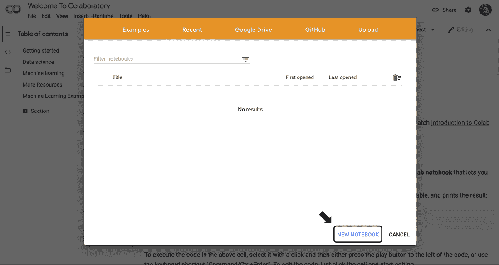

图 A.1 如果您想在 Google Colab 中创建一个新的笔记本，请点击“New Notebook”。

本书的所有代码都提供在 GitHub 上，因此你可以通过点击 GitHub 标签直接从那里加载笔记本（如图 A.2 所示）。

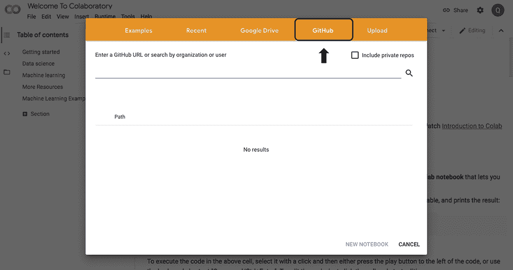

通过菜单栏选择 GitHub 来从 GitHub 仓库加载笔记本。

输入本书仓库的 URL，[`github.com/datamllab/automl-in-action-notebooks`](https://github.com/datamllab/automl-in-action-notebooks)，然后点击搜索按钮（如图 A.3 所示）。

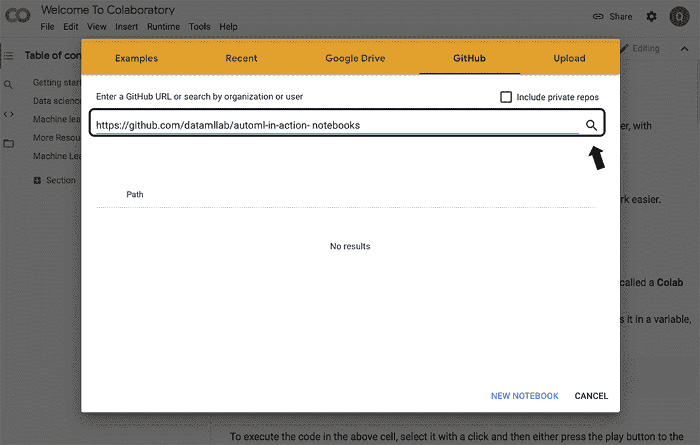

Figure A.3 输入本书的 GitHub URL，并点击搜索。

仓库菜单应设置为 datamllab/automl-in-action-notebooks，分支菜单设置为 master。在这些菜单下方，你会看到本书的所有 Jupyter 笔记本（如图 A.4 所示）。

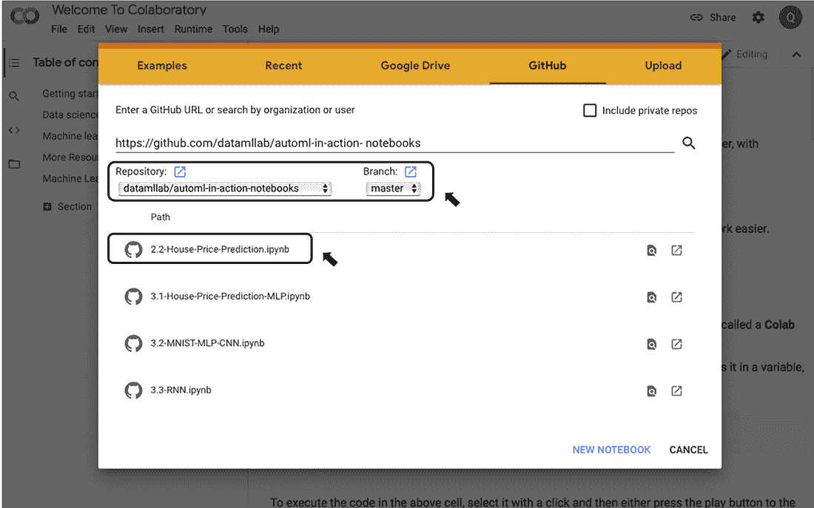

Figure A.4 查看本书 GitHub 仓库中的笔记本

如果你选择之前图中所高亮的第一个 Jupyter 笔记本（2.2-House-Price-Prediction.ipynb），Colab 将自动配置一个带有 CPU 的 Python 3 环境，允许你运行笔记本（如图 A.5 所示）。

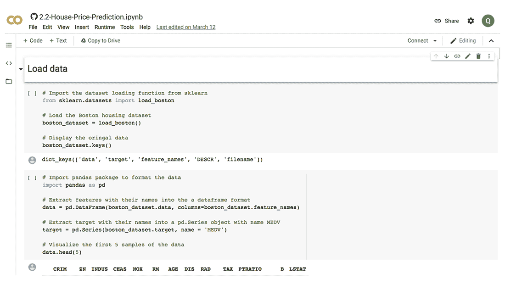

Figure A.5 加载的 2.2-House-Price-Prediction.ipynb 脚本

### A.1.1 基本 Google Colab 笔记本操作

笔记本中的每一块代码或文本都称为一个*单元格*。你可以通过点击它来直接修改现有单元格中的代码或文本。要运行一个单元格，使用 Shift+Enter 键盘快捷键或点击单元格左侧的三角形运行单元格按钮（如图 A.6 所示）。

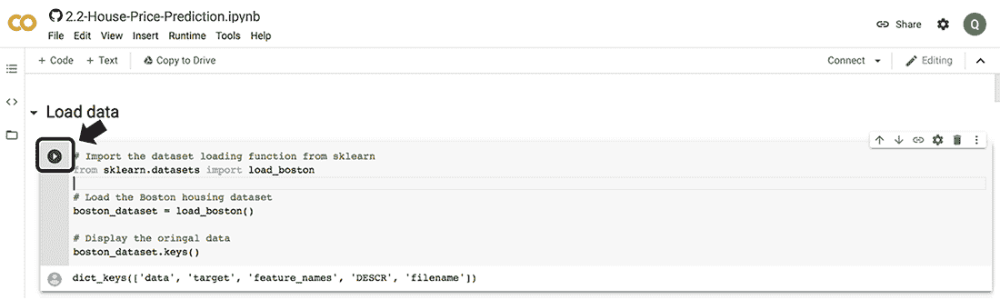

Figure A.6 点击运行单元格按钮来运行单元格中的代码。

要添加一个包含可执行 Python 代码的新单元格，你可以在工具栏中点击+ Code。例如，你可以添加一个 Python 代码单元格来导入 numpy 包，创建一个 numpy.ndarray 对象，然后运行它，如图 A.7 所示。

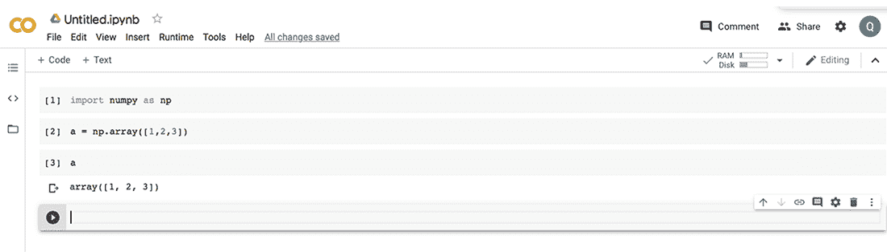

Figure A.7 创建和运行代码单元格

你还可以创建一个文本单元格，在其中你可以使用 Markdown 语法。为此，在工具栏中点击+ Text（如图 A.8 所示）。

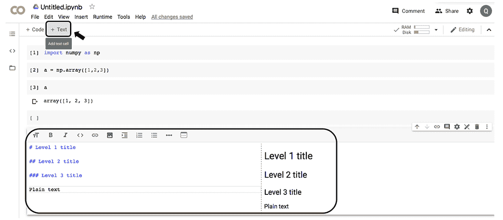

Figure A.8 创建新的文本单元格

通过选择单元格并使用所选单元格右上角的工具栏，可以执行更多操作，如删除、复制和移动单元格（如图 A.9 所示）。

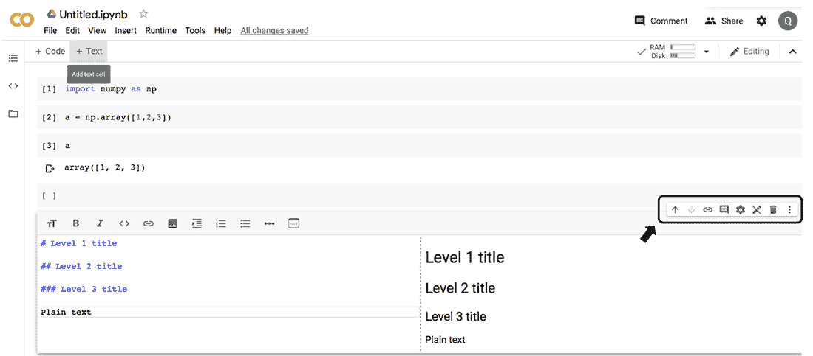

Figure A.9 其他单元格操作的工具栏

### A.1.2 包和硬件配置

Google Colab 的默认环境包括本书所需的大部分库（如 NumPy、pandas 和 TensorFlow），因此你不需要在设置新环境后安装它们。如果你确实需要安装新的 Python 包，如 AutoKeras 或 KerasTuner，你可以使用 pip，如图所示：

```
!pip install $PACKAGE_NAME
```

例如，你可以按照图 A.10 所示安装 AutoKeras。感叹号(!)告诉 Colab 以 shell 命令而不是笔记本命令的方式运行一个命令。

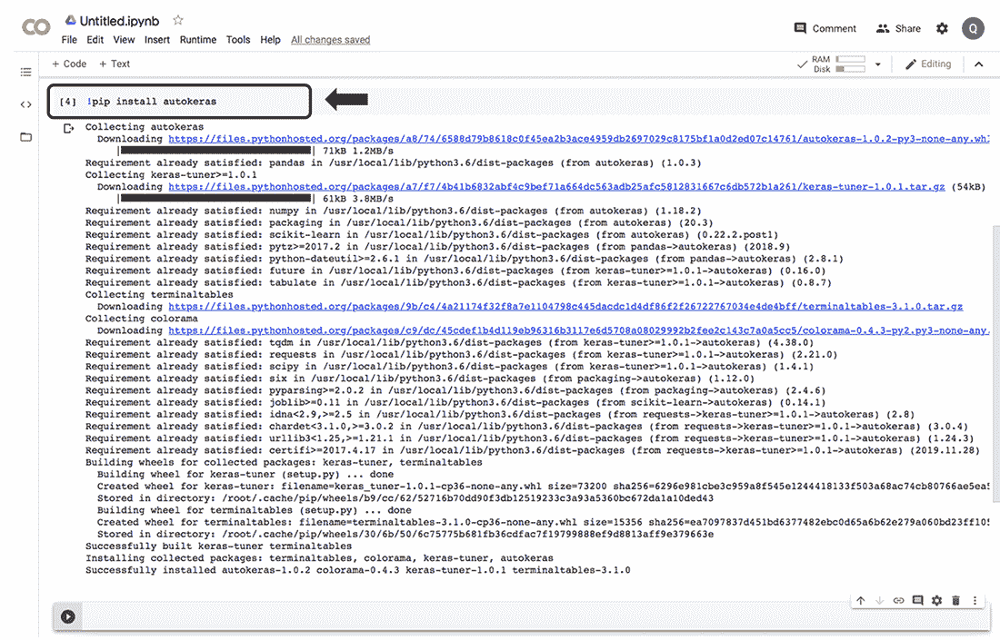

Figure A.10 在 Colab 笔记本中使用 pip 安装 AutoKeras 包

在本书的仓库中的 requirements.txt 文件中提供了一个需要安装以运行本书代码的包列表（[`mng.bz/QWZ6`](http://mng.bz/QWZ6)）。您可以在运行任何脚本之前安装所有这些包，也可以根据需要逐个安装。

要更改运行时或调整硬件，请从主菜单中选择“运行时”>“更改运行时类型”（见图 A.11）。

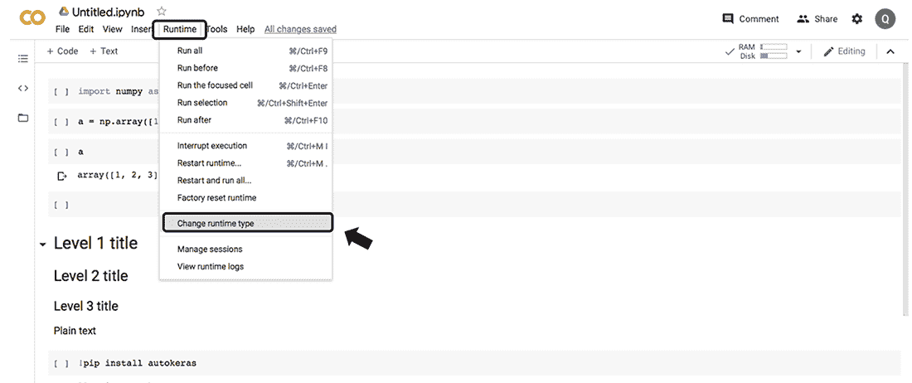

图 A.11 配置运行时和硬件

您可以将 Python 版本从默认的“book”更改为 Python 3，并可以选择要使用的硬件加速器类型：GPU、TPU 或 None（默认 CPU），如图 A.12 所示。

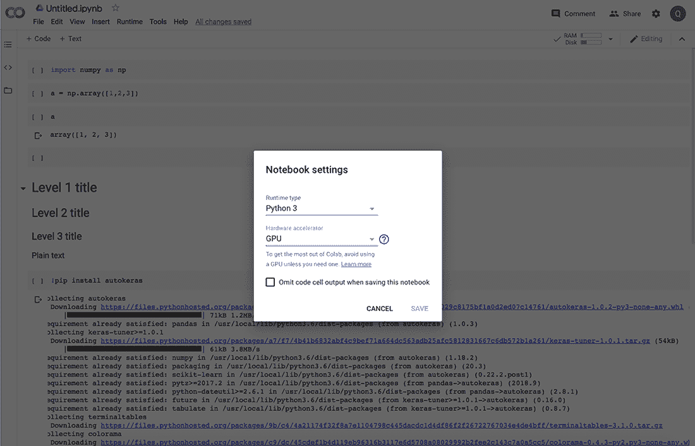

图 A.12 在 Google Colab 中使用 GPU

这就是您需要了解的所有内容，以便在 Colab 上开始运行。接下来，我们将向您展示如何在您的本地机器上安装 Jupyter Notebook。

## A.2 在本地 Ubuntu 系统上设置 Jupyter 笔记本环境

本节描述了如何在本地 Ubuntu/Debian 系统上设置 Jupyter 环境以运行本书中的脚本。以下为四个基本步骤：

+   安装 Python 3。建议您使用 Python 3，因为 Python 2 已弃用，不再由 Python 软件基金会支持。

+   使用 venv 命令创建一个 Python 3 虚拟环境，以便您更好地管理环境。

+   克隆本书的仓库，并安装所有必需的 Python 包，例如 jupyter 和 autokeras。

+   在提供的 Jupyter 笔记本上工作。

如果您选择此选项，我假设您有在 Python 3 环境中安装和工作的经验，因此我将仅介绍设置虚拟环境以运行 Jupyter 笔记本以及本节剩余步骤。如果您需要有关在本地设置 GPU 环境的详细信息，请参阅弗朗索瓦·肖莱特（François Chollet）所著的《Python 深度学习》（Manning，2021）一书。

### A.2.1 创建 Python 3 虚拟环境

我建议使用 venv 来帮助您创建一个干净的 Python 3 环境。这将允许您运行一个虚拟 Python 环境，其中安装的包与您的系统 Python 包分开。首先，按照以下方式安装 venv 命令：

```
$ sudo apt-get install python3-venv
```

然后，创建一个名为 automl 的 Python 3 环境，如图所示：

```
$ python3 -m venv ~/automl
```

在运行任何与 Python 相关的命令之前，例如这样，您需要激活虚拟环境：

```
$ source ~/automl/bin/activate
(automl) ...$
```

设置完成后，您将在命令行开头看到（automl）前缀，表示虚拟环境已启动，如图中代码片段所示。您可以使用 deactivate 命令退出环境。

### A.2.2 安装所需的 Python 包

一旦创建了虚拟环境，您就需要安装所需的包。在本书的仓库中的 requirements.txt 文件中提供了一个需要安装的包列表。您可以克隆整个仓库，并使用以下命令进行安装：

```
(automl) ...$ git clone https:/ /github.com/datamllab/automl-in-
➥ action-notebooks.git

(automl) ...$ cd automl-in-action-notebooks

(automl) .../automl-in-action-notebooks$ pip install -r requirements.txt
```

Jupyter Notebook 的包也包含在内，因此您无需单独安装。如果您需要安装其他包，可以使用以下 pip 命令：

```
(automl) .../automl-in-action-notebooks$ pip install $PACKAGE_NAME
```

### A.2.3 设置 IPython 内核

您现在已安装了 Jupyter Notebook 应用程序以及运行本书示例所需的全部包，在虚拟环境中。在开始处理笔记本之前，您需要将虚拟环境与 Jupyter Notebook 连接起来，以便代码可以在特定的 Python 环境中执行。您可以通过将虚拟环境作为笔记本内核安装来完成此操作，如图所示：

```
(automl) .../automl-in-action-notebooks$ ipython kernel install 
➥ --user --name=automl
```

内核是一个计算引擎，用于帮助执行笔记本代码。IPython 内核用于执行 Python 代码。您可以在多个内核之间切换，这允许您为运行不同的代码拥有不同的环境。

### A.2.4 在 Jupyter 笔记本上工作

要在 Jupyter 笔记本上工作，首先按照以下方式打开网络应用程序：

```
(automl) .../automl-in-action-notebooks$ jupyter notebook
```

这将在浏览器窗口中启动应用程序。您还可以在没有浏览器的情况下在远程服务器上运行 Jupyter 笔记本，可选地指定端口（—port=XXXX，默认端口号为 8888）。这将允许您使用以下链接在本地浏览器中启动应用程序：http:/ /localhost:XXXX。

```
(automl) .../automl-in-action-notebooks$ jupyter notebook 
➥ --no-browser --port=XXXX
```

这将为您提供如图 A.13 所示的链接，您可以使用它来在本地浏览器中打开 Jupyter 网络应用程序。

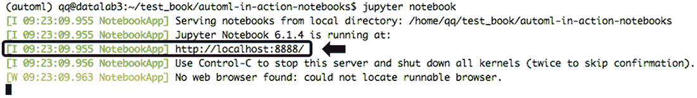

图 A.13 从命令行打开 Jupyter Notebook 网络应用程序

打开 Jupyter Notebook 并进入已下载仓库的文件夹后，您将看到该书的所有笔记本列表（如图 A.14 所示）。

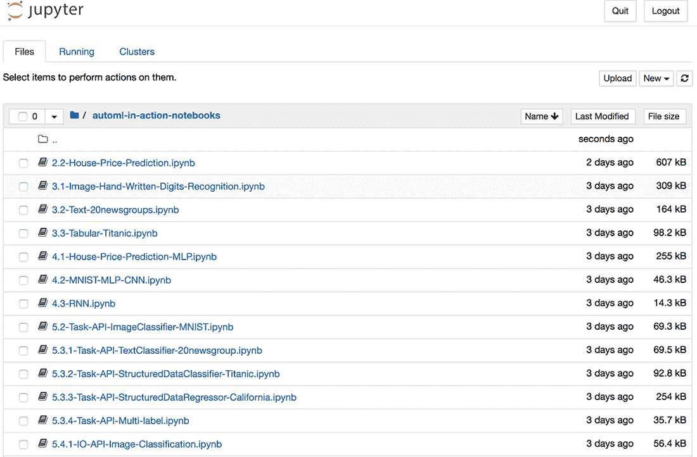

图 A.14 在网络应用程序中查看笔记本

您可以打开一个笔记本，然后将内核设置为 automl，如图 A.15 所示。

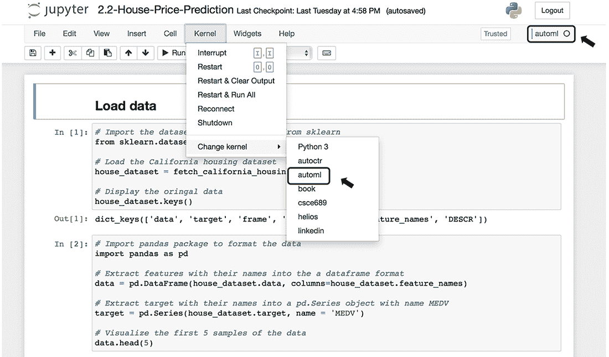

图 A.15 设置 Jupyter 笔记本的内核

选定的内核将出现在右上角。您现在可以按需运行或修改笔记本。您还可以通过按 Cmd+Shift+P（在 Mac 上）或 Ctrl+Shift+P（在 Linux 或 Windows 上）来查看一些有用的快捷键。
