# 附录 B. 三个示例：图像、文本和表格数据的分类

在第二章中，我们学习了如何构建一个端到端的机器学习管道来解决表格（结构化）数据的回归问题。本附录提供了三个额外的示例，旨在使你更熟悉机器学习管道。这些示例展示了使用各种经典机器学习模型解决涉及图像、文本和表格数据的分类问题。如果你不熟悉机器学习，你将学习如何使用定制的数据预处理方法为模型准备这些不同类型的数据。这里提出的问题也在书的第二部分使用自动化机器学习技术解决。我们将从一个图像分类问题开始。

## B.1 图像分类：识别手写数字

我们的第一个问题是识别图像中的手写数字。遵循第二章中介绍的构建机器学习管道的工作流程，我们首先界定问题并组装数据集。

### B.1.1 问题界定和数据组装

这是一个分类问题，因为我们假设每个图像中的数字只能是 0 到 9 范围内的整数。因此，识别数字等价于将图像分类到正确的数字类别中。由于我们有超过两种不同的数字类型，我们可以进一步将问题指定为*多类*分类问题。如果有两个目标类别，我们称之为*二元*分类问题。

我们将要处理的数据是 scikit-learn 库附带的手写数字数据集，包含 1,797 个大小为 8×8 的手写数字图像。我们可以使用 load_digits()函数加载它，该函数来自 scikit-learn，如下所示。这将返回图像及其相应的标签（数字），我们将它们分别存储。

列表 B.1 加载数字数据集

```
from sklearn.datasets import load_digits

digits = load_digits()                          ❶

images, labels = digits.images, digits.target   ❷
```

❶ 加载数字数据集

❷ 分别存储图像和相应的目标

加载的数据包含 1,797 个图像，分为一个形状为 1797×8×8 的三维数组。数组中的每个元素是一个介于 0 到 16 之间的整数，对应于图像中的一个像素。第二和第三维度分别是图像的高度和宽度，如下所示：

```
>>> images.shape, labels.shape
((1797, 8, 8), (1797,))
```

在实践中，你处理的图像可能具有不同的尺寸和分辨率，需要裁剪和调整大小操作以对齐它们。本例中的数据集已经处于良好状态，因此我们可以继续进行一些探索性数据分析（EDA），为机器学习模型做准备。

### B.1.2 探索和准备数据

我们可以使用 B.2 列表中的代码可视化前 20 个样本，以了解数据的外观。前 20 个图像显示在图 B.1 中。

列表 B.2 可视化前 20 个数字图像及其标签

```
import matplotlib
import matplotlib.pyplot as plt

n = 20
_, axes = plt.subplots(2, 10, figsize=(10, 2))   ❶
plt.tight_layout()                               ❷
for i in range(n):                               ❸
    row, col = i // 10, i % 10
    axes[row, col].set_axis_off()
    axes[row, col].imshow(images[i,], cmap=plt.cm.gray_r, 
        interpolation='nearest')
    axes[row, col].set_title('Label: %i' % labels[i])
```

❶ 创建一个图和 20 个子图，布局为 2×10

❷ 自动调整子图参数以提供指定的填充

❸ 绘制前 20 个数字图像

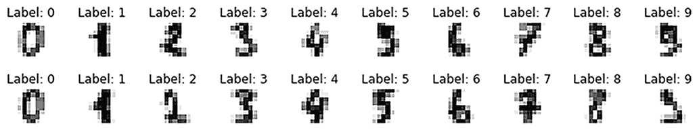

图 B.1 前 20 位数字图像及其标签的可视化

许多分类算法不能直接应用于二维图像，因此接下来我们将每个图像重塑为一个向量，如下面的代码片段所示。重塑后的数据变成了一个形状为 1797×64 的二维数组。数组中的每一行向量代表一个图像：

```
>>> n_samples = len(digits.images)
>>> X = digits.images.reshape((n_samples, -1))
>>> X.shape
(1797, 64)
```

重新塑形的数据格式与我们在第二章中处理过的表格数据类似，但每个图像有 64 个特征（与加利福尼亚住房示例中的 8 个特征相比）。更多的特征通常意味着需要更多的计算资源和更多的时间用于模型训练。这也可能使得学习机器学习模型和从数据中提取有用的分类模式变得更加困难。我们有许多特征工程方法来处理这个问题，其中之一将在下一节中介绍。

### B.1.3 使用主成分分析来压缩特征

在进行特征工程之前，让我们首先保留 20%的数据作为最终的测试集，如下所示。这将有助于防止过度拟合训练数据：

```
>>> from sklearn.model_selection import train_test_split
>>> X_train, X_test, y_train, y_test = train_test_split(
...     X, labels, test_size=0.2, shuffle=False)
>>> X_train.shape, X_test.shape
((1437, 64), (360, 64))
```

减少数据中特征数量的一个自然解决方案是选择其中的一部分。然而，图像特征（像素）通常没有实际意义，这使得很难制定关于选择哪些特征的选择假设。天真地选择一些特征可能会破坏一些图像并影响分类算法的性能。例如，假设数字可以出现在任何给定图像的左侧或右侧。无论它们出现在哪一侧，它们的标签都将相同。但如果你移除所有图像的左侧一半，一些图像将不再包含数字，导致丢失对分类有用的信息。

一种经典的方法是在尽可能保留信息的同时，减少图像中的特征数量，这种方法是*主成分分析*（PCA）。它试图通过拟合一个椭球到数据上（见图 B.2），并基于椭球的轴创建一个低维空间，将原始特征线性变换成更少的特征。这些轴由称为*主成分*的一组正交向量指出。基于这些成分，我们可以重新定义坐标空间，并用新的轴来表示每个数据点。每个数据点的坐标值是其新的特征。我们通过选择一些主成分来执行降维，使用它们指向的轴形成一个子空间，然后将数据投影到新的空间上。子空间的选择基于整个数据集中新特征的方差。图中的椭球轴长度表示了方差。为了在数据集中保留更多信息，我们选择对应于最大方差的主成分。我们可以根据它们可以保留多少整体特征方差来经验性地选择主成分的数量。

在图 B.2 中，我们可以看到，如果我们选择的主成分数量与原始特征数量相同，进行 PCA 变换就等同于旋转坐标并将数据映射到由两个主成分构成的新坐标系上。如果我们选择使用一个成分，它将点投影到椭圆的长轴上（图 B.2 中的第一个 PCA 维度）。

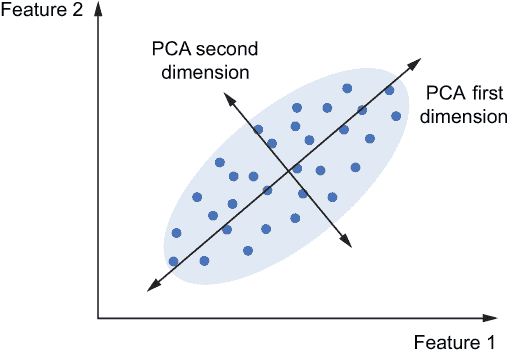

图 B.2 PCA 示例：具有两个特征的点云的两个主成分

对于数字图像，我们在这里选择 10 个特征作为示例，并使用 scikit-learn 实现 PCA，如下所示。

列表 B.3 在训练数据上应用 PCA

```
from sklearn.decomposition import PCA               ❶

n_components = 10
pca = PCA(n_components=n_components).fit(X_train)   ❷

X_train_pca = pca.transform(X_train)                ❸
```

❶ 导入 PCA 模型

❷ 使用训练数据拟合模型

❸ 将训练数据转换到低维空间

对于我们的训练数据，原始特征矩阵和转换后的特征矩阵的形状分别是（1437, 64）和（1437, 10），如图所示：

```
>>> X_train.shape, X_train_pca.shape
((1437, 64), (1437, 10))
```

要拟合 PCA 模型，我们只需要输入 X_train，而不需要提供目标标签。这与监督学习范式不同，在监督学习中，我们需要提供一些目标来训练机器学习模型。这种学习范式被称为 *无监督学习*。它的目的是直接从特征中找到未检测到的模式或学习隐藏的转换，而不需要人类监督，例如标签。PCA 等无监督学习模型对于 EDA 非常有帮助，使我们能够揭示数据中的模式。例如，回到我们的问题，我们可以将数据投影到由前两个主成分构成的两个维空间中，并用相应的标签进行着色，以可视化训练数据中的模式，如下所示（如图 B.3 所示）：

```
plt.figure(figsize=(8, 6))
plt.scatter(X_train_pca[:, 0], X_train_pca[:, 1],
            c=y_train, edgecolor='none', alpha=0.5,
            cmap=plt.cm.get_cmap('Spectral', 10))
plt.xlabel('Component 1')
plt.ylabel('Component 2')
plt.title('PCA 2D Embedding')
plt.colorbar();
```

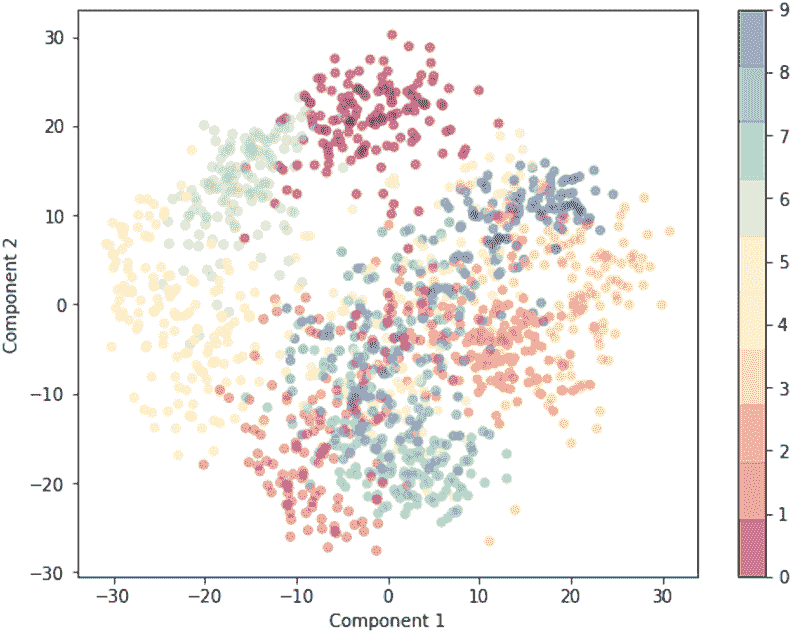

图 B.3 展示了 PCA 变换后 2 维空间中的训练数据可视化

可视化显示了训练图像之间的聚类模式。也就是说，同一数字类别的图像在这个投影的两个维空间中往往彼此更接近。现在我们已经压缩了特征，是时候选择一个机器学习模型来构建分类算法了。

### B.1.4 使用支持向量机进行分类

本节介绍了最流行的分类模型之一，即 *支持向量机*（SVM），以及我们可以调整以改进其性能的两个超参数。SVM 的最简单版本是用于二分类的 *线性* SVM。我们将以二分类为例，并假设数据有两个特征。线性 SVM 模型的主要思想是找到一个线来分隔两个类别的点，并最大化它们之间的间隔。位于间隔边界上的实例（例如，图 B.4(a) 中的实例 A 和 B）被称为 *支持向量*，因为它们“支撑”间隔的两个边界线。假设两个类别是可以直接分隔的，这意味着我们可以找到一个线确保同一类别的所有训练实例都位于同一侧。在这种情况下，我们称这个间隔为 *硬间隔*。否则，我们只能达到 *软间隔*，它可以容忍一些违规。超参数 C 可以用来决定这种容忍的强度。调整这个超参数对于线性 SVM 很有用，尤其是在两个类别几乎线性可分时。例如，我们可以减小 C 的值来增加容忍度，从而实现更大的间隔，如图 B.4(c) 所示。

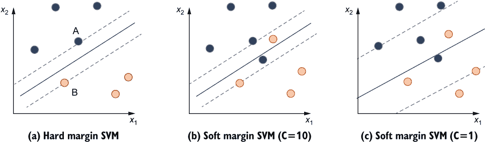

图 B.4 展示了 SVM 对硬间隔分类（a）和具有不同超参数 C 值的软间隔分类（b 和 c）。这里的 C 值仅用于说明。

有时数据集甚至接近线性不可分（如图 B.5(a)所示）。在这种情况下，我们可以使用*非线性*支持向量机。非线性支持向量机的主要思想是通过将原始特征映射到更高维的特征空间来增加特征的数量，从而使实例可以变得更加线性可分（见图 B.5(b)）。我们可以通过一种称为*核技巧*的数学技术隐式地进行这种转换。它应用一个称为*核函数*的函数，直接计算新特征空间中实例之间的相似性，而不需要显式创建新特征，从而大大提高了支持向量机算法的效率。

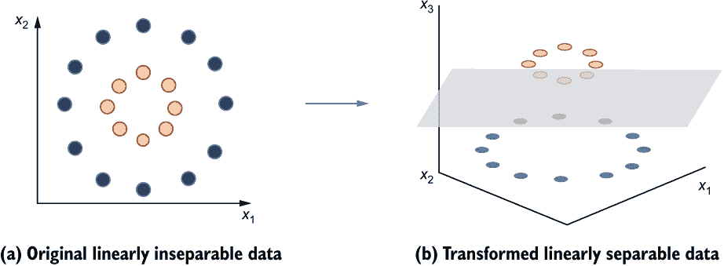

图 B.5 通过将其转换为 3-D 空间使线性不可分的 2-D 数据线性可分

支持向量机最初是为二元或双类分类设计的。为了将这种方法推广到多类分类，我们可以使用常见的*一对多*（OvO）方案。该方案从所有类中选择两个类，并在此对上构建一个二元支持向量机分类器。对每一对类重复此过程，将得到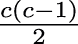个分类器，其中*c*是类的数量。在测试阶段，所有二元支持向量机分类器都会被测试。每个分类器将当前示例分类为它所训练的两个类中的一个，这意味着每个示例将在所有类中收到票。样本最终所属的类是获得最多票的类。以下示例展示了 scikit-learn 实现的多类线性支持向量机分类器。核参数指定了要使用的核类型。

列表 B.4 构建和训练 SVM 分类器

```
from sklearn.svm import SVC                   ❶

clf = SVC(kernel='linear', random_state=42)   ❷

clf.fit(X_train, y_train)
```

❶ 导入 SVM 分类器模块

❷ 使用线性核创建支持向量分类器

我们使用准确度分数来评估我们的模型。预测精度定义为正确分类的样本数除以测试样本总数，如下所示：

```
>>> from sklearn.metrics import accuracy_score
>>> y_pred_test = clf.predict(X_test)

>>> acc = accuracy_score(y_test, y_pred_test)
>>> print('Prediction accuracy: {:.2f} %'.format(acc * 100))

Prediction accuracy: 93.06 %
```

可以使用*混淆矩阵*更全面地可视化分类精度，该矩阵显示每个类中正确和错误预测的数量，如下所示：

```
>>> from sklearn.metrics import plot_confusion_matrix
>>> disp = plot_confusion_matrix(clf, X_test, y_test)
>>> disp.figure_.suptitle('Confusion Matrix (linear SVM classifier)')
>>> plt.show()
```

混淆矩阵中的每一行对应一个真实标签，每一列对应一个预测标签。例如，图 B.6 中的第一行对应真实标签 0，第一列是预测标签 0。行中的元素表示具有该标签的实例被预测为每个可能标签的数量。每一行的总和等于测试集中具有该标签的实例总数。混淆矩阵的对角线表示每个类别正确预测的标签数量。在图 B.6 中，你可以看到创建的分类器在分类带有标签 3 的测试图像时表现最差：它将六个真实标签为 3 的图像错误地分类为 8。

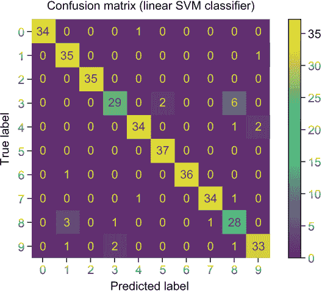

图 B.6 线性 SVM 分类器的混淆矩阵

关于模型评估中常用的指标，如 F1 分数、精确度和召回率，你可以参考弗朗索瓦·肖莱特的《Python 深度学习》一书中的更多细节。

为了在数据处理和超参数调整方面更加方便，我们可以将应用 PCA 进行特征工程和 SVM 进行分类的步骤组合成一个集成管道。

### B.1.5 使用 PCA 和 SVM 构建数据预处理管道（主成分分析）

scikit-learn 提供了一个简单的管道模块，我们可以用它来按顺序组装多个数据处理组件。以下列表显示了使用两个组件（PCA 后跟 SVM）构建顺序管道的代码。

列表 B.5 使用 PCA 和 SVM 构建 scikit-learn 管道

```
from sklearn.pipeline import Pipeline
image_clf = Pipeline([
    ('pca', PCA(n_components=10)),
    ('clf', SVC(kernel='linear', random_state=42)),])   ❶

image_clf.fit(X_train, y_train)                         ❷

y_pred_test = image_clf.predict(X_test)                 ❸
```

❶ 构建图像分类管道并为每个组件分配名称

❷ 训练管道

❸ 测试管道

如果我们检查测试准确率，如下所示，我们会看到它低于我们应用 SVM 而不使用 PCA 时的准确率：

```
>>> acc = accuracy_score(y_test, y_pred_test)
>>> print(f'The prediction accuracy: {acc * 100:.2f} %')
The prediction accuracy: 89.44 %
```

如我们之前所看到的，尽管 PCA 减少了特征数量，但它也可能移除一些对分类有用的区分信息。这很可能是这里发生的情况。我们不应该否认 PCA 在压缩我们数据中的特征方面的有用性，但在设计管道时，我们应始终考虑准确性和简单性之间的权衡。

现在，为了提高分类准确率，让我们尝试调整管道中的 PCA 和 SVM 模型。

### B.1.6 联合调整管道中的多个组件

在本例中，我们有一个包含两个不同组件的 scikit-learn 管道，每个组件可能有多个超参数需要调整。例如，我们可以调整 SVM 分类器的 C 超参数和核类型。使用 scikit-learn 调整管道几乎与调整单个模型相同。唯一的区别是搜索空间中超参数名称的定义方式。为了区分不同管道组件中的超参数，我们给每个超参数的名称添加一个前缀，以指示该超参数属于哪个组件（如 ComponentName_HyperparameterName）。然后我们可以通过输入整个管道来对所有超参数进行网格搜索。

列表 B.6 联合调整三个超参数

```
>>> from sklearn.model_selection import GridSearchCV
>>> from sklearn.metrics import make_scorer
>>> hps = {
...     'pca__n_components': [2, 5, 10, 20],
...     'clf__C': [0.05, 0.1, 0.2, 0.5, 1, 2, 3, 4, 5, 6, 7, 8, 9, 10, 15],
... }                                                    ❶

>>> scoring_fnc = make_scorer(accuracy_score)            ❷

>>> grid_search = GridSearchCV(estimator=image_clf,
...                            param_grid=hps,
...                            scoring=scoring_fnc,
...                            cv=3,
...                            verbose=5,
...                            n_jobs=-1)                ❸

>>> grid_search = grid_search.fit(X_train, y_train)      ❹

Fitting 3 folds for each of 120 candidates, totalling 360 fits
[Parallel(n_jobs=-1)]: Using backend LokyBackend with 48 concurrent workers.
[Parallel(n_jobs=-1)]: Done  66 tasks      | elapsed:    1.5s
[Parallel(n_jobs=-1)]: Done 192 tasks      | elapsed:    2.1s
[Parallel(n_jobs=-1)]: Done 338 out of 360 | elapsed:    3.0s remaining:   0.2s
[Parallel(n_jobs=-1)]: Done 360 out of 360 | elapsed:    4.1s finished
```

❶ 创建一个字典作为超参数搜索空间

❷ 构建一个评分函数以进行性能估计

❸ 使用三折交叉验证创建整个管道的网格搜索对象

❹ 将网格搜索对象拟合到训练数据以搜索最佳模型

然后，我们可以打印最佳超参数组合并检索相应的管道进行最终测试。最终测试结果比我们使用先前管道获得的结果要好得多，符合我们的预期，如下所示：

```
>>> grid_search.best_params_
>>> best_pipeline = grid_search.best_estimator_

>>> print('The best combination of hyperparameters is:')

>>> for hp_name in sorted(hps.keys()):
...    print('%s: %r' % (hp_name, grid_search.best_params_[hp_name]))

The best combination of hyperparameters is:
clf__C: 3
clf__kernel: 'rbf'
pca__n_components: 20

>>> y_pred_train = best_pipeline.predict(X_train)
>>> y_pred_test = best_pipeline.predict(X_test)

>>> train_acc = accuracy_score(y_train, y_pred_train)
>>> test_acc = accuracy_score(y_test, y_pred_test)
>>> print(f'Prediction accuracy on training set: {train_acc * 100:.2f} %')
>>> print(f'Prediction accuracy on test set: {test_acc * 100:.2f} %')

Prediction accuracy on training set: 99.93 %
Prediction accuracy on test set: 96.67 %
```

在本例中，我们探索了一个经典图像分类问题，并学习了如何在 ML 管道中堆叠和联合调整不同的组件（模型）。在下一节中，我们将转向 ML 应用中的另一种重要数据类型——文本数据。

## B.2 文本分类：对新闻组帖子进行主题分类

在本节中，我们专注于一个文本数据的分类示例。与图像数据和表格数据相比，在文本数据中，我们需要考虑特征（单词）之间的语义意义和更强的依赖关系。我们将使用 20 个新闻组数据集进行探索，该数据集可以通过 scikit-learn 库获取。它包含关于 20 个主题的 18,846 个新闻组帖子([`qwone.com/~jason/20Newsgroups/`](http://qwone.com/~jason/20Newsgroups/))。你将学习如何对文本数据进行预处理，以便与使用统计原理进行分类的*概率分类模型*一起使用。

### B.2.1 问题定义和数据组装

如同往常，我们首先定义问题并组装数据集。如下所示，这是一个多类分类问题，有 20 个类别代表不同的新闻组主题。我们的目标是预测一个先前未见过的帖子所属的主题。数据是通过 scikit-learn 库内置的数据加载器 fetch_20newsgroups 下载的。它已经被分为训练集和测试集，以便于使用。

列表 B.7 通过 scikit-learn 库加载 20 个新闻组数据集

```
from sklearn.datasets import fetch_20newsgroups

news_train = fetch_20newsgroups(subset='train', 
➥ shuffle=True, random_state=42)                ❶
news_test = fetch_20newsgroups(subset='test', 
➥ shuffle=True, random_state=42)                ❶

doc_train, label_train = news_train.data, 
➥ news_train.target                             ❷
doc_test, label_test =  news_test.data, 
➥ news_test.target                              ❷
```

❶ 分别加载训练数据和测试数据，并对每个中的数据进行洗牌

❷ 分别存储文本文档和相应的目标

快速检查显示，doc_train 和 doc_test 分别是 11,314 和 7,532 个文档的列表，如下所示：

```
>>> len(doc_train), len(doc_test)
(11314, 7532)
```

让我们打印一个样本文档，以了解原始文本特征的样子。每个文档都是一个包含字母、数字、标点和一些特殊字符的字符串，如下面的代码示例所示：

```
>>> type(doc_train[0]), doc_train[0]
(str,
 'From: lerxst@wam.umd.edu (where's my thing)\nSubject: WHAT car is this!?\nNntp-Posting-Host: rac3.wam.umd.edu\nOrganization: University of Maryland, College Park\nLines: 15\n\n I was wondering if anyone out there could enlighten me on this car I saw\nthe other day. It was a 2-door sports car, looked to be from the late 60s/\nearly 70s. It was called a Bricklin. The doors were really small. In addition,\nthe front bumper was separate from the rest of the body. This is \nall I know. If anyone can tellme a model name, engine specs, years\nof production, where this car is made, history, or whatever info you\nhave on this funky looking car, please e-mail.\n\nThanks,\n- IL\n   ---- brought to you by your neighborhood Lerxst ----\n\n\n\n\n')
```

原始文本不是我们可以直接输入到机器学习模型中的东西，所以让我们做一些数据准备，使其更整洁。

### B.2.2 数据预处理和特征工程

当前的文本文档是以字符串格式存在的，所以我们将首先将这些字符串转换为数值向量，这样我们就可以将其输入到我们的机器学习算法中。

通常，所有单词、特殊字符和标点都可以作为文本文档的特征。我们可以将多个单词和/或字符组合成一个特征（称为“词”或“术语”）并共同处理。对数据集的特征进行数值编码的一种直观方法是收集语料库中所有文档中出现的所有唯一单词，并将每个文档转换为包含其包含的唯一单词数量的数值向量。向量中的每个元素表示该文档中相应单词的出现次数。这种转换方法称为“词袋”（BoW）方法（如图 B.7 所示）。

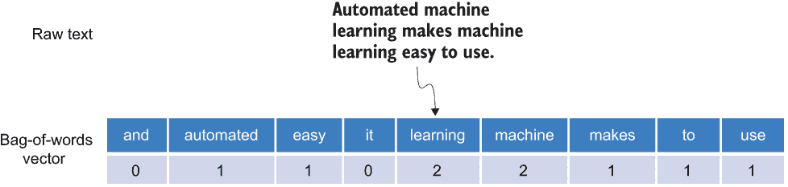

图 B.7 将文档转换为 BoW 表示

要实现这种方法，我们首先需要将每个文档划分为一组单词（*标记*）。这个过程称为*标记化*。标记化和 BoW 转换可以通过 scikit-learn 内置类 CountVectorizer 的单次调用一起完成，如下所示。

列表 B.8 将训练文档转换为 BoW 表示

```
from sklearn.feature_extraction.text import CountVectorizer

count_vec = CountVectorizer()                         ❶

X_train_counts = count_vec.fit_transform(doc_train)   ❷
```

❶ 构建一个 CountVectorizer 对象

❷ 将训练文本文档转换为标记计数的矩阵

通过打印转换后的训练文档的形状，如下所示，我们可以看到转换后的矩阵有 130,107 列，代表从训练文档中提取的 BoW：

```
>>> X_train_counts.shape
(11314, 130107)
```

BoW 方法帮助我们将我们的字符串文档集合转换为标记计数的矩阵，可以输入到机器学习算法中。然而，由于以下两个问题，文档中单词的出现次数可能不是直接使用的良好特征：

+   文档的长度不同。在两个文档中发生相同次数的词可能在这两个文档中的重要性并不相同。

+   一些词在整个文本语料库中可能具有非常高的出现频率，例如“the”和“a”。与一些低频词相比，它们在分类中携带的意义信息很少。

为了解决这些问题，我们通常使用一种称为 *词频-逆文档频率* (TF-IDF) 的特征转换技术。其核心思想是通过计算一个词在文档中的频率（通常只是一个原始计数）并将其除以包含该词的语料库中的文档数量来评估该词在文档中的重要性。在文档中频繁出现但在整个语料库中较少出现的术语被认为比在文档中频繁出现且在大量其他文档中也频繁出现的词对该文档更重要。

这种转换可以通过 scikit-learn 中的 TfidfTransformer 类实现，如下所示：

```
from sklearn.feature_extraction.text import TfidfTransformer
tfidf_transformer = TfidfTransformer()
X_train_tfidf = tfidf_transformer.fit_transform(X_train_counts)
```

尽管 TF-IDF 具有优势，但它也存在一些问题，例如计算复杂度高以及有限的能力来捕捉词语之间的语义相似性。进一步的探索留给读者作为练习。另一种方法，使用 *词嵌入*，在第三章中介绍。

我们接下来的步骤是构建一个文本分类器，并用准备好的数据集对其进行训练。接下来的两节介绍了两种可以用来解决这个问题概率分类器。这两个都是基本的机器学习模型，在文本分类以及其他领域得到了广泛的应用。

### B.2.3 使用逻辑回归模型构建文本分类器

我们将要探索的第一个模型是 *逻辑回归* 模型。从名称上看，你可能认为它是一个类似于第二章中介绍的线性回归模型，但实际上，它是为分类问题设计的。线性回归模型和逻辑回归模型之间的区别在于它们的输出。线性回归模型直接根据样本的特征输出预测的目标值，而逻辑回归模型输出样本的 *logits*。logit 定义为 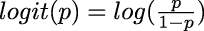，其中 *p* 是样本属于特定类别的概率。我们可以通过计算训练集中每个类别的标签频率来估计这个概率。在测试阶段，给定一个未见过的例子，我们可以根据其特征计算它属于每个类别的概率，并将其分配给概率最高的类别。

对于多类分类，我们可以使用 OvO 方案（类似于多类 SVM 模型），或者我们可以使用另一种称为 *一对余* (OvR) 的方案。与需要为每一对类别构建分类器的 OvO 方案不同，OvR 方案需要构建 *n* 个分类器，其中 *n* 是类别的数量。每个分类器对应一个类别。然后它试图将每个类别的例子与剩余的 *n*-1 个类别区分开来。在测试阶段，我们将所有 *n* 个分类器应用于一个未见过的例子，以获取样本每个类别的概率。该例子被分配给概率最高的类别。

我们可以使用以下代码构建一个多类逻辑回归分类器，并使用预处理后的文档进行训练：

```
from sklearn.linear_model import LogisticRegression
lr_clf = LogisticRegression(multi_class='ovr', random_state=42)
lr_clf.fit(X_train_tfidf, label_train)
```

然后，我们将相同的转换器应用于测试数据，并如下评估学习到的逻辑回归分类器：

```
>>> from sklearn.metrics import accuracy_score

>>> X_test_counts = count_vec.transform(doc_test)
>>> X_test_tfidf = tfidf_transformer.transform(X_test_counts)
>>> label_pred_test = lr_clf.predict(X_test_tfidf)

>>> lr_acc = accuracy_score(label_test, label_pred_test)
>>> print(f'Test accuracy: {lr_acc * 100:.2f} %')

Test accuracy: 82.78 %
```

测试准确率为 82.78%。如果你对跨不同标签的更详细的分类结果感兴趣，也可以绘制混淆矩阵。

### B.2.4 使用朴素贝叶斯模型构建文本分类器

另一个常用于文本分类的著名概率模型是*朴素贝叶斯模型*。它将贝叶斯定理应用于计算给定数据点属于每个类的概率。“朴素”在这里意味着我们假设所有特征都是相互独立的。例如，在这个新闻主题分类问题中，我们假设每个术语出现在特定主题类中的概率与其他术语独立。这个假设可能对你来说听起来不太合理，尤其是对于文本数据，但在实践中它通常工作得相当好。

在应用朴素贝叶斯模型时，我们需要在训练阶段执行以下两个操作：

+   计算训练集中每个类中出现的每个术语的出现次数，并将其除以该类中术语的总数。这作为概率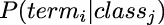的估计。

+   计算训练集中每个类出现的频率，这是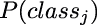的估计。

朴素贝叶斯模型还可以通过假设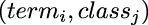的概率分布为多项分布来处理多类分类。我们不会深入数学细节，只关注 scikit-learn 的实现。以下是使用预处理文本数据训练朴素贝叶斯模型的代码：

```
from sklearn.naive_bayes import MultinomialNB
nb_clf = MultinomialNB().fit(X_train_tfidf, label_train)
```

在测试阶段，我们可以根据文档包含的特征应用贝叶斯定理来计算文档属于每个类的概率。文档的最终标签被预测为概率最大的类。我们将相同的转换器 fit 应用于训练数据，并如下评估学习到的朴素贝叶斯分类器：

```
>>> X_test_counts = count_vec.transform(doc_test)
>>> X_test_tfidf = tfidf_transformer.transform(X_test_counts)

>>> label_pred_test = nb_clf.predict(X_test_tfidf)

>>> lr_acc = accuracy_score(label_test, label_pred_test)

>>> print(f'Test accuracy: {lr_acc * 100:.2f} %')
>>> Test accuracy: 77.39 %
```

使用 scikit-learn 中默认超参数的多项式朴素贝叶斯模型的最终测试准确率为 77.39%——略低于之前逻辑回归模型实现的 82.78%。让我们尝试通过调整一些关键超参数来提高它。

### B.2.5 使用网格搜索调整文本分类流程

到目前为止，我们已经将以下三个数据处理组件引入到文本分类流程中：

+   BoW 转换器

+   TF-IDF 转换器

+   分类器（逻辑回归模型/朴素贝叶斯模型）

我们可以使用在 B.1.6 节中介绍的相同过程来构建一个结合所有三个组件的顺序管道，以进行联合超参数调整。我们在这里选择多项式朴素贝叶斯分类器作为示例来构建 scikit-learn 管道，并选择以下三个超参数进行调整：

+   ngram_range *在* CountVectorizer *操作中*—CountVectorizer 计算文档中每个术语的出现次数以执行 BoW 转换。它还可以计算连续出现的 *n* 个术语的出现次数，这被称为 *ngram*。例如，在句子“我爱机器学习”中，1-grams（单语元）是“我”、“爱”、“机器”和“学习”；2-grams（双语元）是“我爱”、“爱机器”和“机器学习”。

+   use_idf—确定我们是否想要使用 TF-IDF 转换或 TF 转换。

+   alpha—多项式朴素贝叶斯分类器中的平滑超参数。朴素贝叶斯模型的一个问题是，如果在训练集中给定主题类中的任何文档中一个术语从未出现（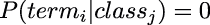），则在测试期间我们永远不会将包含此术语的文档分配给该类。为了减轻这个问题，我们通常引入一个平滑超参数，将这些术语分配给这些类的小概率，这样每个术语都有机会出现在每个类中。

我们可以使用以下代码设置整个管道并自定义三个超参数的搜索空间。

列表 B.9 创建用于文本分类的管道

```
text_clf = Pipeline([
    ('vect', CountVectorizer()),
    ('tfidf', TfidfTransformer()),
    ('clf', MultinomialNB()),])       ❶

hps = {
    'vect__ngram_range': [(1, 1), (1, 2)],
    'tfidf__use_idf': (True, False),
    'clf__alpha': (1, 1e-1, 1e-2),
}                                     ❷
```

❶ 定义管道

❷ 声明要搜索的超参数并定义它们的搜索空间

我们应用网格搜索并使用三折交叉验证进行模型选择，如下所示：

```
>>> scoring_fnc = make_scorer(accuracy_score)

>>> grid_search = GridSearchCV(estimator=text_clf,
...                            param_grid=hps,
...                            scoring=scoring_fnc,
...                            cv=3,
...                            verbose=5,
...                            n_jobs=-1)

>>> grid_search = grid_search.fit(doc_train, label_train)

Fitting 3 folds for each of 12 candidates, totalling 36 fits
[Parallel(n_jobs=-1)]: Using backend LokyBackend with 48 concurrent workers.
[Parallel(n_jobs=-1)]: Done   5 out of  36 | elapsed:   
➥ 7.1s remaining:   43.8s
[Parallel(n_jobs=-1)]: Done  13 out of  36 | elapsed:  
➥ 10.0s remaining:   17.6s
[Parallel(n_jobs=-1)]: Done  21 out of  36 | elapsed:   
➥ 18.2s remaining:   13.0s
[Parallel(n_jobs=-1)]: Done  29 out of  36 | elapsed:  
➥ 20.2s remaining:    4.9s
[Parallel(n_jobs=-1)]: Done  36 out of  36 | elapsed:   21.6s finished
```

然后，我们从 grid_search.cv_results_ 中检索每个管道（由三个超参数表示）的搜索结果。最佳管道可以如下获得：

```
>>> grid_search.best_params_
>>> best_pipeline = grid_search.best_estimator_

>>> for hp_name in sorted(hps.keys()):
...     print('%s: %r' % (hp_name, grid_search.best_params_[hp_name]))

clf__alpha: 0.01
tfidf__use_idf: True
vect__ngram_range: (1, 2)
```

如果我们在 GridSearchCV 对象中未指定 refit 超参数，则在 CV 后将自动在整个训练数据集上训练最佳管道。因此，我们可以直接在测试集上评估最佳管道的最终结果。如下所示，最终准确率为 83.44%，这比初始的 77.39% 有很大提升：

```
>>> test_acc = accuracy_score(label_test, label_pred_test)
>>> print(f'Test accuracy: {test_acc * 100:.2f} %')

Test accuracy: 83.44 %
```

既然你已经看到了如何处理图像数据和文本数据的分类任务，让我们回到表格数据，来处理一个相对更复杂的例子。

## B.3 表格分类：识别泰坦尼克号幸存者

我们最后的例子将使用著名的泰坦尼克号 Kaggle 竞赛数据集，由 Michael A. Findlay 编辑。它包含了 1,309 名乘客的个人资料，例如姓名和性别（训练集中有 891 名，测试集中有 418 名）。我们的目标是识别幸存者。对于表格数据，你将学习如何预处理一个包含混合数据类型和缺失值的更粗糙的数据集，而不是有一个准备好的数值特征矩阵。这里描述的技术在许多处理表格数据集的 Kaggle 竞赛中很常见，并且至今仍广泛应用于实际应用中，即使在深度学习普遍的今天。

### B.3.1 问题界定和数据组装

这里的问题是一个二元分类问题，其中目标标签表示乘客是否幸存（1）或未幸存（0）。我们从 OpenML 平台收集数据。¹ scikit-learn 提供了一个内置 API 来获取数据集。我们可以通过将 as_frame 选项设置为 True 来将获取的数据格式化为 DataFrame，如下面的列表所示。

列表 B.10 获取泰坦尼克号数据集

```
from sklearn.datasets import fetch_openml

titanic = fetch_openml(
    name='titanic', version=1, as_frame=True)              ❶

data, label = titanic.data.copy(), titanic.target.copy()   ❷

data.head(5)                                               ❸
```

❶ 从 OpenML 获取泰坦尼克号数据集的第一版本作为 DataFrame

❷ 深度复制数据以避免后续的就地数据处理操作

❸ 查看前五个乘客的特征

原始特征矩阵的前五个示例如图 B.8 所示。


图 B.8 泰坦尼克号数据的第一个五个样本的原始特征

通过查看前五个样本，我们可以观察到乘客有 13 个特征。这些特征具有不同的格式和数据类型。例如，姓名特征是字符串类型，性别特征是分类特征，年龄特征是数值特征。让我们进一步探索数据集，并为机器学习算法做准备。

### B.3.2 数据预处理和特征工程

我们可以考虑以下三个典型程序来准备表格数据：

+   恢复缺失数据。

+   根据先验知识提取特征，例如根据乘客姓名中的头衔（先生、女士等）提取性别特征。

+   将分类特征编码为数值类型。

首先，让我们检查缺失值。通过计算每个特征的缺失值数量，我们可以看到有七个特征存在缺失值，如下所示：年龄、船票、船舱、登船港口（embarked）、船只、身体和乘客的家园/目的地（home.dest）：

```
>>> data.isnull().sum()
pclass          0
name            0
sex             0
age           263
sibsp           0
parch           0
ticket          0
fare            1
cabin        1014
embarked        2
boat          823
body         1188
home.dest     564
dtype: int64
```

考虑到我们只有 1,309 个数据点，船舱、船只、身体和 home.dest 特征中的缺失值数量相当大。不恰当地填充这些数据点可能会损害模型的性能，因此我们将删除这四个特征，并仅考虑填充剩余三个特征的缺失值，如下所示：

```
data = data.drop(['cabin', 'boat', 'body', 'home.dest'], axis=1)
```

我们可以使用许多技术来填充缺失数据，其中以下三种相当常见：

+   *根据合理的特征相关性手动外推特征*——这通常需要领域专业知识和人力，但可能比其他选项更准确。例如，我们可以提取两个缺失登船特征的乘客，并检查他们的票价来猜测他们的登船港。

+   *使用统计信息*——例如，我们可以使用平均值或中位数来估算缺失的票价。这种方法通常方便且高效，但可能会丢失一些用于分类的判别信息。

+   *使用机器学习模型根据其他特征估计值*——例如，我们可以将年龄特征视为目标，并使用回归根据其他特征估算缺失值。这种方法可能非常强大，但可能会通过过度使用特征相关性而过度拟合数据。它还高度依赖于用于估算缺失数据的模型，并且可能受到模型偏差的影响。

由于票价和登船特征仅缺失少数值，让我们首先使用一些合理的特征相关性来估算它们。我们首先绘制一组乘客票价的箱线图，按他们的登船港（embarked）和舱位（pclass）分组，如下所示。

列表 B.11 按登船和 pclass 分组的票价箱线图

```
import seaborn as sns                                                       ❶
boxplot = sns.boxplot(
    x='embarked', y='fare', data=data,hue='pclass')                         ❷
boxplot.axhline(80)                                                         ❸
boxplot.set_title(
    'Boxplot of fare grouped by embarked and pclass')                       ❹
boxplot.text(
    x=2.6, y=80, s='fare = $80', size='medium', color='blue', weight='bold')❺
```

❶ 导入绘制箱线图的包

❷ 绘制箱线图

❸ 设置$80 票价水平线

❹ 添加标题

❺ 添加图表图例

从图 B.9 中，我们可以观察到具有相同登船港的乘客在票价特征上的分布相当不同，这与 pclass 特征高度相关。

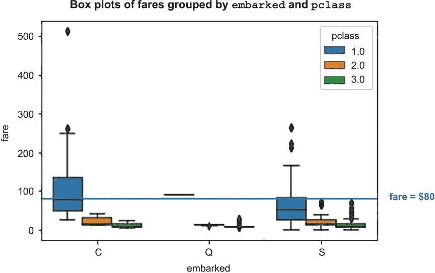

图 B.9 按登船港和 pclass 特征分组的乘客票价箱线图

通过检查缺失登船特征的乘客，我们可以看到这两位乘客都是头等舱，并且为他们的票支付了$80（见图 B.10），如下所示：

```
>>> data[data['embarked'].isnull()]
```

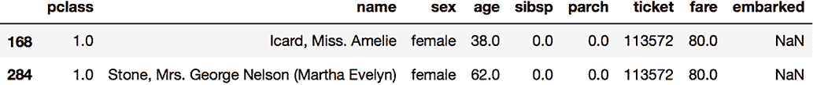

图 B.10 缺失登船特征的乘客

图表上的$80 参考线表明，支付了$80 票价的头等舱乘客很可能是在 C 港登船的。因此，我们将这两位乘客缺失的登船特征填充为 C 港，如下所示：

```
>>> data['embarked'][[168, 284]] = 'C'
```

类似地，我们可以检查缺失票价的乘客（见图 B.11），如下所示：

```
>>> data[data['fare'].isnull()]
```

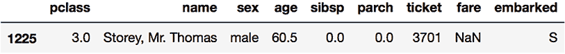

图 B.11 缺失票价特征的乘客

这位乘客乘坐三等舱并在 S 港登船。我们可以结合统计信息，通过提供同一舱位且在 S 港登船的乘客的中位票价来估算缺失的票价，如下所示：

```
>>> data['fare'][1225] = data.groupby(
...     ['embarked', 'pclass'])
...     .get_group(('S', 3))['fare'] 
...     .median()
```

对于最后一个缺失的特征（年龄），我们直接使用统计中位数来估算缺失值，如下所示：

```
>>> data['age'].fillna(data['age'].median(skipna=True), inplace=True)
```

在处理完所有缺失数据后，下一步是基于常识进行一些特征提取。这里我们以名称特征为例。这个特征乍一看似乎非常混乱且无用，但在仔细检查后我们可以看到，名字中包含头衔（先生、夫人、少爷等），这些可能反映了乘客的婚姻状况和潜在的社会地位。我们首先提取头衔，并按以下方式探索每个头衔的频率：

```
>>> data['title'] = data['name'].str.extract(' ([A-Za-z]+)\.', expand=False)
>>> data['title'].value_counts()
Mr          757
Miss        260
Mrs         197
Master       61
Rev           8
Dr            8
Col           4
Major         2
Ms            2
Mlle          2
Capt          1
Don           1
Mme           1
Countess      1
Dona          1
Lady          1
Jonkheer      1
Sir           1
Name: title, dtype: int64
```

由于一些标题在机器学习角度来看是相似的，例如“Ms”和“Miss”，我们可以首先统一它们。并且因为数据集中有几个标题出现频率很低，我们可以使用的一种常见做法是将这些罕见标题合并为一个类别以聚合信息。在下一个列表中，我们考虑出现次数少于八次的标题作为罕见标题。

列表 B.12 统一同义词标题和合并罕见标题

```
data['title'] = data['title'].replace('Mlle', 'Miss')     ❶
data['title'] = data['title'].replace('Ms', 'Miss')       ❶
data['title'] = data['title'].replace('Mme', 'Mrs')       ❶

data['title'] = data['title'].replace(
    ['Lady', 'Countess','Capt', 'Col','Don', 'Dr',
    'Major', 'Rev', 'Sir', 'Jonkheer', 'Dona'], 'Rare')   ❷

data = data.drop(['name'], axis=1)                        ❸
```

❶ 通过重新分配将具有相同意义的标题进行聚合

❷ 将剩余的罕见标题合并为一个

❸ 删除了原始名称列

在进行标题提取后，我们再次通过查看前五个示例（见图 B.12）来显示当前数据，如下所示：

```
>>> data.head(5)
```

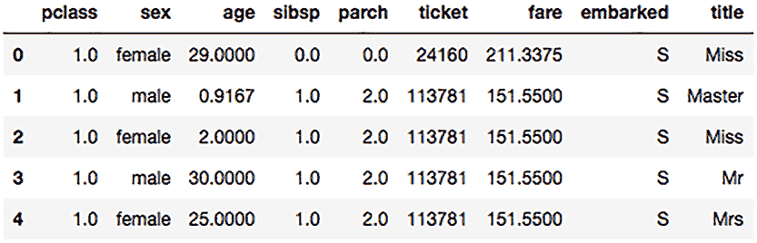

图 B.12 在缺失数据插补和名称标题提取后，泰坦尼克号数据集的前五个样本

最后一步是将分类特征，包括性别、登船地点和头衔，转换为数值型。尽管一些机器学习库可以直接接受字符串值的分类特征，但我们将为此进行预处理以供说明。转换这些特征的一种直观方法是将其编码为整数。这种方法对于层级数量较少的分类特征（换句话说，类别较少）可以很好地工作，例如性别，但当层级数量较多时可能会影响模型的性能。这是因为我们在转换后的数值中引入了原始数据中可能不存在的序数关系。另一个流行的选项是*独热编码*，它没有这个问题，但可能会因为引入过多的新特征而损害效率。独热编码是通过将一个分类特征转换为*N*个二进制分类特征来完成的，其中*N*个新特征代表原始分类特征的*N*个层级。对于每个实例，我们将只设置*N*个新特征中的一个（它所属的类别）为 1；其他将被设置为 0。例如，女性和男性乘客的性别特征将被转换为[1, 0]和[0, 1]，其中向量中的第一个元素表示乘客是女性，第二个元素表示乘客是男性。我们可以像以下这样对所有的分类特征进行转换。

列表 B.13 分类数据的独热编码

```
import pandas as pd
encode_col_list = ['sex', 'embarked', 'title']
for i in encode_col_list:
    data = pd.concat(
        [data, pd.get_dummies(data[i], prefix=i)],axis=1)  ❶
    data.drop(i, axis = 1, inplace=True)                   ❷
data.drop('ticket', axis = 1, inplace=True)                ❸
```

❶ 执行独热编码

❷ 移除了原始特征

❸ 删除了票务功能，因为它包含太多层级

注意，尽管票务特征也是一个分类特征，但我们直接将其删除，而没有对其进行编码。这是因为与总样本数相比，它包含太多的唯一类别，如下一代码片段所示：

```
>>> data['ticket'].describe()
count         1309
unique         929
top       CA. 2343
freq            11
Name: ticket, dtype: object
```

最终数据包含 15 个特征，如图 B.13 所示。

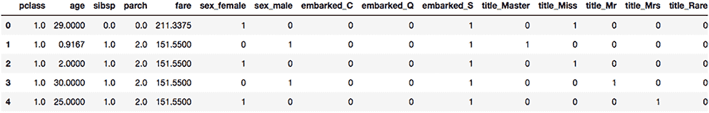

图 B.13 泰坦尼克号数据集前五个样本的最终特征

最后，我们将数据分为训练集和测试集，如下所示。分割编号 891 是基于 Kaggle 竞赛中数据集原始分割设置的：

```
>>> X_train, X_test, y_train, y_test = data[:891], data[891:], label[:891], label[891:]
```

现在我们已经完成了预处理，我们就可以在泰坦尼克号数据集上应用机器学习算法了。

### B.3.3 构建基于树的分类器

在深度学习兴起之前，基于树的模型通常被认为是表格数据分类中最强大的模型。本节介绍了三种基于树的分类模型。第一个是一个常规决策树模型，类似于我们在第二章中使用的模型。其他的是“集成模型”，旨在利用多个决策树的集体力量以获得更好的分类精度。

在第二章的加利福尼亚房价预测示例中，我们创建了一个决策树模型来执行回归任务。我们也可以通过一些小的修改为分类问题构建一个决策树模型——在训练过程中，我们需要将树分裂标准从回归性能度量改为分类性能度量，并且我们需要改变预测的方式如下：

+   在回归示例中，我们使用均方误差（MSE）作为分裂标准来衡量每个节点分裂的质量。这里我们可以使用一个称为“熵”的标准，它衡量特定节点分裂通过分类获得的实用信息增益。熵的数学定义超出了本书的范围。

+   在回归示例中，我们使用与测试样本相同的叶子节点中训练样本的均值进行预测。这里我们使用那些训练样本的目标标签的众数。

使用 scikit-learn，实现决策树分类器非常简单，如下一列表所示。

列表 B.14 在泰坦尼克号数据集上创建一个决策树分类器

```
from sklearn.tree import DecisionTreeClassifier
dt_clf = DecisionTreeClassifier(
    criterion='entropy', random_state=42)    ❶

dt_clf.fit(X_train, y_train)
```

❶ 使用熵作为分裂标准创建一个决策树分类器

测试准确度计算如下：

```
>>> from sklearn.metrics import accuracy_score
>>> y_pred_test = dt_clf.predict(X_test)
>>> acc = accuracy_score(y_test, y_pred_test)
>>> print('Test accuracy: {:.2f} %'.format(acc * 100))

Test accuracy: 71.05 %
```

现在，让我们利用集成学习技术创建两个更高级的基于决策树的模型。正如谚语所说，三个臭皮匠顶个诸葛亮，群众的智慧在许多情况下不仅适用于人类，也适用于机器学习模型。集成学习是一个将多个机器学习模型聚合起来以实现更好预测的过程。我们将查看以下两个代表性的基于集成学习的树算法，这些算法可能是 Kaggle 竞赛中最受欢迎的模型：

+   *随机森林*—这种方法同时构建多个决策树，并通过投票共同考虑它们的预测。我们可以选择要组装的树的数量，并控制单个树的超参数，例如分割标准和树的深度最大值。

+   *梯度提升决策树* (GBDT)—这种方法按顺序构建多个树，并将新构建的树定位在解决先前树集成中的错误分类或弱预测。我们可以控制要组装的树的数量，每个树对最终集成模型相对贡献（学习率超参数），以及单个树的超参数。

您可以从 sklearn.ensemble 模块导入这两个分类器。以下列表显示了如何将它们应用于泰坦尼克号数据集。

列表 B.15 将随机森林和 GBDT 算法应用于泰坦尼克号数据集

```
from sklearn.ensemble import RandomForestClassifier, GradientBoostingClassifier

rf_clf = RandomForestClassifier(
    n_estimators=100, random_state=42)                                    ❶
rf_clf.fit(X_train, y_train)                                              ❶
y_pred_test = rf_clf.predict(X_test)                                      ❶
acc_rf = accuracy_score(y_test, y_pred_test)                              ❶

gbdt_clf = GradientBoostingClassifier(n_estimators=100, random_state=42)  ❷
gbdt_clf.fit(X_train, y_train)                                            ❷
y_pred_test = gbdt_clf.predict(X_test)                                    ❷
acc_gbdt = accuracy_score(y_test, y_pred_test)                            ❷
```

❶ 训练和测试随机森林算法

❷ 训练和测试 GBDT 算法

最终的性能显示，这两个模型都比我们之前的决策树模型表现更好，后者实现了 71.05% 的准确率。获得的 GBDT 模型比随机森林模型略好，如下所示：

```
>>> print(f'Random forest test accuracy: {acc_rf * 100:.2f} %')
>>> print(f'GBDT test accuracy: {acc_gbdt * 100:.2f} %')

Random forest test accuracy: 72.01 %
GBDT test accuracy: 72.97 %
```

我们还可以使用网格搜索调整每个算法的超参数，类似于之前的示例。这项练习留给读者作为自我测试。

* * *

(1.) 由 Joaquin Vanschoren 创立的 OpenML 平台 ([`openml.org`](https://openml.org)) 是一个在线平台，用于共享数据、代码、模型和实验，以使机器学习和数据分析变得简单、开放、易于访问和可重复。
