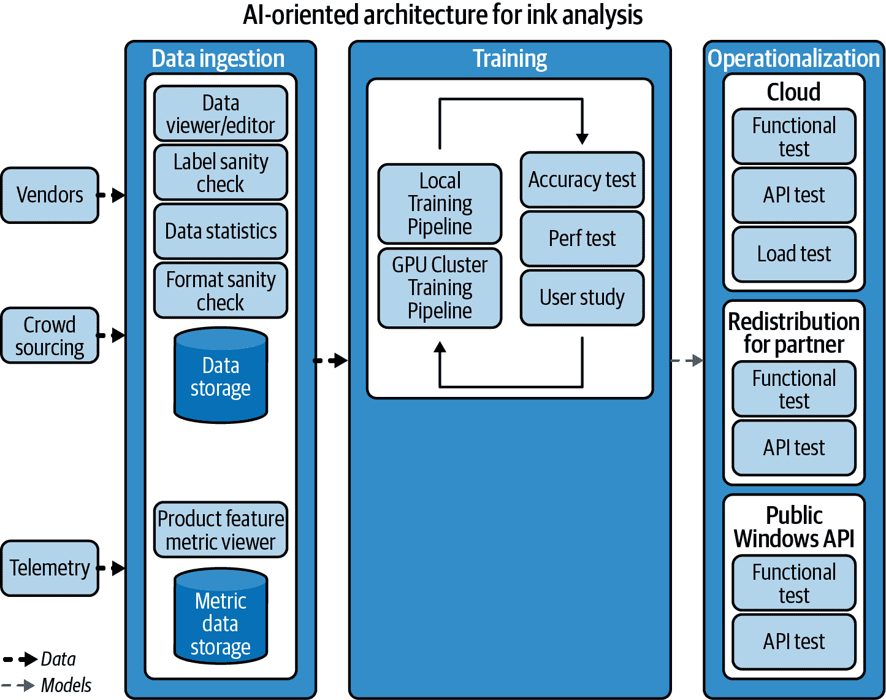

# 第一章：人工智能导向架构简介

# 您可以用 AI 做什么

AI 的力量在于做以前无法做到的事情，因为这对人类来说成本过高或者太繁琐，或者因为他们反应不够迅速。AI 可以监控大型连锁加油站每个司机的视频监控，以寻找像是有人扔燃着的香烟的安全问题。它可以识别濒危群体中的个体大象，预测机器设备在发生故障之前的可能性，警告您业务的每个领域中哪些合同将在接下来的 30 天内到期，或者选择最有前景的药物配方进行测试，或最具吸引力的产品供客户选择。

AI 可以追踪数百万艘渔船，并预测哪些可能违反旨在避免过度捕捞的规定，或在机场的行李箱中发现非法贩运的象牙。我们能够快速将其构建为工具，可以帮助预测偷猎行为，同时确保野生动物管理员不受威胁，或者可以比较自然灾害前后的卫星和航空图像，以优先救援并减少额外的伤亡风险。

现代 AI 可以做很多事情，利用相同的基础组件构建不同的解决方案。根据用于训练模型的数据，图像识别算法可以识别和计数濒危的雪豹，或者区分被污染的啤酒和回收再利用瓶子上的磨损痕迹。

AI 还可以为应用程序和工作流添加功能，如语音识别、照片中的对象、手写文字或纸质表格上的字段识别，或生成数据可视化的见解。它可以自动化例行工作，甚至数据分析，从而释放被信息泛滥所压倒的员工的时间，使他们可以专注于工作中有趣和创造性的部分——无论是销售人员、客户支持还是医疗管理人员。它甚至可以帮助编写代码，生成复杂的数据查询，或填写常见的函数余下部分。

使用现代机器学习工具，曾经需要计算机科学家团队进行研究的项目现在已成为您可以在自己的应用程序中使用的服务，将它们视为即插即用的组件。或者如果您需要更多，使用一个通用框架，数据科学家和业务分析师可以共同努力，对定制模型进行微调，并在几小时内使其准备好供使用。

# 从里程碑到模型到架构

我们将在本书中介绍的 Azure AI 服务基于微软几十年来的研究，这些研究在过去五年间取得了一系列突破。2016 年，微软的一个机器学习模型在识别照片和视频中特定对象方面达到了与人类的平等水平。2017 年，微软的语音识别技术与人类对电话录音进行文本转录的能力相匹敌；2018 年，微软的一个机器学习系统表明它能够阅读文档并对文中信息进行问题回答，达到与人类同等水平。同年，微软在语音合成和语言翻译方面达到了同样的基准。

那些在语音识别、翻译、图像分类和文本理解方面取得的突破，大多是使用监督学习建立的：获取大量示例，仔细标记它们，然后使用它们来训练机器学习模型，执行诸如在图像中识别对象等任务。

大约在 2019 年，自监督学习技术使研究人员能够利用未经标记的大量内容，例如多种语言的公共网站内容，让机器学习模型绘制出单词如何一起使用的模式，即上下文语义。这种方法创建的模型在摘要文档或问答对话（包括机器人和人类之间的）等任务上达到了人类的语言理解水平：这些模型通过预测接下来应该出现的词来工作，推导出人们试图询问的内容，并检索出最佳答案。

同样的方法驱动了分析和解释图像和视频以检索最相关的图像、将视频分割成段落或描述场景中的对象，当模型能够识别它们但尚未经过特定训练以最佳方式描述它们时。因此，您可以生成关于人们手持手风琴、风笛或琵琶的标题，而无需训练集覆盖每种可能携带的乐器的标题。

在此期间，提供这些突破的模型也变得越来越大、越来越苛刻：从 2018 年的 2 亿到 20 亿参数，2020 年的 1.7 千亿参数，以及 2021 年 Megatron-Turing 自然语言生成模型的 5300 亿参数。如果硬件能跟上并且成本不失控，机器学习模型可能会继续增长，达到万亿参数。

除了新模型外，微软还开发了像 DeepSpeed 的零冗余优化器和其他并行技术优化技术，这些技术将模型的不同部分分配到数据并行处理中，以及加速训练深度学习模型的 ONNX Runtime 基础构件。

但即使进行了所有这些优化，这些非常大的 AI 模型仍然非常耗资源，在成千上万台强大 GPU 和可编程门阵列（FPGA）的大型集群上进行训练，通过高带宽网络互连，使用全球分布式调度服务。² 因此，微软训练了少量非常大的模型，并在许多地方重复使用它们，使用迁移学习：将通过自监督学习获得的通用基础语法和上下文技能应用于特定领域。那些经过微调的预训练模型可以与更小的标记数据集一起工作；未来，这可能足够高效，以便为每个用户提供其自己的个性化语言模型。

Azure 还运行在其他地方开发的大型模型：这是唯一可以使用 OpenAI 开创性的 GPT-3 大型语言模型的平台。微软使用它们来支持 GitHub 的 Copilot 代码编写功能，并将自然语言转换为 Power Apps 中的数据分析表达式（DAX）查询（有关 Power 平台的更多信息，请参见第六章）。在 Dynamics 365 中，OpenAI 提供了撰写市场营销内容的建议——即使它所建议的不完美，它也比盯着空白页面更能提供灵感。开发人员可以通过调用 Cognitive Services 的 OpenAI API，在他们自己的应用程序中使用语言生成，发送请求和一些简单文本的示例，然后得到生成的文本，准备好使用（我们将在第四章讨论如何使用 Azure OpenAI 服务）。

提供构建这些非常大型模型所需的大规模的平台，跨训练它们到特定模型，并在生产中运行它们的平台，也是提供开发人员可以自己使用的 Azure AI 服务的基础——再次基于那些非常大型模型。

Azure AI 服务摆脱了为机器学习构建和管理基础设施的负担。它们包括组织期望从企业级平台获得的规模、安全性、合规性和治理水平，如专用吞吐量、一致的延迟、网络隔离、托管身份、认证以及由监管认证支持的保证（我们将在第八章详细讨论这一点作为机器学习的最佳实践的一部分）。

云 AI 服务还可以帮助实现负责任的 AI 交付，因为如果它们被设计为试图确保 AI 产生积极影响并避免不公平等问题，那么使用它们构建的所有应用程序都可以从这些原则中受益，因为每个开发人员不必单独解决相同的问题。这一直是云服务的一大优势，尽管这只是一个起点，在第 8 章中，我们将探讨您可以使用的工具、技术和负责任的部署选择，以在此基础上进行进一步的建设。

各种 Azure AI 服务可以加快使用流行框架和强大的 MLOps 功能训练您自己的模型，简化部署（在云端、移动设备和边缘设备上），提供预训练模型，或者将机器学习问题转化为 API 调用。这意味着您可以增强熟悉的面向服务的架构——通过建立相互通信的服务来扩展 IT——以及 AI 导向的架构，其中您拥有与应用程序输入和程序逻辑并存的机器学习模型和 AI 服务功能。

就像您为数据库考虑数据模式一样，您需要考虑数据集和标签。实验成为您开发过程的一部分，就像调试已经是一样。来自您应用程序的遥测数据可以反馈到您的机器学习模型中，同时告诉您何时出现错误或为新功能提供灵感。

这导致了更复杂的架构（图 1-1 是向应用程序添加手写识别功能的一个示例），可能意味着更复杂的工作流程。但是 Azure AI 服务旨在简化这一切。

当您使用我们在第 4 章中介绍的认知服务时，这种类型的架构支撑了您调用的 API。如果您正在创建自己的机器学习模型，需要利用 Azure Machine Learning 中的组件来创建等效的模型：我们将在第 3 章中为您详细介绍这一过程。无论您使用自己的模型还是调用现成的服务，第 10 章、第 11 章和第 12 章的案例研究将为您展示如何将 AI 服务集成到应用程序和架构中。如果您想了解云 AI 服务运行的架构是什么样子，我们将在第 9 章中深入了解认知服务后端。

###### Figure 1-1\. 将手写识别添加到您的应用程序中需要从头开始进行大量工作，从收集数据到训练模型再到在生产环境中支持它们：Azure AI 服务可以将其转化为您调用的 SDK 或 API。

# 准备好了吗？

AI 的潜力巨大；实现这一潜力的复杂性不应成为每个开发人员和组织的负担。在本章中，我们探讨了 Azure AI 背后的研究及利用云 AI 为您的应用程序和工作流增添力量的承诺。这并不意味着简化开发或限制您可以使用的工具和平台。在下一章中，我们将展示 Azure AI 平台的广泛性，然后深入介绍如何使用其中一些特定的服务。

¹ 深度加速（DeepSpeed）优化库是开源的；您可以在 [DeepSpeed](https://www.deepspeed.ai) 找到代码库和教程。

² 详见 [“奇点：面向 AI 工作负载的全球规模、预先和弹性调度。”](https://arxiv.org/pdf/2202.07848.pdf)
