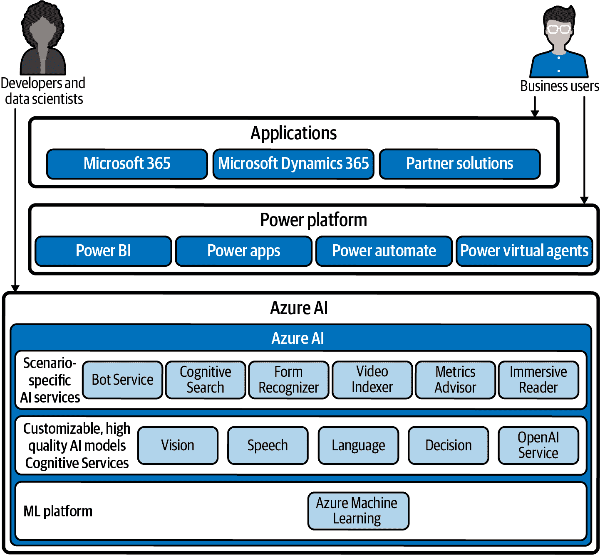
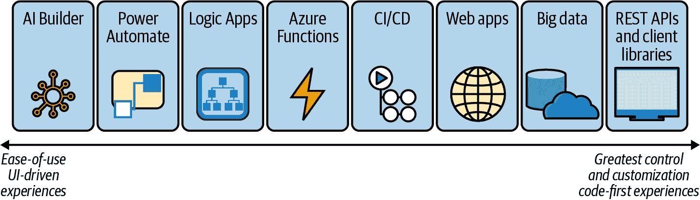

# 第二章：理解 AI 的提供和能力

您有很多选择可以构建和使用 AI。在本章中，我们将详细介绍微软 AI 平台的广泛性，特别是在云端。本书后面将详细介绍许多这些工具和服务，但我们也会提及其他可能性，以帮助您选择适合您问题的解决方案。

随着 AI 技术的成熟，与其一起使用的选择也在增多。数据科学家和工程师短缺；开发内部专业知识以构建和运营大规模机器学习系统是昂贵的。借助云 AI 服务，每个组织都无需重新实现相同的机器学习模型，云服务可以训练到高精度并大规模运行，通过明确定义的 API 以极低的成本为用户提供访问。

这些服务简化了构建定制模型或将 AI 工具集成到现有工作流程中，使得领域专家和一般业务用户都可以开发 AI。Azure AI 提供多种选择，适合不同技能水平和不同工具的用户。

# 适用于各种用户类型的 AI 服务

机器学习现在驱动物联网（IoT），帮助企业分析现状并预测未来，并帮助消费者处理从医疗保健到游戏的各种事务。将 AI 集成到您的应用程序和工作流程中，对于越来越广泛的用户群体来说都是一个选择。

流行的框架使得使用深度神经网络轻松构建和训练定制的机器学习模型变得可能，而像 Azure 这样的云服务提供预训练模型和可定制的服务，可以在最少的代码量下快速为您的应用程序添加机器学习功能。这些工具可以帮助所有用户，从业务分析师和信息工作者到开发人员：

信息工作者

业务应用程序如 Word 和 PowerPoint 已经使用 AI 服务提供写作和设计建议，记录会议内容，并指导用户如何做出更好的演示。低代码和无代码工具让用户能够创建自定义工作流和应用程序，包括能够丰富信息并分析数据的 AI 服务，例如识别名片或分析客户反馈中的情感。

业务分析师

现代业务分析技术现在需要大量的数据科学输入。过去的 OLAP（在线分析处理）立方体和 Excel 电子表格现在变成了依赖复杂模型的大数据实验，以发现关键趋势和数据点。机器学习工具可以帮助构建和运行这些模型，使 AI 成为数据科学的重要工具。通过训练模型或调用预训练模型来丰富或找到数据中的洞察，您可以预测未来趋势或新出现的异常，使企业能够快速调整策略，避免昂贵的问题。开发人员和数据科学家还可以训练定制模型，并在企业内的精心策划目录中向用户提供这些模型。

应用程序开发者

机器学习在许多应用程序中添加辅助技术起到了重要作用。利用计算机视觉工具，我们可以轻松将照片转换为文本，填写表格，管理个人数据。语音工具可以添加语音识别，提供几乎实时的转录和翻译，或者将文本转换为语音，以便无法方便查看屏幕的一线工人和其他人使用。残障和非残障用户都可以利用这些技术：同样的工具可以帮助在汽车中实现免持续控制，或者为智能家居添加语音控制。微软的 AI for Good 基金为希望利用 AI 工具和技术提升可访问性的组织提供财务支持，使用了本书介绍的许多服务。

工业开发者

物联网是数据的强大来源，从摄像头和其他复杂边缘设备到连接传感器的数据流。随着数十亿个连接设备，传统算法难以从日益增长的数据洪流中提取相关数据。机器学习技术可以识别关键数据点，识别错误和问题或预测故障发生前的情况，以确保系统在最小停机时间内安全运行。

# 微软的 AI 提供

借助微软研究的专业知识，微软在自己的产品和服务中广泛使用 AI，从在 Azure 数据中心预测硬件故障到在 PowerPoint 中设计定制幻灯片布局和检测以前未见过的恶意软件。

通过微软 AI 平台，这些 AI 技术也可以用于希望提高生产力并利用云规模的数据工程师，使用云基础设施和服务或微软的框架和工具将 AI 集成到任何基础设施上的应用程序中。开发人员可以通过 Azure 云服务使用先进的机器学习算法，轻松将其操作化。不具备 AI 专业知识的业务分析师可以使用相同的基础服务，在他们熟悉的 Microsoft 工具内获得数据的高级见解。

在 SQL Server 等熟悉系统中的 AI 功能以及像 Power Platform 这样的低代码/无代码工具，将相同的模型和算法带给更广泛的用户。微软广泛的 AI 平台中各种服务和工具的重叠使开发人员可以选择他们喜欢的工作方式。它还允许在一个服务中完成的工作通过另一个服务进行重复使用。这可以是在容器中运行在云端训练的机器学习模型以进行边缘部署，或者开发人员构建定制的机器学习模型，业务分析师可以将其纳入报告中。

这种灵活性意味着，针对您具体项目可能有几种适合的选择。如图 2-1 所示，开发人员可能会使用托管服务来构建他们自己的 AI 模型，或者利用云基础设施服务来扩展使用开源框架创建的机器学习模型。他们可以利用这些模型来在业务平台上构建可扩展的 AI，利用熟悉的基础设施产品和操作系统中的 AI 工具，或者简单地调用预构建但可定制的 AI API。

###### 图 2-1\. 随着微软 AI 组合中众多不同工具和服务的增加，查看这些服务为谁设计以及它们提供了什么是很有帮助的。

## 在 Azure 中的托管 AI 服务和基础设施选项

Azure 机器学习是一种托管的云服务，旨在加速和管理数据科学生命周期，您可以在云端或边缘设备上使用预训练模型或训练、部署和管理自己的模型。喜欢使用命令行界面（CLI）的开发人员可以使用 Python、R 和 Jupyter Notebooks，利用像 PyTorch、TensorFlow 和 scikit-learn 等开源框架，并通过 GitHub 和 Azure Pipelines 自动化机器学习生命周期。

您还可以通过 SDK 或 Azure 机器学习工作室 Web 界面与 Azure 机器学习一起工作，支持代码优先和低代码开发。有一个拖放设计器可通过管道进行训练和部署机器学习模型，无需编写代码，还有一个图形化 UI 用于创建自动化机器学习实验和与托管 Jupyter Notebook 服务器的集成。对于部署，模型可以转换为 ONNX 格式，在云端或本地使用 CPU、GPU 或 FPGA 基础设施进行推断作为 Web 服务运行，与 Power BI 共享以用于数据分析，或直接部署到 Azure IoT Edge 设备。

###### 小贴士

Azure 机器学习工作室与旧版 ML Studio 是不同的服务，后者是一个独立的可视化设计工具，通过连接数据集到预配置的算法和模块来构建机器学习模型；模型部署后会作为 Web 服务发布。尽管仍然可用，但 ML Studio 不如集成到 Azure 机器学习中的可视化设计工具强大和灵活，现有用户应考虑迁移。

Azure 机器学习可以与 Azure Databricks 集成，后者是基于 Spark 的托管分析平台，提供丰富的交互式工作空间，用于与其他开发人员共同开发机器学习模型；这些工作空间基于笔记本，可以包含可运行的 Python、R、Scala 或 SQL 代码，以及可视化、说明和解释。Azure Databricks 非常适合运行使用开源机器学习库和 MLflow 进行自动化的大规模密集机器学习工作流程。

通过 Azure Arc，微软的软件解决方案用于通过 Azure 资源管理器管理本地、混合和多云基础架构的组织可以在任何 Kubernetes 环境中运行一系列 Azure 服务。Arc 启用的数据服务允许您在 Arc 管理的 Kubernetes 基础设施上运行 Azure SQL 托管实例和 Azure PostgreSQL 超大规模，组织想在自己的基础设施上运行这些云数据库服务的主要原因之一是为了机器学习。在撰写时处于预览阶段的 Azure Arc 启用的机器学习允许您将 Azure 机器学习作为云服务在自己的基础设施上运行，以处理存储在这些数据库服务中的数据。

不需要托管机器学习服务但希望使用强大的数据科学工具集而无需花时间进行安装、配置和确保所有依赖关系正确的机器学习和数据专家们可以通过 Azure 数据科学虚拟机节省时间。这些预构建的 Windows 或 Linux 映像预装了 Microsoft 和开源数据科学以及开发工具，并且可以立即使用，可在 CPU 或 GPU 加速的虚拟机上运行。

## 可扩展 AI 的业务平台

并非每个组织都能投资一个数据科学家或机器学习开发人员团队，您也不需要开发专业知识来为您的工作流添加 AI 功能。云服务允许组织利用几乎不需要编码的组件来利用最新的突破。可扩展的机器学习已集成到微软的低代码、无代码和自动化平台，如 Power BI、Power Apps 和 Logic Apps 中。

Power BI 云服务包括数据准备工作流程，可以使用来自 Azure Machine Learning 的自动化机器学习，允许业务分析人员训练、验证和调用二元预测、分类和回归模型来分析其数据。Power BI 自动找到最相关的特征以包含在模型中，选择正确的算法，并调整模型，生成解释字段数据中影响预测的报告，以及模型的性能如何。

Power Apps 和 Power Automate 中的 AI Builder 功能让你可以使用预构建模型，如文本翻译、处理收据（甚至手写的）、或从名片中识别联系信息等。但你也可以使用组织内开发人员提供的机器学习模型，或者训练自己的模型来检测对象、处理表单、提取实体信息，并进行预测或分类。

如果你想了解在 Microsoft Power 平台的不同服务中可以使用的 AI 功能的更多详细信息，请参阅第六章。

## 大数据和关系数据的 AI

尽管我们没有足够的空间详细讨论这些内容，但构建和使用 AI 的选项正在越来越多的产品和平台中可用，这些产品和平台已经被开发人员和用户广泛使用。数据库和分析平台是进行机器学习的明显场所：在数据所在地运行机器学习模型可以提供最低的延迟和最高的性能，因为数据无需移动。操作系统和应用程序框架也开始包含库来加速本地应用程序中的机器学习推理：

+   SQL Server Machine Learning Services 将支持 R 和 Python 库的分析引擎内置到 SQL Server 中，使开发人员可以像使用任何其他数据库函数一样使用机器学习。如果你已经采用了 SQL Server Big Data Clusters，则可以在 SQL Server Big Data Clusters 上运行 Python 和 R 脚本。

    ###### Tip

    尽管这些都是服务器产品，但你可以在 Azure 虚拟机上进行规模化运行，或者使用 Azure 的等效产品，在 Azure SQL 托管实例中使用 Machine Learning 服务来运行 Python 和 R 脚本进行预测分析和机器学习，使用存储过程或 T-SQL。

+   如果你使用 Azure Data Studio 编辑和运行 SQL 查询，目前正在预览中的 Machine Learning 扩展允许你导入机器学习模型，进行预测，并创建笔记本来在 SQL 数据库中运行实验。

+   Azure Synapse Analytics 云服务结合了企业数据仓库和大数据分析；这包括使用 SparkML、MLib 和其他类似 scikit-learn 的库训练机器学习模型，但 Azure Synapse Notebooks 和 Azure Machine Learning 之间有集成。无论模型是在 Azure Synapse 内部还是外部训练的，都可以使用批处理评分来运行。

+   假设您不需要 Azure Machine Learning 在 Azure Databricks 或 Synapse 中的集成。在这种情况下，Azure HDInsight 是一个开源云分析服务，包括 Microsoft 实现的 Apache Spark 和 MMLSpark，Microsoft 的用于 Spark 的机器学习库，可处理 Azure Storage 和 Azure Data Lake 中的数据。

## 使机器学习更具可移植性

开放神经网络交换（ONNX）标准以便携格式表示机器学习模型，简化了在多平台推理优化模型。您可以将常见框架的模型转换为 ONNX，以利用不同硬件平台上的加速器，无需重写模型以优化每个平台。ONNX Runtime 还提供了在 CPU 上推理的性能提升，无需额外的硬件加速器。

Azure Custom Vision 服务生成 ONNX 模型。您可以在 Azure Machine Learning 中训练和部署 ONNX 模型，创建云托管的 REST 端点，可以像其他任何 API 一样消耗它们（我们在下一章详细介绍这一点），或者使用它们从 Azure SQL Edge 和 Azure SQL 托管实例的数据中进行预测。

ONNX 模型也可以被机器学习框架使用，即使不是模型训练时所用的框架。这意味着它们可以在 Windows 10、Windows Server 2019 和后续版本中使用 Windows ML（WinML）推理引擎在 Windows 应用程序内运行，并利用 GPU 提升性能。

ML.NET 是一个跨平台开源机器学习框架，用于将自定义机器学习模型（包括 ONNX 模型）集成到 .NET 应用程序中，执行情感分析、产品推荐、价值预测、欺诈检测或图像分类等任务。您可以使用图形化的 ML.NET 模型生成器 Visual Studio 扩展构建、训练和部署自定义模型；它使用自动化机器学习来找到最佳算法，并生成代码将 ML.NET 模型添加到 .NET 应用程序中。

###### 提示

跨平台的 ML.NET CLI 可以生成模型和 C# 代码来运行它，但适用场景比 Visual Studio 扩展少。

Infer.NET 是另一个开源的.NET 库，用于概率推断的机器学习，使用统计模型使得结果易于解释，并且随着新数据的到来可以进行学习。它被用于 Halo TrueSkill 排名服务，以找到合适的游戏对手，并且还支持 Azure 机器学习服务，建议您在处理数据时使用哪种机器学习算法。

## 认知服务

对于希望更多控制如何使用 AI 工具但又不想成为构建和运行机器学习系统专家的开发者，Azure 认知服务提供预构建的机器学习服务，您可以在代码中调用或在自己的服务器和网络边缘设备上运行。通过调用 REST API 或使用 SDK，您可以立即开始使用强大的机器学习模型，涵盖视觉、语音、语言、决策和搜索，无需专业的数据科学知识。

设计为在全球范围内易于使用，在单个应用程序中运行模型或在容器中本地运行，并且经济实惠，因为您按使用量付费，认知服务使您能够利用 AI 领域的最新突破，而无需构建和部署自己的模型。

如果您正在构建自己的机器学习系统，并希望在生产环境中大规模运行，操作化可能需要与开发合适的机器学习模型一样长甚至更长的时间。用于训练和运行机器学习模型的数据可能非常个人化或对您的业务至关重要，因此您需要部署具备强大安全性的基础设施。随着新技术的发展，您还需要定期更新这些系统，定期重新训练模型，以确保它们在处理的数据随时间变化时继续表现良好，或者构建新系统以跟上用户希望工作的不同方式。

认知服务减少了大部分工作，并且提供全球云规模以及边缘选择。您不必训练认知服务中使用的模型；微软提供预训练模型作为服务，并定期使用改进的训练集更新它们，以确保它们保持相关性并且能够处理尽可能广泛的源材料。不断添加新的和改进的算法和模型到不同的服务中；在某些情况下，您的应用程序将会在您不需要进行任何更改的情况下变得更加强大。

它们在全球 30 多个 Azure 区域运行，数据以符合合规方式存储和保留，有助于解决负责任的 AI 和我们在第七章和第八章中讨论的其他最佳实践。服务被本地化为多种语言，部分服务可提供超过 100 种语言支持。例如，语音转文字可提供 30 种语言，并符合 ISO、SOC 和 HIPAA 标准。它们提供严格的服务级别协议（SLA），并保证至少 99.9%的可用性。但如果延迟或法规要求，您也可以将一些最有用的认知服务在本地容器中运行，或者导出模型并构建成应用程序。

尽管它们作为云服务提供，可以通过几行代码调用，但某些特定的认知服务允许您定制数据模型，以获得更好的针对您特定问题的结果：

+   您可以创建一个自定义视觉模型，它具有在数百万张图片上训练的图像识别能力，并快速重新训练以识别特定的人、物体或地点——您制造或销售的产品，或者零售商店是否遵守有关如何展示物品和促销活动或一次允许多少人进入的规则。

+   可以教授会话语言理解服务的行话、俚语、地方方言以及那些常常让自动系统困惑的短语细节。

+   您可以对您的应用程序将要使用的购物中心或赛车场的声学进行建模，以使语音识别更加准确。

+   您可以创建自定义的语音，使电话服务、AI 助手或任何其他文本转语音场景生成的语音不仅听起来自然，而且听起来像您希望代表您品牌和组织的声音——甚至是与您品牌相关联的名人，无论是真人还是兔八哥。

作为云服务，认知服务不断改进和增加。例如，认知研究技术包括仍在认知服务实验室开发中的实验性 API 和 SDK。这些不是生产级别的 Azure 服务：它们是免费的“原样”预览，旨在提前查看可能或可能不会升级为成熟服务的全新领域。

其他 AI 服务也建立在或与认知服务一起工作，如我们在第六章中涵盖的低代码选项。

Azure 应用 AI 服务将多个认知服务与模型和业务逻辑结合起来，专门为特定任务提供使用，通常有一个专用门户，使业务用户和开发人员都能贡献。Azure 认知搜索服务中的内置 AI 丰富技能用于非结构化内容和原始形式不可搜索的内容，如扫描文档、复杂的 PDF、Blob 或需要翻译的文本，这些技能基于视觉和文本分析认知服务 API 中预训练的机器学习模型。

Azure 机器人服务是一个托管的机器人开发环境，用于利用模板和 Microsoft 机器人框架构建企业对话式 AI。

如果您想立即开始使用 Azure 认知服务和应用 AI 服务，请直接转到 第四章。

## 如何确定适合您的工具

对于构建机器学习系统有多种不同的选择，选择适合您应用程序的正确工具可能会令人困惑，特别是当您可以从不同的工具和服务中实现类似结果时。一种方法是考虑您希望如何使用机器学习——通过代码还是可视界面，并且您希望有多少灵活性。图 2-2 显示了不同的 Microsoft AI 选项如何适应这个谱系。

###### 图 2-2\. 使用 Microsoft 的云 AI 服务的不同选项从无代码到专业代码的谱系，随着您在编码中的投入增加，定制选择也更多

还可以通过考虑可能的约束来帮助，无论是存储训练数据的位置、需要处理实时数据的位置，还是您自己的技能和偏好。

Microsoft 的机器学习工具可以在本地、混合系统或云中使用。您可以使用认知服务的预构建 API，或者使用 Azure 机器学习服务构建自己的模型，在云中运行模型或在自己的硬件上运行——无论是在数据中心还是在网络边缘。

Azure 提供了一系列不同的工具，以满足不同的需求和不同的专业水平。如果您希望通过 API 访问预构建模型，并在传统或低代码开发中使用有限的定制功能，Azure 认知服务提供了视觉、语音、语言、搜索和决策支持的 API。您只需要选择一个 API，选择一个 SDK，并开始编写代码来使用它。简单的基于 Web 的培训工具允许您使用自己的数据自定义多个服务的模型。

Microsoft 的低代码 Power 平台中也支持认知服务 API，例如 Power BI 分析平台以及 Power Apps 和 Power Automate 工具。使基本的机器学习成为即插即用，允许任何能构建 Excel 电子表格的人在其个人应用程序和工作流中使用 AI。

如果你喜欢构建自己的模型，可以使用 Azure 机器学习服务来构建、训练和测试它们。Python 迅速成为机器学习专家的重要工具，但是选择开发语言会影响你使用的技术和工具，仍然有多个选择。

托管的 Azure 机器学习笔记本服务允许你使用一系列流行的机器学习框架来构建和测试模型，基于其 Python SDK。如果你偏好本地开发，SDK 及其 Visual Studio Code 扩展可用于在本地托管的 Jupyter 笔记本上开发和运行大多数机器学习框架的代码。但是，如果你不使用 Python 或 R，还有一个视觉开发界面用于构建模型和类似表单的自动 ML 工具，可以自动训练和调整模型，这样你仍然可以利用云服务的优势。

如何部署机器学习系统将取决于工作负载需要部署到何处，你将处理多少数据，以及你需要系统从中获得何种类型的可操作响应。推理数据是否可以保留在本地，或者你是否需要利用 Azure 的大数据服务和灵活的计算资源？

网络仍然是任何机器学习系统的关键约束。虽然模型可能相对较小，但你可能会传输大量数据。你需要考虑带宽和延迟；你的应用程序是否与其他应用程序共享有限的网络连接？是否需要模型在特定时间内响应？

在 Azure 机器学习服务中运行的模型可以通过 REST API 访问，或者可以导出为 ONNX 以在其他地方使用，从移动设备到其他云平台。

如果推理将在设备上运行，你可以使用 Windows 内置的机器学习工具来加速 ONNX 模型，利用其 WinML API。使用 Azure 进行开发和训练可以利用其灵活的 CPU 和内存选项，允许你根据需要启动开发环境，然后在不再需要时处理它。无需投资于高性能的训练和开发系统；你只需要运行自己的推理环境即可。

边缘运行的应用程序可能需要与在本地容器中运行的工具进行交互。Azure Stack 硬件系列提供了一个容器主机，可以在本地使用认知服务，同时仍然通过 Azure 门户进行管理。本地计算还可以利用如 Intel 的 Movidius 计算机视觉模块或在现代 GPU 上使用 GPU 计算的 AI 加速器。

在处理物联网解决方案时，认知服务容器也非常有用。通过在本地运行一个带有适当认知服务容器的 Azure IoT Hub 实例，您可以处理来自边缘设备的数据流，然后将数据传递给在云中运行的应用程序。

有时候选择将取决于您需要连接的数据源。AI Builder 需要数据通过 Power Platform 存储在 Dataverse 中；Logic Apps 提供类似于 Power Apps 的低代码/无代码体验，并可以与 Azure Machine Learning 集成，并允许您使用来自更广泛范围数据源的数据。像 Azure Percept 摄像头和音频边缘平台这样的新服务使用云无代码开发工具来构建和训练视觉模型，然后可以部署到设备上，并用于传递应用程序中使用的数据流的注释。

微软的 AI 工具和平台设计用于各种技能水平，从低代码开发用于业务分析的预测系统到车辆和无人机中的复杂计算机视觉应用。您可以根据自己的需求选择想要的工具，然后在需要的地方运行它。在本章中，我们试图为您提供微软 AI 组合的广度概述，并在表 2-1 中提供了一个便捷的摘要。

表 2-1\. 一览 Azure 机器学习选项

|   | 目标用户 | 它可以为您做什么 | 图形用户界面？ | 需要订阅 | 欲了解更多详情，请参见... |
| --- | --- | --- | --- | --- | --- |
| 认知服务 | 开发者、数据科学家 | 通过网页门户或从任何语言和环境中调用任何服务来使用一些认知服务 | 仅代码客户端库和 REST API；某些服务包括用于设置/测试的网页门户 | Azure 账户 + 认知服务资源 | 第四章 |
| 用于大数据的 Azure 认知服务 | 开发者、数据工程师 | 在 Apache Spark 服务（如 Azure Databricks、Azure Synapse、Azure Kubernetes Service 和数据连接器）中使用认知服务的数据 | 仅代码 | Azure 账户 + 认知服务资源 | 第四章 和 [“用于大数据的 Azure 认知服务”](https://oreil.ly/d8jgP) |
| Azure Functions 和 Azure Service Web Jobs | 开发者、数据科学家 | 从无服务器事件驱动代码调用认知服务 API 和客户端库 | 是 | Azure 账户 + 认知服务资源 + Azure Functions 订阅 | 第四章 |
| Azure 应用 AI 服务 | 开发者、业务用户 | 使用具有任务特定模型的多个认知服务，有时通过 GUI 和领域特定业务逻辑扩展自己的 Azure 机器学习模型 | 是 | Azure 账户 + 认知服务资源 | 第五章 |
| Azure Logic Apps | 开发者、集成者、IT 专家、DevOps | 通过低代码应用调用认知服务，连接器封装了来自业务数据源的 API | 是 | Azure 账户 + 认知服务资源 + Logic Apps 部署 | 第六章 |
| Azure DevOps 和 GitHub Actions | 开发者、数据科学家、数据工程师 | 使用持续集成/持续部署（CI/CD）调用认知服务 API；训练、更新、测试和部署自定义认知服务语言理解和语音模型；或构建 Azure 机器学习流水线 | 仅代码 | Azure 账户 + GitHub 账户（根据需要的认知服务资源或 Azure 机器学习） | 第八章 和 [语言理解服务 (LUIS)](https://oreil.ly/O0bhe)，[语音](https://oreil.ly/aIijM)，以及 [Azure 机器学习](https://oreil.ly/iIL3B) |
| Power Apps | 开发者、业务用户 | 在低代码应用中使用特定服务连接器调用认知服务，该连接器封装了 API 或使用预建和自定义模型封装部分认知服务 | 是 | Azure 账户 + 认知服务资源 + Power Apps 订阅 | 第六章 |
| Power Automate | 业务用户和 SharePoint 管理员 | 通过低代码自动化工作流从服务特定连接器调用认知服务 API | 仅 UI | Azure 账户 + 认知服务资源 + Power Automate 订阅 + Office 365 订阅 | 第六章 |
| AI Builder | 业务用户、分析师和 SharePoint 管理员 | 在 Power Apps、Power Automate 或 Dynamics 365 中使用封装部分认知服务的预建和自定义模型 | 仅 UI | Power Apps、Power Automate 或 Dynamics 365 订阅 + AI Builder 附加组件 | 第六章 |
| Power BI | 业务用户，数据工程师 | 导入和清理数据，以可视化报告并使用 AI 提供洞见；调用自定义或预构建的机器学习模型；准备数据用于训练机器学习模型 | 是 | Power BI 订阅 | 第六章 |
| Azure 机器学习 | 数据科学家，数据工程师，开发人员 | 在云端（或在边缘运行）使用 MLOps/DevOps 和广泛的算法和框架构建、训练、部署和服务模型 | 是 | Azure 账户（VM 定价加 Azure Blob 存储、Azure Key Vault、Azure 容器注册表、Application Insights 和其他所需服务） | 第三章 |
| Azure Arc 启用的机器学习 | 开发人员，数据科学家，数据工程师，IT 专业人员，DevOps | 在通过 Azure Arc 管理的自有 Kubernetes 基础设施上构建和训练模型，使用 Azure 机器学习 | 是 | Azure 账户（需要 Azure 策略、其他 Azure 和 Azure Arc 启用服务） | [“在任何地方运行 Azure 机器学习”](https://oreil.ly/LM3as) |
| Azure Synapse Analytics | IT 专业人员，SharePoint 管理员，开发人员，数据科学家，数据工程师 | 无需 ETL 过程，摄取、准备、探索和服务数据以供机器学习 | 是 | Azure 账户 + Azure Synapse Analytics | [“Azure Synapse Analytics 中的机器学习能力”](https://oreil.ly/VFhuq) |
| Azure HDInsight | 数据科学家，数据工程师 | 使用 SparkML、MLib 和 MMLSpark 在存储在 Apache Hadoop、Spark、Hive 或 Kafka 中的数据上构建模型；使用 Hive 查询进行 Azure 机器学习模型的特征工程 | 是 | Azure 账户 + Azure HDInsight | [“在 HDInsight 上进行机器学习”](https://oreil.ly/nv3pI) |
| Azure Databricks 机器学习 | 数据科学家，数据工程师 | 使用 MLflow 或 Azure 机器学习训练、管理、部署和服务机器学习模型 | 仅限 UI | Azure 账户 + Azure Databricks | [“Databricks 机器学习指南”](https://oreil.ly/IvyDI) |
| SQL Server 机器学习服务 | 数据库管理员，数据科学家，数据工程师 | 运行 Python 和 R 脚本、包和框架（如 PyTorch、TensorFlow 和 scikit-learn），针对关系型数据进行机器学习 | 是 | SQL Server 2017 及更高版本或 Azure 账户 + Azure SQL 托管实例 | [SQL ML 概述](https://oreil.ly/Jhghm) |
| SQL Server 大数据集群上的机器学习服务 | 数据库管理员，数据科学家，数据工程师 | 使用 Spark、MLib 和 H2O AutoML 运行 Python 和 R 脚本，以在 Kubernetes 上的容器中选择和调整模型，数据存储在 Hadoop 分布式文件系统存储池中 | 是 | SQL Server 2019 及更高版本 + Kubernetes 基础设施（如 Azure Kubernetes 服务） | [SQL Server 大数据集群](https://oreil.ly/gileg) |
| Azure Data Studio 机器学习扩展 | 数据库管理员，数据科学家，数据工程师 | 在 Azure Data Studio IDE 中使用 SQL 数据库导入模型，进行预测或使用笔记本 | 是 | SQL Server 与 SQL Server 机器学习服务 | [“Azure Data Studio 的机器学习扩展”](https://oreil.ly/MfVYf) |

本书无法涵盖所有这些选项，还有其他 O’Reilly 的书籍深入探讨了其中几个。但在接下来的章节中，我们将向你展示如何使用利用云端提供灵活性和规模的 Microsoft AI 服务。让我们从 Azure 机器学习开始，这是一个云服务，您可以在其中构建和训练自己的机器学习模型，从云端调用或构建到本地运行的容器中。

¹ 如果你对 Azure 还不熟悉，可以通过[微软学习课程 Azure 基础知识](https://go.microsoft.com/fwlink/?linkid=2190148)快速入门。
