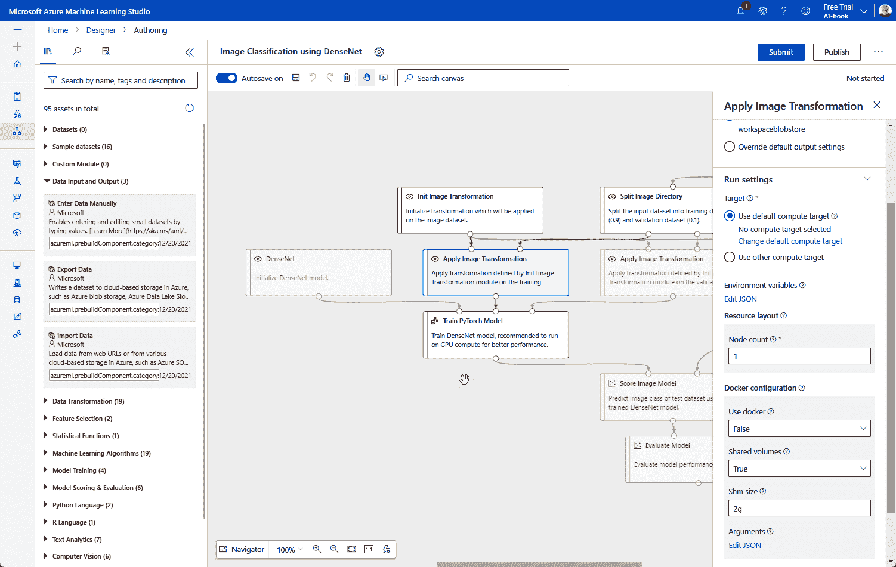
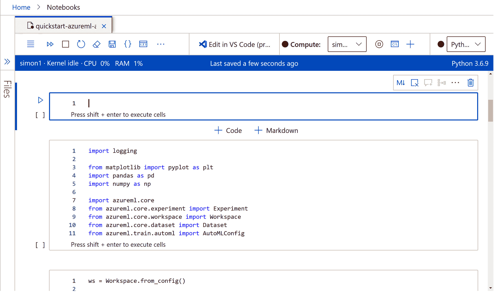
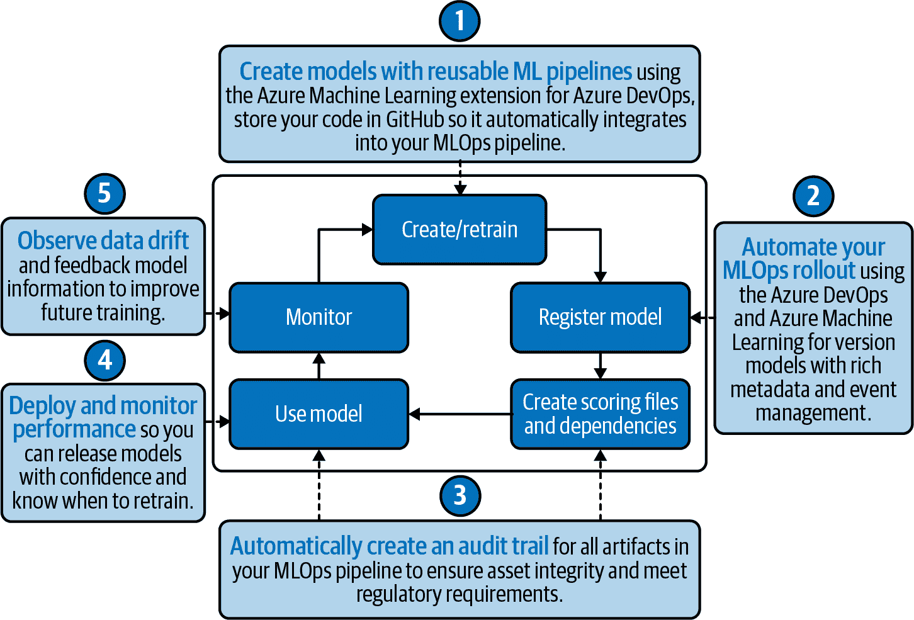

# 第三章：使用 Azure 机器学习、ONNX 和 PyTorch 训练、调整和部署模型

在前一章中，我们试图涵盖来自 Microsoft 的所有 AI 工具和服务的全范围。现在让我们专注于如何使用 Azure 机器学习云服务构建和训练您自己的模型，使用熟悉的机器学习框架和 Azure 以及 Visual Studio 的混合工具。我们将看看如何使用流行的 PyTorch 机器学习框架，以及如何将训练好的模型导出为 ONNX，以便与本地推断运行时（如 ML.Net）一起使用。

# 理解 Azure 机器学习

微软的机器学习方法是针对不同的用户群体和他们对技术使用的不同技能水平和不同期望，针对不同产品。在一个极端是 Power Platform 的 AI Builder 的任务导向的低代码连接器（我们将在 第六章 中看到），另一端是 Azure 机器学习。设计供经验丰富的数据科学家使用，它提供一个基于云的开发环境，您可以在其中使用流行框架设计、训练、运行和管理机器学习模型。

Azure 机器学习环境最好被看作是一组工具，所有这些工具都使用相同的后端模型托管基础架构，但可以混合匹配以适应您想要的工作方式。如果您是新手的高级机器学习开发者，您可以使用拖放设计器构建模型，就像低代码开发环境一样。经验丰富的数据科学家可以使用数值方法语言 R 来构建和测试模型，通过 Azure SDK 与 R 的开发工具一起工作。同时，Python 机器学习开发者可以在 Visual Studio Code 或任何其他 Python 开发环境中使用 Jupyter Notebooks。

在幕后，Azure 机器学习是一个灵活的环境，支持多种机器学习框架和方法论。这意味着支持流行的开源框架如 PyTorch 和 TensorFlow，并且能够将训练好的模型导出为 ONNX，在任何兼容运行时使用。甚至还有一种命令行选项，使用 Azure CLI 管理您的模型。

###### 提示

我们在 第二章 中介绍了 ONNX。开放神经网络交换格式是一种用便携格式表示机器学习模型的标准，简化了在多个平台上优化推断模型的过程。常见框架如 TensorFlow、PyTorch、scikit-learn、Keras、Chainer、MXNet、MATLAB 和 SparkML 的模型可以转换为 ONNX，以利用不同硬件平台上的加速器（例如 NVidia GPU 上的 TensorRT、Intel 处理器上的 OpenVINO 或 Windows 上的 DirectML），在您希望将其运行时化时，无需重写模型以优化每个平台。

它是一个设计为随着你的发展而扩展的系统，从在本地机器上构建和训练模型，到使用云和 Azure 数据源以及计算。随着你的学习和尝试新技术，你可以将你正在使用的工具带到 Azure，然后将机器学习模型作为托管端点或 ONNX 导出交付。一旦你的模型训练完成，Azure Machine Learning 使其准备在你的应用程序中运行，无论它们在哪里，从具有神经处理器的移动设备到与 Azure Data Lakes 中存储的各种类型的数据或来自 Event Grid 和 Azure IoT 的流数据一起工作。

# 理解 Azure Machine Learning Studio

Azure Machine Learning Studio 是一个基于 Web 的模型开发和训练工具，专为数据科学家设计。它旨在适应不同的经验水平和编程技能，混合了传统的编程工具与无代码工具。

不要将其与现已弃用的 ML Studio 可视化工具混淆。你仍然可以获得相同的视觉设计体验，但现在与 Azure Machine Learning SDK 完全集成，以及更强大的模型设计和开发工具。如果有的话，Azure Machine Learning 是一个重要的升级，任何仍依赖于 ML Studio 的项目都应该迁移到 Azure Machine Learning。在 Studio 中开发的模型可以通过 SDK 进行修改，而 Studio 工具可以帮助调整使用 Python 或 R 开发的模型。

微软建议使用最新的 Web 浏览器版本与 Azure Machine Learning Studio 一起工作。Studio 的大部分编辑体验依赖于现代 Web 技术，构建在与 Visual Studio Code 相同的 Monaco 代码编辑工具基础上。

Azure Machine Learning Studio 适合所有类型的开发人员。有经验的 Python 数据科学开发人员可以在 Jupyter Notebooks 中工作，使用实时代码开发环境进行代码评估和调试，因此你可以在编写代码时看到代码的效果。或者，你可以从 Azure Machine Learning 设计师中开始使用现有的模型和数据集，它提供了一个拖放界面，你可以从数据集和 Azure Machine Learning 模块构建一个机器学习管道。

另一种方法是提供自动化机器学习，其中 Azure Machine Learning 可以将模型拟合和调整到你的数据。你可以结合 Azure Machine Learning 数据标注服务使用它，这将帮助你准备数据以用于机器学习模型，添加适当的标签以提高训练效果。这组选项对于将机器学习开放给更广泛的受众非常重要。无需任何数据科学经验，因为你将被引导通过上传数据的过程，然后选择最适合你数据的模型，最后在更多数据上测试以确保生成的模型可以使用。

你可以将 Azure 机器学习工作室视为机器学习的一站式平台。你可以在这里构建和管理模型，处理数据集，并添加新的数据源和存储。其他工具用于管理用于构建、测试和运行模型的计算资源。数据科学专家可以访问笔记本来构建、运行和分享实验，并通过日志帮助分析结果。同时，你可以构建流水线，将数据处理和机器学习结合在一起，确保你有最佳的模型解决你的问题。

# 开始使用 Azure 机器学习

Azure 机器学习提供了一套视觉和基于代码的开发工具。在本节中，我们将看看如何配置和使用它的机器学习环境。

## 设置机器学习环境

Azure 机器学习服务是 Azure 门户的一部分，像任何其他 Azure 资源一样进行管理。从主屏幕选择添加新资源到你的租户，然后选择“机器学习”。你可以通过它的图标识别它，它是 Azure 标志与玻璃试验烧瓶混合的图标，表示它的数据科学起源。

如果你还没有创建任何机器学习工作区，请点击“创建”按钮开始设置你的第一个工作区。这是你处理数据、构建和测试机器学习模型的地方。这个过程需要设置额外的 Azure 服务来支持你的机器学习开发，并且托管和分享你训练好的模型。首先，将你的工作区分配给一个订阅和一个资源组。如果你只是在探索这项服务，可以使用免费试用账户或来自 Visual Studio 或 Azure 学生账户的信用点。

从门户设置你的工作区名称，并将其分配给 Azure 区域。这将自动创建一个新的存储账户，以及一个用于凭据的密钥保管库和一个用于调试的应用洞察实例。此外，还可以选择一个容器注册表，如果计划将模型导出为用于 Azure 外部的容器。

完成第一页设置后，你可以选择设置公共或私有端点详细信息。私有端点更安全，但需要配置 Azure 虚拟网络和私有 DNS 的链接；你需要与你的网络团队合作（你可能还想和他们讨论第八章中的安全和数据访问的最佳实践）。当你只是试验这项服务时，公共端点应该足够了。

服务的高级设置为您提供了管理帐户访问、数据加密以及是否处理敏感数据的工具。最后一点尤为重要；如果您的数据包含个人身份信息或商业敏感数据，您可以选择使用高业务影响力工作区。这样可以减少发送给 Microsoft 的诊断信息，并应用更高标准的加密。

最后，您可以为您的工作区应用标签，以帮助跟踪其在您组织的账单报表中的成本。如果您跨业务组共享成本并且同时拥有多个机器学习工作区，这点尤为重要。在创建工作区之前，您可以审查您的设置。有用的是，Azure 提供了下载您设置的 ARM 模板的选项，因此您可以自动化未来的部署。

单击创建以构建工作区。这可能需要一些时间来部署。

一旦部署了您的工作区，您可以启动机器学习工作室开始使用您的模型。您可以在门户概述中找到工作室工作区的 URL，请将其书签以便将来快速访问服务。值得注意的是，保存工作区的属性也很重要，因为外部工具可以使用这些属性直接访问机器学习服务。

您可能需要使用您的 Azure 帐户再次登录到机器学习工作室门户；这是一个专门的环境。登录后，您将看到一个欢迎屏幕，在这里您可以选择不同的选项开始构建和训练模型。最受欢迎的三个选项有各自的启动按钮，一个用于在 Notebook 中使用 Python 和机器学习 SDK，一个用于使用自动化机器学习，另一个用于机器学习。

机器学习工作室门户在左侧菜单窗格中详细说明了三种角色：作者、资产和管理。作者角色提供了访问三个关键开发环境的权限，而资产允许您管理用于构建和交付机器学习服务的功能，从数据集、实验和管道到您的模型和用于访问它们的端点。最后，管理部分帮助您控制工作室使用的 Azure 资源，选择合适的计算和存储服务。

还有其他设置 Azure 机器学习环境的方式。一种选择是使用 Azure 机器学习 Python SDK 从您的 Python 开发环境设置一个，另一种是使用 Azure CLI。如何操作可以在平台文档中找到详细说明。

现在，您可以开始构建托管在 Azure 上的机器学习模型。

## 与 Azure 服务集成

Azure 机器学习工作区是一组 Azure 资源，使用统一的用户界面捆绑在一起。在幕后，有一组处理计算的 VM、用于数据的存储帐户，以及与 Application Insights、Key Vault 和 Container Registry 的集成。

Azure Active Directory（Azure AD）支持角色基础访问控制（RBAC），有助于管理用户对服务的访问，控制谁可以做什么。例如，您可以确保只有数据科学团队成员可以访问用于管理数据的存储帐户。

值得使用引导式体验工具来设置您的第一个训练环境，这样您可以查看需要配置的资源及其配置方式。首先创建一个计算环境。有三个选项：Azure 机器学习计算群集、Azure 机器学习计算实例以及通过 Azure Arc 使用 Kubernetes。Kubernetes 选项非常有趣，因为它允许您在自己的硬件和数据中心上设置自己的机器学习群集。

如果您正在使用 Azure 托管的计算资源，请选择您希望用作主机的 VM 类型。每个 VM 实例每小时收取费用。

计算 VM 可用作通用用途、计算优化或内存优化：

+   内存优化的 VM 最适合大型数据集的训练，而计算优化的 VM 则适合延迟较为敏感的场景。

+   您可以通过选择低优先级 VM 来节省费用，但这可能会被其他任务中断。然而，这是值得尝试的权衡。

+   其他选项允许您选择使用 GPU VM，代码会自动优化以在 GPU 上运行。

选择您想要使用的选项，然后选择名称和您打算使用的节点数量，包括最小和最大值。您还可以启用安全外壳（SSH）访问，并将您的 VM 连接到虚拟网络。

在继续设置开发环境之前，请等待计算实例的创建。一旦创建完成，您可以选择它并设置您的机器学习平台。Azure 机器学习工作室提供四种不同的模型作为基于 Ubuntu 的 VM 映像。您可以选择使用 scikit-learn（有两个选项，其中一个添加了对 LightGBM 和 XGBoost 的支持，这两者都有助于加速训练）、PyTorch 或 TensorFlow。所有四个映像都预先配置了 Azure 机器学习 SDK，并安装了适当的 Python 包。

您现在可以配置您的训练作业，设置实验并上传您自己的代码。代码将需要从上传目录运行的 shell 命令，因此请确保添加适当的参数和任何必要的环境变量。代码也可以从工作区的 Blob 存储中运行。同时，您需要配置您的数据集，为其命名并确保它可以立即使用。

一切就绪后，您可以使用 Azure 资源运行您的第一个机器学习实验。

# 使用 Visual Studio Code

你不需要登录 Azure 门户即可使用 Azure 机器学习。微软为其 [Visual Studio Code 编辑器提供了一组扩展](https://go.microsoft.com/fwlink/?linkid=2190261)，用于支持其套件中的 Azure 工具。

一旦从 Visual Studio Marketplace 安装，此扩展将在其 Azure 控制面板中添加机器学习控件，与其他 Azure 扩展并列。将所有 Azure 功能集中在一个地方有助于简化找到你需要的内容，尤其是在同一应用程序中经常使用不同的 Azure 功能。此扩展简化了与基于 Python 的机器学习产品的工作，提前安装 Visual Studio Code 的 Python 语言支持对于智能感知代码完成、基于语言服务器的语法突出显示和代码检查以及内置的 Jupyter 笔记本是非常值得的。

接下来，使用你的 Azure 帐户登录扩展以访问 Azure 机器学习资源。你可以设置一个默认工作区，从而可以访问诊断和自动完成，使用扩展添加到 Visual Studio Code 命令面板的 Azure 机器学习命令。你可以快速创建新资源，并管理通过门户创建的资源，使用 Code 来编辑 JavaScript Object Notation (JSON) 架构。一旦设置好，可以根据需要启动和停止资源。

###### 提示

值得确保你已安装了 Code 的 YAML 和 JSON 工具，以帮助管理 Azure 机器学习配置。

在开发环境中使用 Azure 机器学习资源简化和优化了流程。你无需切换上下文；你用于处理 Python 或 JavaScript API 的相同命令面板也控制着你的 Azure 机器学习环境。

同一 YAML 编辑环境用于创建训练作业，将本地 Python 文件上传到你选择的 CPU 或 GPU 计算集群。同样，你需要从 [Microsoft 的精选镜像库](https://go.microsoft.com/fwlink/?linkid=2190139) 中选择一个合适的环境。

# Azure 机器学习 Python SDK 用于本地开发

虽然 Azure 机器学习工作室提供了一个构建和训练模型的环境，但经验丰富的 AI 开发人员和数据科学家可能更喜欢使用熟悉的开发环境和工具，将他们自己的算法和数值方法带入 Azure。其中一种方法是使用 Azure 机器学习 SDK for Python，以及你选择的 Python 开发环境。

这使您可以将 SDK 安装到诸如 Visual Studio Code 之类的工具中，并且可以在 Python 命令行上构建和测试您的模型，或者在自己的系统上使用 Jupyter Notebooks 构建、测试和共享模型，使用笔记本作为交互式代码的测试平台。一旦安装完成，SDK 将添加用于处理模型和数据集的开发生命周期工具，以及管理 Azure 云资源的工具。然后，您可以在云中或在您自己的系统上训练模型，如果您拥有大量的 GPU 处理能力，则这是一个有用的选项。

虽然大多数用户更喜欢使用 SDK 交互式地训练他们的模型，但也有使用自动化机器学习调整模型以找到最佳数据集拟合度的选项。如果您是数据科学家，您可能会发现这是从数据交付机器学习模型的有用方式。最后，SDK 提供了从模型到托管在 Azure 的 REST API 的工具，可以从任何代码中调用。

SDK 提供了一系列稳定的生产就绪功能以及实验性代码。在实践中，您可能会使用稳定的功能，将实验留给未来的探索，因为它们接近发布时可能会有错误。

Azure 机器学习平台的许多功能通过 SDK 中的一系列类访问。这些包括像 Workspace 这样的基础类，使用您的 Azure 订阅详细信息创建工作空间对象。如果您计划使用多个模型进行工作，请将配置详细信息保存为一个 JSON 文件，每次创建新的工作空间时都可以调用它。

一旦您有了工作空间，您需要创建一个实验来承载您的模型运行和结果。运行是另一个独立的类，创建一个监视试验的运行对象，通过函数调用来检索其结果。

使用 pip 安装 SDK：

```
pip install azure-ml core
```

一旦安装完成，使用导入语句将 azureml.core 引入您的运行环境。然后，您可以从代码中创建一个工作空间：

```
from azureml.core import Workspace
ws = Workspace.create(name='myworkspace',
                      subscription_id='<azure-subscription-id>',
                      resource_group='myresourcegroup',
                      create_resource_group=True,
                      location='eastus2'
                     )
```

如果您在多个脚本中使用相同的帐户详细信息，请将配置保存为 JSON 文件，并在每个脚本中加载它。

以下代码片段加载了一个工作空间的配置，然后打开一个实验，并运行该实验：

```
from azureml.core import Workspace, Experiment, Environment, ScriptRunConfig

ws = Workspace.from_config()
experiment = Experiment(workspace=ws, name='day1-experiment-hello')

config = ScriptRunConfig(source_directory='./src', script='run.py',
         compute_target='cpu-cluster')

run = experiment.submit(config)
aml_url = run.get_portal_url()
print(aml_url)
```

使用 URL 来监视运行的进度。

还有一些默认未安装的附加包，因为它们仅在特定功能中需要，例如使用自动训练或使用基于 FPGA 的 Azure 机器学习硬件加速模型进行深度神经网络。您需要一个 64 位 Python 环境来使用自动化机器学习训练，因为它需要 LightGBM 框架。还有一个薄客户端选项，用于与远程自动化机器学习配合使用，例如使用内置到 Azure 机器学习工作室中的工具。

保持 SDK 的最新更新非常重要，这样您就可以与当前的 Azure 机器学习功能集保持同步。如果使用其笔记本电脑，这一点尤为重要，因为笔记本电脑依赖于该服务。

使用 Python SDK 的一个好方法是首先使用您选择的数值方法和机器学习框架在 Python 中创建一个模型，其中 PyTorch 是最常见的选择。您需要一个模型脚本和一个训练脚本。训练脚本下载并设置您的训练集，并为您配置 PyTorch。

一旦您完成这些步骤，创建一个控制脚本，使用 SDK 构建、配置和运行您的模型，作为新工作区实验的一部分。您将能够从 Azure 机器学习工作室监视您的实验。

# Azure 机器学习和 R

尽管 Python 是数据科学和机器学习的热门选择，但 R 仍然很受欢迎，特别是在构建统计模型和分析大数据时。微软在 Azure 上提供了 R 支持作为其主要数据科学工具之一，具有专门的虚拟机和支持其主要的大数据平台：Azure HDInsight 和 Azure Databricks，以及在 Azure SQL 托管实例内部，您可以在数据库中嵌入 R 代码。

R 曾经是已弃用的 Classic Azure 机器学习工作室的关键元素，其中 R 基础模型可以作为您的机器学习流水线的一部分使用。随着新版 Azure 机器学习平台的推出及其自己的拖放式机器学习工具，情况发生了变化。但是，R 支持并没有完全消失，因为它在目前预览版的 Azure CLI 2.0 中得到了支持，该版本替代了用于 R 的 Azure 机器学习 SDK。

Azure CLI 的 R 支持为您提供了完整的基于 R 的机器学习模型训练和部署环境。您将能够从命令行调用 R 代码，处理数据集和标准的 R 功能。

由于 R 专为统计操作设计，用于构建和训练模型的代码可以非常紧凑。首先使用 Azure CLI 创建适当的计算集群以供您的模型使用。然后，您可以在 YAML 中定义一个作业，加载一个 R 容器并运行您的训练代码。

以下 YAML 加载了一个 R Dockerfile，并在一组车祸数据上运行广义线性模型：

```
$schema: https://azuremlschemas.azureedge.net/latest/commandJob.schema.json
code:
  local_path: src
command: >
  Rscript accidents.R
  --data {inputs.training_data}
inputs:
  training_data:
    data: 
      local_path: data
    mode: mount
environment:
  docker:
    build:
      dockerfile: file:Dockerfile
compute: 
  target: azureml:cpu-cluster
experiment_name: r-accidents-example
description: Train a GLM using R on the accidents dataset.
```

它与使用 Python 非常相似，可以将其替换为 R，并为您的作业使用适当的 Dockerfile。这将加载与在 Azure 上工作所需的 R 包。

训练模型的 R 代码如下所示：

```
library(optparse)  

options <- list(
  make_option(c("-d", "--data_folder"), default="./data")
)

opt_parser <- OptionParser(option_list = options)
opt <- parse_args(opt_parser)

paste(opt$data_folder)

accidents <- readRDS(file.path(opt$data_folder, "accidents.Rd"))
summary(accidents)

mod <- glm(dead ~ dvcat + seatbelt + frontal + sex + ageOFocc + yearVeh 
+ airbag + occRole, family=binomial, data=accidents)
summary(mod)
predictions <- factor(ifelse(predict(mod)>0.1, "dead","alive"))
accuracy <- mean(predictions == accidents$dead)

output_dir = "outputs"
if (!dir.exists(output_dir)){
  dir.create(output_dir)
}
saveRDS(mod, file = "./outputs/model.rds")
message("Model saved")

```

您可以在[用于在 Azure 机器学习中训练 R 模型的示例代码和数据](https://go.microsoft.com/fwlink/?linkid=2190143)中找到示例代码和数据。

# 使用 Azure 机器学习工作室构建您的第一个模型

工作室是 Azure 机器学习平台的核心。除了托管您自己的脚本和实验、提供管理和训练环境外，它还包括简化和加速机器学习的工具，使用自动化和可视化开发环境。

## 使用自动化机器学习

Azure 机器学习提供了一套有用的低代码和无代码机器学习开发工具。一旦您创建了一个机器学习工作空间并分配了计算资源，您可以使用其自动化机器学习工具创建和训练模型，而无需编写一行代码。

首先创建一个新数据集。微软提供以逗号分隔值（CSV）格式的示例数据，您可以使用它来尝试该服务；您可以将数据下载到您的 PC 上，也可以从工作室工作空间内部连接到数据。使用数据创建数据集，以便在 Azure 机器学习中使用。

在 AutoML 页面上，使用您的数据集创建一个新运行。您需要配置您的训练运行，设置实验名称并选择数据集中的目标列。这将是模型的输出数据，并将用于训练模型，使用您的计算资源。接下来，从基本机器学习模型类型的列表中选择任务类型：分类、回归和时间序列。对于大多数数值模型，您将希望选择回归。

你可以微调任务配置，选择使用的算法，是否解释模型以及定义训练运行的结束时间和方式。你会想要阻止大部分可用算法的探索，因为探索所有算法可能需要大量时间，并且可能根据计算集群的规模增加显著的成本。

一旦提交任务，服务将自动运行。您可以在工作区的“模型”选项卡中观看生成的模型。一旦运行完成，根据您的退出标准，您将会展示最佳模型及工具，帮助您确定它是否符合您的要求，显示错误率以及显示预测值和实际值是否匹配的一组图表。

值得进行一系列不同的试验，使用不同的算法。这将使您能够找到最适合您模型的算法，比较工作室仪表板中的不同运行。由于每个训练运行使用相同的数据集，您有一个有效的基准来比较不同的算法和参数集。

一旦模型训练完成并准备好使用，只需点击几下，即可将其部署为 Azure 中的推理服务，作为容器运行或在 Kubernetes 集群中运行。工作室将为您的模型生成适当的端点，带有 REST API 和一组认证密钥。您现在可以使用 Python 在工作室笔记本中测试生成的机器学习模型。

## 使用设计师

作为编写代码的替代方案，您可以使用无代码的 Azure 机器学习设计师。这为您提供了一个拖放界面，用于连接处理数据和训练各种常见模型所需的各种元素。生成的流水线将所有必要的步骤整合在一起，在 Azure 机器学习工作区中运行它们。

在工作室内，选择“设计师”选项以打开设计师并创建新的流水线。工具会自动创建和命名一条流水线，准备让您添加模块，如 图 3-1 所示。如果您愿意，可以将其从默认的基于日期的名称重新命名。

接下来，选择计算资源进行模型训练。您可以选择现有的目标或创建一个新的目标。有一个选项可以为所有流水线模块使用相同的目标，或者您可以为每个模块选择自定义目标。除非您有预算支持多个计算或 GPU 实例，否则最好坚持选择一个目标。资源在停止运行时会缩减到零，但这会增加它们启动时的时间。

设计师的拖放画布类似于 Azure Logic Apps 等工具使用的画布。屏幕左侧是可以添加到画布中的一组模块。首先拖放数据源，可以是您自己的数据源或一组示例数据集中的一个。选择这些后，您可以开始处理数据，使用内置数据转换来选择用于模型的列。

通过连接一个模块的输出端口到下一个模块的输入端口来连接这些元素。此过程构建了您的流水线。数据处理模块包括用于清理数据的工具，运行清理算法并将数据拆分为单独的训练和测试集。您可以选择每个集合使用的数据分数。



###### 图 3-1\. Azure 机器学习的设计师使用拖放工具构建流水线

接下来，拖放您选择的模型。您可以选择不同类型的模型；选择适合您要进行的预测类型的模型。将您的模型连接到“训练模型”模块，并与训练集链接。这将馈入“评分”模块，该模块使用测试数据集评估生成的机器学习模型。

测试结果可以进行可视化，使您能够快速评估模型。如果结果良好，您可以快速发布它以供使用。您可以选择生成实时或批处理推理流水线。这会将网络服务输入和输出添加到您的流水线中，并移除训练模块。然后，您可以测试推理端点，然后部署到 Azure Kubernetes Service 群集中。

## 使用 Azure 机器学习与笔记本电脑和 Python

Jupyter 笔记本是一种开源工具，允许您链接文本、图像和代码来构建和共享实时交互式文档。这使它们成为数据科学的理想工具，因为您可以构建一系列笔记本，嵌入所有构建和运行机器学习模型的步骤，以及其文档说明。支持许多不同的语言，尽管 Python 是最受欢迎的之一。

Azure 机器学习工作室可以直接在您的工作空间中托管 Jupyter 笔记本，同时支持 Jupyter 和 JupyterLab 作者环境。笔记本在工作室中有自己的部分，具有用于存储文档和代码的文件系统和基于浏览器的终端。最后，除了您自己的笔记本空间外，还可以快速访问一系列托管 Azure 机器学习教程和样本的笔记本。

要创建新文件，请单击笔记本文件浏览器中的文件创建图标。这样可以上传文件和文件夹，创建新文件夹和新文件。选择创建笔记本文件并为其命名。这将在编辑画布上打开代码和 Markdown 内容，正如您可以在图 3-2 中看到的那样。文件也可以在外部使用 Visual Studio Code 进行编辑。



###### 图 3-2\. 在 Azure 机器学习笔记本中使用 Python 代码

与所有 Jupyter 笔记本一样，Azure 机器学习使用单元格来保存代码和内容。您可以使用集成的基于 Web 的编辑器添加新的单元格。它基于微软的 Monaco 编辑引擎（如同 Visual Studio Code 中使用的），因此完全支持代码完成和智能提示。这种组合结果是一个完整的 Jupyter 环境，具备调试工具，可管理和探索变量，是在协作空间中构建和测试原型的快速而强大的方式。可以使用任何支持 Python 的机器学习工具构建模型，例如调用 PyTorch 和 TensorFlow。

Python 代码通过 Python SDK 与 Azure 机器学习进行交互，因此您可以链接一系列单元格，加载 SDK、登录服务，然后设置和运行实验，使用一个单独的单元格来处理您的模型。微软提供了一组常见操作的代码片段，可以加快编写代码的速度，并可选择提交您选择的代码片段以供将来使用。

您还可以在笔记本中添加注释，允许围绕代码进行协作。您可以选择代码部分，并在注释窗格中添加评论。注释功能使您能够轻松创建和管理问题，并具备将其转换为对话线程的工具。一旦完成，笔记本可以导出并使用常见格式共享，用于文档编写或作为生产应用程序中的纯代码。

笔记本可以通过类似 Git 的工具进行管理，确保可以在 Azure 环境之外共享和存储。笔记本还可以在本地 Jupyter 实例上运行，允许脱机开发和测试，然后再利用 Azure 资源训练完整规模的模型。在编辑笔记本时无需担心成本问题；它们只在运行包含代码的单元格时连接到计算实例。

# 使用不同机器学习框架进行 Azure 机器学习工作

Azure 机器学习旨在支持多种不同的机器学习框架，预构建的计算镜像简化了使用它们训练模型的过程。这些包括流行的 PyTorch 和 TensorFlow 框架。

PyTorch 是基于 Lua-scripted Torch 的开源机器学习库，主要在 Facebook 的 AI 研究实验室开发。它提供 Python 和 C++ 接口，其中 Python 选项最常用。现在还包括对 Caffe2 的支持，支持基于张量和深度神经网络模型。

Microsoft 在内部使用 PyTorch，在 Azure 机器学习的 Python 开发环境中支持它。预构建的计算实例可用于 PyTorch 环境，使您可以快速使用 Azure 机器学习工作室中的工具。这包括通过 Jupyter 笔记本交互式地使用它，或者通过 Azure CLI 使用它。

Azure 机器学习还包括对 Google 的开源 TensorFlow 的支持。这使用 Python 数据结构来训练神经网络。由于使用 TensorFlow 构建和开发模型相对简单，因此它已成为快速开发机器学习模型的流行选择。它的即时执行选项直接与 NumPy 线性代数工具集集成，使其成为数据科学家的逻辑选择。

与 PyTorch 类似，Azure 为 TensorFlow 提供了预构建的计算环境，以及在 Azure 机器学习的 Python 开发环境中的支持。这两个框架的工作方式类似，并具有类似的性能特征。在选择使用哪种选项时，您需要考虑您的数据科学团队有何经验，以及您的预期工作负载与哪个选项更匹配。

首先将 Azure 机器学习库导入到 Python 配置脚本中，并使用它们设置一个工作空间。然后需要编写一个训练脚本，在一组带标签数据上调用 PyTorch 或 TensorFlow。脚本需要与数据一起存储在您的工作空间中。

Azure 机器学习 PyTorch 脚本与任何其他 PyTorch 脚本一样。无需更改现有脚本即可在计算目标上运行，因此任何熟悉编写 PyTorch 转换并使用其解析器的人都可以使用 Azure 机器学习。微软提供了[示例脚本和数据](https://go.microsoft.com/fwlink/?linkid=2190266)以帮助您入门。

TensorFlow 也是如此。再次，在创建数据集引用您的训练数据之前，您将创建一个工作区，然后可以将其注册并与您的团队共享。一旦您的数据集注册完成，创建一个计算集群。

下一步是定义一个计算目标，使用 Python SDK 创建一个集群。由于 PyTorch 和 TensorFlow 都专注于张量和转换，您应该使用 GPU 集群以获得最佳结果（并将成本最小化）。Microsoft 提供了预先安装了 PyTorch 或 TensorFlow 的精选环境，这比创建带有所有适当依赖项的虚拟机要容易得多。您将受限于 Azure 当前支持的每个框架版本，尽管在实践中，除非您计划使用新功能或打算尝试预发布工具，否则这不会太大的影响。

或者，您可以使用 Python SDK 来构建自己的计算环境，使用 YAML 脚本设置适当的依赖项，安装 Python，然后使用 pip 安装您的代码所需的工具。您还需要定义您的计算环境的基础映像。

一旦这些都就位，无论是通过 CLI 还是通过一组笔记本，您都可以创建一个训练作业，包装您的数据和脚本。这将加载您的训练文件夹的内容到您的计算集群，然后运行一组训练运行。您需要为 PyTorch 或 TensorFlow 包含具体的细节。

PyTorch 训练脚本看起来会像这样：

```
from azureml.core import ScriptRunConfig

src = ScriptRunConfig(source_directory=project_folder,
                      script='pytorch_train.py',
                      arguments=['--num_epochs', 30, '--output_dir', 
                      './outputs'],
                      compute_target=compute_target,
                      environment=pytorch_env)
```

类似地，TensorFlow 训练脚本看起来会像这样：

```
from azureml.core import ScriptRunConfig

args = ['--data-folder', dataset.as_mount(),
        '--batch-size', 64,
        '--first-layer-neurons', 256,
        '--second-layer-neurons', 128,
        '--learning-rate', 0.01]

src = ScriptRunConfig(source_directory=script_folder,
                      script='tf_train.py',
                      arguments=args,
                      compute_target=compute_target,
                      environment=tf_env)
```

您会注意到，TensorFlow 要求您在 args 部分中定义神经网络的结构。

当运行时，这将为您的运行时构建适当的容器，并在集群中进行扩展，将其运行在您的训练数据上。运行的详细信息将实时记录以帮助您监控，完成后将结果复制回您的工作区。如果模型结果符合预期，您可以将其注册供 Azure 使用，或者下载结果模型以在本地使用。您还可以选择将其导出为 ONNX 格式，以便与 ONNX 推理运行时一起使用。

# MLOps 简介

MLOps 是将 DevOps 原则应用于机器学习的应用，将软件开发生命周期应用于您的模型开发，并同时使用负责任的 AI 技术（参见第七章）为您的应用开发提供治理框架。这是一套重要的技术，如果要使机器学习成为一种协作和可重复的过程，则可以利用 Azure 机器学习中内置的监控和调整工具。

虽然 DevOps 在现代应用程序开发中很重要，但对于像 Azure Machine Learning 这样的平台来说，MLOps 显然更为重要。模型不同于代码；它们需要维护才能有效运行。我们拥有的数据越多，我们做出的预测也就越多；很容易看出模型失败的地方以及改进它们所需的内容。这项数据科学任务需要融入我们的机器学习应用程序开发生命周期中。

使用 Azure Machine Learning 等工具有助于将 MLOps 流程集成到您的工作流程中，如图 3-3 所示。其管道方法用于构建和测试模型，使您可以访问必要的日志文件数据，同时可调参数帮助快速拒绝失败的模型。Azure Machine Learning 还能够快速打包和部署模型，无论是作为 REST API 端点、准备好的 Kubernetes 推理容器，还是跨平台、跨设备的 ONNX。通过 Azure Machine Learning 与 Azure DevOps 平台的集成，您可以开始自动化这一过程。



###### 图 3-3\. Azure MLOps 生命周期描述如何使用 Azure Machine Learning 工具管理模型

Microsoft 的 MLOps 生命周期分为五个步骤：

1.  使用 Azure Machine Learning Studio 创建/训练/重新训练您的模型。

1.  注册模型以供应用程序使用；使用 GitHub 和 Azure DevOps 等工具管理模型版本。

1.  创建评分文件和依赖项，以获取操作的审计跟踪，确保符合监管要求，并为预测结果提供解释性。

1.  部署和监控，使用日志和其他性能监控工具获取模型操作的可观察性。

1.  使用监控数据了解模型漂移，并基于真实世界数据和指标确定重新训练模型的最佳时机。

Azure 提供了一套监控工具，可内置到机器学习应用程序中以提高性能，同时 Azure Machine Learning 中的内置日志记录可用于在训练期间和模型作为推理器运行时改进模型。

这些监控工具还可用于在训练期间帮助调整模型，以确保它们最初是稳健的，并且重新训练将成为一个不经常进行的过程，这是一个重要的要求，考虑到训练的计算和 GPU 需求可能相当大。调整工具也是 MLOps 生命周期的重要组成部分，因为它们允许开发人员在训练过程中微调模型和构建在其上的神经网络。值得深入了解这些功能，以了解如何使用日志记录来调整您的模型。

## Azure Machine Learning 中的日志记录

Azure 机器学习提供工具来监视训练运行，使用默认的 Python 日志记录工具和 SDK 中自定义的日志记录工具进行实时记录。您可以使用 MLflow 日志记录工具处理这些数据，在 Azure 机器学习工作空间安装适当的包。

```
pip install mlflow
pip install azureml-mlflow
```

您可以编写针对 Azure 机器学习服务的日志记录脚本。如果您使用笔记本来构建和测试实验，生成的数据可以在笔记本中查看，使用 Python 可视化工具。或者，您可以通过工作室获取后运行的可视化结果，使用实验选项卡查看数据并比较不同运行，并使用筛选器提取特定数据。笔记本提供交互式日志记录工具，以及用于显示日志数据的小部件。

每次运行的所有日志文件都存储在您的工作空间中，您可以下载这些文件进行额外分析，包括文本文件、JSON 和日志格式文件的混合。

## 使用超参数进行调整

日志可以帮助通过 Azure 机器学习的超参数来调整模型。管理学习过程的关键元素，这些元素让您能够从实验外部调整模型和神经网络的性能。在学习开始之前设置，这些设置包括学习速率和决策树中分支的数量等。

Azure 机器学习的 HyperDrive 工具可以为您自动调整参数，帮助优化参数，及早终止表现不佳的运行，并自动调整神经网络以获取最佳配置。这包括定义网络中的层数以及每层中的节点数。

在调整参数之前了解机器学习模型的深度架构非常重要。过去这是一个复杂的手动过程，需要大量计算资源。Azure 机器学习的工具允许您将调整视为实验，自动化过程的大部分，并且并行运行测试以找到模型最佳的超参数组合。

使用 Azure 机器学习 SDK 和 HyperDrive SDK 编写的超参数调整实验是用 Python 编写的。您需要定义调整特定超参数的搜索空间，用于调整的指标，如何对训练运行进行采样，以及实验如何终止。每次运行都将是完整的训练运行，加载所有数据并重建模型。

Azure 机器学习工作室提供可视化工具，帮助您确定哪个运行结果对您的模型最佳。其图表可用于展示您选择的指标与超参数数值之间的相关性。

使用超参数确实需要相当水平的机器学习理解，以帮助识别可以帮助提高模型准确性的特定参数。实际上，通过在 Azure 机器学习的自动化机器学习工具中使用自定义模型，您将获得类似的效果。

# 使用 ONNX 导出

Microsoft CEO Satya Nadella 谈到了“智能云和智能边缘”；正是 WinML 和 ONNX 的结合推动了大部分边缘智能。ONNX 是一个重要工具，用于在许多不同平台上推理经过训练的机器学习模型。它允许您在 Azure 机器学习中使用适当的机器学习框架开发和训练模型，当它们准备好用于通用用途时，将它们导出为 ONNX 格式，以便在目标系统上的本地 ONNX 运行时中使用。从手机到 PC，Windows 为桌面应用程序提供了自己的 WinML ONNX 服务的支持。

您可以从常见的机器学习框架（包括 PyTorch 和 TensorFlow）中导出 ONNX 文件。Microsoft 在内部使用 ONNX 以及 ONNX Runtime，显示出与使用替代推理服务相比的显著性能提升。

机器学习不仅仅创建 ONNX 模型；如果您从另一个机器学习训练服务或自己的系统中导入了 ONNX 模型，您可以在 Azure 机器学习中运行它，用它来管理和控制对服务 API 的访问，同时利用其自动推理扩展和访问 Azure 计算的全球范围。

## 使用 ONNX 与 WinML

Microsoft 已将一组推断 API 集成到最新的 Windows SDK 中，适用于 Windows 和 Windows Server。这些 API 支持使用预训练的 ONNX 模型，允许您利用 Azure 的规模来设计和训练机器学习模型，然后将其构建到 Windows 应用程序中。

在本地运行模型可以减少网络负载，使您可以将学习放在需要的地方，即使网络带宽很少或没有。通过本地 ONNX 模型，机器学习代码可以在任何需要的地方运行，将其带到网络的边缘。

WinML 具有适用于大多数常见 Windows 开发平台的 API，从使用 C 和 C++的本机访问，到用于 C#代码的 WinRT API。这些提供了对 WinML 运行时及其 ONNX 推理引擎的抽象，该引擎可以直接与 PC 的 CPU 配合工作，或者利用 DirectML 利用 GPU 处理能力。

在使用 WinML 时，将 ONNX 模型作为项目文件的资产包含进去。加载和运行模型的技术取决于您选择的语言，但使用最新版本的 Visual Studio 提供了工具，用于公开模型的输入和输出，以供您的代码使用。无论您使用哪种语言，与 ONNX 一起工作都使用一种通用模式：加载、绑定和评估。

您的代码需要首先从资产存储加载模型。由于 ONNX 模型可能很大，建议围绕异步方法构建您的推断应用程序来处理加载。一旦加载了模型，您可以将输入和输出绑定到它，确保您的输入和输出类支持预期的数据类型。现在，我们可以迭代我们的输入数据，为每个输入值调用异步评估方法，然后使用返回的输出数据，并在应用程序的其余部分中使用结果。

使用 WinML 和 ONNX，您可以仅需几行代码构建独立的机器学习应用程序，使用来自 Azure 机器学习的训练模型，并在您拥有 Windows PC 或服务器的任何地方运行它们。

## 在机器学习容器运行时中使用 ONNX

便携式机器学习系统是边缘计算的重要工具，正如我们在第二章中展示的那样，将机器学习模型放在需要的地方。为了简化部署，您可以将整个 ONNX 运行时与您的 ONNX 模型一起打包到一个容器中。部署只是加载和在边缘 Kubernetes 系统（如 K3s）上运行容器，或使用独立容器运行时。通过最小化服务停机时间和中断来处理更新。

设置 ONNX 运行时容器非常简单。首先构建一个配置了 Python 的容器映像。使用 pip 安装 ONNX 运行时，无论是用于 CPU 还是 GPU。您可以在[ONNX Runtime for Azure Machine Learning](https://go.microsoft.com/fwlink/?linkid=2190243)找到 Microsoft 的版本。Python ONNX 运行时将模型加载为推断会话，您可以使用它提取模型数据以枚举输入和输出，以及确认模型元数据。

运行模型就像调用推断会话并提供模型输入一样简单。您可以定义要使用的输出，或者简单地接受所有响应。

Microsoft 提供了预构建的 ONNX 运行时容器，用于与预先训练的 Azure 机器学习模型一起使用。基于 Ubuntu 18.04 和 Python 3.7，设计用于使用 CPU 推断，并应该在大多数 Docker 或容器系统上运行。预安装的包还包括 NumPy 和 Pandas，因此您可以使用常见的数值方法处理结果。预构建的 Dockerfile 可以用作构建您自己图像的基础，添加额外的库和代码作为嵌套 Docker 图像。

# 总结

在本章中，我们探讨了使用 Azure 机器学习中的工具来构建和训练自定义机器学习模型，使用常见框架如 PyTorch 和 TensorFlow，以及其自身的无代码设计工具。但您并不总是想要构建自己的机器学习模型，因此在下一章中，我们将看看您可以调用作为 API 的预构建 AI 云服务：Azure 认知服务。
