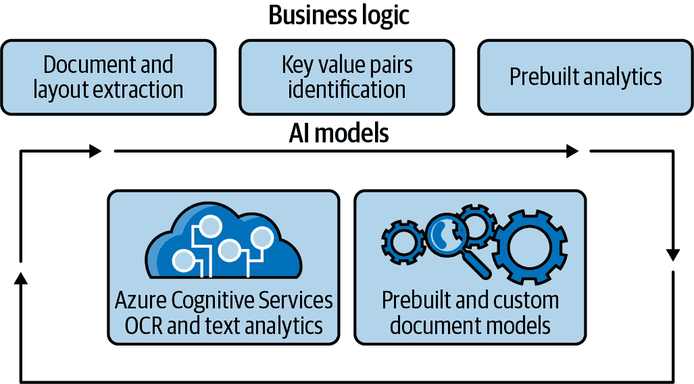
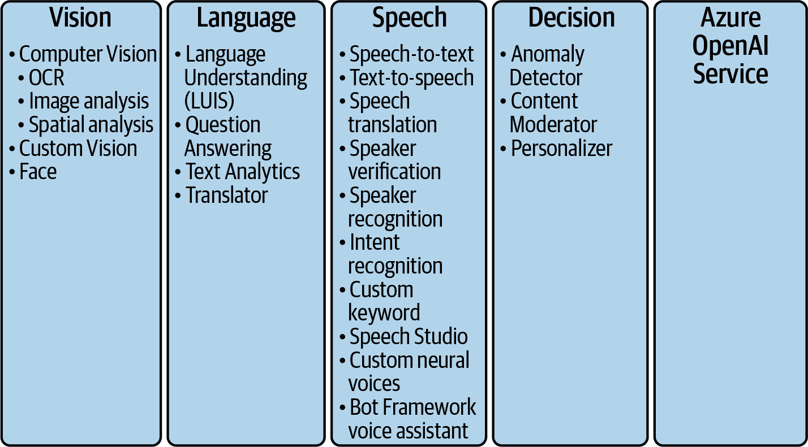
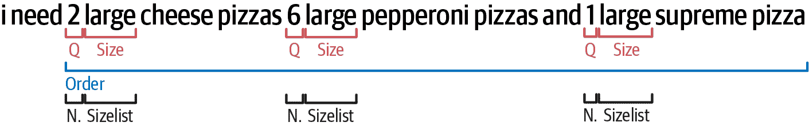
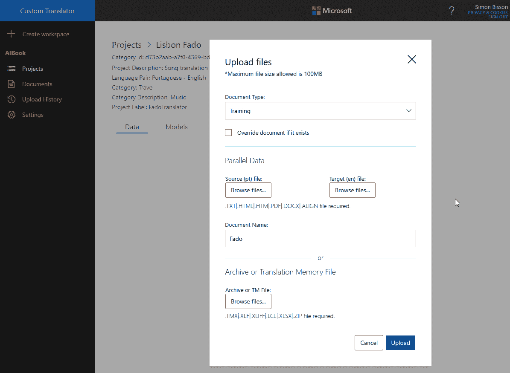
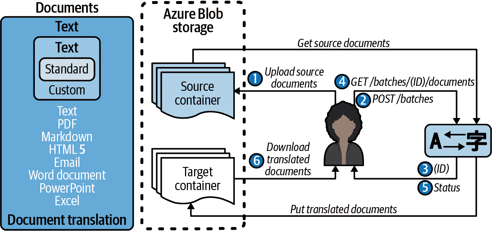
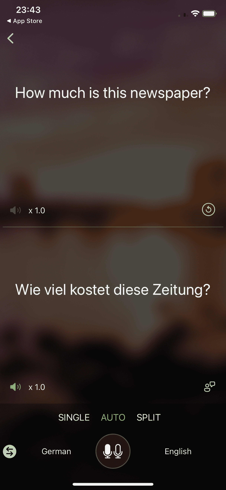
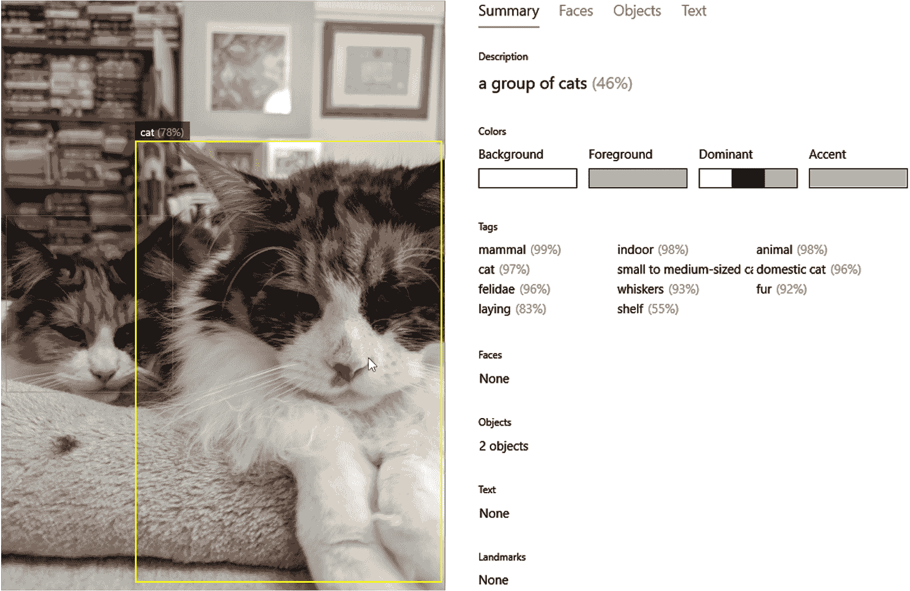

# 第四章：使用 Azure 认知服务构建智能应用程序

在前一章中，我们看过像 Azure 机器学习这样的云服务如何帮助你专注于构建和训练机器学习模型，而无需从头开始创建整个机器学习环境。但并非每个开发人员都希望构建自己的机器学习模型，因此在本章中，我们将向您展示如何使用现成的 AI 服务，这些服务可以直接使用或使用您自己的训练数据进行定制，并像调用其他任何 API 一样使用。

# 使用预建 AI

当今，“AI”一词的使用非常广泛，涵盖了许多不同的方法，但让计算机执行我们曾经认为只有人类能够做到的任务的技术，例如理解和从经验中学习，是基础的。它们包括诸如识别语音和图像以改进客户服务，检测照片中的面孔，甚至使用自拍验证应用程序，理解充满产品名称和行业技术术语的语音，或从文本合成语音的“认知”任务。

想让你的用户拍摄菜单，将其翻译成另一种语言，并展示他们的食物可能的照片吗？创建一个聊天机器人，可以为客户支持提供文本和语音聊天，还可以识别客户发送的产品图片，判断物品是否损坏，并启动退货流程，这些都是你可以通过这些认知任务的 API 将强大的 AI 功能集成到现有应用程序和工具中。

这是 AI 领域的快速发展区域，不断开发出复杂的新算法和技术。使用预建但可定制的 API 作为云服务提供认知任务，为开发人员提供了快速利用 AI 带来的商业价值的方式，并使他们的应用程序具备人性化的一面，而无需成为数据科学家。你不需要构建模型，管理机器学习系统的生产环境——或者保障它。

你不需要训练认知服务中使用的模型（尽管你可以在某些服务中构建定制模型）。微软将预训练模型作为服务交付，并定期使用改进的训练集更新这些模型，以确保它们保持相关性，并能够处理尽可能广泛的源材料。不断向不同服务中添加新的改进算法和模型；你可能会发现你的应用程序变得更强大，而无需进行任何更改，或者会有新的选项可供使用。在某些情况下，开发人员可以像微软内部团队一样快速获得新模型的访问权限。

iOS 和 Android 的 Bing 搜索应用程序可以生成听起来几乎像人说话的语音；这一点非常重要，因为研究表明，听自然语调和清晰发音的结果、方向或像有声书那样更长的内容，会减少很多疲劳感。

使用深度神经网络同时进行语音合成和韵律学（匹配语音中的重音和语调模式），而不是作为单独的步骤，可以产生更自然和流畅的语音。 这是几年前在研究实验室中的一个相对新的发展，新的研究论文仍在不断出现并进行改进。 但在 Bing 团队将神经语音合成添加到他们的移动应用程序几个月前，认知服务的语音 API 已经包括预览英语的两个神经语音合成声音，然后是中文、德语和意大利语的声音。 现在，像 Progressive Insurance 这样的公司使用定制的神经语音：Flo 聊天机器人使用演员 Stephanie Courtney 的声音，这要归功于认知服务。

即使是在人工智能方面有深厚专业知识的公司，也会转向这些服务，而不是创建自己的实现。 当优步希望确保驾驶汽车的人是注册的司机时，即使他们已经剪了头发或换了眼镜，自他们拍摄 ID 照片以来，他们使用 Azure 认知服务中的 Face API 要求司机在手机上自拍。 优步团队广泛使用机器学习，甚至为机器学习开发构建开源工具。 但他们选择认知服务是因为他们能够用几行代码交付新功能，而不是花费几个月时间将人脸检测集成到他们自己的平台中。

通过 Azure 认知服务提供的 REST API 和客户端 SDK（包括 .NET、Python、Java 和 Node.js 等语言），开发人员可以使用和定制最新的 AI 模型，用于计算机视觉、文本和视频分析、语音和知识理解，无需实现、训练或托管自己的模型。认知服务可从 Azure Functions 和 Azure 应用服务调用，或从 Apache Spark、Azure Databricks、Azure Synapse Analytics 等数据处理服务中调用，以丰富或注释大数据。 （它们也适用于 Power Platform 和 Logic Apps 中的无代码和低代码开发者：我们将在 第六章 中介绍如何使用这些功能。）

作为云服务，认知服务可以规模化，适用于成千上万的用户，在全球超过 30 个 Azure 地区的 150 个国家，以符合合规方式存储和保留数据，以便用户控制其数据。API 运行符合严格的 SLA，并保证至少 99.9% 的可用性。服务本地化支持多种语言，某些服务可提供超过 100 种不同的语言和方言。例如，语音转文字可提供 197 种语言，并符合 ISO、SOC2 和 HIPAA 标准。

此外，您还可以将一些最有用的认知服务在本地运行，通过将训练模型直接构建到智能手机应用中，并利用手机上的 AI 卸载硬件运行，或将它们运行在 IoT 设备内部的容器中，这样它们可以直接处理生成的传感器读数。

这对于远程、苛刻的环境特别适用，那里物联网设备最有用，而连接速度慢、昂贵或两者兼而有之。这也解决了数据治理的问题；例如，如果您正在使用图像识别分析保险医疗文件，您在将其带出医院网络以在云中分析时无需担心合规问题。

核心认知服务涵盖语音、视觉和语言技能，包括 Azure OpenAI 服务，以及用于决策和检测异常的服务（您可以在同一应用程序中调用多个服务）。

Azure 应用 AI 服务，我们将在下一章进行详细讲解，将这些核心服务组合成常见场景的工具，如理解视频或处理文件和文档。Azure 表单识别器利用视觉和语言认知服务以及业务逻辑来自动处理表单，正如您在图 4-1 中所见。



###### 图 4-1\. 不必自己调用多个认知服务来从表单中获取信息，您可以使用 Azure 表单识别器，它包装了多个服务和业务逻辑，并具有预训练模型。

认知服务可以看作是让任何开发人员构建基于人工智能解决方案的基础组件：应用 AI 服务添加了针对特定任务的 AI 模型和业务逻辑，用于解决诸如数字资产管理、从文档中提取信息以及分析和实时数据的反应等常见问题。

# 核心 Azure 认知服务

有几十种不同的认知服务，分为以下主要领域，如图 4-2 所示：语音、文本、视觉和决策制定，以及 OpenAI。我们在这里没有足够的空间详细介绍它们所有；¹ 相反，我们将向您展示如何使用一些最流行的服务，但您应该发现与任何 API 和 SDK 一起工作的体验类似。



###### 图 4-2\. 核心认知服务分为五大支柱

## 语言

使用语言 API 分析、理解和翻译文本（或者与我们之前提到的语音服务一起使用）。

您可以使用问答服务将您的常见问题解答转换为交互式聊天机器人，不仅提取关键词汇，还可以了解用户说或者输入的意图，使用语言理解实现几乎实时的翻译，使用您所在业务和行业中重要的术语。这包括对复杂 PDF 文件的全文档翻译，保留其布局和格式。

###### 提示

您可以自定义哪些认知服务语言模型？

+   [语言理解（LUIS）](https://www.luis.ai)

+   [问答服务](https://www.qnamaker.ai)

+   [翻译器和自定义翻译器](https://portal.customtranslator.azure.ai)

文本分析 API 可以处理原始文本并提取其背后的情感、关键短语、语言以及它所指的实体。一句话提到“Rover”；它是一只狗还是一辆车？“Mars”是行星还是英国的糖果棒？实体识别可以找到时区、温度、数字和百分比、地点、人物、数量、企业、日期和时间、URL 和电子邮件地址。还有一种专门针对医疗领域的实体识别服务，可以从医生的笔记和电子健康记录等非结构化文档中提取医疗信息，检测可能是诊断、病症或症状、药物名称、身体部位及其他重要的医疗概念。

###### 提示

使用情感分析来筛选客户评论和评价，并在您的网站上展示，或将结果输入 Power BI 以生成可操作的数据。使用观点挖掘选项来提取主题和观点，以获取更多细节。如果一条消息看起来是投诉，您不仅可以看到负面情感评分，还可以看到像“房间”或“把手”这样的术语，以及像“很冷”或“断在我手上”这样的短语，使您能够迅速回应客户的问题。

关键短语和实体并不能完全表达每个短语或句子的意图。我们都有不同的说话和打字方式，使用不同的词来表示相同的意思。当有人通过聊天界面订购披萨，并要求将其送到他们的住所时，他们到底是什么意思？他们真的想要披萨放在一个洞里吗？

LUIS 将关键字映射到您期望用户询问的事物列表，并将对话转换为应用程序或聊天机器人可以响应的方式列表。

例如，将 LUIS 添加到旅行社聊天机器人中可以缩小帮助客户所需的信息范围。像“我需要去希斯罗的航班”这样的声明将被解析为意图“BookTravel”和实体“flight”和“London”。将这些实体预填充到预订引擎中启动预订过程，同时聊天机器人提示用户输入其他信息，例如日期、旅行等级和出发机场。您可以看到 LUIS 如何从文本字符串中提取意图，在图 4-3 中。



###### 图 4-3\. LUIS 可以从某人说的话中提取实体和意图

LUIS 不是通用的机器学习模型；要充分利用它，您必须使用行业、地点和场景特定的数据对其进行训练。特定领域的预构建模型可以帮助您入门，但如果您想要最佳结果，它们还需要额外的训练。

### 翻译器

Microsoft Translator 是一种基于云的机器翻译服务，支持多语言翻译、转写、语言检测和字典功能：它处理超过 100 种语言和方言。核心服务是 Translator Text API，该 API 在多个 Microsoft 产品中使用，并可通过认知服务获得。同一 API 还驱动语音翻译，接下来我们将讨论这一点。

Translator Text API 使用深度学习驱动的神经机器翻译技术，这种技术在过去十年中彻底改变了机器翻译，通过将单词作为完整句子的一部分进行翻译，而不仅仅是查看每个目标词周围的几个词来解释它，从而实现更准确、更自然、更流畅的翻译。翻译引擎还会多次尝试翻译，通过以前的翻译学习来优化结果。结果是一种更具人类声音的翻译，尤其适用于非西方语言。查看当前[支持的语言列表](https://go.microsoft.com/fwlink/?linkid=2190159)。

您可以通过 REST API 访问这些模型。虽然您可以强制通过特定地区进行操作，但 Microsoft 建议使用全局选项，动态将调用重定向到任何可用的端点，通常是最接近请求位置的端点。以下 Python 代码片段调用了从英语到荷兰语和巴西葡萄牙语的翻译：

```
import requests, uuid, json

subscription_key = "YOUR_SUBSCRIPTION_KEY"
endpoint = "https://api.cognitive.microsofttranslator.com"
location = "YOUR_RESOURCE_LOCATION"

path = '/translate'
constructed_url = endpoint + path

params = {
  'api-version': '3.0',
  'from': 'en',
  'to': ['nl', 'pt']
}
constructed_url = endpoint + path

headers = {
  'Ocp-Apim-Subscription-Key': subscription_key,
  'Ocp-Apim-Subscription-Region': location,
  'Content-type': 'application/json',
  'X-ClientTraceId': str(uuid.uuid4())
}

# You can pass more than one object in body.
body = [{
  'text': 'YOUR TEXT TO TRANSLATE'
}]

request = requests.post(constructed_url, params=params, headers=headers,
          json=body)
response = request.json()
```

您可以在翻译请求中有多个目标语言，每个翻译都在同一个 JSON 返回中。响应内容指示检测到的源语言，并包括一个翻译块，其中包含每个选择的目标语言的文本和语言标识符：

```
[
  {
    "translations": [
      {
        "text": "TRANSLATED TEXT IN DUTCH",
        "to": "nl"
      },
      {
        "text": "TRANSLATED TEXT IN PORTUGUESE",
        "to": "pt"
      }
    ]
  }
]
```

返回的数据可以由您选择的 JSON 库解析。

您可以使用[字典查找 API](https://go.microsoft.com/fwlink/?linkid=2190157)获取额外的翻译，该 API 将返回您提交的短语的替代翻译。返回的 JSON 数据将包含源文本和已翻译的文本，还有一个反向翻译，以帮助您检查翻译是否正确。响应还将提供有关您正在翻译的单词或短语的详细信息。

您可能还希望识别正在使用的语言，这样您就不会在错误的语言配对或无法翻译的内容上浪费 API 调用。

文本转写是一个有用的工具，比如，将日文或中文象形文字或西里尔文字转写为西方转写。在 REST 请求中，设置一个源脚本和一个目标脚本，在 JSON 主体中包含您希望转写的文本。运行后，返回的 JSON 将包含转写的文本。

将不同的功能组合起来，创建您自己的翻译服务——例如，检测日文文本，同时将其转写为西方文字，并进行翻译，同时显示可能可用的备选翻译。

Translator Text API 可扩展；如果您只需标记几个产品名称，可以对这些短语应用标记，以提供它们应该被翻译的方式。但如果您需要覆盖行业特定术语或对您业务至关重要的语言，Custom Translator 可让您扩展默认的翻译神经网络模型。

###### 提示

机器翻译的主要度量标准是双语评估替代（BLEU）分数：从 0（最差分数）到 1（最佳）的数字；这是通过将您的模型翻译与人类翻译人员已有的参考翻译进行比较来计算的。

Custom Translator 支持三十多种语言，并允许您添加特定于您的业务、行业或地区的单词和短语。您可以使用“平行”文档构建新的翻译模型：已经被翻译的文档对，使它们在两种语言中具有相同内容和常见格式。该服务还可以匹配在不同文档中具有相同内容的句子；无论哪种方式，您都需要至少有一万个平行句子。您还可以提供一个特定单词、短语和句子的字典，您始终希望以相同方式翻译；这对于产品名称、需要匹配地区的技术术语或法律底稿非常有用。

训练相对较快，大约几个小时，并且可以显著改善文本和语音翻译。

为每种语言对上传字典、训练、调整和测试文档至[自定义翻译器门户](https://portal.customtranslator.azure.ai)，您还可以与同一翻译项目上工作的同事共享访问权限。或者，您可以上传训练数据（如图 4-4 所示），并在点击“创建模型”时，由自定义翻译器构建调整和测试集。



###### 图 4-4\. 将数据集上传到自定义翻译器门户，并点击“创建模型”开始训练；一旦训练完成，您可以查看各种指标以了解模型的准确性。

您还可以通过 API 添加训练数据，甚至使用该 API 构建自己的服务界面，将其添加到您自己的文档门户或将提交作为文档翻译工作流程中的自动步骤。

除了翻译文本片段外，您还可以翻译整个文档并保留文本格式。文档翻译适用于 PDF、Word、PowerPoint、CSV/Excel、Outlook 消息、OpenDocument、HTML、Markdown、RTF、以及分隔符和纯文本文件。它们的大小可达 40 MB，每批次最多 250 MB，但不能使用密码或信息保护进行安全。将文档存储在 Azure Blob 存储容器中（我们在图 4-5 中展示了建议的云架构工作流程）：您可以翻译单个文档或整个容器。



###### 图 4-5\. 使用 Translator 构建文档翻译工作流的典型 Azure 架构

###### 警告

所有对文档翻译服务的 API 请求都需要一个只读密钥用于认证访问，并且使用带有您资源名称、主机名和 Translator 子目录的自定义域终结点（*https://<NAME-OF-YOUR-RESOURCE>.cognitive⁠​services.azure.com/translator/text/batch/v1.0*）。这不同于全球翻译器终结点（`api.cognitive.microsofttranslator.com`）或 Azure 门户中的密钥和终结点页面上列出的终结点。

翻译质量很高，但您可能希望将其作为第一步使用，并在使用之前让母语人士对其进行改进。如果您直接使用它们，无论是自定义还是标准翻译，都重要告知用户他们阅读的内容是使用机器翻译（并提供方法让用户告知翻译问题）。

## Azure OpenAI 服务

如果您曾使用 GitHub Copilot 扩展程序生成代码建议或在 Duolingo 学习语言时纠正语法，您就已经见识过 OpenAI 的 GPT-3 大语言模型的运行情况。微软的几款产品已经基于 OpenAI 推出了相关功能。Dynamics 365 营销使用它来建议包含在营销信息中的内容。Power BI 让经验较少的用户能够用自然语言表达他们想要对其数据做什么，并为他们编写复杂的 DAX 查询（这是一个学习曲线陡峭的任务）。

OpenAI API 允许你将 GPT-3 应用于广泛的语言和代码任务，包括提取、分类和翻译，只需发送几个自由文本示例（称为提示），它会分析并用于模式匹配，预测最佳文本包含在响应中，也以自由文本形式交付。这种技术被称为“上下文”学习。通过在每个 API 调用中包含先前的响应，可以轻松保留上下文，因此如果您的应用界面允许，用户将能够迭代地询问他们的数据问题。

###### 提示

如果你想更深入地了解 GPT-3，请查看另一本 O'Reilly 的书籍，*GPT-3：利用大语言模型构建创新的 NLP 产品*，作者是 Sandra Kublik 和 Shubham Saboo。

它对于内容生成非常有用，可以帮助需要创意写作或生成文章或对话摘要的用户，也许可以从客服电话中提取要点并创建行动项或分类需要人工审查的重要问题。它可以通过文档搜索找到用户问题的答案，将用户查询意图与文档的语义关系匹配，并提取关键词或生成摘要，通常是为了概括长文本或提取关键要点。你可以为教育和培训场景创建一个“我不理解这个”的按钮，OpenAI 可以用不同的措辞重新表达内容来帮助解释。简单的排名和答案提取不需要 OpenAI 的强大功能：当你需要更具生成性和开放性的问题时，使用它可以获得更大的灵活性和力量。

###### 提示

虽然 GPT-3 模型在英语方面表现最佳，但它们也有一定的法语、德语、俄语和其他语言的知识。尽管 Codex 模型在 Python 方面最有能力，但它们可以在包括 JavaScript、Go、Ruby 和 SQL 在内的十几种语言中生成代码。模型的新迭代版本定期发布，因此务必查看最新指南文档。

您可以选择四种基本的 GPT-3 模型（Ada、Babbage、Curie 和 Davinci），它们可以理解和生成自然语言，以及 Codex 系列的模型，它们可以理解和生成代码，将自然语言提示转换为代码或用自然语言解释代码。使用 Codex 提示开发人员审查和完善建议的代码，或通过解释其工作方式并提供按需代码示例，使内部 API 和服务对技能较低的开发人员更易访问：

+   Ada 是最快的 GPT-3 模型，非常适合不需要太多细微差别的任务，例如解析文本和更正地址：您可以使用它提取诸如机场代码之类的模式。

+   Davinci 是最强大的模型。它可以执行其他模型能够完成的所有任务，通常需要更少的提示，并在需要更深入理解内容的任务上提供最佳结果，例如提取要点并生成不同长度的内容，如建议的标题或营销信息，或者以特定受众的正确语调总结内容：你可以选择适合学生的摘要，或者要求更商业或专业的语调摘要。但它也是最大的模型，需要更多的计算资源。

您可以尝试不同的模型，以找到在速度和能力之间的最佳权衡。在从快速原型设计到创建可扩展到生产环境的定制模型时，您还可以选择不同的提示方法。

要使用该服务，请按照与任何其他 Azure 认知服务相同的步骤创建 Azure OpenAI 资源。一旦资源创建完成，Azure 将生成访问密钥和终结点，供您自己的代码使用。

要处理文本，服务首先将文本分解为称为标记的块。一个标记大致相当于一个短词或标点符号。

例如，像“doggerel”这样的词将被标记为“dog”、“ger” 和 “el”，而“cat”将是一个单一的标记。调用中使用的标记数量将决定操作的成本和响应速度。API 调用受标记数量限制，这取决于输入、输出和参数的长度。使用 [此 OpenAI 工具](https://beta.openai.com/tokenizer) 查看文本如何被分解为标记。

与其他认知服务不同，OpenAI 模型使用自由文本作为输入和输出，使用您提供的自然语言指令和示例作为提示来设置上下文并预测可能的下一个文本。

这段代码将使用 Davinci 自然语言模型生成文本，您包含的提示将决定使用哪种三种上下文学习技术：零-shot、少-shot 或一-shot 学习。

不要把这当作通常机器学习意义上的重新训练模型——你是在生成时提供提示，而不是更新模型中的权重。相反，模型根据你在提示中包含的上下文生成关于返回最佳文本的预测，因此提供不同的提示示例将会给出不同的结果：

```
import os
import openai

openai.api_key = os.getenv("AZURE_OPENAI_API_KEY")

response = openai.Completion.create(
  engine="text-davinci-001",
  prompt="{Customer's Prompt}",
  temperature=0,
  max_tokens=100,
  top_p=1,
  frequency_penalty=0,
  presence_penalty=0,
  stop=["\n"]
)
```

零射击

你不必在提示中给出一个例子。对于快速原型设计，只需说明目标，模型就会生成响应。准确性和重复性将严重依赖于你的场景。使用自己的数据进行微调的模型将允许您更准确地使用零射击提示。

少射击

通常，您需要在提示中添加几个例子，以展示您希望响应中的格式和详细级别，以使为您生成的文本更相关和可靠。输入长度有最大限制，但根据示例的长度，您可以包含大约一百个（尽管您可能不需要那么多）。

一射击

如果您希望显示响应的格式，但不希望服务需要多个示例，可以提供一个示例。

OpenAI 服务是随机的：即使使用相同的提示，您也不一定每次都会得到相同的结果（因此，如果在聊天机器人或接口中使用，应该感觉新鲜而不是可预测的）。如果在发送提示时要求多个结果，您可以通过温度参数控制这些结果的变化程度：数值越高，您将看到的变化越大。

###### 警告

没有保证会得到与您请求的响应数量一样多的响应：有时返回的响应可能为空白，因此您需要检查并在代码中处理它。

尝试使用来自不同模型的零、一和少射击提示，看看哪个可以为您带来最佳结果，然后使用 API 提交一个带有您的提示和完成示例的微调作业，以获取一个您可以用于测试和生产的定制模型。

###### 警告

因为 OpenAI 服务生成的文本听起来像是人类写的，所以确保生成的内容适合您使用的方式并确保它不会被滥用是非常重要的。了解如何为此创建负责任的 AI 策略，请参阅第七章。

## 演讲

语音识别是应用 AI 研究最早的领域之一，但直到近年来深度学习使其强大到足以广泛应用。微软研究的首个成功实现深度学习而非传统语音识别算法的案例，帮助转变了整个行业。[2017 年](https://go.microsoft.com/fwlink/?linkid=2190158)，由微软研究人员构建的系统不仅超越了个人，还超越了团队，准确地转录了行业标准 Switchboard 数据集中的录音电话对话。

Azure 语音服务涵盖了语音转文字、文字转语音以及多语言实时语音翻译。您可以根据特定的声学环境（如工厂车间或背景道路噪音）定制语音模型，以识别和发音专业术语；我们将在下一章节讨论如何实现这一点。或者，您可以识别特定的讲话者，甚至使用语音认证来进行访问和安全验证，具体操作包括讲话者识别和验证。语音服务可通过语音 SDK、语音设备 SDK 或 REST API 使用。

使用 Azure 语音识别工具需要使用认知服务语音 SDK。以下代码片段加载了一个语音识别器，用于检测用户话语中的意图，并使用 LUIS 作为后端进行识别过程。在这里，我们正在控制一个基本的家庭自动化应用程序，试图打开和关闭某项服务。该应用程序将使用用户的首次提交来驱动我们的假设后端服务。最后，在操作失败或取消之前，我们会检查是否识别出了意图或检测到有效的语音：

```
import azure.cognitiveservices.speech as speechsdk
print("Say something...")
intent_config = speechsdk.SpeechConfig(
  subscription="YourLanguageUnderstandingSubscriptionKey",
  region="YourLanguageUnderstandingServiceRegion")
intent_recognizer = 
  speechsdk.intent.IntentRecognizer(speech_config=intent_config)
model = 
  speechsdk.intent.LanguageUnderstandingModel(app_id=
  "YourLanguageUnderstandingAppId")
intents = [
  (model, "HomeAutomation.TurnOn"),
  (model, "HomeAutomation.TurnOff"),
  ]
intent_recognizer.add_intents(intents)
intent_result = intent_recognizer.recognize_once()
if intent_result.reason == speechsdk.ResultReason.RecognizedIntent:
  print("Recognized: \"{}\" with intent id '{}'".format(intent_result.text, 
        intent_result.intent_id))
elif intent_result.reason == speechsdk.ResultReason.RecognizedSpeech:
  print("Recognized: {}".format(intent_result.text))
elif intent_result.reason == speechsdk.ResultReason.NoMatch:
  print("No speech could be recognized:
        {}".format(intent_result.no_match_details))
elif intent_result.reason == speechsdk.ResultReason.Canceled:
  print("Intent recognition canceled:
        {}".format(intent_result.cancellation_details.reason))
```

### 语音转文字

以前，转录需要经过训练的人员花费数小时的时间，并使用专门的设备将语音转换为文本，这一过程更像是绘制手势而非常规打字。这种方法昂贵，即使商业服务也不能总是达到最佳人工转录的 95%准确率。

Azure 的语音转文字工具支持实时流式音频数据或预先录制的音频文件。一个订阅即可覆盖所有认知服务的语音服务，因此您可以访问语音转文字服务以及翻译和文字转语音服务。

核心语音转文字服务使用与 Teams 和 Word 相同的技术提供实时转录，因此在多种语音和多种语言的条件下得到了验证。请参阅第十一章，了解它如何在一些非常大的组织中与语音翻译一起使用。

虽然您可以指定要使用的语言，这可能会提供更准确的识别，但服务的默认设置是使用具有自动语言检测功能的通用模型，适用于大多数情况。支持的语言列表很长，并且在不断增长，涵盖大多数欧洲语言、阿拉伯语、泰语、中文和日语。并非所有语言都具有相同级别的可用定制功能，但即使不定制您正在使用的语言模型，您也应该能够在办公室或家庭应用程序中获得可接受的结果。

语音转文本可通过一组 SDK 和 REST API 使用。由于该服务主要用于流式数据，最简单的方法是使用 SDK，因为这些 SDK 允许您直接访问音频流，包括设备麦克风和本地音频录制文件。REST API 适用于快速语音命令，将语音控件添加到移动应用程序或 Web 上。如果您在 LUIS 中构建了自定义语言理解模型，您可以与语音服务一起使用这些模型来提取说话者的意图，从而更容易传达用户所要求的内容。

调用 SpeechRecognizer 时使用与 Azure 的异步连接，SDK 中处理与设备麦克风的连接并识别数据，直到发现一定量的静音。调用可以发送短语音或长话语进行识别，一旦异步过程完成，转录文本将被传送。SDK 将识别的语音返回为字符串，并包含对识别失败的错误处理。

### 文本转语音

语音合成对于工业环境非常有用，因为用户可能无法查看设备屏幕，或者可能正在佩戴 HoloLens。这对于无障碍功能也非常重要。越来越多地，它也用于为聊天机器人和其他消费者与品牌互动的方式赋予产品和服务一个可识别的声音。

文本转语音服务将文本转换为自然且听起来接近人类的合成语音。您可以从一组标准和高质量的“神经”语音中进行选择，或者如果您希望表达您品牌的个性，您可以创建您自己的语音。

目前提供超过 75 种标准语音，覆盖超过 45 种语言和地区设置。如果您想尝试新的神经合成语音，您可以在四种语言和地区设置中选择五个选项。

神经文本转语音是对标准语音合成的强大改进，提供人类感的语调和表达，使计算机生成的语音听起来不那么令人疲倦。如果您正在使用语音来传递长篇内容，例如为视觉障碍者叙述场景或从网络内容生成有声书，这是理想的选择。它还是在预期有大量人类互动时的有用工具，适用于高端聊天机器人或虚拟助手。神经音色使用深度神经网络合成语音，并对该语音应用重音和语调模式，从而使生成的语音听起来更加流畅和自然。

标准语音合成支持更多语言，但显然是人工的。您可以进行实验，找到合适的参数集，使其具有您想要的感觉，调整速度、音调和其他设置，包括添加停顿以增加更自然的感觉。

要充分利用文本转语音功能，您可能会在调用多个认知服务的应用程序中使用它：例如使用语音识别从用户中提取请求，通过 LUIS 传递请求以生成可用于应用程序中的意图，然后使用神经音色或您自己的自定义音色进行响应。如果将其提供给用户作为聊天机器人，请考虑使用 Azure Bot Service，该服务提供了与这些服务集成的综合体验。

使用来自 C#的语音 SDK（使用基于.NET 标准的 SDK，适用于 Windows、Linux、macOS、Mono、Xamarin、UWP 和 Unity）、C++、Java、Go、Python、Objective-C/Swift 或 JavaScript，使您的应用程序能够访问语音识别、文本转语音、语音翻译和意图识别。SDK 的某些版本支持不同的功能，您可能会发现更复杂的操作需要直接访问语音服务 API。

### 翻译和统一语音

当今的认知服务仍然只是微软研究项目时，微软展示的第一个深度学习服务之一是实时语音翻译工具。使用修改版的 Skype，英语说话者可以实时与中文说话者交流，使用字幕来翻译对话。

现在，这些翻译服务已经从研究阶段发展成为产品和服务，例如在 Microsoft Translator 应用程序中展示的图 4-6 中，并且语音翻译 SDK 在语音服务中可以让您为 C#、C++和 Java 应用程序添加实时翻译服务。使用神经机器翻译技术而不是传统的统计方法，这种方法利用数百万句子的大型训练集，提供更高质量的翻译。

语音翻译工具采用四步流程，从语音识别开始，将口语转换为文本。然后，通过 TrueText 引擎将转录的文本规范化，使其更适合翻译。接下来，文本通过使用面向对话优化的模型的机器翻译工具处理，然后作为文本传送或通过语音服务的文本到语音工具转换成语音。实际的翻译由 Translator Text API 完成，我们在“Translator”中详细介绍过。



###### 图 4-6\. Microsoft Translate 移动应用可以翻译口语或照片中的文本

语音翻译工具与标准语音识别工具类似，使用 TranslationRecognizer 对象处理音频数据。默认情况下，它使用本地麦克风，但您可以配置它使用替代音频源。要进行翻译，您需要设置源语言和目标语言，使用标准的 Windows 语言类型（即使您的应用程序不运行在 Windows 上）。

您需要安装 Azure Speech Services SDK 来使用翻译工具，并将您的密钥和区域详细信息存储为环境变量。对于 Python，使用：

```
pip install azure-cognitiveservices-speech
```

在完成这些设置后，设定语言，然后运行语音识别器并将语音转换为翻译文本。此处的示例代码使用您 PC 上的麦克风将法语翻译为巴西葡萄牙语。您可以选择多种目标语言，尤其是如果您服务的用户群体多样化的话。如果需要，翻译文本可以传送到语音合成器：

```
import os
import azure.cognitiveservices.speech as speechsdk
speech_key, service_region = os.environ['SPEECH__SERVICE__KEY'], 
  os.environ['SPEECH__SERVICE__REGION']
from_language, to_languages = 'fr', 'pt-br'
def translate_speech_to_text():
  translation_config = speechsdk.translation.SpeechTranslationConfig(
      subscription=speech_key, region=service_region)
  translation_config.speech_recognition_language = from_language
  translation_config.add_target_language(to_language)
  recognizer = speechsdk.translation.TranslationRecognizer(
      translation_config=translation_config)
  print('Say something...')
  result = recognizer.recognize_once()
  print(get_result_text(reason=result.reason, result=result))
def get_result_text(reason, result):
  reason_format = {
    speechsdk.ResultReason.TranslatedSpeech:
      f'RECOGNIZED "{from_language}": {result.text}\n' +
      f'TRANSLATED into "{to_language}"": {result.translations[to_language]}',
    speechsdk.ResultReason.RecognizedSpeech: f'Recognized: "{result.text}"',
    speechsdk.ResultReason.NoMatch: f'No speech could be recognized:
    {result.no_match_details}',
    speechsdk.ResultReason.Canceled: f'Speech Recognition canceled:
    {result.cancellation_details}'
  }
  return reason_format.get(reason, 'Unable to recognize speech')
translate_speech_to_text()
```

翻译作为事件交付，因此您的代码需要订阅响应流。流数据可以实时显示为文本，或者您可以使用它来生成合成翻译，如果有的话，可以使用神经语音。通过使用 API，您可以在几行代码内生成从头开始实施将成为大型项目的内容。同样，Azure 的云定价模型意味着，在您未考虑昂贵的客户端翻译服务的应用程序中添加语音是经济实惠的。

作为语言 API 的一部分，我们查看的自定义翻译模型也可用于语音翻译。

## 视觉

想知道图像或视频中有什么？不同的视觉 API 和服务可以识别人脸、情绪和表情、物体和著名地标、场景和活动，或者文本和手写。您可以获得完全训练的图像识别深度学习网络的所有功能，然后可以根据仅有几十个示例自定义它，以识别您需要的特定对象。用它来发现可以帮助诊断植物疾病的模式，或者对盲人分类世界并进行叙述，或者生成可以自动化图像归档和检索的元数据摘要。

Cognitive Services 中的视觉 API 和技术与 Bing 的图像搜索、OneNote 中的图像 OCR 文本以及 Azure Streams 中的视频索引相同。它们提供端点，接收图像数据并返回标记的内容，您可以在应用程序中使用，无论是菜单中的文本、某人脸上的表情，还是视频中正在发生的事情的描述。

除了 API 外，许多流行平台还提供 SDK。如果您正在使用自定义的机器学习工具和分析框架，如 Anaconda 或 Jupyter Notebooks，Python 有相应的支持。Windows 开发人员可以通过 .NET 访问计算机视觉服务，通过 Node.js 访问 JavaScript，通过 Java 访问 Android，通过 Swift 访问 iOS，还有针对系统编程的 Go 支持。

在这些 API 的背后是一组深度神经网络，经过训练执行图像分类、场景和活动识别、名人和地标识别、OCR 和手写识别等功能。

许多计算机视觉任务由单个 API 命名空间 Analyze Image 提供，支持最常见的图像识别场景。当您调用 API 命名空间中不同的端点时，将使用适当的神经网络对您的图像进行分类。在某些情况下，这可能意味着图像会经过多个模型，首先识别对象，然后提取附加信息。这样一来，您可以使用超市货架上的图片，不仅识别展示的包装类型，还可以识别销售的品牌，甚至检查特定产品是否按正确顺序摆放（这在手动审核时既耗时又昂贵）。

Analyze Image API 试图检测和标记各种视觉特征，并使用边界框标记检测到的对象。在示例 Cognitive Services 亭中使用 Vision API 进行实验，如 图 4-7 中所示。这些功能包括：

+   标记视觉特征

+   检测物体

+   检测品牌

+   图像分类

+   图像描述

+   检测人脸

+   检测图像类型

+   检测领域特定内容

+   检测色彩方案

+   生成缩略图

+   检测感兴趣的区域

你可以调用 Analyze Image 端点将许多这些任务组合在一起——例如，提取标签、检测物体和面部——或者你可以通过使用其特定端点单独调用这些功能。其他操作，如生成缩略图，需要调用特定任务的端点。



###### 图 4-7。使用 Vision API Explorer 查看 Analyze Image 返回图像的信息

对于比简单面部识别更高级的计算机视觉 API 需求，使用独立的面部 API 来比较两张面孔，通过面部搜索在存档中查找相同人物的图像，或者将自拍与存储的图像集进行比较，以通过面部识别而不是密码来识别某人。当你想要了解物理空间中的运动和存在时，空间分析 API 会从 CCTV 或工业摄像头摄取视频，检测并跟踪视频中的人物在空间中的移动，并在他们与你在空间中设置的感兴趣区域互动时生成事件。你可以使用这些功能来统计进入空间的人数，观察他们通过某个区域的速度，或跟踪遵守社交距离和戴口罩指南的情况。

###### 警告

使用面部识别、空间分析和视频分析服务时，特别需要负责任地使用：请查看第七章的指导，了解如何处理此类问题。

要开始使用计算机视觉，使用 pip 下载 SDK。你还需要 pillow 图像处理库。

```
pip install --upgrade azure-cognitiveservices-vision-computervision
pip install pillow
```

使用了   在 SDK 和所需组件就绪后，你可以开始编写代码。首先导入库，然后添加你的密钥和终端 URL，最后进行服务验证：

```
from azure.cognitiveservices.vision.computervision import ComputerVisionClient
from azure.cognitiveservices.vision.computervision.models 
  import OperationStatusCodes
from azure.cognitiveservices.vision.computervision.models 
  import VisualFeatureTypes
from msrest.authentication 
  import CognitiveServicesCredentials

from array import array
import os
from PIL import Image
import sys
import time
subscription_key = *"PASTE_YOUR_COMPUTER_VISION_SUBSCRIPTION_KEY_HERE"*
endpoint = *"PASTE_YOUR_COMPUTER_VISION_ENDPOINT_HERE"*
computervision_client = 
  ComputerVisionClient(endpoint, CognitiveServicesCredentials(subscription_key))
```

设置好后，你现在可以开始分析图像了。我们将使用一个图像 URL 作为起点：

```
remote_image_url = "INSERT_IMAGE_URL_HERE"
```

我们的应用程序将使用计算机视觉 API 的物体检测功能。一旦图像处理完成，它将显示已检测到的内容及其位置。你可以使用这些数据快速在图像上添加叠加框和字幕：

```
print("===== Detect Objects - remote =====")
detect_objects_results_remote = computervision_client.detect_objects(remote_image_url)
print("Detecting objects in remote image:")
if len(detect_objects_results_remote.objects) == 0:
  print("No objects detected.")
else:
  for object in detect_objects_results_remote.objects:
    print("object at location {}, {}, {}, {}".format( \
    object.rectangle.x, object.rectangle.x + object.rectangle.w, \
    object.rectangle.y, object.rectangle.y + object.rectangle.h))
```

###### 提示

大多数计算机视觉工具返回机器可读的信息，但有时你需要文本，这些文本可以用作字幕或音频描述的读出。通过调用*/analyze*端点或独立的*/describe*端点来使用此功能。描述作为 JSON 文档返回，以信心水平的有序列表形式，同时附带可用于额外上下文的标签。

当您使用图像分析请求图像的标记时，返回的数据是一个单词列表，您可以使用它来分类图像，例如创建一个包含所有包含汽车零件或在室外拍摄的图像集的画廊。通过为图像提供多个标记，您可以为图像集创建复杂的索引，然后用于描述所描绘的场景，或在存档中查找特定人物、物体或标志的图像。

我们可以将以下代码片段添加到我们的对象识别代码中，以生成带有其置信水平的对象标记列表：

```
print("===== Tag an image - remote =====")
# Call API with remote image
tags_result_remote = computervision_client.tag_image(remote_image_url )

# Print results with confidence score
print("Tags in the remote image: ")
if (len(tags_result_remote.tags) == 0):
  print("No tags detected.")
else:
  for tag in tags_result_remote.tags:
    print("'{}' with confidence {:.2f}%".format(tag.name, tag.confidence * 100))
```

要使用此 API，您需要上传静态图像或提供图像 URL 链接。API 将返回包含识别对象的 JSON 文档，以及您可以用作截止值的置信度值，用于定义何时应用标记（或何时向用户显示标记）。选择一个较高的阈值以避免虚假阳性和匹配不良干扰标签和搜索结果。

对象检测还可以获取图像或 URL；它返回对象的边界框坐标及其之间的关系：例如“树”是否在“房子”旁边，或“汽车”是否在“卡车”的前面。品牌检测 API 是产品标志的专业版本。如果您想为特定类别的图像改进识别，可以训练定制视觉模型：我们将在下一章节介绍如何执行这些步骤。

图像分类是比其他图像分类工具更高级的方法：它有助于过滤大量图像集，以查看图像是否相关，以及是否应使用更复杂的算法。类似地，分析图像 API 可以告诉您图像是否是照片、剪贴画还是线条艺术。

## 决策制定

需要在某些事情开始出问题时检测问题并获得警告吗？您可以使用异常检测 API 来发现欺诈、检测 IoT 设备中传感器故障、捕捉服务或用户活动中的变化模式、在故障开始时检测中断，甚至在金融市场中寻找异常模式。这是微软用来监控其自有云服务的异常检测，因此它可以处理非常大规模的数据。

设计用于实时或历史时间序列数据，使用单个或多个传感器的多个指标，该 API 确定数据点是否异常，并确定是否需要将其作为警报传递，而无需提供标记数据。

如果你在使用异常检测的 Python，你还需要安装 Pandas 数据分析库。使用 pip 安装它和 Azure 异常 SDK。这里的代码片段还使用本地环境变量来存储你的密钥和端点数据。在运行应用程序之前，请先创建这些变量。你还需要一个包含时间序列数据的 CSV 文件，并将其路径传递给你的代码。

此代码将分析一组具有每日粒度的时间序列数据，查找数据中的异常。然后它将指示在文件中发现异常的位置，使您可以将数据传递给进一步的分析，并警告负责生成数据的设备或服务的相关人员：

```
import os
from azure.ai.anomalydetector import AnomalyDetectorClient
from azure.ai.anomalydetector.models import DetectRequest, TimeSeriesPoint, 
  TimeGranularity,
  AnomalyDetectorError
from azure.core.credentials import AzureKeyCredential
import pandas as pd
SUBSCRIPTION_KEY = os.environ["ANOMALY_DETECTOR_KEY"]
ANOMALY_DETECTOR_ENDPOINT = os.environ["ANOMALY_DETECTOR_ENDPOINT"]
TIME_SERIES_DATA_PATH = os.path.join("./sample_data", "request-data.csv")
client = AnomalyDetectorClient(AzureKeyCredential(SUBSCRIPTION_KEY), 
  ANOMALY_DETECTOR_ENDPOINT)
series = []
data_file = pd.read_csv(TIME_SERIES_DATA_PATH, header=None, encoding='utf-8', 
  parse_dates=[0])
for index, row in data_file.iterrows():
  series.append(TimeSeriesPoint(timestamp=row[0], value=row[1]))
request = DetectRequest(series=series, granularity=TimeGranularity.daily)
print('Detecting anomalies in the entire time series.')

try:
  response = client.detect_entire_series(request)
except AnomalyDetectorError as e:
  print('Error code: {}'.format(e.error.code), 
        'Error message: {}'.format(e.error.message))
except Exception as e:
  print(e)

if any(response.is_anomaly):
  print('An anomaly was detected at index:')
  for i, value in enumerate(response.is_anomaly):
    if value:
      print(i)
else:
  print('No anomalies were detected in the time series.')
```

Personalizer 服务利用强化学习来选择向在线购物者推荐哪种产品，优先显示哪些内容给特定访客，或者在哪里放置广告。它可以处理文本、图像、网址、电子邮件、聊天机器人回复或任何有一个较短的行动或选择列表的地方，内容足够提供排名使用的上下文信息，服务有足够的流量可以继续学习。每次 Personalizer 服务进行选择时，基于购物者或读者的反应（他们是否点击了链接、滚动到底部或购买了产品，选择了不同的东西或四处查看然后选择了所提供的东西），服务会获得一个介于 0 和 1 之间的奖励分数，用于改进已经训练好的模型。我们将在第十二章中看到 Personalizer 服务的实际应用，它为在线市场推荐提供支持。

### 内容审核

无论您是想保持聊天室的家庭友好性，还是确保您的电子商务网站不提供印有不幸或冒犯性短语的产品，内容审核服务都能提供帮助。图像和视频索引器 API 可以检测到成人或“性感”内容，这可能不适合您的受众。还有一个图像审核工具，可以识别可能具有冒犯性或不愉快的图像，包括使用 OCR 查找冒犯性语言。

图像和视频上传到服务并传递到分析图像 API。将返回两个布尔值：isAdultContent 和 isRacyContent，以及置信度分数。

首先通过 pip 安装内容审核库：

```
pip install --upgrade azure-cognitiveservices-vision-contentmoderator
```

您现在可以开始构建一个与 Azure 协作以审核您站点上内容的服务。在这里，我们提供了一个要检查可识别面孔的图像列表：

```
import os.path
from pprint import pprint
import time
from io import BytesIO
from random import random
import uuid
from azure.cognitiveservices.vision.contentmoderator 
  import ContentModeratorClient
import azure.cognitiveservices.vision.contentmoderator.models
from msrest.authentication import CognitiveServicesCredentials
```

```
CONTENT_MODERATOR_ENDPOINT = *"PASTE_YOUR_CONTENT_MODERATOR_ENDPOINT_HERE"*
subscription_key = *"PASTE_YOUR_CONTENT_MODERATOR_SUBSCRIPTION_KEY_HERE"*
```

```
client = ContentModeratorClient(
  endpoint=CONTENT_MODERATOR_ENDPOINT,
  credentials=CognitiveServicesCredentials(subscription_key)
)
```

```
IMAGE_LIST = [
  *"image_url_1”*,
  *"image_url_2"*
]
for image_url in IMAGE_LIST:
  print("\nEvaluate image {}".format(image_url))
print("\nDetect faces.")
evaluation = client.image_moderation.find_faces_url_input(
  content_type="application/json",
  cache_image=True,
  data_representation="URL",
  value=image_url
)
assert isinstance(evaluation, FoundFaces)
pprint(evaluation.as_dict())
```

内容审核不仅适用于图像；它还可以处理文本内容。这可以找到更多不只是成人或性感内容的内容；除了寻找含有冒犯性语言的内容（包括有意拼写错误以逃避审核的术语），它还扫描个人可识别信息（PII），这在许多司法管辖区受到规定的管制。您可以添加自定义术语 - 例如，如果您不希望包括提到竞争品牌的帖子。您可以像处理图像一样创建 API 封装器。更全面的 Azure 内容审核服务包括用于经常提交的内容的自定义列表，您无需每次分类即可直接拒绝。

###### 提示

您可以自定义哪些认知服务决策模型？

+   [Metrics Advisor](https://oreil.ly/sR2td)（您必须登录 Azure 账户才能打开此网址）

+   Personalizer: 在 Azure 门户下个性化你的模型。

# 结语

在本章中，我们看了看使用 Azure 认知服务可以实现的内容，包括预构建或定制模型，通过 API 或 SDK 调用，但我们将它们视为独立的选项，这可能不是你在实际应用中想要的。单个认知服务很强大，但通常你会想要结合多个认知服务来处理更广泛的场景。你可以在代码中自行实现这一点，但有些服务开发人员使用得如此普遍，以至于 Microsoft 已将它们捆绑成应用 AI 服务。继续阅读以了解你可以用它们做些什么。

¹ 如果你想了解更多关于不同认知服务及其如何使用的细节，请查阅[在线文档](https://go.microsoft.com/fwlink/?linkid=2190271)或查看我们之前的书籍，*使用认知 API 构建智能应用*。
