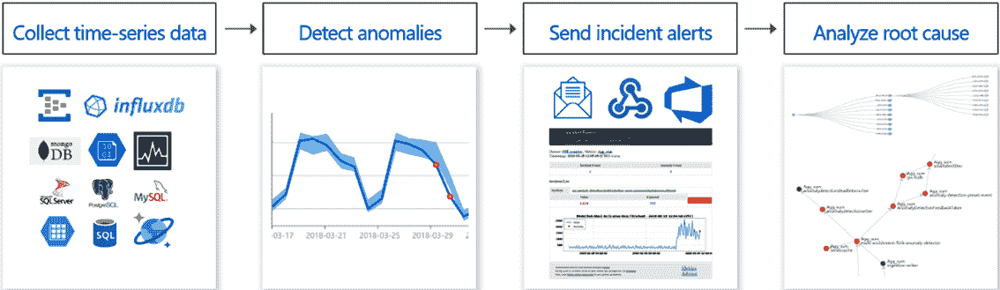
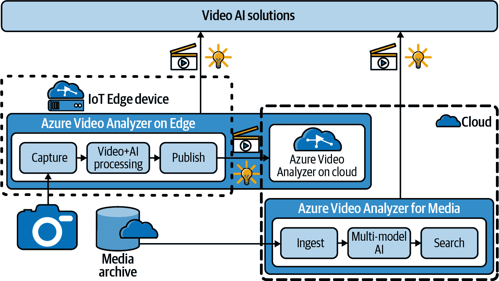
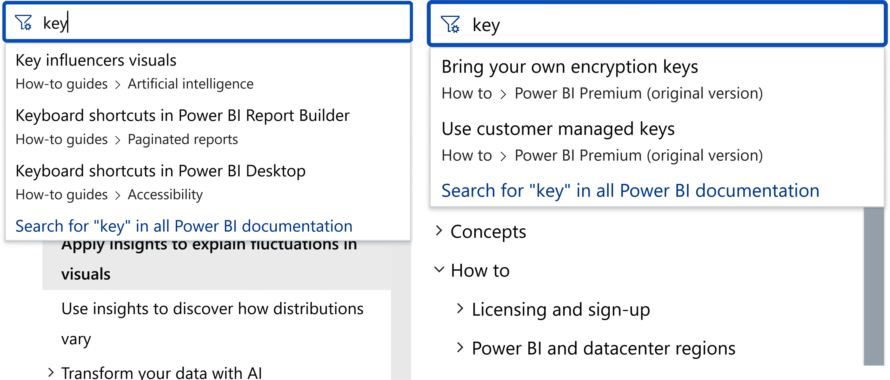
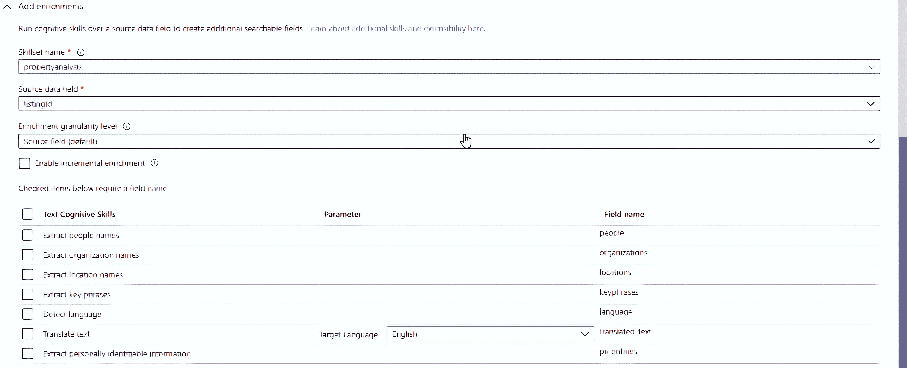
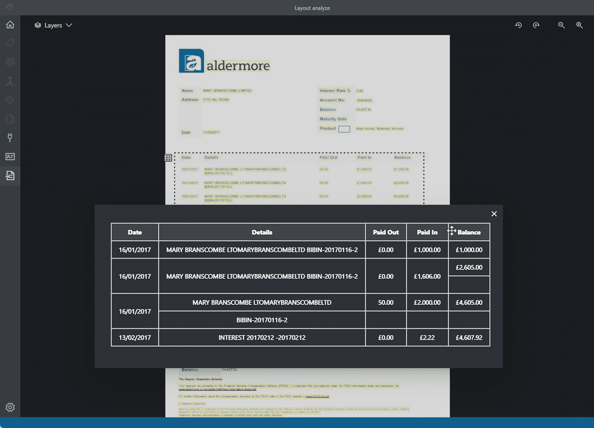
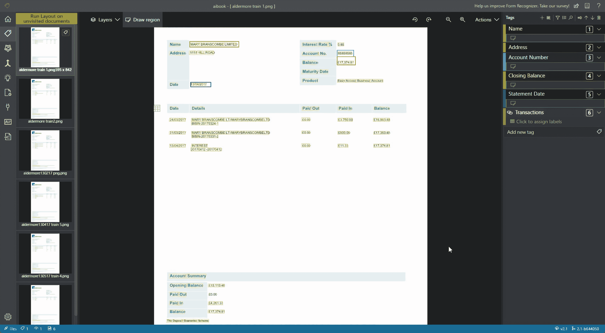
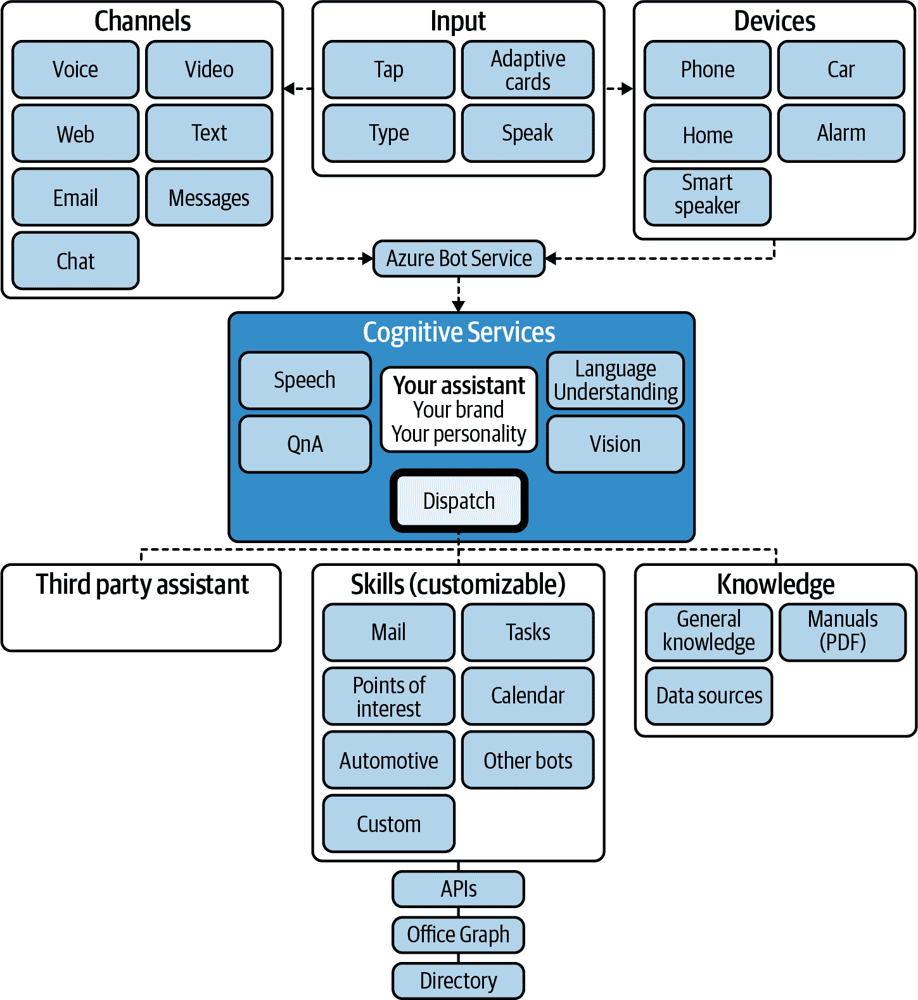
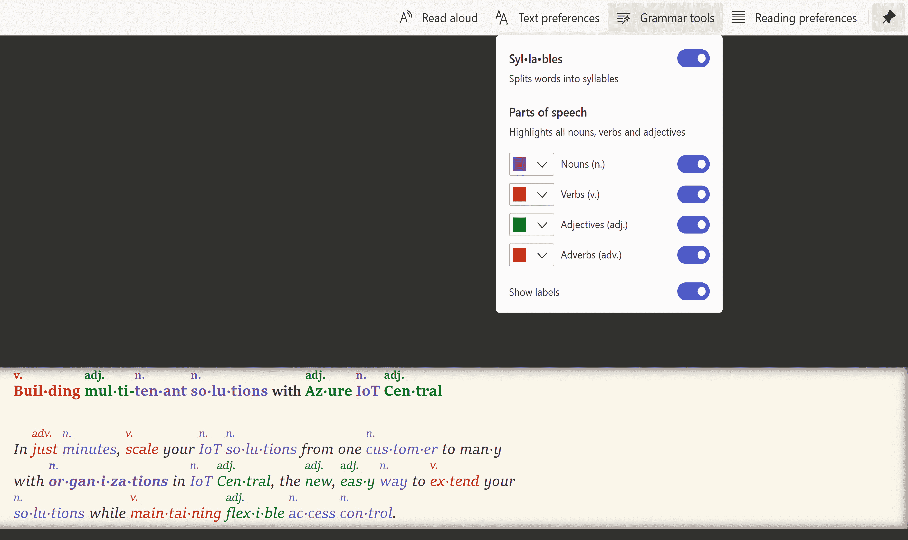
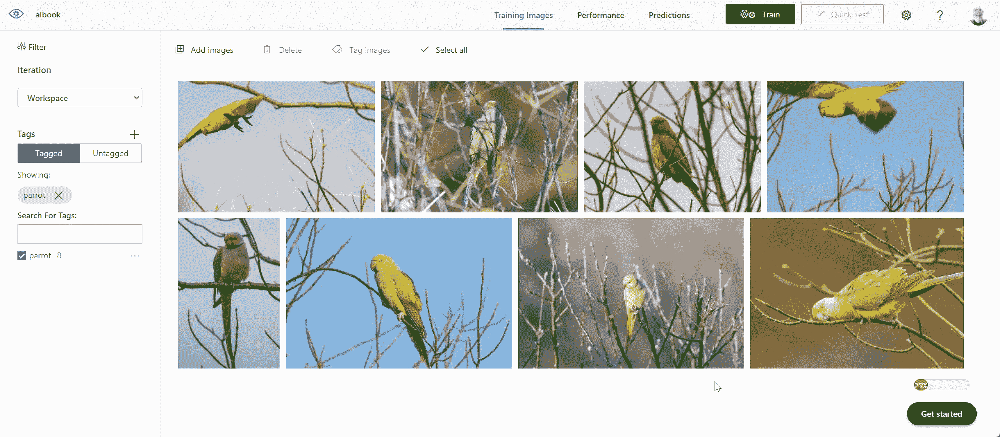
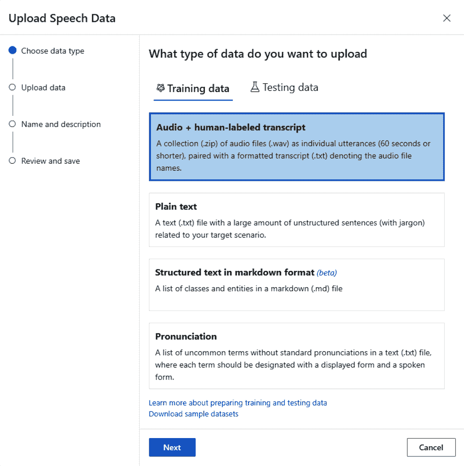

# 第五章：使用 Azure 应用 AI 服务处理常见场景

在前一章中，我们看了可以用于特定任务的各个认知服务。现在，我们将专注于涵盖从文档或视频中提取信息等常见场景的高级应用 AI 服务。

# Azure 应用 AI 服务

单个认知服务功能强大，但通常您会希望结合多个认知服务来处理更广泛的情景。如果您正在制作聊天机器人，您可能会从 QnA Maker 开始，然后使用 LUIS 使机器人更好地理解用户试图实现的目标，并使用语音服务使人们能够与您的机器人交谈和输入。由于这是一个非常流行的业务场景，微软建立了 Azure Bot Service 作为一个集成环境，将所有这些工具汇集在一起。

机器人服务是 Azure 应用 AI 服务之一，它基于核心认知服务，无论是结合多个服务还是将业务逻辑和 UI 包装在单个服务周围以处理常见的业务问题。

例如，Azure Metrics Advisor 基于异常检测器 API 构建，并提供一个基于 Web 的工作空间，简化了从多个来源摄取数据和配置设置（例如您希望模型对异常值敏感程度如何），以及构建解释不同指标如何相互关联的图表。正如您在 图 5-1 中所看到的，它还将异常分组及根本原因分析建议与其他细节整合到一个事件中，您可以深入研究图表和数据树以进行自己的分析。这样可以更容易地看到指标的情况，在出现异常时，以及您应该采取什么措施；您还可以设置通知，以通知相关工程、服务或业务团队。



###### 图 5-1\. 虽然使用异常检测器 API，但 Metrics Advisor 将认知服务 API 与业务逻辑结合在一起，并将其呈现在 Web 工作空间内

您可以将数据点标记为正常或异常，以训练模型，因为它会为您提供建议；您还可以标记趋势变化的拐点，注意时间序列数据的季节性（夏季和冬季的可接受温度水平或交付延迟可能非常不同），并对多个连续点进行反馈，以便在只能在其周围的点的上下文中看到异常的情况下处理。

你可以使用 Azure 度量顾问分析时间序列数据，非常适合跟踪业务指标、物联网监控或任何类型的 AIOps；你可以在问题发生时发现问题并防止停机或设备损坏。三星使用度量顾问来监控其智能电视服务的健康状况。通过多变量分析，你可以监控多个系统和数据源，覆盖像智能建筑这样的复杂场景，你可能需要包括温度、房间占用率以及不同的供暖和冷却系统，以了解异常低的电力使用是否意味着存在问题。

除了度量顾问门户网站，你还可以使用 REST API 查看所有这些信息，这可以与现有的分析工具或业务应用程序集成，比如你为利益相关者建立的关键绩效指标仪表板。

###### 警告

在撰写本文时，表格识别器是唯一可以在边缘设备或自己的服务器上运行的应用 AI 服务，如果你有无法存储在云端的文件，或者需要在网络连接差的地方处理文件。

## Azure 视频分析器

你可以从视频中提取大量信息。如果你有一个拥有成千上万资产的视频库，使用 Azure 视频分析器可以提取元数据进行索引或控制播放；使用面部、情绪和口头语言来使你的视频可搜索；或者使用索引来触发自动化操作。将所有这些整合在一起，你可以处理多个小时的视频，涵盖十几个主题，提取人物和主题，添加字幕，并在其他内容旁边放置链接，从而帮助解释视频中的内容。

洞察力以层次结构呈现，从汇总开始，显示了为视频和音频发现的洞察力（如面部、情绪、情感、品牌、主题或关键词），以及它们在视频中发生的时间码。随着深入挖掘，你可以通过查询不同的洞察力维度获得更详细的信息，例如从识别的语音中提取的转录、视频中出现的个人名单，甚至是视频中显示的 OCR 信息。

洞察力可以涵盖视频、音频或两者。视频洞察力可以检测人物并在每一帧周围绘制边界框以帮助追踪他们，在检测和分组面孔后提取缩略图图像，识别名人或为其训练的自定义面部模型，识别物体和动作，并进行 OCR 文本。你可以利用检测到的人员信息进行趋势分析（了解客户在商店中移动的方式或他们在结账队列中等待的时间长短），或者帮助分析事故或抢劫等关键事件。

视频制作中还有一些特定的见解：识别节目的开头或结尾片头，检测关键帧和空白帧，并标记组成视频的场景和镜头。

音频见解可以清理嘈杂的音频，检测语言并转录音频（可以使用自定义语言模型），翻译转录文本或将其转换为字幕，检测如鼓掌（或沉默）等声音以及情绪（基于语音和其他音频提示），或者识别谁说了哪些话并生成每个人说话频率的统计数据。视频分析器还可以检测非语音的音频效果：警报声、玻璃破碎声、狗叫声等。

结合的见解从屏幕上显示的语音和文本中提取关键词、品牌和情感，并列出视频转录中涵盖的主要主题。

###### 提示

在这个[GitHub 存储库](https://go.microsoft.com/fwlink/?linkid=2190161)中找到一个预构建的解决方案，它使用 Video Analyzer、Azure Machine Learning 的数据标记 AutoML Vision 解决方案、认知服务和 Azure Functions 创建自定义视频搜索：它已经训练好可以识别狗的品种，但您也可以使用自己的自定义视觉模型。

在需要执行工作场所安全、管理视觉检查或优化流程（如在机场登机口周转飞机）的工业场景中，Azure Video Analyzer 使您能够构建智能视频应用程序，集成物联网解决方案（使用 IoT Edge 模块和您可以在图 5-2 中看到的架构）和视频分析，无需建立和运行实时视频管道的复杂性。



###### 图 5-2\. Azure Video Analyzer 将 IoT 边缘与云 AI 服务结合起来，帮助您理解空间内发生的情况

当飞机降落时，机场工作人员必须协调将乘客和行李从飞机上卸下，并连接到本地电源，进行飞机清洁、安全检查、加油、补给餐饮、以及为出港航班装载货物、行李和乘客。通过视频分析跟踪这些工作意味着机场团队可以知道飞机周转是否比平常花费更长时间，因此他们可以分配更多工作人员或者警告航空公司可能存在的延误，甚至在问题发生时检测到安全问题。视频分析器还可以生成指标以跟踪时间内的绩效表现。

您可以分析现有的闭路电视和 RTSP（实时流媒体传输协议）IP 摄像机的实时或录制视频；如果您处理实时视频，可以在边缘处进行高延迟处理，或在边缘上记录相关视频片段以适应带宽有限的部署。视频分析使用认知服务定制视觉和空间分析 API，以及您自己的定制模型，用于检测和跟踪人员和物体，当物体越过某条线时触发事件或通知，识别和加标语音，并从这些转录中挖掘见解，帮助您理解发生了什么。

您还可以通过插入[视频分析器播放器小部件](https://go.microsoft.com/fwlink/?linkid=2190275)在 Power BI 中查看视频和分析结果，该小部件通过 REST 调用您的视频分析器端点。您可以从视频分析器门户获取嵌入代码，选择仪表板，小部件设置，并向下滚动至选项 2 - 使用 HTML；添加您自己的令牌，并将其作为 Web 内容瓦片插入 Power BI 仪表板中。

## 认知搜索

员工仍然平均每年花费两周的时间查找信息，企业文件搜索很少像网络搜索引擎那样有效。通过使用机器学习来丰富您想要索引和搜索的非结构化文档，提取结构，转换信息并添加元数据，您可以使文档搜索功能更强大。这使您可以根据文档中提到的人员或组织对文档进行分类，或使用文本搜索图像中的对象。新字段被添加到源文档中，通过例如实体关系对它们进行丰富。将大量文档转化为信息图，通过其中提到的人员、产品和其他实体进行链接，您不仅仅可以查找文档，还可以更轻松地理解文档内容及其彼此之间的关系。

Azure 认知搜索是基于高效、广泛使用的“最佳匹配 25”算法构建的全文、基于关键字的搜索引擎：非常适合关键字，但在查找“如何在 Exchange 中添加用户”或“如何预订假期时间”等自然语言查询最匹配文档时效果不佳，因为很多不相关文档也包含这些关键字。因此，它还使用语义搜索，利用大型基于转换器的语言模型（与 Bing 使用的技术相同）。语义排序将最符合搜索词意义的文档排在搜索结果的顶部，语义答案从顶部文档中提取相关部分，根据其回答查询的效果对它们进行排名，并从可能很长的文档中提取最佳匹配并突出显示在结果的顶部，语义标题使用机器阅读理解突出显示搜索结果中包含的相关词或短语的预览中。

语义搜索支持 Microsoft 文档中的搜索功能，根据相关概念群集重新排列顶部结果，因此您可以从所有关于特定产品或主题的文档中看到一些非常相关的结果。在 图 5-3 中，您可以看到当您在阅读可视化工具或管理员控制台相关内容时，搜索具有多重含义的常见词语建议非常不同的页面。

认知搜索可以处理 PDF、PowerPoint、Word 文档、JPEG、CSV 和文本文件以及其他业务文档，从多个来源提取数据，包括 SharePoint Online 索引器、Azure Files 索引器，或通过使用 Power Query 连接器。它使用认知服务 OCR API 从图像中提取文本，并使用文本分析 API 提取关键短语，并检测位置、人员和组织。它还包括自动完成和拼写校正、地理空间搜索以及分面，这些功能为结果添加类别和过滤器。



###### 图 5-3\. 在认知搜索中的语义排名功能建议，如果您在阅读有关用户功能时搜索“关键词”，则找到有关使用 Power BI 的文档，但如果您在查看管理员文档时查找有关身份验证密钥的信息。

有 .NET、Java、Python 和 JavaScript 的 SDK，或者您可以通过用于索引、查询和 AI 丰富化的 API 使用认知搜索。以下是查询中的关键属性：

queryType

设置为“语义”以进行语义排名和回答，“简单”或“完整”。

searchFields

对要应用语义排名的字段的有序列表。首先放置标题或任何摘要字段，然后是 URL、文档正文和任何其他字段。

queryLanguage

写作时，“en-us” 是唯一支持的值，但这将允许多种语言。

speller

设置为“词典”以在查询项上进行拼写校正或“无”。

answers

设置为“抽取”以进行语义答案和标题或“无”。

假设您希望突出显示关于“模拟游戏”的创建者的一些信息，该游戏旨在测试计算机是否表现出智能行为：阿兰·图灵。以下是用于获取语义排名结果（指定要排名的字段）、语义答案和标题以及自动更正原始查询中的任何拼写错误的查询：

```
POST https://[service name].search.windows.net/indexes/[index name]
    /docs/search?api-version=2020-06-30-preview 
Your POST will need a JSON body with the query details:
{  
   "search": " Where was Alan Turing born?",  
   "queryType": "semantic", 
   "searchFields": "title,url,body", 
   "queryLanguage": "en-us", 
   "speller": "lexicon",
   "answers": "extractive" 
}
```

响应以 JSON 形式返回，可供您的应用程序使用。这里我们展示了搜索阿兰·图灵出生地的响应：

```
{
  "@search.answers": [
    {
      "key": "a1234",        
      "text": "Turing was born in Maida Vale, London, while his father, Julius…",
      "highlights": " Turing was born in <strong>
      Maida Vale, London</strong> , while …",
      "score": 0.87802511
    }
  ],
  "value": [
    {
      "@search.score": 51.64714,
      "@search.rerankerScore": 1.9928148165345192,
      "@search.captions": [
        {
          "text": " Alan Mathison Turing, (born June 23, 1912, 
               London, England—died June 7, 1954…",
          "highlights": " Alan Mathison Turing, (born June 23, 1912,
               <strong/>London, England</strong>—died June…",
            }
      ],
      "id": "b5678",
      "body": "…"
    },
    … 
  ]
}
```

认知搜索不仅仅是智能查询结果的关键：您还可以通过使用文本翻译等认知服务或通过 Web API 自定义技能接口调用另一个应用 AI 服务（如表单识别器）来增强要搜索的内容。如图 5-4 所示，使用 Azure 机器学习编写自定义技能应用程序作为 HTTP 触发器，每当索引新文档时，您都可以自动创建翻译并将其索引化。



###### 图 5-4。您可以在创建索引或稍后连接时将 Azure 认知搜索的认知技能添加到其中

###### 提示

Microsoft 建立了[JFK 文件](https://go.microsoft.com/fwlink/?linkid=2190276)，作为从多种格式的大量数据中提取信息的示例。但是，如果您现在开始像那样的项目，您可能希望在技能中使用第四章中的 OpenAI 服务来提出比 JFK 文件当前支持的更复杂的问题。

## Azure 表单识别器

几乎每个组织都必须处理客户、员工或供应商填写的表格。如果您希望自动化这些流程，您需要能够从可能是打印或手写的纸质表单中提取信息，以便将其存储在数据库中并用于触发工作流程。如果您有像合同和保险报价这样的法律和财务文件，则通常包含您需要提取的数据表。即使它们不是表单，Azure 表单识别器也可以处理 70 多种语言的这两种情况。

在下一章中，我们将展示业务用户如何通过 Power 平台中的 AI Builder 功能使用同一服务，这里称为表单处理，但开发人员也可以通过调用 Form Recognizer REST API 或客户端库 SDK（如 C＃，Java，JavaScript 和 Python）将文档处理集成到他们自己的应用程序中。您还可以使用 API 和 SDK 来训练自定义模型，并在 Logic Apps、Microsoft Power Automate 和 Microsoft Power Apps 中使用连接器。

表单识别器使用认知服务 OCR、文本分析和自定义文本 API 来查找表单和表格中的字段，并提取每个字段中的文本或手写文本作为键值对，因此它可以识别护照上的姓名字段和显示的姓名。

Form Recognizer 提供了预构建模型，用于发票、销售收据、名片和身份证，或者您可以自行训练自定义模型，以提取文本和布局信息。这样，您可以忽略发货表单顶部的地址和送货细节、表格上的标题以及底部的模板信息，只提取您需要的字段，如发票编号、提供的项目和价格。

###### Tip

使用 Form Recognizer 示例工具可以尝试预构建、布局和自定义模型。您可以通过 Form OCR 测试工具[此处](https://fott-2-1.azurewebsites.net)或者在 Docker 容器中使用以下命令来试用：

```
docker pull mcr.microsoft.com/azure-cognitive-services
  /custom-form/labeltool:latest-2.1

```

工具的代码也可以通过[OCR Form Tools](https://github.com/microsoft/OCR-Form-Tools)获取。要使用该工具，您需要在 Azure 门户中配置 Form Recognizer 资源，并复制 API 密钥和终结点到相应字段中。如果要训练模型，您还需要 Azure Blob 存储用于训练文档（或者如果在容器中运行工具，则可以使用本地存储）。选择要处理的文件，您将看到提取的字段、表格和文本的预览，并使用高亮显示显示它们在表单上的位置。您可以将 JSON 输出下载为文件。如果需要本地处理文档，还可以在容器中部署 Form Recognizer 服务。

对于文档，Form Recognizer 提取包括具有合并单元格或无可见边框的复杂表格在内的表格、复选框和类似的标记，以及文档的文本和结构。您可以在图 5-5 中查看数据的外观。

预构建模型可以从不同类型的表单中提取重要信息：名片模型查找姓名、职位、地址、电子邮件、公司和电话号码；官方身份证模型查找身份证号码、姓名、国家到期日期和出生日期，但在收据上提取所有文本、时间和日期、商户信息、项目明细、销售税和总数。发票模型也提取所有文本，并查找如发票编号、客户详细信息、供应商详细信息、发货地址、账单地址、总额、税费、小计和项目明细等字段，因为可能包含合同条款或其他重要细节。您可以使用 FormRecognizerClient 调用这些模型，返回包含 RecognizedForm、FormPage、documentResults 和 pageResults 部分的 JSON 输出。



###### 图 5-5\. Forms Recognizer 可以检测文档中的表格和字段；这是预构建模型自动从银行对账单中提取交易表格。

首先安装 Form Recognizer 客户端：

```
pip install azure-ai-formrecognizer
```

接下来，设置你的端点和订阅密钥的变量。现在你可以调用 FormRecognizerClient，使用定制模型、预训练收据模型，或者使用默认识别设置而不使用特定模型。

下面的代码片段登录到一个端点，并尝试识别上传收据中的内容：

```
form_recognizer_client = FormRecognizerClient(endpoint, AzureKeyCredential(key))
receiptUrl = *"URL TO A RECEIPT IMAGE"*

poller = form_recognizer_client.begin_recognize_receipts_from_url(receiptUrl)
result = poller.result()

for receipt in result:
  for name, field in receipt.fields.items():
    if name == "Items":
      print("Receipt Items:")
      for idx, items in enumerate(field.value):
        print("...Item #{}".format(idx + 1))
        for item_name, item in items.value.items():
          print("......{}: {} has confidence {}".format(item_name, item.value, 
          item.confidence))
    else:
      print("{}: {} has confidence {}".format(name, field.value, 
      field.confidence))
```

###### 警告

表单可以是 JPG、PNG、PDF 或 TIFF 文件；在文本 PDF 中获得最佳结果，但表单识别器可以扫描图像和 PDF 中的 OCR 文本和手写文字。文件大小必须小于 50 MB，页面尺寸不能大于 A3，图像至少为 50 × 50 像素，但不能大于 10,000 × 10,000 像素，长文档只会扫描前 200 页。

如果你有特定的表单类型要处理，你可以用至少五个样本（和另一个用于测试的示例）训练一个定制模型。你可以使用表单识别示例工具中的图形界面，或者使用 FormTrainingClient 通过 REST API 调用。

下面的代码片段将在存储在 Azure 存储账户中的表单图像上训练一个识别器模型：

```
trainingDataUrl = "PASTE_YOUR_SAS_URL_OF_YOUR_FORM_FOLDER_IN_BLOB_STORAGE_HERE"
poller = form_training_client.begin_training(trainingDataUrl, 
         use_training_labels=False)
model = poller.result()
print("Model ID: {}".format(model.model_id))
print("Status: {}".format(model.status))
print("Training started on: {}".format(model.training_started_on))
print("Training completed on: {}".format(model.training_completed_on))
print("\nRecognized fields:")
for submodel in model.submodels:
  print(
    "The submodel with form type '{}' has recognized the following fields: 
    {}".format(
      submodel.form_type,
      ", ".join(
        [
          field.label if field.label else name
          for name, field in submodel.fields.items()
        ]
      ),
    )
  )

# Training result information
for doc in model.training_documents:
  print("Document name: {}".format(doc.name))
  print("Document status: {}".format(doc.status))
  print("Document page count: {}".format(doc.page_count))
  print("Document errors: {}".format(doc.errors))
```

在训练时，你不一定需要为你的表单进行标记；表单识别器使用无监督学习来理解布局，并检测字段和条目之间的关系。对于许多表单，这将产生足够好的结果。

如果你有更复杂的布局，或者字段没有 Form Recognizer 可以使用的名称（因此它没有键来分配这些值），你可以在标记的表单上进行训练；同样，你需要五个相同类型、相同结构的标记表单。表单识别器仍然会学习表单本身的布局，但会使用你的标签来识别字段和表格。

要在表单识别示例工具中尝试此功能，请创建一个新的自定义项目（你需要包含训练数据的 Azure Blob 存储容器的详细信息，以及你的 Form Recognizer 端点用于连接设置）。在左侧窗格中选择 Tags Editor 图标，这样你就可以看到表单列表（你可以在图 5-6 中看到这一点）。这将提取文档的文本和表格布局信息，并在文本元素周围绘制边界框。点击表格/网格图标，预览提取的任何表格信息。



###### 在表单识别示例工具中，标记你的示例表单中的字段和表格。

在右侧的标签编辑窗格中为要提取的每个字段的键值对创建标签（可以为每个标签设置格式和数据类型）。您还可以为表格创建标签（即使它们没有表格布局）：点击“添加新表格标签”图标，然后选择表格的行数是固定还是可变以及标签是在行还是列上。使用格式和数据类型标记表格中的各个字段。

然后在中间的主编辑窗格中选择要应用标签的文本元素或表格单元格以及在标签编辑窗格中要使用的标签。如果字段有标签，请勿包含该标签：只需包含字段中的内容。如果训练表单上有空字段，有时会填写，请将其标记为标签。

从窗口左侧的工具栏中选择“训练”图标，然后单击“训练”以训练您的自定义模型。完成后，请检查平均准确度和置信度值；如果值较低，您可以标记更多文档并重新训练模型。您还可以在工具栏中单击“分析”图标，以在表单上尝试您的模型（但不要使用您训练过的表单之一）。

###### 提示

如果您对类似表单的不同布局有多种不同的布局——来自不同供应商的发票或不同服务的运输标签——您可以为每个自定义模型（带标签）进行训练，并将它们分配给一个组合模型。这样，您可以通过单个模型 ID 调用它们所有，并且表单识别器运行分类器来选择当前表单使用的模型。

## Azure 机器人服务

Azure 机器人服务汇集了构建、测试、部署和管理自定义聊天机器人（具有对话界面的 Web 应用程序）的所有不同工具和服务，可以连接一个或多个渠道：可以是 Facebook、Teams，在您的网站上嵌入，用于呼叫中心，或通过 Alexa 或 Google Assistant 作为服务公开。查看在图 5-7 中如何完美结合。

您可以使用 Microsoft Bot Framework SDK 或 Bot Framework Composer 创建机器人，后者是一个具有视觉设计界面的 IDE，可在 Windows、macOS 或 Linux 上运行（或作为 Web 应用程序在云中运行），并允许您直接发布机器人。您可以通过在 Bot Framework Composer 的画布上拖动动作并按照提示与认知服务集成来开始构建机器人，或者创建 Power Virtual Agents，然后通过 SDK 进行扩展。您甚至可以将 Power Virtual Agent 主题作为 Bot Framework Composer 中构建的机器人的 Bot Framework 技能使用。



###### 图 5-7\. 组成会话型 AI 体验的组件

Bot 服务简化了使用认知服务如 Speech、QnA Maker、语言理解和视觉在机器人中的应用，从而您可以处理更复杂的输入并更好地理解用户需求。您可以通过 Composer 中的包管理器选择 Bot 框架的技能和组件，或者发布您自己的组件到 NuGet 和 npm，或者作为私有订阅集成到您组织中构建的其他机器人中。

您可以使用 Bot Framework Analytics 跟踪机器人的健康状态和行为，这些使用 Application Insights 查询和 Power BI 仪表盘。

如果您之前没有构建过机器人，Bot Framework Composer 包含了 QnA 机器人、管理日历的机器人模板，或者包含多种能力的全功能企业助理机器人模板。或者您可以使用开源的 [Virtual Assistant](https://go.microsoft.com/fwlink/?linkid=2190163) 项目模板，用于 C＃ 和 TypeScript，其中包含业务逻辑和处理用户请求。

## Immersive Reader

密集复杂的文档可能难以理解。一些人需要更大的字体或更好的对比度来快速在屏幕上阅读。使用与 Edge、Teams 和 Word 中相同的辅助工具，可以使您自己的托管文档应用程序更易于阅读。Immersive Reader 可以以多种语言大声朗读内容，将其翻译成更多语言（超过 60 种），或者使用高亮显示和颜色聚焦注意力以隔离内容并使其更易读。您可以查看 Edge 浏览器如何集成 Immersive Reader 的示例在 Figure 5-8。



###### 图 5-8\. Edge 中的阅读模式使用 Immersive Reader 减少干扰，使专注于文本变得更加容易，还可以进行颜色编码以显示语法，甚至可以翻译成不同的语言。

Immersive Reader JavaScript 库是一个 Web 应用程序，您可以将其作为 iframe 集成到 C＃、JavaScript、Kotlin、Java（Android）或 Swift 应用程序中；您还需要构建一个按钮来关闭 Immersive Reader UI 并配置 Azure AD 身份验证。该服务解析带有 ID 标签的 HTML 文档。

（虽然我们在本书中的其他示例中使用了 Python，但在这里我们使用 JavaScript 来配合 Immersive Reader SDK。）

您可以直接在 Web 应用程序中使用 SDK，或者通过 npm 或 Yarn 加载它用于 Node.js 应用程序。

在网页中，使用以下行加载库：

```
<script type='text/javascript' 
  src='https://contentstorage.onenote.office.net/onenoteltir
  /immersivereadersdk/immersive-reader-sdk.1.1.0.js'></script>
```

要在您的网页中使用库，添加一个 HTML 元素来加载 Immersive Reader 启动按钮。这将调用 SDK。您可以编写文档对象模型解析代码以处理页面上的现有内容，或者从其他来源分块加载内容。您的内容需要是一个内容字符串：

```
<div class='immersive-reader-button' onclick='launchImmersiveReader()'></div>
```

这会启动以下功能以在沉浸式阅读器中显示一些文本。您需要传递认证令牌和服务端点的 URL 以及一些内容：

```
function launchImmersiveReader() {
  const content = {
    title: 'Immersive Reader',
    chunks: [ {
      content: 'This is Immersive Reader in action.'
    } ]
  };
  ImmersiveReader.launchAsync(*YOUR_TOKEN*, *YOUR_SUBDOMAIN*, content);
}
```

# 使用迁移学习在几分钟内训练视觉、语音和语言模型。

许多认知服务 API 和部分应用 AI 服务在配置资源后即可使用；另一些服务可以通过使用自有数据进行训练来改进。你可以在 LUIS 中使用预建立的领域和词典，如音乐或日历条目，并且服务会从用户询问的内容中学习。但你也可以构建自定义词典，覆盖用户可能谈论的实体、他们希望完成的任务以及他们可能表达意图的方式。同样，你可以告诉 Microsoft Translator 有关你业务中使用的产品名称和术语，以使翻译更加实用，或者训练 Form Recognizer 服务识别你经常使用的表单布局。

对于视觉和语音识别，你可以训练一个定制模型。这利用迁移学习，采用已经通过大规模训练集学习的深度神经网络模型，然后去掉一个或多个最终层，这些层用于输出预测或分类，替换为针对你特定任务训练的新层。这样，你可以利用大规模训练的大模型，并用相对较少的数据快速调整以解决你的问题。

## 创建定制视觉模型。

如果你需要识别图片，比如你公司生产的产品范围及其可能遭受的损坏类型，或者你希望即使公司标志歪斜在卡车侧面也能找到，标准的图片标记服务可能不够精确。

计算机视觉 API 无法区分受特定疾病感染的叶子与未充分浇水的植物叶子，或受精的鸡蛋中的健康卵囊与发育不正常的卵。它也无法检测电路板是否正确焊接，或者处理工业过程中产生的泡沫量是否适合农业用水。

定制视觉服务允许您基于一小组标记图像构建自定义分类器，显示确切的对象、条件和概念。您可以用它处理客户发送的图像，将其与廉价摄像机配对，以替代或补充如分光计之类的昂贵设备，将模型导出到智能手机以为员工提供即点即答的应用程序，或使用容器将训练模型嵌入无人机或智能摄像头中进行实时识别。

自定义视觉使用迁移学习，从多层预训练的 ResNet 模型中移除一些最终层，专门用于特定领域（食品、地标、零售、成人或一般图像识别分类器），然后重新训练您上传并标记对象或场景的少量图像。为了获得最佳结果，您的训练集可以仅包括 30 到 50 张图像，最好涵盖不同的摄像机角度、光照和背景变化，物体大小的多样性，以及单个和分组主题。如果相机角度固定，请标记始终在镜头中的常见物体，如背景中的设备。

您可以创建多个模型并层叠它们以改善易混淆类别的区分度（如西红柿和甜椒或三明治和蛋糕层）。您可以构建用于检测对象或对其进行分类的模型，并将图像分类为单一类别（多类别分类）或应用与图像匹配的多个标签（多标签分类）。通过[自定义视觉门户](https://www.customvision.ai)（如图 5-9 所示），或者通过代码上传图像。



###### 图 5-9. 自定义视觉门户使得上传和标记训练图像变得轻松

通过设置概率阈值滑块来调整何时认为预测是正确的。将阈值设置高有利于精确度而不是召回率（分类会正确，但找到的数量较少）；将其设置低有利于召回率，因此大多数分类将被找到，但可能会有误报。尝试不同设置，并使用最适合您项目的阈值作为从模型检索结果时的过滤器。

###### 警告

我们在第七章中看到的负责任人工智能考虑事项可能最适用于图像识别，特别是面部识别和空间分析。重要的是要有一个平衡的数据集，涵盖您想要分类的对象范围，不要引入任何虚假的相关性（例如将尺子或硬币放置以显示比例），否则您的自定义模型将表现不佳。我们在第八章中更详细地讨论这一点，作为机器学习最佳实践的一部分，还包括理解训练性能和实现准确可靠的结果。

对于具有挑战性数据集或需要非常精细分类的情况，门户中的高级训练选项允许您指定自定义视觉服务在训练模型时要花费的时间长短。一旦您对模型的准确性感到满意，您可以从门户的性能选项卡将其发布为预测 API，并获取预测 URL 和预测密钥以在您的代码中调用。

以下代码片段展示了如何构建自定义视觉模型，首先标记和上传数据，然后进行训练。训练完成后，模型可以发布并用于分类图像。一旦您在 Azure 门户中使用自定义视觉创建资源，首先导入自定义视觉库：

```
pip install azure-cognitiveservices-vision-customvision
```

这将使您能够向您的代码添加特定的库，用于训练和预测。在将它们添加到代码之前，您需要从门户获取各种密钥和终结点详细信息。

自定义视觉服务的大部分功能可以通过编程方式处理，例如创建您的训练项目：

```
publish_iteration_name = "classifyModel"
credentials = ApiKeyCredentials(in_headers={"*Training-key*": training_key})
trainer = CustomVisionTrainingClient(*ENDPOINT*, *credentials*)
# Create a new project
print ("Creating project...")
project_name = uuid.uuid4()
project = trainer.create_project(project_name)
```

现在可以将您的训练标签添加到项目中。我们将构建一个能够区分空客飞机和波音飞机的模型：

```
jumbo_tag = trainer.create_tag(project.id, "Boeing 747")
superjumbo_tag = trainer.create_tag(project.id, "Airbus A380")
```

每个标签都需要一组训练图像，每次上传最多 64 张图像：

```
base_image_location = os.path.join (os.path.dirname(__file__), "Images")

print("Adding images...")

image_list = []

for image_num in range(1, 11):
  file_name = "jumbo_{}.jpg".format(image_num)
  with open(os.path.join (base_image_location, "Boeing 747", file_name), "rb") 
  as image_contents:
    image_list.append(ImageFileCreateEntry(name=file_name, 
    contents=image_contents.read(), tag_ids=[jumbo_tag.id]))

for image_num in range(1, 11):
  file_name = "superjumbo_{}.jpg".format(image_num)
  with open(os.path.join (base_image_location, "Airbus A380", file_name), "rb") 
  as image_contents:
    image_list.append(ImageFileCreateEntry(name=file_name, 
    contents=image_contents.read(), tag_ids=[superjumbo_tag.id]))

upload_result = trainer.create_images_from_files(project.id, 
  ImageFileCreateBatch(images=image_list))
if not upload_result.is_batch_successful:
  print("Image batch upload failed.")
  for image in upload_result.images:
    print("Image status: ", image.status)
  exit(-1)
```

接下来，我们训练模型。这可能需要一些时间来运行：

```
print ("Training...")
iteration = trainer.train_project(project.id)
while (iteration.status != "Completed"):
  iteration = trainer.get_iteration(project.id, iteration.id)
  print ("Training status: " + iteration.status)
  print ("Waiting 10 seconds...")
  time.sleep(10)
```

一旦模型训练完成，就可以发布了：

```
trainer.publish_iteration(project.id, iteration.id, publish_iteration_name, 
  prediction_resource_id)
print ("Done!")
```

现在我们可以对模型运行预测，使用飞机的图像来测试其操作：

```
prediction_credentials = 
  ApiKeyCredentials(in_headers={"Prediction-key": prediction_key})
predictor = CustomVisionPredictionClient(ENDPOINT, prediction_credentials)

with open(os.path.join (base_image_location, "Test/test_image.jpg"), "rb") 
  as image_contents:
  results = predictor.classify_image(
    project.id, publish_iteration_name, image_contents.read())

  # Display the results.
  for prediction in results.predictions:
    print("\t" + prediction.tag_name +
       ": {0:.2f}%".format(prediction.probability * 100))
```

所有这些可以构建成一个应用程序，或分成单独的训练和预测应用程序。

在线运行模型的优点是，在更新模型时，无需重建应用程序，但在高延迟可能会引起问题的图像和视频识别情况下，本地部署可能是更好的选择。如果您想将自定义视觉分类器嵌入应用程序以在设备上本地运行它，可以将其导出为适用于 Android 的 TensorFlow、适用于 Web 和使用 JavaScript 框架构建的应用程序的 TensorFlow.js、适用于 iOS 11 的 CoreML、适用于 WinML 的 ONNX 或作为 TensorFlow 模型和从 Python 调用模型所需的服务的 Windows 或 Linux 容器（也可以在 ARM 硬件上运行）。这意味着使用一个紧凑的域可能略低于标准域的精度；如果您一开始没有选择紧凑域，可以转换为它，但您将不得不重新训练模型，因此如果想要离线使用自定义视觉模型，请提前计划。

自定义视觉还支持 Microsoft 的 Vision AI DevKit，这是一个 300 美元的智能摄像头开发和测试平台，拥有部署自定义视觉模型和在网络边缘运行它们所需的所有硬件。

## 创建自定义语音模型

语音识别的一个难点在于人们说话的多种方式。语音风格、韵律、口音和词汇都有所不同，您的领域可能有不寻常的术语，或者您可能需要识别可能会与日常用语混淆的产品名称。语音录制的场所可能会带来额外的挑战；在驾车通道的背景噪音或商场的声学环境或大厦前台的接待处，这些都与某人在手机上说话完全不同。与使用默认语音模型不同，您可以为特定任务构建自定义语音模型。可以利用定制语言模型理解口音或处理特定词汇，这是在现有训练模型基础上的延伸。

###### 提示

您可以使用无代码的 [Speech Studio 可视化环境](https://speech.microsoft.com) 定制 Custom Speech、Custom Commands（用于语音控制应用程序）和 Custom Voice（用于文本转语音）服务，然后使用 Speech SDK、Speech CLI 或 REST API 在您的应用程序中调用它们。

您可以添加声学模型，以考虑各种环境中准确识别的复杂性：在车辆、工厂车间或户外工作时。如果您在一个预期嘈杂环境中使用语音识别 —— 比如在车内使用语音识别，或者使用特定设备可能会以特定方式处理声音 —— 那么肯定需要添加自定义声学模型，而且如果您这样做，您可能想要在容器中本地运行这些模型。您还可以构建自定义语言模型，无论是为了特定的技术词汇还是为了提高对口音语音的识别。

对于训练，您可以上传音频文件，或只需包含行话、技术术语和其他特定于您领域的短语的句子的文本，这些短语可能无法被正确识别。文本训练更快速 —— 几个小时而不是几天 —— 所以从这里开始看是否足以满足您的需求（并非所有 Azure 区域都有专用的音频训练硬件）。为了获得最佳结果，包括使用特定词汇的文本，在不同的句子和上下文中涵盖您期望这些术语被使用的方式。您可以提供高达 1.5 GB 的原始文本数据。

对于音频训练，您需要在与您的代码识别语音的相同条件下录制五个或更多音频文件。这意味着人们在环境中说话，或对着您计划使用的设备说话。您也可以使用此方法来调整语音识别到单一声音，这是转录播客或其他音频来源的有用技术。但如果您想识别多个说话者，则需要录制多种声音的录音：不同的口音、方言、性别和年龄，甚至可能是在一天中不同时间或急于时录制的人的声音，因为压力会影响语音模式。

数据需要以 8 kHz 或 16 kHz 的 WAV 文件格式存在，并使用单声道录音。将它们拆分成 10 到 12 秒的片段以获得最佳结果，并以静音开头和结尾。每个文件需要一个唯一的名称，并且应包含一个单独的话语：查询、名称或简短句子。将文件打包到一个小于 2 GB 的单个压缩文件夹中，然后上传到 Speech Services 网页门户中显示的 图 5-10。



###### 图 5-10\. 在 Speech Studio 中上传语音样本和转录以创建自定义模型。

每个文件都需要以正确格式的转录作为陪伴：文件中的单行文本，以音频文件名开头，然后是一个制表符，再接着是文本内容。上传完毕后，请使用 Speech Services 门户应用自定义语音并选择压缩文件夹作为适应数据。运行导入过程将您的数据添加到 Speech Service 中，这些数据将自动处理。然后，您需要一个数据集来进行测试：其中包括长达五小时的音频和一个人工标记的转录。

语音识别的准确率通常通过词错误率（WER）来衡量。计算模型的所有错误，无论是多加一个不该有的词（插入），少了一个应该有的词（删除），还是识别错误的词（替换），然后除以测试转录中的单词数，再乘以 100 得到比率。如果你希望频繁重新训练模型以提高准确率，请设置一个 CI/CD 工作流来训练和测试模型，以查看 WER 是否有所改善。

###### 提示

使用 [此模板](https://go.microsoft.com/fwlink/?linkid=2190278) 创建一个 DevOps 工作流，以使用 GitHub Actions 训练、测试和发布 Azure 自定义语音模型。

如果您需要在嘈杂的环境中或使用像对讲机这样的低保真设备识别人们在说什么，还可以使用您的数据创建一个自定义声学模型：从 Azure 的基础模型创建一个新模型，一个用于定向语音，一个用于对话语音，并添加您自己的声学数据。自定义声学模型可以与默认语音模型或自定义识别模型配合使用。

一旦您的自定义模型训练完成，部署一个可以在您的代码中调用的自定义端点。

# 总结

在本章中，我们介绍了一些最有用的预构建云 AI 服务，这些服务可以从 Azure 调用（或在您自己的基础设施上的容器中运行部分服务），您可以使用 API 和 SDK 从自己的应用程序中调用这些服务。

但是，你不必成为一个从头开始构建应用程序的开发者才能使用认知服务和应用 AI 服务；其中一些服务也可在微软的无代码和低代码工具中使用，例如 Power Platform 和 Logic Apps。在下一章中，我们将看看业务用户如何与开发者合作或独立操作，利用这些预构建的云 AI 服务进行分析、自动化，并使低代码应用程序更加强大。
