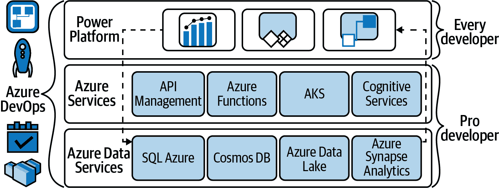
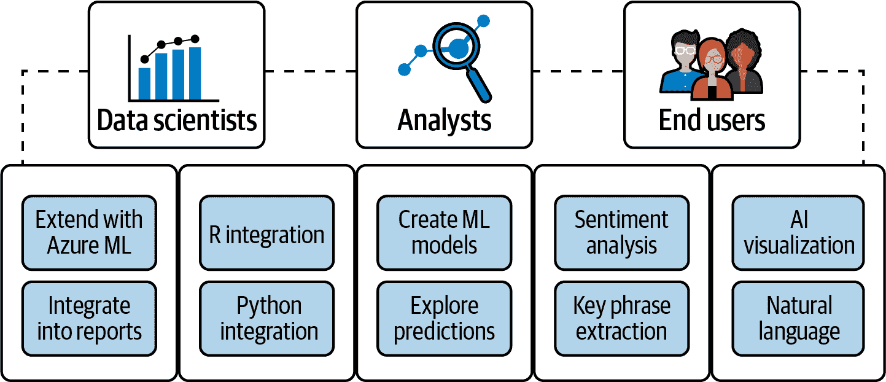
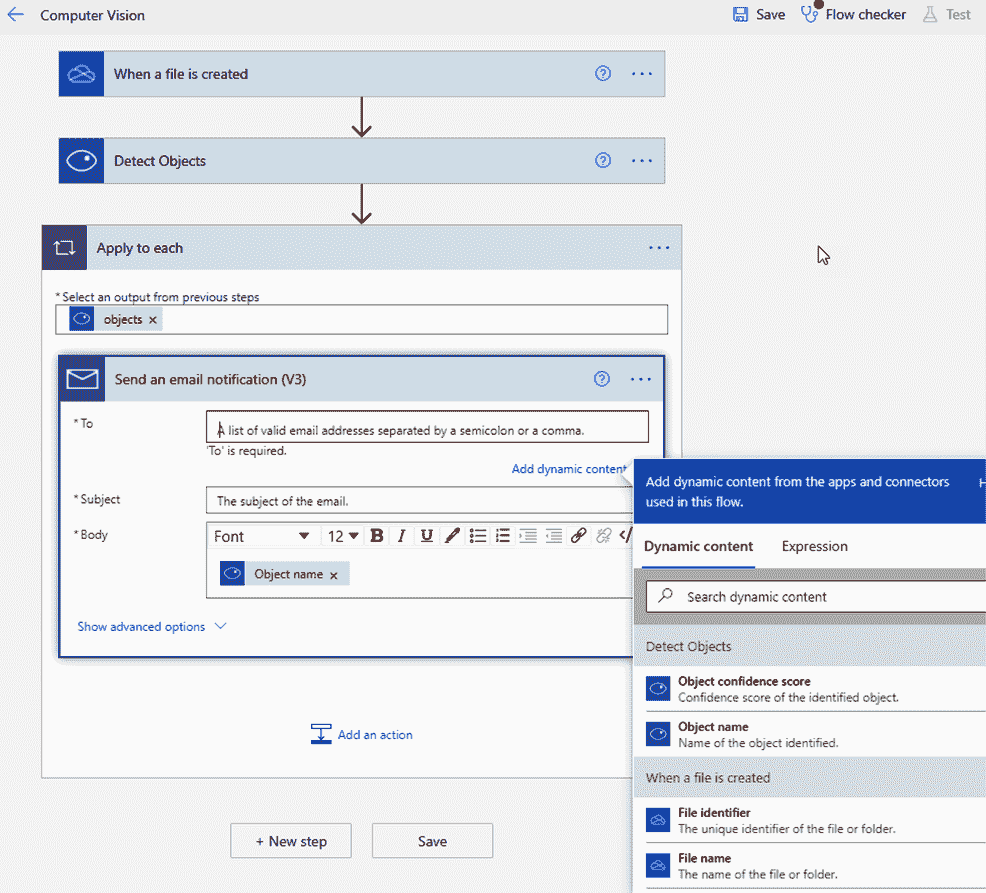

# 第六章：人人都能学机器学习：低代码与无代码体验

云 AI 服务不仅适用于熟悉编写调用 API 的专业开发人员，例如我们在第四章中介绍的认知服务。企业用户和企业开发团队都在采用低代码和无代码工具，这些工具使创建使用云 AI 服务的定制应用程序变得更加简单和快速，就像他们使用存储或任何其他功能一样。在本章中，我们将向您展示如何在 Power 平台和逻辑应用程序中使用 AI。在许多情况下，您仍将使用认知服务；您无需成为经验丰富的开发人员即可利用它们，但我们还将探讨这些开发人员如何将其专业知识带到这些平台上，以帮助企业用户取得更多成就。

###### 注意

在本章中，我们展示了多种使用人工智能功能和服务的方式，这些功能具有重叠的功能。在选择要使用的工具时，请始终考虑您想要实现的目标、您熟悉使用的工具以及您需要从创建的任何 AI 模型中获取结果的位置。如果您需要一个带有可视化图表的报告来帮助人们理解情况并使用数据进行决策，Power BI 是开始的地方，但您在 Power BI 中使用的模型可能是通过该服务或其他地方构建的。Power BI 还具有用于准备和转换数据的工具，这些数据将在其他 Azure 服务中使用。如果您需要一个应用程序或工作流来执行或自动化数据和 AI 可以帮助的操作，请考虑使用 Power Apps 和 Power Automate。当您习惯于使用 Azure 并且您需要使用机器学习的数据未存储在或无法从 Power 平台访问时，逻辑应用程序可能是合适的工具。

# 微软 Power 平台

微软的业务应用服务——Power BI、Power Apps、Power Automate 和 Power Virtual Agents——总称为 Power 平台。Power BI 用于构建仪表板和报告以可视化和分析数据；Power Apps 是一种低代码图形服务，用于构建响应式应用程序；Power Automate 用于工作流和流程自动化（包括桌面应用程序）；Power Virtual Agents 是一个引导式无代码界面，用于创建聊天机器人（使用基于认知服务的 Bot Framework Composer 进行低代码扩展）。

这些无代码和低代码工具构建在 Azure SQL 等 Azure 服务之上，它们可以单独使用或组合使用来分析数据、通过定制应用程序对数据进行操作、自动化业务流程，并以其他方式扩展和定制 Office 365 和 Dynamics 365。正如您在图 6-1 中所看到的，它们还可以通过连接器、控件和其他使用 Azure Functions 等云服务的组件进行扩展，以便经验更丰富的开发人员可以为低代码用户提供更强大的功能。

###### 图 6-1\. Power Platform 服务依赖并与许多其他对不同级别开发人员有用的微软服务集成

不同的 Power Platform 服务利用 Azure AI 服务来处理和丰富数据，包括图像识别、表单处理或文本分类等功能，以为非结构化内容添加结构化标签。

Power BI 广泛使用 AI 功能；内置的 AI 可视化功能使用户能够对数据集进行自然语言查询，识别数据中的异常值和关键影响因素，或帮助用户深入分析根本原因。几种认知服务已集成到 Power BI 中用于数据准备，业务分析师可以直接在 Power BI 中使用自动化机器学习为 Azure Machine Learning 创建机器学习模型。

Power Apps 和 Power Automate 都包括 AI Builder，这是一个类似向导的低代码 AI 平台，用于丰富和分析存储在 Microsoft Dataverse 中的数据，提供预建和自定义 AI 模型。Power Apps 使用与 Azure OpenAI Service 中可用的 Codex 模型相同的模型来根据您想要运行的数据查询的描述生成 DAX 公式。对于那些习惯于使用 API 并进行 Azure 订阅配置的用户，他们可以在 Power Apps 内使用认知服务来处理应用中使用的数据，并且认知服务集成正在 Power Automate 中预览中。

# Power BI 和 AI

AI 是商业智能的天然选择，因为它真正意味着基于数据做出更好的决策，而数据集变得越来越大：来自 Web 分析、社交媒体流、物联网和连接的智能设备的遥测数据，以及熟悉的销售数据。由于有如此多的数据需要处理，商业智能工具不再仅仅以它们提供的数据可视化来评判；这些现在已经是主流，而是通过机器学习提供的高级分析正在区分更强大的商业智能方法。

AI 可以帮助探索数据；它可以自动在大型数据集中发现模式，帮助用户理解数据含义，并预测可能的未来结果。

###### 注意

根据 Gartner 的估计，到 2022 年，40%的机器学习模型开发和评分将在使用机器学习的产品（如 Power BI）中完成，而不是在构建机器学习系统的工具中（*Gartner Analytics and BI Magic Quadrant 2020*）。

这种增强型分析技术将被广泛应用，尽管分析师可能需要时间来开始利用它。但就像可视化使理解数字的重要方面变得更容易一样，数据故事以叙述的方式呈现数据分析的发现，带领人们理解可能复杂的见解，既描述又（理想情况下）解释它们。随着数据讲述变得更加普遍，其中大部分将由先进的分析工具自动创建。

正如您在图 6-2 中所见，Power BI 为不同级别的用户提供了 AI 功能。它已经在数据建模层使用 AI 生成见解（快速见解识别异常值、趋势、相关性、季节性和其他指标），使用自然语言允许用户通过提问查找数据点，并提供可以包含在报告中的 AI 驱动可视化。它甚至可以为您粘贴到 Power BI Web 服务上的数据选择并生成整个报告，包括选择和生成可视化。

###### 图 6-2. Power BI 广泛使用 AI 为多个功能提供支持，并为不同级别的用户提供适当的工具

###### 提示

通过数据流将数据带入 Power BI 在线服务存储在 Azure Data Lake Storage Gen2 中，因此数据科学家和工程师可以直接在 Azure Machine Learning、Azure Databricks 和 Azure SQL Datawarehouse 中使用它，如果 Power BI 中的低代码 AI 功能不符合您的需求。

您还可以调用认知服务来丰富数据，或在数据准备流程的一部分使用预训练和定制的机器学习模型。

## Power BI 中的 AI 可视化

有许多地方可以在 Power BI 中使用 AI，即使您甚至没有意识到，如在表格和散点图中的聚类，通过将相似结果分组来发现数据中的新测量。线形图使用 AI 添加趋势线和预测时间序列。还有特定的 AI 驱动可视化可以添加到报告中。

Q&A 可视化使用自然语言让 Power BI 用户以他们自己的话询问报告中的问题（或使用可视化建议的问题，因为它在数据中发现了这种模式）。报告作者可以管理与数据相关的关键术语，并添加同义词以提高数据集的语言理解能力（这可能是组织内部使用的术语，或者是映射术语，如“区域”和“国家”，如果数据中仅使用一个）。如果这些问题创建了特别有用的可视化，您可以将其添加到报告中以供重复使用。

其他可视化，如分组柱状图，具有分析或洞察按钮，您可以单击这些按钮查看变化的解释，例如特定数字的增加或减少，或查找具有不同分布的数据集的部分。

自动化洞察将所有 Power BI 人工智能功能整合在一起。使用我们在第四章中介绍的 Cognitive Services 代码在 ML.NET 本地运行（参见第三章了解如何利用它来为您的机器学习模型服务），在打开报告时自动运行并显示您需要查看的重要洞察。您还可以单击功能区中的获取洞察按钮，查看当前视觉的任何额外洞察，或将这些 AI 可视化添加到 Power BI 报告封面：

+   关键影响者帮助您理解驱动结果的因素，特别是当您希望比较可能影响指标的因素时。它对您的数据进行推理，排名这些因素，并显示哪些是关键驱动因素。

    

+   异常检测自动检测时间序列数据中的异常，显示在折线图中。它还建议一个或多个异常的解释，以帮助您进行根本原因分析。

    

+   分解树汇总数据并利用人工智能建议跨维度深入探讨最有用的属性（在层次结构中添加级别时，请查找灯泡图标）。用它来探索数据，更好地了解其如何结合在一起，查看需要包含在特定可视化中以展示像产品缺货率这样的指标的内容，或进行根本原因分析。

    

+   智能叙述使用关键要点和趋势构建数据故事，解释为自动生成的文本，您可以编辑并添加额外的值。

    

## 在 Power BI 中使用人工智能进行数据准备

Power Query Editor 利用人工智能规范化和转换数据，以加载到 Power BI 中。它可以使用模糊匹配合并相似列，在 Excel 和 JSON 文件中检测表格，即使数据未格式化为表格，或者使用示例从 HTML、文本和 CSV 文件中创建表格。要使 Power Query 能够根据您的示例确定需要应用的数据转换，请在 Text/CSV 连接器对话框中单击使用示例提取表格，并填写示例。

如果您拥有 Power BI Premium，您可以在数据准备期间从 Cognitive Services 调用多个预训练的机器学习模型。（您无需订阅 Cognitive Services，因为数据转换是在 Power BI 服务上完成的，但您需要启用 AI 工作负载，这也启用了 AutoML）。

如果您正在使用 Power BI Desktop，则可以在功能区的主页和添加列选项卡上使用这些 AI 洞察；在在线服务中创建或编辑数据流时，请使用在线 Power Query Editor 中的 AI 洞察按钮获取相同的文本分析和可视化模型。

Power BI 中第一个集成的认知服务包括情感分析、关键词提取、语言检测和图像标记，用于从文档、非结构化文本、图像和社交媒体提取信息。正如它们的名称所示，它们可以识别图像中的对象、检测语言、识别关键词短语，并确定用户反馈和评论中的正面或负面情感。

AI 洞察结果被添加为表中的新列；如果提取了多个图像标签或关键词短语，则将它们中的每一个返回到复制了原始行其余数据的行上。

+   语言检测返回最多 120 种语言的语言名称和 ISO 标识符；你可能希望将数据进行翻译或将其排除在进一步处理之外，这需要特定语言的期望。

+   关键词提取返回在非结构化文本中找到的关键词列表；在较大的文本块上效果最佳，而情感分析则使用机器学习分类，在一两个句子上给出介于 0（负面）和 1（正面）之间的分数，可以获得更好的结果。

+   图像标记识别图像（上传或来自 URL）中的对象、人物、动物、动作、场景和位置（室内和室外），并返回一个或多个标签。

## 在 Power BI 中使用自定义机器学习模型

你可以从 Power BI 中调用在 Azure 机器学习中构建的自定义模型，只要创建它们的数据科学家生成一个 Python 模式文件，并将其与模型的部署 Web 服务一起发布，并授予你对模型的访问权限。他们可以在 Azure 门户中完成这些操作：你需要读取对 Azure 订阅和机器学习工作区的访问权限。

当你在 Power BI Desktop 或在线服务中启动 Power Query 编辑器会话时，Power Query 会发现你可以访问的所有 Azure 机器学习模型，并将它们公开为动态的 Power Query 函数。在首页或“添加列”选项卡的 AI 洞察库中选择 Azure 机器学习，以深入研究这些函数；你也可以在高级编辑器中调用 M 函数。

当你在 Power BI Desktop 中使用模型对数据进行评分时，将会在其自己的列中看到模型的预测结果，你可以像处理其他数据一样在报告和可视化中使用。这个列的名称是从模型名称自动生成的，因此你可能希望给它一个更有帮助的名称，如“预测”。

###### 提示

Power BI Desktop 可以运行 Python 和 R 脚本，并将它们创建的数据集导入数据模型：这可以包括运行机器学习模型的脚本。

## 在 Power BI 中构建您自己的自定义模型

您在 Power BI Premium 中分析的数据可用于训练机器学习模型，然后可以用该数据流处理新数据。这利用了 Azure 机器学习中的自动监督机器学习功能，但您不需要 Azure 机器学习订阅，并且可以直接从 Power BI 构建、验证和调用模型。

AutoML 已集成到 Power BI 数据流中，您可以创建二元预测、通用分类和回归模型。您可以用二元、类别和数值数据来训练这些模型，这些数据存储在数据流中，其中的行都标记有已知的历史结果 —— 发票是否准时支付、风险高低如何、发票支付日期是哪天。为您认为是预测所需结果的任何指标添加计算列。

AutoML 会自动将数据拆分为训练和验证数据集，提取最相关的特征，选择适当的算法，并调整和验证模型。它还会生成一个 Power BI 性能报告，解释模型可能的表现情况；此报告显示了影响预测结果的关键因素，这样您就可以看到模型生成预测的方式，以及训练和验证的关键指标和细节。正如图 6-3 所示，服务会引导您完成整个过程。

###### 图 6-3\. AutoML 在开始之前解释了构建模型的步骤

首先在数据流表格的“操作”列中选择 ML 图标，然后选择“添加机器学习模型”。这将打开一个向导，引导您选择要预测的字段以及它适用的实体（如在线访客的收入或订单的交付日期）。正如图 6-4 所示，AutoML 将建议适合的模型类型和用于输入的列（并警告任何与输出密切相关以至于可能依赖于它的输入）；在为模型命名并训练之前，您可以进行更改。

###### 图 6-4\. AutoML 将建议最适合的模型类型（并警告您的训练数据可能不适合）

如果您对报告中显示的模型表现满意，可以在数据流刷新时将其应用于任何新的或更新的数据。在模型报告中选择应用，并选择要针对模型运行的表，或在“机器学习模型”选项卡中的操作下点击“应用 ML 模型”按钮。这将创建两个新的数据流表格：一个包含预测结果，另一个包含模型评分的每一行的个性化解释。

您还可以像使用从 Azure 机器学习共享给您的模型一样，在同一工作区中从 Power Query Editor 使用其他 Power BI 用户训练的模型，但您将看不到解释或训练报告。

###### 提示

将来，您将能够从[Power BI 使用 Jupyter Notebooks 导出机器学习模型](https://github.com/microsoft/powerbi-Jupyter)，而不仅仅是嵌入报告。这意味着了解某个领域的分析师可以原型化一个机器学习模型，如果证明有效且受欢迎，他们将其移交给数据科学家进一步开发和标准化，以供更多人使用。

# AI Builder

认知服务使得没有机器学习专业知识的开发人员可以访问 AI，通过将它们作为预打包的 API 提供：AI Builder 将同样的一些 AI 服务子集带给那些不是专业开发人员且不习惯调用 API 的用户，通过将它们打包到低代码和无代码场景中，轻松地将 AI 添加到业务流程或应用中。

Power Platform 中的不同服务用于分析、采取行动以及自动化数据处理。所有这些场景都可以利用 AI 模型，因此低代码 AI Builder 接口用于训练、测试和发布模型，已集成到 Power Apps Studio 和 Power Automate 网站中。

###### 提示

AI Builder 预测模型支持 Dynamics 365 中的某些功能（我们在本章后面介绍的名片识别模型与 Dynamics 集成，因为名片的详细信息在该处尤为有用）。

您可以使用这些模型处理文本和图像，使它们更有用，或者自动化任务，如处理客户申请、构建联系人列表、填写费用报告、进行库存管理、处理基本支持请求，或者在社交媒体上提到您的产品或组织时获取警报——但最受欢迎的 AI Builder 模型是表单处理。

您还可以利用历史数据进行预测，预测将来相同场景可能发生的情况。为了处理更复杂的场景，您可以同时使用多个模型——例如，构建一个应用程序，通过提交需要分析、标记并传递给正确团队响应的照片来报告事件。完整的模型集显示在图 6-5 中。

###### 图 6-5\. AI Builder 模型分为四大类，未来还将包含更多场景。

AI Builder 模型适用于存储在 Microsoft Dataverse 中的数据（Power Platform 的数据存储，以前称为通用数据服务）。该服务有几个常见业务场景的预构建模型，您可以在无需训练的情况下使用。其中一些适用于文本：关键短语提取、语言检测（识别文档使用的语言）、情感分析和翻译。其他模型从图像中提取文本并进行处理：文本识别（OCR，包括手写识别）、收据处理（专门用于英文美国收据的 OCR）、ID 读取器（用于从护照和美国驾驶执照中提取身份信息）和名片阅读器模型。稍后在本章中，我们将看看如何在 Power Apps 和 Power Automate 中调用这些模型。

###### 提示

许多但不是所有的 AI Builder 模型都建立在认知服务之上（例如 AI Builder 表单处理模型使用 Azure 表单识别器）。就像认知服务定期添加新功能和更多服务一样，将来 AI Builder 将会获得更多模型，并扩展现有模型的功能。在撰写本文时，一些模型仅适用于英文文本和美国实体（如驾驶执照），但将来将支持更多语言和国家。

自定义 AI Builder 模型（您自己训练和发布的）在您有组织或场景特定数据时非常有用。它们可用于预测、表单处理和物体检测，可以识别并计数图像中的内容。这些内容可以是常见物体、零售货架上的产品或品牌标志。

为了进行预测，AI Builder 学习历史数据中的模式，并确定其中一个模式是否与当前数据匹配。您可以使用预测模型进行二元结果的预测，如欺诈检测或根据过去的付款情况预测账单是否及时支付，或用于多结果的预测，如预测下一批货物是否按时、提前或延迟到达。您还可以预测一些数字答案：您需要保留的库存数量、货物到达需要多少天、一个客服代表在一班班次中可以处理多少通话而不会降低客户满意度。结果的数据类型可以是是/否、选择、整数、小数或浮点数，或货币。

有两个预构建的 AI Builder 模型，您可以定制它们，使其与您自己的数据更好地配合：

实体提取

识别文本中的特定数据，以从文档中提取结构化信息。

类别分类

确定文档中包含的信息类型，以理解产品评论、路由请求、处理反馈、检测垃圾邮件和离题内容，或者丰富要用于预测分析或客户流失模型的数据。

预构建的实体提取模型将识别大约 25 种不同的实体：年龄、体重、持续时间、人名或组织名、URL、电子邮件地址、街道地址、城市、邮政编码（美国格式）、美国州、国家和地区、大陆、电话号码（美国格式）、常见事件、持续时间、天数、日期和时间、金额、基数和序数、百分比、温度、速度、语言、颜色名称和布尔值（是或否响应）。使用自定义提取模型，您可以修改这些实体类型，略过对您无用的任何实体，或创建自己的实体。

预构建的分类模型最初涵盖客户反馈，并可将文本标记为问题、赞扬、客户服务请求、文档、价格和账单或与员工相关的内容。如果您想要用自定义标签对文本进行分类，您可以为最多 200 个类别训练一个自定义模型。

要确定是否需要为实体提取或分类训练自定义模型，请在 Power Apps 中使用您自己的文本测试预构建模型。选择您感兴趣的模型，通过粘贴一些典型数据来尝试它。如果在您的数据上结果不够准确，您可以通过创建自定义模型来改进它们。

您还可以在 AI Builder 中使用 Lobe 的机器学习模型，或者从 Azure 机器学习中引入自定义模型（比如我们在第三章中讨论的那种），如图 6-6 所示。

###### 图 6-6\. 通过调用 REST 端点将 Azure 机器学习中的自定义模型带入 AI Builder

## 训练自定义表单处理模型

在 AI Builder 中训练自定义模型的过程大体上是类似的：您需要足够的数据来对模型进行训练，并且需要将其存储在 Dataverse 中。

第一步是创建模型：在 Power Apps 或 Power Automate 中打开 AI Builder 并选择构建（如果您在 Power Apps 中创建画布应用程序，则可以选择所需的模型类型，然后点击“新建模型”以打开 AI Builder）。选择您想要处理的数据类型（文档、文本、结构化数据或图像），并选择您想要提取的信息类型；在这里，我们正在创建一个表单处理模型来从表单中提取自定义数据。为其命名，并指定表单上的字段、表格和复选框位置及其内容。

对于预测，您需要选择结果；对于分类，您选择要使用的文本和标签；对于对象检测，您需要指定对象的类型和它们的名称。

不同的模型需要不同数量的数据：要训练表单处理模型，您至少需要五个相同格式的样本文档（JPEG、PNG 或最好的是 PDF）。如果您有具有相似信息但不同布局的表单（比如来自使用自己模板的不同供应商的发票），您可以将它们包含在一个模型中。您需要为要从表单中提取的字段和表格创建名称；AI Builder 将识别您的样本文档中的所有字段和表格，并通过绘制周围的选择标记每个字段或表格单元格的名称。

###### 提示

这是一种被称为“机器教学”的技术，它通过让人类引导训练来缩短机器学习训练过程。

在您处理示例时，AI Builder 可能会开始建议字段或表名，因为它创建其模型，您可以在 图 6-7 中看到它的工作原理；您可以确认或更改这些建议以进一步训练它。

###### 图 6-7\. AI Builder 的表单处理模型在您标注它们的样本文档时开始学习

有一些限制，但作为云服务，AI Builder 正在频繁更新和改进。最初，表单处理仅适用于英语：现在它支持超过 70 种语言。当我们开始撰写本章时，表单处理还不能理解表单上的复选框，它无法处理复杂的表格（其中单元格合并以创建标题或存在嵌套表格），而且跨两页的表格必须被处理为两个表格——但在本章完成之前，复选框和复杂表格的支持已经实现，而在您阅读本书时，两页表格可能已经可以工作了。

###### 提示

如果你正在使用 SharePoint Syntex 服务来管理大量内容，它会与 AI Builder 和 Power Automate 集成，这样你就可以从 SharePoint 文档库开始创建和使用 AI Builder 表单处理模型，并自动处理表单。每个使用这些库的人员都需要 SharePoint Syntex 许可证，因为它允许库中具有编辑权限的任何用户创建表单处理模型。创建模型会在库中为表单上的字段（除非已存在）创建新列，并创建一个 Power Automate 流，将 AI Builder 从表单中提取的信息转换为文档元数据。将表单的图像上传到文档库，它会自动处理并将其转换为 SharePoint 中的结构化数据。表单处理适用于像发票这样每次都有相同布局的文档，以及打印表单；对于像合同这样包含起止日期和供应商信息但布局不太结构化的复杂文档，您可以使用[SharePoint Syntex 内容中心](https://go.microsoft.com/fwlink/?linkid=2190281)中的文档理解分类和提取模型（基于语言理解认知服务）。

### 评估和改进模型

即使使用 AI Builder 等服务，训练一个定制模型以使其尽可能有效可能需要多次尝试；结果取决于您拥有的训练数据。一旦完成模型训练，您可能会发现需要更多具有不同示例的数据。您需要大致相同数量的数据来支持所有不同的类别和结果，并确保您提供的数据是平衡的、多样化的，而且不具有意外的相关性——例如一个对象总是显示在桌子上，而另一种对象则被摄影在地板上，除非这些对象总是在这些位置上找到。您可能需要在不同的光照条件和角度下拍摄照片，或者从不同类型的客户中获取文本样本，以获得高质量的模型。我们将在第八章中详细讨论数据质量和数据集平衡，以及数据管理的其他考虑因素。

当您首次完成训练模型后，您可以在详细页面上查看性能和质量分数；您还可以选择“快速测试”以查看您的模型在实际操作中的表现。

如果您对模型的质量满意并希望开始使用它，请在“上次训练版本”下选择“发布”。如果您认为可以通过更多数据改进模型，请选择“立即重新训练”以更新模型。选择“新版本”以重新创建和训练模型：您可以拥有每个模型的一个已训练但未发布的版本和一个已发布的版本。

### 如何支付 AI Builder

AI Builder 是所谓的 Power Platform 提供的服务：您必须具有允许您创建 Dataverse 环境以使用 AI Builder 的 Power Apps、Power Automate 或 Dynamics 365 许可证，但您还必须根据使用量支付费用。Power Apps 或 Power Automate 订阅许可证包括一些 AI Builder 信用点，其他 Microsoft 产品如 SharePoint Syntex 也包括这些信用点，您可以购买单位为 1,000,000 的信用点作为每月的附加功能（在撰写时的费用为 500 美元）。这些信用点适用于整个 Power Platform 租户，而不是个别用户，管理员可以选择它们是否立即可用，或者必须分配给包含将使用它们的应用程序或流程的环境。如果存储在特定环境中的 Power App 使用 AI Builder 处理来自 SharePoint 等数据，如果您需要这种治理级别，您可以从 Power Platform 管理中心为该环境分配信用点（您还可以在那里查看跟踪使用情况的报告）。如果您试图估算各种应用程序所需的 AI Builder 容量，可以使用 [AI Builder 计算器](https://go.microsoft.com/fwlink/?linkid=2190165)。例如，训练和测试模型以及处理 1,000 个表单将需要大约一百万个信用点，但这取决于模型的复杂性和它们需要多频繁地进行重新训练。

## 使用 AI Builder 模型

您发布的大多数模型都可以在 Power Apps 和 Power Automate 中供您自己使用。如果您希望将它们提供给其他用户使用，则需要从 AI Builder 的模型页面共享它们：这样其他人就无法查看您的训练数据，也无法编辑或重新训练您的模型。

###### 提示

如果有其他人要使用您创建的使用 AI Builder 模型的应用程序，则您需要与他们分享模型以及应用程序。

### 在 Power Automate 中使用 AI Builder

Power Automate 是微软的无代码机器人流程自动化工具，具有标准和高级连接器的混合。使用 Power Automate，您可以连接功能块，从源连接器接收输入，并通过可选的转换路由输出。

所有 AI Builder 模型都可以作为 Power Automate 中的转换器使用。您可以将它们视为模板流，使用默认流程进行发布或根据您的特定需求进行修改。

一旦经过训练和测试，模型就可以发布，以便在 Power Automate 流程中使用，它将显示为连接器：单击“在流程中使用此项”以从 AI Builder 模型创建工具转到流程设计屏幕。

例如，您可以将流连接到电子邮件邮箱，自动化类似提交费用的流程。当接收到带有附件的消息时，使用收据处理模型从任何附件收据中获取数据，并将其输入到会计系统中，同时通知负责费用审批的经理。

AI Builder 预测模型可以安排生成预测或立即运行；在这两种情况下，预测结果都存储在 Dataverse 中。如果您需要按需预测，可以在 Power Automate 中创建一个流程，通过选择“新步骤”时显示的操作列表中的“预测”，实时调用 AI Builder 中的预测模型。

使用 AI Builder 构建流程与构建任何其他流程类似。在 Power Automate 菜单栏中，选择“构建”，然后选择预构建模型或训练五种不同的基础模型之一：分类、实体提取、表单处理、对象检测和预测。您会发现其中大多数模型都专注于处理文本，因为微软在 Power Platform 中采用了基于解决方案的 AI 方法，如在 Power Automate 的文档自动化工具中所示。

在 AI Builder 屏幕中（如图 6-8 所示），选择预构建模型，如名片阅读器。这将弹出一个向导，选项是在流程中使用或在应用程序中使用。不同的模型有不同的字段，因此在围绕 AI Builder 模型配置流程时要小心。

选择“在流程中使用”以在 Power Automate 中使用模型。这将打开一个模板屏幕（参见图 6-9），您可以在其中找到使用您选择的 AI Builder 连接的预构建流程。

一旦您部署了预构建模板，您可以自定义它以构建您想要的应用程序。从模板开始可以简化从头开始构建流程时需要做的一些决策。

###### 图 6-8\. AI Builder 模型告诉您它们与哪些 Power Platform 服务兼容

###### 图 6-9\. Power Automate 具有内置的用于自定义的 AI Builder 模型流程

如果您喜欢在自己的流程中使用 AI Builder，则它像任何其他连接器一样对待。预构建模型作为连接器可用，提供可包含在流程中的操作。从连接器选择工具中选择您想要的连接器（参见图 6-10），然后继续构建流程。

###### 图 6-10\. 在流中像任何其他连接器一样使用您的 AI Builder 模型

如果您使用 AI Builder，无需改变工作方式：在构建流程方面，它就是另一个连接器和另一组可用的操作。

### 在 Power App 中使用 AI Builder

Power Apps 提供了与 AI Builder 协作的另一种低代码方法。您可以使用 Power Apps 工具构建应用程序用户界面，使用预定义组件，而连接器和操作将其链接到外部应用程序和服务，包括 AI Builder。基于 Excel 函数和 SQL 的声明性函数编程语言提供了一种向 UI 添加业务逻辑、将其与数据和服务链接以及响应用户交互的方法。

在撰写本文时，几乎所有 AI Builder 模型都可用于 Power Apps 中（未来还会增加更多）：

+   名片识别器

+   类别分类

+   实体抽取

+   关键短语抽取

+   收据处理

+   情感分析

+   文本识别

+   表单处理

+   对象检测

大多数情况下，它们适用于画布应用程序，这些应用程序使用标准 UI 组件构建，但名片识别器模型也可以用于模型驱动的应用程序，其中应用程序数据模型会自动创建应用程序 UI。

发票处理模型需要一个 Power Automate 流程，但您可以从 Power App 调用该流程。AI Builder 预测模型按需运行以生成预测结果，并将其写入您的 Dataverse 存储中，因此 Power App 可以像处理任何其他 Dataverse 数据一样使用这些预测结果——例如，显示客户是否可能会延迟支付特定发票以及运输和交付详细信息。如果您希望应用程序生成新的预测结果，可以创建一个 Power Automate 流程，并在应用程序中使用该流程，但不能直接从应用程序调用预测模型。

将 AI Builder 集成到 Power App 画布应用程序中，就像使用任何其他 Power Apps 组件一样。AI Builder 可从插入菜单中获取，并可以将预构建模型拖放到应用程序画布上。例如，名片识别器会在您的画布上放置一个新的控件，您可以在其中上传名片的图片（如 图 6-11 所示）。或者，您可以使用自定义模型，在应用程序中训练表单处理器和对象检测器模型以供使用。

一旦就位，请在控件的 OnChange 属性中添加一些代码，以将其链接到数据连接器。该模型将提取数据到一组预定义的属性中，这些属性可用于提取和传输特定数据，例如名字和邮政编码。

###### 图 6-11\. 在 Power App 中放置名片识别 AI Builder 模型控件

您可以通过使用公式栏（创建画布应用程序时编写表达式的地方）在 Power Apps Studio 中集成一些 AI Builder 模型。目前，这对某些语言模型可用，但将来可能包括更多场景：

+   情感分析

+   实体抽取

+   关键短语抽取

+   语言检测

+   类别分类

公式栏具有属性列表，显示所选控件的属性以及一个公式字段，您可以在其中构建要为所选属性计算的公式，该公式可以包括值、条件格式设置、应用程序操作（如在应用中导航到不同屏幕或运行 Power Automate 流程）—或调用连接器来调用 AI Builder 模型。

## 在 Power Automate 中使用认知服务和其他 AI 模型

您可以使用 Power Automate 处理 Microsoft Graph 中的操作，并通过 Azure 以及 Power Platform 和其 Dataverse 数据层进行操作。这包括使用认知服务等 AI 服务。

如果一个服务有 API，您可以在 Power Automate 中使用它，可以使用预构建的连接器或者构建您自己的自定义连接器。并非所有基于 AI 的服务都是显而易见的；有些被捆绑为应用程序端点，例如 Microsoft 的 AI 动力翻译器。如果您使用 Azure 机器学习模型构建器创建了自定义模型，那么您将准备好将适当的 API 定义转换为自定义连接器，直接从 OpenAPI 定义转到可插入到 Power Automate 流程的模块。

使用低代码和无代码开发工具如 Power Automate 使用自定义连接器可以帮助控制使用情况，特别是如果您正在使用 API 管理工具来控制如何使用 AI API 以及谁有访问权限。

Microsoft 现在还提供了一个免费的 Power Automate 桌面工具，可以在您的个人电脑上运行流程，提供一组基本的免费连接器以及更复杂操作的订阅计划。该工具提供了 Azure 认知服务 API 的一个子集，包括基本的计算机视觉和文本分析工具。它还可以作为云托管的 Power Automate 流程的触发器使用，在将数据传输到服务之前进行本地处理。

Power Automate 提供了一组认知服务连接器，其中一些仍处于预览阶段。这些连接器提供了对 API 的简化访问，支持大多数常见用途。您需要一个认知服务账户密钥来使用它们，并且有一些限制防止您将它们用于复杂任务。例如，计算机视觉连接器每个连接只能使用 1,200 次，在每 60 秒内限制会更新。这意味着您不能将其用于视频流，但您可以将其作为用于检查超市货架是否需要堆叠的 Power Automate 流程的一部分使用。更复杂的连接器具有更低的限制，因此在部署应用程序之前务必仔细阅读文档。如果需要超出限制的功能，最好考虑在传统应用程序中直接使用认知服务 API。

各种认知服务连接器提供与 Azure API 大部分相同的服务。一旦将连接器拖入流程中，您可以配置支持的服务，选择适当的操作并配置连接器参数。您应该将每个连接器视为单一功能应用程序；因此，如果您使用人脸识别连接器，您将需要单独的流程来添加新的面孔并从图像中检测人物。

Microsoft 通过提供一组模板简化了使用其认知服务连接器的入门过程。这些模板由 Microsoft 或 Power Automate 社区开发，涵盖一组常见场景。例如，一个模板提供简单的 OCR，将图像转换为基于文本的 PDF 并将其存储在 OneDrive 中。您可以将这些模板用作快速起步，尝试使用它们提供的服务，然后将它们用作构建自己应用程序的基础。这些模板提供了有效的实践学习环境，展示了如何构建和使用基于 AI 的流程。

目前，Microsoft 为以下认知服务提供预配置的连接器：

+   计算机视觉

+   内容审核员（预览版）

+   自定义视觉（预览版）

+   人脸 API（预览版）

+   LUIS（预览版）

+   翻译器 V2（预览版）

+   QnA Maker（预览版）

+   表单识别器（预览版）

+   文本分析（预览版）

+   视频索引器（预览版）

虽然大多数服务都是预览版，但它们已经可以使用，其参数和操作不应有任何更改。

所有认知服务连接器都设计用于流的中间位置；它们不提供触发器，并且可以向其他连接器输出结果。

您可以通过几个步骤创建一个基于 AI 的 Power Automate 流程。在以下示例中，我们创建一个流程，用于监视 OneDrive for Business 文件夹中上传的图像文件，然后使用计算机视觉连接器识别图像中的对象。

首先，登录到 Power Automate 并创建一个流程。首先为其命名，并选择一个初始触发器（见图 6-12）。您可以搜索触发器或从常用触发器列表中选择。我们将选择在 OneDrive for Business 中创建文件时触发流程。

创建流程后，您将进入 Power Automate 图形编辑器。这将显示您的触发器，准备让您登录到 OneDrive 并选择要监视的文件夹。您需要在 OneDrive 中创建文件夹，然后在 Power Automate 的下拉菜单中选择它（参见图 6-13）。

###### 图 6-12\. 启动新的 Power Automate 流程，请选择您的触发器

###### 图 6-13\. 选择要识别图像的 OneDrive 文件夹

接下来，在“新步骤”对话框中搜索“计算机视觉”连接器。您需要在 Azure 账户中创建资源，如 图 6-14 中所示，但它在免费层中是可用的。

###### 图 6-14\. 在 Azure 门户中创建您的计算机视觉资源

在 Azure 中创建新的计算机视觉资源后，复制其身份验证密钥（您将找到两个，使用第一个）和端点 URL。这些将需要用于配置计算机视觉连接器。

返回到 Power Automate，在选择“检测对象”之前，添加密钥和端点 URL。这将返回与上传图像相关联的标签。在连接器中，选择图像源和图像内容，链接到流触发器提取的上传图像的文件名（参见 图 6-15）。

###### 图 6-15\. 使用文件名选择要识别的新图像

配置完成后，在最后添加一个连接器，向预定义地址发送包含识别对象和文件句柄的电子邮件消息：参见 图 6-16 ，了解您在此处的不同选项。

使用 Flow Checker 确保您基于 AI 的流程的基本结构是正确的，并运行测试以查看它是否有效。您可以点击每个运行步骤以查看您的流程执行情况，可以选择查看从 Azure 计算机视觉服务返回的数据，包括任何置信水平和备选对象检测。

相同的过程可用于创建更复杂的流程，通过触发器和连接器将认知服务集成到其他应用程序中，使其成为您的流程自动化工具的一部分。

###### 图 6-16\. 填写电子邮件地址并选择要包含的元数据——仅包括计算机视觉检测到的对象，或类似于识别概率的详细信息

### 自定义连接器

如果找不到用于服务的预构建连接器，或者想要使用自定义 AI 模型，可以使用自定义连接器调用 API（请注意，这需要 Power Apps 的高级订阅）。Power Automate、Power Apps 和 Logic Apps 都共享相同的自定义连接器模型。您需要使用 API 的 OpenAPI 或 Postman 定义，或者从 Power Platform 的自定义连接器门户开始工作。在门户中创建的自定义连接器仅在 Power Platform 内可用。

要创建一个新的自定义连接器，请打开自定义连接器向导。接下来，导入您的 API 定义，然后检查生成的连接器。您将需要在此过程中添加任何身份验证详细信息，使用适合您的 API 的正确身份验证方法。如果您使用的是托管在 Azure 上的 AI 服务，可能需要它的 API 密钥。

您需要查看连接器的整体设置，以控制用户在创建使用您的连接器的流程时可以看到什么。完成后，深入查看连接器设置，以审查请求和响应部分。在这里，您将看到发送到 API 的数据以及成功操作的预期返回数据。

一旦自定义连接器准备就绪，您可以使用 Power Apps 或 Power Automate 进行测试。更简单的服务可以使用内置工具，例如通过 HTTP webhook 调用 API。

### 在 Power Apps 中使用认知服务

如果您需要 AI 服务，而 AI Builder 中没有提供的话，Power Apps 可以集成使用认知服务。对于此类需求，Power Apps 支持与 Power Automate 相同的连接器；但它们的使用方式大不相同。

如果您还没有设置过，首先在 Azure 门户中创建一个认知服务 API 帐户。这将启用 Power Apps 中的连接器，并且您可以在设计工具的数据部分找到它们。搜索您打算使用的服务，当您将连接器添加到您的 Power App 时，从 Azure 门户中添加适当的账户密钥和终结点 URL。如果您已在另一个 Power App 或 Power Automate 流中配置了连接，则无需再次添加这些数据。

一旦添加，您的认知服务 API 连接器将被视为数据源，并且与 Power App 中的其他数据源集成。无需编写代码来处理数据转换；平台会自动为您处理这些。

您可以在 Power Apps 网站上访问在线工作室构建 Power Apps。这是一个自定义开发环境，支持拖放控件布局，以及将公式和动作附加到您添加到应用程序画布上的控件。有两种画布选项可供选择：手机版，适用于手机，以及平板版，也适用于从 Web 运行的应用程序。平板电脑和手机应用程序可以从 iOS 和 Android Power Apps 应用程序运行。

通过从插入菜单中选择控件来构建应用程序 UI。这将它们添加到工作室画布上，您可以在那里自定义外观并向控件添加操作。例如，按钮具有 OnSelect 操作，而 Gallery 将连接到数据源，可以是连接器（如图 6-17 所示），数据库，SharePoint 列表或 Power Apps 集合。

###### 图 6-17\. 将认知服务计算机视觉 API 连接器添加到 Power App

一旦您完成应用程序的布局并添加了连接器到认知服务，您可以开始使用附加到控件属性的公式添加应用程序逻辑。这些公式可能会是相当复杂的代码片段，特别是当您尝试同时运行多个 API 函数时，例如在客户服务应用程序中从文档中提取关键短语并检测情绪时。

###### 注意

在 Power Apps 画布应用程序中使用认知服务需要一些对 Power Apps 公式语言 Power Fx 的了解（这也是公式栏中使用的内容）。它与 Excel 中熟悉的工具密切相关，表达式以 `=` 开头，但 Power Fx 也包括一些 SQL 元素来处理 Excel 函数无法处理的数据情景，控制描述借鉴了 .NET 的 XAML GUI 环境。与 Excel 不同的是，它具有可以响应用户输入并影响状态的命令式编程命令。如果您已在 Excel 中构建过任何应用程序或使用 LAMBDA 和 LET 函数创建公式，那么您应该不会觉得使用它有多难学，而且如果您在 Azure 机器学习中创建自己的机器学习模型，可以使用 Power Fx 从任何控件引用它们。

为了简化与连接器的数据交互，使用集合来存储结果。ClearCollect 函数将创建并填充一个集合或重置现有集合以接收新数据。ClearCollect 将调用一个使用来自应用程序字段或其他数据源（包括外部数据源和其他集合）的认知服务连接器的 API，并在触发时存储结果以供应用程序使用。

### 结合 Power Apps 和 Power Automate

Power App 是一组异步事件驱动函数的集合。每个公式都是由控件上的操作或来自数据源触发的。您的输出字段将连接到保存操作结果的数据源，并在运行操作时自动更新。

如果您愿意，您可以将 Power App 用作 Power Automate 流程的触发器和端点。这种方法允许您在不编写代码的情况下使用认知服务，同时使用 Power App 在 PC（通过网络）、手机和平板电脑上构建用户友好的应用程序前端。使用这种方法，原型流程可以快速转变为产品，将代码要求降到最低，并提供了无论是迁移到 Power App 模型还是自定义代码模型都不会改变用户体验的选项。

通过这种方式使用流程还可以解决一些 Power App 的限制。例如，它可以提供一种快速的方式来保存并转换相机捕获的图像，并与计算机视觉 API 一起使用。从 Power App 相机控件生成的位图需要转换为支持的格式，然后才能使用，而流程可以负责这一点。

## 逻辑应用与人工智能

乍一看，Azure 逻辑应用和 Power Automate 看起来相似。与 Power Automate 类似，逻辑应用是一种业务应用集成工具，旨在通过低代码可视化编程环境自动化常见工作流程，通过连接不同的应用程序 API。它甚至提供了许多相同的连接器。但在这些相似之处之外，逻辑应用更类似于微软的原始工作流集成工具 BizTalk，并已设计用于与 Azure 的无服务器函数及其日益增长的基于消息的应用程序开发工具套件（如事件网格）配合使用。

基于消息的编程模型具有悠久的历史，使其成为像 Azure 这样的任何分布式编程环境中的关键元素。消息队列有助于管理连接，确保一致性并保持处理顺序。这使它们成为构建应用程序工作流程、从连接器传递数据和在必要时修改消息内容的理想模型，并且它们已经发展成为 Microsoft Azure 物联网工具中的重要元素。诸如 CloudEvents 标准和发布订阅事件网格等技术提供了管理消息和触发事件驱动应用程序的框架。

Azure 逻辑应用是这种方法的重要组成部分，提供了一种快速构建这些连接、添加工作流和基本处理以响应事件并触发其他应用程序操作的方式。机器学习在这种场景中起着重要作用，通过向复杂数据流添加智能过滤器或改进应用程序输入的质量。通过使用预测模型识别重要数据，逻辑应用可以快速启动警报甚至触发纠正措施。

由于它基于 Azure 无服务器和事件驱动平台，逻辑应用已成为一个重要的集成工具，可以将 Azure 服务与外部 API 和您自己的代码混合使用。使用无代码和低代码技术，逻辑应用可以集成 API 连接器和消息，在必要时使用函数添加自定义代码片段。当与 Azure 边缘和物联网工具一起使用时，它们还成为将网络边缘信号链接到公共云中的大规模计算的有效方式。

此外，与 Azure 管理工具的连接器意味着逻辑应用也可以用作自动化应用和服务管理的一种方式，响应来自应用程序和服务的信号，并根据需要修改和配置资源。您还可以在安全的 Azure 网络中使用逻辑应用，使用集成服务环境将您的逻辑应用与全球平台隔离开来。

Microsoft 为逻辑应用提供了一系列认知服务连接器，构建在类似于 Power Automate 的连接器模型之上。相关的逻辑应用连接器包括：

+   计算机视觉

+   内容审核员

+   自定义视觉

+   人脸 API

+   表单识别器

+   LUIS

+   Microsoft 翻译 V2

+   QnA Maker

+   文本分析

+   视频索引器 V2

您可以在逻辑应用文档中找到连接器列表。预构建的连接器为构建基本的机器学习驱动应用程序提供了一种快速的方式，特别是围绕文本和计算机视觉。这些都是不需要实时操作且可以轻松在基于流程的应用程序中使用的服务。

虽然它们并未涵盖所有可能的认知服务，但您可以使用自定义连接器与其他服务的 REST API 以及使用 Azure 的机器学习工具开发的自定义机器学习模型进行工作。

要在 Azure 逻辑应用中使用认知服务，请从包含您想要使用的认知服务 API 的资源组的订阅开始。然后可以在同一资源组中创建一个新的逻辑应用。这将打开逻辑应用设计器，这是一个基于 Web 的图形工具，用于选择和配置触发器和连接器。从一个连接器开始，将数据引入您的逻辑应用中。这可能是一个上传的计算机视觉文件或带有文本分析 JSON 文档的 HTTP 连接，甚至是连接到另一个应用程序输出的连接。

该站点使得选择连接器变得很容易，Azure 基于以往的交互提供关于您可能想要使用的内容的建议。从您的流触发器开始，例如将文件上传到 Azure 存储博客，或更新数据库中的记录。

一旦您有一个事件源用作触发器，您将构建逻辑应用流程，首先添加基本流程逻辑，然后为您选择的认知服务添加连接器。您需要配置连接器，使用来自您服务订阅的数据。首先添加一个名称，然后添加您的认知服务帐户密钥和服务终结点的 URL。这些信息可以在 Azure 门户中找到，并可以复制到连接器配置中。

配置连接详细信息后，点击“创建”来构建您的认知服务连接器。您现在可以构建其余部分的应用程序，并从服务输出中添加新步骤。例如，如果您正在使用逻辑应用来检测帮助台查询中用户的情绪，您的应用程序可以将所有情绪消极的消息传递到数据库，以备进行额外的优先处理。在这种情况下，您正在使用逻辑应用和认知服务来过滤事件；其他应用程序可能使用其他类型的触发器和数据。

Logic Apps 是一个将多个 Azure 服务快速集成在一起的理想工具，可以用来原型化更复杂的应用程序或快速构建解决紧急问题的解决方案，而无需大量开发资源。您可能需要编写的大部分代码已经作为服务的一部分存在，因为 Logic App 连接器是建立在提供触发操作和流程所需信号的 Azure 内部 API 之上的；例如，无需编写代码来监视文件系统的更改，因为任何更改都可以用来触发 Logic App。

Logic Apps 中的 Azure 服务集成也使它们成为系统管理工具，可以通过在日志数据上提供智能和主动过滤器来帮助规模化运行应用程序，使用预测的机器学习模型来管理 Azure 部署。例如，当一个虚拟机显示一定模式的错误时，机器学习模型用于预测故障，可以触发切换到另一个实例，然后进行重启或使用替换镜像进行新的部署。通过基于机器学习的预测工作，应用程序的停机时间被最小化，用户也保持对问题不知情。这将需要使用自定义连接器，并使用像 Azure 的自动化机器学习训练这样的工具。

如果您正在使用自定义的机器学习模型与 Logic Apps，您将需要创建一个 HTTP 连接器来向服务发送查询。微软的工具使得构建 REST 连接变得简单，使用 POST 方法向机器学习 API 端点发送查询。无需构建调用的 JSON；所有这些都由 Logic App 连接器使用 API 架构处理。您可以从 Azure 机器学习工具中获取端点 URL 和所需的密钥。建议使用 API 测试工具如 Postman 在将其添加到 Logic App 流之前尝试任何 API，使用得到的详细信息确保您发送了正确的查询数据。

自定义调用将需要使用 Logic App 连接器来解析返回的 JSON，使用已知的架构设置流变量，这些变量可用于驱动应用程序的其余部分。解析的数据可以写入数据库或用于构建消息，这些消息可以传递给其他应用程序或无服务器函数。

虽然 Logic Apps 中内置的认知服务工具简化了与 Azure 机器学习功能的子集的工作，但 HTTP API 支持进一步扩展了功能。您可以使用自己的机器学习模型、尚未具有连接器的较新认知服务，或者像 Azure AutoML 这样的技术。在这些情况下，需要一些 JSON 知识，您需要解析架构并处理 API 载荷。

Logic Apps 的一个优势是它们是构建机器学习应用程序的低成本选择。每个操作和连接器的定价都是几分之一美分，企业许可的连接器比标准连接器更贵。大多数基于 Azure 机器学习的连接器都属于标准价格带，因此，如果您正在构建相对简单的机器学习应用程序，比如作为呼叫中心工作流的一部分，您可能每天只需花费几分钱。

与 Power Apps 和 Power Automate 类似，Logic Apps 无服务器方法消除了构建以机器学习为动力的应用程序所带来的大部分风险。结合需要最少培训的低代码方法，这种平台使您能够轻松填补应用程序组合中的空白，同时协助内部团队在必要时构建自己的工具。即便如此，如果您想利用 Logic Apps 的许多关键功能，特别是将其作为集成工具并需要与 REST API 一起工作时，仍然需要一些编程经验。

###### 提示

微软的 Azure Percept 工业物联网硬件为计算机视觉和计算机音频服务提供了一个低代码开发环境，基于 Logic Apps 并在设备上的本地容器中运行。您可以在 Percept Studio Web 应用程序中选择预构建模型，并直接部署到 AI 加速的 Percept 硬件上，并通过 Azure IoT Hub 进行管理。

# 总结

在本章中，我们看到了如何在 Microsoft 的低代码和无代码平台上使用其机器学习工具。通过将托管端点与简单的连接器结合，您可以自由选择所需的功能，而无需具备高级编程技能。微软进一步提升了解决方案的重点，例如 AI Builder 的预构建模型和定向文档自动化解决方案的选择。

即使有了这些工具，您仍然需要考虑使用 AI 对用户、客户和其他受系统影响的人员的影响。在下一章中，我们将探讨有助于您实现最佳结果以及通常性能的负责任 AI 工具和技术。
