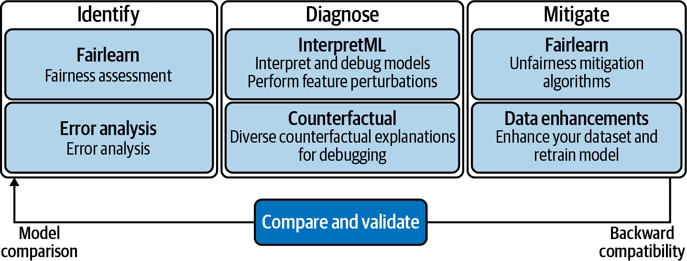
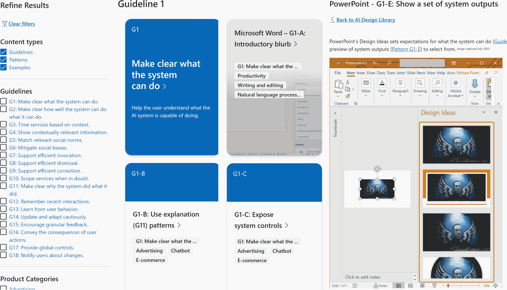

# 第七章：负责任的人工智能开发和使用

在前面的章节中，我们已经看到如何使用关键的微软云 AI 服务。但同样重要的是考虑如何构建和使用 AI 的整体情况，这样你就可以充分利用这些云 AI 服务而不会遇到问题。

AI 和机器学习是强大的技术，可以使软件更有用，系统更高效，人们更加高效。但它们也可能侵犯隐私，带来安全问题，复制和放大偏见，自动化决策可能对个人或整个群体产生负面影响，或者偶尔出错。

###### 提示

这是一个庞大而复杂的话题，你不必掌握每一个细微差别来使用云 AI 服务。不要被所有问题压垮：你不需要做到所有事情，但同样，也不要认为你什么都不需要做来应对负责任的人工智能。

AI 的潜力越大——如诊断癌症、检测地震、预测关键基础设施的故障或引导视觉障碍者穿越陌生地点——就越有责任确保它的正确性，因为 AI 正在扩展到医疗、教育和刑事司法等领域，其中社会影响和后果非常重要。但即使是 AI 的日常使用，如果系统不公平、不负责、不透明和不安全，也可能无意中排除或伤害用户。

像 Azure OpenAI 服务背后的 GPT-3 模型这样的大型语言模型非常强大。事实上，它们非常优秀，通常会让人觉得是人类在写回答。但它们经过了书籍和许多网页内容的训练，这意味着某些观点在训练数据中被大量呈现，而更边缘化的观点则少见甚至完全缺失。这意味着结果可能不准确、不公平或极具攻击性，但语言可能非常令人信服——因此，你需要仔细考虑在哪里使用服务以及采取哪些预防措施，这样你就可以从其提供的强大功能中受益，同时不会让用户暴露于潜在的问题回应中。

除了社会和伦理影响外，还有法律问题需要考虑。欧洲委员会已提出了被称为首个人工智能法律框架的提案，但欧盟《通用数据保护条例》的第一原则已经要求个人数据以公平、合法和透明的方式处理。

很多企业在没有花时间了解的情况下采用人工智能工具，而不确保其良好管理和道德公正，可能对企业及其声誉造成风险。一份关于金融服务中人工智能采用的报告¹显示，存在对负责任人工智能缺乏紧迫性的令人担忧现象，因为存在偏见的人工智能工具可能会错误地排除人们参与改变生活的经济机会。研究中有三分之二的高管无法解释具体的人工智能模型决策或预测如何做出；只有五分之一的组织设有人工智能伦理委员会或监控生产中模型的公平性。

显然，这里存在一个光谱：有些情景和技术比较直接，而有些则更为敏感，需要您进行更多工作来评估结果和影响。

随着人工智能工具变得越来越普遍，利用人工智能做出决策的企业需要努力保持客户和员工的信任，承担确保其人工智能模型、系统和平台可信、公平且能向受影响的人解释的责任。首先要了解潜在问题和意外后果，然后在构建和测试系统时考虑风险，确保系统按照预期的方式运行，适用于所有用户，而不会歧视或伤害他们。

请记住，负责任的人工智能有两个方面：您需要负责任地开发您的人工智能系统，但也需要确保系统的负责任使用，无论是由您自己的员工还是客户使用。当您使用预构建的云人工智能服务时，您也需要负责任地处理。

对于一些非常敏感的人工智能服务，比如定制神经语音，在这种服务中，您实际上复制了真实人声，可以用其发表言论，甚至可能是在其不会讲的语言中，需要遵循特定的程序，以确保不被滥用。

您需要申请并获得 Microsoft 的批准才能使用定制神经语音服务。然后，您必须向 Microsoft 提供使用者签署的释放文件，以证明您已获得知情同意，并且您必须遵守使用语音的[行为准则](https://go.microsoft.com/fwlink/?linkid=2190282)。这包括始终明确表明这是合成语音，甚至限制您可以使用它做什么。让您的客户使用您的名人语音创建自定义消息，比如发送生日祝福或使他们的语音信箱更有趣，可能看起来是个好主意，但如果有人创造了恶意或冒犯性消息，并声称其是真实的呢？

大多数云端 AI 服务不会有这种限制，但可能在某些设置下无法以你希望的方式提供结果。这意味着进行与用户需要知道的内容相同的思考过程是有帮助的，同时还要考虑可能出现的问题以及你希望制定的政策来避免或减轻这些问题。

###### 小贴士

实现负责任的 AI 不仅仅是技术问题；还涉及到强烈的文化和组织方面的因素。理解 AI 的影响并接纳多元化的视角，以确保 AI 功能能够对每个人都有效，可能需要在思维方式上做一些改变。让高级别人物参与进来有助于确保人们和项目对结果负责。你需要清楚地了解 AI 和项目指标：什么算是成功？如果你正在处理负责任 AI 和透明度很重要的领域，那么可能会出现错误和失误，因此组织在问题出现时如何处理就显得尤为重要，以确保项目有机会纠正问题并改进。

# 理解负责任的 AI

第一个具体针对 AI 的法规仍在起步阶段，我们将在下一章中进行讨论，但除了法律问题，你还需要考虑伦理和性能 —— 这两者并不像你想象的那样完全分离。

AI 可能会产生意外影响的方式有很多，负责任的 AI 涵盖了一系列问题：偏见、歧视、公平性、包容性、责任、透明度、可解释性、可靠性与安全性、隐私与安全性。其中一些理念比较直接 —— AI 系统应该能够可靠且安全地运行，并且保护隐私。其他一些则更为复杂且相互关联，因此尽管我们将工具分解成不同的主题，你会发现它们之间有很多交叉点。

AI 系统应该公平地对待所有人（即使不知道 AI 系统会让某人生活更加困难，如果发生了这种情况，你也要对此负责）。这与包容性有关 —— AI 系统应该赋能每个人 —— 但也与透明度和责任相关。AI 系统应该是可理解的，并且人们（或组织）应对 AI 系统负责，这意味着必须解释和证明决策和行动，回答问题，并承担可能的后果。

在 AI 系统中优先考虑公平性可能意味着在其他优先事项之间做出权衡，并审视假设，因此除了透明地说明正在使用 AI 和从用户那里收集的数据之外，还有必要尽可能透明地表明这些优先事项和假设。

当我们谈论“解释”AI 系统时，这对不同的人可能意味着不同的事情。机器学习专家可能希望看到导致特定预测结果的模型权重，以及所使用的算法和训练集的详细信息，模型的性能分数以及其他技术信息。但对于银行客户来说，这些都不会解释为什么他们的贷款被拒绝以及他们可以做些什么，对于业务用户来说，这些信息也不能解释为什么系统预测某个订单不能及时准备好，以及预测的可靠性如何。

## 负责任的 AI 提升了性能和结果

不要将负责任的 AI 仅仅视为你只在抽象层面关心的伦理方法。将这些原则付诸实践是你如何构建和部署更好产品、实现精确、有效、可靠的机器学习，为你提供所需的答案。这些好处远不止遵循合规性，接下来的章节我们将更详细地讨论如何提供负责任的 AI 是实现机器学习最佳实践的关键部分。

关于透明度。你可能需要能够解释决策的方法，包括任何自动化或基于机器学习系统推荐的决策，这可能是法律要求的。从商业角度来看，你希望客户能够信任你的组织，因此你需要提供透明度，并清楚地说明决策的制定过程以及其对人们的影响。数据科学家需要能够向业务团队解释模型，这些模型将用于预测、推荐或其他机器学习特性，以便他们能够放心地依赖于它们——但是具有更高解释性的模型也更容易调试和改进。

## 实验和迭代

你对使用的机器学习有越多的可见性，你可能会得到更好的结果，因为你了解输入数据、背景和模型的任何限制。机器学习是一个实验的过程，你从如何使用数据指导决策的假设开始，并寻找最能实现这一目标的机器学习模型：解释性将帮助你验证模型是否符合你的目标以及是否公平。

同样，实现可靠性意味着了解模型中的盲点，这样你就知道它在哪些地方出现问题以及原因。在考虑隐私和敏感位置时，思考空间分析的摄像机角度也将有助于提高准确性。如果语音或图像识别中的错误对特定群体的人更常见或更显著，你可能会面临公平性问题——但这也表明你的模型需要更多的工作。

知道数据的来源和收集方式可以更容易知道你可能需要哪些进一步的数据来改善结果。

在努力减少错误时，你需要继续监控错误率及其发生位置，以确保你不是解决一个问题而引入另一个问题——这是开发人员非常熟悉的调试原则。

思考如何构建有效的系统涉及到查看系统中涉及的人员以及技术实现细节：这对 AI 服务同样重要，正如它对界面和用户体验一样。

你需要保护你的训练数据和机器学习模型，以防竞争对手或恶意用户篡改它们或找到操纵系统的方法（详见第八章了解更多细节）。具体细节可能会有所不同，但同样，从适用于任何数据库的安全性和隐私问题出发，将有助于你交付更强大的 AI 系统。

但也有一些 AI 领域的问题在其他开发领域可能不太熟悉，这就是负责任 AI 工具可以帮助的地方。

# 交付负责任 AI 的工具

在使用数据和应用机器学习的透明性方面非常重要，但你需要超越仅仅透明，确保在机器学习生命周期中实施负责任 AI 原则。不同的工具可以帮助你识别、诊断和减轻负责任 AI 的错误、伤害和其他失败，帮助你探索数据并在其中做出负责任的决策。

###### 警告

当你使用云 AI 服务，如认知服务和 Azure 应用 AI 服务，这些服务具有预训练模型或简单的定制步骤时，许多更具操作性的工具将不适用于你的工作流程（尽管它们都已作为开发模型的一部分被使用过）。但规划工具将是相关的，因为你仍然需要考虑负责任的 AI，无论是透明地告知你正在使用 AI 服务做出决策或提供预测，查看你训练的任何自定义模型的准确性和性能结果，还是使用自己的数据进行彻底测试，以确保这些工具能够很好地为你的整个受众群体工作，而不会排除特定群体。如果你的用户可能在户外、夜间或雨天拍照，则使用这些类型的图像来训练和测试对象和人脸识别。

负责任地构建服务是微软的责任，但也是你的责任。你不能简单地依赖服务总是正确的：你需要包括人类监督和对预测、分类和其他结果的审查——请参阅“人在环路监督”了解更多细节。并确保查阅下一节的透明度说明，以便清楚地了解服务的优点以及可能产生不良结果的情况，以及如何在这种情况下负责任地使用它。

在规划构建内容和评估进行中的项目时，一些有助于提供负责任 AI 的工具是相关的。其他工具将成为您的 MLOps 流程的一部分（如果您需要关于实际操作的刷新，请返回第三章），以便您可以快速而负责任地训练和评估模型。实验是成功机器学习的关键部分，如果您正在训练自己的模型，您将希望训练多个模型，并在透明度和公平性以及错误率和准确性上进行比较。

有许多不同的工具可用；在本章中，我们专注于来自微软的各种负责任 AI 工具，涵盖透明度、公平性、包容性、可靠性和安全性、隐私、安全性以及问责制。其中许多是开源的，但它们也集成到像 Azure Machine Learning 这样的服务中。您可以使用微软的[负责任 AI 工具箱](https://aka.ms/rai-toolbox)根据图 7-1 中显示的工具，为调试机器学习模型创建工作流程，用于公平性、错误分析和可解释性，或进行因果分析，帮助您基于机器学习预测做出数据驱动的决策。

###### 图 7-1\. 使用负责任 AI 工具箱中的工具创建您自己的机器学习调试工作流程

所有这些工具都可以单独使用，但工具包会处理所有依赖关系，并将它们包装在一个有用的仪表板中。

## 透明度工具

透明度不仅仅是告诉用户你正在收集数据和使用 AI，或者解释预测基于什么，尽管这很重要（你会看到这被称为可解释性或解释性）。它还涵盖确保开发人员和数据科学家清楚数据来源，以便他们能够负责任地使用它；对于使用的任何预构建模型或 AI 服务也适用这一点。

无论是训练自己的模型还是定制预训练模型，您都需要知道训练数据的来源和其中包含的内容。我们将在第八章更详细地讨论如何在您的组织中创建负责任的数据文化，但追踪训练数据集的生命周期以了解谁构建了它以及原因对于理解该集合中可能存在的人口偏差至关重要。每个数据集应附有数据表，记录收集原因及方式（包括对其进行的任何处理），确切包含的数据（原始数据或特征，任何机密、敏感、特权或潜在冒犯性数据）以及缺失的内容，建议的用途（包括任何已知限制），它已经被用于什么等等。[Microsoft 数据集数据表模板](https://go.microsoft.com/fwlink/?linkid=2190166)包含一系列问题，帮助您收集数据表信息。

如果可能，在收集数据之前考虑您需要包含在数据表中的信息，并随着过程记录数据的动机、组成、收集、预处理、分发、维护和使用。

### 模型卡片和透明度说明文档

即使您使用预构建模型或 AI 服务，了解它是如何构建和运作的，可能有助于您负责任和有效地使用它。

因为 AI 是概率和统计性的，不太可能完全准确；理解其局限性和可能失败的地方将有助于您设计一个整体系统，更好地利用 AI 模型，因为这考虑到了这一点。

模型卡片和透明度说明文档记录 AI 模型和服务，帮助您了解它们的能力和限制，以及您可以做出哪些影响系统行为的选择，以达到最佳性能，例如设置置信度阈值以最小化假阴性或假阳性，或如何预处理数据以获得最佳结果。这种信息帮助您进行权衡，了解该服务是否能很好地处理您可用的数据类型。

Microsoft 致力于负责任的人工智能，其中一部分内容是为越来越多的 Azure AI 服务提供透明度说明和集成指南（参见[使用认知服务的负责任 AI](https://go.microsoft.com/fwlink/?linkid=2190168)）。这些说明告诉您每种服务中哪些数据能够为您带来最佳结果，以及哪些方面可能不足（比如在文本分析服务中解释情感分析的局限性，或者警告 OpenAI 服务不适合用户可以在任何主题上生成内容的开放式场景，因为这可能会产生冒犯性文本或其他不受欢迎但非故意的响应）。文档将告诉您如何使用各种 Azure AI 服务，但透明度说明将特别有助于理解它们最适合什么样的用途。

对于每个认知服务和应用 AI 服务，Microsoft 会审视可能适用的不同公平性问题（通常是服务质量），并对其使用的模型进行测试。因此，对于语音转文字来说，它们有一个测试集，涵盖年龄、性别、语言和地区口音，以及可能导致准确性变化的其他社会因素，这些因素与真实世界中这些因素在人口中的分布相对应。随着模型的新版本训练，它们会进行测试，确保在统计上显著且在可接受误差范围内，它们对男性和女性同样有效。随着时间的推移，不同服务的透明度说明将包括测试哪些因素和群体的详细信息，模型已知表现较差的任何领域，以及尚未测试的内容，以便您可以将其与自己的用户群进行比较。

如果您将使用服务的背景与 Microsoft 测试时的环境非常不同（例如，语音识别通常在安静的环境中进行测试，而您将在嘈杂的环境中使用它，背景中可能有多人交谈），或者您知道将要定制模型，您将希望对培训数据和模型性能进行公平性评估（我们将在本章后面看到相关工具），并保留这些记录。您可能还希望将 AI 应用于更狭窄和有针对性的方式，限制其仅适用于您知道它会表现良好的情况，并尝试扩展这一点，一旦获得良好结果。

一些透明度说明还包括部署和集成指南，提供了关于如何负责地使用服务的有用信息。这对于新兴领域尤其有用，比如使用计算机视觉进行[空间分析](https://go.microsoft.com/fwlink/?linkid=2190285)，在这些领域中，您可能需要在平衡隐私关切与监控办公室或零售场所以帮助维持社交距离的健康与安全效益之间进行权衡，因此让人们意识到正在收集的数据及其原因变得更加重要。这些说明中的细节涵盖了 Azure AI 服务如何处理、使用和存储您的数据，可能对包含在您自己的合规记录中会有所帮助。您可以创建透明度说明和集成建议，作为创建数据集数据表的扩展，用于您自己的模型。

### AI 项目的检查表和计划流程

在应用负责 AI 的理念时，有一个涵盖您需要考虑的领域以及您需要做出的决策或权衡的正式流程是有帮助的。在涉及 AI 的项目中进行处理前必须回答的问题检查表可以帮助将其付诸实践。您可能希望尝试将模型分类为低、中或高风险。对于某些系统，您可能希望进行[正式算法影响评估](https://go.microsoft.com/fwlink/?linkid=2190167)，该评估描述了其设计目标并指明谁将负责修复任何问题。当您创建并完成一个检查表时，您正在比数据集数据表和透明度说明更高层次地工作，但您正在探讨如何设计、实施和部署 AI 系统的相同类型的决策。

Microsoft 提供了一个[AI 公平性检查表](https://go.microsoft.com/fwlink/?linkid=2190169)，它本身就是一个流程，帮助您制定更具体的检查表，以适应您自己的情况，尽管其名称如此，但它涵盖了一系列关于可靠 AI 主题如可靠性的负责 AI 主题。使用它来提出诸如：

+   谁将受到这个系统部署的影响？是否有人因为使用该系统或应用而受到负面影响？我们如何减轻这种影响？

+   这个系统可能存在哪些潜在的限制、问题或风险？

+   我们计划使用的产品或功能在我们的场景中表现如何？在部署之前，使用真实世界数据测试 AI 功能并检查其准确性。

+   我们将如何识别和响应错误？在实际使用中，AI 服务和功能很少能够百分之百准确：我们如何做好准备并处理这些问题？

+   我们将如何衡量表现和成功？具体结果通常比使用和采纳率更好地衡量标准。

负责 AI 依赖于人们对构建系统做出负责任决策，并考虑到将使用或受到这些系统影响的人们。

[Human-AI 体验（HAX）工具包](https://go.microsoft.com/fwlink/?linkid=2190286) 提供了一套指南，用于在构建与人交互的 AI 系统时做出负责任的决策。例如，大多数人会认为机器学习系统总是在学习，并会接受他们的更正而不会再犯同样的错误；但这只有在你收集数据并重新训练模型时才会发生。明确是否发生了这种情况以及他们何时可能看到改进是很重要的。

使用 HAX 工作簿帮助整个团队（设计师、经理和开发人员）在开始构建之前考虑系统将要做什么以及用户如何与之交互。然后通过 HAX playbook 来探索和规划可能出现的问题。

###### 提示

通过结构化的头脑风暴会议将所有这些想法整合在一起。[判断性判断](https://go.microsoft.com/fwlink/?linkid=2190170) 是一个卡牌游戏，你的团队可以扮演谁会受到你的技术影响、他们将如何使用它、可能出现什么问题以及你可以采取什么措施的角色。

### 解释性

一旦构建了你的机器学习模型，你需要对其进行评估。性能很重要，但了解模型如何工作以及模型中哪些特征影响预测和分类同样重要。在受监管的行业中，可解释的模型和解释可能是法律要求；在其他地方，如果利益相关者、用户和客户能看到贡献结果的因素，他们对机器学习结果可能会更加信任，但是信息可能需要针对每个受众以不同的方式呈现。

解释性工具可以帮助你理解数据中哪些特征最影响结果。如果你在预测房屋的正确销售价格，物业的年龄和当地学校的评级通常是数据集中最重要的特征，但房屋的大小和建筑用地、卧室和浴室的数量、是否有车库或门廊，以及其他因素如有无花园也会起作用。

负责任 AI 工具箱具有一个由开源[InterpretML](https://go.microsoft.com/fwlink/?linkid=2190287) Python 包支持的模型可解释性步骤，它可以帮助你理解你的模型的行为一般性或特定预测的原因。

###### 提示

Azure Machine Learning SDK 包括 InterpretML 在 azureml.interpret 中的模型解释类，可以通过展示预测分布和特定特征对整体模型或个别预测结果的影响来解释模型预测。它有一个可视化仪表板，让您在 Jupyter Notebook 中探索解释，或者您可以在 Azure Machine Learning 工作室中看到仪表板的简化版本。您可以在这些[sample notebooks](https://go.microsoft.com/fwlink/?linkid=2190171)中尝试 Azure Machine Learning Interpret API。

除了了解为什么他们没有获得贷款或者为什么房屋定价工具建议特定的价格，客户可能还想知道他们可以做什么来获得不同的结果——在现实世界中应用那些机器学习预测。如果你知道模型中哪些特征对预测很重要，你可以使用反事实（counterfactuals）——那些不是真实的但可能的事情——来探索预测如何变化，并为他们提供探索这些建议的选择，再次明确它们基于什么。

###### 警告

注意如何呈现 AI 系统解释；您需要清楚地表明，您正在解释模型学到的东西，以便人们可以决定是否信任预测，而不是描述真实世界的运作方式。使用频率而不是具体数字也有助于表明预测是概率而非确定性；考虑飓风地图上的概率锥体。

在由[InterpretML DiCE](https://github.com/interpretml/DiCE)提供支持的负责任 AI 工具箱中的反事实示例分析步骤，允许业务用户在被拒贷款申请中实验数据，以给客户提供一些建议（包括说明哪些特征可以和不能改变）。说“变年轻五岁”是毫无意义的，“每年多赚一万美元”可能不会立即有帮助，但能告诉他们如果关闭一个信用卡或偿还一笔现有贷款就会批准他们的这类透明度，是避免 AI 成为黑匣子的途径。

但是同样的工具也将帮助您找到公平性关切和问题特征。模型只是对真实世界的一种近似：它们可能不准确，并且模型中的特征之间可能存在相关性，这并不一定反映真实世界中的因果关系。如果你在看一个预测某人收入的模型，而将他们的资本损失从零增加到数千美元会导致更高的预测收入，要么模型有误，要么它捕捉到了像税务策略这样的相关性。

另一种方法是提出“如果”问题以进行基于数据的决策，利用由 [EconML](https://github.com/microsoft/EconML) Python 包支持的因果分析步骤。对于我们的房屋定价场景，我们可以查看数据集中的特定房屋，看看扩大车库或增加壁炉如何改变建议的价格，或者获取一张根据这些变化将看到最大价格增幅的房屋表，以便您可以集中资源投入对影响最大的事物。

您还可以使用此功能创建策略。与其告诉所有想要出售房屋的人添加门廊会增加价值，不如使用“如果”问题来确定，如果您去除现有的门廊，老房子在小地块上的销售价格会更高，但是如果您在某个平方英尺数以上的新房子上添加门廊，销售价格会更高。

如果您想进行更高级的因果推理，[DoWhy Python 库](https://github.com/Microsoft/dowhy) 也是负责任 AI 工具箱的一部分；它可以帮助您建模您所做的假设（指定您知道和不知道的内容），然后测试它们。

如果您对因果推断不熟悉，[ShowWhy](https://github.com/microsoft/showwhy) 将帮助您提出问题，揭示假设，并探索造成和混杂变量——这些变量既有助于您认为是原因的因素，又影响最终结果——并通过显示数据中的关系的图表来展示这些关系。

## AI 公平工具

AI 系统可能因为社会中的偏见反映在训练数据中、开发和部署过程中做出的决策，或者数据本身存在的缺陷（比如不代表所有用户）或系统本身存在的缺陷而表现出不公平行为。

AI 可以自动化在训练集中偶尔出现的偏见，并通过常规应用而非选择性应用来放大该偏见。它还可以引入偏见，例如在翻译没有性别代词的语言时带有偏见的链接，将“这个人是医生，这个人是护士”翻译成“他是医生，她是护士”。

您还需要考虑数据与现实世界之间的不匹配。如果您假设长时间浏览网页的人对该主题更感兴趣，那么您未考虑到可能使用慢互联网连接的人，或者页面设计是否使某些人难以阅读。

AI 公平意味着评估模型可能对个体或群体造成的负面影响，并加以缓解。AI 系统可能产生许多不同的负面影响（通常称为“伤害”），但在查看 AI 系统行为方式时，有三种主要公平类型需要考虑——尽管公平问题可能会导致超过一种伤害。

服务质量公平性与系统的准确性有关。如果你在涵盖一个特定场景的数据上训练你的系统，但在更广泛、更复杂的情境中使用它，它可能表现得很差。面部识别对于肤色较深的人往往准确率较低，特别是对于肤色较深的女性；这是一个服务质量失败，因为它对某些群体的准确性较低。这是因为面部识别模型所训练的数据集中没有足够的例子让模型学习到正确的模式。

如果你的数据覆盖不足，你可以通过收集更多数据来减轻问题：如果不能，你可以考虑使用合成数据之类的选项，或者你可以选择在这些情况下不使用该模型。因此，如果你使用点击数据来训练推荐系统，会有一些群体的人从未看到过推荐，所以你无法获得他们的点击数据来训练系统：在这些情况下，你可以默认在一些预设链接之间随机选择。

分配公平性涉及你的 AI 系统是否为每个人提供同样的机会或资源，或者一个群体的人是否更有可能获得贷款或者其简历被职位申请系统接受。如果你的模型有服务质量问题，并且将其应用于模型准确性较低的群体，你可能会造成分配上的伤害。在安静环境中训练的语音转文本模型在嘈杂环境中会更不准确，但你可能也会发现背景噪音对某些群体的模型性能影响更大。

在责任 AI 工具箱中的[公平学习工具](https://fairlearn.org)将展示模型在不同群体间性能准确性以及它做出的决策，以便你寻找服务质量问题和分配伤害。

将性别中性语言翻译为“他是医生，她是护士”是一种刻板印象，但也是所谓的表象性伤害的一个例子。如果特定群体系统性地被过度或不足地代表，这可能暗示他们不适合从事该职业或处境，如一个搜索 CEO 的图像搜索只返回男性的图片。图像标记和标题可以分别产生可接受的图像和标题，但并列在一起可能会引发问题。

###### 警告

不是所有的失败都是相同的。如果你的系统生成的图像标题看起来强化了有害或历史性的刻板印象，这对你的用户可能比一个毫无意义的标题更有问题，尽管在衡量模型准确性时它们可能都看起来是错误的。

InterpretML 可以帮助你理解模型中可能导致这些伤害的特征，接下来的部分中探索模型准确性的工具也可以。如果你想深入了解不同类型的伤害，你可以在本章的末尾找到更多信息。

## 可靠性和理解错误的工具

可靠性是关于理解模型的盲点。它在哪里失败了，为什么失败了？

考虑模型准确性较低的情况，而不是仅看单一的性能评分。如果你正在处理包含户外拍摄图片的图像，那么在天黑和下雨时，视觉识别是否仍然准确？如果你正在建立一个贷款批准模型，它是否对不同年龄、性别、教育或种族的申请人群体表现相似？负责任 AI 工具箱中的错误分析步骤可以帮助你通过发现数据中错误率较高的群体（称为群体），调查哪些输入特征影响这些错误率，并探索模型、特征和数据集来调试预测。

图形可视化在这里特别有帮助，显示特定特征的错误率。你可以标记那些看起来特别有趣或有问题的特征，然后探索这些群体的统计数据。也许对于某些群体有很多误判负例；这意味着你需要查看数据探索器中的数据分布，看看它是否平衡。如果这些群体的数据太少，将会降低模型的准确性，因此这可以指引你收集什么数据来改进它。

你还可以查看模型用来进行预测的最重要的特征，并将其在不同群体中进行比较。这可以更好地帮助你理解你的模型学到了什么。你还可以生成解释——尽管这些解释对数据科学家而言是有意义的，而不是最终用户，所以如果你打算向与模型交互的人员展示准确性水平和其他信息，你将需要不同的工具来生成这些信息。

## 人类在环路监督

公平性的概念是复杂的：它们可能与领域和背景相关，你可能需要考虑长期的影响以及即时的伤害。自动评估公平性的尝试不会像人类评估数据中的基础分布、模型在多大程度上代表真实世界以及可能产生的影响那样给出细腻的判断。提议中的欧盟关于人工智能开发和使用的法规要求对“高风险人工智能系统”进行人工监督，而 2020 年华盛顿州的面部识别法案则规定进行“有意义的人工审查”。

但仅仅让一个人审查和盖章机器学习模型提出的决策并不能完全避免所有可能的伤害；人类可能有他们自己的偏见和假设，他们可能过于信任自动化系统²，或者他们可能没有足够的资历来对结果做出任何有意义的改变。看到 AI 的预测可能会影响他们自己的决策；如果在听录音之前看了一份文字记录，很难将话语听成不是你已经读过的文字——就像光学错觉上的标题可能影响你最初的感知一样。

您需要考虑向行使监督权的人提供哪些信息，他们有什么样的激励来支持或拒绝自动化决策，以及如何负责地呈现 AI 建议并允许用户探索替代方案。

如果您正在使用 Azure OpenAI 服务生成看起来像是人类写的文本，请考虑是否需要让用户知道它是自动生成的，而不是由另一个人编写和审核的。为用户提供多个建议供选择，并明确称其为建议，可能会避免他们仅仅点击“确定”而不花时间考虑其准确性和适当性。

OpenAI 服务包括内容过滤器，允许您定制内容的语调和主题。但是，如果它生成了某些关键性内容，无论是法律建议、合同模板还是 API，让低代码开发人员访问您企业自己的数据和服务，您需要在工作流程中设计一个彻底的审查流程。

Power BI 中的自动聚合是通过分析用户查询模式的机器学习创建的，因此系统可以缓存会提高查询性能的聚合度量，而不会消耗太多资源。管理员可以使用滑块来微调此行为，以便他们可以自行决定性能与存储之间的权衡。如果适合您的应用程序，为用户提供探索和实验的选择可能有助于他们做出最佳决策。

确保每个预测或决策的置信度值是清晰的，并构建支持人们的应用程序，通过提供信息而不是取代他们来支持他们。在衡量 AI 系统的效果时，不要仅仅看简单的精确度和召回率指标，要看它们是否比不使用系统时帮助人们取得更好的结果。

如果您有聊天机器人或自动系统，请考虑如何提供“退出通道”，让用户升级其问题到人工环节，并包括他们已经提供的信息，这样他们就不必从头解释一切。AI 可能能够处理的主题，您可能希望由人来处理，因为它们复杂或微妙。尤其是如果您拥有一个逼真的神经语音或文本，看起来就像是人类编写的服务，清楚地告诉用户何时与 AI 系统而不是真人交互，以及如何联系真人至关重要。

拥有备用选项至关重要；如果您的用户对 AI 工具的自动结果不满意，请为他们提供一种方式自行填写详细信息或联系人工帮助他们。收集例子（经过许可）表明您的模型未能产生良好的结果，为进一步的开发和培训提供有用的数据，但请记住告知用户您将如何处理这些数据以及他们是否应该期待看到变化。

###### 小贴士

您的用户通常期望 AI 系统根据他们的互动学习和改进：清楚地表明是否会发生这种情况。请求反馈和例子，表明系统不起作用的地方，可以成为找到下一个版本的 Beta 测试人员的好方法。这也将帮助您了解哪些类型的故障真正重要，因为并非所有错误都相同，有些需要更多的工作来处理（如果它们是冒犯性的而不仅仅是令人困惑的话）。

使用透明性、可解释性、错误分析和因果推理工具来探索您应该告知参与人员的内容。例如，HAX Toolkit 提供了一组指南，说明了 AI 系统与人类的交互方式，这些指南通过设计库中的实用模式来说明，这些模式从熟悉的服务中提取了例子。

###### 图 7-2\. HAX Toolkit 指南将帮助您负责地展示 AI 功能

在开发机器学习模型时，“人在循环中”的概念也适用——例如，使用机器学习建议标签来训练数据，但实际上仍需某人（最好是该领域的专家）接受并应用这些标签。

# 总结

在本章中，我们探讨了您可以将其视为蜘蛛侠原则的内容：AI 是强大的——伴随着强大的力量而来的是巨大的责任。即使您只是使用而不是构建机器学习模型，思考可能出现的问题并使用负责任 AI 的原则来避免或减轻潜在问题是很重要的。我们介绍的工具将帮助您从如何道德使用 AI 思考到将其作为您的机器学习工作流程的一部分，以获得实际的好处；做好事做好事，正如我们所说的那样。

但是虽然负责任的 AI 是你需要开始的地方，但还有其他问题需要与之并行考虑，比如实验和协作。在下一章中，我们将探讨如何建立一个强大的数据文化，这将帮助您提供支持负责任 AI 的所有最佳实践。

# 更多资源

负责任的 AI 是一个广泛的话题，重要的研究仍在进行中；如果您希望深入了解更多，有大量的资源可供选择：

+   查看 Microsoft 的所有[负责任 AI 原则](https://go.microsoft.com/fwlink/?linkid=2190289)。

+   [Microsoft Learn：识别负责任 AI 的原则和实践](https://go.microsoft.com/fwlink/?linkid=2190290) 包括建立治理模型和在您的组织中应用负责任 AI 实践。

+   如果您是管理人员或业务主管，负责为您的组织构建 AI 系统的人员，请查看由微软和波士顿咨询集团编写的[产品领导人实施负责任 AI 的十项指南](https://go.microsoft.com/fwlink/?linkid=2190291)。

+   如果您想进一步探索 AI 核对表，BBC 的[机器学习引擎原则](https://go.microsoft.com/fwlink/?linkid=2190292) 提供了一个有用的例子，尽管其中一些问题非常具体，涉及内容和广播处理。对于医疗保健领域，[透明报告个体预后或诊断多变量预测模型(TRIPOD)倡议](https://www.tripod-statement.org) 提供了一个详细的核对表，为开发预测模型提供了透明度规定行业所需的详细级别。对于受 GDPR 影响的组织，信息专员办公室（ICO）的[AI 和数据保护风险工具包](https://go.microsoft.com/fwlink/?linkid=2190294) 侧重于合规性，但包括一份详尽的风险清单，包括公平性、透明度、有意义的人类审查以及安全性和问责制，以及应对每个风险的实际步骤。

+   ICO 关于[确保 AI 系统的合法性、公平性和透明性的指导](https://go.microsoft.com/fwlink/?linkid=2190179)。

+   Azure 云倡导者机器学习入门：[机器学习中的公平性](https://go.microsoft.com/fwlink/?linkid=2190296)。

+   探索不同类型的 AI 伤害和公平性问题，并学习如何评估您的系统可能发生的问题，使用[Harms Modeling](https://go.microsoft.com/fwlink/?linkid=2190178)。

+   查看常见的表征性伤害的影响，使用[Gender Shades](http://gendershades.org)，一个让您探索关于面部识别中负责任 AI 的重要论文的网站，并查看其在[Coded Bias](https://www.codedbias.com)纪录片发布后发生了什么。

+   [“算法不公平：提炼自动决策的危害。”](https://go.microsoft.com/fwlink/?linkid=2190297) 未来隐私论坛提供了由“算法歧视”引起的问题的全面分类，以及建议的策略。

+   [算法影响评估报告](https://go.microsoft.com/fwlink/?linkid=2190298) 研究如何评估负责任 AI 和责任制的方法。

¹ “[负责任 AI 的现状](https://go.microsoft.com/fwlink/?linkid=2190284), FICO, 2021 年 5 月。

² 研究表明，尽管我们知道它们不是人类，我们本能地将计算机视为人类对待（Reeves, B., and C. Nass. *The Media Equation: How People Treat Computers, Television, and New Media Like Real People and Places*. [纽约：剑桥大学出版社，1996]）。帮助您的用户创建一个关于 AI 系统如何进行预测和决策的“[心理模型](https://go.microsoft.com/fwlink/?linkid=2190175)”可以帮助他们决定何时应该信任这些建议，何时应该质疑它们。
