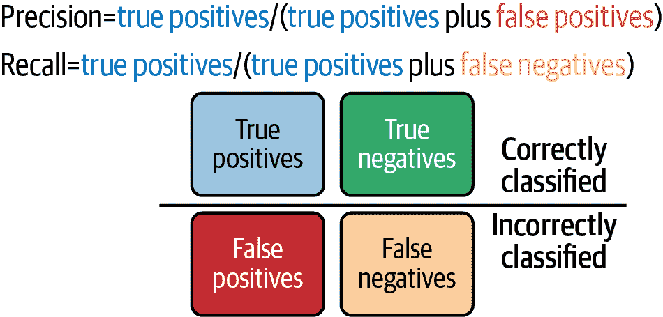

# 第八章：机器学习项目的最佳实践

实现我们在上一章讨论的负责任 AI 结果意味着制定并实施机器学习的最佳实践。因为机器学习和 AI 技术依赖于数据科学，且强调实际结果，良好的数据处理至关重要。在特定于机器学习的最佳实践之前，您还需要考虑如何在您的组织中建立数据文化——一套鼓励基于数据做出决策的规范和行为，以便这些最佳实践得以发展。

# 与数据合作良好

数据文化需要普及的数据素养。人们需要理解如何负责地处理数据，并拥有获取、操纵、准备和可视化数据的工具。其中一些涉及您设置的技术系统，但正如术语所暗示的那样，其中一些是社会和文化问题。有了按需、云端 AI 工具，很容易认为负责任地收集和筛选数据是“别人的问题”，但负责任地处理数据既是组织内的个人责任，也是集体责任。

每个人都应该询问关于数据的关键问题：

+   这些数据的价值是什么？我们需要收集它吗，我们应该保留它吗？

+   我们收集这些数据的目的是什么？我们可以用它做什么？

+   我们用这些数据做什么，我们如何告知用户，以及我们给予他们什么控制权？

+   如何保护这些数据？

## 数据共享

数据孤立和数据在部门和不同工具之间的碎片化（可能使用专有格式）会导致数据的片段无法集成。建立数据平台可以更轻松地访问和使用您拥有的所有数据，并使用云数据存储可以简化这一过程。例如，存储在 Azure Blob 存储中作为 Power BI 数据流的一部分的数据存储在 Dataverse 中，并且可以被 Azure Data Factory、Azure Databricks、Azure Notebooks 和其他服务访问和重复使用（在适当的访问和权限下）。

鼓励人们分享数据，并建立数据质量和筛选流程，以避免不同团队和数据存储中存在多个略有不同版本的同一数据集。

同事和团队之间的数据共享意味着不同团队不再在相同数据上进行相同的数据准备工作，人们可以在彼此的工作基础上进行改进和标准化数据工件，并将自己的专业知识贡献给这个过程。他们会使用他们熟悉的工具。因此，业务分析师可能会在 Power BI 中探索数据集以理解历史模式，而数据工程师可能会将同一数据集用作 Azure Machine Learning 中的机器学习训练数据，以利用这些模式进行预测并评分新交易。Power BI 数据流可以在多个报告中使用，同事们也可以通过其他工具（如 Azure Databricks）来丰富开发者使用。

分享和重复使用数据工件还可以实现更严格的数据分类、数据治理和生命周期管理。

## 数据来源和治理

您的机器学习实践的治理对于业务和性能原因都很重要。如果您没有适当的框架和流程来负责处理数据——评估偏差、公平性、可解释性和我们在前一章中介绍的其他基本原则，以及隐私和安全性，那么您的模型的鲁棒性和长期性能可能会较差。没有这些流程，您将无法跟踪和衡量您对数据和模型进行实验和迭代时的影响。

了解数据集的来源对于负责任地使用它们至关重要。这可能是法规要求，例如 GDPR 和加州消费者隐私法案，但即使没有法规，根据一组情况收集的数据可能在不同情况下根本不适用或相关。

物理或外部系统可能会随时间变化，传感器可能会被移动到不同的位置，不同的收集方法可能会使物理读数产生偏差。对于关于人的数据，观众的人口统计信息或经济状况可能已经改变或不代表您自己的用户和观众。来自不同领域的调查数据可能会对相同术语使用不同的术语或定义。即使是常见术语在不同的地区和地理位置也可能有不同的含义：在英国和美国，饼干是完全不同的东西！

### 精心策划标签

您需要评估众包标签、标题和标签在训练数据中的质量，考虑到准确性和可能存在的文化偏差。有一个清晰的政策来处理您自己进行的标记，并为人们提供一致的标签集，附有示例和定义供参考。制定清晰的指导方针，说明您希望某人对其选择的标签有多大信心，如果多个标签看似合适或没有符合的标签，应该如何处理，以及如果他们意识到在标签上犯了错误应该如何进行更改。

对于图像，您可能希望使用 Azure 机器学习的 ML 辅助标注功能，该功能可以使用在图像数据集上进行的手动标注来对图像进行聚类以加快标记速度，然后预测标签并绘制围绕对象的边界框，您可以接受或更改这些标签。这有助于减少标记数据的时间和标签的一致性。

使用像[COCO](https://cocodataset.org)这样的可移植格式来标记数据集有助于数据的分享（并且像[Roboflow](https://roboflow.com/formats/coco-json)这样的工具可以转换成其他格式）。

数据集需要标记详细信息，包括数据的收集方式、时间和地点，以及收集数据的原因——包括法律依据和最初收集的目的，因为这可能影响数据的全面性。更多的数据并不会自动提高性能：拥有正确的数据比拥有“大数据”更为重要，只是希望所需数据在其中。特别是对于训练现有模型的自定义版本，拥有相关数据的良好标记将比大量未经精心策划的数据更能提高性能。

### 考虑您的数据内容

数据最小化——仅收集您实际需要的内容——也是符合规定的重要原则。这可能意味着您期望包含所需数据的数据集实际上可能不包含，因为它是为不同目的收集的。对此的答案不是扩大范围，收集更多数据而不知道其是否相关。正如英国数据保护监管机构 ICO 所述：“找到相关性并不会事后证明获取数据是合理的。”

第七章的数据表模板将在这里有所帮助。如果您使用像 Azure Purview 这样的数据治理工具来对数据进行分类和理解，这也可以用于结构化数据集。

您还需要记录您的数据准备流水线以及作为其一部分执行的任何数据转换或丰富。这种数据血统对于实验至关重要：数据准备需要一致和可重复，以便您可以比较不同版本模型的性能和准确性。像 Azure Machine Learning 这样的服务通过模型注册表提供自动化的血统审计，类似于它们跟踪机器学习实验的结果以及数据集和模型的使用方式。

如果您处理包含个人或敏感信息的数据（仅在静止状态加密不足以保护处理期间），您可能需要使用数据遮罩、伪匿名化和聚合等技术对某些信息进行去标识化和匿名化，同时创建法律和组织保障措施，如访问控制、使用政策以及将个人数据与更一般数据分隔开来。您还需要评估如果数据与其他公开可用信息结合可能导致重新识别的风险。或者您可能需要探索新兴技术，如通过工具如[SmartNoise](https://go.microsoft.com/fwlink/?linkid=2190181)注入噪音以防止这种相关性的差分隐私技术，或者针对[加密数据上的机器学习](https://go.microsoft.com/fwlink/?linkid=2190182)使用同态加密。

### 合规性和审计

你用于机器学习的数据很可能会受到你组织的合规政策约束。至少，你可能需要记录机器学习系统的可重现性和可审计性。使用云 AI 服务可以简化这一过程，因为你可以提取诸如模型版本和使用情况等细节，针对你自己的模型，并参考服务的合规文档，适用于你使用的预构建模型和 API。

对于受监管行业和隐私法规管辖的地区，你可能需要就你的组织在进行机器学习时是否属于数据控制者或数据处理者寻求专业意见，并了解这对合规政策意味着什么。除了数据收集，你还需要考虑包括问责制和隐私设计原则在内的数据保护原则。如果你正在使用机器学习进行自动决策或个人画像生成，你可能需要正式评估隐私、数据保护和合规风险。

### 机器学习的安全性

你还需要考虑训练和运行数据的安全性，以及保护对正在运行的机器学习系统的访问权限。你需要在允许足够多的人员访问数据集和机器学习资源以从中获得价值的同时，遵守安全和合规政策。机器学习的前提是在探索数据之前你并不知道能从中发现什么见解，因为训练机器学习模型是你发现数据中哪些特征提供最佳预测的方式。

使用云 AI 服务可以使合规性工作更加容易，因为云服务处理了更多的内容，尽管你需要确保所使用的账户和凭证的安全性。使用 RBAC 和最小权限原则；并非每个人都应该对所有数据集有访问权限。能够访问数据标记的人不一定能够删除数据或使用数据来训练模型。

###### 提示

使用虚拟网络和 Azure 私有链接，以确保你只能从虚拟网络上一组私有 IP 地址连接到你的 Azure 机器学习工作空间，而不是任何公共 IP 地址（并记得将你的存储和推断环境迁移到同一个虚拟网络）。

像任何其他计算系统一样，机器学习系统可能存在安全漏洞：在机器学习库中、在训练过程中、在推断中，或者在模型部署中。

与其他云服务一样，您在云 AI 服务中也有相同类型的共享责任模型。云 AI 服务通过定期打补丁和更新来处理机器学习库中的漏洞。滥用部署漏洞需要写访问权限以更改机器学习模型（尽管读访问权限可能允许攻击者窃取模型、离线评估它，并利用所学来攻击正在使用的模型）。无论哪种方式，您都需要通过使用 RBAC 并保护服务和模型的凭证来限制和保护对云 AI 服务的访问。云服务中的版本控制和使用信息将再次对审核很有用。

在训练中的漏洞可以通过验证输入并对数据集进行完整性检查来处理。在推理中的漏洞通常是攻击者试图欺骗机器学习模型，通过制造看起来不是实际内容的输入（例如在停止标志上放条带，使其被识别为限速标志），但也可能是在意料之外的上下文中的输入，例如在一辆车前面行驶的卡车上的商店标识或临时交通灯。

这些“对抗性”攻击更难以防范；考虑一下您的机器学习模型可能受到的攻击方式，并在训练中使用对抗性示例，或限制任何一个来源对模型进行推理调用的次数，以防止有人发送数百条消息来测试哪些消息可以通过。

###### 提示

安全专业人士可以使用 Microsoft 的开源[Counterfit 工具](https://github.com/Azure/counterfit)自动化地进行 AI 模型的安全风险评估，这些模型可以是本地托管的，也可以是云端的，使用对抗性 AI 框架，使用他们熟悉的方法，而不需要成为机器学习专家。我们在前一章中查看的数据表和透明度注释也将对他们需要进行的机器学习系统清单很有帮助。

使用[AI 安全风险评估框架](https://go.microsoft.com/fwlink/?linkid=2190302)指导您在保护机器学习系统方面的工作，这些工作建立在您在开发和运营的其他领域已经进行的安全风险评估基础上。有一个详尽的指南，用于[威胁建模 AI 和机器学习系统](https://go.microsoft.com/fwlink/?linkid=2190183)，将帮助您评估、测试和改进您的系统。如果您刚开始考虑机器学习安全性，[Counterfit 的防御指南](https://go.microsoft.com/fwlink/?linkid=2190301)是一个很好的起点，即使您不使用这个工具也是如此。

不要忘记考虑数据集和机器学习模型何时将被淘汰和替换。考虑数据保持相关性的时间政策，如何评估数据是否过时以及如何评估模型老化对预测长期质量的影响。

在数据治理和共享机制得到落实后，您可以开始建立一个流程，这将使您更有可能从机器学习中获得有用的结果。

# 使机器学习项目成功

进行机器学习和其他形式的人工智能的目的是帮助解决问题；这意味着您需要知道您尝试用特定的机器学习项目来解决什么问题。

除了处理数据的正确流程外，您还需要明确如何使用机器学习来推动决策的指导方针。这些指南应始于探索和记录问题：机器学习模型需要回答的问题是什么，需要采取的决策或行动可以通过数据进行决策。如果您没有解决自己的问题，您需要与将使用机器学习系统答案的业务团队共同投入时间来理解问题。您可能希望有领域专家参与规范、测试和验证过程。

首先通过手动解决问题或使用启发式方法来确保您对问题及其可用数据有清晰的理解。这也将为您提供一个用于衡量机器学习改进成功的基准（如果使用机器学习不比手动解决问题效果更好，那么请仔细考虑机器学习是否真的适用）。

然后，您可以将业务场景映射到一个可以应用机器学习的数据科学问题；使用表 8-1 中的示例来帮助您构建自己的场景、决策和问题列表。

表 8-1\. 将业务问题映射到数据科学问题的实际场景

| 业务场景 | 关键决策 | 数据科学问题 |
| --- | --- | --- |
| 预测性维护 | 我应该为这台设备提供服务吗？ | 这台设备在接下来的*x*天内发生故障的概率是多少？ |
| 能源预测 | 我应该购买还是出售能源合同？ | 一个地区的能源需求的长期/短期预测是什么？ |
| 用户流失 | 我应该优先考虑哪些客户来减少流失？ | 每位客户在*x*天内流失的概率是多少？ |
| 个性化营销 | 我应该首先提供哪种产品？ | 每种产品客户购买的概率是多少？ |
| 产品反馈 | 哪些服务/产品需要关注？ | 每种服务/产品的社交媒体情感是什么？ |
| 根本原因分析 | 为什么这个产品缺货？ | 每种产品和分销中心库存水平的关键影响因素是什么？ |

## 准备您的数据集

你需要一个“平衡”的数据集，包含足够数量不同类别数据的示例，并且分布均衡。如果你正在训练一个自定义图像识别器，用来检测目录中不同产品或这些产品的不同损伤类型，你需要所有这些示例，这些照片要在不同情况下、不同时间、不同光照条件、不同距离下拍摄，并且大致相等数量的图片属于每一种类型，就像图 8-1 的第二组照片那样。

想象一下，你在教一个图像识别器区分玫瑰和雏菊。如果所有的雏菊图片都是花朵的特写，而所有的玫瑰图片都是整株玫瑰花的图片，一朵白色玫瑰的特写照更有可能被错误识别为雏菊。对于那些以教导医生为目的设计的图像训练 AI 系统来说，学会的可能是诊断图片中的尺度参照，而不是显示的病况！

###### 提示

如果您正在使用 Azure 机器学习自动化机器学习（AutoML），它会执行多项优化以避免过拟合，并显示图表和指标，帮助您确定数据是否不平衡。

###### 图 8-1\. 使用顶部集合的训练图片，您将意外地训练一个模型，知道水果盘上的水果和别人手里拿着的水果，而不是苹果和橙子：底部集合的训练图片更加多样化和平衡

在现实世界中，各种类型和类别的分布通常是不均匀或不平衡的。如果您正在训练一个图像识别系统来检测交通灯是红色、绿色还是黄色，那么您将拥有更多红色和绿色交通灯的图片，因为交通灯是红色或绿色的时间比黄色长得多。使用一个真实代表性的数据集，模型将仅学习主导类别，并且可以显示出很强的准确性，而不必学习识别黄色交通灯，因为它们相对较少。

这意味着你需要平衡训练数据集，确保所有三种交通灯状态的数量大致相等，可能还需要一些特写图片，显示交通灯而不显示道路和交通背景，这样系统就不会学习交通流量状态而是交通灯状态。（获取少数类别数据的示例可能很困难，你可能需要考虑使用合成数据。）

将训练数据拆分，并保留数据集的一部分用于验证，另一部分用于测试非常重要。还要注意不要调整训练和测试集以使模型在测试数据集上表现更好，因为这会使模型容易过拟合：模型在训练数据上拟合得很好，但在真实世界数据上失败，因为它没有学习到允许其处理新数据的一般模式。花时间构建一个包含模型需要处理内容的测试集是很重要的。

为了避免过拟合，您可以使用交叉验证——将数据分成不同的子集，并在每个子集上训练模型。这样做还能避免调整训练集以获得更高分数的诱惑，但由于需要多次训练模型而不是一次，因此过程会更加耗时，所以通常需要明确选择。再次强调，记录所有这些决策是非常重要的。

## 确立性能指标

与任何其他类型的开发一样，一旦您知道需要用机器学习解决什么问题，就需要记录成功的标准，以便项目朝着正确的目标取得进展。再次确保业务用户参与其中。

有许多可供选择的指标来评估预测成功的分数；云 AI 服务将自动展示许多这些指标给一个模型。

在评估模型准确性时，不仅要考虑模型答对的次数（正确识别交通灯颜色），即精确度分数，还要考虑到召回率：有多少张黄灯的图像被正确识别，而不是标记为红色或绿色？Figure 8-2 展示了如何计算这些分数。

###### 图 8-2\. 精确度和召回率衡量模型的正确性及其正确预测

还有其他适用于特定机器学习算法的准确性指标。对于回归任务中最常用的指标之一是*均方根误差*（RMSE）。其定义为实际得分与预测得分之间的平均平方距离的平方根，如下所示：

<math display="block"><mrow><mtext>RMSE</mtext> <mo>=</mo> <msqrt><mrow><mfrac><mn>1</mn> <mi>n</mi></mfrac> <msubsup><mo>∑</mo> <mrow><mi>j</mi> <mo>=</mo> <mn>1</mn></mrow> <mi>n</mi></msubsup> <msup><mrow><mo>(</mo> <msub><mi>y</mi> <mi>j</mi></msub> <mo>-</mo> <msub><mover accent="true"><mi>y</mi> <mo>^</mo></mover> <mi>j</mi></msub> <mo>)</mo></mrow> <mn>2</mn></msup></mrow></msqrt></mrow></math>

在这里，*y[j]* 表示第 i 个数据点的真实值，*ŷ[j]* 表示预测值。理解这个公式的一种直观方法是，它是真实值向量与预测值向量之间的欧氏距离，除以 *n*，其中 *n* 是数据点的数量，取平均值。

此外，请考虑预测或分类错误的影响。假阳性或假阴性更成问题？因为一笔交易的成功预测过低而错过机会更糟糕，还是因为分数过高而花费时间但交易最终未能成功更糟糕？如果可能会排除或处罚人员，则需要在决定哪些模型提供足够好的结果时，遵循我们在前一章中讨论的负责任的 AI 原则。

###### 警告

测量 OpenAI 服务结果的准确性是一个更开放的问题，因为它取决于您试图实现的业务结果以及您提供的任务的微妙和复杂性。通常，您会从使用“few-shot”方法开始，只需提供几个示例作为概念验证，看看该服务是否合适，然后通过进一步的提示和完成示例来微调模型。按设计，每次发送相同提示到 OpenAI API，您都会获得不同的结果，并且您可以使用温度参数来控制响应中的变化程度。在选择两个建议的文本段落之间时，往往是一个非常主观的决定，因此您需要考虑如何量化“准确性”和“适用性”，以解决您的具体问题，并且您需要考虑安全性以及准确性（例如，生成的响应是否适合您使用的上下文，并且是否以适当的透明度呈现）。有些响应可能为空白，因此您需要一种方法来筛选它们。

无论您的特定机器学习模型的准确度指标如何，都需要将它们与您希望实现的业务结果联系起来。如果您生成的内容无助于某人做出决策或完成任务，那么即使模型准确，也可能没有用处，因此请考虑模型分数的上下文。情感分析可能会完美地检测到客户在与呼叫中心代理人交谈时的不满；如果这是因为他们打电话取消家庭成员最近去世的订阅，那么代理人无法做任何“修复”情况的事情，提供折扣或其他留存激励措施也是不合适的。

## 透明度和信任

在前一章中，我们看到理解和解释模型以及使用它们做出的决策的重要性。你的机器学习过程需要包括分享模型的准确性和置信水平，并解释它的工作原理以及它在预测时的优势和劣势，以及会使用它和受它影响的人们。这可能意味着向业务团队和其他利益相关者展示模型的指标，包括准确性，实际置信水平的含义，以及模型依赖的特征，为客户记录这些详细信息或仅在审计时跟踪它们。

## 实验、更新和继续前行

模型的指标应帮助你了解它在解决问题和回答你为其设定的问题时的表现如何。虽然你可能能够立即从预构建的云 AI 服务中获得良好的结果，但在许多情况下，你将希望尝试不同的模型、不同的算法和超参数选择，或者在定制模型时尝试不同的训练数据集，以查看是否可以获得更好的结果。

我们在本章早些时候讨论过的良好数据文化的一部分是接受实验并尊重这些实验的结果：

+   明确定义假设，但不要固守。

+   愿意从实验中学习（成功和失败）。

+   看看别人做过什么有效的事情。

+   与同行分享学习。

+   将成功的实验推广到生产环境。

+   理解失败是实验的一种有效结果。

+   快速转移到下一个假设。

+   优化下一个实验。

随着时间的推移跟踪模型的性能，以及在首次创建它时，并查看它与销售、收入、客户满意度以及其他你关心的结果之间的相关性。随着情况的变化，你可能需要更新、淘汰或替换模型：记录机器学习过程的结束以及开始。

## 合作而非孤立

知道何时需要更新模型——甚至是否首先有用——意味着不是孤立工作。预构建的云 AI 服务和低代码系统中的 AI 集成吸引了企业用户使用机器学习解决自己的问题，但当涉及到开发人员、数据工程师或数据科学家时，他们将需要彼此合作，也需要与将使用机器学习模型的业务团队合作。

设置你的机器学习流程，使他们都有正确的工具和访问权限来处理对他们重要的领域——数据的摄入和准备，为数据科学家构建、部署和更新模型；为开发人员构建、维护、部署和更新应用程序——但他们可以轻松地共同工作。像 Azure 机器学习这样的云 AI 平台通过 RBAC 和与 Power Platform 等其他系统的集成简化了这一过程：数据科学家可以访问完整的机器学习工作区，数据工程师可以访问数据准备和标记工具，机器学习模型可以与应用程序开发人员和低代码业务用户共享。

# 总结

在本章中，我们看到将负责任的人工智能融入到您的机器学习流程中，可以帮助您建立保护客户和组织的最佳实践，并获得最佳的机器学习模型和数据集性能。

请记住，这不仅仅是基于广泛数据素养建立负责任数据文化的问题，也与任何具体技术或工具一样重要。这也涉及清楚定义您试图解决的问题，这意味着理解业务场景。

云 AI 服务的一个优势是它消除了您需要管理机器学习系统运行的基础设施的需求——甚至是使用认知服务构建这些系统的需求。想要窥探认知服务背后的幕后运作，看看微软如何大规模地实施这些负责任的 AI 原则和机器学习最佳实践？请查看下一节。
