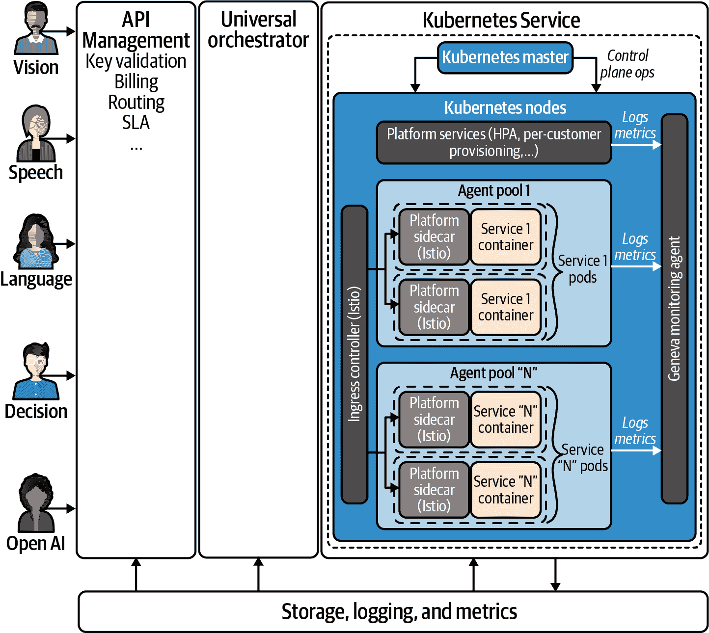
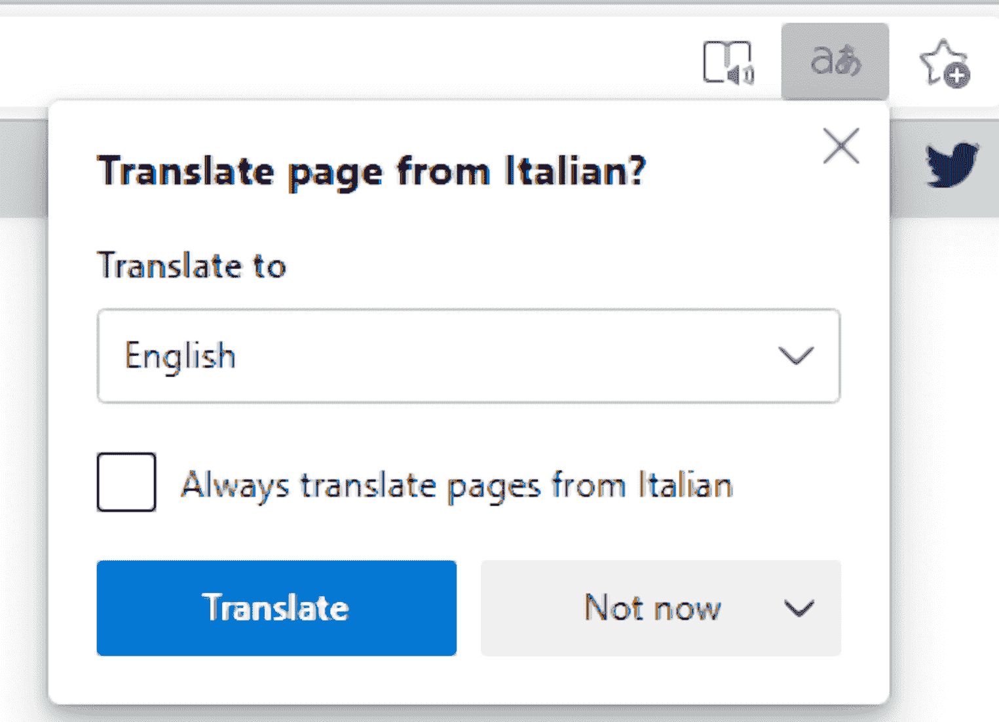

# 第九章：微软如何为数百万用户运行认知服务

在过去的两章中，我们看到了负责任地使用 AI 以及为机器学习提供最佳实践有多么重要，这些实践能够提供一个实用和负责任的 AI 系统。但是在实践中，这样做的基础设施和过程是什么样的呢？

我们在第四章中介绍的 Azure 认知服务在 30 多个 Azure 区域中 24 小时运行，支持微软自己的应用程序功能以及像 Airbus、Progressive Insurance、Uber 和 Vodafone 等大型组织的特性，为数千名员工和数百万名客户提供应用程序支持。

每个月超过 540 亿次认知服务交易；仅语音服务每月转录超过 1800 万小时的语音。决策 API 每天为 Xbox 提供 600 万个个性化体验，而视觉服务为 PowerPoint 和 Word 中的超过 10 亿张图片添加了自动 alt 文本。随着大流行期间 Teams 的使用增长，认知服务的使用量也增加了，因为它为会议中的实时字幕和录制会议的转录提供动力。语音服务必须扩展七倍以处理 Teams 字幕需求，每天在 Azure 上消耗 200 万核心小时的计算资源。

不同的认知服务不断进行更新，包括预览、新功能以及修复底层技术堆栈中的任何漏洞。如果您希望在自己的基础设施上运行自己的机器学习模型或一些认知服务容器，那么您必须自行处理所有这些部署、更新和安全边界。

如果您有数据主权问题或者希望在边缘使用 AI 而没有连接性或需要实时决策——例如在石油钻井平台或工厂生产线上，这一点就显得很重要了。

但是，在您可以运行的认知服务容器中使用的模型已经过优化。如果您使用 Azure Percept IoT 设备在边缘获取 AI 洞见，它们依赖于认知服务，但它们使用的是可以在摄像头上运行而不是在云中强大虚拟机上运行的微小版本的模型。

云服务还能更有效和经济地处理突发的流量。Azure 等超大规模供应商之所以能够更好地购买硬件、网络带宽和电力，是因为它们购买的规模如此之大，甚至具有操作经验——这一点非常重要。如果您只有一个客户并且他们有突发流量，那么拥有容量处理这一流量意味着要为硬件提供资源，这在其他时间可能会被低效利用。云服务因为有数千个客户，因此有更大的缓冲区来处理任何一个客户的需求激增，这意味着以更低的成本提供这种规模。

# 人人都能用 AI

如今的认知服务在 2015 年作为名为 Project Oxford 的四个 API 推出，用于视觉、语音、面部识别和语言理解。不久之后又推出了另外五个 API，然后又推出了另外十几个，使用了微软研究开发的最新技术和模型，并迅速投入生产。但到达 30 个认知服务的时候，每个服务都在四种不同平台的自己的实例上运行，并有自己的支持团队。

在快速开发新产品的过程中会发生这种碎片化，但如果您希望在增长过程中保持质量和效率，这种情况是不可持续的。在 AI 领域总是有新的研究可以使现有服务更加精确，或者为新功能提供动力，客户希望在更多 Azure 区域中可用认知服务，支持更多语言，并提供更多定制模型的选项。

为了满足更多客户的需求，不断推出新服务，以及更新和运营维护以满足 Azure SLA，并履行认证、合规性和数据监管义务，团队创建了一个单一平台用于运行认知服务，其架构可以在 图 9-1 中看到。此外还有一个全天候的售后支持团队，设有轮换的“直接负责人”角色；¹ 负责积极监控日志、响应事件、进行根本原因分析，并跨所有服务分配缺陷，以便将高要求的支持角色分摊给更多人。即使是大型企业运行自己的 AI 系统时，也很难达到这种运营承诺水平。

###### 图 9-1\. 在单一平台上运行使认知服务更易于更新、运营和扩展；这是在单个 Azure 区域中认知服务的架构

构建更加即插即用的基础设施使认知服务适用于一些政府合同所需的“空隙”云环境——在这些环境中，运维团队可能并非机器学习专家——但这也带来了其他好处。这种完全自动化的部署意味着服务运行的任何地方手动部署错误更少，灾难恢复更快。如果整个集群需要重建，只需点击按钮即可运行重建操作，并在新集群可用时将流量发送至新集群。

同样，因为这些空隙部署在同一平台上，它们所需的私有端点等功能可以开发一次，然后为公共云认知服务提供。

使用深度学习来构建所有认知服务模型，使得构建定制模型变得简单，其中一个经过训练的深度神经网络的最终输出层被替换为针对更具体数据进行训练的输出层。这意味着您可以利用经过大型数据集训练的模型（这需要时间），并快速调整它以处理您的特定问题。

认知服务团队还包括一组研究人员，他们被称为“疯狂想法”变成成功项目的书籍中所提到的“Loonshots”内部群体，负责从 Microsoft Research（其使命是展望两三年）引入新的算法、模型和方法，这些服务可以在一年内交付到同一平台上。

# 集群和容器

认知服务平台的架构使用在 Kubernetes 上运行的容器（尽管它使用与 Azure Kubernetes 服务相同的后端，但它是一个独立的部署）。

每个 Azure 区域中都有多个集群，每个集群都有自己的 VM 代理池；一些服务共享集群，而像语音这样的需求更高的服务则在专用集群上运行。

在 Azure 中运行的认知服务容器与您可以在边缘运行的用于托管特定认知服务的容器并不相同，因为 Microsoft 利用其在认知服务平台中构建的编排器来为不同的 VM SKU 分配不同的容器，这些 SKU 可能具有 GPU 和快速本地存储或仅具有 CPU。不同的认知服务被分解为许多微服务，元数据定义了每个服务所需的硬件和软件要求，因此容器可以部署到适当的基础架构上的正确代理池中。一个微服务的容器可能在低功耗 CPU 上运行，而另一个则在配备强大 GPU 的 VM 上运行。

编排器可以向一个容器发送请求，例如作为文本分析服务的一部分进行语言检测，然后将其转发到其他容器进行进一步处理。这符合开发人员在诸如呼叫中心处理等场景中同时使用多个认知服务的方式，其中一个云请求可以调用多个服务，如语音、文本分析、语言理解、翻译和文本转语音。

应用 AI 服务（如表单识别器）也是如何组成的：编排器将客户请求分解为多个认知服务的后台 API 调用，然后将它们合并在一起。这使得构建和推出新的应用 AI 服务变得更容易，因为它们的组合只是编排器可以使用的元数据。

编排器还需要跨个别认知服务 API 进行更多的标准化，以便开发人员调用不同 API 时更加一致。这意味着一旦您熟悉了一个 API，开始使用新 API 时就更容易理解其结构。

使用容器意味着托管认知服务所需的 Linux 虚拟机数量较少，而不是每个服务都在自己的虚拟机中运行。这样做不仅更快速、更高效地进行扩展，而且还能节省成本。

由于启动整个虚拟机以处理增加的流量需要时间，基于虚拟机的服务通常会多运行一些额外的容量作为缓冲，以确保不会丢失客户请求。即使在 Kubernetes 上运行，认知服务仍然需要一定的缓冲容量，因为虽然启动新容器速度很快，但将大型机器学习模型复制到新容器中仍需要时间。但是这种缓冲可以更小，因为不必将模型部署到新容器中，而是可以在容器扩展后再附加。

为如此多的客户运行认知服务意味着微软可以获得大量的遥测数据，这些数据可以用来提高服务的运行效率。随着不同的 Azure VM SKU 变得可用或 SKU 的价格发生变化，他们可以确定在哪种 VM 上运行特定的容器。并非所有 SKU 都在所有 Azure 区域可用；因此，虽然在带 GPU 的 VM 上运行可能会为视觉模型带来更好的性能，但也必须能够在仅有 CPU 的 SKU 上运行，以便能够在更多的区域部署。

这可能意味着不仅需要与构建该认知服务的开发人员联系，还需要与创建模型的研究人员和数据科学家以及像 ONNX 这样的框架团队联系，以确保模型和框架能够在 Azure 的各种硬件上运行。随着新硬件的推出，他们可以进行性能和验证测试，启动 Kubernetes 集群中的新代理池，重新部署服务，并关闭现有的代理池。

使认知服务不仅能够扩展，而且能够运行成本越来越低是使人工智能普及的关键。Edge 浏览器增加了在加载网页时自动将网页翻译成不同语言的功能，您可以在图 9-2 中看到其效果，这迅速使其成为 Translator 服务的最大用户，因此运行费用也随之飙升。通过优化 Translator 在 Azure 上运行于更低性能硬件上的方式，使得服务能够继续在 Edge 上提供，并且能够添加更多语言。

###### 图 9-2\. 将 Translator 服务放入 Edge 浏览器意味着认知服务必须进行扩展，以服务数百万用户而不会让成本失控

在这一章中，我们已经了解了云 AI 服务的构建方式，因此您可以放心依赖它们来实现规模化，以及如果需要在自己的基础设施中运行任何单个认知服务时的权衡。但是，在您自己的应用程序中规模化使用认知服务是什么样子呢？在接下来的章节中，我们将看一些真实世界的例子，解决在移动设备、边缘和云中的问题，这些例子展示了借助这些 AI 服务您可以构建的内容。

¹ 了解更多关于[DRI](https://go.microsoft.com/fwlink/?linkid=2190185)的信息。
